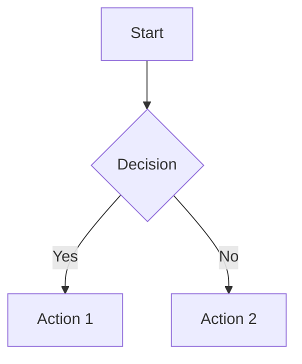

# CLAUDE.md

This file provides guidance to Claude Code (claude.ai/code) when working with code in this repository.

## Repository Status

**IMPORTANT:** Implementation has begun. The repository now contains both architectural planning (RFCs, Missions) and implementation code (crates/). The current focus is on RFC-0104 Deterministic Floating-Point (DFP) implementation starting with the determin/ crate.

## Project Overview

CipherOcto is a planned next-generation private AI assistant platform designed to run across local infrastructure, private cloud, edge deployments, and hybrid blockchain networks. The mission is to build a sovereign intelligence layer where AI agents can reason privately, execute autonomously, coordinate securely, and operate anywhere.

## The Ocean Stack (Conceptual Architecture)

```
User / Organization
↓
CipherOcto Assistant 🐙 (Intelligence Layer)
↓
Agent Orchestrator
↓
Secure Execution Runtime 🦑 (Execution Layer)
↓
Hybrid Network Mesh 🪼 (Network Layer)
(Local Nodes + Blockchain Verification)
```

Design philosophy: **many agents, one intelligence**

## Planned Modules

Not yet implemented - these are architectural plans:

- Assistant Core
- Agent Runtime
- Local Inference Engine
- Secure Execution Sandbox
- Node Identity System (OCTO-ID)
- Hybrid Blockchain Coordination
- Developer SDK
- Deployment Toolkit

## Documentation Structure

Key documentation is in `/docs`:

- `01-foundation/whitepaper/v0.1-draft.md` - Comprehensive whitepaper covering the trust & reputation architecture, autonomous market layer, and data sovereignty via data flagging
- `04-tokenomics/token-design.md` - Detailed multi-token economy design with role-based tokens (OCTO sovereign token + specialized role tokens)

## Core Architectural Concepts

### Data Flagging System

Every dataset/interaction is tagged with privacy levels:
- `PRIVATE` - Encrypted, local-only, never enters marketplace
- `CONFIDENTIAL` - Restricted to trusted agents
- `SHARED` - Allowed marketplace access
- `PUBLIC` - Monetizable dataset

### Proof of Reliability (PoR)

Trust emerges from:
- OCTO-ID (persistent identity)
- Stake (economic commitment)
- Performance (measurable outcomes)
- Reputation Score (long-term trust)
- Social Validation (ecosystem feedback)

### Multi-Token Economy

- `OCTO` - Sovereign token for governance, staking, settlement
- Role tokens (OCTO-A, OCTO-B, OCTO-O, OCTO-W, etc.) - For specialized providers

### Dual-Stake Model

Every participant stakes both OCTO (global alignment) + Role Token (local specialization) to prevent role tourism.

## Development Workflow

### Shell Command Guidelines

**DO NOT use compound shell commands** (e.g., `cd path && command`). Instead:
- Use separate Bash calls sequentially when commands depend on each other
- Use absolute paths to avoid needing `cd`
- If cd is absolutely necessary, use separate tool calls

### Rust Development Commands

**Lint (must pass with zero warnings)**
```bash
cargo clippy --all-targets --all-features -- -D warnings
```

**Format**
```bash
cargo fmt
```

### Documentation Script

```bash
scripts/init-docs.sh
```

Creates the documentation directory structure in `/docs`.

## Repository Conventions

- Marine life emoji theme: 🐙 (assistant), 🦑 (execution), 🪼 (network)
- Project tagline: "Private intelligence, everywhere"
- Philosophy: AI should be private by default, distributed by design, sovereign by choice

## Branch Strategy

CipherOcto uses **Trunk-Based + Feature Streams**:

| Branch | Purpose | Protection |
|--------|---------|------------|
| `main` | Always releasable | PR only, all checks, 1+ approval |
| `next` | Integration lane | CI required, direct push OK |
| `feat/*` | Contributor features | CI required |
| `agent/*` | AI-generated work | CI required + extra review |
| `research/*` | Experimental | CI required |
| `hotfix/*` | Emergency fixes | PR to main |

**Golden Rule:** Nobody pushes directly to `main`.

Full documentation: `.github/BRANCH_STRATEGY.md`
Branch protection rules: `.github/branch-protection-rules.md`

## Documentation Standards

**Diagrams:** Always prefer Mermaid diagrams over ASCII art. Mermaid is:
- Rendered in GitHub, VS Code, and most Markdown viewers
- Easier to maintain and edit
- Consistent with modern documentation practices

**Example:**


**When creating or updating docs:**
- Use `mermaid` code blocks for flowcharts, state diagrams, sequence diagrams
- Avoid ASCII art (`┌─`, `└─`, `─►`, etc.)
- If existing ASCII diagrams exist, convert them to Mermaid

**Markdown Formatting:**
- All markdown files must pass Prettier formatting
- Run `npx prettier --write <file>.md` before committing
- Ensure files end with a newline
- Use consistent heading hierarchy (no skipping levels)

<!-- gitnexus:start -->
# GitNexus — Code Intelligence

This project is indexed by GitNexus as **cipherocto** (2389 symbols, 5708 relationships, 183 execution flows). Use the GitNexus MCP tools to understand code, assess impact, and navigate safely.

> If any GitNexus tool warns the index is stale, run `npx gitnexus analyze` in terminal first.

## Always Do

- **MUST run impact analysis before editing any symbol.** Before modifying a function, class, or method, run `gitnexus_impact({target: "symbolName", direction: "upstream"})` and report the blast radius (direct callers, affected processes, risk level) to the user.
- **MUST run `gitnexus_detect_changes()` before committing** to verify your changes only affect expected symbols and execution flows.
- **MUST warn the user** if impact analysis returns HIGH or CRITICAL risk before proceeding with edits.
- When exploring unfamiliar code, use `gitnexus_query({query: "concept"})` to find execution flows instead of grepping. It returns process-grouped results ranked by relevance.
- When you need full context on a specific symbol — callers, callees, which execution flows it participates in — use `gitnexus_context({name: "symbolName"})`.

## When Debugging

1. `gitnexus_query({query: "<error or symptom>"})` — find execution flows related to the issue
2. `gitnexus_context({name: "<suspect function>"})` — see all callers, callees, and process participation
3. `READ gitnexus://repo/cipherocto/process/{processName}` — trace the full execution flow step by step
4. For regressions: `gitnexus_detect_changes({scope: "compare", base_ref: "main"})` — see what your branch changed

## When Refactoring

- **Renaming**: MUST use `gitnexus_rename({symbol_name: "old", new_name: "new", dry_run: true})` first. Review the preview — graph edits are safe, text_search edits need manual review. Then run with `dry_run: false`.
- **Extracting/Splitting**: MUST run `gitnexus_context({name: "target"})` to see all incoming/outgoing refs, then `gitnexus_impact({target: "target", direction: "upstream"})` to find all external callers before moving code.
- After any refactor: run `gitnexus_detect_changes({scope: "all"})` to verify only expected files changed.

## Never Do

- NEVER edit a function, class, or method without first running `gitnexus_impact` on it.
- NEVER ignore HIGH or CRITICAL risk warnings from impact analysis.
- NEVER rename symbols with find-and-replace — use `gitnexus_rename` which understands the call graph.
- NEVER commit changes without running `gitnexus_detect_changes()` to check affected scope.

## Tools Quick Reference

| Tool | When to use | Command |
|------|-------------|---------|
| `query` | Find code by concept | `gitnexus_query({query: "auth validation"})` |
| `context` | 360-degree view of one symbol | `gitnexus_context({name: "validateUser"})` |
| `impact` | Blast radius before editing | `gitnexus_impact({target: "X", direction: "upstream"})` |
| `detect_changes` | Pre-commit scope check | `gitnexus_detect_changes({scope: "staged"})` |
| `rename` | Safe multi-file rename | `gitnexus_rename({symbol_name: "old", new_name: "new", dry_run: true})` |
| `cypher` | Custom graph queries | `gitnexus_cypher({query: "MATCH ..."})` |

## Impact Risk Levels

| Depth | Meaning | Action |
|-------|---------|--------|
| d=1 | WILL BREAK — direct callers/importers | MUST update these |
| d=2 | LIKELY AFFECTED — indirect deps | Should test |
| d=3 | MAY NEED TESTING — transitive | Test if critical path |

## Resources

| Resource | Use for |
|----------|---------|
| `gitnexus://repo/cipherocto/context` | Codebase overview, check index freshness |
| `gitnexus://repo/cipherocto/clusters` | All functional areas |
| `gitnexus://repo/cipherocto/processes` | All execution flows |
| `gitnexus://repo/cipherocto/process/{name}` | Step-by-step execution trace |

## Self-Check Before Finishing

Before completing any code modification task, verify:
1. `gitnexus_impact` was run for all modified symbols
2. No HIGH/CRITICAL risk warnings were ignored
3. `gitnexus_detect_changes()` confirms changes match expected scope
4. All d=1 (WILL BREAK) dependents were updated

## Keeping the Index Fresh

After committing code changes, the GitNexus index becomes stale. Re-run analyze to update it:

```bash
npx gitnexus analyze
```

If the index previously included embeddings, preserve them by adding `--embeddings`:

```bash
npx gitnexus analyze --embeddings
```

To check whether embeddings exist, inspect `.gitnexus/meta.json` — the `stats.embeddings` field shows the count (0 means no embeddings). **Running analyze without `--embeddings` will delete any previously generated embeddings.**

> Claude Code users: A PostToolUse hook handles this automatically after `git commit` and `git merge`.

## CLI

- Re-index: `npx gitnexus analyze`
- Check freshness: `npx gitnexus status`
- Generate docs: `npx gitnexus wiki`

<!-- gitnexus:end -->
