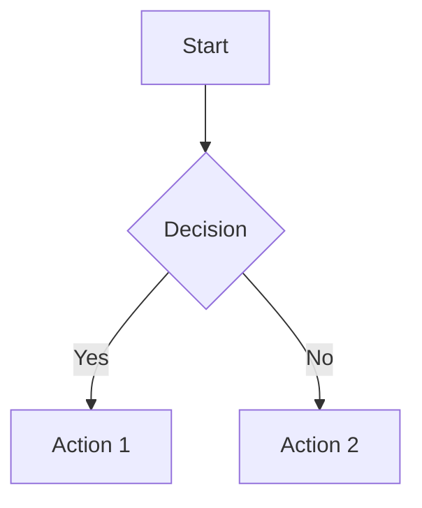

# CLAUDE.md

This file provides guidance to Claude Code (claude.ai/code) when working with code in this repository.

## Repository Status

**IMPORTANT:** Implementation has begun. The repository now contains both architectural planning (RFCs, Missions) and implementation code (crates/). The current focus is on RFC-0104 Deterministic Floating-Point (DFP) implementation starting with the determin/ crate.

## Project Overview

CipherOcto is a planned next-generation private AI assistant platform designed to run across local infrastructure, private cloud, edge deployments, and hybrid blockchain networks. The mission is to build a sovereign intelligence layer where AI agents can reason privately, execute autonomously, coordinate securely, and operate anywhere.

## The Ocean Stack (Conceptual Architecture)

```
User / Organization
↓
CipherOcto Assistant 🐙 (Intelligence Layer)
↓
Agent Orchestrator
↓
Secure Execution Runtime 🦑 (Execution Layer)
↓
Hybrid Network Mesh 🪼 (Network Layer)
(Local Nodes + Blockchain Verification)
```

Design philosophy: **many agents, one intelligence**

## Planned Modules

Not yet implemented - these are architectural plans:

- Assistant Core
- Agent Runtime
- Local Inference Engine
- Secure Execution Sandbox
- Node Identity System (OCTO-ID)
- Hybrid Blockchain Coordination
- Developer SDK
- Deployment Toolkit

## Documentation Structure

Key documentation is in `/docs`:

- `01-foundation/whitepaper/v0.1-draft.md` - Comprehensive whitepaper covering the trust & reputation architecture, autonomous market layer, and data sovereignty via data flagging
- `04-tokenomics/token-design.md` - Detailed multi-token economy design with role-based tokens (OCTO sovereign token + specialized role tokens)

## Core Architectural Concepts

### Data Flagging System

Every dataset/interaction is tagged with privacy levels:
- `PRIVATE` - Encrypted, local-only, never enters marketplace
- `CONFIDENTIAL` - Restricted to trusted agents
- `SHARED` - Allowed marketplace access
- `PUBLIC` - Monetizable dataset

### Proof of Reliability (PoR)

Trust emerges from:
- OCTO-ID (persistent identity)
- Stake (economic commitment)
- Performance (measurable outcomes)
- Reputation Score (long-term trust)
- Social Validation (ecosystem feedback)

### Multi-Token Economy

- `OCTO` - Sovereign token for governance, staking, settlement
- Role tokens (OCTO-A, OCTO-B, OCTO-O, OCTO-W, etc.) - For specialized providers

### Dual-Stake Model

Every participant stakes both OCTO (global alignment) + Role Token (local specialization) to prevent role tourism.

## RFC Process

RFCs follow the process defined in `docs/BLUEPRINT.md`. Key stages:

| Stage | Location | Purpose |
|-------|----------|---------|
| **Planned** | `rfcs/planned/` | Placeholder, defines concept and scope |
| **Draft** | `rfcs/draft/` | Full specification, working implementation |
| **Accepted** | `rfcs/accepted/` | Approved, stable specification |
| **Archived** | `rfcs/archived/` | Rejected, superseded, or deprecated |

**RFC Referencing rule:** When referencing RFCs in prose, cross-references, changelogs, and approval criteria — use only the number. Never include status, version pins, or metadata. Example: `RFC-0909` not `RFC-0903 (Accepted v63)`.

**Why:** Status/version in references causes sync bugs and verbose noise. Only the RFC's own Status header and version history table carry version info.

See `docs/BLUEPRINT.md` §The RFC Process for full lifecycle details.

## Development Workflow

### Shell Command Guidelines

**DO NOT use compound shell commands** (e.g., `cd path && command`). Instead:
- Use separate Bash calls sequentially when commands depend on each other
- Use absolute paths to avoid needing `cd`
- If cd is absolutely necessary, use separate tool calls

### Rust Development Commands

**Lint (must pass with zero warnings)**
```bash
cargo clippy --all-targets --all-features -- -D warnings
```

**Format**
```bash
cargo fmt
```

### Documentation Script

```bash
scripts/init-docs.sh
```

Creates the documentation directory structure in `/docs`.

## Repository Conventions

- Marine life emoji theme: 🐙 (assistant), 🦑 (execution), 🪼 (network)
- Project tagline: "Private intelligence, everywhere"
- Philosophy: AI should be private by default, distributed by design, sovereign by choice

## Branch Strategy

CipherOcto uses **Trunk-Based + Feature Streams**:

| Branch | Purpose | Protection |
|--------|---------|------------|
| `main` | Always releasable | PR only, all checks, 1+ approval |
| `next` | Integration lane | CI required, direct push OK |
| `feat/*` | Contributor features | CI required |
| `agent/*` | AI-generated work | CI required + extra review |
| `research/*` | Experimental | CI required |
| `hotfix/*` | Emergency fixes | PR to main |

**Golden Rule:** Nobody pushes directly to `main`.

Full documentation: `.github/BRANCH_STRATEGY.md`
Branch protection rules: `.github/branch-protection-rules.md`

## Documentation Standards

**Diagrams:** Always prefer Mermaid diagrams over ASCII art. Mermaid is:
- Rendered in GitHub, VS Code, and most Markdown viewers
- Easier to maintain and edit
- Consistent with modern documentation practices

**Example:**

```mermaid
graph TD
    A[Start] --> B{Decision}
    B -->|Yes| C[Action 1]
    B -->|No| D[Action 2]
```

**When creating or updating docs:**
- Use `mermaid` code blocks for flowcharts, state diagrams, sequence diagrams
- Avoid ASCII art (`┌─`, `└─`, `─►`, etc.)
- If existing ASCII diagrams exist, convert them to Mermaid

**Markdown Formatting:**
- All markdown files must pass Prettier formatting
- Run `npx prettier --write <file>.md` before committing
- Ensure files end with a newline
- Use consistent heading hierarchy (no skipping levels)

