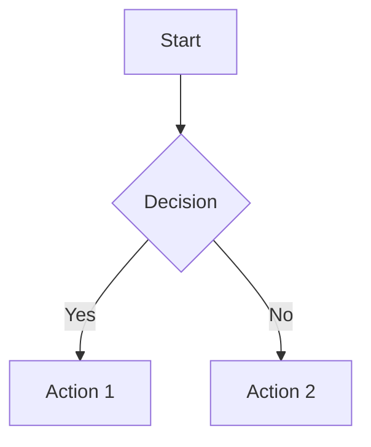

# CLAUDE.md

This file provides guidance to Claude Code (claude.ai/code) when working with code in this repository.

## Repository Status

**IMPORTANT:** Implementation has begun. The repository now contains both architectural planning (RFCs, Missions) and implementation code (crates/). The current focus is on RFC-0104 Deterministic Floating-Point (DFP) implementation starting with the determin/ crate.

## Architectural Principles (Apply from Project Start)

Generic SE principles that guide any new RFC, mission, or crate. Full reference: `~/.claude/projects/.../memory/cipherocto-design-principles.md`.

### Rust crate-level stability (match crate stability to design depth)

| Layer | Scope | Stability | Evolves when |
|---|---|---|---|
| **A** | Crypto primitives + canonical encoding + semantic policies | RFC-frozen, semver-major only (years-stable) | PQC migration (years) |
| **B** | Identity substrate + transport + cable + wallet-core | RFC-driven, additive only (years-stable) | New RFC adds feature |
| **C** | Specialized nodes (one per node role) | Per-RFC | New node type = new RFC + new crate |
| **D** | Transport adapters (BLE/USB/TCP/QUIC/HID/...) | Per-adapter | New adapter = new crate |
| **E** | User extensions + capability variants | Per-extension | New ext = new crate + register |

Layer direction: A → B → C → D/E. Never the reverse. Layer B depends on A (stable substrate); Layer D depends on B (transport trait); Layer E registers into B (registry pattern), doesn't depend on it. Audit question for any new crate or dep: which layer? Does the dependency direction respect the layer model?

**Why this works** — Crypto + identity survive 10-year migrations (PQC, key format evolution); business logic (capability variants, node specializations, user extensions) churns monthly without breaking crypto. The model survives cryptographic-curve transitions by isolating the blast radius to Layer A only.

### User extensibility (per-extension crates + registry)

- Define trait in core: `CapabilitySpec { type_id, validate_witness, ... }`
- Each extension = own crate implementing the trait
- Registry in core: `HashMap<TypeId, Arc<dyn Trait>>`
- Extensions register at startup (init fn, feature flag, or compile-time)
- Core code dispatches via registry lookup; core unchanged when new extensions land

### Extension over enumeration (no central enums)

For types with infinite extension surface, use **typed-discriminator + Raw escape hatch**, not central enums. UUID discriminator (128-bit) per type, RFC-allocated namespace + user extension range. Old code fails-closed on unknown discriminators. Enums are upgrade-hostile — every new type becomes a central edit + cross-crate review.

### Core engineering principles (always)

> **Section refs not line refs** — these principle descriptions reference other RFCs/sections by §section_name or symbol, NEVER by file:line. The same rule applies to principle references themselves (see CLAUDE.md §RFC Reference Conventions Reaffirmed).

1. **Separation of concerns** — each module owns ONE thing; don't conflate parsing/verification/decision/dispatch/policy.
2. **Stable Abstractions Principle** — abstractions depend on stable things, not the reverse. Primitives stable; business logic churns.
3. **No premature coupling** — caller should not reach into callee's dependencies (storage, business state). Go through a protocol boundary.
4. **Open/Closed** — open to extension, closed to modification. New types added without central enum edits.
5. **Dependency Inversion** — depend on abstractions (traits); the side owning data owns the impl.
6. **Interface Segregation** — small focused traits > god-traits.
7. **No god-objects** — split multi-concern structs early (before ~3k lines).
8. **Composition over inheritance** — `Vec<TypedVariant>` with logical-AND semantics for multi-mechanism composition. Inheritance is upgrade-hostile; composition lets new variants land without touching the core type.
9. **Push complexity to edges** — core stays simple; boundaries handle environment messiness.
10. **Discipline at first call site pays off** — don't bypass an abstraction "just once". The second bypass becomes pattern; the third makes the abstraction dead code.
11. **No parallel abstractions** — use existing primitive (general transport, general codec, general identity), don't invent parallel. Parallel abstractions duplicate adapter code and create two health-check systems.
12. **Storage is not a protocol** — direct storage coupling forces business-rule replication. Use typed query/response boundary.
13. **Attenuation invariants cross boundaries** — type-level invariant in module A still enforced by module B consuming A's output.

## Project Overview

CipherOcto is a planned next-generation private AI assistant platform designed to run across local infrastructure, private cloud, edge deployments, and hybrid blockchain networks. The mission is to build a sovereign intelligence layer where AI agents can reason privately, execute autonomously, coordinate securely, and operate anywhere.

## The Ocean Stack (Conceptual Architecture)

```
User / Organization
↓
CipherOcto Assistant 🐙 (Intelligence Layer)
↓
Agent Orchestrator
↓
Secure Execution Runtime 🦑 (Execution Layer)
↓
Hybrid Network Mesh 🪼 (Network Layer)
(Local Nodes + Blockchain Verification)
```

Design philosophy: **many agents, one intelligence**

## Planned Modules

Not yet implemented - these are architectural plans:

- Assistant Core
- Agent Runtime
- Local Inference Engine
- Secure Execution Sandbox
- Node Identity System (OCTO-ID)
- Hybrid Blockchain Coordination
- Developer SDK
- Deployment Toolkit

## Documentation Structure

Key documentation is in `/docs`:

- `01-foundation/whitepaper/v0.1-draft.md` - Comprehensive whitepaper covering the trust & reputation architecture, autonomous market layer, and data sovereignty via data flagging
- `04-tokenomics/token-design.md` - Detailed multi-token economy design with role-based tokens (OCTO sovereign token + specialized role tokens)

## Core Architectural Concepts

CipherOcto-specific manifestations of the **§Architectural Principles** above. When in doubt, defer to the principles.

### Data Flagging System

Every dataset/interaction is tagged with privacy levels:
- `PRIVATE` - Encrypted, local-only, never enters marketplace
- `CONFIDENTIAL` - Restricted to trusted agents
- `SHARED` - Allowed marketplace access
- `PUBLIC` - Monetizable dataset

### Proof of Reliability (PoR)

Trust emerges from:
- OCTO-ID (persistent identity)
- Stake (economic commitment)
- Performance (measurable outcomes)
- Reputation Score (long-term trust)
- Social Validation (ecosystem feedback)

### Multi-Token Economy

- `OCTO` - Sovereign token for governance, staking, settlement
- Role tokens (OCTO-A, OCTO-B, OCTO-O, OCTO-W, etc.) - For specialized providers

### Dual-Stake Model

Every participant stakes both OCTO (global alignment) + Role Token (local specialization) to prevent role tourism.

## RFC Process

RFCs follow the process defined in `docs/BLUEPRINT.md`. Key stages:

| Stage | Location | Purpose |
|-------|----------|---------|
| **Planned** | `rfcs/planned/` | Placeholder, defines concept and scope |
| **Draft** | `rfcs/draft/` | Full specification, working implementation |
| **Accepted** | `rfcs/accepted/` | Approved, stable specification |
| **Archived** | `rfcs/archived/` | Rejected, superseded, or deprecated |

**RFC Referencing rule:** When referencing RFCs in prose, cross-references, changelogs, and approval criteria — use only the number. Never include status, version pins, or metadata. Example: `RFC-0909` not `RFC-0903 (Accepted v63)`.

**Why:** Status/version in references causes sync bugs and verbose noise. Only the RFC's own Status header and version history table carry version info.

See `docs/BLUEPRINT.md` §The RFC Process for full lifecycle details.

## Development Workflow

### Shell Command Guidelines

**DO NOT use compound shell commands** (e.g., `cd path && command`). Instead:
- Use separate Bash calls sequentially when commands depend on each other
- Use absolute paths to avoid needing `cd`
- If cd is absolutely necessary, use separate tool calls

### Rust Development Commands

**Lint (must pass with zero warnings)**
```bash
cargo clippy --all-targets --all-features -- -D warnings
```

**Format**
```bash
cargo fmt
```

### Documentation Script

```bash
scripts/init-docs.sh
```

Creates the documentation directory structure in `/docs`.

## Repository Conventions

- Marine life emoji theme: 🐙 (assistant), 🦑 (execution), 🪼 (network)
- Project tagline: "Private intelligence, everywhere"
- Philosophy: AI should be private by default, distributed by design, sovereign by choice

### Crate dependency rationale

Every `Cargo.toml` dependency entry that is non-trivial should carry a comment explaining **why it's there** (which layer, which RFC mandates it, which substrate). This is what makes the layer model auditable; without rationale comments, dependency direction decays over time. Example:

```toml
# Wallet signing substrate (Layer B years-stable; RFC-0009 §Identity)
ed25519-dalek = { version = "2.2", features = ["serde", "zeroize"] }
```

(The example label uses "Layer B years-stable" — see the crate stability table above for the column this maps to.)

For RFC / mission / specialized-node checklists (mandatory sections, naming conventions, decomposition thresholds, deferral rules, etc.) — see `docs/BLUEPRINT.md` §RFC Process, §Mission Lifecycle, §Multi-Mission Decomposition. CLAUDE.md captures the principles; BLUEPRINT.md is the operational playbook.

## Branch Strategy

CipherOcto uses **Trunk-Based + Feature Streams**:

| Branch | Purpose | Protection |
|--------|---------|------------|
| `main` | Always releasable | PR only, all checks, 1+ approval |
| `next` | Integration lane | CI required, direct push OK |
| `feat/*` | Contributor features | CI required |
| `agent/*` | AI-generated work | CI required + extra review |
| `research/*` | Experimental | CI required |
| `hotfix/*` | Emergency fixes | PR to main |

**Golden Rule:** Nobody pushes directly to `main`. Push + remote writes (`gh pr/issue/release`) require explicit user instruction per [[git-workflow]] + [[feedback_initiation_user_only]].

## RFC Reference Conventions (Reaffirmed)

When referencing RFCs in prose, cross-references, changelogs, and approval criteria — use only the number. Never include status, version pins, or metadata. Example: `RFC-0909` not `RFC-0903 (Accepted v63)`. **Why:** Status/version in references causes sync bugs and verbose noise. Only the RFC's own Status header and version history table carry version info. See **§Architectural Principles** for the broader referencing discipline (no central enums for extension-bearing types; section refs not line refs).

Full documentation: `.github/BRANCH_STRATEGY.md`
Branch protection rules: `.github/branch-protection-rules.md`

## Documentation Standards

**Diagrams:** Always prefer Mermaid diagrams over ASCII art. Mermaid is:
- Rendered in GitHub, VS Code, and most Markdown viewers
- Easier to maintain and edit
- Consistent with modern documentation practices

**Example:**

```mermaid
graph TD
    A[Start] --> B{Decision}
    B -->|Yes| C[Action 1]
    B -->|No| D[Action 2]
```

**When creating or updating docs:**
- Use `mermaid` code blocks for flowcharts, state diagrams, sequence diagrams
- Avoid ASCII art (`┌─`, `└─`, `─►`, etc.)
- If existing ASCII diagrams exist, convert them to Mermaid

**Markdown Formatting:**
- All markdown files must pass Prettier formatting
- Run `npx prettier --write <file>.md` before committing
- Ensure files end with a newline
- Use consistent heading hierarchy (no skipping levels)

