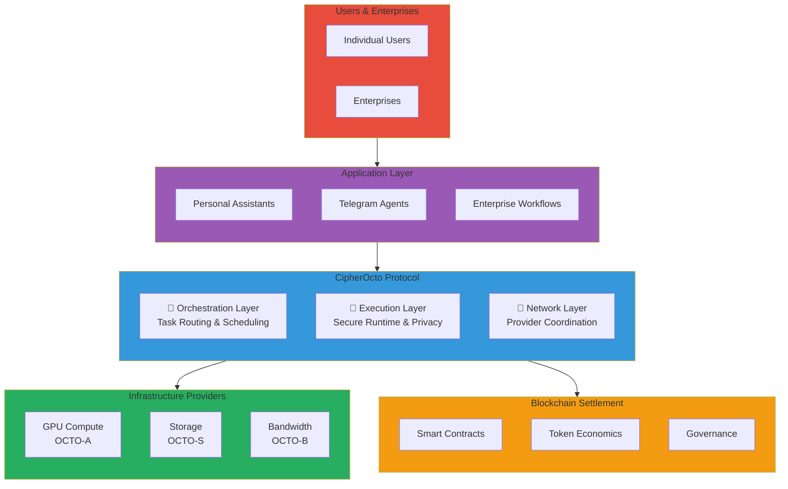

# 🐙 CipherOcto

**Decentralized AI Infrastructure Protocol**

*Compute • Bandwidth • Storage • Intelligence • Governance*

> Decentralized infrastructure for personal AI assistants and autonomous agents.

<p align="center">
  
</p>

<p align="center">
  Sovereign AI • Hybrid Infrastructure • Autonomous Agents
</p>

<p align="center">
  <a href="./docs/01-foundation/whitepaper/v1.0-whitepaper.md"><b>Whitepaper</b></a> •
  <a href="./docs/"><b>Docs</b></a> •
  <a href="./docs/03-technology/system-architecture.md"><b>Architecture</b></a> •
  <a href="./docs/04-tokenomics/token-design.md"><b>Tokenomics</b></a> •
  <a href="https://discord.gg/cipherocto"><b>Join Network</b></a>
</p>

---

## What is CipherOcto?

CipherOcto is a sovereign AI infrastructure protocol that connects private compute, bandwidth, storage, and autonomous agents into a unified decentralized intelligence network.

**CipherOcto aims to become the coordination layer for autonomous AI systems, similar to how Kubernetes orchestrated cloud computing.**

AI that works with your infrastructure — not above it.

---

## Start Here

👤 **Users** → Explore [`examples/`](./examples/) to see what's possible

🧑‍💻 **Developers** → Read [`docs/03-technology/system-architecture.md`](./docs/03-technology/system-architecture.md) + [`docs/07-developers/getting-started.md`](./docs/07-developers/getting-started.md)

🖥️ **Providers** → Learn about network roles in [`docs/04-tokenomics/token-design.md`](./docs/04-tokenomics/token-design.md)

🏢 **Enterprises** → Read the [`docs/01-foundation/whitepaper/v1.0-whitepaper.md`](./docs/01-foundation/whitepaper/v1.0-whitepaper.md)

---

## Mission

Build a sovereign intelligence layer where AI agents can:

- **reason privately**
- **execute autonomously**
- **coordinate securely**
- **operate anywhere**

CipherOcto aims to become the operational layer between AI systems, private compute, and decentralized trust networks.

---

## Why CipherOcto Exists

| Today | CipherOcto |
|-------|-------------|
| Centralized agents run on one platform | Agents run across a global network |
| Centralized compute | Distributed providers |
| Personal assistant | Global intelligence mesh |
| One node | Planet-scale swarm |

---

### The Problem

**The world faces a $400B+ coordination failure:**

- Centralized AI captures most value
- Millions of GPUs sit idle worldwide
- Enterprise AI subscriptions go unused
- Data remains locked in silos
- AI agents cannot collaborate across platforms
- No economic alignment between builders and users

CipherOcto solves the coordination problem — creating a protocol where intelligence flows as easily as data flows across the internet.

---

## First Milestone

**The CipherOcto Node** — The foundational infrastructure piece that enables providers to join the network, accept tasks, and earn rewards.

Everything builds from here.

• **Users & Enterprises** — Access intelligence while maintaining sovereignty
• **AI Hardware Providers** — Monetize idle compute resources
• **Bandwidth Operators** — Earn from network relay and delivery
• **Storage & Memory Nodes** — Profit from encrypted data persistence
• **Orchestrators** — Coordinate task distribution across providers
• **AI Model Wholesalers** — Resell unused enterprise AI quotas
• **Developers** — Publish agents that earn autonomously
• **Governance Participants** — Shape protocol direction

into a single decentralized intelligence economy.

---

## The Ocean Stack

CipherOcto's three-layer architecture:

- 🐙 **Intelligence Layer** — Reasoning & orchestration
- 🦑 **Execution Layer** — Secure agent actions
- 🪼 **Network Layer** — Distributed coordination

**Many agents, one intelligence.**

---

## Architecture (Conceptual)

```text
User / Organization
↓
CipherOcto Assistant 🐙
↓
Agent Orchestrator
↓
Secure Execution Runtime 🦑
↓
Hybrid Network Mesh 🪼
(Local Nodes + Blockchain Verification)
```

Architecture is evolving during the seed phase.

---

## Network Diagram



**The flow:** Users deploy agents → Agents use CipherOcto protocol → Protocol coordinates providers → Blockchain settles transactions.

---

## Ecosystem Roles

| Role | Function | Token |
|------|----------|-------|
| **Bandwidth Providers** | Network backbone | OCTO-B |
| **AI Hardware Providers** | Accelerated compute | OCTO-A |
| **Orchestrators** | Long-running coordination | OCTO-O |
| **AI Wholesalers** | Enterprise AI resale | OCTO-W |
| **Storage Providers** | Encrypted memory & archival | OCTO-S |
| **Marketing Network** | Growth layer | OCTO-M |
| **Developers** | Build ecosystem | OCTO-D |
| **Governance** | DAO voting | OCTO |
| **Node Operators** | Blockchain validation | OCTO-N |

---

## Token Ecosystem

CipherOcto introduces the **OCTO governance token** and a role-based ecosystem of specialized network tokens that align incentives across all infrastructure participants.

Full token architecture described in the [Whitepaper](./docs/01-foundation/whitepaper/v1.0-whitepaper.md).

---

## Use Cases

- **Personal AI Assistants** — Sovereign agents that work for you
- **Enterprise AI** — Private infrastructure for corporate intelligence
- **Agent Networks** — Autonomous agents hiring agents
- **Compute Providers** — Monetize idle hardware
- **OpenClaw Ecosystem** — Infrastructure for personal AI agents
- **Decentralized Cloud** — Sovereign alternative to centralized providers

---

## Roadmap

### Phase 0 — Foundation

- Brand & identity
- Repository initialization
- Architecture definition

### Phase 1 — Core Intelligence

- Agent orchestration prototype
- Local execution runtime
- Private assistant interface

### Phase 2 — Network Layer

- Node coordination
- Identity & trust model
- Hybrid verification mechanisms

### Phase 3 — Ecosystem

- Developer SDK
- Deployment framework
- Community node network

---

## Repository Status

🚧 **Seed Stage Development**

CipherOcto is under active exploration.

You should expect:

- rapid iteration
- experimental modules
- incomplete features
- architectural refactors

Early contributors are helping shape the foundation.

---

## Philosophy

AI should be:

- **private by default**
- **distributed by design**
- **sovereign by choice**

---

## Contributing

CipherOcto is being built in the open.

We welcome:

- architectural discussions
- experimentation
- early prototypes
- research collaboration

See [`docs/07-developers/contributing.md`](./docs/07-developers/contributing.md)

---

## Documentation

```
docs/
├── 01-foundation/
│   ├── whitepaper/          # Complete technical specification
│   ├── litepaper.md         # 10-minute overview
│   ├── manifesto.md         # Philosophy
│   └── roadmap.md           # Development timeline
├── 02-product/             # Product information
├── 03-technology/          # Technical architecture
├── 04-tokenomics/          # Economic model
├── 05-growth/              # Partnerships & content
├── 06-operations/          # Team & operations
├── 07-developers/          # Developer resources
└── 08-investors/           # Investor portal
```

---

## Connect

- **Discord:** [discord.gg/cipherocto](https://discord.gg/cipherocto)
- **Twitter:** [@cipherocto](https://twitter.com/cipherocto)
- **GitHub:** [github.com/CipherOcto](https://github.com/CipherOcto)

---

🐙 **CipherOcto**

*Private intelligence, everywhere.*
