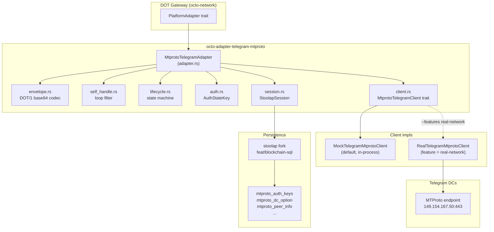

# octo-adapter-telegram-mtproto

Pure-Rust MTProto Telegram adapter for CipherOcto DOT.

Implements [`PlatformAdapter`][platform-adapter] from RFC-0850 §8.2 over the
[`grammers`][grammers] family of crates (no TDLib, no C/C++ toolchain). Co-exists
with the TDLib-based [`octo-adapter-telegram`][tdlib-crate] crate; users select at
config time via `octo.telegram.adapter = mtproto | tdlib`.

[platform-adapter]: ../octo-network
[grammers]: https://crates.io/crates/grammers-client
[tdlib-crate]: ../octo-adapter-telegram

## When to use this crate

Choose **mtproto** (this crate) when:

- You cannot install TDLib (CI runners, alpine containers, cross-compile targets).
- You want a smaller dependency footprint (no TDLib binary, no libc++ runtime).
- You prefer pure-Rust tooling across the whole stack.

Choose **tdlib** (`octo-adapter-telegram`) when:

- You need user-mode sign-in **today** (Phase 1 of this crate is bot-mode only).
- You rely on TDLib-specific features (Telegram's voice/video call hooks,
  secret-chat E2E).

See [RFC-0850ab-c][rfc] for the full rationale and feature matrix.

[rfc]: ../../../rfcs/accepted/networking/0850ab-c-pure-rust-mtproto-telegram-adapter.md

## Quick start (bot mode happy path)

```rust
use std::sync::Arc;
use octo_adapter_telegram_mtproto::{
    MtprotoTelegramAdapter, MtprotoTelegramConfig, MtprotoTelegramClient,
};
use octo_network::dot::adapters::PlatformAdapter;

#[tokio::main]
async fn main() -> Result<(), Box<dyn std::error::Error>> {
    // 1. Configure.
    let cfg = MtprotoTelegramConfig {
        mode: Some("bot".into()),
        bot_token: Some(std::env::var("TELEGRAM_BOT_TOKEN")?),
        api_id: Some(12345),
        api_hash: Some(std::env::var("TELEGRAM_API_HASH")?),
        ..Default::default()
    };
    cfg.validate().map_err(|e| format!("config: {e}"))?;

    // 2. Construct the client. For production, use the real
    //    grammers-backed client (requires `--features real-network`).
    //    For tests, use MockTelegramMtprotoClient (default build).
    let client: Arc<dyn MtprotoTelegramClient> = todo!("real or mock client");

    // 3. Construct the adapter.
    let adapter = MtprotoTelegramAdapter::new(cfg, client);

    // 4. Connect (bot mode: single step).
    adapter.connect_bot_token(&std::env::var("TELEGRAM_BOT_TOKEN")?).await?;

    // 5. Send / receive via the PlatformAdapter trait.
    let domain = adapter.domain_id("-1001234567890"); // a chat_id
    let receipt = adapter.send_envelope(&domain, &envelope).await?;
    let incoming = adapter.receive_messages(&domain).await?;

    Ok(())
}
```

## Architecture



**Four layers**, each independently testable:

1. **`session`** — `StoolapSession`: a `grammers_session::Session` impl backed by
   CipherOcto's stoolap fork on `feat/blockchain-sql`. Persists `DcOption`,
   `PeerInfo`, `UpdatesState`, `ChannelState`, and `home_dc_id`. **No** libsql
   dependency (project-wide cipherocto persistence convention).
2. **`client`** — `MtprotoTelegramClient` trait with two impls: a pure-Rust
   in-memory mock (always available) and a `grammers_client`-backed real client
   (gated behind `--features real-network`). The trait uses only std types — no
   grammers types leak through the boundary — so the `PlatformAdapter` impl is
   unit-testable without a real Telegram DC.
3. **`envelope`** — DOT wire-format codec. `DOT/1/{b64}` text form for
   ≤ 4096-byte payloads; `DOT/2/{msg_id}` document upload for larger.
4. **`adapter`** — `PlatformAdapter` impl that maps between the
   `MtprotoTelegramClient` trait and the DOT contract.

## Configuration

`MtprotoTelegramConfig` mirrors the TDLib adapter's `TelegramConfig` schema plus
additive MTProto-only fields (`api_layer`, `device_model`, `system_version`,
`app_version`). All fields are optional and `#[serde(default)]` so old configs
deserialize cleanly.

```rust
MtprotoTelegramConfig {
    mode: "bot" | "user",                // default: bot
    bot_token: "...",                     // required for mode=bot
    api_id: 12345,                        // from my.telegram.org
    api_hash: "...",                      // from my.telegram.org
    phone: "+15555550100",                // required for mode=user
    data_dir: "/var/lib/cipherocto/tg",   // required for mode=user
    password: "...",                      // optional 2FA (mode=user)
    features: { e2e_chats: false, voice_video: false },
    api_layer: 197,                       // default; pin to lock down
    device_model: "CipherOcto",
    system_version: "1.0",
    app_version: "0.1.0",
    test_dc_url: "https://...",           // override for integration tests
}
```

**Environment variables** (override file config):

| Variable | Maps to |
|----------|---------|
| `TELEGRAM_MODE` | `mode` |
| `TELEGRAM_BOT_TOKEN` | `bot_token` |
| `TELEGRAM_API_ID` | `api_id` |
| `TELEGRAM_API_HASH` | `api_hash` |
| `TELEGRAM_PHONE` | `phone` |
| `TELEGRAM_PASSWORD` | `password` |
| `TELEGRAM_DATA_DIR` | `data_dir` |
| `TELEGRAM_API_LAYER` | `api_layer` |
| `TELEGRAM_DEVICE_MODEL` | `device_model` |
| `TELEGRAM_SYSTEM_VERSION` | `system_version` |
| `TELEGRAM_APP_VERSION` | `app_version` |
| `TELEGRAM_TEST_DC_URL` | `test_dc_url` |

Use `MtprotoTelegramConfig::from_env()` to load from environment, or
`MtprotoTelegramConfig::from_file_or_env(path)` for file-then-env fallback.

## Selecting between mtproto and tdlib

The TDLib adapter's `TelegramConfig` carries an additive `adapter_kind` field
(default `Tdlib`). Set `adapter_kind = "mtproto"` to opt into this crate:

```toml
[telegram]
mode = "bot"
bot_token = "123:ABC"
adapter_kind = "mtproto"   # RFC-0850ab-c: pure-Rust MTProto
```

Or via env: `TELEGRAM_ADAPTER=mtproto`.

## Limitations (Phase 1)

- **Bot mode only.** User-mode sign-in (`request_login_code` /
  `submit_code` / `submit_password`) and QR login are deferred to
  sub-mission `0850ab-c-user`.
- **No HTTP fallback.** The Bot-API HTTP transport is deferred to
  sub-mission `0850ab-c-http`.
- **Peer resolution** (resolving chat_id → `InputPeer` carrying `access_hash`)
  in the real client is stubbed; Phase 1 covers the adapter plumbing +
  mock-based testing. Real send/receive against a Telegram DC requires
  Phase 2 RPC implementations.
- **Streaming media downloads** are out of scope for Phase 1.

## Security

- All credentials (bot_token, api_hash, phone, password) are redacted from
  `Debug` output.
- The 256-byte MTProto `auth_key` is held in an `AuthKeyMaterial` newtype that
  implements `zeroize::ZeroizeOnDrop`.
- `StoolapSession::reset()` (called from `sign_out`) wipes the on-disk store;
  the user cannot be impersonated after sign-out.

## Testing

```bash
# Default tests (no network, in-memory mock + StoolapSession).
cargo test -p octo-adapter-telegram-mtproto --no-default-features

# Real-network compile check (no actual DC connection).
cargo check -p octo-adapter-telegram-mtproto --features real-network

# Integration tests against the Telegram test DC.
# Requires a CI secret token. Gated on the `integration-test` feature.
INTEGRATION_TESTS=1 cargo test -p octo-adapter-telegram-mtproto --features integration-test
```

## License

MIT OR Apache-2.0
