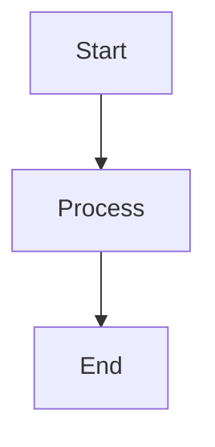

# CipherOcto Documentation Style Guide

This guide ensures consistency across all CipherOcto documentation.

---

## Voice and Tone

### Our Voice

| Attribute | Description |
| ----------- | ----------- |
| **Professional** | Clear, competent, credible |
| **Accessible** | Explain technical concepts clearly |
| **Visionary** | Inspiring but grounded |
| **Direct** | Get to the point, avoid fluff |
| **Inclusive** | "We" not "I", welcoming to all |

### Tone Guidelines

| Context | Tone |
| -------- | ----- |
| **Technical docs** | Precise, instructional |
| **Whitepaper** | Formal, comprehensive |
| **Blog posts** | Engaging, conversational |
| **Social media** | Casual, responsive |
| **Announcements** | Clear, celebratory |

---

## Writing Style

### General Principles

1. **Be concise** — Every word should earn its place
2. **Be clear** — Avoid jargon unless necessary (then explain it)
3. **Be active** — Active voice > passive voice
4. **Be specific** — Examples > abstract descriptions
5. **Be consistent** — Use same terms for same concepts

### Sentence Structure

| Do | Don't |
| ---- | ---- | ---- |
| **Use active voice** | "The protocol processes transactions" | "Transactions are processed by the protocol" |
| **Use simple words** | "Use" instead of "Utilize" | "Utilize" when "use" works |
| **Be direct** | "Stake tokens to earn rewards" | "Tokens can be staked in order to earn rewards" |
| **Use present tense** | "The protocol uses PoR" | "The protocol will use PoR" |

### Paragraph Length

| Content | Paragraph Length |
| ------- | ---------------- |
| **Introduction** | 2-3 sentences |
| **Body paragraphs** | 3-5 sentences |
| **Technical explanations** | 5-7 sentences |

---

## Formatting

### Markdown Conventions

#### Headings

```markdown
# Level 1 (document title only)
## Level 2 (main sections)
### Level 3 (subsections)
#### Level 4 (detailed topics)
```

**Rules:**
- One H1 per document (title)
- Use H2 for main sections
- Don't skip levels (H2 → H4)

#### Emphasis

```markdown
*Italic* for emphasis
**Bold** for key terms
_**Bold and italic**_ for special emphasis
`Code` for inline code
```

#### Links

```markdown
[Link text](https://example.com)
[Link with title](https://example.com "Hover text")
```

#### Lists

**Bullet lists:**
```markdown
- Item one
- Item two
  - Nested item
  - Another nested item
- Item three
```

**Numbered lists:**
```markdown
1. First step
2. Second step
3. Third step
```

**Task lists:**
```markdown
- [ ] Incomplete task
- [x] Completed task
```

#### Tables

```markdown
| Header 1 | Header 2 | Header 3 |
| -------- | -------- | -------- |
| Cell 1   | Cell 2   | Cell 3   |
| Cell 4   | Cell 5   | Cell 6   |
```

**Rules:**
- Include blank line before and after tables
- Column alignment optional (but nice)
- Max 5-6 columns for readability

#### Code Blocks

````markdown
```language
code here
```
````

**Supported languages:**
- `typescript` / `js`
- `python` / `py`
- `rust` / `rs`
- `bash` / `sh`
- `yaml` / `yml`
- `json`
- `text` (no syntax highlighting)

#### Blockquotes

```markdown
> Blockquote for quotes
>> Nested blockquote
```

#### Horizontal Rules

```markdown
---
```

---

## Diagrams

### Mermaid Diagrams

**Use Mermaid for:**
- Flowcharts
- Sequence diagrams
- State diagrams
- Mind maps
- Pie charts
- Timelines
- Graph relationships

**Example:**

````markdown

````

### ASCII Art

**Use for:**
- Simple diagrams when Mermaid unavailable
- Text-based documentation
- Email communications

---

## Code Examples

### TypeScript

```typescript
// Use JSDoc comments
/**
 * Calculates rewards based on stake
 * @param stake - Amount staked
 * @param rate - Reward rate
 * @returns Calculated reward
 */
function calculateReward(stake: number, rate: number): number {
  return stake * rate;
}
```

### Python

```python
# Use docstrings
def calculate_reward(stake: int, rate: float) -> float:
    """Calculate reward based on stake and rate.

    Args:
        stake: Amount staked
        rate: Reward rate

    Returns:
        Calculated reward amount
    """
    return stake * rate
```

### Bash

```bash
# Use comments for explanation
# Install dependencies
npm install

# Run tests
npm test
```

---

## Terminology

### Standard Terms

| Term | Usage |
| ---- | ----- |
| **CipherOcto** | Capitalized, no space |
| **OCTO** | All caps for token symbol |
| **OCTO-A** | Role tokens (hyphenated) |
| **Ocean Stack** | Capitalized, our architecture |
| **PoR** | Proof of Reliability |
| **PoUW** | Proof of Useful Work |
| **TEE** | Trusted Execution Environment |
| **ZK** | Zero-Knowledge |

### Emoji Usage

| Emoji | Usage | Placement |
| ----- | ----- | --------- |
| 🐙 | Intelligence Layer | In headings, diagrams |
| 🦑 | Execution Layer | In headings, diagrams |
| 🪼 | Network Layer | In headings, diagrams |
| ✅ | Positive indicator | In lists, tables |
| ❌ | Negative indicator | In lists, tables |
| 🔥 | Burn mechanism | In tokenomics |
| ⚠️ | Warning | In warnings, notes |

---

## Document Structure

### Standard Template

```markdown
# Title

**Version:** X.X
**Last Updated:** YYYY-MM-DD
**Status:** Draft | Published | Deprecated

## Overview
2-3 sentence summary

## Table of Contents
[Auto-generated or manual]

## Sections
Use H2 for main sections

## Code Examples
Include working examples

## See Also
Links to related docs

---

*Footer notes or attribution*
```

---

## Common Patterns

### Callouts

**Note:**
```markdown
> **Note:** Additional information
```

**Warning:**
```markdown
> **Warning:** Important caution
```

**Tip:**
```markdown
> **Tip:** Helpful suggestion
```

### Version Info

```markdown
**Version:** 1.0
**Last Updated:** February 2026
**Status:** Draft
```

### Status Badges

```markdown
| Status | Description |
| -------- | ----------- |
| ✅ Complete | Feature implemented |
| 🔄 In Progress | Currently being worked on |
| 📅 Planned | Scheduled for future |
| ❌ Deprecated | No longer supported |
```

---

## Accessibility

### Guidelines

| Practice | Implementation |
| ---------- | --------------- |
| **Alt text** | Describe images and diagrams |
| **Headers** | Use proper heading hierarchy |
| **Links** | Descriptive link text (not "click here") |
| **Contrast** | High contrast for readability |
| **Font size** | Default to readable sizes |

### Link Text

| Good | Bad |
| ---- | --- |
| [Read the whitepaper](...) | [Click here](...) |
| [Download the SDK](...) | [Go to this link](...) |
| [Join Discord](...) | [Link](...) |

---

## Localization Considerations

When writing for translation:

1. **Keep sentences short** — Easier to translate
2. **Avoid idioms** — Not universal across languages
3. **Use simple words** — Reduces translation errors
4. **Define terms** — Consistent terminology helps
5. **Provide context** — Comments for translators

---

## Review Process

### Before Publishing

- [ ] Spelling and grammar check
- [ ] Links verified
- [ ] Code examples tested
- [ ] Diagrams render correctly
- [ ] Consistent terminology
- [ ] Follows this style guide

### Peer Review

- Technical docs: Reviewed by subject matter expert
- Code examples: Reviewed by engineer
- User-facing docs: Reviewed by UX writer

---

## Tools

### Recommended Tools

| Tool | Purpose |
| ---- | ------- |
| **markdownlint** | Lint markdown files |
| **Hemingway Editor** | Improve readability |
| **Grammarly** | Grammar checking |
| **Mermaid Live Editor** | Preview diagrams |
| **VS Code** | Editing with extensions |

### markdownlint Configuration

```json
{
  "default": true,
  "MD013": { "line_length": 120 },
  "MD033": false,
  "MD041": false
}
```

---

## Resources

- [Markdown Guide](https://www.markdownguide.org/)
- [Mermaid Documentation](https://mermaid.js.org/)
- [Google Developer Documentation Style Guide](https://developers.google.com/tech-writing/one)
- [Microsoft Writing Style Guide](https://docs.microsoft.com/en-us/style-guide/)

---

**Questions?** Contact the documentation team or open an issue.

---

*Last updated: February 2026*
