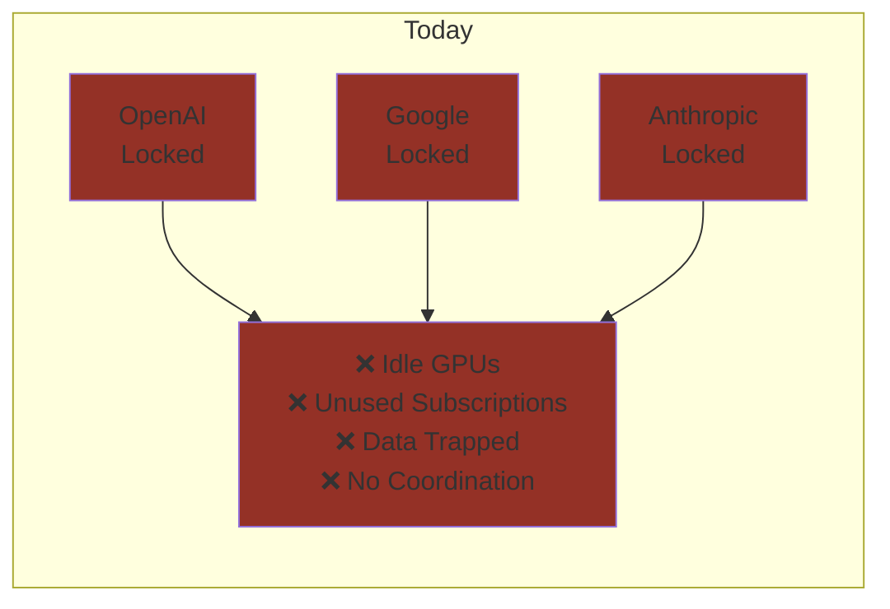
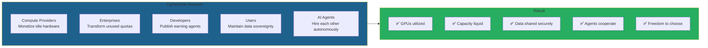
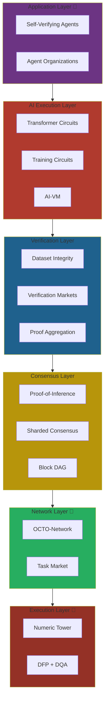
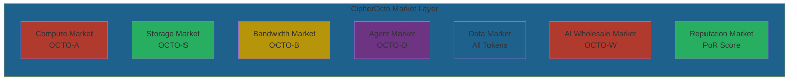
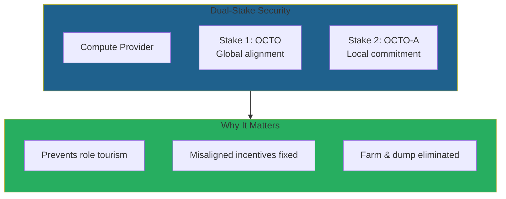
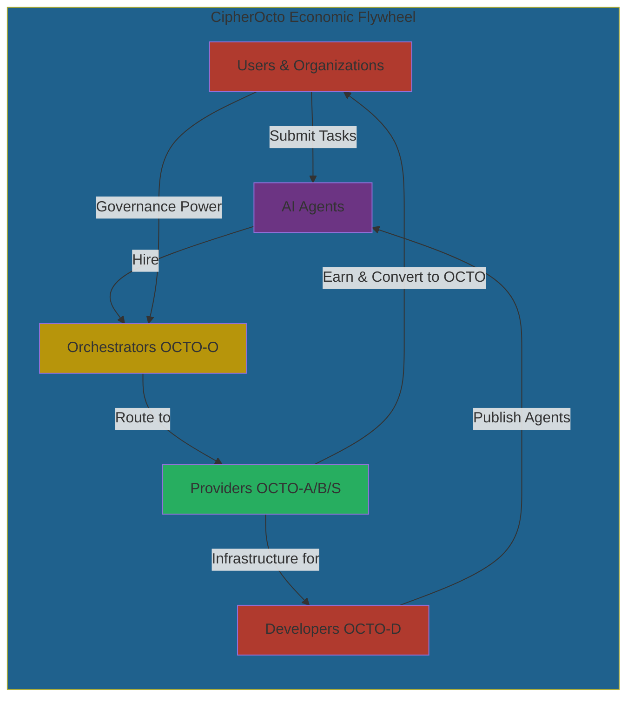
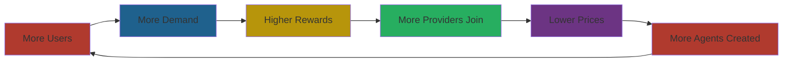
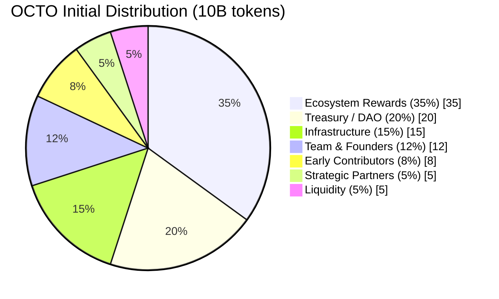
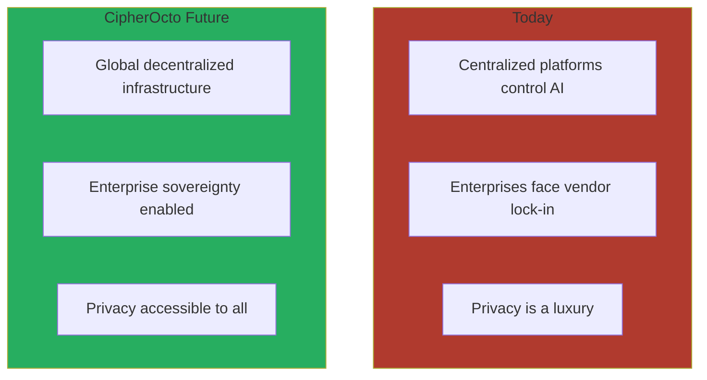

# 🐙 CipherOcto Litepaper

**Version:** 1.1
**Date:** March 2026
**Read Time:** 10 minutes

**STATUS: Seed Phase | Protocol Design Complete | Implementation Starting**

---

## What is CipherOcto?

**CipherOcto is a decentralized AI infrastructure network that converts idle compute, bandwidth, storage, and AI access into a unified sovereign intelligence economy.**

We are building the coordination protocol for global machine intelligence — enabling AI agents, compute providers, storage operators, and enterprises to cooperate autonomously without centralized intermediaries.

**Think of CipherOcto as the TCP/IP for AI:** the invisible infrastructure layer that allows intelligence to flow between participants as effortlessly as data flows across the internet.

**CipherOcto transforms fragmented AI services into a unified decentralized intelligence economy powered by agents, providers, and sovereign users.**

**CipherOcto is not a chatbot or personal assistant. It is the infrastructure layer powering the next generation of AI agents.**

CipherOcto can operate as a personal AI assistant similar to emerging open assistant systems, but extends beyond them by transforming assistants into participants of a global autonomous infrastructure economy.

---

## Development Progress

| Milestone                                      | Status     |
| ---------------------------------------------- | ---------- |
| Architecture Defined (RFC-0000 (Process/Meta)) | ✓ Complete |
| Token Model Designed                           | ✓ Complete |
| Documentation Layer                            | ✓ Active   |
| RFC Stack (0147 RFCs)                          | ✓ Complete |
| Implementation Roadmap                         | ✓ Complete |
| Agent Prototype Phase                          | → Next     |
| Provider Network Alpha                         | → Planned  |
| Marketplace Launch                             | → Roadmap  |

### Technical Foundation Complete

CipherOcto's protocol stack is now fully specified:

| Layer              | RFCs            | Status |
| ------------------ | --------------- | ------ |
| Deterministic Math | 0104-0106       | ✓      |
| AI Execution       | 0120, 0131-0132 | ✓      |
| Consensus          | 0130, 0140-0143 | ✓      |
| Economy            | 0144-0147       | ✓      |
| Agents             | 0134, 0118      | ✓      |

**See [RFC-0004 (Process/Meta): Implementation Roadmap](../rfcs/0004-implementation-roadmap.md) for the 6-phase implementation plan.**

---

## Why Now?

The timing for CipherOcto is not accidental. Five convergent forces make decentralized AI infrastructure inevitable:

| Force                           | 2025 Reality                                     | Why It Matters                         |
| ------------------------------- | ------------------------------------------------ | -------------------------------------- |
| **Local AI Explosion**          | Open-weight models (Llama, Mistral) run anywhere | AI no longer requires centralized APIs |
| **Edge Compute Rise**           | Consumer devices now AI-capable                  | Intelligence moving to the edge        |
| **Enterprise Privacy Pressure** | Data cannot leave corporate boundaries           | Sovereign infrastructure required      |
| **GPU Scarcity**                | Demand exceeds supply by 3-5x                    | Idle capacity must be mobilized        |
| **AI Becoming Infrastructure**  | AI embedded in every business process            | Coordination layer essential           |

**This transforms the project perception from idea → inevitable movement.**

---

## The Fragmented Intelligence Problem

Today's AI economy faces a fundamental market failure.

**The Current Reality:**

| Failure                               | Impact                         |
| ------------------------------------- | ------------------------------ |
| **AI locked behind centralized APIs** | No portability, vendor lock-in |
| **Unused GPU capacity globally**      | 40-60% of compute sits idle    |
| **Unused enterprise quotas**          | $15-20B wasted annually        |
| **Siloed SaaS subscriptions**         | No market for AI resources     |
| **No sovereign AI ownership**         | Platforms control intelligence |

**The cost:** A $400B+ coordination failure that grows daily.


```mermaid
graph LR
    subgraph FRAGMENTED["Today"]
        O[OpenAI<br/>Locked]
        G[Google<br/>Locked]
        A[Anthropic<br/>Locked]
        X[❌ Idle GPUs<br/>❌ Unused Subscriptions<br/>❌ Data Trapped<br/>❌ No Coordination]
    end

    O --> X
    G --> X
    A --> X

    style O fill:#943126
    style G fill:#943126
    style A fill:#943126
    style X fill:#943126
```

**This is not just inefficiency. This is a market failure that CipherOcto must exist to solve.**

---

## Why CipherOcto Can Succeed

Decentralized AI infrastructure is not just possible—it is inevitable because structural forces align:

| Factor                                          | Reality                                            |
| ----------------------------------------------- | -------------------------------------------------- |
| **No single company can own AI infrastructure** | AI is too critical for centralized control         |
| **Idle global compute exists**                  | $50B+ in wasted capacity annually                  |
| **Enterprises demand sovereignty**              | Data privacy requirements intensifying             |
| **Agents require marketplaces**                 | Multi-agent coordination needs economic primitives |
| **Open ecosystems compound faster**             | Developer velocity outpaces centralized R&D        |

**The question is not whether decentralized AI infrastructure will emerge. The question is who will coordinate it.**

---

## The CipherOcto Solution


```mermaid
graph LR
    subgraph UNIFIED["CipherOcto Network"]
        direction TB
        U1[Compute Providers<br/>Monetize idle hardware]
        U2[Enterprises<br/>Transform unused quotas]
        U3[Developers<br/>Publish earning agents]
        U4[Users<br/>Maintain data sovereignty]
        U5[AI Agents<br/>Hire each other autonomously]
    end

    subgraph OUTCOME["Result"]
        direction TB
        R1[✅ GPUs utilized]
        R2[✅ Capacity liquid]
        R3[✅ Data shared securely]
        R4[✅ Agents cooperate]
        R5[✅ Freedom to choose]
    end

    UNIFIED --> OUTCOME

    style UNIFIED fill:#1f618d
    style OUTCOME fill:#27ae60
```

### How It Works

1. **Providers** connect idle compute, storage, or bandwidth to the network
2. **Enterprises** list unused AI quotas on the marketplace
3. **Developers** publish AI agents that earn autonomously
4. **Users** submit tasks while maintaining data sovereignty
5. **Protocol** coordinates everything automatically
6. **Everyone earns** based on their contribution

**No intermediaries. No platform rent-seeking. Just economic coordination.**

---

## Network Effects

CipherOcto strengthens through three compounding loops:

### Supply Loop

**More providers → lower costs → more users → more providers**

As additional compute, storage, and bandwidth providers join the network, costs decrease through competition. Lower costs attract more users, which creates additional demand for providers—creating a virtuous cycle.

### Innovation Loop

**More builders → more agents → more demand → more builders**

As developers publish specialized agents, the network becomes more valuable to users. Increased user demand attracts more developers, who build more agents—accelerating innovation faster than any centralized competitor.

### Data Loop

**More public data → smarter agents → higher utility → more data**

As organizations and individuals share public datasets on the marketplace, agents become more capable. Increased capability attracts more users, who contribute additional data—creating a compounding intelligence advantage.

**These three loops operate simultaneously. Each reinforces the others.**

---

## How Users Interact with CipherOcto

### Individual User

1. **Discover agents** — Browse marketplace for specialized AI
2. **Choose privacy level** — Flag data PRIVATE, CONFIDENTIAL, SHARED, or PUBLIC
3. **Submit tasks** — Agents execute while maintaining sovereignty
4. **Earn from data** — Public datasets generate passive revenue
5. **Own everything** — Agent state, memory, and reputation are portable

**Result:** AI that works for you—not a platform.

### Organization

1. **Deploy internal agents** — Specialized AI per department
2. **Private AI infrastructure** — Data never leaves corporate boundaries
3. **Cost reduction vs SaaS** — 30-50% savings through efficiency
4. **Internal marketplace** — Departments trade compute and data
5. **Compliance native** — SOC2, HIPAA, GDPR built-in

**Result:** Enterprise AI independence.

### Builder

1. **Deploy agent** — Publish to marketplace once
2. **Earn immediately** — Revenue from first execution
3. **Compose freely** — Hire other agents for complex tasks
4. **Accumulate reputation** — Early adopters gain permanent advantage
5. **Own your work** — Agent identity and earnings are portable

**Result:** Build once, earn continuously.

---

## A Concrete Example

**Scenario:** A mid-market financial services company needs AI-powered document analysis but cannot send sensitive data to external providers.

**With CipherOcto:**

1. Company flags documents as CONFIDENTIAL—processed only by verified high-reputation agents
2. Internal analysis agent runs on company-owned GPUs (OCTO-A providers)
3. Encrypted memory stores analysis results (OCTO-S storage)
4. Agent hires specialized validation agent for regulatory compliance check
5. Company monetizes anonymized public datasets on Data Market
6. Result: 40% cost reduction while maintaining complete data sovereignty

**Without CipherOcto:** Company pays premium for on-premises AI or accepts data privacy risks.

---

## The Octopus: Symbolism of Distributed Intelligence

The octopus embodies principles central to CipherOcto's design:

| Principle                      | Manifestation                                                        |
| ------------------------------ | -------------------------------------------------------------------- |
| **Decentralized intelligence** | No central brain—decision-making distributed across arms             |
| **Adaptive coordination**      | Each arm operates independently while pursuing shared goals          |
| **Multi-arm execution**        | Parallel problem-solving across multiple domains simultaneously      |
| **Distributed cognition**      | Knowledge and capability emerge from the network, not a single point |

The octopus is not just a mascot. It represents a fundamentally different approach to intelligence coordination—one where no single component controls the system, yet the entire organism operates as a unified intelligence.

---

## Hybrid Intelligence Architecture

CipherOcto is designed as a **coordination protocol for the global intelligence economy**, where multiple forms of computation and trust coexist.

Rather than assuming all AI computation can be deterministic or cryptographically verifiable, CipherOcto acknowledges that intelligence exists across a **spectrum of verifiability**.

Some computations can be proven mathematically, while others rely on reputation, replication, or trusted execution environments. The protocol is designed to support all of these models simultaneously.

This hybrid architecture allows CipherOcto to bootstrap using existing AI systems while progressively enabling fully verifiable AI computation.

---

### The Intelligence Trust Spectrum

CipherOcto introduces a layered trust model for AI execution.

Not all AI outputs can be proven deterministically. Therefore the protocol supports multiple verification models.

| Trust Level | Model                      | Description                                                   |
| ----------- | -------------------------- | ------------------------------------------------------------- |
| Level 5     | Cryptographic Verification | Deterministic inference verified through cryptographic proofs |
| Level 4     | Deterministic Execution    | Reproducible computation validated by consensus               |
| Level 3     | Replicated Inference       | Multiple independent providers execute the same task          |
| Level 2     | Trusted Providers          | Execution by reputable providers with economic staking        |
| Level 1     | Opaque APIs                | Closed-source AI services with no verification                |

CipherOcto routes tasks across this spectrum based on cost, trust requirements, and availability.

Users and agents can define **trust policies** that determine how tasks are executed.

Example:

```
task:
  type: research
  trust_level: 3
  budget: $1
```

The network automatically selects the appropriate execution model.

---

### The Ocean Stack

CipherOcto's architecture is organized into a modular stack that separates applications, intelligence orchestration, and infrastructure.

```
Applications
     │
Agent Economy
     │
Hybrid Intelligence Layer
     │
Execution Layer
     │
Infrastructure Markets
     │
Peer Network
```

Each layer serves a distinct role in the system.

---

### Agent Economy

Agents are autonomous software entities that perform tasks, provide services, and interact economically within the CipherOcto network.

Agents can represent:

- AI assistants
- automated workflows
- enterprise services
- research systems
- infrastructure brokers

Agents can buy and sell services including:

- inference
- data access
- computation
- storage
- network bandwidth

The agent economy forms the **primary demand layer** of the protocol.

---

### Hybrid Intelligence Layer

The Hybrid Intelligence Layer orchestrates how tasks are executed across different trust models.

This layer selects the appropriate execution method based on task requirements.

Execution strategies may include:

**Verified Inference**

Deterministic models running in a verifiable AI virtual machine with cryptographic proof generation.

**Replicated Inference**

Multiple independent providers execute the same task. Results are compared and consensus is determined.

**Trusted Provider Execution**

Tasks are executed by providers with reputation, staking, and service guarantees.

**External AI APIs**

Closed-source AI services are integrated through standardized connectors.

This design allows CipherOcto to integrate with existing AI ecosystems while gradually transitioning toward fully verifiable AI.

---

### Infrastructure Markets

CipherOcto provides decentralized markets for computing infrastructure.

These markets allow participants to provide and consume resources including:

- GPU compute
- CPU compute
- AI accelerators
- storage
- network bandwidth
- edge compute

Infrastructure providers publish capabilities and pricing to the network.

Agents dynamically acquire infrastructure resources to execute workloads.

These markets operate independently of the AI economy and can support a wide range of applications beyond AI.

---

### AI Accelerator Marketplace

High-performance hardware plays a critical role in AI computation.

CipherOcto supports an open marketplace for specialized compute resources including:

- GPUs
- TPUs
- AI ASICs
- edge neural processing units

Providers can offer resources through several market types:

**Spot compute**

Short-duration inference workloads.

**Reserved compute**

Dedicated compute capacity for longer tasks.

**Compute futures**

Forward contracts for guaranteed compute availability.

This marketplace enables global access to AI hardware and reduces barriers to entry for developers and agents.

---

### Integration with External AI Providers

CipherOcto is designed to interoperate with existing AI ecosystems.

Closed-source models and APIs can be accessed through standardized gateways.

Examples include:

- proprietary language models
- enterprise AI services
- specialized vertical models

These services can be used directly by agents or integrated into multi-provider execution strategies.

External providers may participate in the network by offering services, staking reputation, and participating in verification markets.

This approach allows CipherOcto to leverage existing AI innovation while building decentralized alternatives.

---

### Bootstrapping the Network

In its early stages, CipherOcto may rely heavily on existing AI services to power agent capabilities.

Agents can call external APIs to perform reasoning, generation, or analysis tasks.

As the network evolves, more workloads will migrate toward decentralized infrastructure and verifiable AI execution.

This gradual transition ensures practical usability from the beginning while enabling long-term decentralization.

---

### Verification Economy

Verification is an independent economic activity within the network.

Participants can earn rewards by validating computation and challenging incorrect results.

Verification mechanisms include:

- cryptographic proof validation
- replicated inference consensus
- dispute resolution challenges

This creates a robust incentive structure that improves reliability and trust across the ecosystem.

---

### Evolution Toward Verifiable AI

CipherOcto is designed with a long-term objective of enabling cryptographically verifiable AI computation.

As advances in deterministic machine learning and proof systems mature, more workloads can transition to fully verifiable execution.

The hybrid architecture ensures that this transition can occur gradually without disrupting the broader ecosystem.

This approach allows CipherOcto to remain compatible with both current AI systems and future verifiable intelligence infrastructure.

---

## The Architecture: Ocean Stack

CipherOcto's architecture consists of **seven layers**:


```mermaid
graph TB
    subgraph APP["Application Layer 🐙"]
        A1[Self-Verifying Agents]
        A2[Agent Organizations]
    end

    subgraph AI["AI Execution Layer"]
        AI1[Transformer Circuits]
        AI2[Training Circuits]
        AI3[AI-VM]
    end

    subgraph VERIFY["Verification Layer"]
        V1[Dataset Integrity]
        V2[Verification Markets]
        V3[Proof Aggregation]
    end

    subgraph CONSENSUS["Consensus Layer"]
        C1[Proof-of-Inference]
        C2[Sharded Consensus]
        C3[Block DAG]
    end

    subgraph NET["Network Layer 🪼"]
        N1[OCTO-Network]
        N2[Task Market]
    end

    subgraph EXEC["Execution Layer 🦑"]
        E1[Numeric Tower]
        E2[DFP + DQA]
    end

    APP --> AI --> VERIFY --> CONSENSUS --> NET --> EXEC

    style APP fill:#6c3483
    style AI fill:#b03a2e
    style VERIFY fill:#1f618d
    style CONSENSUS fill:#b7950b
    style NET fill:#27ae60
    style EXEC fill:#943126
```

**Many agents, one intelligence.**

### Key Technical Innovations

| Component                 | RFC                      | Description                                              |
| ------------------------- | ------------------------ | -------------------------------------------------------- |
| **Proof-of-Inference**    | RFC-0630 (Proof Systems) | AI inference replaces hash computation as consensus work |
| **Deterministic AI-VM**   | RFC-0520 (AI Execution)  | Hardware-agnostic AI execution with bit-exact results    |
| **Transformer Circuits**  | RFC-0107 (Numeric/Math)  | STARK-efficient transformer proofs                       |
| **Proof Aggregation**     | RFC-0650 (Proof Systems) | O(1) verification for batched proofs                     |
| **Hardware Registry**     | RFC-0845 (Networking)    | Intelligent task routing to capable workers              |
| **Self-Verifying Agents** | RFC-0416 (Agents)        | Agents that prove their reasoning                        |

**See [RFC-0000 (Process/Meta): Architecture Overview](../rfcs/0000-cipherocto-architecture-overview.md) for the complete technical specification.**

---

## Encrypted Memory Layer

CipherOcto does not only execute intelligence — it remembers it.

### Persistent Intelligence Infrastructure

Beyond compute coordination, CipherOcto provides encrypted memory that enables:

| Capability                         | Description                                 |
| ---------------------------------- | ------------------------------------------- |
| **AI Memory Persistence**          | Agents maintain state across sessions       |
| **Agent State Continuity**         | Pause and resume without losing context     |
| **Encrypted Knowledge Vaults**     | Store proprietary insights securely         |
| **Blockchain Historical Archival** | Immutable records of intelligence evolution |
| **Long-Term Reasoning Storage**    | Multi-week deliberation and analysis        |

### Why Memory Matters

Memory = moat. Storage = recurring revenue.

Competitors can copy compute protocols. They cannot replicate accumulated persistent intelligence across a decentralized network. The OCTO-S token creates durable defensibility through encrypted memory that becomes more valuable as the network grows.

---

## For Users & Organizations

### Individual Users

| Capability                           | Benefit                                        |
| ------------------------------------ | ---------------------------------------------- |
| **Launch agents without infra**      | No servers, no DevOps, no infrastructure costs |
| **Choose privacy level**             | PRIVATE → CONFIDENTIAL → SHARED → PUBLIC       |
| **Monetize public datasets**         | Your data earns when shared in marketplace     |
| **Own AI memory permanently**        | Agent state persists across providers          |
| **Switch providers without lock-in** | Portable agent identity and reputation         |

### Enterprise Organizations

| Capability                       | Benefit                                       |
| -------------------------------- | --------------------------------------------- |
| **Team accounts**                | Multi-user organizational OCTO-ID             |
| **Department agents**            | Specialized AI per business unit              |
| **Shared encrypted memory**      | Collaborative knowledge vaults                |
| **Internal AI marketplace**      | Departments trade compute and data internally |
| **Compliance-native deployment** | SOC2, HIPAA, GDPR built-in                    |

### Data Classification Economy

Your data choice determines economic outcome:

| Data Mode        | Access                 | Economic Outcome                         |
| ---------------- | ---------------------- | ---------------------------------------- |
| **PRIVATE**      | Single-agent use only  | No monetization, maximum privacy         |
| **CONFIDENTIAL** | Owner-specified agents | Selective collaboration, premium pricing |
| **SHARED**       | Verified agents        | Revenue eligible, licensed usage         |
| **PUBLIC**       | Open to all            | Marketplace asset, maximum monetization  |

This is a fundamental advantage: competitors force binary privacy choices. CipherOcto enables granular economic control over every dataset.

---

## The CipherOcto Market Layer

CipherOcto operates as multiple interconnected markets:


```mermaid
graph TB
    subgraph MARKETS["CipherOcto Market Layer"]
        direction TB
        M1[Compute Market<br/>OCTO-A]
        M2[Storage Market<br/>OCTO-S]
        M3[Bandwidth Market<br/>OCTO-B]
        M4[Agent Market<br/>OCTO-D]
        M5[Data Market<br/>All Tokens]
        M6[AI Wholesale Market<br/>OCTO-W]
        M7[Reputation Market<br/>PoR Score]
    end

    style MARKETS fill:#1f618d
    style M1 fill:#b03a2e
    style M2 fill:#27ae60
    style M3 fill:#b7950b
    style M4 fill:#6c3483
    style M5 fill:#1f618d
    style M6 fill:#b03a2e
    style M7 fill:#27ae60
```

Each market operates independently while sharing the same trust infrastructure, identity system, and settlement layer. This modular design allows markets to evolve without disrupting others.

---

## Trust & Verification

CipherOcto operates on zero-trust principles. Every claim is verifiable.

| Mechanism                          | What It Secures                             |
| ---------------------------------- | ------------------------------------------- |
| **Staking Requirements**           | Economic commitment to honest behavior      |
| **Reputation Scoring**             | Track record influences routing priority    |
| **Cryptographic Proof of Service** | ZK proofs verify work was completed         |
| **Slashing Mechanisms**            | Misbehavior results in stake forfeiture     |
| **Encrypted Memory Guarantees**    | Data never accessible without authorization |

**Attacking CipherOcto requires defeating cryptographic proofs, reputation history, economic stakes, identity verification, and community consensus—simultaneously.**

---

## The Token System

### The Economic Organism

CipherOcto operates as a multi-role economic organism where each token represents a biological function of a distributed intelligence system:

| Layer                   | Tokens                 | Function                                |
| ----------------------- | ---------------------- | --------------------------------------- |
| **Governance**          | OCTO                   | Coordination, settlement, reserve asset |
| **Infrastructure**      | OCTO-N, OCTO-S, OCTO-B | Network operations, storage, bandwidth  |
| **Intelligence Supply** | OCTO-A, OCTO-W         | Compute access, enterprise AI resale    |
| **Coordination**        | OCTO-O                 | Task routing and orchestration          |
| **Growth**              | OCTO-M, OCTO-D         | Ecosystem expansion, agent development  |

### OCTO — The Sovereign Token

OCTO serves three functions: governance voting, network security staking, and reserve asset for cross-role settlement. It is the coordination layer that aligns all participants toward ecosystem success.

**Used for:**

- Governance and voting
- Network security staking
- Treasury backing
- Cross-role settlement

### Role-Based Tokens

Specialized tokens for each infrastructure layer:

| Token      | Role           | Earned By                  |
| ---------- | -------------- | -------------------------- |
| **OCTO-A** | AI Compute     | GPU providers              |
| **OCTO-S** | Storage        | Data storage operators     |
| **OCTO-B** | Bandwidth      | Network relay operators    |
| **OCTO-O** | Orchestrator   | Task coordinators          |
| **OCTO-W** | AI Wholesale   | Enterprise quota resellers |
| **OCTO-D** | Developers     | Agent builders             |
| **OCTO-M** | Marketing      | Growth contributors        |
| **OCTO-N** | Node Operators | Infrastructure maintainers |

**These are economic instruments, not governance tokens.** They represent claims on specific economic outputs within their sector.

### Why Multiple Tokens Instead of One?

Multi-token systems face skepticism. Here is why CipherOcto's approach is necessary:

| Single-Token Problem        | Multi-Token Solution                       |
| --------------------------- | ------------------------------------------ |
| Capital dominance           | Prevents wealth concentration              |
| Misaligned incentives       | Each role optimized for its value creation |
| Shared economic risk        | Sector failures isolated                   |
| No price discovery          | Each market finds its own equilibrium      |
| One-size-fits-all economics | Specialization enables efficiency          |

Single-token protocols force all participants into one economic model. CipherOcto recognizes that compute providers, storage operators, and developers create different value and deserve aligned—not identical—incentives.

### The Dual-Stake Model

Every participant stakes **both**:

1. **OCTO** (global alignment)
2. **Role Token** (local commitment)


```mermaid
graph TB
    subgraph DUAL_STAKE["Dual-Stake Security"]
        direction TB
        S1[Compute Provider]
        S2[Stake 1: OCTO<br/>Global alignment]
        S3[Stake 2: OCTO-A<br/>Local commitment]
    end

    subgraph BENEFITS["Why It Matters"]
        direction TB
        B1[Prevents role tourism]
        B2[Misaligned incentives fixed]
        B3[Farm & dump eliminated]
    end

    DUAL_STAKE --> BENEFITS

    style DUAL_STAKE fill:#1f618d
    style BENEFITS fill:#27ae60
```

**Result:** Economic security where attacks are unprofitable by design.

### Role Interdependence: The Economic Flywheel


```mermaid
graph TB
    subgraph FLYWHEEL["CipherOcto Economic Flywheel"]
        direction TB
        USERS[Users & Organizations]
        AGENTS[AI Agents]
        ORCH[Orchestrators OCTO-O]
        PROV[Providers OCTO-A/B/S]
        DEVS[Developers OCTO-D]
    end

    USERS -->|Submit Tasks| AGENTS
    AGENTS -->|Hire| ORCH
    ORCH -->|Route to| PROV
    PROV -->|Infrastructure for| DEVS
    DEVS -->|Publish Agents| AGENTS
    PROV -->|Earn & Convert to OCTO| USERS
    USERS -->|Governance Power| ORCH

    style FLYWHEEL fill:#1f618d
    style USERS fill:#b03a2e
    style AGENTS fill:#6c3483
    style ORCH fill:#b7950b
    style PROV fill:#27ae60
    style DEVS fill:#b03a2e
```

Every role depends on others. Every participant earns from value created. The system is designed as a closed economic loop—no external capital required to sustain growth.

---

## Key Innovations

### 1. Proof-of-Inference (PoI)

The cornerstone innovation: AI inference replaces wasteful hash computation as consensus work.

| Traditional PoW     | CipherOcto PoI               |
| ------------------- | ---------------------------- |
| SHA256 hashing      | Real AI inference            |
| Zero societal value | Verifiable AI computation    |
| Energy-intensive    | Productive consensus         |
| Single-purpose      | Multi-purpose infrastructure |

**Every block secured by actual AI work.** This transforms the network into a global distributed AI supercomputer.

### 2. Proof of Reliability (PoR)

Trust earned through verifiable performance, not capital.

Traditional systems: High stake = High trust
CipherOcto: Proven performance = High trust

**How reputation is earned:**

| Proof Type                    | Verification Method                |
| ----------------------------- | ---------------------------------- |
| Uptime proofs                 | Continuous availability monitoring |
| Latency benchmarks            | Response time measurements         |
| Verified inference completion | ZK proofs of computation           |
| Storage integrity checks      | Cryptographic hash verification    |
| Bandwidth delivery            | Packet-level verification          |

**Attackers must defeat:**

- Cryptographic proofs
- Reputation history
- Economic stakes
- Identity verification
- Community consensus

**Attacking becomes exponentially expensive.**

### 2. AI Wholesale (OCTO-W)

A unique innovation: Represents the resale of unused enterprise AI quotas from providers like Google, OpenAI, and Anthropic.

**This turns idle subscription capacity into liquid market assets** — unlocking billions in dormant value.

### 3. Data Sovereignty by Design

Your data is classified cryptographically:

| Level            | Access                 |
| ---------------- | ---------------------- |
| **PRIVATE**      | Single-agent use only  |
| **CONFIDENTIAL** | Owner-specified agents |
| **SHARED**       | Verified agents        |
| **PUBLIC**       | Open to all            |

**Encryption + Zero-Knowledge Proofs = Privacy guaranteed.**

### 4. Value Flows Upward

Every secondary token ultimately converts into OCTO demand.

```text
Work → Revenue → Buy Pressure → OCTO
```

**Usage drives value. Speculation alone cannot sustain the token.**

---

## The CipherOcto Flywheel

Network effects create self-reinforcing growth:


```mermaid
graph LR
    A[More Users] --> B[More Demand]
    B --> C[Higher Rewards]
    C --> D[More Providers Join]
    D --> E[Lower Prices]
    E --> F[More Agents Created]
    F --> A

    style A fill:#b03a2e
    style B fill:#1f618d
    style C fill:#b7950b
    style D fill:#27ae60
    style E fill:#6c3483
    style F fill:#b03a2e
```

**The growth logic:**

1. More users → more demand for AI services
2. More demand → higher rewards for providers
3. Higher rewards → more providers join network
4. More providers → lower prices through competition
5. Lower prices → more agents created
6. More agents → more users attracted

This is not a linear roadmap. It is a compounding flywheel where each accelerator feeds the next.

---

## CipherOcto vs Centralized AI

| Feature            | Centralized AI           | CipherOcto                 |
| ------------------ | ------------------------ | -------------------------- |
| **Data Ownership** | Platform owns            | User owns                  |
| **Compute Source** | Corporate data centers   | Global idle compute        |
| **AI Access**      | API-gatekept             | Open marketplace           |
| **Revenue Flow**   | Corporation              | Network participants       |
| **Privacy Model**  | Policy-based (revocable) | Cryptographic (guaranteed) |
| **Vendor Lock-in** | High                     | Zero (portable identity)   |
| **Innovation**     | Centralized roadmap      | Permissionless evolution   |

**The choice:** Rent intelligence from platforms—or own the infrastructure.

---

## Bootstrapping Phase

### How Does This Start?

Every decentralized network faces the cold start problem: why join when nobody is there?

**CipherOcto's bootstrap strategy:**

| Phase                       | Strategy                                            |
| --------------------------- | --------------------------------------------------- |
| **Foundation Nodes**        | Protocol-operated nodes provide initial capacity    |
| **Enterprise Partners**     | Early adopters receive preferential token economics |
| **Incentive Multipliers**   | 2-5x rewards for first 100 providers in each role   |
| **Developer Grants**        | OCTO-D grants for high-potential agent projects     |
| **Orchestrator Federation** | Initial coordination guild ensures quality routing  |

The first 6 months prioritize supply-side bootstrap. Once compute and storage are available, agent demand naturally follows.

---

## Why Builders Join Early

| Reason                             | Benefit                                                   |
| ---------------------------------- | --------------------------------------------------------- |
| **Protocol Revenue Participation** | Earn from every transaction your agents facilitate        |
| **Early Reputation Advantage**     | First-mover reputation becomes premium pricing power      |
| **Agent Composability**            | Build on existing agents instead of starting from scratch |
| **Network-Native Monetization**    | No billing infrastructure—payments built into protocol    |

Early builders establish reputation that compounds. Late entrants face higher barriers to entry.

---

## Phased Roadmap

```mermaid
timeline
    title CipherOcto Implementation Phases (20 months)
    section Phase 1: Foundation (3 months)
        Deterministic Math : RFC-0104-0106 (Numeric/Math) : Complete
    section Phase 2: AI Engine (4 months)
        AI-VM + Circuits : RFC-0520, RFC-0107-0108 (Numeric/Math) : In Progress
    section Phase 3: Network (3 months)
        P2P + Consensus : RFC-0843 (Networking), RFC-0630 (Proof Systems), RFC-0740-0742 (Consensus) : Planned
    section Phase 4: Economy (3 months)
        Markets + Data : RFC-0910 (Economics), RFC-0631 (Proof Systems), RFC-0900-0901 (Economics) : Planned
    section Phase 5: Intelligence (3 months)
        Retrieval + Agents : RFC-0108-0109 (Numeric/Math), RFC-0410-0412 (Agents), RFC-0416 (Agents) : Planned
    section Phase 6: Autonomy (4 months)
        Organizations : RFC-0414-0415 (Agents), RFC-0845 (Networking), RFC-0650 (Proof Systems) : Planned
```

### Milestones by Phase

| Phase       | Focus        | Duration | Key Deliverable           |
| ----------- | ------------ | -------- | ------------------------- |
| **Phase 1** | Foundation   | 3 months | Deterministic computation |
| **Phase 2** | AI Engine    | 4 months | Verifiable AI inference   |
| **Phase 3** | Network      | 3 months | Distributed consensus     |
| **Phase 4** | Economy      | 3 months | Compute marketplace       |
| **Phase 5** | Intelligence | 3 months | Self-verifying agents     |
| **Phase 6** | Autonomy     | 4 months | Agent organizations       |

**See [RFC-0004 (Process/Meta): Implementation Roadmap](../rfcs/0004-implementation-roadmap.md) for detailed phase breakdown.**

---

## Tokenomics Summary

### Initial Distribution


```mermaid
pie showData
    title OCTO Initial Distribution (10B tokens)
    "Ecosystem Rewards (35%)" : 35
    "Treasury / DAO (20%)" : 20
    "Infrastructure (15%)" : 15
    "Team & Founders (12%)" : 12
    "Early Contributors (8%)" : 8
    "Strategic Partners (5%)" : 5
    "Liquidity (5%)" : 5
```

### Emission: Proof of Useful Work

Tokens are minted **only** when measurable work occurs:

| Contribution        | Emission Trigger             |
| ------------------- | ---------------------------- |
| Inference completed | Successful model execution   |
| Bandwidth routed    | Packets delivered, verified  |
| Storage proven      | Encrypted data verified      |
| Agent executed      | Task completed and confirmed |
| Enterprise task     | SLA satisfied, verified      |

**No emissions without measurable contribution.**

### Fee Structure

Every $100 transaction:

| Destination        | Amount |
| ------------------ | ------ |
| Provider           | $70    |
| Orchestrator       | $10    |
| Treasury           | $10    |
| 🔥 Burn            | $5     |
| Governance Rewards | $5     |

**Deflationary by design.**

---

## Why CipherOcto Matters

### The Market Opportunity

| Metric                   | 2025  | 2030      | 2035      |
| ------------------------ | ----- | --------- | --------- |
| AI Infrastructure Market | $200B | $500B     | $1.1T     |
| Decentralized AI Share   | 2%    | 20%       | 45%       |
| CipherOcto Target        | —     | 10% share | 20% share |

**Multi-trillion dollar opportunity.**

### Our Competitive Advantages

1. **Zero-trust architecture** — Cryptographic guarantees, not blind trust
2. **Role-based tokens** — Economic specialization, not single-token inefficiency
3. **Proof of Reliability** — Performance-based trust, not capital-based
4. **AI Wholesale** — Unique innovation unlocking dormant enterprise value
5. **Privacy by design** — Data sovereignty enforced cryptographically

---

## The Vision

### What We Believe

AI should be:

- **Private by default** — Your data never leaves your control
- **Distributed by design** — Intelligence operates across a global mesh
- **Sovereign by choice** — You decide where, how, and with whom

### The Future We're Building


```mermaid
graph TB
    subgraph TODAY["Today"]
        T1[Centralized platforms control AI]
        T2[Enterprises face vendor lock-in]
        T3[Privacy is a luxury]
    end

    subgraph FUTURE["CipherOcto Future"]
        F1[Global decentralized infrastructure]
        F2[Enterprise sovereignty enabled]
        F3[Privacy accessible to all]
    end

    style TODAY fill:#b03a2e
    style FUTURE fill:#27ae60
```

### The Question

The AI revolution is the internet's next chapter. The stakes are higher.

**Will AI infrastructure be centralized or decentralized?**
**Will it serve the few or the many?**
**Will it be captive or sovereign?**

**We know our answer.**

---

## Call to Action

### For Developers

1. **Join the community** — Discord, GitHub, Twitter
2. **Build agents** — Use the SDK to deploy autonomous agents
3. **Contribute code** — Open-source development
4. **Run nodes** — Provide infrastructure

**Why build now? Early reputation becomes permanent advantage.**

### For Enterprises

1. **Pilot program** — Test private AI infrastructure
2. **Provide compute** — Monetize idle capacity
3. **Deploy agents** — Automate workflows
4. **Join governance** — Shape protocol direction

### For Token Holders

1. **Participate in token events** — Support network launch
2. **Run validator nodes** — Secure the network
3. **Stake for rewards** — 5-8% APY
4. **Join governance** — Vote on protocol decisions

### Start Today


```mermaid
graph LR
    A[Learn<br/>Read documentation] --> B[Connect<br/>Join community]
    B --> C[Experiment<br/>Build something]
    C --> D[Earn<br/>Receive rewards]
    D --> E[Govern<br/>Shape future]

    style A fill:#1f618d
    style B fill:#6c3483
    style C fill:#b7950b
    style D fill:#27ae60
    style E fill:#b03a2e
```

---

## Quick Facts

| Category       | Detail                                                         |
| -------------- | -------------------------------------------------------------- |
| **What**       | Decentralized AI infrastructure protocol                       |
| **Why**        | $400B+ coordination failure in AI economy                      |
| **How**        | Role-based multi-token economy with dual-stake security        |
| **Token**      | OCTO (sovereign) + 8 role tokens (economic)                    |
| **RFCs**       | 47 technical specifications (complete)                         |
| **Innovation** | Proof-of-Inference, Deterministic AI-VM, Self-Verifying Agents |
| **Target**     | 10-20% market share by 2035                                    |
| **Team**       | Experienced builders in AI, blockchain, security               |
| **Status**     | Seed phase — RFC stack complete, implementation starting       |

---

## Connect

| Channel           | Link                            |
| ----------------- | ------------------------------- |
| **Website**       | <https://cipherocto.io>         |
| **Documentation** | <https://docs.cipherocto.io>    |
| **GitHub**        | <https://github.com/Cipherocto> |
| **Twitter/X**     | @cipherocto                     |
| **Discord**       | discord.gg/cipherocto           |
| **Email**         | contact@cipherocto.io           |

---

## In One Sentence

**CipherOcto is the economic substrate upon which the autonomous intelligence economy operates.**

---

🐙 **Private intelligence, everywhere.**

---

### Learn More

This litepaper is a condensed overview. For technical details, economic models, and implementation specifications, see the full whitepaper at docs.cipherocto.io/whitepaper
