# 🐙 CipherOcto Litepaper

**Version:** 1.0
**Date:** February 2026
**Read Time:** 10 minutes

---

## What is CipherOcto?

CipherOcto is a **decentralized AI infrastructure layer** that transforms fragmented AI resources into a unified, sovereign economy.

We are building the coordination protocol for global machine intelligence — enabling AI agents, compute providers, storage operators, and enterprises to cooperate autonomously without centralized intermediaries.

**Think of CipherOcto as the TCP/IP for AI:** the invisible infrastructure layer that allows intelligence to flow between participants as effortlessly as data flows across the internet.

---

## The Problem in One View

Today's AI economy is fundamentally broken.

```mermaid
graph LR
    subgraph FRAGMENTED["Today"]
        O[OpenAI<br/>Locked]
        G[Google<br/>Locked]
        A[Anthropic<br/>Locked]
        X[❌ Idle GPUs<br/>❌ Unused Subscriptions<br/>❌ Data Trapped<br/>❌ No Coordination]
    end

    O --> X
    G --> X
    A --> X

    style O fill:#ff6b6b
    style G fill:#ff6b6b
    style A fill:#ff6b6b
    style X fill:#c0392b
```



**The reality:**

| Issue | Impact |
| ----- | ------ |
| **Millions of GPUs sit idle** | 40-60% utilization industry-wide |
| **Enterprise AI subscriptions go unused** | Billions in wasted capacity |
| **Valuable datasets remain locked** | No safe way to share or monetize |
| **AI agents cannot collaborate** | Each platform is a walled garden |
| **Vendor lock-in is accelerating** | Enterprises desperate for alternatives |

**The cost:** A $400B+ coordination failure.

---

## The CipherOcto Solution

```mermaid
graph LR
    subgraph UNIFIED["CipherOcto Network"]
        direction TB
        U1[Compute Providers<br/>Monetize idle hardware]
        U2[Enterprises<br/>Transform unused quotas]
        U3[Developers<br/>Publish earning agents]
        U4[Users<br/>Maintain data sovereignty]
        U5[AI Agents<br/>Hire each other autonomously]
    end

    subgraph OUTCOME["Result"]
        direction TB
        R1[✅ GPUs utilized]
        R2[✅ Capacity liquid]
        R3[✅ Data shared securely]
        R4[✅ Agents cooperate]
        R5[✅ Freedom to choose]
    end

    UNIFIED --> OUTCOME

    style UNIFIED fill:#3498db
    style OUTCOME fill:#27ae60
```



### How It Works

1. **Providers** connect idle compute, storage, or bandwidth to the network
2. **Enterprises** list unused AI quotas on the marketplace
3. **Developers** publish AI agents that earn autonomously
4. **Users** submit tasks while maintaining data sovereignty
5. **Protocol** coordinates everything automatically
6. **Everyone earns** based on their contribution

**No intermediaries. No platform rent-seeking. Just economic coordination.**

---

## The Architecture: Ocean Stack

CipherOcto's three-layer architecture:

```mermaid
graph TB
    subgraph INTELLIGENCE["Intelligence Layer 🐙"]
        I1[Agent Orchestrator]
        I2[Task Routing]
        I3[Result Verification]
    end

    subgraph EXECUTION["Execution Layer 🦑"]
        E1[Secure Runtime]
        E2[Privacy Containers]
        E3[Local Inference]
    end

    subgraph NETWORK["Network Layer 🪼"]
        N1[Node Coordination]
        N2[Identity System]
        N3[Trust & Reputation]
    end

    INTELLIGENCE --> EXECUTION --> NETWORK

    style INTELLIGENCE fill:#9b59b6
    style EXECUTION fill:#e74c3c
    style NETWORK fill:#3498db
```



**Many agents, one intelligence.**

---

## The Token System

### OCTO — The Sovereign Token

The central coordination asset that powers the entire network.

**Used for:**

- Governance and voting
- Network security staking
- Treasury backing
- Cross-role settlement

### Role-Based Tokens

Specialized tokens for each infrastructure layer:

| Token | Role | Earned By |
| ----- | ---- | --------- |
| **OCTO-A** | AI Compute | GPU providers |
| **OCTO-S** | Storage | Data storage operators |
| **OCTO-B** | Bandwidth | Network relay operators |
| **OCTO-O** | Orchestrator | Task coordinators |
| **OCTO-W** | AI Wholesale | Enterprise quota resellers |
| **OCTO-D** | Developers | Agent builders |
| **OCTO-M** | Marketing | Growth contributors |
| **OCTO-N** | Node Operators | Infrastructure maintainers |

**These are economic instruments, not governance tokens.** They represent claims on specific economic outputs within their sector.

### The Dual-Stake Model

Every participant stakes **both**:

1. **OCTO** (global alignment)
2. **Role Token** (local commitment)


**Result:** Economic security where attacks are unprofitable by design.

---

## Key Innovations

### 1. Proof of Reliability (PoR)

Trust earned through verifiable performance, not capital.

Traditional systems: High stake = High trust
CipherOcto: Proven performance = High trust

**Attackers must defeat:**

- Cryptographic proofs
- Reputation history
- Economic stakes
- Identity verification
- Community consensus

**Attacking becomes exponentially expensive.**

### 2. AI Wholesale (OCTO-W)

A unique innovation: Represents the resale of unused enterprise AI quotas from providers like Google, OpenAI, and Anthropic.

**This turns idle subscription capacity into liquid market assets** — unlocking billions in dormant value.

### 3. Data Sovereignty by Design

Your data is classified cryptographically:

| Level | Access |
| ----- | ------ |
| **PRIVATE** | Single-agent use only |
| **CONFIDENTIAL** | Owner-specified agents |
| **SHARED** | Verified agents |
| **PUBLIC** | Open to all |

**Encryption + Zero-Knowledge Proofs = Privacy guaranteed.**

### 4. Value Flows Upward

Every secondary token ultimately converts into OCTO demand.

```text
Work → Revenue → Buy Pressure → OCTO
```

**Usage drives value. Speculation alone cannot sustain the token.**

---

## For Different Participants

### For Compute Providers


**Transform idle hardware into continuous revenue.**

### For Enterprises

| Challenge | CipherOcto Solution |
| --------- | ------------------- |
| Unused AI subscriptions | Sell on marketplace, recoup costs |
| Vendor lock-in | Multi-provider redundancy |
| Data privacy concerns | Sovereign data control |
| Compliance requirements | SOC2, HIPAA, GDPR-native design |

**Reduce AI costs 30-50% while gaining independence.**

### For Developers

| Opportunity | Description |
| ----------- | ----------- |
| **Publish agents** | Build once, earn continuously |
| **Agent marketplace** | Global distribution |
| **Agent composition** | Agents hiring agents |
| **No infrastructure** | Focus on logic, not ops |

**Your agents work while you sleep.**

### For Token Holders

| Utility | Description |
| ------- | ----------- |
| **Governance** | Vote on protocol decisions |
| **Staking rewards** | 5-8% APY for securing network |
| **Deflation** | Buyback & burn from fees |
| **Treasury backing** | Protocol revenue supports value |

**OCTO becomes the reserve currency of AI infrastructure.**

---

## Tokenomics Summary

### Initial Distribution


### Emission: Proof of Useful Work

Tokens are minted **only** when measurable work occurs:

| Contribution | Emission Trigger |
| ------------ | ---------------- |
| Inference completed | Successful model execution |
| Bandwidth routed | Packets delivered, verified |
| Storage proven | Encrypted data verified |
| Agent executed | Task completed and confirmed |
| Enterprise task | SLA satisfied, verified |

**No emissions without measurable contribution.**

### Fee Structure

Every $100 transaction:

| Destination | Amount |
| ----------- | ------ |
| Provider | $70 |
| Orchestrator | $10 |
| Treasury | $10 |
| 🔥 Burn | $5 |
| Governance Rewards | $5 |

**Deflationary by design.**

---

## Roadmap


### Key Milestones

| Milestone | Target |
| --------- | ------ |
| **Testnet Launch** | Q1 2027 |
| **Token Generation Event** | Q2 2027 |
| **Mainnet Launch** | Q1 2028 |
| **100 Active Nodes** | Q2 2028 |
| **Enterprise Pilot** | Q3 2028 |
| **1,000 Active Nodes** | Q4 2029 |

---

## Why CipherOcto Matters

### The Market Opportunity

| Metric | 2025 | 2030 | 2035 |
| ------ | ---- | ---- | ---- |
| AI Infrastructure Market | $200B | $500B | $1.1T |
| Decentralized AI Share | 2% | 20% | 45% |
| CipherOcto Target | — | 10% share | 20% share |

**Multi-trillion dollar opportunity.**

### The Problem with Alternatives

| Approach | Problem |
| -------- | ------- |
| **Centralized AI (OpenAI, Google)** | Institutional trust, no cryptographic guarantees |
| **Traditional DePIN** | Stake-based security, vulnerable to capital attacks |
| **CipherOcto** | Zero-trust architecture with cryptographic proof |

### Our Competitive Advantages

1. **Zero-trust architecture** — Cryptographic guarantees, not blind trust
2. **Role-based tokens** — Economic specialization, not single-token inefficiency
3. **Proof of Reliability** — Performance-based trust, not capital-based
4. **AI Wholesale** — Unique innovation unlocking dormant enterprise value
5. **Privacy by design** — Data sovereignty enforced cryptographically

---

## The Vision

### What We Believe

AI should be:

- **Private by default** — Your data never leaves your control
- **Distributed by design** — Intelligence operates across a global mesh
- **Sovereign by choice** — You decide where, how, and with whom

### The Future We're Building


### The Question

The AI revolution is the internet's next chapter. The stakes are higher.

**Will AI infrastructure be centralized or decentralized?**
**Will it serve the few or the many?**
**Will it be captive or sovereign?**

**We know our answer.**

---

## Call to Action

### For Developers

1. **Join the community** — Discord, GitHub, Twitter
2. **Build agents** — Use the SDK to deploy autonomous agents
3. **Contribute code** — Open-source development
4. **Run nodes** — Provide infrastructure

### For Enterprises

1. **Pilot program** — Test private AI infrastructure
2. **Provide compute** — Monetize idle capacity
3. **Deploy agents** — Automate workflows
4. **Join governance** — Shape protocol direction

### For Token Holders

1. **Participate in token events** — Support network launch
2. **Run validator nodes** — Secure the network
3. **Stake for rewards** — 5-8% APY
4. **Join governance** — Vote on protocol decisions

### Start Today


---

## Quick Facts

| Category | Detail |
| ---------- | ---------- |
| **What** | Decentralized AI infrastructure protocol |
| **Why** | $400B+ coordination failure in AI economy |
| **How** | Role-based multi-token economy with dual-stake security |
| **Token** | OCTO (sovereign) + 8 role tokens (economic) |
| **Innovation** | Proof of Reliability, AI Wholesale, Zero-Trust |
| **Target** | 10-20% market share by 2035 |
| **Team** | Experienced builders in AI, blockchain, security |
| **Status** | Seed phase — foundation complete |

---

## Connect

| Channel | Link |
| ------- | ---- |
| **Website** | <https://cipherocto.io> |
| **Documentation** | <https://docs.cipherocto.io> |
| **GitHub** | <https://github.com/cipherocto> |
| **Twitter/X** | @cipherocto |
| **Discord** | discord.gg/cipherocto |
| **Email** | contact@cipherocto.io |

---

## In One Sentence

**CipherOcto is the economic substrate upon which the autonomous intelligence economy operates.**

---

🐙 **Private intelligence, everywhere.**

---

### Learn More

This litepaper is a condensed overview. For technical details, economic models, and implementation specifications, see the full whitepaper at docs.cipherocto.io/whitepaper
