# 🐙 CipherOcto Litepaper

**Version:** 1.0
**Date:** February 2026
**Read Time:** 10 minutes

**STATUS: Seed Phase | Protocol Design Complete | Implementation Starting**

---

## What is CipherOcto?

**CipherOcto is a decentralized AI infrastructure network that converts idle compute, bandwidth, storage, and AI access into a unified sovereign intelligence economy.**

We are building the coordination protocol for global machine intelligence — enabling AI agents, compute providers, storage operators, and enterprises to cooperate autonomously without centralized intermediaries.

**Think of CipherOcto as the TCP/IP for AI:** the invisible infrastructure layer that allows intelligence to flow between participants as effortlessly as data flows across the internet.

**CipherOcto transforms fragmented AI services into a unified decentralized intelligence economy powered by agents, providers, and sovereign users.**

**CipherOcto is not a chatbot or personal assistant. It is the infrastructure layer powering the next generation of AI agents.**

CipherOcto can operate as a personal AI assistant similar to emerging open assistant systems, but extends beyond them by transforming assistants into participants of a global autonomous infrastructure economy.

---

## Development Progress

| Milestone | Status |
| ----------- | ------ |
| Architecture Defined | ✓ Complete |
| Token Model Designed | ✓ Complete |
| Documentation Layer | ✓ Active |
| Agent Prototype Phase | → Next |
| Provider Network Alpha | → Planned |
| Marketplace Launch | → Roadmap |

---

## Why Now?

The timing for CipherOcto is not accidental. Five convergent forces make decentralized AI infrastructure inevitable:

| Force | 2025 Reality | Why It Matters |
| ----- | ------------ | ------------- |
| **Local AI Explosion** | Open-weight models (Llama, Mistral) run anywhere | AI no longer requires centralized APIs |
| **Edge Compute Rise** | Consumer devices now AI-capable | Intelligence moving to the edge |
| **Enterprise Privacy Pressure** | Data cannot leave corporate boundaries | Sovereign infrastructure required |
| **GPU Scarcity** | Demand exceeds supply by 3-5x | Idle capacity must be mobilized |
| **AI Becoming Infrastructure** | AI embedded in every business process | Coordination layer essential |

**This transforms the project perception from idea → inevitable movement.**

---

## The Fragmented Intelligence Problem

Today's AI economy faces a fundamental market failure.

**The Current Reality:**

| Failure | Impact |
| ------- | ------ |
| **AI locked behind centralized APIs** | No portability, vendor lock-in |
| **Unused GPU capacity globally** | 40-60% of compute sits idle |
| **Unused enterprise quotas** | $15-20B wasted annually |
| **Siloed SaaS subscriptions** | No market for AI resources |
| **No sovereign AI ownership** | Platforms control intelligence |

**The cost:** A $400B+ coordination failure that grows daily.


**This is not just inefficiency. This is a market failure that CipherOcto must exist to solve.**

---

## Why CipherOcto Can Succeed

Decentralized AI infrastructure is not just possible—it is inevitable because structural forces align:

| Factor | Reality |
| ------- | ------- |
| **No single company can own AI infrastructure** | AI is too critical for centralized control |
| **Idle global compute exists** | $50B+ in wasted capacity annually |
| **Enterprises demand sovereignty** | Data privacy requirements intensifying |
| **Agents require marketplaces** | Multi-agent coordination needs economic primitives |
| **Open ecosystems compound faster** | Developer velocity outpaces centralized R&D |

**The question is not whether decentralized AI infrastructure will emerge. The question is who will coordinate it.**

---

## The CipherOcto Solution

```mermaid
graph LR
    subgraph UNIFIED["CipherOcto Network"]
        direction TB
        U1[Compute Providers<br/>Monetize idle hardware]
        U2[Enterprises<br/>Transform unused quotas]
        U3[Developers<br/>Publish earning agents]
        U4[Users<br/>Maintain data sovereignty]
        U5[AI Agents<br/>Hire each other autonomously]
    end

    subgraph OUTCOME["Result"]
        direction TB
        R1[✅ GPUs utilized]
        R2[✅ Capacity liquid]
        R3[✅ Data shared securely]
        R4[✅ Agents cooperate]
        R5[✅ Freedom to choose]
    end

    UNIFIED --> OUTCOME

    style UNIFIED fill:#1f618d
    style OUTCOME fill:#27ae60
```



### How It Works

1. **Providers** connect idle compute, storage, or bandwidth to the network
2. **Enterprises** list unused AI quotas on the marketplace
3. **Developers** publish AI agents that earn autonomously
4. **Users** submit tasks while maintaining data sovereignty
5. **Protocol** coordinates everything automatically
6. **Everyone earns** based on their contribution

**No intermediaries. No platform rent-seeking. Just economic coordination.**

---

## Network Effects

CipherOcto strengthens through three compounding loops:

### Supply Loop

**More providers → lower costs → more users → more providers**

As additional compute, storage, and bandwidth providers join the network, costs decrease through competition. Lower costs attract more users, which creates additional demand for providers—creating a virtuous cycle.

### Innovation Loop

**More builders → more agents → more demand → more builders**

As developers publish specialized agents, the network becomes more valuable to users. Increased user demand attracts more developers, who build more agents—accelerating innovation faster than any centralized competitor.

### Data Loop

**More public data → smarter agents → higher utility → more data**

As organizations and individuals share public datasets on the marketplace, agents become more capable. Increased capability attracts more users, who contribute additional data—creating a compounding intelligence advantage.

**These three loops operate simultaneously. Each reinforces the others.**

---

## How Users Interact with CipherOcto

### Individual User

1. **Discover agents** — Browse marketplace for specialized AI
2. **Choose privacy level** — Flag data PRIVATE, CONFIDENTIAL, SHARED, or PUBLIC
3. **Submit tasks** — Agents execute while maintaining sovereignty
4. **Earn from data** — Public datasets generate passive revenue
5. **Own everything** — Agent state, memory, and reputation are portable

**Result:** AI that works for you—not a platform.

### Organization

1. **Deploy internal agents** — Specialized AI per department
2. **Private AI infrastructure** — Data never leaves corporate boundaries
3. **Cost reduction vs SaaS** — 30-50% savings through efficiency
4. **Internal marketplace** — Departments trade compute and data
5. **Compliance native** — SOC2, HIPAA, GDPR built-in

**Result:** Enterprise AI independence.

### Builder

1. **Deploy agent** — Publish to marketplace once
2. **Earn immediately** — Revenue from first execution
3. **Compose freely** — Hire other agents for complex tasks
4. **Accumulate reputation** — Early adopters gain permanent advantage
5. **Own your work** — Agent identity and earnings are portable

**Result:** Build once, earn continuously.

---

## A Concrete Example

**Scenario:** A mid-market financial services company needs AI-powered document analysis but cannot send sensitive data to external providers.

**With CipherOcto:**

1. Company flags documents as CONFIDENTIAL—processed only by verified high-reputation agents
2. Internal analysis agent runs on company-owned GPUs (OCTO-A providers)
3. Encrypted memory stores analysis results (OCTO-S storage)
4. Agent hires specialized validation agent for regulatory compliance check
5. Company monetizes anonymized public datasets on Data Market
6. Result: 40% cost reduction while maintaining complete data sovereignty

**Without CipherOcto:** Company pays premium for on-premises AI or accepts data privacy risks.

---

## The Octopus: Symbolism of Distributed Intelligence

The octopus embodies principles central to CipherOcto's design:

| Principle | Manifestation |
| --------- | -------------- |
| **Decentralized intelligence** | No central brain—decision-making distributed across arms |
| **Adaptive coordination** | Each arm operates independently while pursuing shared goals |
| **Multi-arm execution** | Parallel problem-solving across multiple domains simultaneously |
| **Distributed cognition** | Knowledge and capability emerge from the network, not a single point |

The octopus is not just a mascot. It represents a fundamentally different approach to intelligence coordination—one where no single component controls the system, yet the entire organism operates as a unified intelligence.

---

## The Architecture: Ocean Stack

CipherOcto's three-layer architecture:


**Many agents, one intelligence.**

---

## Encrypted Memory Layer

CipherOcto does not only execute intelligence — it remembers it.

### Persistent Intelligence Infrastructure

Beyond compute coordination, CipherOcto provides encrypted memory that enables:

| Capability | Description |
| ---------- | ----------- |
| **AI Memory Persistence** | Agents maintain state across sessions |
| **Agent State Continuity** | Pause and resume without losing context |
| **Encrypted Knowledge Vaults** | Store proprietary insights securely |
| **Blockchain Historical Archival** | Immutable records of intelligence evolution |
| **Long-Term Reasoning Storage** | Multi-week deliberation and analysis |

### Why Memory Matters

Memory = moat. Storage = recurring revenue.

Competitors can copy compute protocols. They cannot replicate accumulated persistent intelligence across a decentralized network. The OCTO-S token creates durable defensibility through encrypted memory that becomes more valuable as the network grows.

---

## For Users & Organizations

### Individual Users

| Capability | Benefit |
| ---------- | ------- |
| **Launch agents without infra** | No servers, no DevOps, no infrastructure costs |
| **Choose privacy level** | PRIVATE → CONFIDENTIAL → SHARED → PUBLIC |
| **Monetize public datasets** | Your data earns when shared in marketplace |
| **Own AI memory permanently** | Agent state persists across providers |
| **Switch providers without lock-in** | Portable agent identity and reputation |

### Enterprise Organizations

| Capability | Benefit |
| ---------- | ------- |
| **Team accounts** | Multi-user organizational OCTO-ID |
| **Department agents** | Specialized AI per business unit |
| **Shared encrypted memory** | Collaborative knowledge vaults |
| **Internal AI marketplace** | Departments trade compute and data internally |
| **Compliance-native deployment** | SOC2, HIPAA, GDPR built-in |

### Data Classification Economy

Your data choice determines economic outcome:

| Data Mode | Access | Economic Outcome |
| --------- | ------ | ----------------- |
| **PRIVATE** | Single-agent use only | No monetization, maximum privacy |
| **CONFIDENTIAL** | Owner-specified agents | Selective collaboration, premium pricing |
| **SHARED** | Verified agents | Revenue eligible, licensed usage |
| **PUBLIC** | Open to all | Marketplace asset, maximum monetization |

This is a fundamental advantage: competitors force binary privacy choices. CipherOcto enables granular economic control over every dataset.

---

## The CipherOcto Market Layer

CipherOcto operates as multiple interconnected markets:


Each market operates independently while sharing the same trust infrastructure, identity system, and settlement layer. This modular design allows markets to evolve without disrupting others.

---

## Trust & Verification

CipherOcto operates on zero-trust principles. Every claim is verifiable.

| Mechanism | What It Secures |
| ---------- | --------------- |
| **Staking Requirements** | Economic commitment to honest behavior |
| **Reputation Scoring** | Track record influences routing priority |
| **Cryptographic Proof of Service** | ZK proofs verify work was completed |
| **Slashing Mechanisms** | Misbehavior results in stake forfeiture |
| **Encrypted Memory Guarantees** | Data never accessible without authorization |

**Attacking CipherOcto requires defeating cryptographic proofs, reputation history, economic stakes, identity verification, and community consensus—simultaneously.**

---

## The Token System

### The Economic Organism

CipherOcto operates as a multi-role economic organism where each token represents a biological function of a distributed intelligence system:

| Layer | Tokens | Function |
| ----- | ------ | -------- |
| **Governance** | OCTO | Coordination, settlement, reserve asset |
| **Infrastructure** | OCTO-N, OCTO-S, OCTO-B | Network operations, storage, bandwidth |
| **Intelligence Supply** | OCTO-A, OCTO-W | Compute access, enterprise AI resale |
| **Coordination** | OCTO-O | Task routing and orchestration |
| **Growth** | OCTO-M, OCTO-D | Ecosystem expansion, agent development |

### OCTO — The Sovereign Token

OCTO serves three functions: governance voting, network security staking, and reserve asset for cross-role settlement. It is the coordination layer that aligns all participants toward ecosystem success.

**Used for:**

- Governance and voting
- Network security staking
- Treasury backing
- Cross-role settlement

### Role-Based Tokens

Specialized tokens for each infrastructure layer:

| Token | Role | Earned By |
| ----- | ---- | --------- |
| **OCTO-A** | AI Compute | GPU providers |
| **OCTO-S** | Storage | Data storage operators |
| **OCTO-B** | Bandwidth | Network relay operators |
| **OCTO-O** | Orchestrator | Task coordinators |
| **OCTO-W** | AI Wholesale | Enterprise quota resellers |
| **OCTO-D** | Developers | Agent builders |
| **OCTO-M** | Marketing | Growth contributors |
| **OCTO-N** | Node Operators | Infrastructure maintainers |

**These are economic instruments, not governance tokens.** They represent claims on specific economic outputs within their sector.

### Why Multiple Tokens Instead of One?

Multi-token systems face skepticism. Here is why CipherOcto's approach is necessary:

| Single-Token Problem | Multi-Token Solution |
| -------------------- | -------------------- |
| Capital dominance | Prevents wealth concentration |
| Misaligned incentives | Each role optimized for its value creation |
| Shared economic risk | Sector failures isolated |
| No price discovery | Each market finds its own equilibrium |
| One-size-fits-all economics | Specialization enables efficiency |

Single-token protocols force all participants into one economic model. CipherOcto recognizes that compute providers, storage operators, and developers create different value and deserve aligned—not identical—incentives.

### The Dual-Stake Model

Every participant stakes **both**:

1. **OCTO** (global alignment)
2. **Role Token** (local commitment)


**Result:** Economic security where attacks are unprofitable by design.

### Role Interdependence: The Economic Flywheel


Every role depends on others. Every participant earns from value created. The system is designed as a closed economic loop—no external capital required to sustain growth.

---

## Key Innovations

### 1. Proof of Reliability (PoR)

Trust earned through verifiable performance, not capital.

Traditional systems: High stake = High trust
CipherOcto: Proven performance = High trust

**How reputation is earned:**

| Proof Type | Verification Method |
| ---------- | ------------------- |
| Uptime proofs | Continuous availability monitoring |
| Latency benchmarks | Response time measurements |
| Verified inference completion | ZK proofs of computation |
| Storage integrity checks | Cryptographic hash verification |
| Bandwidth delivery | Packet-level verification |

**Attackers must defeat:**

- Cryptographic proofs
- Reputation history
- Economic stakes
- Identity verification
- Community consensus

**Attacking becomes exponentially expensive.**

### 2. AI Wholesale (OCTO-W)

A unique innovation: Represents the resale of unused enterprise AI quotas from providers like Google, OpenAI, and Anthropic.

**This turns idle subscription capacity into liquid market assets** — unlocking billions in dormant value.

### 3. Data Sovereignty by Design

Your data is classified cryptographically:

| Level | Access |
| ----- | ------ |
| **PRIVATE** | Single-agent use only |
| **CONFIDENTIAL** | Owner-specified agents |
| **SHARED** | Verified agents |
| **PUBLIC** | Open to all |

**Encryption + Zero-Knowledge Proofs = Privacy guaranteed.**

### 4. Value Flows Upward

Every secondary token ultimately converts into OCTO demand.

```text
Work → Revenue → Buy Pressure → OCTO
```

**Usage drives value. Speculation alone cannot sustain the token.**

---

## The CipherOcto Flywheel

Network effects create self-reinforcing growth:


**The growth logic:**

1. More users → more demand for AI services
2. More demand → higher rewards for providers
3. Higher rewards → more providers join network
4. More providers → lower prices through competition
5. Lower prices → more agents created
6. More agents → more users attracted

This is not a linear roadmap. It is a compounding flywheel where each accelerator feeds the next.

---

## CipherOcto vs Centralized AI

| Feature | Centralized AI | CipherOcto |
| ------- | -------------- | ----------- |
| **Data Ownership** | Platform owns | User owns |
| **Compute Source** | Corporate data centers | Global idle compute |
| **AI Access** | API-gatekept | Open marketplace |
| **Revenue Flow** | Corporation | Network participants |
| **Privacy Model** | Policy-based (revocable) | Cryptographic (guaranteed) |
| **Vendor Lock-in** | High | Zero (portable identity) |
| **Innovation** | Centralized roadmap | Permissionless evolution |

**The choice:** Rent intelligence from platforms—or own the infrastructure.

---

## Bootstrapping Phase

### How Does This Start?

Every decentralized network faces the cold start problem: why join when nobody is there?

**CipherOcto's bootstrap strategy:**

| Phase | Strategy |
| ----- | -------- |
| **Foundation Nodes** | Protocol-operated nodes provide initial capacity |
| **Enterprise Partners** | Early adopters receive preferential token economics |
| **Incentive Multipliers** | 2-5x rewards for first 100 providers in each role |
| **Developer Grants** | OCTO-D grants for high-potential agent projects |
| **Orchestrator Federation** | Initial coordination guild ensures quality routing |

The first 6 months prioritize supply-side bootstrap. Once compute and storage are available, agent demand naturally follows.

---

## Why Builders Join Early

| Reason | Benefit |
| ------ | ------- |
| **Protocol Revenue Participation** | Earn from every transaction your agents facilitate |
| **Early Reputation Advantage** | First-mover reputation becomes premium pricing power |
| **Agent Composability** | Build on existing agents instead of starting from scratch |
| **Network-Native Monetization** | No billing infrastructure—payments built into protocol |

Early builders establish reputation that compounds. Late entrants face higher barriers to entry.

---

## Phased Roadmap


### Milestones by Phase

| Phase | Focus | Key Capability |
| ----- | ----- | ------------- |
| **Phase 0** | Foundation | Architecture, specification, community |
| **Phase 1** | Agent Network | First agents execute, market layer active |
| **Phase 2** | Marketplace | Public access, storage layer live |
| **Phase 3** | Enterprise | Business features, DAO governance |
| **Phase 4** | Maturity | Self-sustaining autonomous economy |

---

## Tokenomics Summary

### Initial Distribution


### Emission: Proof of Useful Work

Tokens are minted **only** when measurable work occurs:

| Contribution | Emission Trigger |
| ------------ | ---------------- |
| Inference completed | Successful model execution |
| Bandwidth routed | Packets delivered, verified |
| Storage proven | Encrypted data verified |
| Agent executed | Task completed and confirmed |
| Enterprise task | SLA satisfied, verified |

**No emissions without measurable contribution.**

### Fee Structure

Every $100 transaction:

| Destination | Amount |
| ----------- | ------ |
| Provider | $70 |
| Orchestrator | $10 |
| Treasury | $10 |
| 🔥 Burn | $5 |
| Governance Rewards | $5 |

**Deflationary by design.**

---

## Why CipherOcto Matters

### The Market Opportunity

| Metric | 2025 | 2030 | 2035 |
| ------ | ---- | ---- | ---- |
| AI Infrastructure Market | $200B | $500B | $1.1T |
| Decentralized AI Share | 2% | 20% | 45% |
| CipherOcto Target | — | 10% share | 20% share |

**Multi-trillion dollar opportunity.**

### Our Competitive Advantages

1. **Zero-trust architecture** — Cryptographic guarantees, not blind trust
2. **Role-based tokens** — Economic specialization, not single-token inefficiency
3. **Proof of Reliability** — Performance-based trust, not capital-based
4. **AI Wholesale** — Unique innovation unlocking dormant enterprise value
5. **Privacy by design** — Data sovereignty enforced cryptographically

---

## The Vision

### What We Believe

AI should be:

- **Private by default** — Your data never leaves your control
- **Distributed by design** — Intelligence operates across a global mesh
- **Sovereign by choice** — You decide where, how, and with whom

### The Future We're Building


### The Question

The AI revolution is the internet's next chapter. The stakes are higher.

**Will AI infrastructure be centralized or decentralized?**
**Will it serve the few or the many?**
**Will it be captive or sovereign?**

**We know our answer.**

---

## Call to Action

### For Developers

1. **Join the community** — Discord, GitHub, Twitter
2. **Build agents** — Use the SDK to deploy autonomous agents
3. **Contribute code** — Open-source development
4. **Run nodes** — Provide infrastructure

**Why build now? Early reputation becomes permanent advantage.**

### For Enterprises

1. **Pilot program** — Test private AI infrastructure
2. **Provide compute** — Monetize idle capacity
3. **Deploy agents** — Automate workflows
4. **Join governance** — Shape protocol direction

### For Token Holders

1. **Participate in token events** — Support network launch
2. **Run validator nodes** — Secure the network
3. **Stake for rewards** — 5-8% APY
4. **Join governance** — Vote on protocol decisions

### Start Today


---

## Quick Facts

| Category | Detail |
| ---------- | ---------- |
| **What** | Decentralized AI infrastructure protocol |
| **Why** | $400B+ coordination failure in AI economy |
| **How** | Role-based multi-token economy with dual-stake security |
| **Token** | OCTO (sovereign) + 8 role tokens (economic) |
| **Innovation** | Proof of Reliability, AI Wholesale, Zero-Trust |
| **Target** | 10-20% market share by 2035 |
| **Team** | Experienced builders in AI, blockchain, security |
| **Status** | Seed phase — foundation complete |

---

## Connect

| Channel | Link |
| ------- | ---- |
| **Website** | <https://cipherocto.io> |
| **Documentation** | <https://docs.cipherocto.io> |
| **GitHub** | <https://github.com/Cipherocto> |
| **Twitter/X** | @cipherocto |
| **Discord** | discord.gg/cipherocto |
| **Email** | contact@cipherocto.io |

---

## In One Sentence

**CipherOcto is the economic substrate upon which the autonomous intelligence economy operates.**

---

🐙 **Private intelligence, everywhere.**

---

### Learn More

This litepaper is a condensed overview. For technical details, economic models, and implementation specifications, see the full whitepaper at docs.cipherocto.io/whitepaper
