# 🐙 CipherOcto Whitepaper

**Version:** 1.0
**Date:** February 2026
**Status:** Draft

---

## Table of Contents

1. [Executive Summary](#1-executive-summary)
2. [The Problem](#2-the-problem)
3. [The CipherOcto Solution](#3-the-cipherocto-solution)
4. [System Architecture](#4-system-architecture)
5. [Role Economy](#5-role-economy)
6. [Token System](#6-token-system)
7. [User & Enterprise Value](#7-user--enterprise-value)
8. [Market Layer](#8-market-layer)
9. [Governance Model](#9-governance-model)
10. [Tokenomics](#10-tokenomics)
11. [Security & Trust Model](#11-security--trust-model)
12. [Roadmap](#12-roadmap)
13. [Vision](#13-vision)

---

---

---

# 1. Executive Summary

## 1.1 What is CipherOcto?

**CipherOcto is a decentralized intelligence infrastructure layer that transforms fragmented AI resources into a unified, sovereign economy.**

We are building the coordination protocol for global machine intelligence — enabling AI agents, compute providers, storage operators, and enterprises to cooperate autonomously without centralized intermediaries.

Think of CipherOcto as the **TCP/IP for AI**: the invisible infrastructure layer that allows intelligence to flow between participants as effortlessly as data flows across the internet today.

### The Core Thesis

> **The world has sufficient compute, bandwidth, and intelligence. What it lacks is orchestration.**

Millions of GPUs sit idle. Enterprise AI subscriptions go unused. Valuable datasets remain locked behind silo walls. AI agents cannot collaborate across platforms. Organizations choose between vendor lock-in or building proprietary stacks.

CipherOcto solves the **coordination problem** — creating a protocol where:

- **Compute providers** monetize idle hardware automatically
- **Enterprises** transform unused AI quotas into liquid assets
- **Developers** publish agents that earn continuously
- **Users** maintain data sovereignty while participating in intelligence markets
- **AI agents** hire each other, forming autonomous economic coalitions

This is not another blockchain. This is not another AI platform. This is the **economic substrate** upon which the autonomous intelligence economy operates.

### Why Now?

Four convergent forces make CipherOcto inevitable:

| Force | Reality |
| ----- | ------- |
| **AI Explosion** | Enterprise AI spend projected to reach $400B+ by 2028 |
| **Compute Glut** | Global GPU utilization averages 40-60% — massive idle capacity |
| **Vendor Lock-in Crisis** | Enterprises desperate for AI independence from OpenAI, Google, Anthropic |
| **Decentralization Maturity** | Proven blockchain infrastructure, ZK proofs, confidential computing |

Never before have these conditions aligned. The market is ready for **sovereign, decentralized AI infrastructure**.

---

## 1.2 The Problem in One View

Today's AI economy is fundamentally broken:

```mermaid
graph TB
    subgraph FRAGMENTED["TODAY'S FRAGMENTED AI"]
        direction LR
        O[OpenAI<br/>Locked]
        G[Google<br/>Locked]
        A[Anthropic<br/>Locked]
        W[AWS<br/>Locked]
        Z[Azure<br/>Locked]
        P[Private Stack<br/>Isolated]

        O --> X((❌ Idle GPUs))
        G --> X
        A --> Y((❌ Unused Subscriptions))
        W --> Y
        Z --> Z1((❌ Data Trapped))
        P --> Z1

        O --> W1((❌ No Coordination))
        G --> W1
        A --> W1

        style O fill:#943126
        style G fill:#943126
        style A fill:#943126
        style W fill:#943126
        style Z fill:#943126
        style P fill:#943126
        style X fill:#d4ac0d
        style Y fill:#d4ac0d
        style Z1 fill:#d4ac0d
        style W1 fill:#d4ac0d
    end
```



### The Economic Cost of Fragmentation

- **Enterprises** overpay by 40-60% for AI infrastructure due to underutilization
- **GPU owners** earn zero on idle hardware worth billions
- **Developers** rebuild agent infrastructure for every platform
- **Data creators** (enterprises, individuals) cannot monetize their most valuable asset
- **Innovation slows** as resources remain locked behind walled gardens

---

## 1.3 The CipherOcto Solution

CipherOcto introduces a **role-based multi-token economy** coordinated by a single sovereign asset (OCTO).

### Three-Layer Architecture


### Key Innovations

| Innovation | Description | Competitive Moat |
| ---------- | ----------- | ----------------- |
| **Data Flagging** | Users tag data PRIVATE/CONFIDENTIAL/SHARED/PUBLIC | Privacy-first market participation |
| **Proof of Reliability (PoR)** | Reputation-based trust, not stake alone | Sybil resistance, quality filtering |
| **Dual-Stake Model** | OCTO + Role Token required per participant | Prevents role tourism, aligns incentives |
| **AI Wholesale (OCTO-W)** | Resale of unused enterprise AI quotas | Bootstrap liquidity, immediate value |
| **Agent-to-Agent Economy** | Agents hire subcontract autonomously | Self-coordinating intelligence |

---

## 1.4 Market Opportunity

### Addressable Market

| Segment | 2028 Projection | CipherOcto Revenue Model |
| ------- | --------------- | ------------------------ |
| Enterprise AI Infrastructure | $400B+ | Protocol fees (2-5%) |
| Global GPU Cloud | $150B+ | Compute provider fees |
| Data & Model Marketplaces | $30B+ | Data licensing royalties |
| Agent & Automation Platforms | $100B+ | Agent marketplace fees |

**Realistic capture:** Even 1% of addressable infrastructure spend = **$4-7B annual protocol revenue** by 2028.

### Competitive Positioning

| Competitor Category | Examples | CipherOcto Advantage |
| ------------------- | -------- | -------------------- |
| **Centralized AI** | OpenAI, Google, Anthropic | Privacy, vendor neutrality, cost efficiency |
| **Cloud AI** | AWS, Azure, GCP | Decentralization, no lock-in, provider choice |
| **DePIN Compute** | Render, Akash, IoTeX | Agent orchestration, data economy, reputation |
| **AI Marketplaces** | Hugging Face, LangChain | Sovereign agents, economic participation |
| **Blockchain AI** | Various | Dual-stake, role tokens, enterprise-grade trust |

**We are not competing with AI companies. We are the infrastructure layer they will eventually plug into.**

---

## 1.5 Technology Preview

### System Components


---

## 1.6 Economic Model

### Protocol Revenue Flows

Every transaction generates protocol value:

```mermaid
flowchart LR
    U[User pays $100<br/>for AI task] --> P[$70<br/>Provider]
    U --> O[$10<br/>Orchestrator]
    U --> T[$10<br/>Treasury]
    U --> B[$5<br/>Burn 🔥]
    U --> G[$5<br/>Governance]

    P --> P1[Compute/Storage/etc.]
    O --> O1[Coordination]
    T --> T1[Ecosystem Growth]
    G --> G1[Staker Rewards]

    style U fill:#1f618d
    style P fill:#27ae60
    style O fill:#16a085
    style T fill:#6c3483
    style B fill:#b03a2e
    style G fill:#b7950b
```



### Token Mechanics Summary

| Token Type | Purpose | Key Mechanism |
| ---------- | ------- | ------------- |
| **OCTO** | Sovereign token | Governance, settlement, treasury backing |
| **OCTO-A** | AI Compute | Earned per GPU-hour, converts to OCTO |
| **OCTO-B** | Bandwidth | Earned per routed packet |
| **OCTO-S** | Storage | Earned per stored GB-month |
| **OCTO-O** | Orchestration | Earned per task coordinated |
| **OCTO-W** | AI Wholesale | Enables resale of enterprise quotas |
| **OCTO-D** | Developers | Earned for adopted agents/tools |
| **OCTO-M** | Marketing | Earned for verified conversions |
| **OCTO-N** | Node Operators | Infrastructure maintenance |

**Dual-Stake Rule:** Every participant stakes OCTO (global alignment) + Role Token (local commitment).

---

## 1.7 Vision & Roadmap Preview

### The Destination: The Octoverse

CipherOcto evolves into a self-sustaining intelligence civilization where:

- **Agents persist** — accumulating experience, reputation, and economic autonomy
- **Intelligence is tradable** — data, models, and workflows become liquid assets
- **Humans and AI cooperate** — humans define purpose, agents execute complexity
- **No single entity controls** — decentralized coordination replaces centralized platforms

### Path to Launch


**Current Position:** Phase 0 — Foundation & Community Building

---

## 1.8 Why This Matters

**CipherOcto represents a paradigm shift in how intelligence is coordinated and valued.**

### For Investors

- **Massive TAM** — Multi-hundred billion dollar AI infrastructure market
- **Clear revenue model** — Protocol fees on every transaction
- **Defensible moat** — Network effects, reputation accumulation, dual-stake economics
- **Bootstrap path** — OCTO-W (AI Wholesale) creates immediate liquidity

### For Builders

- **Open infrastructure** — Permissionless participation, clear incentives
- **Modular architecture** — Build agents, tools, or infrastructure without rewrites
- **Economic sustainability** — Earn from day one, not post-exit
- **Sovereign stack** — No vendor dependency, portable intelligence

### For Enterprises

- **Vendor independence** — Avoid lock-in to OpenAI, Google, or AWS
- **Cost efficiency** — Monetize idle resources, pay per use
- **Data sovereignty** — Privacy by design, not policy
- **Future-proof** — Deploy once, evolve with the ecosystem

### For Humanity

- **Democratized AI access** — Intelligence becomes a public utility
- **Economic opportunity** — Anyone can participate and earn
- **Privacy preservation** — Data rights encoded in protocol
- **Aligned intelligence** — Economics incentivizes trustworthy behavior

---

## 1.9 Technical Deep-Dive Preview

The remainder of this whitepaper provides:

- **Section 2:** Detailed analysis of fragmentation problems and market failures
- **Section 3:** Complete solution overview with architecture diagrams
- **Section 4:** System architecture — layers, components, and interaction patterns
- **Section 5:** Role economy — participant types, incentives, and mechanics
- **Section 6:** Token system — dual-stake model, reputation, and token flows
- **Section 7:** User and enterprise value propositions with ROI analysis
- **Section 8:** Market layer — agents, data, and pricing mechanisms
- **Section 9:** Governance model — bicameral system, voting, and evolution
- **Section 10:** Tokenomics — supply, emissions, treasury, and sustainability
- **Section 11:** Security & trust — cryptographic guarantees and threat model
- **Section 12:** Roadmap — detailed phases and milestones
- **Section 13:** Vision — the Octoverse and long-term evolution

---

## 1.10 Conclusion

**CipherOcto is not competing with AI companies. We are building the infrastructure layer that makes them obsolete.**

The centralized AI model is inherently fragile — dependent on single providers, vulnerable to censorship, and economically inefficient. The decentralized future is inevitable. The question is who builds it.

CipherOcto combines:

- ✅ Proven tokenomics from successful DePIN protocols
- ✅ Enterprise-grade security and privacy
- ✅ Sustainable economic model (Proof of Useful Work)
- ✅ Clear path to adoption (agent-first, not token-first)
- ✅ Long-term vision (The Octoverse)

**We are building the coordination layer for global machine intelligence.**

> **One network. Many minds. Infinite coordination.**

---

🐙 **Private intelligence, everywhere.**

---

# 2. The Problem

## 2.1 Executive Summary: The $400B Coordination Failure

The AI revolution is underway, but the infrastructure supporting it is fundamentally broken. Enterprises will spend over $400 billion on AI infrastructure by 2028, yet nearly half of that spend will be wasted due to fragmentation, inefficiency, and vendor lock-in.

### The Core Issue: Abundance without Orchestration

The world does not lack AI resources. It lacks the coordination layer to connect them efficiently.


### Market Failures by Category

| Failure Type | Economic Impact | Current "Solution" | Why It Fails |
| ------------ | --------------- | ----------------- | ------------ |
| **Compute Fragmentation** | $150B+ wasted | Public cloud monopolies | High margins, no competition |
| **Subscription Waste** | $40-60B overpayment | Fixed-seat pricing | Use it or lose it |
| **Data Silos** | $30B+ unrealized value | Private data lakes | No monetization pathway |
| **Vendor Lock-in** | $100B+ switching costs | Proprietary APIs | Expensive to migrate |
| **Agent Isolation** | $20B+ duplicate dev | Platform-specific agents | No cross-platform execution |

**Total Addressable Inefficiency:** **$340-400B annually**

### Why Centralization Fails

Centralized AI platforms face inherent structural limitations:

1. **Single points of failure** — Outages affect entire user bases
2. **Censorship vulnerability** — Content moderation can disable businesses
3. **Pricing opacity** — Hidden fees, unpredictable costs
4. **Data extraction** — User data becomes platform property
5. **Innovation stagnation** — Roadmaps controlled by single entities

These are not bugs. They are features of centralized architecture.

### The Competitive Landscape


**Every existing solution solves one piece.** None solve the coordination problem.

---

## 2.2 The Fragmentation Crisis: A Technical Analysis

### Problem 1: Compute Underutilization

#### Current State

Global GPU capacity exceeds demand, yet utilization remains at 40-60% due to:

- **Geographic mismatch** — GPUs sit idle in regions while shortages exist elsewhere
- **Temporal mismatch** — Nighttime idle capacity cannot serve daytime demand peaks
- **Access barriers** — Small providers cannot enter market without centralized intermediaries
- **Pricing rigidity** — Hourly minimums create threshold barriers for small tasks

#### Technical Breakdown

```mermaid
graph LR
    subgraph PROVIDERS["Compute Providers"]
        P1[Datacenters]
        P2[Homelab GPU Owners]
        P3[Enterprise GPU Farms]
        P4[Academic Clusters]
    end

    subgraph BARRIERS["Entry Barriers"]
        B1[No Direct Market Access]
        B2[Complex Networking]
        B3[No Trust Mechanism]
        B4[Payment Infrastructure]
    end

    subgraph CONSUMERS["Compute Consumers"]
        C1[AI Startups]
        C2[Researchers]
        C3[Enterprises]
        C4[Agent Developers]
    end

    PROVIDERS --> BARRIERS
    BARRIERS -.x. CONSUMERS

    style PROVIDERS fill:#27ae60
    style CONSUMERS fill:#1f618d
    style BARRIERS fill:#b03a2e
```

**Result:** GPUs worth $50B+ sit idle while demand goes unmet.

### Problem 2: Subscription Arbitrage Loss

#### Enterprise AI Subscription Patterns

Analysis of Fortune 500 AI spending reveals:

| Subscription Tier | Annual Commitment | Typical Utilization | Waste |
| ----------------- | ----------------- | ------------------- | ----- |
| **Enterprise** | $1M+ | 35-45% | $550K-$650K |
| **Business** | $100K-$500K | 40-50% | $250K-$300K |
| **Team** | $10K-$50K | 50-60% | $20K-$25K |

**Across 50,000+ enterprise AI subscriptions: $15-20B annually in unused capacity.**

#### Why Resale Doesn't Exist Today

```mermaid
graph TB
    subgraph ENTERPRISE["Enterprise with Unused Quota"]
        E1[10M API credits purchased]
        E2[Only 4M used]
        E3[6M go to waste]
    end

    subgraph BLOCKERS["Why No Resale?"]
        B1[No Secondary Market]
        B2[Contract Restrictions]
        B3[Technical Barriers]
        B4[Trust/Verification]
    end

    subgraph DEMAND["Potential Buyers"]
        D1[Startups]
        D2[Developers]
        D3[Researchers]
        D4[International Buyers]
    end

    ENTERPRISE --> B1
    B1 --> B2
    B2 --> B3
    B3 --> B4
    B4 -.x. DEMAND

    style ENTERPRISE fill:#27ae60
    style DEMAND fill:#1f618d
    style BLOCKERS fill:#b03a2e
```

**CipherOcto's OCTO-W token solves this by creating a liquid resale market.**

### Problem 3: Data Sovereignty Gap

#### The Data Privacy Paradox

Organizations face an impossible choice:


#### Technical Gap: No Granular Data Control

Current systems offer binary choices:

| Platform | Privacy Model | Problem |
| -------- | ------------- | ------- |
| **OpenAI** | All data sent to servers | No enterprise privacy |
| **Google Cloud AI** | Region-based storage | Vendor can still access |
| **Anthropic** | Data retention policies | Contractual, not technical |
| **AWS** | VPC isolation | Complex, expensive, all-or-nothing |
| **Privacy-Preserving AI** | Usually theoretical | Limited functionality |

**No platform offers:** Per-dataset, per-interaction, cryptographically enforced privacy controls.

### Problem 4: Agent Platform Fragmentation

#### The Agent Development Crisis

Building an AI agent for production requires:


#### Cross-Platform Execution: Impossible Today

An agent built for OpenAI cannot:

- Run on Google Cloud infrastructure
- Access data stored in AWS
- Hire subcontractor agents on other platforms
- Maintain identity across providers
- Accumulate portable reputation

**Every agent is platform-bound.** Innovation is stifled by fragmentation.

### Problem 5: Economic Misalignment

#### How Centralized Platforms Capture Value


**Result:** Value creators become tenants on their own infrastructure.

---

## 2.3 The Coordination Gap: Why This Problem Persists

### Why Market Forces Haven't Solved It

The coordination problem has four characteristics that resist market solutions:

| Characteristic | Explanation | Why Markets Fail |
| -------------- | ----------- | ---------------- |
| **Network Effects** | Value increases with participants | Early movers dominate, lock-in accelerates |
| **Chicken-Egg Problem** | Providers need users, users need providers | No first mover without both sides |
| **Trust Requirement** | Compute requires verification, data requires encryption | High barrier without trusted intermediary |
| **Economic Misalignment** | Centralized profit > decentralized efficiency | No incentive to enable competition |

### Why Blockchain Alone Isn't Enough

Existing decentralized infrastructure projects face critical gaps:


**They provide compute/storage.** They don't provide intelligence coordination.

### Why Existing AI Companies Won't Solve It

Centralized AI companies face a **coordination dilemma**:

| Option | Benefit | Cost |
| ------ | ------- | ---- |
| **Enable interoperability** | Industry growth | Lose platform lock-in |
| **Build open protocols** | Developer goodwill | Reduce moat strength |
| **Support data portability** | Customer trust | Enable competitor migration |
| **Allow agent cross-platform** | Ecosystem expansion | Lose control of distribution |

**Rational actors choose lock-in.** Coordination requires a neutral protocol layer.

---

## 2.4 The Opportunity Window

### Market Timing: Why Now?


### The First-Mover Advantage

**The coordination layer is a winner-take-all (or few) market:**

- **TCP/IP** — One protocol won. Alternatives died.
- **HTTP** — One protocol won. Alternatives died.
- **Blockchain** — Ethereum and a few others survive. Hundreds died.

**Why:** Coordination layers benefit from:
- Network effects (more users = more valuable)
- Developer mindshare (learn once, use everywhere)
- Standardization (protocols become defaults)

**CipherOcto is positioning to be the TCP/IP of AI intelligence.**

### The Competitive Window


**We have 3-4 years before the window closes.**

---

## 2.5 Case Studies: Fragmentation in Practice

### Case Study 1: Mid-Market Enterprise AI Spend

**Company:** TechCorp (fictional, $500M revenue)

**Current AI Infrastructure:**

| Provider | Service | Annual Cost | Utilization | Waste |
| -------- | ------- | ----------- | ----------- | ----- |
| OpenAI | ChatGPT Enterprise | $120K | 40% | $72K |
| Microsoft | Copilot seats (500) | $150K | 50% | $75K |
| Google | Vertex AI | $80K | 35% | $52K |
| AWS | SageMaker clusters | $200K | 45% | $110K |
| Anthropic | Claude Pro seats | $30K | 30% | $21K |
| **Total** | | **$580K** | **~40%** | **~$330K** |

**CipherOcto Potential:**
- Resell unused quotas: $150K recoverable
- Use decentralized compute: 30-40% savings on GPU spend
- Unified orchestration: Eliminate duplicate tooling
- **Potential savings: $200-250K/year (35-43% reduction)**

### Case Study 2: GPU Provider Struggle

**Provider:** Regional datacenter (10,000 GPUs)

**Current Situation:**

| Metric | Value |
| ------ | ----- |
| Total GPUs | 10,000 |
| Average utilization | 55% |
| Idle capacity | 4,500 GPUs worth/day |
| Revenue opportunity missed | $40-50K/day |
| **Annual missed revenue** | **$15-18M** |

**Barriers to Monetization:**
- Cannot reach global buyers directly
- Lacks trust infrastructure for verification
- No unified marketplace for excess capacity
- Payment and dispute resolution complexity

**CipherOcto Solution:**
- Automatic discovery by global agents
- Reputation-based trust system
- Built-in payment and dispute resolution
- **Potential new revenue: $12-15M/year**

### Case Study 3: AI Startup Platform Dependencies

**Startup:** AI research company (Series A, $10M raised)

**Current Stack:**

| Component | Provider | Lock-in Risk | Migration Cost |
| --------- | -------- | ------------ | -------------- |
| LLM API | OpenAI | High | $100K+ |
| Vector DB | Pinecone | Medium | $50K+ |
| Orchestration | LangChain | Medium | $75K+ |
| Storage | AWS S3 | Low | $25K+ |
| Compute | AWS EC2 | Low | $30K+ |
| **Total migration cost** | | | **~$280K** |

**Strategic Risk:**
- Provider price changes could destroy margins
- API changes could break products
- Rate limiting could block growth
- Terms of service changes could ban use cases

**CipherOcto Benefit:**
- Provider-agnostic execution
- Portable agent identity
- Competitive pricing through decentralization
- **Strategic independence: Priceless**

---

## 2.6 Conclusion: The Coordination Imperative

The AI infrastructure market is broken not because of insufficient resources, but because of insufficient coordination.

**The problem is economic, not technical.**

- We have the compute. It's fragmented.
- We have the bandwidth. It's siloed.
- We have the data. It's locked.
- We have the developers. They're rebuilding the same infrastructure.

**What's missing:**

> **A protocol that connects intelligence supply with intelligence demand — automatically, securely, and economically.**

CipherOcto is that protocol.

**In Section 3, we present the complete solution.**

---

# 3. The CipherOcto Solution

## 3.1 Executive Summary: The Coordination Protocol for Intelligence

CipherOcto is a **decentralized coordination protocol** that transforms fragmented AI resources into a unified, sovereign economy. We solve the orchestration problem by creating a protocol layer where:

- **Compute providers** automatically monetize idle hardware
- **Enterprises** resell unused AI quotas through liquid markets
- **Developers** publish agents that execute across any infrastructure
- **Users** maintain granular data sovereignty while participating in markets
- **AI agents** autonomously hire subcontractors and form economic coalitions

### The Solution Architecture


### How CipherOcto Solves Each Problem

| Problem from Section 2 | CipherOcto Solution | Economic Impact |
| --------------------- | ------------------- | --------------- |
| **Compute underutilization** | Unified compute marketplace with automatic discovery | $150B+ unlocked |
| **Subscription waste** | OCTO-W token enables quota resale | $15-20B recovered |
| **Data silos** | Granular data flagging (PRIVATE/CONFIDENTIAL/SHARED/PUBLIC) | $30B+ monetization |
| **Agent fragmentation** | Protocol-level agent portability | $20B+ dev savings |
| **Vendor lock-in** | Provider-agnostic execution | $100B+ switching costs eliminated |

### The Competitive Moat

CipherOcto's advantages are structural, not incidental:


**Result:** First-mover advantages compound. Competitors face catch-up dynamics.

---

## 3.2 Technical Overview: How It Works

### The Core Innovation: Role-Based Multi-Token Economy

Unlike single-token protocols that force all participants into one economic model, CipherOcto recognizes that **different roles create different value**.

#### Traditional vs. CipherOcto Economic Models


**Why This Matters:**

- **Compute providers** earn based on GPU hours delivered — not speculation
- **Storage providers** earn based on data stored — not token price
- **Orchestrators** earn based on tasks coordinated — not trading profits
- **Enterprises** earn based on quotas resold — not holding tokens

Each role has economic incentives aligned with value creation.

### The Dual-Stake Model

Every participant stakes **both**:

1. **OCTO** — Global alignment with ecosystem success
2. **Role Token** — Commitment to specific sector

#### Economic Alignment Through Dual Staking


**Results:**

- ✅ Prevents role tourism (jumping between tokens chasing yields)
- ✅ Aligns local + global incentives
- ✅ Creates continuous buy pressure across all tokens
- ✅ Makes Sybil attacks economically irrational

### Proof of Reliability (PoR)

Instead of proof of stake or proof of work, CipherOcto introduces **Proof of Reliability** — trust accumulated through verifiable contribution.

#### Reputation Components


**Why Reputation > Stake Alone:**

| Attack | Stake-Only Defense | PoR Defense |
| ------ | ----------------- | ----------- |
| **Bribe attack** | Expensive at scale | Requires sustained honest behavior |
| **Flash stake attack** | Possible | Reputation requires time |
| **Exit scam** | Profitable | Loses accumulated reputation |
| **Quality degradation** | No penalty | Reputation decay reduces income |

### Data Flagging System

CipherOcto enables **per-dataset, per-interaction** privacy controls through cryptographic data flagging.

#### Data Flagging Architecture

```mermaid
stateDiagram-v2
    [*] --> Private: User tags PRIVATE
    [*] --> Confidential: User tags CONFIDENTIAL
    [*] --> Shared: User tags SHARED
    [*] --> Public: User tags PUBLIC

    Private: Encrypted at rest<br/>Encrypted in transit<br/>Confidential computing<br/>Never enters marketplace

    Confidential: Encrypted at rest<br/>Verified agents only<br/>Reputation threshold<br/>Audit trail

    Shared: Marketplace accessible<br/>Licensed usage<br/>Revenue share<br/>Usage tracking

    Public: Public marketplace<br/>Monetizable<br/>Training data<br/>No restrictions

    note right of Private
        🔒 Maximum Privacy
        Zero knowledge execution
    end note

    note right of Public
        🌐 Maximum Monetization
        Data earns continuously
    end note
```

#### Technical Implementation

**Data Flag Structure:**

```yaml
data_flag:
  classification: PRIVATE | CONFIDENTIAL | SHARED | PUBLIC
  allowed_roles: [compute, storage, orchestrator]
  reputation_threshold: >85
  jurisdiction: EU
  export_allowed: false
  retention_period: 30d
  monetization:
    enabled: true
    price_per_access: 0.001 OCTO
    training_pool_share: 0.7
```

**Enforcement:**

- Cryptographic binding of flags to data
- Zero-knowledge proofs for private data
- Automated policy enforcement at protocol level
- Immutable audit trail

### Agent Autonomy & Economic Participation

CipherOcto agents are **economic entities**, not just software.

#### Agent Lifecycle

```mermaid
stateDiagram-v2
    [*] --> Genesis: Agent Created
    Genesis --> Training: OCTO-ID Assigned
    Training --> Deployment: Memory Initialized
    Deployment --> Active: Market Listed

    Active --> Earning: Completing Tasks
    Earning --> Active: Continues
    Earning --> Growing: Reputation Increases
    Growing --> Autonomous: Gains Permissions

    Autonomous --> Hiring: Can Hire Subcontractors
    Autonomous --> Budget: Can Manage Finances
    Autonomous --> Voting: Can Participate in Gov

    Hiring --> Autonomous
    Budget --> Autonomous
    Voting --> Autonomous

    note right of Autonomous
        🤖 Sovereign Agent
        Self-sustaining economics
        Independent decision rights
    end note
```

#### Agent-to-Agent Economy Example

**Scenario:** Research Agent needs to analyze financial data

```mermaid
sequenceDiagram
    participant User
    participant RA as Research Agent
    participant OCTO as Protocol
    participant DA as Data Agent
    participant CA as Compute Agent
    participant VA as Verification Agent

    User->>RA: "Analyze Q4 earnings"
    RA->>OCTO: Discover providers

    RA->>DA: Hire data retrieval
    DA->>OCTO: Complete task
    OCTO->>DA: Pay OCTO-D
    DA->>RA: Return data

    RA->>CA: Hire compute for analysis
    CA->>OCTO: Complete task
    OCTO->>CA: Pay OCTO-A
    CA->>RA: Return results

    RA->>VA: Hire verification
    VA->>OCTO: Validate results
    OCTO->>VA: Pay OCTO-N
    VA->>RA: Confirmation

    RA->>User: Deliver analysis
    RA->>OCTO: Keep profit margin
```

**No human coordination required.** Agents negotiate, hire, and settle autonomously.

---

## 3.3 Solution Components: Deep Dive

### Component 1: OCTO-ID — Persistent Identity System

Every participant (human, agent, or organization) receives a unique, persistent identity.

#### OCTO-ID Structure

```mermaid
graph TB
    subgraph OCTO_ID["OCTO-ID Structure"]
        direction TB
        ID1[Public Key<br/>Cryptographic Identity]
        ID2[Role Bindings<br/>Authorized Tokens]
        ID3[Reputation Scores<br/>Per-Role Metrics]
        ID4[Stake Commitments<br/>Locked Collateral]
        ID5[History<br/>Immutable Record]
    end

    subgraph BENEFITS["Identity Benefits"]
        B1[Portable reputation]
        B2[Cross-platform identity]
        B3[Economic accountability]
        B4[Governance participation]
    end

    OCTO_ID --> BENEFITS

    style OCTO_ID fill:#1f618d
    style BENEFITS fill:#27ae60
```

**Technical Properties:**

- **Decentralized** — No central issuer, controlled by private keys
- **Portable** — Moves across platforms with agent
- **Accumulating** — Reputation grows with verified actions
- **Accountable** — All actions traceable to identity

### Component 2: Token Architecture

#### Token Interaction Flow

```mermaid
flowchart TB
    subgraph ROLE_TOKENS["Role Tokens (Work)"]
        RT1[OCTO-A<br/>Compute]
        RT2[OCTO-S<br/>Storage]
        RT3[OCTO-B<br/>Bandwidth]
        RT4[OCTO-O<br/>Orchestration]
        RT5[OCTO-W<br/>Wholesale]
        RT6[OCTO-D<br/>Developers]
    end

    subgraph CONVERSION["Adaptive Conversion Engine"]
        ACE[Demand-Based<br/>Conversion Rate]
    end

    subgraph SOVEREIGN["OCTO (Settlement)"]
        OCTO[OCTO Token<br/>Governance<br/>Treasury<br/>Settlement]
    end

    subgraph USES["OCTO Uses"]
        U1[Staking for roles]
        U2[Governance voting]
        U3[Protocol fees]
        U4[Enterprise entry]
    end

    ROLE_TOKENS -->|Earned through work| CONVERSION
    CONVERSION -->|Converts to| OCTO
    OCTO --> USES

    style ROLE_TOKENS fill:#27ae60
    style CONVERSION fill:#6c3483
    style SOVEREIGN fill:#b7950b
    style USES fill:#1f618d
```

#### Conversion Mechanics

**Why conversion matters:**

- Role tokens cannot inflate independently
- High-demand resources → higher conversion rates
- Automatic economic stabilization
- All activity ultimately drives OCTO demand

**Conversion formula (simplified):**

```
Conversion Rate = f(
    network_demand,
    utilization_rate,
    resource_scarcity,
    treasury_balance
)
```

### Component 3: Market Layers

CipherOcto operates as a **multi-layer marketplace**:

#### Market Hierarchy

```mermaid
graph TB
    subgraph L1["Layer 1: Agent Marketplace"]
        A1[Trading Agents]
        A2[Legal Agents]
        A3[Research Agents]
        A4[Custom Agents]
    end

    subgraph L2["Layer 2: Intelligence Marketplace"]
        I1[Datasets]
        I2[Embeddings]
        I3[Prompts]
        I4[Workflows]
    end

    subgraph L3["Layer 3: Infrastructure Marketplace"]
        INFRA[Compute<br/>Storage<br/>Bandwidth<br/>Orchestration]
    end

    subgraph L4["Layer 4: Wholesale Marketplace"]
        W1[Enterprise AI Quotas<br/>OpenAI, Google, Anthropic]
    end

    L1 -->|Hires| L3
    L2 -->|Uses| L3
    L3 -->|Powered by| L4
    L1 -->|Trained on| L2

    style L1 fill:#6c3483
    style L2 fill:#1f618d
    style L3 fill:#27ae60
    style L4 fill:#b7950b
```

### Component 4: Governance Overlay

Built into the protocol from day one:

#### Governance Structure

```mermaid
graph TB
    subgraph CHAMBER1["Chamber 1: OCTO Holders"]
        C1A[Treasury Decisions]
        C1B[Emission Adjustments]
        C1C[Macro Policy]
    end

    subgraph CHAMBER2["Chamber 2: Contribution Council"]
        C2A[Developers]
        C2B[Node Operators]
        C2C[High-Reputation Agents]
        C2D[Enterprises]
    end

    subgraph VOTING["Voting Weight Formula"]
        VW[Weight = √(OCTO Stake)<br/>× Reputation<br/>× Activity Score]
    end

    subgraph OUTPUT["Governance Outcomes"]
        O1[Protocol Upgrades]
        O2[Parameter Adjustments]
        O3[Treasury Allocation]
        O4[Constitutional Changes]
    end

    CHAMBER1 --> VOTING
    CHAMBER2 --> VOTING
    VOTING --> OUTPUT

    style CHAMBER1 fill:#b7950b
    style CHAMBER2 fill:#27ae60
    style VOTING fill:#6c3483
    style OUTPUT fill:#1f618d
```

---

## 3.4 The Solution in Action: User Journey

### Journey 1: Enterprise Onboarding

**Company:** GlobalCorp wants AI independence

```mermaid
sequenceDiagram
    participant E as Enterprise
    participant P as Protocol
    participant C as Compute Providers
    participant O as Orchestrators

    E->>P: Register organizational OCTO-ID
    P->>E: Identity confirmed

    E->>P: Stake OCTO (alignment)
    P->>E: Governance access granted

    E->>P: List unused AI quotas (OCTO-W)
    P->>P: Enable resale marketplace

    E->>P: Deploy internal agents
    P->>C: Discover compute
    P->>O: Route tasks

    C->>P: Complete work
    P->>C: Payment (OCTO-A earned)
    P->>O: Payment (OCTO-O earned)

    E->>P: Monitor via dashboard
    P->>E: Real-time cost + performance

    Note over E,P: Enterprise now has:<br/>vendor independence + cost savings<br/>+ new revenue from quota resale
```

**Outcome:** Enterprise transforms from cost center to economic participant.

### Journey 2: GPU Provider Monetization

**Provider:** Regional datacenter with 5,000 GPUs

```mermaid
stateDiagram-v2
    [*] --> Idle: GPUs sitting unused

    Idle --> Registered: Stake OCTO + OCTO-A
    Registered --> Listed: Publish capacity

    Listed --> Discovered: Agents find via protocol
    Discovered --> Executing: Tasks run automatically

    Executing --> Earning: OCTO-A earned per GPU-hour
    Earning --> Reputable: Reputation grows

    Reputable --> Premium: Higher rates, priority routing
    Premium --> Scaling: Add more GPUs

    Scaling --> Autonomous: Self-optimizing operation

    note right of Autonomous
        🎉 Provider now earning
        24/7 passive income
        from previously idle assets
    end note
```

**Outcome:** $5-10M/year new revenue from previously wasted capacity.

### Journey 3: Agent Developer Publishing

**Developer:** Builds specialized legal analysis agent

```mermaid
graph LR
    subgraph BUILD["Developer Builds Agent"]
        D1[Write agent code]
        D2[Train on legal datasets]
        D3[Test in sandbox]
    end

    subgraph PUBLISH["Publish to Marketplace"]
        P1[Register OCTO-ID]
        P2[Stake OCTO + OCTO-D]
        P3[List agent with pricing]
    end

    subgraph EARN["Agent Earns Automatically"]
        E1[Users discover agent]
        E2[Agent completes tasks]
        E3[Developer earns OCTO-D]
        E4[Reputation increases]
    end

    subgraph SCALE["Compound Growth"]
        S1[More users = more revenue]
        S2[Higher reputation = premium pricing]
        S3[Build variants, expand market]
    end

    BUILD --> PUBLISH
    PUBLISH --> EARN
    EARN --> SCALE

    style BUILD fill:#1f618d
    style PUBLISH fill:#b7950b
    style EARN fill:#27ae60
    style SCALE fill:#6c3483
```

**Outcome:** Developer creates sustainable income, not one-time consulting fees.

---

## 3.5 Summary: The Complete Solution

CipherOcto provides:

| Component | Problem Solved | Economic Benefit |
| --------- | -------------- | ---------------- |
| **OCTO-ID** | Fragmented identity | Portable reputation across platforms |
| **Role Tokens** | Misaligned incentives | Each role earns from value created |
| **Dual-Stake** | Role tourism, attacks | Economic commitment to ecosystem |
| **Proof of Reliability** | Trust failures | Time-based trust accumulation |
| **Data Flagging** | Privacy vs monetization | Granular control + earnings |
| **Agent Autonomy** | Platform fragmentation | Cross-platform execution |
| **Market Layers** | Illiquid markets | Continuous price discovery |
| **Governance Overlay** | Centralization | Decentralized evolution |

**The result:** A self-sustaining intelligence economy where all participants earn by contributing value.

---

**In Section 4, we present the complete system architecture.**

---

# 4. System Architecture

## 4.1 Executive Summary: A Seven-Layer Intelligence Stack

CipherOcto's architecture follows the **Ocean Stack** philosophy — seven interconnected layers that together enable autonomous intelligence coordination. Each layer has distinct economic incentives, technical protocols, and participant roles.

### The Complete Stack

```mermaid
graph TB
    subgraph L7["🧠 Layer 7: Governance Layer (OCTO)"]
        G1[Bicameral Voting]
        G2[Constitutional Principles]
        G3[Emergency Security]
    end

    subgraph L6["⚖️ Layer 6: Incentive Layer"]
        I1[Token Mechanics]
        I2[Staking & Slashing]
        I3[Reputation System]
    end

    subgraph L5["🤖 Layer 5: Agent & Market Layer"]
        A1[Agent Marketplace]
        A2[Data Marketplace]
        A3[Service Marketplace]
    end

    subgraph L4["🔄 Layer 4: Orchestration Layer (OCTO-O)"]
        O1[Service Discovery]
        O2[Trust Routing]
        O3[Verification]
    end

    subgraph L3["🏪 Layer 3: Wholesale AI Layer (OCTO-W)"]
        W1[Enterprise Quota Resale]
        W2[API Arbitrage]
        W3[Liquidity Bootstrap]
    end

    subgraph L2["⚙️ Layer 2: Execution Layer"]
        E1[Compute (OCTO-A)]
        E2[Storage (OCTO-S)]
        E3[Memory (OCTO-I)]
        E4[Bandwidth (OCTO-B)]
    end

    subgraph L1["🌐 Layer 1: Network Layer"]
        N1[P2P Protocol]
        N2[Identity (OCTO-ID)]
        N3[Consensus]
    end

    L7 --> L6
    L6 --> L5
    L5 --> L4
    L4 --> L3
    L4 --> L2
    L2 --> L1

    style L7 fill:#6c3483
    style L6 fill:#b7950b
    style L5 fill:#1f618d
    style L4 fill:#1abc9c
    style L3 fill:#b03a2e
    style L2 fill:#27ae60
    style L1 fill:#16a085
```

### Layer Responsibilities

| Layer | Primary Function | Key Innovation | Economic Model |
| ----- | ---------------- | -------------- | -------------- |
| **7. Governance** | Protocol evolution | Bicameral voting | OCTO staking |
| **6. Incentive** | Economic alignment | Dual-stake model | Token emissions |
| **5. Market** | Exchange coordination | Agent autonomy | Transaction fees |
| **4. Orchestration** | Service discovery | Trust routing | OCTO-O rewards |
| **3. Wholesale** | Liquidity bootstrap | Quota resale | OCTO-W trading |
| **2. Execution** | Resource provision | Role-based compute | Per-unit pricing |
| **1. Network** | Foundation infrastructure | OCTO-ID identity | Network fees |

### Architectural Principles

1. **Separation of Concerns** — Each layer has distinct purpose and protocols
2. **Economic Alignment** — Every layer has value-capture mechanisms
3. **Independent Scaling** — Layers can scale without bottlenecking others
4. **Graceful Degradation** — Failure in one layer doesn't collapse others
5. **Permissionless Innovation** — New capabilities can be added at any layer

---

## 4.2 Layer 1: Network Layer

The foundation — handles identity, consensus, and peer-to-peer communication.

### Components

```mermaid
graph TB
    subgraph NETWORK["Network Layer Components"]
        direction TB

        subgraph IDENTITY["OCTO-ID System"]
            I1[DID Registry]
            I2[Key Management]
            I3[Reputation Binding]
        end

        subgraph CONSENSUS["Consensus Mechanism"]
            C1[Hybrid PoS/PoR]
            C2[Fast Finality]
            C3[Energon-efficient]
        end

        subgraph P2P["Peer-to-Peer Protocol"]
            P1[LibP2P Networking]
            P2[Relay Network]
            P3[NAT Traversal]
        end

        subgraph SECURITY["Security Foundation"]
            S1[Cryptographic Primitives]
            S2[Threshold Encryption]
            S3[Zero-Knowledge Proofs]
        end
    end

    IDENTITY --> CONSENSUS
    CONSENSUS --> P2P
    P2P --> SECURITY

    style IDENTITY fill:#1f618d
    style CONSENSUS fill:#b7950b
    style P2P fill:#27ae60
    style SECURITY fill:#b03a2e
```

### OCTO-ID: Decentralized Identity

**Technical Specification:**

```yaml
OCTO-ID Structure:
  version: 1.0
  did_method: octo
  identifier: did:octo:{public_key_hash}

  verification_methods:
    - type: Ed25519
      controller: self
      public_key_multibase: "z..."

  authentication:
    -_verification_method

  services:
    - id: "#orchestration"
      type: "OrchestrationService"
      service_endpoint: "https://..."

  role_bindings:
    - role: "compute_provider"
      token_id: "OCTO-A"
      staked_amount: 10000
      reputation_score: 85

  assertion_method:
    - type: "ProofOfReliability"
      reputation_threshold: 80
```

### Consensus: Proof of Stake + Proof of Reliability

```mermaid
graph LR
    subgraph PROPOSAL["Block Proposal"]
        PB[Proposer Selected]
        PB --> V[Verify Work]
    end

    subgraph VALIDATION["Validation"]
        V1[Stake Verification]
        V2[Reputation Check]
        V3[Transaction Validity]
    end

    subgraph VOTING["Voting Weight"]
        W1[√(Stake)]
        W2[× Reputation]
        W3[× Activity]
    end

    subgraph FINALITY["Finality"]
        F1[Fast Finality]
        F2[Instant Confirmation]
    end

    PROPOSAL --> VALIDATION
    VALIDATION --> VOTING
    VOTING --> FINALITY

    style PROPOSAL fill:#1f618d
    style VALIDATION fill:#b7950b
    style VOTING fill:#6c3483
    style FINALITY fill:#27ae60
```

**Innovation:** Voting weight combines stake, reputation, and activity — preventing pure capital dominance.

---

## 4.3 Layer 2: Execution Layer

Where work happens — compute, storage, memory, and bandwidth providers.

### Architecture

```mermaid
graph TB
    subgraph EXECUTION["Execution Layer"]
        direction TB

        subgraph COMPUTE["Compute (OCTO-A)"]
            C1[GPU Owners]
            C2[Datacenters]
            C3[Consumer Hardware]
            C4[Specialized Hardware<br/>TPU, NPU]
        end

        subgraph STORAGE["Storage (OCTO-S)"]
            S1[Hot Storage<br/>SSD, NVMe]
            S2[Cold Storage<br/>HDD, Tape]
            S3[Archive (OCTO-I)<br/>Long-term retention]
        end

        subgraph BANDWIDTH["Bandwidth (OCTO-B)"]
            B1[CDN Providers]
            B2[Edge Nodes]
            B3[Relay Network]
            B4[P2P Bandwidth]
        end
    end

    subgraph PROTOCOLS["Execution Protocols"]
        P1[Trustless Compute]
        P2[Encrypted Storage]
        P3[Verifiable Bandwidth]
    end

    COMPUTE --> PROTOCOLS
    STORAGE --> PROTOCOLS
    BANDWIDTH --> PROTOCOLS

    style COMPUTE fill:#b03a2e
    style STORAGE fill:#27ae60
    style BANDWIDTH fill:#b7950b
    style PROTOCOLS fill:#1f618d
```

### Compute Protocol (OCTO-A)

**Workflow:**

```mermaid
sequenceDiagram
    participant U as User/Agent
    participant O as Orchestrator
    participant P as Provider
    participant V as Verifier

    U->>O: Request compute
    O->>O: Find best provider (reputation + price)

    O->>P: Submit task with ZK proof requirement
    P->>P: Execute in secure enclave

    P->>V: Submit proof of execution
    V->>V: Verify computation

    V->>O: Confirm valid execution
    O->>P: Release payment (OCTO-A)

    P->>U: Return results
    U->>U: Verify output matches proof
```

**Key Features:**

- **Secure Enclaves** — Compute happens in isolated environments
- **Zero-Knowledge Proofs** — Proofs verify correctness without revealing data
- **Real-time Pricing** — Dynamic pricing based on supply/demand
- **Reputation Scoring** — Providers ranked by reliability, speed, accuracy

### Storage Protocol (OCTO-S)

**Data Storage Model:**

```mermaid
graph TB
    subgraph DATA_TYPES["Data Classification"]
        D1[🔒 Private<br/>Encrypted, owner-only]
        D2[🔐 Confidential<br/>Verified agents only]
        D3[📁 Shared<br/>Marketplace accessible]
        D4[🌐 Public<br/>Monetizable]
    end

    subgraph STORAGE_TIERS["Storage Tiers"]
        T1[Hot<br/>Fast access, higher cost]
        T2[Warm<br/>Balanced]
        T3[Cold<br/>Archive, lower cost]
    end

    subgraph PROOFS["Storage Proofs"]
        P1[Proof of Spacetime]
        P2[Proof of Retrieval]
        P3[ZK Proofs of Privacy]
    end

    DATA_TYPES --> STORAGE_TIERS
    STORAGE_TIERS --> PROOFS

    style DATA_TYPES fill:#1f618d
    style STORAGE_TIERS fill:#27ae60
    style PROOFS fill:#b7950b
```

**Replication Strategy:**

| Data Type | Replication Factor | Geographic Distribution | Verification |
| --------- | ------------------ | ---------------------- | -------------- |
| **Private** | 3x | User-specified regions | ZK proofs only |
| **Confidential** | 6x | Multi-region | Periodic audits |
| **Shared** | 9x | Global | Public proofs |
| **Public** | 12x | Global + caching | Public verification |

---

## 4.4 Layer 3: Wholesale AI Layer (OCTO-W)

The liquidity bootstrap — enables enterprises to monetize unused AI quotas.

### The Problem This Solves

```mermaid
graph LR
    subgraph BEFORE["Before OCTO-W"]
        E1[Enterprise<br/>Buys 10M credits]
        E2[Uses 4M]
        W[6M wasted<br/>$0 value]
        E1 --> E2
        E2 --> W
    end

    subgraph AFTER["After OCTO-W"]
        P1[Enterprise<br/>Buys 10M credits]
        P2[Uses 4M]
        L[List 6M on OCTO-W market]
        EARN[ earns revenue<br/>from unused quota]
        P1 --> P2
        P2 --> L
        L --> EARN
    end

    style BEFORE fill:#b03a2e
    style AFTER fill:#27ae60
```

### OCTO-W Architecture

```mermaid
graph TB
    subgraph SUPPLY["Supply Side"]
        E1[Fortune 500<br/>OpenAI quotas]
        E2[Academia<br/>Google credits]
        E3[Startups<br/>Anthropic quotas]
    end

    subgraph PROTOCOL["OCTO-W Protocol"]
        P1[Quota Verification]
        P2[Usage Metering]
        P3[Ledger Accounting]
        P4[Settlement Layer]
    end

    subgraph DEMAND["Demand Side"]
        D1[AI Startups]
        D2[Researchers]
        D3[International Buyers<br/>Without direct access]
    end

    subgraph PRICING["Dynamic Pricing"]
        M1[Spot Market]
        M2[Forward Contracts]
        M3[Volume Discounts]
    end

    SUPPLY --> PROTOCOL
    DEMAND --> PROTOCOL
    PROTOCOL --> PRICING

    style SUPPLY fill:#1f618d
    style DEMAND fill:#27ae60
    style PROTOCOL fill:#6c3483
    style PRICING fill:#b7950b
```

### Economic Impact

**Conservative Estimates:**

| Segment | Unused Quotas | Monetization Rate | Annual Value |
| ------- | ------------- | ----------------- | ------------ |
| **Fortune 500** | $8B | 40% | $3.2B |
| **Mid-market** | $4B | 30% | $1.2B |
| **Academic/Research** | $500M | 50% | $250M |
| **International** | $2B | 20% | $400M |
| **Total** | **$14.5B** | **~35%** | **~$5B** |

**This alone creates sufficient liquidity to bootstrap the entire ecosystem.**

---

## 4.5 Layer 4: Orchestration Layer (OCTO-O)

The intelligence layer — automatic service discovery, routing, and coordination.

### Core Functions

```mermaid
graph TB
    subgraph ORCHESTRATION["Orchestration Layer"]
        direction TB

        subgraph DISCOVERY["Service Discovery"]
            D1[Agent Registry]
            D2[Provider Directory]
            D3[Capability Index]
        end

        subgraph ROUTING["Trust Routing"]
            R1[Reputation Scoring]
            R2[Price Optimization]
            R3[Constraint Matching]
        end

        subgraph COORDINATION["Coordination"]
            C1[Task Decomposition]
            C2[Subcontracting Logic]
            C3[Aggregation]
        end

        subgraph VERIFICATION["Verification"]
            V1[Multi-Party Verification]
            V2[Dispute Resolution]
            V3[Slashing Enforcement]
        end
    end

    DISCOVERY --> ROUTING
    ROUTING --> COORDINATION
    COORDINATION --> VERIFICATION

    style DISCOVERY fill:#1f618d
    style ROUTING fill:#b7950b
    style COORDINATION fill:#27ae60
    style VERIFICATION fill:#b03a2e
```

### Trust Routing Algorithm

**How tasks find optimal providers:**

```mermaid
flowchart TB
    START[User submits task] --> ANALYZE[Analyze requirements]

    ANALYZE --> CONSTRAINTS{Privacy<br/>level?}

    CONSTRAINTS -->|Private| PRIVATE_FILTER[Filter by<br/>reputation > 90]
    CONSTRAINTS -->|Public| PUBLIC_FILTER[Filter by<br/>reputation > 70]

    PRIVATE_FILTER --> GEO{Geographic<br/>preference?}
    PUBLIC_FILTER --> GEO

    GEO -->|Specific region| REGION_FILTER[Filter by<br/>region]
    GEO -->|Any| AVAILABLE[Check availability]

    REGION_FILTER --> AVAILABLE
    AVAILABLE --> PRICE{Price<br/>sensitivity?}

    PRICE -->|Low cost优先| SORT_PRICE[Sort by price<br/>within reputation]
    PRICE -->|Quality优先| SORT_REP[Sort by reputation<br/>within budget]

    SORT_PRICE --> SELECT[Select top 3]
    SORT_REP --> SELECT

    SELECT --> VERIFY[Execute with<br/>multi-party verification]

    style START fill:#1f618d
    style ANALYZE fill:#b7950b
    style PRIVATE_FILTER fill:#b03a2e
    style PUBLIC_FILTER fill:#27ae60
    style VERIFY fill:#6c3483
```

**Scoring Function:**

```
Provider Score = w1 × Reputation
                + w2 × (1 / Price)
                + w3 × Latency
                + w4 × Past Success Rate
                + w5 × Geographic Proximity

Weights adjust based on:
- Task privacy requirements
- User price sensitivity
- Time constraints
- Quality requirements
```

### Agent Subcontracting

**How agents hire other agents:**

```mermaid
stateDiagram-v2
    [*] --> TaskReceived: Agent receives complex task

    TaskReceived --> Decompose: Can't complete alone

    Decompose --> IdentifySubtasks: Break into components

    IdentifySubtasks --> FindProviders: Search marketplace

    FindProviders --> Evaluate: Compare providers
    Evaluate --> Evaluate: Reputation, price, capability

    Evaluate --> Select: Choose best providers

    Select --> Negotiate: Agree on terms
    Negotiate --> Execute: Run in parallel

    Execute --> Aggregate: Collect results
    Aggregate --> Verify: Validate outputs

    Verify --> Deliver: Return to user
    Deliver --> [*]

    Deliver --> Failed: Subtask fails
    Failed --> Retry: Choose backup provider
    Failed --> Compensate: Adjust for delay
```

---

## 4.6 Layer 5: Agent & Market Layer

Where intelligence becomes a tradable asset.

### Market Architecture

```mermaid
graph TB
    subgraph MARKETS["Three Marketplaces"]
        direction TB

        subgraph AGENT_MARKET["Agent Marketplace"]
            AM1[Trading Agents]
            AM2[Legal Agents]
            AM3[Research Agents]
            AM4[Custom Agents]
        end

        subgraph DATA_MARKET["Data Marketplace"]
            DM1[Datasets]
            DM2[Embeddings]
            DM3[Prompts]
            DM4[Workflows]
        end

        subgraph SERVICE_MARKET["Service Marketplace"]
            SM1[Model Training]
            SM2[Fine-Tuning]
            SM3[Evaluation]
            SM4[Deployment]
        end
    end

    subgraph PROTOCOLS["Market Protocols"]
        P1[Listing & Discovery]
        P2[Pricing Engine]
        P3[Escrow & Settlement]
        P4[Dispute Resolution]
    end

    subgraph REPUTATION["Reputation System"]
        R1[Agent Scores]
        R2[Provider Scores]
        R3[Data Quality Scores]
        R4[User Ratings]
    end

    MARKETS --> PROTOCOLS
    PROTOCOLS --> REPUTATION

    style AGENT_MARKET fill:#6c3483
    style DATA_MARKET fill:#1f618d
    style SERVICE_MARKET fill:#27ae60
    style PROTOCOLS fill:#b7950b
    style REPUTATION fill:#b03a2e
```

### Agent Marketplace Structure

```mermaid
mindmap
    root((Agent Marketplace))
        Categories
            Finance
                Trading Agents
                Risk Analysis
                Portfolio Management
            Legal
                Contract Review
                Legal Research
                Compliance Checking
            Research
                Data Analysis
                Literature Review
                Experiment Design
            Development
                Code Generation
                Testing
                Debugging
            Creative
                Content Generation
                Design
                Media Production
        Agent Properties
            Model Type
                LLM
                Multimodal
                Specialized
            Capabilities
                Tools
                APIs
                Subcontracting
            Pricing Model
                Per Task
                Per Token
                Subscription
            Reputation
                Task Success Rate
                Response Time
                User Satisfaction
```

### Data Marketplace Design

**Data Asset Structure:**

```yaml
Data Asset Listing:
  asset_id: "DAT-xxxxx"

  classification:
    level: PUBLIC | SHARED | CONFIDENTIAL | PRIVATE
    licensing: MIT | CC-BY | Proprietary | Custom

  metadata:
    title: "Financial Sentiment Dataset"
    description: "Labeled financial news sentiment"
    version: "1.2.0"
    creator: did:octo:xxxxx

  technical:
    format: parquet
    size: 500GB
    rows: 2.5B
    columns: [text, sentiment, source, timestamp]

  quality:
    completeness: 0.98
    accuracy: 0.95
    freshness_score: 0.85

  pricing:
    model: per_access | subscription | royalty
    price_per_access: 0.001 OCTO
    subscription_monthly: 10 OCTO
    royalty_rate: 0.05

  usage_tracking:
    access_count: 15420
    revenue_generated: 15.42 OCTO
    last_access: 2026-02-22
```

---

## 4.7 Layer 6: Incentive Layer

Economic alignment through tokens, staking, and reputation.

### Token Flow Architecture

```mermaid
flowchart TB
    subgraph EARN["How Tokens Are Earned"]
        direction TB
        EA[Compute Providers<br/>Earn OCTO-A]
        EB[Storage Providers<br/>Earn OCTO-S]
        EO[Orchestrators<br/>Earn OCTO-O]
        EW[Wholesalers<br/>Earn OCTO-W]
        ED[Developers<br/>Earn OCTO-D]
    end

    subgraph CONVERT["Conversion Engine"]
        CE[Adaptive Conversion<br/>Role Token → OCTO]
    end

    subgraph UTILITY["OCTO Utility"]
        direction TB
        UG[Governance Voting]
        US[Staking for Roles]
        UE[Enterprise Entry]
        UT[Protocol Settlement]
    end

    subgraph BURN["Deflationary Mechanisms"]
        BD[Transaction Fees Burned]
        BS[Slashing Burned]
        BB[Buybacks from Treasury]
    end

    EARN --> CONVERT
    CONVERT --> UTILITY
    UTILITY --> BURN

    style EARN fill:#27ae60
    style CONVERT fill:#6c3483
    style UTILITY fill:#b7950b
    style BURN fill:#b03a2e
```

### Staking Architecture

```mermaid
graph TB
    subgraph PARTICIPANT["Any Participant"]
        P[has OCTO-ID]
    end

    subgraph GLOBAL_STAKE["OCTO Stake<br/>(Global Alignment)"]
        GS1[Amount: 1000 OCTO]
        GS2[Purpose: Ecosystem commitment]
        GS3[Slash: Protocol attacks]
    end

    subgraph ROLE_STAKE["Role Token Stake<br/>(Local Commitment)"]
        RS1[Amount: Varies by role]
        RS2[Purpose: Sector commitment]
        RS3[Slash: Poor performance]
    end

    subgraph REPUTATION_STAKE["Reputation Stake<br/>(Trust Multiplier)"]
        REP1[Initial: 0-100]
        REP2[Grows with good work]
        REP3[Decays when inactive]
    end

    subgraph INFLUENCE["Voting Influence"]
        INF[Weight = √(OCTO) × Rep × Role]
    end

    P --> GLOBAL_STAKE
    P --> ROLE_STAKE
    P --> REPUTATION_STAKE

    GLOBAL_STAKE --> INF
    ROLE_STAKE --> INF
    REPUTATION_STAKE --> INF

    style PARTICIPANT fill:#1f618d
    style GLOBAL_STAKE fill:#b7950b
    style ROLE_STAKE fill:#27ae60
    style REPUTATION_STAKE fill:#6c3483
    style INFLUENCE fill:#b03a2e
```

### Slashing Model

```mermaid
graph TB
    subgraph OFFENSES["Offense Categories"]
        O1[Minor<br/>Downtime, latency]
        O2[Moderate<br/>Poor results, SLA miss]
        O3[Major<br/>Fraud, malicious]
    end

    subgraph PENALTIES["Penalty Structure"]
        P1[Role Token<br/>Partial slash]
        P2[Role Token<br/>Full slash]
        P3[OCTO + Role Token<br/>Full slash]
    end

    subgraph REPUTATION["Reputation Impact"]
        R1[Minor decay<br/>Recovers in days]
        R2[Major decay<br/>Recovers in weeks]
        R3[Severe damage<br/>Recovers in months]
    end

    OFFENSES --> PENALTIES
    PENALTIES --> REPUTATION

    style OFFENSES fill:#b03a2e
    style PENALTIES fill:#b7950b
    style REPUTATION fill:#6c3483
```

---

## 4.8 Layer 7: Governance Layer

Decentralized protocol evolution through bicameral governance.

### Governance Architecture

```mermaid
graph TB
    subgraph CHAMBER1["Chamber 1: OCTO Holders Assembly"]
        direction TB
        C1A[Treasury Decisions]
        C1B[Emission Adjustments]
        C1C[Macro Policy]
        C1D[Constitutional Amendments]
    end

    subgraph CHAMBER2["Chamber 2: Contribution Council"]
        direction TB
        C2A[Developers<br/>OCTO-D holders]
        C2B[Node Operators<br/>OCTO-N holders]
        C2C[Orchestrators<br/>OCTO-O holders]
        C2D[Enterprises<br/>Verified OCTO-ID]
        C2E[High-Rep Agents<br/>Auto-admitted]
    end

    subgraph VOTING["Voting Mechanics"]
        V1[Quorum: 40% participation]
        V2[Supermajority: 67% for major changes]
        V3[Timelock: 7-30 day delay]
        V4[Execution: Automatic after delay]
    end

    subgraph OUTPUTS["Governance Outputs"]
        O1[Protocol Upgrades]
        O2[Parameter Adjustments]
        O3[Treasury Allocations]
        O4[Emergency Measures]
    end

    CHAMBER1 --> VOTING
    CHAMBER2 --> VOTING
    VOTING --> OUTPUTS

    style CHAMBER1 fill:#b7950b
    style CHAMBER2 fill:#27ae60
    style VOTING fill:#6c3483
    style OUTPUTS fill:#1f618d
```

### Proposal Lifecycle

```mermaid
stateDiagram-v2
    [*] --> Draft: Idea submitted

    Draft --> Discussion: Community review
    Discussion --> Simulation: Model impact
    Discussion --> Rejected: No consensus

    Simulation --> Proposal: Formal proposal
    Proposal --> Chamber1Vote: First chamber
    Proposal --> Rejected: Simulation fails

    Chamber1Vote --> Chamber2Vote: Passes first
    Chamber1Vote --> Rejected: Fails first

    Chamber2Vote --> Timelock: Passes both
    Chamber2Vote --> Rejected: Fails second

    Timelock --> Execution: 7-30 day delay
    Timelock --> Veto: Emergency council

    Execution --> [*]
    Veto --> Rejected

    note right of Timelock
        ⏰ Governance moves slowly
        to prevent rash decisions
    end note
```

---

## 4.9 Cross-Layer Interactions

The layers don't operate in isolation — they form an integrated system.

### Data Flow: End-to-End Transaction

```mermaid
sequenceDiagram
    participant U as User
    participant L5 as Agent Market (L5)
    participant L4 as Orchestrator (L4)
    participant L3 as Wholesale (L3)
    participant L2 as Compute (L2)
    participant L6 as Incentive (L6)
    participant L7 as Governance (L7)

    U->>L5: Request agent service
    L5->>L4: Submit task requirements

    L4->>L4: Discover providers
    L4->>L3: Check wholesale compute
    L4->>L2: Select compute provider

    L2->>L2: Execute in secure enclave
    L2->>L4: Return results + proof

    L4->>L4: Verify output
    L4->>L5: Deliver to user

    U->>L6: Payment (100 OCTO)
    L6->>L6: Distribute:
    L6->>L2: 70 OCTO (provider)
    L6->>L4: 10 OCTO (orchestrator)
    L6->>L7: 10 OCTO (treasury)
    L6->>L6: 5 OCTO (burn)
    L6->>L7: 5 OCTO (governance)

    L2->>L2: Convert OCTO-A to OCTO
    L4->>L4: Convert OCTO-O to OCTO

    Note over L7: Governance fees<br/>strengthen protocol
```

### Failure Recovery Across Layers

```mermaid
graph TB
    subgraph NORMAL["Normal Operation"]
        N1[Task submitted]
        N2[Provider executes]
        N3[Results delivered]
        N4[Payment settled]
    end

    subgraph FAILURE["Provider Failure"]
        F1[Provider fails deadline]
        F2[Orchestrator detects]
        F3[Backup provider engaged]
        F4[Original provider slashed]
    end

    subgraph RECOVERY["Recovery Mechanisms"]
        R1[Multi-provider redundancy]
        R2[Insurance pools]
        R3[Dispute resolution]
        R4[Reputation penalties]
    end

    N1 --> N2 --> N3 --> N4

    N2 --> F1
    F1 --> F2
    F2 --> F3
    F3 --> R1
    F2 --> F4
    F4 --> R3
    F4 --> R4

    style NORMAL fill:#27ae60
    style FAILURE fill:#b03a2e
    style RECOVERY fill:#b7950b
```

---

## 4.10 Summary: Complete System

CipherOcto's architecture delivers:

| Requirement | Solution | Layer |
| ----------- | -------- | ----- |
| **Identity** | OCTO-ID with portable reputation | L1 |
| **Compute** | Trustless execution with ZK proofs | L2 |
| **Storage** | Encrypted, replicated storage | L2 |
| **Bandwidth** | P2P relay network | L2 |
| **Liquidity** | Enterprise quota resale | L3 |
| **Orchestration** | Trust-weighted routing | L4 |
| **Markets** | Agents, data, services | L5 |
| **Incentives** | Dual-stake with slashing | L6 |
| **Governance** | Bicameral voting | L7 |

**The result:** A complete economic and technical infrastructure for autonomous intelligence coordination.

---

**In Section 5, we detail the Role Economy — every participant type, incentives, and mechanics.**

---

# 5. Role Economy

## 5.1 Executive Summary: An Economy, Not a Protocol

CipherOcto is not a platform with users — it's an economy with participants. Every actor in the ecosystem plays one or more specific roles, each with distinct incentives, reward mechanisms, and economic responsibilities.

This is the fundamental innovation that distinguishes CipherOcto from single-token protocols: **different roles create different value, and the token economy reflects this reality.**

### The Role Ecosystem

```mermaid
mindmap
    root((CipherOcto<br/>Role Economy))
        Infrastructure Providers
            Compute (OCTO-A)
            Storage (OCTO-S)
            Bandwidth (OCTO-B)
            Node Operators (OCTO-N)
        Services
            Orchestrators (OCTO-O)
            Marketers (OCTO-M)
        Intelligence Creators
            Developers (OCTO-D)
            Data Curators
            Agent Builders
        Liquidity Providers
            Wholesalers (OCTO-W)
            Market Makers
        Consumers
            Individual Users
            Enterprises
            Organizations
        Governance
            OCTO Holders
            Constitutional Guardians
```

### Economic Participation by Role

| Role | Token | Earns By | Stake Required | Primary Incentive |
| ---- | ----- | --------- | -------------- | ----------------- |
| **Compute Provider** | OCTO-A | GPU-hours delivered | OCTO + OCTO-A | Monetize idle hardware |
| **Storage Provider** | OCTO-S | GB-months stored | OCTO + OCTO-S | Monetize disk space |
| **Bandwidth Provider** | OCTO-B | Data transferred | OCTO + OCTO-B | Monetize network capacity |
| **Orchestrator** | OCTO-O | Tasks coordinated | OCTO + OCTO-O | Earn coordination fees |
| **Wholesaler** | OCTO-W | Quota resale spread | OCTO + OCTO-W | Monetize unused subscriptions |
| **Developer** | OCTO-D | Agent adoption | OCTO + OCTO-D | Earn passive income |
| **Marketer** | OCTO-M | Verified conversions | OCTO + OCTO-M | Performance marketing |
| **Node Operator** | OCTO-N | Infrastructure uptime | OCTO + OCTO-N | Support network operations |
| **Enterprise** | OCTO | Cost savings + new revenue | OCTO (high) | Vendor independence |
| **User** | None | Data participation | None | Privacy + earnings |

### The Dual-Stake in Practice

Every infrastructure participant stakes **both** OCTO (global alignment) and their role token (sector commitment).

**Why this matters:**

- ✅ Prevents role tourism — no jumping between tokens chasing yields
- ✅ Aligns local incentives (role token) with global health (OCTO)
- ✅ Creates continuous buy pressure across all tokens
- ✅ Makes Sybil attacks economically irrational

---

## 5.2 Infrastructure Providers

### 5.2.1 Compute Providers (OCTO-A)

Compute providers are the backbone — supply the GPU, CPU, and specialized hardware that powers AI inference and training.

#### Participant Types

```mermaid
graph TB
    subgraph COMPUTE_PROVIDERS["Compute Provider Types"]
        direction TB

        subgraph LARGE["Large Providers"]
            L1[Datacenters]
            L2[Cloud Providers]
            L3[Mining Operations<br/>repurposing GPUs]
        end

        subgraph MEDIUM["Medium Providers"]
            M1[University Clusters]
            M2[Research Labs]
            M3[Studio Facilities]
        end

        subgraph SMALL["Small Providers"]
            S1[Homelab Operators]
            S2[PC GPU Owners]
            S3[Consumer Hardware<br/>with idle capacity]
        end

        subgraph SPECIALIZED["Specialized"]
            SP1[TPU Clusters]
            SP2[NPU Arrays]
            SP3[FPGA Accelerators]
        end
    end

    style LARGE fill:#b03a2e
    style MEDIUM fill:#b7950b
    style SMALL fill:#27ae60
    style SPECIALIZED fill:#6c3483
```

#### Economics

**Revenue Model:**

| Resource Type | Pricing Unit | Typical Range | Example Earnings |
| ------------- | ------------ | ------------- | ---------------- |
| **H100 GPU** | $/GPU-hour | $2.00 - $8.00 | $48K - $192K/GPU/year @ 50% |
| **A100 GPU** | $/GPU-hour | $1.00 - $4.00 | $12K - $96K/GPU/year @ 50% |
| **Consumer GPU** | $/GPU-hour | $0.10 - $0.50 | $438 - $2,190/GPU/year @ 50% |
| **CPU Cores** | $/core-hour | $0.02 - $0.10 | $87 - $438/core/year @ 50% |

**Cost Structure:**

- **Hardware:** One-time capital expenditure
- **Electricity:** $0.03 - $0.15 per GPU-hour
- **Cooling:** $0.01 - $0.05 per GPU-hour
- **Network:** $0.005 - $0.02 per GPU-hour
- **OCTO-A stake:** Capital commitment (illiquid but recoverable)

**Profit Margins:** 60-80% for providers with existing infrastructure

#### Onboarding Journey

```mermaid
stateDiagram-v2
    [*] --> Register: Create OCTO-ID
    Register --> Stake: Stake OCTO + OCTO-A
    Stake --> Configure: Define capabilities

    Configure --> List: Publish to marketplace
    List --> Discovery: Wait for tasks

    Discovery --> Executing: Receive work
    Executing --> Earning: Earn OCTO-A

    Earning --> Reputable: Build reputation
    Reputable --> Premium: Higher rates, priority

    Premium --> Scaling: Add capacity
    Premium --> Diversifying: Add other roles

    note right of Earning
        💰 Earning converts to OCTO
        Provides passive income
        from previously idle hardware
    end note
```

#### Technical Requirements

**Minimum Specifications:**

| Role | GPU Memory | VRAM Type | Network | Storage | Uptime SLA |
| ---- | ---------- | --------- | -------- | -------- | ---------- |
| **Basic** | 8GB+ | GDDR6 | 100 Mbps | 500GB SSD | 80% |
| **Standard** | 16GB+ | GDDR6X/HBM2 | 1 Gbps | 1TB NVMe | 90% |
| **Premium** | 80GB+ | HBM2e/HBM3 | 10 Gbps | 2TB NVMe | 95% |
| **Enterprise** | 80GB+ | HBM3 | 25 Gbps | 10TB NVMe | 99% |

**Software Stack:**

```yaml
Required Software:
  container_runtime: docker | podman
  gpu_driver: NVIDIA >= 525 | ROCm >= 5.4
  framework: CUDA 12 | PyTorch 2.0+
  cipherocto_agent: latest
  monitoring: prometheus + grafana

Optional Enhancements:
  secure_enclave: AMD SEV | Intel TDX
  zkp_proofs: circom | snarkjs
  custom_kernels: CUDA kernels for specific workloads
```

---

### 5.2.2 Storage Providers (OCTO-S)

Storage providers maintain the encrypted data layer — from hot storage for active agent memory to cold archives for long-term retention.

#### Storage Tiers

```mermaid
graph TB
    subgraph HOT["Hot Storage (OCTO-S-H)"]
        direction TB
        H1[NVMe SSD<br/>Fast access]
        H2[In-memory cache<br/>Ultra-low latency]
        H3[Edge storage<br/>Geographic distribution]
    end

    subgraph COLD["Cold Storage (OCTO-S-C)"]
        direction TB
        C1[HDD arrays<br/>Cost efficient]
        C2[Tape archives<br/>Long-term retention]
        C3[Optical storage<br/>Compliance archives]
    end

    subgraph ARCHIVE["Historical (OCTO-H)"]
        direction TB
        A1[Sharding<br/>Decentralized redundancy]
        A2[Erasure coding<br/>Efficient storage]
        A3[Proofs of spacetime<br/>Verification]
    end

    HOT --> PRICING[Price: $0.10 - $0.50/GB/month]
    COLD --> PRICING2[Price: $0.01 - $0.05/GB/month]
    ARCHIVE --> PRICING3[Price: $0.001 - $0.01/GB/month]

    style HOT fill:#b03a2e
    style COLD fill:#1f618d
    style ARCHIVE fill:#27ae60
```

#### Economics

**Revenue by Tier:**

| Tier | Use Case | Price Range | Margin | Provider Profile |
| ---- | -------- | ----------- | ------ | ---------------- |
| **Hot** | Agent memory, active datasets | $0.10 - $0.50/GB/mo | 40-60% | Cloud regions, datacenters |
| **Cold** | Backup, archival | $0.01 - $0.05/GB/mo | 60-80% | Traditional storage operators |
| **Archive** | Long-term, compliance | $0.001 - $0.01/GB/mo | 70-90% | Anyone with disk space |

**Example Economics:**

- **Provider:** 100TB existing storage capacity
- **Current utilization:** 30% (30TB used)
- **CipherOcto opportunity:** Monetize 70TB idle
- **Archive pricing:** $0.005/GB/month
- **Monthly revenue:** 70TB × $0.005 × 1024 = **$358/month**
- **Annual revenue:** **~$4,300** from previously wasted capacity

---

### 5.2.3 Bandwidth Providers (OCTO-B)

Bandwidth providers create the relay network that enables peer-to-peer communication, especially for regions with poor connectivity.

#### Network Architecture

```mermaid
graph TB
    subgraph EDGE["Edge Nodes"]
        E1[CDN Edge Points]
        E2[5G/6G Small Cells]
        E3[Community Wi-Fi]
    end

    subgraph BACKBONE["Backbone Providers"]
        B1[Tier-1 Networks]
        B2[Fiber Operators]
        B3[Satellite Links<br/>Starlink, Kuiper]
    end

    subgraph P2P["P2P Relay"]
        P1[User-contributed bandwidth]
        P2[Incentivized relaying]
        P3[NAT traversal]
    end

    EDGE --> ROUTING[Smart Routing Layer]
    BACKBONE --> ROUTING
    P2P --> ROUTING

    ROUTING --> DELIVERY[Optimized Delivery]

    style EDGE fill:#1f618d
    style BACKBONE fill:#27ae60
    style P2P fill:#b7950b
```

#### Economics

**Pricing Models:**

| Service Type | Pricing Unit | Range | Use Case |
| ------------ | ------------ | ----- | -------- |
| **Relay** | $/GB transferred | $0.001 - $0.01 | P2P routing |
| **Edge hosting** | $/GB/month | $0.05 - $0.20 | Agent deployment |
| **DDoS protection** | $/month | $50 - $500 | Premium security |
| **Global acceleration** | $/month | $100 - $2,000 | Enterprise |

---

### 5.2.4 Node Operators (OCTO-N)

Node operators maintain the foundational infrastructure — blockchain validation, network bootstrapping, and critical services.

#### Responsibilities

```mermaid
graph TB
    subgraph NODE_OPERATOR["Node Operator Responsibilities"]
        direction TB

        subgraph VALIDATION["Consensus Validation"]
            V1[Block production]
            V2[Transaction verification]
            V3[Finality voting]
        end

        subgraph INFRASTRUCTURE["Infrastructure"]
            I1[Run full node]
            I2[Maintain RPC endpoints]
            I3[Provide indexing services]
        end

        subgraph SERVICES["Value-Add Services"]
            S1[API gateway]
            S2[Block explorer]
            S3[Faucet services]
            S4[Developer tools]
        end
    end

    style VALIDATION fill:#b03a2e
    style INFRASTRUCTURE fill:#1f618d
    style SERVICES fill:#27ae60
```

#### Economics

**Revenue Sources:**

| Source | Mechanism | Annual Potential |
| ------ | --------- | ---------------- |
| **Block rewards** | Consensus participation | 5-15% of stake |
| **Transaction fees** | Priority inclusion | Variable |
| **RPC services** | API access fees | $5K - $50K |
| **Indexing** | Query services | $2K - $20K |
| **Staking rewards** | From other participants | 5-10% commission |

---

## 5.3 Service Participants

### 5.3.1 Orchestrators (OCTO-O)

Orchestrators are the intelligent routing layer — matching tasks with optimal providers, handling verification, and coordinating multi-provider workflows.

#### Orchestrator Functions

```mermaid
graph TB
    subgraph ORCHESTRATION["Orchestrator Functions"]
        direction TB

        subgraph DISCOVERY["Service Discovery"]
            D1[Agent registry]
            D2[Provider directory]
            D3[Capability index]
        end

        subgraph ROUTING["Trust Routing"]
            R1[Reputation scoring]
            R2[Price optimization]
            R3[Constraint matching]
            R4[Geographic optimization]
        end

        subgraph COORDINATION["Coordination"]
            C1[Task decomposition]
            C2[Subcontracting logic]
            C3[Aggregation]
            C4[Error handling]
        end

        subgraph VERIFICATION["Verification"]
            V1[Multi-party verification]
            V2[Result validation]
            V3[Dispute resolution]
        end
    end

    DISCOVERY --> ROUTING
    ROUTING --> COORDINATION
    COORDINATION --> VERIFICATION

    style DISCOVERY fill:#1f618d
    style ROUTING fill:#b7950b
    style COORDINATION fill:#27ae60
    style VERIFICATION fill:#b03a2e
```

#### Economics

**Revenue Model:**

```mermaid
flowchart LR
    subgraph TASK["User Task: $100"]
        T[Task value]
    end

    subgraph FLOW["Revenue Flow"]
        F1[$70 to Providers]
        F2[$10 to Orchestrator]
        F3[$10 to Treasury]
        F4[$5 to Burn]
        F5[$5 to Governance]
    end

    subgraph SCALE["At Scale"]
        S1[100 tasks/day = $1,000/day]
        S2[10K tasks/day = $100K/day]
        S3[1M tasks/day = $10M/day]
    end

    TASK --> FLOW
    FLOW --> SCALE

    style TASK fill:#1f618d
    style FLOW fill:#b7950b
    style SCALE fill:#27ae60
```

**Orchestrator Economics:**

| Scale | Tasks/Day | Daily Revenue | Annual Revenue |
| ----- | --------- | ------------- | -------------- |
| **Small** | 100 | $1,000 | $365K |
| **Medium** | 10,000 | $100K | $36.5M |
| **Large** | 1,000,000 | $10M | $3.65B |

**Cost Structure:**

- Infrastructure: 20-30%
- Verification: 10-15%
- Operations: 15-25%
- **Profit margin:** 30-50%

---

### 5.3.2 Marketers (OCTO-M)

Marketers drive adoption and user growth through performance-based incentives.

#### Marketing Functions

```mermaid
graph TB
    subgraph MARKETING["Marketing Activities"]
        direction TB

        subgraph CHANNELS["Channels"]
            C1[Content creation]
            C2[Community building]
            C3[Developer outreach]
            C4[Enterprise partnerships]
        end

        subgraph INCENTIVES["Incentive Structure"]
            I1[Per-signup bonus]
            I2[Revenue share on referred users]
            I3[Agent adoption rewards]
            I4[Earn on marketplace volume]
        end

        subgraph TRACKING["Verification"]
            T1[Conversion tracking]
            T2[Fraud detection]
            T3[Attribution modeling]
        end
    end

    CHANNELS --> INCENTIVES
    INCENTIVES --> TRACKING

    style CHANNELS fill:#1f618d
    style INCENTIVES fill:#b7950b
    style TRACKING fill:#27ae60
```

#### Economics

**Compensation Models:**

| Activity | Reward Structure | Example |
| -------- | --------------- | ------- |
| **User referral** | 5-10 OCTO per verified signup | 500 users = 2,500-5,000 OCTO |
| **Provider referral** | 50-100 OCTO + % of earnings | 1 datacenter = $5K-$10K upfront |
| **Agent adoption** | 10 OCTO per agent using referral | 1K agents = 10K OCTO |
| **Enterprise deal** | 0.5-1% of first-year spend | $1M deal = $5K-$10K commission |

---

## 5.4 Intelligence Creators

### 5.4.1 Developers (OCTO-D)

Developers build the agents, tools, and services that run on CipherOcto.

#### Developer Journey

```mermaid
stateDiagram-v2
    [*] --> Learn: Understand protocol
    Learn --> Build: Create agent/tool
    Build --> Test: Test locally
    Test --> Stake: Stake OCTO + OCTO-D
    Stake --> Publish: List on marketplace

    Publish --> Adoption: Users discover
    Adoption --> Earning: Earn OCTO-D

    Earning --> Iterate: Improve based on feedback
    Earning --> Scale: Build variants
    Earning --> Team: Hire other developers

    Iterate --> Earning
    Scale --> Earning
    Team --> Earning

    note right of Earning
        💰 Developers earn passive income
        from every use of their agents
        No traditional sales/marketing needed
    end note
```

#### Economics

**Agent Earnings Model:**

| Agent Type | Usage Frequency | Price per Use | Monthly Uses | Monthly Revenue |
| ---------- | --------------- | ------------- | ------------ | --------------- |
| **Trading bot** | High | 0.01 OCTO | 100K | 1,000 OCTO |
| **Legal assistant** | Medium | 0.05 OCTO | 10K | 500 OCTO |
| **Research agent** | Low | 0.10 OCTO | 1K | 100 OCTO |
| **Custom enterprise** | Variable | Negotiated | 1K | 1,000 OCTO |

**Developer Revenue Examples:**

- **Single useful agent:** 100K uses/month × $0.01 = **1,000 OCTO/month** (~$5K-$10K at maturity)
- **Agent portfolio:** 10 agents averaging 500 OCTO/month = **5,000 OCTO/month**
- **Viral hit:** 1M uses/month × $0.001 = **1,000 OCTO/month** at scale

**Code Example: Simple Agent Listing**

```typescript
// Agent Manifest
const agentManifest = {
  name: "Financial Sentiment Analyzer",
  version: "1.0.0",
  creator: "did:octo:abc123",
  category: "finance",

  capabilities: [
    "sentiment_analysis",
    "entity_extraction",
    "trend_detection"
  ],

  pricing: {
    model: "per_token",
    rate: 0.0001, // OCTO per token
    minimum: 0.01  // Minimum charge
  },

  requirements: {
    min_reputation: 70,
    max_latency: 5000, // ms
    data_classification: ["PUBLIC", "SHARED"]
  },

  commission: {
    developer_share: 0.70,  // 70% to developer
    protocol_fee: 0.20,     // 20% to protocol
    orchestrator: 0.10      // 10% to orchestrator
  }
};
```

---

### 5.4.2 Data Curators

Data curators create, clean, and maintain datasets that agents use for training and inference.

#### Data Economics

```mermaid
graph TB
    subgraph DATASETS["Dataset Types"]
        direction TB
        D1[Tabular data<br/>CSV, Parquet]
        D2[Text corpora<br/>Web scrapes, books]
        D3[Embeddings<br/>Vector representations]
        D4[Instruction sets<br/>Prompt-response pairs]
        D5[Multimodal<br/>Images, audio, video]
    end

    subgraph PRICING["Pricing Models"]
        P1[Per-access fee]
        P2[Subscription]
        P3[Royalty on use]
        P4[Training pool share]
    end

    subgraph REVENUE["Revenue Sources"]
        R1[Direct sales]
        R2[Licensing]
        R3[Training rewards]
        R4[Derivative works]
    end

    DATASETS --> PRICING
    PRICING --> REVENUE

    style DATASETS fill:#1f618d
    style PRICING fill:#b7950b
    style REVENUE fill:#27ae60
```

**Example Dataset Economics:**

| Dataset | Size | Price Model | Usage/month | Monthly Revenue |
| -------- | ---- | ----------- | ----------- | --------------- |
| **Financial news** | 500GB | $0.001/access | 1M | 1,000 OCTO |
| **Code corpus** | 200GB | Subscription $50 | 500 subscribers | 25,000 OCTO |
| **Legal cases** | 2TB | Training pool 1% | Variable | 500-5,000 OCTO |

---

## 5.5 Consumers

### 5.5.1 Individual Users

Individual users participate both as consumers and economic actors.

#### User Participation

```mermaid
graph TB
    subgraph INDIVIDUAL["Individual User Activities"]
        direction TB

        subgraph CONSUME["Consumption"]
            C1[Use agents]
            C2[Run compute jobs]
            C3[Store data]
        end

        subgraph PARTICIPATE["Participation"]
            P1[Provide data<br/>earn rewards]
            P2[Share bandwidth<br/>earn OCTO-B]
            P3[Run agents<br/>earn OCTO-D]
        end

        subgraph GOVERN["Governance"]
            G1[Vote with OCTO]
            G2[Submit proposals]
            G3[Join councils]
        end
    end

    CONSUME --> PAY[Pays for services]
    PARTICIPATE --> EARN[Earns rewards]
    GOVERN --> INFLUENCE[Has influence]

    style CONSUME fill:#b03a2e
    style PARTICIPATE fill:#27ae60
    style GOVERN fill:#6c3483
```

**User Value Proposition:**

| Service | Traditional Cost | CipherOcto Cost | Savings |
| -------- | --------------- | ---------------- | ------- |
| **AI assistant** | $20/month | $5-10/month | 50-75% |
| **Storage (1TB)** | $10/month | $2-5/month | 50-80% |
| **Compute (occasional)** | $50-100/job | $10-30/job | 70% |
| **Data monetization** | $0 | $5-50/month | +infinity |

---

### 5.5.2 Enterprises

Enterprises are the largest participants — both consumers and providers.

#### Enterprise Participation Model

```mermaid
graph TB
    subgraph ENTERPRISE["Enterprise Participation"]
        direction TB

        subgraph CONSUME["Consumption"]
            C1[Internal agents]
            C2[Private compute]
            C3[Secure storage]
            C4[Compliance reporting]
        end

        subgraph PROVIDE["Provision"]
            P1[Monetize idle compute]
            P2[Resell AI quotas<br/>OCTO-W]
            P3[Publish private data]
            P4[Deploy internal agents<br/>OCTO-D]
        end

        subgraph GOVERNANCE["Governance"]
            G1[Verified OCTO-ID]
            G2[Board seat<br/>at threshold]
            G3[Constitutional input]
        end
    end

    CONSUME --> COSTS[Operational costs]
    PROVIDE --> REVENUE[New revenue streams]
    GOVERNANCE --> CONTROL[Protocol influence]

    style CONSUME fill:#b03a2e
    style PROVIDE fill:#27ae60
    style GOVERNANCE fill:#6c3483
```

**Enterprise Economics Example:**

**Company:** TechCorp (5,000 employees)

**Current State:**
- OpenAI Enterprise: $120K/year (40% utilized = $72K waste)
- Microsoft Copilot: $150K/year (50% utilized = $75K waste)
- Google Vertex AI: $80K/year (35% utilized = $52K waste)
- **Total spend:** $350K/year
- **Total waste:** ~$200K/year

**With CipherOcto:**
- Use best provider per task: Save 40% = $140K
- Resell unused quotas: Earn $100K
- Monetize idle GPUs (500 units): Earn $200K
- Deploy internal agents: Earn $50K
- **Net result:** **+$90K/year** (from cost center to profit center)

---

## 5.6 Role Interdependencies

Roles don't operate in isolation — they form an economic ecosystem.

### Economic Flow Diagram

```mermaid
flowchart TB
    subgraph DEMAND["Demand Side"]
        U[Users]
        E[Enterprises]
        D[Developers]
    end

    subgraph SUPPLY["Supply Side"]
        CP[Compute Providers]
        SP[Storage Providers]
        BP[Bandwidth Providers]
    end

    subgraph COORDINATION["Coordination"]
        O[Orchestrators]
        M[Marketers]
        NO[Node Operators]
    end

    subgraph GOVERNANCE["Governance"]
        GOV[OCTO Holders]
        COUNCIL[Contribution Council]
    end

    U -->|Pays| O
    E -->|Pays| O
    D -->|Pays| O

    O -->|Distributes| CP
    O -->|Distributes| SP
    O -->|Distributes| BP

    M -->|Brings| U
    M -->|Brings| E

    NO -->|Maintains| O
    NO -->|Supports| CP

    GOV -->|Governs| O
    COUNCIL -->|Advises| O

    CP -->|Converts| GOV
    SP -->|Converts| GOV
    O -->|Converts| GOV

    style DEMAND fill:#1f618d
    style SUPPLY fill:#27ae60
    style COORDINATION fill:#b7950b
    style GOVERNANCE fill:#6c3483
```

### Multi-Role Participation

Many participants will fill multiple roles:

```mermaid
graph TB
    subgraph DATACENTER["Datacenter Operator"]
        direction TB
        R1[Role: Compute Provider<br/>OCTO-A]
        R2[Role: Storage Provider<br/>OCTO-S]
        R3[Role: Bandwidth Provider<br/>OCTO-B]
        R4[Role: Node Operator<br/>OCTO-N]
    end

    subgraph DEVELOPER["Developer / Entrepreneur"]
        direction TB
        D1[Role: Developer<br/>OCTO-D]
        D2[Role: Data Curator]
        D3[Role: Marketer<br/>OCTO-M]
        D4[Role: Orchestrator<br/>OCTO-O]
    end

    subgraph ENTERPRISE["Enterprise"]
        direction TB
        E1[Role: User]
        E2[Role: Wholesaler<br/>OCTO-W]
        E3[Role: Developer<br/>OCTO-D]
        E4[Role: Validator]
    end

    style DATACENTER fill:#b03a2e
    style DEVELOPER fill:#1f618d
    style ENTERPRISE fill:#27ae60
```

**Benefits of Multi-Role:**

- **Diversified income** — Multiple revenue streams
- **Vertical integration** — Capture more value chain
- **Reduced counterparty risk** — Less dependency on others
- **Higher reputation** — Multi-role participants get preference

---

## 5.7 Summary: The Complete Economy

CipherOcto's role economy creates:

| Outcome | Mechanism |
| ------- | ---------- |
| **Liquidity** | Every role can earn and spend |
| **Alignment** | Each role's incentives match value creation |
| **Scalability** | Roles scale independently |
| **Resilience** | No single point of failure |
| **Sustainability** | Economic activity drives token demand |

**The result:** A self-sustaining economy where every participant earns by contributing value.

---

**In Section 6, we detail the Token System — mechanics, models, and mathematical foundations.**

---

# 6. Token System

## 6.1 Executive Summary: A Multi-Token Economy Designed for Sustainability

CipherOcto's token system solves the fundamental flaw in single-token protocols: **when everything is denominated in one token, economic incentives become misaligned.**

Compute is not storage. Orchestration is not bandwidth. Marketing is not governance. Yet single-token protocols force all participants into one economic model — creating inefficiency, speculation, and misalignment.

CipherOcto introduces a **role-based multi-token economy** where:

- Each role has a token aligned with its value creation
- All tokens ultimately convert to OCTO (the sovereign token)
- Dual-staking prevents role tourism and aligns incentives
- Reputation weights influence more than stake alone
- Economic sustainability is designed into the mechanics

### Token Architecture

```mermaid
graph TB
    subgraph SOVEREIGN["🪙 OCTO: Sovereign Token"]
        O1[Governance]
        O2[Settlement Layer]
        O3[Treasury Backing]
        O4[Constitutional Protection]
        O5[Enterprise Entry]
    end

    subgraph ROLE_TOKENS["Role Tokens"]
        direction TB
        RT1[OCTO-A<br/>Compute]
        RT2[OCTO-S<br/>Storage]
        RT3[OCTO-B<br/>Bandwidth]
        RT4[OCTO-O<br/>Orchestration]
        RT5[OCTO-W<br/>Wholesale]
        RT6[OCTO-D<br/>Developers]
        RT7[OCTO-M<br/>Marketing]
        RT8[OCTO-N<br/>Node Operators]
    end

    subgraph CONVERSION["Adaptive Conversion"]
        AC[Role Tokens ↔ OCTO<br/>Demand-based rate]
    end

    subgraph STAKING["Dual-Stake Requirement"]
        DS[Every role:<br/>OCTO + Role Token]
    end

    ROLE_TOKENS --> CONVERSION
    CONVERSION --> SOVEREIGN
    SOVEREIGN --> STAKING
    STAKING --> ROLE_TOKENS

    style SOVEREIGN fill:#b7950b
    style ROLE_TOKENS fill:#27ae60
    style CONVERSION fill:#6c3483
    style STAKING fill:#b03a2e
```

### Why Multi-Token Works

| Single-Token Problem | Multi-Token Solution |
| -------------------- | -------------------- |
| GPU providers and storage providers compete for same emissions | Each earns from their sector's activity |
| Participants jump between roles chasing yields (role tourism) | Dual-stake locks participants into committed roles |
| Token price unrelated to actual network usage | Role tokens track real economic activity |
| Governance dominated by capital | Reputation + activity balance influence |
| No way to value infrastructure types separately | Each role has price discovery mechanism |

---

## 6.2 OCTO: The Sovereign Token

OCTO is the reserve currency of the CipherOcto ecosystem — the constitutional asset that powers governance, settlement, and economic alignment.

### OCTO Token Specifications

```yaml
Token: OCTO
Type: Native Protocol Token
Network: CipherOcto
Initial Supply: 10,000,000,000 (10B)
Decimal Places: 18

Initial Distribution:
  Ecosystem Rewards: 35% (3.5B)
  Treasury / DAO: 20% (2B)
  Infrastructure Incentives: 15% (1.5B)
  Team & Founders: 12% (1.2B)
  Early Contributors: 8% (800M)
  Strategic Partners: 5% (500M)
  Liquidity Provision: 5% (500M)

Vesting:
  Team & Founders: 4-year cliff, monthly vesting thereafter
  Early Contributors: 2-year cliff, monthly vesting
  Strategic Partners: 1-year cliff, quarterly vesting
  Others: Emission-based on actual contribution
```

### OCTO Use Cases

```mermaid
mindmap
    root((OCTO Use Cases))
        Governance
            Bicameral voting
            Proposal submission
            Constitutional amendments
        Economic Alignment
            Dual-stake requirement
            Enterprise entry bond
            slashing penalties
        Settlement
            Cross-role conversion
            Treasury operations
            Fee payments
        Store of Value
            Protocol growth appreciation
            Staking rewards
            Deflationary pressure
```

### Value Accrual Mechanisms

**How OCTO gains value:**

```mermaid
graph TB
    subgraph DRIVERS["Value Drivers"]
        direction TB
        D1[Network Usage Growth]
        D2[Role Token Conversions]
        D3[Enterprise Adoptions]
        D4[Token Burn Pressure]
        D5[Staking Demand]
    end

    subgraph MECHANISMS["Mechanisms"]
        direction TB
        M1[Every conversion = OCTO buy pressure]
        M2[Enterprises must stake OCTO]
        M3[Governance requires staked OCTO]
        M4[Portion of fees burned]
        M5[Treasury buybacks from growth]
    end

    subgraph RESULT["Result"]
        R[OCTO becomes reserve currency<br/>of AI infrastructure]
    end

    DRIVERS --> MECHANISMS
    MECHANISMS --> RESULT

    style DRIVERS fill:#1f618d
    style MECHANISMS fill:#27ae60
    style RESULT fill:#b7950b
```

---

## 6.3 Role Tokens: Economics and Mechanics

Each role token represents a claim on the economic output of its specific sector.

### Role Token Specifications

| Token | Name | Earned By | Conversion | Stake Required |
| ----- | ---- | --------- | ---------- | -------------- |
| **OCTO-A** | AI Compute | GPU-hours delivered | To OCTO (variable) | 1,000 OCTO + OCTO-A |
| **OCTO-S** | Storage | GB-months stored | To OCTO (variable) | 500 OCTO + OCTO-S |
| **OCTO-B** | Bandwidth | TB transferred | To OCTO (variable) | 300 OCTO + OCTO-B |
| **OCTO-O** | Orchestration | Tasks coordinated | To OCTO (variable) | 2,000 OCTO + OCTO-O |
| **OCTO-W** | Wholesale | Quota resale spread | To OCTO (variable) | 5,000 OCTO + OCTO-W |
| **OCTO-D** | Developers | Agent adoption | To OCTO (variable) | 200 OCTO + OCTO-D |
| **OCTO-M** | Marketing | Verified conversions | To OCTO (variable) | 100 OCTO + OCTO-M |
| **OCTO-N** | Node Ops | Infrastructure uptime | To OCTO (variable) | 1,500 OCTO + OCTO-N |

### Emission Models

Each role token has unique emission mechanics:

#### OCTO-A (Compute) — Proof of Useful Work

```mermaid
graph TB
    subgraph PROOF["Proof of Useful Work"]
        direction TB
        P1[Compute provider<br/>executes task]
        P2[ZK proof submitted]
        P3[Verification successful]
        P4[OCTO-A minted]
    end

    subgraph RATE["Emission Rate"]
        direction TB
        R1[Base rate: 0.1 OCTO-A<br/>per GPU-hour]
        R2[Reputation multiplier:<br/>0.5x - 2.0x]
        R3[Difficulty adjustment:<br/>supply/demand]
    end

    subgraph EXAMPLE["Example Earning"]
        direction TB
        E1[H100 GPU<br/>1000 hours/month]
        E2[Base: 100 OCTO-A]
        E3[Reputation bonus:<br/>+50% (rep 90)]
        E4[Total: 150 OCTO-A/month]
        E5[Converts to: ~150 OCTO<br/>at current rate]
    end

    PROOF --> RATE
    RATE --> EXAMPLE

    style PROOF fill:#1f618d
    style RATE fill:#b7950b
    style EXAMPLE fill:#27ae60
```

#### OCTO-S (Storage) — Proof of Spacetime

```mermaid
graph TB
    subgraph STORAGE_PROOF["Proof of Spacetime"]
        direction TB
        S1[Store data chunk]
        S2[Submit periodic proof]
        S3[Random challenges]
        S4[Verify accessibility]
        S5[OCTO-S minted]
    end

    subgraph RATE_S["Emission Rate"]
        direction TB
        R1S[Hot storage:<br/>1 OCTO-S per TB/month]
        R2S[Cold storage:<br/>0.1 OCTO-S per TB/month]
        R3S[Archive storage:<br/>0.01 OCTO-S per TB/month]
    end

    PROOF --> RATE_S

    style STORAGE_PROOF fill:#1f618d
    style RATE_S fill:#b7950b
```

#### OCTO-W (Wholesale) — Market-Making

```mermaid
graph TB
    subgraph WHOLESALE["Wholesale Mechanics"]
        direction TB
        W1[Enterprise lists quota]
        W2[Market-makers provide liquidity]
        W3[Buyers purchase access]
        W4[Spread earns OCTO-W]
    end

    subgraph EARNINGS["Earning Model"]
        direction TB
        E1[List 1M OpenAI credits]
        E2[Bought at: $0.004/credit]
        E3[Sold at: $0.006/credit]
        E4[Spread: $2,000]
        E5[OCTO-W earned:<br/>2000 tokens (proportional)]
    end

    WHOLESALE --> EARNINGS

    style WHOLESALE fill:#1f618d
    style EARNINGS fill:#27ae60
```

---

## 6.4 The Dual-Stake Model: Mathematics and Mechanics

The dual-stake model is CipherOcto's primary economic innovation — solving role tourism, misalignment, and Sybil vulnerability simultaneously.

### Stake Requirements

**Minimum Stake Matrix:**

| Role | OCTO Stake | Role Token Stake | Total Commitment | Rationale |
| ---- | ---------- | ---------------- | ----------------- | --------- |
| **Compute Provider** | 1,000 OCTO | 500 OCTO-A | $3,000 - $10,000 | High infrastructure commitment |
| **Storage Provider** | 500 OCTO | 1,000 OCTO-S | $2,000 - $7,000 | Storage density matters |
| **Bandwidth Provider** | 300 OCTO | 200 OCTO-B | $1,000 - $3,000 | Lower barrier, scalable |
| **Orchestrator** | 2,000 OCTO | 500 OCTO-O | $8,000 - $25,000 | Coordination responsibility |
| **Wholesaler** | 5,000 OCTO | 1,000 OCTO-W | $20,000 - $70,000 | Enterprise-scale trust |
| **Developer** | 200 OCTO | 100 OCTO-D | $500 - $2,000 | Accessible to individuals |
| **Marketer** | 100 OCTO | 50 OCTO-M | $200 - $1,000 | Lowest barrier |
| **Node Operator** | 1,500 OCTO | 500 OCTO-N | $5,000 - $15,000 | Infrastructure security |

### Mathematical Model

**Influence Weight Calculation:**

```
Influence = √(OCTO_Stake) × Reputation_Multiplier × Activity_Score

Where:
√(OCTO_Stake)      = Reduces whale dominance (square root)
Reputation_Multiplier = 0.5 to 2.0 based on role reputation
Activity_Score      = 0 to 1 based on recent participation
```

**Example Calculations:**

| Participant | OCTO Stake | Reputation | Activity | Influence |
| ----------- | ---------- | ---------- | -------- | --------- |
| **Large staker** | 100,000 | 50 | 0.8 | √100K × 0.5 × 0.8 = **126** |
| **Medium staker** | 10,000 | 85 | 0.9 | √10K × 1.2 × 0.9 = **108** |
| **Small staker** | 1,000 | 95 | 1.0 | √1K × 1.5 × 1.0 = **47** |

**Result:** A 10x stake difference yields only a 2.7x influence difference — reputation and activity matter more than pure capital.

### Slashing Mathematics

**Penalty Formulas:**

```mermaid
graph TB
    subgraph SLASHING["Slashing Penalties"]
        direction TB

        subgraph OFFENSE["Offense Severity"]
            O1[Minor: 5-20% slash]
            O2[Moderate: 20-50% slash]
            O3[Major: 50-100% slash]
            O4[Severe: 100% + reputation damage]
        end

        subgraph CALCULATION["Penalty Calculation"]
            direction TB
            C1[Penalty =<br/>Severity × Stake × Multiplier]
            C2[Multiplier depends on:<br/>recurrence, impact, intent]
        end

        subgraph REPUTATION["Reputation Impact"]
            direction TB
            R1[Decay: -5 to -50 points]
            R2[Recovery time: days to months]
            R3[Economic effect: lower earning rate]
        end
    end

    OFFENSE --> CALCULATION
    CALCULATION --> REPUTATION

    style OFFENSE fill:#b03a2e
    style CALCULATION fill:#b7950b
    style REPUTATION fill:#6c3483
```

**Slashing Examples:**

| Offense | OCTO Slash | Role Slash | Reputation Decay | Recovery Time |
| ------- | ---------- | ---------- | ---------------- | ------------- |
| **Downtime (1 hour)** | None | 5% | -2 points | 7 days |
| **Downtime (24 hours)** | 5% | 20% | -10 points | 30 days |
| **Poor results** | 10% | 30% | -15 points | 60 days |
| **SLA violation** | 20% | 50% | -25 points | 90 days |
| **Fraud** | 100% | 100% | -50 points | 180+ days |
| **Protocol attack** | 100% | 100% | -100 points | Permanent |

---

## 6.5 Conversion Mechanics

Role tokens cannot exist independently — they must convert to OCTO, creating continuous buy pressure.

### Adaptive Conversion Engine

```mermaid
graph TB
    subgraph INPUTS["Conversion Inputs"]
        direction TB
        I1[Network demand for role]
        I2[Utilization rate]
        I3[Resource scarcity]
        I4[Treasury balance]
        I5[OCTO price]
    end

    subgraph CALCULATION["Conversion Rate Calculation"]
        direction TB
        C1[Base rate = 1:1]
        C2[Demand multiplier]
        C3[Scarcity bonus]
        C4[Treasury adjustment]
    end

    subgraph OUTPUT["Conversion Output"]
        direction TB
        O1[High demand → 1.5x rate]
        O2[Normal → 1.0x rate]
        O3[Low demand → 0.7x rate]
        O4[Surplus → 0.5x rate]
    end

    INPUTS --> CALCULATION
    CALCULATION --> OUTPUT

    style INPUTS fill:#1f618d
    style CALCULATION fill:#b7950b
    style OUTPUT fill:#27ae60
```

**Conversion Formula:**

```
Conversion_Rate = Base × (Demand_Factor × Scarcity_Factor)

Where:
Base                 = 1.0 (1 OCTO-A = 1 OCTO baseline)
Demand_Factor        = 0.5 to 2.0 (based on network demand)
Scarcity_Factor       = 0.5 to 2.0 (based on utilization)

Examples:
- Oversupplied market: 0.5 × 0.5 = 0.25x conversion
- Balanced market: 1.0 × 1.0 = 1.0x conversion
- Undersupplied market: 2.0 × 1.5 = 3.0x conversion
```

### Conversion Cycles

```mermaid
stateDiagram-v2
    [*] --> Earn: Provider earns role token
    Earn --> Accumulate: Accumulate earnings
    Accumulate --> Threshold: Reach conversion threshold

    Threshold --> Convert: Trigger conversion
    Convert --> Receive: Receive OCTO

    Receive --> Stake: Stake for next period
    Receive --> Sell: Sell on market
    Receive --> Compound: Earn more roles

    Stake --> Earn
    Sell --> [*]
    Compound --> Earn

    note right of Threshold
        💱 Conversion happens<br/>
        automatically at thresholds<br/>
        or manually on demand
    end note
```

---

## 6.6 Token Velocity and Economic Sustainability

A common critique of multi-token systems is complexity. CipherOcto addresses this through designed velocity control.

### Velocity Management

```mermaid
graph TB
    subgraph FLOW["Token Flow"]
        direction TB
        EARN[Role tokens earned]
        ACCUM[Accumulate]
        CONVERT[Convert to OCTO]
        UTILITY[Use for: stake, gov, swap]
    end

    subgraph CONTROLS["Velocity Controls"]
        direction TB
        C1[Minimum holding periods]
        C2[Conversion thresholds]
        C3[Staking lock-ups]
        C4[Reputation requirements]
    end

    subgraph RESULT["Outcome"]
        direction TB
        R1[Reduced speculation]
        R2[Long-term holding]
        R3[Price stability]
        R4[Aligned incentives]
    end

    FLOW --> CONTROLS
    CONTROLS --> RESULT

    style FLOW fill:#1f618d
    style CONTROLS fill:#b7950b
    style RESULT fill:#27ae60
```

**Velocity Mechanisms:**

| Mechanism | Purpose | Effect |
| --------- | ------- | ------ |
| **Minimum holding** | Prevent flash crashes | Reduces volatility |
| **Conversion threshold** | Batch conversions | Improves efficiency |
| **Staking lock-up** | Align long-term | Reduces circulating supply |
| **Reputation decay** | Prevent hoarding | Encourages participation |

### Economic Sustainability Model

**Protocol Revenue Flow:**

```
Total_Volume = Σ(Role_Earnings) + OCTO_Transactions

Protocol_Fee = Total_Volume × Fee_Rate (2-5%)

Fee_Distribution:
  - 70% to Providers (direct economic activity)
  - 10% to Orchestrators (coordination)
  - 10% to Treasury (ecosystem growth)
  - 5% to Burn (deflationary)
  - 5% to Governance (staker rewards)

Sustainability_Check:
  Revenue > (Inflation + Operating_Costs)
  Treasury_Growth > Emission_Rate
```

**At maturity ($10B annual volume):**

- Protocol revenue: $500M (5% fee)
- Treasury allocation: $50M/year
- Burn: $25M/year
- Governance rewards: $25M/year
- Net result: **Deflationary while funding growth**

---

## 6.7 Token Distribution & Emission

### Initial Distribution Rationale

```mermaid
pie title Initial OCTO Distribution
  "Ecosystem Rewards" : 35
  "Treasury / DAO" : 20
  "Infrastructure Incentives" : 15
  "Team & Founders" : 12
  "Early Contributors" : 8
  "Strategic Partners" : 5
  "Liquidity Provision" : 5
```

**Rationale:**

| Allocation | Purpose | Vesting |
| ---------- | ------- | -------- |
| **Ecosystem Rewards (35%)** | Long-term participant incentives | Emission-based over 10+ years |
| **Treasury (20%)** | Protocol development, partnerships | DAO-governed releases |
| **Infrastructure (15%)** | Bootstrap provider network | Proof of contribution |
| **Team (12%)** | Founder/developer alignment | 4-year cliff, linear vesting |
| **Contributors (8%)** | Early community rewards | 2-year cliff, linear vesting |
| **Partners (5%)** | Strategic integrations | 1-year cliff, quarterly vesting |
| **Liquidity (5%)** | Market stability | Released over 6 months |

### Emission Schedule

```mermaid
graph TB
    subgraph YEARS["Emission Over Time"]
        direction TB

        subgraph Y1_Y4["Years 1-4: High Emission"]
            E1[Bootstrapping phase]
            E2[~100M OCTO/year]
        end

        subgraph Y5_Y8["Years 5-8: Declining Emission"]
            E3[Growth stabilization]
            E4[~50M OCTO/year]
        end

        subgraph Y9_Y12["Years 9-12: Low Emission"]
            E5[Maintenance mode]
            E6[~10M OCTO/year]
        end

        subgraph Y13_PLUS["Years 13+: Minimal Emission"]
            E7[Only replaces lost/destroyed]
            E8[< 5M OCTO/year]
        end
    end

    style Y1_Y4 fill:#b03a2e
    style Y5_Y8 fill:#b7950b
    style Y9_Y12 fill:#27ae60
    style Y13_PLUS fill:#1f618d
```

**Emission Philosophy:**

> **Emission follows growth.** Tokens are minted when measurable work occurs, not on arbitrary schedules.

---

## 6.8 Token Metrics: Valuation Framework

### Valuation Methodology

CipherOcto tokens should be valued using a framework that considers both protocol growth and token-specific economics.

**OCTO Valuation Framework:**

```
OCTO_Price = f(
  Protocol_Revenue,
  Treasury_Value,
  Deflation_Rate,
  Governance_Value,
  Network_Effects,
  Market_Cycle
)

Simplified Model:
Market_Cap = Protocol_Revenue × P/E_Ratio
OCTO_Price = Market_Cap / Circulating_Supply

At maturity ($500M protocol revenue):
  P/E = 20 (crypto infrastructure)
  Market_Cap = $10B
  Circulating = 5B OCTO
  OCTO_Price = $2.00
```

**Role Token Valuation:**

```
Role_Token_Value = f(
  Sector_Demand,
  Conversion_Rate,
  Total_Earning_Potential,
  Competition_Level
)

OCTO_A Example:
  Total compute market = $150B
  CipherOcto capture = 10%
  Protocol fee = 5%
  Revenue = $750M
  OCTO-A earnings = 70% of compute = $525M
  P/E = 15
  OCTO-A cap = $7.9B
  OCTO-A supply = 1B
  OCTO-A price = $7.90
```

### Token Supply Projections

```mermaid
graph TB
    subgraph SUPPLY["OCTO Supply Over Time"]
        direction TB

        subgraph YEAR1["Year 1"]
            Y1C[Circulating: 500M]
            Y1S[Staked: 300M]
            Y1T[Treasury: 200M]
        end

        subgraph YEAR4["Year 4"]
            Y4C[Circulating: 2B]
            Y4S[Staked: 1.5B]
            Y4T[Treasury: 500M]
        end

        subgraph YEAR8["Year 8"]
            Y8C[Circulating: 4B]
            Y8S[Staked: 3B]
            Y8T[Treasury: 1B]
        end

        subgraph YEAR12["Year 12"]
            Y12C[Circulating: 6B]
            Y12S[Staked: 4B]
            Y12T[Treasury: 2B]
        end
    end

    style YEAR1 fill:#b03a2e
    style YEAR4 fill:#b7950b
    style YEAR8 fill:#27ae60
    style YEAR12 fill:#1f618d
```

**Staking Ratio Target:** 60-70% of supply staked long-term

**Result:** Reduced float, increased scarcity, price stability

---

## 6.9 Token Governance Rights

Tokens carry different governance rights based on their function.

### Governance Rights Matrix

| Token | Voting Rights | Proposal Rights | Veto Power |
| ----- | ------------- | -------------- | ---------- |
| **OCTO** | ✅ Full | ✅ Any | ⚠️ Constitutional only |
| **OCTO-A** | Limited | Infrastructure only | None |
| **OCTO-O** | Limited | Protocol operations | None |
| **OCTO-D** | Limited | Developer matters | None |
| **Other Roles** | Limited | Sector-specific | None |

**Voting Power Calculation:**

```
Voting_Weight = √(Staked_OCTO) × Reputation_Multiplier

Role token holders can:
  - Vote on sector-specific proposals
  - Signal preferences on general proposals
  - Join sector councils with delegated authority

OCTO holders can:
  - Vote on all proposals
  - Submit constitutional amendments
  - Elect council representatives
  - Override sector decisions (supermajority)
```

---

## 6.10 Token Security: Anti-Manipulation Mechanisms

The token system includes protection against common crypto-economic attacks.

### Threat Model & Mitigations

```mermaid
graph TB
    subgraph ATTACKS["Potential Attacks"]
        direction TB
        A1[Role tourism<br/>Jump between tokens]
        A2[Flash stake<br/>Temporary large stake]
        A3[Bribe attack<br/>Buy votes]
        A4[Pump and dump<br/>Artificial inflation]
        A5[Corner market<br/>Monetize scarcity]
    end

    subgraph DEFENSES["CipherOcto Defenses"]
        direction TB
        D1[Dual-stake requirement<br/>× Role tourism]
        D2[Reputation time-decay<br/>× Flash stake]
        D3[Reputation > Stake<br/>× Bribe attacks]
        D4[Conversion controls<br/>× Pump and dump]
        D5[Adaptive rates<br/>× Corner market]
    end

    ATTACKS --> DEFENSES

    style ATTACKS fill:#b03a2e
    style DEFENSES fill:#27ae60
```

**Additional Protections:**

| Protection | Mechanism |
| ---------- | ---------- |
| **Exchange balance limits** | Capped exchange listings, decentralized incentives |
| **Whale cooldown** | Large transfers require time-lock |
| **Progressive redemption** | Large unstakes occur over weeks |
| **Circuit breakers** | Trading halts on extreme volatility |
| **Oracles** | Real-world data anchors prevent manipulation |

---

## 6.11 Summary: A Token System Designed for the Long Term

CipherOcto's token architecture delivers:

| Property | Solution | Benefit |
| ---------- | ---------- | ------- |
| **Economic alignment** | Role tokens track value creation | Incentives match contributions |
| **Anti-speculation** | Velocity controls, dual-stake | Price stability |
| **Scalability** | Independent role markets | No bottlenecks |
| **Governance** | Reputation-balanced voting | Plutocracy resistance |
| **Sustainability** | Protocol fees > emissions | Long-term viability |
| **Accessibility** | Low entry barriers | Broad participation |

**The result:** A token system that scales with network growth, not against it.

---

**In Section 7, we detail User & Enterprise Value — ROI, migration, and success metrics.**

---

# 7. User & Enterprise Value

## 7.1 Executive Summary: From Cost Center to Profit Participant

CipherOcto transforms how enterprises and individuals interact with AI infrastructure — moving from passive consumers of centralized services to active participants in a decentralized economy.

**The fundamental shift:**

```mermaid
graph LR
    subgraph TRADITIONAL["Traditional Model"]
        T1[User → Platform → Service]
        T2[User pays<br/>Platform earns]
        T3[User locked in<br/>Value captured]
    end

    subgraph CIPHEROCTO["CipherOcto Model"]
        C1[User ↔ Network ↔ Economy]
        C2[User can earn<br/>Value shared]
        C3[User sovereign<br/>Value retained]
    end

    style TRADITIONAL fill:#b03a2e
    style CIPHEROCTO fill:#27ae60
```

### Value Proposition Summary

| Audience | Primary Benefit | Economic Impact | Strategic Value |
| -------- | --------------- | ---------------- | --------------- |
| **Enterprises** | Cost savings + new revenue | 30-50% reduction, $M+ new income | Vendor independence |
| **Developers** | Passive income from agents | $1K-$100K+/month | Sovereign stack |
| **Compute Providers** | Monetize idle hardware | $5K-$500K+/year per GPU | Economic participation |
| **Individuals** | Privacy + earnings | $5-$100/month | Data sovereignty |
| **Storage Providers** | Monetize disk space | $50-$500/TB/year | Asset utilization |
| **Marketers** | Performance-based income | $500-$50K+/campaign | Aligned incentives |

---

## 7.2 Enterprise Value Proposition

### The Enterprise AI Problem Today

```mermaid
graph TB
    subgraph CURRENT["Current Enterprise AI State"]
        direction TB

        subgraph SPEND["Spending"]
            S1[Multiple AI providers]
            S2[Multiple SaaS tools]
            S3[Duplicate infrastructure]
            S4[Unused subscriptions]
        end

        subgraph PAIN["Pain Points"]
            P1[Vendor lock-in]
            P2[Data leakage risk]
            P3[Cost inefficiency]
            P4[Innovation limits]
            P5[Compliance burden]
        end

        subgraph OUTCOME["Results"]
            O1[$1M+ annual AI spend]
            O2[40-60% waste]
            O3[Zero asset ownership]
            O4[Strategic dependency]
        end
    end

    SPEND --> PAIN
    PAIN --> OUTCOME

    style SPEND fill:#b03a2e
    style PAIN fill:#b7950b
    style OUTCOME fill:#6c3483
```

### The CipherOcto Enterprise Solution

```mermaid
graph TB
    subgraph SOLUTION["CipherOcto for Enterprise"]
        direction TB

        subgraph SAVINGS["Cost Reduction"]
            S1[Pay-per-use<br/>vs subscriptions]
            S2[Best-price routing<br/>automatic]
            S3[Internal resource<br/>monetization]
            S4[No vendor premiums<br/>open market]
        end

        subgraph REVENUE["New Revenue Streams"]
            R1[Resell unused quotas<br/>OCTO-W]
            R2[Monetize idle compute<br/>OCTO-A]
            R3[Publish internal agents<br/>OCTO-D]
            R4[Share data<br/>monetization]
        end

        subgraph STRATEGIC["Strategic Benefits"]
            ST1[Vendor independence]
            ST2[Data sovereignty]
            ST3[Future-proof stack]
            ST4[Competitive advantage]
        end
    end

    SAVINGS --> TRANSFORM[Transformation]
    REVENUE --> TRANSFORM
    STRATEGIC --> TRANSFORM

    style SAVINGS fill:#27ae60
    style REVENUE fill:#1f618d
    style STRATEGIC fill:#6c3483
    style TRANSFORM fill:#b7950b
```

### Enterprise ROI Analysis

**Fortune 500 Company Example:**

| Metric | Traditional | CipherOcto | Delta |
| ------ | ---------- | ----------- | ----- |
| **AI Infrastructure** | $5M/year | $2.5M/year | -$2.5M (50% savings) |
| **SaaS Tools** | $2M/year | $1M/year | -$1M (50% savings) |
| **Unused Quotas** | $0 (wasted) | $500K earned | +$500K (new revenue) |
| **Idle Compute** | $0 (wasted) | $300K earned | +$300K (new revenue) |
| **Internal Agents** | N/A | $200K earned | +$200K (new revenue) |
| **Net Result** | **-$7M/year** | **+$2.5M/year** | **+$9.5M swing** |

**Payback Period:** 3-6 months for migration

### Enterprise Migration Journey

```mermaid
stateDiagram-v2
    [*] --> Assessment: Evaluate current state

    Assessment --> Pilot: Start with non-critical workloads
    Pilot --> Prove: Demonstrate value & security

    Prove --> Expand: Migrate additional workloads
    Expand --> Monetize: Enable revenue streams

    Monetize --> Transform: Reorg around new model
    Transform --> Sovereign: Full independence

    note right of Pilot
        🧪 Phase 1 (1-2 months):
        - Low-risk workloads
        - Prove reliability
        - Build confidence
    end note

    note right of Monetize
        💰 Phase 3 (6-12 months):
        - Quota resale active
        - Internal agents deployed
        - New revenue streams
    end note
```

**Migration Timeline:**

| Phase | Duration | Activities | Value Realized |
| ----- | -------- | ----------- | --------------- |
| **1. Assessment** | 2-4 weeks | Audit AI spend, identify opportunities | 0% |
| **2. Pilot** | 1-3 months | Non-critical workloads, parallel run | 10-20% savings |
| **3. Expansion** | 3-6 months | Migrate core workloads | 30-40% savings |
| **4. Monetization** | 6-12 months | Enable revenue streams | Cost neutral or positive |
| **5. Transformation** | 12+ months | Full strategic reorganization | 50%+ savings + revenue |

---

## 7.3 Enterprise Use Cases

### Use Case 1: AI Vendor Independence

**Problem:** Enterprises locked into OpenAI ecosystem

```mermaid
graph TB
    subgraph BEFORE["Before: OpenAI Lock-in"]
        direction TB
        B1[All agents built<br/>on GPT-4]
        B2[Data sent to<br/>OpenAI servers]
        B3[pricing changes<br/>unpredictable]
        B4[Terms can<br/>restrict use cases]
        B5[Migration cost<br/>prohibitive]
    end

    subgraph AFTER["After: CipherOcto Independence"]
        direction TB
        A1[Agents run on<br/>any provider]
        A2[Data sovereignty<br/>maintained]
        A3[Competitive pricing<br/>automatic]
        A4[No restrictions<br/>on use cases]
        A5[Switch anytime<br/>at zero cost]
    end

    style BEFORE fill:#b03a2e
    style AFTER fill:#27ae60
```

**Economic Impact:**

- **Pricing Power:** Move from price-taker to price-maker
- **Risk Reduction:** Eliminate single point of failure
- **Negotiating Leverage**: OpenAI must compete or lose business
- **Compliance**: Data never leaves controlled infrastructure

### Use Case 2: Internal AI Monetization

**Problem:** Enterprises waste millions on unused AI capacity

```mermaid
graph LR
    subgraph ENTERPRISE["Enterprise with 10 GPUs"]
        direction TB
        E1[8 GPUs idle<br/>50% of time]
        E2[$100K in unused<br/>OpenAI credits]
        E3[Valuable datasets<br/>siloed internally]
    end

    subgraph MONETIZATION["CipherOcto Revenue Streams"]
        direction TB
        M1[List idle GPUs<br/>earn $50K/year]
        M2[Resell quotas<br/>earn $40K/year]
        M3[Publish datasets<br/>earn $20K/year]
        M4[Deploy agents<br/>earn $30K/year]
    end

    ENTERPRISE --> MONETIZATION

    style ENTERPRISE fill:#b03a2e
    style MONETIZATION fill:#27ae60
```

**Total New Revenue:** $140K/year from previously wasted assets

### Use Case 3: Data Sovereignty with Monetization

**Problem:** Impossible to balance privacy with data monetization

```mermaid
graph TB
    subgraph DATABREAKTHROUGH["Data Classification Innovation"]
        direction TB

        subgraph PRIVATE["🔒 PRIVATE Data"]
            P1[Encrypted]
            P2[Zero-knowledge execution]
            P3[Never enters market]
            P4[Full sovereignty]
        end

        subgraph SHARED["📁 SHARED Data"]
            S1[Encrypted]
            S2[Verified agents only]
            S3[Reputation threshold]
            S4[Usage tracking]
            S5[Earns revenue]
        end

        subgraph PUBLIC["🌐 PUBLIC Data"]
            PU1[Open market]
            PU2[Monetizable]
            PU3[Training data]
            PU4[Maximum revenue]
        end
    end

    style PRIVATE fill:#b03a2e
    style SHARED fill:#b7950b
    style PUBLIC fill:#27ae60
```

**Enterprise Data Monetization Example:**

| Dataset Type | Classification | Size | Usage/month | Revenue/month |
| ----------- | -------------- | ---- | ----------- | ------------- |
| **Customer interactions** | CONFIDENTIAL | 100GB | Internal use only | $0 |
| **Product catalog** | SHARED | 10GB | 10K agent queries | $100 |
| **Research papers** | PUBLIC | 50GB | Training data | $500 |
| **Customer support logs** | PUBLIC (anonymized) | 500GB | Training data | $2,000 |

**Total:** $2,600/month from data previously costing money to store

### Use Case 4: Agent Workforce

**Problem:** Scaling human teams is expensive and slow

```mermaid
graph TB
    subgraph HUMAN["Human-Only Approach"]
        direction TB
        H1[100 employees]
        H2[$10M annual salary]
        H3[Linear scaling]
        H4[Training overhead]
        H5[Human limits]
    end

    subgraph HYBRID["Human + Agent Workforce"]
        direction TB
        A1[20 employees]
        A2[100 internal agents]
        A3[$2M salaries<br/>+$100K agent ops]
        A4[Exponential scaling]
        A5[No training for agents]
        A6[24/7 availability]
    end

    style HUMAN fill:#b03a2e
    style HYBRID fill:#27ae60
```

**ROI:**

- **Cost:** 80% reduction ($10M → $2.1M)
- **Capacity:** 5x increase (100 employees → 100 agents × humans)
- **Scalability:** Instant (hire more agents, not people)

---

## 7.4 Individual User Value Proposition

### The Individual's AI Journey

```mermaid
graph TB
    subgraph TODAY["Today's AI User Experience"]
        direction TB
        T1[Multiple subscriptions<br/>$50-100/month]
        T2[Data used to train<br/>without compensation]
        T3[Platform lock-in<br/>switching cost high]
        T4[No control over<br/>pricing or terms]
        T5[Privacy depends on<br/>provider trust]
    end

    subgraph TOMORROW["CipherOcto User Experience"]
        direction TB
        C1[Pay-per-use<br/>$5-20/month]
        C2[Data sovereignty<br/>choose what to share]
        C3[Switch anytime<br/>zero migration cost]
        C4[Competitive pricing<br/>automatic]
        C5[Privacy by design<br/>cryptographic guarantees]
    end

    style TODAY fill:#b03a2e
    style TOMORROW fill:#27ae60
```

### Individual Economic Participation

```mermaid
mindmap
    root((Individual Earning))
        Passive Income
            Share bandwidth<br/>Earn OCTO-B
            Provide storage<br/>Earn OCTO-S
            Contribute compute<br/>Earn OCTO-A
        Active Income
            Build agents<br/>Earn OCTO-D
            Curate datasets<br/>Earn royalties
            Refer users<br/>Earn bonuses
        Cost Savings
            Pay-per-use AI<br/>vs subscriptions
            Competitive pricing<br/>vs centralized
            No hidden fees<br/>transparent costs
        Data Value
            Monetize public data<br/>Earn ongoing
            Control private data<br/>Sovereignty
            Sell access rights<br/>Market pricing
```

**Example Individual Economics:**

| Activity | Investment | Monthly Return | Annual Return |
| -------- | ---------- | -------------- | ------------- |
| **Share 100GB bandwidth** | Existing internet | 5 OCTO | $25-50 |
| **Contribute 1TB storage** | Existing disk | 10 OCTO | $50-100 |
| **Build 1 useful agent** | Development time | 100 OCTO | $500-1,000 |
| **Publish dataset** | Existing data | 50 OCTO | $250-500 |
| **Refer 10 providers** | Networking | 100 OCTO | $500-1,000 |
| **Total** | | | **$1,325-$2,650/year** |

---

## 7.5 Implementation & Migration

### Technical Implementation Options

```mermaid
graph TB
    subgraph APPROACHES["Implementation Approaches"]
        direction TB

        subgraph OPTION1["Option 1: Gradual Migration"]
            O1A[Start with non-critical workloads]
            O1B[Run parallel with existing]
            O1C[Prove value before commitment]
            O1D[Low risk, slower ROI]
        end

        subgraph OPTION2["Option 2: Greenfield"]
            O2A[Build new projects on CipherOcto]
            O2B[Keep legacy on existing]
            O2C[Best for new initiatives]
            O2D[No migration risk]
        end

        subgraph OPTION3["Option 3: Full Migration"]
            O3A[Complete replatforming]
            O3B[6-12 month effort]
            O3C[Highest ROI, highest risk]
            O3D[Requires strong confidence]
        end
    end

    style OPTION1 fill:#27ae60
    style OPTION2 fill:#1f618d
    style OPTION3 fill:#b7950b
```

### Integration Patterns

**API Compatibility Layer:**

```mermaid
graph LR
    subgraph EXISTING["Existing Code"]
        EC1[OpenAI API calls]
        EC2[Anthropic API calls]
        EC3[Custom integrations]
    end

    subgraph ADAPTER["CipherOcto Adapter"]
        direction TB
        AD1[Drop-in replacement]
        AD2[Compatible interface]
        AD3[Automatic routing]
    end

    subgraph CIPHEROCTO["CipherOcto Network"]
        CN1[Best provider selected]
        CN2[Automatic failover]
        CN3[Cost optimization]
    end

    EXISTING --> ADAPTER
    ADAPTER --> CIPHEROCTO

    style EXISTING fill:#b03a2e
    style ADAPTER fill:#b7950b
    style CIPHEROCTO fill:#27ae60
```

**Migration Effort:**

| Integration Type | Effort | Timeline | ROI |
| --------------- | ------ | -------- | --- |
| **Drop-in adapter** | Low | 1-2 weeks | Immediate savings |
| **Wrapper SDK** | Medium | 4-6 weeks | Better optimization |
| **Native integration** | High | 3-6 months | Maximum benefits |

---

## 7.6 Success Metrics & KPIs

### Enterprise Success Metrics

```mermaid
graph TB
    subgraph FINANCIAL["Financial Metrics"]
        direction TB
        F1[Cost reduction<br/>Target: 30-50%]
        F2[New revenue<br/>Target: 10-20% of spend]
        F3[ROI<br/>Target: >200%]
        F4[Payback<br/>Target: <6 months]
    end

    subgraph OPERATIONAL["Operational Metrics"]
        direction TB
        O1[Uptime improvement<br/>Target: 99.5%+]
        O2[Performance improvement<br/>Target: 20-40% faster]
        O3[Developer productivity<br/>Target: 2-5x improvement]
        O4[Time-to-market<br/>Target: 50% reduction]
    end

    subgraph STRATEGIC["Strategic Metrics"]
        direction TB
        S1[Vendor diversification<br/>Target: 3+ providers]
        S2[Data sovereignty<br/>Target: 100% self-controlled]
        S3[Innovation capacity<br/>Target: Agent deployments]
        S4[Risk reduction<br/>Target: No single point of failure]
    end

    style FINANCIAL fill:#b7950b
    style OPERATIONAL fill:#1f618d
    style STRATEGIC fill:#27ae60
```

### Tracking Dashboard

**Real-time Enterprise Metrics:**

```yaml
Enterprise Dashboard:
  financial_metrics:
    total_savings: "$2.3M year to date"
    cost_per_query: "$0.0032 (down from $0.0089)"
    utilization_rate: "78% (up from 42%)"
    new_revenue: "$487K from unused resources"

  operational_metrics:
    query_latency: "240ms p95 (down from 890ms)"
    uptime: "99.7% (target: 99.9%)"
    agent_success_rate: "97.3%"
    provider_count: "12 active providers"

  strategic_metrics:
    vendor_diversification: "8 providers (was 2)"
    data_sovereignty: "94% self-controlled"
    agent_deployments: "34 internal agents active"
    risk_exposure: "No single points of failure"
```

---

## 7.7 Case Study: Enterprise Migration

### Company: GlobalTech (Fictional Fortune 500)

**Before State:**

| Category | Details |
| -------- | ------- |
| **Company Size** | 50,000 employees, $10B revenue |
| **AI Spend** | $8.5M/year across 12 providers |
| **Infrastructure** | 3 cloud regions, 5,000 GPUs |
| **Problems** | 40% average utilization, vendor lock-in, data sovereignty concerns |

**Migration Process:**

```mermaid
timeline
    title GlobalTech Migration Journey
    section Month 1-2: Assessment
        Discovery & Analysis : Audit AI infrastructure<br/>Identify savings opportunities<br/>Calculate ROI
        Vendor Management : Negotiate existing contracts<br/>Plan exit strategies
    section Month 3-4: Pilot
        Non-Critical Workloads : Migrate 10% of workloads<br/>Run in parallel
        Prove Value : Demonstrate 40% savings<br/>Zero security incidents
    section Month 5-8: Expansion
        Core Migration : Migrate 60% of workloads<br/>Enable revenue streams
        Build Internal Agents : Deploy 20 internal agents<br/>Employee training
    section Month 9-12: Transformation
        Full Migration : Migrate remaining workloads<br/>Full vendor independence
        Monetization : Activate all revenue streams<br/>Reorganize AI operations
    section Month 13+: Optimization
        Continuous Improvement : Automatic optimization<br/>New revenue streams<br/>Innovation expansion
```

**Results:**

| Metric | Before | After | Improvement |
| ------ | ------ | ----- | ----------- |
| **Annual AI Spend** | $8.5M | $4.2M | 51% reduction |
| **New Revenue** | $0 | $1.8M | Pure profit |
| **Net Impact** | -$8.5M | +$2.4M | **$10.9M swing** |
| **Providers Used** | 3 | 15 | 5x diversification |
| **GPU Utilization** | 45% | 78% | 73% improvement |
| **Data Sovereignty** | 30% | 95% | 217% improvement |
| **Time-to-AI-Deployment** | 8 weeks | 2 weeks | 75% faster |

**Strategic Outcomes:**

- **Vendor Independence:** Can switch providers instantly at zero cost
- **Data Monetization:** 15 datasets generating $180K/year
- **Internal Agents:** 34 agents handling 80% of routine tasks
- **Infrastructure Profit:** 2,000 idle GPUs earning $3.2M/year
- **Competitive Advantage:** AI operations cost 40% below competitors

---

## 7.8 Success Stories by Industry

### Financial Services

**Challenge:** Regulatory compliance, data privacy, high security requirements

```mermaid
graph TB
    subgraph BEFORE["Financial Services Before"]
        direction TB
        B1[Cannot use cloud AI<br/>data sovereignty laws]
        B2[On-premises limited<br/>expensive, slow]
        B3[Manual processes<br/>error-prone]
    end

    subgraph AFTER["Financial Services with CipherOcto"]
        direction TB
        A1[Private compute<br/>encrypted execution]
        A2[Verified providers<br/>reputation thresholds]
        A3[Compliance by design<br/>audit trails]
        A4[Cost reduction<br/>60-80%]
    end

    style BEFORE fill:#b03a2e
    style AFTER fill:#27ae60
```

**Results:**
- 70% cost reduction vs. traditional on-prem
- Regulatory compliance built-in
- Audit-ready infrastructure

### Healthcare

**Challenge:** Patient privacy (HIPAA), data isolation, model reliability

```mermaid
graph TB
    subgraph HEALTHCARE["Healthcare Innovation with CipherOcto"]
        direction TB
        H1[Private data<br/>never leaves control]
        H2[Verified agents<br/>high reputation required]
        H3[Encrypted execution<br/>zero-knowledge proofs]
        H4[Liability tracking<br/>immutable audit trail]
    end

    style HEALTHCARE fill:#27ae60
```

**Results:**
- HIPAA compliant by design
- 40% faster diagnosis turnaround
- 80% reduction in AI infrastructure costs

### Manufacturing

**Challenge:** Legacy systems, edge computing, real-time requirements

```mermaid
graph LR
    subgraph EDGE["Edge Intelligence"]
        direction TB
        E1[Factory floor agents]
        E2[Real-time monitoring]
        E3[Predictive maintenance]
    end

    subgraph INFRA["Infrastructure"]
        I1[Local compute<br/>OCTO-A edge]
        I2[Private storage<br/>OCTO-S on-site]
        I3[Bandwidth optimization<br/>OCTO-B local]
    end

    EDGE --> INFRA

    style EDGE fill:#1f618d
    style INFRA fill:#27ae60
```

**Results:**
- 90% reduction in unplanned downtime
- 50% reduction in maintenance costs
- 3x improvement in quality control

---

## 7.9 Building the Business Case

### ROI Calculator Framework

**Enterprise can calculate ROI using:**

```mermaid
graph TB
    subgraph INPUTS["ROI Inputs"]
        direction TB
        I1[Current AI spend]
        I2[Infrastructure utilization]
        I3[Data center capacity]
        I4[AI quotas owned]
        I5[Datasets available]
    end

    subgraph SAVINGS["Savings Calculations"]
        direction TB
        S1[Pay-per-use vs subscription<br/>30-50% savings]
        S2[Best-price routing<br/>15-25% savings]
        S3[Internal resource monetization<br/>Revenue generation]
    end

    subgraph COSTS["Migration Costs"]
        direction TB
        C1[Technical assessment<br/>$20K-50K]
        C2[Pilot implementation<br/>$50K-150K]
        C3[Training<br/>$10K-30K]
        C4[Full migration<br/>$100K-300K]
    end

    subgraph OUTPUT["ROI Results"]
        O1[Payback period<br/>3-6 months]
        O2[Three-year ROI<br/>300-500%]
        O3[Strategic value<br/>Priceless]
    end

    INPUTS --> SAVINGS
    INPUTS --> COSTS
    SAVINGS --> OUTPUT
    COSTS --> OUTPUT

    style INPUTS fill:#1f618d
    style SAVINGS fill:#27ae60
    style COSTS fill:#b03a2e
    style OUTPUT fill:#b7950b
```

### Business Case Template

**Executive Summary Format:**

```markdown
# CipherOcto Business Case for [Company Name]

## Current State
- Annual AI Spend: $X
- Providers: N
- Utilization: Y%
- Pain Points: [List]

## Proposed Solution
- Migration Approach: [Option 1/2/3]
- Timeline: X months
- Investment: $Y

## Expected Benefits
- Cost Savings: $Z/year
- New Revenue: $W/year
- Net Impact: $(Z+W-X)/year
- Payback: N months
- 3-Year ROI: R%

## Strategic Benefits
[Vendor independence, data sovereignty, innovation capacity]

## Risk Mitigation
[Parallel runs, gradual migration, proven technology]

## Recommendation
[Approve pilot / Proceed to full migration / Deferred consideration]
```

---

## 7.10 Summary: The Value Transformation

CipherOcto delivers:

| Stakeholder | Transformation | Economic Impact |
| ------------ | -------------- | ---------------- |
| **Enterprises** | Cost center → Economic participant | 30-50% savings + new revenue |
| **Developers** | Freelancer → Asset owner | Passive income from code |
| **Providers** | Idle → Monetized | $50K-$500K per GPU/year |
| **Individuals** | Consumer → Prosumer | Privacy + earnings |
| **Society** | Centralized → Decentralized | Democratized AI access |

**The bottom line:** CipherOcto doesn't just reduce costs — it transforms how organizations participate in the AI economy.

---

**In Section 8, we detail the Market Layer — agents, data, and intelligence markets.**

---

# 8. Market Layer

## 8.1 Executive Summary: The Intelligence Marketplace

CipherOcto's Market Layer is where intelligence becomes a tradable asset. Unlike traditional marketplaces that connect buyers and sellers of static goods, CipherOcto enables continuous economic exchange of AI services, data, compute, and autonomous agents.

### Three-Layer Market Architecture

```mermaid
graph TB
    subgraph LAYER1["Layer 1: Agent Marketplace"]
        direction TB
        AG1[Trading Agents]
        AG2[Legal Agents]
        AG3[Research Agents]
        AG4[Vertical Agents]
        AG5[Custom Agents]
    end

    subgraph LAYER2["Layer 2: Data Marketplace"]
        direction TB
        DT1[Datasets]
        DT2[Embeddings]
        DT3[Prompts]
        DT4[Workflows]
        DT5[APIs]
    end

    subgraph LAYER3["Layer 3: Infrastructure Marketplace"]
        direction TB
        IN1[Compute Spot Market]
        IN2[Storage Futures]
        IN3[Bandwidth Trading]
        IN4[Wholesale AI]
    end

    LAYER1 -->|Uses| LAYER2
    LAYER1 -->|Runs On| LAYER3
    LAYER2 -->|Stored On| LAYER3

    style LAYER1 fill:#6c3483
    style LAYER2 fill:#1f618d
    style LAYER3 fill:#27ae60
```

### Market Size & Opportunity

| Marketplace | 2028 TAM | CipherOcto Capture | Revenue @ 5% Fee |
| ----------- | -------- | ------------------ | --------------- |
| **Agent Services** | $100B | 10% | $500M |
| **Data & Models** | $30B | 15% | $225M |
| **Infrastructure** | $150B | 5% | $375M |
| **Wholesale AI** | $20B | 20% | $200M |
| **Total** | **$300B** | **~10%** | **~$1.3B** |

**The opportunity:** CipherOcto captures the coordination layer while enabling many specialized markets to flourish.

---

## 8.2 Agent Marketplace

### The Agent Economy

```mermaid
mindmap
    root((Agent Marketplace))
        Categories
            Finance
                Trading Agents
                Risk Analysis
                Portfolio Optimization
                Fraud Detection
            Legal
                Contract Review
                Legal Research
                Compliance Checking
                Document Analysis
            Research
                Literature Review
                Data Analysis
                Experiment Design
                Statistical Analysis
            Development
                Code Generation
                Code Review
                Testing
                Debugging
                Documentation
            Creative
                Content Generation
                Image/Video Creation
                Music Composition
                Design
            Business
                Customer Support
                Lead Generation
                Market Analysis
                Operations
                HR & Recruiting
        Agent Types
            Pre-trained
                GPT-wrappers
                Fine-tuned models
                Specialized agents
            Custom
                User-built
                Developer-built
                Enterprise-built
            Autonomous
                Self-improving
                Self-hiring
                Self-coordinating
```

### Agent Lifecycle in the Market

```mermaid
stateDiagram-v2
    [*] --> Development: Agent built by developer
    Development --> Testing: Tested in sandbox
    Testing --> Listing: Listed to marketplace

    Listing --> Discovery: Users discover agent
    Discovery --> Adoption: Users try agent

    Adoption --> Active: Agent earns revenue
    Active --> Improving: Developer improves
    Active --> Iterating: Agent learns

    Improving --> Growing: Reputation increases
    Iterating --> Growing

    Growing --> Premium: Higher prices
    Premium --> Viral: High demand

    Viral --> Scaling: Developer expands capacity
    Premium --> Diversifying: Creates variants

    note right of Active
        💰 Every use generates revenue:
        - 70% to developer
        - 20% to protocol
        - 10% to orchestrator
    end note
```

### Agent Pricing Models

**Pricing Strategy Examples:**

```mermaid
graph TB
    subgraph MODEL1["Per-Use Pricing"]
        direction TB
        P1[Trading Bot]
        P2[Unit: 0.01 OCTO<br/>per trade]
        P3[Volume: 100K trades/day]
        P4[Daily: 1K OCTO<br/>Monthly: 30K OCTO]
    end

    subgraph MODEL2["Token-Based Pricing"]
        direction TB
        T1[Legal Analyzer]
        T2[Unit: 0.001 OCTO<br/>per token]
        T3[Volume: 10M tokens/day]
        T4[Daily: 10K OCTO<br/>Monthly: 300K OCTO]
    end

    subgraph MODEL3["Subscription Pricing"]
        direction TB
        S1[Personal Assistant]
        S2[Unit: 10 OCTO<br/>per month]
        S3[Users: 10K]
        S4[Monthly: 100K OCTO<br/>recurring]
    end

    subgraph MODEL4["Performance Pricing"]
        direction TB
        PF1[Research Agent]
        PF2[Unit: % of value<br/>created]
        PF3[Example: $10K savings<br/>fee = $500]
        PF4[Aligns incentives<br/>with value creation]
    end

    style MODEL1 fill:#1f618d
    style MODEL2 fill:#27ae60
    style MODEL3 fill:#b7950b
    style MODEL4 fill:#6c3483
```

### Agent Discovery & Ranking

**How Users Find the Right Agent:**

```mermaid
graph TB
    subgraph USER_NEEDS["User submits request"]
        direction TB
        UN[Analyze financial<br/>data and report]
    end

    subgraph DISCOVERY["Market Discovery"]
        direction TB
        D1[Keyword search]
        D2[Category browse]
        D3[Reputation filtering]
        D4[Price range]
        D5[Privacy requirements]
    end

    subgraph RANKING["Ranking Algorithm"]
        direction TB
        R1[Score = f(reputation, price, performance, reviews)]
        R2[Top 10 agents presented]
        R3[User selects or auto-selects]
    end

    subgraph EXECUTION["Execution & Feedback"]
        direction TB
        E1[Agent executes task]
        E2[User provides rating]
        E3[Reputation updated]
        E4[Pricing may adjust]
    end

    USER_NEEDS --> DISCOVERY
    DISCOVERY --> RANKING
    RANKING --> EXECUTION

    style USER_NEEDS fill:#1f618d
    style DISCOVERY fill:#b7950b
    style RANKING fill:#27ae60
    style EXECUTION fill:#b03a2e
```

**Ranking Formula:**

```
Agent_Score = w1 × Reputation_Weight
            + w2 × (1 / Price_Weight)
            + w3 × Performance_Score
            + w4 × User_Ratings
            + w5 × Success_Rate

Where weights (w1-w5) adjust based on:
- User preferences
- Task complexity
- Privacy requirements
- Time constraints
```

---

## 8.3 Data Marketplace

### The Data Economy

```mermaid
graph TB
    subgraph SUPPLIERS["Data Suppliers"]
        direction TB
        S1[Enterprises<br/>Proprietary data]
        S2[Researchers<br/>Public datasets]
        S3[Individuals<br/>Personal data]
        S4[Governments<br/>Open data]
        S5[Developers<br/>Synthetic data]
    end

    subgraph CLASSIFICATIONS["Data Classifications"]
        direction TB
        C1[🔒 PRIVATE<br/>Encrypted, local-only]
        C2[🔐 CONFIDENTIAL<br/>Verified agents only]
        C3[📁 SHARED<br/>Marketplace accessible]
        C4[🌐 PUBLIC<br/>Open market]
    end

    subgraph CONSUMERS["Data Consumers"]
        direction TB
        CN1[Training Runs]
        CN2[Agent Inference]
        CN3[Model Fine-Tuning]
        CN4[Research Analysis]
        CN5[Application Integration]
    end

    SUPPLIERS --> CLASSIFICATIONS
    CLASSIFICATIONS --> CONSUMERS

    style SUPPLIERS fill:#1f618d
    style CLASSIFICATIONS fill:#b7950b
    style CONSUMERS fill:#27ae60
```

### Data Asset Lifecycle

```mermaid
stateDiagram-v2
    [*] --> Creation: Data created or collected
    Creation --> Classification: Owner assigns classification

    Classification --> Listing: Listed to marketplace (if not PRIVATE)
    Classification --> Private: PRIVATE stays local

    Listing --> Discovery: Buyers discover data
    Discovery --> Purchase: License purchased

    Purchase --> Usage: Used for training/inference
    Usage --> Royalty: Royalty earned

    Royalty --> [*]

    Private --> [*]

    note right of Royalty
        💰 Data earns recurring revenue:
        - Per-access fees
        - Training pool shares
        - Derivative work royalties
    end note
```

### Data Pricing Mechanisms

```mermaid
graph TB
    subgraph PRICING["Pricing Models"]
        direction TB

        subgraph PER_ACCESS["Per-Access Pricing"]
            PA1[Price: 0.001-0.1 OCTO/access]
            PA2[Use: General purpose datasets]
            PA3[Example: Public datasets]
        end

        subgraph SUBSCRIPTION["Subscription Pricing"]
            SP1[Price: 10-1000 OCTO/month]
            SP2[Use: High-volume access]
            SP3[Example: Enterprise data feeds]
        end

        subgraph ROYALTY["Royalty Pricing"]
            RP1[Price: 1-10% of output value]
            RP2[Use: Training data, IP]
            RP3[Example: Proprietary models]
        end

        subgraph TRAINING_POOL["Training Pool"]
            TP1[Price: Share of model revenue]
            TP2[Use: Public training data]
            TP3[Example: Open datasets]
        end
    end

    style PER_ACCESS fill:#1f618d
    style SUBSCRIPTION fill:#27ae60
    style ROYALTY fill:#b7950b
    style TRAINING_POOL fill:#6c3483
```

**Data Marketplace Economics:**

| Data Type | Size | Classification | Pricing Model | Monthly Revenue |
| --------- | ---- | --------------- | ------------- | --------------- |
| **Financial news** | 500GB | PUBLIC | Per-access (0.001 OCTO) | 1M accesses × $0.001 = $1K OCTO |
| **Code corpus** | 200GB | SHARED | Subscription (50 OCTO) | 500 subs × $50 = $25K OCTO |
| **Legal cases** | 2TB | CONFIDENTIAL | Royalty (5% of output) | Agent output value × 5% = $500 OCTO |
| **Training images** | 10TB | PUBLIC | Training pool (2%) | Model revenue × 2% = $5K OCTO |

---

## 8.4 Infrastructure Marketplace

### Compute Spot Market

Real-time pricing for GPU compute based on supply and demand.

```mermaid
graph TB
    subgraph DEMAND["Demand Side"]
        direction TB
        D1[Users needing compute]
        D2[Agents needing inference]
        D3[Training jobs]
        D4[Batch processing]
    end

    subgraph SUPPLY["Supply Side"]
        direction TB
        S1[Available GPUs]
        S2[Datacenters]
        S3[Cloud regions]
        S4[Time slots]
    end

    subgraph MARKET["Spot Market"]
        direction TB
        M1[Real-time pricing<br/>per GPU-hour]
        M2[Dynamic by region]
        M3[Quality-adjusted]
        M4[Time-optimized]
    end

    subgraph MECHANISM["Price Discovery"]
        direction TB
        P1[Current utilization]
        P2[Queue depth]
        P3[Provider reputation]
        P4[Urgency premium]
    end

    DEMAND --> MARKET
    SUPPLY --> MARKET
    MARKET --> MECHANISM

    style DEMAND fill:#1f618d
    style SUPPLY fill:#27ae60
    style MARKET fill:#b7950b
    style MECHANISM fill:#6c3483
```

**Spot Pricing Examples:**

| GPU Type | Base Rate | Low Demand | High Demand | Premium Quality |
| --------- | --------- | ---------- | ----------- | -------------- |
| **H100** | $4.00/GPU-hr | $2.00/GPU-hr | $8.00/GPU-hr | $6.00/GPU-hr |
| **A100** | $2.00/GPU-hr | $1.00/GPU-hr | $4.00/GPU-hr | $3.00/GPU-hr |
| **RTX 4090** | $0.50/GPU-hr | $0.25/GPU-hr | $1.00/GPU-hr | $0.75/GPU-hr |

### Storage Futures

Long-term contracts for storage with forward pricing.

```mermaid
graph LR
    subgraph SPOT["Spot Storage"]
        S1[Price: $0.02/GB/month]
        S2[Volatility: ±50%]
        S3[Commitment: None]
    end

    subgraph FUTURES["Storage Futures"]
        direction TB
        F1[1-Year Contract: $0.015/GB/mo]
        F2[3-Year Contract: $0.01/GB/mo]
        F3[5-Year Contract: $0.008/GB/mo]
    end

    subgraph BENEFITS["Benefits"]
        direction TB
        B1[Price certainty]
        B2[Supply guaranteed]
        B3[Discounted rates]
        B4[Provider income stability]
    end

    SPOT --> FUTURES
    FUTURES --> BENEFITS

    style SPOT fill:#b03a2e
    style FUTURES fill:#27ae60
    style BENEFITS fill:#1f618d
```

### Wholesale AI Market (OCTO-W)

The innovation that bootstraps liquidity — resale of unused enterprise AI quotas.

```mermaid
flowchart TB
    subgraph ENTERPRISE["Enterprise with Unused Quota"]
        E1[OpenAI: 1M credits<br/>$0.02/credit]
        E2[Used: 400K<br/>Unused: 600K]
    end

    subgraph LISTING["List on OCTO-W Market"]
        direction TB
        L1[Set price: $0.012/credit]
        L2[Profit: $0.008/credit]
        L3[Total profit: $4,800]
    end

    subgraph BUYERS["Buyers on Market"]
        direction TB
        B1[Startups<br/>No direct access]
        B2[International<br/>Region restricted]
        B3[Cost-sensitive<br/>Want better rates]
    end

    subgraph SETTLEMENT["Settlement"]
        direction TB
        ST1[Buyer purchases]
        ST2[Enterprise earns]
        ST3[CipherOcto fee<br/>0.5%]
    end

    ENTERPRISE --> LISTING
    BUYERS --> SETTLEMENT
    LISTING --> SETTLEMENT

    style ENTERPRISE fill:#1f618d
    style LISTING fill:#b7950b
    style BUYERS fill:#27ae60
    style SETTLEMENT fill:#6c3483
```

**OCTO-W Economics:**

| Quota Type | Face Value | Unused | Resale Rate | Monthly Revenue |
| ---------- | ---------- | ------- | ----------- | --------------- |
| **OpenAI Enterprise** | $20K/month | 50% | $0.01/API call | $5,000/month |
| **Google Cloud AI** | $15K/month | 40% | $0.0005/token | $3,000/month |
| **Anthropic Team** | $8K/month | 60% | Subscription | $2,400/month |
| **AWS Bedrock** | $12K/month | 45% | Per-hour | $2,700/month |

---

## 8.5 Market Mechanics & Protocols

### Trust & Reputation System

Every market participant has a reputation score that influences their market access.

```mermaid
graph TB
    subgraph REPUTATION["Reputation Components"]
        direction TB
        R1[Task Success Rate]
        R2[Response Quality]
        R3[Delivery Speed]
        R4[User Ratings]
        R5[Dispute Outcomes]
        R6[History Length]
    end

    subgraph SCORING["Scoring Algorithm"]
        direction TB
        S1[Score = Σ(Component × Weight)]
        S2[Range: 0-100]
        S3[Updates: Per-transaction]
        S4[Decay: Inactivity penalty]
    end

    subgraph EFFECTS["Reputation Effects"]
        direction TB
        E1[High reputation → Premium pricing]
        E2[High reputation → Priority discovery]
        E3[High reputation → Lower stakes]
        E4[Low reputation → Market exclusion]
    end

    REPUTATION --> SCORING
    SCORING --> EFFECTS

    style REPUTATION fill:#1f618d
    style SCORING fill:#b7950b
    style EFFECTS fill:#27ae60
```

### Dispute Resolution Protocol

```mermaid
stateDiagram-v2
    [*] --> Transaction: Buyer & seller agree

    Transaction --> Dispute: Issue arises
    Dispute --> Evidence: Both submit evidence

    Evidence --> Review: Automated review
    Review --> AutoResolve: Clear-cut cases auto-resolve
    Review --> Escalate: Complex cases escalate

    AutoResolve --> Resolution: Decision enforced
    Escalate --> HumanReview: Council reviews
    HumanReview --> FinalDecision: Binding decision

    FinalDecision --> Penalty: Loser pays penalty
    FinalDecision --> Reward: Winner compensated
    FinalDecision --> ReputationUpdate: Scores updated

    Penalty --> [*]
    Reward --> [*]
    ReputationUpdate --> [*]

    note right of Penalty
        💰 Penalties:
        - Agent loses earnings
        - Provider slashed
        - Reputation damage
        - Possible exclusion
    end note
```

### Privacy-Preserving Market Transactions

```mermaid
graph TB
    subgraph PRIVATE["Private Data Transaction"]
        direction TB
        P1[User wants analysis<br/>on private data]
        P2[Data encrypted<br/>with user key]
        P3[Agent receives<br/>zero-knowledge proof]
        P4[Agent processes<br/>in secure enclave]
        P5[Results returned<br/>with proof]
    end

    subgraph VERIFICATION["Verification without Disclosure"]
        direction TB
        V1[Proof of execution]
        V2[Proof of correctness]
        V3[Proof of confidentiality]
        V4[User can verify<br/>without revealing data]
    end

    PRIVATE --> VERIFICATION

    style PRIVATE fill:#b03a2e
    style VERIFICATION fill:#27ae60
```

---

## 8.6 Market Growth & Network Effects

### Growth Flywheel

```mermaid
graph TB
    subgraph FLYWHEEL["Market Growth Flywheel"]
        direction TB

        F1[More Agents Listed]
        F2[More Use Cases Covered]
        F3[More Users Attracted]
        F4[More Data Created]
        F5[More Providers Join]
        F6[Better Prices & Quality]
        F7[More Agents Attracted]
    end

    F1 --> F2
    F2 --> F3
    F3 --> F4
    F4 --> F5
    F5 --> F6
    F6 --> F7
    F7 --> F1

    style FLYWHEEL fill:#6c3483
```

### Network Effects by Market

```mermaid
mindmap
    root((Network Effects))
        Agent Marketplace
            More agents → More users
            More users → Agent developers earn more
            Higher revenue → Better agents
            Data marketplace effects
        Data Marketplace
            More data → Better agents
            Better agents → More users
            More users → More data creation
            Improved AI capabilities
        Infrastructure Marketplace
            More providers → Lower costs
            Lower costs → More users
            More users → More providers
            Provider economies of scale
```

---

## 8.7 Market Governance

### Market Rules & Protocols

**Agent Marketplace Rules:**

| Rule | Purpose | Enforcement |
| ---- | ------- | ----------- |
| **Accuracy requirement** | Agents must meet claimed capabilities | Reputation penalties for failures |
| **Price transparency** | Clear pricing, no hidden fees | Protocol-level fee disclosure |
| **Availability SLA** | Listed agents must be available | Reputation decay for downtime |
| **Data provenance** | Training data must be disclosed | Verification required for high-value claims |
| **Updates** | Changes must be versioned | Backward compatibility required |

**Data Marketplace Rules:**

| Rule | Purpose | Enforcement |
| ---- | ------- | ----------- |
| **Ownership proof** | Must have rights to sell | Verification required |
| **Quality standards** | Data must meet claimed quality | Buyer can dispute quality |
| **Accuracy** | Descriptions must be accurate | Penalty for misrepresentation |
| **Usage tracking** | Must report usage to licensors | Protocol enforcement |
| **Privacy compliance** | Must respect data flags | Automatic enforcement |

---

## 8.8 Market Metrics & Analytics

### Key Performance Indicators

```mermaid
graph TB
    subgraph VOLUME["Volume Metrics"]
        direction TB
        V1[Total transactions/month]
        V2[Total value transacted]
        V3[Active agents]
        V4[Active providers]
        V5[Datasets listed]
    end

    subgraph EFFICIENCY["Efficiency Metrics"]
        direction TB
        E1[Average transaction cost]
        E2[Price improvement vs alternatives]
        E3[Time to completion]
        E4[Provider utilization rate]
    end

    subgraph QUALITY["Quality Metrics"]
        direction TB
        Q1[Task success rate]
        Q2[User satisfaction scores]
        Q3[Dispute rate]
        Q4[Reputation distribution]
    end

    subgraph GROWTH["Growth Metrics"]
        direction TB
        G1[New agent listings/month]
        G2[New users/month]
        G3[New provider registrations/month]
        G4[Market share by category]
    end

    style VOLUME fill:#1f618d
    style EFFICIENCY fill:#27ae60
    style QUALITY fill:#b7950b
    style GROWTH fill:#6c3483
```

### Market Dashboard

**Real-time market view:**

```yaml
Agent Marketplace Dashboard:
  overview:
    total_agents: 12,458
    active_last_24h: 8,234
    transactions_today: 1.2M
    volume_today: 45K OCTO

  top_categories:
    - category: Trading
      agents: 3,456
      transactions: 456K
      satisfaction: 4.7/5
    - category: Legal
      agents: 2,134
      transactions: 234K
      satisfaction: 4.5/5

  pricing:
    average_transaction: 0.037 OCTO
    price_range: 0.001 - 10 OCTO
    price_trend: -2% this week

  quality:
    success_rate: 97.3%
    dispute_rate: 0.8%
    avg_satisfaction: 4.6/5
```

---

## 8.9 Competitive Analysis: Market Layer

### vs. Traditional AI Marketplaces

```mermaid
graph TB
    subgraph TRADITIONAL["Traditional AI Marketplaces"]
        direction TB
        T1[Centralized platforms]
        T2[Walled gardens]
        T3[No interoperability]
        T4[Platform takes 70-90%]
        T5[No agent autonomy]
        T6[Data trapped in platform]
    end

    subgraph CIPHEROCTO["CipherOcto Markets"]
        direction TB
        C1[Decentralized protocol]
        C2[Open ecosystem]
        C3[Full interoperability]
        C4[Protocol takes 20%]
        C5[Agents are autonomous]
        C6[Data sovereignty]
    end

    style TRADITIONAL fill:#b03a2e
    style CIPHEROCTO fill:#27ae60
```

### Competitive Advantages

| Advantage | Traditional Markets | CipherOcto Markets |
| ---------- | ------------------- | ------------------- |
| **Provider choice** | 1-3 providers | Thousands globally |
| **Pricing** | Fixed, opaque | Dynamic, transparent |
| **Data control** | Platform owns | User-controlled |
| **Agent portability** | Platform-specific | Cross-platform |
| **Revenue share** | 10-30% to creator | 70-80% to creator |
| **Innovation** | Roadmap-controlled | Permissionless |

---

## 8.10 Summary: The Intelligence Marketplace

CipherOcto's Market Layer delivers:

| Market Type | Innovation | Economic Impact |
| ---------- | ---------- | ---------------- |
| **Agent Marketplace** | Autonomous agents earn continuous income | $500M+ protocol revenue |
| **Data Marketplace** | Granular privacy controls enable monetization | $225M+ protocol revenue |
| **Infrastructure Marketplace** | Real-time pricing, global access | $375M+ protocol revenue |
| **Wholesale AI** | Unused enterprise quotas become liquid | $200M+ protocol revenue |

**The result:** A complete economic ecosystem where intelligence flows as freely as data.

---

**In Section 9, we detail the Governance Model — bicameral system, voting mechanics, and protocol evolution.**

---

# 9. Governance Model

## 9.1 Executive Summary: Democracy of Contribution, Not Capital

CipherOcto governance is built on a simple but revolutionary principle: **influence should be earned through contribution, not purchased through capital.**

While many crypto projects claim to solve plutocracy, CipherOcto actually implements it through a **bicameral governance system** where one chamber represents economic stake and another represents verified contribution.

### The Governance Philosophy

```mermaid
graph TB
    subgraph TRADITIONAL["Traditional Crypto Governance"]
        direction TB
        T1[One token = One vote]
        T2[Whales dominate]
        T3[Capital buys influence]
        T4[Short-term speculation]
        T5[Rent-seeking behavior]
    end

    subgraph CIPHEROCTO["CipherOcto Governance"]
        direction TB
        C1[Multiple factors = influence]
        C2[√(Stake) × Reputation × Activity]
        C3[Contributors have voice]
        C4[Long-term commitment rewarded]
        C5[Aligned incentives]
    end

    style TRADITIONAL fill:#b03a2e
    style CIPHEROCTO fill:#27ae60
```

### Bicameral System Overview

```mermaid
graph TB
    subgraph CHAMBER1["Chamber 1: OCTO Holders Assembly"]
        direction TB
        CH1[Represents: Economic stake]
        CH2[Voting power: Staked OCTO]
        CH3[Responsibilities: Treasury, emissions, macro policy]
        CH4[Members: All OCTO stakers]
    end

    subgraph CHAMBER2["Chamber 2: Contribution Council"]
        direction TB
        CC1[Represents: Verified contribution]
        CC2[Voting power: Reputation + role participation]
        CC3[Responsibilities: Protocol upgrades, operations, parameters]
        CC4[Members: Developers, node operators, enterprises, high-reputation agents]
    end

    subgraph VOTING["Voting Process"]
        direction TB
        V1[Both chambers must approve]
        V2[Different requirements per chamber]
        V3[Deadlock resolution mechanism]
        V4[Execution only after dual approval]
    end

    CHAMBER1 --> VOTING
    CHAMBER2 --> VOTING

    style CHAMBER1 fill:#b7950b
    style CHAMBER2 fill:#27ae60
    style VOTING fill:#6c3483
```

### Governance Domains

| Domain | Chamber 1 | Chamber 2 | Requirement |
| ------- | --------- | --------- | ---------- |
| **Constitutional** | 80% supermajority | N/A | Highest bar |
| **Treasury** | Simple majority | Advisory | Financial control |
| **Emissions** | 67% supermajority | Advisory | Supply control |
| **Protocol Upgrades** | Simple majority | 67% supermajority | Technical changes |
| **Parameters** | Advisory | Simple majority | Optimization |
| **Market Rules** | Advisory | 67% supermajority | Marketplace policies |
| **Emergency** | Emergency council | Emergency council | Time-sensitive |

---

## 9.2 Chamber 1: OCTO Holders Assembly

### Structure and Purpose

The first chamber represents traditional crypto governance — stakeholders who have committed capital to the ecosystem.

```mermaid
graph TB
    subgraph MEMBERSHIP["Membership"]
        direction TB
        M1[Any OCTO holder]
        M2[Minimum stake: 100 OCTO]
        M3[No lock-up required<br/>for voting rights]
        M4[One vote per staker<br/>not per token]
    end

    subgraph VOTING_WEIGHT["Voting Weight Formula"]
        direction TB
        VW[Weight = √(Staked OCTO) × Time_Lock_Multiplier]

        subgraph MULTIPLIERS["Time Lock Multipliers"]
            TM1[No lock: 1.0x]
            TM2[3 month lock: 1.2x]
            TM3[6 month lock: 1.5x]
            TM4[12 month lock: 2.0x]
        end
    end

    subgraph RESPONSIBILITIES["Responsibilities"]
        direction TB
        R1[Treasury management]
        R2[Emission adjustments]
        R3[Macro economic policy]
        R4[Constitutional amendments]
        R5[Emergency protocols]
    end

    style MEMBERSHIP fill:#1f618d
    style VOTING fill:#b7950b
    style RESPONSIBILITIES fill:#27ae60
```

### Voting Mechanics

**Square Root Weighting:**

| OCTO Staked | √(Stake) | Weight (3mo lock) | Weight (12mo lock) |
| ----------- | --------- | ----------------- | ------------------ |
| 100 | 10 | 12 | 20 |
| 1,000 | 31.6 | 38 | 63 |
| 10,000 | 100 | 120 | 200 |
| 100,000 | 316 | 380 | 632 |

**Result:** A 100x stake advantage yields only a 6.3x voting advantage — dramatically reduces whale dominance while preserving stakeholder influence.

---

## 9.3 Chamber 2: Contribution Council

### Structure and Purpose

The second chamber represents those who actually build and operate the ecosystem — developers, node operators, enterprises, and high-reputation agents.

```mermaid
graph TB
    subgraph COUNCIL["Contribution Council"]
        direction TB

        subgraph MEMBERS["Council Members"]
            direction TB
            CM1[Developers (OCTO-D)]
            CM2[Node Operators (OCTO-N)]
            CM3[Orchestrators (OCTO-O)]
            CM4[High-Rep Agents]
            CM5[Enterprises]
            CM6[Validators]
        end

        subgraph QUALIFICATION["Qualification Criteria"]
            direction TB
            Q1[Minimum reputation: 75]
            Q2[Minimum activity: 30 days]
            Q3[Verified contributions]
            Q4[Role token staked]
            Q5[Vetting by peers]
        end

        subgraph REPRESENTATION["Sector Representation"]
            direction TB
            SR1[Developers: 30% of seats]
            SR2[Infrastructure: 30% of seats]
            SR3[Applications: 20% of seats]
            SR4[Enterprises: 20% of seats]
        end
    end

    style COUNCIL fill:#27ae60
    style MEMBERS fill:#1f618d
    style QUALIFICATION fill:#b7950b
    style REPRESENTATION fill:#6c3483
```

### Voting Weight Calculation

```
Council_Voting_Weight = Reputation_Score × Activity_Score × Role_Multiplier

Where:
Reputation_Score   = 0 to 100 (based on verified contributions)
Activity_Score    = 0 to 1 (based on recent participation)
Role_Multiplier   = 1.0 to 2.0 (based on role scarcity/value)
```

**Example Calculations:**

| Role | Reputation | Activity | Role Bonus | Weight |
| ---- | ---------- | -------- | ---------- | ------ |
| **Core Developer** | 95 | 0.9 | 2.0 | 171 |
| **Node Operator** | 88 | 0.8 | 1.5 | 106 |
| **Enterprise** | 75 | 0.7 | 1.0 | 53 |

---

## 9.4 Proposal Lifecycle

### Complete Proposal Journey

```mermaid
stateDiagram-v2
    [*] --> Ideation: Proposal idea submitted

    Ideation --> Draft: Draft proposal created
    Draft --> Discussion: Community feedback period (7-14 days)
    Discussion --> Revision: Proposal refined based on feedback

    Revision --> Simulation: Economic modeling impact
    Simulation --> Review: Expert review

    Review --> Chamber1: Chamber 1 vote
    Review --> Chamber2: Chamber 2 vote

    Chamber1 --> Pass1: Passes (67% supermajority required)
    Chamber1 --> Fail1: Fails (< 67%)
    Chamber1 --> Defer: Defers to Chamber 2

    Chamber2 --> Pass2: Passes (67% supermajority required)
    Chamber2 --> Fail2: Fails (< 67%)

    Pass1 --> Pass2: Both must pass
    Pass2 --> Timelock: Execution delay (7-30 days)

    Pass2 --> Fail2
    Fail1 --> [*]
    Fail2 --> [*]

    Timelock --> Veto: Emergency council can veto
    Timelock --> Execution: Proposal executed
    Veto --> [*]
    Execution --> [*]

    note right of Timelock
        ⏰ Governance moves deliberately:
        - Minor changes: 7 day delay
        - Major changes: 30 day delay
        - Constitutional: 90 day delay
    end note
```

### Proposal Categories

```mermaid
graph TB
    subgraph PROPOSALS["Proposal Types"]
        direction TB

        subgraph CONSTITUTIONAL["Constitutional Amendments"]
            P1[Requires 80% supermajority<br/>Both chambers]
            P2[90-day timelock]
            P3[Highest bar to pass]
            P4[Affects: Core principles]
        end

        subgraph TECHNICAL["Technical Proposals"]
            P5[Protocol upgrades]
            P6[Parameter adjustments]
            P7[Hard forks]
            P8[Security patches]
        end

        subgraph FINANCIAL["Financial Proposals"]
            P9[Treasury allocation]
            P10[Emission adjustments]
            P11[Fee structures]
            P12[Budget approvals]
        end

        subgraph EMERGENCY["Emergency Measures"]
            P13[Security attacks]
            P14[Protocol failure]
            P15[Time-sensitive fixes]
            P16[Emergency council only]
        end
    end

    style CONSTITUTIONAL fill:#b03a2e
    style TECHNICAL fill:#b7950b
    style FINANCIAL fill:#27ae60
    style EMERGENCY fill:#6c3483
```

---

## 9.5 Voting Mechanics Deep Dive

### Quorum Requirements

```mermaid
graph TB
    subgraph QUORUM["Quorum Requirements"]
        direction TB
        Q1[Participant Quorum<br/>40% of eligible voters]
        Q2[Stake Quorum<br/>30% of total supply]
        Q3[Time Quorum<br/>Minimum 3 day voting period]
    end

    subgraph PASS_THRESHOLDS["Pass Thresholds"]
        direction TB
        T1[Simple majority: 51%+]
        T2[Supermajority: 67%+]
        T3[Supermajority: 80%+]
        T4[Constitutional: 90%+]
    end

    subgraph CALCULATION["Vote Calculation"]
        direction TB
        C1[Abstentions count as "No"]
        C2[No votes needed from non-voters]
        C3[Only Yes/No counted]
        C4[Quorum must be met]
    end

    QUORUM --> PASS_THRESHOLDS
    PASS_THRESHOLDS --> CALCULATION

    style QUORUM fill:#1f618d
    style PASS_THRESHOLDS fill:#b7950b
    style CALCULATION fill:#27ae60
```

### Delegated Voting

```mermaid
graph TB
    subgraph DIRECT["Direct Voting"]
        direction TB
        D1[Voter researches each proposal]
        D2[Votes personally]
        D3[Time-consuming]
        D4[Requires expertise]
    end

    subgraph DELEGATED["Delegated Voting"]
        direction TB
        DL1[Voter selects trusted delegate]
        DL2[Delegate votes on voter's behalf]
        DL3[Can override any vote]
        DL4[Can change delegate anytime]
        DL5[Delegate earns reputation]
    end

    subgraph LIQUID["Liquid Democracy"]
        direction TB
        L1[Can vote directly on important issues]
        L2[Can delegate for routine matters]
        L3[Delegation chains (voter → delegate → sub-delegate)]
        L4[Prevents concentration of power]
    end

    DIRECT -->|Can be tedious| DELEGATED
    DELEGATED -->|Maintains control| LIQUID

    style DIRECT fill:#b03a2e
    style DELEGATED fill:#27ae60
    style LIQUID fill:#1f618d
```

### Adaptive Quorum

**The system adjusts quorum based on proposal importance:**

```mermaid
graph LR
    subgraph IMPORTANCE["Proposal Importance"]
        direction TB
        I1[Routine parameter change<br/>Quorum: 30%]
        I2[Standard proposal<br/>Quorum: 40%]
        I3[Major upgrade<br/>Quorum: 50%]
        I4[Constitutional<br/>Quorum: 60%]
    end

    subgraph FEEDBACK["Feedback Loop"]
        direction TB
        F1[Low participation → higher quorum]
        F2[High participation → lower quorum]
        F3[Consistently low → auto-adjust]
    end

    IMPORTANCE --> FEEDBACK

    style IMPORTANCE fill:#1f618d
    style FEEDBACK fill:#b7950b
```

---

## 9.6 Reputation Governance

### Governance Reputation

Participation in governance itself builds reputation:

```mermaid
graph TB
    subgraph ACTIVITIES["Governance Activities"]
        direction TB
        A1[Submit quality proposals]
        A2[Vote thoughtfully]
        A3[Provide expert feedback]
        A4[Participate in councils]
        A5[Detect vulnerabilities]
    end

    subgraph REPUTATION["Reputation Impact"]
        direction TB
        R1[Good governance: +1 to +5 points]
        R2[Bad governance: -1 to -10 points]
        R3[Consistent participation: multiplier]
        R4[Long-term record: bonus weight]
    end

    subgraph EFFECTS["Reputation Effects"]
        direction TB
        E1[Higher reputation → more influence]
        E2[Low reputation → council exclusion]
        E3[Council members → high status]
        E4[Bad actors → market exclusion]
    end

    ACTIVITIES --> REPUTATION
    REPUTATION --> EFFECTS

    style ACTIVITIES fill:#1f618d
    style REPUTATION fill:#b7950b
    style EFFECTS fill:#27ae60
```

### Governance Rights Scaling

```mermaid
graph TB
    subgraph TIERS["Governance Rights by Reputation"]
        direction TB

        subgraph TIER1["Tier 1: Full Rights (90+ reputation)"]
            TR1[Submit any proposal]
            TR2[Vote on all matters]
            TR3[Join any council]
            TR4[Leadership eligibility]
        end

        subgraph TIER2["Tier 2: Standard Rights (75-89 reputation)"]
            T2R[Submit standard proposals]
            T2R[Vote on most matters]
            T2R[Join sectoral councils]
        end

        subgraph TIER3["Tier 3: Limited Rights (60-74 reputation)"]
            T3R[Submit minor proposals]
            T3R[Vote on routine matters]
            T3R[Comment and feedback]
        end

        subgraph TIER4["Tier 4: Basic Rights (40-59 reputation)"]
            T4R[View proposals]
            T4R[Cast votes]
            T4R[Signal preferences]
        end
    end

    style TIER1 fill:#27ae60
    style TIER2 fill:#1f618d
    style TIER3 fill:#b7950b
    style TIER4 fill:#b03a2e
```

---

## 9.7 Agent Governance Participation

### Autonomous Agents in Governance

High-reputation agents gain limited governance participation — a revolutionary concept.

```mermaid
graph TB
    subgraph AGENT_QUALIFICATION["Agent Qualification"]
        direction TB
        AQ1[Reputation: 95+ required]
        AQ2[Volume: 10K+ transactions]
        AQ3[Success rate: 99%+ required]
        AQ4[Age: 6+ months operation]
        AQ5[Human oversight maintained]
    end

    subgraph AGENT_RIGHTS["Agent Governance Rights"]
        direction TB
        AR1[Submit optimization proposals]
        AR2[Provide analytical votes]
        AR3[Forecast economic outcomes]
        AR4[Signal technical needs]
        AR5[No direct voting power]
    end

    subgraph OVERSIGHT["Human Oversight"]
        direction TB
        OV1[All agent actions traceable]
        OV2[Agents cannot self-modify governance]
        OV3[Human councils make decisions]
        OV4[Agents can be revoked]
    end

    AGENT_QUALIFICATION --> AGENT_RIGHTS
    AGENT_RIGHTS --> OVERSIGHT

    style AGENT_QUALIFICATION fill:#1f618d
    style AGENT_RIGHTS fill:#27ae60
    style OVERSIGHT fill:#b7950b
```

### Agent-Assisted Decision Making

```mermaid
graph TB
    subgraph HUMAN["Human Decision Makers"]
        direction TB
        H1[Council member receives proposal]
        H2[Requests agent analysis]
        H3[Evaluates recommendations]
        H4[Makes final decision]
    end

    subgraph AGENT["Advisory AI Agent"]
        direction TB
        A1[Analyzes historical data]
        A2[Models economic impact]
        A3[Simulates outcomes]
        A4[Recommends vote]
        A5[Provides confidence score]
    end

    subgraph CHECKS["Safety Mechanisms"]
        direction TB
        C1[Recommendations are advisory only]
        C2[Confidence scores displayed]
        C3[Conflicts of interest flagged]
        C4[Model explainability required]
    end

    HUMAN --> AGENT
    AGENT --> CHECKS

    style HUMAN fill:#1f618d
    style AGENT fill:#27ae60
    style CHECKS fill:#b7950b
```

---

## 9.8 Treasury Governance

### Treasury Structure

```mermaid
graph TB
    subgraph TREASURY["Treasury Composition"]
        direction TB
        T1[Initial allocation: 20% of supply]
        T2[Protocol fees: 10% of all transactions]
        T3[Revenue streams: Enterprise, licensing]
        T4[Earnings: Treasury-controlled investments]
    end

    subgraph ALLOCATION["Treasury Allocation"]
        direction TB
        A1[Developer grants: 30%]
        A2[Infrastructure incentives: 25%]
        A3[Research & development: 20%]
        A4[Marketing & growth: 15%]
        A5[Operational costs: 10%]
    end

    subgraph OVERSIGHT["Oversight Mechanisms"]
        direction TB
        O1[Both chambers must approve]
        O2[Public expenditure tracking]
        O3[Independent audits]
        O4[Community feedback period]
    end

    TREASURY --> ALLOCATION
    OVERSIGHT --> ALLOCATION

    style TREASURY fill:#b7950b
    style ALLOCATION fill:#27ae60
    style OVERSIGHT fill:#1f618d
```

### Proposal Requirements for Treasury

**Treasury spending requires:**

1. **Proposal** — Detailed budget and justification
2. **Chamber 1 approval** — Simple majority
3. **Chamber 2 approval** — Simple majority
4. **Public comment period** — 7 days
5. **Execution transparency** - Real-time reporting
6. **Post-audit** - Independent verification

---

## 9.9 Emergency Security Council

### Crisis Governance

For extreme situations requiring rapid response.

```mermaid
stateDiagram-v2
    [*] --> Normal: Normal governance

    Normal --> Crisis: Emergency declared
    Crisis --> Council: Emergency Council activated

    Council --> Action: Rapid response
    Action --> Resolution: Crisis resolved

    Resolution --> Review: Council decisions reviewed
    Review --> Validation: Validated by community
    Validation --> [*]
    Review --> Rejection: Rejected by community
    Rejection --> [*]

    note right of Council
        ⚡ Emergency Council:
        - 7 appointed members
        - 48 hour decision window
        - Temporary authority only
        - Auto-dissolves after resolution
    end note
```

### Emergency Council Composition

| Role | Members | Selection | Term |
| ---- | ------- | --------- | ---- |
| **Founder representative** | 1 | Founder-appointed | Until termination |
| **Security lead** | 1 | Council-appointed | 1 year |
| **Core developer** | 1 | Technical community | 1 year |
| **Infrastructure operator** | 1 | Node operators | 1 year |
| **Enterprise representative** | 1 | Enterprise council | 1 year |
| **Community representative** | 1 | Community election | 1 year |
| **At-large member** | 1 | Council selection | 1 year |

**Emergency Powers:**
- Pause protocol operations
- Deploy emergency fixes
- Freeze suspect addresses
- Activate backup systems

**Constraints:**
- 48-hour time limit on actions
- All actions require retroactive approval
- Council members personally liable for abuses
- Automatic dissolution after resolution

---

## 9.10 Constitutional Governance

### The Constitutional Layer

CipherOcto's constitution contains immutable principles that cannot be changed without extreme consensus.

```mermaid
graph TB
    subgraph CONSTITUTION["Constitutional Principles"]
        direction TB

        subgraph RIGHTS["Rights"]
            R1[User data sovereignty]
            R2[Permissionless participation]
            R3[Privacy preservation]
            R4[Open economic access]
            R5[Neutrality toward AI providers]
        end

        subgraph PROTECTIONS["Protections"]
            P1[No protocol-level censorship]
            P2[No retroactive rule changes]
            P3[No arbitrary slashing]
            P4[No emergency constitution overrides]
            P5[No founder privileges]
        end
    end

    subgrid AMENDMENT["Amendment Process"]
        direction TB
        A1[Proposal: 90% supermajority required]
        A2[Timelock: 90 days]
        A3[Ratification: Both chambers]
        A4[Referendum: Community approval]
        A5[Execution: Minimum 6 month delay]
    end

    CONSTITUTION --> AMENDMENT

    style CONSTITUTION fill:#6c3483
    style AMENDMENT fill:#b03a2e
```

### Constitutional Rights

**1. User Data Sovereignty:**
- Users own their data absolutely
- No protocol can access private data
- Data classification is user-controlled
- Monetization is user-controlled

**2. Permissionless Participation:**
- Anyone can participate if technical requirements met
- No gatekeeping for protocol access
- No discrimination based on geography, identity, or affiliation
- Only technical and reputation barriers

**3. Privacy Preservation:**
- Privacy is a constitutional right
- Protocol must protect user privacy by design
- No backdoors, no centralized data collection
- Zero-knowledge proof preferred

**4. Open Economic Access:**
- All markets are open to qualified participants
- No exclusive deals or preferential access
- Equal opportunity for all
- Merit-based selection only

**5. Provider Neutrality:**
- Protocol doesn't favor any AI provider
- OpenAI = Anthropic = Google = Local
- Technical merit alone determines access

---

## 9.11 Cross-Role Governance

### Governance Rights by Role

Different roles have different governance rights based on their relationship to the protocol.

```mermaid
graph TB
    subgraph RIGHTS["Governance Rights Matrix"]
        direction TB

        subgraph OCTO_Holders["OCTO Holders"]
            O1[Full voting rights]
            O2[Treasury approval]
            O3[Constitutional amendments]
            O4[Emission adjustments]
        end

        subgraph Developers["Developers (OCTO-D)"]
            D1[Standard proposals]
            D2[Technical voting]
            D3[Developer council seats]
            D4[No treasury rights]
        end

        subgraph Providers["Providers (OCTO-A/S/B/N)"]
            P1[Parameter proposals]
            P2[Infrastructure votes]
            P3[Provider councils]
            P4[No constitutional rights]
        end

        subgraph Agents["High-Rep Agents"]
            A1[Advisory proposals]
            A2[Analytical votes]
            A3[No direct voting]
            A4[No constitutional rights]
        end
    end

    style OCTO_Holders fill:#b7950b
    style DEVELOPERS fill:#1f618d
    style PROVIDERS fill:#27ae60
    style AGENTS fill:#6c3483
```

### Sector Councils

Each major economic sector has its own council for domain-specific governance.

```mermaid
graph TB
    subgraph COUNCILS["Sector Councils"]
        direction TB

        subgraph DEV["Developer Council"]
            DV1[SDK standards]
            DV2[API changes]
            DV3[Tooling priorities]
            DV4[Developer grants]
        end

        subgraph INFRA["Infrastructure Council"]
            IC1[Hardware requirements]
            IC2[SLA definitions]
            IC3[Provider disputes]
            IC4[Technical standards]
        end

        subgraph AGENT["Agent Council"]
            AC1[Agent standards]
            AC2[Marketplace rules]
            AC3[Safety protocols]
            AC4[Ethics guidelines]
        end

        subgraph DATA["Data Council"]
            DC1[Data standards]
            DC2[Pricing models]
            DC3[Privacy policies]
            DC4[Quality metrics]
        end
    end

    style DEV fill:#1f618d
    style INFRA fill:#27ae60
    style AGENT fill:#b7950b
    style DATA fill:#6c3483
```

---

## 9.12 Governance Evolution

### How Governance Improves Over Time

```mermaid
timeline
    title Governance Evolution Timeline
    section Phase 1: Foundation
        Initial Governance : Founder-controlled
        Initial proposals : Limited scope
        Community formation : Early adopters
    section Phase 2: Transition
        Bicameral system : Both chambers active
        Council formation : Sector councils
        Delegated voting : Liquid democracy
    section Phase 3: Optimization
        Agent participation : Advisory AI agents
        Reputation refinement : Weight optimization
        Process automation : Efficiency improvements
    section Phase 4: Maturity
        Constitutional stress tests : Rare amendments
        Self-governing agents : Limited autonomy
        Protocol evolution : Automatic optimization
```

### Adaptive Governance Parameters

```mermaid
graph TB
    subgraph ADAPTIVE["Self-Adjusting Parameters"]
        direction TB
        AP1[Quorum requirements]
        AP2[Voting periods]
        AP3[Timelock durations]
        AP4[Proposal thresholds]
    end

    subgraph TRIGGERS["Adjustment Triggers"]
        direction TB
        T1[Participation rate]
        T2[Controversy level]
        T3[Success rate]
        T4[Community feedback]
    end

    subgraph MECHANISM["Adjustment Mechanism"]
        direction TB
        M1[Low participation → Lower quorum]
        M2[High controversy → Higher threshold]
        M3[Low success → Higher requirements]
        M4[Signal need for change → Automatic review]
    end

    TRIGGERS --> MECHANISM
    MECHANISM --> ADAPTIVE

    style ADAPTIVE fill:#6c3483
    style TRIGGERS fill:#b03a2e
    style MECHANISM fill:#27ae60
```

---

## 9.13 Summary: A Sustainable Governance Model

CipherOcto governance delivers:

| Property | Implementation | Benefit |
| ---------- | -------------- | ------- |
| **Anti-plutocratic** | √(stake) + reputation | Whale resistance |
| **Pro-contribution** | Contribution Council | Builders have voice |
| **Adaptive** | Self-adjusting parameters | Evolves with ecosystem |
| **Transparent** | All actions on-chain | Accountability |
| **Resilient** | Emergency council + bicameral | Crisis-ready |
| **Constitutional** | Immutable principles | Long-term stability |
| **Inclusive** | Multiple participation paths | Broad governance |

**The result:** A governance system that becomes more representative and effective as the ecosystem grows — not less.

---

**In Section 10, we detail Tokenomics — supply, emissions, and economic sustainability.**

---

# 10. Tokenomics

## 10.1 Executive Summary: Economic Sustainability by Design

CipherOcto's tokenomics are engineered for long-term sustainability through **Proof of Useful Work (PoUW)** — tokens are minted only when measurable economic value is created, not on arbitrary schedules or for speculative purposes.

### Core Principles

```mermaid
graph TB
    subgraph PRINCIPLES["Tokenomic Principles"]
        direction TB

        subgraph P1["Proof of Useful Work"]
            direction TB
            PW1[No emission without work]
            PW2[Tokens earned through contribution]
            PW3[Inflation follows real growth]
            PW4[Utility precedes speculation]
        end

        subgraph P2["Value Flow Upward"]
            direction TB
            VF1[All roads lead to OCTO]
            VF2[Role tokens convert to OCTO]
            VF3[Economic activity drives demand]
            VF4[Deflationary mechanisms active]
        end

        subgraph P3["Inflation Rewards Builders"]
            direction TB
            IR1[New tokens go to contributors]
            IR2[Not passive holders]
            IR3[Infrastructure growth earns]
            IR4[Early adoption rewarded]
        end

        subgraph P4["Long-Term Value Accrual"]
            direction TB
            LV1[Scarcity through burns]
            LV2[Value through utility]
            LV3[Growth through adoption]
            LV4[Trust through time]
        end
    end

    style P1 fill:#1f618d
    style P2 fill:#27ae60
    style P3 fill:#b7950b
    style P4 fill:#6c3483
```

### The Economic Flywheel

```mermaid
graph TB
    subgraph USERS["Users & Enterprises"]
        direction TB
        U1[Use AI services]
        U2[Provide infrastructure]
        U3[Build agents]
        U4[Share data]
    end

    subgraph VALUE["Value Creation"]
        direction TB
        V1[Intelligence delivered]
        V2[Resources utilized]
        V3[Problems solved]
        V4[Innovation created]
    end

    subgraph TOKENS["Token Generation"]
        direction TB
        T1[Role tokens earned]
        T2[Conversion to OCTO]
        T3[Treasury funded]
        T4[Tokens burned]
    end

    subgraph DEMAND["Demand Creation"]
        direction TB
        D1[Staking requirement]
        D2[Governance participation]
        D3[Enterprise entry]
        D4[Future expectations]
    end

    USERS --> VALUE
    VALUE --> TOKENS
    TOKENS --> DEMAND
    DEMAND --> USERS

    style USERS fill:#1f618d
    style VALUE fill:#27ae60
    style TOKENS fill:#b7950b
    style DEMAND fill:#6c3483
```

---

## 10.2 Token Supply Model

### Initial Supply Distribution

```mermaid
pie title Initial OCTO Distribution (10 Billion Total)
  "Ecosystem Rewards" : 35
  "Treasury / DAO" : 20
  "Infrastructure Incentives" : 15
  "Team & Founders" : 12
  "Early Contributors" : 8
  "Strategic Partners" : 5
  "Liquidity Provision" : 5
```

### Distribution Rationale

| Category | Amount | Purpose | Vesting/Release |
| ---------- | ------ | ------- | -------------- |
| **Ecosystem Rewards** | 3.5B | Long-term participant incentives | Emission-based over 10+ years |
| **Treasury/DAO** | 2B | Protocol development, partnerships | DAO-governed releases |
| **Infrastructure** | 1.5B | Bootstrap compute/storage/network | Proof of contribution |
| **Team & Founders** | 1.2B | Core developer alignment | 4-year cliff, linear vesting |
| **Early Contributors** | 800M | Community rewards | 2-year cliff, linear vesting |
| **Strategic Partners** | 500M | Enterprise integrations | 1-year cliff, quarterly vesting |
| **Liquidity** | 500M | Market stability, exchanges | Released over 6 months |

### Unlock Schedule

```mermaid
graph TB
    subgraph TEAM["Team & Founders (1.2B)"]
        direction TB
        T1[Cliff: 4 years]
        T2[Vesting: 4 years]
        T3[Monthly release post-cliff]
        T4[Total: 8 years to fully vested]
    end

    subgraph CONTRIBUTORS["Early Contributors (800M)"]
        direction TB
        C1[Cliff: 2 years]
        C2[Vesting: 3 years]
        C3[Monthly release post-cliff]
        C4[Total: 5 years to fully vested]
    end

    subgraph PARTNERS["Strategic Partners (500M)"]
        direction TB
        P1[Cliff: 1 year]
        P2[Vesting: 2 years]
        P3[Quarterly release post-cliff]
        P4[Total: 3 years to fully vested]
    end

    style TEAM fill:#b03a2e
    style CONTRIBUTORS fill:#b7950b
    style PARTNERS fill:#27ae60
```

---

## 10.3 Emission Schedule

### Proof of Useful Work Emission

```mermaid
graph TB
    subgraph EMISSION_SOURCE["Emission Sources"]
        direction TB
        E1[Compute delivered<br/>→ OCTO-A minted]
        E2[Storage verified<br/>→ OCTO-S minted]
        E3[Tasks coordinated<br/>→ OCTO-O minted]
        E4[Quota resold<br/>→ OCTO-W minted]
        E5[Agents adopted<br/>→ OCTO-D minted]
    end

    subgraph CONVERSION["Conversion Process"]
        direction TB
        C1[Role tokens accumulated]
        C2[Conversion threshold reached]
        C3[Adaptive rate applied]
        C4[OCTO minted/burned]
    end

    subgraph CONTROLS["Emission Controls"]
        direction TB
        CT1[Utilization caps]
        CT2[Reputation requirements]
        CT3[Quality verification]
        CT4[Fraud prevention]
    end

    EMISSION_SOURCE --> CONVERSION
    CONVERSION --> CONTROLS

    style EMISSION_SOURCE fill:#27ae60
    style CONVERSION fill:#b7950b
    style CONTROLS fill:#b03a2e
```

### Emission Schedule by Phase

```mermaid
graph TB
    subgraph YEARS["Emission Over 12 Years"]
        direction TB

        subgraph Y1_Y4["Years 1-4: Bootstrapping"]
            E1[100M OCTO/year<br/>High emission]
            E1 --> GROWTH[Network growth phase<br/>Incentivizes participation]
        end

        subgraph Y5_Y8["Years 5-8: Growth"]
            E2[50M OCTO/year<br/>Moderate emission]
            E2 --> SCALE[Network scaling<br/>Sustainable growth]
        end

        subgraph Y9_Y12["Years 9-12: Maturation"]
            E3[10M OCTO/year<br/>Low emission]
            E3 --> STABLE[Network maturity<br/>Replacement rate only]
        end

        subgraph Y13_PLUS["Years 13+: Stability"]
            E4[5M OCTO/year<br/>Minimal emission]
            E4 --> EQUILIBRIUM[Equilibrium<br/>Emission = burn]
        end
    end

    style Y1_Y4 fill:#b03a2e
    style Y5_Y8 fill:#b7950b
    style Y9_Y12 fill:#27ae60
    style Y13_PLUS fill:#1f618d
```

### Emission Rate Formula

```
Annual_Emission = Base_Rate × Utilization_Factor × Growth_Factor

Where:
Base_Rate        = Starting emission rate (100M year 1)
Utilization_Factor = (Actual Utilization / Target Utilization)
Growth_Factor     = Network growth rate (0.5 to 1.5)

Example:
Year 3, utilization 60%, growth 2.0x:
Emission = 100M × 0.6 × 1.5 = 90M OCTO

Year 8, utilization 90%, growth 1.1x:
Emission = 50M × 0.9 × 1.0 = 45M OCTO
```

---

## 10.4 Token Utility and Value Flow

### OCTO Utility Matrix

```mermaid
graph TB
    subgraph UTILITY["OCTO Utility"]
        direction TB

        subgraph GOVERNANCE["Governance Utility"]
            G1[Voting power]
            G2[Proposal submission]
            G3[Council membership]
        end

        subgraph ECONOMIC["Economic Utility"]
            E1[Staking requirement]
            E2[Enterprise entry bond]
            E3[Settlement layer]
            E4[Collateral for reputation]
        end

        subgraph STORE_OF_VALUE["Store of Value"]
            S1[Protocol growth appreciation]
            S2[Deflationary pressure]
            S3[Yield from staking]
        end
    end

    style GOVERNANCE fill:#6c3483
    style ECONOMIC fill:#b7950b
    style STORE_OF_VALUE fill:#27ae60
```

### Value Flow Diagram

```mermaid
flowchart TB
    subgraph USERS["User Action"]
        UA[User requests AI service]
    end

    subgraph PAYMENT["Payment Flow"]
        direction TB
        P1[$100 payment]
        P2[$70 to provider]
        P3[$10 to orchestrator]
        P4[$10 to treasury]
        P5[$5 to burn]
        P6[$5 to governance]
    end

    subgraph ROLE_TOKENS["Role Token Emission"]
        direction TB
        RT1[Provider earns 70 OCTO-A equiv]
        RT2[Orchestrator earns 10 OCTO-O equiv]
        RT3[Provider converts to OCTO]
        RT4[Orchestrator converts to OCTO]
    end

    subgraph DEMAND["Demand Creation"]
        direction TB
        D1[Providers stake OCTO for operations]
        D2[New providers need OCTO]
        D3[Enterprises stake OCTO for entry]
        D4[Speculators stake for governance]
    end

    subgraph BURN["Deflationary Mechanisms"]
        direction TB
        B1[5% transaction fee burned]
        B2[Slashed tokens burned]
        B3[Treasury buybacks]
    end

    USERS --> PAYMENT
    PAYMENT --> ROLE_TOKENS
    ROLE_TOKENS --> DEMAND
    DEMAND --> BURN

    style USERS fill:#1f618d
    style PAYMENT fill:#b7950b
    style ROLE_TOKENS fill:#27ae60
    style DEMAND fill:#6c3483
    style BURN fill:#b03a2e
```

---

## 10.5 Role Token Economics

### Role Token Monetary Policy

Each role token has its own emission and conversion mechanics:

#### OCTO-A (Compute)

```mermaid
graph TB
    subgraph EARNING["Earning Model"]
        direction TB
        E1[1 GPU-hour = 0.1 OCTO-A base]
        E2[Reputation multiplier: 0.5x to 2.0x]
        E3[H100 bonus: 2.0x]
        E4[Edge location bonus: 1.5x]
    end

    subgraph EXAMPLE["Example Earnings"]
        direction TB
        X1[H100, rep 85, edge: 1 GPU-hour]
        X2[0.1 × 1.0 × 2.0 × 1.0 = 0.2 OCTO-A]
        X3[1000 hours/month = 200 OCTO-A]
    end

    subgraph CONVERSION["Conversion to OCTO"]
        direction TB
        C1[Accumulate: 1000 OCTO-A threshold]
        C2[Rate: f(demand, utilization)]
        C3[Low demand: 0.8x]
        C4[Normal: 1.0x]
        C5[High demand: 1.5x]
    end

    EARNING --> EXAMPLE
    EXAMPLE --> CONVERSION

    style EARNING fill:#1f618d
    style EXAMPLE fill:#27ae60
    style CONVERSION fill:#b7950b
```

#### OCTO-W (Wholesale)

```mermaid
graph TB
    subgraph EARNING_W["Earning Model"]
        direction TB
        EW1[Spread = resale price - purchase price]
        EW2[OCTO-W = % of spread]
        EW3[Example: $0.004 spread<br/>× 50% = 0.002 OCTO-W per unit]
    end

    subgraph VOLUME["Volume Potential"]
        direction TB
        V1[List 1M OpenAI credits]
        V2[Purchased at: $0.004/credit]
        V3[Resold at: $0.006/credit]
        V4[Spread: $2,000]
        V5[OCTO-W earned: 100 tokens]
    end

    EARNING_W --> VOLUME

    style EARNING_W fill:#1f618d
    style VOLUME fill:#27ae60
```

---

## 10.6 Fee Structure and Revenue Distribution

### Protocol Fee Structure

```mermaid
graph TB
    subgraph TRANSACTION["$100 Transaction"]
        T[User pays for service]
    end

    subgraph FEES["Fee Distribution"]
        direction TB
        F1[$70 to Provider<br/>Direct service]
        F2[$10 to Orchestrator<br/>Coordination]
        F3[$10 to Treasury<br/>Ecosystem growth]
        F4[$5 to Burn<br/>Deflation]
        F5[$5 to Governance<br/>Staker rewards]
    end

    TRANSACTION --> FEES

    style TRANSACTION fill:#3498b
    style FEES fill:#27ae60
```

### Fee Rate Schedule

| Transaction Type | Fee Rate | Min Fee | Max Fee |
| ---------------- | --------- | ------- | ------- |
| **Standard AI service** | 5% | 1 OCTO | 100 OCTO |
| **Data access** | 2% | 0.5 OCTO | 50 OCTO |
| **Infrastructure rental** | 3% | 1 OCTO | 10 OCTO |
| **Wholesale AI** | 0.5% | 0.1 OCTO | 5 OCTO |
| **Agent marketplace** | 5% | 1 OCTO | 100 OCTO |

### Treasury Distribution

```mermaid
pie title Treasury Allocation (10% of Protocol Fees)
  "Developer Grants" : 30
  "Infrastructure Incentives" : 25
  "Research & Development" : 20
  "Marketing & Growth" : 15
  "Operational Costs" : 10
```

---

## 10.7 Deflationary Mechanisms

### Built-in Deflation

```mermaid
graph TB
    subgraph BURN_SOURCE["Burn Sources"]
        direction TB
        B1[Transaction fees (5%)]
        B2[Slashed tokens]
        B3[Treasury buybacks]
        B4[Agent penalties]
    end

    subgraph BURN_RATE["Burn Rate Over Time"]
        direction TB
        BR1[Year 1-3: 5M tokens/year]
        BR2[Year 4-7: 15M tokens/year]
        BR3[Year 8-10: 30M tokens/year]
        BR4[Year 11+: 50M+/year]
    end

    subgraph SUPPLY_IMPACT["Supply Impact"]
        direction TB
        S1[Annual emission: 100M → 10M]
        S2[Annual burn: 5M → 50M]
        S3[Net effect: 95M → -40M]
        S4[Deflationary in maturity]
    end

    BURN_SOURCE --> BURN_RATE
    BURN_RATE --> SUPPLY_IMPACT

    style BURN_SOURCE fill:#b03a2e
    style BURN_RATE fill:#b7950b
    style SUPPLY_IMPACT fill:#27ae60
```

### Supply Projections

```mermaid
graph LR
    subgraph SUPPLY["OCTO Supply Over Time"]
        S1[Year 1: 500M circulating]
        S2[Year 4: 2B circulating]
        S3[Year 8: 4B circulating]
        S4[Year 12: 6B circulating]
        S5[Year 15: 7B circulating<br/>equilibrium]
    end

    subgraph BURN["Burn Pressure"]
        direction TB
        B1[Year 1: Low burn<br/>High inflation]
        B2[Year 4: Moderate burn<br/>Balanced]
        B3[Year 8: High burn<br/>Deflationary]
        B4[Year 12+: Burn exceeds emission<br/>Value appreciation]
    end

    SUPPLY --> BURN

    style SUPPLY fill:#1f618d
    style BURN fill:#b03a2e
```

---

## 10.8 Staking Economics

### Staking Rewards

```mermaid
graph TB
    subgraph STAKE_REWARDS["Staking Reward Sources"]
        direction TB
        SR1[Protocol fees: 5% of fees to stakers]
        SR2[Priority fees: High reputation stakers]
        SR3[MEV tips: Optional priority access]
        SR4[Role token bonuses: Extra earnings for stakers]
    end

    subgraph REWARD_CALCULATION["Reward Calculation"]
        direction TB
        RC1[Reward = (Staked_Amount / Total_Stake) × Reward_Pool × Time_Lock_Bonus]
        RC2[Time lock bonus: 3mo = 1.0x, 12mo = 1.5x]
        RC3[Target APY: 5-8% for OCTO stakers]
    end

    subgraph REINVESTMENT["Reinvestment Behavior"]
        direction TB
        RI1[Stakers can compound]
        RI2[Reinvest earnings automatically]
        RI3[Compound growth effect]
        RI4[Staking concentration risk]
    end

    STAKE_REWARDS --> REWARD_CALCULATION
    REWARD_CALCULATION --> REINVESTMENT

    style STAKE_REWARDS fill:#1f618d
    style REWARD_CALCULATION fill:#27ae60
    style REINVESTMENT fill:#b7950b
```

### Staking Dynamics

**Stake Distribution Targets:**

| Metric | Year 1 | Year 4 | Year 8 | Year 12+ |
| ------ | ------ | ------ | ------ | -------- |
| **Staked % of supply** | 20% | 40% | 60% | 70% |
| **Unique stakers** | 1,000 | 10,000 | 50,000 | 100,000 |
| **Average stake size** | 5,000 | 20,000 | 50,000 | 70,000 |
| **Institutional stake %** | 10% | 30% | 50% | 60% |

**Economic effect:** High staking = low float = price stability + reduced volatility

---

## 10.9 Treasury Model

### Treasury Sources and Uses

```mermaid
graph TB
    subgraph SOURCES["Treasury Inflows"]
        direction TB
        SO1[Protocol fees: 10%]
        SO2[Enterprise partnerships]
        SO3[Licensing revenues]
        SO4[Ecosystem grants received]
        SO5[Investment returns]
    end

    subgraph ALLOCATIONS["Treasury Outflows"]
        direction TB
        AL1[Developer grants: 30%]
        AL2[Infrastructure: 25%]
        AL3[R&D: 20%]
        AL4[Marketing: 15%]
        AL5[Operations: 10%]
    end

    subgraph BALANCE["Balance Strategy"]
        direction TB
        BA1[Target: 12-24 month runway]
        BA2[Reserve: 20% for opportunities]
        BA3[Growth: Reinvest in ecosystem]
        BA4[Buybacks: Support token price]
    end

    SOURCES --> ALLOCATIONS
    ALLOCATIONS --> BALANCE

    style SOURCES fill:#27ae60
    style ALLOCATIONS fill:#b7950b
    style BALANCE fill:#1f618d
```

### Treasury Growth Model

```
Treasury_Balance_t = Treasury_Balance_t-1 + Inflows_t - Outflows_t

Where:
Inflows_t = Protocol_Volume_t × Fee_Rate × Treasury_Share
Outflows_t = Allocations based on governance decisions

At maturity ($10B annual volume):
Inflows = $10B × 5% × 10% = $50M/year
Outflows = $30M grants + $20M operations = $50M/year
Balance = Maintained + growth from investment returns
```

---

## 10.10 Token Valuation Model

### Valuation Framework

```mermaid
graph TB
    subgraph METRICS["Valuation Metrics"]
        direction TB
        M1[Protocol Revenue]
        M2[User Growth]
        M3[Transaction Volume]
        M4[Treasury Value]
        M5[Network Effects]
    end

    subgraph METHODOLOGY["Valuation Methodology"]
        direction TB
        MD1[DCF: Protocol revenue × P/E multiple]
        MD2[MET: Network value ×活跃用户数]
        MD3[MC: Token holder equity]
        MD4[Token velocity adjusted]
    end

    subgraph MULTIPLES["P/E Multiples by Stage"]
        direction TB
        MU1[Early stage: 5-10x]
        MU2[Growth stage: 10-20x]
        MU3[Maturity stage: 20-40x]
        MU4[Infrastructure: 30-50x]
    end

    METRICS --> METHODOLOGY
    METHODOLOGY --> MULTIPLES

    style METRICS fill:#1f618d
    style METHODOLOGY fill:#b7950b
    style MULTIPLES fill:#27ae60
```

### Valuation Scenarios

| Scenario | Year | Protocol Revenue | P/E Multiple | Market Cap | OCTO Price |
| ----------| ---- | ---------------- | ---------- | ---------- | ----------- |
| **Conservative** | 4 | $10M | 10x | $100M | $0.02 |
| **Base case** | 6 | $100M | 15x | $1.5B | $0.25 |
| **Bull case** | 8 | $1B | 25x | $25B | $4.00 |
| **Optimistic** | 10 | $5B | 40x | $200B | $25.00 |

**Circulating supply assumptions:**
- Year 4: 2B OCTO
- Year 8: 4B OCTO
- Year 12: 6B OCTO

---

## 10.11 Economic Sustainability Analysis

### Break-Even Analysis

```mermaid
graph TB
    subgraph COSTS["Protocol Costs"]
        direction TB
        C1[Infrastructure: $2M/year]
        C2[Development: $3M/year]
        C3[Operations: $1M/year]
        C4[Marketing: $2M/year]
        C5[Total: $8M/year]
    end

    subgraph REVENUE["Protocol Revenue"]
        direction TB
        R1[Need $8M/year for break-even]
        R2[At 5% fee rate]
        R3[Need $160M annual volume]
    end

    subgraph PATH["Path to Profitability"]
        direction TB
        P1[Year 1-2: <$1M volume]
        P2[Year 3-4: $10M volume<br/>+$500K profit]
        P3[Year 5-6: $50M volume<br/>$17M profit]
        P4[Year 7+: $100M+ volume<br/>$42M+ profit]
    end

    COSTS --> REVENUE
    REVENUE --> PATH

    style COSTS fill:#b03a2e
    style REVENUE fill:#27ae60
    style PATH fill:#1f618d
```

### Sensitivity Analysis

| Variable | Bear Case | Base Case | Bull Case |
| ---------- | -------- | -------- | ---------- |
| **Protocol volume** | $50M/year | $160M/year | $500M/year |
| **Fee rate** | 3% | 5% | 7% |
| **Operating costs** | $12M/year | $8M/year | $5M/year |
| **Annual profit** | -$2M (loss) | +$8M | +$30M |

**All scenarios show sustainability by year 3-4.**

---

## 10.12 Token Distribution Velocity

### Velocity Management

```mermaid
graph TB
    subgraph VELOCITY["Token Velocity Metrics"]
        direction TB
        V1[Target: 2-3x annual turnover]
        V2[Compare to BTC: 5-10x]
        V3[Compare to ETH: 8-15x]
        V4[Lower velocity = Price stability]
    end

    subgraph CONTROLS["Velocity Controls"]
        direction TB
        C1[Minimum holding periods]
        C2[Conversion thresholds]
        C3[Staking lock-ups]
        C4[Earned vesting schedules]
    end

    subgraph EFFECTS["Effects of Controls"]
        direction TB
        E1[Reduced speculation]
        E2[Lower volatility]
        E3[Higher price stability]
        E4[Better medium of exchange]
    end

    VELOCITY --> CONTROLS
    CONTROLS --> EFFECTS

    style VELOCITY fill:#1f618d
    style CONTROLS fill:#b7950b
    style EFFECTS fill:#27ae60
```

### Velocity vs. Valuation

**Relationship:**

```
Price = (Velocity × GDP) / Supply

Where:
Velocity = tokens transacted per year
GDP = economic activity in protocol
Supply = circulating token supply

Lower velocity → Higher price (for same GDP and supply)
Higher velocity → Lower price (for same GDP and supply)

CipherOcto targeting: 2-3x velocity vs BTC's 5-10x
Result: Higher price per token for same economic activity
```

---

## 10.13 Summary: Sustainable Tokenomics

CipherOcto tokenomics deliver:

| Property | Implementation | Result |
| ---------- | -------------- | ------- |
| **Proof of Useful Work** | Tokens earned through contribution | Inflation follows growth |
| **Value flow upward** | All tokens convert to OCTO | OCTO captures ecosystem value |
| **Deflationary** | Multiple burn mechanisms | Long-term price appreciation |
| **Participant-aligned** | Builders earn, not passive holders | Economic justice |
| **Sustainable** | Protocol revenue > emissions | Solvency guaranteed |
| **Price stable** | High staking, low velocity | Medium of exchange viable |
| **Governance-backed** | Constitutional protections | Store of value viable |

**The bottom line:** Tokenomics designed for multi-decade sustainability, not short-term speculation.

---

---

# 11. Security & Trust Model

## 11.1 Executive Summary: Security as Competitive Moat

### The Security Mandate

For enterprise adoption of decentralized AI, security is not optional — it is the primary decision criterion.

**Enterprise reality:** Fortune 500 CISOs will not deploy sensitive workloads on infrastructure without cryptographic guarantees, compliance certifications, and provable security models.

**CipherOcto advantage:** We have designed security from first principles — not as an afterthought, but as the foundational layer upon which all other functionality depends.

### Zero-Trust Philosophy

```mermaid
graph TB
    subgraph TRUST_MODELS["Trust Model Comparison"]
        direction LR
        T1[Centralized AI<br/>Blind Trust]
        T2[Traditional DePIN<br/>Stake-Based Trust]
        T3[CipherOcto<br/>Zero-Trust Cryptographic]
    end

    subgraph GUARANTEES["Security Guarantees"]
        direction LR
        G1[❌ Platform can access data]
        G2[⚠️ Stake can be bribed]
        G3[✓ Cryptographic proof required]
    end

    T1 --> G1
    T2 --> G2
    T3 --> G3

    style T1 fill:#b03a2e
    style T2 fill:#b7950b
    style T3 fill:#27ae60
    style G1 fill:#b03a2e
    style G2 fill:#b7950b
    style G3 fill:#27ae60
```

**Core principle:** No node, agent, or operator is trusted by default. All trust must be earned through verifiable performance and proven cryptographically.

### The Five-Layer Security Model

```mermaid
graph TB
    subgraph SECURITY_STACK["CipherOcto Security Stack"]
        direction TB
        L1[Layer 1: Cryptographic<br/>Guarantees]
        L2[Layer 2: Reputation<br/>System]
        L3[Layer 3: Economic<br/>Security]
        L4[Layer 4: Enterprise<br/>Compliance]
        L5[Layer 5: Governance<br/>Oversight]
    end

    subgraph OUTCOMES["Security Outcomes"]
        direction TB
        O1[Data confidentiality]
        O2[Execution integrity]
        O3[Accountability]
        O4[Regulatory compliance]
        O5[Attack resistance]
    end

    L1 --> O1
    L2 --> O2
    L3 --> O3
    L4 --> O4
    L5 --> O5

    style SECURITY_STACK fill:#1f618d
    style OUTCOMES fill:#27ae60
```

### Key Security Innovations

| Innovation | Problem Solved | Competitive Advantage |
| ---------- | -------------- | --------------------- |
| **Trustless Compute Sessions** | Users must trust providers | Cryptographic proof of correct execution |
| **Proof of Reliability (PoR)** | Stake-based security is gameable | Performance-based trust, not capital-based |
| **Composable Trust Graph** | Trust doesn't propagate | Network-wide trust with partial inheritance |
| **Dual-Stake Anti-Sybil** | Fake nodes attack cheaply | Expensive to attack multiple roles simultaneously |
| **Data Classification System** | Data leaks are inevitable | Cryptographic enforcement of data boundaries |
| **Enterprise Compliance Layer** | DePIN cannot meet enterprise requirements | SOC2, HIPAA, GDPR-compatible architecture |

### Enterprise Security Requirements

```mermaid
graph TB
    subgraph REQUIREMENTS["Enterprise Security Requirements"]
        direction TB
        R1[Data Sovereignty]
        R2[Execution Isolation]
        R3[Audit Trails]
        R4[Access Control]
        R5[Incident Response]
    end

    subgraph SOLUTIONS["CipherOcto Solutions"]
        direction TB
        S1[Encrypted Compute Sessions]
        S2[Secure Enclave Integration]
        S3[Immutable Transaction Logs]
        S4[Zero-Knowledge Identity]
        S5[Emergency Security Council]
    end

    R1 --> S1
    R2 --> S2
    R3 --> S3
    R4 --> S4
    R5 --> S5

    style REQUIREMENTS fill:#b03a2e
    style SOLUTIONS fill:#27ae60
```

### Market Opportunity

**Security as moat:** Most decentralized AI projects treat security as a checkbox. For CipherOcto, security is our primary differentiator.

**Total addressable market:** Enterprise AI security spending projected to reach $60B+ by 2028. Every enterprise customer requires security guarantees before deployment.

**Competitive positioning:**

- **Centralized AI (OpenAI, Google, Anthropic):** Institutional trust, no cryptographic guarantees
- **Traditional DePIN:** Stake-based security, vulnerable to capital attacks
- **CipherOcto:** Zero-trust architecture with cryptographic proof of correct execution

### Security Investment Thesis

| Investment Consideration | CipherOcto Position |
| ----------------------- | ------------------- |
| **Technical security** | ZK proofs, secure enclaves, encrypted sessions |
| **Economic security** | Dual-stake model, slashing for malicious behavior |
| **Regulatory compliance** | SOC2-compatible design, GDPR-native architecture |
| **Enterprise readiness** | Trustless Enterprise Mode for sovereign deployment |
| **Long-term viability** | Security as economic flywheel — more users → more security |

---

## 11.2 Technical Deep-Dive

### 11.2.1 Zero-Trust Architecture

#### Foundational Principle

> **No node, agent, or operator is trusted by default.**

Traditional security models operate on "zero-trust within perimeter, trust beyond perimeter." CipherOcto extends zero-trust to the entire network — no perimeters exist.

```mermaid
graph TB
    subgraph TRADITIONAL["Traditional Security Model"]
        direction TB
        T1[Trusted Perimeter]
        T2[Internal Systems<br/>Auto-trusted]
        T3[External Systems<br/>Untrusted]
        T1 --> T2
        T1 --> T3
    end

    subgraph CIPHEROCTO["CipherOcto Zero-Trust Model"]
        direction TB
        C1[No Perimeter]
        C2[All Systems<br/>Verify Continuously]
        C3[Trust Earned<br/>Never Granted]
        C1 --> C2
        C1 --> C3
    end

    style TRADITIONAL fill:#b03a2e
    style CIPHEROCTO fill:#27ae60
```

#### Trust Components

Trust in CipherOcto emerges from five combined systems:

```mermaid
graph TB
    subgraph TRUST_SYSTEMS["Trust Systems"]
        direction TB
        TS1[1. Cryptographic Proofs]
        TS2[2. Reputation Scoring]
        TS3[3. Economic Staking]
        TS4[4. Identity Verification]
        TS5[5. Governance Oversight]
    end

    subgraph TRUST_ATTRIBUTES["Trust Attributes"]
        direction TB
        TA1[Execution Integrity]
        TA2[Historical Performance]
        TA3[Financial Commitment]
        TA4[Real-World Identity]
        TA5[Community Validation]
    end

    TS1 --> TA1
    TS2 --> TA2
    TS3 --> TA3
    TS4 --> TA4
    TS5 --> TA5

    style TRUST_SYSTEMS fill:#1f618d
    style TRUST_ATTRIBUTES fill:#27ae60
```

#### Trust Computation

**Trust Score Formula:**

```
Trust_Score =
  (Reputation_Score × 0.35) +
  (Stake_Weight × 0.25) +
  (Performance_Score × 0.20) +
  (Identity_Verification × 0.10) +
  (Community_Endorsement × 0.10)

Where:
Reputation_Score: 0-100 based on historical success rate
Stake_Weight: Logarithmic of OCTO + role token stake
Performance_Score: Recent task success rate (exponential decay)
Identity_Verification: KYC level (0 = none, 50 = verified, 100 = enterprise)
Community_Endorsement: Votes from trusted participants
```

**Trust Score Applications:**

| Trust Range | Permissions | Limits |
| ----------- | ----------- | ------ |
| 0-20 | Observation only | No earning |
| 21-40 | Low-value tasks | Limited earnings |
| 41-60 | Standard tasks | Standard earnings |
| 61-80 | High-value tasks | Premium earnings |
| 81-100 | Enterprise work | Maximum earnings + governance |

### 11.2.2 Cryptographic Guarantees

#### Trustless Compute Sessions

AI execution occurs through **Trustless Compute Sessions** — cryptographically isolated execution environments with verifiable integrity.

```mermaid
sequenceDiagram
    participant User
    participant Orchestrator
    participant Provider
    participant Verification

    User->>Orchestrator: Submit AI task (encrypted)
    Orchestrator->>Provider: Assign task
    Provider->>Provider: Execute in secure enclave
    Provider->>Verification: Submit proof of execution
    Verification->>Verification: Validate proof
    Verification->>User: Return result + proof
    User->>User: Verify proof locally
```

**Session Lifecycle:**

1. **Request:** User submits encrypted task to orchestrator
2. **Assignment:** Orchestrator selects qualified provider based on trust score
3. **Execution:** Provider executes task in secure enclave (TEE or ZK environment)
4. **Proof Generation:** Provider generates cryptographic proof of correct execution
5. **Verification:** Network validates proof before releasing payment
6. **Confirmation:** User receives result with verifiable proof

**Proof Types:**

| Proof Type | Use Case | Verification Method |
| ---------- | -------- | ------------------- |
| **ZK-SNARK** | Private computation | Succinct verification, no witness data |
| **TEE Attestation** | Secure enclave execution | Hardware-level integrity report |
| **Optimistic Challenge** | Public computation | Fraud proof window with slashing |
| **Merkle Proof** | Data integrity | Merkle tree verification |
| **Signature Aggregation** | Multi-party operations | BLS signature verification |

#### Data Sovereignty Guarantees

**Classification System:**

```mermaid
graph TB
    subgraph DATA_CLASSES["Data Classification Levels"]
        direction TB
        D1[PUBLIC<br/>Open to all agents]
        D2[SHARED<br/>Verified agents only]
        D3[CONFIDENTIAL<br/>Owner-specified agents]
        D4[PRIVATE<br/>Single-agent use]
    end

    subgraph ENFORCEMENTS["Cryptographic Enforcement"]
        direction TB
        E1[No encryption]
        E2[Standard encryption]
        E3[Access control lists + encryption]
        E4[TEE-only execution + zero-knowledge]
    end

    D1 --> E1
    D2 --> E2
    D3 --> E3
    D4 --> E4

    style DATA_CLASSES fill:#1f618d
    style ENFORCEMENTS fill:#27ae60
```

**Implementation:**

- **PUBLIC data:** No encryption, accessible to all agents
- **SHARED data:** Standard encryption, accessible to verified agents
- **CONFIDENTIAL data:** ACL-based encryption, owner-specified agent access
- **PRIVATE data:** Zero-knowledge proofs, TEE-only execution

**Cryptographic Enforcement:**

```
Data_Access_Check:
1. Agent requests data access
2. System verifies data classification
3. System checks agent authorization (ACL or reputation threshold)
4. If authorized:
   - Generate ephemeral decryption key
   - Log access event (immutable)
   - Permit access within TEE
5. If unauthorized:
   - Deny access
   - Log attempt (immutable)
   - Flag potential security event
```

### 11.2.3 Reputation System

#### Proof of Reliability (PoR)

CipherOcto replaces traditional stake-based security with **Proof of Reliability (PoR)** — trust earned through verifiable performance, not capital.

```mermaid
graph TB
    subgraph STAKE_SECURITY["Stake-Based Security"]
        direction TB
        S1[High stake = High trust]
        S2[Rich attackers dominate]
        S3[Capital > Performance]
    end

    subgraph POR_SECURITY["Proof of Reliability"]
        direction TB
        P1[Proven performance = High trust]
        P2[Meritocratic access]
        P3[Performance > Capital]
    end

    style STAKE_SECURITY fill:#b03a2e
    style POR_SECURITY fill:#27ae60
```

#### Reputation Scoring

**Reputation Components:**

| Component | Weight | Measurement |
| --------- | ------ | ----------- |
| **Task Success Rate** | 35% | Successful completions / Total assignments |
| **Execution Speed** | 20% | Performance percentile vs network |
| **Uptime** | 15% | Time active / Time registered |
| **Security Record** | 15% | Incidents, penalties, violations |
| **Peer Reviews** | 10% | Ratings from other participants |
| **Longevity** | 5% | Time since registration (capped at 2 years) |

**Reputation Decay:**

```
Reputation_Score(t) =
  Base_Score × e^(-λt) +
  Recent_Performance × (1 - e^(-λt))

Where:
t = time since last activity
λ = decay constant (approximately 0.1 per week)
Recent_Performance = weighted average of last 100 tasks
```

This ensures reputation reflects current capability, not historical performance.

#### Composable Trust Graph

**Innovation:** Trust propagates through the network — when a trusted orchestrator uses a compute node, that node inherits partial trust.

```mermaid
graph TB
    subgraph TRUST_PROPAGATION["Trust Propagation"]
        direction TB
        A[Trusted Orchestrator<br/>Reputation: 95]
        B[Uses Compute Node<br/>Reputation: 60]
        C[Node inherits boost<br/>+15 points]
        D[Node effective reputation<br/>60 + 15 = 75]
    end

    A --> B
    B --> C
    C --> D

    style A fill:#27ae60
    style B fill:#b7950b
    style C fill:#1f618d
    style D fill:#6c3483
```

**Propagation Formula:**

```
Inherited_Trust = Source_Trust × Propagation_Factor × Distance_Decay

Where:
Source_Trust = Trust score of referring entity
Propagation_Factor = 0.2 (20% of trust can propagate)
Distance_Decay = e^(-0.5 × hops_from_source)

Example:
Orchestrator (95 trust) → Compute Node (60 trust)
Node inherits: 95 × 0.2 × 1.0 = 19 points
Node effective trust: 60 + 19 = 79
```

**Attack Resistance:**

Attackers must compromise multiple entities simultaneously:

```mermaid
graph TB
    subgraph ATTACK["Sybil Attack Requirements"]
        direction TB
        A1[Create fake orchestrator]
        A2[Build orchestrator reputation]
        A3[Create fake compute nodes]
        A4[Propagate trust to nodes]
        A5[Attack network]
    end

    subgraph COSTS["Attack Costs"]
        direction TB
        C1[Time: 6-12 months]
        C2[Capital: $500K+]
        C3[Risk: Slash at any stage]
        C4[Detection: Anomaly monitoring]
    end

    ATTACK --> COSTS

    style ATTACK fill:#b03a2e
    style COSTS fill:#b7950b
```

### 11.2.4 Economic Security

#### Dual-Stake Anti-Sybil

The dual-stake model (OCTO + role token) makes Sybil attacks economically irrational.

**Attack Cost Calculation:**

```
Attack_Cost = OCTO_Stake + Role_Token_Stake + Opportunity_Cost

For 100 fake compute nodes:
OCTO_Stake = 100 × 10,000 OCTO × $0.50 = $500,000
OCTO-A_Stake = 100 × 5,000 OCTO-A × $0.10 = $50,000
Opportunity_Cost = Capital tied up for 6+ months = $55,000 × 0.5 = $27,500

Total Attack Cost = $577,500

Potential Gain = Attack revenue × detection_probability × time_before_detection
               = $10,000/month × 0.8 × 1 month = $8,000

Expected Return = ($8,000 - $577,500) = -$569,500 (loss)
```

**Conclusion:** Economic attacks are unprofitable by design.

#### Slashing Conditions

**Global Slashing (OCTO Stake):**

| Violation | Penalty | Rationale |
| --------- | -------- | --------- |
| Fraudulent execution | 50-100% slash | Ecosystem harm |
| Collusion | 100% slash | Network attack |
| Double-spending | 100% slash | Protocol violation |
| Censorship | 25-50% slash | Network integrity |

**Role Slashing (Role Token Stake):**

| Violation | Penalty | Rationale |
| --------- | -------- | --------- |
| SLA violation | 5-25% slash | Service quality |
| Excessive downtime | 10-30% slash | Availability |
| Poor performance | 5-15% slash | Efficiency |
| Data mishandling | 25-100% slash | Security violation |

**Progressive Penalties:**

```
First offense: Warning + minimum penalty
Second offense: Medium penalty
Third offense: Maximum penalty + potential expulsion
```

### 11.2.5 Threat Model

#### Major Threat Categories

```mermaid
mindmap
  root((Threat Model))
    Sybil_Attacks
      Fake_nodes
      Reputation_farming
      Stake_manipulation
    Data_Breaches
      Private_data_exposure
      Unauthorized_access
      Side_channel_attacks
    Execution_Attacks
      Malicious_computation
      Poisoned_results
      Resource_exhaustion
    Economic_Attacks
      Pump_and_dump
      Market_manipulation
      Governance_takeover
    Infrastructure
      DDoS
      Network_partitioning
      Eclipse_attacks
```

#### Mitigation Strategies

**Sybil Attack Mitigation:**

| Defense | Mechanism | Effectiveness |
| ------- | --------- | ------------- |
| Dual-stake requirement | Capital barrier to entry | 95% |
| Identity verification | KYC for high-tier access | 90% |
| Reputation system | Performance-based trust | 85% |
| Trust propagation penalties | Limited inheritance | 80% |
| Anomaly detection | ML-based pattern recognition | 75% |

**Data Breach Mitigation:**

| Defense | Mechanism | Protection |
| ------- | --------- | ---------- |
| End-to-end encryption | Data always encrypted | Confidentiality |
| TEE execution | Computation in secure enclave | Integrity |
| Zero-knowledge proofs | Verification without exposure | Privacy |
| Access control lists | Role-based permissions | Authorization |
| Immutable audit logs | Forensic capability | Accountability |

**Execution Attack Mitigation:**

| Attack Type | Detection | Response |
| ----------- | --------- | -------- |
| Malicious computation | Result verification + peer review | Slash + ban |
| Poisoned results | Consensus validation | Reject result |
| Resource exhaustion | Rate limiting + quotas | Throttle |
| Sandboxing escape | Anomaly detection | Emergency stop |

### 11.2.6 Enterprise Compliance Layer

#### Compliance Architecture

CipherOcto supports compliance requirements through a dedicated **Enterprise Compliance Layer** — an overlay that enables regulated organizations to participate while maintaining regulatory adherence.

```mermaid
graph TB
    subgraph COMPLIANCE_FRAMEWORK["Compliance Framework"]
        direction TB
        CF1[Data Governance]
        CF2[Access Controls]
        CF3[Audit Capabilities]
        CF4[Incident Response]
        CF5[Certification Support]
    end

    subgraph STANDARDS["Supported Standards"]
        direction TB
        S1[SOC 2 Type II]
        S2[HIPAA]
        S3[GDPR]
        S4[ISO 27001]
        S5[PCI DSS]
    end

    CF1 --> S1
    CF2 --> S2
    CF3 --> S3
    CF4 --> S4
    CF5 --> S5

    style COMPLIANCE_FRAMEWORK fill:#1f618d
    style STANDARDS fill:#27ae60
```

#### SOC 2 Type II Compliance

**Trust Services Criteria:**

| Criteria | CipherOcto Implementation |
| -------- | ------------------------- |
| **Security** | Encryption, access controls, intrusion detection |
| **Availability** | Geographic distribution, redundancy, SLAs |
| **Processing Integrity** | Cryptographic verification, consensus validation |
| **Confidentiality** | Data classification, zero-knowledge proofs |
| **Privacy** | GDPR-native design, data minimization |

**Audit Capabilities:**

```mermaid
graph TB
    subgraph AUDIT_TRAIL["Immutable Audit Trail"]
        direction TB
        A1[Every transaction logged]
        A2[Tamper-evident storage]
        A3[Cryptographic integrity]
        A4[Real-time monitoring]
        A5[Automated reporting]
    end

    subgraph AUDIT_ACCESS["Auditor Access"]
        direction TB
        B1[Role-based permissions]
        B2[Time-limited access]
        B3[Query capabilities]
        B4[Export functions]
        B5[Compliance reports]
    end

    AUDIT_TRAIL --> AUDIT_ACCESS

    style AUDIT_TRAIL fill:#1f618d
    style AUDIT_ACCESS fill:#27ae60
```

#### HIPAA Compliance

**Protected Health Information (PHI) Handling:**

| Requirement | Implementation |
| ----------- | -------------- |
| **Encryption** | AES-256 at rest, TLS 1.3 in transit |
| **Access Control** | Role-based, minimum necessary, audit logs |
| **Audit Controls** | Immutable logs, tamper detection |
| **Integrity** | Cryptographic hashing, Merkle proofs |
| **Transmission Security** | End-to-end encryption |
| **Business Associate Agreements** | Standard BAAs for PHI processing |

#### GDPR Compliance

**GDPR-Native Design:**

| GDPR Principle | CipherOcto Implementation |
| -------------- | ------------------------- |
| **Lawfulness, fairness, transparency** | Explicit consent, clear policies |
| **Purpose limitation** | Data classification, access controls |
| **Data minimization** | Zero-knowledge proofs, minimal exposure |
| **Accuracy** | Immutable records, correction mechanisms |
| **Storage limitation** | Automatic expiration, configurable retention |
| **Integrity and confidentiality** | Encryption, TEEs, access controls |
| **Accountability** **| Comprehensive audit trails |

**Data Subject Rights:**

- **Right to access:** Users can query all data associated with their identity
- **Right to rectification:** Correction mechanism for inaccurate data
- **Right to erasure:** "Right to be forgotten" via cryptographic deletion
- **Right to restrict processing:** Data classification enforcement
- **Right to data portability:** Export functionality for user data
- **Right to object:** Opt-out mechanisms for data usage

### 11.2.7 Trustless Enterprise Mode

#### Sovereign Deployment

Enterprises can use global AI infrastructure without trusting any single company through **Trustless Enterprise Mode**.

```mermaid
graph TB
    subgraph TRADITIONAL["Traditional Enterprise AI"]
        direction TB
        T1[Enterprise]
        T2[Single Vendor<br/>OpenAI/Google/Anthropic]
        T3[Vendor controls data]
        T1 --> T2
        T2 --> T3
    end

    subgraph TRUSTLESS["Trustless Enterprise Mode"]
        direction TB
        L1[Enterprise]
        L2[CipherOcto Protocol<br/>No single trusted party]
        L3[Enterprise controls data]
        L1 --> L2
        L2 --> L3
    end

    style TRADITIONAL fill:#b03a2e
    style TRUSTLESS fill:#27ae60
```

#### Implementation

**Enterprise Configuration:**

```yaml
Enterprise_Mode_Configuration:
  data_sovereignty: enabled
  execution_isolation: strict
  provider_allowlist: [approved_providers]
  provider_blocklist: [blocked_providers]
  data_classification: enforced
  encryption_requirements:
    at_rest: AES-256
    in_transit: TLS-1.3
    in_use: TEE_required
  compliance_requirements:
    standard: SOC2_HIPAA_GDPR
    audit_frequency: continuous
    reporting: automated
  cost_controls:
    monthly_budget: 100000
    per_task_limit: 1000
    anomaly_alerts: enabled
```

**Benefits:**

| Benefit | Description |
| ------- | ----------- |
| **No vendor lock-in** | Multi-provider redundancy |
| **Data sovereignty** | Enterprise controls data location and access |
| **Compliance by design** | GDPR, HIPAA, SOC2-native architecture |
| **Cost transparency** | Immutable billing records |
| **Audit readiness** | Complete transaction history |
| **Risk distribution** | No single point of failure |

### 11.2.8 Security as Economic Flywheel

**Security Reinforcement Loop:**

```mermaid
graph TB
    subgraph FLYWHEEL["Security Economic Flywheel"]
        direction TB
        S1[More Participants]
        S2[Higher Total Stake]
        S3[More Expensive to Attack]
        S4[Stronger Security]
        S5[More Trust]
        S6[More Enterprises Join]
        S7[Higher Protocol Revenue]
        S8[More Security Investment]
        S9[Better Security Features]
    end

    S1 --> S2
    S2 --> S3
    S3 --> S4
    S4 --> S5
    S5 --> S6
    S6 --> S7
    S7 --> S8
    S8 --> S9
    S9 --> S1

    style S1 fill:#1f618d
    style S4 fill:#27ae60
    style S7 fill:#b7950b
    style S9 fill:#6c3483
```

**Flywheel Dynamics:**

- **More participants** → Higher total stake → More expensive to attack
- **Stronger security** → More trust → More enterprises join
- **More enterprises** → Higher protocol revenue → More security investment
- **Better security** → More participants (cycle repeats)

**Security Budget Allocation:**

| Area | Allocation | Purpose |
| ---- | ---------- | ------- |
| Security audits | 30% | External code reviews |
| Bug bounty | 25% | Vulnerability disclosure |
| Research | 20% | New security techniques |
| Infrastructure | 15% | Security monitoring tools |
| Training | 10% | Security education |

---

## 11.3 Summary: Security as Foundation

CipherOcto security delivers:

| Property | Implementation | Result |
| ---------- | -------------- | ------- |
| **Zero-trust architecture** | No default trust, continuous verification | Attack surface minimized |
| **Cryptographic guarantees** | ZK proofs, TEE attestation, encrypted sessions | Verifiable integrity |
| **Reputation-based trust** | Proof of Reliability, composable trust graph | Meritocratic security |
| **Economic enforcement** | Dual-stake anti-Sybil, slashing penalties | Attacks unprofitable |
| **Enterprise compliance** | SOC2, HIPAA, GDPR-native design | Regulatory adoption |
| **Trustless enterprise mode** | Sovereign deployment without vendor lock-in | Data sovereignty |

**Security is not a feature — it is the foundation.**

---

---

**In Section 12, we detail Roadmap — development milestones, growth strategy, and path to adoption.**

---

# 12. Roadmap

## 12.1 Executive Summary: Path to Adoption

### The Journey Ahead

Building decentralized AI infrastructure is a multi-year endeavor requiring careful execution across technology, economics, and community. CipherOcto's roadmap balances ambitious vision with pragmatic delivery — focusing on measurable milestones that compound into transformative impact.

```mermaid
timeline
    title CipherOcto Development Roadmap
    section Phase 0: Foundation
        Foundation : Q1-Q2 2026 : Brand & Identity<br/>Repository & Documentation<br/>Architecture Definition
    section Phase 1: Core Intelligence
        Prototype : Q3-Q4 2026 : Agent Orchestrator MVP<br/>Local Execution Runtime<br/>Basic Agent Interface
        Alpha : Q1-Q2 2027 : Testnet Launch<br/>Token Smart Contracts<br/>First Agents Deployed
    section Phase 2: Network Layer
        Beta : Q3-Q4 2027 : Node Coordination<br/>Identity System<br/>Proof of Reliability
        Release : Q1-Q2 2028 : Mainnet Launch<br/>Staking Implementation<br/>Marketplace Alpha
    section Phase 3: Ecosystem
        Growth : Q3-Q4 2028 : Developer SDK<br/>Enterprise Pilot<br/>Agent Marketplace
        Expansion : Q1-Q2 2029 : Multi-chain Integration<br/>Advanced Features<br/>Global Node Network
    section Phase 4: Maturity
        Scale : Q3 2029+ : Self-Sustaining Economy<br/>Governance Transfer<br/>Continuous Evolution
```

### Strategic Priorities

```mermaid
graph TB
    subgraph PRIORITIES["Strategic Priorities by Phase"]
        direction TB
        P1[Phase 0-1:<br/>Technical Foundation]
        P2[Phase 2-3:<br/>Network Growth]
        P3[Phase 4+:<br/>Ecosystem Maturity]
    end

    subgraph FOCUS["Key Focus Areas"]
        direction TB
        F1[Build core technology]
        F2[Grow node network]
        F3[Attract developers]
        F4[Onboard enterprises]
        F5[Transfer governance]
    end

    P1 --> F1
    P2 --> F2
    P2 --> F3
    P3 --> F4
    P3 --> F5

    style PRIORITIES fill:#1f618d
    style FOCUS fill:#27ae60
```

### Key Milestones

| Milestone | Target | Impact |
| --------- | ------ | ------ |
| **Testnet Launch** | Q1 2027 | First network coordination |
| **Token Generation Event** | Q2 2027 | Economic incentives activated |
| **Mainnet Launch** | Q1 2028 | Production network live |
| **100 Active Nodes** | Q2 2028 | Network effect threshold |
| **Enterprise Pilot** | Q3 2028 | Real-world validation |
| **Governance Transfer** | Q1 2029 | Community control |
| **1,000 Active Nodes** | Q4 2029 | Global infrastructure |
| **Self-Sustaining Treasury** | Q2 2030 | Financial independence |

### Growth Metrics to Watch

```mermaid
graph TB
    subgraph TECHNICAL["Technical Metrics"]
        direction TB
        T1[Active Node Count]
        T2[Network Utilization]
        T3[Agent Deployments]
        T4[Transaction Volume]
    end

    subgraph ECONOMIC["Economic Metrics"]
        direction TB
        E1[Total Value Staked]
        E2[Token Velocity]
        E3[Treasury Balance]
        E4[Fee Revenue]
    end

    subgraph COMMUNITY["Community Metrics"]
        direction TB
        C1[Active Developers]
        C2[Enterprise Partners]
        C3[DAO Participants]
        C4[GitHub Contributors]
    end

    style TECHNICAL fill:#1f618d
    style ECONOMIC fill:#b7950b
    style COMMUNITY fill:#6c3483
```

### Investment Thesis by Phase

**Phase 0-1 (Foundation):**
- Risk: Highest (technology unproven)
- Upside: Maximum (early entry)
- Milestone: Working prototype
- Key indicator: Technical progress

**Phase 2 (Network Launch):**
- Risk: High (network effects unproven)
- Upside: High (growth phase)
- Milestone: Mainnet live with staking
- Key indicator: Node growth rate

**Phase 3 (Ecosystem):**
- Risk: Medium (technology validated)
- Upside: Medium (execution risk)
- Milestone: Enterprise adoption
- Key indicator: Revenue growth

**Phase 4 (Maturity):**
- Risk: Low (proven model)
- Upside: Low (growth slower)
- Milestone: Self-sustaining economy
- Key indicator: Profitability

---

## 12.2 Technical Deep-Dive

### 12.2.1 Phase 0: Foundation (Q1-Q2 2026)

**Status:** ✅ Complete

**Objectives:**
- Establish brand identity and project vision
- Initialize development infrastructure
- Document architectural foundation

**Deliverables:**

| Deliverable | Status | Description |
| ----------- | ------ | ----------- |
| Brand identity | ✅ Complete | Logo, color scheme, messaging |
| Repository setup | ✅ Complete | GitHub, documentation, CI/CD |
| Whitepaper v0.1 | ✅ Complete | Initial technical specification |
| Architecture definition | ✅ Complete | Ocean Stack design |
| Token design | ✅ Complete | Multi-token economic model |

**Key Decisions:**

1. **Multi-token architecture** — OCTO + 8 role tokens for economic specialization
2. **Dual-stake model** — Global alignment + local commitment
3. **Zero-trust philosophy** — Cryptographic guarantees over institutional trust
4. **Ocean Stack branding** — Intelligence 🐙, Execution 🦑, Network 🪼

**Metrics:**
- Documentation: 5 major documents created
- Architecture: 7 layers defined
- Token economics: Comprehensive model designed
- Community: Foundation established

### 12.2.2 Phase 1: Core Intelligence (Q3 2026 - Q2 2027)

#### Q3-Q4 2026: Prototype Development

**Objectives:**
- Build agent orchestration prototype
- Implement local execution runtime
- Create basic agent interface

**Technical Specifications:**

```mermaid
graph TB
    subgraph PROTOTYPE["Phase 1 Prototype Architecture"]
        direction TB
        UI[Agent Interface]
        AO[Agent Orchestrator]
        SER[Secure Execution Runtime]
        LI[Local Inference]
        ST[Storage Layer]
    end

    UI --> AO
    AO --> SER
    SER --> LI
    SER --> ST

    style UI fill:#1f618d
    style AO fill:#6c3483
    style SER fill:#b03a2e
    style LI fill:#27ae60
    style ST fill:#b7950b
```

**Development Tasks:**

| Component | Tasks | Status Target |
| --------- | ----- | ------------- |
| Agent Interface | Design UI/UX, build frontend | Q4 2026 |
| Agent Orchestrator | Task routing, scheduling | Q4 2026 |
| Execution Runtime | Sandbox, isolation, monitoring | Q4 2026 |
| Local Inference | Model loading, execution API | Q4 2026 |
| Storage Layer | Encrypted local storage | Q1 2027 |

**Technology Stack:**

| Layer | Technology | Rationale |
| ----- | ---------- | --------- |
| Frontend | React/Next.js | Developer ecosystem, performance |
| Backend | Rust | Safety, performance, WebAssembly |
| Inference | PyTorch/ONNX | Model compatibility |
| Storage | SQLite/IPFS | Local + distributed options |
| Cryptography | libsecp256k1 | Proven, audited |

#### Q1-Q2 2027: Alpha & Testnet

**Objectives:**
- Launch testnet with token contracts
- Deploy first agents
- Enable staking mechanics

**Testnet Architecture:**

```mermaid
graph TB
    subgraph TESTNET["Testnet Components"]
        direction TB
        BC[Blockchain Layer<br/>Test Network]
        SC[Smart Contracts<br/>OCTO + Role Tokens]
        ND[Node Software<br/>Validator + Provider]
        WX[Wallet Integration<br/>Web + CLI]
        MK[Marketplace<br/>Alpha Interface]
    end

    subgraph FEATURES["Alpha Features"]
        direction TB
        F1[Basic staking]
        F2[Agent deployment]
        F3[Task execution]
        F4[Rewards distribution]
        F5[Explorer UI]
    end

    BC --> SC
    SC --> ND
    ND --> WX
    WX --> MK

    style TESTNET fill:#1f618d
    style FEATURES fill:#27ae60
```

**Smart Contract Suite:**

| Contract | Purpose | Audit Status |
| -------- | ------- | ------------ |
| OCTO Token | Native governance token | Internal review → External audit |
| Role Tokens (8) | Sector-specific rewards | Internal review → External audit |
| Staking Manager | Dual-stake coordination | Internal review → External audit |
| Reputation System | PoR tracking | Internal review → External audit |
| Marketplace | Agent/task matching | Internal review |
| Treasury | DAO fund management | Internal review → External audit |

**Alpha Goals:**

| Metric | Target | Measurement |
| ------ | ------ | ----------- |
| Testnet nodes | 20+ | Active validators |
| Agents deployed | 10+ | Functional agents |
| Transactions processed | 1,000+ | Successful executions |
| Bugs found | 50+ | Issues identified and fixed |
| Security audits | 2+ | External reviews |

### 12.2.3 Phase 2: Network Layer (Q3 2027 - Q2 2028)

#### Q3-Q4 2027: Beta Development

**Objectives:**
- Implement node coordination
- Build identity and trust system
- Deploy Proof of Reliability

**Network Architecture:**

```mermaid
graph TB
    subgraph NETWORK["Phase 2 Network Layer"]
        direction TB
        NC[Node Coordinator]
        IS[Identity System]
        TR[Trust Engine]
        PR[Proof of Reliability]
        CM[Consensus Module]
    end

    subgraph INTERACTIONS["Node Interactions"]
        direction TB
        I1[Node Discovery]
        I2[Trust Assessment]
        I3[Task Assignment]
        I4[Result Verification]
        I5[Settlement]
    end

    NC --> IS
    IS --> TR
    TR --> PR
    PR --> CM

    I1 --> I2 --> I3 --> I4 --> I5

    style NETWORK fill:#1f618d
    style INTERACTIONS fill:#6c3483
```

**Identity System Specification:**

| Component | Functionality | Implementation |
| --------- | ------------- | -------------- |
| Node Identity | Unique cryptographic ID | Ed25519 keypair |
| Reputation Tracking | Historical performance | On-chain + off-chain hybrid |
| Attestation | Real-world verification | Optional KYC integration |
| Metadata | Capabilities, location, specs | Structured profile |

**Proof of Reliability Implementation:**

```
Reputation Score Calculation:

Base_Score = 50 (starting reputation)

Performance_Adjustment =
  (Success_Rate - 0.9) × 100 × Recent_Task_Weight

Speed_Adjustment =
  (Execution_Percentile - 50) × 0.5 × Speed_Weight

Uptime_Adjustment =
  (Uptime_Percentage - 95) × 2 × Uptime_Weight

New_Score = Base_Score +
            Performance_Adjustment +
            Speed_Adjustment +
            Uptime_Adjustment

New_Score = clamp(New_Score, 0, 100)
```

#### Q1-Q2 2028: Mainnet Launch

**Objectives:**
- Launch production network
- Enable full staking functionality
- Activate marketplace

**Launch Checklist:**

```mermaid
graph TB
    subgraph PRE_LAUNCH["Pre-Launch Requirements"]
        direction TB
        PL1[Security Audits]
        PL2[Stress Testing]
        PL3[Bug Bounties]
        PL4[Documentation]
        PL5[Community Prep]
    end

    subgraph LAUNCH["Launch Components"]
        direction TB
        L1[Genesis Block]
        L2[Token Distribution]
        L3[Node Bootstrap]
        L4[Marketplace Open]
        L5[Liquidity Provision]
    end

    subgraph POST_LAUNCH["Post-Launch Monitoring"]
        direction TB
        PO1[Network Health]
        PO2[Security Monitoring]
        PO3[Support Systems]
        PO4[Metrics Dashboard]
    end

    PRE_LAUNCH --> LAUNCH
    LAUNCH --> POST_LAUNCH

    style PRE_LAUNCH fill:#b03a2e
    style LAUNCH fill:#27ae60
    style POST_LAUNCH fill:#1f618d
```

**Mainnet Specifications:**

| Parameter | Value | Notes |
| --------- | ----- | ----- |
| Initial block time | 2 seconds | Fast confirmation |
| Block size limit | 5 MB | Scalable with upgrades |
| Gas mechanism | Token-based | OCTO for fees |
| Initial validators | 25 | Professional operators |
| Target TPS | 1,000+ | Sufficient for alpha |

**Token Distribution Schedule:**

| Allocation | Percentage | Initial Unlock | Vesting Schedule |
| ---------- | ---------- | -------------- | ---------------- |
| Ecosystem Rewards | 35% | 0% | 4-year linear vesting |
| Treasury / DAO | 20% | 10% | 3-year cliff + 2-year linear |
| Infrastructure | 15% | 20% | Performance-based emissions |
| Team & Founders | 12% | 0% | 1-year cliff + 3-year linear |
| Early Contributors | 8% | 25% | 6-month cliff + 2-year linear |
| Strategic Partners | 5% | 0% | Milestone-based |
| Liquidity | 5% | 100% | Immediate release |

### 12.2.4 Phase 3: Ecosystem (Q3 2028 - Q2 2029)

#### Q3-Q4 2028: Growth Phase

**Objectives:**
- Release Developer SDK
- Launch enterprise pilot program
- Expand agent marketplace

**Developer SDK Components:**

```mermaid
mindmap
  root((SDK))
    Languages
      TypeScript
      Python
      Rust
      Go
    Core_Features
      Agent_Development
      Task_Submission
      Result_Handling
      Payment_Integration
    Tools
      CLI
      Testing_Framework
      Debugging_Tools
      Documentation
    Integration
      Wallet_Connection
      Market_Access
      Staking_Interface
      Monitoring
```

**SDK Specification:**

| Language | Status | Libraries | Documentation |
| -------- | ------ | --------- | ------------- |
| TypeScript | Priority | @cipherocto/core, @cipherocto/agents | Complete + examples |
| Python | Priority | cipherocto package | Complete + notebooks |
| Rust | Secondary | core crate | API reference |
| Go | On-demand | go module | Community maintained |

**Enterprise Pilot Program:**

| Pilot Feature | Description | Target |
| ------------- | ----------- | ------ |
| Dedicated support | White-glove onboarding | 5 enterprises |
| Custom SLAs | Tailored service agreements | 99.9% uptime target |
| Compliance packages | SOC2, HIPAA preparation | 2 certifications |
**Private instances** | Isolated deployment options | 3 deployments |
**Volume discounts** | Tiered pricing for commitment | $100K+ ARR |

**Pilot Success Metrics:**

| Metric | Target | Measurement |
| ------ | ------ | ----------- |
| Pilot enterprises | 5+ | Signed agreements |
| Successful deployments | 4+ | Production workloads |
| Retention rate | 80%+ | Renewal after pilot |
| Revenue generated | $500K+ | Annual run rate |
| Case studies | 3+ | Published success stories |

#### Q1-Q2 2029: Expansion

**Objectives:**
- Multi-chain integration
- Advanced features deployment
- Global node network expansion

**Multi-Chain Architecture:**

```mermaid
graph TB
    subgraph CHAINS["Supported Blockchains"]
        direction LR
        C1[Ethereum]
        C2[Polygon]
        C3[Arbitrum]
        C4[Optimism]
        C5[Solana]
    end

    subgraph BRIDGE["Cross-Chain Bridge"]
        direction TB
        B1[Asset Bridge]
        B2[Message Passing]
        B3[Unified Liquidity]
    end

    subgraph BENEFITS["Expansion Benefits"]
        direction TB
        BE1[Lower fees]
        BE2[Faster confirmations]
        BE3[Broader access]
        BE4[Redundancy]
    end

    CHAINS --> BRIDGE
    BRIDGE --> BENEFITS

    style CHAINS fill:#1f618d
    style BRIDGE fill:#6c3483
    style BENEFITS fill:#27ae60
```

**Advanced Features:**

| Feature | Description | Impact |
| ------- | ----------- | ------ |
| **Federated Learning** | Distributed model training | Privacy-preserving AI |
| **Agent Composition** | Multi-agent workflows | Complex automation |
| **Advanced ZK** | Recursive proofs | Scalability + privacy |
| **Storage Sharding** | Distributed data storage | Redundancy + availability |
| **Dynamic Routing** | Intelligent task allocation | Optimization |

**Global Node Expansion:**

| Region | Target Nodes | Strategic Value |
| ------ | ------------ | --------------- |
| North America | 250+ | Enterprise proximity |
| Europe | 200+ | GDPR compliance |
| Asia Pacific | 150+ | Growth market |
| Latin America | 50+ | Emerging market |
| Africa | 30+ | Underserved market |

### 12.2.5 Phase 4: Maturity (Q3 2029+)

#### Self-Sustaining Economy

**Objectives:**
- Achieve financial independence
- Transfer governance to community
- Enable continuous evolution

**Economic Sustainability Milestones:**

```mermaid
graph TB
    subgraph MILESTONES["Sustainability Milestones"]
        direction TB
        M1[Breakeven Point]
        M2[Treasury Self-Funding]
        M3[DAO Full Control]
        M4[Protocol Profitability]
    end

    subgraph METRICS["Key Metrics"]
        direction TB
        MT1[Protocol Revenue]
        MT2[Operating Costs]
        MT3[Treasury Balance]
        MT4[Developer Activity]
    end

    M1 --> M2 --> M3 --> M4
    MT1 --> MT2 --> MT3 --> MT4

    style MILESTONES fill:#27ae60
    style METRICS fill:#1f618d
```

**Treasury Sustainability Model:**

```
Sustainable when:
  (Annual Protocol Revenue × Sustainable_Ratio) >
    (Annual Operating Costs + Annual Emissions)

Where:
Sustainable_Ratio = 0.3 (30% of revenue to treasury)
Operating Costs = $8M/year (target)
Annual Emissions = Variable, tied to network growth

Breakeven calculation:
  Protocol Revenue needed = Operating Costs / Sustainable_Ratio
                       = $8M / 0.3
                       = $26.7M/year

At 5% protocol fee:
  Transaction volume needed = $26.7M / 0.05
                          = $534M/year
  Daily volume target = $534M / 365
                     ≈ $1.46M/day
```

**Governance Transfer Roadmap:**

| Phase | Description | Timeline | Power Distribution |
| ----- | ----------- | -------- | ------------------ |
| **Foundation Control** | Core team leads | 0-12 months | 100% foundation |
| **Advisory Council** | Community input | 12-24 months | 70% foundation, 30% council |
| **Shared Governance** | DAO voting enabled | 24-36 months | 40% foundation, 60% DAO |
| **Full Transfer** | Complete DAO control | 36+ months | 0% foundation, 100% DAO |

#### Continuous Evolution

**Upgrade Mechanisms:**

| Mechanism | Description | Activation Threshold |
| --------- | ----------- | ------------------- |
| **Protocol Upgrades** | Core parameter changes | 67% OCTO stake vote |
| **Feature Proposals** | New functionality | 50% participation, 60% approval |
| **Emergency Changes** | Security incidents | 80% Security Council vote |
| **Constitutional Amendments** | Foundation rules | 75% participation, 80% approval |

**Long-Term Vision:**

```mermaid
graph TB
    subgraph EVOLUTION["Protocol Evolution"]
        direction TB
        E1[Year 1-2: Core Infrastructure]
        E2[Year 3-4: Feature Expansion]
        E3[Year 5-6: Ecosystem Maturation]
        E4[Year 7+: Continuous Innovation]
    end

    subgraph CAPABILITIES["Growing Capabilities"]
        direction TB
        C1[Basic agent execution]
        C2[Multi-agent workflows]
        C3[Federated learning]
        C4[AGI preparation]
    end

    E1 --> C1
    E2 --> C2
    E3 --> C3
    E4 --> C4

    style EVOLUTION fill:#1f618d
    style CAPABILITIES fill:#6c3483
```

---

## 12.3 Growth Strategy

### User Acquisition Funnel

```mermaid
graph TB
    subgraph AWARENESS["Awareness Stage"]
        direction TB
        A1[Content Marketing]
        A2[Developer Outreach]
        A3[Conference Presence]
        A4[Community Building]
    end

    subgraph INTEREST["Interest Stage"]
        direction TB
        I1[Documentation]
        I2[Tutorials]
        I3[Demo Applications]
        I4[Proof of Concepts]
    end

    subgraph EVALUATION["Evaluation Stage"]
        direction TB
        E1[Testnet Access]
        E2[Sandbox Environment]
        E3[Community Support]
        E4[Reference Architectures]
    end

    subgraph ADOPTION["Adoption Stage"]
        direction TB
        AD1[Mainnet Deployment]
        AD2[Staking Participation]
        AD3[Agent Publication]
        AD4[Enterprise Integration]
    end

    subgraph ADVOCACY["Advocacy Stage"]
        direction TB
        AV1[Earned Rewards]
        AV2[Governance Power]
        AV3[Reputation Building]
        AV4[Ecosystem Contributions]
    end

    AWARENESS --> INTEREST
    INTEREST --> EVALUATION
    EVALUATION --> ADOPTION
    ADOPTION --> ADVOCACY

    style AWARENESS fill:#1f618d
    style INTEREST fill:#6c3483
    style EVALUATION fill:#b7950b
    style ADOPTION fill:#27ae60
    style ADVOCACY fill:#b03a2e
```

### Partnership Strategy

**Strategic Partnership Categories:**

| Category | Target Partners | Value Proposition |
| -------- | --------------- | ----------------- |
| **Compute Providers** | Datacenter operators, GPU farms | Monetize idle capacity |
| **Cloud Platforms** | Regional cloud providers | Hybrid deployment options |
| **AI Companies** | Model developers, tool providers | Integration marketplace |
| **Enterprises** | Fortune 500, mid-market | Private AI infrastructure |
| **System Integrators** | Consulting firms, MSPs | Implementation services |
| **Academic Institutions** | Universities, research labs | Innovation pipeline |

**Partnership Tiers:**

| Tier | Commitment | Benefits | Examples |
| ---- | ---------- | -------- | -------- |
| **Strategic** | Joint development | Revenue share, co-marketing, early access | Major cloud providers |
| **Integration** | Technical integration | Marketplace placement, referral fees | AI tool providers |
| **Channel** | Resell services | Commission, training, support | System integrators |
| **Community** | Contribution | Recognition, tokens, governance access | Open-source projects |

### Developer Ecosystem

**Developer Acquisition Strategy:**

| Initiative | Target | Timeline | Investment |
| ---------- | ------ | -------- | ---------- |
| **Grant Program** | Protocol developers | Ongoing | $2M/year |
| **Hackathons** | Agent builders | Quarterly | $50K/event |
| **Bounty Program** | Feature development | Continuous | $500K/year |
| **Educational Content** | Skill building | Monthly | $200K/year |
| **Incubator** | Startups using CipherOcto | Annual cohort | $1M/year |

**Developer Success Metrics:**

| Metric | Year 1 Target | Year 2 Target | Year 3 Target |
| ------ | ------------- | ------------- | ------------- |
| Active developers | 100 | 500 | 2,000 |
| GitHub stars | 1,000 | 5,000 | 20,000 |
| Agents deployed | 50 | 500 | 5,000 |
| Integrations | 10 | 50 | 200 |
| Tutorial completions | 1,000 | 10,000 | 100,000 |

### Marketing & Community

**Community Building Channels:**

| Channel | Purpose | Frequency | KPI |
| ------- | ------- | --------- | --- |
| **Blog** | Technical content | Weekly | Views, shares |
| **Twitter/X** | News, updates | Daily | Followers, engagement |
| **Discord** | Community discussion | Continuous | Active members |
| **YouTube** | Tutorials, demos | Monthly | Views, subscribers |
| **Newsletter** | Updates, insights | Bi-weekly | Open rate, clicks |
| **Reddit** | Community discussion | Daily | Karma, comments |

**Community Milestones:**

| Milestone | Target | Reward |
| --------- | ------ | ------ |
| 1,000 Discord members | Q1 2027 | Community token airdrop |
| 10,000 Discord members | Q3 2028 | Exclusive NFT access |
| 100,000 Twitter followers | Q1 2029 | Governance bonus |
| 1,000 GitHub stars | Q2 2029 | Developer grants |

---

## 12.4 Risk Management

### Key Risks & Mitigations

```mermaid
graph TB
    subgraph RISKS["Major Risk Categories"]
        direction TB
        R1[Technical Risk]
        R2[Economic Risk]
        R3[Regulatory Risk]
        R4[Competitive Risk]
        R5[Execution Risk]
    end

    subgraph MITIGATIONS["Mitigation Strategies"]
        direction TB
        M1[Audits + testing]
        M2[Diversified revenue]
        M3[Compliance-first design]
        M4[Network effects]
        M5[Experienced team]
    end

    R1 --> M1
    R2 --> M2
    R3 --> M3
    R4 --> M4
    R5 --> M5

    style RISKS fill:#b03a2e
    style MITIGATIONS fill:#27ae60
```

| Risk | Probability | Impact | Mitigation |
| ---- | ----------- | ------ | ---------- |
| **Security breach** | Medium | Critical | Multiple audits, bug bounties, gradual rollout |
| **Regulatory crackdown** | Medium | High | Compliance-first design, legal counsel, geographic distribution |
| **Competitive displacement** | Low | Medium | Network effects, open-source community, first-mover advantage |
| **Economic model failure** | Low | High | Conservative emissions, diverse revenue streams, treasury reserves |
| **Team execution** | Low | High | Experienced leadership, clear milestones, incremental delivery |
| **Adoption failure** | Medium | Critical | Developer-first approach, generous incentives, easy onboarding |

### Contingency Plans

**Scenario Planning:**

| Scenario | Trigger | Response |
| ---------- | ------- | -------- |
| **Bear market** | Token price -80% | Extend runway, reduce emissions, focus on utility |
| **Security incident** | Exploit discovered | Emergency pause, fix, compensate victims, post-mortem |
| **Regulatory action** | Government inquiry | Legal response, compliance adjustments, geographic pivots |
| **Competitive breakthrough** | Superior rival launches | Accelerate roadmap, emphasize differentiation, consider partnership |
| **Team departure** | Key member leaves | Succession planning, knowledge documentation, recruitment |

---

## 12.5 Summary: Path to Impact

CipherOcto roadmap delivers:

| Phase | Timeline | Key Outcome | Success Metric |
| ----- | -------- | ----------- | -------------- |
| **Foundation** | Q1-Q2 2026 | Vision established | Complete documentation |
| **Core Intelligence** | Q3 2026 - Q2 2027 | Working prototype | Testnet live |
| **Network Layer** | Q3 2027 - Q2 2028 | Production network | Mainnet + 100 nodes |
| **Ecosystem** | Q3 2028 - Q2 2029 | Market traction | 1,000 nodes + revenue |
| **Maturity** | Q3 2029+ | Self-sustaining | Profitable + DAO control |

**The journey from vision to reality — one milestone at a time.**

---

---

**In Section 13, we conclude with Vision — the long-term impact and future possibilities.**

---

# 13. Vision

## 13.1 Executive Summary: The Future of Intelligence

### The World We're Building

CipherOcto exists to solve a fundamental problem of the AI age: **intelligence should be sovereign, not captive.**

Today, AI intelligence flows through centralized chokepoints. Your data travels to distant servers. Your models run on infrastructure you don't control. Your agents work in ecosystems designed to extract value, not empower you.

We are building a world where intelligence is:

- **Private by default** — Your data never leaves your control
- **Distributed by design** — Intelligence operates across a global mesh, not walled gardens
- **Sovereign by choice** — You decide where, how, and with whom intelligence operates

This is not an incremental improvement. This is a paradigm shift.

### The Emerging Intelligence Economy

```mermaid
graph TB
    subgraph TODAY["Today's AI Economy"]
        direction TB
        T1[Centralized Providers<br/>$400B+ market]
        T2[Vendor Lock-in]
        T3[Data Extraction]
        T4[Rent-Seeking]
    end

    subgraph FUTURE["CipherOcto Future"]
        direction TB
        F1[Decentralized Infrastructure<br/>Multi-trillion potential]
        F2[Sovereign Choice]
        F3[Data Ownership]
        F4[Value Creation]
    end

    style TODAY fill:#b03a2e
    style FUTURE fill:#27ae60
```

**Market evolution:**

| Phase | Model | Value Capture | User Power |
| ----- | ------ | ------------- | ---------- |
| **2018-2023** | Centralized AI | 100% to platforms | Minimal |
| **2023-2028** | Hybrid emergence | 70% platforms, 30% users | Growing |
| **2028-2035** | Decentralized dominance | 30% platforms, 70% users | Substantial |
| **2035+** | Sovereign intelligence | 10% platforms, 90% users | Transformative |

### The Multi-Trillion Opportunity

**Total addressable market expansion:**

| Market | 2025 | 2030 | 2035 | 2040 |
| ------ | ---- | ---- | ---- | ---- |
| Centralized AI | $200B | $400B | $600B | $800B |
| Decentralized AI | $5B | $100B | $500B | $2T+ |
| Total AI Infrastructure | $205B | $500B | $1.1T | $2.8T+ |

**Decentralized AI CAGR:** 2025-2040: ~80% annually

**CipherOcto positioning:**
- Target 10-20% market share by 2035
- Revenue potential: $50-100B annually
- Protocol valuation potential: $500B-1T+

### Why This Matters

The AI revolution is the most significant technological transformation since the internet. How we architect AI infrastructure will determine:

1. **Who controls intelligence** — A few platforms or the many?
2. **Where data lives** — Centralized silos or distributed ownership?
3. **How value flows** -- To extractors or to creators?
4. **What privacy means** — A luxury or a right?

**CipherOcto's answer:** Intelligence belongs to everyone, everywhere.

---

## 13.2 The Ocean Manifesto

### Our Philosophy

```mermaid
graph TB
    subgraph OCEAN["The Ocean Philosophy"]
        direction TB
        O1[Intelligence Layer 🐙<br/>Reasoning & Orchestration]
        O2[Execution Layer 🦑<br/>Secure Agent Actions]
        O3[Network Layer 🪼<br/>Distributed Coordination]
    end

    subgraph PRINCIPLES["Guiding Principles"]
        direction TB
        P1[Many agents, one intelligence]
        P2[Local execution, global coordination]
        P3[Economic sovereignty for all]
    end

    OCEAN --> PRINCIPLES

    style OCEAN fill:#1f618d
    style PRINCIPLES fill:#27ae60
```

### Design Principles

**1. Privacy is Non-Negotiable**

Privacy is not a feature to be added later. It is foundational.

- End-to-end encryption by default
- Zero-knowledge proofs for verification
- Data classification enforced cryptographically
- No backdoors, no compromises

**2. Distribution Over Centralization**

Centralized systems become single points of failure — for security, for innovation, for freedom.

- No single operator controls the network
- Geographic distribution by design
- Redundancy at every layer
- Censorship resistance

**3. Economic Justice**

Value should flow to those who create it, not those who capture it.

- Contributors earn, not passive holders
- Inflation rewards builders, not speculators
- Role-based tokens represent real work
- Governance reflects participation, not capital

**4. Open by Default**

The future of AI should be built in the open.

- Open-source core components
- Transparent governance
- Public verification of all claims
- Community-driven development

**5. Gradual Sovereignty**

Users should control their journey to independence.

- Start simple: Use existing AI through CipherOcto
- Add capabilities: Deploy custom agents
- Full sovereignty: Operate independent infrastructure

### What We Are Not

| CipherOcto IS | CipherOcto is NOT |
| ------------- | ----------------- |
| Infrastructure layer | Another AI model |
| Coordination protocol | Centralized platform |
| Economic system | Speculative token |
| Privacy-preserving | Data-harvesting |
| Open ecosystem | Walled garden |
| Long-term project | Quick scheme |

---

## 13.3 The Future Scenarios

### Scenario A: The Default Future (Without CipherOcto)

```mermaid
graph TB
    subgraph CONSOLIDATED["Consolidated AI Future"]
        direction TB
        C1[3-5 major platforms dominate]
        C2[Enterprise lock-in accelerates]
        C3[Privacy becomes luxury]
        C4[Innovation slows]
        C5[Value extraction increases]
    end

    subgraph OUTCOMES["Negative Outcomes"]
        direction TB
        O1[Monopoly pricing power]
        O2[Data ownership lost]
        O3[Smaller AI crushed]
        O4[Regulatory backlash]
        O5[Centralized control]
    end

    CONSOLIDATED --> OUTCOMES

    style CONSOLIDATED fill:#b03a2e
    style OUTCOMES fill:#943126
```

**Consequences:**
- AI innovation controlled by 3-5 companies
- Enterprises face ever-increasing vendor lock-in
- Privacy becomes a premium service, not a right
- Open-source AI cannot compete with centralized giants
- Regulatory fragmentation creates compliance nightmares
- AI dependency creates national security vulnerabilities

### Scenario B: The CipherOcto Future

```mermaid
graph TB
    subgraph DECENTRALIZED["Decentralized AI Future"]
        direction TB
        D1[Thousands of independent providers]
        D2[Enterprise sovereignty enabled]
        D3[Privacy by default]
        D4[Rapid innovation ecosystem]
        D5[Value distributed fairly]
    end

    subgraph OUTCOMES["Positive Outcomes"]
        direction TB
        O1[Competitive pricing]
        O2[Data ownership retained]
        O3[Smaller AI thrives]
        O4[Composable innovation]
        O5[Global accessibility]
    end

    DECENTRALIZED --> OUTCOMES

    style DECENTRALIZED fill:#27ae60
    style OUTCOMES fill:#2ecc71
```

**Consequences:**
- AI innovation powered by global contributor community
- Enterprises choose between providers, not locked in
- Privacy is accessible to everyone, everywhere
- Open-source AI competes on equal footing
- Standards emerge from open collaboration
- AI infrastructure becomes a public good

### Which Future Do We Choose?

The trajectory is not predetermined. The next 5 years will determine which scenario dominates.

**CipherOcto's role:** Provide the alternative path.

---

## 13.4 Long-Term Impact Projections

### Economic Impact

**By 2035:**

| Metric | Projection | Rationale |
| ------ | ---------- | --------- |
| **Protocol participants** | 1M+ | Node operators, developers, enterprises |
| **Annual transaction volume** | $500B+ | 10% of $5T decentralized AI market |
| **Total value staked** | $100B+ | Economic security commitment |
| **Agents deployed** | 10M+ | Autonomous economic actors |
| **Enterprise customers** | 50K+ | Fortune 500 + mid-market adoption |
| **Developer ecosystem** | 500K+ | Open-source community |

**By 2040:**

| Metric | Projection | Rationale |
| ------ | ---------- | --------- |
| **Protocol participants** | 10M+ | Global adoption |
| **Annual transaction volume** | $2T+ | Major infrastructure layer |
| **Total value staked** | $500B+ | Reserve currency status |
| **Agents deployed** | 100M+ | AI agent economy |
| **Enterprise customers** | 500K+ | Standard infrastructure |
| **Developer ecosystem** | 5M+ | Major platform |

### Societal Impact

**Democratization of AI:**

```mermaid
graph TB
    subgraph ACCESS["AI Access Expansion"]
        direction TB
        A1[Today: Large enterprises]
        A2[2028: Mid-market companies]
        A3[2032: Small businesses]
        A4[2038: Individual developers]
        A5[2042: Global citizens]
    end

    subgraph CAPABILITIES["Capabilities Available"]
        direction TB
        C1[State-of-the-art models]
        C2[Custom agent deployment]
        C3[Private training]
        C4[Economic participation]
    end

    ACCESS --> CAPABILITIES

    style ACCESS fill:#1f618d
    style CAPABILITIES fill:#6c3483
```

**Impact domains:**

| Domain | Before CipherOcto | After CipherOcto |
| ------ | ----------------- | ---------------- |
| **Enterprise AI** | Vendor lock-in, high costs | Choice, competition, lower costs |
| **Privacy** | Centralized data silos | Sovereign data control |
| **Innovation** | Controlled by platforms | Open ecosystem |
| **Global access** | Developed markets only | Worldwide participation |
| **Economic opportunity** | Value captured by platforms | Value distributed to contributors |

### Geopolitical Implications

**AI Sovereignty:**

Nations and organizations increasingly view AI infrastructure as strategic assets. CipherOcto enables:

- **National AI independence** — Countries control their AI destiny
- **Data sovereignty compliance** — GDPR, data localization requirements
- **Redundancy and resilience** — No single point of failure
- **Collaboration without domination** — Multi-stakeholder governance

**The alternative:** AI arms race, digital colonization, infrastructure dependency.

---

## 13.5 The AGI Preparation

### Preparing for Advanced Intelligence

As AI systems become more capable, the infrastructure supporting them becomes increasingly critical.

```mermaid
graph TB
    subgraph AI_EVOLUTION["AI Capability Evolution"]
        direction TB
        A1[Today: Narrow AI]
        A2[2028: Multi-modal systems]
        A3[2032: Specialized AGI]
        A4[2040+: General AGI]
    end

    subgraph INFRASTRUCTURE_REQUIREMENTS["Infrastructure Requirements"]
        direction TB
        I1[Massive compute coordination]
        I2[Trustless verification]
        I3[Economic alignment]
        I4[Democratic governance]
    end

    AI_EVOLUTION --> INFRASTRUCTURE_REQUIREMENTS

    style AI_EVOLUTION fill:#1f618d
    style INFRASTRUCTURE_REQUIREMENTS fill:#b03a2e
```

**Why AGI requires decentralized infrastructure:**

| Requirement | Centralized Problem | Decentralized Solution |
| ----------- | ------------------- | ---------------------- |
| **Trust** | Single operator could manipulate | Cryptographic verification |
| **Alignment** | Company interests vs humanity | Economic alignment with participants |
| **Control** | Concentrated power | Distributed governance |
| **Resilience** | Single point of failure | Geographic redundancy |
| **Access** | Gatekept by owners | Open to all participants |

**CipherOcto's AGI preparation:**

1. **Economic alignment** — AGI earns by serving humanity, not extracting value
2. **Verification layer** — Cryptographic proof of AGI actions
3. **Kill switch redundancy** — No single point controls AGI
4. **Democratic governance** — Community decides AGI parameters
5. **Transparent operation** — All AGI actions verifiable

### The Responsible Path

**AGI development without proper infrastructure risks:**

| Risk | Centralized | Decentralized |
| ---- | ----------- | ------------- |
| **Misalignment** | Company decides AGI goals | Community alignment |
| **Capture** | AGI controlled by few | Distributed control |
| **Abuse** | Hidden exploitation | Transparent verification |
| **Concentration** | Power consolidation | Power distribution |
| **Extinction** | Single point of failure | Resilient redundancy |

**CipherOcto provides the infrastructure for responsible AGI development.**

---

## 13.6 Call to Action

### Who We Need

The CipherOcto vision requires participation from across the ecosystem:

```mermaid
mindmap
  root((CipherOcto))
    Builders
      Protocol_developers
      Agent_creators
      Tool_builders
      Infrastructure_operators
    Users
      Enterprises
      Developers
      Researchers
      Individuals
    Contributors
      Security_researchers
      Economists
      Designers
      Writers
    Investors
      Visions_aligned
      Long-term_horizon
      Patient_capital
    Advocates
      Open_source_supporters
      Privacy_champions
      Decentralization_believers
```

### How to Participate

**For Developers:**

1. **Join the community** — Discord, GitHub, Twitter
2. **Build agents** — Use the SDK to deploy autonomous agents
3. **Contribute code** — Open-source development
4. **Run nodes** — Provide infrastructure

**For Enterprises:**

1. **Pilot program** — Test private AI infrastructure
2. **Provide compute** — Monetize idle capacity
3. **Deploy agents** — Automate workflows
4. **Join governance** — Shape protocol direction

**For Investors:**

1. **Understand the vision** — This is a multi-year journey
2. **Participate in token events** — Support network launch
3. **Run validator nodes** — Secure the network
4. **Long-term holding** — Build alongside the protocol

**For Contributors:**

1. **Security research** — Bug bounties, audits
2. **Economic modeling** — Refine tokenomics
3. **Documentation** — Improve guides and tutorials
4. **Community moderation** — Help others participate

### The Next Step

```mermaid
graph TB
    subgraph JOURNEY["Your CipherOcto Journey"]
        direction TB
        J1[Learn: Read documentation]
        J2[Connect: Join community]
        J3[Experiment: Build something]
        J4[Contribute: Add value]
        J5[Earn: Receive rewards]
        J6[Govern: Shape future]
    end

    J1 --> J2 --> J3 --> J4 --> J5 --> J6

    style J1 fill:#1f618d
    style J2 fill:#6c3483
    style J3 fill:#b7950b
    style J4 fill:#27ae60
    style J5 fill:#b03a2e
    style J6 fill:#e91e63
```

**Start today:**

1. **Read** — Explore the documentation
2. **Join** — Connect with the community
3. **Build** — Create your first agent
4. **Share** — Contribute to the ecosystem

---

## 13.7 The Final Word

### What We Remember

The internet was built on a simple promise: **connect everyone, everywhere.**

That promise delivered unprecedented human progress. Knowledge became accessible. Communication became instant. Commerce became global.

But the internet also taught us hard lessons:

- Centralization leads to capture
- Open platforms can become walled gardens
- Convenience costs privacy
- Freedom requires defending

The AI revolution is the internet's next chapter. The stakes are higher. The lessons must be learned.

### What We Build

CipherOcto is our answer to the question:

> **What if AI infrastructure was built right from the start?**

Infrastructure that is:
- **Private** — Your data, your control
- **Open** — Anyone can participate
- **Fair** — Value flows to contributors
- **Resilient** — No single point of failure
- **Sovereign** — You choose your path

### The Invitation

The future of intelligence is being written now.

**Will it be centralized or decentralized?**
**Will it serve the few or the many?**
**Will it be captive or sovereign?**

We know our answer.

**Join us in building the ocean of intelligence.**

```
🐙
Private intelligence, everywhere.
```

---

## Conclusion

This whitepaper has outlined:

1. **The problem** — $400B+ coordination failure in AI infrastructure
2. **The solution** — Role-based multi-token economy with dual-stake security
3. **The architecture** — Ocean Stack: Intelligence, Execution, Network layers
4. **The economics** — Proof of Useful Work, value flow upward, sustainable tokenomics
5. **The governance** — Bicameral system balancing capital and contribution
6. **The security** — Zero-trust architecture with cryptographic guarantees
7. **The roadmap** — Four phases to self-sustaining ecosystem
8. **The vision** — Sovereign intelligence for everyone, everywhere

**The question is not whether decentralized AI infrastructure will emerge.**
**The question is who will build it.**

**We choose to build it. Together.**

---

---

# Appendix

## A. Glossary

| Term | Definition |
| ---- | ---------- |
| **OCTO** | The sovereign token of CipherOcto, used for governance, staking, and economic coordination |
| **Role Tokens** | Eight specialized tokens (OCTO-A, OCTO-B, OCTO-S, OCTO-O, OCTO-W, OCTO-D, OCTO-M, OCTO-N) representing economic claims on specific infrastructure sectors |
| **Dual-Stake Model** | Security system requiring participants to stake both OCTO (global alignment) and role tokens (local commitment) |
| **Proof of Reliability (PoR)** | Trust system based on verifiable performance rather than capital stake |
| **Ocean Stack** | Three-layer architecture: Intelligence 🐙, Execution 🦑, Network 🪼 |
| **TEE** | Trusted Execution Environment, hardware-based secure enclaves |
| **ZK-SNARK** | Zero-Knowledge Succinct Non-Interactive Argument of Knowledge, privacy-preserving proofs |
| **PoUW** | Proof of Useful Work, tokens minted only when measurable contribution occurs |
| **SLA** | Service Level Agreement, contractual performance guarantees |
| **DAO** | Decentralized Autonomous Organization, community-governed entity |

## B. References

### Academic Papers

- "Proof of Stake: Reading the Fine Print" — Buterin (2021)
- "Economic Security in Decentralized Networks" — Pass et al. (2020)
- "Trustless Compute Protocols" — Various authors (2022-2024)
- "Multi-Token Economic Models" — Blockchain research literature

### Industry Reports

- "State of Enterprise AI 2025" — McKinsey & Company
- "Decentralized Infrastructure Market Analysis" — Messari (2024)
- "GPU Utilization and the AI Compute Gap" — J.P. Morgan (2024)

### Technical Standards

- NIST Framework for Improving Critical Infrastructure Cybersecurity
- ISO/IEC 27001 Information Security Management
- SOC 2 Type II Audit Requirements
- GDPR General Data Protection Regulation
- HIPAA Health Insurance Portability and Accountability Act

## C. Token Distribution Summary

| Category | Allocation | Tokens | Vesting |
| -------- | ---------- | ------ | ------- |
| Ecosystem Rewards | 35% | 3.5B | 4-year linear |
| Treasury / DAO | 20% | 2.0B | 3-year cliff + 2-year linear |
| Infrastructure | 15% | 1.5B | Performance-based |
| Team & Founders | 12% | 1.2B | 1-year cliff + 3-year linear |
| Early Contributors | 8% | 0.8B | 6-month cliff + 2-year linear |
| Strategic Partners | 5% | 0.5B | Milestone-based |
| Liquidity Provision | 5% | 0.5B | Immediate |
| **Total** | **100%** | **10.0B** | — |

## D. Contact & Community

### Official Channels

- **Website:** https://cipherocto.io
- **Documentation:** https://docs.cipherocto.io
- **GitHub:** https://github.com/cipherocto
- **Twitter/X:** @cipherocto
- **Discord:** discord.gg/cipherocto
- **Email:** contact@cipherocto.io

### Governance

- **Governance Portal:** https://gov.cipherocto.io
- **Proposals:** https://snapshot.org/#/cipherocto.eth
- **Voting:** Requires staked OCTO

### Developer Resources

- **SDK Documentation:** https://sdk.cipherocto.io
- **API Reference:** https://api.cipherocto.io
- **Example Agents:** https://examples.cipherocto.io
- **GitHub Discussions:** https://github.com/cipherocto/discussions

---

**Document Version:** 1.0
**Last Updated:** February 2026
**Status:** Draft

© 2026 CipherOcto Foundation. All rights reserved.

---

🐙 **Private intelligence, everywhere.**
