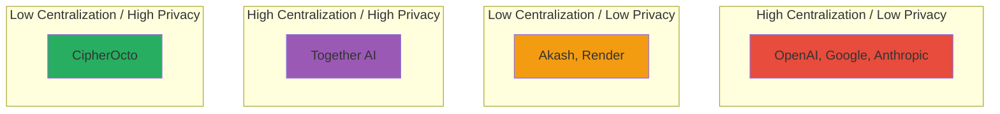

# CipherOcto Competitive Analysis

## Market Landscape

The decentralized AI infrastructure market is emerging rapidly, with several approaches competing to define the future of AI coordination.

---

## Competitive Framework

### Dimension 1: Centralization

| Project | Centralization Level | Trust Model |
| ------- | ------------------- | ----------- |
| **OpenAI, Google, Anthropic** | Fully centralized | Institutional trust |
| **Akash Network** | Partially decentralized | Stake-based trust |
| **Render Network** | Partially decentralized | Stake-based trust |
| **Together AI** | Partially decentralized | Institutional + stake |
| **CipherOcto** | Fully decentralized | Zero-trust + PoR |

### Dimension 2: Token Economics

| Project | Token Model | Issue |
| ------- | ---------- | ----- |
| **Akash Network** | Single token (AKT) | All roles compete for same token |
| **Render Network** | Single token (RNDR) | Compute-only focus |
| **Together AI** | Single token (Together) | No role specialization |
| **CipherOcto** | Multi-token (OCTO + 8 role tokens) | Economic alignment by sector |

### Dimension 3: Trust Model

| Project | Trust Mechanism | Vulnerability |
| ------- | --------------- | ------------- |
| **Akash Network** | Stake (bond) | Rich attackers can buy trust |
| **Render Network** | Stake + reputation | Reputation secondary to capital |
| **Together AI** | Institutional | Centralized point of failure |
| **CipherOcto** | Proof of Reliability (PoR) | Performance > Capital |

### Dimension 4: Privacy

| Project | Privacy Approach | Limitations |
| ------- | ---------------- | ----------- |
| **Akash Network** | Basic encryption | No data classification |
| **Render Network** | Container isolation | No ZK proofs |
| **Together AI** | Privacy policy | Enterprise-controlled |
| **CipherOcto** | ZK proofs + TEEs + data classification | Comprehensive privacy by design |

---

## Detailed Competitor Analysis

### Akash Network

**Overview:** Decentralized cloud computing marketplace

**Strengths:**
- First mover in DePIN cloud
- Strong ecosystem momentum
- Cosmos SDK integration

**Weaknesses:**
- General-purpose cloud (not AI-specific)
- Single-token economics
- Stake-based security (capital > performance)
- No data sovereignty features
- No AI agent orchestration

**CipherOcto Advantage:**
- AI-specific optimization
- Role-based token economics
- Performance-based trust (PoR)
- Data classification and sovereignty
- Agent orchestration layer

### Render Network

**Overview:** Decentralized GPU rendering network

**Strengths:**
- GPU-focused infrastructure
- Established marketplace
- Creator community

**Weaknesses:**
- Rendering-focused (not inference)
- Single-token economics
- No storage or bandwidth layers
- No agent capabilities
- Limited to graphics workloads

**CipherOcto Advantage:**
- AI inference + training focus
- Multi-layer architecture (compute + storage + bandwidth)
- Agent economy
- Role-based tokens
- Enterprise-grade compliance

### Together AI

**Overview:** Decentralized AI compute network

**Strengths:**
- AI-native focus
- Open-source model leadership
- Research community

**Weaknesses:**
- Hybrid centralization
- Institutional trust requirements
- Limited token utility
- No role-based economics
- Platform-centric approach

**CipherOcto Advantage:**
- Fully decentralized architecture
- Zero-trust security model
- Multi-role token economics
- Protocol, not platform
- Data sovereignty by design

---

## Unique Competitive Advantages

### 1. Proof of Reliability (PoR)

| Feature | CipherOcto | Competitors |
| ------- | ---------- | ----------- |
| Trust basis | Verifiable performance | Capital stake |
| Attack resistance | Exponential cost | Linear cost |
| Meritocracy | Performance > capital | Capital > performance |
| Composability | Trust propagates | Trust siloed |

### 2. Role-Based Multi-Token Economy

| Feature | CipherOcto | Competitors |
| ------- | ---------- | ----------- |
| Token count | 9 (1 sovereign + 8 role) | 1 |
| Economic efficiency | Specialized by sector | Cross-sector competition |
| Inflation fairness | Emissions match contribution | Arbitrary schedules |
 Value capture | Each role captures sector value | Single token dilutes |

### 3. AI Wholesale (OCTO-W)

| Feature | CipherOcto | Competitors |
| ------- | ---------- | ----------- |
| Enterprise quota resale | ✅ Unique innovation | ❌ Not available |
| Idle capacity monetization | ✅ Billions unlocked | ❌ Not addressed |
| Enterprise integration | ✅ Native to protocol | ❌ Afterthought |

### 4. Data Sovereignty

| Feature | CipherOcto | Competitors |
| ------- | ---------- | ----------- |
| Data classification | ✅ 4 levels enforced | ❌ Basic encryption |
| Zero-knowledge proofs | ✅ Verification without exposure | ❌ Not implemented |
| TEE integration | ✅ Hardware-level security | ❌ Container-only |
| Compliance native | ✅ SOC2/HIPAA/GDPR | ❌ Retrofitted |

### 5. Dual-Stake Security

| Feature | CipherOcto | Competitors |
| ------- | ---------- | ----------- |
| Stake requirements | OCTO + role token | Single token |
| Attack cost | Exponential (must acquire both) | Linear (single token) |
| Role tourism prevention | ✅ By design | ❌ Vulnerable |
| Local/global alignment | ✅ Both enforced | ❌ No distinction |

---

## Market Positioning Matrix

**CipherOcto occupies the unique position** of full decentralization with comprehensive privacy.

---

## Entry Barriers

### Defensibility

| Barrier | CipherOcto | Competitors |
| ------- | ---------- | ----------- |
| **Network effects** | Composable trust graph | Limited composability |
| **Switching costs** | Dual-stake + reputation | Single-stake, low friction |
| **Data moats** | Sovereign data stays | Platform-controlled |
| **Economic moats** | Multi-token alignment | Single-token dilution |
| **Technical moats** | PoR + AI Wholesale | Stake-only models |

### First-Mover Advantages

1. **Proof of Reliability** — Novel trust model, difficult to replicate
2. **AI Wholesale** — Unique market innovation
3. **Data classification system** — Comprehensive privacy framework
4. **Dual-stake architecture** — Economic security innovation
5. **Agent orchestration** — Multi-agent coordination layer

---

## Conclusion

CipherOcto's competitive position is defined by:

1. **Only zero-trust architecture** — Cryptographic guarantees over institutional trust
2. **Only performance-based security** — PoR over stake-based models
3. **Only role-based economics** — Specialized tokens over single-token inefficiency
4. **Only comprehensive data sovereignty** — Privacy by design, not afterthought
5. **Only agent-first approach** — Multi-agent coordination as core feature

**We are not competing to be another DePIN project. We are building the economic substrate for the autonomous intelligence economy.**

---

*For technical details on our architecture, see the [system overview](./overview.md) and [whitepaper](../01-foundation/whitepaper/v1.0-whitepaper.md).*
