# CipherOcto Product Overview

## What is CipherOcto?

CipherOcto is a **decentralized AI infrastructure layer** that transforms fragmented AI resources into a unified, sovereign economy.

Think of CipherOcto as the **TCP/IP for AI** — the invisible infrastructure layer that allows intelligence to flow between participants as effortlessly as data flows across the internet.

---

## The Core Value Proposition

### The Problem

Today's AI economy is fundamentally broken:

| Issue | Impact |
| ----- | ------ |
| **Millions of GPUs sit idle** | 40-60% utilization industry-wide |
| **Enterprise AI subscriptions go unused** | Billions in wasted capacity |
| **Valuable datasets remain locked** | No safe way to share or monetize |
| **AI agents cannot collaborate** | Each platform is a walled garden |
| **Vendor lock-in is accelerating** | Enterprises desperate for alternatives |

**The cost:** A $400B+ coordination failure.

### The Solution

CipherOcto coordinates AI resources across a global decentralized network:

---

## Product Architecture

### The Ocean Stack

CipherOcto's three-layer architecture:

```mermaid
graph TB
    subgraph INTELLIGENCE["🐙 Intelligence Layer"]
        I1[Agent Orchestrator]
        I2[Task Routing]
        I3[Result Verification]
    end

    subgraph EXECUTION["🦑 Execution Layer"]
        E1[Secure Runtime]
        E2[Privacy Containers]
        E3[Local Inference]
    end

    subgraph NETWORK["🪼 Network Layer"]
        N1[Node Coordination]
        N2[Identity System]
        N3[Trust & Reputation]
    end

    INTELLIGENCE --> EXECUTION --> NETWORK
```

**Many agents, one intelligence.**

---

## Key Features

### 1. Trustless Compute Sessions

AI execution occurs through cryptographically isolated environments with verifiable integrity.

- **Zero-knowledge proofs** — Verify without revealing
- **TEE attestation** — Hardware-level security
- **Optimistic challenges** — Fraud detection
- **Immutable audit logs** — Complete traceability

### 2. Proof of Reliability (PoR)

Trust earned through verifiable performance, not capital.

- Performance-based reputation
- Composable trust graph
- Economic security through dual-staking
- Sybil attack resistance

### 3. Data Sovereignty

Your data is classified cryptographically:

| Level | Access |
| ----- | ------ |
| **PRIVATE** | Single-agent use only |
| **CONFIDENTIAL** | Owner-specified agents |
| **SHARED** | Verified agents |
| **PUBLIC** | Open to all |

### 4. AI Wholesale (OCTO-W)

Unique innovation: Represents resale of unused enterprise AI quotas from providers like Google, OpenAI, and Anthropic.

**Turns idle subscription capacity into liquid market assets** — unlocking billions in dormant value.

### 5. Multi-Token Economy

| Token | Role | Purpose |
| ----- | ---- | ------- |
| **OCTO** | Sovereign | Governance, staking, settlement |
| **OCTO-A** | AI Compute | GPU provider rewards |
| **OCTO-S** | Storage | Storage provider rewards |
| **OCTO-B** | Bandwidth | Network relay rewards |
| **OCTO-O** | Orchestrator | Task coordinator rewards |
| **OCTO-W** | AI Wholesale | Enterprise quota resale |
| **OCTO-D** | Developers | Agent builder rewards |
| **OCTO-M** | Marketing | Growth contributor rewards |
| **OCTO-N** | Node Operators | Infrastructure rewards |

### 6. Dual-Stake Security

Every participant stakes both OCTO (global alignment) and role tokens (local commitment).

- Prevents role tourism
- Fixes misaligned incentives
- Eliminates farm & dump attacks

---

## Use Cases

### For Compute Providers

Transform idle hardware into continuous revenue.

### For Enterprises

| Challenge | Solution |
| --------- | -------- |
| Unused AI subscriptions | Sell on marketplace |
| Vendor lock-in | Multi-provider redundancy |
| Data privacy | Sovereign data control |
| Compliance | SOC2, HIPAA, GDPR-native |

**Reduce AI costs 30-50% while gaining independence.**

### For Developers

| Opportunity | Description |
| ----------- | ----------- |
| **Publish agents** | Build once, earn continuously |
| **Agent marketplace** | Global distribution |
| **Agent composition** | Agents hiring agents |
| **No infrastructure** | Focus on logic, not ops |

### For Token Holders

| Utility | Description |
| ------- | ----------- |
| **Governance** | Vote on protocol decisions |
| **Staking rewards** | 5-8% APY |
| **Deflation** | Buyback & burn from fees |
| **Treasury backing** | Protocol revenue supports value |

---

## Competitive Positioning

| Approach | Problem | CipherOcto Advantage |
| -------- | ------- | --------------------- |
| **Centralized AI** | Institutional trust, no cryptographic guarantees | Zero-trust architecture with proof |
| **Traditional DePIN** | Stake-based security, vulnerable to attacks | Performance-based trust (PoR) |
| **Single-token projects** | All roles compete for same token | Role-based tokens for economic efficiency |

---

## Getting Started

1. **Learn** — Read the [litepaper](../01-foundation/litepaper.md) (10 min)
2. **Connect** — Join the community (Discord, Twitter, GitHub)
3. **Experiment** — Build your first agent
4. **Contribute** — Add value to the ecosystem
5. **Earn** — Receive rewards for participation

---

*For technical details, see the [whitepaper](../01-foundation/whitepaper/v1.0-whitepaper.md).*
