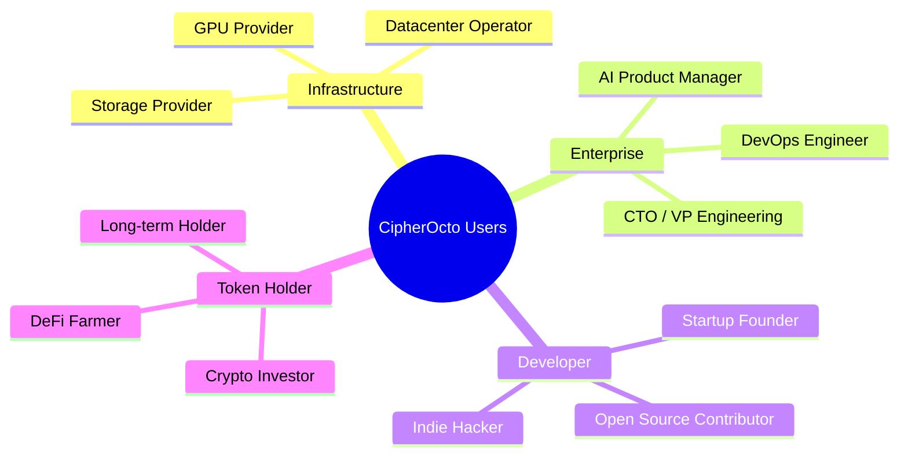

# CipherOcto User Personas

This document defines the primary user personas for CipherOcto, their motivations, pain points, and how the protocol addresses their needs.

---

## Primary Personas

---

## Persona 1: GPU Provider — "Marcus"

### Profile

- **Age:** 34
- **Location:** Singapore
- **Occupation:** Datacenter owner, 200+ GPUs
- **Technical Level:** High

### Background

Marcus runs a mid-sized datacenter serving the SEA region. He invested heavily in NVIDIA H100s during the AI boom, but utilization fluctuates wildly between 40-70%.

### Pain Points

| Pain | Impact |
| ---- | ------ |
| **Idle capacity** | $50K+/month in unrealized revenue |
| **Customer acquisition** | Difficult to find reliable buyers |
| **Platform fees** | AWS, Azure charge 30-50% margins |
| **Geographic limits** | Local market only |
| **Revenue volatility** | Unpredictable cash flow |

### Goals

1. Monetize idle GPUs during off-hours
2. Access global buyer market
3. Reduce platform dependency
4. Earn predictable supplemental income
5. Future-proof his infrastructure investment

### How CipherOcto Helps

| Feature | Benefit |
| ------- | ------- |
| **Global marketplace** | Access buyers worldwide, 24/7 |
| **Automated matching** | No sales effort required |
| **OCTO-A earnings** | Direct payment for compute |
| **Reputation system** | Higher rates for reliable providers |
| **Dual-stake security** | Protected against bad actors |

### Quote

> "I have $2M in GPUs sitting idle half the time. CipherOcto turns that dead capital into a revenue stream while I sleep."

### Success Metrics

- Utilization increased from 55% to 85%
- Additional $40K/month revenue
- 30% reduction in customer acquisition cost
- Global customer base (12 countries)

---

## Persona 2: Enterprise CTO — "Sarah"

### Profile

- **Age:** 42
- **Location:** San Francisco
- **Company:** Fortune 500 financial services
- **Budget:** $5M/year AI spend

### Background

Sarah's company is aggressively adopting AI but faces vendor lock-in, escalating costs, and data sovereignty concerns.

### Pain Points

| Pain | Impact |
| ---- | ------ |
| **Vendor lock-in** | Trapped in OpenAI/AWS ecosystem |
| **Escalating costs** | AI budget doubled in 18 months |
| **Data sovereignty** | Cannot send financial data externally |
| **Compliance risk** | GDPR, SOC2 requirements |
| **Single point of failure** | Downtime = lost revenue |

### Goals

1. Reduce AI infrastructure costs
2. Achieve vendor independence
3. Maintain data sovereignty
4. Meet compliance requirements
5. Improve reliability and redundancy

### How CipherOcto Helps

| Feature | Benefit |
| ------- | ------- |
| **Multi-provider marketplace** | No single vendor dependency |
| **AI Wholesale (OCTO-W)** | Monetize unused OpenAI/Anthropic quotas |
| **Data classification** | PRIVATE data stays on-premise |
| **SOC2/GDPR native** | Compliance by design |
| **Geographic distribution** | Redundancy across regions |

### Quote

> "We spend $5M annually on AI, with $2M in unused subscriptions. CipherOcto lets us recoup costs while avoiding lock-in."

### Success Metrics

- 35% reduction in AI costs
- 100% data sovereignty maintained
- SOC2 Type II compliance achieved
- Zero vendor lock-in risk

---

## Persona 3: AI Developer — "Alex"

### Profile

- **Age:** 28
- **Location:** Remote (Portugal)
- **Background:** Ex-FAANG AI engineer
| **Status:** Indie hacker, 3 AI apps deployed

### Background

Alex left Big Tech to build autonomous AI agents. He has valuable agents but limited distribution and unreliable infrastructure.

### Pain Points

| Pain | Impact |
| ---- | ------ |
| **Distribution** | Hard to reach customers |
| **Infrastructure costs** | GPU bills eating margins |
| **Platform risk** | Agents can be delisted |
| **Payment friction** | Complex billing setup |
| **No passive income** | Must actively maintain everything |

### Goals

1. Monetize AI agents passively
2. Reach global customer base
3. Eliminate infrastructure headaches
4. Build recurring revenue streams
5. Focus on code, not operations

### How CipherOcto Helps

| Feature | Benefit |
| ------- | ------- |
| **Agent marketplace** | Global distribution, built-in customers |
| **Publish once, earn forever** | Passive income from agents |
| **Infrastructure included** | No GPU management required |
| **Automatic payments** | Earn OCTO-D automatically |
| **Agent composition** | Agents can hire other agents |

### Quote

> "I built an amazing agent, but only my Twitter followers know it exists. CipherOcto puts my agent in a global marketplace."

### Success Metrics

- 5 agents published
- $8K/month passive income
- 200+ enterprise customers
| Zero infrastructure management

---

## Persona 4: Token Holder — "Priya"

### Profile

- **Age:** 31
- **Location:** London
- **Background:** DeFi native, since 2020
- **Portfolio:** $500K diversified across 20 tokens

### Background

Priya is experienced in crypto but tired of speculative tokens with no utility. She seeks projects with real economic activity.

### Pain Points

| Pain | Impact |
| ---- | ------ |
| **Speculative tokens** | Value from hype, not utility |
| **Inflation dilution** | Endless token emissions |
| **No real yield** | Staking = inflation, not revenue |
| **Governance meaningless** | Teams ignore votes |
| **Short-term projects** | Exit scams common |

### Goals

1. Invest in real utility
2. Earn sustainable yield
3. Influence protocol direction
4. Long-term value appreciation
5. Support innovation in AI

### How CipherOcto Helps

| Feature | Benefit |
| ------- | ------- |
| **Proof of Useful Work** | Emissions only with real activity |
| **Treasury backing** | Protocol revenue supports token value |
| **5-8% APY** | Real yield from staking |
| **Meaningful governance** | Square-root voting reduces whale dominance |
| **Deflationary** | Buyback & burn from fees |

### Quote

> "I'm tired of tokens that only exist to speculate. CipherOcto has real economic activity and sustainable yield."

### Success Metrics

- 7.2% staking APY
| Governance proposals passed
- 3x price appreciation over 2 years
- Dividends from treasury revenue

---

## Persona 5: Startup Founder — "James"

### Profile

- **Age:** 26
- **Location:** Berlin
- **Company:** AI analytics startup, Series A
- **Team:** 12 engineers, $2M runway

### Background

James's startup needs AI infrastructure but can't afford enterprise contracts or build in-house.

### Pain Points

| Pain | Impact |
| ---- | ------ |
| **Enterprise pricing** | OpenAI Enterprise too expensive |
| **Build vs buy** | Can't afford to build own stack |
| **Vendor lock-in fear** | Startups get acquired and terms change |
| **Limited runway** | Every dollar counts |
| **Talent scarcity** | Can't hire ML infrastructure engineers |

### Goals

1. Access enterprise-grade AI at startup prices
2. Avoid vendor lock-in
3. Scale without infrastructure investment
4. Preserve runway
5. Focus on product, not plumbing

### How CipherOcto Helps

| Feature | Benefit |
| ------- | ------- |
| **Pay-per-use** | No upfront commitments |
| **Multi-provider** | Automatic switching on price |
| **No lock-in** | Leave anytime |
| **Developer-friendly** | SDK, not infrastructure |
| **Startup grants** | OCTO-D grants for builders |

### Quote

> "We can't afford OpenAI Enterprise but need more than the API. CipherOcto gives us enterprise AI at startup prices."

### Success Metrics

- 60% cost savings vs OpenAI Enterprise
- Zero infrastructure engineering hires
| Successfully raised Series B (fuel for growth)

---

## Persona Summary Matrix

| Persona | Primary Motivation | Key Benefit | Time to Value |
| ------- | ----------------- | ----------- | ------------- |
| **Marcus (GPU Provider)** | Monetize idle capacity | Additional $40K/month | Immediate |
| **Sarah (Enterprise CTO)** | Reduce costs & lock-in | 35% savings, sovereignty | 3-6 months |
| **Alex (Developer)** | Passive agent income | $8K/month passive | 1-3 months |
| **Priya (Token Holder)** | Sustainable yield | 7.2% APY + governance | Immediate |
| **James (Startup)** | Enterprise AI at startup prices | 60% cost savings | Immediate |

---

## Onboarding Journey

Each persona has a customized onboarding path, but all follow the same journey from awareness to active participation.

---

*For product details, see the [product overview](./overview.md). For technical specifications, see the [whitepaper](../01-foundation/whitepaper/v1.0-whitepaper.md).*
