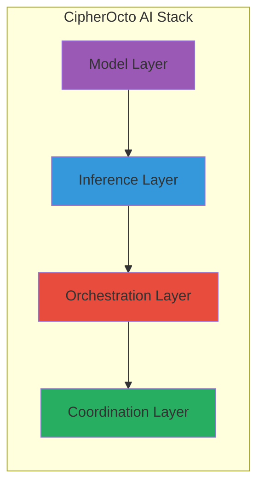
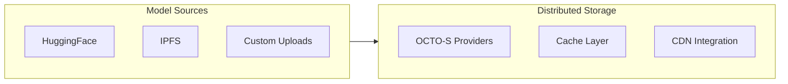
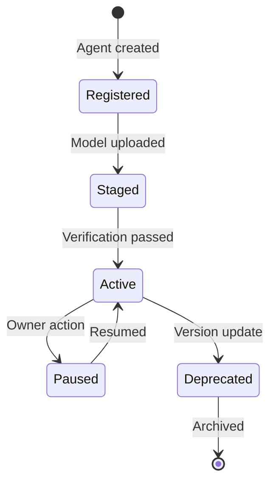
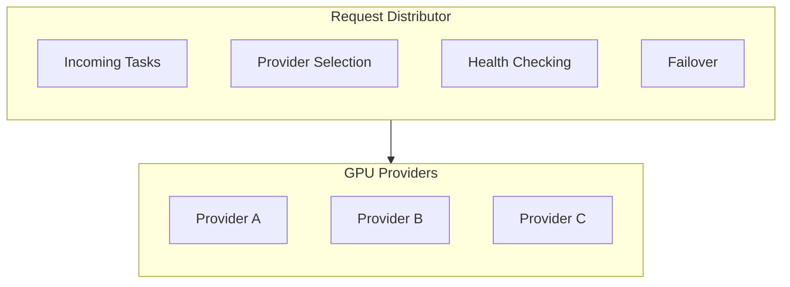
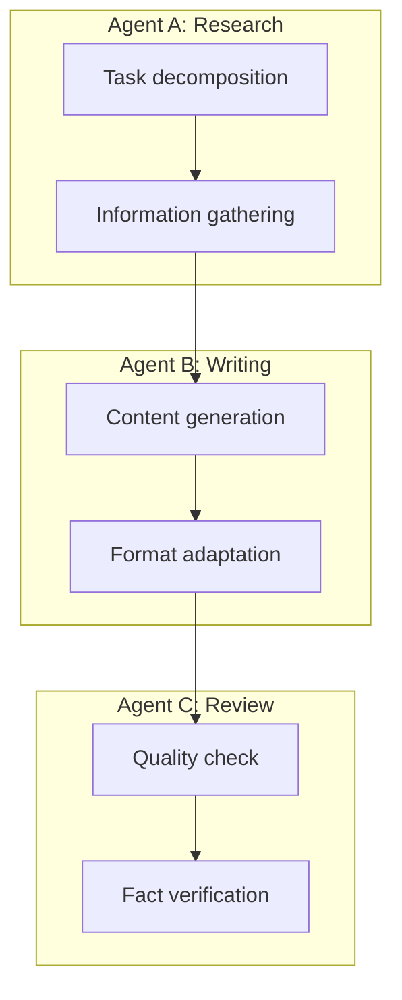
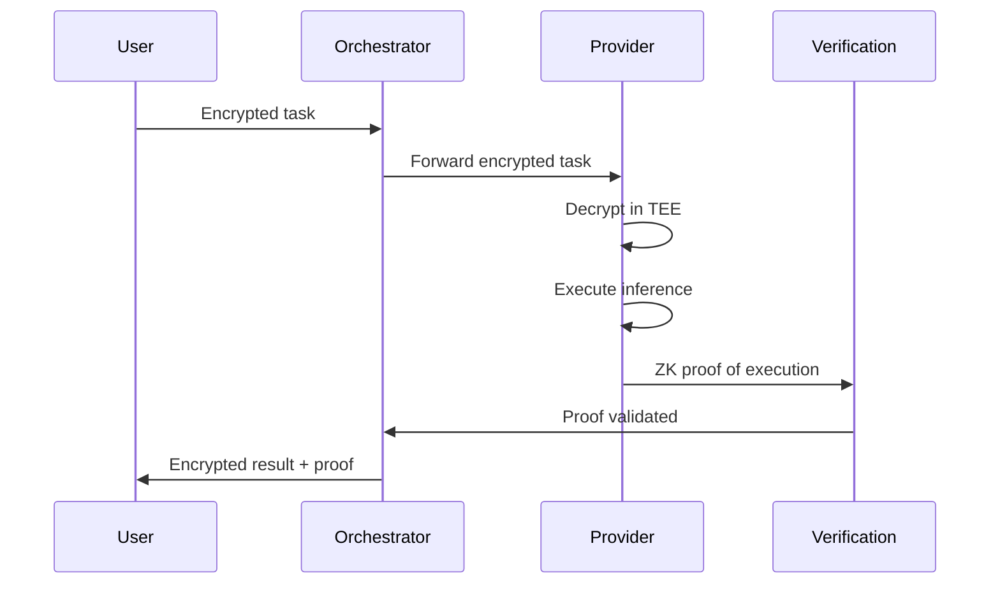
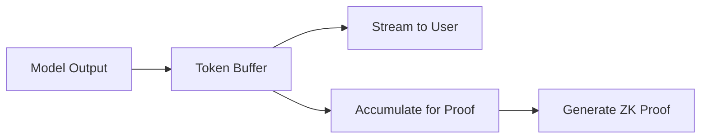

# CipherOcto AI Stack

## Overview

CipherOcto's AI stack enables decentralized inference, training, and agent coordination across a global network of compute providers.

---

## Architecture



---

## Layer 1: Model Layer

### Supported Model Types

| Category | Formats | Examples |
| ---------- | ------- | -------- |
| **LLMs** | GGUF, SafeTensors, ONNX | Llama 2, Mistral, Phi |
| **Diffusion** | Safetensors, PyTorch | Stable Diffusion, FLUX |
| **Embeddings** | ONNX, PyTorch | BERT, Sentence-Transformers |
| **Vision** | ONNX, TensorRT | YOLO, ResNet |
| **Audio** | ONNX, PyTorch | Whisper, AudioLDM |

### Model Distribution



### Model Versioning

| Component | Description |
| --------- | ----------- |
| **Semantic versioning** | Major.Minor.Patch format |
| **Content addressing** | IPFS hashes for integrity |
| **Signature verification** | Model creator signatures |
| **Compatibility matrix** | Hardware requirement specs |

---

## Layer 2: Inference Layer

### Inference Engines

| Engine | Use Case | GPU Support |
| ------ | -------- | ----------- |
| **llama.cpp** | CPU/LLM inference | Optional GPU |
| **vLLM** | Production LLM serving | NVIDIA CUDA |
| **TensorRT-LLM** | Optimized inference | NVIDIA only |
| **ONNX Runtime** | Cross-framework | Multiple |
| **Diffusers** | Diffusion models | NVIDIA/ROCm |

### Inference Modes

| Mode | Description | Latency | Cost |
| ---- | ----------- | ------- | ---- |
| **Real-time** | Streaming responses | <100ms | Premium |
| **Batch** | Processed in batches | 1-5s | Standard |
| **Async** | Queue and process | Variable | Economy |

### Hardware Support Matrix

| Hardware Tier | VRAM | Models Supported | OCTO-A Required |
| ------------- | ---- | ---------------- | --------------- |
| **Consumer** | 8-16GB | 7B-13B LLMs | 1,000 |
| **Prosumer** | 24-48GB | 13B-70B LLMs | 5,000 |
| **Enterprise** | 80GB+ | 70B+ LLMs, diffusion | 10,000 |

### Quantization Support

| Format | Size Reduction | Quality Impact | Use Case |
| ------ | -------------- | -------------- | -------- |
| **FP16** | 0% | None | Precision required |
| **FP8** | 50% | Minimal | Production |
| **INT8** | 75% | Slight | Cost optimization |
| **INT4** | 87.5% | Noticeable | Edge cases |

---

## Layer 3: Orchestration Layer

### Agent Lifecycle



### Task Routing

| Router Type | Selection Criteria |
| ----------- | ----------------- |
| **Cost-based** | Lowest price per token |
| **Speed-based** | Fastest response time |
| **Quality-based** | Highest reputation |
| **Privacy-based** | TEE/encrypted only |
| **Geo-based** | Regional requirements |

### Load Balancing



### Monitoring & Observability

| Metric | Collection | Alert Threshold |
| ------ | ---------- | --------------- |
| **Response time** | Per-request | >5s p95 |
| **Error rate** | Per-provider | >1% |
| **Throughput** | Tokens/second | <10 t/s |
| **GPU utilization** | Per-provider | <30% (idle) or >95% (overloaded) |

---

## Layer 4: Coordination Layer

### Multi-Agent Orchestration



### Agent Communication Protocol

| Message Type | Purpose | Example |
| ------------ | ------- | ------- |
| **TASK_REQUEST** | Request work from another agent | "Summarize this transcript" |
| **TASK_RESPONSE** | Return result | "Here is the summary" |
| **STATUS_UPDATE** | Progress notification | "50% complete" |
| **ERROR** | Failure notification | "Model unavailable" |
| **NEGOTIATE** | Discuss terms | "Will pay 0.5 OCTO" |

### Agent Composition Patterns

| Pattern | Description | Use Case |
| ------- | ----------- | -------- |
| **Sequential** | A → B → C | Multi-step workflows |
| **Parallel** | A + B + C simultaneously | Distributed processing |
| **Hierarchical** | A manages B, C, D | Complex orchestration |
| **Recursive** | Agents hiring agents | Dynamic problem solving |

---

## Privacy & Security

### Confidential Computing

| Technology | Protection Level | Availability |
| ---------- | --------------- | ------------ |
| **Software TEE** | Medium (SGX2) | Most providers |
| **Hardware TEE** | High (SEV-SNP, TDX) | Enterprise tier |
| **Zero-Knowledge** | Very High | Limited models |
| **Federated** | High | Training only |

### Data Flow Security



---

## Performance Optimization

### Caching Strategy

| Cache Type | Scope | Invalidation |
| ---------- | ----- | ------------ |
| **Model cache** | Provider-local | Model update |
| **Response cache** | Global (IPFS) | TTL-based |
| **Embedding cache** | Global | User-requested |

### Token Streaming



### Batch Optimization

| Strategy | Description | Throughput Gain |
| -------- | ----------- | --------------- |
| **Dynamic batching** | Combine requests in flight | 2-3x |
| **Continuous batching** | vLLM paged-attention | 5-10x |
| **Speculative decoding** | Draft model + verify | 2x |

---

## Integration Points

### External AI Services

| Service | Integration Type | Use Case |
| ------- | ---------------- | -------- |
| **HuggingFace** | Model hub | Model distribution |
| **OpenAI API** | OCTO-W bridge | Enterprise quota resale |
| **Anthropic API** | OCTO-W bridge | Enterprise quota resale |
| **Replicate** | Fallback provider | Overflow handling |

### Developer APIs

```yaml
Agent_Deployment_API:
  endpoint: /api/v1/agents
  methods:
    - POST: Create agent
    - GET: List agents
    - PUT: Update agent
    - DELETE: Remove agent

  request_schema:
    name: string
    model: string
    hardware_tier: consumer|prosumer|enterprise
    pricing: tokens_per_second
    capabilities: array

Inference_API:
  endpoint: /api/v1/inference
  methods:
    - POST: Submit inference task
    - GET: Get task status
    - WebSocket: Stream results

  request_schema:
    agent_id: string
    input: string|object
    privacy_level: private|confidential|shared|public
    max_tokens: integer
    temperature: float
```

---

## Roadmap

| Phase | Features | Timeline |
| ----- | -------- | -------- |
| **Phase 1** | Basic inference, single agents | 2027 |
| **Phase 2** | Multi-agent, streaming | 2028 |
| **Phase 3** | Federated training, ZK inference | 2029 |
| **Phase 4** | AGI preparation, recursive agents | 2030+ |

---

*For system architecture details, see [system-architecture.md](./system-architecture.md). For blockchain integration, see [blockchain-integration.md](./blockchain-integration.md).*
