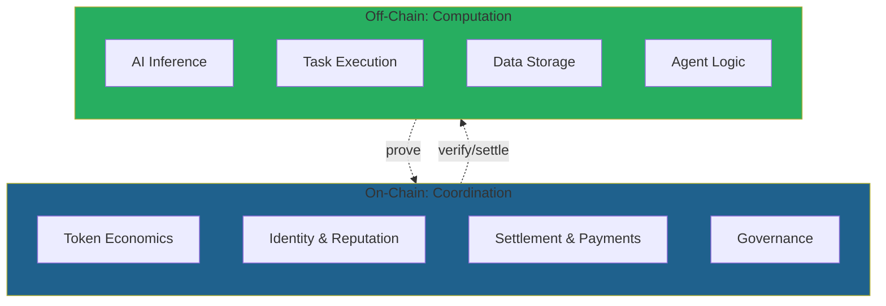
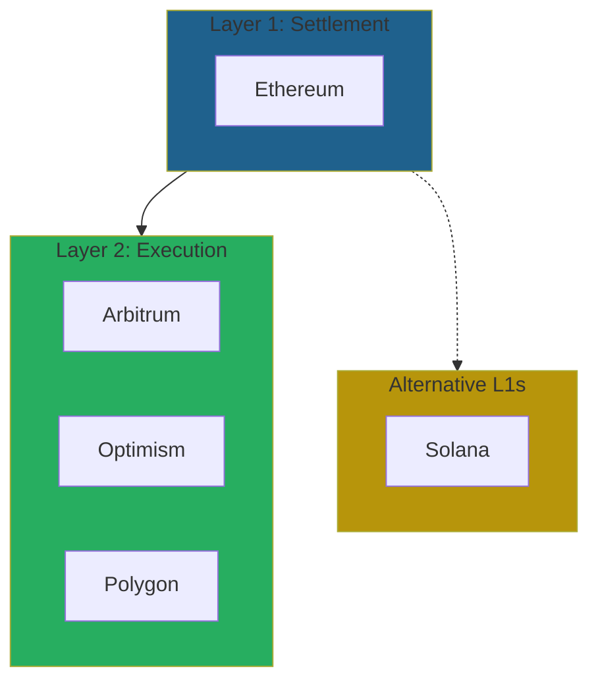
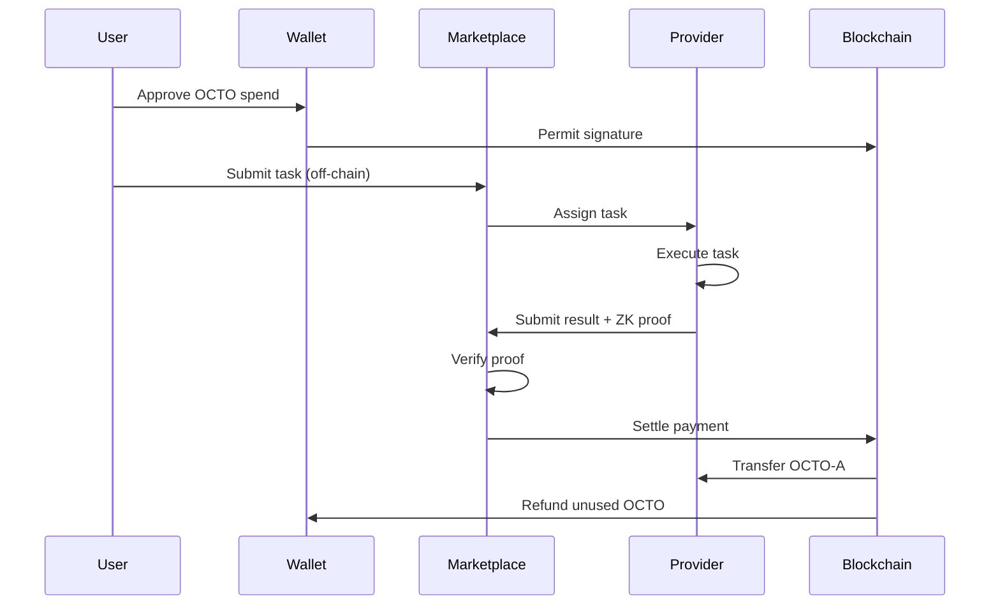
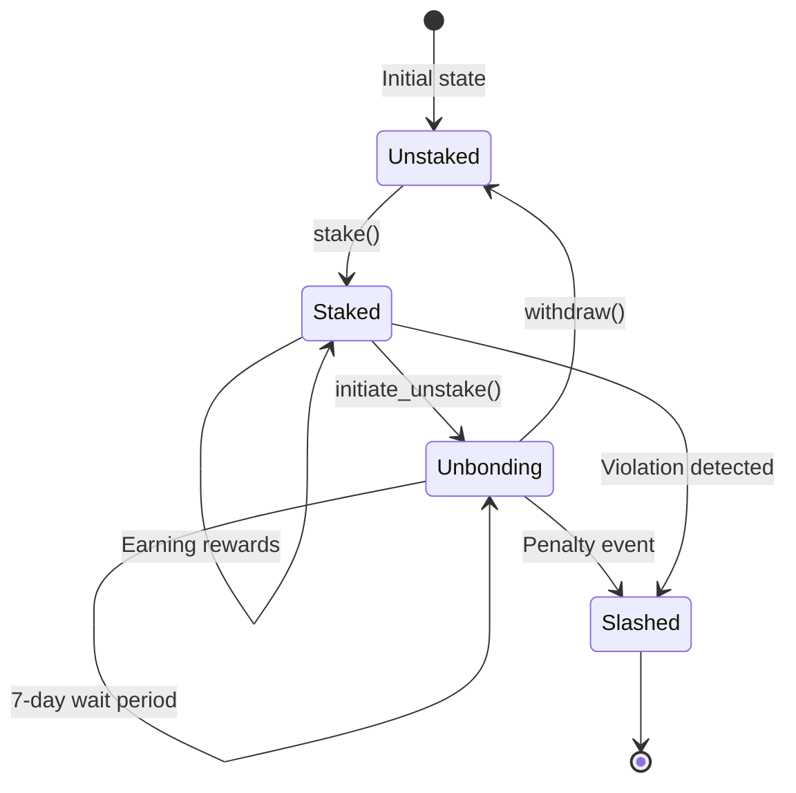
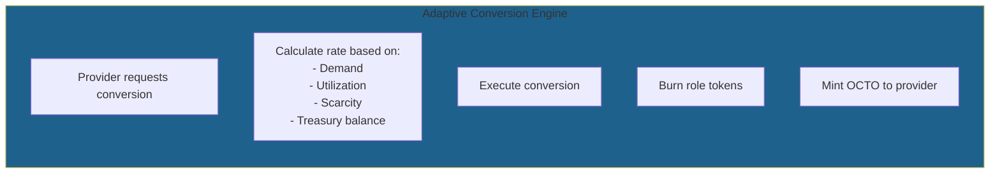
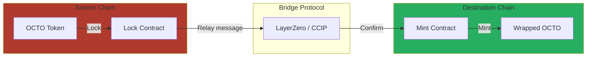
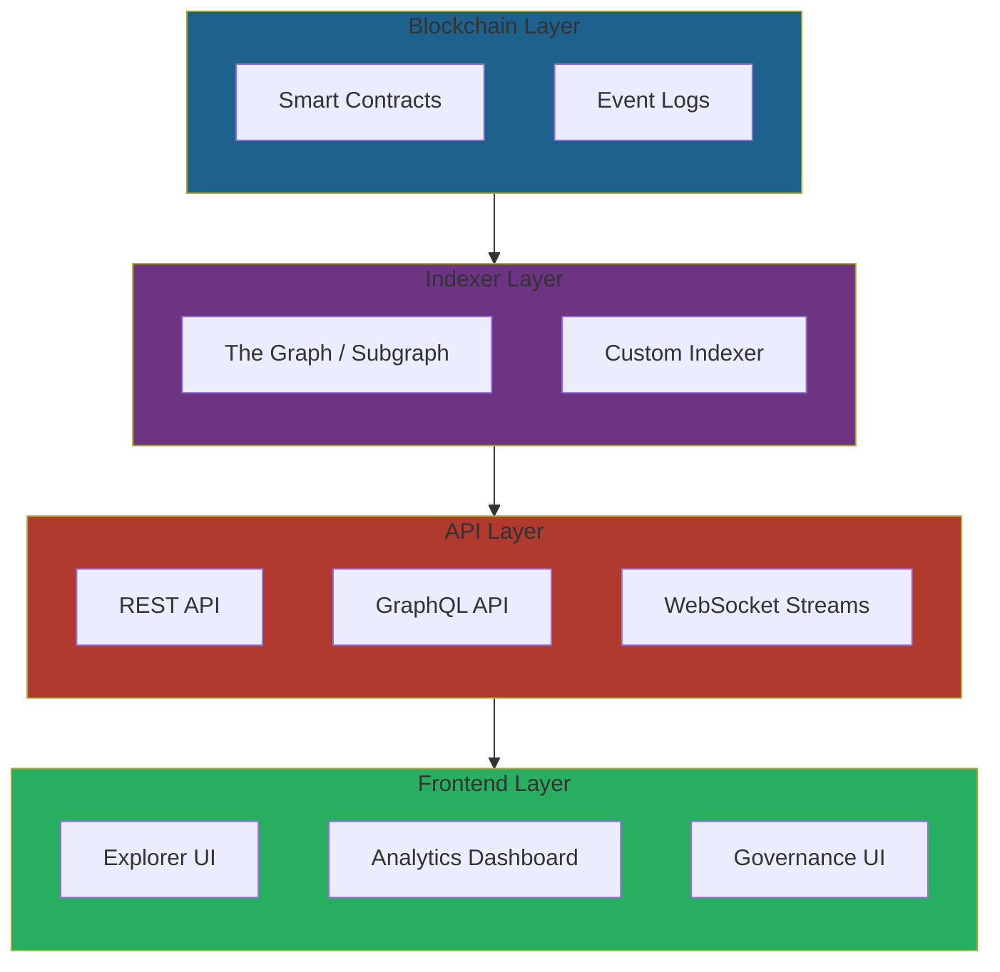

# CipherOcto Blockchain Integration

## Overview

CipherOcto leverages blockchain technology for economic coordination, trustless verification, and decentralized governance. This document details our blockchain architecture and integration strategy.

---

## Architecture Philosophy

**Blockchain as Coordination Layer, Not Computation Layer**



**Key Principle:** Only minimal, essential data goes on-chain. Computation happens off-chain with cryptographic verification.

---

## Blockchain Selection

### Primary Chain: Ethereum

| Aspect | Decision | Rationale |
| ------ | -------- | --------- |
| **Layer 1** | Ethereum | Largest ecosystem, best tooling |
| **Settlement layer** | Ethereum Mainnet | Security, finality |
| **User transactions** | L2 (Arbitrum/Optimism) | Low fees, fast confirmations |
| **Cross-chain** | LayerZero / CCIP | Interoperability |

### Multi-Chain Strategy



### Chain Support Timeline

| Phase | Chains Supported | Features |
| ----- | ---------------- | -------- |
| **Phase 1** | Ethereum + Arbitrum | Core functionality |
| **Phase 2** | + Optimism, Polygon | User choice |
| **Phase 3** | + Solana | High-throughput options |
| **Phase 4** | + Cosmos (via IBC) | Ecosystem expansion |

---

## Smart Contract Architecture

### Contract Suite

```mermaid
graph TB
    subgraph CORE["Core Contracts"]
        direction TB
        CORE1[OCTO Token]
        CORE2[Role Tokens (8x)]
        CORE3[Staking Manager]
        CORE4[Reputation System]
    end

    subgraph ECONOMIC["Economic Contracts"]
        direction TB
        ECON1[Marketplace]
        ECON2[Treasury]
        ECON3[Fee Distributor]
        ECON4[Conversion Engine]
    end

    subgraph GOV["Governance Contracts"]
        direction TB
        GOV1[Governance Module]
        GOV2[Emergency Council]
        GOV3[Constitution]
    end

    CORE --> ECONOMIC
    CORE --> GOV
    ECONOMIC --> GOV

    style CORE fill:#6c3483
    style ECONOMIC fill:#1f618d
    style GOV fill:#27ae60
```

### Contract Specifications

#### OCTO Token (ERC-20)

| Parameter | Value |
| --------- | ----- |
| **Name** | CipherOcto |
| **Symbol** | OCTO |
| **Decimals** | 18 |
| **Initial Supply** | 10,000,000,000 |
| **Standard** | ERC-20 + ERC-20Votes + ERC-20Permit |

**Additional Features:**
- **Votes** — Optimized for on-chain governance
- **Permit** — Gasless approvals via EIP-2612
- **Flash mint protection** — Reentrancy guards

#### Role Tokens (8x ERC-20)

| Token | Name | Purpose |
| ----- | ---- | ------- |
| **OCTO-A** | AI Compute | GPU inference/training rewards |
| **OCTO-S** | Storage | Data storage rewards |
| **OCTO-B** | Bandwidth | Network relay rewards |
| **OCTO-O** | Orchestrator | Task coordination rewards |
| **OCTO-W** | AI Wholesale | Enterprise quota resale |
| **OCTO-D** | Developers | Agent building rewards |
| **OCTO-M** | Marketing | Growth contribution rewards |
| **OCTO-N** | Node Ops | Infrastructure maintenance rewards |

**Role Token Features:**
- Convertible to OCTO via Adaptive Conversion Engine
- Emission tied to sector-specific contribution
- Cannot be used for governance
- Stake required for role participation

#### Staking Manager

```yaml
Stake_Types:
  Global_Stake:
    token: OCTO
    purpose: Protocol alignment
    min_stake: 1,000 OCTO
    rewards: Governance rights + share of fees

  Role_Stake:
    tokens: OCTO-A/B/S/O/W/D/M/N
    purpose: Role commitment
    min_stake: Varies by role
    rewards: Sector-specific earnings

Staking_Functions:
  - stake(address, amount, role)
  - unstake(address, role)
  - claim_rewards(address)
  - slash(address, role, amount)

Security:
  - Unstaking: 7-day unbonding period
  - Slashing: Automatic for violations
  - Reward distribution: Per-block accrual
```

#### Reputation System

```solidity
contract Reputation {
    struct ProviderStats {
        uint256 score;              // 0-100
        uint256 tasksCompleted;
        uint256 tasksTotal;
        uint256 uptime;             // Basis points
        uint256 lastUpdate;
    }

    mapping(address => ProviderStats) public providers;

    function updateScore(
        address provider,
        bool taskSuccess,
        uint256 responseTime,
        uint256 currentUptime
    ) external;

    function getScore(address provider)
        public view returns (uint256);
}
```

---

## Transaction Flows

### Task Submission Flow



### Staking Flow



### Conversion Flow (Role Token → OCTO)



---

## Gas Optimization

### Strategies

| Technique | Gas Savings | Implementation |
| ---------- | ----------- | -------------- |
| **Batch operations** | 30-50% | Multi-token transfers |
| **Lazy minting** | Variable | Mint on first use |
| **EIP-1559** | 10-20% | Dynamic fee adjustment |
| **L2 settlement** | 90%+ | Arbitrum/Optimism |
| **ZK rollups** | 95%+ | Future implementation |

### Gas Cost Estimates

| Operation | L1 Cost | L2 Cost | Savings |
| ---------- | ------- | ------- | ------- |
| **Stake OCTO** | ~$5-20 | ~$0.10-0.50 | 97%+ |
| **Submit task** | ~$10-50 | ~$0.20-1.00 | 96%+ |
| **Claim rewards** | ~$3-10 | ~$0.05-0.25 | 98%+ |
| **Convert tokens** | ~$8-30 | ~$0.15-0.75 | 97%+ |

---

## Cross-Chain Architecture

### Bridge Strategy



### Supported Bridge Protocols

| Protocol | Security | Speed | Use Case |
| ---------- | -------- | ----- | -------- |
| **LayerZero** | High | Fast | Standard transfers |
| **CCIP (Chainlink)** | High | Medium | Enterprise use |
| **Wormhole** | Medium | Fast | Emergency transfers |
| **Synapse** | Medium | Fast | Alternative route |

---

## Oracle Integration

### Data Requirements

| Data Type | Source | Update Frequency |
| --------- | ------ | ---------------- |
| **OCTO price** | DEXs (Uniswap, Curve) | Every block |
| **Role token prices** | DEXs | Every block |
| **External AI prices** | CEXs + DEXs | Hourly |
| **Node uptime** | Internal monitoring | Every minute |
| **Reputation scores** | On-chain calculation | Per task |

### Oracle Providers

| Provider | Use Case |
| ---------- | -------- |
| **Chainlink** | Price feeds, external data |
| **Pyth Network** | Low-latency price updates |
| **UMA** | Optimistic oracle for custom data |
| **Custom oracles** | Protocol-specific metrics |

---

## Governance Integration

### On-Chain Governance

```mermaid
graph TB
    subgraph GOV_PROCESS["Governance Process"]
        direction TB
        P1[Proposal Creation]
        P2[Vote (square-root)]
        P3[Timelock Execution]
        P4[Implementation]
    end

    subgraph VOTING["Voting Power"]
        direction TB
        V1[OCTO stakers<br/>Chamber 1]
        V2[Contribution Council<br/>Chamber 2]
    end

    P1 --> P2 --> P3 --> P4
    V1 --> P2
    V2 --> P2

    style GOV_PROCESS fill:#1f618d
    style VOTING fill:#6c3483
```

### Governance Contracts

| Contract | Purpose |
| ---------- | -------- |
| **Governor** | Proposal creation & voting |
| **Timelock** | Execution delay (48 hours) |
| **Tokenomics** | Parameter adjustments |
| **Emergency** | Crisis response |

---

## Security Architecture

### Audit Strategy

| Contract | Auditors | Status |
| ---------- | ---------- | ------ |
| **OCTO Token** | TBD, OpenZeppelin | Planned |
| **Role Tokens** | TBD, OpenZeppelin | Planned |
| **Staking Manager** | TBD, ConsenSys Diligence | Planned |
| **Reputation System** | TBD, Trail of Bits | Planned |
| **Marketplace** | TBD, CertiK | Planned |

### Security Measures

```yaml
Smart_Contract_Security:
  - Access control (Ownable, RoleBased)
  - Reentrancy guards (ReentrancyGuard)
  - Pause mechanism (Pausable)
  - Rate limiting (RateLimit)
  - Upgradeability (UUPS proxy)

Operational_Security:
  - Multi-sig treasury (Gnosis Safe)
  - Time locks for sensitive actions
  - Bug bounty program
  - Continuous monitoring
  - Incident response plan
```

---

## Monitoring & Analytics

### On-Chain Metrics

| Metric | Source | Dashboard |
| ------ | ------ | --------- |
| **Total value staked** | Staking contracts | Dune Analytics |
| **Token velocity** | Transfer events | Custom dashboard |
| **Active providers** | Reputation registry | Dune Analytics |
| **Transaction volume** | Marketplace contracts | Dune Analytics |
| **Governance participation** | Voting contracts | Tally |

### Off-Chain Integration



---

## Roadmap

| Phase | Milestones | Timeline |
| ----- | ---------- | -------- |
| **Phase 1** | Ethereum + Arbitrum deployment | 2027 Q2 |
| **Phase 2** | Optimism + Polygon integration | 2028 Q1 |
| **Phase 3** | Solana integration | 2028 Q3 |
| **Phase 4** | Cosmos IBC integration | 2029 Q1 |

---

*For system architecture details, see [system-architecture.md](./system-architecture.md). For tokenomics, see [token-design.md](../04-tokenomics/token-design.md).*
