# CipherOcto System Architecture

## Overview

CipherOcto is a three-layer architecture designed from first principles for sovereign, decentralized intelligence.

```mermaid
graph TB
    subgraph OCEAN["The Ocean Stack"]
        direction TB
        INTELLIGENCE["🐙 Intelligence Layer<br/>Reasoning & Orchestration"]
        EXECUTION["🦑 Execution Layer<br/>Secure Agent Actions"]
        NETWORK["🪼 Network Layer<br/>Distributed Coordination"]
    end

    INTELLIGENCE --> EXECUTION --> NETWORK

    style INTELLIGENCE fill:#6c3483
    style EXECUTION fill:#b03a2e
    style NETWORK fill:#1f618d
```



---

## Layer 1: Intelligence Layer 🐙

### Components


### Agent Orchestrator

**Responsibilities:**
- Agent discovery and selection
- Task decomposition and routing
- Multi-agent coordination
- Result aggregation

**Specifications:**
| Metric | Value |
| ------ | ----- |
| Max concurrent tasks | 10,000+ |
| Task routing latency | <50ms |
| Agent lookup time | <10ms |
| Multi-agent depth | 10+ levels |

### Task Router

**Routing Strategies:**
- **Cost-optimized** — Lowest price per token
- **Speed-optimized** — Fastest response time
- **Quality-optimized** — Highest reputation
- **Privacy-optimized** — TEE/encrypted only
- **Geo-optimized** — Regional requirements

**Load Balancing:**


---

## Layer 2: Execution Layer 🦑

### Components


### Secure Execution Runtime

**Technology Stack:**
| Component | Technology | Purpose |
| --------- | ---------- | ------- |
| **Sandbox** | Namespace, cgroups, seccomp | Process isolation |
| **Runtime** | containerd, gVisor | Container execution |
| **Monitor** | eBPF, OpenTelemetry | Observability |
| **Attestation** | TPM, Nitro SEV | TEE verification |

**Execution Flow:**


### Privacy Containers

**Data Classification Enforcement:**

| Classification | Storage | Compute | Transmission |
| -------------- | ------- | ------- | ------------ |
| **PRIVATE** | Encrypted at rest | TEE only | E2E encrypted |
| **CONFIDENTIAL** | Encrypted at rest | TEE + ACL | E2E encrypted |
| **SHARED** | Standard encryption | Standard | TLS |
| **PUBLIC** | No encryption | No restriction | No encryption |

### Local Inference Engine

**Supported Frameworks:**
| Framework | Models | Acceleration |
| --------- | ------ | ------------ |
| **llama.cpp** | LLMs | CPU, CUDA, Metal |
| **vLLM** | LLMs | CUDA, ROCm |
| **Diffusers** | Diffusion | CUDA |
| **ONNX Runtime** | Multi | CPU, CUDA, TensorRT |
| **TensorRT** | Optimized | CUDA only |

**Performance Targets:**
| Model Size | Tokens/Second | Memory |
| ---------- | ------------- | ------ |
| 7B | 50-100 | 8GB VRAM |
| 13B | 25-50 | 16GB VRAM |
| 70B | 5-10 | 80GB VRAM |

---

## Layer 3: Network Layer 🪼

### Components


### Node Coordinator

**Node Types:**
| Node Type | Stake Required | Functions |
| ---------- | -------------- | --------- |
| **Validator** | 10,000 OCTO | Block validation, voting |
| **Provider** | 10,000 OCTO + role token | Compute/storage/bandwidth |
| **Orchestrator** | 5,000 OCTO + OCTO-O | Task coordination |
| **Observer** | None | Read-only access |

**Node Discovery:**


### Identity System

**Identity Components:**
| Component | Format | Use Case |
| ---------- | ------ | -------- |
| **Node ID** | Ed25519 public key | Node identification |
| **Agent ID** | UUID + creator signature | Agent identification |
| **User ID** | Wallet address or DID | User identification |
| **Session ID** | UUID | Request tracking |

**Verification Levels:**
| Level | Requirements | Privileges |
| ---- | ------------ | ---------- |
| **Anonymous** | None | Basic participation |
| **Verified** | Stake + history | Standard access |
| **KYC** | Identity verification | Enterprise tier |
| **Certified** | Third-party audit | High-value tasks |

### Trust Engine

**Reputation Calculation:**
```text
Reputation_Score =
  (Performance_Score × 0.35) +
  (Speed_Score × 0.20) +
  (Uptime_Score × 0.15) +
  (Security_Score × 0.15) +
  (Peer_Review × 0.10) +
  (Longevity × 0.05)
```

**Trust Propagation:**


---

## Cross-Layer Communication

### Message Flow


### Data Flow

| Stage | Handler | Processing |
| ------ | ------- | ---------- |
| **Request** | Intelligence Layer | Task validation, routing |
| **Assignment** | Network Layer | Provider selection, trust check |
| **Execution** | Execution Layer | TEE execution, proof generation |
| **Verification** | Network Layer | Proof validation, settlement |
| **Response** | Intelligence Layer | Result delivery, confirmation |

---

## System Properties

### Scalability

| Metric | Target | Approach |
| ------ | ------ | -------- |
| **Throughput** | 10,000+ tasks/sec | Parallel routing, sharding |
| **Latency** | <100ms p95 | Local caching, edge deployment |
| **Providers** | 100,000+ | Hierarchical coordination |
| **Agents** | 1,000,000+ | Distributed agent registry |

### Reliability

| Metric | Target | Approach |
| ------ | ------ | -------- |
| **Availability** | 99.9% | Geographic distribution |
| **Fault tolerance** | <1% impact | Redundancy, graceful degradation |
| **Recovery time** | <5 min | Automated failover |
| **Data durability** | 99.999% | Erasure coding, replication |

### Security

| Property | Implementation |
| -------- | --------------- |
| **Confidentiality** | E2E encryption, TEEs |
| **Integrity** | ZK proofs, Merkle trees |
| **Availability** | DDoS resistance, redundancy |
| **Accountability** | Immutable audit logs |

---

## Deployment Architecture

### Network Topology


### Software Stack

| Layer | Technology |
| ----- | ---------- |
| **Application** | Rust, TypeScript |
| **Protocol** | libp2p, Geth |
| **Consensus** | Proof of Stake |
| **Storage** | IPFS, PostgreSQL |
| **Monitoring** | Prometheus, Grafana |

---

*For AI-specific architecture, see [ai-stack.md](./ai-stack.md). For blockchain details, see [blockchain-integration.md](./blockchain-integration.md).*
