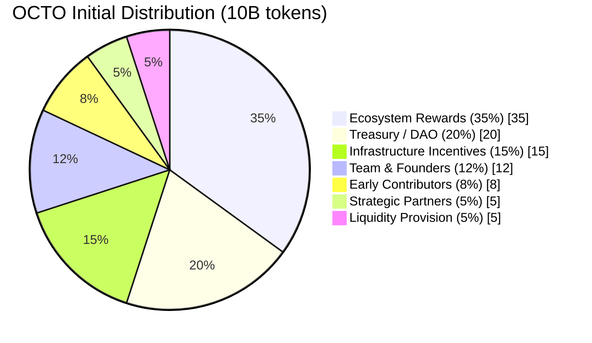
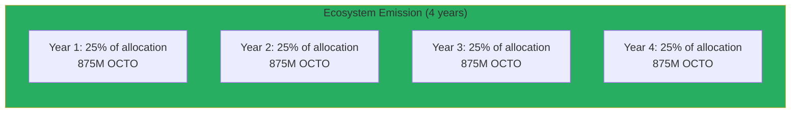
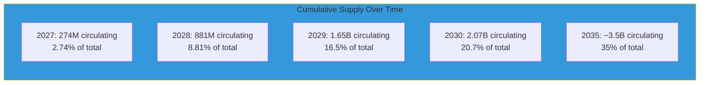

# OCTO Token Distribution Schedule

## Overview

This document details the complete distribution schedule for the OCTO token, including allocation categories, vesting schedules, and release mechanisms.

---

## Initial Distribution

### Total Supply: 10,000,000,000 (10 Billion) OCTO

### Allocation Breakdown

| Allocation | Tokens | Percentage | Purpose |
| ---------- | ------ | ---------- | ------- |
| **Ecosystem Rewards** | 3,500,000,000 | 35% | Long-term contributor incentives |
| **Treasury / DAO** | 2,000,000,000 | 20% | Governance and ecosystem development |
| **Infrastructure Incentives** | 1,500,000,000 | 15% | Early node bootstrapping |
| **Team & Founders** | 1,200,000,000 | 12% | Core development alignment |
| **Early Contributors** | 800,000,000 | 8% | Community recognition |
| **Strategic Partners** | 500,000,000 | 5% | Enterprise integrations |
| **Liquidity Provision** | 500,000,000 | 5% | Market stability |

---

## Vesting Schedules

### Ecosystem Rewards (35%)

**Purpose:** Long-term contributor incentives (node operators, developers, researchers)

| Parameter | Value |
| --------- | ----- |
| **Initial unlock** | 0% |
| **Cliff period** | 12 months |
| **Vesting duration** | 48 months (4 years) |
| **Release type** | Linear monthly vesting |
| **Release mechanism** | Proof of Useful Work (PoUW) |

**Emission Schedule:**

**Distribution Method:** Tokens earned through verified contribution (compute provided, storage delivered, agents executed).

### Treasury / DAO (20%)

**Purpose:** Governance and ecosystem development

| Parameter | Value |
| --------- | ----- |
| **Initial unlock** | 10% (200M OCTO) |
| **Cliff period** | 36 months (3 years) |
| **Vesting duration** | 60 months (5 years) |
| **Release type** | Linear after cliff |
| **Control** | DAO governance after transfer |

**Treasury Allocation:**
| Use Case | Percentage | Annual Budget |
| -------- | ---------- | ------------- |
| Developer grants | 30% | $2.4M/year (at $50M valuation) |
| Infrastructure | 25% | $2.0M/year |
| Marketing | 20% | $1.6M/year |
| Research programs | 15% | $1.2M/year |
| Liquidity stabilization | 10% | $0.8M/year |

### Infrastructure Incentives (15%)

**Purpose:** Early node bootstrapping and network security

| Parameter | Value |
| --------- | ----- |
| **Initial unlock** | 20% (300M OCTO) |
| **Vesting duration** | 36 months (3 years) |
| **Release type** | Performance-based |
| **Requirement** | Active node operation |

**Distribution Tiers:**
| Tier | Stake Required | Monthly Emission | Nodes Targeted |
| ---- | -------------- | ---------------- | -------------- |
| **Foundation** | 50,000 OCTO | 5,000 OCTO/month | 25 validators |
| **Early Adopter** | 10,000 OCTO | 1,000 OCTO/month | 500 providers |
| **Community** | 1,000 OCTO | 100 OCTO/month | 5,000 operators |

### Team & Founders (12%)

**Purpose:** Core development alignment

| Parameter | Value |
| --------- | ----- |
| **Initial unlock** | 0% |
| **Cliff period** | 12 months |
| **Vesting duration** | 48 months (4 years) |
| **Release type** | Linear quarterly vesting |
| **Lock-up** | Additional 6-month trading lock |

**Team Breakdown:**
| Role | Allocation | Vesting |
| ---- | ---------- | ------- |
| **Founders (3)** | 5% (500M OCTO) | 4-year linear |
| **Core team (10)** | 5% (500M OCTO) | 4-year linear |
| **Advisors (5)** | 2% (200M OCTO) | 3-year linear |

### Early Contributors (8%)

**Purpose:** Community recognition (testnet participants, beta testers, community builders)

| Parameter | Value |
| --------- | ----- |
| **Initial unlock** | 25% (200M OCTO) |
| **Cliff period** | 6 months |
| **Vesting duration** | 30 months (2.5 years) |
| **Release type** | Linear monthly vesting |

**Contribution Categories:**
| Category | Allocation | Requirement |
| ---------- | ---------- | ----------- |
| **Testnet validators** | 3% | 1M+ blocks validated |
| **Beta testers** | 2% | 100+ bugs reported |
| **Content creators** | 2% | 50+ quality contributions |
| **Community moderators** | 1% | 6+ months service |

### Strategic Partners (5%)

**Purpose:** Enterprise integrations and ecosystem partnerships

| Parameter | Value |
| --------- | ----- |
| **Initial unlock** | 0% |
| **Vesting type** | Milestone-based |
| **Maximum duration** | 48 months |
| **Cliff per milestone** | 3 months |

**Milestone Examples:**
| Milestone | Release | Example Partner |
| ---------- | ------- | --------------- |
| **Integration signed** | 10% of allocation | Cloud provider partnership |
| **Integration launched** | 30% of allocation | Enterprise customer live |
| **Revenue target** | 30% of allocation | $1M+ annual revenue |
| **Expansion** | 30% of allocation | Multi-region deployment |

### Liquidity Provision (5%)

**Purpose:** Market stability and DEX/CEX liquidity

| Parameter | Value |
| --------- | ----- |
| **Initial unlock** | 100% (500M OCTO) |
| **Release timing** | TGE |
| **Lock-up** | None (immediate liquidity) |

**Liquidity Distribution:**
| Venue | Allocation | Purpose |
| ------ | ---------- | ------- |
| **DEX liquidity** | 60% (300M OCTO) | Uniswap, Curve pools |
| **CEX listings** | 30% (150M OCTO) | Exchange listing reserves |
| **Market making** | 10% (50M OCTO) | Partner market makers |

---

## Emission Timeline

### Monthly Emission Schedule

| Quarter | Ecosystem | Treasury | Infrastructure | Team | Contributors | Partners | Total |
| ------- | --------- | -------- | -------------- | ---- | ------------ | -------- | ----- |
| **Q1 2027** | 18M | — | 25M | — | 13M | — | 56M |
| **Q2 2027** | 18M | — | 25M | — | 13M | — | 56M |
| **Q3 2027** | 18M | — | 25M | 25M | 13M | — | 81M |
| **Q4 2027** | 18M | — | 25M | 25M | 13M | — | 81M |
| **Q1 2028** | 73M | — | 25M | 25M | 27M | — | 150M |
| **Q2 2028** | 73M | — | 25M | 25M | 27M | 13M | 163M |
| **Q3 2028** | 73M | — | 25M | 25M | 27M | 13M | 163M |
| **Q4 2028** | 73M | 33M | 25M | 25M | 27M | 13M | 196M |
| **Q1 2029** | 73M | 33M | 25M | 25M | 27M | 13M | 196M |
| **Q2 2029** | 73M | 33M | 25M | 25M | 27M | 13M | 196M |
| **Q3 2029** | 73M | 33M | 25M | 25M | 27M | 13M | 196M |
| **Q4 2029** | 73M | 33M | — | 25M | 27M | 13M | 171M |
| **2030+** | 73M/quarter | 33M/quarter | — | — | — | — | 106M/quarter |

### Cumulative Supply Projection

**Note:** Emissions decrease after infrastructure incentives complete (2029). Long-term emissions stabilize at ecosystem reward levels only.

---

## Token Generation Event (TGE)

### TGE Specifications

| Parameter | Value |
| --------- | ----- |
| **Date** | Q2 2027 (target) |
| **Initial circulating** | ~500M OCTO (5% of supply) |
| **Initial price** | TBD (market determined) |
| **Listing venues** | Major DEX + Tier 1 CEX |

### Initial Circulating Breakdown

| Source | Amount | Percentage of Initial |
| ------ | ------ | --------------------- |
| **Liquidity provision** | 500M | 100% |
| **Ecosystem (early contributors)** | 0M | 0% |
| **Treasury initial** | 0M | 0% |
| **Infrastructure initial** | 0M | 0% |
| **Total** | 500M | 100% |

---

## Release Mechanisms

### Proof of Useful Work (PoUW)

Ecosystem rewards are distributed only upon verified contribution:

| Contribution Type | Verification Method | Reward |
| ----------------- | ------------------- | ------ |
| **Inference completed** | Task success confirmation | OCTO-A earned |
| **Storage provided** | Proof of spacetime | OCTO-S earned |
| **Bandwidth routed** | Packet delivery proof | OCTO-B earned |
| **Agent executed** | Task completion | OCTO-D earned |

### Automatic vs. Claimed

| Allocation | Release Type | Action Required |
| ---------- | ------------ | --------------- |
| **Ecosystem** | Automatic (on-chain) | None |
| **Treasury** | DAO governance | Proposal + vote |
| **Infrastructure** | Automatic (staking) | Claim rewards |
| **Team** | Vesting contract | Claim monthly |
| **Contributors** | Vesting contract | Claim monthly |
| **Partners** | Milestone verification | Claim on milestone |
| **Liquidity** | Immediate at TGE | None |

---

## Anti-Dumping Measures

### Protection Mechanisms

| Mechanism | Purpose | Implementation |
| ---------- | ------- | --------------- |
| **Vesting schedules** | Prevent immediate sell pressure | 4-year team vesting |
| **Cliff periods** | Ensure long-term commitment | 1-3 year cliffs |
| **Performance-based release** | Align incentives with delivery | Milestone-based emissions |
| **Staking requirements** | Encourage holding | Minimum stakes for roles |
| **Liquidity limits** | Control market impact | Gradual LP releases |

### Price Stabilization

| Tool | Trigger | Action |
| ---- | ------ | ------ |
| **Treasury buyback** | Price < 200-day MA | Use treasury funds |
| **Fee burn increase** | Price declining | Increase burn percentage |
| **Staking rewards boost** | Low staking ratio | Increase APY |
| **LP incentives** | Low liquidity | Additional rewards |

---

## Compliance & Regulatory

### Jurisdictional Considerations

| Category | Treatment |
| ---------- | --------- |
| **Utility tokens** | OCTO and role tokens |
| **Security considerations** | Compliance with applicable regulations |
| **Tax treatment** | Consult local tax advisors |
| **KYC/AML** | Required for large purchases, enterprise participation |

### Restricted Territories

Tokens will not be offered to residents of restricted jurisdictions without proper compliance measures.

---

## Summary

| Metric | Value |
| ------ | ----- |
| **Total supply** | 10,000,000,000 OCTO |
| **Initial circulating** | 500,000,000 (5%) |
| **Fully diluted** | Year 5+ |
| **Core team vesting** | 4 years |
| **Ecosystem emissions** | Performance-based (PoUW) |
| **Treasury control** | Transferred to DAO by Year 3 |

**All emissions tied to measurable contribution. No inflation without work.**

---

*For token design details, see [token-design.md](./token-design.md). For governance, see [governance.md](./governance.md).*
