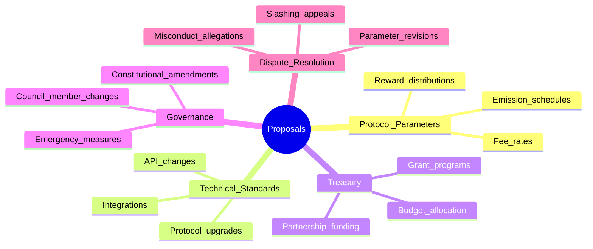
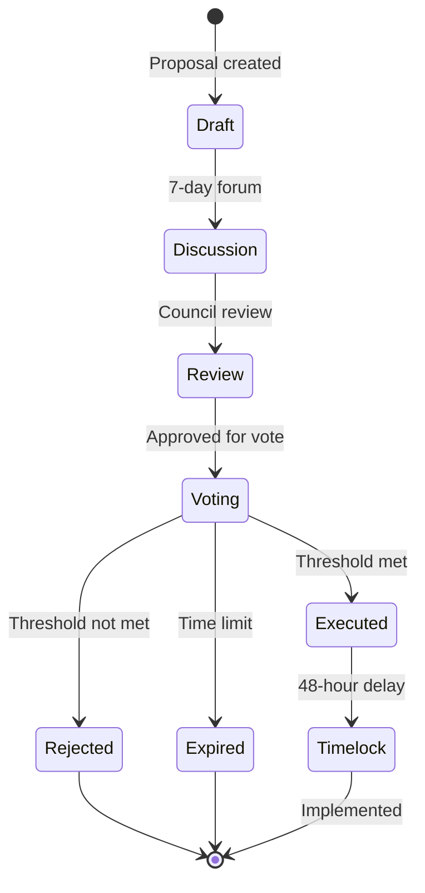
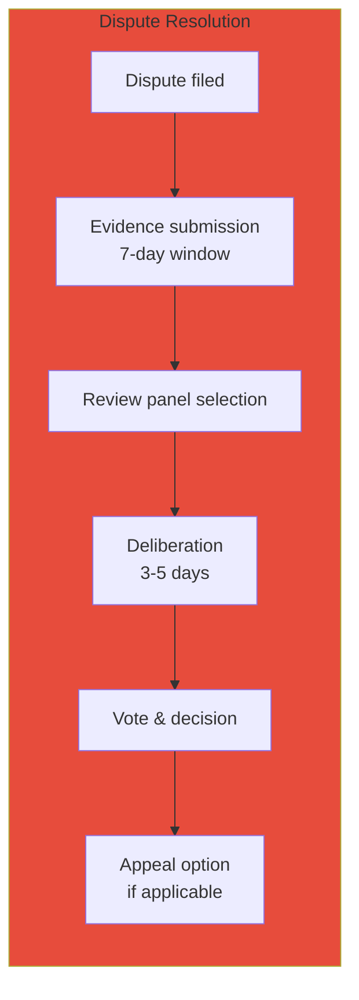

# CipherOcto Governance Model

## Overview

CipherOcto employs a **bicameral governance system** designed to balance capital commitment with actual contribution. This dual-chamber approach ensures that both those who invest in the network and those who build it have meaningful voices in its future.

---

## Governance Philosophy

> **Governance should reflect participation, not just capital.**

Traditional DAO governance suffers from "plutocracy by proxy" — those with the most capital control the direction, regardless of their actual contribution to the ecosystem.

CipherOcto's solution: **Two chambers, distinct powers, united purpose.**

---

## Bicameral Architecture

```mermaid
graph TB
    subgraph CHAMBER1["Chamber 1: OCTO Holders"]
        direction TB
        C1B[Basis: OCTO staked]
        C1V[Voting power: √(stake)]
        C1P[Powers: Protocol-level decisions]
    end

    subgraph CHAMBER2["Chamber 2: Contribution Council"]
        direction TB
        C2B[Basis: Verified contribution]
        C2V[Voting power: Earned reputation]
        C2P[Powers: Execution-level decisions]
    end

    subgraph SHARED["Shared Powers"]
        direction TB
        SP[Constitutional amendments<br/>require both chambers]
    end

    CHAMBER1 --> SHARED
    CHAMBER2 --> SHARED

    style CHAMBER1 fill:#9b59b6
    style CHAMBER2 fill:#3498db
    style SHARED fill:#27ae60
```

---

## Chamber 1: OCTO Holders Assembly

### Composition

**Basis of Participation:** OCTO tokens staked

| Requirement | Value |
| ----------- | ----- |
| **Minimum stake** | 1,000 OCTO |
| **Staking duration** | Minimum 7 days (unstaking requires 7-day unbond) |
| **Voting eligibility** | Staked at time of proposal |

### Voting Power Calculation

```
Voting_Power = √(OCTO_Staked) × Lock_Multiplier

Where:
OCTO_Staked = Number of OCTO tokens staked
Lock_Multiplier = 1.0 (standard) to 2.0 (4-year lock)
```

**Example:**

| OCTO Staked | Square Root | Voting Power (4-yr lock) |
| ----------- | ----------- | ------------------------ |
| 1,000 | 31.6 | 63.2 |
| 10,000 | 100 | 200 |
| 100,000 | 316 | 632 |
| 1,000,000 | 1,000 | 2,000 |

### Powers & Responsibilities

| Power | Threshold | Scope |
| ----- | --------- | ----- |
| **Protocol parameter changes** | 50% participation, 60% approval | Fee rates, emission schedules |
| **Treasury allocation** | 50% participation, 60% approval | Budget approval |
| **Constitutional amendments** | 75% participation, 80% approval | Foundation rules |
| **Emergency measures** | 67% of locked OCTO | Crisis response |

---

## Chamber 2: Contribution Council

### Composition

**Basis of Participation:** Verified contribution to the ecosystem

| Councilor Type | Requirement | Seats |
| -------------- | ----------- | ----- |
| **Compute Provider** | 100K+ OCTO-A earned, reputation >80 | 30 |
| **Developer** | 10+ agents deployed, active maintenance | 25 |
| **Node Operator** | 6+ months uptime, reputation >85 | 20 |
| **Enterprise** | Active customer, 12+ months tenure | 15 |
| **Researcher** | Published papers, protocol contributions | 10 |

**Total Council Size:** 100 members

### Voting Power Calculation

```
Voting_Power = Reputation_Score × Activity_Score × Role_Multiplier

Where:
Reputation_Score = 0-100 (from PoR system)
Activity_Score = Recent contribution level (0.5-2.0)
Role_Multiplier = Sector weight (0.8-1.2)
```

### Powers & Responsibilities

| Power | Threshold | Scope |
| ----- | --------- | ----- |
| **Technical standards** | 50% participation, 60% approval | API changes, protocol upgrades |
| **Role token parameters** | 50% participation, 60% approval | Emission rates, conversion ratios |
| **Dispute resolution** | Panel of 7 | Slashing disputes, misconduct |
| **Integration approvals** | 66% approval | New partnerships, listings |

---

## Shared Powers (Constitutional)

### Amendments Requiring Both Chambers

| Amendment Type | Chamber 1 | Chamber 2 |
| -------------- | --------- | --------- |
| **Constitutional changes** | 75% / 80% | 75% / 80% |
| **Treasury allocation changes** | 50% / 60% | 50% / 60% |
| **New role token creation** | 67% approval | 67% approval |
| **Supply modifications** | 75% / 80% | Not applicable |

**Note:** Both chambers must approve independently for constitutional amendments to pass.

---

## Proposal Types

### Proposal Categories



### Proposal Lifecycle



### Proposal Parameters

| Parameter | Value |
| --------- | ----- |
| **Minimum discussion period** | 7 days |
| **Voting duration** | 5 days |
| **Execution timelock** | 48 hours |
| **Quorum requirement** | 40% for standard, 50% for major |
| **Approval threshold** | 60% standard, 67-80% for major |

---

## Emergency Governance

### Emergency Security Council

**Composition:** 7 members (multi-sig)

| Member | Selection | Term |
| ------ | --------- | ---- |
| **3 protocol founders** | Appointed | Indefinite (removable) |
| **2 council representatives** | Elected by council | 6 months |
| **2 community delegates** | Elected by OCTO holders | 6 months |

### Emergency Powers

| Power | Activation | Duration |
| ---- | ---------- | -------- |
| **Protocol pause** | 5/7 vote | 48 hours max |
| **Emergency upgrades** | 6/7 vote | Immediate, ratification required |
| **Treasury access** | 6/7 vote | Crisis response only |
| **Slashing authority** | 5/7 vote | Security incidents |

### Emergency Checks

| Safeguard | Purpose |
| --------- | ------- |
| **72-hour ratification window** | Full governance must approve |
| **Automatic expiration** | Emergency powers expire if not ratified |
| **Public disclosure requirement** | All actions must be explained |
| **Removal mechanism** | Council can remove emergency members |

---

## Governance Token Mechanics

### Staking for Governance

| Lock Duration | Multiplier | Unbonding Period |
| ------------- | ---------- | ---------------- |
| **Flexible** | 1.0x | 7 days |
| **3-month lock** | 1.25x | 7 days |
| **6-month lock** | 1.5x | 7 days |
| **1-year lock** | 1.75x | 30 days |
| **4-year lock** | 2.0x | 90 days |

**Note:** Longer locks increase voting power but reduce liquidity. Participants choose their preferred balance.

### Delegated Voting

OCTO holders can delegate their voting power without transferring tokens:

| Feature | Description |
| ------- | ----------- |
| **Delegation** | Assign voting power to another address |
| **Revocability** | Can revoke delegation at any time |
| **No transfer required** | Tokens remain in your control |
| **Delegation incentives** | Delegates may share rewards |

---

## Dispute Resolution

### Dispute Categories

| Category | Chamber | Process |
| ---------- | -------- | -------- |
| **Slashing disputes** | Contribution Council | Evidence review, vote |
| **Parameter violations** | Both chambers | Joint review |
| **Governance misconduct** | Emergency Council | Immediate action |
| **Protocol exploits** | Emergency Council | Emergency response |

### Resolution Process



---

## Governance Roadmap

### Phase 1: Foundation (2027)

- Centralized governance by core team
- Advisory board formation
- Community input channels

### Phase 2: Transition (2028)

- OCTO Holder Assembly activation
- Contribution Council formation
- Progressive decentralization

### Phase 3: Full DAO (2029)

- Complete bicameral system operational
- Treasury control transferred
- Emergency Council established

### Phase 4: Maturity (2030+)

- Governance optimization
- Constitutional amendments as needed
- Continuous improvement

---

## Anti-Plutocracy Measures

### Whale Mitigation

| Measure | Effect |
| ------- | ------ |
| **Square-root voting** | Reduces whale dominance |
| **Lock multiplier** | Encourages longer commitment |
| **Contribution council** | Non-capital power center |
| **Delegation limits** | Prevents centralization |

### Sybil Resistance

| Measure | Implementation |
| ------- | --------------- |
| **Minimum stake** | 1,000 OCTO minimum |
| **Reputation decay** | Inactive voting power decreases |
| **Identity verification** | Optional KYC for enhanced voting |
| **Activity scores** | Active participation weighted higher |

---

## Constitutional Principles

### Immutable Principles (Cannot be amended)

1. **Proof of Useful Work** — Tokens represent real contribution
2. **Value Flow Upward** — All activity strengthens OCTO
3. **Zero-Trust Foundation** — Cryptographic guarantees over blind trust
4. **Economic Justice** — Builders earn, not passive holders
5. **Privacy by Default** — Data sovereignty is non-negotiable

### Amendment Principles (95% supermajority required)

1. **Dual-stake requirement** — Both OCTO + role tokens
2. **Bicameral governance** — Two chambers, distinct powers
3. **Treasury backing** — Protocol revenue supports OCTO value
4. **Open by default** — Core infrastructure remains open-source

---

## Summary

| Feature | Implementation |
| ------- | --------------- |
| **Governance model** | Bicameral (two chambers) |
| **Chamber 1** | OCTO Holders Assembly (stake-based) |
| **Chamber 2** | Contribution Council (merit-based) |
| **Voting power** | Square-root of stake (anti-whale) |
| **Proposal types** | Protocol, technical, treasury, governance, disputes |
| **Emergency powers** | Security Council (7 members) |
| **Constitutional protection** | Core principles immutable |
| **Decentralization timeline** | Complete by 2029 |

---

*For token distribution details, see [distribution-schedule.md](./distribution-schedule.md). For token design, see [token-design.md](./token-design.md).*
