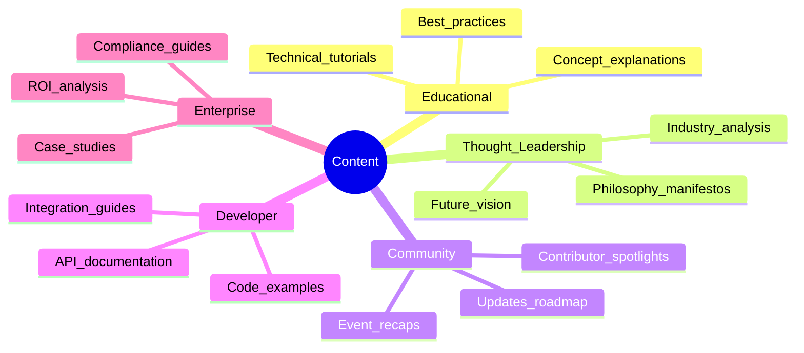
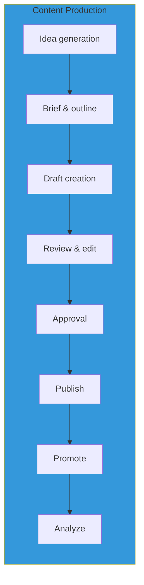
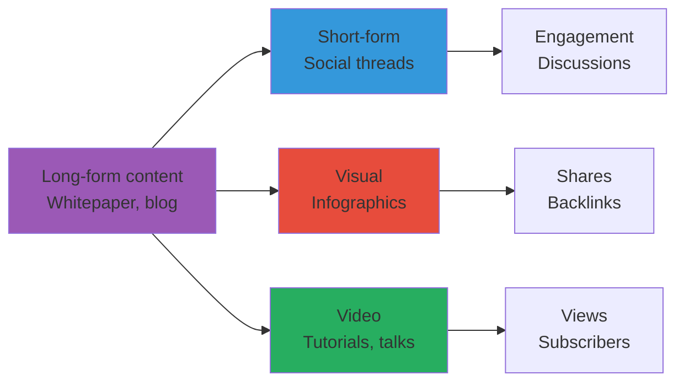

# CipherOcto Content Strategy

## Overview

This document outlines CipherOcto's content strategy for community building, developer adoption, and thought leadership in the decentralized AI space.

---

## Content Philosophy

> **Educate first, promote second.**

Our content should:
1. **Provide genuine value** — Teach, don't just pitch
2. **Build trust through expertise** — Show, don't just tell
3. **Empower the community** — Enable contribution
4. **Maintain transparency** — Honest communication

---

## Content Pillars

---

## Target Audiences

### Primary Personas

| Persona | Content Preferences | Channels |
| ------- | ------------------- | -------- |
| **Developers** | Technical docs, code examples, tutorials | GitHub, Dev.to, YouTube |
| **Enterprise CTOs** | Case studies, ROI analysis, security | LinkedIn, industry reports |
| **Crypto investors** | Tokenomics, governance, roadmap | Twitter, Discord, research reports |
| **AI researchers** | Technical papers, architecture, innovation | ArXiv, conferences, blogs |
| **General community** | Vision, updates, education | Twitter, Discord, Medium |

---

## Content Calendar Framework

### Weekly Cadence

| Day | Content Type | Channel | Purpose |
| --- | ------------ | ------- | ------- |
| **Monday** | Weekly update | Twitter, Discord | Progress, metrics |
| **Tuesday** | Technical deep-dive | Dev.to, blog | Education |
| **Wednesday** | Community spotlight | Discord, Twitter | Recognition |
| **Thursday** | Industry analysis | LinkedIn, blog | Thought leadership |
| **Friday** | Developer tutorial | GitHub, YouTube | Enablement |

### Monthly Cadence

| Timing | Content Type | Format |
| ------ | ------------ | ------ |
| **First week** | Roadmap update | Blog post + infographic |
| **Second week** | Partner announcement | Press release + interview |
| **Third week** | Technical milestone | Blog post + demo |
| **Fourth week** | Community recap | Newsletter + video |

### Quarterly Cadence

| Timing | Content Type | Format |
| ------ | ------------ | ------ |
| **Quarter start** | Goals and priorities | Blog + roadmap update |
| **Quarter end** | Achievements and metrics | State of the Network |
| **Earnings season** | Business metrics | Investor update |

---

## Content Types

### 1. Educational Content

**Purpose:** Establish thought leadership and onboarding

| Content | Format | Frequency | Length |
| ------- | ------ | --------- | ------ |
| **What is X** guides | Blog, video | Weekly | 5-10 min read / 5-10 min video |
| **Technical tutorials** | GitHub, YouTube | Bi-weekly | 15-30 min |
| **Architecture explanations** | Blog, diagrams | Monthly | 10-15 min read |
| **Best practices** | Docs, blog | Monthly | 10-20 min read |

**Example Topics:**
- "What is Proof of Reliability?"
- "How Dual-Stake Security Works"
- "Building Your First CipherOcto Agent"
- "Data Sovereignty in Decentralized AI"

### 2. Technical Content

**Purpose:** Developer enablement and credibility

| Content | Format | Frequency | Length |
| ------- | ------ | --------- | ------ |
| **Code examples** | GitHub snippets | Weekly | Variable |
| **API references** | Documentation | Per release | Comprehensive |
| **Integration guides** | Docs, tutorials | Monthly | 20-40 min |
| **Architecture docs** | GitHub, blog | Per milestone | Detailed |

**Example Topics:**
- "Agent SDK: Complete Guide"
- "Integrating OCTO-W into Your Enterprise"
- "ZK Proofs in CipherOcto: Technical Deep-Dive"
- "Running a CipherOcto Node: Full Guide"

### 3. Business Content

**Purpose:** Enterprise adoption and investor confidence

| Content | Format | Frequency | Length |
| ------- | ------ | --------- | ------ |
| **Case studies** | Blog, PDF | Monthly | 3-5 pages |
| **ROI analysis** | Blog, calculator | Quarterly | 2-3 pages |
| **Comparison papers** | Blog, whitepaper | Per competitor | 5-10 pages |
| **Compliance guides** | PDF, docs | Per regulation | 10-20 pages |

**Example Topics:**
- "How TechCorp Saved 40% on AI Costs"
- "SOC2 Compliance with Decentralized AI"
- "Centralized vs Decentralized AI: A Comparison"
- "Building a Business Case for CipherOcto"

### 4. Community Content

**Purpose:** Engagement and growth

| Content | Format | Frequency | Length |
| ------- | ------ | --------- | ------ |
| **Contributor spotlights** | Blog, social | Weekly | 500-1000 words |
| **Event recaps** | Blog, video | Per event | 5-10 min read/video |
| **AMA summaries** | Discord, blog | Monthly | Q&A summary |
| **Challenge announcements** | Social, blog | Per challenge | Rules + prizes |

**Example Topics:**
- "Contributor Spotlight: Agent Developer X"
- "EthCC 2027: Key Takeaways"
- "Monthly AMA: July 2027 Recap"
- "Build-an-Agent Challenge: $10K in Prizes"

### 5. Thought Leadership

**Purpose:** Vision and industry influence

| Content | Format | Frequency | Length |
| ------- | ------ | --------- | ------ |
| **Industry analysis** | Blog, LinkedIn | Bi-weekly | 800-1200 words |
| **Vision essays** | Blog, Medium | Monthly | 1500-2500 words |
| **Conference talks** | Video, slides | Per event | 30-60 min |
| **Research papers** | ArXiv, conferences | Quarterly | Academic format |

**Example Topics:**
- "The Future of AI Infrastructure"
- "Why Decentralization Matters for AGI"
- "Economic Alignment in AI Systems"
- "The Ocean Philosophy: A New Paradigm"

---

## Channel Strategy

### Owned Channels

| Channel | Content Type | Frequency | Goal |
| ------- | ------------ | --------- | ---- |
| **Blog** | Educational, technical, business | 2-3x/week | SEO, authority |
| **Documentation** | Technical, onboarding | Per release | Enablement |
| **GitHub** | Code, issues, discussions | Daily | Development |
| **Discord** | Community, support | Continuous | Engagement |
| **Newsletter** | Curated updates | Weekly | Retention |

### Earned Channels

| Channel | Content Type | Frequency | Goal |
| ------- | ------------ | --------- | ---- |
| **Twitter/X** | Updates, threads, engagement | Daily | Awareness |
| **LinkedIn** | Business content, company updates | 3-5x/week | Enterprise |
| **YouTube** | Tutorials, talks, demos | Weekly | Education |
| **Dev.to / Hashnode** | Technical tutorials | Bi-weekly | Developers |
| **Reddit** | Discussions, AMAs | Weekly | Community |

### Paid Channels

| Channel | Content Type | Budget | Goal |
| ------- | ------------ | ------ | ---- |
| **Search ads** | Educational content | SEO budget | Intent capture |
| **Social ads** | Awareness content | Growth budget | Reach |
| **Sponsorships** | Event, podcast, newsletter | Partnership budget | Credibility |

---

## Content Production Workflow

### Creation Process

### Roles & Responsibilities

| Role | Responsibilities |
| ---- | ---------------- |
| **Content lead** | Strategy, calendar, coordination |
| **Technical writers** | Documentation, tutorials |
| **Developer advocates** | Code examples, demos |
| **Subject matter experts** | Reviews, accuracy |
| **Designers** | Visuals, diagrams |
| **Social media manager** | Distribution, engagement |

---

## Content Metrics

### KPIs by Channel

| Channel | Primary Metrics | Secondary Metrics |
| ------- | --------------- | ----------------- |
| **Blog** | Pageviews, time on page | Shares, backlinks |
| **Documentation** | Pageviews, bounce rate | Issue reduction |
| **Twitter/X** | Followers, engagement | Referrals, mentions |
| **YouTube** | Views, watch time | Subscribers, clicks |
| **Discord** | Active members, messages | Retention, conversions |

### Content Performance

| Metric | Target | Measurement |
| ------ | ------ | ----------- |
| **Blog readership** | 10K+ monthly | Analytics |
| **YouTube subscribers** | 5K+ Year 1 | Platform analytics |
| **Twitter followers** | 25K+ Year 1 | Platform analytics |
| **Documentation usage** | 50K+ monthly | Analytics |
| **Newsletter subscribers** | 5K+ Year 1 | ESP analytics |

---

## Content Library

### Core Documents

| Document | Status | Owner | Update Frequency |
| ---------- | ------ | ----- | ---------------- |
| **Whitepaper** | v1.0 complete | Foundation team | Quarterly updates |
| **Litepaper** | v1.0 complete | Foundation team | Quarterly updates |
| **One-pager** | To be created | Marketing | Per major release |
| **Pitch deck** | To be created | BD team | Per audience |
| **Technical overview** | To be created | Engineering | Per milestone |

### Tutorial Series

| Series | Status | Episodes |
| ------- | ------ | -------- |
| **Getting Started** | Planned | 10 |
| **Agent Development** | Planned | 15 |
| **Node Operation** | Planned | 8 |
| **Enterprise Integration** | Planned | 12 |

---

## Content Governance

### Style Guidelines

| Guideline | Application |
| ---------- | ---------- |
| **Tone** | Professional, accessible, visionary |
| **Voice** | First-person plural ("we") |
| **Complexity** | Explain technical concepts clearly |
| **Accuracy** | Technical review required |
| **Transparency** | Honest about limitations |

### Approval Process

| Content Type | Review Required | Approver |
| -------------- | --------------- | --------- |
| **Technical docs** | Technical accuracy | Engineering lead |
| **Business content** | Accuracy, positioning | BD lead |
| **Announcements** | Timing, messaging | Executive team |
| **Social media** | Brand, tone | Marketing lead |

---

## Content Repurposing

### Content Recycling Strategy

**Examples:**
- Whitepaper → 10 blog posts → 50 social threads → 5 videos
- Technical tutorial → Documentation → Demo video → Workshop
- Case study → Infographic → LinkedIn post → Webinar

---

## Sample Content Calendar (Month 1)

| Week | Monday | Tuesday | Wednesday | Thursday | Friday |
| ---- | ------ | ------- | --------- | --------- | ------ |
| **1** | Weekly update | "What is CipherOcto?" | Contributor spotlight | Industry analysis | Tutorial #1 |
| **2** | Weekly update | "The Ocean Stack explained" | Contributor spotlight | "AI infrastructure trends" | Tutorial #2 |
| **3** | Weekly update | "Proof of Reliability deep-dive" | Contributor spotlight | "Centralization risks in AI" | Tutorial #3 |
| **4** | Monthly recap | "Dual-stake model guide" | Contributor spotlight | "Future of AI governance" | Tutorial #4 |

---

*For partnership strategy, see [partnerships.md](./partnerships.md). For community engagement, join Discord.*
