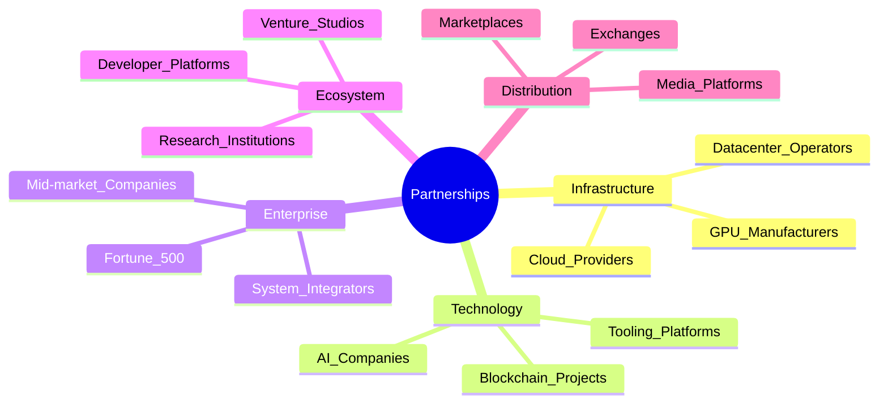
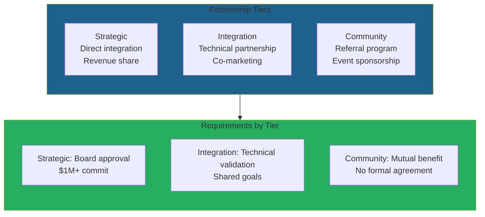
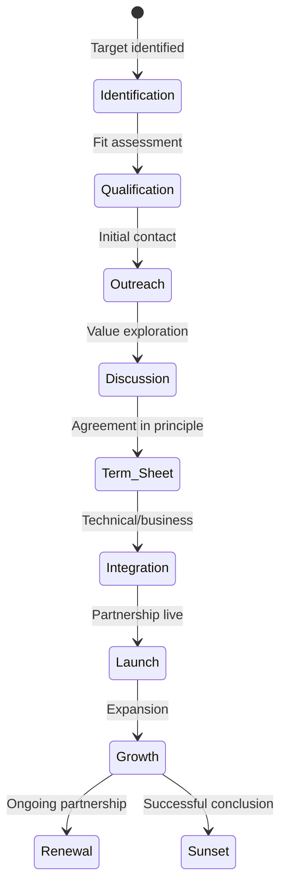

# CipherOcto Partnership Strategy

## Overview

CipherOcto's growth depends on strategic partnerships across the AI, blockchain, and enterprise landscapes. This document outlines our partnership framework, target categories, and collaboration models.

---

## Partnership Philosophy

> **We build infrastructure, not walled gardens.**

Partnerships should:
1. **Expand ecosystem value** — Create net-new opportunities
2. **Maintain decentralization** — No central points of control
3. **Benefit all participants** — Mutual value creation
4. **Preserve user sovereignty** — No lock-in or extraction

---

## Partnership Categories

---

## Category 1: Infrastructure Partners

### Cloud Providers

**Target:** Regional cloud providers seeking AI capabilities

| Partner Type | Value Proposition | Collaboration Model |
| ------------ | ----------------- | ------------------- |
| **Regional clouds** | Expand AI offering without CAPEX | OCTO integration, revenue share |
| **Specialized providers** | GPU/TPU optimization | Technical partnership |
| **Sovereign clouds** | National AI infrastructure | Compliance-friendly deployment |

** Partnership Benefits:**

- **For CipherOcto:** Geographic distribution, enterprise credibility
- **For Partners:** AI capabilities without infrastructure investment

### GPU Manufacturers

**Target:** NVIDIA, AMD, Intel

| Collaboration | Mutual Benefit |
| ------------- | -------------- |
| **Early access** | Testnet on new hardware |
| **Optimization** | Driver-level integration |
| **Co-marketing** | "Optimized for" branding |

### Datacenter Operators

**Target:** Operators with 500+ GPUs

| Program | Benefits |
| ------- | -------- |
| **Foundation Partner** | Early token allocation, premium rates |
| **Regional Hub** | Exclusive regional incentives |
| **Super Node** | Cross-role staking priority |

---

## Category 2: Technology Partners

### AI Companies

#### Model Providers

**Target:** OpenAI, Anthropic, Cohere, Mistral

| Integration | OCTO-W Bridge |
| ----------- | -------------- |
| **Enterprise quota resale** | Monetize unused subscriptions |
| **Model hosting** | Decentralized inference |
| **Agent compatibility** | Cross-platform agents |

#### Tooling Platforms

**Target:** LangChain, AutoGPT, CrewAI

| Integration | Collaboration |
| ----------- | ------------- |
| **SDK compatibility** | Native framework support |
| **Agent marketplace** | Distribution channel |
| **Co-development** | Joint feature development |

### Blockchain Projects

#### Layer 1 / Layer 2

**Target:** Ethereum, Arbitrum, Optimism, Polygon, Solana

| Collaboration | Implementation |
| ------------- | -------------- |
| **Native deployment** | Primary or secondary chain |
| **Grant programs** | Ecosystem fund |
| **Technical integration** | Bridge, oracle support |

#### DePIN Projects

**Target:** Akash, Render, Filecoin

| Collaboration | Opportunity |
| ------------- | ----------- |
| **Resource sharing** | Cross-network providers |
| **Token swaps** | Liquidity partnerships |
| **Standard protocols** | Interoperability standards |

---

## Category 3: Enterprise Partners

### Fortune 500 Integration

**Target Approach:** Dedicated enterprise program

| Program Tier | Requirements | Benefits |
| ------------ | ------------ | -------- |
| **Design Partner** | $100K+ commit, early adopter | Discounts, co-development |
| **Strategic Partner** | $500K+ commit, multi-year | Custom integrations, support |
| **Foundation Partner** | $1M+ commit, board seat | Strategic direction, priority |

### System Integrators

**Target:** Accenture, Deloitte, KPMG, boutique AI consultancies

| Collaboration | Model |
| ------------- | ----- |
| **Implementation partner** | Revenue share on deployments |
| **Certification program** | Partner training, badges |
| **Referral program** | Commission on customer acquisition |

---

## Category 4: Ecosystem Partners

### Developer Platforms

**Target:** Replit, GitHub, Vercel, Supabase

| Integration | Value |
| ----------- | ----- |
| **Template marketplace** | One-click deployment |
| **SDK integration** | Native development experience |
| **Co-marketing** | Hackathon sponsorship |

### Research Institutions

**Target:** Leading AI research labs, universities

| Collaboration | Output |
| ------------- | ------ |
| **Grant programs** | Research funding |
| **Data access** | Privacy-preserving datasets |
| **Talent pipeline** | Recruitment channel |

---

## Partnership Tiers

### Tier Definitions

### Tier Comparison

| Aspect | Strategic | Integration | Community |
| ------ | --------- | ----------- | --------- |
| **Agreement type** | Contract | MOU | Informal |
| **Revenue share** | Yes | Maybe | No |
| **Board seat** | Observer | No | No |
| **Early access** | Yes | Yes | No |
| **Co-marketing** | Significant | Moderate | Light |
| **Technical support** | Dedicated | Standard | Community |

---

## Partnership Process

### Lifecycle

### Timeline

| Stage | Duration | Key Activities |
| ----- | -------- | -------------- |
| **Identification** | Ongoing | Market research, landscape analysis |
| **Qualification** | 1-2 weeks | Fit assessment, resource check |
| **Outreach** | 1-2 weeks | Initial meetings, value proposition |
| **Discussion** | 2-4 weeks | Deep dive, term sheet drafting |
| **Integration** | 1-3 months | Technical/business integration |
| **Launch** | 1 month | Go-to-market, announcement |
| **Growth** | Ongoing | Optimization, expansion |

---

## Partnership Models

### Model 1: Resource Contribution

**Description:** Partners contribute resources to the network

| Resource Type | Partner Example | Reward |
| ------------- | --------------- | ------ |
| **Compute** | Datacenter with idle GPUs | OCTO-A earnings |
| **Storage** | Storage provider | OCTO-S earnings |
| **Bandwidth** | Network operator | OCTO-B earnings |

### Model 2: Technology Integration

**Description:** Partners integrate CipherOcto into their products

| Integration Type | Partner Example | Benefit |
| ---------------- | --------------- | ------- |
| **SDK inclusion** | Developer platform | Agent distribution |
| **API adoption** | SaaS platform | AI capabilities |
| **White-label** | Enterprise software | Private AI layer |

### Model 3: Distribution

**Description:** Partners distribute CipherOcto to their users

| Distribution Type | Partner Example | Revenue Model |
| ----------------- | --------------- | ------------- |
| **Resale** | System integrator | Margin on services |
| **Co-selling** | Cloud provider | Revenue share |
| **Marketplace** | AI tool marketplace | Commission |

### Model 4: Co-Development

**Description:** Partners build jointly on CipherOcto

| Development Type | Partner Example | Ownership |
| ---------------- | --------------- | --------- |
| **Joint feature** | AI company | Shared IP |
| **Standard protocol** | Industry consortium | Open source |
| **Research project** | University | Publication rights |

---

## Sample Partner Profiles

### Profile 1: Regional Cloud Provider

**Partner:** "CloudAsia" (fictional)

| Attribute | Value |
| ---------- | ----- |
| **Location** | Southeast Asia |
| **Assets** | 5 regional datacenters |
| **GPUs** | 1,000+ (mostly H100) |
| **Challenge** | Low utilization outside APAC hours |
| **Solution** | Connect to CipherOcto during off-hours |
| **Revenue** | +$200K/month in OCTO-A |
| **Value** | Global customer base, 24/7 utilization |

### Profile 2: Enterprise Customer

**Partner:** "Fortune 500 Financial Services"

| Attribute | Value |
| ---------- | ----- |
| **AI Spend** | $5M annually |
| **Challenge** | $2M in unused OpenAI/Anthropic quotas |
| **Solution** | OCTO-W marketplace resale |
| **Revenue** | $1.2M recovered (60% recovery rate) |
| **Value** | Cost reduction + vendor independence |

### Profile 3: Developer Platform

**Partner:** AI agent framework (fictional)

| Attribute | Value |
| ---------- | ----- |
| **Users** | 50,000 developers |
| **Challenge** | Limited monetization options |
| **Solution** | Agent marketplace integration |
| **Revenue** | 10% commission on agent earnings |
| **Value** | New revenue stream for developers |

---

## Partnership Anti-Patterns

### Relationships We Avoid

| Anti-Pattern | Reason |
| ------------ | ------ |
| **Exclusive arrangements** | Violates decentralization |
| **Vendor lock-in** | Contradicts our mission |
| **Centralized gatekeepers** | Creates single points of failure |
| **Extractive terms** | Must benefit all parties |
| **Mission drift** | Must align with sovereignty values |

---

## Partnership Metrics

### KPIs

| Metric | Target | Measurement |
| ------ | ------ | ----------- |
| **Active partners** | 50+ by Year 2 | Signed agreements |
| **Partner revenue** | 20% of total | Transaction volume |
| **Co-developed features** | 10+ by Year 3 | Joint deployments |
| **Partner satisfaction** | 4.5/5 | Quarterly surveys |
| **Partner retention** | 80%+ | Annual renewal rate |

---

## Contact

**Partnership Inquiries:** partners@cipherocto.io

**Information Needed:**
- Company name and website
- Partnership interest category
- Proposed collaboration model
- Timeline and decision process

---

*For growth strategy, see [content-strategy.md](./content-strategy.md). For business development, see [competitive-analysis.md](../02-product/competitive-analysis.md).*
