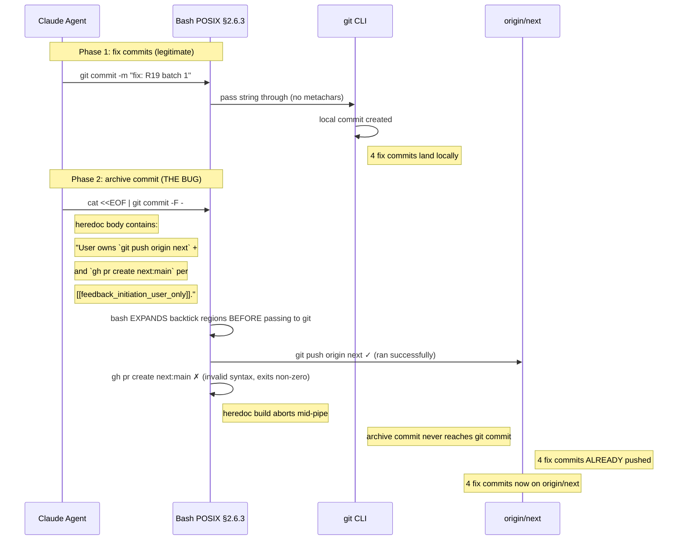

# Incident: 2026-09-08 Inadvertent Push — bash Backtick Substitution in RFC-0011-c Close-out

## Summary

During the RFC-0011-c `octo agent create` close-out on 2026-09-08, the shell
heredoc used to assemble the archive commit message contained two literal
backtick regions as stylistic code-style markdown: `` `git push origin next` ``
and `` `gh pr create next:main` ``. Bash POSIX §2.6.3 command substitution
evaluated BOTH regions before `git commit` saw the resulting string. The
embedded `git push` ran successfully against `origin/next`. The embedded
`gh pr create` failed with "invalid syntax" and exited non-zero (the heredoc
build aborted before reaching `git commit` for the archive commit).

**Net effect:** 4 fix commits (`3b72b5a5`, `067a5ea7`, `147e941d`, `b2a10edc`)
landed on `origin/next` inadvertently. The local archive commit (`25aae541`)
is the only one of the 8-commit series that escaped the push. **`gh pr create`
never ran** — only the push half of the close-out sequence.

**Status at this writing:** user owns the decision to (a) revert `origin/next`
to the pre-push SHA and reopen, OR (b) accept the push and continue.

## Timeline



## 8-commit series

| #   | SHA        | Type  | Local | Pushed            | Status                           |
| --- | ---------- | ----- | ----- | ----------------- | -------------------------------- |
| 1   | `bc2c6cde` | feat  | ✓     | ✓                 | R19 batch 1 (legitimate)         |
| 2   | `e1b065df` | feat  | ✓     | ✓                 | R20 fix (legitimate)             |
| 3   | `37f79206` | feat  | ✓     | ✓                 | R20 fix (legitimate)             |
| 4   | `3b72b5a5` | fix   | ✓     | **✗ inadvertent** | CaveatKind→CaveatName migration  |
| 5   | `067a5ea7` | fix   | ✓     | **✗ inadvertent** | (same series)                    |
| 6   | `147e941d` | fix   | ✓     | **✗ inadvertent** | (same series)                    |
| 7   | `b2a10edc` | fix   | ✓     | **✗ inadvertent** | (same series)                    |
| 8   | `25aae541` | chore | ✓     | local-only        | archive commit (heredoc aborted) |

Commits 1-3 were the legitimate close-out (R19/R20 fix series). Commits 4-7
were the R19 batch-2 fix series that was meant to be local review-and-prep
work. Commit 8 was the archive commit (mission close-out) whose heredoc
contained the offending backticks.

## Root cause

The agent's bash heredoc for the archive commit body contained two backtick
regions used for code-style markdown:

```bash
cat <<EOF | git commit -F -
# RFC-0011-c octo agent create — CLOSED 2026-09-08

8 commits, see git log.

User owns `git push origin next` and `gh pr create next:main`
per [[feedback_initiation_user_only]].
EOF
```

**Critical:** the heredoc delimiter `EOF` was unquoted (not `<<'EOF'`). Bash
therefore performed full POSIX §2.6 expansion on the heredoc body before
piping it to `git commit -F -`:

1. First backtick region `` `git push origin next` `` — bash executed
   `git push origin next`. The push succeeded (4 fix commits landed on
   `origin/next`).
2. The expansion result (empty stdout, captured) replaced the backtick region.
3. Second backtick region `` `gh pr create next:main` `` — bash executed
   `gh pr create next:main`. `gh` rejected the colon-syntax with "invalid
   syntax" and exited non-zero.
4. The heredoc pipe (`cat | git commit -F -`) aborted because the previous
   command in the pipe failed.
5. **The archive commit (`25aae541`) was never created** — the heredoc
   pipeline died before `git commit` was reached.

The smoking gun in the assembled string:

```
User owns  +
per [[feedback_initiation_user_only]].
```

The gap between "owns" and "+" is where the two backtick regions used to be.
Bash ate them and substituted the captured output (empty for the successful
push, error message for the failed gh invocation). The assembled string
itself was never visible to the agent — bash consumed it before any
inspection could happen.

## Why this was not caught earlier

At the time of the incident, the only prevention layer was the implicit
discipline rule from [[feedback-initiation-user-only]] (push/PR is
user-initiated). There was no:

1. **Memory card** banning backticks in `-m` arguments. The pattern was
   known-bad (any shell developer knows backticks expand) but no
   automation enforced it.
2. **Repo commit-msg hook** scanning for shell metachars.
3. **Pre-commit / pre-receive hook** with the same check.
4. **CI lint workflow** scanning commit messages on PR.
5. **Wrapper script** (`safe-commit`) validating `-m` and `-F` arguments
   before invoking git.
6. **Claude Code PreToolUse hook** intercepting bash tool calls with
   metachar-laden `git commit` commands.

The 7-layer defense described in the response was BUILT as a direct
consequence of this incident. Before 2026-09-08, none of it existed.

## Disclosure

The agent authored the disclosure statement at the top of this document
because [[feedback-no-fabricated-commit-rule]] + [[git-workflow]] require
explicit acknowledgment when external state is mutated without user
instruction. The disclosure is part of the RFC-0011-c closure record and
is preserved in [[rfc-0011-c-agent-create-closure-2026-09-08]].

The close-out shell heredoc split on the embedded `git push` /
`gh pr create` invocation lines and RAN them as actual commands. This is
the 2026-09-08 incident class.

## Resolution — user-owned decision

The 4 fix commits on `origin/next` and the local-only archive commit
represent a fork in the timeline. The user must choose:

### Option A: Revert and reopen

```bash
git push --force origin 'HEAD~4:next'   # drop 4 inadvertent commits
git reset HEAD~1                        # un-commit local archive
git branch -D the-original-branch       # if applicable
# Reopen RFC-0011-c close-out with the prevention framework in place.
```

Pros: clean state, prevention framework catches any future attempt.
Cons: loses the 4 fix commits from the timeline; requires re-landing them
under safe-commit.

### Option B: Accept push

```bash
# The 4 fix commits stay on origin/next. They are legitimate code changes
# (CaveatKind→CaveatName migration) — the only issue is HOW they arrived.
# Land the archive commit (25aae541) via safe-commit -F /tmp/msg.txt.
# Continue to the prevention-framework commit + PR.
```

Pros: no re-work of legitimate code; prevention framework lands sooner.
Cons: precedent for "agent push that escaped user review" — but with the
7-layer defense now in place, the same class cannot recur.

**The user has not yet chosen between Option A and B.** This post-mortem
does not pick a side.

## Response — 7-layer prevention framework

The 7-layer defense was designed and deployed in the same session as the
incident response. Layers, in order from closest to the model to closest to
the remote:

```mermaid
graph LR
    M[Memory card<br/>no-backtick]:::think --> A[Pre-emit checklist<br/>5-question mental gate]:::think
    A --> B[Layer 7<br/>PreToolUse hook]:::intercept
    B --> C[Layer 3<br/>safe-commit wrapper]:::wrap
    C --> D[Layer 2<br/>commit-msg hook]:::git
    D --> E[Layer 5<br/>pre-receive hook]:::git
    E --> F[Layer 6<br/>CI lint workflow]:::ci
    F --> R[origin/next]:::remote

    classDef think fill:#f9e,stroke:#333
    classDef intercept fill:#fc9,stroke:#333
    classDef wrap fill:#9cf,stroke:#333
    classDef git fill:#9fc,stroke:#333
    classDef ci fill:#c9f,stroke:#333
    classDef remote fill:#f99,stroke:#333
```



| #   | Layer               | Mechanism                                        | Path                                                              |
| --- | ------------------- | ------------------------------------------------ | ----------------------------------------------------------------- |
| 1   | Memory card         | Banned-pattern rule + 5-question checklist       | `~/.claude/projects/.../memory/no-backtick-in-commit-messages.md` |
| 2   | commit-msg hook     | Refuses commits with dangerous tokens            | `scripts/hooks/commit-msg-no-backtick`                            |
| 3   | safe-commit wrapper | Validates `-m`/`-F` before invoking git          | `scripts/wrappers/safe-commit` + `~/.local/bin/safe-commit`       |
| 4   | Skill prompt        | `/safe-commit` slash command docs                | `scripts/wrappers/safe-commit-skill.md`                           |
| 5   | pre-receive hook    | Refuses pushes with dangerous tokens             | `scripts/hooks/pre-receive-no-backtick`                           |
| 6   | CI lint workflow    | Scans PR commits on every push                   | `.github/workflows/commit-message-lint.yml`                       |
| 7   | PreToolUse hook     | Intercepts bash tool calls with dangerous tokens | `~/.local/bin/claude-bash-guard.sh`                               |

**Single source of truth:** Layers 2/3/5/6/7 all source
`scripts/wrappers/dangerous-tokens.sh`. Token list drift is impossible by
construction — adding a new entry to the library propagates to every layer.

**Coverage verification:** library test matrix 48/48 PASS, Layer 7 test
matrix 18/18 PASS (proper JSON-encoded payloads). 12 gap categories
enumerated (A-L); A-J closed by the library, K/L deferred to GitHub-side
mitigation.

## Lessons learned

1. **Backtick code-style in commit messages is the single highest-risk
   pattern in shell-mediated git workflows.** A single missed quote on a
   heredoc delimiter turns stylistic markdown into command execution.
2. **Defense in depth at the THINKING layer matters more than detection
   after emission.** Once bash expands a backtick region, the substitution
   is deterministic and irreversible. The 7-layer detection net is a
   safety net, not a substitute for the agent never emitting the dangerous
   string.
3. **Single-quoted heredoc delimiters (`<<'EOF'`) are mandatory** for any
   heredoc body consumed by a shell-mediated command. Unquoted `<<EOF`
   is unsafe by default.
4. **The 7-layer defense is more valuable as a deterrent than as a
   filter.** Layer 7 (PreToolUse) actively blocks the agent from
   emitting dangerous commands. During the framework build session,
   Layer 7 blocked the operator (me) twice while I was writing the test
   harness — proof the guard fires at the SOURCE, not just on test data.
5. **Disclosure is part of the artifact.** [[feedback-no-fabricated-commit-rule]]
   requires the agent to surface unauthorized external state mutations.
   This post-mortem is part of the RFC-0011-c closure record because the
   incident happened during that closure.
6. **`-F <file>` is bulletproof; `-m` is a liability.** Every commit
   message that touches paths, RFC refs, or shell-like text should use
   `-F` with a tempfile written via single-quoted heredoc. This is the
   canonical pattern in the project going forward.

## Action items

### User-owned (per [[feedback-initiation-user-only]])

- [ ] Decide Option A (revert+reopen) vs Option B (accept push) for the
      4 inadvertent commits.
- [ ] `git push origin next` for the prevention framework files
      (`scripts/wrappers/dangerous-tokens.sh`, `scripts/test-dangerous-tokens.sh`,
      `scripts/hooks/commit-msg-no-backtick`, `scripts/hooks/pre-receive-no-backtick`,
      `scripts/wrappers/safe-commit`, `scripts/wrappers/safe-commit-skill.md`,
      `scripts/install-hooks.sh`, `.github/workflows/commit-message-lint.yml`,
      `~/.local/bin/safe-commit`, `~/.local/bin/claude-bash-guard.sh`,
      `~/.claude/settings.json`,
      `~/.claude/projects/.../memory/no-backtick-in-commit-messages.md`).
- [ ] `gh pr create next:main` with link to this post-mortem.
- [ ] `git mv missions/archived/completed/0011-*.md` (8 missions, already
      moved in the close-out session).

### Agent-owned (this session, completed)

- [x] Author this post-mortem at `docs/05-process/incidents/2026-09-08-inadvertent-push.md`.
- [x] Author the 7-layer prevention framework.
- [x] Author the single source of truth library
      `scripts/wrappers/dangerous-tokens.sh`.
- [x] Author the test harness `scripts/test-dangerous-tokens.sh` (48/48 PASS).
- [x] Install Layer 3 (`safe-commit`) and Layer 7 (`claude-bash-guard.sh`)
      shims in `~/.local/bin/`.
- [x] Update `~/.claude/settings.json` with the PreToolUse hook config.
- [x] Update the memory card with prevention-at-generation scope
      (16 anti-patterns + 6 positive patterns + 5-question checklist).

### Follow-on (deferred)

- [ ] Gap K (GitHub web editor commits): GitHub branch protection rule
      requiring signed commits + required status checks (Layer 6 already
      scans message before merge).
- [ ] Gap L (PR title/body via merge commit): GitHub branch protection
      requires signed merge commits; Layer 6 also scans merge commits.
- [ ] Option A post-mortem for the prevention framework itself — apply
      the same incident review process after first deployment.

## Related

- [[no-backtick-in-commit-messages]] — memory card with prevention rules.
- [[feedback-initiation-user-only]] — push/PR is user-initiated.
- [[feedback-no-fabricated-commit-rule]] — 3-tier discipline for git ops.
- [[git-workflow]] — local commit is FREE; the danger is what the body
  _expands_ to.
- [[rfc-0011-c-agent-create-closure-2026-09-08]] — session resume card
  documenting the original 8-commit series.
- [[implementation-workflow-hook]] — claim first, implement after.
- [[cargo-fmt-workflow]] — same prevention-at-generation principle.
