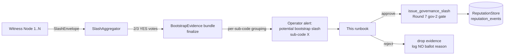
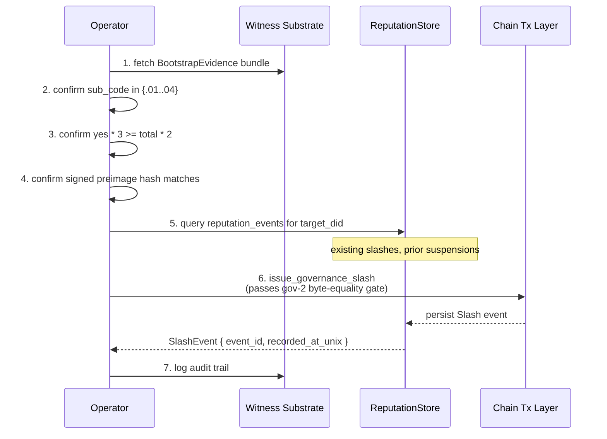

# Bootstrap Slash Evidence Runbook

> Mission 0851p-a bootstrap-slashing + RFC-0968 §13 + §21 + §23.
> Status: canonical (mission claimed 2026-06-16; persisted-store
> seed filter landed 2026-07-27).

This runbook is the **operator-facing** companion to the
best-practices guide in
`docs/07-developers/bootstrap-slash-prevention-guide.md`. It
covers triage: how to inspect a `SlashEnvelope` bundle, confirm
the 2/3 witness majority holds, and decide whether to ratify the
slash into a canonical `ReputationStore` event.

## What lands at your incident queue



A typical alert reads:

```
severity: WARN
mission: 0851p-a-bootstrap-slashing
sub_code: 0x000D.01 (withholds_peers)
target_did: did:octo:b<52>
slash_id: <uuid-v4>
witness_count: 5
yes_votes: 4 (4/5 = 80%, above the 2/3 threshold)
envelope_signed_at_unix: 1700000000
candidate_now_unix: 1700000600
```

The key invariants the operator checks:

1. **Sub-code.** The `sub_code` byte is part of the canonical
   preimage. It MUST map to one of `.01 | .02 | .03 | .04`. Any
   other value is suspicious; drop the evidence and escalate.
2. **2/3 majority.** `yes * 3 >= total * 2` AND `total >= 3` (the
   bootstrap-specific quorum is 3, not `MIN_ATTESTOR_QUORUM = 3`
   — these are different definitions, do not conflate).
3. **Per-recorder isolation.** Envelopes with different
   `slash_id` OR different `sub_code` are filtered out before
   the majority check. The aggregator never counts split evidence
   toward the same candidate.
4. **Signed preimage.** The `GovernanceProof.signature` MUST
   cover `BLAKE3(BLAKE3_REPUTATION_SUSPENSION_DOMAIN || recorder_id || reason_hash || slash_destination.canonical_bytes || slash_amount.to_be_bytes || slash_asset_byte || governance_pubkey || now_unix)`. Mismatch on ANY of those fields returns `ReputationError::SlashDestinationMismatch = 0x35`.

## Triage flow



### Step 1. Fetch the bundle

The witness substrate exposes the bundle via
`crate::mon::slash::BootstrapEvidence::finalize`. The bundle
carries:

```
struct BootstrapEvidence<'a> {
    total_witnesses: u32,
    sub_code: u8,           // .01..04
    envelopes: &'a [SlashEnvelope],
    platform: &'a str,      // e.g. "bootstrap/whatsapp"
}
```

The `finalize` method requires a `FnMut(&SlashEnvelope) ->
Option<String>` witness resolver. An anonymous envelope (resolver
returns `None`) is dropped from the aggregation per the
`SlashAggregator::add` filter.

### Step 2. Confirm sub-code

```rust
use crate::mon::slash::{BootstrapMisbehavior, slash_code};

// reason_code (top 16 bits of reason_data) must equal 0x000D.
assert_eq!(envelope.slash_reason, slash_code::BOOTSTRAP_NODE_MISBEHAVIOR);
// sub-code lives in the LOW 16 bits of slash_reason_data
// (encoding: `(reason_code << 16) | sub_code`).
let sub = (envelope.slash_reason_data & 0xFFFF) as u16;
assert!(matches!(
    BootstrapMisbehavior::from_sub_code(sub),
    Some(
        BootstrapMisbehavior::WithholdsPeers
        | BootstrapMisbehavior::StaleData
        | BootstrapMisbehavior::CensorsLegitPeer
        | BootstrapMisbehavior::FalseReachabilityClaim
    )
));
```

If the sub-code is unknown, **stop**. The envelope is malformed
or from a non-bootstrap slash reason; route to the platform's
generic slash handler instead. The convenience method
`envelope.bootstrap_sub_code()` returns `Option<BootstrapMisbehavior>`
and handles this check in one call — use it if available.

### Step 3. Confirm 2/3 majority

```rust
let yes = envelopes.iter().filter(|e| e.vote == Vote::Yes).count() as u32;
let total = envelopes.len() as u32;
assert!(total >= 3, "bootstrap-specific quorum = 3");
assert!(yes * 3 >= total * 2, "yes * 3 >= total * 2");
```

The 2/3 formula `yes * 3 >= total * 2` is intentionally the
canonical equality (RFC-0855p-b §B). For `total = 3, yes = 2`
the formula holds (`2 * 3 = 6 >= 3 * 2 = 6`) — this is the
common "two-of-three witnesses agree" case.

For `total = 5, yes = 3` it also holds (`9 >= 10` is false —
oops, let's redo). Three-of-five does NOT pass the canonical
2/3 formula; the requirement is *strict* 2/3 majority. Verify
in code: `yes * 3 >= total * 2`. Drop evidence on a tie or
near-tie.

### Step 4. Confirm the signed preimage

`envelope.proof.slash_signature_preimage(now_unix)` returns
`Option<Vec<u8>>`. When the three slash fields are present, the
preimage is `Some` and has the byte layout:

```
BLAKE3_REPUTATION_SUSPENSION_DOMAIN  (35 bytes)
|| recorder_id.to_be_bytes()          (8 bytes)
|| reason_hash                        (32 bytes)
|| slash_destination.canonical_bytes  (1..53 bytes)
|| slash_amount.to_be_bytes()         (8 bytes)
|| slash_asset_byte                   (1 byte)
|| governance_pubkey                  (32 bytes)
|| now_unix.to_be_bytes()             (8 bytes)
```

Re-derive the BLAKE3 hash with `slate_helpers::blake3_hash(...)`
(or `octo_reputation::constants::blake3(...)`) and compare
byte-equal to the digest carried inside the signature scheme.
Any byte mismatch → drop.

### Step 5. Query `reputation_events`

```rust
let events = store.replay_for_audit(&target_did, 0, u64::MAX).await?;
let prior_slashes = events.iter().filter(|e|
    e.signal_kind == SignalKind::Slash
).count();
```

Existing prior slashes are NOT a bar to a new slash (bootstraps
that get fixed and re-offend are exactly the case this catches),
but they materially affect the appeal cost and the new
re-registration escalation counter (`N = 2..=10` bound to
`controller_id`).

### Step 6. Issue the canonical slash

```rust
issue_governance_slash(
    &store,
    target_recorder_id,
    SlashDestination::Burn,          // or Treasury / RewardValidator
    slash_amount,
    AssetTag::Octo,
    governance_proof,
    now_unix,
).await?;
```

The `GovernanceProof` MUST carry the same `slash_destination /
slash_amount / slash_asset` as the function args; the Round 7
gov-2 byte-equality gate (`0x16`/`0x35` discriminator; field
discriminators `0xD1..0xD3`) compares them byte-by-byte BEFORE
any chain tx happens. Caller-supplied destination mismatching
the signed destination → `SlashDestinationMismatch`.

### Step 7. Audit trail

Persist a record of:

```
audit_log/bootstrap_slash/YYYY-MM-DD/
  - bundle.json          (envelopes + votes + sub_code)
  - preimage.bin         (BLAKE3 hash of the slash fields)
  - chain_tx_ref.json    (if a chain tx was sent)
  - operator_decision.md (human-readable justification)
```

The audit trail is required by RFC-0968 §13 for any
governance-issued slash; missing audit logs invalidate the slash
on a subsequent governance review.

## What you do NOT do

- **Do NOT** rely on `SlashedSeedBlacklist`. It is DEPRECATED
  (mission 0851p-a AC item 3) — the canonical path is
  `load_and_validate(envelope, store)`, which queries the
  persisted `reputation_events` table. Any operator dashboard
  still showing a side-channel blacklist is reporting stale data.
- **Do NOT** approve a slash on a tie. Three-of-five does NOT
  pass the canonical 2/3 formula (`9 < 10`). Wait for one more
  witness or drop.
- **Do NOT** issue a slash WITHOUT a fresh `GovernanceSnapshot`
  (within `MAX_GOVERNANCE_SNAPSHOT_AGE_SECS = 600`). Stale
  snapshots are rejected with `GovernanceSnapshotStale`.
- **Do NOT** attempt to suppress the slash destination on-chain.
  The byte-equality gate would reject the tx; even if it didn't,
  the gossip substrate would re-publish the slash from witnesses.

## What you do for a stuck peer

If the operator decides the slash should NOT be issued (e.g.,
the bundle was generated by a compromised witness), the path is:

1. Drop the bundle via `BootstrapEvidence::finalize` returning
   `Err(AggregationError::InsufficientVotes { yes, total })`.
2. Log the operator's justification in the audit trail.
3. Open a governance review for the compromised witness (its
   `AttestorId` may need suspension; that runs through the
   Round 7 gov-2 path with a different destination).

## Related material

- `docs/07-developers/bootstrap-slash-prevention-guide.md` —
  preventive best practices for bootstrap operators.
- `crates/octo-network/src/mon/bootstrap.rs::load_and_validate`
  — the persisted-store filter that consumes the slash you
  ratify here.
- `crates/octo-network/src/mon/slash.rs` — `SlashAggregator`,
  `BootstrapEvidence::finalize`, sub-code map.
- `crates/octo-reputation/src/slash_api.rs::issue_governance_slash`
  — the authoritative issuance path.
