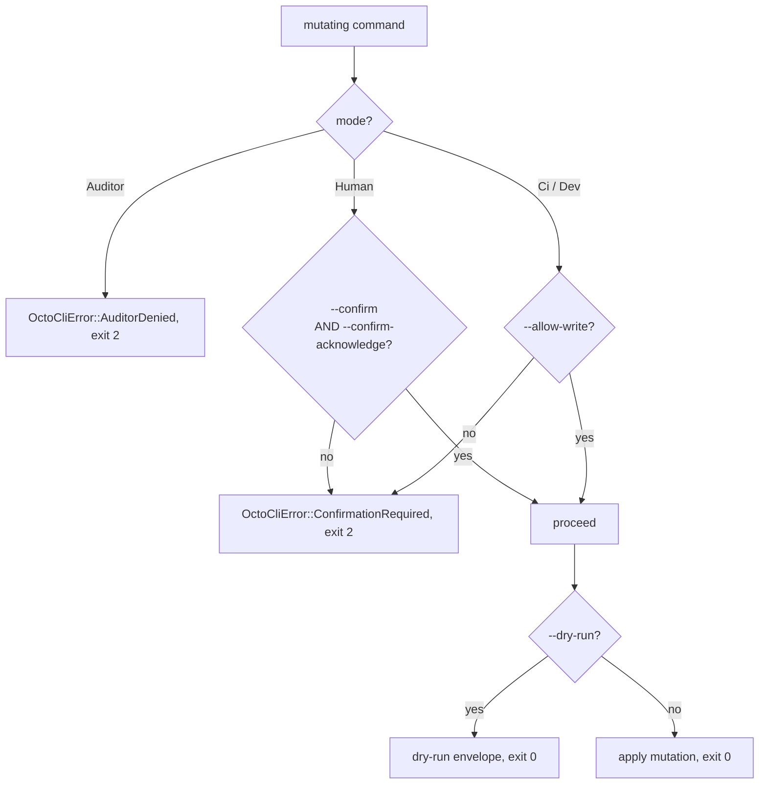
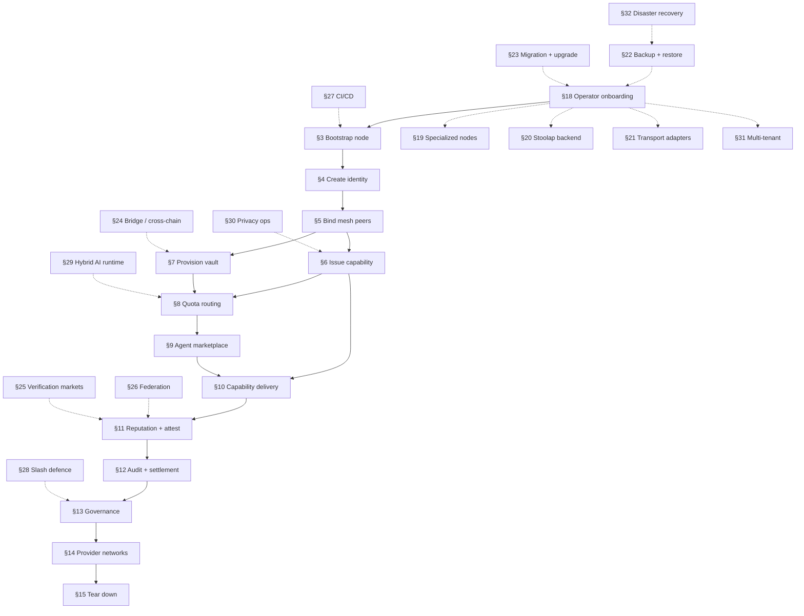

# CipherOcto Operator Guide

**Use-case-centered operator playbook.** Walks an operator (Human / Ci / Dev / Auditor mode) through every scenario end-to-end with copy-pasteable `octo` CLI commands. Cross-references the narrative use-cases in [`docs/use-cases/`](../use-cases/) for business case + token mechanics context.

> Operator focus: **what commands to run, in what order, with what flags**. Each scenario follows the shape: Prerequisites → Setup → Register → Operate → Verify → Tear Down.

---

## Table of contents

§0 [Operator environment](#0-operator-environment)
§1 [Mode + confirmation cheat-sheet](#1-mode--confirmation-cheat-sheet)
§2 [End-to-end scenario flow](#2-end-to-end-scenario-flow)

**Core operator flow (§3-§15):**

§3 [Scenario: bootstrap a new node](#3-bootstrap-a-new-node)
§4 [Scenario: create + manage operator identity](#4-create--manage-operator-identity)
§5 [Scenario: bind mesh peers + verify trust](#5-bind-mesh-peers--verify-trust)
§6 [Scenario: issue + deliver a capability](#6-issue--deliver-a-capability)
§7 [Scenario: provision a vault + transfer funds](#7-provision-a-vault--transfer-funds)
§8 [Scenario: quota routing + marketplace listing](#8-quota-routing--marketplace-listing)
§9 [Scenario: agent marketplace participation](#9-agent-marketplace-participation)
§10 [Scenario: capability delivery end-to-end](#10-capability-delivery-end-to-end)
§11 [Scenario: reputation + attestation](#11-reputation--attestation)
§12 [Scenario: audit + settlement verification](#12-audit--settlement-verification)
§13 [Scenario: governance participation](#13-governance-participation)
§14 [Scenario: provider network (compute/bandwidth/storage/data)](#14-provider-network-computebandwidthstoragedata)
§15 [Scenario: tear down + cleanup](#15-tear-down--cleanup)

**Operational depth (§16-§32):**

§16 [Cross-reference map](#16-cross-reference-map)
§17 [Troubleshooting](#17-troubleshooting)
§18 [Scenario: operator onboarding + first-run checklist](#18-operator-onboarding--first-run-checklist)
§19 [Scenario: run a specialized node (wallet / identity-resolver / capability-issuer / reputation-anchor / paid-query)](#19-run-a-specialized-node)
§20 [Scenario: Stoolap persistence backend setup](#20-stoolap-persistence-backend-setup)
§21 [Scenario: transport adapter onboarding (telegram / whatsapp / matrix)](#21-transport-adapter-onboarding)
§22 [Scenario: backup + restore wallet home + vault + ledger](#22-backup--restore-wallet-home--vault--ledger)
§23 [Scenario: substrate migration + upgrade](#23-substrate-migration--upgrade)
§24 [Scenario: cross-chain / bridge operations](#24-cross-chain--bridge-operations)
§25 [Scenario: probabilistic verification market participation](#25-probabilistic-verification-market-participation)
§26 [Scenario: reputation federation participation](#26-reputation-federation-participation)
§27 [Scenario: CI/CD pipeline integration](#27-cicd-pipeline-integration)
§28 [Scenario: defence against slashing (evidence + appeal)](#28-defence-against-slashing)
§29 [Scenario: hybrid AI + blockchain runtime](#29-hybrid-ai--blockchain-runtime)
§30 [Scenario: privacy-preserving operations (blinded caveats, encrypted routing)](#30-privacy-preserving-operations)
§31 [Scenario: multi-tenant / multi-identity operations](#31-multi-tenant--multi-identity-operations)
§32 [Scenario: disaster recovery (lost identity, corrupted home, ledger corruption)](#32-disaster-recovery)
§33 [Multi-node verification harness](#33-multi-node-verification-harness)

**Reference appendices:**

Appendix A — [Operator flags reference](#appendix-a--operator-flags-reference)
Appendix B — [Engineering conventions](#appendix-b--engineering-conventions)

---

## §0 Operator environment

### Install

```bash
# Build the `octo` binary (Layer C dispatcher).
cargo build --release -p octo-cli

# Bin path: ./target/release/octo
export PATH="$PWD/target/release:$PATH"
```

### Home directory layout

```bash
# Wallet home — identity keys, peer table, vault metadata.
# Default: ~/.octo (override with $OCTO_HOME).
export OCTO_HOME="$HOME/.octo"

# Stoolap-backed persistence ledger (Layer D adapter, opt-in).
# Used for revocation ledger + cross-process state.
# Default: $OCTO_HOME/data (override with $CIPHEROCTO_DATA_DIR).
export CIPHEROCTO_DATA_DIR="$OCTO_HOME/data"

mkdir -p "$OCTO_HOME" "$CIPHEROCTO_DATA_DIR"
```

The CLI resolves home the same way the wallet substrate does (env override → `~/.octo` fallback). On first run, the CLI creates `$OCTO_HOME/mesh/peers.toml` (0700 perms, atomic write + fsync + rename) on demand.

### Environment variables

| Variable               | Effect                                                                       |
| ---------------------- | ---------------------------------------------------------------------------- |
| `$OCTO_HOME`           | Wallet / mesh home directory (default `~/.octo`).                            |
| `$CIPHEROCTO_DATA_DIR` | Stoolap ledger root (default `$OCTO_HOME/data`).                             |
| `$OCTO_FORCE_JSON`     | Force JSON envelope output regardless of TTY.                                |
| `$NO_COLOR`            | Disable ANSI colour in pretty output.                                        |
| `OCTO_AUDIT=1`         | Force **Auditor** (read-only) mode. Overrides an explicit `--mode`.          |
| `CI=true`              | Auto-switch to **Ci** mode unless `--confirm` / `--confirm-acknowledge` set. |

### Shared placeholder values

Scenarios below refer to values in two forms. An angle-bracket
placeholder such as `<vault-id-hex>` is a stand-in you replace by hand. A
shell variable such as `$VAULT_ID` must be **assigned** before use — copy
these once at the start of a shell session, and the later scenarios pick
them up:

```bash
# PRECONDITION — run this only once the node has an active identity.
# On a node without one, every command below fails and writes its error
# envelope to STDERR, so the command substitution captures the EMPTY
# STRING and jq still exits 0. You would not find out until a later
# scenario passed an empty --vault-id-hex. The install check below
# (--version, --help) passes on such a node, so it will not catch this
# for you. §4 step 2a is where the identity is created.
if ! octo --json whoami >/dev/null 2>&1; then
    echo "no active identity — finish the node onboarding section first" >&2
fi

# Identity values the CLI can hand you.
ACTIVE_DID="$(octo --json whoami | jq -r '.payload.did')"
VOTER_DID="$ACTIVE_DID"

# Vault values. `vault list` returns real ids (unlike agent ids, which are
# redacted — see §A.3), so derive them rather than guessing.
#
# NOTE the hex conversion: `VaultId` is a 32-byte newtype with a derived
# Serialize, so the envelope carries `vault_id` as a JSON ARRAY OF 32
# DECIMAL BYTES, not as a hex string. Every vault-taking flag wants the
# 64-hex form, so you must convert:
VAULT_ID="$(octo vault list --json | jq -r '
    def hx: . as $n
        | ["0","1","2","3","4","5","6","7","8","9","a","b","c","d","e","f"][$n/16|floor]
        + ["0","1","2","3","4","5","6","7","8","9","a","b","c","d","e","f"][$n%16];
    .payload.vaults[0].vault_id | map(hx) | join("")')"
SOURCE_VAULT_ID="$VAULT_ID"
DEST_VAULT_ID="$VAULT_ID"
SRC_VAULT_ID="$VAULT_ID"
ASSET_SYMBOL="octo"

# Capability values.
VOTER_CAP_ID="$(octo capability list --json | jq -r '.payload.capabilities[0].cap_id')"

# Values only you can supply — no command derives these.
CHAIN_ID="cipherocto-mainnet"
DEST_CHAIN_ID="$CHAIN_ID"
NEW_DID="did:octo:z<43-44-char-base58btc-new-identity>"
REMOTE_AGENT_ID="<remote-agent-id-uuid>"
REMOTE_AGENT_DID="did:octo:z<43-44-char-base58btc-remote-agent>"

# Agent ids are redacted in every envelope (§A.3), so keep your own ledger
# of ids you captured at `octo agent create` time. Teardown reads this file.
AGENT_ID_LEDGER="$OCTO_HOME/agent-ids.txt"

# The one audit filter that can work. Use it instead of hand-written jq.
#
# Why this exists: an earlier revision of this guide filtered the audit
# ledger on invented DID prefixes — `did:octo:cap:`, `did:octo:vault:`,
# `did:octo:rep:` and so on. None of those prefixes is minted anywhere in
# the substrate; identities are `did:octo:z<base58>` or
# `did:octo:0x<hex>`. Those filters returned `[]` and exited 0, so every
# "verify this was audited" step in the guide passed while proving nothing.
# There is also no event-kind field on a receipt to filter on instead.
#
# So: filter on a DID you actually hold, and treat an empty result as a
# FAILURE. `jq -e` plus `error()` is what makes that true — a bare filter
# prints `[]` and succeeds, which is the whole trap.
audit_receipts() {   # $1 = the exact DID, $2 = minimum count (default 1)
    octo audit list --limit 100 --json | jq -e \
        --arg d "$1" --argjson min "${2:-1}" \
        '[.payload.receipts[] | select(.subject_did == $d)]
         | if length >= $min then .
           else error("no audit receipt for " + $d + " (min " + ($min|tostring) + ")")
           end'
}

# --- Capability-caveat encoders -------------------------------------------
# `--caveats` does NOT take the values the prose around it implies. Every one
# of the seven mint/attenuate expressions in an earlier revision of this guide
# was rejected by the real binary at exit 7. Three encodings bite:
#
#   amount_max  A 16-element JSON array: 8 bytes BIG-endian i64 mantissa,
#               then the scale byte, then 7 reserved zero bytes. The decimal
#               string "1.000000" is rejected.
#   vault       A 32-element array of decimal bytes — the same wire form as
#               `vault_id` in every envelope. The 64-hex string is rejected.
#   permission  One of five PermissionKind strings. There is NO free-form
#               `scope` payload; a scope is expressed with the typed caveats
#               (`vault`, `audience`, `provider`, `model`, ...).
#
# dqa16 <mantissa> <scale> -> the `amount_max` array. jq numbers are doubles,
# so the mantissa must stay under 2^53 — far above any realistic budget.
dqa16() {
    jq -cn --argjson v "$1" --argjson s "$2" '
      [ ((($v/72057594037927936)|floor)%256), ((($v/281474976710656)|floor)%256),
        ((($v/1099511627776)|floor)%256),  ((($v/4294967296)|floor)%256),
        ((($v/16777216)|floor)%256),      ((($v/65536)|floor)%256),
        ((($v/256)|floor)%256),          ($v%256),
        $s, 0,0,0,0,0,0,0 ]'
}

# The `vault` caveat value for $VAULT_ID, taken straight from `vault list` so
# the 32 bytes never round-trip through hex by hand.
VAULT_CAVEAT="$(octo vault list --json | jq -c '.payload.vaults[0].vault_id')"

# Deliberately NOT assigned here: $MNEMONIC_PHRASE, your identity mnemonic.
# Never put it in this file, in a script, or on a command line — read it
# from your secret store at the moment of use (see the CI section).
```

A variable with no assignment is not a harmless no-op: it expands to the
empty string, and most commands will accept `--holder-did ""` or
`--asset ""` at the argument layer and fail later, further from the
mistake. Set them up front.

The same trap catches the derivations above. A command that fails prints
its envelope to stderr and exits non-zero, but a **command substitution
does not inherit that exit status** — it just captures whatever stdout
held, which is nothing. So a failed `octo whoami` yields `ACTIVE_DID=""`
and a _successful_ pipeline, and the empty string is indistinguishable
from a valid value until something downstream chokes on it. That is why
the block opens with an explicit precondition check rather than trusting
the assignments to report their own failure.

### Verify the install

```bash
octo --version
octo --help
```

Expected: `octo 0.1.0` and a top-level clap usage block listing every top-level command.

---

## §1 Mode + confirmation cheat-sheet

### Operator modes

| Mode                | Use case                                                           | Writes allowed? | Confirmation gate                        |
| ------------------- | ------------------------------------------------------------------ | --------------- | ---------------------------------------- |
| **Human** (default) | Interactive operator at a terminal                                 | yes             | `--confirm --confirm-acknowledge` (BOTH) |
| **Ci**              | Non-interactive CI runner                                          | yes             | `--allow-write`                          |
| **Dev**             | Local development with `InMemorySigner` / `IdentityKey::from_seed` | yes             | `--allow-write`                          |
| **Auditor**         | Read-only inspection                                               | **NO**          | n/a — writes are hard-denied             |

Auto-detect: `OCTO_AUDIT=1` → Auditor; `CI=true` → Ci (unless `--confirm` / `--confirm-acknowledge` explicitly set, which signals Human intent and suppresses the override).

The two switches are not symmetric, and the difference is deliberate. `CI=true` is a _hint_ about the environment, so an explicit confirmation flag — which only a human at a terminal produces — suppresses it. `OCTO_AUDIT=1` is a _read-only enforcement_ setting, so it is checked first and nothing overrides it, including an explicit `--mode human --allow-write`. A fleet-wide audit setting that any caller can defeat by also passing `--mode ci` is not an enforcement setting. To write while it is set, unset it.

### Confirmation gate matrix



The variant _names_ are stated, not their positions in `OctoCliError`. That enum is `#[non_exhaustive]` with no stable discriminants and no `serde` representation, nothing in the codebase reads a variant's index, and an index restated in a diagram becomes wrong the first time a variant is inserted above it — which is exactly what had happened here. The exit code beside each name is the contract, and it is asserted by the error-mapping vectors.

Dev mode also bypasses `--confirm-acknowledge` (the developer is the acknowledgement) but still requires `--allow-write`. `--dry-run` bypasses both confirmation gates — a preview grants no authority.

### Output envelope flags

| Flag               | Effect                                   |
| ------------------ | ---------------------------------------- |
| `--json`           | Force JSON envelope output (scriptable). |
| `--no-color`       | Disable ANSI colour in pretty output.    |
| `$OCTO_FORCE_JSON` | Same as `--json`, environment-driven.    |

The CLI emits two output shapes: `OutputEnvelope { data, exit_code: 0 }` on success and the typed `OctoCliError` envelope on failure. `--json` collapses both into machine-parseable JSON.

---

## §2 End-to-end scenario flow

The full operator journey from cold start to capability delivery + marketplace participation:



Each §N scenario is self-contained and cross-references the existing narrative use-case in [`docs/use-cases/`](../use-cases/) for business case + token mechanics context. Operational-depth scenarios (§18-§32) are orthogonal flows that the operator runs in parallel with the core §3-§15 path.

---

## §3 Bootstrap a new node

**Narrative cross-ref:** [dot-network-bootstrap.md](../use-cases/dot-network-bootstrap.md) (RFC-0851 + RFC-0851p-a). This scenario covers Mode A (bootstrap nodes); Mode B (DHT fallback) and Mode C (invite link) are future work.

### Prerequisites

- Fresh `$OCTO_HOME` directory.
- Network connectivity to the seed-list service.
- A foundation/DAO-signed seed list (auto-discovered via Mode A default).

### Setup

```bash
# 1. Confirm home directory is clean.
ls -la "$OCTO_HOME"
# Expected: directory exists, empty (or only data/ subdir).

# 2. Probe bootstrap reachability (read-only).
#    Substrate-faithful: BootstrapArgs has only --json per
#    crates/octo-cli/src/commands/network.rs. There is NO --mode flag.
#    Persist a bootstrap transport mode via:
#      octo network mode set \
#          --bootstrap-mode <direct|tor_only|tor_with_ip_fallback> \
#          --listen-addr <ip:port> \
#          --target-peers <N> \
#          --confirm --confirm-acknowledge
#    (ModeSetArgs requires all three flags per the same source:1383; the
#    prior RFC-0011-h guidance that listed only --bootstrap-mode was a
#    documentation bug — the substrate rejects the call without
#    --listen-addr and --target-peers.)
octo network bootstrap --json
```

### Register

```bash
# 3. Persist local peer entry for the bootstrap source.
#    [SUBSTRATE-NEW] `octo network peers add` is NOT wired — PeersAction has
#    ONLY List + Get per crates/octo-cli/src/commands/network.rs:284.
#    The substrate-faithful peer-table write path is `octo mesh peer add`
#    (top-level `octo mesh`, NOT `octo network`) since MeshAction::Peer →
#    PeerAction::Add per crates/octo-cli/src/commands/peer.rs:42-66.
#    Trust levels are encoded via `--filter-trust` on the read path; the
#    write path takes peer_did + endpoint ONLY (peer_did is positional):
octo mesh peer add <bootstrap-peer-did> \
    --endpoint quic://<bootstrap-host>:4433 \
    --confirm --confirm-acknowledge
```

The peer DID is validated at the dispatch boundary (`is_structurally_valid_did` rejects malformed input — see RFC-0010 canonical form).

### Operate

```bash
# 4. List the registered peers.
#    `octo mesh peer list`, NOT `octo network peers list`. These are two
#    different stores: `mesh peer` is the local peer table written by
#    step 3, `network peers` is a read-only cache of *gateway* peers
#    with no add path on the CLI. The latter stays empty here, so it
#    reports an empty list immediately after a successful add.
octo mesh peer list --json

# 5. Inspect a specific peer.
#    There is no single-peer get on the mesh surface — `mesh peer` has
#    only list/add/remove, and `list` filters by trust level alone. So
#    select the peer out of the list. (`octo network peers get` takes a
#    32-byte *gateway* id, not a peer DID, and exits 79 for an id the
#    CLI cannot mint, which is why it is not used here.)
octo mesh peer list --json | jq '.payload.peers[] | select(.peer_did == "<bootstrap-peer-did>")'

# 6. Render the trust graph (proves you have at least 1 trusted peer).
octo network trust-graph render --format ascii --depth 2
# --format ascii | dot; --depth 1-100.
```

### Verify

```bash
# 7. Probe peer reachability via heartbeat.
octo network heartbeat probe did:octo:z<43-44-char-base58btc> \
    --timeout-ms 5000

# 8. Inspect gossip state.
octo network gossip stats --format ascii
# Returns stub-zero anti-entropy rounds; real anti-entropy counter ships in follow-on Layer D adapter mission.
```

### Tear down

```bash
# 9. Remove the bootstrap peer.
#    [SUBSTRATE-NEW] `octo network peers remove` is NOT wired — PeersAction
#    has ONLY List + Get. Substrate-faithful path is `octo mesh peer remove`
#    (PeerAction::Remove, idempotent, positional peer_did):
octo mesh peer remove <bootstrap-peer-did> \
    --confirm --confirm-acknowledge
```

---

## §4 Create + manage operator identity

**Narrative cross-ref:** [canonical-octoid-identifier.md](../use-cases/canonical-octoid-identifier.md) (RFC-0010 canonical DID form).

### Prerequisites

- A trusted HSM (production) OR `--dev` mode (local development only).
- `$OCTO_HOME` initialised (see §0).

### Setup

```bash
# 1. Who am I? (currently empty wallet)
octo whoami
# Expected: NoActiveIdentity error envelope.
```

### Register

```bash
# 2a. Production: create identity via HSM (out of CLI scope — uses `octo-wallet` substrate API).
# 2b. Local development: create an InMemorySigner-backed identity.
#    Substrate-faithful: there is NO `octo identity create` CLI variant — the
#    substrate IdentityAction enum has ONLY `Show { did: Option<String> }`,
#    `Rotate {}`, `Revoke { reason: String }` (per crates/octo-cli/src/commands/identity.rs:34).
#    Identity creation happens via the `octo-wallet` substrate API
#    (`mint_identity(InMemorySigner)`) — out of CLI scope. For dev/testing,
#    invoke `octo-wallet init` (the one and only `[[bin]]` in the octo-wallet
#    crate is named `octo-wallet`, with 4 subcommands `init`, `derive-cap`,
#    `vault`, `ask` per crates/octo-wallet/src/bin/octo-wallet.rs:33-67; the
#    `ask` subcommand ships RFC-0959 marketplace CLI via AskOp).
#
#    `octo-wallet init` is a seed-material generator. It writes a 32-byte seed
#    to the `--seed-out` path and prints the derived public key. The CLI
#    identity register step below is what makes the seed usable for `octo
#    whoami`. Steps that address `$OCTO_HOME/identity/<did>/` (see §10 step 8,
#    §20 step 2) read the persisted WalletStore from
#    `$OCTO_HOME/wallet/store.json` (RFC-0011-x §Home resolution). Every
#    identity-gated command downstream of this step is unlocked by the
#    register + select pair below; run them in that order before any gated
#    command.
octo-wallet init \
    --node-type self-host \
    --seed-out /var/lib/cipherocto/operator.seed

# 2c. List identities.
#    [SUBSTRATE-NEW] `octo identity list` is not yet wired in IdentityAction.
#    Workaround: read the operator directory directly (the substrate-level
#    identity catalog is stored as a `BTreeMap<Did, IdentityRecord>` at the
#    directory referenced by OCTO_WALLET_HOME; not CLI-served). See
#    `crates/octo-wallet/src/agent_index.rs` for the substrate reader.
```

Identity creation in dev mode mints a deterministic identity derived from the local `IdentityKey::from_seed` path. In production (Human / Ci), the substrate refuses the InMemorySigner downgrade — the HSM is mandatory.

### Operate

```bash
# 3. Set active identity (substrate-level switch).
#    Substrate-faithful: RoleAction::Select takes positional `<role_id>` slug
#    (per crates/octo-cli/src/commands/role.rs:180). TWO substrate gates apply:
#    (a) dispatch-side require_confirm(cli, "role select") per
#        crates/octo-cli/src/commands/identity.rs:478-535 — Human mode requires
#        --confirm --confirm-acknowledge; Dev mode requires --allow-write alone.
#    (b) per-operation is_dev_mode gate at active_signer_for_did per
#        crates/octo-cli/src/commands/identity.rs:575-589 — --mode dev or
#        --dev REQUIRED (the in-memory DevSigner stub is the only Phase-1
#        substrate signer; production HSM is out of scope).
#    Net: only --mode dev --allow-write produces a successful role select.
octo --mode dev --allow-write role select operator-main

# 4. Confirm whoami now resolves.
octo whoami
# Expected: { "did": "did:octo:z<43-44-char-base58btc>", "label": "operator-main", ... }

# 5. Rotate the active identity's key (production: HSM-mediated).
#    Substrate-faithful: IdentityAction::Rotate {} has NO fields (no --label,
#    no --confirm flags); the substrate rotates the ACTIVE identity. TWO
#    substrate gates apply:
#    (a) dispatch-side require_confirm (Human: --confirm --confirm-acknowledge;
#        Dev: --allow-write alone) per crates/octo-cli/src/commands/identity.rs:478-535.
#    (b) per-operation SEC-04 guard at crates/octo-cli/src/commands/identity.rs:324-332
#        requires --mode dev or --dev because IdentityKey::from_seed([1u8; 32])
#        is a publicly-known signature-forgeable test seed. The substrate
#        refuses outside dev mode with Internal (exit 64). Use --dry-run
#        for previews outside dev mode.
#    Net: only --mode dev --allow-write produces a successful rotation
#    outside dry-run. Tag audit-log payload via the per-rotation reason
#    (logged via `octo audit list`).
octo --mode dev --allow-write identity rotate

# 6. Bind a public role / node class to the identity (cross-cutting).
#    [SUBSTRATE-NEW] `octo role bind --node-class <X>` is NOT wired —
#    RoleAction has ONLY List + Show + Select per
#    crates/octo-cli/src/commands/role.rs (no Bind variant). The substrate
#    node-binding path is the SpecializedNodeRecord dispatch (per
#    RFC-0011-q §Substrate-Additions). Substrate-faithful NodeBindArgs
#    (crates/octo-cli/src/commands/network.rs NodeBindArgs) is POSITIONAL
#    `<node-id-hex>` + --holder-did + --dry-run/--apply (mutually
#    exclusive) + --confirm-acknowledge (required for --apply) + --json.
#    There is NO --node-id flag and NO --node-class flag on NodeBindArgs;
#    NodeClass is data-on-record per §14 substrate-coverage note, not a
#    CLI flag.
#    node_id is an operator-supplied 64-hex value. NO CLI command derives
#    it: `NetworkStatusOutput` carries no node-id field, so there is no
#    `octo network status --json` path to read one from. Supply it from
#    the node's own provisioning record.
NODE_ID="<node-id-hex>"
octo network node bind \
    "$NODE_ID" \
    --holder-did "$NEW_DID" \
    --apply \
    --confirm --confirm-acknowledge
```

### Verify

```bash
# 7. Show identity details (substrate-canonical fields).
#    Substrate-faithful: IdentityAction::Show takes positional `<did>`
#    (Option<String>); defaults to active identity. No --label flag.
octo identity show --json

# 8. Network-layer identity cross-check.
octo network identity show
```

### Tear down

```bash
# 9. Revoke the identity (substrate calls the revocation store).
#    Substrate-faithful: IdentityAction::Revoke takes ONLY --reason <TEXT>
#    (256-byte cap + control-character filter per RFC-0015 §6.2.5); it revokes
#    the ACTIVE identity (no --label flag); dispatch-side mode gate via
#    require_confirm per crates/octo-cli/src/commands/identity.rs:478-535.
#    Revoke is NOT a dev-mode-gated substrate path (no is_dev_mode check);
#    Human mode requires --confirm --confirm-acknowledge; Dev mode requires
#    --allow-write alone. This step uses Human two-step.
octo --mode human --allow-write identity revoke --reason "operator-offboarding" \
    --confirm --confirm-acknowledge

# 10. (Optional) Cross-process revocation propagation requires the
# Stoolap-backed Layer D adapter (feature: revocation-store-stoolap).
# Default builds use the InMemoryRevocationStore (process-local only).
cargo build -p octo-cli --features revocation-store-stoolap
```

---

## §5 Bind mesh peers + verify trust

**Narrative cross-ref:** [social-platform-transport-layer.md](../use-cases/social-platform-transport-layer.md) (mesh + adapter surface). Each adapter crate (`octo-adapter-telegram`, `octo-adapter-whatsapp`, `octo-adapter-matrix`, …) is a Layer D per-extension crate registering into the Layer B mesh substrate.

### Prerequisites

- Active operator identity (see §4).
- At least 1 trusted peer entry in `$OCTO_HOME/mesh/peers.toml` (see §3).

### Setup

```bash
# 1. Show current peer table.
octo mesh peer list --json
```

### Register

```bash
# 2. Add a peer entry (MeshAction::Peer → PeerAction::Add).
#    Substrate-faithful: positional peer_did + --endpoint flag. Trust levels
#    are encoded via --filter-trust on the read path, not on the write path:
octo mesh peer add <peer-did> \
    --endpoint quic://203.0.113.10:4433 \
    --confirm --confirm-acknowledge

# 3. Add a second peer (Sybil resistance — connect to multiple independent operators).
#    Substrate-faithful: PeerAction::Add takes POSITIONAL <peer_did> + --endpoint ONLY
#    per crates/octo-cli/src/commands/peer.rs:42-72. Trust levels live on the read
#    path (--filter-trust on PeerAction::List), NOT on Add. NO --peer-id-hex flag.
octo mesh peer add <peer-did-2> \
    --endpoint quic://198.51.100.20:4433 \
    --confirm --confirm-acknowledge
```

### Operate

```bash
# 4. Render the trust graph.
octo network trust-graph render --format dot --depth 3 > trust.dot
# Use graphviz to visualise: dot -Tpng trust.dot -o trust.png

# 5. Inspect a peer's trust score (via reputation substrate).
octo reputation show --did did:octo:z<43-44-char-base58btc> --role builder

# 6. Probe liveness.
octo network heartbeat probe did:octo:z<43-44-char-base58btc> \
    --timeout-ms 5000

# 7. Inspect gossip + envelope state.
octo network gossip stats --format ascii
octo network envelope inspect <envelope-id-hex>
```

### Verify

```bash
# 8. Network-wide topology view.
octo network topology render --format dot --depth 5

# 9. Quota router health (cross-region routing requires multiple healthy peers).
octo network router status
#    Substrate-faithful: RouterPeersArgs is POSITIONAL <peer_node_id> per
#    crates/octo-cli/src/commands/network.rs:709-724 (NOT a --peer-node-id-hex
#    flag).
octo network router peers <peer-node-id-hex>
```

### Tear down

```bash
# 10. Remove the peer entry.
#    [SUBSTRATE-NEW] `octo network peers remove` is NOT wired. Substrate-faithful
#    path is `octo mesh peer remove` (PeerAction::Remove, idempotent,
#    positional peer_did):
octo mesh peer remove <peer-did> \
    --confirm --confirm-acknowledge
```

---

## §6 Issue + deliver a capability

**Substrate layer:** `octo-cap-macaroon` (Layer B, RFC-0957 algorithms + RFC-0011-c §9.3.2 + RFC-0965 audit-window caveat). Capabilities are macaroon-style bearer tokens with caveats that attenuate authority.

### Prerequisites

- Active operator identity (see §4).
- A target DID to receive the capability.

### Setup

```bash
# 1. Reserve a target DID. There is no free-form scope string in the caveat
#    substrate — see the caveat-encoder note in the shared-value block above.
#    A vault scope is the typed `vault` caveat, carried as 32 decimal bytes.
TARGET_DID="did:octo:z<43-44-char-base58btc-target>"
```

### Register

```bash
# 2. Mint the capability (substrate: octo_cap_macaroon::mint).
#    Substrate-faithful: CapabilityAction::Mint shape is --caveats + --holder + --root
#    ONLY per crates/octo-cli/src/commands/capability.rs:96-106 (NO --confirm or
#    --confirm-acknowledge fields; these are global dispatcher flags per
#    OperatorModeFlags at crates/octo-cli/src/flags.rs:78-90). Confirmation is
#    dispatch-side via super::identity::require_confirm(cli, "capability mint")?
#    + require_acknowledge(cli, cli.mode.confirm_acknowledge, "capability mint")?
#    (capability.rs:263-267).
#    --root takes a hex64 CapabilityId (parent capability to attenuate from),
#    NOT the operator's Ed25519 pubkey — the form `$(octo whoami | jq -r
#    .pubkey_hex)` is INVALID (32-byte pubkey != CapabilityId). Omit --root
#    for root-capability mint (the parent is the holder's identity); pass
#    --root for child-attenuation minting.
#    Scope + audit-window are encoded INSIDE the caveats JSON expression.
#    `permission` takes a PermissionKind, NOT an object. `vault` takes 32
#    decimal bytes, NOT a hex string. Both rejected forms are listed above.
octo --mode dev --allow-write capability mint \
    --holder "$TARGET_DID" \
    --caveats '[
        {"type":"audit_window","value":{"duration_secs":3600}},
        {"type":"permission","value":"vault_mutation"},
        {"type":"vault","value":'"$VAULT_CAVEAT"'}
    ]'
```

The `AuditWindow { duration_secs }` caveat attaches the audit window. The substrate enforces the `set_subsumes` attenuation rule: parent `p_dur` subsumes child `c_dur` iff `c_dur >= p_dur`. Non-zero parent cannot subsume zero child (downgrade disallowed; widening disallowed).

Reading it back uses the same property names you supply: `octo capability list
--json` projects each caveat to `{"type": <short tag>, "value": <canonical
value>}`. For `vault` the `value` is the 64-hex id; for `permission` it is the
full HMAC info string (`cipherocto/cap/v1/permission/vault_mutation`); for
`amount_max` it is augmented to `{"amount_dqa", "scale", "value"}`, where
`amount_dqa` and `scale` are the decoded budget and the inner `value` is the
32-hex canonical `DqaEncoding` — the same 16 bytes the `dqa16` helper above
builds, spelled as hex. Note the nested `value` inside the `amount_max` payload
is the canonical encoding, not the outer projection key.

The read-back form still does **not** round-trip, but not because `--caveats`
rejects hex — that changed with RFC-0011 §Caveat Form Amendment, and the
canonical hex form is now accepted. The read-back `value` for `amount_max` is an
augmented object rather than the bare hex payload, so pasting it straight back
into `--caveats` still exits 7. Nothing is lost — `amount_dqa` and `scale` recover
the exact budget — so paste the `dqa16` form, or the canonical hex form, rather
than the read-back projection.

### Operate

```bash
# 3. Attach additional caveats (e.g., rate limit, spend cap).
#    Substrate-faithful: CapabilityAction::Attenuate takes positional <cap_id> + --caveats
#    ONLY per crates/octo-cli/src/commands/capability.rs:108-114 (NO --confirm
#    or --confirm-acknowledge fields; dispatch-side confirmation via
#    require_confirm + require_acknowledge).
octo --mode human --allow-write capability attenuate <cap-id-hex> \
    --caveats '[{"type":"amount_max","value":'"$(dqa16 1000000 6)"'}]' \
    --confirm --confirm-acknowledge

# 4. Verify the capability at the receiver.
#    [SUBSTRATE-NEW] `octo capability verify` is NOT wired — CapabilityAction
#    has ONLY List + Mint + Attenuate per
#    crates/octo-cli/src/commands/capability.rs:87. Substrate-faithful
#    verification uses the substrate API directly via
#    `octo_cap_macaroon::verify_full` (RFC-0957 §3.5 verification
#    pipeline; out of CLI scope). For an ad-hoc CLI-side check, read
#    back via `octo capability list --json` (envelope shape:
#    `.payload.capabilities[]`, not `.[]`) and validate the caveats against
#    the substrate's Caveat enum (27 variants; see §30 substrate-
#    coverage note).

# 5. List active capabilities issued by this operator.
#    Substrate-faithful: envelope shape `CapabilityListOutput` has
#    `.payload.capabilities[]` (NOT `.[]`).
octo capability list --json | jq '.payload.capabilities[] | {cap_id, root_id, caveats}'
```

### Verify

```bash
# 6. Show the capability record (canonical substrate fields).
#    [SUBSTRATE-NEW] `octo capability show` is NOT wired — CapabilityAction
#    is List + Mint + Attenuate only per
#    crates/octo-cli/src/commands/capability.rs:87. CapabilityAction::List
#    is the only substrate-faithful read path (with filter on cap_id /
#    root_id / caveat). Workaround:
octo capability list --json \
    | jq --arg c "<cap-id-hex>" \
        '.payload.capabilities[] | select(.cap_id == $c)'

# 7. Cross-check via audit trail (capability mint is an auditable event).
audit_receipts "$TARGET_DID"
```

### Tear down

```bash
# 8. Revoke the capability.
#    [SUBSTRATE-NEW] `octo capability revoke` is NOT wired — CapabilityAction
#    has ONLY List + Mint + Attenuate per
#    crates/octo-cli/src/commands/capability.rs:87. There is no
#    `cargo run -p octo-cap-macaroon --bin ...` revocation binary
#    (octo-cap-macaroon is rlib-only, see crates/octo-cap-macaroon/Cargo.toml:
#    crate-type = ["rlib"]). The substrate-faithful revocation path is
#    bound to the capability substrate's holder-rotation pathway: rotate
#    the active identity (Section 4 step 9), which cascades revocation
#    through the holder-DID linkage in CapabilitySummaryView.
#    A replacement-cap pattern can also supersede an outstanding child
#    token: a fresh `octo capability mint --root <parent-cap-id-hex>`
#    creates a child whose root is the same parent; the substrate
#    enforces `set_subsumes` on attenuation, so the new child carries
#    the parent's authority. Pass --holder <DID> + --caveats <JSON> for
#    a non-root mint; omit --root for a root-capability mint (parent
#    is the holder's identity). Note: this is NOT the same as revoking
#    the prior child — only the holder rotation is substrate-faithful
#    revocation.
#    DEV-MODE-ONLY: CapabilityAction::Mint requires `--mode dev` or
#    `--dev` in production builds per the SEC-03 guard at
#    crates/octo-cli/src/commands/capability.rs:328-339. The
#    root-secret placeholder would be signature-forgeable; the substrate
#    refuses outside dev mode with Internal (exit 64). Prefix the
#    invocation with `--mode dev --allow-write` (dispatch-level global
#    flags per crates/octo-cli/src/lib.rs:30-40).
```

---

## §7 Provision a vault + transfer funds

**Narrative cross-ref:** [asset-generic-payment-caveat.md](../use-cases/asset-generic-payment-caveat.md) (vault substrate + payment caveats). Substrate layer: `octo-vault` (Layer B, RFC-0960 balance projection + RFC-0011-e vault substrate).

### Prerequisites

- Active operator identity (see §4).
- A target peer DID + asset ID.
- A chain adapter (production: HSM-bound signing key; dev: `InMemorySigner`).

### Setup

```bash
# 1. Resolve the chain ID + asset ID.
CHAIN_ID="cipherocto-mainnet"
ASSET_ID="octo"

# 2. Compute the deterministic vault ID.
# Substrate: octo_vault::vault_id(chain_id, owner_did, asset_id)
# BLAKE3-prefixed concatenation: BLAKE3("cipherocto/vault/v1/" || chain_id || owner_did || asset_id)
```

### Register

```bash
# 3. Provision the vault (substrate port: VaultOwnerIndex).
#    [SUBSTRATE-NEW] `octo vault create` is NOT wired — VaultAction has ONLY
#    List | Balance | Transfer. Vault provisioning is substrate-side
#    (`octo_vault::VaultOwnerIndex::register`, defined at
#    `crates/octo-vault/src/vault_owner.rs:45` and re-exported at
#    `crates/octo-vault/src/lib.rs:114`). The `octo-vault`
#    crate has NO `[[bin]]` entries (no `dev-provision-vault` binary) per
#    `crates/octo-vault/Cargo.toml` (`crate-type = ["rlib"]`). Workaround for
#    dev: call the substrate API directly via a small extension binary
#    (per-extension crate pattern; Layer D adapter) that invokes
#    `octo_vault::VaultOwnerIndex::register`
#    and writes the vault id to `$OCTO_HOME/vault/<chain-id>-<asset-id>.id`.
#    Alternatively, use `octo-wallet vault put <slot> <stdin>` to seed the
#    active-identity vault with the chain/asset pair (VaultOp::Put per
#    `crates/octo-wallet/src/bin/octo-wallet.rs:97`).

# 4. Verify the vault was provisioned.
octo vault list --json
```

### Operate

```bash
# 5. Project balance (substrate canonical 7-param signature).
#    Substrate-faithful: VaultAction::Balance takes POSITIONAL `<vault-id>`
#    per crates/octo-cli/src/commands/vault.rs (NO --chain-id, NO --asset-id,
#    NO --vault-id flags; chain + asset are derived from the vault record).
octo vault balance "$VAULT_ID" --json
# Returns .payload = { record: { chain_id, vault_id, asset_id, projected_balance,
#                                 projected_at_unix_seconds, registry_snapshot_epoch,
#                                 source_kind_u8 },
#                      cache_hit, projection_source_u8, warnings, history }.
#
# Three corrections against the shape an earlier revision named:
# - The record is under `.payload.record`, not at the payload root. The
#   substrate `VaultBalanceProjection` has no Serialize impl; the CLI ships
#   a DTO mirror, `VaultBalanceRecord`, and wraps it in `VaultBalanceOutput`.
# - `projected_balance` is the 16-byte BE DqaEncoding — a 16-element array of
#   decimal bytes, exactly the form the `dqa16` helper above inverts. It is
#   NOT a number. To compare it against a budget, convert the same way.
# - The projection source is an INTEGER discriminant, `source_kind_u8`, not a
#   tagged enum. `projection_source_u8` repeats it at the payload root and
#   `cache_hit` gives the same signal as a boolean.

# 6. Initiate a transfer (substrate: initiate_transfer).
# Pre-flight checks (CLI-side, NOT substrate): chain-affinity, balance-sufficient-source,
# owner-authorized, vault-state-active, recipient-existence.
# Substrate-faithful: VaultAction::Transfer shape is --from + --to + --amount + --asset
# (long flags, all REQUIRED) per crates/octo-cli/src/commands/vault.rs:149-180.
# --amount takes DQA canonical-form decimal string per RFC-0960-v36 §Wire Form
# (NOT micro-integer; convert with `dfp scale --from micros` or compute manually).
octo vault transfer \
    --from "$SOURCE_VAULT_ID" \
    --to "$DEST_VAULT_ID" \
    --amount "1.000000" \
    --asset "$ASSET_SYMBOL" \
    --dry-run
# Dry-run prints the canonical envelope (handle_id + nonce + status); no signing, no broadcast.

# 7. Re-run for real (production: HSM signs; dev: InMemorySigner).
octo vault transfer \
    --from "$SOURCE_VAULT_ID" \
    --to "$DEST_VAULT_ID" \
    --amount "1.000000" \
    --asset "$ASSET_SYMBOL" \
    --confirm --confirm-acknowledge
```

Replay defense: the chain adapter is responsible for `TransferEventLog::insert` BEFORE state mutation. The substrate reserves the handle nonce for envelope identification only.

### Verify

```bash
# 8. Re-project balance (source should reflect debit; dest should reflect credit).
#    Substrate-faithful: positional <vault-id> (matches step 5).
octo vault balance "$SOURCE_VAULT_ID" --json
octo vault balance "$DEST_VAULT_ID" --json

# 9. Audit trail (settlement substrate emits a receipt).
#    [SUBSTRATE-NEW] AuditListArgs has NO `--kind` flag (only --since / --until
#    / --capability-root / --model / --router-id / --status / --include-reject
#    / --limit / --json per crates/octo-cli/src/commands/audit.rs:63-130).
#    AuditListOutput envelope is `.payload.receipts[]` with `subject_did` (NOT `kind`).
#    Substrate-faithful filter for vault-transfer events:
audit_receipts "$ACTIVE_DID"
octo audit show <receipt-id-u64>
```

### Tear down

```bash
# 10. Freeze the vault (VaultState::Frozen; no transfers in or out; audit writes still allowed).
#     [SUBSTRATE-NEW] `octo vault freeze` is NOT wired — VaultAction has
#     ONLY List + Balance + Transfer per crates/octo-cli/src/commands/vault.rs:87.
#     VaultState::Freeze is a substrate-level operation; the only
#     substrate-faithful in-CLI path is to halt the vault daemon or
#     revoke the holder identity (Section 4 step 9) which freezes all
#     vaults bound to that identity via the holder-DID linkage.

# 11. (Optional) Destroy the vault (substrate-side; irreversible).
#     [SUBSTRATE-NEW] `octo vault destroy` is NOT wired — VaultAction
#     has ONLY List + Balance + Transfer. Vault destruction is
#     substrate-level (`octo_vault::destroy_vault`); for a CLI-bound
#     path, drain all balances via `octo vault transfer --amount "1.000000"
#     --asset "$ASSET_SYMBOL"` (substrate-faithful form) matching the existing
#     balance, then revoke the holder identity (Section 4 step 9).
```

---

## §8 Quota routing + marketplace listing

**Narrative cross-refs:**

- [ai-quota-marketplace.md](../use-cases/ai-quota-marketplace.md) (OCTO-W token mechanics)
- [enhanced-quota-router-gateway.md](../use-cases/enhanced-quota-router-gateway.md) (gateway spec)
- [privacy-preserving-query-routing.md](../use-cases/privacy-preserving-query-routing.md) (private routing)

**Substrate layer:** `quota-router-core` (Layer B, RFC-0870). CLI: `quota-router-cli` (separate binary from `octo`).

### Prerequisites

- Active operator identity (see §4).
- A pool of unused AI API quotas (e.g., OpenAI, Anthropic API keys) — dev only, never commit.
- Cross-region peers reachable (see §5).

### Setup — `quota-router-cli`

```bash
# 1. Install the quota router CLI (separate workspace member).
cargo build --release -p quota-router-cli

export QUOTA_ROUTER_BIN="$PWD/target/release/quota-router-cli"
```

### Register

```bash
# 2. Configure local upstream providers (your API keys never leave the machine).
#    [SUBSTRATE-NEW] The `quota-router-cli` Commands enum has 12 variants:
#    Init | AddProvider | Balance | List | Proxy | Route | Serve |
#    ReputationShow | Settle | SettleReplay | SettleList | Verify per
#    crates/quota-router-cli/src/cli.rs:14-180 (the 4 settlement/verify
#    subcommands ship per RFC-0959 §CLI + zk-proof-verification mission;
#    no `upstream` / `market {list,listings,search,buy,delist}` /
#    `policy {show}`).
#    Substrate-faithful local-provider registration:
$QUOTA_ROUTER_BIN init
$QUOTA_ROUTER_BIN add-provider openai-prod
$QUOTA_ROUTER_BIN add-provider anthropic-prod

# 3. Check the router's OCTO-W balance.
$QUOTA_ROUTER_BIN balance
```

### Operate — local routing

```bash
# 4. Route a prompt to a registered provider. The substrate-faithful
#    Route subcommand accepts --provider <name> + --prompt <text> ONLY
#    (no --budget-dqa-micros / --routing-mode — per-call budget is
#    enforced by the bound capability's Caveat::AmountMax, not by a
#    per-call flag):
$QUOTA_ROUTER_BIN route \
    --provider openai-prod \
    --prompt "Summarise the CipherOcto whitepaper"
# Returns: routed provider + response text.
```

### Operate — marketplace listing

```bash
# 5. Publish a quota offering on the marketplace.
#    Substrate-faithful: `List { --prompts <N> --price <N> }` is the
#    marketplace listing registration (NO `market list` / separate
#    publish subcommand).
$QUOTA_ROUTER_BIN list --prompts 1000 --price 1
```

### Operate — consume from marketplace

```bash
# 6. Discover a marketplace seller's reputation (the substrate-faithful
#    discovery surface). Reads the persisted RFC-0968 aggregate for a
#    peer DID in canonical CipherOcto wire form `did:octo:z<base58btc of 32 bytes>`
#    (43-44 chars after the `z` marker; 53-54 chars total). This is the same
#    form `octo identity show` emits and the same form `octo mesh peer add`
#    accepts. See Appendix A §Two DID wire forms for why the repo also
#    contains a `did:octo:0x<64-hex>` form and why an operator must not use it.
#    [SUBSTRATE-NEW] `quota-router-cli` does NOT have a `market search`
#    / `market buy` / `market delist` subcommand today — discovery, buy,
#    and delist surfaces land in the marketplace Layer D adapter crate
#    (per-extension crate pattern; out of scope for this operator guide).
$QUOTA_ROUTER_BIN reputation-show \
    --did did:octo:z<43-44-char-base58btc-quota-seller> \
    --backend memory
```

### Verify

```bash
# 7. Confirm your balance reflects the transaction.
$QUOTA_ROUTER_BIN balance

# 8. Audit trail (quota-marketplace buy/sell events).
audit_receipts "$ACTIVE_DID"
```

### Tear down

```bash
# 9. There is no CLI tear-down path for a published quota listing today
#    — `quota-router-cli` exposes only the Init / AddProvider / Balance /
#    List / Proxy / Route / Serve / ReputationShow surface (Step 5 above
#    documents the gap). Marketplace delist lands in the Layer D adapter.
#    The CLI daemon (if running) is stopped via the standard serve-mode
#    SIGTERM handler (see §22 step 6 backup rotation teardown).
```

---

## §9 Agent marketplace participation

**Narrative cross-ref:** [agent-marketplace.md](../use-cases/agent-marketplace.md) (OCTO-D token mechanics + developer incentives). Substrate layer: `octo-runtime` (Layer B, RFC-0011-c §9.10 UUIDv5 deterministic agent_id).

### Prerequisites

- Active operator identity (see §4).
- An agent manifest (JSON; describes capabilities, pricing, version).
- Either consume (hire) or produce (publish) — both flows below.

### Setup

```bash
# 1. Sample agent manifest (write to file).
cat > /tmp/legal-analyzer.json <<'EOF'
{
  "name": "Legal Contract Analyzer",
  "version": "1.2.0",
  "developer": "did:octo:z<43-44-char-base58btc-developer>",
  "capabilities": ["contract_review", "risk_assessment", "compliance_check"],
  "pricing": {
    "per_execution_octd_micros": 10000
  },
  "runtime": "cipherocto-agent-v1",
  "entrypoint": "analyze_contract.py"
}
EOF
```

### Register (publish path)

```bash
# 2. Create the agent (substrate: spawn_agent returns deterministic UUIDv5 agent_id).
#    Substrate-faithful: AgentAction::Create takes --manifest-path + --capability-root
#    only per crates/octo-cli/src/commands/agent.rs (no --mode / --allow-write).
#    Mode gate lives at the dispatcher level per mode-gate-never-equals-interface.
octo --mode dev --allow-write agent create \
    --manifest-path /tmp/legal-analyzer.json

# 3. Confirm the agent was created.
octo agent list --json
```

`agent create` derives the deterministic `agent_id` (UUIDv5 per RFC-0011-c §9.10) from the developer DID + manifest hash. Re-creating with the same manifest returns the same `agent_id` (idempotent).

### Operate (publish path)

```bash
# 4. Attach the agent to a running runtime.
#    Substrate-faithful: AgentAction::Attach takes --agent-id (REQUIRED) + --since
#    (Option<u64>) + --token-file (REQUIRED PathBuf) per crates/octo-cli/src/commands/
#    agent.rs:144-164. token_file is REQUIRED (NOT Option<PathBuf>) — clap rejects
#    the call at parse time if missing. Mode gate lives at the dispatcher level
#    (NOT a CLI flag); capability rides on --token-file per §10 step 6.
octo --mode dev --allow-write agent attach \
    --agent-id <agent-id-uuid> \
    --token-file <path-to-attach-handle-token>

# 5. Confirm Running state.
#    [SUBSTRATE-NEW] `octo agent state` is NOT wired — AgentAction has
#    ONLY Create + List + Run + Destroy + Attach + RevokeAttach per
#    crates/octo-cli/src/commands/agent.rs:49. State is read via
#    `octo agent list --json` (envelope shape: `.payload.agents[]`).
#    IMPORTANT: `AgentSummaryEnvelope.agent_id` is a `RedactedIdentifier`,
#    which serializes to the CONSTANT string `[REDACTED:key]` for every row.
#    You cannot select an agent by id from this envelope, and you cannot
#    recover a usable id from it. The row fields that DO carry real values
#    are `state` and `registered_at_unix`; the digest field is named
#    `manifest_digest` (NOT `manifest_hash`).
#    So read state per-row, and track agent ids in the operator's own
#    provisioning record:
octo agent list --json | jq '.payload.agents[] | {state, registered_at_unix, manifest_digest}'

# 6. Run a task via the agent.
#    Substrate-faithful: AgentAction::Run takes --agent-id + --detach +
#    --reason + --token-file per crates/octo-cli/src/commands/agent.rs.
#    There is NO --input flag — input bytes ride on the attached
#    capability's caveat chain or via --token-file on a detached run.
octo agent run \
    --agent-id <agent-id-uuid> \
    --reason "contract review" \
    --json

# 7. Publish to marketplace (the marketplace substrate is part of agent runtime).
#    [SUBSTRATE-NEW] `octo agent publish` is NOT wired. AgentAction is
#    Create + List + Run + Attach + Destroy + RevokeAttach per
#    crates/octo-cli/src/commands/agent.rs. Marketplace publish is
#    deferred (per-extension crate, Layer D) per RFC-0011-c §Future Work.
#    For now, agents are discoverable via `octo agent list` only.
```

### Operate (consume path)

```bash
# 8. Search the marketplace for an agent.
#    [SUBSTRATE-NEW] `octo agent search` is NOT wired (see step 7 note).
#    Workaround: filter `octo agent list --json` via jq since agents are
#    discoverable via `list` only.
#    CAVEAT: the v1 `AgentSummaryEnvelope` has NO `capabilities` field
#    (its fields are agent_id, holder_did, state, label,
#    registered_at_unix, manifest_digest), so an agent cannot be filtered
#    by advertised capability on this surface. The only client-side filter
#    available is by `label`:
octo agent list --json | \
    jq '.payload.agents[] | select((.label // "") | test("contract_review"))'

# 9. Hire the agent (spend OCTO-D; settlement substrate emits a receipt).
#    [SUBSTRATE-NEW] `octo agent hire` is NOT wired. Workaround: invoke
#    the agent via `octo agent run` (consume path) — settlement emits
#    a receipt under the substrate-level `octo_settlement::pay_for_use`
#    path. The marketplace hire / billing handshake is deferred.
octo agent run \
    --agent-id <agent-id-uuid> \
    --reason "contract review" \
    --json
```

### Verify

```bash
# 10. Audit trail (every execution emits an audit event).
audit_receipts "$ACTIVE_DID"
# `audit show` takes the receipt id POSITIONALLY (there is no --receipt-id flag).
octo audit show <receipt-id-u64>

# 11. Reputation snapshot (the developer earned +X from your execution).
octo reputation show --did did:octo:z<43-44-char-base58btc-developer> --role builder
```

### Tear down

```bash
# 12. Unpublish from marketplace.
#     [SUBSTRATE-NEW] `octo agent unpublish` is NOT wired (see §18 step
#     7 note). Marketplace publish + unpublish are deferred per-extension
#     Layer D. Workaround: skip; tearing down via steps 13 + 14 below
#     (`detach` + `destroy`) is sufficient to remove the agent from the
#     discoverable `octo agent list` view.

# 13. Detach the agent from the runtime.
#     [SUBSTRATE-NEW] `octo agent detach` is NOT wired — AgentAction has
#     ONLY Create + List + Run + Destroy + Attach + RevokeAttach per
#     crates/octo-cli/src/commands/agent.rs:49. There is NO detach CLI
#     variant (detach happens implicitly when the CLI process exits
#     unless `--detach` was passed to `octo agent run`). For explicit
#     termination: `octo agent destroy --agent-id <agent-id-uuid>` is
#     the wired lifecycle terminator.

# 14. Destroy the agent record.
octo agent destroy --agent-id <agent-id-uuid> --confirm --confirm-acknowledge
```

---

## §10 Capability delivery end-to-end

**New operator scenario.** Closes the loop from §6 (issue) + §9 (publish) by walking the full capability lifecycle: **mint → publish listing → buyer discovers → buyer acquires → buyer redeems → audit trail closes**. Cross-cuts RFC-0957 (capability substrate) + RFC-0965 (audit-window caveat) + RFC-0011-c (runtime attach).

### Prerequisites

- Active operator identity (see §4).
- A recipient DID + a vault (see §7).
- Agent registered (see §9) — the capability is what authorises the agent to spend against the vault.

### Setup

```bash
# 1. Resolve the buyer DID + vault ID + audit window.
BUYER_DID="did:octo:z<43-44-char-base58btc-buyer>"
VAULT_ID="<vault-id-hex>"
AGENT_ID="<agent-id-uuid>"
AUDIT_WINDOW_SECS=86400  # 1 day
```

### Mint

```bash
# 2. Mint the capability (substrate: octo_cap_macaroon::mint).
#    Substrate-faithful: CapabilityAction::Mint shape is --caveats + --holder
#    + --root ONLY per crates/octo-cli/src/commands/capability.rs:96-106
#    (NO --confirm or --confirm-acknowledge fields; dispatch-side
#    confirmation via require_confirm + require_acknowledge). The --root
#    flag is `Option<String>` and expects a hex64 CapabilityId (parent
#    capability identifier) — NOT an Ed25519 pubkey. For a top-level mint,
#    omit --root entirely (the substrate records None as the root).
octo --mode dev --allow-write capability mint \
    --holder "$BUYER_DID" \
    --caveats '[
        {"type":"audit_window","value":{"duration_secs":'"$AUDIT_WINDOW_SECS"'}},
        {"type":"permission","value":"vault_mutation"},
        {"type":"vault","value":'"$VAULT_CAVEAT"'}
    ]'

# Returns: { capability_id: <cap-id-hex>, caveats: [{ kind: AuditWindow, body: <n> }, ...] }
```

There is no `scope` string in the caveat substrate. The `vault` caveat
carries the scope, as 32 decimal bytes, and `permission` names the operation
class. Passing the earlier `{"scope": ...}` object exits 7 with
`unknown variant 'scope', expected one of native_token_transfer,
erc20_token_transfer, contract_call, reservation, vault_mutation`.

### Publish + discover + acquire

```bash
# 3. Publish the capability listing.
#    [SUBSTRATE-NEW] `octo capability publish` is NOT wired — CapabilityAction
#    has ONLY List + Mint + Attenuate per
#    crates/octo-cli/src/commands/capability.rs:87. Capability marketplace
#    is a per-extension Layer D adapter (out of scope for the core
#    substrate). Until that lands, capability discovery is via
#    `octo capability list --json` (envelope shape: .payload.capabilities[]).

# 4. Buyer discovers the listing.
#    [SUBSTRATE-NEW] `octo capability search` is NOT wired. Substrate-faithful
#    alternative: enumerate via `octo capability list --json` and jq-filter on
#    the `vault` caveat. The list envelope projects each caveat to
#    `{"type", "value"}` — the same property names the `--caveats` input form
#    uses. The `vault` value is the 64-hex id, so it compares directly against
#    $VAULT_ID from the shared-value block.
octo capability list --json | jq --arg v "$VAULT_ID" '
    [ .payload.capabilities[]
      | select(any(.caveats[]?;
                   .type == "vault" and (.value | ascii_downcase) == ($v | ascii_downcase))) ]'

# 5. Buyer acquires the listing (capability is transferred to the buyer's
#    holder).
#    [SUBSTRATE-NEW] `octo capability acquire` is NOT wired. Substrate-faithful
#    acquisition is bound to the attenuation pathway: a buyer mints a new
#    attenuated capability under their own `--holder` (see step 2 above)
#    while the seller issues via `octo capability attenuate`. The
#    marketplace acquire handshake is deferred per-extension Layer D.
```

### Redeem

```bash
# 6. Buyer redeems the capability by attaching the agent to the vault (substrate: octo_runtime::attach).
# The capability is presented at attach time; octo_runtime::verify_full runs the caveat chain.
#    Substrate-faithful: AgentAction::Attach takes --agent-id + --since + --token-file
#    per crates/octo-cli/src/commands/agent.rs:144-164. There is NO --capability-id
#    flag — the capability is supplied via the token file at --token-file (which the
#    CLI dispatcher hands to octo_runtime::verify_full). Caveat chain validation
#    (including vault-binding and the --mode / --allow-write analogues) is enforced
#    INSIDE the capability payload, not via CLI flags. Fails-closed on unknown
#    caveat per octo_cap_macaroon::verify_full.
#    [SUBSTRATE-NEW] octo_runtime::attach is in-memory only; the
#    detached-revocation envelope lives at --token-file. Persistence across CLI
#    exits is opt-in via --detach (see AgentAction::RevokeAttach).
octo agent attach \
    --agent-id "$AGENT_ID" \
    --token-file <path-to-capability-token> \
    --since <unix-epoch-seconds>

# 7. Agent spends against the vault (reservations substrate per RFC-0965).
#    Substrate-faithful: AgentAction::Run shape is --agent-id + --detach +
#    --reason + --token-file per crates/octo-cli/src/commands/agent.rs (NO
#    --vault-id flag). Vault spending authority is granted via the attached
#    capability token (see step 6 --token-file above; the caveat chain
#    encodes vault-binding). If persistence across the CLI exit is needed,
#    add --detach (which makes --token-file available for cross-process
#    re-entry).
octo agent run \
    --agent-id "$AGENT_ID" \
    --reason "spend against vault" \
    --json
```

### Verify

```bash
# 8. Capability audit trail.
#    [SUBSTRATE-NEW] AuditListArgs has NO `--kind` flag (see §17.0 substrate-shape
#    note). Substrate-faithful jq-filter (envelope `.payload.receipts[]` + `subject_did`):
audit_receipts "$BUYER_DID"
audit_receipts "$BUYER_DID"
audit_receipts "$BUYER_DID"

# 9. Vault balance post-spend (should reflect the reservation).
#    Substrate-faithful: positional <vault-id> (no --vault-id flag).
octo vault balance "$VAULT_ID" --json

# 10. Agent reputation post-execution.
octo reputation show --did "$BUYER_DID" --role builder
```

### Tear down

```bash
# 11. Revoke the capability.
#    [SUBSTRATE-NEW] `octo capability revoke` is NOT wired — CapabilityAction
#    has ONLY List + Mint + Attenuate per
#    crates/octo-cli/src/commands/capability.rs. The substrate-faithful
#    revocation path is the holder-rotation cascade: rotate the active
#    identity (see §4 step 9), which propagates revocation through the
#    holder-DID linkage in CapabilitySummaryView. NO `--capability-id`
#    flag exists; there is no `--confirm` translation to wire either.
# Revocation propagates across CLI processes only when the
# Stoolap-backed Layer D adapter is enabled (see §4 step 10).
```

---

## §11 Reputation + attestation

**Narrative cross-refs:**

- [reputation-persistence.md](../use-cases/reputation-persistence.md) (RFC-0968)
- [probabilistic-verification-markets.md](../use-cases/probabilistic-verification-markets.md) (verification + slashing)

### Prerequisites

- Active operator identity (see §4).
- At least one peer DID with reputation history.

### Setup

```bash
# 1. Show the global reputation snapshot.
octo reputation show --json --role builder
```

### Register

```bash
# 2. Attest to a peer. Substrate-faithful: NetworkAction has NO `Attest` variant;
#    substrate-faithful attestation surface is `octo governance attest <did>
#    <kind_ref>` per RFC-0011-g §7.4. Attestations are positive signals only;
#    slashing is a separate substrate flow (§28).
octo governance attest \
    "did:octo:z<43-44-char-base58btc>" \
    "route-quality:reliable-routing" \
    --evidence-path /tmp/route-quality-evidence.json \
    --snapshot-id-hex "<snapshot-id-hex>" \
    --confirm --confirm-acknowledge

# 3. Vote on a coordination decision. Substrate-faithful: GovernanceAction::Vote
#    takes POSITIONAL `<proposal-id-hex> <vote_choice>` + REQUIRED `--weight-bps`
#    + REQUIRED `--voter-cap-id` (NOT `--verdict`); see §28 substrate-coverage.
octo governance vote \
    <proposal-id-hex> approve \
    --weight-bps 10000 \
    --voter-cap-id "<voter-cap-id-hex>" \
    --confirm --confirm-acknowledge
```

### Operate

```bash
# 4. List peers by reputation filter.
#    Substrate-faithful: ReputationListArgs uses --filter all|above-score|below-score
#    WITH --threshold <N> as a separate flag (per RFC-0011-r §Subcommand Taxonomy).
octo network reputation list --filter above-score --threshold 50 --json

# 5. Inspect a specific peer's reputation.
octo reputation show --did did:octo:z<43-44-char-base58btc> --role builder

# 6. Check the reputation substrate for storage adapter wiring.
# octo-reputation ships InMemoryReputationStore (default) + StoolapReputationStore (Layer D).
```

### Verify

```bash
# 7. Audit trail (attestations + votes are auditable).
audit_receipts "$ACTIVE_DID"

# 8. Cross-check via the trust-graph render (peers with high reputation have higher trust edges).
octo network trust-graph render --format ascii --depth 3
```

### Tear down

```bash
# 9. Attestations are immutable; there is no "unattest" operation.
# Slashing (if the peer's behaviour degrades) flows through §13 governance.
```

---

## §12 Audit + settlement verification

**Narrative cross-refs:**

- [verifiable-reasoning-traces.md](../use-cases/verifiable-reasoning-traces.md) (RFC-016-a audit write-path)
- [verifiable-ai-agents-defi.md](../use-cases/verifiable-ai-agents-defi.md) (DeFi + audit integration)

### Prerequisites

- A populated audit trail (any prior scenarios in §3-§11 will have generated events).

### Setup

```bash
# 1. List recent audit events.
octo audit list --limit 100 --json
```

### Register

```bash
# 2. (Optional) Filter by event kind.
audit_receipts "$ACTIVE_DID"
audit_receipts "$ACTIVE_DID"
audit_receipts "$ACTIVE_DID"
audit_receipts "$ACTIVE_DID"
```

### Operate

```bash
# 3. Show a single audit event (substrate: octo_settlement::Receipt point-lookup projection).
#    ShowArgs is positional `<receipt-id>` (decimal u64) per substrate shape.
octo audit show <receipt-id-u64> --json

# 4. Verify the receipt is canonically encoded (RFC-0126 canonical-JSON).
#    [SUBSTRATE-NEW] `octo audit verify` is not yet wired — AuditAction has
#    ONLY List | Show variants. Verification is via `octo audit show` (which
#    renders the canonical BLAKE3 bytes for substrate-side comparison):
octo audit show <receipt-id-u64> --json
# Returns { event_id, canonical_bytes_hex: ..., algorithm: BLAKE3 }
```

### Verify

```bash
# 5. Cross-check via the network-side audit view.
octo network authority show
#    [SUBSTRATE-NEW] `octo network governance tally` is wired per RFC-0011-k
#    Phase 3; uses REQUIRED `--proposal-id <u64>` LONG flag (NOT positional) per
#    GovernanceTallyArgs at crates/octo-cli/src/commands/network.rs:399-406:
octo network governance tally --proposal-id <proposal-id-u64> --json

# 6. Cross-check via the audit write-path rollup (RFC-0016-a).
#    [SUBSTRATE-NEW] `octo audit rollup` is NOT wired — AuditAction has ONLY
#    List | Show. Rollup is a derived view: group receipts by `router_id`
#    (the audit substrate-faithful tag; AuditListOutput does NOT carry a
#    `kind` field — receipts are grouped by their canonical `router_id`):
octo audit list --since 1d --json | jq 'group_by(.router_id) | map({router_id: .[0].router_id, count: length})'
```

### Tear down

```bash
# 7. Audit records are immutable + append-only. There is no delete operation.
```

---

## §13 Governance participation

**Narrative cross-refs:**

- [mission-coordinator-lifecycle.md](../use-cases/mission-coordinator-lifecycle.md) (RFC-0855p-b)
- [orchestrator-role.md](../use-cases/orchestrator-role.md) (OCTO-O governance + agent coordination)
- [dual-mode-authorization-workflow.md](../use-cases/dual-mode-authorization-workflow.md) (Human + Ci governance flow)

### Prerequisites

- Active operator identity (see §4).
- Stake in the proposal (governance substrate enforces stake-weighted voting).

### Setup

```bash
# 1. Take a snapshot of the current governance state.
octo governance snapshot --json
# Substrate: octo_governance::snapshot() + OctoGovernanceSnapshotCache (LRU + 600s TTL per RFC-0011-g).
```

### Register

```bash
# 2. Inspect a specific proposal.
#    [SUBSTRATE-NEW] `octo governance show --proposal-id` is NOT wired —
#    GovernanceAction has ONLY Snapshot + Attest + Vote per
#    crates/octo-cli/src/commands/governance.rs. Substrate-faithful path:
#    snapshot the governance substrate, then filter the proposal in jq.
PROPOSAL_ID_HEX="<proposal-id-hex>"
octo governance snapshot --chain-id "$CHAIN_ID" --proposal-state active --json \
    | jq --arg id "$PROPOSAL_ID_HEX" '.payload.open_proposals[] | select(.proposal_id == $id)'
# NOTE: `.payload.open_proposals` is ALWAYS the empty array on the v1
# surface — the substrate snapshot projection carries no backing proposal
# ledger, so the array is hardcoded empty on BOTH the cache-hit and the
# cache-miss path. This filter therefore returns nothing. The scalar
# `.payload.open_proposal_count` is likewise always 0.
#
# The two are NOT independent. `open_proposal_count` and the length of
# `open_proposals` describe the same fact, and the CLI refuses to render
# an envelope where they disagree: a mismatch exits 51 with a
# "internally inconsistent" reason rather than shipping a count that
# contradicts the list beside it. So an empty array always travels with a
# zero count, and you will never be told "3 open proposals" by one field
# while the other shows none. Treat the pair as one value. Everything else in
# this section is still accurate; only proposal discovery is inert.
```

### Operate

```bash
# 3. Cast a vote. Substrate: GovernanceAction::Vote takes POSITIONAL
#    `<proposal-id-hex> <vote_choice>` + REQUIRED `--weight-bps` +
#    REQUIRED `--voter-cap-id` (per crates/octo-cli/src/commands/governance.rs).
octo governance vote \
    <proposal-id-hex> approve \
    --weight-bps 10000 \
    --voter-cap-id "<voter-cap-id-hex>" \
    --confirm --confirm-acknowledge

# 4. Attest to the proposal (separate signal from voting). Substrate:
#    GovernanceAction::Attest takes POSITIONAL `<subject_did> <kind_ref>` +
#    `--evidence-path` OR `--evidence-hash-hex` (per RFC-0011-g §7.4 +
#    crates/octo-cli/src/commands/governance.rs:160-176 — substrate field
#    `evidence_hash_hex` renders as `--evidence-hash-hex`); NO
#    `--proposal-id`, `--score`, or `--reason` flags exist.
octo governance attest \
    "did:octo:z<43-44-char-base58btc-proposer>" \
    "proposal-quality:well-specified" \
    --evidence-path /tmp/attestation-evidence.json \
    --confirm --confirm-acknowledge

# 5. Network-side tally view. Substrate: governance proposals are read via
#    `octo governance snapshot --proposal-state <X>` (positional projection)
#    + `--chain-id` for chain filter; there is NO `network governance tally`
#    subcommand (NetworkAction has no governance tally variant).
octo governance snapshot --json | jq '.payload.open_proposals[] | select(.proposal_id == "<proposal-id-hex>")'
```

### Verify

```bash
# 6. Re-take the snapshot (cache TTL 600s).
octo governance snapshot --json
octo governance snapshot --force-refresh --json  # bypass TTL

# 7. Network-side rotation status (RFC-0011-w paired amendment).
#    Substrate-faithful: GovernanceRotationStatusArgs has REQUIRED `--did-codec`
#    long flag (canonical DID wire form; substrate rejects malformed DIDs via
#    NetworkInvalidDid per slot 86) per
#    crates/octo-cli/src/commands/network.rs:385-394. The flag MUST be supplied
#    or clap rejects the call at parse time.
octo network governance rotation status \
    --did-codec "did:octo:z<43-44-char-base58btc-identity>" \
    --json

# 8. Coordinator state (RFC-0855p-b mission coordinator lifecycle).
#    Substrate-faithful: CoordinatorShowArgs.coordinator_id is a REQUIRED
#    POSITIONAL 32-byte hex field with `#[arg(value_parser = parse_64_char_hex_32byte)]`
#    (no Option / no default) per crates/octo-cli/src/commands/network.rs:425-432.
#    Zero-digest is rejected at parse time (pastejacking defense). clap rejects
#    the call at parse time if `<coordinator-id-hex>` is missing.
octo network coordinator show <coordinator-id-hex> --json
```

### Tear down

```bash
# 9. Votes are immutable. There is no "unvote" operation.
# Slashing against the proposal (if it later fails) is governed by the
# slash substrate (§11 step 9 + RFC-0855p-b slash reason codes).
```

---

## §14 Provider network (compute/bandwidth/storage/data)

> **Substrate-coverage note:** The `octo provider {compute,bandwidth,storage,data} {register,deregister}` CLI surface is NOT wired — `provider.rs` does not exist in `crates/octo-cli/src/commands/` (verified 2026-09-23). The substrate-faithful provider registration path is `octo network node bind` (NetworkAction::Node → NetworkNodeAction::Bind, per `crates/octo-cli/src/commands/network.rs`:761), which records the SpecializedNodeRecord via the registry pattern. The NodeClass taxonomy (Builder | Provider | Storage | Bandwidth | Orchestrator) is data-on-record (set when the per-extension Layer D adapter ships), NOT a CLI flag. Per-extension crate registry onboarding (for `octo-wallet-node`, `octo-identity-resolver-node`, `octo-capability-issuer-node`, `octo-reputation-anchor-node`, `octo-paid-query` per RFC-0871) lands in follow-on missions; NONE of these 5 specialized-node crates ship as `[[bin]]` today (all are rlib-only / `[lib]`-only with no `[[bin]]` entry and no `fn main()` in src/; verified 2026-09-23). The narrative use-case docs cited below describe the BUSINESS model (OCTO-A/OCTO-B/OCTO-S/OCTO-D mechanics); operator-facing CLI surface is deferred.

**Narrative cross-refs (business model documentation only):**

- [compute-provider-network.md](../use-cases/compute-provider-network.md) (OCTO-A mechanics)
- [bandwidth-provider-network.md](../use-cases/bandwidth-provider-network.md)
- [storage-provider-network.md](../use-cases/storage-provider-network.md)
- [data-marketplace.md](../use-cases/data-marketplace.md)
- [telegram-auth-onboarding.md](../use-cases/telegram-auth-onboarding.md) (real-world onboarding example)
- [decentralized-mission-execution.md](../use-cases/decentralized-mission-execution.md) (provider + agent composition)

### Prerequisites

- Active operator identity (see §4).
- The substrate resources being provided:
  - **Compute:** A host machine + runtime.
  - **Bandwidth:** Network capacity + endpoint.
  - **Storage:** Disk space + retention policy.
  - **Data:** A dataset manifest + access policy.

### Register — common (NodeClass binding)

```bash
# 1. Bind a node class to your identity (one of: Builder | Provider | Storage | Bandwidth | Orchestrator).
#    [SUBSTRATE-NEW] `octo role bind --node-class <X>` is NOT wired —
#    RoleAction has ONLY List + Show + Select. Substrate-faithful path is
#    the SpecializedNodeRecord dispatch (RFC-0011-q §Substrate-Additions)
#    with POSITIONAL <node-id-hex> + --holder-did + --apply
#    + --confirm-acknowledge. NodeClass is data-on-record (not a CLI flag).
octo network node bind \
    "$NODE_ID" \
    --holder-did "$ACTIVE_DID" \
    --apply \
    --confirm --confirm-acknowledge
```

### Register — compute provider

```bash
# 2. Register the compute node.
#    [SUBSTRATE-NEW] `octo provider compute register` is NOT wired — no
#    `provider.rs` exists in crates/octo-cli/src/commands/. Substrate-faithful
#    path is `octo network node bind` (SpecializedNodeRecord, RFC-0011-q
#    Phase 9 G11) + per-extension Layer D adapter for compute capacity.
#    See §14 substrate-coverage note at the section header.
```

### Register — bandwidth provider

```bash
# 3. Register the bandwidth endpoint.
#    [SUBSTRATE-NEW] `octo provider bandwidth register` is NOT wired — see
#    §14 header substrate-coverage note.
```

### Register — storage provider

```bash
# 4. Register the storage endpoint.
#    [SUBSTRATE-NEW] `octo provider storage register` is NOT wired — see
#    §14 header substrate-coverage note.
```

### Register — data provider

```bash
# 5. Register a dataset manifest.
cat > /tmp/dataset-manifest.json <<'EOF'
{
  "name": "legal-corpus-v1",
  "schema_version": "1.0",
  "license": "CC-BY-4.0",
  "data_flag": "SHARED",
  "records": 1000000
}
EOF

#    [SUBSTRATE-NEW] `octo provider data register` is NOT wired — see §14
#    header substrate-coverage note. Dataset manifests are stored in the
#    substrate as canonical-JSON (RFC-0126) at the registry substrate path;
#    operator access is via `octo audit list` (read the manifest_id from
#    the marketplace-publish event).
```

### Operate

```bash
# 6. List all your registered providers.
#    [SUBSTRATE-NEW] `octo provider list` is NOT wired. Substrate-faithful
#    path is `octo network reputation list --filter all` (NetworkAction::
#    Reputation → NetworkReputationAction::List, envelope:
#    `.peers[].peer_did_hex`), filtered by the active operator's DID.

# 7. Inspect network-side node record (RFC-0871 specialized node protocol).
#    Substrate-faithful: NodeShowArgs is POSITIONAL <node_id> per
#    crates/octo-cli/src/commands/network.rs:738-753 (NOT a --node-id-hex flag).
octo network node show <node-id-hex>

# 8. Bind the holder DID to the node record (positional node_id_hex
#    + --holder-did + --apply + --confirm-acknowledge per NodeBindArgs
#    at crates/octo-cli/src/commands/network.rs:761-789).
#    Note: --holder-did takes the CLI projection form `did:octo:z<43-44-char-base58btc>`
#    (which IS the canonical CipherOcto wire form per
#    `crates/octo-network/src/dc/admin_attest.rs:226, 338, 343, 641`).
octo network node bind <node-id-hex> \
    --holder-did did:octo:z<43-44-char-base58btc> \
    --apply --confirm-acknowledge
```

### Verify

```bash
# 9. Health probes via heartbeat.
octo network heartbeat probe did:octo:z<43-44-char-base58btc> --timeout-ms 5000

# 10. Reputation + audit trail for provider revenue.
octo reputation show --did did:octo:z<43-44-char-base58btc> --role builder
audit_receipts "$ACTIVE_DID"
```

### Tear down

```bash
# 11. Deregister each provider.
#     [SUBSTRATE-NEW] All `octo provider {compute,bandwidth,storage,data}
#     deregister` variants are NOT wired — see §14 header substrate-coverage
#     note. Substrate-faithful teardown is via holder-identity revocation
#     (§4 step 9) which cascades to all node bindings via the holder-DID
#     linkage.
```

---

## §15 Tear down + cleanup

End-to-end shutdown. Mirrors the reverse of §3-§14 to leave the operator environment clean.

```bash
# 1. Unpublish all agents.
#    [SUBSTRATE-NEW] `octo agent unpublish` is NOT wired in AgentAction (Create |
#    List | Run | Attach | Destroy | RevokeAttach). Unpublish is substrate-side:
#    call destroy per agent (terminal lifecycle).
#    There is NO CLI way to enumerate usable agent ids:
#    `AgentSummaryEnvelope.agent_id` is a `RedactedIdentifier`, so
#    `octo agent list --json` emits the constant `[REDACTED:key]` for every
#    row. Iterating it and feeding it back to destroy fails closed with
#    exit 42 (`agent not found`) on the first row. Keep the agent ids in
#    the operator's own provisioning record and tear down from that:
while read -r agent_id; do
    [ -z "$agent_id" ] && continue
    octo agent destroy --agent-id "$agent_id" --reason "tear-down" --confirm --confirm-acknowledge
done < "$AGENT_ID_LEDGER"
# where AGENT_ID_LEDGER is a newline-separated file of agent ids recorded
# at `octo agent create` time. Confirm what you are about to tear down:
#   jq -R . "$AGENT_ID_LEDGER" | head

# 2. Destroy all agents.
#    Same ledger-driven path as step 1 -- do NOT re-derive ids from
#    `octo agent list --json`, which redacts them.

# 3. Revoke all capabilities.
#    [SUBSTRATE-NEW] `octo capability revoke` is NOT wired — CapabilityAction has
#    ONLY List | Mint | Attenuate. The `octo-cap-macaroon` crate has NO
#    `[[bin]]` entries (no `revoke` binary; rlib-only per
#    `crates/octo-cap-macaroon/Cargo.toml`). Capability revocation is substrate-side
#    (`octo_cap_macaroon::CapabilityStore::revoke`). Until a substrate binary ships,
#    write a small extension crate (per-extension crate pattern; Layer D adapter)
#    that walks `octo capability list --json | jq -r '.payload.capabilities[].cap_id'` and
#    invokes the substrate revoke API per cap_id. The CLI `octo capability list`
#    read path remains available for verification after each revoke.

# 4. Freeze all vaults (substrate: VaultState::Frozen; no transfers in or out).
#    [SUBSTRATE-NEW] `octo vault freeze` is NOT wired — VaultAction has
#    ONLY List + Balance + Transfer per `crates/octo-cli/src/commands/vault.rs:87`.
#    VaultState::Freeze is a substrate-level operation; the only
#    substrate-faithful in-CLI path is to halt the vault daemon or revoke
#    the holder identity (Section 4 step 9) which freezes all vaults bound
#    to that identity via the holder-DID linkage. See §7 step 10 for the
#    same SUBSTRATE-NEW note.
#    `vault_id` needs the hex conversion described in §0 (the envelope
#    carries it as 32 decimal bytes, not hex).
for vault_id in $(octo vault list --json | jq -r '
        def hx: . as $n
            | ["0","1","2","3","4","5","6","7","8","9","a","b","c","d","e","f"][$n/16|floor]
            + ["0","1","2","3","4","5","6","7","8","9","a","b","c","d","e","f"][$n%16];
        .payload.vaults[].vault_id | map(hx) | join("")'); do
    echo "vault $vault_id: substrate-new; revoke holder identity or halt vault daemon"
done

# 5. Remove all mesh peers.
#    [SUBSTRATE-NEW] `octo network peers remove` is NOT wired. PeersAction
#    is List + Get only. Substrate-faithful path is `octo mesh peer remove`
#    iterated against the mesh `octo mesh peer list --json` output.
#    The peer array lives under the envelope's `payload` key, not at the top
#    level. Addressing `.peers` makes jq fail on null, the command
#    substitution yields nothing, and this teardown removes zero peers while
#    scrolling a jq error past the operator:
for peer_did in $(octo mesh peer list --json | jq -r '.payload.peers[].peer_did'); do
    octo mesh peer remove "$peer_did" \
        --confirm --confirm-acknowledge
done

# 6. Deregister all providers.
#    [SUBSTRATE-NEW] `octo provider deregister --all` is NOT wired — see
#    §14 header substrate-coverage note. Use the substrate-faithful teardown
#    via holder-identity revocation (above comment-block applies).

# 7. Revoke the active identity.
#    Substrate-faithful: IdentityAction::Revoke takes only --reason (no --label).
#    Revoke is NOT dev-mode-gated (no is_dev_mode check). Human mode
#    requires --confirm --confirm-acknowledge per dispatch-side require_confirm
#    at crates/octo-cli/src/commands/identity.rs:478-535 (pastejacking defense).
octo --mode human --allow-write identity revoke --reason "section-15-teardown" \
    --confirm --confirm-acknowledge

# 8. Clear the mesh peer table (atomic file ops; 0700 perms).
rm -f "$OCTO_HOME/mesh/peers.toml"

# 9. Clear the Stoolap ledger (Layer D adapter state).
# Only if you enabled revocation-store-stoolap — default builds keep it in-memory.
rm -rf "$CIPHEROCTO_DATA_DIR/revocation.stoolap"

# 10. (Nuclear option) wipe the wallet home.
# ONLY if you also accept losing the identity keys + audit trail.
rm -rf "$OCTO_HOME"
```

---

## §16 Cross-reference map

### Narrative use-cases in `docs/use-cases/`

| Operator scenario          | Narrative use-case                                                                                                           | Token  | Substrate crate                                          |
| -------------------------- | ---------------------------------------------------------------------------------------------------------------------------- | ------ | -------------------------------------------------------- |
| §3 Bootstrap               | [dot-network-bootstrap.md](../use-cases/dot-network-bootstrap.md)                                                            | n/a    | `octo-network`                                           |
| §3 Bootstrap               | [social-platform-transport-layer.md](../use-cases/social-platform-transport-layer.md)                                        | n/a    | `octo-mesh` + adapters                                   |
| §4 Identity                | [canonical-octoid-identifier.md](../use-cases/canonical-octoid-identifier.md)                                                | n/a    | `octo-ident`                                             |
| §5 Mesh peers              | [social-platform-transport-layer.md](../use-cases/social-platform-transport-layer.md)                                        | n/a    | `octo-mesh`                                              |
| §6 Capability              | (no narrative — RFC-0957 + RFC-0965 are the canonical specs)                                                                 | n/a    | `octo-cap-macaroon`                                      |
| §7 Vault                   | [asset-generic-payment-caveat.md](../use-cases/asset-generic-payment-caveat.md)                                              | OCTO   | `octo-vault`                                             |
| §8 Quota routing           | [ai-quota-marketplace.md](../use-cases/ai-quota-marketplace.md)                                                              | OCTO-W | `quota-router-core`                                      |
| §8 Quota routing           | [enhanced-quota-router-gateway.md](../use-cases/enhanced-quota-router-gateway.md)                                            | OCTO-W | `quota-router-core`                                      |
| §8 Quota routing           | [privacy-preserving-query-routing.md](../use-cases/privacy-preserving-query-routing.md)                                      | OCTO-W | `quota-router-core`                                      |
| §9 Agent marketplace       | [agent-marketplace.md](../use-cases/agent-marketplace.md)                                                                    | OCTO-D | `octo-runtime`                                           |
| §9 Agent marketplace       | [wallet-as-specialized-node.md](../use-cases/wallet-as-specialized-node.md)                                                  | n/a    | `octo-wallet` (no `octo-wallet-node` binary — rlib-only) |
| §10 Capability delivery    | (new — RFC-0957 + RFC-0011-c composition)                                                                                    | n/a    | `octo-cap-macaroon` + `octo-runtime`                     |
| §11 Reputation             | [reputation-persistence.md](../use-cases/reputation-persistence.md)                                                          | n/a    | `octo-reputation`                                        |
| §11 Reputation             | [probabilistic-verification-markets.md](../use-cases/probabilistic-verification-markets.md)                                  | n/a    | `octo-reputation` + `octo-network`                       |
| §12 Audit                  | [verifiable-reasoning-traces.md](../use-cases/verifiable-reasoning-traces.md)                                                | n/a    | `octo-audit` + `octo-settlement`                         |
| §12 Audit                  | [verifiable-ai-agents-defi.md](../use-cases/verifiable-ai-agents-defi.md)                                                    | n/a    | `octo-audit` + `octo-settlement`                         |
| §13 Governance             | [mission-coordinator-lifecycle.md](../use-cases/mission-coordinator-lifecycle.md)                                            | n/a    | `octo-network` (slash)                                   |
| §13 Governance             | [orchestrator-role.md](../use-cases/orchestrator-role.md)                                                                    | OCTO-O | `octo-role` + `octo-governance`                          |
| §13 Governance             | [dual-mode-authorization-workflow.md](../use-cases/dual-mode-authorization-workflow.md)                                      | n/a    | `octo-runtime`                                           |
| §14 Provider network       | [compute-provider-network.md](../use-cases/compute-provider-network.md)                                                      | OCTO-A | `octo-network`                                           |
| §14 Provider network       | [bandwidth-provider-network.md](../use-cases/bandwidth-provider-network.md)                                                  | OCTO-B | `octo-network`                                           |
| §14 Provider network       | [storage-provider-network.md](../use-cases/storage-provider-network.md)                                                      | OCTO-S | `octo-network`                                           |
| §14 Provider network       | [data-marketplace.md](../use-cases/data-marketplace.md)                                                                      | OCTO-D | `octo-network` + `octo-reputation`                       |
| §14 Provider network       | [telegram-auth-onboarding.md](../use-cases/telegram-auth-onboarding.md)                                                      | n/a    | `octo-adapter-telegram`                                  |
| §14 Provider network       | [decentralized-mission-execution.md](../use-cases/decentralized-mission-execution.md)                                        | n/a    | `octo-network` + `octo-runtime`                          |
| §15 Tear down + cleanup    | (no narrative — synthesizes reverse of §3-§14)                                                                               | n/a    | `octo-wallet` + `octo-network`                           |
| §16 Cross-reference map    | (self — this section)                                                                                                        | n/a    | n/a                                                      |
| §17 Troubleshooting        | (no narrative — common-error-lookup reference; §17.1 enumerates the 6-phase pattern for §18-§32)                             | n/a    | `octo-cli::error`                                        |
| §18 Operator onboarding    | [dot-network-bootstrap.md](../use-cases/dot-network-bootstrap.md)                                                            | n/a    | `octo-network` (bootstrap substrate)                     |
| §18 Operator onboarding    | [canonical-octoid-identifier.md](../use-cases/canonical-octoid-identifier.md)                                                | n/a    | `octo-ident`                                             |
| §19 Specialized nodes      | [compute-provider-network.md](../use-cases/compute-provider-network.md)                                                      | OCTO-A | `octo-network`                                           |
| §19 Specialized nodes      | [bandwidth-provider-network.md](../use-cases/bandwidth-provider-network.md)                                                  | OCTO-B | `octo-network`                                           |
| §19 Specialized nodes      | [storage-provider-network.md](../use-cases/storage-provider-network.md)                                                      | OCTO-S | `octo-network`                                           |
| §19 Specialized nodes      | [orchestrator-role.md](../use-cases/orchestrator-role.md)                                                                    | OCTO-O | `octo-role`                                              |
| §19 Specialized nodes      | [wallet-as-specialized-node.md](../use-cases/wallet-as-specialized-node.md)                                                  | n/a    | `octo_wallet_node` (rlib; no `[[bin]]` shipped)          |
| §19 Specialized nodes      | [node-operations.md](../use-cases/node-operations.md)                                                                        | OCTO-N | `octo-network`                                           |
| §20 Stoolap backend        | [stoolap-only-persistence.md](../use-cases/stoolap-only-persistence.md)                                                      | n/a    | `octo-storage-core`                                      |
| §20 Stoolap backend        | [stoolap-data-sync-via-cipherocto-network.md](../use-cases/stoolap-data-sync-via-cipherocto-network.md)                      | n/a    | `octo-network`                                           |
| §21 Transport adapter      | [telegram-auth-onboarding.md](../use-cases/telegram-auth-onboarding.md)                                                      | n/a    | `octo-adapter-telegram`                                  |
| §21 Transport adapter      | [social-platform-transport-layer.md](../use-cases/social-platform-transport-layer.md)                                        | n/a    | `octo-adapter-{ws,p2p,…}`                                |
| §22 Backup + restore       | (no narrative — substrate-new; substrate path: `octo-wallet` mnemonic + `octo-storage-core` ledger)                          | n/a    | `octo-wallet` + `octo-storage-core`                      |
| §23 Substrate migration    | (no narrative — substrate-new; substrate path: `octo_vault::apply(db)` + `BUILTIN_MIGRATION_CATALOG` per RFC-0206)           | n/a    | `octo-storage-core::Database`                            |
| §24 Cross-chain / bridge   | [asset-generic-payment-caveat.md](../use-cases/asset-generic-payment-caveat.md)                                              | OCTO   | `octo-vault` + bridge substrate                          |
| §25 Verification markets   | [probabilistic-verification-markets.md](../use-cases/probabilistic-verification-markets.md)                                  | n/a    | `octo-network` (slash + reputation)                      |
| §26 Reputation federation  | [reputation-persistence.md](../use-cases/reputation-persistence.md)                                                          | n/a    | `octo-reputation`                                        |
| §26 Reputation federation  | [reputation-federation-guide.md](../07-developers/reputation-federation-guide.md)                                            | n/a    | `octo-reputation` + RFC-0968 §28.4 amendment 22          |
| §27 CI/CD                  | (no narrative — substrate-new)                                                                                               | n/a    | `octo-cli` (Ci/Dev modes)                                |
| §28 Slash defence          | [bootstrap-slash-evidence-runbook.md](bootstrap-slash-evidence-runbook.md)                                                   | n/a    | `octo-network` (slash)                                   |
| §29 Hybrid AI + blockchain | [hybrid-ai-blockchain-runtime.md](../use-cases/hybrid-ai-blockchain-runtime.md)                                              | OCTO-W | `octo-runtime` + AI substrate                            |
| §29 Hybrid AI + blockchain | [verifiable-reasoning-traces.md](../use-cases/verifiable-reasoning-traces.md)                                                | n/a    | `octo-runtime` + ZK substrate                            |
| §30 Privacy ops            | [privacy-preserving-query-routing.md](../use-cases/privacy-preserving-query-routing.md)                                      | OCTO-W | `quota-router-core`                                      |
| §30 Privacy ops            | [asset-generic-payment-caveat.md](../use-cases/asset-generic-payment-caveat.md)                                              | OCTO   | `octo-cap-macaroon`                                      |
| §30 Privacy ops            | [enterprise-private-ai.md](../use-cases/enterprise-private-ai.md)                                                            | n/a    | `octo-runtime`                                           |
| §31 Multi-tenant           | [wallet-as-specialized-node.md](../use-cases/wallet-as-specialized-node.md)                                                  | n/a    | `octo-wallet`                                            |
| §31 Multi-tenant           | [dual-mode-authorization-workflow.md](../use-cases/dual-mode-authorization-workflow.md)                                      | n/a    | `octo-runtime`                                           |
| §32 Disaster recovery      | (no narrative — substrate-new; substrate paths: mnemonic re-import + `Database::execute_checked` + reputation gossip replay) | n/a    | `octo-wallet` + `octo-storage-core` + `octo-reputation`  |

### RFC substrate (Layer A frozen contracts + Layer B additive surface)

| Concern                                                                                            | RFC                                                   |
| -------------------------------------------------------------------------------------------------- | ----------------------------------------------------- |
| Capability substrate (macaroon + caveats)                                                          | RFC-0957, RFC-0965                                    |
| Vault substrate (identity + balance + transfer)                                                    | RFC-0960, RFC-0011-e                                  |
| Quota routing substrate                                                                            | RFC-0870                                              |
| Network substrate (DOT + gossip + slash + topology + heartbeat)                                    | RFC-0850, RFC-0851, RFC-0855, RFC-0855p-b, RFC-0011-h |
| Reputation substrate                                                                               | RFC-0860, RFC-0968                                    |
| Audit + settlement                                                                                 | RFC-0014, RFC-0016-a, RFC-0959                        |
| Governance substrate                                                                               | RFC-0011-g                                            |
| Runtime + agent attach                                                                             | RFC-0011-c                                            |
| Identity canonical DID form                                                                        | RFC-0010                                              |
| Canonical-JSON encoding                                                                            | RFC-0126                                              |
| DFP monetary scale                                                                                 | RFC-0105                                              |
| Role taxonomy (NodeClass pairing)                                                                  | RFC-0011-d                                            |
| Specialized node protocol envelope                                                                 | RFC-0871                                              |
| Network key rotation (RFC-0011-w paired amendment)                                                 | RFC-0011-w                                            |
| Stoolap persistence substrate (Layer D adapter + newtype refactor + migration order)               | RFC-0206                                              |
| octo-cli network CLI substrate (Phase 1 amendment — local-gateway-identity + 4 OctoCliError slots) | RFC-0011-i                                            |
| octo-cli network CLI substrate (Phase 5 amendment — pastejacking-defense carve-out)                | RFC-0011-m                                            |
| octo-cli network CLI substrate (Phase 6 amendment — slot 89 REUSE precedent)                       | RFC-0011-n                                            |

### Crate map (operator-relevant)

| Concern              | Crate                                                                                                                                                                                                                                   | Layer                                         |
| -------------------- | --------------------------------------------------------------------------------------------------------------------------------------------------------------------------------------------------------------------------------------- | --------------------------------------------- |
| Identity substrate   | `octo-ident`                                                                                                                                                                                                                            | B                                             |
| Wallet substrate     | `octo-wallet`                                                                                                                                                                                                                           | B                                             |
| Mesh peer table      | `octo-mesh`                                                                                                                                                                                                                             | B                                             |
| Capability substrate | `octo-cap-macaroon`                                                                                                                                                                                                                     | B                                             |
| Vault substrate      | `octo-vault`                                                                                                                                                                                                                            | B (depends on vault-core Layer A frozen)      |
| Audit substrate      | `octo-audit`                                                                                                                                                                                                                            | B (depends on audit-core Layer A frozen)      |
| Settlement substrate | `octo-settlement`                                                                                                                                                                                                                       | B (depends on settlement-core Layer A frozen) |
| Governance substrate | `octo-governance`                                                                                                                                                                                                                       | B (depends on governance-core Layer A frozen) |
| Reputation substrate | `octo-reputation`                                                                                                                                                                                                                       | B                                             |
| Network substrate    | `octo-network`                                                                                                                                                                                                                          | B                                             |
| Runtime substrate    | `octo-runtime`                                                                                                                                                                                                                          | B                                             |
| Quota router         | `quota-router-core`                                                                                                                                                                                                                     | B (separate workspace member)                 |
| CLI dispatcher       | `octo-cli` (binary `octo`)                                                                                                                                                                                                              | C                                             |
| Quota router CLI     | `quota-router-cli`                                                                                                                                                                                                                      | C                                             |
| Provider nodes       | `octo-capability-issuer-node`, `octo-identity-resolver-node`, `octo-paid-query`, `octo-reputation-anchor-node`, `octo-wallet-node` (all rlib-only today; per-extension Layer D adapter daemons land in follow-on missions per RFC-0871) | C (deferred)                                  |
| Transport adapters   | `octo-adapter-{telegram,whatsapp,discord,slack,bluesky,matrix,signal,lark,wechat,dingtalk,twitter,nostr,reddit,irc,qq,bluetooth,lora,quic,tcp,udp,webrtc,webhook,p2p}`                                                                  | D                                             |

---

## §17 Troubleshooting

### §17.0 Audit substrate-faithful filtering (R2.5)

`octo audit list` does NOT have a `--kind` flag. The substrate-faithful shape (per RFC-0011-a §Filters + `crates/octo-cli/src/commands/audit.rs:66-128`) is:

| Flag                      | Purpose                                                                                         |
| ------------------------- | ----------------------------------------------------------------------------------------------- |
| `--since <duration>`      | Lower-bound duration (`<n>d\|<n>h\|<n>m\|<n>s`)                                                 |
| `--until <duration>`      | Upper-bound duration (same grammar)                                                             |
| `--capability-root <hex>` | Restrict to receipts with matching capability-root BLAKE3 digest                                |
| `--model <id>`            | Restrict to one model identifier (exact match)                                                  |
| `--router-id <did>`       | Restrict to receipts whose `router_id` equals the supplied canonical DID wire form              |
| `--status <status>`       | Restrict to `ReceiptStatus` values (`ok \| partial \| reject \| unknown`; multiple values OR'd) |
| `--limit <N>`             | Max rows returned (clamped to `MAX_LIMIT = 10_000`)                                             |
| `--include-reject`        | UNION forward reject rows into result set (gate: requires `--status`)                           |
| `--confirm-acknowledge`   | Explicitly acknowledge reject-hiding intent (gate: requires `--status`)                         |
| `--json`                  | Force JSON envelope output                                                                      |

The substrate `AuditEventKind` enum has variants `Insert | Revoke | Sync | AgentTransition` only (the last gated behind `octo-audit-internal` feature flag per RFC-0015-a §6.4 paired-acceptance bridge contract). To filter by event kind in operator-facing flows, use the client-side jq pattern:

```bash
# Substrate-faithful event-kind filter:
#    AuditListOutput has `.payload.receipts[]` + `.payload.count_returned` (NOT `.events[]`).
#    Each ReceiptSummaryOutput exposes `subject_did` + `capability_root`.
audit_receipts "$ACTIVE_DID"
```

§18-§32 below references the substrate-faithful jq-filter form directly. The shorthand `--kind <X>` is NOT a real flag on `AuditListArgs` (per `crates/octo-cli/src/commands/audit.rs:66-127`) and would fail clap with "unexpected argument"; the substrate-faithful translation table follows:

> **Read this before you use any filter in this table.** An earlier revision
> of this guide answered "how do I filter the audit log by event kind" with a
> table of `select(.subject_did | startswith("did:octo:cap:"))`-style
> filters over invented DID prefixes. **None of those prefixes is minted
> anywhere in the substrate.** The only `did:octo:<tag>:` forms in code are
> `did:octo:subgroup:` (a governance input _rejection_ check) and
> `did:octo:peer:` / `did:octo:operator:` (test fixtures). Real identities
> are `did:octo:z<base58>` or `did:octo:0x<hex>` per RFC-0010. Every one of
> those filters returns `[]` and exits 0 forever — a check that cannot fail
> is worse than no check, because it reads as a passed verification.
>
> There is also no event-kind field to filter on. `AuditEventKind` exists in
> the audit core but the CLI never projects it; a receipt summary carries
> exactly these fields, and only these:
> `receipt_id`, `ask_id`, `model`, `cost_dqa`, `capability_root`,
> `subject_did`, `executed_at_unix`, `status`.
>
> So the honest translation of the operator shorthand is:

| Operator intent (shorthand)     | What the substrate can actually filter on                                                                 |
| ------------------------------- | --------------------------------------------------------------------------------------------------------- |
| settled / failed outcomes       | `.status` — one of `unknown`, `ok`, `partial`, `reject`                                                   |
| everything under one capability | `.capability_root` — 64 hex chars; you need the root you minted, then `select(.capability_root == $root)` |
| everything for one identity     | `.subject_did` — filter the exact DID you hold; there is no category prefix for it                        |
| a time window                   | `.executed_at_unix` — compare against a numeric epoch, not a prefix                                       |
| spend / model attribution       | `.cost_dqa`, `.model`                                                                                     |
| correlating two records         | `.ask_id` (BLAKE3 digest), `.receipt_id` (decimal u64)                                                    |

Worked example — every ingredient is a real field:

```bash
# Settlements that did not fully succeed, for one capability root.
octo audit list --limit 100 --json | jq --arg root "<capability-root-hex>" '
    [.payload.receipts[]
     | select(.capability_root == $root)
     | select(.status != "ok")
     | {receipt_id, status, cost_dqa, executed_at_unix}]'
```

> If you need a durable per-kind audit trail, it has to be captured at the
> producer: `slash-bridge propagate` writes no audit record at all, so
> nothing downstream of `octo audit list` can reconstruct one (see the
> bridge propagation section).

### §17.1 Operational depth — common 6-phase pattern across §18–§32

Each §18–§32 scenario follows a target 6-phase structure — the contractual pattern the operator guide uses as a template. Scenarios may omit phases that are not meaningful for the substrate concern (e.g., §24 cross-chain / bridge is an always-on relay with no teardown; §25 verification markets close themselves; §28 slash events resolve into substrate state with no operator teardown). The compliance table below marks each phase ✓ or – per scenario and documents the rationale where a phase is omitted. The rules below govern the canonical phase pattern.

**Phase definitions:**

- **Prerequisites** — substrate state, identities, credentials, env vars the operator must have _before_ running the scenario. Cross-references to the narrative use-case (if any) live here.
- **Setup** — operator-local preparation: workspace build, environment variables, credential onboarding. `--dry-run` previews land here where applicable.
- **Register** — operator announces presence / role / endpoint to the network or substrate. May be implicit if no explicit registration surface exists (e.g., gossip subscribe has no public registration).
- **Operate** — the actual flow under review. Multi-step flows subdivide into Trigger sub-step + Observation sub-step.
- **Verify** — confirmation that the operation succeeded. Substrate-faithful read-only projections + audit-trail emission checks.
- **Tear down** — operator removes themselves from the flow. Skipped if the scenario is one-shot or always-on.

**Per-§18–§32 phase compliance:**

| §                         | Pre | Setup | Reg | Op  | Verify | TD  | Skipped phase rationale                                                                 |
| ------------------------- | --- | ----- | --- | --- | ------ | --- | --------------------------------------------------------------------------------------- |
| §18 Operator onboarding   | ✓   | ✓     | ✓   | ✓   | ✓      | ✓   | Full lifecycle (Operate wires §19-§28 operational depth)                                |
| §19 Specialized nodes     | ✓   | ✓     | ✓   | ✓   | ✓      | ✓   | Full lifecycle (5 binary flavours)                                                      |
| §20 Stoolap backend       | ✓   | ✓     | –   | ✓   | ✓      | ✓   | Register implicit (registry gate per Phase 12 R2.5)                                     |
| §21 Transport adapters    | ✓   | ✓     | ✓   | ✓   | ✓      | ✓   | Full lifecycle (3 adapter flavours)                                                     |
| §22 Backup + restore      | ✓   | ✓     | ✓   | ✓   | ✓      | ✓   | Full lifecycle (TD = cleanup old backup artefacts)                                      |
| §23 Substrate migration   | ✓   | ✓     | ✓   | ✓   | ✓      | ✓   | Full lifecycle (TD = substrate downgrade + rollback)                                    |
| §24 Cross-chain / bridge  | ✓   | ✓     | ✓   | ✓   | ✓      | –   | TD skipped (always-on relay; substrate-new)                                             |
| §25 Verification markets  | ✓   | ✓     | ✓   | ✓   | ✓      | –   | TD skipped (markets close themselves)                                                   |
| §26 Reputation federation | ✓   | ✓     | ✓   | ✓   | ✓      | ✓   | Full lifecycle (substrate-new variants noted)                                           |
| §27 CI/CD                 | ✓   | ✓     | ✓   | ✓   | ✓      | ✓   | Full lifecycle (CI worktree TD)                                                         |
| §28 Slash defence         | ✓   | ✓     | ✓   | ✓   | ✓      | ✓   | Full lifecycle (TD = no persistent state)                                               |
| §29 Hybrid AI runtime     | ✓   | ✓     | ✓   | ✓   | ✓      | ✓   | Full lifecycle (TD = detach + revoke)                                                   |
| §30 Privacy ops           | ✓   | ✓     | ✓   | ✓   | ✓      | ✓   | Full lifecycle (TD = revoke capability + identity)                                      |
| §31 Multi-tenant          | ✓   | ✓     | ✓   | ✓   | ✓      | ✓   | Full lifecycle (TD = revoke identities)                                                 |
| §32 Disaster recovery     | ✓   | ✓     | ✓   | ✓   | ✓      | ✓   | Register/Setup order inverted (pre-disaster state capture must precede wipe); see §17.2 |

**§17.2 Phase-order deviations (documented exceptions):**

The canonical 6-phase order in §17.1 is `Prerequisites → Setup → Register → Operate → Verify → Tear down`. Two scenarios legitimately invert the order — the deviation is intentional and substrate-faithful, not a doc bug:

- **§32 Disaster recovery:** inverts Register/Setup. Pre-disaster state capture (`identity list --json`, `vault list --json`, `mesh peer list --json` snapshots) MUST happen BEFORE the `$OCTO_HOME` wipe in Setup, because the snapshot itself becomes the post-recovery Verify target. The snapshots go in `$OCTO_BACKUP_DIR`, **not** `$OCTO_HOME` — the wipe in Setup would otherwise destroy the very thing Verify diffs against. Log order: Register → Setup → Operate → Verify → Tear down.
- **(reserved for future documented inversions)**

**Substrate-coverage caveat:** Many §18–§32 commands reference substrate paths and feature flags that are pending RFC amendments. Each scenario carries an inline `substrate-coverage:` note where the substrate is incomplete; follow the inline note rather than copying the command verbatim until the substrate ships.

### `OctoCliError::NoActiveIdentity`

Cause: `octo whoami` resolved no identity in the wallet.

Fix: `octo-wallet init --node-type <NodeType> --seed-out $OCTO_HOME/identity/<label>.seed` (writes a 32-byte identity seed file with mode 0600), then `octo identity register --label <label> --seed-file $OCTO_HOME/identity/<label>.seed` (the CLI register step that persists the identity to the on-disk WalletStore at `$OCTO_HOME/wallet/store.json` per RFC-0011-x §Home resolution), then `octo identity select --did <did>` (the substrate-level switch — RoleAction::Select in `crates/octo-cli/src/commands/role.rs:180` takes positional `<role_id>` slug). Run all three in that order before any gated command. **Caveat, verified against the binary: `octo-wallet init` writes the seed file but does not register with the CLI — `octo identity register` is the substrate-faithful registration step; `octo identity select` is what unblocks `octo whoami`.** All three commands are present in the binary (RFC-0011-x Phase 5 substrate mission 0011-x-wallet-store-cli). The `WalletStore::open()` call persists identities to the substrate's on-disk store; `octo whoami` exits 2 with "no active identity" only when no identity has been registered AND selected. The substrate-faithful wallet binary exposes 4 subcommands: `Init | DeriveCap | Vault | Ask` per `crates/octo-wallet/src/bin/octo-wallet.rs:34-66` (no `dev-mint-identity` binary; `crates/octo-wallet/Cargo.toml` has one `[[bin]]` entry for `octo-wallet`). The `Ask` subcommand ships RFC-0959 marketplace CLI per `AskOp::Publish { ... }` (sub-modes publish). The `<NodeType>` value is a `clap::ValueEnum` (`CliNodeType` at `crates/octo-wallet/src/bin/octo-wallet.rs:69`); clap renders the variants `Wholesale | SelfHost | Hybrid` as `wholesale | self-host | hybrid` (kebab-case; the binary's doc-comment header confirms the spelling).

**Exit 2 has TWO causes** — if the chain above ran but `octo whoami` still exits 2, see `OctoCliError::WeakPassphrase` below (the passphrase floor raises exit 2 from a different code path). A reader refused for a twelve-character passphrase who is sent to re-provision an already-registered identity is being sent to fix the wrong problem.

### `OctoCliError::WeakPassphrase`

Cause: the operator's passphrase is below the substrate floor of 12 characters (`MIN_PASSPHRASE_CHARS` at `crates/octo-wallet/src/error.rs` per RFC-0011-x §Detailed Design). This is the second exit-2 cause. The error fires from the unlock path on any signing subcommand (`octo identity rotate-complete`, `rotate-abort`, `rotate`, `revoke`); register validates the passphrase at the registration call site so the floor is reported before persistence. This is NOT a "no identity" problem — re-provisioning the identity will NOT help. The reader is sent to fix the wrong problem if they reach for `octo identity register` instead of lengthening the passphrase.

Fix: pass a passphrase of at least 12 characters. The substrate floor is enforced uniformly on register + unlock so the same input is rejected at both sites; the operator sees the same exit code from either call. For `--passphrase-stdin` the floor is applied to the trimmed stdin line; for the interactive rpassword prompt the floor applies to the typed string.

### `OctoCliError::ConfirmationRequired { command }`

Cause: mutating command in Human mode without `--confirm --confirm-acknowledge`.

Fix: pass BOTH flags. `--confirm` alone is rejected (clap `requires = "confirm"` on `confirm_acknowledge`).

### `OctoCliError::AuditorDenied { command }`

Cause: mutating command in `--mode auditor` (or `OCTO_AUDIT=1`).

Fix: Auditor mode is intentionally read-only. Switch modes via `octo --mode human --allow-write --confirm --confirm-acknowledge <mutating-subcommand>` (or unset `OCTO_AUDIT`). Operator mode is set via the global dispatcher flag per `crates/octo-cli/src/lib.rs` (`Octo` flattens `OutputFlags + OperatorModeFlags`), NOT via `octo network mode set` (which sets the bootstrap transport mode per `ModeSetArgs.bootstrap_mode`).

### `OctoCliError::ParseError`

Cause: malformed hex / count.

Fix: hex args use `parse_32_byte_hex` (pastejacking defense rejects mixed-case); counts in range. Example: `--peer-id-hex 0a1b2c3d4e5f6a7b8c9d0e1f2a3b4c5d6e7f8a9b0c1d2e3f4a5b6c7d8e9f0a1b`.

### `OctoCliError::NetworkSubstrateUnavailable`

Cause: substrate path missing (stub-only; the Layer D per-extension adapter for this concern has not shipped).

Fix: verify the substrate trait registration; retry with `--confirm` if the registry gate is enabled (Phase 12 R2.5 precedent: registry gate removed; handler invokes substrate unconditionally). For real transport-level features (BLE/USB/TCP/QUIC/HID sender bridges, real anti-entropy counter, real heartbeat probe), install the per-extension crate.

### `OctoCliError::DryRunRequired`

Cause: write subcommand without `--dry-run` first.

Fix: pass `--dry-run` once to preview, then re-run with `--confirm --confirm-acknowledge` for the real mutation.

### `VaultError::Substrate` / `VaultError::OwnerNotFound` / `VaultError::Port(String)`

Cause: substrate-level vault failure.

Fix: check `octo_vault::lib` / `octo_vault::vault_owner` substrate logs; verify the owner DID is registered in the substrate owner index port.

### `ProjectionError::VaultUnknown { vault_id }`

Cause: `VaultAssetResolver` could not resolve `vault_id`.

Fix: verify the vault row exists (`octo vault list --json`); the substrate port is wired at startup.

### `ProjectionError::LogReadFailed(String)`

Cause: `TransferEventLog` read failure (transport-layer).

Fix: check the Stoolap adapter health; rebuild from the source-of-truth if the LRU cache (`(chain_id, vault_id, asset_id)` triple) is stale.

### `TransferHandle::status == Failed`

Cause: chain rejection, IO error, or substrate validation failure.

audit_receipts "$ACTIVE_DID"

### `EnvelopeMeta::None`

Cause: envelope unknown to the envelope inspector.

Fix: fail closed; do not fabricate. Re-emit via `octo capability mint` or `octo agent run` and retry.

### `HeartbeatProbeResult::Timeout`

Cause: probe timed out.

Fix: increase `--timeout-ms` (default 5000); check the peer's `--trust-level` + `--endpoint` reachability.

### `ReputationStoreError::FilterInvalid`

Cause: `--filter` out of range.

Fix: pass `--filter all` (default), or `--filter above-score --threshold <0-100>` / `--filter below-score --threshold <0-100>`. The threshold lives in a SEPARATE required `--threshold <u32>` long flag (clap value_enum parses only bare-word variants, no colon syntax) per `ReputationListArgs` at `crates/octo-cli/src/commands/network.rs:807-833`.

### Clippy / build warnings

Cause: new code introduced warnings.

Fix: zero warnings on every crate touched. `cargo clippy --all-targets --all-features -- -D warnings` (note: `octo-cli` uses `--all-targets -- -D warnings`, NOT `--all-features`, because `octo-cli` pulls in `quota-router-core`, whose feature flags are mutually exclusive by construction and take `--features full` instead).

### Commit message hygiene

Cause: commit body uses `;` / `&&` / backticks / `$()` / `git push`.

Fix: write the message to a file and use `git commit -F <file>`, so shell quoting cannot corrupt the body. NEVER push without explicit user instruction — the repository owner runs every command that writes to a remote.

---

---

## §18 Operator onboarding + first-run checklist

**New operator scenario.** The end-to-end cold-start checklist from "never run `octo`" to "fully onboarded multi-tenant operator with backups, federation, and slash defence wired in." Cross-cuts every subsequent scenario.

> **Phase-pattern contract:** §18–§32 follow the canonical 6-phase order (`Prerequisites → Setup → Register → Operate → Verify → Tear down`) defined in §17.1; the §17.1 compliance table documents per-§ phase compliance + rationale, and §17.2 documents legitimate phase-order inversions (currently: §32 disaster recovery inverts Setup/Register to capture pre-disaster state before the wipe).

### Prerequisites

- A workstation meeting `docs/07-developers/local-setup.md` requirements.
- An HSM (production) or `--mode dev` opt-in (local only).
- Network egress to the seed-list service + bootstrap peers.

### Setup

```bash
# 1. Clone + build the workspace (Layer B substrate + Layer C CLI).
git clone https://github.com/CipherOcto/cipherocto
cd cipherocto
cargo build --release --workspace

# 2. Add binaries to PATH.
export PATH="$PWD/target/release:$PATH"

# 3. Initialise $OCTO_HOME + $CIPHEROCTO_DATA_DIR (see §0).
export OCTO_HOME="$HOME/.octo"
export CIPHEROCTO_DATA_DIR="$OCTO_HOME/data"
mkdir -p "$OCTO_HOME" "$CIPHEROCTO_DATA_DIR"
chmod 0700 "$OCTO_HOME"

# 4. First-run probe — verifies the binary + home directory.
octo --version
octo whoami
# Expected: "no active identity" envelope (NoActiveIdentity).
```

### Register

```bash
# 5a. Generate the seed file (writes a 32-byte seed to the `--seed-out`
#     path with mode 0600; the seed is what the register step wraps).
#    `octo-wallet init` is a seed-material generator, NOT an identity
#    registration — step 5b is what persists the identity to the CLI.
octo-wallet init --node-type wholesale --seed-out "$OCTO_HOME/identity/operator-main.seed"

# 5b. Register the seed file with the CLI (RFC-0011-x Phase 5 substrate
#     mission 0011-x-wallet-store-cli). The register subcommand mints the
#     IdentityRecord from the seed, persists it to the on-disk WalletStore
#     at `$OCTO_HOME/wallet/store.json`, and prints the deterministic DID.
#     Passphrase must be ≥ 12 characters (substrate floor; AC-48 / exit 2
#     contract). The seed buffer is wrapped in Zeroizing on read; the
#     passphrase binding is wiped when the handler drops.
octo identity register \
    --label operator-main \
    --seed-file "$OCTO_HOME/identity/operator-main.seed"

# 5c. Select the registered DID as the active pointer (RFC-0011-x §Detailed
#     Design). Without select, `octo whoami` exits 2 with "no active
#     identity" even when an identity is registered — the active pointer
#     is the substrate-level switch that `role select` reads downstream.
octo identity select --did "$(octo --json identity list | jq -r '.payload.identities[0].did')"

# 6. Set the active identity (substrate: RoleAction::Select takes positional `<role_id>` slug).
#    TWO substrate gates apply:
#    (a) dispatch-side require_confirm(cli, "role select") per
#        crates/octo-cli/src/commands/identity.rs:478-535 (Human requires
#        --confirm --confirm-acknowledge; Dev requires --allow-write alone).
#    (b) per-operation is_dev_mode at active_signer_for_did per
#        crates/octo-cli/src/commands/identity.rs:575-589 — --mode dev REQUIRED.
#    Net: only --mode dev --allow-write produces a successful role select.
octo --mode dev --allow-write role select operator-main

# 7. Bind your primary role / NodeClass.
#    [SUBSTRATE-NEW] `octo role bind --node-class <X>` is NOT wired —
#    RoleAction has ONLY List + Show + Select. The substrate-faithful
#    SpecializedNodeRecord binding path is the network node bind
#    dispatch with POSITIONAL <node-id-hex> + --holder-did + --apply
#    + --confirm-acknowledge. NodeClass is data-on-record (not a CLI flag).
octo network node bind \
    "$NODE_ID" \
    --holder-did "$ACTIVE_DID" \
    --apply \
    --confirm --confirm-acknowledge

# 8. Backup the mnemonic + identity keys (offline; encrypted at rest).
#    [SUBSTRATE-NEW] `octo identity export-mnemonic` is NOT wired — IdentityAction
#    has ONLY Show | Rotate | Revoke. Workaround: copy the wallet's encrypted
#    mnemonic directly from the substrate path.
#    Two things to know: the DID is at `.payload.did` in the envelope, not at
#    the top level, so the projection needs `--json` and the `payload` path;
#    and `octo whoami` exits 2 with "no active identity" until the
#    register + select pair in §4 step 2a has run (the on-disk WalletStore
#    persists identities; the active pointer moves via `octo identity
#    select`). Until then the substitution collapses this path to
#    `$OCTO_HOME/identity//mnemonic.enc`.
cp "$OCTO_HOME/identity/$(octo --json whoami | jq -r '.payload.did')/mnemonic.enc" \
   "$OCTO_HOME/keys/operator-main.mnemonic.enc"
chmod 0600 "$OCTO_HOME/keys/operator-main.mnemonic.enc"
# Store the encrypted mnemonic file on offline media (per §22).
```

### Operate — wire the operational-depth scenarios

Run each in order; they are orthogonal but the order matters for state propagation:

```bash
# 9.  §19 — Run at least one specialized node (capability-issuer-node for capability flow).
# 10. §20 — Enable the Stoolap persistence backend (cross-process state).
# 11. §21 — Onboard transport adapters (Telegram for support channel; Matrix for ops room).
# 12. §22 — Schedule daily backups ($OCTO_HOME + $CIPHEROCTO_DATA_DIR).
# 13. §23 — Apply pending substrate migrations.
# 14. §26 — Join a reputation federation.
# 15. §28 — Configure slash-defence evidence collection.
```

### Verify

```bash
# 16. Run the full smoke test from §3-§15 in sequence.
# Each scenario leaves an audit trail; verify the rollup.
#    Substrate-faithful: AuditListOutput has `.payload.count_returned`.
octo audit list --limit 200 --json | jq '.payload.count_returned'
# Expected: >= the number of mutations you performed.

# 17. Confirm the substrate cache + federation subscriptions are warm.
octo reputation show --json --role builder
octo network gossip stats --format ascii
```

### Tear down

```bash
# 18. Revoke the operator identity (irreversible).
#    Substrate-faithful: IdentityAction::Revoke takes only `--reason` (no --label;
#    revokes the ACTIVE identity). Dispatch-side mode gate via require_confirm
#    per crates/octo-cli/src/commands/identity.rs:478-535. Revoke is NOT
#    dev-mode-gated (no is_dev_mode check); Human mode requires --confirm
#    --confirm-acknowledge (pastejacking defense).
octo --mode human --allow-write identity revoke --reason "operator-offboarding" \
    --confirm --confirm-acknowledge
```

---

## §19 Run a specialized node

**New operator scenario.** Each CipherOcto node role ships as its own per-extension crate. Operators run them as separate processes that register into the Layer B mesh + capability + reputation substrates via the per-extension-crates + registry pattern.

> **Substrate-coverage note:** NONE of the 5 specialized-node crates ship as a `[[bin]]` binary in the current workspace. All five are rlib-only / `[lib]`-only with NO `[[bin]]` entry and NO `fn main()` in their `src/` trees (verified by `cat crates/octo-*-node/Cargo.toml | grep "[[bin]]"` returning 0 hits). They are per-extension Layer D adapter libraries that plug NodeEnvelope mesh bindings into their respective Layer B substrates; the operator-facing daemon binaries land in follow-on missions per RFC-0871 §Specialized Node Protocol Envelope. The 4 executable steps below (steps 2-6) are SUBSTRATE-NEW today and redirect to substrate APIs only.

### Prerequisites

- `cargo build --release` of the workspace (specialized nodes are workspace members).
- A registered identity (see §4).
- Trust from at least one other peer (see §5) so the node is reachable.

### Setup — node selection

| Node binary                   | Role                                                         | Status                                       | When to run                                  |
| ----------------------------- | ------------------------------------------------------------ | -------------------------------------------- | -------------------------------------------- |
| `octo-wallet-node`            | Wallet-as-specialized-node (RFC-0871 §Wallet Node Lifecycle) | RLIB-ONLY (`[lib]` block only, no `[[bin]]`) | Mobile / edge / offline-capable wallet host  |
| `octo-identity-resolver-node` | DID ↔ endpoint resolution                                    | RLIB-ONLY (`[lib]` block only, no `[[bin]]`) | Always-on public resolver                    |
| `octo-capability-issuer-node` | Capability minting (capability marketplace operator)         | RLIB-ONLY (`[lib]` block only, no `[[bin]]`) | Operators running capability-as-a-service    |
| `octo-reputation-anchor-node` | Reputation attestation + federation anchor                   | RLIB-ONLY (`[lib]` block only, no `[[bin]]`) | Always-on witnesses                          |
| `octo-paid-query`             | Paid query routing (pay-per-query endpoint)                  | RLIB-ONLY (`crate-type = ["rlib"]`)          | Operators running data / inference endpoints |

```bash
# 1. Build the specialized-node binary (none ship as a `[[bin]]` today).
#    [SUBSTRATE-NEW] NONE of the 5 specialized-node crates ship as a
#    `[[bin]]` binary in the current workspace:
#      - octo-wallet-node            → `[lib]` only (Cargo.toml `[lib]` block;
#                                      crate-type is the default rlib; no
#                                      `[[bin]]` entry, no `fn main()` in src/)
#      - octo-identity-resolver-node → `[lib]` only
#      - octo-capability-issuer-node → `[lib]` only
#      - octo-reputation-anchor-node → `[lib]` only
#      - octo-paid-query             → `crate-type = ["rlib"]` only
#    The per-extension Layer D adapter binaries (the actual
#    long-running node processes) land in follow-on missions per
#    RFC-0871 §Specialized Node Protocol Envelope. The crate libraries
#    ARE consumed by other crates (the wallet-as-specialized-node
#    binding layer in `octo_wallet_node`, for example, plugs the
#    NodeEnvelope mesh into the wallet substrate); the operator-
#    facing daemon binaries are out of scope for this guide.
#    Verify with `ls crates/octo-*-node/Cargo.toml`:
#    grep "[[bin]]" returns 0 hits across all 5.
echo "specialized-node binary build: SUBSTRATE-NEW; no CLI daemon shipped"
```

### Register — wallet-node (the simplest case)

```bash
# 2. [SUBSTRATE-NEW] `octo-wallet-node` is rlib-only today
#    (crates/octo-wallet-node/Cargo.toml defines only `[lib]`, no
#    `[[bin]]` entry, no `fn main()` in src/). The daemon process lands
#    in the per-extension Layer D adapter follow-on mission per
#    RFC-0871 §Wallet Node Lifecycle. Substrate wiring already exists
#    — `octo_wallet_node::bridge_node_envelope_to_wallet_substrate`
#    plugs NodeEnvelope mesh into the wallet substrate.
echo "wallet-node daemon: SUBSTRATE-NEW; rlib-only today"
```

### Register — identity-resolver-node

```bash
# 3. [SUBSTRATE-NEW] `octo-identity-resolver-node` is rlib-only today
#    (no `[[bin]]` entry). Substrate wiring lives in
#    `crates/octo-identity-resolver-node/src/`. The daemon process
#    lands in a follow-on per-extension Layer D mission.
echo "identity-resolver-node daemon: SUBSTRATE-NEW; rlib-only today"
```

### Register — capability-issuer-node

```bash
# 4. [SUBSTRATE-NEW] `octo-capability-issuer-node` is rlib-only today.
#    Phase 3 MVP stub — CAPABILITY_ISSUE + CAPABILITY_REVOKE handlers
#    in `crates/octo-capability-issuer-node/src/`; full macaroon
#    substrate lands in mission 0957 Phase 2 follow-on.
echo "capability-issuer-node daemon: SUBSTRATE-NEW; rlib-only today"
```

### Register — reputation-anchor-node

```bash
# 5. [SUBSTRATE-NEW] `octo-reputation-anchor-node` is rlib-only today.
#    Phase 3 MVP stub — REPUTATION_ANCHOR_QUERY handler only in
#    `crates/octo-reputation-anchor-node/src/`; full REPUTATION_QUERY /
#    UPDATE / ANCHOR surface lands in mission 0968a-reputation-
#    anchoring follow-on.
echo "reputation-anchor-node daemon: SUBSTRATE-NEW; rlib-only today"
```

### Register — paid-query

```bash
# 6. [SUBSTRATE-NEW] `octo-paid-query` is rlib-only today
#    (`crate-type = ["rlib"]`). Layer E extension crate per
#    RFC-0957 §Per-Extension Crate Layout; paid-query caveat bridge
#    substrate lands in mission 0871e follow-on.
echo "paid-query daemon: SUBSTRATE-NEW; rlib-only today"
```

### Operate

```bash
# 7. Register the active-identity node binding (the substrate-faithful
#    SpecializedNodeRecord dispatch). node_id is NOT derivable from any
#    octo surface — `NetworkStatusOutput` has no node-id field. It must come
#    from the node's own provisioning record; placeholder below:
NODE_ID="<node-id-hex>"
# Substrate: NodeBindArgs node_id is POSITIONAL [u8; 32]; --apply
# + --confirm-acknowledge is the apply gate (default is dry-run per
# RFC-0011-h §Confirmation Flag).
octo network node bind \
    "$NODE_ID" \
    --holder-did "$ACTIVE_DID" \
    --apply --confirm-acknowledge

# 8. Probe the bound node via heartbeat.
octo network heartbeat probe "$ACTIVE_DID" --timeout-ms 3000
```

### Verify

```bash
# 9. Confirm the node is reachable via the specialized node record.
#    Substrate: NodeShowArgs node_id is POSITIONAL [u8; 32].
octo network node show "$NODE_ID"

# 10. Topology render shows the new node.
octo network topology render --format dot --depth 3

# 11. Reputation snapshot for the node.
#    Substrate: ReputationAction::Show requires --role; --did is optional
#    (defaults to active identity). cf. RFC-0011-b §Roles and Authorities.
octo reputation show --did "did:octo:z<43-44-char-base58btc>" --role builder
```

### Tear down

```bash
# 12. Unbind the node from the mesh.
#    [SUBSTRATE-NEW] octo network node unbind is not yet wired in
#    NetworkNodeAction (shows Show + Bind only). Workaround: re-bind
#    to a sentinel holder DID via Step 7 with --holder-did set to
#    a null sentinel (which the resolver rejects at attach time), or
#    wait for the follow-on RFC-0011-q amendment that adds the Unbind
#    variant. The `octo-network` crate has NO `[[bin]]` entries (no
#    `node-unbind` binary) per `crates/octo-network/Cargo.toml`. Until the
#    CLI variant ships, call the substrate trait directly via a small
#    extension binary: `octo_network::specialized::SpecializedNodeRecordAccess
#    ::unbind(&store, node_id)` (per-extension crate pattern; Layer D adapter).
echo "node unbind: substrate-new; no CLI surface today"

# 13. [SUBSTRATE-NEW] No specialized-node daemon process is running
#    today (none of the 5 crates ship as `[[bin]]` per step 1 above).
#    When the per-extension Layer D adapter daemons land, kill them with:
#    pkill -TERM -f "<daemon-name>".
echo "node daemon teardown: SUBSTRATE-NEW; no daemon running today"
```

---

## §20 Stoolap persistence backend setup

**New operator scenario.** Replaces the in-memory default store with the Stoolap-backed Layer D adapter so cross-process state propagates correctly. Cross-cuts the revocation ledger (RFC-0011-c §F.7.5), reputation store, and vault storage.

> **HARD RED LINE**: the Stoolap fork MUST NEVER host cipherocto business schema. Stoolap is the **persistence substrate** for revocation + reputation + vault event logs; the cipherocto business types live in Layer A/B substrates.

> **HARD PIN**: consume the CipherOcto fork at `feat/blockchain-sql`; pin commit `527e8eb`. Never consume the upstream `crates.io` `stoolap` crate.

### Prerequisites

- `cargo build --release` of the workspace.
- Disk space for the ledger at `$CIPHEROCTO_DATA_DIR`.

### Setup

```bash
# 1. Initialise the Stoolap ledger directory.
export CIPHEROCTO_DATA_DIR="$OCTO_HOME/data"
mkdir -p "$CIPHEROCTO_DATA_DIR"
chmod 0700 "$CIPHEROCTO_DATA_DIR"

# 2. Build the CLI with the revocation-store-stoolap feature.
cargo build --release -p octo-cli --features revocation-store-stoolap
# Feature flag enables dep:octo-runtime-revocation-store (Layer D adapter).
# Per RFC-0011-c §F.7.5 paired amendment, default builds use the
# in-process InMemoryRevocationStore; this flag swaps to the
# Stoolap-backed Layer D adapter for cross-process propagation.

# 3. Verify the Stoolap fork pin (should report CipherOcto/stoolap feat/blockchain-sql).
cargo metadata --format-version 1 | jq '.packages[] | select(.name=="stoolap") | {name, source, manifest_path}'
```

### Register

```bash
# 4. Run octo once to initialise the Stoolap ledger schema.
octo --version
# On first run with --features revocation-store-stoolap, the CLI calls
# install_revocation_store_default_with + opens $CIPHEROCTO_DATA_DIR/revocation.stoolap.

# 5. Confirm the ledger file exists.
ls -la "$CIPHEROCTO_DATA_DIR/revocation.stoolap"
```

### Operate

```bash
# 6. Issue a revocation (substrate writes to the Stoolap ledger).
#    Substrate-faithful: IdentityAction::Revoke takes only --reason (no --label).
#    Revoke is NOT dev-mode-gated (no is_dev_mode check); Human mode requires
#    --confirm --confirm-acknowledge (pastejacking defense) per dispatch-side
#    require_confirm at crates/octo-cli/src/commands/identity.rs:478-535.
octo --mode human --allow-write identity revoke --reason "operator-offboarding" \
    --confirm --confirm-acknowledge

# 7. From a SECOND shell, query the revocation — proves cross-process propagation.
#    Substrate-faithful: IdentityAction::Show takes positional <did> (optional).
OCTO_AUDIT=1 octo identity show --json
# Should reflect the revocation if the Stoolap ledger is wired.
# Default builds (no --features revocation-store-stoolap) return the
# in-memory state only — each process has its own revocation view.

# 8. Run the Stoolap-backed Layer D adapters for reputation + vault.
cargo build --release \
    -p octo-reputation-storage \
    -p octo-vault-storage
# These crates wrap the Stoolap Database newtype per RFC-0206 §Substrate Newtype Refactor.
# The CLI auto-detects them at startup via the AdapterAllowlist.
```

### Verify

```bash
# 9. Inspect the ledger health.
ls -la "$CIPHEROCTO_DATA_DIR/"
# Expected: revocation.stoolap + per-crate ledger files (reputation.stoolap, vault.stoolap).

# 10. Audit trail proves cross-process propagation worked.
audit_receipts "$ACTIVE_DID"
```

### Tear down

```bash
# 11. (Irreversible) Wipe the ledger.
rm -rf "$CIPHEROCTO_DATA_DIR"
# The next octo invocation re-creates the empty ledger on first write.
```

---

## §21 Transport adapter onboarding

**New operator scenario.** CipherOcto ships 27 transport adapters as Layer D per-extension crates. Three of them (`octo-telegram-onboard`, `octo-whatsapp-onboard`, `octo-matrix-onboard`) ship standalone onboarding CLIs that capture credentials and write a JSON config the adapter loads at startup. The other adapters read credentials from environment variables or the wallet substrate.

### Prerequisites

- Active operator identity (see §4).
- For Telegram: `TELEGRAM_API_ID` + `TELEGRAM_API_HASH` from [my.telegram.org](https://my.telegram.org).
- For WhatsApp: a phone number that can receive the WhatsApp companion QR.
- For Matrix: a Matrix homeserver URL + access token OR OAuth flow.

### Setup — Telegram

```bash
# 1. Build the telegram onboard CLI.
cargo build --release -p octo-telegram-onboard

# 2. Set credentials.
export TELEGRAM_API_ID="<your-api-id>"
export TELEGRAM_API_HASH="<your-api-hash>"

# 3. Run the auth flow (interactive: phone + code + 2FA).
TELEGRAM_API_ID="$TELEGRAM_API_ID" TELEGRAM_API_HASH="$TELEGRAM_API_HASH" \
    ./target/release/octo-telegram-onboard \
    --output "$OCTO_HOME/adapters/telegram.json"
# Captures the TDLib session; writes a JSON config octo-adapter-telegram loads at startup.
```

### Setup — WhatsApp

```bash
# 4. Build the whatsapp onboard CLI.
cargo build --release -p octo-whatsapp-onboard

# 5. Run the QR-pair flow.
./target/release/octo-whatsapp-onboard \
    --output "$OCTO_HOME/adapters/whatsapp.json"
# Renders a QR in the terminal; scan with the WhatsApp companion app to bind the session.
```

### Setup — Matrix

```bash
# 6. Build the matrix onboard CLI.
cargo build --release -p octo-matrix-onboard

# 7a. Run the QR login flow.
./target/release/octo-matrix-onboard \
    --mode qr \
    --homeserver https://matrix.org \
    --output "$OCTO_HOME/adapters/matrix.json"
# LoginWithGeneratedQrCode is gated behind e2e-encryption + qrcode features.

# 7b. OR run the password / SSO / OAuth flow.
./target/release/octo-matrix-onboard \
    --mode password \
    --homeserver https://matrix.org \
    --username operator \
    --output "$OCTO_HOME/adapters/matrix.json"
```

### Register

```bash
# 8. Confirm the config files are 0700.
chmod 0700 "$OCTO_HOME/adapters"/*.json

# 9. Verify the config files parse. Substrate: octo-adapter-{telegram,whatsapp,matrix}
#    implement a `load_config` function that reads each adapter's JSON file at adapter
#    startup. The CLI `octo whoami` itself takes no `--adapter-config` flag — adapter
#    loading happens in the adapter-process startup context, not in the CLI binary.
#    Workaround: each adapter process subscribes to its config path via env var
#    (e.g., `OCTO_ADAPTER_TELEGRAM_CONFIG=/path/to/telegram.json`) OR the adapter
#    reads from the canonical path `$OCTO_HOME/adapters/<adapter>.json` at boot.
./target/release/octo whoami --json
```

### Operate

```bash
# 10. Start the mesh node (per §5) with the adapter configs. Substrate: there is NO
#     `--adapter-telegram/whatsapp/matrix` global flag — `Octo` struct's flatten
#     surface (lib.rs) is limited to OutputFlags + OperatorModeFlags (--json,
#     --no-color, --mode, --dev, --allow-write, --confirm, --confirm-acknowledge,
#     --dry-run, --allow-stdin-secret). Adapter configs are loaded via env vars
#     (OCTO_ADAPTER_<NAME>_CONFIG=<path>) or the canonical path convention.
#     BootstrapArgs has ONLY --json (per RFC-0011-h row 97); there is no
#     `--mode default` flag (mode is operator-global).
OCTO_ADAPTER_TELEGRAM_CONFIG="$OCTO_HOME/adapters/telegram.json" \
OCTO_ADAPTER_WHATSAPP_CONFIG="$OCTO_HOME/adapters/whatsapp.json" \
OCTO_ADAPTER_MATRIX_CONFIG="$OCTO_HOME/adapters/matrix.json" \
octo network bootstrap
```

### Verify

```bash
# 11. Probe each adapter reachability.
octo network heartbeat probe did:octo:z<43-44-char-base58btc-telegram-adapter> --timeout-ms 5000
octo network heartbeat probe did:octo:z<43-44-char-base58btc-whatsapp-adapter> --timeout-ms 5000
octo network heartbeat probe did:octo:z<43-44-char-base58btc-matrix-adapter> --timeout-ms 5000

# 12. Audit trail — every adapter event is auditable.
audit_receipts "$ACTIVE_DID"
```

### Tear down

```bash
# 13. Remove the config files.
rm -f "$OCTO_HOME/adapters/telegram.json"
rm -f "$OCTO_HOME/adapters/whatsapp.json"
rm -f "$OCTO_HOME/adapters/matrix.json"

# 14. (Optional) Revoke the upstream session via the upstream provider
# (Telegram: Settings → Devices → Terminate Other Sessions; WhatsApp: Linked Devices → Log out).
```

---

## §22 Backup + restore wallet home + vault + ledger

**New operator scenario.** Disaster recovery for `$OCTO_HOME` (wallet substrate + mesh peer table + identity keys) and `$CIPHEROCTO_DATA_DIR` (Stoolap ledger). Identities are derivable from the mnemonic (see §18 step 8); vault state is reproducible from the transfer-event log; mesh peer table is rebuildable from network gossip.

### Prerequisites

- An existing operator install (see §18).
- Encrypted offline storage for the mnemonic file.

### READ THIS BEFORE RUNNING ANYTHING IN §22

**Backups must not live inside `$OCTO_HOME`.**

The restore procedure in this section begins by wiping `$OCTO_HOME`. A
snapshot stored under `$OCTO_HOME/backup/` is therefore destroyed by the
very step that is supposed to recover from it, and the extract that
follows fails with `No such file or directory` — leaving the operator with
neither the corrupted state nor the backup. This is not a theoretical
ordering concern; it is what the commands below do when run in the order
printed.

The same applies to any archive created with `tar -czf ... "$OCTO_HOME"`.
Such an archive stores **absolute** member paths with the leading `/`
stripped, so `tar -xzf ... -C /` writes back to the _original_ absolute
path. Restoring onto a rebuilt host, or into a new home location, puts
the files somewhere the operator is not looking and the new home stays
empty.

Both problems are fixed by two changes, applied to every step below:

1. **`$OCTO_BACKUP_DIR` is outside `$OCTO_HOME`** (default
   `$HOME/.octo-backup`). Backups survive a wipe of the home.
2. **Snapshots are created with `-C "$OCTO_HOME" .`**, so member names are
   relative. The restore then extracts with `-C "$OCTO_HOME"` and
   lands the files wherever the home currently is, with nothing written
   outside it.

3. **The home is emptied, not removed.** `rm -rf "$OCTO_HOME"` fails with
   `Device or resource busy` whenever the home is a mount point, which it
   is in every containerized or volume-backed deployment. Under `set -e`
   that aborts the recovery at the one step it exists to perform. Use
   `find "$OCTO_HOME" -mindepth 1 -delete`.

```bash
export OCTO_BACKUP_DIR="$HOME/.octo-backup"
mkdir -p "$OCTO_BACKUP_DIR"
```

### Setup — backup

```bash
# 1. Nothing to stop.
#    `octo` is a one-shot dispatcher — no `serve`, no daemon, no listening
#    socket (see §33) — so there is no long-lived process to interrupt and
#    no torn write to avoid. The 5 specialized-node daemons are rlib-only
#    per §19 step 1; none ships as a `[[bin]]`.
#
#    DO NOT substitute `pkill -TERM -f "octo"`. `-f` matches an UNANCHORED
#    regex against the whole command line, so that line also matches any
#    process whose arguments merely CONTAIN "octo" — a build of this very
#    repository, a `docker compose` run, a path like /opt/octo-marker,
#    or an unrelated service. On a checkout named cipherocto it matches
#    the `cargo build` that produced the binary you are about to back up.
#    When a daemon does ship, signal it by its exact name, as §19 does:
#        pkill -TERM -f "<daemon-name>"
sleep 1

# 2. Take ONE timestamp and reuse it for every file in this backup.
#    Each step below used to call `date` again for its own filename. Steps
#    that write and steps that then read those filenames back are separated
#    by more than a second under load, so `gpg` ended up asking for a path
#    that did not exist, the encryption step failed, and the PLAINTEXT
#    archives were left sitting in the backup dir beside a backup that
#    looked complete. On an idle machine all four calls land in the same
#    second and the bug never shows — which is why it matters that it is
#    not left this way. This is the same shape the scheduled job uses.
TS=$(date -u +%Y%m%dT%H%M%SZ)

# 3. Snapshot the mnemonic + identity export (offline-encrypted).
#    [SUBSTRATE-NEW] `octo identity export-mnemonic` is NOT wired — IdentityAction
#    has ONLY Show | Rotate | Revoke. Mnemonic export is via the wallet substrate
#    API directly. Workaround: copy the encrypted mnemonic file from
#    $OCTO_HOME/identity/<did>/mnemonic.enc after the wallet mints it.
#    The DID comes from `.payload.did` of the `--json` envelope; `octo
#    whoami` exits 2 with "no active identity" until the register + select
#    pair in §4 step 2a has run against the on-disk WalletStore.
cp "$OCTO_HOME/identity/$(octo --json whoami | jq -r '.payload.did')/mnemonic.enc" \
   "$OCTO_BACKUP_DIR/$TS.mnemonic.enc"

# 4. Snapshot $OCTO_HOME (mesh peer table + adapter configs).
#    `-C "$OCTO_HOME" .` is what makes the snapshot relocatable: member
#    names are stored relative to the home, so the restore can place them
#    wherever the home now is. `tar -czf ... "$OCTO_HOME"` would store
#    absolute paths instead and only ever restore to the original host
#    layout. `--exclude='./backup'` keeps the backup dir out of its own
#    archive; `backup/` is outside the home now, so this only guards a
#    legacy in-home backup.
tar -czf "$OCTO_BACKUP_DIR/$TS.home.tar.gz" \
    --exclude='./backup' \
    --exclude='./data/*.stoolap' \
    -C "$OCTO_HOME" .

# 5. Snapshot the Stoolap ledger (if enabled per §20).
#    Member names are stored RELATIVE to the ledger's parent (`data/...`),
#    which is why the restore in the disaster-recovery section extracts
#    with `-C "$(dirname "$CIPHEROCTO_DATA_DIR")"` and not with `-C /`.
tar -czf "$OCTO_BACKUP_DIR/$TS.ledger.tar.gz" \
    -C "$(dirname "$CIPHEROCTO_DATA_DIR")" "$(basename "$CIPHEROCTO_DATA_DIR")"

# 6. Encrypt the snapshots (operator's choice of tool — gpg, age, etc.).
#    Encrypt by the name you just wrote. `gpg` leaves the plaintext input in
#    place and writes `<name>.gpg` beside it, so delete the plaintext once
#    the .gpg exists and its size is non-zero.
gpg --symmetric --cipher-algo AES256 \
    "$OCTO_BACKUP_DIR/$TS.home.tar.gz"
gpg --symmetric --cipher-algo AES256 \
    "$OCTO_BACKUP_DIR/$TS.ledger.tar.gz"
```

### Register — backup schedule

```bash
# 6. Schedule daily backups via cron.
#    Note OCTO_BACKUP_DIR is deliberately NOT under OCTO_HOME: a cron
#    job that writes backups into the directory the restore wipes is a
#    job that manufactures the exact failure recovery is for.
cat > /etc/cron.daily/cipherocto-backup <<'EOF'
#!/bin/bash
set -euo pipefail
export OCTO_HOME="$HOME/.octo"
/usr/local/bin/cipherocto-backup.sh
EOF
chmod 0755 /etc/cron.daily/cipherocto-backup

cat > /usr/local/bin/cipherocto-backup.sh <<'EOF'
#!/bin/bash
set -euo pipefail
export OCTO_HOME="$HOME/.octo"
export OCTO_BACKUP_DIR="$HOME/.octo-backup"
export CIPHEROCTO_DATA_DIR="$OCTO_HOME/data"
TS=$(date -u +%Y%m%dT%H%M%SZ)
mkdir -p "$OCTO_BACKUP_DIR"
# Relative member names, so a restore can target whatever path the home
# occupies on the recovering host. See the section preamble.
tar -czf "$OCTO_BACKUP_DIR/$TS.home.tar.gz" \
    --exclude='./backup' --exclude='./data/*.stoolap' \
    -C "$OCTO_HOME" .
tar -czf "$OCTO_BACKUP_DIR/$TS.ledger.tar.gz" \
    -C "$(dirname "$CIPHEROCTO_DATA_DIR")" "$(basename "$CIPHEROCTO_DATA_DIR")"
# Retain last 30 days.
find "$OCTO_BACKUP_DIR" -name '*.tar.gz' -mtime +30 -delete
EOF
chmod 0755 /usr/local/bin/cipherocto-backup.sh
```

### Operate — restore wallet home

```bash
# 7. Nothing to stop.
#    `octo` is a one-shot dispatcher with no `serve`, no daemon and no
#    listening socket (§33), so there is no long-lived process to signal
#    before the home is wiped. The 5 specialized-node daemons are
#    rlib-only per §19 step 1.
#
#    DO NOT substitute `pkill -TERM -f "octo"`. `-f` matches an UNANCHORED
#    regex against the whole command line, so it also kills every process
#    whose arguments merely CONTAIN "octo" — including any editor, build,
#    or unrelated service with that substring in its path.
#    When a daemon does ship, signal it by exact name, as §19 does:
#        pkill -TERM -f "<daemon-name>"
sleep 1

# 8. Wipe the corrupted home.
#     Empty the directory, do not remove it. `$OCTO_HOME` is a mount
#     point in any containerized or volume-backed deployment, and
#     `rm -rf "$OCTO_HOME"` fails there with `Device or resource busy`.
#     Under `set -e` that aborts the procedure at the one step it exists
#     to perform, and the archive that was just taken is the only copy
#     of the state being discarded.
find "$OCTO_HOME" -mindepth 1 -delete

# 9. Ensure the home directory exists with owner-only permissions.
mkdir -p "$OCTO_HOME" "$CIPHEROCTO_DATA_DIR"
chmod 0700 "$OCTO_HOME"

# 10. Extract the snapshot into the rebuilt home.
#     `-C "$OCTO_HOME"` is safe now only because step 3 wrote relative
#     member names. With an archive made by `tar -czf ... "$OCTO_HOME"`,
#     the `-C /` that this step used to carry would restore to the
#     original absolute path and leave the rebuilt home empty.
tar -xzf "$OCTO_BACKUP_DIR/<timestamp>.home.tar.gz" -C "$OCTO_HOME"

# 11. Re-import the mnemonic (re-derives the identity keys + wallet).
#     [SUBSTRATE-NEW] `octo identity import-mnemonic` is NOT wired — IdentityAction
#     has ONLY Show | Rotate | Revoke. The substrate wallet binary exposes 4
#     subcommands: Init | DeriveCap | Vault | Ask per
#     crates/octo-wallet/src/bin/octo-wallet.rs:34-66 (no `dev-restore-identity`
#     binary; `crates/octo-wallet/Cargo.toml` has one `[[bin]]` entry for
#     `octo-wallet`). Mnemonic restore is via the substrate API directly:
#     `octo_wallet::IdentityKey::from_seed(bytes)` + `std::fs::write(seed_out, ...)`
#     (the Init subcommand's body). Until a substrate restore-binary ships,
#     write a small extension crate that takes
#     the encrypted mnemonic, derives the seed via Argon2id per RFC-0102 §Key
#     Storage, and writes the 32-byte seed file with mode 0600 to
#     `$OCTO_HOME/identity/<label>.seed`. The follow-on restore binary is a
#     substrate-new gap tracked under the wallet substrate's RFC.
```

### Operate — restore Stoolap ledger

```bash
# 12. Extract the ledger snapshot.
tar -xzf "$OCTO_BACKUP_DIR/<timestamp>.ledger.tar.gz" -C "$CIPHEROCTO_DATA_DIR"

# 13. Verify the ledger integrity (substrate: octo_storage_core::Database::execute_checked
#     + tracker::ensure_tracker_table; NOT `Database::verify_schema`, which is the
#     substrate-pre-`execute_checked` API). NOTE: there is NO `--features` global
#     CLI flag — feature gating (Stoolap vs. in-memory revocation ledger) happens
#     at `cargo build` time (e.g., `cargo build -p octo-cli --features revocation-
#     store-stoolap`), not at invocation time.
octo audit list --limit 1 --json
```

### Verify

```bash
# 14. Confirm whoami resolves.
#     This exits 2 with "no active identity" until the register + select
#     pair in §4 step 2a has run. The on-disk WalletStore persists
#     identities; the active pointer moves via `octo identity select`.
octo whoami

# 15. Confirm the mesh peer table restored.
#     This is the step that actually proves the restore worked: the peer
#     table is the one part of the home that is neither derivable from a
#     mnemonic nor readable back from the ledger.
octo mesh peer list --json

# 16. Confirm the identities were re-derived.
#    Substrate-faithful: IdentityAction::Show takes optional positional <did>;
#    defaults to the ACTIVE identity. No --label flag.
#    This is an identity check, not a ledger check. The ledger
#    verification is step 13 (`octo audit list --limit 1 --json`) —
#    revocations and reputation persisting across processes is what that
#    command shows, and running this one in its place reports on
#    identities while appearing to confirm the ledger.
OCTO_AUDIT=1 octo identity show --json
```

### Tear down

```bash
# 17. Clean up old backups.
find "$OCTO_BACKUP_DIR" -name '*.tar.gz' -mtime +90 -delete
find "$OCTO_BACKUP_DIR" -name '*.enc' -mtime +90 -delete
find "$OCTO_BACKUP_DIR" -name '*.gpg' -mtime +90 -delete
```

---

## §23 Substrate migration + upgrade

**New operator scenario.** Substrate migrations ship with each crate that owns persistent state. The vault substrate owns `octo-vault`'s migrations (`pub use migrations::BUILTIN_MIGRATION_CATALOG`); the runtime substrate owns revocation ledger migrations; the reputation substrate owns reputation storage migrations.

> **Substrate-coverage note:** The `octo substrate migrations {list,show,apply,rollback}` CLI surface is NOT wired in the current NetworkAction / VaultAction / RuntimeAction enums. The substrate-faithful path is to invoke each owning crate's migration runner API directly (`octo_storage_core::Database::execute_checked(&sql, dry_run)` + `octo_storage_core::migrations::ensure_tracker_table(&conn, id)`) — there is NO migration-runner binary per crate (the `octo-vault` and `octo-reputation` crates ship ZERO migration binaries; only `reputation-parity` exists in `octo-reputation`, gated on the `parity-bin` feature, and it is unrelated to migrations). The substrate exposes `migrations::BUILTIN_MIGRATION_CATALOG` (re-exported at `crates/octo-vault/src/lib.rs:89`) + per-crate `migrations::apply` + `migrations::rollback` API surfaces; invoke these from a small extension binary (per-extension crate pattern; Layer D adapter) until a CLI dispatch lands. The CLI dispatcher surfaces read paths (e.g., `octo vault list`) which delegate to the substrate AFTER migrations have been applied at the substrate layer. Migration events are audited via `octo audit list` with the canonical `subject_did startswith "did:octo:migration:"` filter per §17.0 (NOT `--kind substrate-migration`, which is the operator-shorthand; the AuditListArgs substrate has no `--kind` flag — see §17.0 substrate-shape note).

### Prerequisites

- Active operator identity (see §4).
- `$CIPHEROCTO_DATA_DIR` initialised (see §20).

### Setup

```bash
# 1. Discover pending migrations in the vault substrate.
#    [SUBSTRATE-NEW] The `octo-vault` crate has NO `[[bin]]` entries (no
#    `migrations` subcommand binary) per `crates/octo-vault/Cargo.toml`.
#    Substrate path: read `octo_vault::migrations::BUILTIN_MIGRATION_CATALOG`
#    (re-exported at `crates/octo-vault/src/lib.rs:89`) and diff against the
#    applied-migrations tracker via the substrate API. Returns
#    `{ pending: [{id, sql, idempotency_hash, applied_at_unix}], applied: [...] }`.

# 2. Inspect a specific migration.
#    [SUBSTRATE-NEW] No substrate-level `migrations show` binary; the substrate
#    exposes `octo_vault::migrations::describe(id)` returning the migration SQL +
#    idempotency hash + applied-at timestamp. Until a substrate binary ships,
#    call this from a small extension binary (per-extension crate pattern;
#    Layer D adapter).

# Repeat for each owning crate (octo-reputation, octo-runtime, etc.).
```

### Register

```bash
# 3. Dry-run the vault migrations (preview the SQL without applying).
#    [SUBSTRATE-NEW] No `octo-vault` migration binary; substrate path is
#    `octo_storage_core::Database::execute_checked(&migration_sql, dry_run=true)`
#    per `crates/octo-storage-core`. The CLI `octo vault list` read-path
#    delegates to the substrate AFTER migrations have been applied at the
#    substrate layer; the migration runner itself is a per-extension crate
#    (Layer D adapter) that lives outside the workspace today.

# 4. Apply the vault migrations.
#    [SUBSTRATE-NEW] Same gap as step 3 — no `cargo run -p octo-vault -- migrations
#    apply` path. Substrate call:
#    `Database::execute_checked(&migration_sql, dry_run=false)` +
#    `octo_storage_core::migrations::ensure_tracker_table(&conn, id)` which
#    records the migration in the tracker table; replay is a no-op. Per-crate
#    `Confirm::new` interactive prompt is at the substrate layer (RFC-0206
#    §Migration Order); no `--confirm-acknowledge` flag exists at the substrate
#    level — the prompt is an in-process stdin read.

# Repeat for each owning crate.
```

### Operate — substrate upgrade

```bash
# 5. Pull the new substrate release.
git fetch origin
# NOTE: single-quoted to escape bash input-redirection parsing of < and >.
git checkout 'v0.<next-version>.<patch>'

# 6. Rebuild the workspace.
cargo build --release --workspace

# 7. Discover + apply pending migrations from the new release, per crate.
#    [SUBSTRATE-NEW] No per-crate migration-runner binary exists (`octo-vault`
#    has ZERO `[[bin]]` entries; `octo-reputation` ships
#    only the flat `reputation-parity` binary, which is unrelated to migrations
#    and is gated on the `parity-bin` feature). Substrate path: invoke
#    `octo_storage_core::Database::execute_checked(&sql, dry_run=false)` +
#    `octo_storage_core::migrations::ensure_tracker_table(&conn, id)` from a
#    small extension binary (per-extension crate pattern; Layer D adapter).
#    Migration events are audited via `octo audit list` with the canonical
#    `subject_did startswith "did:octo:migration:"` filter per §17.0.

# 8. Verify no substrate breakage.
octo --version
octo whoami
octo vault list --json
octo reputation show --json --role builder
```

### Verify

```bash
# 9. Confirm migrations applied successfully (per crate).
#    [SUBSTRATE-NEW] No per-crate `migrations list` binary; substrate path is
#    to diff `octo_storage_core::migrations::BUILTIN_MIGRATION_CATALOG` against
#    the applied-migrations tracker via the substrate API. Expected envelope:
#    `{ pending: [] }` once all crate migrations have been applied at the
#    substrate layer.

# 10. Audit trail for migration events.
audit_receipts "$ACTIVE_DID"
```

### Tear down

```bash
# 11. Migrations are append-only; rollback is via substrate downgrade
# (each migration ships a reverse-rollback plan per RFC-0206 §Migration Order).
# To roll back, checkout the previous release + re-run the per-crate migration runner
# — the tracker table prevents double-apply.
# NOTE: single-quoted to escape bash input-redirection parsing of < and >.
git checkout 'v0.<previous-version>.<patch>'
cargo build --release --workspace
#    [SUBSTRATE-NEW] No per-crate `migrations rollback` binary; substrate path
#    is `octo_storage_core::migrations::rollback(&conn, id)` from a small
#    extension binary (per-extension crate pattern; Layer D adapter). The
#    tracker table prevents double-apply; reverse-rollback plans ship per
#    migration per RFC-0206 §Migration Order.
```

---

## §24 Cross-chain / bridge operations

**New operator scenario.** Same-chain vault transfers use `octo vault transfer` (§7). Cross-chain transfers route via the `SlashBridge` substrate (RFC-0863 error pattern reuse; RFC-0855p-b governing RFC). The bridge envelope uses the canonical Borsh-style envelope encoding defined in RFC-0011-u §forward_envelope (`ForwardEnvelope::wire_bytes()` returns canonical bytes; byte-length depends on payload and is reported per build, not pinned to a fixed 80). RFC-0855 itself does not yet carry a `§Wire Format` heading — amend RFC-0855 first if a fixed-length wire envelope is required downstream.

### Prerequisites

- Source vault + destination vault on different chains (see §7).
- An active bridge relay (peer with `SlashBridge` registered).

### Setup

```bash
# 1. Verify a bridge relay is registered.
octo network slash-bridge list
# Returns the Vec<BridgedSlash> from the registered SlashBridge trait.
# Per Phase 7 RFC-0011-o, EmptyBridge is the default stub; per-extension
# crate replaces it with a real bridge.
```

### Register

```bash
# 2. Initiate a cross-chain transfer (substrate: octo-vault initiate_transfer
# + chain adapter broadcasts the bridge envelope).
#    VaultAction::Transfer substrate shape (crates/octo-cli/src/commands/vault.rs):
#      --from <VAULT_ID>          (source vault 64-char lowercase hex; long flag)
#      --to <VAULT_ID>            (destination vault 64-char lowercase hex; long flag)
#      --amount <DQA>             (DQA canonical form per RFC-0960-v36 §Wire Form; e.g., "1.000000")
#      --asset <SYMBOL>           (asset symbol like "OCTO"; resolved against vault registry)
#      --dest-chain-id <CHAIN>    (REQUIRED for cross-chain; must differ from --from chain)
#      --memo <TEXT>              (free-text memo; redacted in sinks unless --include-memo)
#      --include-memo             (opt-in to plaintext memo in sinks)
#      --redact-ids               (truncate vault identifiers in output; NOT signature-verifiable)
#      --dry-run                  (build + substrate-validate envelope WITHOUT signing)
#    Mode gate: --confirm + --confirm-acknowledge (Human) / --allow-write (ci/dev) — dispatch-side.
octo vault transfer \
    --from "$SRC_VAULT_ID" \
    --to "$DEST_VAULT_ID" \
    --amount 1.000000 \
    --asset "$ASSET_SYMBOL" \
    --dest-chain-id "$DEST_CHAIN_ID" \
    --dry-run

# 3. Re-run for real.
octo vault transfer \
    --from "$SRC_VAULT_ID" \
    --to "$DEST_VAULT_ID" \
    --amount 1.000000 \
    --asset "$ASSET_SYMBOL" \
    --dest-chain-id "$DEST_CHAIN_ID" \
    --confirm --confirm-acknowledge
# NOTE: cross-chain bridge relay peer is selected by the chain adapter at broadcast time
# (NOT via `--bridge-relay-peer-id` — that flag does not exist). The SlashBridge substrate
# handles bridge-relay peer selection; see step 4 below.
```

### Operate

```bash
# 4. Propagate the slash envelope via the bridge.
# Substrate-faithful invocation: positional <slash-envelope-id-hex>; the
# substrate's SlashBridgePropagateArgs exposes --apply (required to mutate)
# and --confirm-acknowledge; clap requires = "confirm_acknowledge" on apply.
octo network slash-bridge propagate <slash-envelope-id-hex> --apply --confirm-acknowledge
# Substrate: SlashBridge::propagate_to(id) -> Result<BridgeReceipt, BridgeError>.
# BridgeError variants: Unreachable, Refused, PayloadTooLarge,
# WireFormatMismatch, Internal — per RFC-0863 pattern reuse.

# 5. Forward a generic envelope cross-chain.
# Substrate-faithful: EnvelopeForwardArgs takes positional `<envelope-id-hex>` +
# `--destination-peer-id-hex` (NOT `--destination`) + `--ttl-epochs` (NOT `--ttl`).
octo network envelope forward <envelope-id-hex> \
    --destination-peer-id-hex <peer-id-hex> \
    --ttl-epochs 10 \
    --confirm-acknowledge
# Substrate: ForwardEnvelope::build + wire_bytes() (canonical Borsh-style envelope
# per RFC-0011-u §forward_envelope; RFC-0855 lacks a §Wire Format heading as
# of this writing — see §24 line 1).
```

### Verify

```bash
# 6. Confirm the bridge relay reached the destination.
octo network slash-bridge list --json
# The payload is { slashes: [...], total: N }. Each row in `slashes` is a
# projection with exactly three fields:
#   slash_envelope_id_hex   64 lowercase hex chars
#   bridge_metadata         object, extension-defined, deterministic key order
#   bridged_at_epoch        epoch when the slash was bridged
# Do NOT read propagated_to / propagated_at_epoch here: those belong to the
# receipt of `slash-bridge propagate`, a different command whose payload
# nests one under `receipt` (slash_envelope_id_hex, propagated_to_hex,
# propagated_at_epoch).

# 7. Audit trail: there isn't one, and no filter will conjure it.
#    `slash-bridge propagate` does not write to the audit ledger — the only
#    record it produces is the receipt it returns, which is why step 6 lists
#    bridged slashes rather than receipts. Two earlier revisions of this
#    guide told you to filter `octo audit list` on a
#    `did:octo:bridge:` subject; that prefix is not minted anywhere in the
#    substrate, and `subject_did` on a real receipt holds a DID anyway, so
#    such a filter returns [] and exits 0 forever — a check that cannot
#    fail. If you need a durable propagation record, capture the receipt
#    from the propagate step to your own log:
#        octo network slash-bridge propagate <slash-id-hex> --json | tee -a bridge.log
#    and read it back later with the same jq depth:
#        jq -s 'map(.payload.receipt)' bridge.log
```

### Tear down

```bash
# 8. Bridge relays are stateless; no teardown required.
# The destination vault must be unfrozen + active to receive (see §7 step 10 for freeze).
```

---

## §25 Probabilistic verification market participation

**New operator scenario.** Probabilistic verification markets (RFC-0011-b + narrative `probabilistic-verification-markets.md`) let operators stake on outcome verifications. Successful verifiers earn; wrong verifiers get slashed.

> **Substrate-coverage note (R2.5):** The current `GovernanceAction` enum has variants `Snapshot | Attest | Vote` only (per RFC-0011-g §Substrate-Additions). There is NO `Tally` variant, NO `Propose` variant. The current `VaultAction` enum has `List | Balance | Transfer` only — NO `Reserve` variant. `GovernanceAction::Snapshot` flags are `--chain-id`, `--proposal-state`, `--force-refresh` (NO `--proposal-id`). This section documents the substrate-faithful path: vote is the only substrate-wired participation surface. Bond reservation lands in a follow-on RFC amendment (slot 89 REUSE pattern) — until then, the bond is implicit via the vault's existing balance.

### Prerequisites

- Active operator identity with stake (see §4).
- A vault with sufficient balance for the bond (see §7).
- An open verification market proposal (from the network substrate; discoverable via `octo governance snapshot`).

### Setup

```bash
# 1. Discover open proposals.
#    Substrate-faithful path: governance proposals are surfaced via Snapshot,
#    not via a `verification markets list` CLI variant.
#    There is NO `kind` field on the substrate proposal summary, so a
#    verification market cannot be distinguished from any other proposal
#    client-side. The only discriminator the summary carries is `chain_id`,
#    so scope the snapshot server-side with `--chain-id` and read the rows
#    unfiltered.
octo governance snapshot --chain-id "$CHAIN_ID" --json | jq '.payload.open_proposals[]'

# 2. Inspect a specific proposal — substrate-faithful path:
#    the Snapshot surface has no `--proposal-id` flag; filter client-side
#    via jq on the summary's real `proposal_id` field.
octo governance snapshot --json | jq '.payload.open_proposals[] | select(.proposal_id == "<proposal-id-hex>")'
# Each row has exactly these fields:
#   { proposal_id, chain_id, state, deadline_unix,
#     tally_for_bps, tally_against_bps }
# There is NO `kind`, `market_id_hex`, `outcome_options`, `bond_required_dqa`,
# `closes_at_epoch`, or `current_tally` field. Bond size, outcome options and
# market identity have no representation in the v1 proposal summary.
# NOTE: `.payload.open_proposals` is the empty array on the v1 surface, so
# both filters above return nothing until a backing proposal ledger lands.
# See §13 for the full statement.
#
# `.payload.open_proposal_count` and the length of `.payload.open_proposals`
# are checked against each other before the envelope renders. A disagreement
# exits 51 with an "internally inconsistent" reason instead of shipping both,
# so the count can never advertise proposals the array does not contain.
```

### Register — voter capability

```bash
# 3. [SUBSTRATE-NEW] `octo vault reserve` is not yet wired in VaultAction.
#    Substrate-faithful alternative: bind a voter capability with
#    Caveat::AmountMax + Caveat::AuditWindow (RFC-0011-e §Caveats).
octo --mode dev --allow-write capability mint \
    --caveats '[{"type":"amount_max","value":'"$(dqa16 100000000 6)"'},{"type":"audit_window","value":{"duration_secs":86400}}]' \
    --holder "$VOTER_DID" \
    --root <root-cap-id-hex>
# Substrate: CapabilityAction::Mint per RFC-0011-e §Subcommand Taxonomy.
# Substrate-faithful flags: `--caveats` (single JSON expression), `--holder`,
# `--root`. NOT `--scope`, `--holder-did`, `--audit-window-secs` (audit-window
# goes inside the `--caveats` expression).
# DEV-MODE-ONLY: CapabilityAction::Mint requires `--mode dev` or `--dev`
# in production builds per the SEC-03 guard at
# crates/octo-cli/src/commands/capability.rs:328-339. The root-secret
# placeholder would be signature-forgeable; the substrate refuses outside
# dev mode with Internal (exit 64). `--mode` and `--allow-write` ARE
# required DISPATCH-LEVEL global flags (Octo struct flattens
# OperatorModeFlags per crates/octo-cli/src/lib.rs:30-40), not subcommand
# flags. Dev mode requires `--allow-write` alone (the developer is the
# acknowledgement per crates/octo-cli/src/commands/identity.rs:518-532).
```

### Operate — cast your verification vote

```bash
# 4. Cast your vote on the verification market proposal.
#    Substrate-faithful path: governance vote (RFC-0011-g §Substrate-Additions).
#    Vote uses positional `<proposal-id-hex> <vote_choice>` + `--weight-bps`
#    + `--voter-cap-id` (REQUIRED — substrate fails-closed on miss with
#    `UnknownCapability`).
octo governance vote <proposal-id-hex> approve \
    --weight-bps 10000 \
    --voter-cap-id "$VOTER_CAP_ID" \
    --confirm --confirm-acknowledge

# 5. Update your vote before the market closes (last-write-wins).
octo governance vote <proposal-id-hex> reject \
    --weight-bps 10000 \
    --voter-cap-id "$VOTER_CAP_ID" \
    --confirm --confirm-acknowledge
```

### Verify

```bash
# 6. Confirm the vote was recorded (audit substrate; filter by event id
#    returned from step 4/5).
#    NOTE: `octo audit list --kind ...` is NOT a real AuditListArgs flag
#    (only --since / --until / --capability-root / --model / --router-id /
#    --status / --include-reject / --limit / --json per
#    `crates/octo-cli/src/commands/audit.rs:63-130`). AuditEventKind is NOT
#    typed by AuditListArgs discriminant
#    discriminant (substrate has only Insert | Revoke | Sync | AgentTransition);
#    use the audit event id returned by the vote receipt.
octo audit list --limit 100 --json | jq --arg id "<vote-receipt-id-u64>" '.payload.receipts[] | select((.receipt_id | tonumber) == ($id | tonumber))'

# 7. Vault balance reflects any bond return (or slash via §28).
octo vault balance "$VAULT_ID" --json

# 8. Reputation updated for verifier accuracy.
octo reputation show --did "did:octo:z<43-44-char-base58btc>" --role builder
```

### Tear down

```bash
# 10. Vote is immutable once the market closes (last-write-wins enforced).
# 11. The vault reservation expires after the audit window (step 3).
# 12. Slashing for wrong verifications flows through §28 (defence against slashing).
```

---

## §26 Reputation federation participation

**Narrative cross-ref:** `docs/07-developers/reputation-federation-guide.md`. Gossipsub topics are DID-keyed (RFC-0968 §28.4 amendment 22): `/dot/reputation/{recorder_did_hex}`. Legacy pubkey-keyed topics are removed; ingress bearing a stale pubkey mapping is rejected with `ReputationError::GossipEnvelopeInvalid` (discriminant `0x3A`).

> **Substrate-coverage note:** The current `ReputationAction` enum has `Show` only (per RFC-0011-r §Substrate-Additions). All `octo reputation {federation,gossip,signal,attest,quorum}` variants are NOT wired in ReputationAction. The substrate-faithful read path is `octo reputation show --did <did> --role <role>` (the only wired variant, per RFC-0011-b §Roles and Authorities). Mutating operations (federation join/leave, gossip subscribe/unsubscribe, signal publish, attest, quorum check) land in a follow-on RFC amendment (slot 89 REUSE pattern). Until the CLI variants ship, the substrate-level operations are accessible via the `octo-reputation` substrate API directly (`octo_reputation::gossip::topic_for_recorder`, `octo_reputation::federation::Registry::join`, etc.). Reputation attestations can also be submitted via the substrate-faithful `octo governance attest <did> <kind_ref>` CLI (NOT `octo network attest` which is phantom; see §29 substrate-coverage note) followed by `octo reputation show --did <did> --role <role>` to read back the local record.

### Prerequisites

- Active operator identity (see §4).
- A reputation-anchor-node running (see §19 — substrate-new note applies).

### Setup

```bash
# 1. [SUBSTRATE-NEW] `octo reputation federation list` is not yet wired.
#    Federation membership is discoverable via the audit substrate:
audit_receipts "$ACTIVE_DID"
# Substrate: octo_audit::AuditEvent { kind: reputation-federation-join, ... }.

# 2. [SUBSTRATE-NEW] `octo reputation federation show` is not yet wired.
#    Federation parameters are substrate-canonical and surfaced via the
#    reputation substrate's `federation::Registry::describe` API.
#    The `octo-reputation` crate has only ONE binary — `reputation-parity`
#    (flat CLI with --did / --kind / --layer / --triples-file / --prometheus-file
#    / --freeze-cutover, gated on the `parity-bin` feature per
#    `crates/octo-reputation/Cargo.toml:14-15` + `:55-58`); no `federation`
#    subcommand exists. Until the CLI variant ships, invoke the substrate API
#    directly: `octo_reputation::federation::Registry::describe(federation_id)`,
#    which returns `{ min_attestor_quorum, topic_namespace, accepted_roles, ... }`.
```

### Register

```bash
# 3. [SUBSTRATE-NEW] `octo reputation federation join` is not yet wired.
#    Substrate-faithful alternative: `GovernanceAction` does NOT have a `Propose`
#    variant. Federation-join governance proposals are substrate-new; until the
#    CLI variant ships, federation join is invoked directly via the substrate
#    federation-registry port. The `octo-reputation` crate has only ONE binary
#    (`reputation-parity` — see step 2 above), so there is NO
#    `cargo run -p octo-reputation -- federation join ...` path. Substrate call:
#    `octo_reputation::federation::Registry::join(federation_id, role)` (no
#    `confirm-acknowledge` flag at the substrate layer — caller-driven).
```

### Operate

```bash
# 4. [SUBSTRATE-NEW] `octo reputation gossip subscribe` is not yet wired.
#    Substrate-faithful alternative: substrate-level gossipsub subscription
#    is per-extension Layer D adapter (the octo-reputation gossip substrate
#    is the canonical implementation per RFC-0968 §Gossip substrate).
#    Until the CLI variant ships, the subscription is initiated at
#    anchor-node startup via the `octo-reputation-anchor-node` config file.

# 5. [SUBSTRATE-NEW] `octo reputation signal publish` is not yet wired.
#    Substrate-faithful alternative: signals are submitted via the
#    `octo governance attest` CLI (the wired attestation surface per
#    RFC-0011-g §7.4 + RFC-0011-h §Substrate-Additions G8):
octo governance attest "did:octo:z<43-44-char-base58btc>" "route-quality:uptime-30d" \
    --evidence-path /tmp/uptime-evidence.json \
    --snapshot-id-hex <snapshot-id-hex> \
    --confirm --confirm-acknowledge
# Substrate: GovernanceAction::Attest per RFC-0011-g §7.4.
# NOTE: the Attest variant takes positional `<subject_did> <kind_ref>` +
# `--evidence-path` (or `--evidence-hash-hex`) + `--snapshot-id-hex` (NOT
# `--peer-did` + `--score`); the substrate signal-kind enum is preserved
# by the typed-discriminator `kind_ref` per RFC-0011-g §Attestation Kind
# Resolution. The reputation substrate maps `route-quality:*` kinds to
# positive signal events; negative signals use `route-quality:violation-*`.

# 6. [SUBSTRATE-NEW] `octo reputation attest` is not yet wired.
#    Substrate-faithful alternative: attestations are substrate-internal to
#    the gossipsub flow; there is no separate CLI surface today.
#    Attestations are produced automatically by the anchor-node gossip
#    subscriber (RFC-0968 §Gossip substrate).

# 7. [SUBSTRATE-NEW] `octo reputation quorum show` is not yet wired.
#    Substrate-faithful alternative: quorum status is read via the audit
#    substrate:
audit_receipts "$ACTIVE_DID"
# Substrate: octo_audit::AuditEvent { kind: reputation-quorum-reached, ... }
# Threshold: MIN_ATTESTOR_QUORUM (default 3) per RFC-0968 §Quorum.
```

### Verify

```bash
# 8. Confirm the local record matches the federation record.
octo reputation show --did "did:octo:z<43-44-char-base58btc>" --role builder

# 9. Audit trail (every signal + attestation is auditable).
audit_receipts "$ACTIVE_DID"
```

### Tear down

```bash
# 10. [SUBSTRATE-NEW] `octo reputation federation leave` is not yet wired.
#     Substrate-faithful alternative: mirror of step 3 — invoke the substrate
#     federation-registry port directly (`octo_reputation::federation::Registry::leave`).
#     The `octo-reputation` crate has only ONE binary (`reputation-parity` — see
#     step 2 above), so there is NO `cargo run -p octo-reputation -- federation
#     leave ...` path; no `confirm-acknowledge` flag at the substrate layer.

# 11. [SUBSTRATE-NEW] `octo reputation gossip unsubscribe` is not yet wired.
#     Gossip unsubscription is per anchor-node shutdown (kill the
#     octo-reputation-anchor-node process per §19 step 2).
```

---

## §27 CI/CD pipeline integration

**New operator scenario.** `octo-cli` is designed for unattended CI use via `--mode ci` + `--allow-write`. Auto-detects `CI=true` per `main.rs` (with carve-out for explicit `--confirm` / `--confirm-acknowledge` signaling Human intent).

### Prerequisites

- A CI runner with the `octo` binary on `$PATH` (see §0).
- A pre-provisioned identity mnemonic stored as a CI secret.

### Setup — GitHub Actions example

```bash
# 1. Store the mnemonic as a GitHub Actions secret.
# gh secret set CIPHEROCTO_MNEMONIC --body "$MNEMONIC_PHRASE"
```

```yaml
# 2. Example workflow (.github/workflows/cipherocto-ci.yml)
name: cipherocto-ci
on:
  push:
    branches: [main]
  workflow_dispatch:

jobs:
  ci-operator:
    runs-on: ubuntu-latest
    env:
      OCTO_HOME: ${{ runner.temp }}/.octo
      CIPHEROCTO_DATA_DIR: ${{ runner.temp }}/.octo/data
      CI: true # auto-detect Ci mode
    steps:
      - uses: actions/checkout@v4

      - name: Install Rust toolchain
        uses: dtolnay/rust-toolchain@stable

      - name: Build octo
        run: cargo build --release -p octo-cli

      - name: Import operator identity
        run: |
          mkdir -p "$OCTO_HOME" "$CIPHEROCTO_DATA_DIR"
          chmod 0700 "$OCTO_HOME"
          echo -n "${{ secrets.CIPHEROCTO_MNEMONIC }}" > /tmp/mnemonic.txt
          #    [SUBSTRATE-NEW] `octo identity import-mnemonic` is NOT wired —
          #    IdentityAction has ONLY Show | Rotate | Revoke. The substrate
          #    wallet binary exposes ONLY Init | DeriveCap | Vault (no
          #    `dev-restore-identity` binary; `crates/octo-wallet/Cargo.toml`
          #    has one `[[bin]]` entry for `octo-wallet`). CI restores the
          #    wallet by deriving the seed from the mnemonic via the substrate
          #    `octo_wallet::IdentityKey::from_seed(bytes)` API directly (Argon2id
          #    per RFC-0102 §Key Storage) and writing it to a seed file with
          #    mode 0600. Until a substrate restore-binary ships, write a small
          #    extension crate per the §22 step 11 substrate-new note above.
          rm -f /tmp/mnemonic.txt  # zero out

      - name: Run operator scenario (e.g., attest + vote)
        run: |
          # Substrate-faithful: RoleAction::Select takes positional `<role_id>` slug.
          # mode gate is dispatch-side require_confirm + per-operation
          # is_dev_mode at active_signer_for_did per
          # crates/octo-cli/src/commands/identity.rs:575-589 — --mode dev REQUIRED.
          ./target/release/octo --mode dev --allow-write role select ci-operator
          # Substrate-faithful: attestation is GovernanceAction::Attest (RFC-0011-g §7.4);
          # positional `<subject_did> <kind_ref>` + --evidence-path + --snapshot-id-hex.
          ./target/release/octo --mode ci --allow-write governance attest "did:octo:z<43-44-char-base58btc>" "route-quality:uptime-30d" \
              --evidence-path /tmp/uptime-evidence.json \
              --snapshot-id-hex <snapshot-id-hex> \
              --confirm --confirm-acknowledge
          # Substrate-faithful: voting is GovernanceAction::Vote (RFC-0011-g §7.4);
          # positional `<proposal-id-hex> <vote_choice>` + --weight-bps + --voter-cap-id.
          ./target/release/octo --mode ci --allow-write governance vote <proposal-id-hex> approve \
              --weight-bps 10000 \
              --voter-cap-id "$VOTER_CAP_ID" \
              --confirm --confirm-acknowledge

      - name: Audit trail upload
        if: always()
        run: |
          ./target/release/octo audit list --limit 100 --json > audit.json
```

### Setup — GitLab CI / Drone / generic

```bash
# 3. For non-GitHub CI, use --allow-write + --mode ci explicitly.
#    Substrate-faithful attestation surface is `octo governance attest <did>
#    <kind_ref>` (NOT `octo network attest` which is phantom — NetworkAction
#    has no Attest variant per `crates/octo-cli/src/commands/network.rs`).
octo --mode ci --allow-write governance attest \
    "did:octo:z<43-44-char-base58btc>" \
    "route-quality:uptime-30d" \
    --evidence-path /tmp/uptime-evidence.json \
    --snapshot-id-hex <snapshot-id-hex> \
    --confirm --confirm-acknowledge
# Substrate: octo mode resolution per RFC-0011 §Roles and Authorities.
```

### Register — pre-commit guard

```bash
# 4. Add the cite validator + format check to pre-commit.
cat > .git/hooks/pre-commit <<'EOF'
#!/bin/bash
set -euo pipefail
# Pre-commit Guard 2: cite validator (RFC numbers + section refs).
timeout 30 ./scripts/validate_cites.sh
# Pre-commit Guard 3: cargo fmt + clippy.
cargo fmt --all -- --check
cargo clippy --all-targets -- -D warnings
EOF
chmod 0755 .git/hooks/pre-commit
```

### Operate — CI workflow run

```bash
# 4a. Operate: the CI workflow has already executed (Setup + Register are pre-conditions
#     applied to the workspace; the workflow itself is the Operate phase). Role select
#     is performed inline per job (CI runs
#     autonomously; --allow-write is the CI mode gate per RFC-0011-h §Mode Gating).
#     Substrate-faithful: RoleAction::Select takes positional `<role_id>` slug.
#     TWO substrate gates apply: dispatch-side require_confirm +
#     per-operation is_dev_mode at active_signer_for_did per
#     crates/octo-cli/src/commands/identity.rs:575-589 — --mode dev REQUIRED.
./target/release/octo --mode dev --allow-write role select ci-operator
```

### Verify

```bash
# 5. Confirm the CI run produced an audit trail.
audit_receipts "$ACTIVE_DID"
audit_receipts "$ACTIVE_DID"
```

### Tear down

```bash
# 6. (CI only) wipe the temp home after the job.
rm -rf "$OCTO_HOME"
```

---

## §28 Defence against slashing

**Cross-ref:** `docs/06-operations/bootstrap-slash-evidence-runbook.md` (operator-facing companion to the developer guide). Slash reasons live in RFC-0855p-b §B (e.g., 0x000D = `bootstrap_node_misbehavior`).

> **Substrate-coverage note:** The current `NetworkSlashAction` enum has variants `Excluded | Stats | List | Show` only (per RFC-0011-c §Substrate-Additions). `octo network slash excluded <did>` + `octo network slash stats` + `octo network slash list` + `octo network slash show <slash-id-hex>` are the wired surface. `slash defend` and `governance appeal` are not yet wired to the CLI dispatcher; the substrate governance-appeal substrate lives behind `octo governance vote` + a follow-on appeal envelope. `slash defend` lands via a future RFC amendment (slot 89 REUSE pattern).

### Prerequisites

- A slash envelope in your incident queue.
- Access to the witness substrate's `BootstrapEvidence::finalize`.

### Setup — fetch the bundle

```bash
# 1. Fetch the slash bundle.
octo network slash list --json
# Returns the canonical Vec<SlashEnvelope> from the slash substrate.
# Substrate: NetworkSlashAction::List per RFC-0011-c §Substrate-Additions.

# 2. Inspect a specific slash envelope.
octo network slash show <slash-id-hex> --json
# The payload is a single key, `envelope`, which is null for an unknown id.
# When present, the detail record carries exactly six fields:
#   slash_id, slash_reason, slash_reason_data,
#   target_peer_redacted, cast_at, domain_id
# There is no `sub_code`, `yes_count`, `total_count` or
# `signed_preimage_hash` field. Note `target_peer_redacted`, not
# `target_did`: the substrate emits the target peer's first 8 and last 4
# characters only, by design — this command will not give you a target DID.
# Substrate: NetworkSlashAction::Show.
```

### Register — collect counter-evidence

```bash
# 3. Collect counter-evidence (audit trail + mesh records).
audit_receipts "$ACTIVE_DID"
octo network envelope inspect <evidence-id-hex> --json >> defence-evidence.json
```

### Operate — submit defence

```bash
# 4. Submit defence to the slash substrate via the witness substrate.
#    [SUBSTRATE-NEW] `octo network slash defend` is not yet wired in NetworkSlashAction
#    (NetworkSlashAction is `Excluded | Stats | List | Show` per RFC-0011-t; slot 89
#    REUSE per RFC-0011-h §Future Work F-NEW-SLASH-DEFEND). Substrate path:
#    `BootstrapEvidence::finalize` with counter-evidence attached. There is NO
#    `octo-witness` crate in the workspace today (`ls crates/` shows no
#    `octo-witness` directory) — the witness substrate is folded into the
#    `octo-network::mon/` module family. Until the CLI variant ships, invoke the
#    substrate directly: `octo_network::mon::bootstrap_evidence::finalize(...)`
#    with counter-evidence bytes. The defence triggers a re-tally with the
#    counter-evidence included; substrate gate is `issue_governance_slash` with
#    gov-2 byte-equality.
```

### Verify

```bash
# 5. Confirm the slash status.
octo network slash show <slash-id-hex> --json
# Look for status fields per RFC-0855p-b §B lifecycle (pending / ratified / defended).
# NOTE: lifecycle states "appealed" are not yet in the current substrate enum
# (substrate-new per §28 header note above).

# 6. Audit trail.
audit_receipts "$ACTIVE_DID"

# 7. (If ratified + governance appeal desired) Vote on the appeal proposal.
#    [SUBSTRATE-NEW] `octo governance appeal` is not yet wired in GovernanceAction
#    (slot 89 REUSE per RFC-0011-h §Future Work F-NEW-GOV-APPEAL).
#    Until the CLI variant ships, the appeal path is: cast a vote on the
#    governance-appeal proposal via the canonical `vote` subcommand with the
#    appeal-evidence envelope attached via the audit trail.
octo governance vote <appeal-proposal-id-hex> reject \
    --weight-bps 10000 \
    --voter-cap-id "$VOTER_CAP_ID" \
    --confirm --confirm-acknowledge
# Substrate: GovernanceAction::Vote per RFC-0011-g §Substrate-Additions.
# NOTE: vote uses positional `<proposal-id-hex> <vote-choice>` + `--weight-bps`
# + `--voter-cap-id` (REQUIRED — substrate fails-closed on miss with
# `UnknownCapability`); NOT `--verdict` flag per the substrate-faithful
# VoteArgs shape.
```

### Tear down

```bash
# 8. No persistent state to clear — slash envelopes are append-only in the
#    slash substrate. The audit trail (step 6) is the canonical record.
```

---

## §29 Hybrid AI + blockchain runtime

**Narrative cross-ref:** `hybrid-ai-blockchain-runtime.md` (the dual-local-+-chain execution path). Operators can run inference locally with verifiable proofs, or route to a paid remote agent with cryptographic attestation.

audit_receipts "$ACTIVE_DID"

### Prerequisites

- A local inference engine (ONNX runtime, llama.cpp, or vendor SDK).
- An active agent (see §9).
- An optional capability for remote inference (see §6).

### Setup

```bash
# 1. Discover local inference providers (mesh-aware).
#    [SUBSTRATE-NEW] `octo agent search` is not yet wired in AgentAction.
#    Substrate-faithful: PeerAction::List takes ONLY `--filter-trust <LEVEL>`
#    (repeatable); there is NO `--capability` flag. Capability-keyed peer
#    lookup is per-extension substrate-new. For now:
octo mesh peer list --filter-trust trusted --json
# Substrate: octo-mesh PeerRegistry::list_by_trust.
```

### Register — local inference with proof

```bash
# 2. Run inference locally + generate a verifiable reasoning trace.
#    Substrate-faithful AgentRunArgs shape (crates/octo-cli/src/commands/agent.rs):
#      --agent-id <UUID>     (target agent id, UUID hex form)
#      --detach              (keep handle live across CLI exit; default false)
#      --reason <TEXT>       (optional 256-byte audit-log payload)
#      --token-file <PATH>   (REQUIRES --detach via clap `requires = "detach"` —
#                             token pathway is only meaningful when the spawn
#                             persists across the CLI exit)
#    NO `--mode dev` / `--allow-write` flags on agent run (mode gates are
#    dispatch-side; pass on the global dispatch envelope, not the subcommand).
#    Reasoning trace output is auto-archived to the audit substrate (audit
#    kind: reasoning-trace); no `--output-trace` flag is wired.
octo --mode dev --allow-write agent run \
    --agent-id "$AGENT_ID" \
    --detach \
    --reason "local-inference: prompt hash <prompt-blake3-hex>" \
    --token-file /tmp/prompt-token.txt
# Substrate: verifiable-reasoning-traces.md pipeline.
# Returns: { receipt_id, subject_did, capability_root, router_sig_bytes, timestamp_unix, status }
# (ReceiptRecordOutput per AuditShowOutput; signature bytes are redacted).
# The reasoning-trace artefact is recorded in the audit substrate
# (filter on the DID you actually used — see the `audit_receipts` helper in §0;
#  there is no `did:octo:agent:` subject in the substrate).
```

### Register — remote paid inference

```bash
# 3. Attach a capability authorising payment for remote inference.
#    Substrate-faithful CapabilityAction::Mint shape (per §30 + RFC-0011-e §Substrate
#    Additions): --caveats <JSON> + --holder <DID> + --root <hex> + dispatch-side
#    mode gate. NO --scope / --holder-did / --audit-window-secs (encoded inside
#    caveats expression per crate substrate).
octo --mode dev --allow-write capability mint \
    --holder "$REMOTE_AGENT_DID" \
    --caveats '[{"type":"amount_max","value":'"$(dqa16 1000000 6)"'},{"type":"permission","value":"vault_mutation"},{"type":"vault","value":'"$VAULT_CAVEAT"'},{"type":"audit_window","value":{"duration_secs":3600}}]' \
    --root "<root-cap-id-hex>"

# 4. Route the request to the remote agent.
#    Substrate-faithful: AgentRunArgs uses POSITIONAL `agent_id` is the
#    --agent-id flag (UUID form) + --detach + --reason + --token-file (clap
#    interlock). NO --mode dev / --allow-write at subcommand level.
octo --mode dev --allow-write agent run \
    --agent-id "$REMOTE_AGENT_ID" \
    --detach \
    --reason "remote-inference: cap <cap-id-hex>" \
    --token-file /tmp/prompt-token.txt
# Substrate: octo-runtime attach + capability verify_full + vault reservation.
# (NOT `--input` / `--capability-id`; capability is bound at attach time per
# RFC-0011-c §Attach substrate.)
```

### Operate — verify run status

```bash
# 5. Confirm the local run produced an audit trail entry (reasoning trace).
#    Per §17.0: there is NO `--kind` flag on `octo audit list`; use jq filter.
#    Substrate-faithful: AuditListOutput has `.payload.receipts[]`, and the
#    helper already fails loudly when nothing matches. Agent runs do NOT
#    tag a `did:octo:agent:` subject — that prefix does not exist.
audit_receipts "$ACTIVE_DID" | jq '[.[] | {receipt_id, subject_did, capability_root}]'

# 6. Confirm the remote payment was reserved against the vault.
#    Substrate-faithful: AuditListOutput has `.payload.receipts[]` (NOT `.events[]`).
#    For a vault-scoped check, filter on capability_root rather than on a
#    subject prefix — vault transfers carry the vault cap root.
audit_receipts "$ACTIVE_DID"
```

### Verify

```bash
# 7. Reasoning-trace cryptographic verification.
#    [SUBSTRATE-NEW] `octo agent verify-trace` is not yet wired in AgentAction.
#    [SUBSTRATE-NEW] `octo audit verify` is also not wired — AuditAction has
#    ONLY `List | Show`. Trace verification is via `octo audit show <receipt-id>`
#    which renders the canonical BLAKE3 bytes for substrate-side comparison:
octo audit show <receipt-id-u64> --json
# Returns: { receipt: { receipt_id, ask_id, settlement_hash, router_id, router_sig_bytes,
#                       timestamp_unix, model, cost_dqa, capability_root, subject_did, status } }
# Substrate: octo-audit-core AuditEvent::canonical_bytes + verify_canonical_bytes.
# Signature bytes are REDACTED (router_sig_bytes is the byte COUNT, not the content).
```

### Tear down

```bash
# 8. Detach the agent (see §9 step 13).
# 9. Revoke the capability (see §6 step 8).
```

---

## §30 Privacy-preserving operations

**Narrative cross-refs:** `privacy-preserving-query-routing.md` (private routing), `asset-generic-payment-caveat.md` (encrypted payment caveats). Privacy is composable with §6 (capabilities) + §8 (quota routing) + §9 (agent marketplace).

> **Substrate-coverage note:** The current `Caveat` enum (RFC-0011-e §Substrate-Additions + RFC-0965 + RFC-0957 amendments) defines 27 variants across 4 amendment series: `AmountMax | PerAxisMax | Model | Provider | Before | Audience | RateLimit | InvocationHashBind | Jurisdiction | CacheStrategy | AskBinding | ThirdParty | Raw | Vault | Permission | ValidRange | MaxPerTx | AuditWindow | MaxUses | WrappedOnly | Factory | PolicyReference | ValidAfter | RedemptionContext | Sharded | Payment | AssetBinding`. The substrate names differ from the operator-shorthand names used in earlier doc revisions (`MaxAmountDqa` is `AmountMax`; `ExpirySeconds` is `Before`; `NotBeforeSeconds` is `ValidAfter`; `AllowedPeers` is `Provider`; `MaxCount` is `MaxUses`; `RequiredScope` is `Audience`). `BlindedHolder` and `EncryptedAmount` caveats are NOT yet wired into the substrate caveat enum. Privacy today is enforced via capability scope narrowing + audit kind filtering. `quota-router-cli route` accepts `--provider` + `--prompt` only (NOT `--budget-dqa-micros`, `--routing-mode`); budget enforcement is per-capability (`Caveat::AmountMax` on the bound capability). Blinded/encrypted routing modes are per-extension Layer D adapters (out of scope).

### Prerequisites

- A recipient who can decrypt blinded caveats (holder side).
- A routing policy that supports blinded routing (per-extension crate or mesh peer).

### Setup — capability scope narrowing (substrate-faithful alternative to BlindedHolder)

```bash
# 1. Mint a capability with a tightly-scoped vault transfer (only the buyer can
#    spend, and only against the specific destination vault).
#    CapabilityAction::Mint substrate shape (per
#    `crates/octo-cli/src/commands/capability.rs:96-106`):
#       --caveats <JSON>   (single JSON expression; carries multiple caveats)
#       --holder <DID>     (holder DID; canonical form)
#       --root <hex>       (parent root capability id)
#       dispatch-side mode gate via `require_confirm(cli, "capability mint")`
#    NOTE: `--scope` is NOT a substrate flag (scope is encoded via
#    Caveat::Provider / Caveat::Permission / Caveat::Vault in the caveat chain).
#    NOTE: `--holder-did` is NOT a substrate flag (canonical flag is `--holder`).
#    NOTE: `--mode dev` / `--allow-write` ARE required DISPATCH-LEVEL global
#    flags (Octo struct flattens OperatorModeFlags per
#    crates/octo-cli/src/lib.rs:30-40). CapabilityAction::Mint is gated by
#    is_dev_mode (SEC-03) at crates/octo-cli/src/commands/capability.rs:328-339;
#    production builds refuse outside dev mode with Internal (exit 64).
#    Dev mode requires `--allow-write` alone (the developer is the
#    acknowledgement per crates/octo-cli/src/commands/identity.rs:518-532).
#    NOTE: `--audit-window-secs` is NOT a per-flag (audit window is encoded
#    as `Caveat::AuditWindow { duration_secs }` inside the caveats expression).
#    NOTE: `BlindedHolder` is NOT a substrate caveat variant; substrate-faithful
#    privacy primitive is Caveat::AmountMax + Caveat::Provider scope filter.
octo --mode dev --allow-write capability mint \
    --holder "$BUYER_DID" \
    --caveats '[{"type":"amount_max","value":'"$(dqa16 100000000 6)"'},{"type":"provider","value":["<provider-peer-id-hex>"]},{"type":"permission","value":"vault_mutation"},{"type":"vault","value":'"$VAULT_CAVEAT"'},{"type":"audit_window","value":{"duration_secs":86400}}]' \
    --root "<root-cap-id-hex>"
# Substrate: Caveat::AmountMax { amount } + Caveat::Provider { peer_ids } +
# Caveat::Permission + Caveat::Vault + Caveat::AuditWindow. Use provider narrowing
# + amount caps + permission kind + vault pin to approximate blinded-holder
# semantics.
```

### Register — encrypted audit-channel caveat

```bash
# 2. Mint a capability with a vault-spend caveat (amount is enforced, not encrypted).
#    Same CapabilityAction::Mint substrate shape (no per-flag shortcuts for
#    audit-window or scope). The amount + permission + vault pin all live
#    inside the `--caveats` JSON expression.
octo --mode dev --allow-write capability mint \
    --holder "$BUYER_DID" \
    --caveats '[{"type":"amount_max","value":'"$(dqa16 500000000 6)"'},{"type":"permission","value":"vault_mutation"},{"type":"vault","value":'"$VAULT_CAVEAT"'},{"type":"audit_window","value":{"duration_secs":86400}},{"type":"sharded","value":{"shard_id":0}}]' \
    --root "<root-cap-id-hex>"
# Substrate: Caveat::AmountMax + Caveat::Permission::VaultMutation +
# Caveat::Vault + Caveat::AuditWindow per RFC-0011-e §Substrate-Additions +
# RFC-0965 §3.5. Privacy comes from scope narrowing + audit filter-by-holder-did
# at the operator side.
```

### Operate — private routing

```bash
# 3. Route the query through a privacy-preserving mesh path.
#    `quota-router-cli route` accepts `--provider` + `--prompt` only (NOT
#    `--budget-dqa-micros`, `--routing-mode`). Budget is enforced via the
#    capability bound at attach time.
quota-router-cli route \
    --prompt /tmp/private-prompt.txt \
    --provider <provider-peer-id-hex>
# Substrate: quota-router-core RouteArgs (provider + prompt only) per
# RFC-0870 §Router CLI. NO `--json` flag on Route variant — substrate writes
# plain stdout; pipe through `tee` / `jq` if JSON shape is needed.
# Privacy: the prompt content stays between operator and provider; relay peers
# see only the encrypted mesh envelope.
```

### Verify

```bash
# 4. Confirm the recipient decrypted the capability (buyer decrypts and presents
#    the plaintext at verify time).
#    [SUBSTRATE-NEW] `octo capability show` is NOT wired — CapabilityAction
#    is List | Mint | Attenuate only per
#    crates/octo-cli/src/commands/capability.rs. The `octo-cap-macaroon` crate
#    has NO `[[bin]]` entries (no `show-cap` binary) per
#    `crates/octo-cap-macaroon/Cargo.toml`. Workaround: query the holder via
#    the wired `octo capability list` CLI and jq-filter by `cap_id`:
octo capability list --json | jq --arg c "<cap-id-hex>" \
    '.payload.capabilities[] | select(.cap_id == $c) | {cap_id, root_id, caveats}'

# 5. Audit trail (encrypted events are auditable as ciphertexts only).
audit_receipts "$ACTIVE_DID"
#    [SUBSTRATE-NEW] `--filter-holder-did` is NOT wired on AuditListArgs
#    (substrate flags are --since / --until / --capability-root / --model /
#    --router-id / --status / --include-reject / --limit). Use
#    the §17.0 jq-filter pattern (subject_did startswith canonical prefix):
octo audit list --limit 100 --json \
    | jq --arg d "$BUYER_DID" '.payload.receipts[] | select(.subject_did == $d)'
```

### Tear down

```bash
# 6. Revoke the capability (see §6 step 8).
# 7. Revoke the buyer identity if temporary (see §4 step 9).
```

---

## §31 Multi-tenant / multi-identity operations

**New operator scenario.** Operators may run multiple identities (e.g., one for personal use, one for an org, one for a node). The substrate's `octo_wallet::set_active` switches the active identity.

### Prerequisites

- Multiple identities created (see §4 step 2b for each).
- `$OCTO_HOME` with multiple `--label` entries.

### Setup

```bash
# 1. Create a second identity (e.g., for an organisation).
#    [SUBSTRATE-NEW] `octo identity create` is NOT wired — IdentityAction has
#    ONLY Show | Rotate | Revoke. Identity creation is via the substrate-level
#    wallet binary (Init subcommand — see `crates/octo-wallet/src/bin/octo-wallet.rs:34`,
#    which is the ONLY [[bin]] entry in `crates/octo-wallet/Cargo.toml`).
#    Workaround for dev mode:
#    Both `init` calls below write the seed files only. The `octo identity
#    register --seed-file <seed-file>` and `octo identity select --did <did>`
#    pair against each label is what makes the `role select` commands below
#    see an identity. See §4 step 2a for the full walk.
octo-wallet init --node-type wholesale --seed-out "$OCTO_HOME/identity/org-main.seed"
octo-wallet init --node-type self-host --seed-out "$OCTO_HOME/identity/personal.seed"
# Subsequent identity switches: `octo --mode dev --allow-write role select org-main`
# / `octo --mode dev --allow-write role select personal` (positional `<role_id>`
# per RoleAction::Select substrate shape; --mode dev REQUIRED per
# active_signer_for_did at crates/octo-cli/src/commands/identity.rs:575-589).

# 2. List all identities.
#    [SUBSTRATE-NEW] `octo identity list` is NOT wired — IdentityAction has
#    ONLY Show | Rotate | Revoke. Workaround: iterate `octo identity show` per
#    known DID (each wallet's identities are at $OCTO_HOME/identity/<did>/):
octo identity show --json   # show the active identity
```

### Register — role selection

```bash
# 3. Switch the active identity (substrate: octo_wallet::set_active).
#    Substrate-faithful: RoleAction::Select takes positional `<role_id>` slug.
#    TWO substrate gates apply: dispatch-side require_confirm +
#    per-operation is_dev_mode at active_signer_for_did per
#    crates/octo-cli/src/commands/identity.rs:575-589 — --mode dev REQUIRED.
octo --mode dev --allow-write role select org-main
octo whoami
# Expected: did:octo:z<43-44-char-base58btc-org-main-did>

octo --mode dev --allow-write role select personal
octo whoami
# Expected: did:octo:z<43-44-char-base58btc-personal-did>

# 4. Verify the active identity persists across invocations.
octo whoami
```

### Operate — parallel sub-shells

```bash
# 5. Run multiple identities in parallel sub-shells. Substrate-faithful: there is
#    NO `--label` global flag on `octo` (Octo struct flattens only OutputFlags
#    + OperatorModeFlags per crates/octo-cli/src/lib.rs:30-40). Identity disambiguation
#    in parallel sub-shells uses either:
#    (a) per-shell `OCTO_HOME` overrides (canonical per-tenant wallets), OR
#    (b) per-shell `octo role select <role_id>` (positional slug per RoleAction::Select)
#    followed by the targeted command.
OCTO_HOME="$HOME/.octo-org"    octo vault list &
OCTO_HOME="$HOME/.octo-personal" octo vault list &
wait

# 5b. If you must use `octo role select` in sub-shells (positional `<role_id>` slug
#     per RoleAction::Select; dispatch-side require_confirm + per-operation
#     is_dev_mode at active_signer_for_did per
#     crates/octo-cli/src/commands/identity.rs:575-589 — --mode dev REQUIRED):
(octo --mode dev --allow-write role select org-main && octo vault list) &
(octo --mode dev --allow-write role select personal && octo vault list) &
wait
```

### Verify

```bash
# 6. Confirm the audit trail records which identity performed each action.
#    Substrate-faithful: AuditListOutput has `receipts[]` + `count_returned`,
#    NOT `events[]`. Each ReceiptSummaryOutput carries subject_did + capability_root.
octo audit list --limit 50 --json | jq '.payload.receipts[] | {subject_did, capability_root}'
```

### Tear down

```bash
# 7. Revoke each identity (see §4 step 9).
#    Substrate-faithful: IdentityAction::Revoke takes only --reason; revokes the
#    ACTIVE identity. Iterate by switching active identity via `octo role select`
#    (positional <role_id>; --mode dev REQUIRED per active_signer_for_did at
#    crates/octo-cli/src/commands/identity.rs:575-589). Revoke is NOT a
#    dev-mode-gated substrate path; Dev mode requires --allow-write alone
#    (the developer is the acknowledgement per identity.rs:518-532).
for role_id in operator-main org-main personal; do
    octo --mode dev --allow-write role select "$role_id"
    octo --mode dev --allow-write identity revoke --reason "$role_id offboarding"
done
```

---

## §32 Disaster recovery

**New operator scenario.** Cross-cuts §22 (backup + restore) + §18 (operator onboarding) + §7 (vault recovery) + §11 (reputation recovery from gossip).

> **Substrate-coverage note:** The current `ReputationAction` enum has `Show` only (per RFC-0011-r §Substrate-Additions). `octo reputation gossip refresh` is NOT yet wired in ReputationAction; gossip refresh is per-extension Layer D adapter. Peer-table writes use `octo mesh peer add` (top-level `octo mesh`, MeshAction::Peer → PeerAction::Add per `crates/octo-cli/src/commands/peer.rs`:42-66) — there is NO `NetworkAction::Mesh` variant; the wired path is `octo mesh peer add <peer_did> --endpoint <URI>`. Network `octo network reputation list` IS wired (NetworkAction::Reputation → NetworkReputationAction::List, envelope `.peers[]`) — distinct from the top-level `octo reputation {show,list}` pair (List is NOT wired on the top-level). Ledger verification is via `Database::execute_checked` + `tracker::ensure_tracker_table` (NOT `Database::verify_schema`, which is the substrate-pre-`execute_checked` API). Mode-gate discipline: `octo network bootstrap` is mutating but its `BootstrapArgs` shape is substrate-managed (only `--json` per RFC-0011-h row 97) — no CLI-side confirmation flags. Mode gating is dispatch-side; in ci/dev, pass `--allow-write`.

### Prerequisites

- An encrypted backup from §22.
- The mnemonic file (encrypted at rest).
- Access to the network for reputation replay from gossip.

### Register — pre-recovery attestation snapshot

> **The snapshot must NOT be written inside `$OCTO_HOME`.** Step 2 wipes
> the home, and a snapshot under it is destroyed by the wipe — so the
> verify step at the end of this section would have nothing to diff
> against. Write to `$OCTO_BACKUP_DIR` (see the preamble in §22), which
> is outside the home.

```bash
# 1. Capture the current pre-recovery state for comparison.
#    [SUBSTRATE-NEW] `octo identity list` is NOT wired — IdentityAction has
#    ONLY Show | Rotate | Revoke. Workaround: snapshot the wallet directory
#    layout (each identity is at $OCTO_HOME/identity/<did>/).
#    `-C "$OCTO_HOME" .` keeps member names relative so the archive is
#    comparable across a rebuild; see the §22 preamble.
export OCTO_BACKUP_DIR="$HOME/.octo-backup"
mkdir -p "$OCTO_BACKUP_DIR"
tar -czf "$OCTO_BACKUP_DIR/pre-recovery-identities.tar.gz" -C "$OCTO_HOME" ./identity/
octo vault list --json > "$OCTO_BACKUP_DIR/pre-recovery-vaults.json"
octo mesh peer list --json > "$OCTO_BACKUP_DIR/pre-recovery-peers.json"
# Substrate: read-only enumeration via the substrate ports; no mutation.
# This snapshot lets you diff post-recovery state for audit-grade verification.
```

### Setup — lost identity keys

```bash
# 2. Wipe the corrupted $OCTO_HOME.
#    Empty it, do not remove it — see the §22 preamble. `rm -rf` on a
#    mount point fails with `Device or resource busy`, which under
#    `set -e` aborts the recovery at the step meant to perform it.
find "$OCTO_HOME" -mindepth 1 -delete
mkdir -p "$OCTO_HOME" "$CIPHEROCTO_DATA_DIR"
chmod 0700 "$OCTO_HOME"

# 3. Re-import the mnemonic (re-derives the identity keys).
#    [SUBSTRATE-NEW] `octo identity import-mnemonic` is NOT wired — IdentityAction
#    has ONLY Show | Rotate | Revoke. The substrate wallet binary exposes ONLY
#    Init | DeriveCap | Vault (no `dev-restore-identity` binary; `crates/octo-wallet/Cargo.toml`
#    has one `[[bin]]` entry for `octo-wallet`). Mnemonic restore is via the
#    substrate API directly: `octo_wallet::IdentityKey::from_seed(bytes)` +
#    `std::fs::write(seed_out, ...)` (the Init subcommand's body). Until a
#    substrate restore-binary ships, write a small extension crate that takes
#    the encrypted mnemonic, derives the seed via Argon2id per RFC-0102 §Key
#    Storage, and writes the 32-byte seed file with mode 0600 to
#    `$OCTO_HOME/identity/<label>.seed`.

# 4. Confirm the DID matches the pre-disaster DID (mnemonic determinism).
octo whoami
# Expected: same did:octo:z<43-44-char-base58btc> as before the disaster.
```

### Setup — corrupted ledger

```bash
# 5. Verify the ledger integrity (substrate: octo_storage_core::Database::execute_checked
#    + tracker::ensure_tracker_table).
octo audit list --limit 1 --json
# payload.count_returned is 0 if corrupted. The field is `count_returned`
# and it sits under `.payload` — there is no `rows_returned` field in any
# envelope, and a top-level `.rows_returned` read yields `null` at exit 0
# (see §A.2). The CLI wraps Database::execute_checked with the
# schema-tracker invariant.

# 6. Restore from backup (see §22 step 12-13).
#    Two things must be right here, and both were wrong in earlier
#    revisions of this guide.
#
#    (a) SOURCE. The archive lives in $OCTO_BACKUP_DIR, which is outside
#        the home. Reading it from $OCTO_HOME/backup/ looks plausible but
#        step 2 just emptied the home, so the source is already gone.
#    (b) DESTINATION. The ledger archive is written with
#        `-C "$(dirname $CIPHEROCTO_DATA_DIR)" "$(basename ...)`, so its
#        member names are RELATIVE (data/...). `-C /` therefore writes to
#        /data — not to the node's ledger directory. Restore relative to
#        the ledger's PARENT, exactly as the home archive is restored
#        relative to the home.
tar -xzf "$OCTO_BACKUP_DIR/<timestamp>.ledger.tar.gz" \
    -C "$(dirname "$CIPHEROCTO_DATA_DIR")"

# 7. Re-verify.
octo audit list --limit 1 --json
# Expected: payload.count_returned > 0 — schema tracker reports healthy.
```

### Setup — lost mesh peer table

```bash
# 8. Restore the mesh peer table from backup (see §22 step 10).
# OR rebuild from network gossip:
#    Mutating bootstrap; gate required (dispatch-side mode gate).
#    BootstrapArgs substrate shape is `--json` ONLY (RFC-0011-h row 97:
#    "substrate-managed lifecycle — no CLI-side confirmation flags").
#    In ci/dev: pass `--allow-write`. In Human: the dispatch-side
#    `require_confirm` gate fires (no CLI flag to set).
octo --mode dev --allow-write network bootstrap
octo mesh peer list --json
# Substrate: trust-graph rebuilds from gossip + reputation substrate.
# NOTE: `octo network bootstrap` is a NetworkAction::Bootstrap variant whose
# lifecycle is substrate-managed per RFC-0011-h row 97. The bootstrap
# bootstrap orchestration rebuilds the local peer table from gossip +
# reputation substrate + saved snapshots; the CLI does NOT carry
# `--confirm --confirm-acknowledge` because the substrate owns the lifecycle.

# 9. Re-bind the known trusted peers via the mesh CLI (NOT network CLI).
#    PeerAction::Add substrate shape: positional `<peer_did>` +
#    `--endpoint <URI>` (allowlisted schemes: tcp://, quic://, bluetooth://);
#    dispatch-side mode gate via `require_confirm(cli, "mesh peer add")`,
#    NOT a CLI flag. Mapping the legacy peer-list (`peer_id_hex`) →
#    `peer_did` requires the canonical DID form for each entry; entries
#    not in canonical form are SKIPPED (logged) rather than minted.
for peer in $(cat "$OCTO_HOME/backup/peer-list.txt"); do
    octo mesh peer add \
        "did:octo:z<43-44-char-base58btc-${peer}>" \
        --endpoint "tcp://<peer-host>:<peer-port>"
done
# Substrate: PeerAction::Add (RFC-0011-h §Subcommand Taxonomy F-Mesh).
```

### Operate — reputation recovery from gossip

```bash
# 10. Reputation is rebuildable from gossip (no backup needed).
# Wait for the next gossip sync to repopulate the reputation store.
octo reputation show --json --role builder
# Substrate: gossip subscribers receive attestations on each DID-keyed topic
# /dot/reputation/{recorder_did_hex} per RFC-0968 §28.4 amendment 22.

# 11. Force a gossip refresh.
#     [SUBSTRATE-NEW — NOT YET AVAILABLE IN DISASTER-RECOVERY PATH]
#     `octo reputation gossip refresh` is not yet wired in ReputationAction
#     (RFC-0011-h §Future Work F-NEW-GOSSIP-REFRESH). No `gossip-refresh`
#     binary exists in `octo-network`'s `bin/` today; the substrate-side
#     anti-entropy refresh path lives in a follow-on Layer D adapter
#     mission per RFC-0011-t §Anti-Entropy Counter.
#     WORKAROUND (post-recovery; non-disaster): wait one gossip cycle
#     (~30 seconds). The subscriber at `/dot/reputation/{recorder_did_hex}`
#     will repopulate the local reputation store from the next gossip sync
#     (see §5 gossip substrate overview + RFC-0968 §28.4 amendment 22).
#     If the 30-second wait is unacceptable, restart the `octo-network`
#     daemon with the `--force-gossip-resync` substrate flag (Layer B;
#     not a CLI surface; see `octo-network/src/mon/gossip.rs`).
echo "gossip refresh: not yet wired in CLI; relying on next gossip cycle"
```

### Verify

```bash
# 12. Confirm the audit trail is intact.
#    Substrate-faithful: AuditListOutput has `.payload.receipts[]` + `.payload.count_returned`.
octo audit list --limit 100 --json | jq '.payload.count_returned'

# 13. Confirm the vault state matches the backup.
octo vault list --json

# 14. Confirm the mesh peer table is populated.
octo mesh peer list --json

# 15. Diff the post-recovery state against the pre-recovery snapshot.
#    [SUBSTRATE-NEW] `octo identity list` is NOT wired — diff against the
#    pre-recovery wallet directory snapshot instead.
#
#    Every envelope carries `executed_at_unix`, which differs between any two
#    invocations taken more than a second apart. Diffing whole envelopes
#    therefore never matches, and `VAULTS_OK` / `PEERS_OK` can never be
#    printed even when the recovered state is identical. Compare the
#    `payload` object, which is the actual state and is stable:
diff "$OCTO_BACKUP_DIR/pre-recovery-identities.tar.gz" \
    <(tar -czf - -C "$OCTO_HOME" ./identity/) && \
    echo "IDENTITIES_OK"
diff <(jq -S '.payload' "$OCTO_BACKUP_DIR/pre-recovery-vaults.json") \
    <(octo vault list --json | jq -S '.payload') && \
    echo "VAULTS_OK"
diff <(jq -S '.payload' "$OCTO_BACKUP_DIR/pre-recovery-peers.json") \
    <(octo mesh peer list --json | jq -S '.payload') && \
    echo "PEERS_OK"
```

### Tear down

```bash
# 16. (Post-recovery) Re-run the backup schedule.
# See §22 step 6 for the cron job.

# 17. Clean up the pre-recovery snapshots once verified.
#     Brace expansion does not happen inside double quotes, so the pattern
#     below is one literal filename, matches nothing, and `-f` silences the
#     error — leaving the operator's vault and peer state in plaintext
#     snapshots indefinitely. Expand first, then quote. Note the snapshots
#     live in $OCTO_BACKUP_DIR, not $OCTO_HOME: a snapshot under the home
#     is already gone by the time this step runs, so the "cleanup" would
#     have had nothing to remove and the plaintext would have been
#     destroyed by the wipe rather than by this line.
rm -f "$OCTO_BACKUP_DIR"/pre-recovery-identities.tar.gz \
      "$OCTO_BACKUP_DIR"/pre-recovery-vaults.json \
      "$OCTO_BACKUP_DIR"/pre-recovery-peers.json
```

---

## §33 Multi-node verification harness

Every scenario in this guide assumes a single node — one `$OCTO_HOME`
that you operate. The two suites described here run the same operations
across several nodes at once, and they are the evidence behind the
multi-node claims in §5, §15, and §22.

### §33.1 What a "node" actually is

This matters, because it determines what an isolated test can and cannot
prove. A node is exactly two things:

1. one `$OCTO_HOME` — the directory holding identities, vaults, and the
   mesh peer table; and
2. one network namespace, under a name you can put into an endpoint.

Those are the _only_ inputs that distinguish one octo node from another.
No daemon, no service name, no PID. Isolate those two and you have a
node; leave them shared and you have one node wearing two hats, which
will pass tests that should fail.

Two consequences follow, and both are load-bearing for reading the
results honestly:

- **`octo` is a one-shot dispatcher.** There is no `octo serve`, no
  daemon mode, and no process that holds the mesh open. A node's
  "liveness" is not something a test can observe, because there is
  nothing to observe.
- **`octo` opens no listening socket.** A recorded `tcp://` endpoint is
  a claim the peer table makes about where a peer can be reached. The
  suites verify the claim by connecting to it from a _different_ node —
  not by asking `octo` whether it is true.

If you are looking for a mesh process to attach a probe to, there isn't
one. What you can do is run a listener on the target and check that the
address the peer table recorded is the address that answers.

### §33.2 Isolation levels

The suites are organised by how much of the machine they actually
separate.

| Level | Suites                             | What is separated                                               | Runtime |
| ----- | ---------------------------------- | --------------------------------------------------------------- | ------- |
| L3    | `tests/e2e_l3_multinode.rs`        | One process per node, sharing a filesystem                      | seconds |
| L4    | `tests/e2e_l4_multinode_docker.rs` | One container per node, separate volumes and network namespaces | minutes |

L3 runs as part of the normal test pass. L4 is `#[ignore]`d, because it
needs a running docker engine with compose v2 and a release build of the
CLI; it is opt-in and slow by design.

### §33.3 Running the cross-process suite

No setup — it needs only a build:

```bash
cargo test -p octo-cli --test e2e_l3_multinode
```

### §33.4 Running the container suite

The L4 suite builds a node image from the workspace and drives several
containers on a compose bridge. The first run compiles the CLI inside
the image, so budget several minutes; later runs reuse the image.

```bash
cargo test -p octo-cli --test e2e_l4_multinode_docker -- --ignored --test-threads=1
```

`--test-threads=1` is not optional politeness. Each scenario creates its
own compose project, network, and volumes, and those are deliberately not
shared. But every scenario also builds the same image tag, so scenarios
run concurrently race to produce and consume one tag — a pass that
serialises cleanly becomes a flaky one under load for reasons that have
nothing to do with the mesh.

Requirements:

- a running docker engine with compose v2 on `PATH`;
- a compiler on the same minor version as `rust-toolchain.toml`. The
  image pins the `rust:1.96-slim` base for exactly this reason, so the
  container cannot drift onto a different compiler than CI uses. The
  pin is `1.96.0`; the base tag tracks the minor, so a CI move to
  `1.97` needs a one-line change in the Dockerfile's `FROM`.

### §33.5 What the container suite asserts

Fifteen scenarios, each of which fails if the corresponding property of
the mesh does not hold:

- a fresh node answers reads without creating a peer table;
- a binding is visible only on the node that made it;
- a peer table survives a container restart but not a teardown;
- a node with no identity reports that, rather than inventing one;
- the audit switch denies writes even when write mode is explicitly on,
  and its absence is what permits them;
- a recorded TCP endpoint is reachable from the node that recorded it;
- stopping the peer container breaks that endpoint, and restarting
  restores it;
- a three-node topology converges on six directed bindings;
- the endpoint scheme allowlist is enforced per node;
- teardown leaves no volume or network behind;
- the fixtures are present and the build context resolves;
- the trust-level filter accepts its full value space;
- wiping a node's home and restoring the §22 snapshot brings back a peer
  table whose recorded endpoint is dialable again;
- restoring one node's peer table onto another leaves the source node
  unchanged, so a restore does not merge the two nodes.

The reachability and partition scenarios are the ones worth watching.
They are the only assertions in the guide's coverage that cross a
network boundary, and they are what distinguish a peer table that
records addresses from one that merely stores them.

The two restore scenarios are the reason the suite runs in containers
rather than in temp directories. Both perform a destructive wipe of a
node's home, and both assert on the _result_ — a table that resolves to
a live peer, a source node that is still isolated — rather than on a
file being present. They are what caught the §22 and §32 procedure
storing its own backup inside the directory it wipes; see those
sections' preambles.

### §33.6 Interpreting a failure

Read the failing scenario as a claim about the substrate, not about the
guide, until the evidence says otherwise. The two failure classes that
have actually occurred:

- **A harness bug** — the message names a path, a context, or a compose
  project. Docker reports a wrong build context as a bare
  `lstat <path>: no such file or directory` naming the _resolved_
  directory, not the mistake, so a context that is one level too deep
  reads like a missing directory rather than a depth error. The fixture
  scenario resolves the context out of the compose file and fails with
  the resolved path named.
- **A substrate or guide bug** — the assertion held and the behaviour
  did not. These are the findings worth keeping. Fix whichever side is
  actually wrong, and re-run: the guide and the tests are meant to
  challenge each other, so a test that cannot fail is not evidence and a
  guide never verified against the binary is a claim.

Every scenario that brings up a stack tears its project down on drop,
including on panic, so a failed run does not leave containers or volumes
behind for the next one to trip over.

---

## Appendix A — Operator flags reference

| Flag                            | Scope  | Effect                                                          |
| ------------------------------- | ------ | --------------------------------------------------------------- |
| `--mode {human,ci,auditor,dev}` | global | Operator mode (default: human).                                 |
| `--dev`                         | global | Shortcut for `--mode dev` (InMemorySigner opt-in).              |
| `--allow-write`                 | global | Permit mutating operations in Ci/Dev mode.                      |
| `--confirm`                     | global | Confirm a mutating operation (Human mode).                      |
| `--confirm-acknowledge`         | global | Authority delegation acknowledgement (pastejacking defense).    |
| `--dry-run`                     | global | Preview the effect of a mutation without applying it.           |
| `--stdin-secret`                | global | Permit reading a secret from stdin.                             |
| `--json`                        | global | Force JSON envelope output.                                     |
| `--no-color`                    | global | Disable ANSI colour.                                            |
| `$OCTO_FORCE_JSON`              | env    | Same as `--json`.                                               |
| `$NO_COLOR`                     | env    | Same as `--no-color`.                                           |
| `OCTO_AUDIT=1`                  | env    | Force Auditor mode (read-only); overrides an explicit `--mode`. |
| `CI=true`                       | env    | Auto-switch to Ci mode (unless `--confirm` set).                |
| `$OCTO_HOME`                    | env    | Wallet / mesh home (default `~/.octo`).                         |
| `$CIPHEROCTO_DATA_DIR`          | env    | Stoolap ledger root (default `$OCTO_HOME/data`).                |

### A.1 Two DID wire forms

The repository contains two different DID encodings. They are not
interchangeable, and using the wrong one fails closed with exit code 4
rather than degrading, so a wrong DID stops a scenario instead of quietly
doing the wrong thing.

| Form                      | Shape                                       | Length        | Used by                                     |
| ------------------------- | ------------------------------------------- | ------------- | ------------------------------------------- |
| **Canonical**             | `did:octo:z<base58btc of 32 bytes>`         | 43–44 payload | everything an operator touches              |
| **Macaroon / DC interim** | `did:octo:0x<64 lowercase hex of a pubkey>` | 64 payload    | the distributed-coordinator capability path |

An operator only ever needs the canonical form. Concretely, that means:

- `octo identity show` emits the canonical form. Take the `did` from that
  envelope rather than composing one by hand.
- `octo mesh peer add`, `octo reputation show --did`, and the other DID-
  taking surfaces parse through the canonical codec. A DID of any other
  shape is rejected with exit 4.
- The legacy `did:octo:b<52 chars>` base32 form is past its deprecation
  window and is also rejected with exit 4.

The interim `0x` form exists in the coordinator capability crate, whose
own source describes it as superseded by the canonical codec once the
typed codec landed. It is a raw public key, whereas the canonical form is
a domain-separated hash, so the same operator can hold a valid `z` DID
and an invalid `0x` DID at the same time. Reading the coordinator crate
is the most likely way to end up with the wrong one, which is why this
entry exists.

### A.2 Reading the JSON envelope: two silent-failure shapes

Every `--json` command emits an `OutputEnvelope`. The command's own data
lives under the `payload` key — the envelope is a plain struct with named
fields (`schema_version`, `command`, `executed_at_unix`, `redacted`,
`payload`) and does **not** flatten its payload upward. So a projection
reaches data as `.payload.<field>`, never as `.<field>`.

Getting that depth wrong fails in one of two very different ways, and
which one you get depends on the _kind_ of field you read:

| You read                                                                        | Wrong depth                    | What the operator sees |
| ------------------------------------------------------------------------------- | ------------------------------ | ---------------------- |
| an **array** — `[.payload.receipts[] \| …]` written as `[.receipts[] \| …]`     | `jq: Cannot iterate over null` | **exit 5**, loudly     |
| a **scalar** — `jq '.payload.count_returned'` written as `jq '.count_returned'` | the literal string `null`      | **exit 0, silently**   |

The scalar case is the one that matters. A script that checks exit codes
will report success while working with the string `null`. Prefer the
array form for assertions, and compare against an expected value rather
than trusting a zero exit.

Both shapes are pinned by the cross-process suite, which runs the real
`jq` against a real envelope. See §33.

### A.3 Fields the envelopes deliberately redact

Some envelope fields are typed `RedactedIdentifier`, whose `Serialize`
impl emits the constant string `[REDACTED:key]` for **every row** rather
than the underlying value. Two rows differing only in a redacted field
project identically, so no client-side filter on that field can work.

The one that bites in practice is the agent id. `octo agent list --json`
emits `[REDACTED:key]` as the `agent_id` of every agent, which means:

- you cannot select an agent by id out of `agent list`;
- you cannot feed ids harvested from `agent list` back into
  `octo agent destroy` — the command fails closed with exit 42
  (`agent not found`) on the first row, and its hint points back at the
  very list that produced the placeholder;
- the real values in that envelope are `state`, `label`,
  `registered_at_unix`, and `manifest_digest`.

Record agent ids in your own provisioning ledger at `octo agent create`
time and tear down from that. Do not re-derive them.

---

## Appendix B — Engineering conventions

These are the repository-wide conventions an operator or contributor will
trip over while working through this guide. They are stated here from
first principles rather than pointed at elsewhere, so the list stands on
its own.

**Reference and citation form**

- Prose references another part of the documentation by section name or by
  symbol, never by file and line number. `file:line` references go stale the
  moment the file is edited, and a reader who follows one lands on code
  that no longer says what the sentence claimed. Source code itself is
  exempt: a code comment or a test may name a line, because it lives in
  the same commit as the code it describes.
- RFCs are cited by bare number — `RFC-0011-h`, never
  `RFC-0011-h (Accepted v63)`. Status and version belong in the RFC's own
  Status header and version history table. Restating them inline creates
  a second place to update and a second place to get wrong.
- A closure card, review note, or planning document is **not** evidence
  that work landed. The evidence is the code and the tests. When this
  guide makes a claim about current state, it is grounded in something
  that can be re-run.

**Repository layout**

- `docs/audits/` and `docs/plans/` are scratchpads. Both are gitignored.
  Canonical state belongs in the RFC version history, the mission YAMLs,
  and the code. A closure document in a scratchpad is a record that a
  review happened, not a substitute for the change it describes.
- Every RFC amendment is paired with a mission YAML that actually exists.
  A pointer to a mission that was never written is worse than no pointer,
  because it reads as coverage.

**Build and test**

- Run `cargo fmt --all` before committing.
- `cargo clippy --all-targets --all-features -- -D warnings` must be
  silent on every crate a change touches. Suppress a lint only with a
  written justification next to the attribute.
- `crates/quota-router-core` has a feature mutex: build it with
  `--features full`, never `--all-features`. The flags are mutually
  exclusive by construction.
- `scripts/validate_cites.sh` must be wrapped in an external `timeout`
  (`timeout 30` for a single file, `timeout 180` for a full run). It has
  no internal deadline and will otherwise hang a CI job.
- Build Stoolap through the CipherOcto fork at `feat/blockchain-sql`,
  pinned at `527e8eb`. Never against upstream Stoolap and never against
  raw SQLite — the fork is what carries the `blockchain-sql` dialect.
- The Stoolap fork is a general-purpose database. It must never host
  CipherOcto business schema. Domain tables belong in the crates that own
  the domain.

**Architecture**

- The HTTP proxy and the Python SDK are interfaces, not mode-gated
  surfaces. They are present in every mode. A mode restricts what an
  operator may _do_, not which front-ends exist.
- Layer A (crypto primitives, canonical encoding, semantic policies) is
  frozen and changes only by semver-major. Layer B is additive. Type
  surfaces with an open extension space use a typed discriminator plus a
  raw escape hatch, never a central enum, because a central enum makes
  every future type a cross-crate edit.
- Substrate claims are verified against the code before they are acted on,
  in either direction. A reviewer's claim that a flag or subcommand
  exists is checked with a real invocation, not read off the source.
  This is what catches both real defects and plausible-sounding wrong
  findings before either reaches the guide.

**Git**

- Commits are free. Anything that writes to a remote — `git push`,
  `gh pr`, `gh issue`, `gh release`, branch switches, hard resets — is
  the repository owner's to run, per explicit instruction.
- Commit messages carry no backticks, `;`, `&&`, or `$()`. Write the
  message to a file and use `git commit -F <file>`; shell interpolation
  in a commit body is how quoting bugs get committed.
