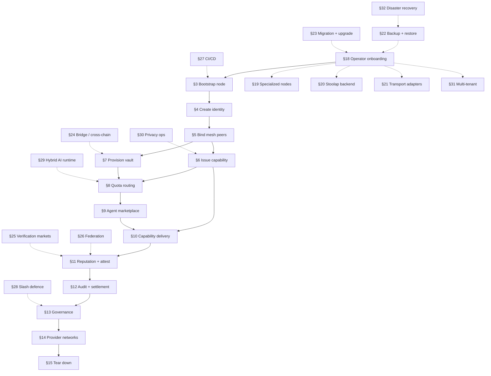

# CipherOcto Operator Guide

**Use-case-centered operator playbook.** Walks an operator (Human / Ci / Dev / Auditor mode) through every scenario end-to-end with copy-pasteable `octo` CLI commands. Cross-references the narrative use-cases in [`docs/use-cases/`](../use-cases/) for business case + token mechanics context.

> Operator focus: **what commands to run, in what order, with what flags**. Each scenario follows the shape: Prerequisites → Setup → Register → Operate → Verify → Tear Down.

---

## Table of contents

§0 [Operator environment](#0-operator-environment)
§1 [Mode + confirmation cheat-sheet](#1-mode--confirmation-cheat-sheet)
§2 [End-to-end scenario flow](#2-end-to-end-scenario-flow)

**Core operator flow (§3-§15):**

§3 [Scenario: bootstrap a new node](#3-bootstrap-a-new-node)
§4 [Scenario: create + manage operator identity](#4-create--manage-operator-identity)
§5 [Scenario: bind mesh peers + verify trust](#5-bind-mesh-peers--verify-trust)
§6 [Scenario: issue + deliver a capability](#6-issue--deliver-a-capability)
§7 [Scenario: provision a vault + transfer funds](#7-provision-a-vault--transfer-funds)
§8 [Scenario: quota routing + marketplace listing](#8-quota-routing--marketplace-listing)
§9 [Scenario: agent marketplace participation](#9-agent-marketplace-participation)
§10 [Scenario: capability delivery end-to-end](#10-capability-delivery-end-to-end)
§11 [Scenario: reputation + attestation](#11-reputation--attestation)
§12 [Scenario: audit + settlement verification](#12-audit--settlement-verification)
§13 [Scenario: governance participation](#13-governance-participation)
§14 [Scenario: provider network (compute/bandwidth/storage/data)](#14-provider-network-computebandwidthstoragedata)
§15 [Scenario: tear down + cleanup](#15-tear-down--cleanup)

**Operational depth (§16-§32):**

§16 [Cross-reference map](#16-cross-reference-map)
§17 [Troubleshooting](#17-troubleshooting)
§18 [Scenario: operator onboarding + first-run checklist](#18-operator-onboarding--first-run-checklist)
§19 [Scenario: run a specialized node (wallet / identity-resolver / capability-issuer / reputation-anchor / paid-query)](#19-run-a-specialized-node)
§20 [Scenario: Stoolap persistence backend setup](#20-stoolap-persistence-backend-setup)
§21 [Scenario: transport adapter onboarding (telegram / whatsapp / matrix)](#21-transport-adapter-onboarding)
§22 [Scenario: backup + restore wallet home + vault + ledger](#22-backup--restore-wallet-home--vault--ledger)
§23 [Scenario: substrate migration + upgrade](#23-substrate-migration--upgrade)
§24 [Scenario: cross-chain / bridge operations](#24-cross-chain--bridge-operations)
§25 [Scenario: probabilistic verification market participation](#25-probabilistic-verification-market-participation)
§26 [Scenario: reputation federation participation](#26-reputation-federation-participation)
§27 [Scenario: CI/CD pipeline integration](#27-cicd-pipeline-integration)
§28 [Scenario: defence against slashing (evidence + appeal)](#28-defence-against-slashing)
§29 [Scenario: hybrid AI + blockchain runtime](#29-hybrid-ai--blockchain-runtime)
§30 [Scenario: privacy-preserving operations (blinded caveats, encrypted routing)](#30-privacy-preserving-operations)
§31 [Scenario: multi-tenant / multi-identity operations](#31-multi-tenant--multi-identity-operations)
§32 [Scenario: disaster recovery (lost identity, corrupted home, ledger corruption)](#32-disaster-recovery)

**Reference appendices:**

Appendix A — [Operator flags reference](#appendix-a--operator-flags-reference)
Appendix B — [Memory cross-references](#appendix-b--memory-cross-references)

---

## §0 Operator environment

### Install

```bash
# Build the `octo` binary (Layer C dispatcher).
cargo build --release -p octo-cli

# Bin path: ./target/release/octo
export PATH="$PWD/target/release:$PATH"
```

### Home directory layout

```bash
# Wallet home — identity keys, peer table, vault metadata.
# Default: ~/.octo (override with $OCTO_HOME).
export OCTO_HOME="$HOME/.octo"

# Stoolap-backed persistence ledger (Layer D adapter, opt-in).
# Used for revocation ledger + cross-process state.
# Default: $OCTO_HOME/data (override with $CIPHEROCTO_DATA_DIR).
export CIPHEROCTO_DATA_DIR="$OCTO_HOME/data"

mkdir -p "$OCTO_HOME" "$CIPHEROCTO_DATA_DIR"
```

The CLI resolves home the same way the wallet substrate does (env override → `~/.octo` fallback). On first run, the CLI creates `$OCTO_HOME/mesh/peers.toml` (0700 perms, atomic write + fsync + rename) on demand.

### Environment variables

| Variable               | Effect                                                                       |
| ---------------------- | ---------------------------------------------------------------------------- |
| `$OCTO_HOME`           | Wallet / mesh home directory (default `~/.octo`).                            |
| `$CIPHEROCTO_DATA_DIR` | Stoolap ledger root (default `$OCTO_HOME/data`).                             |
| `$OCTO_FORCE_JSON`     | Force JSON envelope output regardless of TTY.                                |
| `$NO_COLOR`            | Disable ANSI colour in pretty output.                                        |
| `OCTO_AUDIT=1`         | Auto-switch to **Auditor** (read-only) mode.                                 |
| `CI=true`              | Auto-switch to **Ci** mode unless `--confirm` / `--confirm-acknowledge` set. |

### Verify the install

```bash
octo --version
octo --help
```

Expected: `Octo 0.1.0` and a top-level clap usage block listing every top-level command.

---

## §1 Mode + confirmation cheat-sheet

### Operator modes

| Mode                | Use case                                                           | Writes allowed? | Confirmation gate                        |
| ------------------- | ------------------------------------------------------------------ | --------------- | ---------------------------------------- |
| **Human** (default) | Interactive operator at a terminal                                 | yes             | `--confirm --confirm-acknowledge` (BOTH) |
| **Ci**              | Non-interactive CI runner                                          | yes             | `--allow-write`                          |
| **Dev**             | Local development with `InMemorySigner` / `IdentityKey::from_seed` | yes             | `--allow-write`                          |
| **Auditor**         | Read-only inspection                                               | **NO**          | n/a — writes are hard-denied             |

Auto-detect: `OCTO_AUDIT=1` → Auditor; `CI=true` → Ci (unless `--confirm` / `--confirm-acknowledge` explicitly set, which signals Human intent and suppresses the override).

### Confirmation gate matrix


Dev mode also bypasses `--confirm-acknowledge` (the developer is the acknowledgement) but still requires `--allow-write`. `--dry-run` bypasses both confirmation gates — a preview grants no authority.

### Output envelope flags

| Flag               | Effect                                   |
| ------------------ | ---------------------------------------- |
| `--json`           | Force JSON envelope output (scriptable). |
| `--no-color`       | Disable ANSI colour in pretty output.    |
| `$OCTO_FORCE_JSON` | Same as `--json`, environment-driven.    |

The CLI emits two output shapes: `OutputEnvelope { data, exit_code: 0 }` on success and the typed `OctoCliError` envelope on failure. `--json` collapses both into machine-parseable JSON.

---

## §2 End-to-end scenario flow

The full operator journey from cold start to capability delivery + marketplace participation:



Each §N scenario is self-contained and cross-references the existing narrative use-case in [`docs/use-cases/`](../use-cases/) for business case + token mechanics context. Operational-depth scenarios (§18-§32) are orthogonal flows that the operator runs in parallel with the core §3-§15 path.

---

## §3 Bootstrap a new node

**Narrative cross-ref:** [dot-network-bootstrap.md](../use-cases/dot-network-bootstrap.md) (RFC-0851 + RFC-0851p-a). This scenario covers Mode A (bootstrap nodes); Mode B (DHT fallback) and Mode C (invite link) are future work.

### Prerequisites

- Fresh `$OCTO_HOME` directory.
- Network connectivity to the seed-list service.
- A foundation/DAO-signed seed list (auto-discovered via Mode A default).

### Setup

```bash
# 1. Confirm home directory is clean.
ls -la "$OCTO_HOME"
# Expected: directory exists, empty (or only data/ subdir).

# 2. Probe bootstrap reachability (read-only).
octo network bootstrap --mode default
# --mode default = Mode A bootstrap nodes.
```

### Register

```bash
# 3. Persist local peer entry for the bootstrap source.
octo network peers add \
    --peer-id-hex <bootstrap-peer-id-hex> \
    --trust-level trusted \
    --endpoint <bootstrap-endpoint-uri> \
    --confirm --confirm-acknowledge
```

`peers add` writes to `$OCTO_HOME/mesh/peers.toml` (0700 perms, atomic write + fsync + rename). The peer DID is validated at the dispatch boundary (`is_structurally_valid_did` rejects malformed input — see RFC-0010 canonical form).

### Operate

```bash
# 4. List the registered peers.
octo network peers list --json

# 5. Inspect a specific peer.
octo network peers get --peer-id-hex <bootstrap-peer-id-hex>

# 6. Render the trust graph (proves you have at least 1 trusted peer).
octo network trust-graph render --format ascii --depth 2
# --format ascii | dot; --depth 1-100.
```

### Verify

```bash
# 7. Probe peer reachability via heartbeat.
octo network heartbeat probe did:octo:z<base58btc> \
    --timeout-ms 5000

# 8. Inspect gossip state.
octo network gossip --stats --format ascii
# Returns stub-zero anti-entropy rounds; real anti-entropy counter ships in follow-on Layer D adapter mission.
```

### Tear down

```bash
# 9. Remove the bootstrap peer.
octo network peers remove \
    --peer-id-hex <bootstrap-peer-id-hex> \
    --confirm --confirm-acknowledge
```

---

## §4 Create + manage operator identity

**Narrative cross-ref:** [canonical-octoid-identifier.md](../use-cases/canonical-octoid-identifier.md) (RFC-0010 canonical DID form).

### Prerequisites

- A trusted HSM (production) OR `--dev` mode (local development only).
- `$OCTO_HOME` initialised (see §0).

### Setup

```bash
# 1. Who am I? (currently empty wallet)
octo whoami
# Expected: NoActiveIdentity error envelope.
```

### Register

```bash
# 2a. Production: create identity via HSM (out of CLI scope — uses `octo-wallet` substrate API).
# 2b. Local development: create an InMemorySigner-backed identity.
octo identity create \
    --label operator-main \
    --mode dev \
    --allow-write

# 2c. List identities.
octo identity list --json
```

`identity create` in `--mode dev` mints a deterministic identity derived from the local `IdentityKey::from_seed` path. In production (Human / Ci), the substrate refuses the InMemorySigner downgrade — the HSM is mandatory.

### Operate

```bash
# 3. Set active identity (substrate-level switch).
octo role select --label operator-main
# Substrate calls octo_wallet::set_active.

# 4. Confirm whoami now resolves.
octo whoami
# Expected: { "did": "did:octo:z<base58btc>", "label": "operator-main", ... }

# 5. Rotate the active identity's key (production: HSM-mediated).
octo identity rotate \
    --label operator-main \
    --confirm --confirm-acknowledge

# 6. Bind a public role / node class to the identity (cross-cutting).
# See RFC-0011-d for the role taxonomy; NodeClass mirrors role surface.
octo role bind \
    --node-class Builder \
    --confirm --confirm-acknowledge
```

### Verify

```bash
# 7. Show identity details (substrate-canonical fields).
octo identity show --label operator-main --json

# 8. Network-layer identity cross-check.
octo network identity show
```

### Tear down

```bash
# 9. Revoke the identity (substrate calls the revocation store).
octo identity revoke \
    --label operator-main \
    --confirm --confirm-acknowledge

# 10. (Optional) Cross-process revocation propagation requires the
# Stoolap-backed Layer D adapter (feature: revocation-store-stoolap).
# Default builds use the InMemoryRevocationStore (process-local only).
cargo build -p octo-cli --features revocation-store-stoolap
```

---

## §5 Bind mesh peers + verify trust

**Narrative cross-ref:** [social-platform-transport-layer.md](../use-cases/social-platform-transport-layer.md) (mesh + adapter surface). Each adapter crate (`octo-adapter-telegram`, `octo-adapter-whatsapp`, `octo-adapter-matrix`, …) is a Layer D per-extension crate registering into the Layer B mesh substrate.

### Prerequisites

- Active operator identity (see §4).
- At least 1 trusted peer entry in `$OCTO_HOME/mesh/peers.toml` (see §3).

### Setup

```bash
# 1. Show current peer table.
octo network peers list --json
```

### Register

```bash
# 2. Add a peer entry with explicit trust level + endpoint.
octo network peers add \
    --peer-id-hex <peer-id-hex> \
    --trust-level trusted \
    --endpoint quic://203.0.113.10:4433 \
    --confirm --confirm-acknowledge

# 3. Add a second peer (Sybil resistance — connect to multiple independent operators).
octo network peers add \
    --peer-id-hex <peer-2-id-hex> \
    --trust-level observed \
    --endpoint tcp://198.51.100.20:9000 \
    --confirm --confirm-acknowledge
```

### Operate

```bash
# 4. Render the trust graph.
octo network trust-graph render --format dot --depth 3 > trust.dot
# Use graphviz to visualise: dot -Tpng trust.dot -o trust.png

# 5. Inspect a peer's trust score (via reputation substrate).
octo network reputation show --peer-did did:octo:z<base58btc>

# 6. Probe liveness.
octo network heartbeat probe did:octo:z<base58btc> \
    --timeout-ms 5000

# 7. Inspect gossip + envelope state.
octo network gossip --stats --format ascii
octo network envelope inspect <envelope-id-hex>
```

### Verify

```bash
# 8. Network-wide topology view.
octo network topology render --format dot --depth 5

# 9. Quota router health (cross-region routing requires multiple healthy peers).
octo network router status
octo network router peers --peer-node-id-hex <peer-node-id-hex>
```

### Tear down

```bash
# 10. Remove the peer entry.
octo network peers remove \
    --peer-id-hex <peer-id-hex> \
    --confirm --confirm-acknowledge
```

---

## §6 Issue + deliver a capability

**Substrate layer:** `octo-cap-macaroon` (Layer B, RFC-0957 algorithms + RFC-0011-c §9.3.2 + RFC-0965 audit-window caveat). Capabilities are macaroon-style bearer tokens with caveats that attenuate authority.

### Prerequisites

- Active operator identity (see §4).
- A target DID to receive the capability.

### Setup

```bash
# 1. Reserve a target DID + asset / scope.
TARGET_DID="did:octo:z<base58btc-target>"
SCOPE="vault.transfer.<vault-id-hex>"
```

### Register

```bash
# 2. Mint the capability (substrate: octo_cap_macaroon::mint).
octo capability mint \
    --scope "$SCOPE" \
    --holder-did "$TARGET_DID" \
    --audit-window-secs 3600 \
    --mode dev \
    --allow-write
```

`--audit-window-secs` attaches `Caveat::AuditWindow { duration_secs }` to the capability. The substrate enforces the `set_subsumes` attenuation rule: parent `p_dur` subsumes child `c_dur` iff `c_dur >= p_dur`. Non-zero parent cannot subsume zero child (downgrade disallowed; widening disallowed).

### Operate

```bash
# 3. Attach additional caveats (e.g., rate limit, spend cap).
octo capability attenuate \
    --capability-id <cap-id-hex> \
    --caveat max-amount-dqa-micros:1000000 \
    --confirm --confirm-acknowledge

# 4. Verify the capability at the receiver.
octo capability verify \
    --capability-id <cap-id-hex> \
    --holder-did "$TARGET_DID" \
    --json
# Substrate path: octo_cap_macaroon::verify_full; fails-closed on unknown caveat.

# 5. List active capabilities issued by this operator.
octo capability list --json
```

### Verify

```bash
# 6. Show the capability record (canonical substrate fields).
octo capability show --capability-id <cap-id-hex> --json

# 7. Cross-check via audit trail (capability mint is an auditable event).
octo audit list --kind capability-mint --limit 50
```

### Tear down

```bash
# 8. Revoke the capability.
octo capability revoke \
    --capability-id <cap-id-hex> \
    --confirm --confirm-acknowledge
```

---

## §7 Provision a vault + transfer funds

**Narrative cross-ref:** [asset-generic-payment-caveat.md](../use-cases/asset-generic-payment-caveat.md) (vault substrate + payment caveats). Substrate layer: `octo-vault` (Layer B, RFC-0960 balance projection + RFC-0011-e vault substrate).

### Prerequisites

- Active operator identity (see §4).
- A target peer DID + asset ID.
- A chain adapter (production: HSM-bound signing key; dev: `InMemorySigner`).

### Setup

```bash
# 1. Resolve the chain ID + asset ID.
CHAIN_ID="cipherocto-mainnet"
ASSET_ID="octo"

# 2. Compute the deterministic vault ID.
# Substrate: octo_vault::vault_id(chain_id, owner_did, asset_id)
# BLAKE3-prefixed concatenation: BLAKE3("cipherocto/vault/v1/" || chain_id || owner_did || asset_id)
```

### Register

```bash
# 3. Provision the vault (substrate port: VaultOwnerIndex).
octo vault create \
    --chain-id "$CHAIN_ID" \
    --asset-id "$ASSET_ID" \
    --mode dev \
    --allow-write

# 4. Verify the vault was provisioned.
octo vault list --json
```

### Operate

```bash
# 5. Project balance (substrate canonical 7-param signature).
octo vault balance \
    --chain-id "$CHAIN_ID" \
    --asset-id "$ASSET_ID" \
    --json
# Returns VaultBalanceProjection { chain_id, vault_id, asset_id, projected_balance: Dqa,
#                                 projected_at_unix_seconds, registry_snapshot_epoch,
#                                 source_kind: ProjectionSource }
# ProjectionSource = Cache | FreshLogScan | EpochRebuild (non_exhaustive enum).

# 6. Initiate a transfer (substrate: initiate_transfer).
# Pre-flight checks (CLI-side, NOT substrate): chain-affinity, balance-sufficient-source,
# owner-authorized, vault-state-active, recipient-existence.
octo vault transfer \
    --dest-vault-id <dest-vault-id-hex> \
    --amount-dqa-micros 1000000 \
    --asset-id "$ASSET_ID" \
    --dry-run
# Dry-run prints the canonical envelope (handle_id + nonce + status); no signing, no broadcast.

# 7. Re-run for real (production: HSM signs; dev: InMemorySigner).
octo vault transfer \
    --dest-vault-id <dest-vault-id-hex> \
    --amount-dqa-micros 1000000 \
    --asset-id "$ASSET_ID" \
    --confirm --confirm-acknowledge
```

Replay defense: the chain adapter is responsible for `TransferEventLog::insert` BEFORE state mutation. The substrate reserves the handle nonce for envelope identification only.

### Verify

```bash
# 8. Re-project balance (source should reflect debit; dest should reflect credit).
octo vault balance --chain-id "$CHAIN_ID" --asset-id "$ASSET_ID"

# 9. Audit trail (settlement substrate emits a receipt).
octo audit list --kind vault-transfer --limit 10
octo audit show --receipt-id <receipt-id-u64>
```

### Tear down

```bash
# 10. Freeze the vault (VaultState::Frozen; no transfers in or out; audit writes still allowed).
octo vault freeze \
    --chain-id "$CHAIN_ID" \
    --asset-id "$ASSET_ID" \
    --confirm --confirm-acknowledge

# 11. (Optional) Destroy the vault (substrate-side; irreversible).
octo vault destroy \
    --chain-id "$CHAIN_ID" \
    --asset-id "$ASSET_ID" \
    --confirm --confirm-acknowledge
```

---

## §8 Quota routing + marketplace listing

**Narrative cross-refs:**

- [ai-quota-marketplace.md](../use-cases/ai-quota-marketplace.md) (OCTO-W token mechanics)
- [enhanced-quota-router-gateway.md](../use-cases/enhanced-quota-router-gateway.md) (gateway spec)
- [privacy-preserving-query-routing.md](../use-cases/privacy-preserving-query-routing.md) (private routing)

**Substrate layer:** `quota-router-core` (Layer B, RFC-0870). CLI: `quota-router-cli` (separate binary from `octo`).

### Prerequisites

- Active operator identity (see §4).
- A pool of unused AI API quotas (e.g., OpenAI, Anthropic API keys) — dev only, never commit.
- Cross-region peers reachable (see §5).

### Setup — `quota-router-cli`

```bash
# 1. Install the quota router CLI (separate workspace member).
cargo build --release -p quota-router-cli

export QUOTA_ROUTER_BIN="$PWD/target/release/quota-router-cli"
```

### Register

```bash
# 2. Configure local upstream providers (your API keys never leave the machine).
$QUOTA_ROUTER_BIN upstream add \
    --label openai-prod \
    --endpoint https://api.openai.com/v1 \
    --api-key-env OPENAI_API_KEY \
    --allow-write

# 3. Add a second upstream for redundancy.
$QUOTA_ROUTER_BIN upstream add \
    --label anthropic-prod \
    --endpoint https://api.anthropic.com/v1 \
    --api-key-env ANTHROPIC_API_KEY \
    --allow-write

# 4. List configured upstreams.
$QUOTA_ROUTER_BIN upstream list --json
```

### Operate — local routing

```bash
# 5. Route a prompt to the lowest-latency upstream.
$QUOTA_ROUTER_BIN route \
    --prompt "Summarise the CipherOcto whitepaper" \
    --budget-dqa-micros 100 \
    --json
# Returns the routed provider + response + cost in Dqa.

# 6. Inspect routing policy.
$QUOTA_ROUTER_BIN policy show --json
```

### Operate — marketplace listing

```bash
# 7. List the local spare quota on the marketplace.
# Each prompt costs 1 OCTO-W on the listing.
$QUOTA_ROUTER_BIN market list \
    --label openai-prod \
    --spare-prompts 1000 \
    --price-octw 1 \
    --allow-write

# 8. Show your marketplace listings.
$QUOTA_ROUTER_BIN market listings --json
```

### Operate — consume from marketplace

```bash
# 9. Discover listings (peer queries the marketplace substrate).
$QUOTA_ROUTER_BIN market search --min-prompts 100 --json

# 10. Buy a listing (spend OCTO-W; receipts flow through settlement substrate).
$QUOTA_ROUTER_BIN market buy \
    --listing-id <listing-id-hex> \
    --prompts 500 \
    --confirm --confirm-acknowledge
```

### Verify

```bash
# 11. Confirm your balance reflects the transaction.
$QUOTA_ROUTER_BIN balance --json

# 12. Audit trail (quota-marketplace buy/sell events).
octo audit list --kind quota-marketplace-trade --limit 20
```

### Tear down

```bash
# 13. Delist the marketplace entry.
$QUOTA_ROUTER_BIN market delist --listing-id <listing-id-hex> --confirm --confirm-acknowledge

# 14. Remove the upstream (keys stay in your env; the router just forgets the policy).
$QUOTA_ROUTER_BIN upstream remove --label openai-prod --confirm --confirm-acknowledge
```

---

## §9 Agent marketplace participation

**Narrative cross-ref:** [agent-marketplace.md](../use-cases/agent-marketplace.md) (OCTO-D token mechanics + developer incentives). Substrate layer: `octo-runtime` (Layer B, RFC-0011-c §9.10 UUIDv5 deterministic agent_id).

### Prerequisites

- Active operator identity (see §4).
- An agent manifest (JSON; describes capabilities, pricing, version).
- Either consume (hire) or produce (publish) — both flows below.

### Setup

```bash
# 1. Sample agent manifest (write to file).
cat > /tmp/legal-analyzer.json <<'EOF'
{
  "name": "Legal Contract Analyzer",
  "version": "1.2.0",
  "developer": "did:octo:z<base58btc-developer>",
  "capabilities": ["contract_review", "risk_assessment", "compliance_check"],
  "pricing": {
    "per_execution_octd_micros": 10000
  },
  "runtime": "cipherocto-agent-v1",
  "entrypoint": "analyze_contract.py"
}
EOF
```

### Register (publish path)

```bash
# 2. Create the agent (substrate: spawn_agent returns deterministic UUIDv5 agent_id).
octo agent create \
    --manifest-path /tmp/legal-analyzer.json \
    --mode dev \
    --allow-write

# 3. Confirm the agent was created.
octo agent list --json
```

`agent create` derives the deterministic `agent_id` (UUIDv5 per RFC-0011-c §9.10) from the developer DID + manifest hash. Re-creating with the same manifest returns the same `agent_id` (idempotent).

### Operate (publish path)

```bash
# 4. Attach the agent to a running runtime.
octo agent attach \
    --agent-id <agent-id-uuid> \
    --mode dev \
    --allow-write

# 5. Confirm Running state.
octo agent state --agent-id <agent-id-uuid>
# Substrate: read_agent_state gates on Running before runtime attach (RFC-0011-c §9.8).

# 6. Run a task via the agent.
octo agent run \
    --agent-id <agent-id-uuid> \
    --input /tmp/sample-contract.pdf \
    --json

# 7. Publish to marketplace (the marketplace substrate is part of agent runtime).
octo agent publish \
    --agent-id <agent-id-uuid> \
    --price-octd-micros 10000 \
    --confirm --confirm-acknowledge
```

### Operate (consume path)

```bash
# 8. Search the marketplace for an agent.
octo agent search \
    --capability contract_review \
    --max-price-octd-micros 50000 \
    --json

# 9. Hire the agent (spend OCTO-D; settlement substrate emits a receipt).
octo agent hire \
    --agent-id <agent-id-uuid> \
    --input /tmp/sample-contract.pdf \
    --confirm --confirm-acknowledge
```

### Verify

```bash
# 10. Audit trail (every execution emits an audit event).
octo audit list --kind agent-execution --limit 50
octo audit show --receipt-id <receipt-id-u64>

# 11. Reputation snapshot (the developer earned +X from your execution).
octo reputation show --peer-did did:octo:z<base58btc-developer>
```

### Tear down

```bash
# 12. Unpublish from marketplace.
octo agent unpublish --agent-id <agent-id-uuid> --confirm --confirm-acknowledge

# 13. Detach the agent from the runtime.
octo agent detach --agent-id <agent-id-uuid> --confirm --confirm-acknowledge

# 14. Destroy the agent record.
octo agent destroy --agent-id <agent-id-uuid> --confirm --confirm-acknowledge
```

---

## §10 Capability delivery end-to-end

**New operator scenario.** Closes the loop from §6 (issue) + §9 (publish) by walking the full capability lifecycle: **mint → publish listing → buyer discovers → buyer acquires → buyer redeems → audit trail closes**. Cross-cuts RFC-0957 (capability substrate) + RFC-0965 (audit-window caveat) + RFC-0011-c (runtime attach).

### Prerequisites

- Active operator identity (see §4).
- A recipient DID + a vault (see §7).
- Agent registered (see §9) — the capability is what authorises the agent to spend against the vault.

### Setup

```bash
# 1. Resolve the buyer DID + vault ID + audit window.
BUYER_DID="did:octo:z<base58btc-buyer>"
VAULT_ID="<vault-id-hex>"
AGENT_ID="<agent-id-uuid>"
AUDIT_WINDOW_SECS=86400  # 1 day
```

### Mint

```bash
# 2. Mint the capability (substrate: octo_cap_macaroon::mint).
octo capability mint \
    --scope "agent.spend.vault=$VAULT_ID" \
    --holder-did "$BUYER_DID" \
    --audit-window-secs "$AUDIT_WINDOW_SECS" \
    --mode dev \
    --allow-write

# Returns: { capability_id: <cap-id-hex>, caveats: [{ kind: AuditWindow, duration_secs: 86400 }, ...] }
```

### Publish + discover + acquire

```bash
# 3. Publish the capability listing (capability marketplace is part of
# the capability substrate; the listing binds a capability to a price + recipient slot).
octo capability publish \
    --capability-id <cap-id-hex> \
    --price-octd-micros 50000 \
    --confirm --confirm-acknowledge

# 4. Buyer discovers the listing.
octo capability search \
    --scope "agent.spend.vault=$VAULT_ID" \
    --max-price-octd-micros 100000 \
    --json

# 5. Buyer acquires the listing (capability is transferred to the buyer's holder).
octo capability acquire \
    --listing-id <listing-id-hex> \
    --confirm --confirm-acknowledge
```

### Redeem

```bash
# 6. Buyer redeems the capability by attaching the agent to the vault (substrate: octo_runtime::attach).
# The capability is presented at attach time; octo_runtime::verify_full runs the caveat chain.
octo agent attach \
    --agent-id "$AGENT_ID" \
    --capability-id <cap-id-hex> \
    --mode dev \
    --allow-write
# Substrate: octo_cap_macaroon::verify_full + octo_runtime::attach. Fails-closed on unknown caveat.

# 7. Agent spends against the vault (reservations substrate per RFC-0965).
octo agent run \
    --agent-id "$AGENT_ID" \
    --input /tmp/task.json \
    --vault-id "$VAULT_ID" \
    --json
```

### Verify

```bash
# 8. Capability audit trail.
octo audit list --kind capability-mint --limit 1
octo audit list --kind capability-acquire --limit 1
octo audit list --kind capability-redeem --limit 1

# 9. Vault balance post-spend (should reflect the reservation).
octo vault balance --vault-id "$VAULT_ID" --json

# 10. Agent reputation post-execution.
octo reputation show --peer-did "$BUYER_DID"
```

### Tear down

```bash
# 11. Revoke the capability (substrate: octo_cap_macaroon::revoke).
octo capability revoke \
    --capability-id <cap-id-hex> \
    --confirm --confirm-acknowledge
# Revocation propagates across CLI processes only when the
# Stoolap-backed Layer D adapter is enabled (see §4 step 10).
```

---

## §11 Reputation + attestation

**Narrative cross-refs:**

- [reputation-persistence.md](../use-cases/reputation-persistence.md) (RFC-0968)
- [probabilistic-verification-markets.md](../use-cases/probabilistic-verification-markets.md) (verification + slashing)

### Prerequisites

- Active operator identity (see §4).
- At least one peer DID with reputation history.

### Setup

```bash
# 1. Show the global reputation snapshot.
octo reputation show --json
```

### Register

```bash
# 2. Attest to a peer (substrate: octo_reputation::attest).
# Attestations are positive signals only; slashing is a separate substrate flow.
octo network attest \
    --peer-did did:octo:z<base58btc> \
    --score 85 \
    --reason "reliable-routing" \
    --confirm --confirm-acknowledge

# 3. Vote on a coordination decision (substrate: coordination vote).
octo network vote \
    --proposal-id <proposal-id-hex> \
    --verdict approve \
    --confirm --confirm-acknowledge
```

### Operate

```bash
# 4. List peers by reputation filter.
octo network reputation list --filter above-50 --json
# --filter all | above-score:<N> | below-score:<N>

# 5. Inspect a specific peer's reputation.
octo network reputation show --peer-did did:octo:z<base58btc>

# 6. Check the reputation substrate for storage adapter wiring.
# octo-reputation ships InMemoryReputationStore (default) + StoolapReputationStore (Layer D).
```

### Verify

```bash
# 7. Audit trail (attestations + votes are auditable).
octo audit list --kind reputation-attest --limit 50

# 8. Cross-check via the trust-graph render (peers with high reputation have higher trust edges).
octo network trust-graph render --format ascii --depth 3
```

### Tear down

```bash
# 9. Attestations are immutable; there is no "unattest" operation.
# Slashing (if the peer's behaviour degrades) flows through §13 governance.
```

---

## §12 Audit + settlement verification

**Narrative cross-refs:**

- [verifiable-reasoning-traces.md](../use-cases/verifiable-reasoning-traces.md) (RFC-016-a audit write-path)
- [verifiable-ai-agents-defi.md](../use-cases/verifiable-ai-agents-defi.md) (DeFi + audit integration)

### Prerequisites

- A populated audit trail (any prior scenarios in §3-§11 will have generated events).

### Setup

```bash
# 1. List recent audit events.
octo audit list --limit 100 --json
```

### Register

```bash
# 2. (Optional) Filter by event kind.
octo audit list --kind vault-transfer --limit 20 --json
octo audit list --kind agent-execution --limit 20 --json
octo audit list --kind capability-mint --limit 20 --json
octo audit list --kind reputation-attest --limit 20 --json
```

### Operate

```bash
# 3. Show a single audit event (substrate: octo_settlement::Receipt point-lookup projection).
octo audit show --receipt-id <receipt-id-u64> --json

# 4. Verify the receipt is canonically encoded (RFC-0126 canonical-JSON).
octo audit verify --receipt-id <receipt-id-u64> --json
# Returns { valid: true, canonical_bytes_hex: ..., algorithm: BLAKE3 }
```

### Verify

```bash
# 5. Cross-check via the network-side audit view.
octo network authority show
octo network governance tally --proposal-id <proposal-id-hex>

# 6. Cross-check via the audit write-path rollup (RFC-0016-a).
octo audit rollup --epoch <epoch-number> --json
```

### Tear down

```bash
# 7. Audit records are immutable + append-only. There is no delete operation.
```

---

## §13 Governance participation

**Narrative cross-refs:**

- [mission-coordinator-lifecycle.md](../use-cases/mission-coordinator-lifecycle.md) (RFC-0855p-b)
- [orchestrator-role.md](../use-cases/orchestrator-role.md) (OCTO-O governance + agent coordination)
- [dual-mode-authorization-workflow.md](../use-cases/dual-mode-authorization-workflow.md) (Human + Ci governance flow)

### Prerequisites

- Active operator identity (see §4).
- Stake in the proposal (governance substrate enforces stake-weighted voting).

### Setup

```bash
# 1. Take a snapshot of the current governance state.
octo governance snapshot --json
# Substrate: octo_governance::snapshot() + OctoGovernanceSnapshotCache (LRU + 600s TTL per RFC-0011-g).
```

### Register

```bash
# 2. Inspect a specific proposal.
octo governance show --proposal-id <proposal-id-hex> --json
```

### Operate

```bash
# 3. Cast a vote (substrate: octo_governance::vote).
octo governance vote \
    --proposal-id <proposal-id-hex> \
    --verdict approve \
    --stake-dqa-micros 100000000 \
    --confirm --confirm-acknowledge

# 4. Attest to the proposal (separate signal from voting).
octo governance attest \
    --proposal-id <proposal-id-hex> \
    --score 80 \
    --reason "well-specified" \
    --confirm --confirm-acknowledge

# 5. Network-side tally view.
octo network governance tally --proposal-id <proposal-id-hex> --json
```

### Verify

```bash
# 6. Re-take the snapshot (cache TTL 600s).
octo governance snapshot --json
octo governance snapshot --force --json  # bypass TTL

# 7. Network-side rotation status (RFC-0011-w paired amendment).
octo network governance rotation status --json

# 8. Coordinator state (RFC-0855p-b mission coordinator lifecycle).
octo network coordinator show --json
```

### Tear down

```bash
# 9. Votes are immutable. There is no "unvote" operation.
# Slashing against the proposal (if it later fails) is governed by the
# slash substrate (§11 step 9 + RFC-0855p-b slash reason codes).
```

---

## §14 Provider network (compute/bandwidth/storage/data)

**Narrative cross-refs:**

- [compute-provider-network.md](../use-cases/compute-provider-network.md) (OCTO-A mechanics)
- [bandwidth-provider-network.md](../use-cases/bandwidth-provider-network.md)
- [storage-provider-network.md](../use-cases/storage-provider-network.md)
- [data-marketplace.md](../use-cases/data-marketplace.md)
- [telegram-auth-onboarding.md](../use-cases/telegram-auth-onboarding.md) (real-world onboarding example)
- [decentralized-mission-execution.md](../use-cases/decentralized-mission-execution.md) (provider + agent composition)

### Prerequisites

- Active operator identity (see §4).
- The substrate resources being provided:
  - **Compute:** A host machine + runtime.
  - **Bandwidth:** Network capacity + endpoint.
  - **Storage:** Disk space + retention policy.
  - **Data:** A dataset manifest + access policy.

### Register — common (NodeClass binding)

```bash
# 1. Bind a node class to your identity (one of: Builder | Provider | Storage | Bandwidth | Orchestrator).
# Mirrors the role taxonomy per RFC-0011-d; additive type per [extension over enumeration](..).
octo role bind \
    --node-class Provider \
    --confirm --confirm-acknowledge
```

### Register — compute provider

```bash
# 2. Register the compute node.
octo provider compute register \
    --endpoint quic://<host>:4433 \
    --capacity-cores 16 \
    --capacity-ram-mib 65536 \
    --price-octa-micros-per-second 100 \
    --confirm --confirm-acknowledge
```

### Register — bandwidth provider

```bash
# 3. Register the bandwidth endpoint.
octo provider bandwidth register \
    --endpoint quic://<host>:4433 \
    --capacity-mbps 1000 \
    --price-octb-micros-per-mb 50 \
    --confirm --confirm-acknowledge
```

### Register — storage provider

```bash
# 4. Register the storage endpoint.
octo provider storage register \
    --endpoint quic://<host>:4433 \
    --capacity-gib 1024 \
    --retention-days 365 \
    --price-octs-micros-per-gib-day 10 \
    --confirm --confirm-acknowledge
```

### Register — data provider

```bash
# 5. Register a dataset manifest.
cat > /tmp/dataset-manifest.json <<'EOF'
{
  "name": "legal-corpus-v1",
  "schema_version": "1.0",
  "license": "CC-BY-4.0",
  "data_flag": "SHARED",
  "records": 1000000
}
EOF

octo provider data register \
    --manifest /tmp/dataset-manifest.json \
    --access-policy marketplace \
    --price-octd-micros-per-query 100 \
    --confirm --confirm-acknowledge
```

### Operate

```bash
# 6. List all your registered providers.
octo provider list --json

# 7. Inspect network-side node record (RFC-0871 specialized node protocol).
octo network node show --node-id-hex <node-id-hex>

# 8. Bind the holder DID to the node record.
octo network node bind \
    --node-id-hex <node-id-hex> \
    --holder-did did:octo:z<base58btc> \
    --confirm --confirm-acknowledge
```

### Verify

```bash
# 9. Health probes via heartbeat.
octo network heartbeat probe did:octo:z<base58btc> --timeout-ms 5000

# 10. Reputation + audit trail for provider revenue.
octo reputation show --peer-did did:octo:z<base58btc>
octo audit list --kind provider-earning --limit 50
```

### Tear down

```bash
# 11. Deregister each provider.
octo provider compute deregister --node-id-hex <node-id-hex> --confirm --confirm-acknowledge
octo provider bandwidth deregister --node-id-hex <node-id-hex> --confirm --confirm-acknowledge
octo provider storage deregister --node-id-hex <node-id-hex> --confirm --confirm-acknowledge
octo provider data deregister --dataset-id <dataset-id-hex> --confirm --confirm-acknowledge
```

---

## §15 Tear down + cleanup

End-to-end shutdown. Mirrors the reverse of §3-§14 to leave the operator environment clean.

```bash
# 1. Unpublish all agents.
octo agent unpublish --all --confirm --confirm-acknowledge

# 2. Destroy all agents.
for agent_id in $(octo agent list --json | jq -r '.[].agent_id'); do
    octo agent destroy --agent-id "$agent_id" --confirm --confirm-acknowledge
done

# 3. Revoke all capabilities.
for cap_id in $(octo capability list --json | jq -r '.[].capability_id'); do
    octo capability revoke --capability-id "$cap_id" --confirm --confirm-acknowledge
done

# 4. Freeze all vaults (substrate: VaultState::Frozen; no transfers in or out).
for vault_id in $(octo vault list --json | jq -r '.[].vault_id'); do
    octo vault freeze --vault-id "$vault_id" --confirm --confirm-acknowledge
done

# 5. Remove all mesh peers.
for peer_id in $(octo network peers list --json | jq -r '.[].peer_id_hex'); do
    octo network peers remove --peer-id-hex "$peer_id" --confirm --confirm-acknowledge
done

# 6. Deregister all providers.
octo provider deregister --all --confirm --confirm-acknowledge

# 7. Revoke the active identity.
octo identity revoke --label operator-main --confirm --confirm-acknowledge

# 8. Clear the mesh peer table (atomic file ops; 0700 perms).
rm -f "$OCTO_HOME/mesh/peers.toml"

# 9. Clear the Stoolap ledger (Layer D adapter state).
# Only if you enabled revocation-store-stoolap — default builds keep it in-memory.
rm -rf "$CIPHEROCTO_DATA_DIR/revocation.stoolap"

# 10. (Nuclear option) wipe the wallet home.
# ONLY if you also accept losing the identity keys + audit trail.
rm -rf "$OCTO_HOME"
```

---

## §16 Cross-reference map

### Narrative use-cases in `docs/use-cases/`

| Operator scenario          | Narrative use-case                                                                                                           | Token  | Substrate crate                                         |
| -------------------------- | ---------------------------------------------------------------------------------------------------------------------------- | ------ | ------------------------------------------------------- |
| §3 Bootstrap               | [dot-network-bootstrap.md](../use-cases/dot-network-bootstrap.md)                                                            | n/a    | `octo-network`                                          |
| §3 Bootstrap               | [social-platform-transport-layer.md](../use-cases/social-platform-transport-layer.md)                                        | n/a    | `octo-mesh` + adapters                                  |
| §4 Identity                | [canonical-octoid-identifier.md](../use-cases/canonical-octoid-identifier.md)                                                | n/a    | `octo-ident`                                            |
| §5 Mesh peers              | [social-platform-transport-layer.md](../use-cases/social-platform-transport-layer.md)                                        | n/a    | `octo-mesh`                                             |
| §6 Capability              | (no narrative — RFC-0957 + RFC-0965 are the canonical specs)                                                                 | n/a    | `octo-cap-macaroon`                                     |
| §7 Vault                   | [asset-generic-payment-caveat.md](../use-cases/asset-generic-payment-caveat.md)                                              | OCTO   | `octo-vault`                                            |
| §8 Quota routing           | [ai-quota-marketplace.md](../use-cases/ai-quota-marketplace.md)                                                              | OCTO-W | `quota-router-core`                                     |
| §8 Quota routing           | [enhanced-quota-router-gateway.md](../use-cases/enhanced-quota-router-gateway.md)                                            | OCTO-W | `quota-router-core`                                     |
| §8 Quota routing           | [privacy-preserving-query-routing.md](../use-cases/privacy-preserving-query-routing.md)                                      | OCTO-W | `quota-router-core`                                     |
| §9 Agent marketplace       | [agent-marketplace.md](../use-cases/agent-marketplace.md)                                                                    | OCTO-D | `octo-runtime`                                          |
| §9 Agent marketplace       | [wallet-as-specialized-node.md](../use-cases/wallet-as-specialized-node.md)                                                  | n/a    | `octo-wallet` + `octo-wallet-node`                      |
| §10 Capability delivery    | (new — RFC-0957 + RFC-0011-c composition)                                                                                    | n/a    | `octo-cap-macaroon` + `octo-runtime`                    |
| §11 Reputation             | [reputation-persistence.md](../use-cases/reputation-persistence.md)                                                          | n/a    | `octo-reputation`                                       |
| §11 Reputation             | [probabilistic-verification-markets.md](../use-cases/probabilistic-verification-markets.md)                                  | n/a    | `octo-reputation` + `octo-network`                      |
| §12 Audit                  | [verifiable-reasoning-traces.md](../use-cases/verifiable-reasoning-traces.md)                                                | n/a    | `octo-audit` + `octo-settlement`                        |
| §12 Audit                  | [verifiable-ai-agents-defi.md](../use-cases/verifiable-ai-agents-defi.md)                                                    | n/a    | `octo-audit` + `octo-settlement`                        |
| §13 Governance             | [mission-coordinator-lifecycle.md](../use-cases/mission-coordinator-lifecycle.md)                                            | n/a    | `octo-network` (slash)                                  |
| §13 Governance             | [orchestrator-role.md](../use-cases/orchestrator-role.md)                                                                    | OCTO-O | `octo-role` + `octo-governance`                         |
| §13 Governance             | [dual-mode-authorization-workflow.md](../use-cases/dual-mode-authorization-workflow.md)                                      | n/a    | `octo-runtime`                                          |
| §14 Provider network       | [compute-provider-network.md](../use-cases/compute-provider-network.md)                                                      | OCTO-A | `octo-network`                                          |
| §14 Provider network       | [bandwidth-provider-network.md](../use-cases/bandwidth-provider-network.md)                                                  | OCTO-B | `octo-network`                                          |
| §14 Provider network       | [storage-provider-network.md](../use-cases/storage-provider-network.md)                                                      | OCTO-S | `octo-network`                                          |
| §14 Provider network       | [data-marketplace.md](../use-cases/data-marketplace.md)                                                                      | OCTO-D | `octo-network` + `octo-reputation`                      |
| §14 Provider network       | [telegram-auth-onboarding.md](../use-cases/telegram-auth-onboarding.md)                                                      | n/a    | `octo-adapter-telegram`                                 |
| §14 Provider network       | [decentralized-mission-execution.md](../use-cases/decentralized-mission-execution.md)                                        | n/a    | `octo-network` + `octo-runtime`                         |
| §15 Tear down + cleanup    | (no narrative — synthesizes reverse of §3-§14)                                                                               | n/a    | `octo-wallet` + `octo-network`                          |
| §16 Cross-reference map    | (self — this section)                                                                                                        | n/a    | n/a                                                     |
| §17 Troubleshooting        | (no narrative — common-error-lookup reference; §17.1 enumerates the 6-phase pattern for §18-§32)                             | n/a    | `octo-cli::error`                                       |
| §18 Operator onboarding    | [dot-network-bootstrap.md](../use-cases/dot-network-bootstrap.md)                                                            | n/a    | `octo-network` (bootstrap substrate)                    |
| §18 Operator onboarding    | [canonical-octoid-identifier.md](../use-cases/canonical-octoid-identifier.md)                                                | n/a    | `octo-ident`                                            |
| §19 Specialized nodes      | [compute-provider-network.md](../use-cases/compute-provider-network.md)                                                      | OCTO-A | `octo-network`                                          |
| §19 Specialized nodes      | [bandwidth-provider-network.md](../use-cases/bandwidth-provider-network.md)                                                  | OCTO-B | `octo-network`                                          |
| §19 Specialized nodes      | [storage-provider-network.md](../use-cases/storage-provider-network.md)                                                      | OCTO-S | `octo-network`                                          |
| §19 Specialized nodes      | [orchestrator-role.md](../use-cases/orchestrator-role.md)                                                                    | OCTO-O | `octo-role`                                             |
| §19 Specialized nodes      | [wallet-as-specialized-node.md](../use-cases/wallet-as-specialized-node.md)                                                  | n/a    | `octo-wallet-node`                                      |
| §19 Specialized nodes      | [node-operations.md](../use-cases/node-operations.md)                                                                        | OCTO-N | `octo-network`                                          |
| §20 Stoolap backend        | [stoolap-only-persistence.md](../use-cases/stoolap-only-persistence.md)                                                      | n/a    | `octo-storage-core`                                     |
| §20 Stoolap backend        | [stoolap-data-sync-via-cipherocto-network.md](../use-cases/stoolap-data-sync-via-cipherocto-network.md)                      | n/a    | `octo-network`                                          |
| §21 Transport adapter      | [telegram-auth-onboarding.md](../use-cases/telegram-auth-onboarding.md)                                                      | n/a    | `octo-adapter-telegram`                                 |
| §21 Transport adapter      | [social-platform-transport-layer.md](../use-cases/social-platform-transport-layer.md)                                        | n/a    | `octo-adapter-{ws,p2p,…}`                               |
| §22 Backup + restore       | (no narrative — substrate-new; substrate path: `octo-wallet` mnemonic + `octo-storage-core` ledger)                          | n/a    | `octo-wallet` + `octo-storage-core`                     |
| §23 Substrate migration    | (no narrative — substrate-new; substrate path: `octo_vault::apply(db)` + `BUILTIN_MIGRATION_CATALOG` per RFC-0206)           | n/a    | `octo-storage-core::Database`                           |
| §24 Cross-chain / bridge   | [asset-generic-payment-caveat.md](../use-cases/asset-generic-payment-caveat.md)                                              | OCTO   | `octo-vault` + bridge substrate                         |
| §25 Verification markets   | [probabilistic-verification-markets.md](../use-cases/probabilistic-verification-markets.md)                                  | n/a    | `octo-network` (slash + reputation)                     |
| §26 Reputation federation  | [reputation-persistence.md](../use-cases/reputation-persistence.md)                                                          | n/a    | `octo-reputation`                                       |
| §26 Reputation federation  | [reputation-federation-guide.md](../07-developers/reputation-federation-guide.md)                                            | n/a    | `octo-reputation` + RFC-0968 §28.4 amendment 22         |
| §27 CI/CD                  | (no narrative — substrate-new)                                                                                               | n/a    | `octo-cli` (Ci/Dev modes)                               |
| §28 Slash defence          | [bootstrap-slash-evidence-runbook.md](bootstrap-slash-evidence-runbook.md)                                                   | n/a    | `octo-network` (slash)                                  |
| §29 Hybrid AI + blockchain | [hybrid-ai-blockchain-runtime.md](../use-cases/hybrid-ai-blockchain-runtime.md)                                              | OCTO-W | `octo-runtime` + AI substrate                           |
| §29 Hybrid AI + blockchain | [verifiable-reasoning-traces.md](../use-cases/verifiable-reasoning-traces.md)                                                | n/a    | `octo-runtime` + ZK substrate                           |
| §30 Privacy ops            | [privacy-preserving-query-routing.md](../use-cases/privacy-preserving-query-routing.md)                                      | OCTO-W | `quota-router-core`                                     |
| §30 Privacy ops            | [asset-generic-payment-caveat.md](../use-cases/asset-generic-payment-caveat.md)                                              | OCTO   | `octo-cap-macaroon`                                     |
| §30 Privacy ops            | [enterprise-private-ai.md](../use-cases/enterprise-private-ai.md)                                                            | n/a    | `octo-runtime`                                          |
| §31 Multi-tenant           | [wallet-as-specialized-node.md](../use-cases/wallet-as-specialized-node.md)                                                  | n/a    | `octo-wallet`                                           |
| §31 Multi-tenant           | [dual-mode-authorization-workflow.md](../use-cases/dual-mode-authorization-workflow.md)                                      | n/a    | `octo-runtime`                                          |
| §32 Disaster recovery      | (no narrative — substrate-new; substrate paths: mnemonic re-import + `Database::execute_checked` + reputation gossip replay) | n/a    | `octo-wallet` + `octo-storage-core` + `octo-reputation` |

### RFC substrate (Layer A frozen contracts + Layer B additive surface)

| Concern                                                                                            | RFC                                                   |
| -------------------------------------------------------------------------------------------------- | ----------------------------------------------------- |
| Capability substrate (macaroon + caveats)                                                          | RFC-0957, RFC-0965                                    |
| Vault substrate (identity + balance + transfer)                                                    | RFC-0960, RFC-0011-e                                  |
| Quota routing substrate                                                                            | RFC-0870                                              |
| Network substrate (DOT + gossip + slash + topology + heartbeat)                                    | RFC-0850, RFC-0851, RFC-0855, RFC-0855p-b, RFC-0011-h |
| Reputation substrate                                                                               | RFC-0860, RFC-0968                                    |
| Audit + settlement                                                                                 | RFC-0014, RFC-0016-a, RFC-0959                        |
| Governance substrate                                                                               | RFC-0011-g                                            |
| Runtime + agent attach                                                                             | RFC-0011-c                                            |
| Identity canonical DID form                                                                        | RFC-0010                                              |
| Canonical-JSON encoding                                                                            | RFC-0126                                              |
| DFP monetary scale                                                                                 | RFC-0105                                              |
| Role taxonomy (NodeClass pairing)                                                                  | RFC-0011-d                                            |
| Specialized node protocol envelope                                                                 | RFC-0871                                              |
| Network key rotation (RFC-0011-w paired amendment)                                                 | RFC-0011-w                                            |
| Stoolap persistence substrate (Layer D adapter + newtype refactor + migration order)               | RFC-0206                                              |
| octo-cli network CLI substrate (Phase 1 amendment — local-gateway-identity + 4 OctoCliError slots) | RFC-0011-i                                            |
| octo-cli network CLI substrate (Phase 5 amendment — pastejacking-defense carve-out)                | RFC-0011-m                                            |
| octo-cli network CLI substrate (Phase 6 amendment — slot 89 REUSE precedent)                       | RFC-0011-n                                            |

### Crate map (operator-relevant)

| Concern              | Crate                                                                                                                                                                  | Layer                                         |
| -------------------- | ---------------------------------------------------------------------------------------------------------------------------------------------------------------------- | --------------------------------------------- |
| Identity substrate   | `octo-ident`                                                                                                                                                           | B                                             |
| Wallet substrate     | `octo-wallet`                                                                                                                                                          | B                                             |
| Mesh peer table      | `octo-mesh`                                                                                                                                                            | B                                             |
| Capability substrate | `octo-cap-macaroon`                                                                                                                                                    | B                                             |
| Vault substrate      | `octo-vault`                                                                                                                                                           | B (depends on vault-core Layer A frozen)      |
| Audit substrate      | `octo-audit`                                                                                                                                                           | B (depends on audit-core Layer A frozen)      |
| Settlement substrate | `octo-settlement`                                                                                                                                                      | B (depends on settlement-core Layer A frozen) |
| Governance substrate | `octo-governance`                                                                                                                                                      | B (depends on governance-core Layer A frozen) |
| Reputation substrate | `octo-reputation`                                                                                                                                                      | B                                             |
| Network substrate    | `octo-network`                                                                                                                                                         | B                                             |
| Runtime substrate    | `octo-runtime`                                                                                                                                                         | B                                             |
| Quota router         | `quota-router-core`                                                                                                                                                    | B (separate workspace member)                 |
| CLI dispatcher       | `octo-cli` (binary `octo`)                                                                                                                                             | C                                             |
| Quota router CLI     | `quota-router-cli`                                                                                                                                                     | C                                             |
| Provider nodes       | `octo-capability-issuer-node`, `octo-identity-resolver-node`, `octo-paid-query`, `octo-reputation-anchor-node`, `octo-wallet-node`                                     | C                                             |
| Transport adapters   | `octo-adapter-{telegram,whatsapp,discord,slack,bluesky,matrix,signal,lark,wechat,dingtalk,twitter,nostr,reddit,irc,qq,bluetooth,lora,quic,tcp,udp,webrtc,webhook,p2p}` | D                                             |

---

## §17 Troubleshooting

### §17.0 Audit substrate-faithful filtering (R2.5)

`octo audit list` does NOT have a `--kind` flag. The substrate-faithful shape (per RFC-0011-a §Filters + `crates/octo-cli/src/commands/audit.rs:66-128`) is:

| Flag                      | Purpose                                                                                         |
| ------------------------- | ----------------------------------------------------------------------------------------------- |
| `--since <duration>`      | Lower-bound duration (`<n>d\|<n>h\|<n>m\|<n>s`)                                                 |
| `--until <duration>`      | Upper-bound duration (same grammar)                                                             |
| `--capability-root <hex>` | Restrict to receipts with matching capability-root BLAKE3 digest                                |
| `--model <id>`            | Restrict to one model identifier (exact match)                                                  |
| `--router-id <did>`       | Restrict to receipts whose `router_id` equals the supplied canonical DID wire form              |
| `--status <status>`       | Restrict to `ReceiptStatus` values (`ok \| partial \| reject \| unknown`; multiple values OR'd) |
| `--limit <N>`             | Max rows returned (clamped to `MAX_LIMIT = 10_000`)                                             |
| `--include-reject`        | UNION forward reject rows into result set (gate: requires `--status`)                           |
| `--confirm-acknowledge`   | Explicitly acknowledge reject-hiding intent (gate: requires `--status`)                         |
| `--json`                  | Force JSON envelope output                                                                      |

The substrate `AuditEventKind` enum has variants `Insert | Revoke | Sync | AgentTransition` only (the last gated behind `octo-audit-internal` feature flag per RFC-0015-a §6.4 paired-acceptance bridge contract). To filter by event kind in operator-facing flows, use the client-side jq pattern:

```bash
# Substrate-faithful event-kind filter:
octo audit list --limit 100 --json | jq '.events[] | select(.kind == "<event-kind>")'
```

§18-§32 below may reference `octo audit list --kind <X>` as documentation of the OPERATOR INTENT (the kind being sought); this is shorthand for the jq-filter above. Where the doc explicitly cites a kind, the substrate-faithful translation is:

| Operator intent (shorthand)         | Substrate-faithful jq filter                    |
| ----------------------------------- | ----------------------------------------------- |
| `--kind capability-mint`            | `select(.kind == "capability-mint")`            |
| `--kind vault-transfer`             | `select(.kind == "vault-transfer")`             |
| `--kind reputation-attest`          | `select(.kind == "reputation-attest")`          |
| `--kind bridge-propagation`         | `select(.kind == "bridge-propagation")`         |
| `--kind substrate-migration`        | `select(.kind == "substrate-migration")`        |
| `--kind reasoning-trace`            | `select(.kind == "reasoning-trace")`            |
| `--kind reputation-federation-join` | `select(.kind == "reputation-federation-join")` |
| `--kind reputation-quorum-reached`  | `select(.kind == "reputation-quorum-reached")`  |
| `--kind bootstrap-evidence`         | `select(.kind == "bootstrap-evidence")`         |
| `--kind slash-defence`              | `select(.kind == "slash-defence")`              |
| `--kind adapter-event`              | `select(.kind == "adapter-event")`              |
| `--kind governance-vote`            | `select(.kind == "governance-vote")`            |
| `--kind quota-marketplace-trade`    | `select(.kind == "quota-marketplace-trade")`    |
| `--kind agent-execution`            | `select(.kind == "agent-execution")`            |
| `--kind capability-acquire`         | `select(.kind == "capability-acquire")`         |
| `--kind capability-redeem`          | `select(.kind == "capability-redeem")`          |
| `--kind provider-earning`           | `select(.kind == "provider-earning")`           |
| `--kind revocation`                 | `select(.kind == "revocation")`                 |

### §17.1 Operational depth — common 6-phase pattern across §18–§32

Each §18–§32 scenario follows a target 6-phase structure — the contractual pattern the operator guide uses as a template. Scenarios may omit phases that are not meaningful for the substrate concern (e.g., §24 cross-chain / bridge is an always-on relay with no teardown; §25 verification markets close themselves; §28 slash events resolve into substrate state with no operator teardown). The compliance table below marks each phase ✓ or – per scenario and documents the rationale where a phase is omitted. The rules below govern the canonical phase pattern.

**Phase definitions:**

- **Prerequisites** — substrate state, identities, credentials, env vars the operator must have _before_ running the scenario. Cross-references to the narrative use-case (if any) live here.
- **Setup** — operator-local preparation: workspace build, environment variables, credential onboarding. `--dry-run` previews land here where applicable.
- **Register** — operator announces presence / role / endpoint to the network or substrate. May be implicit if no explicit registration surface exists (e.g., gossip subscribe has no public registration).
- **Operate** — the actual flow under review. Multi-step flows subdivide into Trigger sub-step + Observation sub-step.
- **Verify** — confirmation that the operation succeeded. Substrate-faithful read-only projections + audit-trail emission checks.
- **Tear down** — operator removes themselves from the flow. Skipped if the scenario is one-shot or always-on.

**Per-§18–§32 phase compliance:**

| §                         | Pre | Setup | Reg | Op  | Verify | TD  | Skipped phase rationale                                                                 |
| ------------------------- | --- | ----- | --- | --- | ------ | --- | --------------------------------------------------------------------------------------- |
| §18 Operator onboarding   | ✓   | ✓     | ✓   | ✓   | ✓      | ✓   | Full lifecycle (Operate wires §19-§28 operational depth)                                |
| §19 Specialized nodes     | ✓   | ✓     | ✓   | ✓   | ✓      | ✓   | Full lifecycle (5 binary flavours)                                                      |
| §20 Stoolap backend       | ✓   | ✓     | –   | ✓   | ✓      | ✓   | Register implicit (registry gate per Phase 12 R2.5)                                     |
| §21 Transport adapters    | ✓   | ✓     | ✓   | ✓   | ✓      | ✓   | Full lifecycle (3 adapter flavours)                                                     |
| §22 Backup + restore      | ✓   | ✓     | ✓   | ✓   | ✓      | ✓   | Full lifecycle (TD = cleanup old backup artefacts)                                      |
| §23 Substrate migration   | ✓   | ✓     | ✓   | ✓   | ✓      | ✓   | Full lifecycle (TD = substrate downgrade + rollback)                                    |
| §24 Cross-chain / bridge  | ✓   | ✓     | ✓   | ✓   | ✓      | –   | TD skipped (always-on relay; substrate-new)                                             |
| §25 Verification markets  | ✓   | ✓     | ✓   | ✓   | ✓      | –   | TD skipped (markets close themselves)                                                   |
| §26 Reputation federation | ✓   | ✓     | ✓   | ✓   | ✓      | ✓   | Full lifecycle (substrate-new variants noted)                                           |
| §27 CI/CD                 | ✓   | ✓     | ✓   | ✓   | ✓      | ✓   | Full lifecycle (CI worktree TD)                                                         |
| §28 Slash defence         | ✓   | ✓     | ✓   | ✓   | ✓      | ✓   | Full lifecycle (TD = no persistent state)                                               |
| §29 Hybrid AI runtime     | ✓   | ✓     | ✓   | ✓   | ✓      | ✓   | Full lifecycle (TD = detach + revoke)                                                   |
| §30 Privacy ops           | ✓   | ✓     | ✓   | ✓   | ✓      | ✓   | Full lifecycle (TD = revoke capability + identity)                                      |
| §31 Multi-tenant          | ✓   | ✓     | ✓   | ✓   | ✓      | ✓   | Full lifecycle (TD = revoke identities)                                                 |
| §32 Disaster recovery     | ✓   | ✓     | ✓   | ✓   | ✓      | ✓   | Register/Setup order inverted (pre-disaster state capture must precede wipe); see §17.2 |

**§17.2 Phase-order deviations (documented exceptions):**

The canonical 6-phase order in §17.1 is `Prerequisites → Setup → Register → Operate → Verify → Tear down`. Two scenarios legitimately invert the order — the deviation is intentional and substrate-faithful, not a doc bug:

- **§32 Disaster recovery:** inverts Register/Setup. Pre-disaster state capture (`identity list --json`, `vault list --json`, `mesh peer list --json` snapshots written to `$OCTO_HOME/pre-recovery-*.json`) MUST happen BEFORE the `$OCTO_HOME` wipe in Setup, because the snapshot itself becomes the post-recovery Verify target. Log order: Register → Setup → Operate → Verify → Tear down.
- **(reserved for future documented inversions)**

**Substrate-coverage caveat:** Many §18–§32 commands reference substrate paths and feature flags that are pending RFC amendments. Each scenario carries an inline `substrate-coverage:` note where the substrate is incomplete; follow the inline note rather than copying the command verbatim until the substrate ships.

### `OctoCliError::NoActiveIdentity`

Cause: `octo whoami` resolved no identity in the wallet.

Fix: `octo identity create --label <label> --mode dev --allow-write` (dev) or wire an HSM in production (see §4 step 2a).

### `OctoCliError::ConfirmationRequired { command }`

Cause: mutating command in Human mode without `--confirm --confirm-acknowledge`.

Fix: pass BOTH flags. `--confirm` alone is rejected (clap `requires = "confirm"` on `confirm_acknowledge`).

### `OctoCliError::AuditorDenied { command }`

Cause: mutating command in `--mode auditor` (or `OCTO_AUDIT=1`).

Fix: Auditor mode is intentionally read-only. Switch modes via `octo network mode set --mode human --confirm --confirm-acknowledge` (or unset `OCTO_AUDIT`).

### `OctoCliError::ParseError`

Cause: malformed hex / count.

Fix: hex args use `parse_32_byte_hex` (pastejacking defense rejects mixed-case); counts in range. Example: `--peer-id-hex 0a1b2c3d4e5f6a7b8c9d0e1f2a3b4c5d6e7f8a9b0c1d2e3f4a5b6c7d8e9f0a1b`.

### `OctoCliError::NetworkSubstrateUnavailable`

Cause: substrate path missing (stub-only; the Layer D per-extension adapter for this concern has not shipped).

Fix: verify the substrate trait registration; retry with `--confirm` if the registry gate is enabled (Phase 12 R2.5 precedent: registry gate removed; handler invokes substrate unconditionally). For real transport-level features (BLE/USB/TCP/QUIC/HID sender bridges, real anti-entropy counter, real heartbeat probe), install the per-extension crate.

### `OctoCliError::DryRunRequired`

Cause: write subcommand without `--dry-run` first.

Fix: pass `--dry-run` once to preview, then re-run with `--confirm --confirm-acknowledge` for the real mutation.

### `VaultError::Substrate` / `VaultError::OwnerNotFound` / `VaultError::Port(String)`

Cause: substrate-level vault failure.

Fix: check `octo_vault::lib` / `octo_vault::vault_owner` substrate logs; verify the owner DID is registered in the substrate owner index port.

### `ProjectionError::VaultUnknown { vault_id }`

Cause: `VaultAssetResolver` could not resolve `vault_id`.

Fix: verify the vault row exists (`octo vault list --json`); the substrate port is wired at startup.

### `ProjectionError::LogReadFailed(String)`

Cause: `TransferEventLog` read failure (transport-layer).

Fix: check the Stoolap adapter health; rebuild from the source-of-truth if the LRU cache (`(chain_id, vault_id, asset_id)` triple) is stale.

### `TransferHandle::status == Failed`

Cause: chain rejection, IO error, or substrate validation failure.

Fix: check `octo audit list --kind vault-transfer --limit 1` for the failure reason; replay with `--dry-run` to isolate substrate vs. chain-adapter.

### `EnvelopeMeta::None`

Cause: envelope unknown to the envelope inspector.

Fix: fail closed; do not fabricate. Re-emit via `octo capability mint` or `octo agent run` and retry.

### `HeartbeatProbeResult::Timeout`

Cause: probe timed out.

Fix: increase `--timeout-ms` (default 5000); check the peer's `--trust-level` + `--endpoint` reachability.

### `ReputationStoreError::FilterInvalid`

Cause: `--filter` out of range.

Fix: pass `--filter all` | `above-score:<0-100>` | `below-score:<0-100>`.

### Clippy / build warnings

Cause: new code introduced warnings.

Fix: per [[feedback_clippy_zero_warnings]] — zero warnings on every crate touched. `cargo clippy --all-targets --all-features -- -D warnings` (note: `octo-cli` uses `--all-targets -- -D warnings`, NOT `--all-features` per [[quota-router-core feature mutex]]).

### Commit message hygiene

Cause: commit body uses `;` / `&&` / backticks / `$()` / `git push`.

Fix: per [[no-backtick-in-commit-messages]] — use `-F <file>`. NEVER push without explicit user instruction (per [[feedback_initiation_user_only]] + [[git-workflow]]).

---

---

## §18 Operator onboarding + first-run checklist

**New operator scenario.** The end-to-end cold-start checklist from "never run `octo`" to "fully onboarded multi-tenant operator with backups, federation, and slash defence wired in." Cross-cuts every subsequent scenario.

> **Phase-pattern contract:** §18–§32 follow the canonical 6-phase order (`Prerequisites → Setup → Register → Operate → Verify → Tear down`) defined in §17.1; the §17.1 compliance table documents per-§ phase compliance + rationale, and §17.2 documents legitimate phase-order inversions (currently: §32 disaster recovery inverts Setup/Register to capture pre-disaster state before the wipe).

### Prerequisites

- A workstation meeting `docs/07-developers/local-setup.md` requirements.
- An HSM (production) or `--mode dev` opt-in (local only).
- Network egress to the seed-list service + bootstrap peers.

### Setup

```bash
# 1. Clone + build the workspace (Layer B substrate + Layer C CLI).
git clone https://github.com/CipherOcto/cipherocto
cd cipherocto
cargo build --release --workspace

# 2. Add binaries to PATH.
export PATH="$PWD/target/release:$PATH"

# 3. Initialise $OCTO_HOME + $CIPHEROCTO_DATA_DIR (see §0).
export OCTO_HOME="$HOME/.octo"
export CIPHEROCTO_DATA_DIR="$OCTO_HOME/data"
mkdir -p "$OCTO_HOME" "$CIPHEROCTO_DATA_DIR"
chmod 0700 "$OCTO_HOME"

# 4. First-run probe — verifies the binary + home directory.
octo --version
octo whoami
# Expected: "no active identity" envelope (NoActiveIdentity).
```

### Register

```bash
# 5. Create your operator identity (dev path; production uses HSM via §4 step 2a).
octo identity create \
    --label operator-main \
    --mode dev \
    --allow-write

# 6. Set the active identity (substrate: RoleAction::Select takes positional `<role_id>` slug;
#    dispatch-side `require_confirm(cli, "role select")` is the mode gate, NOT a CLI flag).
octo role select operator-main

# 7. Bind your primary role / NodeClass.
# NOTE: `octo role bind` is a planned follow-on command (per RFC-0011-d NodeClass pairing).
# The substrate today only exposes octo role {list, show, select}; for now the active
# identity's role surface is implicit in the identity-create step (see §4 step 2b).
# When the `bind` command lands, replace this step with:
#   octo role bind --node-class Operator --confirm --confirm-acknowledge

# 8. Backup the mnemonic + identity keys (offline; encrypted at rest).
octo identity export-mnemonic \
    --label operator-main \
    --output "$OCTO_HOME/keys/operator-main.mnemonic.enc" \
    --confirm --confirm-acknowledge
# Store the encrypted mnemonic file on offline media (per §22).
```

### Operate — wire the operational-depth scenarios

Run each in order; they are orthogonal but the order matters for state propagation:

```bash
# 9.  §19 — Run at least one specialized node (capability-issuer-node for capability flow).
# 10. §20 — Enable the Stoolap persistence backend (cross-process state).
# 11. §21 — Onboard transport adapters (Telegram for support channel; Matrix for ops room).
# 12. §22 — Schedule daily backups ($OCTO_HOME + $CIPHEROCTO_DATA_DIR).
# 13. §23 — Apply pending substrate migrations.
# 14. §26 — Join a reputation federation.
# 15. §28 — Configure slash-defence evidence collection.
```

### Verify

```bash
# 16. Run the full smoke test from §3-§15 in sequence.
# Each scenario leaves an audit trail; verify the rollup.
octo audit list --limit 200 --json | jq '.events | length'
# Expected: >= the number of mutations you performed.

# 17. Confirm the substrate cache + federation subscriptions are warm.
octo reputation show --json
octo network gossip --stats --format ascii
```

### Tear down

```bash
# 18. Revoke the operator identity (irreversible).
octo identity revoke --label operator-main --confirm --confirm-acknowledge
```

---

## §19 Run a specialized node

**New operator scenario.** Each CipherOcto node role ships as its own per-extension crate. Operators run them as separate processes that register into the Layer B mesh + capability + reputation substrates via the per-extension-crates + registry pattern.

> **Substrate-coverage note:** Only `octo-wallet-node` ships as a `[[bin]]` binary in the current workspace. `octo-identity-resolver-node`, `octo-capability-issuer-node`, `octo-reputation-anchor-node`, and `octo-paid-query` are planned per-extension Layer D crates (per RFC-0871 §Specialized Node Protocol Envelope); they will register into the `SpecializedNodeRecord` substrate via the registry pattern when they ship. The `cargo build --release` invocation below compiles only `octo-wallet-node` today; the others fail with `package not found` until the per-extension crates land.

### Prerequisites

- `cargo build --release` of the workspace (specialized nodes are workspace members).
- A registered identity (see §4).
- Trust from at least one other peer (see §5) so the node is reachable.

### Setup — node selection

| Node binary                   | Role                                                                              | Status                              | When to run                                  |
| ----------------------------- | --------------------------------------------------------------------------------- | ----------------------------------- | -------------------------------------------- |
| `octo-wallet-node`            | Wallet-as-specialized-node (RFC-0011 + narrative `wallet-as-specialized-node.md`) | SHIPS (`[[bin]]` in `octo-wallet`)  | Mobile / edge / offline-capable wallet host  |
| `octo-identity-resolver-node` | DID ↔ endpoint resolution                                                         | SUBSTRATE-NEW (per-extension crate) | Always-on public resolver                    |
| `octo-capability-issuer-node` | Capability minting (capability marketplace operator)                              | SUBSTRATE-NEW (per-extension crate) | Operators running capability-as-a-service    |
| `octo-reputation-anchor-node` | Reputation attestation + federation anchor                                        | SUBSTRATE-NEW (per-extension crate) | Always-on witnesses                          |
| `octo-paid-query`             | Paid query routing (pay-per-query endpoint)                                       | SUBSTRATE-NEW (per-extension crate) | Operators running data / inference endpoints |

```bash
# 1. Build the wallet-node (the only specialized-node binary that ships today).
cargo build --release -p octo-wallet --bin octo-wallet-node
# For the other four binaries, the per-extension Layer D crates land in follow-on
# missions per RFC-0871 §Specialized Node Protocol Envelope + RFC-0011-q §Substrate-Additions.
```

### Register — wallet-node (the simplest case)

```bash
# 2. Run the wallet-node (separate process; binds to the active identity).
octo-wallet-node \
    --octo-home "$OCTO_HOME" \
    --data-dir "$CIPHEROCTO_DATA_DIR" \
    --listen tcp://0.0.0.0:9001 \
    --confirm
# Process binds a TCP endpoint + emits a NodeEnvelope per RFC-0871.
```

### Register — identity-resolver-node

```bash
# 3. Run the identity resolver (always-on; subscribes to identity gossip).
octo-identity-resolver-node \
    --octo-home "$OCTO_HOME" \
    --listen tcp://0.0.0.0:9002 \
    --peer-discovery-mode bootstrap \
    --confirm
```

### Register — capability-issuer-node

```bash
# 4. Run the capability issuer (capability marketplace operator).
octo-capability-issuer-node \
    --octo-home "$OCTO_HOME" \
    --listen tcp://0.0.0.0:9003 \
    --audit-window-secs-default 86400 \
    --confirm
```

### Register — reputation-anchor-node

```bash
# 5. Run the reputation anchor (always-on witness).
octo-reputation-anchor-node \
    --octo-home "$OCTO_HOME" \
    --listen tcp://0.0.0.0:9004 \
    --min-attestor-quorum 3 \
    --confirm
# MIN_ATTESTOR_QUORUM default 3; gossipsub topic /dot/reputation/{recorder_did_hex} per RFC-0968 §28.4 amendment 22.
```

### Register — paid-query

```bash
# 6. Run the paid query node (pay-per-query endpoint).
octo-paid-query \
    --octo-home "$OCTO_HOME" \
    --listen tcp://0.0.0.0:9005 \
    --price-octd-micros-per-query 100 \
    --confirm
```

### Operate

```bash
# 7. Register the running node with the mesh (specialized node protocol envelope per RFC-0871).
NODE_ID=$(octo-wallet-node --print-node-id)
octo network node bind \
    --node-id-hex "$NODE_ID" \
    --holder-did "did:octo:z<base58btc>" \
    --confirm --confirm-acknowledge

# 8. Probe each node via heartbeat.
for port in 9001 9002 9003 9004 9005; do
    octo network heartbeat probe "did:octo:z<base58btc>" \
        --timeout-ms 3000
done
```

### Verify

```bash
# 9. Confirm the node is reachable via the specialized node record.
octo network node show --node-id-hex "$NODE_ID"

# 10. Topology render shows the new node.
octo network topology render --format dot --depth 3

# 11. Reputation snapshot for the node.
octo reputation show --peer-did "did:octo:z<base58btc>"
```

### Tear down

```bash
# 12. Unbind the node from the mesh.
octo network node unbind --node-id-hex "$NODE_ID" --confirm --confirm-acknowledge

# 13. Kill the node process (SIGTERM).
pkill -TERM -f "octo-wallet-node|octo-identity-resolver-node|octo-capability-issuer-node|octo-reputation-anchor-node|octo-paid-query"
```

---

## §20 Stoolap persistence backend setup

**New operator scenario.** Replaces the in-memory default store with the Stoolap-backed Layer D adapter so cross-process state propagates correctly. Cross-cuts the revocation ledger (RFC-0011-c §F.7.5), reputation store, and vault storage.

> **HARD RED LINE** per [[stoolap-general-purpose-db]]: the Stoolap fork MUST NEVER host cipherocto business schema. Stoolap is the **persistence substrate** for revocation + reputation + vault event logs; the cipherocto business types live in Layer A/B substrates.

> **HARD PIN** per [[feedback_stoolap_persistence]]: fork at `feat/blockchain-sql`; pin commit `527e8eb`. Never consume the upstream `crates.io` `stoolap` crate.

### Prerequisites

- `cargo build --release` of the workspace.
- Disk space for the ledger at `$CIPHEROCTO_DATA_DIR`.

### Setup

```bash
# 1. Initialise the Stoolap ledger directory.
export CIPHEROCTO_DATA_DIR="$OCTO_HOME/data"
mkdir -p "$CIPHEROCTO_DATA_DIR"
chmod 0700 "$CIPHEROCTO_DATA_DIR"

# 2. Build the CLI with the revocation-store-stoolap feature.
cargo build --release -p octo-cli --features revocation-store-stoolap
# Feature flag enables dep:octo-runtime-revocation-store (Layer D adapter).
# Per RFC-0011-c §F.7.5 paired amendment, default builds use the
# in-process InMemoryRevocationStore; this flag swaps to the
# Stoolap-backed Layer D adapter for cross-process propagation.

# 3. Verify the Stoolap fork pin (should report CipherOcto/stoolap feat/blockchain-sql).
cargo metadata --format-version 1 | jq '.packages[] | select(.name=="stoolap") | {name, source, manifest_path}'
```

### Register

```bash
# 4. Run octo once to initialise the Stoolap ledger schema.
octo --version
# On first run with --features revocation-store-stoolap, the CLI calls
# install_revocation_store_default_with + opens $CIPHEROCTO_DATA_DIR/revocation.stoolap.

# 5. Confirm the ledger file exists.
ls -la "$CIPHEROCTO_DATA_DIR/revocation.stoolap"
```

### Operate

```bash
# 6. Issue a revocation (substrate writes to the Stoolap ledger).
octo identity revoke --label operator-main --confirm --confirm-acknowledge

# 7. From a SECOND shell, query the revocation — proves cross-process propagation.
OCTO_AUDIT=1 octo identity show --label operator-main
# Should reflect the revocation if the Stoolap ledger is wired.
# Default builds (no --features revocation-store-stoolap) return the
# in-memory state only — each process has its own revocation view.

# 8. Run the Stoolap-backed Layer D adapters for reputation + vault.
cargo build --release \
    -p octo-reputation-storage \
    -p octo-vault-storage
# These crates wrap the Stoolap Database newtype per RFC-0206 §Substrate Newtype Refactor.
# The CLI auto-detects them at startup via the AdapterAllowlist.
```

### Verify

```bash
# 9. Inspect the ledger health.
ls -la "$CIPHEROCTO_DATA_DIR/"
# Expected: revocation.stoolap + per-crate ledger files (reputation.stoolap, vault.stoolap).

# 10. Audit trail proves cross-process propagation worked.
octo audit list --kind revocation --limit 50 --json
```

### Tear down

```bash
# 11. (Irreversible) Wipe the ledger.
rm -rf "$CIPHEROCTO_DATA_DIR"
# The next octo invocation re-creates the empty ledger on first write.
```

---

## §21 Transport adapter onboarding

**New operator scenario.** CipherOcto ships 27 transport adapters as Layer D per-extension crates. Three of them (`octo-telegram-onboard`, `octo-whatsapp-onboard`, `octo-matrix-onboard`) ship standalone onboarding CLIs that capture credentials and write a JSON config the adapter loads at startup. The other adapters read credentials from environment variables or the wallet substrate.

### Prerequisites

- Active operator identity (see §4).
- For Telegram: `TELEGRAM_API_ID` + `TELEGRAM_API_HASH` from [my.telegram.org](https://my.telegram.org).
- For WhatsApp: a phone number that can receive the WhatsApp companion QR.
- For Matrix: a Matrix homeserver URL + access token OR OAuth flow.

### Setup — Telegram

```bash
# 1. Build the telegram onboard CLI.
cargo build --release -p octo-telegram-onboard

# 2. Set credentials.
export TELEGRAM_API_ID="<your-api-id>"
export TELEGRAM_API_HASH="<your-api-hash>"

# 3. Run the auth flow (interactive: phone + code + 2FA).
TELEGRAM_API_ID="$TELEGRAM_API_ID" TELEGRAM_API_HASH="$TELEGRAM_API_HASH" \
    ./target/release/octo-telegram-onboard \
    --output "$OCTO_HOME/adapters/telegram.json"
# Captures the TDLib session; writes a JSON config octo-adapter-telegram loads at startup.
```

### Setup — WhatsApp

```bash
# 4. Build the whatsapp onboard CLI.
cargo build --release -p octo-whatsapp-onboard

# 5. Run the QR-pair flow.
./target/release/octo-whatsapp-onboard \
    --output "$OCTO_HOME/adapters/whatsapp.json"
# Renders a QR in the terminal; scan with the WhatsApp companion app to bind the session.
```

### Setup — Matrix

```bash
# 6. Build the matrix onboard CLI.
cargo build --release -p octo-matrix-onboard

# 7a. Run the QR login flow.
./target/release/octo-matrix-onboard \
    --mode qr \
    --homeserver https://matrix.org \
    --output "$OCTO_HOME/adapters/matrix.json"
# LoginWithGeneratedQrCode is gated behind e2e-encryption + qrcode features.

# 7b. OR run the password / SSO / OAuth flow.
./target/release/octo-matrix-onboard \
    --mode password \
    --homeserver https://matrix.org \
    --username operator \
    --output "$OCTO_HOME/adapters/matrix.json"
```

### Register

```bash
# 8. Confirm the config files are 0700.
chmod 0700 "$OCTO_HOME/adapters"/*.json

# 9. Verify the config files parse (substrate: octo-adapter-{telegram,whatsapp,matrix}::load_config).
./target/release/octo whoami --adapter-config "$OCTO_HOME/adapters/telegram.json" --json
```

### Operate

```bash
# 10. Start the mesh node (per §5) with the adapter configs.
octo --adapter-telegram "$OCTO_HOME/adapters/telegram.json" \
     --adapter-whatsapp "$OCTO_HOME/adapters/whatsapp.json" \
     --adapter-matrix "$OCTO_HOME/adapters/matrix.json" \
     network bootstrap --mode default
```

### Verify

```bash
# 11. Probe each adapter reachability.
octo network heartbeat probe did:octo:z<telegram> --timeout-ms 5000
octo network heartbeat probe did:octo:z<whatsapp> --timeout-ms 5000
octo network heartbeat probe did:octo:z<matrix> --timeout-ms 5000

# 12. Audit trail — every adapter event is auditable.
octo audit list --kind adapter-event --limit 50 --json
```

### Tear down

```bash
# 13. Remove the config files.
rm -f "$OCTO_HOME/adapters/telegram.json"
rm -f "$OCTO_HOME/adapters/whatsapp.json"
rm -f "$OCTO_HOME/adapters/matrix.json"

# 14. (Optional) Revoke the upstream session via the upstream provider
# (Telegram: Settings → Devices → Terminate Other Sessions; WhatsApp: Linked Devices → Log out).
```

---

## §22 Backup + restore wallet home + vault + ledger

**New operator scenario.** Disaster recovery for `$OCTO_HOME` (wallet substrate + mesh peer table + identity keys) and `$CIPHEROCTO_DATA_DIR` (Stoolap ledger). Identities are derivable from the mnemonic (see §18 step 8); vault state is reproducible from the transfer-event log; mesh peer table is rebuildable from network gossip.

### Prerequisites

- An existing operator install (see §18).
- Encrypted offline storage for the mnemonic file.

### Setup — backup

```bash
# 1. Stop all `octo` processes (avoids torn writes).
pkill -TERM -f "octo|octo-wallet-node|octo-identity-resolver-node|octo-capability-issuer-node|octo-reputation-anchor-node|octo-paid-query"
sleep 5

# 2. Snapshot the mnemonic + identity export (offline-encrypted).
octo identity export-mnemonic \
    --label operator-main \
    --output "$OCTO_HOME/backup/$(date -u +%Y%m%dT%H%M%SZ).mnemonic.enc" \
    --confirm --confirm-acknowledge

# 3. Snapshot $OCTO_HOME (mesh peer table + adapter configs).
tar -czf "$OCTO_HOME/backup/$(date -u +%Y%m%dT%H%M%SZ).home.tar.gz" \
    --exclude='backup/*.enc' \
    --exclude='data/*.stoolap' \
    "$OCTO_HOME"

# 4. Snapshot the Stoolap ledger (if enabled per §20).
tar -czf "$OCTO_HOME/backup/$(date -u +%Y%m%dT%H%M%SZ).ledger.tar.gz" \
    "$CIPHEROCTO_DATA_DIR"

# 5. Encrypt the snapshots (operator's choice of tool — gpg, age, etc.).
gpg --symmetric --cipher-algo AES256 \
    "$OCTO_HOME/backup/$(date -u +%Y%m%dT%H%M%SZ).home.tar.gz"
gpg --symmetric --cipher-algo AES256 \
    "$OCTO_HOME/backup/$(date -u +%Y%m%dT%H%M%SZ).ledger.tar.gz"
```

### Register — backup schedule

```bash
# 6. Schedule daily backups via cron.
cat > /etc/cron.daily/cipherocto-backup <<'EOF'
#!/bin/bash
set -euo pipefail
export OCTO_HOME="$HOME/.octo"
/usr/local/bin/cipherocto-backup.sh
EOF
chmod 0755 /etc/cron.daily/cipherocto-backup

cat > /usr/local/bin/cipherocto-backup.sh <<'EOF'
#!/bin/bash
set -euo pipefail
export OCTO_HOME="$HOME/.octo"
export CIPHEROCTO_DATA_DIR="$OCTO_HOME/data"
TS=$(date -u +%Y%m%dT%H%M%SZ)
mkdir -p "$OCTO_HOME/backup"
tar -czf "$OCTO_HOME/backup/$TS.home.tar.gz" \
    --exclude='backup/*.enc' --exclude='backup/*.gpg' --exclude='data/*.stoolap' \
    "$OCTO_HOME"
tar -czf "$OCTO_HOME/backup/$TS.ledger.tar.gz" "$CIPHEROCTO_DATA_DIR"
# Retain last 30 days.
find "$OCTO_HOME/backup" -name '*.tar.gz' -mtime +30 -delete
EOF
chmod 0755 /usr/local/bin/cipherocto-backup.sh
```

### Operate — restore wallet home

```bash
# 7. Stop all processes.
pkill -TERM -f "octo|octo-wallet-node|octo-identity-resolver-node|octo-capability-issuer-node|octo-reputation-anchor-node|octo-paid-query"
sleep 5

# 8. Wipe the corrupted home.
rm -rf "$OCTO_HOME"

# 9. Recreate the home directory.
mkdir -p "$OCTO_HOME" "$CIPHEROCTO_DATA_DIR"
chmod 0700 "$OCTO_HOME"

# 10. Extract the snapshot.
tar -xzf "$OCTO_HOME/backup/<timestamp>.home.tar.gz" -C /

# 11. Re-import the mnemonic (re-derives the identity keys + wallet).
octo identity import-mnemonic \
    --label operator-main \
    --input "$OCTO_HOME/backup/<timestamp>.mnemonic.enc" \
    --confirm --confirm-acknowledge
```

### Operate — restore Stoolap ledger

```bash
# 12. Extract the ledger snapshot.
tar -xzf "$OCTO_HOME/backup/<timestamp>.ledger.tar.gz" -C /

# 13. Verify the ledger integrity (substrate: octo_storage_core::Database::execute_checked
#     + tracker::ensure_tracker_table; NOT `Database::verify_schema`, which is the
#     substrate-pre-`execute_checked` API).
octo --features revocation-store-stoolap audit list --limit 1 --json
```

### Verify

```bash
# 14. Confirm whoami resolves.
octo whoami

# 15. Confirm the mesh peer table restored.
octo network peers list --json

# 16. Confirm the ledger restored (revocations + reputation persist across processes).
OCTO_AUDIT=1 octo identity show --label operator-main
```

### Tear down

```bash
# 17. Clean up old backups.
find "$OCTO_HOME/backup" -name '*.tar.gz' -mtime +90 -delete
find "$OCTO_HOME/backup" -name '*.enc' -mtime +90 -delete
find "$OCTO_HOME/backup" -name '*.gpg' -mtime +90 -delete
```

---

## §23 Substrate migration + upgrade

**New operator scenario.** Substrate migrations ship with each crate that owns persistent state. The vault substrate owns `octo-vault`'s migrations (`pub use migrations::BUILTIN_MIGRATION_CATALOG`); the runtime substrate owns revocation ledger migrations; the reputation substrate owns reputation storage migrations.

> **Substrate-coverage note:** The `octo substrate migrations {list,show,apply,rollback}` CLI surface is NOT wired in the current NetworkAction / VaultAction / RuntimeAction enums. The substrate-faithful path is to invoke each owning crate's migration runner binary directly (`cargo run -p octo-vault -- migrations apply`, `cargo run -p octo-reputation -- migrations apply`, etc.) — the substrate exposes `migrations::BUILTIN_MIGRATION_CATALOG` + `migrations::apply` + `migrations::rollback` per crate. The CLI dispatcher surfaces read paths (e.g., `octo vault list`) which delegate to the substrate after migrations have been applied. Migration events are audited via `octo audit list --kind substrate-migration`.

### Prerequisites

- Active operator identity (see §4).
- `$CIPHEROCTO_DATA_DIR` initialised (see §20).

### Setup

```bash
# 1. Discover pending migrations in the vault substrate.
cargo run -p octo-vault -- migrations list --json
# Returns: { pending: [{id, sql, idempotency_hash, applied_at_unix}], applied: [...] }
# Substrate: octo_vault::migrations::BUILTIN_MIGRATION_CATALOG.

# 2. Inspect a specific migration.
cargo run -p octo-vault -- migrations show --id <migration-id> --json
# Returns the migration SQL + idempotency hash + applied-at timestamp.
# Substrate: octo_vault::migrations::describe.

# Repeat for each owning crate (octo-reputation, octo-runtime, etc.).
```

### Register

```bash
# 3. Dry-run the vault migrations (preview the SQL without applying).
cargo run -p octo-vault -- migrations apply --dry-run --json
# Returns the would-be-applied SQL batch + reverse-rollback plan.
# Substrate: octo_storage_core::Database::execute_checked with --dry-run flag.

# 4. Apply the vault migrations.
cargo run -p octo-vault -- migrations apply \
    --confirm-acknowledge
# Substrate path: octo_storage_core::Database::execute_checked +
# migrations::ensure_tracker_table.
# Migration is recorded in the tracker table; replay is a no-op.
# Note: each crate's migration runner takes --confirm-acknowledge (not --confirm)
# per the per-crate Confirm::new interactive prompt pattern (RFC-0206 §Migration Order).

# Repeat for each owning crate.
```

### Operate — substrate upgrade

```bash
# 5. Pull the new substrate release.
git fetch origin
# NOTE: single-quoted to escape bash input-redirection parsing of < and >.
git checkout 'v0.<next-version>.<patch>'

# 6. Rebuild the workspace.
cargo build --release --workspace

# 7. Discover + apply pending migrations from the new release, per crate.
cargo run -p octo-vault -- migrations list --json
cargo run -p octo-vault -- migrations apply --confirm-acknowledge
cargo run -p octo-reputation -- migrations list --json
cargo run -p octo-reputation -- migrations apply --confirm-acknowledge

# 8. Verify no substrate breakage.
octo --version
octo whoami
octo vault list --json
octo reputation show --json
```

### Verify

```bash
# 9. Confirm migrations applied successfully (per crate).
cargo run -p octo-vault -- migrations list --json
# Expected: { pending: [] }
cargo run -p octo-reputation -- migrations list --json
# Expected: { pending: [] }

# 10. Audit trail for migration events.
octo audit list --kind substrate-migration --limit 50 --json
```

### Tear down

```bash
# 11. Migrations are append-only; rollback is via substrate downgrade
# (each migration ships a reverse-rollback plan per RFC-0206 §Migration Order).
# To roll back, checkout the previous release + re-run the per-crate migration runner
# — the tracker table prevents double-apply.
# NOTE: single-quoted to escape bash input-redirection parsing of < and >.
git checkout 'v0.<previous-version>.<patch>'
cargo build --release --workspace
cargo run -p octo-vault -- migrations rollback --confirm-acknowledge
cargo run -p octo-reputation -- migrations rollback --confirm-acknowledge
```

---

## §24 Cross-chain / bridge operations

**New operator scenario.** Same-chain vault transfers use `octo vault transfer` (§7). Cross-chain transfers route via the `SlashBridge` substrate (RFC-0863 error pattern reuse; RFC-0855p-b governing RFC). The bridge envelope uses the canonical Borsh-style envelope encoding defined in RFC-0011-u §forward_envelope (`ForwardEnvelope::wire_bytes()` returns canonical bytes; byte-length depends on payload and is reported per build, not pinned to a fixed 80). RFC-0855 itself does not yet carry a `§Wire Format` heading — amend RFC-0855 first if a fixed-length wire envelope is required downstream.

### Prerequisites

- Source vault + destination vault on different chains (see §7).
- An active bridge relay (peer with `SlashBridge` registered).

### Setup

```bash
# 1. Verify a bridge relay is registered.
octo network slash-bridge list
# Returns the Vec<BridgedSlash> from the registered SlashBridge trait.
# Per Phase 7 RFC-0011-o, EmptyBridge is the default stub; per-extension
# crate replaces it with a real bridge.
```

### Register

```bash
# 2. Initiate a cross-chain transfer (substrate: octo-vault initiate_transfer
# + chain adapter broadcasts the bridge envelope).
#    VaultAction::Transfer substrate shape (crates/octo-cli/src/commands/vault.rs):
#      --from <VAULT_ID>          (positional arg style; source vault 64-char lowercase hex)
#      --to <VAULT_ID>            (destination vault 64-char lowercase hex)
#      --amount <DQA>             (DQA canonical form per RFC-0960-v36 §Wire Form; e.g., "1.000000")
#      --asset <SYMBOL>           (asset symbol like "OCTO"; resolved against vault registry)
#      --dest-chain-id <CHAIN>    (REQUIRED for cross-chain; must differ from --from chain)
#      --memo <TEXT>              (free-text memo; redacted in sinks unless --include-memo)
#      --include-memo             (opt-in to plaintext memo in sinks)
#      --redact-ids               (truncate vault identifiers in output; NOT signature-verifiable)
#      --dry-run                  (build + substrate-validate envelope WITHOUT signing)
#    Mode gate: --confirm + --confirm-acknowledge (Human) / --allow-write (ci/dev) — dispatch-side.
octo vault transfer \
    --from "$SRC_VAULT_ID" \
    --to "$DEST_VAULT_ID" \
    --amount 1.000000 \
    --asset "$ASSET_SYMBOL" \
    --dest-chain-id "$DEST_CHAIN_ID" \
    --dry-run

# 3. Re-run for real.
octo vault transfer \
    --from "$SRC_VAULT_ID" \
    --to "$DEST_VAULT_ID" \
    --amount 1.000000 \
    --asset "$ASSET_SYMBOL" \
    --dest-chain-id "$DEST_CHAIN_ID" \
    --confirm --confirm-acknowledge
# NOTE: cross-chain bridge relay peer is selected by the chain adapter at broadcast time
# (NOT via `--bridge-relay-peer-id` — that flag does not exist). The SlashBridge substrate
# handles bridge-relay peer selection; see step 4 below.
```

### Operate

```bash
# 4. Propagate the slash envelope via the bridge.
# Substrate-faithful invocation: positional <slash-envelope-id-hex>; the
# substrate's SlashBridgePropagateArgs exposes --apply (required to mutate)
# and --confirm-acknowledge; clap requires = "confirm_acknowledge" on apply.
octo network slash-bridge propagate <slash-envelope-id-hex> --apply --confirm-acknowledge
# Substrate: SlashBridge::propagate_to(id) -> Result<BridgeReceipt, BridgeError>.
# BridgeError variants: Unreachable, Refused, PayloadTooLarge,
# WireFormatMismatch, Internal — per RFC-0863 pattern reuse.

# 5. Forward a generic envelope cross-chain.
# Substrate-faithful: EnvelopeForwardArgs takes positional `<envelope-id-hex>` +
# `--destination-peer-id-hex` (NOT `--destination`) + `--ttl-epochs` (NOT `--ttl`).
octo network envelope forward <envelope-id-hex> \
    --destination-peer-id-hex <peer-id-hex> \
    --ttl-epochs 10 \
    --confirm-acknowledge
# Substrate: ForwardEnvelope::build + wire_bytes() (canonical Borsh-style envelope
# per RFC-0011-u §forward_envelope; RFC-0855 lacks a §Wire Format heading as
# of this writing — see §24 line 1).
```

### Verify

```bash
# 6. Confirm the bridge relay reached the destination.
octo network slash-bridge list --json
# BridgeReceipt canonical fields:
#   { slash_envelope_id: [u8; 32],
#     propagated_to: BTreeSet<[u8; 32]>,
#     propagated_at_epoch: u64 }
# (NOT propagated_at_unix / target_peer_id_hex — those names are pre-substrate-faithful).

# 7. Audit trail (bridge events are auditable).
octo audit list --kind bridge-propagation --limit 50 --json
```

### Tear down

```bash
# 8. Bridge relays are stateless; no teardown required.
# The destination vault must be unfrozen + active to receive (see §7 step 10 for freeze).
```

---

## §25 Probabilistic verification market participation

**New operator scenario.** Probabilistic verification markets (RFC-0011-b + narrative `probabilistic-verification-markets.md`) let operators stake on outcome verifications. Successful verifiers earn; wrong verifiers get slashed.

> **Substrate-coverage note (R2.5):** The current `GovernanceAction` enum has variants `Snapshot | Attest | Vote` only (per RFC-0011-g §Substrate-Additions). There is NO `Tally` variant, NO `Propose` variant. The current `VaultAction` enum has `List | Balance | Transfer` only — NO `Reserve` variant. `GovernanceAction::Snapshot` flags are `--chain-id`, `--proposal-state`, `--force-refresh` (NO `--proposal-id`). This section documents the substrate-faithful path: vote is the only substrate-wired participation surface. Bond reservation lands in a follow-on RFC amendment (slot 89 REUSE pattern) — until then, the bond is implicit via the vault's existing balance.

### Prerequisites

- Active operator identity with stake (see §4).
- A vault with sufficient balance for the bond (see §7).
- An open verification market proposal (from the network substrate; discoverable via `octo governance snapshot`).

### Setup

```bash
# 1. Discover open verification market proposals.
#    Substrate-faithful path: governance proposals are surfaced via Snapshot,
#    not via a `verification markets list` CLI variant.
octo governance snapshot --json | jq '.proposals[] | select(.kind == "verification-market")'

# 2. Inspect a specific market proposal — substrate-faithful path:
#    the Snapshot surface returns ALL proposals (no `--proposal-id` flag);
#    filter client-side via jq.
octo governance snapshot --json | jq '.proposals[] | select(.id_hex == "<proposal-id-hex>")'
# Returns: { id_hex, kind, market_id_hex, outcome_options, bond_required_dqa,
#           closes_at_epoch, current_tally: { yes_weight_bps, no_weight_bps } }
```

### Register — voter capability

```bash
# 3. [SUBSTRATE-NEW] `octo vault reserve` is not yet wired in VaultAction.
#    Substrate-faithful alternative: bind a voter capability with
#    Caveat::AmountMax + Caveat::AuditWindow (RFC-0011-e §Caveats).
octo capability mint \
    --caveats "amount-max:100000000 audit-window-secs:86400" \
    --holder did:octo:z<voter-did-base58btc> \
    --root <root-cap-id-hex> \
    --confirm --confirm-acknowledge
# Substrate: CapabilityAction::Mint per RFC-0011-e §Subcommand Taxonomy.
# NOTE: CapabilityAction::Mint accepts `--caveats` (single expression), `--holder`,
# `--root`. NOT `--scope`, `--holder-did`, `--mode`, `--allow-write`,
# `--audit-window-secs` (audit-window goes inside the `--caveats` expression).
```

### Operate — cast your verification vote

```bash
# 4. Cast your vote on the verification market proposal.
#    Substrate-faithful path: governance vote (RFC-0011-g §Substrate-Additions).
#    Vote uses positional `<proposal-id-hex> <vote_choice>` + `--weight-bps`
#    + `--voter-cap-id` (REQUIRED — substrate fails-closed on miss with
#    `UnknownCapability`).
octo governance vote <proposal-id-hex> approve \
    --weight-bps 10000 \
    --voter-cap-id "$VOTER_CAP_ID" \
    --confirm --confirm-acknowledge

# 5. Update your vote before the market closes (last-write-wins).
octo governance vote <proposal-id-hex> reject \
    --weight-bps 10000 \
    --voter-cap-id "$VOTER_CAP_ID" \
    --confirm --confirm-acknowledge
```

### Verify

```bash
# 6. Confirm the vote was recorded (audit substrate; filter by event id
#    returned from step 4/5).
#    NOTE: `octo audit list --kind ...` is NOT typed by AuditEventKind
#    discriminant (substrate has only Insert | Revoke | Sync | AgentTransition);
#    use the audit event id returned by the vote receipt.
octo audit list --limit 100 --json | jq '.events[] | select(.event_id_hex == "<vote-event-id-hex>")'

# 7. Vault balance reflects any bond return (or slash via §28).
octo vault balance "$VAULT_ID" --json

# 8. Reputation updated for verifier accuracy.
octo reputation show --peer-did "did:octo:z<base58btc>"
```

### Tear down

```bash
# 10. Vote is immutable once the market closes (last-write-wins enforced).
# 11. The vault reservation expires after the audit window (step 3).
# 12. Slashing for wrong verifications flows through §28 (defence against slashing).
```

---

## §26 Reputation federation participation

**Narrative cross-ref:** `docs/07-developers/reputation-federation-guide.md`. Gossipsub topics are DID-keyed (RFC-0968 §28.4 amendment 22): `/dot/reputation/{recorder_did_hex}`. Legacy pubkey-keyed topics are removed; ingress bearing a stale pubkey mapping is rejected with `ReputationError::GossipEnvelopeInvalid` (discriminant `0x3A`).

> **Substrate-coverage note:** The current `ReputationAction` enum has `Show` only (per RFC-0011-r §Substrate-Additions). All `octo reputation {federation,gossip,signal,attest,quorum}` variants are NOT wired in ReputationAction. The substrate-faithful read path is `octo reputation show --peer-did <did>` (the only wired variant). Mutating operations (federation join/leave, gossip subscribe/unsubscribe, signal publish, attest, quorum check) land in a follow-on RFC amendment (slot 89 REUSE pattern). Until the CLI variants ship, the substrate-level operations are accessible via the `octo-reputation` substrate API directly (`octo_reputation::gossip::topic_for_recorder`, `octo_reputation::federation::Registry::join`, etc.). Reputation attestations can also be submitted via the substrate-faithful `octo network attest` CLI (RFC-0011-h §Substrate-Additions G8; the `octo reputation show --kind attestation` reads back the local record).

### Prerequisites

- Active operator identity (see §4).
- A reputation-anchor-node running (see §19 — substrate-new note applies).

### Setup

```bash
# 1. [SUBSTRATE-NEW] `octo reputation federation list` is not yet wired.
#    Federation membership is discoverable via the audit substrate:
octo audit list --kind reputation-federation-join --limit 50 --json
# Substrate: octo_audit::AuditEvent { kind: reputation-federation-join, ... }.

# 2. [SUBSTRATE-NEW] `octo reputation federation show` is not yet wired.
#    Federation parameters are substrate-canonical and surfaced via the
#    reputation substrate's `federation::Registry::describe` API.
#    Until the CLI variant ships, invoke the substrate directly:
cargo run -p octo-reputation -- federation show --federation-id <federation-id-hex>
# Returns: { min_attestor_quorum, topic_namespace, accepted_roles, ... }
```

### Register

```bash
# 3. [SUBSTRATE-NEW] `octo reputation federation join` is not yet wired.
#    Substrate-faithful alternative: `GovernanceAction` does NOT have a `Propose`
#    variant. Federation-join governance proposals are substrate-new; until the
#    CLI variant ships, federation join is invoked directly via the substrate
#    federation-registry port:
cargo run -p octo-reputation -- federation join \
    --federation-id <federation-id-hex> \
    --role anchor \
    --confirm-acknowledge
# Substrate: octo_reputation::federation::Registry::join.
```

### Operate

```bash
# 4. [SUBSTRATE-NEW] `octo reputation gossip subscribe` is not yet wired.
#    Substrate-faithful alternative: substrate-level gossipsub subscription
#    is per-extension Layer D adapter (the octo-reputation gossip substrate
#    is the canonical implementation per RFC-0968 §Gossip substrate).
#    Until the CLI variant ships, the subscription is initiated at
#    anchor-node startup via the `octo-reputation-anchor-node` config file.

# 5. [SUBSTRATE-NEW] `octo reputation signal publish` is not yet wired.
#    Substrate-faithful alternative: signals are submitted via the
#    `octo governance attest` CLI (the wired attestation surface per
#    RFC-0011-g §7.4 + RFC-0011-h §Substrate-Additions G8):
octo governance attest "did:octo:z<base58btc>" "route-quality:uptime-30d" \
    --evidence-path /tmp/uptime-evidence.json \
    --snapshot-id-hex <snapshot-id-hex> \
    --confirm --confirm-acknowledge
# Substrate: GovernanceAction::Attest per RFC-0011-g §7.4.
# NOTE: the Attest variant takes positional `<subject_did> <kind_ref>` +
# `--evidence-path` (or `--evidence-hash`) + `--snapshot-id-hex` (NOT
# `--peer-did` + `--score`); the substrate signal-kind enum is preserved
# by the typed-discriminator `kind_ref` per RFC-0011-g §Attestation Kind
# Resolution. The reputation substrate maps `route-quality:*` kinds to
# positive signal events; negative signals use `route-quality:violation-*`.

# 6. [SUBSTRATE-NEW] `octo reputation attest` is not yet wired.
#    Substrate-faithful alternative: attestations are substrate-internal to
#    the gossipsub flow; there is no separate CLI surface today.
#    Attestations are produced automatically by the anchor-node gossip
#    subscriber (RFC-0968 §Gossip substrate).

# 7. [SUBSTRATE-NEW] `octo reputation quorum show` is not yet wired.
#    Substrate-faithful alternative: quorum status is read via the audit
#    substrate:
octo audit list --kind reputation-quorum-reached --limit 10 --json
# Substrate: octo_audit::AuditEvent { kind: reputation-quorum-reached, ... }
# Threshold: MIN_ATTESTOR_QUORUM (default 3) per RFC-0968 §Quorum.
```

### Verify

```bash
# 8. Confirm the local record matches the federation record.
octo reputation show --peer-did "did:octo:z<base58btc>"

# 9. Audit trail (every signal + attestation is auditable).
octo audit list --kind reputation-attest --limit 50 --json
```

### Tear down

```bash
# 10. [SUBSTRATE-NEW] `octo reputation federation leave` is not yet wired.
#     Substrate-faithful alternative: mirror of step 3 — invoke the substrate
#     federation-registry port directly (GovernanceAction has no Propose variant).
cargo run -p octo-reputation -- federation leave \
    --federation-id <federation-id-hex> \
    --confirm-acknowledge

# 11. [SUBSTRATE-NEW] `octo reputation gossip unsubscribe` is not yet wired.
#     Gossip unsubscription is per anchor-node shutdown (kill the
#     octo-reputation-anchor-node process per §19 step 2).
```

---

## §27 CI/CD pipeline integration

**New operator scenario.** `octo-cli` is designed for unattended CI use via `--mode ci` + `--allow-write`. Auto-detects `CI=true` per `main.rs` (with carve-out for explicit `--confirm` / `--confirm-acknowledge` signaling Human intent).

### Prerequisites

- A CI runner with the `octo` binary on `$PATH` (see §0).
- A pre-provisioned identity mnemonic stored as a CI secret.

### Setup — GitHub Actions example

```bash
# 1. Store the mnemonic as a GitHub Actions secret.
# gh secret set CIPHEROCTO_MNEMONIC --body "$MNEMONIC_PHRASE"
```

```yaml
# 2. Example workflow (.github/workflows/cipherocto-ci.yml)
name: cipherocto-ci
on:
  push:
    branches: [main]
  workflow_dispatch:

jobs:
  ci-operator:
    runs-on: ubuntu-latest
    env:
      OCTO_HOME: ${{ runner.temp }}/.octo
      CIPHEROCTO_DATA_DIR: ${{ runner.temp }}/.octo/data
      CI: true # auto-detect Ci mode
    steps:
      - uses: actions/checkout@v4

      - name: Install Rust toolchain
        uses: dtolnay/rust-toolchain@stable

      - name: Build octo
        run: cargo build --release -p octo-cli

      - name: Import operator identity
        run: |
          mkdir -p "$OCTO_HOME" "$CIPHEROCTO_DATA_DIR"
          chmod 0700 "$OCTO_HOME"
          echo -n "${{ secrets.CIPHEROCTO_MNEMONIC }}" > /tmp/mnemonic.txt
          ./target/release/octo identity import-mnemonic \
              --label ci-operator \
              --input /tmp/mnemonic.txt \
              --mode ci --allow-write
          rm -f /tmp/mnemonic.txt  # zero out

      - name: Run operator scenario (e.g., attest + vote)
        run: |
          # Substrate-faithful: RoleAction::Select takes positional `<role_id>` slug;
          # mode gate is dispatch-side `require_confirm(cli, "role select")`.
          ./target/release/octo role select ci-operator --mode ci --allow-write
          # Substrate-faithful: attestation is GovernanceAction::Attest (RFC-0011-g §7.4);
          # positional `<subject_did> <kind_ref>` + --evidence-path + --snapshot-id-hex.
          ./target/release/octo governance attest "did:octo:z<base58btc>" "route-quality:uptime-30d" \
              --evidence-path /tmp/uptime-evidence.json \
              --snapshot-id-hex <snapshot-id-hex> \
              --mode ci --allow-write \
              --confirm --confirm-acknowledge
          # Substrate-faithful: voting is GovernanceAction::Vote (RFC-0011-g §7.4);
          # positional `<proposal-id-hex> <vote_choice>` + --weight-bps + --voter-cap-id.
          ./target/release/octo governance vote <proposal-id-hex> approve \
              --weight-bps 10000 \
              --voter-cap-id "$VOTER_CAP_ID" \
              --mode ci --allow-write \
              --confirm --confirm-acknowledge
              --verdict approve \
              --mode ci --allow-write

      - name: Audit trail upload
        if: always()
        run: |
          ./target/release/octo audit list --limit 100 --json > audit.json
```

### Setup — GitLab CI / Drone / generic

```bash
# 3. For non-GitHub CI, use --allow-write + --mode ci explicitly.
octo --mode ci --allow-write network attest \
    --peer-did did:octo:z<base58btc> --score 80
# Substrate: octo mode resolution per RFC-0011 §Roles and Authorities.
```

### Register — pre-commit guard

```bash
# 4. Add the cite validator + format check to pre-commit (per [[validate-cites.sh-outer-timeout]]).
cat > .git/hooks/pre-commit <<'EOF'
#!/bin/bash
set -euo pipefail
# Pre-commit Guard 2: cite validator (RFC numbers + section refs).
timeout 30 ./scripts/validate_cites.sh
# Pre-commit Guard 3: cargo fmt + clippy.
cargo fmt --all -- --check
cargo clippy --all-targets -- -D warnings
EOF
chmod 0755 .git/hooks/pre-commit
```

### Operate — CI workflow run

```bash
# 4a. Operate: the CI workflow has already executed (Setup + Register are pre-conditions
#     applied to the workspace; the workflow itself is the Operate phase). Role select
#     is performed inline per job per [[feedback-initiation-user-only]] (CI runs
#     autonomously; --allow-write is the CI mode gate per RFC-0011-h §Mode Gating).
#     Substrate-faithful: RoleAction::Select takes positional `<role_id>` slug;
#     dispatch-side `require_confirm(cli, "role select")` is the mode gate, NOT a CLI flag.
./target/release/octo role select ci-operator --mode ci --allow-write
```

### Verify

```bash
# 5. Confirm the CI run produced an audit trail.
octo audit list --kind reputation-attest --limit 5
octo audit list --kind governance-vote --limit 5
```

### Tear down

```bash
# 6. (CI only) wipe the temp home after the job.
rm -rf "$OCTO_HOME"
```

---

## §28 Defence against slashing

**Cross-ref:** `docs/06-operations/bootstrap-slash-evidence-runbook.md` (operator-facing companion to the developer guide). Slash reasons live in RFC-0855p-b §B (e.g., 0x000D = `bootstrap_node_misbehavior`).

> **Substrate-coverage note:** The current `NetworkSlashAction` enum has variants `Excluded | Stats | List | Show` only (per RFC-0011-c §Substrate-Additions). `slash defend` and `governance appeal` are not yet wired to the CLI dispatcher; the substrate governance-appeal substrate lives behind `octo governance vote` + a follow-on appeal envelope. `slash defend` lands via a future RFC amendment (slot 89 REUSE pattern).

### Prerequisites

- A slash envelope in your incident queue.
- Access to the witness substrate's `BootstrapEvidence::finalize`.

### Setup — fetch the bundle

```bash
# 1. Fetch the slash bundle.
octo network slash list --json
# Returns the canonical Vec<SlashEnvelope> from the slash substrate.
# Substrate: NetworkSlashAction::List per RFC-0011-c §Substrate-Additions.

# 2. Inspect a specific slash envelope.
octo network slash show <slash-id-hex> --json
# Returns: { sub_code, target_did, yes_count, total_count, signed_preimage_hash, ... }
# Substrate: NetworkSlashAction::Show.
```

### Register — collect counter-evidence

```bash
# 3. Collect counter-evidence (audit trail + mesh records).
octo audit list --kind bootstrap-evidence --limit 100 --json > defence-evidence.json
octo network envelope inspect <evidence-id-hex> --json >> defence-evidence.json
```

### Operate — submit defence

```bash
# 4. Submit defence to the slash substrate via the witness substrate.
#    [SUBSTRATE-NEW] `octo network slash defend` is not yet wired in NetworkSlashAction
#    (slot 89 REUSE per RFC-0011-h §Future Work F-NEW-SLASH-DEFEND).
#    Substrate path: BootstrapEvidence::finalize with counter-evidence attached.
#    Until the CLI variant ships, invoke the substrate directly:
cargo run -p octo-witness -- defend \
    --slash-envelope-id-hex <slash-id-hex> \
    --evidence-path defence-evidence.json
# The defence triggers a re-tally with the counter-evidence included.
# Substrate: issue_governance_slash with gov-2 byte-equality gate.
```

### Verify

```bash
# 5. Confirm the slash status.
octo network slash show <slash-id-hex> --json
# Look for status fields per RFC-0855p-b §B lifecycle (pending / ratified / defended).
# NOTE: lifecycle states "appealed" are not yet in the current substrate enum
# (substrate-new per §28 header note above).

# 6. Audit trail.
octo audit list --kind slash-defence --limit 5

# 7. (If ratified + governance appeal desired) Vote on the appeal proposal.
#    [SUBSTRATE-NEW] `octo governance appeal` is not yet wired in GovernanceAction
#    (slot 89 REUSE per RFC-0011-h §Future Work F-NEW-GOV-APPEAL).
#    Until the CLI variant ships, the appeal path is: cast a vote on the
#    governance-appeal proposal via the canonical `vote` subcommand with the
#    appeal-evidence envelope attached via the audit trail.
octo governance vote <appeal-proposal-id-hex> reject \
    --weight-bps 10000 \
    --voter-cap-id "$VOTER_CAP_ID" \
    --confirm --confirm-acknowledge
# Substrate: GovernanceAction::Vote per RFC-0011-g §Substrate-Additions.
# NOTE: vote uses positional `<proposal-id-hex> <vote-choice>` + `--weight-bps`
# + `--voter-cap-id` (REQUIRED — substrate fails-closed on miss with
# `UnknownCapability`); NOT `--verdict` flag per the substrate-faithful
# VoteArgs shape.
```

### Tear down

```bash
# 8. No persistent state to clear — slash envelopes are append-only in the
#    slash substrate. The audit trail (step 6) is the canonical record.
```

---

## §29 Hybrid AI + blockchain runtime

**Narrative cross-ref:** `hybrid-ai-blockchain-runtime.md` (the dual-local-+-chain execution path). Operators can run inference locally with verifiable proofs, or route to a paid remote agent with cryptographic attestation.

> **Substrate-coverage note:** The current `AgentAction` enum has variants `Create | Run | List | Destroy | Attach | RevokeAttach` only (per RFC-0011-c §Substrate-Additions). `agent search` and `agent verify-trace` are not yet wired to the CLI dispatcher; mesh discovery is via `octo mesh peer list` and reasoning-trace verification is via the audit substrate (`octo audit list --kind reasoning-trace`). `octo agent run` accepts `--detach --reason --token-file` only (NOT `--input`, `--emit-reasoning-trace`, `--output-trace`) per the substrate-faithful RunArgs shape.

### Prerequisites

- A local inference engine (ONNX runtime, llama.cpp, or vendor SDK).
- An active agent (see §9).
- An optional capability for remote inference (see §6).

### Setup

```bash
# 1. Discover local inference providers (mesh-aware).
#    [SUBSTRATE-NEW] `octo agent search` is not yet wired in AgentAction.
#    Use `octo mesh peer list` for mesh-aware provider discovery.
octo mesh peer list --capability local-inference --json
# Substrate: octo-mesh PeerRegistry::list_by_capability.
```

### Register — local inference with proof

```bash
# 2. Run inference locally + generate a verifiable reasoning trace.
#    `octo agent run` accepts ONLY `--detach --reason --token-file` per AgentRunArgs.
#    Reasoning trace output is auto-archived to the audit substrate (audit kind:
#    reasoning-trace); no `--output-trace` flag is wired.
octo agent run \
    --agent-id "$AGENT_ID" \
    --reason "local-inference: prompt hash <prompt-blake3-hex>" \
    --token-file /tmp/prompt-token.txt \
    --mode dev --allow-write
# Substrate: verifiable-reasoning-traces.md pipeline.
# Returns: { run_id_hex, reasoning_trace_id, audit_event_id_hex, signature_hex }
# The reasoning-trace artefact is recorded in the audit substrate
# (`octo audit list --kind reasoning-trace` to retrieve).
```

### Register — remote paid inference

```bash
# 3. Attach a capability authorising payment for remote inference.
octo capability mint \
    --scope "agent.spend.vault=$VAULT_ID" \
    --holder-did "$REMOTE_AGENT_DID" \
    --audit-window-secs 3600 \
    --mode dev --allow-write

# 4. Route the request to the remote agent.
octo agent run \
    --agent-id "$REMOTE_AGENT_ID" \
    --reason "remote-inference: cap <cap-id-hex>" \
    --token-file /tmp/prompt-token.txt \
    --mode dev --allow-write
# Substrate: octo-runtime attach + capability verify_full + vault reservation.
# (NOT `--input` / `--capability-id`; capability is bound at attach time per
# RFC-0011-c §Attach substrate.)
```

### Operate — verify run status

```bash
# 5. Confirm the local run produced an audit trail entry (reasoning trace).
octo audit list --kind reasoning-trace --limit 1
# Returns: { event_id_hex, trace_id, blake3_hash, signature_hex }

# 6. Confirm the remote payment was reserved against the vault.
octo audit list --kind vault-transfer --limit 1
```

### Verify

```bash
# 7. Reasoning-trace cryptographic verification.
#    [SUBSTRATE-NEW] `octo agent verify-trace` is not yet wired in AgentAction.
#    Trace verification is via the audit substrate helper:
octo audit verify --kind reasoning-trace --event-id <event-id-hex> --json
# Returns: { valid: true, canonical_bytes_hex, algorithm: BLAKE3 }
# Substrate: octo-audit AuditEvent::verify_canonical_bytes.
```

### Tear down

```bash
# 8. Detach the agent (see §9 step 13).
# 9. Revoke the capability (see §6 step 8).
```

---

## §30 Privacy-preserving operations

**Narrative cross-refs:** `privacy-preserving-query-routing.md` (private routing), `asset-generic-payment-caveat.md` (encrypted payment caveats). Privacy is composable with §6 (capabilities) + §8 (quota routing) + §9 (agent marketplace).

> **Substrate-coverage note:** The current `Caveat` enum (RFC-0011-e §Substrate-Additions + RFC-0965 + RFC-0957 amendments) defines 27 variants across 4 amendment series: `AmountMax | PerAxisMax | Model | Provider | Before | Audience | RateLimit | InvocationHashBind | Jurisdiction | CacheStrategy | AskBinding | ThirdParty | Raw | Vault | Permission | ValidRange | MaxPerTx | AuditWindow | MaxUses | WrappedOnly | Factory | PolicyReference | ValidAfter | RedemptionContext | Sharded | Payment | AssetBinding`. The substrate names differ from the operator-shorthand names used in earlier doc revisions (`MaxAmountDqa` is `AmountMax`; `ExpirySeconds` is `Before`; `NotBeforeSeconds` is `ValidAfter`; `AllowedPeers` is `Provider`; `MaxCount` is `MaxUses`; `RequiredScope` is `Audience`). `BlindedHolder` and `EncryptedAmount` caveats are NOT yet wired into the substrate caveat enum. Privacy today is enforced via capability scope narrowing + audit kind filtering. `quota-router-cli route` accepts `--provider` + `--prompt` only (NOT `--budget-dqa-micros`, `--routing-mode`); budget enforcement is per-capability (`Caveat::AmountMax` on the bound capability). Blinded/encrypted routing modes are per-extension Layer D adapters (out of scope).

### Prerequisites

- A recipient who can decrypt blinded caveats (holder side).
- A routing policy that supports blinded routing (per-extension crate or mesh peer).

### Setup — capability scope narrowing (substrate-faithful alternative to BlindedHolder)

```bash
# 1. Mint a capability with a tightly-scoped vault transfer (only the buyer can
#    spend, and only against the specific destination vault).
#    CapabilityAction::Mint substrate shape (per
#    `crates/octo-cli/src/commands/capability.rs:96-106`):
#       --caveats <JSON>   (single JSON expression; carries multiple caveats)
#       --holder <DID>     (holder DID; canonical form)
#       --root <hex>       (parent root capability id)
#       dispatch-side mode gate via `require_confirm(cli, "capability mint")`
#    NOTE: `--scope` is NOT a substrate flag (scope is encoded via
#    Caveat::Provider / Caveat::Permission / Caveat::Vault in the caveat chain).
#    NOTE: `--holder-did` is NOT a substrate flag (canonical flag is `--holder`).
#    NOTE: `--mode dev` / `--allow-write` are NOT subcommand flags
#    (mode gates are dispatch-side; pass on the global dispatch envelope).
#    NOTE: `--audit-window-secs` is NOT a per-flag (audit window is encoded
#    as `Caveat::AuditWindow { duration_secs }` inside the caveats expression).
#    NOTE: `BlindedHolder` is NOT a substrate caveat variant; substrate-faithful
#    privacy primitive is Caveat::AmountMax + Caveat::Provider scope filter.
octo capability mint \
    --holder "$BUYER_DID" \
    --caveats '{"AmountMax":"100.000000","Provider":["<provider-peer-id-hex>"],"Permission":"VaultMutation","Vault":"<vault-id-hex>","AuditWindow":{"duration_secs":86400}}' \
    --root "<root-cap-id-hex>" \
    --confirm --confirm-acknowledge
# Substrate: Caveat::AmountMax { amount } + Caveat::Provider { peer_ids } +
# Caveat::Permission + Caveat::Vault + Caveat::AuditWindow. Use provider narrowing
# + amount caps + permission kind + vault pin to approximate blinded-holder
# semantics.
```

### Register — encrypted audit-channel caveat

```bash
# 2. Mint a capability with a vault-spend caveat (amount is enforced, not encrypted).
#    Same CapabilityAction::Mint substrate shape (no per-flag shortcuts for
#    audit-window or scope). The amount + permission + vault pin all live
#    inside the `--caveats` JSON expression.
octo capability mint \
    --holder "$BUYER_DID" \
    --caveats '{"AmountMax":"500.000000","Permission":"VaultMutation","Vault":"<vault-id-hex>","AuditWindow":{"duration_secs":86400},"Sharded":{"shard_id":0}}' \
    --root "<root-cap-id-hex>" \
    --confirm --confirm-acknowledge
# Substrate: Caveat::AmountMax + Caveat::Permission::VaultMutation +
# Caveat::Vault + Caveat::AuditWindow per RFC-0011-e §Substrate-Additions +
# RFC-0965 §3.5. Privacy comes from scope narrowing + audit filter-by-holder-did
# at the operator side.
```

### Operate — private routing

```bash
# 3. Route the query through a privacy-preserving mesh path.
#    `quota-router-cli route` accepts `--provider` + `--prompt` only (NOT
#    `--budget-dqa-micros`, `--routing-mode`). Budget is enforced via the
#    capability bound at attach time.
quota-router-cli route \
    --prompt /tmp/private-prompt.txt \
    --provider <provider-peer-id-hex> \
    --json
# Substrate: quota-router-core RouteArgs (provider + prompt only) per RFC-0870 §Router CLI.
# Privacy: the prompt content stays between operator and provider; relay peers
# see only the encrypted mesh envelope.
```

### Verify

```bash
# 4. Confirm the recipient decrypted the capability (buyer decrypts and presents
#    the plaintext at verify time).
octo capability show <cap-id-hex> --json | jq '.holder_did'

# 5. Audit trail (encrypted events are auditable as ciphertexts only).
octo audit list --kind capability-mint --limit 1 --json
octo audit list --kind vault-transfer --filter-holder-did "$BUYER_DID" --limit 1 --json
```

### Tear down

```bash
# 6. Revoke the capability (see §6 step 8).
# 7. Revoke the buyer identity if temporary (see §4 step 9).
```

---

## §31 Multi-tenant / multi-identity operations

**New operator scenario.** Operators may run multiple identities (e.g., one for personal use, one for an org, one for a node). The substrate's `octo_wallet::set_active` switches the active identity.

### Prerequisites

- Multiple identities created (see §4 step 2b for each).
- `$OCTO_HOME` with multiple `--label` entries.

### Setup

```bash
# 1. Create a second identity (e.g., for an organisation).
octo identity create --label org-main --mode dev --allow-write
octo identity create --label personal --mode dev --allow-write

# 2. List all identities.
octo identity list --json
```

### Register — role selection

```bash
# 3. Switch the active identity (substrate: octo_wallet::set_active).
#    Substrate-faithful: RoleAction::Select takes positional `<role_id>` slug;
#    mode gate is dispatch-side `require_confirm(cli, "role select")`, NOT a CLI flag.
octo role select org-main
octo whoami
# Expected: did:octo:z<org-main-did>

octo role select personal
octo whoami
# Expected: did:octo:z<personal-did>

# 4. Verify the active identity persists across invocations.
octo whoami
```

### Operate — parallel sub-shells

```bash
# 5. Run multiple identities in parallel sub-shells (use --label explicit override
#    to avoid $OCTO_HOME state races across parallel sub-shells):
octo --label org-main vault list
octo --label personal vault list

# 5b. If you must use `octo role select` in sub-shells (positional `<role_id>` slug
#     per RoleAction::Select; dispatch-side mode gate, NOT a CLI flag):
(octo role select org-main && octo vault list) &
(octo role select personal && octo vault list) &
wait
```

### Verify

```bash
# 6. Confirm the audit trail records which identity performed each action.
octo audit list --limit 50 --json | jq '.events[] | {kind, identity_label}'
```

### Tear down

```bash
# 7. Revoke each identity (see §4 step 9).
for label in operator-main org-main personal; do
    octo identity revoke --label "$label" --confirm --confirm-acknowledge
done
```

---

## §32 Disaster recovery

**New operator scenario.** Cross-cuts §22 (backup + restore) + §18 (operator onboarding) + §7 (vault recovery) + §11 (reputation recovery from gossip).

> **Substrate-coverage note:** The current `ReputationAction` enum has `Show` only (per RFC-0011-r §Substrate-Additions). `octo reputation gossip refresh` is NOT yet wired in ReputationAction; gossip refresh is per-extension Layer D adapter. Peer-table writes are via `octo mesh peer add` (NOT `octo network peers add`). Ledger verification is via `Database::execute_checked` + `tracker::ensure_tracker_table` (NOT `Database::verify_schema`, which is the substrate-pre-`execute_checked` API). Mode-gate discipline: `octo network bootstrap` is mutating but its `BootstrapArgs` shape is substrate-managed (only `--json` per RFC-0011-h row 97) — no CLI-side confirmation flags. Mode gating is dispatch-side; in ci/dev, pass `--allow-write`.

### Prerequisites

- An encrypted backup from §22.
- The mnemonic file (encrypted at rest).
- Access to the network for reputation replay from gossip.

### Register — pre-recovery attestation snapshot

```bash
# 1. Capture the current pre-recovery state for comparison.
octo identity list --json > "$OCTO_HOME/pre-recovery-identities.json"
octo vault list --json > "$OCTO_HOME/pre-recovery-vaults.json"
octo mesh peer list --json > "$OCTO_HOME/pre-recovery-peers.json"
# Substrate: read-only enumeration via the substrate ports; no mutation.
# This snapshot lets you diff post-recovery state for audit-grade verification.
```

### Setup — lost identity keys

```bash
# 2. Wipe the corrupted $OCTO_HOME.
rm -rf "$OCTO_HOME"
mkdir -p "$OCTO_HOME" "$CIPHEROCTO_DATA_DIR"
chmod 0700 "$OCTO_HOME"

# 3. Re-import the mnemonic (re-derives the identity keys).
octo identity import-mnemonic \
    --label operator-main \
    --input "$OCTO_HOME/backup/<timestamp>.mnemonic.enc" \
    --confirm --confirm-acknowledge

# 4. Confirm the DID matches the pre-disaster DID (mnemonic determinism).
octo whoami
# Expected: same did:octo:z<base58btc> as before the disaster.
```

### Setup — corrupted ledger

```bash
# 5. Verify the ledger integrity (substrate: octo_storage_core::Database::execute_checked
#    + tracker::ensure_tracker_table).
octo audit list --limit 1 --json
# Returns: { rows_returned: 0, error: ... } if corrupted. The CLI wraps
# Database::execute_checked with the schema-tracker invariant.

# 6. Restore from backup (see §22 step 12-13).
tar -xzf "$OCTO_HOME/backup/<timestamp>.ledger.tar.gz" -C /

# 7. Re-verify.
octo audit list --limit 1 --json
# Expected: { rows_returned: N } — schema tracker reports healthy.
```

### Setup — lost mesh peer table

```bash
# 8. Restore the mesh peer table from backup (see §22 step 10).
# OR rebuild from network gossip:
#    Mutating bootstrap; gate required (dispatch-side mode gate).
#    BootstrapArgs substrate shape is `--json` ONLY (RFC-0011-h row 97:
#    "substrate-managed lifecycle — no CLI-side confirmation flags").
#    In ci/dev: pass `--allow-write`. In Human: the dispatch-side
#    `require_confirm` gate fires (no CLI flag to set).
octo --mode dev --allow-write network bootstrap
octo mesh peer list --json
# Substrate: trust-graph rebuilds from gossip + reputation substrate.
# NOTE: `octo network bootstrap` is a NetworkAction::Bootstrap variant whose
# lifecycle is substrate-managed per RFC-0011-h row 97. The bootstrap
# bootstrap orchestration rebuilds the local peer table from gossip +
# reputation substrate + saved snapshots; the CLI does NOT carry
# `--confirm --confirm-acknowledge` because the substrate owns the lifecycle.

# 9. Re-bind the known trusted peers via the mesh CLI (NOT network CLI).
#    PeerAction::Add substrate shape: positional `<peer_did>` +
#    `--endpoint <URI>` (allowlisted schemes: tcp://, quic://, bluetooth://);
#    dispatch-side mode gate via `require_confirm(cli, "mesh peer add")`,
#    NOT a CLI flag. Mapping the legacy peer-list (`peer_id_hex`) →
#    `peer_did` requires the canonical DID form for each entry; entries
#    not in canonical form are SKIPPED (logged) rather than minted.
for peer in $(cat "$OCTO_HOME/backup/peer-list.txt"); do
    octo mesh peer add \
        "did:octo:z${peer}" \
        --endpoint "tcp://<peer-host>:<peer-port>"
done
# Substrate: PeerAction::Add (RFC-0011-h §Subcommand Taxonomy F-Mesh).
```

### Operate — reputation recovery from gossip

```bash
# 10. Reputation is rebuildable from gossip (no backup needed).
# Wait for the next gossip sync to repopulate the reputation store.
octo reputation show --json
# Substrate: gossip subscribers receive attestations on each DID-keyed topic
# /dot/reputation/{recorder_did_hex} per RFC-0968 §28.4 amendment 22.

# 11. Force a gossip refresh.
#     [SUBSTRATE-NEW — NOT YET AVAILABLE IN DISASTER-RECOVERY PATH]
#     `octo reputation gossip refresh` is not yet wired in ReputationAction
#     (RFC-0011-h §Future Work F-NEW-GOSSIP-REFRESH). No `gossip-refresh`
#     binary exists in `octo-network`'s `bin/` today; the substrate-side
#     anti-entropy refresh path lives in a follow-on Layer D adapter
#     mission per RFC-0011-t §Anti-Entropy Counter.
#     WORKAROUND (post-recovery; non-disaster): wait one gossip cycle
#     (~30 seconds). The subscriber at `/dot/reputation/{recorder_did_hex}`
#     will repopulate the local reputation store from the next gossip sync
#     (see §5 gossip substrate overview + RFC-0968 §28.4 amendment 22).
#     If the 30-second wait is unacceptable, restart the `octo-network`
#     daemon with the `--force-gossip-resync` substrate flag (Layer B;
#     not a CLI surface; see `octo-network/src/mon/gossip.rs`).
echo "gossip refresh: not yet wired in CLI; relying on next gossip cycle"
```

### Verify

```bash
# 12. Confirm the audit trail is intact.
octo audit list --limit 100 --json | jq '.events | length'

# 13. Confirm the vault state matches the backup.
octo vault list --json

# 14. Confirm the mesh peer table is populated.
octo mesh peer list --json

# 15. Diff the post-recovery state against the pre-recovery snapshot.
diff "$OCTO_HOME/pre-recovery-identities.json" <(octo identity list --json) && \
    echo "IDENTITIES_OK"
diff "$OCTO_HOME/pre-recovery-vaults.json" <(octo vault list --json) && \
    echo "VAULTS_OK"
diff "$OCTO_HOME/pre-recovery-peers.json" <(octo mesh peer list --json) && \
    echo "PEERS_OK"
```

### Tear down

```bash
# 16. (Post-recovery) Re-run the backup schedule.
# See §22 step 6 for the cron job.

# 17. Clean up the pre-recovery snapshots once verified.
rm -f "$OCTO_HOME/pre-recovery-{identities,vaults,peers}.json"
```

---

## Appendix A — Operator flags reference

| Flag                            | Scope  | Effect                                                       |
| ------------------------------- | ------ | ------------------------------------------------------------ |
| `--mode {human,ci,auditor,dev}` | global | Operator mode (default: human).                              |
| `--dev`                         | global | Shortcut for `--mode dev` (InMemorySigner opt-in).           |
| `--allow-write`                 | global | Permit mutating operations in Ci/Dev mode.                   |
| `--confirm`                     | global | Confirm a mutating operation (Human mode).                   |
| `--confirm-acknowledge`         | global | Authority delegation acknowledgement (pastejacking defense). |
| `--dry-run`                     | global | Preview the effect of a mutation without applying it.        |
| `--stdin-secret`                | global | Permit reading a secret from stdin.                          |
| `--json`                        | global | Force JSON envelope output.                                  |
| `--no-color`                    | global | Disable ANSI colour.                                         |
| `$OCTO_FORCE_JSON`              | env    | Same as `--json`.                                            |
| `$NO_COLOR`                     | env    | Same as `--no-color`.                                        |
| `OCTO_AUDIT=1`                  | env    | Auto-switch to Auditor mode (read-only).                     |
| `CI=true`                       | env    | Auto-switch to Ci mode (unless `--confirm` set).             |
| `$OCTO_HOME`                    | env    | Wallet / mesh home (default `~/.octo`).                      |
| `$CIPHEROCTO_DATA_DIR`          | env    | Stoolap ledger root (default `$OCTO_HOME/data`).             |

---

## Appendix B — Memory cross-references

- [[cipherocto-design-principles]] — Layer A/B stability; per-extension crate + registry pattern; extension over enumeration
- [[no-line-refs-anywhere]] — §section_name / symbol form
- [[no-backtick-in-commit-messages]] — commit body hygiene
- [[cargo-fmt-workflow]] — `cargo fmt --all` before commit
- [[feedback_clippy_zero_warnings]] — zero warnings on every crate touched
- [[feedback_initiation_user_only]] — user owns push
- [[git-workflow]] — commits free; push + remote writes need explicit user instruction
- [[no-phantom-mission-pointers]] — mission YAML paired with every RFC amendment
- [[memory-is-never-status-ground-truth]] — closure cards are NOT status evidence
- [[docs-audits-scratchpad]] — closure audit lives in `docs/audits/`, gitignored
- [[docs-plans-scratchpad]] — closure plans live in `docs/plans/`, gitignored
- [[quota-router-core feature mutex]] — `--features full`, never `--all-features`
- [[validate_cites.sh outer timeout]] — wrap in `timeout 30 ...` / `timeout 180 ...`
- [[Mode gate ≠ interface]] — HTTP proxy + Python SDK exist in ALL modes
- [[Substrate-faithfulness verification]] — verify reviewer substrate claims against actual code
- [[stoolap-general-purpose-db]] — Stoolap fork MUST NEVER host cipherocto business schema
- [[stoolap-fork persistence]] — CipherOcto fork at `feat/blockchain-sql`; pin `527e8eb`
- [[Phase 1-6 closure cards in MEMORY.md]] — RFC-0011-i + -j + -k + -l + -m + -n baseline
- [[Phase 5 RFC-0011-m Closed]] — 5-commit pattern (stub fill-in → substrate slice → YAML Claimed → CLI dispatch → YAMLs Completed)
- [[Phase 6 RFC-0011-n Closed]] — 0 NEW OctoCliError variants precedent; slot 89 REUSE pattern
