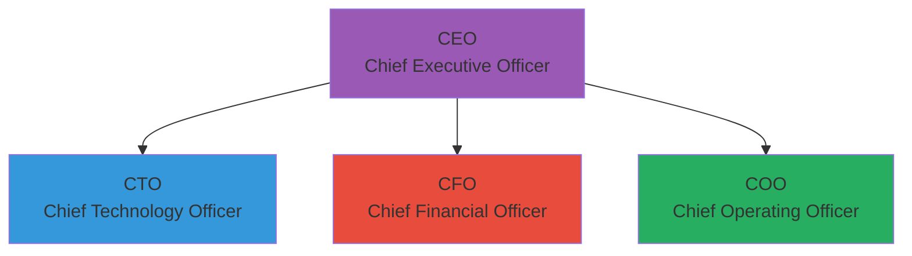
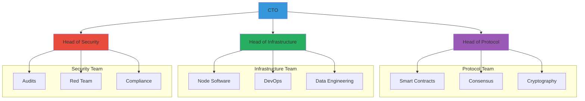
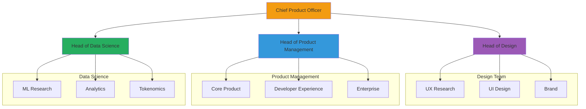
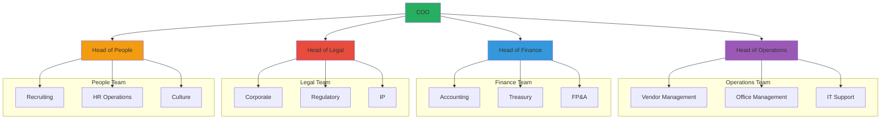

# CipherOcto Organization Chart

> **Note:** This document represents the planned organizational structure. Actual team composition will evolve as the project grows.

---

## Executive Leadership

---

## Engineering Department

**Head:** CTO

---

## Product Department

**Head:** Chief Product Officer (reports to CEO)

---

## Growth Department

**Head:** Chief Growth Officer (reports to CEO)

```mermaid
graph TB
    CGO[Chief Growth Officer]
    HeadMarketing[Head of Marketing]
    HeadCommunity[Head of Community]
    HeadBD[Head of Business Development]
    HeadContent[Head of Content]

    CGO --> HeadMarketing
    CGO --> HeadCommunity
    CGO --> HeadBD
    CGO --> HeadContent

    subgraph MARKETING["Marketing Team"]
        MarketingTeam1[Growth Marketing]
        MarketingTeam2[Performance Marketing]
        MarketingTeam3[PR & Communications]
    end

    subgraph COMMUNITY["Community Team"]
        CommunityTeam1[Discord & Social]
        CommunityTeam2[Events]
        CommunityTeam3[Developer Relations]
    end

    subgraph BD["Business Development"]
        BDTeam1[Partnerships]
        BDTeam2[Enterprise Sales]
        BDTeam3[Exchanges & Listings]
    end

    subgraph CONTENT["Content Team"]
        ContentTeam1[Documentation]
        ContentTeam2[Education]
        ContentTeam3[Thought Leadership]
    end

    HeadMarketing --> MarketingTeam1
    HeadMarketing --> MarketingTeam2
    HeadMarketing --> MarketingTeam3

    HeadCommunity --> CommunityTeam1
    HeadCommunity --> CommunityTeam2
    HeadCommunity --> CommunityTeam3

    HeadBD --> BDTeam1
    HeadBD --> BDTeam2
    HeadBD --> BDTeam3

    HeadContent --> ContentTeam1
    HeadContent --> ContentTeam2
    HeadContent --> ContentTeam3

    style CGO fill:#e74c3c
    style HeadMarketing fill:#9b59b6
    style HeadCommunity fill:#3498db
    style HeadBD fill:#27ae60
    style HeadContent fill:#f39c12
```

---

## Operations Department

**Head:** COO

---

## Hiring Roadmap

### Phase 1: Foundation Team (2026)

| Role | Status | Priority |
| ---- | ------ | -------- |
| CEO | 🔄 Hiring | Critical |
| CTO | 🔄 Hiring | Critical |
| Smart Contract Engineer | 📅 Q2 2026 | High |
| Protocol Engineer | 📅 Q2 2026 | High |
| DevOps Engineer | 📅 Q3 2026 | Medium |

### Phase 2: Growth Team (2027)

| Role | Target | Priority |
| ---- | ------ | -------- |
| CFO | Q1 2027 | Critical |
| Head of Product | Q1 2027 | High |
| Head of Community | Q2 2027 | High |
| Security Researcher | Q2 2027 | High |
| 3 Protocol Engineers | Q2-Q4 2027 | High |

### Phase 3: Scale Team (2028+)

| Role | Target | Headcount |
| ---- | ------ | --------- |
| Protocol engineers | 2028-2029 | 10 |
| Full-stack developers | 2028-2029 | 8 |
| DevOps | 2028-2029 | 5 |
| Security | 2028-2029 | 3 |
| Product | 2028-2029 | 5 |
| Marketing | 2028-2029 | 8 |
| Community | 2028-2029 | 5 |
| Operations | 2028-2029 | 5 |
| **Total** | | ~50 FTE |

---

## Open Positions

**Current openings:** See [careers.cipherocto.io](https://careers.cipherocto.io)

**Interested in joining?** Email your resume to: careers@cipherocto.io

---

*Note: This org chart is a planning document. Actual structure will evolve based on needs and candidates.*
