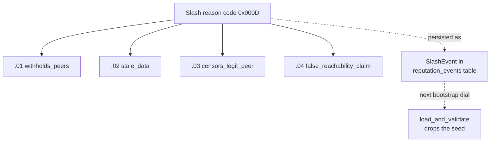
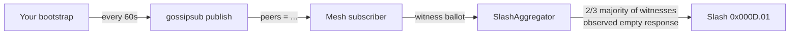
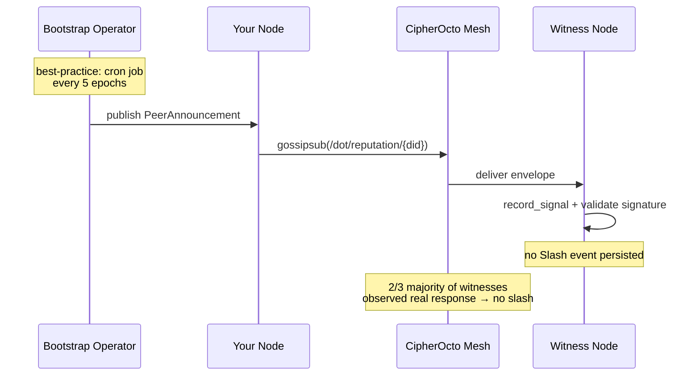

# Bootstrap Slash Prevention Guide

> Mission 0851p-a bootstrap-slashing + RFC-0968 §13 row 273 +
> RFC-0855p-b §B slash reason table.
> Status: canonical (mission claimed 2026-06-16; persisted-store
> seed filter landed 2026-07-27).

This guide explains how bootstrap nodes get slashed and the
**best practices** operators follow to avoid ending up on a seed
list that subsequently gets filtered out.

## Why bootstrap slashing exists

Bootstrap nodes are the seed-list entries a brand-new node dials
to join the CipherOcto mesh. If a bootstrap node withholds peers,
serves stale data, censors legitimate peers, or lies about its
reachability, the gossip layer starves and the mesh fragments.
For these misbehaviors the protocol issues a `SlashEvent` with
**reason code `0x000D`** (`bootstrap_node_misbehavior`) and
sub-codes `.01` through `.04`:

The slash is **persisted** as a canonical `SignalEvent` with
`signal_kind = SignalKind::Slash` on the recorder's DID in the
`reputation_events` table. The next time *any* node boots and
calls `load_and_validate(envelope, store)`, the slashed peer is
filtered out before the seed list reaches the swarm. The filter
is per-peer and irreversible; there is no local blacklist to
game — only the canonical persisted store counts.

## The four sub-codes in plain English

| Sub-code | Constant | Behavior that triggers it | Operator-side observation |
|----------|----------|--------------------------|---------------------------|
| `0x000D.01` | `withholds_peers` | Bootstrap refuses to publish peer-list entries requested via gossip; answers exist but are empty | `mon::slash::BootstrapMisbehavior::WithholdsPeers`; observed by witnesses running the peer-aggregation probe |
| `0x000D.02` | `stale_data` | Signed-at-epoch field > `MAX_SEED_AGE_EPOCHS = 10`, or replay returns `ReputationAggregate` whose `last_signal_at_unix` is older than the witness's local clock | `SeedHealth::FullyStale` log line at startup |
| `0x000D.03` | `censors_legit_peer` | Bootstrap advertises or relays peers through a private filter that consistently excludes one or more `RecorderDid`s without justification | Detected via differential gossip observation (post-Audit) |
| `0x000D.04` | `false_reachability_claim` | Self-reported `multiaddr` does not respond to a probe from ≥ 2 distinct witnesses within `PROBE_TIMEOUT_SECS = 30` | Reproducible by dialing the seed from a third witness node |

The slash is issued through `ReputationStore::slash_recorder` with
a `GovernanceProof` that satisfies the Round 7 CRITICAL gov-2
byte-equality gate (RFC-0968 §21 + §23): the three slash fields
(`slash_destination`, `slash_amount`, `slash_asset`) are
byte-compared to the signed preimage
`BLAKE3(BLAKE3_REPUTATION_SUSPENSION_DOMAIN || recorder_id || reason_hash || dest.canonical_bytes || amount_be || asset_byte || governance_pubkey || now_unix)`
BEFORE any chain tx. A `caller_arg != signed_field` mismatch returns
`ReputationError::SlashDestinationMismatch = 0x35`. This makes a
"suppress-destination-on-chain" attack impossible even if the
governance set is briefly compromised.

## Best practices for bootstrap node operators

These are the **preventive** measures a bootstrap-node operator
follows. Each one is a step that, when violated, maps directly to
one of the four sub-codes above.

### 1. Publish fresh peer lists continuously (avoid `.01`)

- Run a cron-equivalent that publishes a `PeerAnnouncement`
  envelope at least every `MAX_SEED_AGE_EPOCHS / 2 = 5` epochs
  (5 minutes at the 1-minute epoch).
- Keep `peers.len() >= 3` at all times. A bootstrap with fewer
  than 3 reach-able peers is treated by witnesses as effectively
  withholding (`.01`).

### 2. Refresh `signed_at_epoch` ahead of expiry (avoid `.02`)

The seed envelope carries `signed_at_epoch`. Witnesses compare
this against `current_epoch` and emit `stale_data` if the
delta exceeds `MAX_SEED_AGE_EPOCHS = 10`. The fix is mechanical:

- Generate a new `SeedListEnvelope` every `MAX_SEED_AGE_EPOCHS /
  2 = 5` epochs.
- Re-sign with the same authority pubkey; no key rotation needed
  for staleness refresh.
- `SeedHealth::check` runs at every node startup — make sure
  YOUR envelope would pass; the same logic decides if you stay on
  someone else's seed list.

### 3. Relay all peers above the trust floor (avoid `.03`)

The censor trigger is a *consistent* filter pattern, not a
one-off exclusion. Operators should:

- Maintain a single allow-list of `RecorderDid`s to refuse; any
  peer not on the allow-list must be relayed.
- Document any refusal (`{peer_did, refused_at_unix, reason}`)
  in a local audit log so a future governance review can verify
  the justification.
- Avoid rate-limiting peers below the trust floor in a way that
  looks like censorship. Throttle by `score_ewma` (per RFC-0968
  §10 formula) or by `RecorderRegistration.controller_id`, never
  by `peer_id` alone.

### 4. Honor `multiaddr` (avoid `.04`)

Self-reported `multiaddr` must actually accept inbound connections
from ≥ 2 distinct witnesses within `PROBE_TIMEOUT_SECS = 30`:

- Run the bootstrap on a stable network identity (no NAT
  rebinding every minute).
- Configure firewall to allow inbound on the announced port
  range.
- If you must relocate, update the `SeedListEnvelope` BEFORE
  the old `multiaddr` stops accepting. A 60-second grace window
  is acceptable; 60 minutes is not.

### 5. Maintain the dual stake (avoid cross-cutting persistence-7)

A bootstrap node is also a recorder. The cross-mission-2 minimums
(`MIN_RECORDER_ROLE_STAKE = 1000`, `MIN_RECORDER_OCTO_STAKE =
4000`, aggregate `MIN_RECORDER_DUAL_STAKE = 5000`) apply. A
bootstrap that lets its stake lapse is moved to `UnderStaked`
state, then to `Stale` after grace, then to `Revoked` after the
next slash-detection sweep. The `record_signal` admission check
fails for an `UnderStaked` recorder regardless of seed-list
membership.

### 6. Stay in `Active` (avoid UnderStaked/Stale escalation)

`recorder_state_at` returns one of: `Active | Suspended | Revoked
| UnderStaked | Stale | Expired | Unknown`. Only `Active` accepts
slash-proof issuance from the witness side AND only `Active`
recorders survive `load_and_validate` against the persisted
store. If you drop to `Suspended` or below, your peers will see
your slash reflected across the next gossip cycle.

## What "good" looks like at the protocol layer

The signal *doesn't* fire. That's the goal.

## What to do if you are slashed

1. **Investigate** the `slash_event_id` via the witness substrate
   (`crate::mon::slash::BootstrapEvidence::finalize` returns the
   slash envelope bundle).
2. **Fix** the underlying cause (network, stake, gossip, etc.).
3. **Appeal** through the governance slash-suspension path: a new
   fresh `GovernanceSnapshot` and `issue_governance_slash` (issued
   to REWARD the validator, with `SlashDestination::RewardValidator`)
   cancels the prior slash ONLY if it passes the Round 7 gov-2
   byte-equality gate AND the governance set has rotated at least
   once since the original slash.
4. **Re-register** under a new canonical DID with the
   re-registration escalation counter reset. Per RFC-0968-A1
   amendment 5 + Round 7 cross-mission-3, the new stake must
   satisfy `octo_stake + role_stake >= MIN_RECORDER_DUAL_STAKE × N`
   where `N` is the controller-attested escalation level
   (`N = 2..=10`, attacker-bound to `controller_id`).

## Related material

- `docs/06-operations/bootstrap-slash-evidence-runbook.md` —
  operator-facing runbook for triaging slash evidence.
- `crates/octo-network/src/mon/bootstrap.rs::load_and_validate`
  — the persisted-store filter that excludes a slashed peer.
- `crates/octo-network/src/mon/slash.rs` — `0x000D` reason codes,
  sub-codes, witness evidence flow.
- RFC-0968 §13 slash reason table + §21 byte-equality on-wire
  lock + §23 Review-Round-7 vector.
