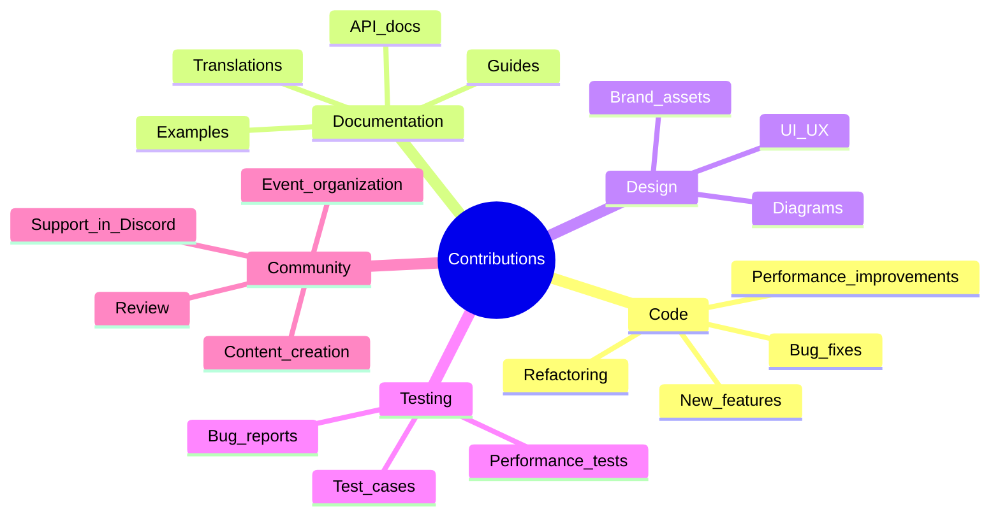

# Contributing to CipherOcto

Thank you for your interest in contributing to CipherOcto! This document outlines how to contribute effectively.

---

## Table of Contents

- [Code of Conduct](#code-of-conduct)
- [Types of Contributions](#types-of-contributions)
- [Getting Started](#getting-started)
- [Development Workflow](#development-workflow)
- [Pull Request Process](#pull-request-process)
- [Coding Standards](#coding-standards)
- [Testing Guidelines](#testing-guidelines)
- [Documentation](#documentation)

---

## Code of Conduct

### Our Pledge

We are committed to providing a welcoming and inclusive environment for everyone. Please:

- Be respectful and inclusive
- Welcome newcomers and help them learn
- Focus on constructive feedback
- Be empathetic to different perspectives

### Reporting Issues

If you experience or witness unacceptable behavior, contact: conduct@cipherocto.io

---

## Types of Contributions

We welcome contributions in many forms:



---

## Getting Started

### 1. Choose What to Work On

**Good first issues:**
- Filter by `good first issue` label
- Look for `help wanted` label
- Check [roadmap](../../01-foundation/roadmap.md) for planned features

**Advanced contributions:**
- Architecture improvements
- Major features
- Protocol upgrades
- Security audits

### 2. Set Up Development Environment

Follow the [local setup guide](./local-setup.md) before contributing.

### 3. Communicate Your Intent

Before starting significant work:

- Comment on the issue you plan to address
- Create a discussion for proposals
- Join Discord to chat with maintainers

---

## Development Workflow

### Fork and Clone

```bash
# Fork the repository on GitHub
# Clone your fork
git clone https://github.com/YOUR_USERNAME/cipherocto.git
cd cipherocto

# Add upstream remote
git remote add upstream https://github.com/cipherocto/cipherocto.git
```

### Create a Branch

```bash
# Sync with upstream
git fetch upstream
git checkout main
git merge upstream/main

# Create feature branch
git checkout -b feature/your-feature-name

# Or fix branch
git checkout -b fix/issue-number-description
```

### Branch Naming Convention

| Type | Format | Example |
| ---- | ------ | ------- |
| **Feature** | `feature/short-description` | `feature/add-zk-proofs` |
| **Bug fix** | `fix/issue-number-description` | `fix/123-memory-leak` |
| **Documentation** | `docs/what-changed` | `docs/api-updates` |
| **Refactor** | `refactor/what-changed` | `refactor/improve-cache` |
| **Test** | `test/what-is-tested` | `test/add-integration-tests` |
| **Chore** | `chore/what-changed` | `chore/update-dependencies` |

---

## Coding Standards

### TypeScript/JavaScript

**Style Guide:** Airbnb Style Guide with modifications

```typescript
// Use function declarations for pure functions
export function calculateReward(stake: number, rate: number): number {
  return stake * rate;
}

// Use arrow functions for callbacks
const fetchData = async (url: string): Promise<Response> => {
  const response = await fetch(url);
  return response.json();
};

// Use interfaces for type definitions
interface Provider {
  id: string;
  stake: number;
  reputation: number;
}

// Use async/await over Promises
async function processTask(task: Task): Promise<Result> {
  const result = await task.execute();
  return result;
}

// Use meaningful variable names
const totalRewards = calculateRewards(stake, multiplier);  // Good
const x = calc(s, m);  // Bad
```

### Python

**Style Guide:** PEP 8

```python
# Use type hints
def calculate_reward(stake: int, rate: float) -> float:
    """Calculate reward based on stake and rate."""
    return stake * rate

# Use docstrings
class Provider:
    """Represents a network provider."""

    def __init__(self, provider_id: str, stake: int):
        """Initialize a provider.

        Args:
            provider_id: Unique provider identifier
            stake: Initial stake amount
        """
        self.id = provider_id
        self.stake = stake

# Use context managers
with open('config.json') as f:
    config = json.load(f)
```

### Rust

**Style Guide:** rustfmt + clippy

```rust
// Use snake_case for variables and functions
let total_rewards = calculate_rewards(&stake, rate);

// Use PascalCase for types
pub struct Provider {
    pub id: String,
    pub stake: u64,
}

// Implement traits for behavior
impl Provider {
    pub fn new(id: String, stake: u64) -> Self {
        Self { id, stake }
    }
}

// Use Result for error handling
pub fn execute_task(&self, task: Task) -> Result<Result, Error> {
    if self.stake < task.min_stake {
        return Err(Error::InsufficientStake);
    }
    // ... execute task
    Ok(result)
}
```

---

## Commit Message Format

Follow Conventional Commits:

```
<type>(<scope>): <subject>

<body>

<footer>
```

**Types:**
- `feat`: New feature
- `fix`: Bug fix
- `docs`: Documentation changes
- `style`: Code style changes (formatting)
- `refactor`: Code refactoring
- `test`: Adding or updating tests
- `chore`: Maintenance tasks
- `perf`: Performance improvements

**Examples:**

```bash
# Feature
git commit -m "feat(agent): add multi-agent composition support"

# Bug fix
git commit -m "fix(sdk): resolve memory leak in inference loop"

# Documentation
git commit -m "docs(readme): update quick start instructions"

# Refactoring
git commit -m "refactor(core): simplify reputation calculation"
```

---

## Testing Guidelines

### Write Tests

**Test requirements:**
- Unit tests for all new functions
- Integration tests for new features
- E2E tests for user workflows

**Test file location:**
```
packages/sdk/
├── src/
│   └── agent.ts
└── tests/
    └── agent.test.ts
```

### Test Structure

```typescript
describe('Agent', () => {
  describe('onTask', () => {
    it('should handle task successfully', async () => {
      const agent = new Agent({ name: 'test' });
      const task = mockTask();
      const result = await agent.onTask(task);
      expect(result).toBeDefined();
    });

    it('should throw on invalid task', async () => {
      const agent = new Agent({ name: 'test' });
      await expect(agent.onTask(null)).rejects.toThrow();
    });
  });
});
```

### Test Coverage

| Component | Target Coverage |
| ---------- | --------------- |
| **Core logic** | 90%+ |
| **SDK functions** | 80%+ |
| **Utilities** | 95%+ |
| **Infrastructure** | 70%+ |

### Run Tests Before Submitting

```bash
# Run all tests
npm test

# Run with coverage
npm run test:coverage

# Run linting
npm run lint

# Run type checking
npm run type-check
```

---

## Pull Request Process

### 1. Before Opening PR

- [ ] Code follows style guidelines
- [ ] Tests added/updated
- [ ] Documentation updated
- [ ] All tests passing
- [ ] Commits follow conventional format

### 2. Opening the PR

**PR Title Format:**
```
[<type>] <short description>
```

**PR Description Template:**

```markdown
## Description
Brief description of changes

## Type of Change
- [ ] Bug fix
- [ ] New feature
- [ ] Breaking change
- [ ] Documentation update

## Related Issue
Fixes #123

## Testing
- [ ] Unit tests pass
- [ ] Integration tests pass
- [ ] Manual testing completed

## Checklist
- [ ] Code follows style guidelines
- [ ] Self-review completed
- [ ] Comments added to complex code
- [ ] Documentation updated
- [ ] No new warnings generated
```

### 3. PR Review Process

| Stage | Description | Time |
| ------ | ----------- | ---- |
| **Automated checks** | CI/CD tests | ~10 min |
| **Code review** | Maintainer review | 1-3 days |
| **Address feedback** | Make requested changes | Variable |
| **Approval** | Final approval | 1 day |
| **Merge** | Squash & merge | Immediate |

### 4. Addressing Feedback

- Respond to all review comments
- Make requested changes or discuss alternatives
- Push updates to same branch
- Request re-review when ready

---

## Documentation

### When to Update Docs

Update documentation when:
- Adding new features
- Changing APIs
- Fixing bugs affecting user behavior
- Updating examples

### Documentation Types

| Type | Location | Template |
| ---- | -------- | -------- |
| **API docs** | Code comments | JSDoc / docstrings |
| **Guides** | `/docs` directory | Markdown |
| **Examples** | `/examples` directory | Working code |
| **Changelog** | `CHANGELOG.md` | Keep a changelog |

---

## Grant Program

### Eligibility

- Open source contributors
- Researchers
- Students
- Anyone building on CipherOcto

### Grant Tiers

| Tier | Amount | Scope |
| ---- | ------ | ----- |
| **Micro** | $500-1,000 | Bug fixes, small features |
| **Small** | $1,000-5,000 | New features, tools |
| **Medium** | $5,000-20,000 | Major features, research |
| **Large** | $20,000-100,000 | Core protocol, infrastructure |

### Apply

Submit proposals at: [grants.cipherocto.io](https://grants.cipherocto.io)

---

## Recognition

### Contributors Hall of Fame

All contributors are recognized in:
- `CONTRIBUTORS.md` in the repository
- Monthly community updates
- Annual contributor appreciation

### Top Contributors

Top contributors receive:
- Special Discord role
- OCTO token grants
- Governance weight bonus
- Conference speaking opportunities

---

## Getting Help

| Channel | Best For | Response Time |
| ------- | ----------------- | -------------- |
| **Discord #dev** | Development questions | Hours |
| **GitHub Discussions** | Design discussions | Days |
| **GitHub Issues** | Bug reports | Days |
| **Email** | Security, legal | 1-2 days |

---

## Quick Checklist

Before submitting any contribution:

- [ ] Read this contributing guide
- [ ] Set up development environment
- [ ] Communicate your intent
- [ ] Follow coding standards
- [ ] Write/update tests
- [ ] Update documentation
- [ ] Run tests locally
- [ ] Write clear commit messages
- [ ] Create descriptive PR
- [ ] Address review feedback

---

## License

By contributing, you agree that your contributions will be licensed under the same license as the project.

---

**Thank you for contributing to CipherOcto! 🐙**

---

*For getting started, see [getting-started.md](./getting-started.md). For local setup, see [local-setup.md](./local-setup.md).*
