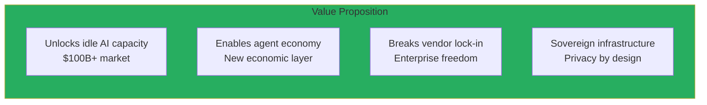
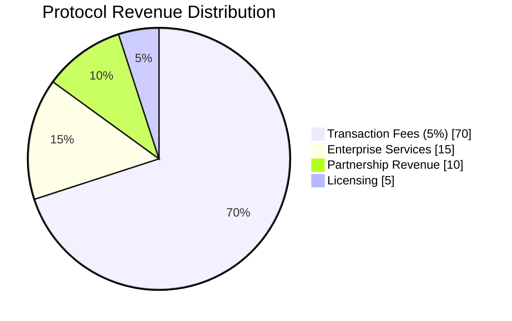
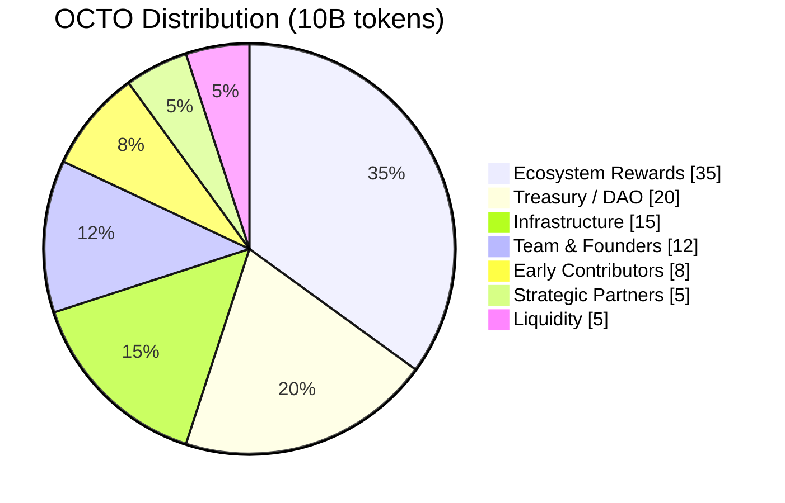

# Investor Resources

Welcome to the CipherOcto investor portal. This section provides resources for understanding the investment opportunity.

---

## Quick Links

| Document | Description | Link |
| ---------- | ----------- | ---- |
| **Litepaper** | 10-minute overview | [Read](../01-foundation/litepaper.md) |
| **Whitepaper** | Comprehensive technical and economic details | [Read](../01-foundation/whitepaper/v1.0-whitepaper.md) |
| **Manifesto** | Our philosophy and vision | [Read](../01-foundation/manifesto.md) |
| **Roadmap** | Development timeline and milestones | [Read](../01-foundation/roadmap.md) |
| **Tokenomics** | Economic model and token design | [Read](../04-tokenomics/token-design.md) |

---

## Investment Thesis

### The Problem

**$400B+ coordination failure** in AI infrastructure:

| Issue | Market Impact |
| ----- | ------------- |
| **Idle GPUs** | 40-60% utilization = $50B+ waste |
| **Unused subscriptions** | Billions in enterprise AI spend |
| **Vendor lock-in** | Enterprises trapped in ecosystems |
| **No agent economy** | AI cannot collaborate or earn autonomously |

### The Solution

**CipherOcto = Economic substrate for autonomous intelligence**



### The Opportunity

| Metric | 2025 | 2030 | 2035 |
| ------ | ---- | ---- | ---- |
| **AI Infrastructure Market** | $200B | $500B | $1.1T |
| **Decentralized AI Share** | 2% | 20% | 45% |
| **CipherOcto Addressable** | — | 10% share | 20% share |
| **Potential Revenue** | — | $10B/year | $220B/year |

---

## Competitive Advantages

### Unique Differentiators

| Advantage | Competitors | CipherOcto |
| ---------- | ----------- | ---------- |
| **Trust model** | Stake-based | Proof of Reliability (performance) |
| **Token economics** | Single token | Multi-token (9 tokens) |
| **Enterprise integration** | Afterthought | Native (OCTO-W) |
| **Privacy** | Basic encryption | ZK proofs + TEEs + data classification |
| **Agent support** | None | Multi-agent orchestration |

### Defensibility

| Barrier | Description |
| -------- | ----------- |
| **Network effects** | Composable trust graph |
| **Switching costs** | Dual-stake + reputation |
| **Data moats** | Sovereign data stays |
| **Economic moats** | Multi-token alignment |
| **Technical moats** | PoR + AI Wholesale (unique) |

---

## Business Model

### Revenue Streams



### Unit Economics

| Metric | Value |
| ------ | ----- |
| **Take rate** | 5% of transaction value |
| **Target volume** | $160M/year (Year 3) |
| **Revenue** | $8M/year (Year 3) |
| **Operating margin** | 75%+ |
| **Break-even** | $26M protocol volume |

### Path to Profitability

| Phase | Revenue | Annual Burn | Timeline |
| ----- | ------- | ----------- | -------- |
| **Phase 1** | $0 | $5M | Year 1-2 |
| **Phase 2** | $2M | $8M | Year 2-3 |
| **Phase 3** | $8M | $3M | Year 3-4 |
| **Phase 4** | $50M+ | Profitable | Year 4+ |

---

## Token Economics

### OCTO Token

**Purpose:** Reserve currency of AI infrastructure

| Use Case | Description |
| -------- | ----------- |
| **Governance** | Vote on protocol decisions |
| **Staking** | Earn 5-8% APY |
| **Settlement** | Cross-role transactions |
| **Store of value** | Treasury-backed |

### Initial Distribution



**Investor considerations:**
- Team/founders: 1-year cliff, 4-year vesting
- No massive upfront unlocks
- Emissions tied to Proof of Useful Work

---

## Valuation Frameworks

### Methodology 1: Discounted Cash Flow (DCF)

```
Protocol Revenue (Year 5) = $100M
Operating Margin = 75%
Net Income = $75M
P/E Multiple = 30x (growth infrastructure)
Implied Valuation = $2.25B
```

### Methodology 2: Market Exchange Token (MET)

```
Total Addressable Market (2030) = $500B
Target Market Share = 10%
Protocol Volume = $50B
Fee Rate = 5%
Protocol Revenue = $2.5B
P/S Multiple = 20x
Implied Valuation = $50B
```

### Methodology 3: Token Valuation

```
Total Supply = 10B OCTO
Circulating (Year 3) = 2B OCTO
Protocol Revenue = $8M/year
Treasury Allocation = 30% = $2.4M
Per Token Backing = $2.4M / 2B = $0.0012
P/Backing Multiple = 100x (growth)
Implied Token Price = $0.12
Market Cap = $0.12 × 2B = $240M
```

### Valuation Scenarios

| Scenario | Year | Token Price | Market Cap |
| ----------| ---- | ----------- | ---------- |
| **Bear** | 2028 | $0.02 | $40M |
| **Base** | 2028 | $0.10 | $200M |
| **Bull** | 2028 | $0.50 | $1B |
| **Bear** | 2030 | $0.05 | $500M |
| **Base** | 2030 | $0.25 | $2.5B |
| **Bull** | 2030 | $2.50 | $25B |

---

## Risk Factors

### Key Risks

| Risk | Probability | Impact | Mitigation |
| ---- | ---------- | ------ | ---------- |
| **Security breach** | Medium | Critical | Audits, bug bounties, gradual rollout |
| **Regulatory action** | Medium | High | Compliance-first design |
| **Competition** | Low | Medium | Network effects, first-mover |
| **Execution risk** | Low | High | Experienced team, clear roadmap |
| **Economic model** | Low | High | Conservative emissions, treasury |

### Risk Management

- **Treasury reserves:** 20% of supply for contingencies
- **Insurance:** Protocol-level coverage for major incidents
- **Diversification:** Multi-chain, multi-jurisdiction
- **Community governance:** Decentralized by Year 3

---

## Team & Advisors

### Leadership

*(To be updated based on actual team composition)*

| Role | Background |
| ---- | ----------- |
| **CEO** | TBD |
| **CTO** | TBD |
| **CFO** | TBD |
| **Head of Protocol** | TBD |

### Advisors

| Advisor | Background |
| -------- | ----------- |
| **Technical advisors** | TBD |
| **Economics advisors** | TBD |
| **Legal/compliance** | TBD |

---

## Roadmap Highlights

### Near-Term (2026-2027)

- ✅ Foundation complete
- 🔄 Prototype development
- 📅 Testnet launch (Q2 2027)

### Mid-Term (2027-2028)

- 📅 Mainnet launch (Q1 2028)
- 📅 100 active nodes (Q2 2028)
- 📅 Enterprise pilot (Q3 2028)

### Long-Term (2029+)

- 📅 1,000 active nodes
- 📅 Self-sustaining treasury
- 📅 Full DAO governance

---

## Due Diligence Materials

### Available Upon Request

| Document | Availability |
| ---------- | -------------- |
| **Financial projections** | Upon NDA |
| **Technical architecture** | Public |
| **Legal structure** | Upon NDA |
| **Security audits** | When completed |
| **Advisor bios** | Public |
| **Competitive analysis** | Public |

---

## Contact

### Investor Relations

**Email:** investors@cipherocto.io
**Calendly:** [Schedule a meeting](https://calendly.com/cipherocto/investors)

### Press Inquiries

**Email:** press@cipherocto.io
**Newsroom:** [press.cipherocto.io](https://press.cipherocto.io)

---

## FAQ

### Common Questions

**Q: When is the token generation event?**
A: Targeting Q2 2027, subject to market conditions and regulatory review.

**Q: What blockchain will CipherOcto use?**
A: Ethereum (L1 settlement) + Arbitrum (L2 execution) initially, with multi-chain support planned.

**Q: How is this different from other DePIN projects?**
A: Four key differences: (1) Proof of Reliability vs stake-based trust, (2) Multi-token vs single-token economics, (3) AI Wholesale innovation, (4) Native enterprise compliance.

**Q: What's the regulatory status?**
A: OCTO is a utility token. We're working with legal counsel to ensure compliance across jurisdictions.

**Q: When can I stake tokens?**
A: Staking will be available immediately after TGE.

---

*For comprehensive details, see the [whitepaper](../01-foundation/whitepaper/v1.0-whitepaper.md). For a quick overview, see the [litepaper](../01-foundation/litepaper.md).*

---

**Disclaimer:** This document contains forward-looking statements. Actual results may differ materially. Nothing in this document constitutes investment advice.
