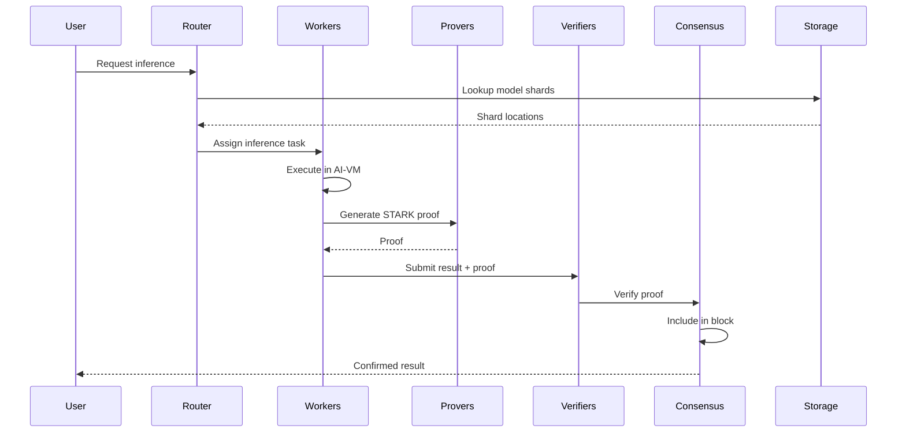

# CipherOcto Architecture Overview

## Executive Summary

CipherOcto is a **verifiable decentralized AI operating system** that combines deterministic AI computation, cryptographic verification, and blockchain consensus to enable trustless AI inference, training, and autonomous agent execution at scale.

The architecture spans **five core domains**:

1. **Deterministic Computation** — Reproducible AI execution
2. **Verifiable AI** — Cryptographic proof generation
3. **Consensus** — Useful work securing the network
4. **Network** — Distributed coordination
5. **Economic** — Self-regulating compute market

---

## Layer Architecture

```
┌─────────────────────────────────────────────────────────────────────────────┐
│                         APPLICATION LAYER                                   │
│  ┌─────────────────────┐  ┌─────────────────────────────────────────┐   │
│  │ Self-Verifying     │  │ Autonomous Agent Organizations         │   │
│  │ AI Agents          │  │ (RFC-0414 (Agents))                            │   │
│  │ (RFC-0416 (Agents))        │  │                                        │   │
│  └─────────────────────┘  └─────────────────────────────────────────┘   │
└────────────────────────────────────┬────────────────────────────────────┘
                                     │
┌────────────────────────────────────▼────────────────────────────────────┐
│                         AI EXECUTION LAYER                              │
│  ┌─────────────────────────┐  ┌─────────────────────────────────────┐   │
│  │ Deterministic           │  │ Deterministic Training Circuits       │   │
│  │ Transformer Circuit    │  │ (RFC-0108 (Numeric/Math))                          │   │
│  │ (RFC-0107 (Numeric/Math))            │  │                                     │   │
│  └─────────────────────────┘  └─────────────────────────────────────┘   │
│                                    │                                    │
│  ┌───────────────────────────────▼────────────────────────────────┐    │
│  │            Deterministic AI-VM (RFC-0520 (AI Execution))                    │    │
│  └───────────────────────────────┬────────────────────────────────┘    │
└──────────────────────────────────┼───────────────────────────────────┘
                                   │
┌──────────────────────────────────▼───────────────────────────────────┐
│                         VERIFICATION LAYER                              │
│  ┌─────────────────────────┐  ┌─────────────────────────────────────┐   │
│  │ Proof-of-Dataset       │  │ Probabilistic Verification Markets   │   │
│  │ Integrity (RFC-0631 (Proof Systems))   │  │ (RFC-0615 (Proof Systems))                         │   │
│  └─────────────────────────┘  └─────────────────────────────────────┘   │
└────────────────────────────────────┬────────────────────────────────────┘
                                     │
┌────────────────────────────────────▼────────────────────────────────────┐
│                         CONSENSUS LAYER                                  │
│  ┌──────────────────────────────────────────────────────────────┐      │
│  │            Proof-of-Inference Consensus (RFC-0630 (Proof Systems))           │      │
│  │  ┌─────────────┐  ┌─────────────┐  ┌──────────────────┐  │      │
│  │  │ Sharded     │  │ Parallel    │  │ Data            │  │      │
│  │  │ Consensus   │  │ Block DAG   │  │ Availability    │  │      │
│  │  │(RFC-0740 (Consensus))  │  │(RFC-0741 (Consensus))  │  │(RFC-0742 (Consensus))      │  │      │
│  │  └─────────────┘  └─────────────┘  └──────────────────┘  │      │
│  └──────────────────────────────────────────────────────────────┘      │
└────────────────────────────────────┬────────────────────────────────────┘
                                     │
┌────────────────────────────────────▼────────────────────────────────────┐
│                         NETWORK LAYER                                     │
│  ┌─────────────────────────────┐  ┌─────────────────────────────────┐   │
│  │ OCTO-Network Protocol      │  │ Inference Task Market            │   │
│  │ (RFC-0843 (Networking))                │  │ (RFC-0910 (Economics))                      │   │
│  └─────────────────────────────┘  └─────────────────────────────────┘   │
└────────────────────────────────────┬────────────────────────────────────┘
                                     │
┌────────────────────────────────────▼────────────────────────────────────┐
│                         EXECUTION LAYER                                  │
│  ┌──────────────────────────────────────────────────────────────┐      │
│  │            Deterministic Numeric Tower (RFC-0106 (Numeric/Math))            │      │
│  │  ┌────────────┐  ┌────────────┐  ┌────────────────────┐   │      │
│  │  │ DFP        │  │ DQA        │  │ Numeric Types    │   │      │
│  │  │(RFC-0104 (Numeric/Math))  │  │(RFC-0105 (Numeric/Math))  │  │(RFC-0106 (Numeric/Math))       │   │      │
│  │  └────────────┘  └────────────┘  └────────────────────┘   │      │
│  └──────────────────────────────────────────────────────────────┘      │
└─────────────────────────────────────────────────────────────────────┘
```

---

## RFC Dependency Graph

```mermaid
graph TD
    subgraph Execution
        RFC0104[RFC-0104 (Numeric/Math): DFP]
        RFC0105[RFC-0105 (Numeric/Math): DQA]
        RFC0106[RFC-0106 (Numeric/Math): Numeric Tower]
    end

    subgraph AI
        RFC0120[RFC-0520 (AI Execution): AI-VM]
        RFC0131[RFC-0107 (Numeric/Math): Transformer Circuit]
        RFC0132[RFC-0108 (Numeric/Math): Training Circuits]
    end

    subgraph Data
        RFC0133[RFC-0631 (Proof Systems): Dataset Integrity]
        RFC0142[RFC-0742 (Consensus): Data Availability]
    end

    subgraph Consensus
        RFC0130[RFC-0630 (Proof Systems): PoI Consensus]
        RFC0140[RFC-0740 (Consensus): Sharded Consensus]
        RFC0141[RFC-0741 (Consensus): Block DAG]
    end

    subgraph Network
        RFC0143[RFC-0843 (Networking): OCTO-Network]
        RFC0144[RFC-0910 (Economics): Task Market]
    end

    subgraph Agents
        RFC0134[RFC-0416 (Agents): Self-Verifying Agents]
        RFC0118[RFC-0414 (Agents): Agent Organizations]
    end

    RFC0104 --> RFC0106
    RFC0105 --> RFC0106
    RFC0106 --> RFC0120
    RFC0120 --> RFC0131
    RFC0131 --> RFC0130
    RFC0132 --> RFC0130
    RFC0133 --> RFC0130
    RFC0130 --> RFC0140
    RFC0130 --> RFC0141
    RFC0130 --> RFC0142
    RFC0140 --> RFC0143
    RFC0141 --> RFC0143
    RFC0142 --> RFC0143
    RFC0143 --> RFC0144
    RFC0130 --> RFC0144
    RFC0131 --> RFC0134
    RFC0133 --> RFC0134
    RFC0134 --> RFC0118
```

---

## Core Components

### 1. Deterministic Numeric Tower (RFC-0106 (Numeric/Math))

The foundation layer ensuring bit-exact arithmetic across all nodes.

| Component      | Purpose                            |
| -------------- | ---------------------------------- |
| DFP (RFC-0104 (Numeric/Math)) | Deterministic floating-point       |
| DQA (RFC-0105 (Numeric/Math)) | Deterministic quantized arithmetic |
| Numeric Types  | Q32.32, Q16.16 fixed-point         |

**Key Property:** Any computation produces identical results on any hardware.

---

### 2. Deterministic AI-VM (RFC-0520 (AI Execution))

A virtual machine that executes AI models deterministically.

**Features:**

- 40-opcode instruction set
- Canonical operator implementations
- Hardware abstraction layer
- Deterministic scheduling

---

### 3. Deterministic Transformer Circuit (RFC-0107 (Numeric/Math))

Efficient STARK circuits for transformer inference.

| Metric            | Target  |
| ----------------- | ------- |
| Proof size        | <300 KB |
| Verification      | <10 ms  |
| Constraints/layer | ~10⁴    |

**Techniques:**

- Accumulator-based MATMUL
- Polynomial softmax
- GELU approximation

---

### 4. Deterministic Training Circuits (RFC-0108 (Numeric/Math))

Verifiable gradient-based training.

**Phases Verified:**

1. Forward pass (RFC-0107 (Numeric/Math))
2. Loss computation
3. Backpropagation
4. Optimizer update

---

### 5. Proof-of-Dataset Integrity (RFC-0631 (Proof Systems))

Cryptographic verification of dataset properties.

| Property   | Proof Method         |
| ---------- | -------------------- |
| Provenance | Source signatures    |
| Licensing  | Metadata constraints |
| Poisoning  | Statistical proofs   |
| Statistics | Distribution checks  |

---

### 6. Proof-of-Inference Consensus (RFC-0630 (Proof Systems))

AI inference replaces hash computation as consensus work.

| Property     | Value |
| ------------ | ----- |
| Block time   | 10s   |
| Work unit    | FLOPs |
| Verification | STARK |

**Reward Distribution:**

- Producer: 40%
- Compute: 30%
- Proof: 15%
- Storage: 10%
- Treasury: 5%

---

### 7. Sharded Consensus (RFC-0740 (Consensus))

Horizontal scaling of PoI across parallel shards.

| Metric           | Target |
| ---------------- | ------ |
| Shards           | 16-256 |
| Validators/shard | 100+   |
| Cross-shard      | <5s    |

---

### 8. Parallel Block DAG (RFC-0741 (Consensus))

Leaderless block production with Hashgraph-style consensus.

| Metric       | Target       |
| ------------ | ------------ |
| TPS          | 1000+        |
| Confirmation | <10s         |
| Finality     | Checkpointed |

---

### 9. Data Availability Sampling (RFC-0742 (Consensus))

Efficient verification of shard availability.

| Property  | Value |
| --------- | ----- |
| Detection | 99%+  |
| Samples   | 10    |
| Bandwidth | O(1)  |

---

### 10. OCTO-Network Protocol (RFC-0843 (Networking))

libp2p-based P2P networking.

| Component   | Technology       |
| ----------- | ---------------- |
| Discovery   | Kademlia DHT     |
| Propagation | Gossipsub        |
| Routing     | Request-Response |

---

### 11. Inference Task Market (RFC-0910 (Economics))

Economic protocol for task allocation.

**Pricing Mechanisms:**

- Dutch auction (time-sensitive)
- Vickrey (important tasks)
- Fixed (standard)

**Worker Selection:**

- Reputation-weighted
- Stake-weighted
- Geographic

---

### 12. Self-Verifying AI Agents (RFC-0416 (Agents))

Agents that prove their reasoning.

**Proof Components:**

1. Reasoning trace (5+ steps)
2. Execution proof
3. Strategy adherence
4. Action commitment

---

## Data Flow: End-to-End Inference



---

## Token Economy

| Token  | Purpose             |
| ------ | ------------------- |
| OCTO   | Governance, staking |
| OCTO-A | Compute providers   |
| OCTO-O | Orchestrators       |
| OCTO-W | Workers             |
| OCTO-D | Dataset providers   |

---

## Implementation Roadmap

### Phase 1: Foundation

- [x] Numeric Tower
- [x] AI-VM
- [x] Transformer Circuit

### Phase 2: Verification

- [x] Proof Market
- [x] Dataset Integrity
- [x] Training Circuits

### Phase 3: Consensus

- [x] Proof-of-Inference
- [x] Sharded Consensus
- [x] Block DAG

### Phase 4: Network

- [x] OCTO-Network
- [x] Task Market
- [x] Data Availability

### Phase 5: Agents

- [ ] Self-Verifying Agents
- [ ] Agent Organizations

---

## Security Model

| Layer        | Protection               |
| ------------ | ------------------------ |
| Execution    | Deterministic arithmetic |
| Verification | STARK proofs             |
| Consensus    | Economic staking         |
| Network      | Peer filtering           |
| Data         | Erasure coding           |

---

## Performance Targets

| Metric            | Target  |
| ----------------- | ------- |
| Inference latency | <1s     |
| Proof generation  | <30s    |
| Block time        | 10s     |
| Network nodes     | 10,000+ |
| TPS               | 1000+   |

---

## Related Documentation

### RFCs

- [RFC-0106 (Numeric/Math): Deterministic Numeric Tower](../rfcs/0106-deterministic-numeric-tower.md)
- [RFC-0520 (AI Execution): Deterministic AI-VM](../rfcs/0520-deterministic-ai-vm.md)
- [RFC-0630 (Proof Systems): Proof-of-Inference Consensus](../rfcs/0630-proof-of-inference-consensus.md)
- [RFC-0107 (Numeric/Math): Deterministic Transformer Circuit](../rfcs/0107-deterministic-transformer-circuit.md)
- [RFC-0108 (Numeric/Math): Deterministic Training Circuits](../rfcs/0108-deterministic-training-circuits.md)
- [RFC-0631 (Proof Systems): Proof-of-Dataset Integrity](../rfcs/0631-proof-of-dataset-integrity.md)
- [RFC-0416 (Agents): Self-Verifying AI Agents](../rfcs/0416-self-verifying-ai-agents.md)
- [RFC-0740 (Consensus): Sharded Consensus Protocol](../rfcs/0740-sharded-consensus-protocol.md)
- [RFC-0741 (Consensus): Parallel Block DAG](../rfcs/0741-parallel-block-dag.md)
- [RFC-0742 (Consensus): Data Availability Sampling](../rfcs/0742-data-availability-sampling.md)
- [RFC-0843 (Networking): OCTO-Network Protocol](../rfcs/0843-octo-network-protocol.md)
- [RFC-0910 (Economics): Inference Task Market](../rfcs/0910-inference-task-market.md)

### Use Cases

- [Hybrid AI-Blockchain Runtime](../use-cases/hybrid-ai-blockchain-runtime.md)
- [Verifiable AI Agents for DeFi](../use-cases/verifiable-ai-agents-defi.md)
- [Node Operations](../use-cases/node-operations.md)

---

_Last Updated: 2026-03-07_
_Version: 1.0_
