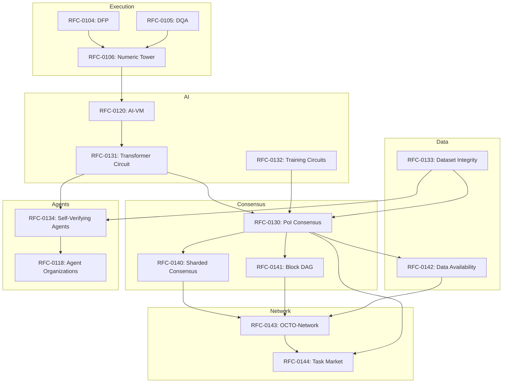
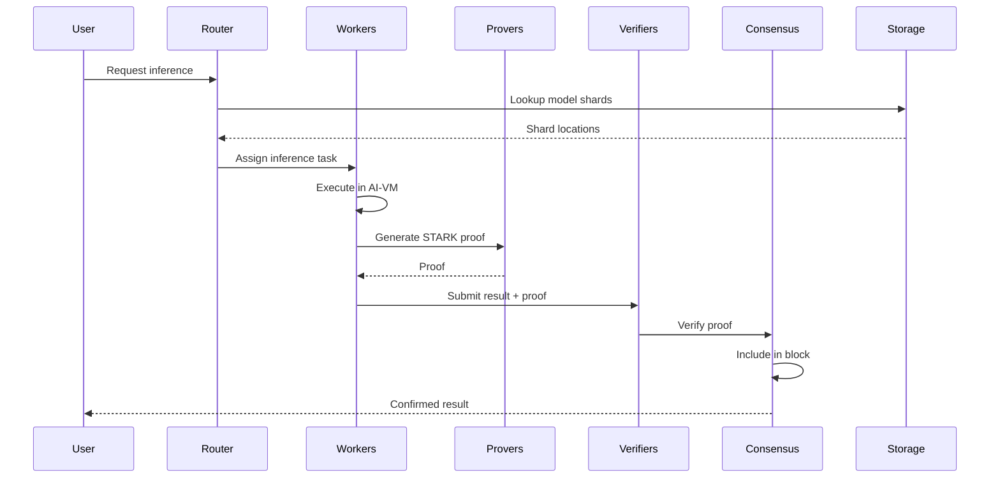

# CipherOcto Architecture Overview

## Executive Summary

CipherOcto is a **verifiable decentralized AI operating system** that combines deterministic AI computation, cryptographic verification, and blockchain consensus to enable trustless AI inference, training, and autonomous agent execution at scale.

The architecture spans **five core domains**:

1. **Deterministic Computation** — Reproducible AI execution
2. **Verifiable AI** — Cryptographic proof generation
3. **Consensus** — Useful work securing the network
4. **Network** — Distributed coordination
5. **Economic** — Self-regulating compute market

---

## Layer Architecture

```
┌─────────────────────────────────────────────────────────────────────────────┐
│                         APPLICATION LAYER                                   │
│  ┌─────────────────────┐  ┌─────────────────────────────────────────┐   │
│  │ Self-Verifying     │  │ Autonomous Agent Organizations         │   │
│  │ AI Agents          │  │ (RFC-0118)                            │   │
│  │ (RFC-0134)        │  │                                        │   │
│  └─────────────────────┘  └─────────────────────────────────────────┘   │
└────────────────────────────────────┬────────────────────────────────────┘
                                     │
┌────────────────────────────────────▼────────────────────────────────────┐
│                         AI EXECUTION LAYER                              │
│  ┌─────────────────────────┐  ┌─────────────────────────────────────┐   │
│  │ Deterministic           │  │ Deterministic Training Circuits       │   │
│  │ Transformer Circuit    │  │ (RFC-0132)                          │   │
│  │ (RFC-0131)            │  │                                     │   │
│  └─────────────────────────┘  └─────────────────────────────────────┘   │
│                                    │                                    │
│  ┌───────────────────────────────▼────────────────────────────────┐    │
│  │            Deterministic AI-VM (RFC-0120)                    │    │
│  └───────────────────────────────┬────────────────────────────────┘    │
└──────────────────────────────────┼───────────────────────────────────┘
                                   │
┌──────────────────────────────────▼───────────────────────────────────┐
│                         VERIFICATION LAYER                              │
│  ┌─────────────────────────┐  ┌─────────────────────────────────────┐   │
│  │ Proof-of-Dataset       │  │ Probabilistic Verification Markets   │   │
│  │ Integrity (RFC-0133)   │  │ (RFC-0115)                         │   │
│  └─────────────────────────┘  └─────────────────────────────────────┘   │
└────────────────────────────────────┬────────────────────────────────────┘
                                     │
┌────────────────────────────────────▼────────────────────────────────────┐
│                         CONSENSUS LAYER                                  │
│  ┌──────────────────────────────────────────────────────────────┐      │
│  │            Proof-of-Inference Consensus (RFC-0130)           │      │
│  │  ┌─────────────┐  ┌─────────────┐  ┌──────────────────┐  │      │
│  │  │ Sharded     │  │ Parallel    │  │ Data            │  │      │
│  │  │ Consensus   │  │ Block DAG   │  │ Availability    │  │      │
│  │  │(RFC-0140)  │  │(RFC-0141)  │  │(RFC-0142)      │  │      │
│  │  └─────────────┘  └─────────────┘  └──────────────────┘  │      │
│  └──────────────────────────────────────────────────────────────┘      │
└────────────────────────────────────┬────────────────────────────────────┘
                                     │
┌────────────────────────────────────▼────────────────────────────────────┐
│                         NETWORK LAYER                                     │
│  ┌─────────────────────────────┐  ┌─────────────────────────────────┐   │
│  │ OCTO-Network Protocol      │  │ Inference Task Market            │   │
│  │ (RFC-0143)                │  │ (RFC-0144)                      │   │
│  └─────────────────────────────┘  └─────────────────────────────────┘   │
└────────────────────────────────────┬────────────────────────────────────┘
                                     │
┌────────────────────────────────────▼────────────────────────────────────┐
│                         EXECUTION LAYER                                  │
│  ┌──────────────────────────────────────────────────────────────┐      │
│  │            Deterministic Numeric Tower (RFC-0106)            │      │
│  │  ┌────────────┐  ┌────────────┐  ┌────────────────────┐   │      │
│  │  │ DFP        │  │ DQA        │  │ Numeric Types    │   │      │
│  │  │(RFC-0104)  │  │(RFC-0105)  │  │(RFC-0106)       │   │      │
│  │  └────────────┘  └────────────┘  └────────────────────┘   │      │
│  └──────────────────────────────────────────────────────────────┘      │
└─────────────────────────────────────────────────────────────────────┘
```

---

## RFC Dependency Graph



---

## Core Components

### 1. Deterministic Numeric Tower (RFC-0106)

The foundation layer ensuring bit-exact arithmetic across all nodes.

| Component | Purpose |
|-----------|---------|
| DFP (RFC-0104) | Deterministic floating-point |
| DQA (RFC-0105) | Deterministic quantized arithmetic |
| Numeric Types | Q32.32, Q16.16 fixed-point |

**Key Property:** Any computation produces identical results on any hardware.

---

### 2. Deterministic AI-VM (RFC-0120)

A virtual machine that executes AI models deterministically.

**Features:**
- 40-opcode instruction set
- Canonical operator implementations
- Hardware abstraction layer
- Deterministic scheduling

---

### 3. Deterministic Transformer Circuit (RFC-0131)

Efficient STARK circuits for transformer inference.

| Metric | Target |
|--------|--------|
| Proof size | <300 KB |
| Verification | <10 ms |
| Constraints/layer | ~10⁴ |

**Techniques:**
- Accumulator-based MATMUL
- Polynomial softmax
- GELU approximation

---

### 4. Deterministic Training Circuits (RFC-0132)

Verifiable gradient-based training.

**Phases Verified:**
1. Forward pass (RFC-0131)
2. Loss computation
3. Backpropagation
4. Optimizer update

---

### 5. Proof-of-Dataset Integrity (RFC-0133)

Cryptographic verification of dataset properties.

| Property | Proof Method |
|----------|--------------|
| Provenance | Source signatures |
| Licensing | Metadata constraints |
| Poisoning | Statistical proofs |
| Statistics | Distribution checks |

---

### 6. Proof-of-Inference Consensus (RFC-0130)

AI inference replaces hash computation as consensus work.

| Property | Value |
|----------|-------|
| Block time | 10s |
| Work unit | FLOPs |
| Verification | STARK |

**Reward Distribution:**
- Producer: 40%
- Compute: 30%
- Proof: 15%
- Storage: 10%
- Treasury: 5%

---

### 7. Sharded Consensus (RFC-0140)

Horizontal scaling of PoI across parallel shards.

| Metric | Target |
|--------|--------|
| Shards | 16-256 |
| Validators/shard | 100+ |
| Cross-shard | <5s |

---

### 8. Parallel Block DAG (RFC-0141)

Leaderless block production with Hashgraph-style consensus.

| Metric | Target |
|--------|--------|
| TPS | 1000+ |
| Confirmation | <10s |
| Finality | Checkpointed |

---

### 9. Data Availability Sampling (RFC-0142)

Efficient verification of shard availability.

| Property | Value |
|----------|-------|
| Detection | 99%+ |
| Samples | 10 |
| Bandwidth | O(1) |

---

### 10. OCTO-Network Protocol (RFC-0143)

libp2p-based P2P networking.

| Component | Technology |
|-----------|------------|
| Discovery | Kademlia DHT |
| Propagation | Gossipsub |
| Routing | Request-Response |

---

### 11. Inference Task Market (RFC-0144)

Economic protocol for task allocation.

**Pricing Mechanisms:**
- Dutch auction (time-sensitive)
- Vickrey (important tasks)
- Fixed (standard)

**Worker Selection:**
- Reputation-weighted
- Stake-weighted
- Geographic

---

### 12. Self-Verifying AI Agents (RFC-0134)

Agents that prove their reasoning.

**Proof Components:**
1. Reasoning trace (5+ steps)
2. Execution proof
3. Strategy adherence
4. Action commitment

---

## Data Flow: End-to-End Inference



---

## Token Economy

| Token | Purpose |
|-------|---------|
| OCTO | Governance, staking |
| OCTO-A | Compute providers |
| OCTO-O | Orchestrators |
| OCTO-W | Workers |
| OCTO-D | Dataset providers |

---

## Implementation Roadmap

### Phase 1: Foundation
- [x] Numeric Tower
- [x] AI-VM
- [x] Transformer Circuit

### Phase 2: Verification
- [x] Proof Market
- [x] Dataset Integrity
- [x] Training Circuits

### Phase 3: Consensus
- [x] Proof-of-Inference
- [x] Sharded Consensus
- [x] Block DAG

### Phase 4: Network
- [x] OCTO-Network
- [x] Task Market
- [x] Data Availability

### Phase 5: Agents
- [ ] Self-Verifying Agents
- [ ] Agent Organizations

---

## Security Model

| Layer | Protection |
|-------|------------|
| Execution | Deterministic arithmetic |
| Verification | STARK proofs |
| Consensus | Economic staking |
| Network | Peer filtering |
| Data | Erasure coding |

---

## Performance Targets

| Metric | Target |
|--------|--------|
| Inference latency | <1s |
| Proof generation | <30s |
| Block time | 10s |
| Network nodes | 10,000+ |
| TPS | 1000+ |

---

## Related Documentation

### RFCs
- [RFC-0106: Deterministic Numeric Tower](../rfcs/0106-deterministic-numeric-tower.md)
- [RFC-0120: Deterministic AI-VM](../rfcs/0120-deterministic-ai-vm.md)
- [RFC-0130: Proof-of-Inference Consensus](../rfcs/0130-proof-of-inference-consensus.md)
- [RFC-0131: Deterministic Transformer Circuit](../rfcs/0131-deterministic-transformer-circuit.md)
- [RFC-0132: Deterministic Training Circuits](../rfcs/0132-deterministic-training-circuits.md)
- [RFC-0133: Proof-of-Dataset Integrity](../rfcs/0133-proof-of-dataset-integrity.md)
- [RFC-0134: Self-Verifying AI Agents](../rfcs/0134-self-verifying-ai-agents.md)
- [RFC-0140: Sharded Consensus Protocol](../rfcs/0140-sharded-consensus-protocol.md)
- [RFC-0141: Parallel Block DAG](../rfcs/0141-parallel-block-dag.md)
- [RFC-0142: Data Availability Sampling](../rfcs/0142-data-availability-sampling.md)
- [RFC-0143: OCTO-Network Protocol](../rfcs/0143-octo-network-protocol.md)
- [RFC-0144: Inference Task Market](../rfcs/0144-inference-task-market.md)

### Use Cases
- [Hybrid AI-Blockchain Runtime](../use-cases/hybrid-ai-blockchain-runtime.md)
- [Verifiable AI Agents for DeFi](../use-cases/verifiable-ai-agents-defi.md)
- [Node Operations](../use-cases/node-operations.md)

---

*Last Updated: 2026-03-07*
*Version: 1.0*
