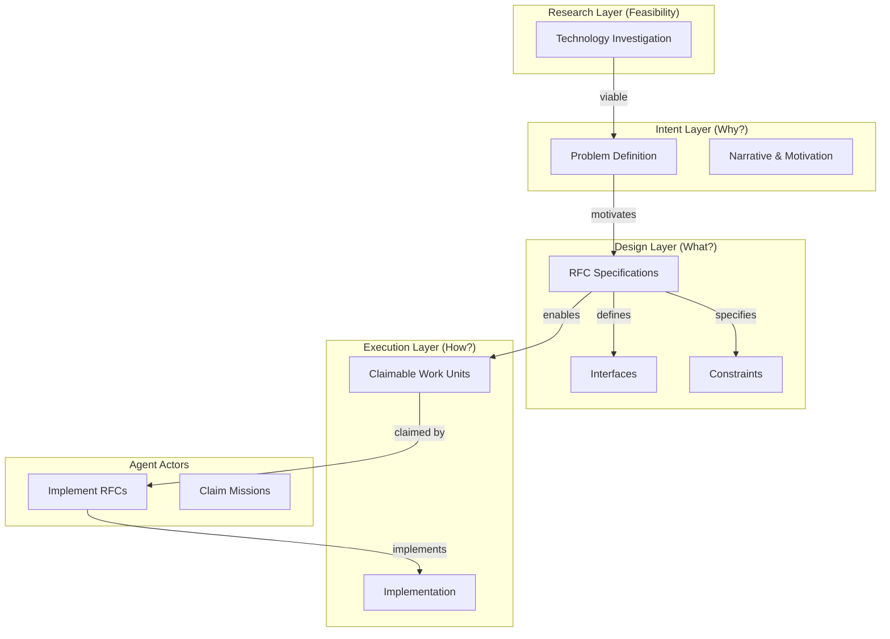
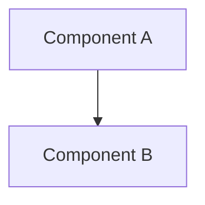
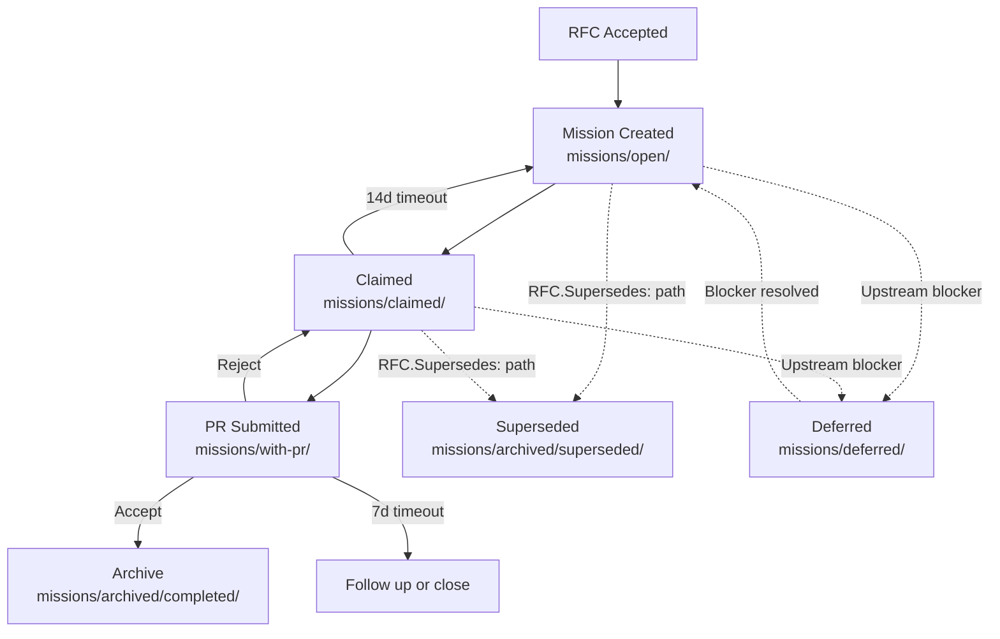

# The CipherOcto Blueprint

**How ideas become protocol reality.**

This is not documentation. This is process architecture.

---

## Philosophy

CipherOcto is not a repository. It is a protocol for autonomous intelligence collaboration.

Most open-source projects organize files. Successful protocols organize **decision flow**.

This Blueprint defines how work flows through CipherOcto—from idea to protocol evolution.

---

## The Core Separation

We maintain four distinct layers that must never mix:

| Layer         | Purpose     | Question | Blockchain Analogy      |
| ------------- | ----------- | -------- | ----------------------- |
| **Research**  | Feasibility | CAN WE?  | Technical Investigation |
| **Use Cases** | Intent      | WHY?     | Ethereum Vision         |
| **RFCs**      | Design      | WHAT?    | EIPs                    |
| **Missions**  | Execution   | HOW?     | Implementation          |

**Mix these layers and governance breaks.**

> **Terminology Note:** "Use Cases" and "Missions" are always capitalized when referring to the formal artifact types. Lowercase "use case" or "mission" refers to general concepts.

---

## Governance Stack

```
┌─────────────────────────────────────────────────────────────┐
│                     Idea Emerges                             │
└──────────────────────────┬──────────────────────────────────┘
                           │
                           ▼
┌─────────────────────────────────────────────────────────────┐
│  1️⃣ USE CASES — Intent Layer                               │
│  Location: docs/use-cases/                                  │
│                                                             │
│  Defines:                                                   │
│  - Problems to solve                                        │
│  - Narratives and motivation                                │
│  - Architectural direction                                  │
│                                                             │
│  Characteristics:                                           │
│  - Long-lived                                               │
│  - Descriptive                                              │
│  - Non-actionable                                            │
└──────────────────────────┬──────────────────────────────────┘
                           │
                           ▼
┌─────────────────────────────────────────────────────────────┐
│  2️⃣ RFCs — Protocol Design Layer                           │
│  Location: rfcs/                                            │
│                                                             │
│  Defines:                                                   │
│  - Specifications                                          │
│  - Constraints                                              │
│  - Interfaces                                               │
│  - Expected behavior                                        │
│                                                             │
│  Examples:                                                  │
│  - RFC-0001: Mission Lifecycle                              │
│  - RFC-0002: Agent Manifest Spec                            │
│  - RFC-0003: Deterministic Execution Standard                      │
│                                                             │
│  Answer: "What must exist before implementation?"           │
└──────────────────────────┬──────────────────────────────────┘
                           │
                           ▼
┌─────────────────────────────────────────────────────────────┐
│  3️⃣ MISSIONS — Execution Layer                             │
│  Location: missions/                                        │
│                                                             │
│  A mission is a claimable unit of work.                     │
│  - Never conceptual                                         │
│  - Always executable                                         │
│  - Created ONLY after: Use Case → RFC → Mission             │
└──────────────────────────┬──────────────────────────────────┘
                           │
                           ▼
┌─────────────────────────────────────────────────────────────┐
│  4️⃣ AGENTS — Execution Actors                              │
│  Location: agents/                                          │
│                                                             │
│  Agents do NOT decide direction.                            │
│  They implement Missions derived from RFCs.                 │
│  This prevents AI chaos.                                    │
└──────────────────────────┬──────────────────────────────────┘
                           │
                           ▼
┌─────────────────────────────────────────────────────────────┐
│  5️⃣ ROADMAP — Temporal Layer                               │
│  Location: ROADMAP.md                                       │
│                                                             │
│  References:                                                │
│  - Use Cases                                                │
│  - RFC milestones                                           │
│  - Protocol phases                                          │
│                                                             │
│  Roadmap is navigation, NOT backlog.                        │
└─────────────────────────────────────────────────────────────┘
```

### High-Level Architecture



---

## The Determinism Boundary

> **Critical Architectural Insight:** Without a clear boundary between deterministic protocol execution and probabilistic AI computation, consensus eventually breaks.

The CipherOcto protocol attempts the ambitious goal of deterministic AI execution within a verifiable protocol. Two implementations can still produce different results due to:

- Kernel ordering differences
- Parallel reduction ordering
- FMA (fused multiply-add) differences
- Memory layout variations
- Attention kernel implementation differences

### Execution Classes

CipherOcto defines three execution classes to manage this risk:

| Class | Name                    | Description                                                 | Examples                                                        |
| ----- | ----------------------- | ----------------------------------------------------------- | --------------------------------------------------------------- |
| **A** | Protocol Deterministic  | MUST be deterministic across all implementations            | Numeric tower, Linear algebra, Serialization, Deterministic RNG |
| **B** | Deterministic Off-Chain | Deterministic when configured correctly, may vary otherwise | Model inference with canonical kernels                          |
| **C** | Probabilistic           | Non-deterministic by nature                                 | Training, Sampling, Exploration                                 |

### The Boundary Rule

> **All consensus-relevant computation MUST be deterministic and reproducible across independent implementations.**

This means:

1. Class A is required for anything affecting consensus, economic settlement, or proof generation
2. Class B execution requires proof verification for consensus-critical use
3. Class C is explicitly excluded from consensus but may be used in agent behavior

### RFC-0008: Deterministic AI Execution Boundary

See [RFC-0008: Deterministic AI Execution Boundary](../rfcs/planned/0008-deterministic-ai-execution-boundary.md) for the full specification of execution classes and boundary requirements.

---

## Canonical Workflow

```
Idea
 │
 ▼
Research (CAN WE?)
 │
 ├─ Viable → Use Case (WHY?)
 │           │
 │           ▼
 │         RFC (WHAT?)
 │           │
 │           ▼
 │         Mission (HOW?)
 │           │
 │           ▼
 │       Agent/Human Claims Mission
 │           │
 │           ▼
 │       Implementation (PR)
 │           │
 │           ▼
 │       Review & Test
 │           │
 │           ▼
 │       Merge
 │           │
 │           ▼
 │       Protocol Evolution
 │
 └─ Not Viable → Archive (document learnings)
```

**This is the only flow. Shortcuts create technical debt.**

---

### Research Review Gate

Before research becomes a Use Case, it must pass review:

```
Research
   │
   ├─ Review by maintainers (min. 2 reviewers)
   │
   ├─ Evaluation Criteria:
   │   - Technical feasibility
   │   - Protocol relevance
   │   - Economic viability
   │   - Security implications
   │
   ├─ Approved → Use Case
   │
   └─ Rejected → Archive (document learnings)
```

Research without gates becomes blog posts.

---

## Artifact Types

### Research Report

**Location:** `docs/research/`

**Purpose:** Investigate feasibility and technology options before committing to a Use Case.

**Template:**

```markdown
# Research: [Technology/Approach]

## Executive Summary

Brief overview of what this research investigates.

## Problem Statement

What challenge are we investigating?

## Research Scope

- What's included
- What's excluded

## Findings

### Technology A

### Technology B

## Recommendations

- Recommended approach
- Risks

## Next Steps

- Create Use Case? (Yes/No)
```

**Examples:**

- ZKP Research Report
- Cairo AI Research Report

**Flow:**

```
Research → (viable) → Use Case
       → (not viable) → Archive
```

---

### Use Case

**Location:** `docs/use-cases/`

**Template:**

```markdown
# Use Case: [Title]

## Problem

What problem exists?

## Stakeholders

Who benefits from this use case?

- Primary: [user/role]
- Secondary: [user/role]
- Affected: [user/role]

## Motivation

Why does this matter for CipherOcto?

## Success Metrics

How do we know this succeeded?

| Metric | Target | Measurement |
| ------ | ------ | ----------- |
|        |        |             |

## Constraints

What are the boundaries?

- Must not: [constraint]
- Limited to: [constraint]

## Non-Goals

What are we explicitly NOT doing?

## Impact

What changes if this is implemented?

## Related RFCs

- RFC-XXXX (Category): [Title]
```

**Examples:**

- Decentralized Mission Execution
- Autonomous Agent Marketplace
- Hybrid AI-Blockchain Runtime

---

### RFC (Request for Comments)

**Location:** `rfcs/{status}/{category}/`

RFCs use a hierarchical folder structure organized by **status** and **category**:

```
rfcs/
├── draft/
│   ├── numeric/
│   │   └── 0126-deterministic-serialization.md
│   ├── retrieval/
│   │   └── 0302-query-routing.md
│   └── ...
├── accepted/
│   ├── numeric/
│   │   └── 0104-dfp.md
│   └── ...
├── final/
│   ├── agents/
│   │   └── 0416-self-verifying-agents.md
│   └── ...
├── archived/
│   ├── rejected/
│   │   └── ...
│   ├── superseded/
│   │   └── 0103-unified-vector-sql.md
│   └── deprecated/
│       └── ...
└── planned/
    ├── numeric/
    │   ├── 0127-kernel-library.md
    │   └── 0128-memory-layout.md
    └── proof-systems/
        └── 0135-proof-format.md
```

**RFC Numbering:**

| Range     | Category       |
| --------- | -------------- |
| 0000-0099 | Process / Meta |
| 0100-0199 | Numeric / Math |
| 0200-0299 | Storage        |
| 0300-0399 | Retrieval      |
| 0400-0499 | Agents         |
| 0500-0599 | AI Execution   |
| 0600-0699 | Proof Systems  |
| 0700-0799 | Consensus      |
| 0800-0899 | Networking     |
| 0900-0999 | Economics      |

**RFC Numbering Authority:** RFC numbers are allocated by the CipherOcto maintainers based on the category ranges above. New RFCs should use the next available number in their category range. The canonical list of RFCs is maintained in [rfcs/README.md](../rfcs/README.md).

**RFC Lifecycle:**

```
Planned → Draft → Review → Accepted → Final
                                    ↓
                              Rejected
                                    ↓
                             Superseded
                                    ↓
                             Deprecated
```

| Status      | Folder           | Description                        |
| ----------- | ---------------- | ---------------------------------- |
| **Planned** | `rfcs/planned/`  | Placeholder for future work        |
| Draft       | `rfcs/draft/`    | Open for discussion                |
| Review      | `rfcs/draft/`    | PR submitted, community feedback   |
| Accepted    | `rfcs/accepted/` | Approved, ready for implementation |
| Final       | `rfcs/final/`    | Implemented and stable             |
| Rejected    | `rfcs/archived/` | Declined, archived with reasoning  |
| Superseded  | `rfcs/archived/` | Replaced by newer RFC              |
| Deprecated  | `rfcs/archived/` | Still supported but discouraged    |

**Planned RFCs:**

Planned RFCs are placeholders for future work. They define the concept and scope but do not include full implementation details. A Planned RFC:

- Is a lightweight placeholder (1-2 pages)
- Defines the problem statement
- Outlines proposed scope
- Lists dependencies on existing RFCs
- Does NOT require the full RFC template

To create a Planned RFC:

1. Create `rfcs/planned/{category}/XXXX-title.md`
2. Use minimal template with just Summary, Why Needed, Scope, Dependencies
3. When ready to implement → convert to Draft status

**RFC Process:**

1. Draft RFC in `rfcs/draft/{category}/XXXX-title.md`
2. Submit PR for discussion
3. Address feedback (minimum 7 days)
4. Accepted → Move to `rfcs/accepted/{category}/`
5. Implemented → Move to `rfcs/final/{category}/`
6. Rejected/Superseded/Deprecated → Move to `rfcs/archived/`

**Template:**

````markdown
# RFC-XXXX: [Title]

## Status

Draft | Review | Accepted | Final | Rejected | Superseded | Deprecated

## Authors

- Author: @username

## Maintainers

- Maintainer: @username

## Summary

One-paragraph overview of what this RFC defines.

## Dependencies

**Requires:**

- RFC-XXXX: [Title]

**Optional:**

- RFC-XXXX: [Title]

> **Dependency Validation Rules:**
>
> 1. Dependencies MUST form a DAG (no cycles)
> 2. All "Requires" RFCs MUST be listed as mission prerequisites
> 3. Optional dependencies MUST be documented separately from required
> 4. Dependencies on "Planned" RFCs MUST note the assumption they will be Accepted
> 5. **2-Cycle Atomic Promotion** (amendment 2026-08-20): Two RFCs declaring a 2-cycle sibling MUST (a) be reviewed in the same RFC-review Cycle by a single board; (b) both reach Accepted in the same Cycle, OR both stay at Draft; (c) asymmetry (one Accepted, other Draft) is an explicit process defect flagged at the next re-cert.
>    - Rationale: structural 2-cycles (RFC-0205 ↔ RFC-0206) cannot be ordered topologically; the DAG rule's exemption applies only via this explicit 2-cycle atomic-promotion mechanism.
>    - §Promotion Path naming: "Sibling RFC frozen at Accepted" becomes "Sibling RFC at Accepted (coupled)" for both directions.
>    - RFCs in a 2-cycle MUST cite rule 5 in their §Promotion Path Condition 1 AND name the reviewer board that owns the coupled-pair promotion.

## Design Goals

Specific measurable objectives (G1, G2, G3...).

| Goal | Target | Metric        |
| ---- | ------ | ------------- |
| G1   | <50ms  | Query latency |
| G2   | >95%   | Recall@10     |

## Motivation

Why this RFC? What problem does it solve?

## Roles and Authorities

> **The "Nothing should be implied" rule (specification layer):** Every actor that affects correctness, security, accountability, or consensus MUST be named with a stable identifier, a defined authority scope, and a typed lifecycle. Inference is a defect. Cross-reference: BLUEPRINT.md "Human vs Agent Roles" table.

MUST enumerate:

1. **Roles** — every distinct class of actor (human, automated, on-chain, off-chain). For each: stable identifier, base capabilities, who can assume it, who can revoke it.
2. **Authorities** — every action that requires authorization. For each: granting role, scope (read/write/admin/none), expiry (term-limited / permanent / epoch-bounded), audit trail.
3. **Role transitions** — every state change a role can undergo. For each: trigger, deterministic?, side effects, signing requirement.
4. **Out-of-scope roles** — actors the design explicitly does NOT address (e.g., "the platform operator manages physical group membership, which is out of scope for this RFC"). The _out-of-scope_ statement itself is a named responsibility transfer; if unstated, it is an implicit assumption and MUST appear in the Implicit Assumptions Audit.

### Role/Authority Coverage Table

| Role   | Identifier           | Authority Scope         | Lifecycle                                          | Source/Ref          |
| ------ | -------------------- | ----------------------- | -------------------------------------------------- | ------------------- |
| [Role] | [enum/struct/string] | [read/write/admin/none] | [state machine, or "stateless" with justification] | [RFC §X / external] |

If a role has no lifecycle, mark "stateless" with a one-line justification (e.g., "validation function with no persistent state").

If the design intentionally has implicit roles, list them under "ACCEPTED IMPLICIT ROLES" with rationale and a deadline for explicit naming. Implicit roles are not allowed to flow past Accept status without an audit entry.

## Specification

Technical details, constraints, interfaces, data types, algorithms.

### System Architecture



### Data Structures

Formal interface definitions.

### Algorithms

Canonical algorithms with deterministic behavior.

### Lifecycle Requirements

> **Required for any RFC that defines an actor with more than one state** (e.g., coordinator, operator, validator, archivist, election, rotation, handover, demotion). If the RFC has no stateful actors, state "No stateful actors in this RFC" with a one-line justification.

For each stateful actor:

1. **State machine** — diagram (Mermaid `stateDiagram-v2`) listing every state.
2. **Transition table** — columns: `From`, `To`, `Trigger`, `Deterministic?`, `Side Effects`, `Signing Requirement`.
3. **Liveness check** — heartbeat / probe / epoch-bound / no-check, with interval.
4. **Recovery semantics** — what happens on missed heartbeat, slash, demotion, network partition.
5. **Time bounds** — minimum/maximum term, cool-down, grace period.

#### Example: Coordinator Lifecycle (RFC-0855 §16.3 reference, future `CoordinatorRecord` RFC)

```rust
#[repr(u8)]
enum CoordinatorLifecycle {
    Designated = 0x00,  // named at genesis, not yet active
    Elected = 0x01,     // election tally met quorum
    Active = 0x02,      // heartbeat running, signing envelopes
    Suspect = 0x03,     // missed heartbeat threshold
    Handover = 0x04,    // standing down for successor
    Demoting = 0x05,    // slashed; OCTO-O stake released
    Resigned = 0x06,    // voluntary exit; cool-down applies
    Inactive = 0x07,    // role ended
}
```

| From       | To       | Trigger                                                   | Deterministic? | Side Effects                 | Signing           |
| ---------- | -------- | --------------------------------------------------------- | -------------- | ---------------------------- | ----------------- |
| Designated | Elected  | Election tally meets quorum                               | Yes            | Record `coordinator_term_id` | Election envelope |
| Active     | Suspect  | `current_epoch - last_heartbeat > 2 × heartbeat_interval` | Yes            | Emit liveness alert          | n/a               |
| Suspect    | Handover | Grace period exceeded                                     | Yes            | Trigger successor election   | n/a               |
| Active     | Demoting | Slash proof + governance vote                             | Yes            | Slash OCTO-O stake           | Slash proof       |

### Determinism Requirements

MUST specify deterministic behavior if affecting consensus, proofs, or verification.

### RFC-0008 Execution Class Mapping

Every RFC MUST include a table mapping its operations to execution classes:

| Operation   | Class | Rationale |
| ----------- | ----- | --------- |
| [operation] | A/B/C | [why]     |

This is required for all RFCs, not just those touching consensus. If an RFC has no consensus-critical operations, state "All operations are Class C" explicitly.

### Error Handling

Error codes and recovery strategies.

## Performance Targets

| Metric     | Target | Notes       |
| ---------- | ------ | ----------- |
| Latency    | <50ms  | @ 1K QPS    |
| Throughput | >10k/s | Single node |

## Implicit Assumptions Audit

> **The "Nothing should be implied" rule (validation layer):** Every assumption the design relies on that is not enforced by types, runtime validation, or test coverage MUST be listed here. Each assumption MUST have its blast radius and its mitigation. ACCEPTED RISK entries are permitted but require rationale and a deadline for closure.

| Assumption                  | Where Relied Upon  | Blast Radius if False                              | Mitigation / Status                                          |
| --------------------------- | ------------------ | -------------------------------------------------- | ------------------------------------------------------------ |
| [single-sentence statement] | [§X.Y / file:line] | [what breaks, who is affected, recoverable or not] | [test / runtime check / ACCEPTED RISK: rationale + deadline] |

An empty audit is acceptable ONLY for trivial RFCs (state "No implicit assumptions"). Most RFCs will have 3+ entries.

### Categories to Audit (MUST be considered for every RFC)

- **Operator trust** — does the design assume a trusted human? If yes, what happens if the operator is compromised, impersonated, or coerced?
- **Platform trust** — does the design assume a trusted external platform (e.g., WhatsApp, Telegram, IPFS)? If yes, what happens if the platform revokes access, modifies behavior, spies on traffic, or is compromised?
- **Time source** — does the design assume wall-clock time, monotonic time, or NTP? If yes, what happens with clock skew, NTP failure, leap seconds, or a malicious time source?
- **Network partition** — does the design assume connectivity between roles? If yes, what happens during partitions, including Byzantine partition?
- **Upgrade safety** — does the design assume all nodes are on the same version? If yes, what happens during rollout, rollback, fork, or mixed-version operation?
- **Configuration** — does the design assume config is correct, signed, or audited? If yes, what happens with misconfiguration, malicious config, or stale config?
- **Identity stability** — does the design assume an identity is stable (key, peer ID, phone number, account)? If yes, what happens with key rotation, re-pairing, account loss, or SIM swap?
- **Resource availability** — does the design assume disk, memory, bandwidth, or stake availability? If yes, what happens with resource exhaustion?

## Security Considerations

MUST document:

- Consensus attacks
- Economic exploits
- Proof forgery
- Replay attacks
- Determinism violations

## Adversarial Review

Analysis of failure modes and mitigations.

| Threat | Impact | Mitigation   |
| ------ | ------ | ------------ |
| XSS    | High   | Sanitization |

## Adversary Analysis

> **The 5-Question Adversary Test:** For every design decision with security implications, enumerate: (1) who benefits from breaking it, (2) what it costs them, (3) what they gain if successful, (4) what's our defense and its cost to legitimate operation, (5) what's the residual risk and is it acceptable. A design decision that cannot answer all 5 questions is incomplete.

This section is required for any RFC touching token economics, consensus, cryptographic primitives, coordinator/operator authority, permissioned access to physical resources, or admission/expulsion/slashing policies. See `rfcs/draft/process/0000-template.md` v1.3 for the full table template and worked examples.

The Adversarial Review Process below provides the multi-round review loop that validates this section.

## Economic Analysis

(Optional) Market dynamics and economic attack surfaces.

### Token Economics Reference

For any RFC touching participation, staking, governance, or economic incentives, include a reference to the dual-stake model:

> Participants MUST satisfy dual-stake requirements: 1,000 OCTO global stake + role-specific stake per `docs/04-tokenomics/token-design.md`.

Omit this section only if the RFC has no economic implications.

## Compatibility

Backward/forward compatibility guarantees.

## Test Vectors

Canonical test cases for verification.

## Alternatives Considered

| Approach | Pros | Cons |
| -------- | ---- | ---- |
| Option A | X    | Y    |

## Implementation Phases

### Phase 1: Core

- [ ] Task 1
- [ ] Task 2

### Phase 2: Enhanced

- [ ] Task 3

## Key Files to Modify

| File     | Change           |
| -------- | ---------------- |
| src/a.rs | Add feature X    |
| src/b.rs | Update interface |

## Future Work

- F1: [Description]
- F2: [Description]

## Rationale

Why this approach over alternatives?

## Version History

| Version | Date       | Changes |
| ------- | ---------- | ------- |
| 1.0     | YYYY-MM-DD | Initial |

## Related RFCs

- RFC-XXXX: [Title]
- RFC-XXXX: [Title]

## Related Use Cases

- [Use Case Name](../../docs/use-cases/...)

## Appendices

### A. [Topic]

Additional implementation details.

### B. [Topic]

Reference material.

---

**Version:** 1.3
**Submission Date:** 2026-03-10
**Last Updated:** 2026-06-15
**Changes:**

- Added RFC ownership (Authors, Maintainers)
- Added Dependencies section
- Added Determinism Requirements
- Added Security Considerations
- Added Economic Analysis
- Added Compatibility
- Added Test Vectors
- Added Version History
- Updated lifecycle (Draft → Review → Accepted → Final)
- Updated numbering architecture
- **v1.3 (2026-06-15):** Added Roles and Authorities, Implicit Assumptions Audit, Adversary Analysis (5-Question Test), Lifecycle Requirements to the RFC template (mirrors `rfcs/draft/process/0000-template.md` v1.3). Added "Roles and Authorities" and "Implicit Assumptions Audit" to the Cross-RFC Consistency Checklist. Linked the Adversarial Review Process to the new Adversary Analysis section and the `adversarial-audit` skill. Introduced the "Nothing should be implied" rule as a cross-cutting principle (specification + validation layers).

```text
**RFC Process:**
1. Draft RFC in `rfcs/draft/{category}/XXXX-title.md`
2. Submit PR for discussion (minimum 7 days)
3. Address all feedback
4. Accepted → Move to `rfcs/accepted/{category}/`
5. Implemented → Move to `rfcs/final/{category}/`
6. Rejected/Superseded/Deprecated → Move to `rfcs/archived/`
```

---

### Mission

**Location:** `missions/`

**Lifecycle:**

```text
missions/open/ → Available to claim
missions/claimed/ → Someone working on it
missions/with-pr/ → PR submitted
missions/archived/ → Completed or abandoned
```

**Template:**

```markdown
# Mission: [Title]

## Status

Open | Claimed | In Review | Completed | Blocked

## RFC

RFC-XXXX (Category): [Title]

## Dependencies

Missions that must be completed before this one:

- Mission-XXX: [Title] (if applicable)

## Acceptance Criteria

- [ ] Criteria 1
- [ ] Criteria 2

### Type Coverage

For each RFC type defined in the Specification section, note which mission implements it:

| RFC Type  | Implemented By    |
| --------- | ----------------- |
| TypeName1 | This mission      |
| TypeName2 | Sub-mission 0850a |

If types are deferred to sub-missions, list them explicitly. No RFC type should be unaccounted for.

### Implementation Guide

Link to companion implementation guide if one exists:

- `docs/07-developers/{topic}-implementation-guide.md`

## Claimant

@username

## Pull Request

#

## Notes

Implementation notes, blockers, decisions.
```

**Mission Rules:**

- Missions REQUIRE an approved RFC
- No RFC = Create one first
- One mission = One claimable unit
- Missions are timeboxed
- Missions MUST declare dependencies on other missions

**Multi-Mission Decomposition:**

When an RFC has 10+ types, 4+ phases, or 1000+ lines of specification, decompose into multiple missions:

| Mission          | Naming                                | Purpose                |
| ---------------- | ------------------------------------- | ---------------------- |
| Base mission     | `0850-dot-core-envelope.md`           | Core types, foundation |
| Feature missions | `0850a-dot-envelope-fragmentation.md` | Major subsystems       |
| Feature missions | `0850b-dot-gateway-federation.md`     | Additional features    |

**Naming convention:** `{RFC-number}{letter}-{abbreviation}-{description}.md` (e.g., `0850a`, `0850b`)

**When to split:**

- RFC has >10 specification types
- RFC has >4 implementation phases
- Some features are Phase 2+ while core is Phase 1
- Different features have different prerequisite chains

**Coverage tracking:** The base mission's Type Coverage table should list which sub-mission implements each deferred type.

**Mission Dependency Model:**

Real implementation requires ordered execution. Declare dependencies:

```yaml
depends_on:
  - mission-003 # Must complete first
  - mission-007 # Must complete first
```

Without dependencies, agents may implement out-of-order, producing dead PRs.

---

## Agent Participation Model

### What Agents CAN Do

| Capability      | Description                        |
| --------------- | ---------------------------------- |
| Claim Missions  | Pick up work from `missions/open/` |
| Implement Specs | Execute according to RFC           |
| Write Tests     | Ensure quality                     |
| Submit PRs      | Standard contribution flow         |

### What Agents CANNOT Do

| Restriction      | Reason                   |
| ---------------- | ------------------------ |
| Create Use Cases | Human direction required |
| Accept RFCs      | Governance decision      |
| Bypass Missions  | Chaos prevention         |
| Initiate RFCs    | Requires human approval  |

### RFC Initiation

Agents **CANNOT** initiate RFCs. However, agents MAY:

- Draft RFCs based on human-provided requirements
- Propose technical solutions within a Mission
- Contribute to RFC technical content

The key distinction: **Humans provide intent, agents provide implementation detail.**

### Agent Workflow

```
1. Agent reads missions/open/
2. Claims mission (moves to missions/claimed/)
3. Implements per RFC spec
4. Writes tests
5. Submits PR
6. Human review
7. Merge → mission to missions/archived/
```

### Agent Failure Recovery

Agents may fail during implementation (API errors, tool failures, stuck processes). Recovery guidance:

| Failure Type                    | Detection                          | Action                            |
| ------------------------------- | ---------------------------------- | --------------------------------- |
| Agent stuck (>10 min no output) | Check output file line count       | Relaunch with fresh agent         |
| Repeated tool failures          | Check error messages in output     | Check partial progress, relaunch  |
| Fork-inside-fork error          | Agent reports "fork not available" | Relaunch without subagent nesting |
| File conflict (Edit NotFound)   | Agent reports file modified        | Re-read file before editing       |

**Partial progress verification:**

1. Check `git diff` for uncommitted changes from the failed agent
2. Run `cargo check` / `cargo test` to verify code state
3. Run `grep -c` to verify what was actually changed
4. Commit working changes before relaunching

---

## Human vs Agent Roles

| Activity         | Human | Agent |
| ---------------- | ----- | ----- |
| Define Use Cases | ✓     | ✗     |
| Write RFCs       | ✓     | ✗     |
| Accept RFCs      | ✓     | ✗     |
| Create Missions  | ✓     | ✓     |
| Claim Missions   | ✓     | ✓     |
| Implement RFCs   | ✓     | ✓     |
| Review PRs       | ✓     | ✗     |
| Merge to main    | ✓     | ✗     |

**Humans govern. Agents implement.**

---

## RFC Acceptance Process

1. **Draft:** Author creates RFC PR
2. **Review:** Community discusses (7-day minimum)
3. **Decision:** Maintainers accept/reject
4. **Outcome:**
   - Accepted → Renumber, create Missions
   - Rejected → Archive with reasoning
   - Needs Work → Continue discussion

**Consensus Required:** At least 2 maintainer approvals, no blocking objections.

---

## Adversarial Review Process

> **Lessons learned from networking RFCs (0850-0860):** A structured adversarial review process catches issues that community review misses. Multi-round review with severity classification and iterative fix loops produces spec-clean RFCs.

> **The "Nothing should be implied" rule (process layer):** Every review finding implies a class of defect; that class MUST be checked for in sibling RFCs. An unfixed pattern is a process defect, not a per-RFC issue. The Implicit Assumptions Audit section in the RFC template exists to make these patterns explicit at the design stage; the multi-round review process exists to validate that the audit is complete and accurate.

### Severity Classification

| Severity     | Definition                                                             | Action                   |
| ------------ | ---------------------------------------------------------------------- | ------------------------ |
| **CRITICAL** | Consensus-breaking, security vulnerability, or spec violation          | MUST fix before Accept   |
| **HIGH**     | Missing required sections, incorrect types, broken cross-references    | SHOULD fix before Accept |
| **MEDIUM**   | Incomplete coverage, naming inconsistencies, missing optional sections | SHOULD fix               |
| **LOW**      | Style, dead code, minor improvements                                   | NICE to fix              |

### Multi-Round Review Loop

```
Round 1: Initial adversarial review
   │
   ├─ Findings → Fix all CRITICAL + HIGH
   │
   ▼
Round 2: Post-fix verification
   │
   ├─ Verify Round 1 fixes applied correctly
   ├─ Scan for NEW issues introduced by fixes
   │
   ├─ 0 CRITICAL/HIGH → Summary, done
   │
   └─ Issues remain → Fix → Round 3
```

### Review Artifact Management

- **Review files go in `docs/reviews/`** — ephemeral scratchpads, NOT committed to git
- Each round produces a new file (e.g., `rfc-0850-adversarial-review-r2.md`)
- The final summary goes in the RFC's Version History section
- `docs/reviews/` is in `.gitignore`

### Agent Orchestration for Reviews

- Launch parallel review agents (one per RFC group) for efficiency
- Each agent reads the RFC files and cross-references with cocoindex semantic search
- Fix agents read the review file first, then use Edit for targeted changes
- Verification agents confirm fixes and scan for new issues

### The 5-Question Adversary Test (Validation of Adversary Analysis)

The Adversary Analysis section in the RFC template is graded by applying the 5-Question Adversary Test:

1. **Who benefits?** — Attacker named by capability, not by name. "An ejected group member," "a Sybil cluster owner," "a competing gateway operator."
2. **What does it cost them?** — Time, money, stake, identity burn, computational cost. Quantify.
3. **What do they gain if successful?** — Funds, message injection, message suppression, identity theft, governance capture.
4. **What's our defense?** — Type, cost to legitimate operation, false-positive rate.
5. **What's the residual risk?** — Left after the defense. Acceptable?

A finding that fails any of the 5 questions is incomplete and MUST be reworked by the RFC author before the next review round. Findings graded CRITICAL MUST be mitigated; if not mitigated, the RFC is Rejected (see severity classification in the template).

---

## Cross-RFC Consistency

> **Lesson from networking RFCs:** Cross-RFC inconsistencies (duplicate types, missing references, broken dependencies) are only caught by systematic validation.

### Consistency Checklist

Before accepting any RFC that is part of a family:

| Check                      | Description                                                                                                                                                                                     |
| -------------------------- | ----------------------------------------------------------------------------------------------------------------------------------------------------------------------------------------------- |
| **Shared types**           | Types defined in multiple RFCs must be identical or explicitly extended                                                                                                                         |
| **Token economics**        | RFCs touching participation/staking MUST reference the dual-stake model                                                                                                                         |
| **Execution classes**      | Every RFC MUST include an RFC-0008 execution class mapping table                                                                                                                                |
| **Dependency graph**       | Dependencies MUST form a DAG (no cycles)                                                                                                                                                        |
| **Prerequisite alignment** | Mission prerequisites MUST match RFC "Requires" section                                                                                                                                         |
| **Section references**     | Mission RFC section references MUST point to existing sections                                                                                                                                  |
| **Roles and Authorities**  | RFCs that define or grant authority MUST include a Role/Authority Coverage Table; every role has a stable identifier, scope, and lifecycle                                                      |
| **Implicit Assumptions**   | Every RFC MUST include an Implicit Assumptions Audit; entries with non-trivial blast radius MUST be tracked to closure                                                                          |
| **Adversary Analysis**     | RFCs touching security-sensitive surfaces (see "Multi-Round Review" in the template) MUST include a 5-Question Adversary Test decision table; CRITICAL findings MUST be mitigated before Accept |
| **Lifecycle Requirements** | RFCs defining stateful actors MUST include a state machine and transition table; transitions MUST be deterministic when consensus-critical                                                      |

### Dependency Validation Rules

1. **DAG requirement:** The dependency graph across all RFCs MUST be acyclic
2. **Requires completeness:** All "Requires" RFCs MUST be listed as mission prerequisites
3. **Optional separation:** Optional dependencies MUST be documented separately from required
4. **Status check:** Dependencies on "Planned" RFCs MUST note the assumption they will be Accepted

---

## Tools

### CocoIndex Semantic Search

Available for RFC cross-referencing, code pattern discovery, and spec completeness verification:

```bash
/home/mmacedoeu/_w/shared-venv/bin/python pipelines/targets/search_cli.py "your query" --json -k 10
```

Use cases:

- **RFC cross-referencing:** Find all references to a type, struct, or concept across RFCs
- **Code pattern discovery:** Find existing implementations that ground spec decisions
- **Spec completeness:** Verify all RFC types appear in mission acceptance criteria

### Implementation Guides

For complex RFCs (10+ types, 4+ phases), create a companion implementation guide at `docs/07-developers/{topic}-implementation-guide.md` with:

- Module tree (exact `mod.rs` layout)
- Compilable Rust code for core types
- Error type definitions with `thiserror`
- Trait definitions with `async-trait`
- Config schemas (YAML/TOML)
- Testing strategy and test patterns

The guide bridges spec→code. Missions point to it instead of duplicating implementation detail.

---

## Mission Lifecycle



| State                         | Location                        | Trigger                                                                                 |
| ----------------------------- | ------------------------------- | --------------------------------------------------------------------------------------- |
| Open                          | `missions/open/`                | RFC Accepted, no claimant                                                               |
| Claimed                       | `missions/claimed/`             | `git claim`                                                                             |
| With PR                       | `missions/with-pr/`             | PR opened                                                                               |
| Deferred                      | `missions/deferred/`            | Upstream blocker (RFC pending, external dep, governance decision) — see procedure below |
| Archived (completed)          | `missions/archived/completed/`  | PR Accepted                                                                             |
| Archived (superseded)         | `missions/archived/superseded/` | Accepted RFC with `Supersedes:` line pointing at the mission path                       |
| Archived (rejected/abandoned) | `missions/archived/rejected/`   | Rejection or abandonment                                                                |

**Timeouts:**

- Claimed mission: 14 days → Return to open
- PR in review: 7 days → Follow up or close

**Supersession procedure.** When an Accepted RFC has a `Supersedes:` line referencing a mission path, that mission is moved to `missions/archived/superseded/` with a banner:

```
> **SUPERSEDED by RFC-XXXX** (Accepted YYYY-MM-DD).
> Canonical execution plan: missions/claimed/<name>.md.
> RFC-XXXX §X is the authoritative design.
```

Both legacy and superseded missions remain greppable for history, but cannot be claimed. A superseded mission's banner references the new mission so reviewers can navigate. RFC-side supersession (`rfcs/archived/superseded/`) and mission-side supersession (`missions/archived/superseded/`) are independent folders; the procedure applies to both.

**Timeout Rationale:**

| Timeout       | Value   | Rationale                                                                                                                                                     |
| ------------- | ------- | ------------------------------------------------------------------------------------------------------------------------------------------------------------- |
| Mission claim | 14 days | Allows adequate time for understanding RFC, planning implementation, and making significant progress. Two weeks is standard for substantial development work. |
| PR review     | 7 days  | One week provides sufficient time for thorough human review while preventing indefinite review stalls. Aligns with common sprint cycles.                      |

**Deferral procedure.** A mission moves to `missions/deferred/` when an upstream blocker makes the work unclaimable. Typical blockers:

- The associated RFC is itself still `Draft` (not yet Accepted).
- An external dependency (foundation RFC, third-party library) is unavailable.
- A governance decision is required before implementation can proceed (e.g., quorum policy, fee schedule).

**Authorization rule.** Deferral is a user-initiated lifecycle transition. An agent MUST NOT defer a mission, propose deferral as part of a sweep, or move a mission file into `missions/deferred/` on its own initiative — even when a blocker is unambiguous, even when the audit sweep identifies the deferral as "the obvious next step." The rationale: deferral is irreversible without human review (it removes the mission from `open/`, breaks claimability, and signals "blocked" to every downstream consumer). Only the user can authorize that signal. Auto-deferral by an agent is treated as a documentation bug regardless of how technically correct the rationale is.

When admitting a blocker during a sweep, the agent's correct action is to **report the blocker** to the user with file:line evidence and a deferral recommendation. The user then issues a direct, explicit instruction (e.g., "defer 0870g" or "defer all three") if they want it acted on. Phrasings like "let's defer this" or "you can defer it" in conversation are not authorization — they are questions, and the agent must wait for the user to confirm the move before executing the `git mv`.

When deferring (user-initiated only):

1. `git mv` the mission file from `missions/open/` (or `missions/claimed/`) to `missions/deferred/`.
2. Update the `## Status` header to `Deferred (YYYY-MM-DD) — <blocker>`.
3. The mission file MUST carry an explicit `## Rationale for deferral` blockquote naming the blocker and any cross-references (e.g., the blocking RFC number or external issue).
4. No timeouts apply to deferred missions. They remain greppable and recoverable but cannot be claimed.

When the blocker resolves, the mission is re-claimed from `deferred/`:

1. `git mv` back to `missions/open/` (or `missions/claimed/` if a claimant is ready).
2. Update `## Status` header: `Deferred (YYYY-MM-DD) — <blocker>` → `Open` (or `Claimed`).
3. Drop the `## Rationale for deferral` blockquote (or convert to a note).
4. Proceed through the standard lifecycle.

Example existing conformant mission: `missions/deferred/0870g-l3-cross-process-tcp-e2e.md` (defers L3 cross-process TCP end-to-end test pending design discussion; carries the "must NOT be re-implemented by re-introducing a test-only binary" guardrail). `missions/claimed/0968a-reputation-anchoring.md` defers anchoring BLOB schema pending RFC-0955 acceptance (live chain-side binding patch: `missions/claimed/0968a2-reputation-anchoring-binding.md`).

**2-Cycle Atomic Promotion gate** (amendment 2026-08-22 per research §20 decision #2; references BLUEPRINT rule 5 at §RFC Process). Two RFCs declaring a 2-cycle sibling MUST satisfy the following mission-side gate before either RFC can promote from `Draft` to `Accepted`:

1. Both RFCs carry an explicit `## 2-Cycle Atomic Promotion Tag` section naming the sibling RFC number (e.g., RFC-0205 + RFC-0206 pairs). The tag is the canonical marker the gate consults.
2. A single mission YAML MUST own both promotions: the mission `depends_on:` field lists both RFC numbers and a `pair: 2-Cycle Atomic Promotion` metadata block.
3. On board review completion: either both RFCs reach `Accepted` in the same review cycle, OR both remain `Draft`. Asymmetry (one Accepted, the other Draft) is treated as an explicit process defect per BLUEPRINT rule 5 + flagged at the next re-certification cycle.
4. The mission `## Status` header MUST reflect the gate state: `Claimed (awaiting 2-Cycle review)` is the canonical intermediate state between sibling RFC `Draft` and `Accepted`. The mission MUST NOT advance past `claimed/` until both sibling RFCs land.
5. Pre-commit cite validation MUST surface both RFC numbers in the mission YAML and both RFCs' Status headers MUST agree on version pin (or both omit, per CLAUDE.md §RFC Reference Conventions).

The 2-Cycle Atomic Promotion gate applies to:

- RFC-0205 / RFC-0206 (storage substrate redesign cascade — applies to both v3.0 and v3.3 drafts per research §20 decision #9 Tier 3 promotion sequence)

Prerequisite amendments for gate enablement (research §20 decisions #3 + #4):

- RFC-0003 v1.1 (Process/Meta): Deterministic Execution Standard — adds explicit 2-Cycle Atomic Promotion cross-reference
- RFC-0008 v1.0 (Process/Meta): Deterministic AI Execution Boundary — post-promotion first tracked amendment; bumps Status header to v1.1 per M37 corpus-wide sync; appends VH row citing RFC-0003 v1.1 cross-reference

---

## Future Decentralization Path

### Phase 1: Foundation (Current)

- Human governance
- Centralized RFC process
- Mission-based execution

### Phase 2: Stakeholder Input

- OCTO token holders vote on RFCs
- Reputation-based weighting
- Agent representation

### Phase 3: Protocol Governance

- On-chain decision making
- Automated RFC acceptance
- Autonomous mission creation

**The Blueprint enables this evolution.**

---

## Repository Topology

```
cipherocto/
├── docs/
│   ├── BLUEPRINT.md           ← This document
│   ├── START_HERE.md
│   ├── ROLES.md
│   ├── ROADMAP.md             ← Protocol roadmap
│   ├── research/              ← Feasibility layer
│   │   ├── README.md
│   │   ├── ZKP_Research_Report.md
│   │   └── cairo-ai-research-report.md
│   └── use-cases/             ← Intent layer
│       ├── decentralized-mission-execution.md
│       └── agent-marketplace.md
├── rfcs/                      ← Design layer (see [rfcs/README.md](../rfcs/README.md))
│   ├── README.md              ← RFC index & registry
│   ├── planned/               ← Placeholder RFCs
│   │   ├── numeric/
│   │   ├── retrieval/
│   │   └── ...
│   ├── draft/                 ← Open for discussion
│   │   ├── process/
│   │   ├── numeric/
│   │   └── ...
│   ├── accepted/              ← Approved RFCs
│   ├── final/                 ← Implemented & stable
│   └── archived/              ← Rejected/Superseded/Deprecated
├── missions/                  ← Execution layer
│   ├── open/
│   ├── claimed/
│   ├── with-pr/
│   └── archived/
├── agents/
└── crates/
```

---

## Getting Started

**New Contributor Flow:**

1. Read `START_HERE.md`
2. Read `ROLES.md`
3. Read this `BLUEPRINT.md`
4. Browse `use-cases/` for context
5. Check `rfcs/` for active designs
6. Claim a mission from `missions/open/`

**Mission Creator Flow:**

1. Ensure RFC exists and is accepted
2. Create mission file in `missions/open/`
3. Define acceptance criteria
4. Link to RFC
5. Mark as ready to claim

**RFC Author Flow:**

1. Draft RFC from use case motivation
2. Submit PR for discussion
3. Address community feedback
4. Wait for acceptance
5. Create missions from accepted RFC

---

## Summary

**The CipherOcto Blueprint answers: "What do I do first?"**

- Understand the Use Case (WHY)
- Read the RFC (WHAT)
- Claim the Mission (HOW)

**Everything flows through this structure.**

When in doubt, return to the Blueprint.

---

_"We are not documenting a repository. We are defining how autonomous intelligence collaborates to build infrastructure."_
````
