# End-to-End Scenarios: From Local Prompt to Network-Routed Inference

- **Status:** Draft (2026-08-13)
- **Audience:** New contributors. Read this after `ARCHITECTURE.md` to understand how the pieces fit together through the lens of a single request.
- **Scope:** Buyer-seller flow across the local proxy, the marketplace, the mesh, and the seller node. Failures and adversarial cases included.

> This document is **integrator glue**. Each scenario cross-links the deeper docs that own the
> specifics. Use it as a tour, then drill into the linked RFCs and architecture specs for
> protocol-level detail.

## Quick links

- [Scenario 1 — Hello world](#scenario-1-hello-world-single-provider-no-network)
- [Scenario 2 — Multi-provider dispatch](#scenario-2-multi-provider-dispatch-via-dispatch_map)
- [Scenario 3 — Provider 500 → 502](#scenario-3-provider-500-surfaces-as-502-bad_gateway)
- [Scenario 4 — Budget 402](#scenario-4-budget-exhausted-returns-402-payment_required)
- [Scenario 5 — Rate limit 429](#scenario-5-rate-limit-exceeded-returns-429)
- [Scenario 6 — Marketplace discovery](#scenario-6-marketplace-discovery-model-not-local)
- [Scenario 7 — Deal + escrow](#scenario-7-deal-pick-offer-mint-capabilitytoken-v2-fund-escrow)
- [Scenario 8 — Mesh forwarding](#scenario-8-mesh-forwarding-nodeenvelope-hopsignature-chain)
- [Scenario 9 — Seller validation](#scenario-9-seller-validation-capability-verify-reputation-check-provider-dispatch)
- [Scenario 10 — Streaming + settlement](#scenario-10-streaming-response-settlement)
- [Scenario 11 — Replay attack](#scenario-11-adversarial-replay-attack)
- [Scenario 12 — Seller offline mid-stream](#scenario-12-adversarial-seller-offline-mid-stream)
- [Scenario 13 — Server-side check fail](#scenario-13-adversarial-capability-fails-server-side-check)
- [Scenario 14 — Sybil seller](#scenario-14-adversarial-sybil-seller-with-fake-reputation)
- [Caveat schema](#caveat-schema)
- [Open questions](#open-questions)
- [Related RFCs](#related-rfcs)
- [Related missions](#related-missions)
- [Test coverage map](#test-coverage-map)

## Glossary

| Term                   | Meaning                                                                                                                                                                              | Where                                                                                                   |
| ---------------------- | ------------------------------------------------------------------------------------------------------------------------------------------------------------------------------------ | ------------------------------------------------------------------------------------------------------- |
| **Hardened client**    | Production CipherOcto client (CLI / Python SDK / HTTP). Talks to local proxy on `localhost`.                                                                                         | `../quota-router-python-sdk.md`, `architecture/quota-router-architecture.md §4 Request Flow`            |
| **Local proxy**        | `quota-router-core` HTTP server running on the buyer's machine. First hop.                                                                                                           | `architecture/quota-router-architecture.md`                                                             |
| **Provider**           | LLM API (OpenAI, Anthropic, etc.). Reached by API key configured on the buyer or seller node.                                                                                        | `architecture/quota-router-architecture.md §5 Provider System`                                          |
| **`dispatch_map`**     | Map of `model_name → DispatchInfo { provider, api_base, rpm }`. Decides which provider serves which model.                                                                           | `architecture/quota-router-architecture.md §9.2 Dispatch Flow`                                          |
| **CapabilityToken V2** | Bearer token signed by buyer. Model, max price, and request-shape constraints are caveats, not token fields.                                                                         | `crates/octo-cap-macaroon/src/bundle_v2.rs §CapabilityTokenV2`, RFC-0957                                |
| **CapabilityBundleV2** | RFC-0957 outer envelope around `CapabilityTokenV2`.                                                                                                                                  | `crates/octo-cap-macaroon/src/bundle_v2.rs`, `use-cases/dual-mode-authorization-workflow.md`, RFC-0957  |
| **Marketplace node**   | Discovery + reputation registry. Returns ranked offers for a requested model.                                                                                                        | `use-cases/ai-quota-marketplace.md`, RFC-0969                                                           |
| **Seller node**        | A `quota-router-core` operator who exposes their provider pool to the network. Earns revenue.                                                                                        | RFC-0969, `architecture/octo-network-architecture.md`                                                   |
| **Wallet node**        | Mints + verifies capability tokens. Holds the buyer's signing key (HSM-mandated for production).                                                                                     | `use-cases/dual-mode-authorization-workflow.md`, mission `0009-a-hsm-routing`                           |
| **NodeEnvelope**       | Unified mesh wire envelope. 8 fields. Logical-AND composition across multiple authorizations per RFC-0871 §Adversary Analysis A6.                                                    | `crates/octo-protocol/src/envelope.rs`, `architecture/octo-network-architecture.md §15 Key Data Types`  |
| **`envelope_id`**      | First field of `NodeEnvelope`. `BLAKE3-256` of canonical serialization of all other envelope fields. Seen-set key.                                                                   | `crates/octo-protocol/src/signing.rs` §`compute_envelope_id`                                            |
| **`chain_hash`**       | Per-hop evolving hash binding the hop signature chain. Router recomputes from prior value plus hop inputs (algorithm UNPINNED in code). RFC-0970 §Data Structures.                   | RFC-0970 §Data Structures, `crates/octo-protocol/src/hop_signature.rs`                                  |
| **`PayloadKindId`**    | UUID discriminator identifying the inner payload type. `octo-protocol` defines ~22 entries (see source).                                                                             | `crates/octo-protocol/src/payload_kind.rs`, mission `0870-b-envelope-adoption`                          |
| **HopSignature**       | Per-hop Ed25519 signature binding the chain hash to the originating envelope. 4 fields.                                                                                              | `crates/octo-protocol/src/hop_signature.rs` (fields: `hop_index`, `hop_did`, `signature`, `signer_pub`) |
| **Router node**        | Mesh relay. Forwards envelopes hop-by-hop, charges a relay fee.                                                                                                                      | `architecture/octo-network-architecture.md §9 DRS — Deterministic Route Selection`                      |
| **ORR**                | Onion Relay Routing. Router hops see only next hop, not final destination. Privacy by construction.                                                                                  | `architecture/octo-network-architecture.md §11 ORR — Onion Relay Routing`                               |
| **PoRelay**            | Proof-of-Relay. Trust registry scoring router hops by stake weight + history.                                                                                                        | `architecture/octo-network-architecture.md §13 PoRelay — Proof-of-Relay`                                |
| **Balance**            | In-memory per-key monetary counter on the proxy. Decremented per request, checked pre-dispatch.                                                                                      | `crates/quota-router-core/src/balance.rs`                                                               |
| **TokenBucket**        | Per-key rate-limiter on the proxy. Returns `bool` from `try_consume`. Refilled at configured RPM.                                                                                    | `crates/quota-router-core/src/key_rate_limiter.rs`                                                      |
| **Escrow**             | Buyer pre-funds a payment vault tied to the capability. Released on success; failure routes through `escrow.dispute()` then `resolve_invalid()` → `Settled` (no `Refunded` variant). | RFC-0969, `crates/quota-router-core/src/marketplace/escrow.rs`                                          |
| **Settlement**         | Post-completion: escrow releases to seller node + router hops, reputation scores update.                                                                                             | `use-cases/reputation-persistence.md`                                                                   |
| **seen-set**           | Seller-side cache of recently processed `envelope_id` values. Replay defense at the seller.                                                                                          | `crates/octo-network/src/dot/replay.rs`                                                                 |

> Throughout this doc, **"envelope"** is shorthand for `NodeEnvelope` (the full proper noun) outside formal type references.
> The abbreviated form is fine in prose; the formal name appears in code snippets and capability-witness fields.

**NodeEnvelope fields** (real struct at `crates/octo-protocol/src/envelope.rs`):

- `envelope_id: [u8; 32]`
- `from_did: WireDid`
- `to_node_id: RecipientRef`
- `payload_kind: PayloadKindId`
- `payload: Vec<u8>`
- `authorization: Vec<Authorization>`
- `nonce: [u8; 32]`
- `expires_at_unix_ms: u64`

**HopSignature fields** (real struct at `crates/octo-protocol/src/hop_signature.rs`):

- `hop_index: u8`
- `hop_did: String`
- `signature: [u8; 64]`
- `signer_pub: [u8; 32]`

## Cross-references

- Top-level overview: [`ARCHITECTURE.md §Data Flow: End-to-End Inference`](../ARCHITECTURE.md#data-flow-end-to-end-inference) (the consensus view; this doc adds the buyer-seller perspective)
- Local proxy request paths: [`architecture/quota-router-architecture.md §4 Request Flow`](../architecture/quota-router-architecture.md#4-request-flow)
- Mesh substrate: [`architecture/octo-network-architecture.md`](../architecture/octo-network-architecture.md) (DOT, GDP, MON, DRS, ORR, PCE, PoRelay)
- Marketplace narrative: [`use-cases/ai-quota-marketplace.md`](../use-cases/ai-quota-marketplace.md)
- Dual-mode auth flow: [`use-cases/dual-mode-authorization-workflow.md`](../use-cases/dual-mode-authorization-workflow.md)
- Existing e2e test plans (DOT pipeline, 2026-06): [`e2e/2026-06-16-e2e-test-plan.md`](../e2e/2026-06-16-e2e-test-plan.md)

---

## Diagram shorthand

> Shorthand in the mermaid diagrams below. Main glossary (used across scenarios):
>
> - **RR** = `ReputationRegistry` — records `success` / `dispute` / `replay` outcomes; reputation scores for sellers, routers, buyers
> - **E** = `EscrowLedger` — the per-capability payment vault from Scenario 7
> - **ST** = PoRelay `TrustRegistry` — router/hop trust registry from Scenario 14; exposes
>   `get_stake(gateway_id: &[u8; 32])` and `get_score(gateway_id: &[u8; 32])` from
>   `crates/octo-network/src/porelay/registry.rs`
> - **D** = "Dispute flow" — conceptual coordinator across `EscrowLedger` + `SlashingLedger` for Scenario 13 (not a discrete registry/struct)
> - **ZK** = `ZK verifier` per RFC-0958 — capability issuance proof check in Scenario 9
> - **U** = human `Developer` actor — introductory use only in Scenario 1
> - **P1/P2** = router hop labels (hop 1 / hop 2) — used in Blocks 8/10/11/12 to denote `Router A` / `Router B` positions in the chain

> Per-scenario ad-hoc labels (NOT in the main glossary): **DM** = `dispatch_map` (renamed from **D** to
> avoid collision with the Dispute-flow shorthand above), **TB** = per-key `TokenBucket`, **DB** = Stoolap balance
> store, **MK** = marketplace node, **ANT** = Anthropic provider, **OAI** = OpenAI provider, **SL** = `SlashingLedger`
> (Scenario 13 — receives `slash_with_pct` from Dispute flow **D**).
> "Wallet node" / "Marketplace node" / "Router node" / "Seller node" remain the glossary terms above.

## Scenario index

> **Note on numbering.** The P1–P8 labels below are **narrative phases** of the buyer-seller journey
> (Local → Local failure → Marketplace → Deal → Mesh → Seller → Settlement → Adversarial), NOT the
> cryptographic-architecture layers defined in `CLAUDE.md §Architectural Principles`.
> Both schemes (Layer A crypto substrate / B identity + transport / C specialized nodes /
> D transport adapters / E user extensions) are correct in their respective contexts; they are kept
> distinct here to avoid collision.

| #   | Phase                 | Title                                                                     |
| --- | --------------------- | ------------------------------------------------------------------------- |
| 1   | P1 Local              | Hello world (single provider, no network)                                 |
| 2   | P1 Local              | Multi-provider dispatch via `dispatch_map`                                |
| 3   | P2 Local failure      | Provider 500 surfaces as 502 BAD_GATEWAY                                  |
| 4   | P2 Local failure      | Budget exhausted returns 402 PAYMENT_REQUIRED                             |
| 5   | P2 Local failure      | Rate limit exceeded returns 429                                           |
| 6   | P3 Marketplace        | Marketplace discovery: model not local                                    |
| 7   | P4 Deal               | Deal: pick offer, mint CapabilityToken V2, fund escrow                    |
| 8   | P5 Mesh               | Mesh forwarding: NodeEnvelope + HopSignature chain                        |
| 9   | P6 Seller             | Seller validation: capability verify, reputation check, provider dispatch |
| 10  | P7 Streaming + settle | Streaming response + settlement                                           |
| 11  | P8 Adversarial        | Adversarial: replay attack                                                |
| 12  | P8 Adversarial        | Adversarial: seller offline mid-stream                                    |
| 13  | P8 Adversarial        | Adversarial: capability fails server-side check                           |
| 14  | P8 Adversarial        | Adversarial: Sybil seller with fake reputation                            |

---

## Scenario 1 — Hello world (single provider, no network)

The simplest path: a developer on a fresh laptop runs the hardened client (CLI), asks a question,
gets an answer from a provider whose API key is configured locally. No marketplace, no mesh, no seller.

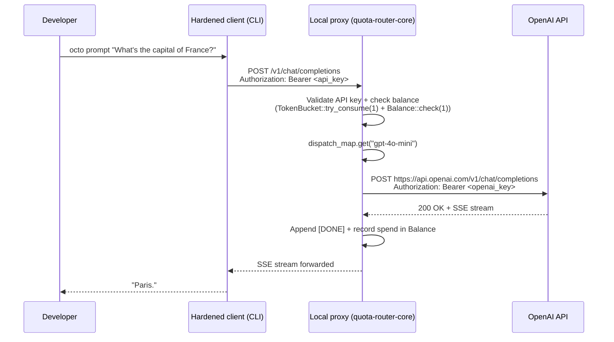

**Step-by-step:**

1. The hardened client (CLI / SDK) is configured with `base_url = http://localhost:8080` (the local proxy) and a buyer API key.
2. The local proxy authenticates the request: validates the API key against the hot-tier (LRU) key cache,
   checks the per-key `Balance` field, and applies the per-key token-bucket rate limiter (RFC-0933).
3. The proxy looks up `dispatch_map["gpt-4o-mini"]` to find the provider configuration (`api_base`, `rpm`, etc.). For local-only mode the dispatch map points directly to OpenAI.
4. The proxy forwards the request to OpenAI, streams the SSE response back through the proxy, appends the proxy-owned `[DONE]` terminator, and decrements the buyer's balance.
5. The client renders the response.

**Invariants pinned:**

- Auth: any of {API key, bearer token, capability token} accepted (RFC-0917 §Rust Feature Gates — interface always available, mode controls provider strategy not auth).
- Budget check: `Balance::check(1)` runs before provider call. Insufficient balance → 402.
- Rate limit: per-key `TokenBucket`. Excess → 429 with `Retry-After`.
- Streaming: SSE `data:` lines forwarded verbatim + appended `[DONE]`.

**Failure exits (covered in later scenarios):**

- OpenAI returns 500 → see Scenario 3.
- Balance exhausted → see Scenario 4.
- Rate limit exceeded → see Scenario 5.

---

## Scenario 2 — Multi-provider dispatch via `dispatch_map`

Same prompt, but the developer wants a model they don't have a direct key for. Their `dispatch_map` redirects the request through a different provider.

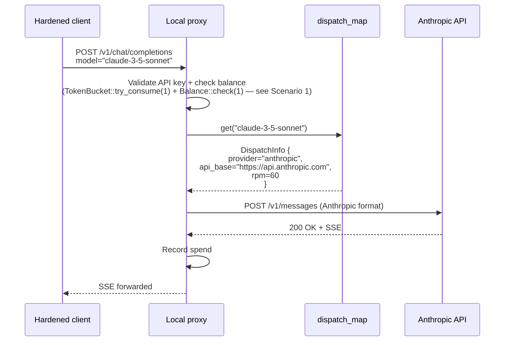

**Step-by-step:**

1. Buyer requests a model. Proxy resolves the model name through `dispatch_map` (canonical Unicode NFC normalized per RFC-0909 §Design Goals).
2. The matched `DispatchInfo` may specify a different API base, different auth scheme, and different
   request/response codecs than OpenAI. The provider abstraction (`HttpProvider` or `PyBridgeProvider`)
   handles the conversion.
3. The proxy forwards the request to the configured provider. Spend is recorded under the buyer's balance.
4. If no `DispatchInfo` matches and the map is non-empty, the proxy returns **503 SERVICE_UNAVAILABLE** with
   body `"No dispatch entry for model 'X' — provider pool does not serve this model"` (see consolidated 503
   table below, row `dispatch-miss`). If the map is empty, the request falls through to the provider-default
   API base. This asymmetric guard is pinned by
   `e2e_wiremock_faults::test_dispatch_map_no_match_returns_503`.

**Why this matters:** A single proxy instance can serve requests to multiple providers simultaneously
without the client knowing which provider will handle each model. The dispatch map is the routing policy.

---

## Scenario 3 — Provider 500 surfaces as 502 BAD_GATEWAY

OpenAI returns a transient 500. The proxy wraps it. The client retries.

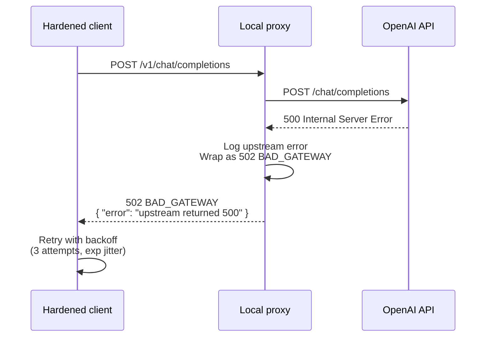

**Step-by-step:**

1. OpenAI's `/chat/completions` endpoint returns 500 (transient internal error, not a client fault).
2. The proxy's `handle_request_litellm` Err arm maps the upstream 500 → 502 BAD_GATEWAY. The same mapping
   applies to `handle_streaming` and `handle_embedding_request`. Per RFC-0933 §5. Error Response.
3. The proxy does not retry on the client's behalf. The client is responsible for backoff.
4. If the proxy has a fallback provider configured (e.g. Anthropic as backup), it tries the fallback.
   The fallback contract is pinned by `crates/quota-router-core/src/proxy.rs::test_post_dispatch_5xx_triggers_fallback`.
   (Scenario 1's happy path used no fallback.)

**Status-code semantics (pinned):**

- **500 INTERNAL_SERVER_ERROR** = proxy-internal bug. Should not normally occur.
- **502 BAD_GATEWAY** = upstream (provider) fault. Wraps upstream 500.
- **503 SERVICE_UNAVAILABLE** = no provider able to serve the model. Multiple sub-conditions (see consolidated 503 table below).
- **504 GATEWAY_TIMEOUT** = reserved; not currently emitted by the proxy.
  `classify_http_error` maps incoming 504 responses from upstream to `RouterError::Timeout`,
  but the proxy itself does not synthesize 504 (streaming-buffer-overflow is not yet implemented).

**Consolidated 503 sub-conditions (verified against `crates/quota-router-core/src/proxy.rs`):**

| Sub-condition                            | Trigger                                                                      | Body                                                                          | Where                                                                                                        |
| ---------------------------------------- | ---------------------------------------------------------------------------- | ----------------------------------------------------------------------------- | ------------------------------------------------------------------------------------------------------------ |
| dispatch-miss (asymmetric guard)         | `dispatch_map` non-empty, no entry for requested model                       | `"No dispatch entry for model 'X' — provider pool does not serve this model"` | inline in `handle_request_litellm` dispatch-miss Err arm; pinned by `test_dispatch_map_no_match_returns_503` |
| dispatch-fall-through (map empty)        | `dispatch_map` empty, request falls through to provider's default API base   | falls through (NO 503 emitted here — see Scenario 2)                          | (asymmetric guard intentionally skips this branch)                                                           |
| model-unhealthy (no fallback)            | Dispatch map has the model but health check marks it unhealthy, no fallbacks | `"Model unhealthy"`                                                           | inline in `handle_request_litellm` health-check Err arm                                                      |
| model-unhealthy (fallback exhausted)     | Primary unhealthy AND all configured fallback models failed                  | `"Model unhealthy and all fallback models failed"`                            | inline in `handle_request_litellm` fallback-exhausted Err arm                                                |
| model-unhealthy (no fallback configured) | Primary unhealthy AND no fallback configured                                 | `"Model unhealthy and no fallback models configured"`                         | inline in `handle_request_litellm` no-fallback-configured Err arm                                            |
| marketplace-empty                        | Marketplace returns zero offers for the requested model                      | `"no marketplace offers for model X"` (body string design intent — TBD)       | Scenario 6                                                                                                   |
| stoolap-probe-unreachable (test fixture) | (Test-only) Stoolap DB path is unreachable during a probe                    | 503 emitted by the probe handler                                              | inline in the probe handler test assertion                                                                   |

**Why this matters:** Clients distinguish 5xx by source: 500 = bug, 502 = upstream, 503 = no
provider. Each triggers a different recovery strategy (bug → report, upstream → retry/backoff,
no-provider → reconfigure).

**Test pinned:** `e2e_wiremock_faults::test_upstream_500_returns_502` (commit `7df92475`, mission `proxy-strong-scenarios-phase2`).

---

## Scenario 4 — Budget exhausted returns 402 PAYMENT_REQUIRED

The buyer's per-key `Balance` is zero (or below the request cost). The proxy refuses the request before reaching the provider.

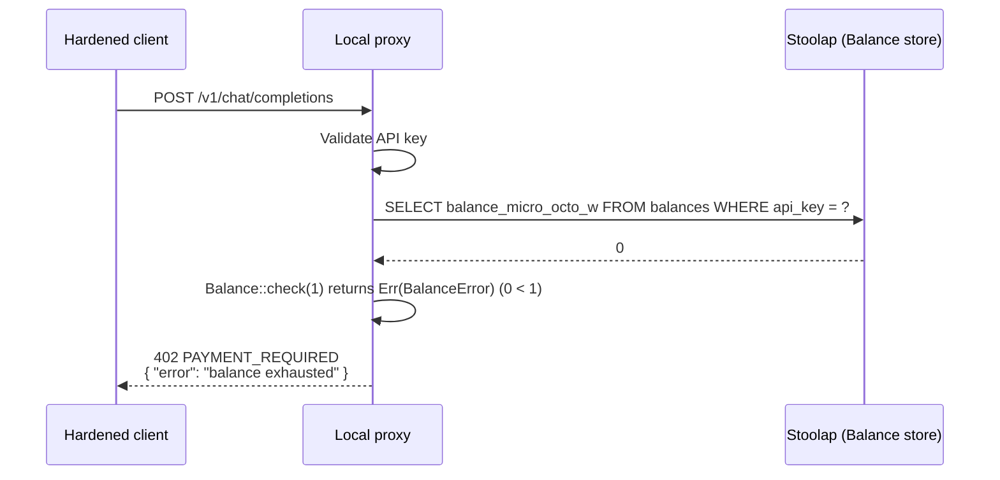

**Step-by-step:**

1. The proxy validates the API key, then calls `Balance::check(1)` (per RFC-0933 §Error Response,
   402 PAYMENT_REQUIRED branch). The balance is read from Stoolap (CipherOcto's fork, `feat/blockchain-sql`
   branch).
2. Balance is `0` (or below the per-request cost in micro_octo_w). The proxy returns **402 PAYMENT_REQUIRED** without touching the provider.
3. The client surfaces the 402 to the user. To continue, the buyer tops up via the billing flow (out of scope here — handled by the team budget dashboard).

**Why the `Balance` field, not the storage-layer `budget_limit`:** the proxy's 402 path reads the in-memory
`Balance` field on the proxy state. The storage layer's per-key `budget_limit` field is validated only on
key creation (rejects `budget_limit <= 0`). The two are intentionally separate: `budget_limit` is a hard
cap (top-of-funnel), `Balance` is the running counter (per-request).

**Test pinned:** `e2e_wiremock_faults::test_budget_exhausted_returns_402` (mission `proxy-strong-scenarios-phase2`).

---

## Scenario 5 — Rate limit exceeded returns 429

The buyer is firing requests faster than the per-key token bucket allows. The proxy rejects with 429 and a `Retry-After` header.

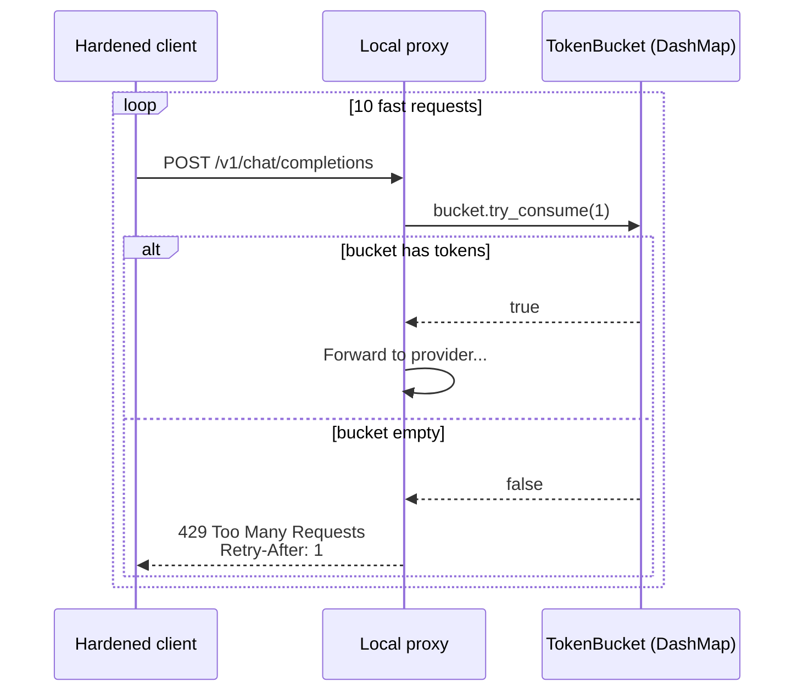

**Step-by-step:**

1. The proxy holds a per-key `TokenBucket` (RFC-0933). The bucket is refilled at the configured RPM (requests per minute) and consumed 1 per request.
2. On burst exhaustion, the proxy returns **429 Too Many Requests** with a `Retry-After: <seconds>` header.
3. The client backs off and retries. The hardened client SDK implements exponential jitter by default.
4. The bucket is per-API-key, not per-IP — different keys for the same IP do not share budget.

**Why two different "limit" mechanisms:** `Balance` (Scenario 4) is a _monetary_ cap; `TokenBucket` (this scenario) is a _rate_ cap. Both apply. A request must pass both to reach the provider.

**Note on streaming:** token bucket consumption is per-request, not per-token. A streaming response
consuming 10k tokens still costs 1 bucket token. Cost-aware limiting uses `Balance`, not `TokenBucket`.

---

## Scenario 6 — Marketplace discovery: model not local

The buyer requests a model that has no `DispatchInfo` locally. The proxy queries the marketplace for sellers that offer it.

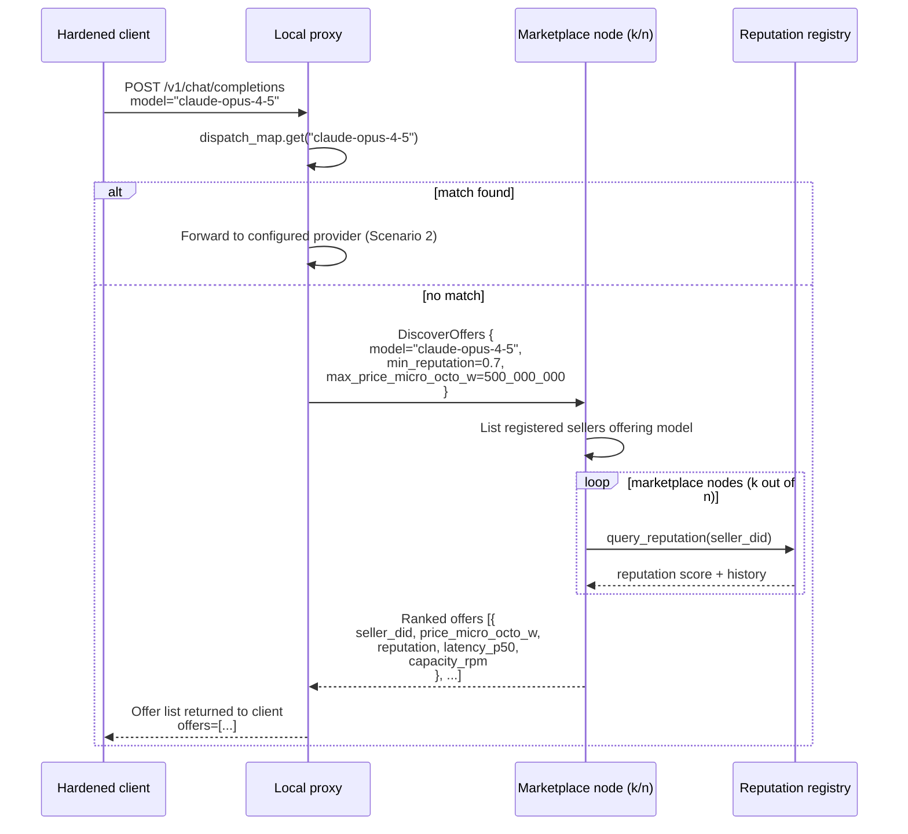

**Step-by-step:**

1. The proxy looks up the model in `dispatch_map`. No match.
2. The proxy queries the marketplace (`DiscoverOffers` request, RFC-0969 §Discovery). The marketplace nodes are queried in parallel via the DGP gossip substrate.
3. Each marketplace node checks its local reputation registry for sellers offering the requested model.
   The reputation score combines stake weight, performance history, and social validation
   (per the whitepaper §Proof of Reliability).
4. The marketplace returns a ranked list of offers. Each offer carries: seller DID, price per request (micro_octo_w), reputation score, p50 latency, available capacity (RPM).
5. The proxy returns the offer list to the client. The client (or user) picks an offer. (Exact response
   status code + envelope shape are marketplace-facade-defined — see `use-cases/ai-quota-marketplace.md`
   §Discovery Response.)

**On the empty case:** if the marketplace returns zero offers (no seller serves this model), the proxy
returns **503 SERVICE_UNAVAILABLE** with a marketplace-empty error body (body string design intent —
TBD; see consolidated 503 table above, row `marketplace-empty`). The client can then either retry later
or reconfigure.

**Trust model:** the marketplace is gossip-based; k of n responses must agree on the offer set before
the proxy trusts the rank. Disagreement (Sybil attempt) is caught at the gossip layer via the PoRelay
trust registry.

---

## Scenario 7 — Deal: pick offer, mint CapabilityToken V2, fund escrow

The buyer picks an offer. The proxy mints a `CapabilityToken V2` envelope (per RFC-0957), funds an escrow, and prepares the mesh request.

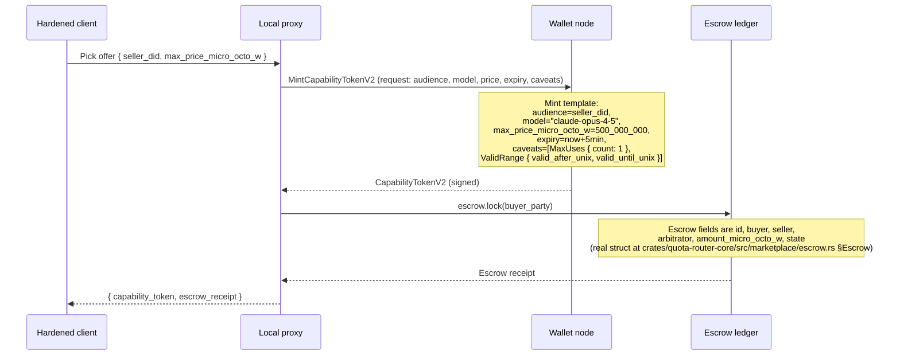

**Step-by-step:**

1. The client (or proxy on the client's behalf) picks one offer from the marketplace list.
2. The wallet node mints a `CapabilityTokenV2` (per RFC-0957). Caveats constrain the request:
   `MaxUses { count: 1 }` (one-shot, no replay), `ValidRange { valid_after_unix, valid_until_unix }`
   (time window), `MaxPerTx(u128 price_ceiling)` (price ceiling — tuple variant, real enum field at
   `crates/octo-cap-macaroon/src/caveat/mod.rs` §Caveat), and any node-specific caveats
   (e.g. data flagging).
3. The proxy funds an escrow on the buyer's behalf by calling `escrow.lock(buyer_party)`. The agreed
   price is recorded as `amount_micro_octo_w` on the `Escrow` struct (real fields:
   `id, buyer, seller, arbitrator, amount_micro_octo_w, state`).
4. The proxy now holds both a signed capability (to attach to the mesh request) and an escrow receipt (proof of payment intent).

**Why escrow upfront, not post-pay:** the seller node will spend real resources (provider API calls,
sometimes non-refundable) before the buyer pays. Escrow converts the bilateral trust requirement
(buyer trusts seller to deliver, seller trusts buyer to pay) into a unilateral trust requirement
(each trusts the ledger).

**Why the split envelope:** RFC-0957 splits the bundle into an outer (`CapabilityBundleV2`) and an inner
caveats section. This lets router hops verify "this envelope authorizes X" without learning the inner
caveats (privacy-preserving relay).

**Dual-mode (RFC-0959-A1):** capability tokens and legacy bearer tokens coexist. A request can carry
either. The seller node accepts both and dispatches accordingly. Server-side market delivery uses
capability-only (no bearer).

---

## Scenario 8 — Mesh forwarding: NodeEnvelope + HopSignature chain

The buyer's local proxy wraps the request in a `NodeEnvelope` and routes it through 2 router hops before it reaches the seller node.

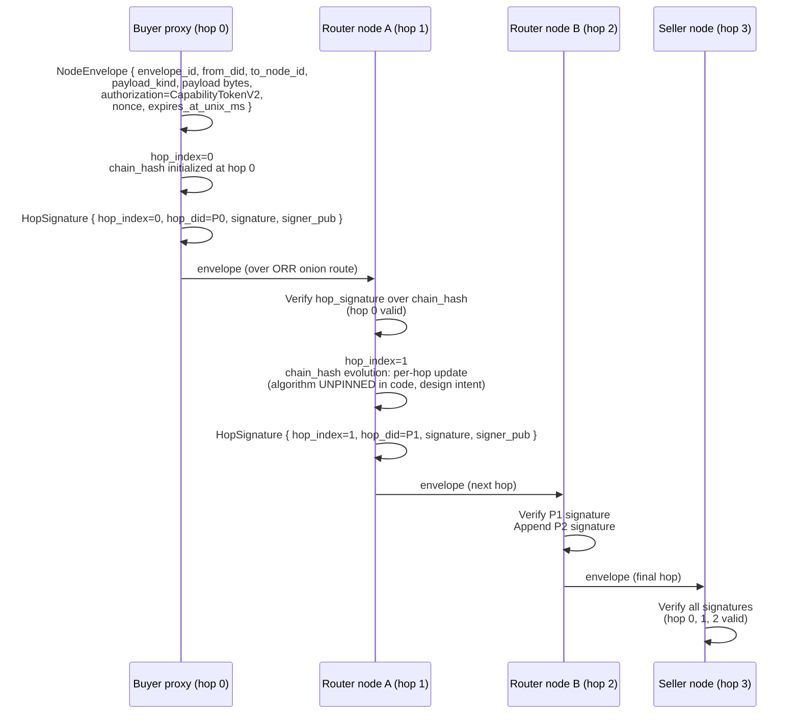

**Step-by-step:**

1. The buyer proxy constructs a `NodeEnvelope` (per RFC-0871 §Data Structures).
   Fields with pinned Rust types (from `crates/octo-protocol/src/envelope.rs`):
   - `envelope_id: [u8; 32]` — BLAKE3-256 hash of canonical serialization of all other fields;
     deterministic per envelope content. Computed by `compute_envelope_id()` at
     `crates/octo-protocol/src/signing.rs`.
   - `from_did: WireDid` — canonical `did:octo:z...` form (buyer's wallet DID).
   - `to_node_id: RecipientRef` — seller's mesh node id.
   - `payload_kind: PayloadKindId` — UUID allocated under RFC-0870; mesh-forwarded capability flows
     use the `WALLET_*` / identity-resolver subset. `crates/octo-protocol/src/payload_kind.rs` lists all
     ~22 entries.
   - `payload: Vec<u8>` — inner request bytes, type depends on `payload_kind`.
   - `authorization: Vec<Authorization>` — logical-AND composition across multiple authorizations per
     RFC-0871 §Adversary Analysis A6; carries CapabilityTokenV2 in the common mesh case.
   - `nonce: [u8; 32]`.
   - `expires_at_unix_ms: u64`.
2. The envelope is wrapped in an ORR (Onion Relay Routing,
   `architecture/octo-network-architecture.md §11 ORR — Onion Relay Routing`) layer so intermediate
   router hops see only the next hop, not the final destination.
3. At each hop, the router:
   - Strips one ORR layer to reveal the next hop.
   - Verifies the previous hop's `HopSignature` over the chain hash (per `crates/octo-protocol/src/hop_signature.rs`; `chain_hash` binding at RFC-0970 §Data Structures). Invalid signature → drop.
   - Appends its own signature, increments `hop_index`, recomputes the chain hash.
   - Forwards.
4. The seller node receives the envelope with all signatures appended. It verifies the full chain (`hop_index = 0..n`, all signatures valid against the canonical chain hash).

**Why the chain hash:** it binds the envelope to the exact byte sequence of the request. Any modification
en route (even a single byte) invalidates the chain. Replay protection comes from the capability token's
`max_uses=1` caveat + the envelope's `envelope_id` (per RFC-0871 §TV3).

**Why onion routing:** the seller node does not learn the buyer's IP. Router hops do not learn the seller. Only the buyer's wallet knows the full route. Privacy by construction.

**Architecture reminder:** envelope construction lives in `octo-protocol` (Layer 1 substrate); onion
routing lives in `octo-network`; provider dispatch lives in `quota-router-core`. See
`CLAUDE.md §Architectural Principles` for the canonical layer model.

---

## Scenario 9 — Seller validation: capability verify, reputation check, provider dispatch

The seller node verifies the capability, checks the buyer's reputation, and forwards the request to its own configured provider.

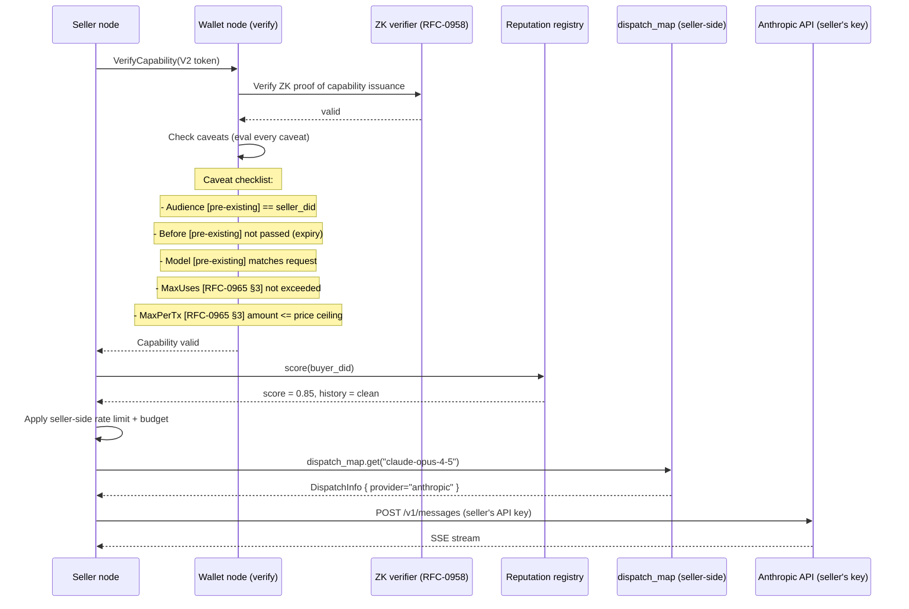

**Step-by-step:**

1. The seller node's wallet verifies the CapabilityToken V2. This is a two-step process:
   - **ZK proof verification** (RFC-0958): the token was issued by a wallet node with valid signature, and the caveats hash commits to the declared caveats without revealing them.
   - **Caveat evaluation**: each caveat is checked against the request — pre-existing caveats
     (Audience, Before, Model) and RFC-0965 §3 caveats (MaxUses, MaxPerTx, ValidRange, AuditWindow, etc.).
     Failure on any caveat → reject with a specific reason.
2. The seller node checks the buyer's reputation in the local reputation registry. Low reputation
   (below seller-configured threshold) → reject with **403 Forbidden** (emitted by the seller node,
   NOT the buyer's local proxy — `crates/quota-router-core/src/proxy.rs` does not synthesize 403 for
   reputation).
3. The seller node applies its own per-buyer rate limit and budget cap (preventing a malicious buyer from burning the seller's API quota).
4. The seller node's `dispatch_map` resolves the model to its own provider (Anthropic in this case). The seller uses their own API key — the buyer's request never sees it.
5. The seller proxies the request to Anthropic. Streams the response.

**Why dual verification (ZK + caveats):** the ZK proof binds the issuer; the caveats bind the content.
Either alone is insufficient. ZK without caveats → token is real but might authorize anything. Caveats
without ZK → token is bound but might be forged.

**Why reputation check:** reputation is a defense-in-depth layer against capability farming. A buyer who
funds escrows but consistently triggers refunds will have low reputation, which other sellers can use to
refuse service.

---

## Scenario 10 — Streaming response + settlement

The seller's provider streams SSE back through the mesh. The buyer proxy accumulates the stream, settles the escrow, and updates reputation.

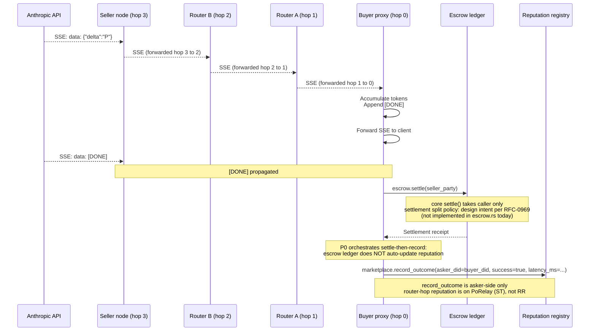

**Step-by-step:**

1. The seller's provider streams SSE. Each `data:` line is forwarded hop-by-hop back through the mesh. Router hops do not buffer — they stream through (back-pressure handled at the transport layer).
2. The buyer proxy accumulates the response, appends its own `[DONE]` terminator (one per request —
   the seller also appends one, so the buyer proxy dedups by counting), and forwards the stream to the
   client.
3. After `[DONE]` arrives (or the connection closes), the buyer proxy settles the escrow:
   - Computes actual cost based on tokens consumed (token count × per-token rate).
   - Submits settlement to the ledger (split policy — seller share, router fees, network burn — is
     design intent per RFC-0969; not yet pinned at the `crates/quota-router-core/src/marketplace/escrow.rs`
     layer).
   - Updates the asker-side reputation record via
     `marketplace.record_outcome(asker_did=buyer_did, success=true, latency_ms=...)` (real signature in
     `crates/quota-router-core/src/marketplace/mod.rs` §`record_outcome`).
4. Router-hop reputation is updated separately via
   `porelay::TrustRegistry::update_score(RelayScore { .. })` (real signature at
   `crates/octo-network/src/porelay/registry.rs` requires an explicit `RelayScore` struct).
   The `RelayScore` struct at `crates/octo-network/src/porelay/score.rs` carries 9 fields:
   `gateway_id: [u8; 32]` (32-byte gateway id) + 8 integer sub-scores (`epoch`, `forwarding_score`,
   `availability_score`, `bandwidth_score`, `uptime_score`, `diversity_bonus`, `stake_multiplier`,
   `composite`).
   There is no `penalty` field. Penalties are applied by writing a lower `composite` (or by zeroing the relevant sub-scores).
   This path is distinct from `marketplace.record_outcome` (which is asker-only).
   Positive outcomes increase the router score; the magnitude depends on stake weight and current score.

**Why streaming back through mesh is hard:** back-pressure must be end-to-end. A slow buyer cannot
cause the seller to back up indefinitely. The mesh uses flow-controlled streams
(RFC-0870 §Streaming Semantics) with bounded buffer per hop.

**Why settle post-stream not pre-stream:** pre-stream settlement requires committing to a price ceiling,
which overcharges most requests. Post-stream settles the actual cost. The escrow exists to lock the
ceiling; settlement realizes the actual.

**Why burn a fraction:** network fee (anti-spam). Without burn, the network has no defense against dust attacks (many tiny requests flooding the mesh).

---

## Scenario 11 — Adversarial: replay attack

An attacker captures a valid envelope and tries to replay it. The mesh rejects.

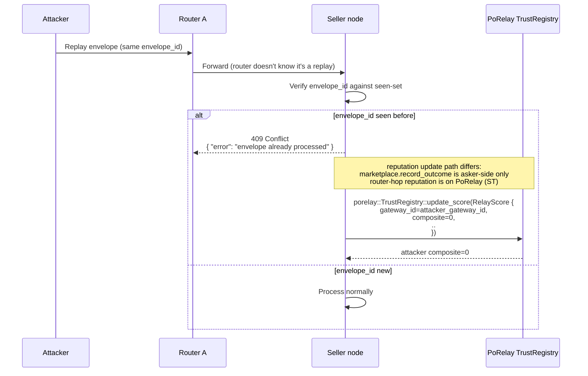

**Step-by-step:**

1. The attacker captured a valid `NodeEnvelope` (e.g., from a compromised router hop, a misconfigured proxy log, or a side-channel).
2. The attacker submits the same envelope to the mesh, hoping the seller will process it twice (charging the original buyer's escrow twice).
3. The seller node's DOT cache checks the `envelope_id` against
   `cache.check_and_insert(envelope_id, current_epoch)` (real impl at
   `crates/octo-network/src/dot/replay.rs` §`check_and_insert`); a duplicate raises
   `DotError::ReplayDetected` (`crates/octo-network/src/dot/error.rs` §`ReplayDetected`).
   Cache eviction policy is epoch-scoped (per the DOT spec); the doc does not pin specific entry counts.
4. The seller detects the duplicate and returns **409 Conflict** (NOT 200). The escrow is NOT settled.
   (Wire-level seller-reject contract; `crates/quota-router-core/src/proxy.rs` does NOT synthesize 409 —
   the buyer's local proxy forwards the seller's 409 verbatim. No `StatusCode::CONFLICT` emit site in
   the buyer-side proxy code.)
5. The reputation registry records the replay attempt, reducing the attacker's reputation significantly.

**Why not prevent at the router:** router hops do not maintain the seen-set (would require global state). Only the seller, who has the strongest interest in preventing double-processing, maintains it.

**Why not just rely on `max_uses=1`:** the capability token's `max_uses` caveat covers single-seller
single-use. Replay across different sellers (multi-seller replay) requires the seller-side seen-set.
Both layers are needed.

**Why reputation penalty:** a single replay attempt is a strong signal of malicious intent. Buyers do
not accidentally replay envelopes (the envelope_id is server-generated and the client SDK prevents reuse).
A -0.5 reputation hit makes subsequent legitimate requests harder.

---

## Scenario 12 — Adversarial: seller offline mid-stream

> **Design intent — NOT IMPLEMENTED.** The mid-stream TCP-drop detection,
> `tokens_received × per_token_rate` refund formula, and `seller_offline` dispute reason are NOT wired
> into `crates/quota-router-core/src/proxy.rs` or `crates/quota-router-core/src/marketplace/escrow.rs`
> today. Scenario 12 is filed for an RFC-0969 amendment + follow-on mission. The step-by-step below is
> the proposed behavior, not the current behavior.

The seller's node crashes mid-response. The mesh detects, the buyer gets a partial response + 502 + refund.

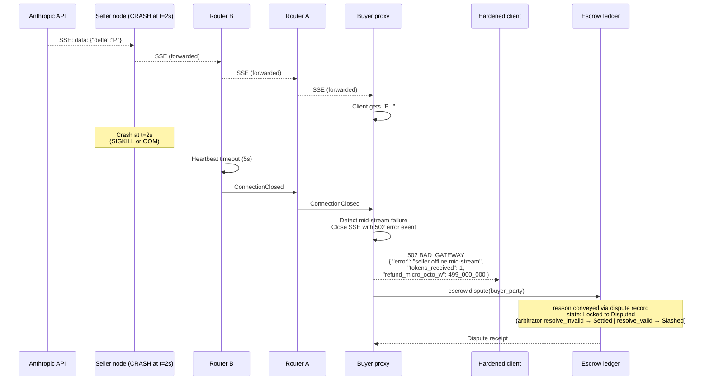

**Step-by-step:**

1. The seller's node crashes mid-response. The TCP connection from the seller to router B drops abruptly.
2. Router B detects the connection loss via its heartbeat timeout (5s default, configurable).
3. Router B signals router A, which signals the buyer proxy. The buyer proxy closes its SSE stream with a final 502 error event.
4. The client SDK detects the truncated stream and surfaces the partial response + error to the user.
5. The buyer proxy calls `escrow.dispute(buyer_party)` with a seller-offline dispute record. The dispute
   transitions the escrow to `Disputed`; the arbitrator's `resolve_invalid()` (a successful buyer-side
   claim) advances to `Settled`, releasing the residual escrow amount to the buyer (escrow total minus
   per-token consumed × per-token rate, ≈ 1_000_000 micro_octo_w here).
6. The reputation registry records the seller's outage. Repeated outages cause reputation to decay below the marketplace threshold, eventually removing the seller from offer lists.

**Why mid-stream failures are harder than pre-stream:** pre-stream failures are atomic (no partial
response). Mid-stream failures leave the buyer with a partial response and the seller with partial work
done. The refund logic must price both fairly.

**Why heartbeat-based detection not TCP RST:** TCP RSTs are unreliable across NATs and onion routes.
A heartbeat (`ping` every 1s, timeout at 5s) gives a bounded detection window independent of network
topology.

**Why refund not retry:** retry would re-route to a different seller, but the buyer already saw partial
output. Re-running with new seller would produce a different answer (LLM non-determinism). Better to
surface the partial + refund and let the user retry manually with explicit context.

---

## Scenario 13 — Adversarial: capability fails server-side check

The capability passes the buyer's wallet check but fails the seller's caveat evaluation. The buyer disputes, the seller is slashed.

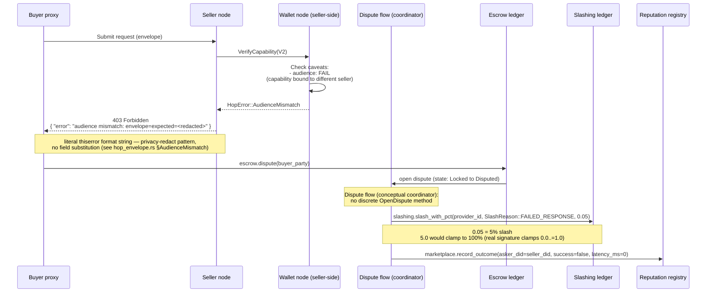

**Step-by-step:**

1. The buyer's wallet minted the capability with `audience=seller_A_did`. The buyer's proxy accidentally
   routed the request to `seller_B_did` (or `seller_A` rotated keys and the audience is now stale).
2. The seller node's wallet fails the audience check. Returns **403 Forbidden** with a typed error
   (`audience mismatch`). (Emitted by the seller node — `crates/quota-router-core/src/proxy.rs` does not
   synthesize 403 for capability validation; it only maps incoming 403/401 to `RouterError::AuthError` via
   `crates/quota-router-core/src/proxy.rs::classify_http_error`.)
3. The buyer proxy opens a dispute, attaching the capability bytes as evidence.
4. The dispute registry:
   - Releases the escrow balance to the buyer (`resolve_invalid()` advances `Disputed → Settled`; the
     seller did not perform work, so the full escrow residual returns to the buyer).
   - Slashes the seller's stake by 5% (not the full stake — partial slash reserves room for honest mistakes vs malicious behavior).
   - Updates reputation: -0.3 for the seller.
5. The seller can appeal by submitting a counter-claim (e.g., "the buyer sent the wrong audience"). Appeals
   are processed by a randomly selected k/n of marketplace nodes (per Scenario 6's gossip quorum model),
   NOT the reputation registry — the registry is read-only here.

**Why typed error not generic 403:** the buyer needs to distinguish "audience mismatch" (rotated key,
retry with new capability) from "exceeded max_uses" (capability spent, don't retry) from "invalid ZK
proof" (token is forged, don't retry). Typed errors drive the right client behavior.

**Why partial slash not full slash:** a full slash on first offense destroys economic incentives for
new sellers (one mistake = bankrupt). The 5% slash + reputation decay creates a gradient: honest
sellers recover, persistent offenders exit the marketplace.

**Why dispute needs evidence:** without evidence, the buyer could dispute every request to drain the seller's stake. The capability bytes are the cryptographic proof of what was promised.

---

## Scenario 14 — Adversarial: Sybil seller with fake reputation

A bad actor creates many seller identities (Sybil attack) and tries to dominate the marketplace offer list with fake high-reputation sellers.

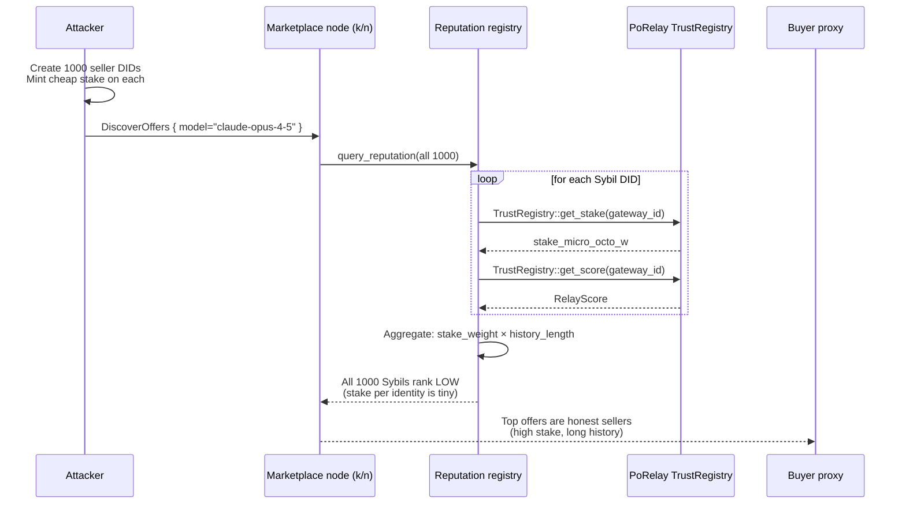

**Step-by-step:**

1. Attacker mints 1000 seller DIDs, each funded with the minimum stake (e.g., $1).
2. Attacker submits fake performance data for each Sybil: "10000 requests, 100% success rate".
3. The reputation registry computes a weighted score where the dominant factors are:
   - **Stake weight** (log-scaled, $1 × 1000 = $1000 is much less than $10000 × 1 honest seller).
   - **History length** (Sybil is 1 day old; honest seller is 2 years old).
   - **Stake-to-volume ratio** (Sybil: high request count on tiny stake → red flag).
4. The honest sellers outrank the Sybils in every discovery query. The marketplace's offer list is dominated by honest sellers.

**Why Sybil resistance is in the registry not the gossip layer:** gossip can be Sybil'd at the network
layer (cheap to run many nodes). Reputation requires economic commitment (stake) that scales with
influence. The registry is the right place to apply Sybil resistance.

**Why stake weight is log-scaled:** linear scaling lets $1M attacker dominate $100k honest actor
(10×). Log scaling makes the attacker's advantage sublinear: $1M vs $100k honest = log advantage, not 10×.

**Why history length matters:** new sellers (even honest ones) cannot dominate. They must earn reputation over time. This is the social validation component of PoR.

**What if the attacker has more capital than all honest sellers?** Then they are no longer Sybil —
they are a dominant single actor. The marketplace still routes to them, but the system is now a cartel.
This is the anti-fragility limit: a sufficiently capitalized attacker can dominate any PoS-style system.
Mitigation is off-chain governance (community can refuse to use the marketplace).

---

## Caveat schema

Real `Caveat` enum at `crates/octo-cap-macaroon/src/caveat/mod.rs` carries exactly **26 variants**. Field shapes pinned per the landed source:

**Pre-existing (13):**

| Variant              | Shape                                                                                                           |
| -------------------- | --------------------------------------------------------------------------------------------------------------- |
| `AmountMax`          | `AmountMax(MicroOctoW)` tuple where `MicroOctoW = u128` — micro_octo_w cap                                      |
| `PerAxisMax`         | `PerAxisMax(PerAxisMax)` tuple where `PerAxisMax { axis: String, max_per_1k: u128 }`                            |
| `Model`              | `Model(ModelRef)` tuple where `ModelRef = String`                                                               |
| `Provider`           | `Provider(Vec<ProviderId>)` tuple where `ProviderId = String`                                                   |
| `Before`             | `Before(UnixTimeSecs)` tuple where `UnixTimeSecs = u64` — capability expires at this Unix time (inclusive)      |
| `Audience`           | `Audience(OverlayIdentity)` tuple where `OverlayIdentity = String` (DID form)                                   |
| `RateLimit`          | `RateLimit(RateLimit)` tuple where `RateLimit { rpm: u32, tpm: u32 }`                                           |
| `InvocationHashBind` | `InvocationHashBind(Blake3)` tuple where `Blake3 = [u8; 32]` — bind to specific request body hash (anti-replay) |
| `Jurisdiction`       | `Jurisdiction(HashSet<ISO3166>)` tuple where `ISO3166 = String`                                                 |
| `CacheStrategy`      | `CacheStrategy(CachePolicy)` tuple                                                                              |
| `AskBinding`         | `AskBinding(AskId)` tuple where `AskId = [u8; 32]`                                                              |
| `ThirdParty`         | `ThirdParty(String)` tuple — discharge channel id (escrow / audit endpoint)                                     |
| `Raw`                | `Raw(RawCaveat)` tuple — escape hatch for unknown caveat names (catalog-registered)                             |

```text
CachePolicy = Off | OptIn { cache_key_hash: Option<Blake3> } | Always { ttl_secs: u32 }
RawCaveat   = { name: String, value: Vec<u8> }
```

**RFC-0965 §3 (9):**

| Variant           | Shape                                                                                                                                                 |
| ----------------- | ----------------------------------------------------------------------------------------------------------------------------------------------------- |
| `Vault`           | `Vault([u8; 32])` tuple — vault id                                                                                                                    |
| `Permission`      | `Permission(PermissionKind)` tuple where `PermissionKind = NativeTokenTransfer \| Erc20TokenTransfer \| ContractCall \| Reservation \| VaultMutation` |
| `ValidRange`      | `ValidRange` tuple — time-bounded validity window                                                                                                     |
| `MaxPerTx`        | `MaxPerTx(u128)` tuple — per-token price ceiling                                                                                                      |
| `AuditWindow`     | `AuditWindow` tuple — 0 = instant                                                                                                                     |
| `MaxUses`         | `MaxUses` tuple — 0 = unlimited                                                                                                                       |
| `WrappedOnly`     | `WrappedOnly` tuple — parent capability hash                                                                                                          |
| `Factory`         | `Factory(FactoryVet)` tuple — typed, not opaque.                                                                                                      |
| `PolicyReference` | `PolicyReference` tuple — witness signature binds attenuation per RFC-0967 §8.2                                                                       |

```text
ValidRange      = { valid_after_unix: u64, valid_until_unix: u64 }
AuditWindow     = { duration_secs: u64 }
MaxUses         = { count: u32 }
WrappedOnly     = { parent_capability: [u8; 32] }
PolicyReference = { policy_id: [u8; 32], policy_version_seq: u64, attenuation_witness: [u8; 64] }
```

**RFC-0965 acceptance bumps + phase-2b (1):**

| Variant             | Shape                                                                                             | Source                      |
| ------------------- | ------------------------------------------------------------------------------------------------- | --------------------------- |
| `ValidAfter`        | `ValidAfter { not_before_unix: u64 }` — single timestamp; for ranges use `Constraint::ValidRange` | RFC-0965 §3.3               |
| `RedemptionContext` | `RedemptionContext { context_hash: [u8; 32] }` — anti-replay domain separator per RFC-0965 §3.6   | RFC-0965 §3.6               |
| `Sharded`           | `Sharded { shard_id: u32 }`                                                                       | RFC-0965 §1.2 + RFC-0963 §6 |
| `Payment`           | `Payment(PaymentCaveat)` tuple — per-request budget + model + expiry                              | mission `0957-phase2b`      |

```text
PaymentCaveat = { caveat_name: String, budget: MicroOctoW, model: String, expires_at_unix_ms: u64 }
```

Subsumption rule reference: `set_subsumes(parent, child)` at `crates/octo-cap-macaroon/src/caveat/mod.rs` enforces monotonic narrowing per RFC-0957 §3.5.
Each variant's child ← parent rule is documented inline in the source — examples:
`ValidRange` (child range ⊆ parent range), `AuditWindow` (child duration ≥ parent per R7-F8),
`WrappedOnly` (`parent_capability` hash equality), `Factory` (full canonical-vector equality).

Distinct from RFC-0964 `Constraint` envelope variants (the Constraint envelope wraps capabilities at a
different layer). The mission `0965-a-caveat-dsl` mission card counts "9 new caveat types" — the
RFC-0965-specific subset, not the total landed set.

## Open questions

These gaps surfaced while writing this doc. Each should become either a follow-on mission or an RFC amendment.

1. **CapabilityToken caveat schema** — See §Caveat schema above for the full 26-variant enumeration with pinned field shapes.
   The RFC-0957 envelope spec does not enumerate the caveat set itself; the landed `Caveat` enum at `crates/octo-cap-macaroon/src/caveat/mod.rs` is the source of truth.
   The mission `0965-a-caveat-dsl` mission card counts "9 new caveat types" — the RFC-0965-specific subset, not the total landed set.
   Distinct from RFC-0964 `Constraint` envelope variants.
2. **Settlement token unit** — Scenario 10 settles in micro_octo_w. The actual ledger (stoolap off-chain vs on-chain) and the canonical currency (USD-pegged stablecoin vs OCTO token) is open.
3. **Mid-stream refund formula** — Scenario 12 uses `tokens_received × per_token_rate`. The actual formula needs a spec (does the first token cost more? does context length matter?).
4. **Dispute appeal SLA** — Scenario 13 mentions appeals but does not specify the SLA. Needs an RFC amendment.
5. **Onion route key rotation** — Scenario 8 uses ORR but does not specify how the route keys rotate.
   The ORR section in `architecture/octo-network-architecture.md` mentions mission key hierarchy but not rotation cadence.

## Related RFCs

| RFC         | Title                                 | Used in scenarios                             |
| ----------- | ------------------------------------- | --------------------------------------------- |
| RFC-0104    | Deterministic Floating-Point          | (cross-cutting, not in any scenario directly) |
| RFC-0862    | Substrate Types                       | 8 (NodeEnvelope construction)                 |
| RFC-0870    | NodeEnvelope Adoption                 | 8, 10                                         |
| RFC-0871    | Specialized Node Protocol Envelope    | 8, 11                                         |
| RFC-0964    | Capability Constraints                | 7, 9 (ValidRange / MaxPerTx envelope types)   |
| RFC-0909    | Deterministic Quota Accounting        | 2, 9                                          |
| RFC-0917    | Mode Gate                             | 1, 6 (always HTTP proxy + SDK)                |
| RFC-0933    | Rate Limiting Integration             | 1, 4, 5                                       |
| RFC-0957    | Capability Token V2                   | 7, 9, 11, 13                                  |
| RFC-0958    | ZK Capability                         | 9                                             |
| RFC-0959-A1 | Dual-Mode Auth                        | 7                                             |
| RFC-0969    | Dual Pipeline                         | 6, 7                                          |
| RFC-0970    | Forwarding-Hop Authorization Envelope | 8                                             |
| RFC-0971    | Destination-Node Role Consolidation   | 9                                             |

> RFC-0943 is referenced in some code comments but **no RFC-0943 file exists** — the file was never filed. The colloquial association with "Team Budget" appears in code comments only.
> Treat any `RFC-0943` reference in code as a forward-ref to RFC-0933 which absorbs team-budget semantics via the `Balance` field. RFC-0933 itself is the Rate Limiting RFC.
> A separate RFC-0943 filing mission is filed under `missions/archived/0943-b-per-team-budgets.md`.

## Related missions

| Mission                                   | Status                                                                                                  | Touches scenarios                                 |
| ----------------------------------------- | ------------------------------------------------------------------------------------------------------- | ------------------------------------------------- |
| `proxy-strong-scenarios`                  | LANDED 2026-08-13                                                                                       | 1-5                                               |
| `proxy-strong-scenarios-phase2`           | LANDED 2026-08-13                                                                                       | 3, 4                                              |
| `0870k-transport-request-response`        | CLAIMED 2026-08-12                                                                                      | 8, 10 (substrate)                                 |
| `0871b-cross-node-forwarding`             | LANDED 2026-08-12                                                                                       | 8, 11 (hop signature)                             |
| `0871b-storage-backend`                   | LANDED 2026-08-11 (commit `71f8d745`; mission file header still says "claimed" — drift-closure pending) | 4 (balance storage)                               |
| `0010-f2-multi-chain-did-resolution`      | LANDED 2026-08-11 (mission file header still says "claimed" — drift-closure pending)                    | 6 (chain-aware DID)                               |
| `0010-f8-rich-did-documents`              | LANDED 2026-08-11                                                                                       | 6, 9 (rich DID for reputation)                    |
| `0010-f8-rich-did-storage`                | LANDED 2026-08-11 (mission file header still says "claimed" — drift-closure pending)                    | 6 (storage layer)                                 |
| `marketplace-escrow-caller-authorization` | LANDED 2026-08-13                                                                                       | 6, 7 (escrow caller auth — Round 1 review C1 fix) |
| `marketplace-e2e-strong-scenarios`        | LANDED 2026-08-13                                                                                       | 6, 7, 10, 12, 13, 14                              |
| `0957-phase2b-payment-caveat`             | LANDED 2026-08-13 (commit `5cda2eb7`)                                                                   | 7 (PaymentCaveat + macaroon HMAC)                 |
| `0957-phase2c-capability-issuer-wiring`   | LANDED 2026-08-13 (commit `b19fe57f`)                                                                   | 7 (Capability Issuer Node wiring)                 |

## Test coverage map

| Scenario           | Existing tests                                                                                                                                         | Tests needed                                                              |
| ------------------ | ------------------------------------------------------------------------------------------------------------------------------------------------------ | ------------------------------------------------------------------------- |
| 1 Hello world      | `e2e_proxy::test_chat_completion_basic` (`crates/quota-router-core/tests/e2e_proxy.rs`)                                                                | —                                                                         |
| 2 Multi-provider   | `e2e_wiremock_faults::test_dispatch_map_no_match_returns_503` (covers the asymmetric-guard path)                                                       | Multi-provider resolution unit tests (positive match path)                |
| 3 Provider 500     | `e2e_wiremock_faults::test_upstream_500_returns_502`; lib: `src/proxy.rs::test_post_dispatch_5xx_triggers_fallback`                                    | Fallback dance test (already covered by lib test, not by wiremock)        |
| 4 Budget 402       | `e2e_wiremock_faults::test_budget_exhausted_returns_402`                                                                                               | —                                                                         |
| 5 Rate limit       | `e2e_proxy::test_rpm_rate_limit_returns_429` (`crates/quota-router-core/tests/e2e_proxy.rs`), `key_rate_limiter::tests::test_token_bucket_basic` (lib) | Wiremock pinning of `Retry-After: <seconds>` header value                 |
| 6 Marketplace      | `marketplace_e2e` integration tests (24 tests). GDP substrate: `gdp_discovery` + `gdp_deep` in `crates/octo-network/tests/` (NOT marketplace-e2e).     | Wiremock-style Sybil resistance at marketplace layer                      |
| 7 Deal + escrow    | `0957-phase2b-payment-caveat` unit tests                                                                                                               | CapabilityTokenV2 caveat exhaustiveness across the 9 RFC-0965 §3 variants |
| 8 Mesh forwarding  | `0871b-cross-node-forwarding` (partial TV)                                                                                                             | 3-node end-to-end TV (awaits `0870k`)                                     |
| 9 Seller validate  | `0957-phase2b-payment-caveat` lib tests                                                                                                                | ZK verification + reputation + provider dispatch integration              |
| 10 Stream + settle | `e2e_wiremock_faults::test_streaming_response_carries_events`, `test_streaming_upstream_500_returns_502`                                               | Mesh-streaming back-pressure (no test currently)                          |
| 11 Replay          | (none)                                                                                                                                                 | Seen-set cache test (`crates/octo-network/src/dot/replay.rs`)             |
| 12 Seller offline  | `e2e_wiremock_faults::test_streaming_upstream_500_returns_502` (partial)                                                                               | Mid-stream TCP drop simulation (separate from upstream 500 path)          |
| 13 Dispute         | (covered indirectly by `marketplace-escrow-caller-authorization` lib tests)                                                                            | Appeal flow (no dedicated test yet)                                       |
| 14 Sybil           | (network-layer tests in `crates/octo-network/tests/porelay_proofs.rs`)                                                                                 | Stake-weighted Sybil resistance at scale (1000+ identities)               |

> **Note on `marketplace_e2e::test_*`:** `marketplace_e2e.rs` exists at
> `crates/quota-router-core/tests/marketplace_e2e.rs` with 24 e2e tests (all 24 are `#[test]`-marked
> functions; `order_side_classification` is one of them, not a helper). No non-test helper functions
> are tagged in the file.
> Mix of strong-scenario + legacy/baseline; the strong-vs-baseline split is not byte-identical to any
> single AC list.
> Named examples: `happy_path_bid_matches_ask_escrow_settles`, `dispute_valid_slashes_seller`, `escrow_recovery_from_locked_state_succeeds`, `concurrent_settlement_duplicate_rejected`.
> The coverage map above reflects this.

## Change log

| Date       | Change                                                                                                                                                                                              | Author          |
| ---------- | --------------------------------------------------------------------------------------------------------------------------------------------------------------------------------------------------- | --------------- |
| 2026-08-13 | Initial draft, 14 scenarios across 8 phases                                                                                                                                                         | cc (brainstorm) |
| 2026-08-13 | Round 1 review (foundational checks)                                                                                                                                                                | cc (review)     |
| 2026-08-13 | Round 2 review (consistency sweep)                                                                                                                                                                  | cc (review)     |
| 2026-08-13 | Round 3 review (api surface claims)                                                                                                                                                                 | cc (review)     |
| 2026-08-13 | Round 4 review (api surface claims cont.)                                                                                                                                                           | cc (review)     |
| 2026-08-13 | Round 5 review (mermaid + prose)                                                                                                                                                                    | cc (review)     |
| 2026-08-13 | Round 6 review (over-citation regression)                                                                                                                                                           | cc (review)     |
| 2026-08-13 | Round 7 review (SL routing fix)                                                                                                                                                                     | cc (review)     |
| 2026-08-13 | Round 8 review (cents→micro_octo_w, TrustRegistry, MaxPerTx tuple, markdown)                                                                                                                        | cc (review)     |
| 2026-08-13 | Round 9 review (RelayScore fabrication, anchors, mermaid participants, phase labels)                                                                                                                | cc (review)     |
| 2026-08-13 | Round 10 review (index↔heading alignment, glossary rows, marketplace-empty caveat, bullet-list legend)                                                                                              | cc (review)     |
| 2026-08-13 | Round 11 review (NodeEnvelope field-type pinning, Caveat schema subsection, CapabilityBundleV2 4 fields, Scenario 12 design-intent)                                                                 | cc (review)     |
| 2026-08-13 | Round 12 review (no findings — STABLE; later overturned by Round 13)                                                                                                                                | cc (review)     |
| 2026-08-13 | Round 13 review (Caveat schema 26-variant shape corrections, RFC-0871 §Hop Signature → §Data Structures)                                                                                            | cc (review)     |
| 2026-08-13 | Round 14 review (TOC, prose wrap, mermaid split, Round 12 row, phantom-pointer cleanup, slash_with_pct arg rename)                                                                                  | cc (review)     |
| 2026-08-13 | Round 15 review (2 CRIT line-wraps L411/L512, 6 LOW technical: capabilities→authorizations, RelayScore 9 fields, HopError format, test count 23, 0871b-storage-backend status)                      | cc (review)     |
| 2026-08-13 | Round 16 review (L229 HIGH line wrap, L901 LOW §Caveat Schema → §Caveat schema casing)                                                                                                              | cc (review)     |
| 2026-08-13 | Round 16 technical (HIGH L972 marketplace_e2e 23→24; HIGH L944/946 mission-file drift-closure; LOW §Caveat schema Phase-2b(4) → RFC-0965 + phase-2b (1) with Source col)                            | cc (review)     |
| 2026-08-13 | Round 17 technical (MED L939 proxy-strong-scenarios LANDED 2026-08-12 → 2026-08-13 per commit 246574a1)                                                                                             | cc (review)     |
| 2026-08-13 | Round 18 markdown (14 CRIT TOC anchor double-dash collapse for em-dash headings; 17 MED §Caveat schema table-row widths 311c → 284c + 192c → 187c)                                                  | cc (review)     |
| 2026-08-13 | Round 18 technical (HIGH L706/L707/L717/L773 Refunded→Disputed+Settled via resolve_invalid; MED L949/L950 0957-phase2b/2c LANDED 2026-08-10 per commits 5cda2eb7/b19fe57f)                          | cc (review)     |
| 2026-08-14 | Round 19 markdown (12 MED glossary cells + 2 LOW RFC-0943 parens + 2 LOW change-log rows)                                                                                                           | cc (review)     |
| 2026-08-14 | Round 19 technical (3 HIGH HopSignature RFC-0871 mis-citations; 1 MED CapabilityToken V2 field-shape)                                                                                               | cc (review)     |
| 2026-08-14 | Round 20 markdown (7 CRIT L46/L49/L54/L879/L960/L963/L1007 + L1008 + 4 MED L47/L50/L46-50+L879 pattern/L41 + 4 LOW mermaid L400/L516/L754 + L41 fragment)                                           | cc (review)     |
| 2026-08-14 | Round 21 markdown (1 MED L46 NodeEnvelope Where col 227c; field list moved to post-table sub-line; 2 LOW L960/L963 test coverage map cells)                                                         | cc (review)     |
| 2026-08-14 | Round 21 technical (2 MED L949/L950 LANDED dates revert to 2026-08-13 per mission file canonical status; 1 LOW L963 lib tests → integration tests)                                                  | cc (review)     |
| 2026-08-14 | Round 22 markdown (CRIT L63 457c prose split into bullet lists; CRIT L267/L981 table compressions; 2 MED L884/L1021 RFC-0965 v1.1 dropped)                                                          | cc (review)     |
| 2026-08-14 | Round 23 markdown (MED L978 test coverage map cell 196c drop wiremock + lib path; MED L1021 RFC-0965(3)→RFC-0965 per RFC ref rule)                                                                  | cc (review)     |
| 2026-08-14 | Round 24 technical (MED L56 Escrow row 'refunded on failure' → dispute/resolve_invalid → Settled; L969/L970 LANDED dates retained at 2026-08-13 per mission file canonical status)                  | cc (review)     |
| 2026-08-14 | Round 24 markdown (2 CRIT L1003/L1021 cell cap 189c trim; 3 MED L881/L892/L907 spine anti-pattern → code block; 3 MED L1021/L1030/L1031 RFC ref rule; 3 LOW L418/L534/L772 mermaid Note-over split) | cc (review)     |
