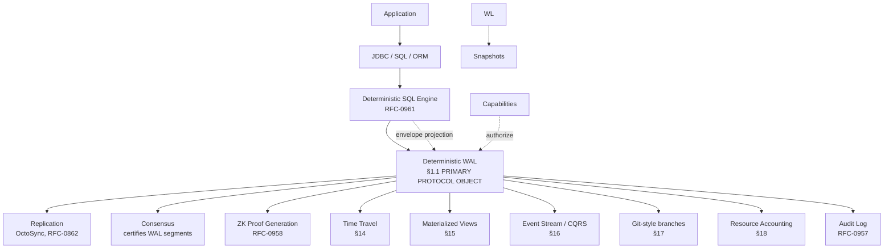
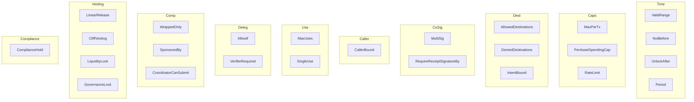
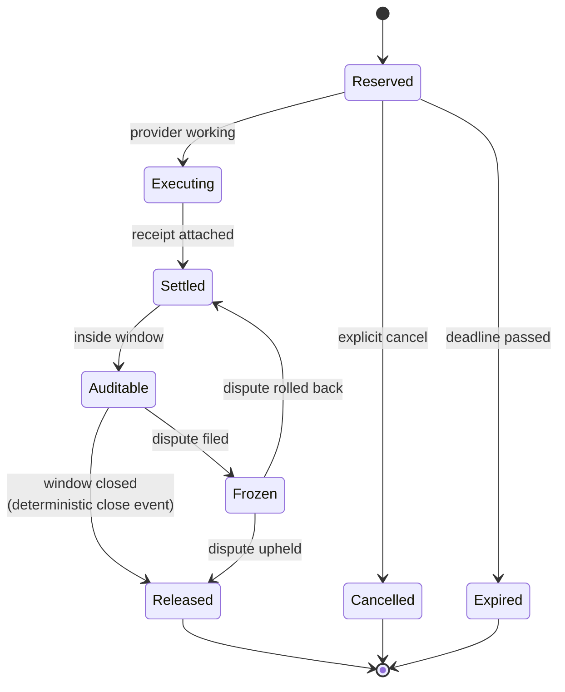

# Grand Design — Vaults, Capabilities, Reservations

## Status

**Spec authority:** RFC-0960 (Accepted 2026-07-23). This document is a **navigation reference**, not a normative spec. Every section points to the canonical RFC-0960 §N (or companion RFC §N) for full specification. RFC-0960 supersedes the value-layer gap analysis from `docs/research/2026-07-22-value-transfer-model-internal-landscape.md` Phase 1.

**Companion RFCs (promoted in lockstep with RFC-0960 on 2026-07-23):**

- RFC-0961 (CIPHERO_SQL Deterministic SQL); DEFERRED for implementation (see §22)
- RFC-0962 (ExecutionEnvelope Object Protocol)
- RFC-0963 (Resource Shard Routing)
- RFC-0964 (Constraint Encoding Standard)
- RFC-0965 (Capability Extension Format)
- RFC-0967 (Policy Object Graph)

---

## 1. Architecture (v2.0 — WAL as primary protocol primitive)

The v2.0 reframe (R17+, RFC-0960) inverts the architecture. The **Deterministic WAL** is the primary protocol primitive. Everything else — Replication, Consensus, ZK Proofs, Time Travel, Materialized Views, Event Streams, Snapshots, Resource Accounting, and the `ExecutionEnvelope` SQL-facing surface — is a _projection_ of the WAL.



**Capability-as-WAL-Write-Authorization.** Capabilities no longer authorize SQL statements or `ExecutionEnvelope` creation. Capabilities authorize the creation of **WAL entries** within a defined policy (RFC-0967 Policy Object). The Capability is the page-table root register; the Policy Object is the page table; the WAL entry is the access.

**Strategic positioning.** Run existing enterprise applications unchanged while replacing the trust model underneath. JDBC, SQL, ORMs, stored procedures, reports — all unchanged. Capability replaces password; consensus replaces replication; cryptographic WAL replaces WAL; immutable audit replaces audit; cryptographic snapshots replace snapshots; AS OF block_height replaces time travel.

**Pointer:** RFC-0960 §1, §1.1, §1.2, §1.3, §1.4.

---

## 2. Primitives

Four primitives. Settlement aliases to RFC-0959 `SettlementReceipt` (no redefinition).

### 2.1 Vault

```text
Vault {
    vault_id:        VaultID,
    owner_did:       DID,
    token:           AssetID,
    policy:          VaultPolicy,
    current_state:   VaultState ∈ {Active | Frozen | Retired},
    parent_vault:    Option<VaultID>,
    created_at:      Timestamp,
    metadata:        Metadata,
}
```

Semantic vault types (Provider, Marketplace, Escrow, Treasury, Mission, Node, DAO, Liquidity, Compliance, Regional) are all `Vault` with typed `policy`. Hierarchical vaults form a capability-security lattice (grand design §11).

**Pointer:** RFC-0960 §2.1.

### 2.2 Capability

RFC-0957 already defines `Capability` as macaroon v1 with first-party + third-party caveats + discharge bag. RFC-0960 **does not redefine** the macaroon — it **adds new caveat types** that capture the extended fields (`Vault`, `Permission`, `ValidRange`, `MaxPerTx`, `AllowedDestinations`, `AuditWindow`, `MaxUses`, `WrappedOnly`, `Factory`, `RedemptionContext`, `PolicyReference`, etc.). Attenuation invariant (add-only, monotonic restriction) preserved by RFC-0957.

**Pointer:** RFC-0960 §2.2, encoding in RFC-0965.

### 2.3 Reservation

```text
Reservation {
    reservation_id:  ReservationID,
    vault_id:        VaultID,
    capability_id:   CapabilityID,
    resources:       ResourceSpec,
    amount:          MicroOCTO_W,
    expires_at:      Timestamp,
    state:           ReservationState,
    settlement_ref:  Option<SettlementID>,
}
```

Reservation state machine: `Reserved → Executing → Settled → Auditable → Released` (terminal) with `Frozen` (dispute) branch. The 8-state `ReservationState` enum (Reserved, Executing, Settled, Auditable, Released, Expired, Cancelled, Frozen) is defined at `crates/quota-router-sm-engine/src/lib.rs:101-118`.

**Step 6 of the 11-step exercise** now constructs a real `Reservation` row via `quota_router_sm_engine::Reservation::mint()` (landed 2026-07-23, R1-F1 closeout). The prior `blake3::hash(b"escrow/v1")` placeholder is removed.

**Pointer:** RFC-0960 §2.3. Note: `quota-router-sm-engine` `ReservationState` has only `as_sql` + `display` conversion today; transition guards are pending (W2 mission `0959-a-ask-pricing-stoolap.md`).

### 2.4 Settlement (alias to RFC-0959 SettlementReceipt)

```text
// RFC-0959 (Accepted, authoritative):
SettlementReceipt {
    envelope: {
        receipt_id:        ReceiptId,       // = BLAKE3(canonical_ser(event, nonce, settled_at_unix))
        event:             SettlementEvent, // includes cost bound into settlement_hash
        nonce:             [u8; 16],
        settled_at_unix:   u64,
    },
    router_signature:           Ed25519Signature,
}
```

RFC-0960 adds `reservation_id` link to `Reservation`. The audit-window extension is layered onto RFC-0959's state machine without overriding it.

**Pointer:** RFC-0960 §2.4; RFC-0959 §Data Structures.

### 2.5 Transfer (consequence, not primitive)

The canonical schema has **no `transfers` table**. The canonical schema has one append-only log: `transfer_events`. Balance = `SUM(in) - SUM(out) - SUM(active escrow holds)` over `transfer_events`. `octo_w_balances` is a **cache projection**, not source of truth.

**Pointer:** RFC-0960 §2.5.

---

## 3. Constraint Set (25 variants)



Categories: Time (4), Spend caps (3), Destination/intent (3), Co-signing (2), Caller binding (1), Use count (2), Policy delegation (2), Composition (3), Vesting/time-lock (4), Compliance (1). Total = 25.

**Canonical encoding in RFC-0964** (companion). Each `Constraint` is a tagged-union variant with deterministic field ordering per RFC-0126. Namespace tag `0x01` precedes the inner envelope on the wire; receivers dispatch on the namespace tag first.

**Caveat-to-constraint mapping:** RFC-0965 §3. `audit_window` field is `u64` seconds (same on `Reservation` struct, `AuditWindow(duration_secs)` caveat payload, and `audit_window_secs` live code — one canonical name across all three).

**Reuse table** (RFC-0960 §3): Time lock → `NotBefore` / `UnlockAfter`; Vesting → `LinearRelease`; Cliff → `CliffVesting`; Liquidity lock → `LiquidityLock`; Multi-sig → `MultiSig`; Rate limit → `RateLimit`; AI spend cap → `RateLimit` per-window token counts.

**Pointer:** RFC-0960 §3; RFC-0964 §1 (variant enumeration) + §0 (wire-format envelope tag); RFC-0965 §3 (constraint-to-caveat mapping).

---

## 4. Audit Window — Reservation state machine



**Deterministic close trigger:** `AuditWindowClose` event emitted at `close_block_height = settled_block + ceil(audit_window_secs / block_interval_secs)`. All nodes compute the same `close_block_height` because both inputs are network parameters. Block producer at `close_block_height` emits the event in that block. Catch-up sync replays the event for nodes that have already passed it.

**Pointer:** RFC-0960 §4. Note: coupling to RFC-0959 settlement state (`Minted → Settled → Consumed`) is disjoint from Reservation state machine.

---

## 5. Event-Sourced Ledger

Reject mutable balance rows as canonical state. Append-only event log:

```text
Event {
    event_id:       EventId,           // global monotonic u64
    event_type:     EventType,         // VaultCreated | CapabilityGranted | CapabilityAttenuated | ...
    tx_id:          TxId,              // atomic grouping
    schema_version: u32,               // forward-compat
    visibility:     Visibility ∈ {Public, Confidential, Private},
    timestamp:      Timestamp,
    attributes:     Vec<(Bytes, Bytes)>,
    corrections:    Vec<EventId>,      // Datomic-style :correction/for (ascending)
    signature:      Signature,
    proof:          Option<ZKProof>,   // for Private events
}
```

Event types: `VaultCreated`, `CapabilityGranted`, `CapabilityAttenuated`, `CapabilityExpired`, `CapabilityRevoked`, `ReservationCreated`, `ReservationUpdated`, `SettlementCompleted`, `TransferApplied`, `DisputeOpened`, `DisputeResolved`, `VaultFrozen`, `VaultRetired`.

**`corrections` ordering:** ascending `event_id`, enforced by canonical_ser. Tested in RFC-0964 test vectors.

**Pointer:** RFC-0960 §5; canonical_ser per RFC-0126.

---

## 6. Economic VM

A **declarative, deterministic, loop-free** policy language. Not Turing-complete. Not a smart-contract platform.

```text
ALLOW
  spend up_to 50 OCTO-W
  IF
    time > cliff
    AND reputation > 900
    AND remaining_budget > cost
    AND gpu_available
    AND price <= oracle_price * 1.05
    AND counterparty in allowlist
```

Properties: no loops, no recursion, no arbitrary storage; deterministic (provable by construction; ZK-friendly); compiles to RFC-0126 canonical_ser; bounded evaluation cost via `step_budget: u32` in `AllowIf` constraint.

**Pointer:** RFC-0960 §6.

---

## 7. Atomic Swaps + Cross-Chain

Multi-settlement primitive, not bridge contract.

```text
MultiSettlement {
    id,
    participants: [
        { chain: "Ethereum",  reservation: R_eth,  proof: HTLC_preimage },
        { chain: "Bitcoin",   reservation: R_btc,  proof: witness },
        { chain: "CipherOcto", reservation: R_octo, proof: settlement_hash },
    ],
    completion: AllRequired,
}
```

Completion rule: every proof required. All-or-nothing. No bridge contract, no wrapped asset, no custodian.

**Cross-chain capability:** `Capability { secured_by: CrossChainBacking::BitcoinHTLC { ... } }`. The CipherOcto capability IS the cross-chain primitive — not a bridge, but a delegation backed by an external proof.

**Pointer:** RFC-0960 §7.

---

## 8. Hierarchical Vaults

Owner never spends directly. Capabilities spend.

```text
Alice
  ├── Mission A        20 OCTO-W   capability
  ├── Claude            50 OCTO-W   capability
  ├── GPT               10 OCTO-W   capability
  └── Daily Budget     100 OCTO-W   capability
```

`WrappedOnly` constraint enforces that a capability is only usable through a parent capability. Supports hierarchical delegation. The `WrappedOnly` chain has bounded depth (max 16 per RFC-0965 §3.7; cycle detection via `parent_capability` walk).

**Policy lattice:** RFC-0957 §Attenuation (capability-level monotonic narrowing via `parent_capability` chain) + RFC-0965 §3.5 `WrappedOnly` caveat + RFC-0967 §5 `PolicyGraph` subgraph relation form the hierarchical policy lattice. No new primitive required.

**Pointer:** RFC-0960 §8 + §11.

---

## 9. Horizontal Scalability — Resource Sharding

Ledger is horizontally partitioned by `vault_id` (not by event type). Shard routing per RFC-0963.

**Pointer:** RFC-0960 §9; RFC-0963 §1a (state placement) + §1b (WAL segment routing).

---

## 10. ExecutionEnvelope (RFC-0962)

The billion-dollar opportunity: preserve the enterprise programming model, replace only the trust model.

```mermaid
graph LR
  Login[Login] --> Auth[OIDC|LDAP|Kerberos|SAML|OAuth|JDBC]
  Auth --> Vrf[Identity Verified]
  Vrf --> Mint[Capability minted<br/>RFC-0957 + RFC-0965]
  Mint --> Sess[Capability Session<br/>in-memory, ephemeral]
  Sess --> SQL[SQL Statements<br/>execute under capability]
```

One signed envelope object in the ledger. Internally many SQL ops. Externally indistinguishable from a regular database session to the application.

```text
ExecutionEnvelope (RFC-0962) {
    session_id:        SessionID,
    capability:        CapabilityID,
    sql_statements:    Vec<CanonicalSQL>,
    stored_procs:      Vec<ProcInvocation>,
    ddl_changes:       Vec<DDLOperation>,
    wal_segment_hash:  Hash,                 // RFC-0862 segment commitment
    signature:         Signature,            // capability holder signs
    block_height:      u64,
    nonce:             [u8; 32],
    timestamp:         Timestamp,
}
```

**Wire protocol:** RFC-0962. ZK circuit for batch signature: RFC-0962 §6. `MultiEnvelope` (RFC-0962 §7) for cross-shard atomicity. Maximum nesting depth = 4 (RFC-0962 §7). Sub-envelopes must be safely reversible at any sub-step.

**Namespace tag:** `0x04` (ConsensusSession, after RFC-0960 R4-F2 reshuffle). Preceded by 1-byte outer namespace tag; envelope-specific `version_tag` is inside the inner envelope.

**Pointer:** RFC-0960 §10; RFC-0962 §4 (envelope shape) + §6 (ZK) + §7 (MultiEnvelope).

---

## 14. Time Travel — AS OF Queries

```sql
SELECT *
FROM orders
AS OF block_height = 12345;
```

Implementation: pin WAL head to `block_height`, replay segments from genesis (or use nearest snapshot + tail replay), apply reads against pinned state, return rows without mutating. `AsOfQuery` is an `ExecutionEnvelope` mode `= AUDIT_ONLY` per RFC-0962 §4. `mode = DETERMINISTIC` is reserved for write mutations.

**Determinism guarantee:** two nodes executing `AsOfQuery` against the same `block_height` produce identical row sets (modulo deterministic SQL Profile, RFC-0961 §7).

**Pointer:** RFC-0960 §14.

---

## 15. Materialized Views

```sql
CREATE MATERIALIZED VIEW daily_revenue AS
SELECT date_trunc('day', ts) AS day, SUM(amount) AS total
FROM transfer_events
GROUP BY day;
```

Materialized views are deterministic projections of WAL entries. `mv_state_hash = BLAKE3(prev_mv_state_hash || canonical_ser(mv_diff))` — chained hash, one per MV. Refresh triggers: `OnCommit` (immediate), `OnSchedule` (at scheduled height), `Manual` (explicit refresh envelope).

**Pointer:** RFC-0960 §15.

---

## 16. Event Store / CQRS Projection

Append-only `WALEntry` log is the event store. CQRS projections are deterministic SQL views built on top:

```sql
CREATE VIEW transfer_events_by_day AS
SELECT date_trunc('day', ts) AS day, *
FROM transfer_events_wal
WHERE op = 'Insert' AND table = 'transfer_events';
```

`event_log` table populated by WAL subscriber. SQL views on top are deterministic. Multiple subscribers build different projections without re-writing the WAL.

**Pointer:** RFC-0960 §16.

---

## 17. Git-Style Branches

Don't emulate PostgreSQL. Become Git for databases.

```text
Branch {
    branch_id:           Hash,           // BLAKE3(parent_branch_id || canonical_ser(branch_metadata))
    parent_branch_id:    Option<Hash>,
    head_wal_segment:    Hash,           // current WAL tip
    created_at_unix_ms:  u64,
    branch_metadata:     Metadata,
}
```

Branches are first-class. Every `BranchCreate` operation is a `WALEntry` with `op = BranchCreate`. A branch is a pointer into the WAL — same chain, different head.

**Merge semantics:** `Merge` requires both branch heads to sign (or one signature for fast-forward). Conflict set = divergent entries since common ancestor with same `(table, key)`; non-empty conflict set requires `ConflictResolution` envelope (RFC-0962 §4 `op_type = ConflictResolution`).

**Pointer:** RFC-0960 §17.

---

## 18. Deterministic Cost Model

Every `ExecutionEnvelope` is bounded by a deterministic gas:

```text
gas = w_rows_read    * rows_read
    + w_rows_written * rows_written
    + w_pages_touched* pages_touched
    + w_wal_bytes    * wal_bytes
    + w_network_msgs * network_msgs
    + w_proof_constraints * proof_constraints
```

`w_*` weights calibrated per deployment (RFC-0917 RouterConfig `cost_weights` extension; v1.1 schema split per RFC-0927/0928). `gas_used` resets per-account at block boundary (per-block, per-day, or per-month). Per-envelope `gas_limit` independent of cumulative `gas_used`; envelope that exceeds `gas_limit` is rejected at sign time with `E_GAS_LIMIT_EXCEEDED` (no partial application).

**Database gas, not Ethereum gas:** rows, pages, WAL bytes are the database's natural cost units. Map to actual disk + memory + CPU cost. Same cost model applies to off-chain (local) execution. ZK proof cost scales with circuit constraints, not with `gas_used * gas_price`.

**Pointer:** RFC-0960 §18.

---

## 20. Central Error Code Registry

All errors emitted by the RFC-0960 stack live in one table for cross-RFC discoverability. Codes partitioned by primary RFC; can be emitted by other RFCs (e.g., `E_REPLAY_DETECTED` lives in RFC-0962 §11 but is also referenced by RFC-0961's `CIPHERO_SQL` parser on nonce collisions).

| Code                                      | Primary RFC    | Defined in | Meaning                                                                      |
| ----------------------------------------- | -------------- | ---------- | ---------------------------------------------------------------------------- |
| `E_DETERMINISTIC_VIOLATION`               | RFC-0961 §7    | R3         | Procedure marked `DETERMINISTIC` but AST contains non-deterministic function |
| `E_FORBIDDEN_CONSTRUCTOR`                 | RFC-0961 §7    | R3         | AST contains a §4 forbidden constructor                                      |
| `E_MISSING_ORDER_BY`                      | RFC-0961 §7    | R3         | SELECT returns >1 row but no `ORDER BY`                                      |
| `E_VOLATILE_FUNCTION`                     | RFC-0961 §7    | R3         | Function call marked `VOLATILE` and not in registry                          |
| `E_DDL_INSIDE_PROCEDURE`                  | RFC-0961 §7    | R3         | DDL statement inside procedure body                                          |
| `E_NON_DETERMINISTIC_IN_SAFE_MODE`        | RFC-0961 §7    | R3         | Procedure marked `NON_DETERMINISTIC` invoked in `DETERMINISTIC` mode         |
| `E_RUNTIME_VERIFICATION_FAILED`           | RFC-0961 §7    | R3         | Three-node replay produced non-identical output                              |
| `E_DETERMINISTIC_PROFILE_NO_ORDER_BY`     | RFC-0961 §7    | R25        | SELECT with LIMIT/OFFSET but no ORDER BY (Deterministic SQL Profile)         |
| `E_DETERMINISTIC_PROFILE_INVALID_COLLATE` | RFC-0961 §7    | R25        | String column uses non-"C" collation                                         |
| `E_PARSE_FAILED`                          | RFC-0962 §11   | R3         | JSON envelope not canonical                                                  |
| `E_SIGNATURE_INVALID`                     | RFC-0962 §11   | R3         | Ed25519 verification failed                                                  |
| `E_CAPABILITY_REVOKED`                    | RFC-0962 §11   | R3         | Capability not in active set                                                 |
| `E_CAPABILITY_EXPIRED`                    | RFC-0962 §11   | R3         | Capability past `expires_at`                                                 |
| `E_CAPABILITY_EXHAUSTED`                  | RFC-0962 §11   | R3         | Capability constraint violated (e.g., spend cap)                             |
| `E_CAPABILITY_REVOKED_POST_HOC`           | RFC-0962 §11   | R8-F1      | Revocation emitted at block_height > envelope's; pre-signed session rejected |
| `E_NESTING_DEPTH_EXCEEDED`                | RFC-0962 §7    | R8-F5      | MultiEnvelope nesting depth > 4                                              |
| `E_SUB_ENVELOPE_NOT_REVERSIBLE`           | RFC-0962 §7    | R8-F3      | Sub-envelope does not support reversibility                                  |
| `E_LOCAL_CHAIN_FORKED`                    | RFC-0962 §11   | R7-F5      | Local chain > 1000 blocks behind envelope's `block_height`                   |
| `E_WAL_SEGMENT_MISMATCH`                  | RFC-0962 §11   | R3         | Local WAL segment hash differs from envelope's `wal_segment_hash`            |
| `E_REPLAY_DETECTED`                       | RFC-0962 §11   | R3         | Nonce seen in `ConsumedEnvelopeIndex`                                        |
| `E_REPLAY_MISMATCH`                       | RFC-0962 §11   | R4-F9      | Write statement's post-state hash doesn't match block producer's             |
| `E_ZK_PROOF_INVALID`                      | RFC-0962 §11   | R3         | EnvelopeProof failed verification                                            |
| `E_MULTI_ENVELOPE_TIMEOUT`                | RFC-0962 §11   | R3         | Sub-envelope did not reach Replayed within timeout                           |
| `E_SHARD_UNREACHABLE`                     | RFC-0962 §11   | R3         | Required shard (per RFC-0963) not reachable                                  |
| `E_GAS_LIMIT_EXCEEDED`                    | RFC-0960 §18   | R25        | Envelope projected gas exceeds `gas_limit` at sign time                      |
| `E_BRANCH_NOT_FOUND`                      | RFC-0960 §17   | R25        | `branch_id` not found in catalog                                             |
| `E_MERGE_CONFLICT_UNRESOLVED`             | RFC-0960 §17   | R25        | Merge has non-empty `conflict_set` and no `ConflictResolution` envelope      |
| `E_MERGE_SIGNATURE_MISSING`               | RFC-0960 §17   | R25        | Merge lacks branch_a_sig and/or branch_b_sig                                 |
| `E_MV_STATE_HASH_MISMATCH`                | RFC-0960 §15   | R25        | MV refresh produced different `mv_state_hash` than expected                  |
| `E_AS_OF_QUERY_FAILED`                    | RFC-0960 §14   | R25        | AsOfQuery replay against pinned `block_height` failed                        |
| `E_POLICY_NOT_FOUND`                      | RFC-0967 §8    | R25        | `PolicyReference.policy_id` not found in catalog                             |
| `E_POLICY_ATTENUATION_INVALID`            | RFC-0967 §8    | R25        | AttenuationProof's subgraph relation doesn't hold (child not ⊆ parent)       |
| `E_DDL_NOT_ACTIVATED`                     | RFC-0964 §3.11 | R25        | DDL operation attempted before `DDLActivationHeight` constraint satisfied    |
| `E_CHAIN_DEPTH_EXCEEDED`                  | RFC-0965 §3.7  | R7-F1      | `WrappedOnly` chain depth > 16 or circular reference                         |

**Pointer:** RFC-0960 §Central Error Code Registry.

---

## 21. Companion RFC Map (Wave Assignment)

| RFC      | Scope                                                                                                                 | Wave            | Mission                                                                                                                       | Crate                                                    |
| -------- | --------------------------------------------------------------------------------------------------------------------- | --------------- | ----------------------------------------------------------------------------------------------------------------------------- | -------------------------------------------------------- |
| RFC-0957 | Capability Token Format (macaroon v1, HMAC-BLAKE3)                                                                    | W1              | `0957-a-capability-token-macaroon.md` (claimed 2026-07-20) + `0957-b-provider-boundary-exercise-path.md` (claimed 2026-07-20) | `crates/octo-wallet/src/capability/`                     |
| RFC-0958 | ZK Capability Subclass (STARK)                                                                                        | W1 (sub-bullet) | `0958-a-zk-capability-circuit.md` (claimed 2026-07-22)                                                                        | `crates/zk-circuit/` + `crates/zk-verifier/`             |
| RFC-0959 | Ask Settlement Chain (independent, signed content-addressed)                                                          | W2              | `0959-a-ask-pricing-stoolap.md` (claimed 2026-07-20)                                                                          | `crates/quota-router-sm-engine/`                         |
| RFC-0964 | Constraint Encoding Standard (canonical tagged-union + BLAKE3)                                                        | W3              | `0964-a-constraint-encoding.md` (NEW)                                                                                         | `crates/cipherocto-encoding/` (NEW crate)                |
| RFC-0965 | Capability Extension Format (9 new caveat types)                                                                      | W4              | `0965-a-caveat-dsl.md` (NEW)                                                                                                  | `crates/octo-wallet/src/capability/caveat.rs` (extend)   |
| RFC-0967 | Policy Object Graph (`PolicyReference` caveat + `PolicyGraph` DAG)                                                    | W5              | `0967-a-policy-object-graph.md` (NEW)                                                                                         | `crates/cipherocto-policy/` (NEW crate)                  |
| RFC-0962 | ExecutionEnvelope Object Protocol (1000-stmt / 1MB cap; MultiEnvelope at 4-deep nesting)                              | W6              | `0962-a-execution-envelope.md` (NEW)                                                                                          | `crates/quota-router-sm-engine/src/envelope.rs` (extend) |
| RFC-0963 | Resource Shard Routing (`shard_for_segment(wal_segment_id, num_shards)`; `num_shards = clamp(ceil(sqrt(N)), 4, 256)`) | W7              | `0963-a-shard-routing.md` (NEW)                                                                                               | `crates/quota-router-sm-engine/src/shard.rs` (extend)    |

**Quota-router PRs (per wave plan §5):**

- PR-Q1 (W1): Read `X-Capability-Token` in `quota-router-core/src/proxy.rs`
- PR-Q2 (W2): Call `sm-engine` for escrow + settlement in `proxy.rs` + `settle.rs`
- PR-Q3 (W4): Provider boundary check via caveats (`Bind/ModelRef`, `Bind/Provider`) in `egress.rs`
- PR-Q4 (W5): Org policy attaches to cap mint in `marketplace.rs`
- PR-Q5 (W6): Wrap cache-classify + receipt in envelope in `settle/classify.rs` + `receipt.rs`
- PR-Q6 (W7): Shard router in proxy (multi-shard variant) in `router.rs`

**Pointer:** `docs/plans/2026-07-23-economics-rfc-mission-order.md` §3, §4, §5.

---

## 22. RFC-0961 Deferral Rationale

RFC-0961 (CIPHERO_SQL Deterministic SQL) is **Accepted** (2026-07-23, promoted in lockstep with RFC-0960). It is **deferred** in the 2026-07-23 wave plan's priority order, NOT in accept-status. Rationale:

1. **Coupling.** RFC-0961 is the canonical SQL dialect for `ExecutionEnvelope`. It is only exercised when the envelope surface lands (W6). Building a full SQL parser before the envelope + KV substrate (W6) exists is premature.
2. **Specification completeness.** RFC-0961 §Open Questions resolved at RFC-0960 R28+; however, the parser implementation must consume RFC-0964 (constraint encoding) + RFC-0965 (caveat payloads) + RFC-0962 (envelope shape). None of those crate consumers exist yet (W3 first).
3. **Reference impl dependency.** The minimum viable CIPHERO_SQL parser needs a deterministic SQL AST + a parser + a deterministic executor. The executor slots into the ExecutionEnvelope wire (W6). Without W6, the parser has no consumer.
4. **Re-evaluation trigger.** RFC-0961 will be re-evaluated after W6 (ExecutionEnvelope) lands. Likely placement: W8 (post-W7) or in the next wave alongside W7 shard routing.

This deferral is **deferral-by-priority** (per user direction 2026-07-23: "RFC deferred for future in the priority order does not related with being accepted or not"). The RFC's Accepted status is unchanged; the wave plan just doesn't schedule it.

**Pointer:** plan `docs/plans/2026-07-23-economics-rfc-mission-order.md` §3 + §10; mission `missions/claimed/0960-a-grand-design-reference.md` §Notes.

---

## 23. References

### Internal RFCs

- RFC-0957 (Economics): Capability Token Format — Accepted
- RFC-0958 (Economics): ZK Capability Subclass — Accepted
- RFC-0959 (Economics): Ask Settlement Chain
- RFC-0961 (Economics): CIPHERO_SQL Deterministic SQL (Deferred)
- RFC-0962 (Economics): ExecutionEnvelope Object Protocol
- RFC-0963 (Economics): Resource Shard Routing
- RFC-0964 (Economics): Constraint Encoding Standard
- RFC-0965 (Economics): Capability Extension Format
- RFC-0967 (Economics): Policy Object Graph
- RFC-0126 (Numeric): Deterministic Serialization — Accepted
- RFC-0102 (Numeric): Wallet Cryptography — Accepted
- RFC-0862 (Networking): Stoolap Sync Layer
- RFC-0909 (Economics): Deterministic Quota Accounting (coexistence)
- RFC-0853 (Networking): Overlay Cryptography — Accepted (BLAKE3 primitive)
- RFC-0009 (Process): Identity Management — Accepted (Ed25519 substrate)

### Internal research

- `docs/research/2026-07-22-value-transfer-model-internal-landscape.md` — Phase 1 internal scan
- `docs/research/2026-07-22-grand-design-vaults-capabilities-reservations.md` — Phase 2 grand design synthesis
- `docs/research/2026-07-22-external-capability-based-spend-systems.md` — Phase 3 (EIP-7715, EIP-4337, Starknet, Sui, MACI)
- `docs/research/2026-07-22-event-sourced-ledger-precedents.md` — Phase 4 (Datomic, EventStoreDB, Kafka, Cosmos)
- `docs/research/2026-07-22-enterprise-migration-playbooks.md` — Phase 5 (PostgreSQL, ShardingSphere, Hibernate)

### Plans

- `docs/plans/2026-07-19-identity-master-plan.md` — Identity master plan
- `docs/plans/2026-07-19-session-04-provider-boundary-exercise-path.md` — S04 session plan
- `docs/plans/2026-07-23-economics-rfc-mission-order.md` — Wave plan (W0-W7)

### External

- EIP-7715 (wallet permissions)
- EIP-4337 (account abstraction)
- EIP-7702 (EOA delegation)
- Starknet session keys + AA
- Sui object-capability model
- Aztec AuthWit
- MACI (Minimal Anti-Collusion Infrastructure)
- Datomic (ARAR + time model)
- EventStoreDB (streams + categories)
- Apache Kafka (log compaction + partitioning)
- PostgreSQL logical replication
- ShardingSphere (Database Plus)
- Hibernate ORM
