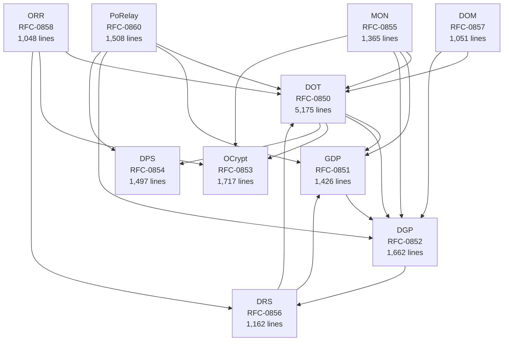
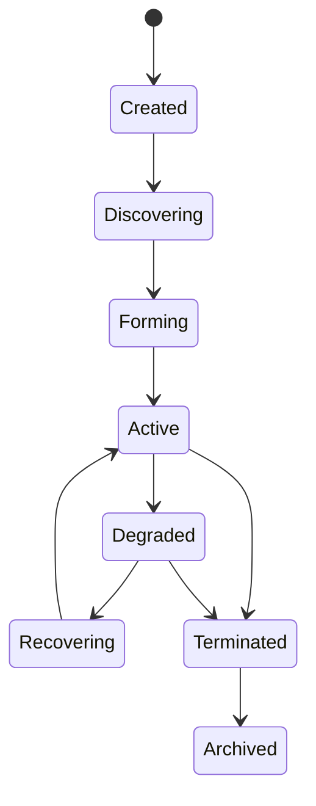

# Octo-Network Architecture

> **Version:** 1.0.0
> **Date:** 2026-05-30
> **Status:** Draft
> **Crate:** `octo-network`
> **Lines:** 17,650 across 108 source files
> **RFCs:** 0850-0860

## Table of Contents

1. [System Overview](#1-system-overview)
2. [Module Architecture](#2-module-architecture)
3. [DOT — Deterministic Overlay Transport (RFC-0850)](#3-dot--deterministic-overlay-transport)
4. [GDP — Gateway Discovery Protocol (RFC-0851)](#4-gdp--gateway-discovery-protocol)
5. [DGP — Deterministic Gossip Protocol (RFC-0852)](#5-dgp--deterministic-gossip-protocol)
6. [OCrypt — Overlay Cryptography (RFC-0853)](#6-ocrypt--overlay-cryptography)
7. [DPS — Deterministic Proof Substrate (RFC-0854)](#7-dps--deterministic-proof-substrate)
8. [MON — Mission Overlay Networks (RFC-0855)](#8-mon--mission-overlay-networks)
9. [DRS — Deterministic Route Selection (RFC-0856)](#9-drs--deterministic-route-selection)
10. [DOM — Deterministic Overlay Mempool (RFC-0857)](#10-dom--deterministic-overlay-mempool)
11. [ORR — Onion Relay Routing (RFC-0858)](#11-orr--onion-relay-routing)
12. [PCE — Proof-Carrying Envelopes (RFC-0859)](#12-pce--proof-carrying-envelopes)
13. [PoRelay — Proof-of-Relay (RFC-0860)](#13-porelay--proof-of-relay)
14. [Cross-Module Dependencies](#14-cross-module-dependencies)
15. [Key Data Types](#15-key-data-types)
16. [Platform Adapter Ecosystem](#16-platform-adapter-ecosystem)
17. [Test Architecture](#17-test-architecture)

---

## 1. System Overview

`octo-network` is the deterministic overlay networking stack for CipherOcto. It transforms existing communication platforms (Telegram, Discord, WhatsApp, etc.) into interoperable overlay relay fabrics for decentralized consensus.

```mermaid
graph TB
    subgraph Platforms["Platform Adapters (19)"]
        P1[Telegram]
        P2[Discord]
        P3[Matrix]
        P4[WhatsApp]
        P5[Bluesky]
        P6[Twitter]
        P7[Reddit]
        P8[WeChat]
        P9[DingTalk]
        P10[Lark]
        P11[QQ]
        P12[Nostr]
        P13[Signal]
        P14[IRC]
        P15[Slack]
        P16[Webhook]
        P17[Bluetooth]
        P18[LoRa]
        P19[WebRTC]
    end

    subgraph DOT["DOT (RFC-0850)"]
        D1[Envelope]
        D2[Fragmentation]
        D3[Gateway]
        D4[Adapters]
        D5[PCE]
    end

    subgraph Network["Network Layer"]
        G1[GDP - Gateway Discovery]
        G2[DGP - Gossip Protocol]
        G3[DRS - Route Selection]
        G4[DOM - Overlay Mempool]
        G5[ORR - Onion Relay]
        G6[PoRelay - Proof of Relay]
    end

    subgraph Crypto["Crypto Layer"]
        C1[OCrypt - Encryption]
        C2[DPS - Proof Substrate]
        C3[MON - Mission Networks]
    end

    Platforms --> DOT
    DOT --> Network
    DOT --> Crypto
    Network --> Crypto

    style Platforms fill:#e3f2fd
    style DOT fill:#e8f5e9
    style Network fill:#fff3e0
    style Crypto fill:#fce4ec
```



---

## 2. Module Architecture

### 2.1 Module Dependency Graph



### 2.2 Module Summary

| Module      | RFC  | Lines | Files | Purpose                                                          |
| ----------- | ---- | ----- | ----- | ---------------------------------------------------------------- |
| **DOT**     | 0850 | 5,175 | 24    | Core transport: envelopes, fragmentation, adapters, gateway      |
| **DGP**     | 0852 | 1,662 | 11    | Deterministic gossip: flood, incremental, directed, anti-entropy |
| **OCrypt**  | 0853 | 1,717 | 10    | Encryption: session handshake, onion layers, mission keys        |
| **GDP**     | 0851 | 1,426 | 10    | Gateway discovery: advertisements, heartbeat, anti-sybil         |
| **PoRelay** | 0860 | 1,508 | 12    | Proof-of-relay: bandwidth, uptime, availability, scoring         |
| **DPS**     | 0854 | 1,497 | 7     | Proof substrate: STARK/PLONK backends, recursive aggregation     |
| **MON**     | 0855 | 1,365 | 12    | Mission networks: lifecycle, membership, topology, governance    |
| **DRS**     | 0856 | 1,162 | 7     | Route selection: trust scoring, multi-path, domain routing       |
| **DOM**     | 0857 | 1,051 | 9     | Overlay mempool: intents, admission, ordering, eviction          |
| **ORR**     | 0858 | 1,048 | 5     | Onion relay: layered encryption, cover traffic, route rotation   |

---

## 3. DOT — Deterministic Overlay Transport

**RFC:** 0850 | **Lines:** 5,175 | **Files:** 24

### 3.1 Core Components

| Component     | File                  | Purpose                                            |
| ------------- | --------------------- | -------------------------------------------------- |
| `envelope.rs` | DeterministicEnvelope | Canonical envelope format with BLAKE3 hashing      |
| `fragment.rs` | EnvelopeFragment      | Self-describing fragments for platform size limits |
| `gateway.rs`  | DotGateway            | Gateway federation and multi-homing                |
| `domain.rs`   | BroadcastDomainId     | Platform-agnostic domain identification            |
| `route.rs`    | RouteComputation      | Deterministic route selection                      |
| `sequence.rs` | OverlaySequence       | Logical timestamp model                            |
| `replay.rs`   | ReplayProtection      | Envelope replay detection                          |
| `config.rs`   | DotConfig             | DOT configuration                                  |

### 3.2 Adapter Architecture


### 3.3 Envelope Structure

```rust
pub struct DeterministicEnvelope {
    pub version: u16,           // Protocol version
    pub network_id: u32,        // Network identifier
    pub message_type: u16,      // Message type discriminant
    pub envelope_id: [u8; 32],  // BLAKE3-256 of canonical fields
    pub mission_id: [u8; 32],   // Mission identifier (zero if not scoped)
    pub source_peer: [u8; 32],  // Source peer identifier
    pub origin_gateway: [u8; 32], // First gateway
    pub logical_timestamp: u64, // NOT wall-clock
    pub ttl_hops: u16,          // Max hop count
    pub payload_hash: [u8; 32], // BLAKE3-256 of payload
    pub route_trace_root: [u8; 32], // Merkle root of route
    pub flags: u64,             // Bitmask flags
    pub signature: [u8; 64],    // Ed25519 signature
}
```

### 3.4 Wire Formats

| Format           | Description                            |
| ---------------- | -------------------------------------- |
| `DOT/1/{base64}` | Base64url-encoded envelope (text mode) |
| `DOT/2/{msg_id}` | Native upload reference (media mode)   |
| `DOT/F/{base64}` | Fragment with header (fragment mode)   |

### 3.5 Platform Adapter Registry

The `AdapterRegistry` manages dynamic loading of platform adapters:

```rust
pub struct AdapterRegistry {
    adapters: BTreeMap<u16, RegistryEntry>,  // Platform type -> entry
    plugin_dirs: Vec<PathBuf>,               // Plugin directories
    plugins: Vec<AdapterPlugin>,             // Loaded plugins
}

pub struct RegistryEntry {
    pub adapter: Box<dyn PlatformAdapter>,
    pub health: AdapterHealth,
    pub capabilities: CapabilityReport,
    pub abi_version: u32,
}
```

---

## 4. GDP — Gateway Discovery Protocol

**RFC:** 0851 | **Lines:** 1,426 | **Files:** 10

### 4.1 Components

| Component          | File                 | Purpose                                                           |
| ------------------ | -------------------- | ----------------------------------------------------------------- |
| `advertisement.rs` | GatewayAdvertisement | Gateway capability announcements                                  |
| `discovery.rs`     | DiscoveryEngine      | Multi-scope discovery (Local, Regional, Mission, Global, Private) |
| `heartbeat.rs`     | HeartbeatMonitor     | Liveness monitoring                                               |
| `anti_sybil.rs`    | AntiSybilGuard       | Stake-gated discovery scopes                                      |
| `identity.rs`      | GatewayIdentity      | Gateway cryptographic identity                                    |
| `cache.rs`         | DiscoveryCache       | Deterministic cache with TTL eviction                             |

### 4.2 Discovery Scopes

| Scope    | Value  | TTL    | Min Stake   |
| -------- | ------ | ------ | ----------- |
| Local    | 0x0001 | 30s    | 0           |
| Regional | 0x0002 | 60s    | 500         |
| Mission  | 0x0003 | 5 hops | 1000        |
| Global   | 0x0004 | 300s   | 1000        |
| Private  | 0x0005 | 60s    | Invite-only |

---

## 5. DGP — Deterministic Gossip Protocol

**RFC:** 0852 | **Lines:** 1,662 | **Files:** 11

### 5.1 Propagation Modes

| Mode             | Use Case         | Description                               |
| ---------------- | ---------------- | ----------------------------------------- |
| **Flood**        | Bootstrap        | Full propagation to all peers             |
| **Incremental**  | Normal operation | Delta-only propagation                    |
| **Anti-entropy** | State healing    | Periodic full state sync                  |
| **Directed**     | Mission overlays | Targeted propagation within mission scope |

### 5.2 Key Types

```rust
pub struct GossipObject {
    pub object_type: GossipObjectType,
    pub domain_id: GossipDomainId,
    pub payload: Vec<u8>,
    pub signature: [u8; 64],
    pub timestamp: u64,
    pub ttl: u16,
}

pub struct GossipDomainId {
    pub network_id: u32,
    pub mission_id: [u8; 32],
    pub scope: GossipScope,
}
```

---

## 6. OCrypt — Overlay Cryptography

**RFC:** 0853 | **Lines:** 1,717 | **Files:** 10

### 6.1 Components

| Component        | File                | Purpose                              |
| ---------------- | ------------------- | ------------------------------------ |
| `session.rs`     | SessionHandshake    | X25519 + HKDF-BLAKE3 key exchange    |
| `envelope.rs`    | EncryptedEnvelope   | Envelope encryption with AAD         |
| `mission.rs`     | MissionKeyHierarchy | Mission-scoped key derivation        |
| `onion.rs`       | OnionLayer          | Per-hop encryption for relay routing |
| `identity.rs`    | SovereignIdentity   | Sovereign identity extension         |
| `attestation.rs` | GatewayAttestation  | Gateway attestation and key rotation |

### 6.2 Mission Key Hierarchy

```rust
pub struct MissionKeyHierarchy {
    pub mission_root_key: [u8; 32],
    pub transport_keys_root: [u8; 32],
    pub relay_keys_root: [u8; 32],
    pub execution_keys_root: [u8; 32],
}
```

---

## 7. DPS — Deterministic Proof Substrate

**RFC:** 0854 | **Lines:** 1,497 | **Files:** 7

### 7.1 Proof Backends

| Backend   | Status | Description                                                               |
| --------- | ------ | ------------------------------------------------------------------------- |
| STARK     | Spec'd | Scalable transparent arguments                                            |
| PLONK     | Spec'd | Permutations over Lagrange-bases for Oecumenical Noninteractive arguments |
| Recursive | Spec'd | Recursive proof aggregation                                               |

### 7.2 Proof Types

```rust
pub enum ProofType {
    InferenceProof = 0x0001,
    DatasetIntegrityProof = 0x0002,
    MissionExecutionProof = 0x0003,
    RelayProof = 0x0004,
    ValidatorAttestation = 0x0005,
    AggregatedProof = 0x0006,
    MembershipProof = 0x0007,
    StateTransitionProof = 0x0008,
}
```

---

## 8. MON — Mission Overlay Networks

**RFC:** 0855 | **Lines:** 1,365 | **Files:** 12

### 8.1 Mission Lifecycle



### 8.2 Mission Types

```rust
pub enum MissionType {
    AiSwarm = 0x0001,
    DataPipeline = 0x0002,
    ConsensusRound = 0x0003,
    StorageCluster = 0x0004,
    ComputeGrid = 0x0005,
    Custom = 0xFFFF,
}
```

### 8.3 Membership Roles

| Role        | Value | Description           |
| ----------- | ----- | --------------------- |
| Coordinator | 0x01  | Mission orchestrator  |
| Executor    | 0x02  | Task executor         |
| Validator   | 0x03  | Result validator      |
| Observer    | 0x04  | Read-only participant |
| Relay       | 0x05  | Message relay         |

---

## 9. DRS — Deterministic Route Selection

**RFC:** 0856 | **Lines:** 1,162 | **Files:** 7

### 9.1 Trust Score Components

```rust
pub struct TrustScore {
    pub historical_uptime: u64,
    pub proof_of_relay: u64,
    pub stake_weight: u64,
    pub mission_trust: u64,
    pub consensus_participation: u64,
}
```

### 9.2 Route Scoring

Routes are scored using weighted trust components. The scoring function is deterministic — given identical inputs, all nodes compute identical route rankings.

---

## 10. DOM — Deterministic Overlay Mempool

**RFC:** 0857 | **Lines:** 1,051 | **Files:** 9

### 10.1 Intent Types

| Type            | Value  | Class           | Description         |
| --------------- | ------ | --------------- | ------------------- |
| StateUpdate     | 0x0001 | Standard        | State update intent |
| MissionCommand  | 0x0002 | MissionCritical | Mission command     |
| ConsensusVote   | 0x0003 | Consensus       | Consensus vote      |
| DataRequest     | 0x0004 | Standard        | Data request        |
| ProofSubmission | 0x0005 | MissionCritical | Proof submission    |

### 10.2 Admission Pipeline


---

## 11. ORR — Onion Relay Routing

**RFC:** 0858 | **Lines:** 1,048 | **Files:** 5

### 11.1 Onion Layer Structure

```rust
pub struct OnionHop {
    pub relay_id: [u8; 32],
    pub ephemeral_public: [u8; 32],
    pub encrypted_payload: Vec<u8>,
}
```

### 11.2 Privacy Properties

- **Per-relay knowledge isolation**: Each relay only knows previous and next hop
- **Forward secrecy**: Ephemeral keys per route
- **Cover traffic**: Dummy packets to prevent traffic analysis
- **Route rotation**: Periodic route changes

---

## 12. PCE — Proof-Carrying Envelopes

**RFC:** 0859 | **Lines:** (under DOT) | **Files:** 7

### 12.1 Proof-Carrying Envelope

```rust
pub struct ProofCarryingEnvelope {
    pub envelope: DeterministicEnvelope,
    pub proof_type: ProofType,
    pub proof_system: ProofSystemId,
    pub proof_data: Vec<u8>,
    pub public_inputs: Vec<u8>,
    pub verification_key: Vec<u8>,
}
```

### 12.2 Mission Proof Policy

```rust
pub struct MissionProofPolicy {
    pub mission_id: [u8; 32],
    pub required_proof_types: Vec<ProofType>,
    pub allowed_proof_systems: Vec<ProofSystemId>,
    pub min_security_level: u8,
    pub require_aggregation: bool,
    pub max_proof_age: u64,
}
```

---

## 13. PoRelay — Proof-of-Relay

**RFC:** 0860 | **Lines:** 1,508 | **Files:** 12

### 13.1 Relay Metrics

| Metric       | Component         | Description                 |
| ------------ | ----------------- | --------------------------- |
| Bandwidth    | `bandwidth.rs`    | Data throughput measurement |
| Uptime       | `uptime.rs`       | Availability tracking       |
| Availability | `availability.rs` | Response rate               |
| Latency      | `score.rs`        | Response time               |
| Forwarding   | `forwarding.rs`   | Message forwarding rate     |

### 13.2 Trust Registry

```rust
pub struct RelayTrustEntry {
    pub relay_id: [u8; 32],
    pub trust_score: u64,
    pub bandwidth_class: BandwidthClass,
    pub uptime_pct: u8,
    pub last_attestation: u64,
    pub sybil_resistance: SybilResistance,
}
```

---

## 14. Cross-Module Dependencies

### 14.1 Dependency Matrix

| Module  | DOT | GDP | DGP | OCrypt | DPS | MON | DRS | DOM | ORR | PoRelay |
| ------- | --- | --- | --- | ------ | --- | --- | --- | --- | --- | ------- |
| DOT     | —   | ✓   | ✓   | ✓      | ✓   |     |     |     |     |         |
| GDP     |     | —   | ✓   |        |     |     |     |     |     |         |
| DGP     |     |     | —   |        |     |     |     |     |     |         |
| OCrypt  |     |     |     | —      |     |     |     |     |     |         |
| DPS     |     |     |     |        | —   |     |     |     |     |         |
| MON     | ✓   | ✓   | ✓   | ✓      |     | —   |     |     |     |         |
| DRS     | ✓   | ✓   |     |        |     |     | —   |     |     |         |
| DOM     | ✓   |     | ✓   |        |     |     |     | —   |     |         |
| ORR     | ✓   |     |     | ✓      |     |     | ✓   |     | —   |         |
| PoRelay | ✓   | ✓   | ✓   |        | ✓   |     |     |     |     | —       |

### 14.2 Shared Types

All modules share these core types from `octo-core`:

- `[u8; 32]` — BLAKE3-256 hashes
- `[u8; 64]` — Ed25519 signatures
- `u64` — Logical timestamps (NOT wall-clock)
- `u16` — Platform type discriminants

---

## 15. Key Data Types

### 15.1 Platform Types (20 total)

| ID     | Platform  | Max Payload   | Fragment | Media |
| ------ | --------- | ------------- | -------- | ----- |
| 0x0001 | Telegram  | 4096B         | Yes      | Yes   |
| 0x0002 | Discord   | 2000B         | Yes      | Yes   |
| 0x0003 | Matrix    | 65536B        | Yes      | Yes   |
| 0x0004 | Nostr     | 65536B        | No       | No    |
| 0x0005 | Signal    | 65536B        | No       | No    |
| 0x0006 | IRC       | 512B          | Yes      | No    |
| 0x0007 | Slack     | 40000B        | Yes      | No    |
| 0x0008 | WhatsApp  | 65536B        | No       | No    |
| 0x0009 | Webhook   | Unlimited     | No       | No    |
| 0x000A | NativeP2P | Unlimited     | Yes      | No    |
| 0x000B | Bluetooth | 512B          | No       | No    |
| 0x000C | LoRa      | 256B          | Yes      | No    |
| 0x000D | WebRTC    | 65536B        | No       | No    |
| 0x000E | Bluesky   | 300 graphemes | Yes      | Yes   |
| 0x000F | Twitter   | 280 chars     | Yes      | Yes   |
| 0x0010 | Reddit    | 10000 chars   | No       | Yes   |
| 0x0011 | WeChat    | 2048 chars    | Yes      | Yes   |
| 0x0012 | DingTalk  | 20000 chars   | No       | No    |
| 0x0013 | Lark      | 30000 chars   | No       | Yes   |
| 0x0014 | QQ        | 2000 chars    | Yes      | Yes   |

---

## 16. Platform Adapter Ecosystem

### 16.1 Adapter Crates

| Crate                    | Platform  | Lines | Tests | Status      |
| ------------------------ | --------- | ----- | ----- | ----------- |
| `octo-adapter-telegram`  | Telegram  | 619   | 9     | Implemented |
| `octo-adapter-discord`   | Discord   | 472   | 9     | Implemented |
| `octo-adapter-matrix`    | Matrix    | 617   | 11    | Implemented |
| `octo-adapter-whatsapp`  | WhatsApp  | 1,746 | 13    | Implemented |
| `octo-adapter-bluesky`   | Bluesky   | 453   | 11    | Implemented |
| `octo-adapter-twitter`   | Twitter   | 387   | 10    | Implemented |
| `octo-adapter-reddit`    | Reddit    | 443   | 10    | Implemented |
| `octo-adapter-wechat`    | WeChat    | 365   | 8     | Implemented |
| `octo-adapter-dingtalk`  | DingTalk  | 401   | 11    | Implemented |
| `octo-adapter-lark`      | Lark      | 385   | 9     | Implemented |
| `octo-adapter-qq`        | QQ        | 366   | 9     | Implemented |
| `octo-adapter-nostr`     | Nostr     | 634   | 13    | Implemented |
| `octo-adapter-signal`    | Signal    | 423   | 8     | Implemented |
| `octo-adapter-irc`       | IRC       | 728   | 24    | Implemented |
| `octo-adapter-slack`     | Slack     | 265   | 13    | Implemented |
| `octo-adapter-webhook`   | Webhook   | 473   | 14    | Implemented |
| `octo-adapter-bluetooth` | Bluetooth | 433   | 11    | Implemented |
| `octo-adapter-lora`      | LoRa      | 531   | 16    | Implemented |
| `octo-adapter-webrtc`    | WebRTC    | 320   | 7     | Implemented |

### 16.2 Media Capability vs Implementation

| Platform  | Capability | upload_media | download_media | API                                  |
| --------- | ---------- | ------------ | -------------- | ------------------------------------ |
| Telegram  | ✅ Yes     | ✅ Done      | ✅ Done        | Bot API sendDocument/getFile         |
| Discord   | ✅ Yes     | ✅ Done      | ✅ Done        | Webhook multipart + attachment URLs  |
| Matrix    | ✅ Yes     | ✅ Done      | ✅ Done        | Matrix Media API                     |
| Bluesky   | ✅ Yes     | ✅ Done      | ✅ Done        | AT Protocol blob upload/sync.getBlob |
| Twitter   | ✅ Yes     | ✅ Done      | ✅ Done        | media/upload.json + pbs.twimg.com    |
| Lark      | ✅ Yes     | ✅ Done      | ✅ Done        | Lark image upload/download API       |
| Reddit    | ✅ Yes     | ✅ Done      | ✅ Done        | Reddit media/asset API               |
| WeChat    | ✅ Yes     | ✅ Done      | ✅ Done        | Official Account media API           |
| QQ        | ✅ Yes     | ✅ Done      | ✅ Done        | QQ Bot file upload                   |
| WhatsApp  | ❌ No      | Default      | Default        | Text only                            |
| Signal    | ❌ No      | Default      | Default        | Text only                            |
| IRC       | ❌ No      | Default      | Default        | Text only                            |
| Slack     | ❌ No      | Default      | Default        | Text only                            |
| Webhook   | ❌ No      | Default      | Default        | Stateless                            |
| Bluetooth | ❌ No      | Default      | Default        | BLE only                             |
| LoRa      | ❌ No      | Default      | Default        | Radio only                           |
| WebRTC    | ❌ No      | Default      | Default        | DataChannel only                     |

---

## 17. Test Architecture

### 17.1 Test Layers

| Layer             | Description        | Coverage                                  |
| ----------------- | ------------------ | ----------------------------------------- |
| Unit tests        | Per-module tests   | 582+ tests                                |
| Integration tests | Cross-module tests | Envelope roundtrip, fragmentation, gossip |
| Platform tests    | Per-adapter tests  | Config, encode/decode, capabilities       |

### 17.2 Test Count by Module

| Module     | Tests   |
| ---------- | ------- |
| DOT (core) | 200+    |
| DGP        | 50+     |
| GDP        | 40+     |
| OCrypt     | 60+     |
| DPS        | 30+     |
| MON        | 40+     |
| DRS        | 30+     |
| DOM        | 20+     |
| ORR        | 25+     |
| PoRelay    | 30+     |
| Adapters   | 206     |
| **Total**  | **788** |
