# Quota Router Architecture

> **Version:** 1.0.0
> **Date:** 2026-05-20
> **Status:** Revised (Round 3 — post adversarial review)
> **Crates:** `quota-router-core`, `quota-router-pyo3`

## Table of Contents

1. [System Overview](#1-system-overview)
2. [Crate Architecture](#2-crate-architecture)
3. [Dual-Mode Architecture](#3-dual-mode-architecture)
4. [Request Flow](#4-request-flow)
5. [Provider System](#5-provider-system)
6. [Module Architecture](#6-module-architecture)
7. [Data Types](#7-data-types)
8. [Error Handling](#8-error-handling)
9. [Configuration](#9-configuration)
10. [Deployment and Mode Selection](#10-deployment-and-mode-selection)
11. [Test Architecture](#11-test-architecture)

---

## 1. System Overview

Quota Router is a Rust-based AI API gateway that provides a unified interface for
routing requests to 44 LLM providers. It exposes two interfaces — an HTTP proxy
and a Python SDK — both available regardless of runtime mode (litellm or any-llm).

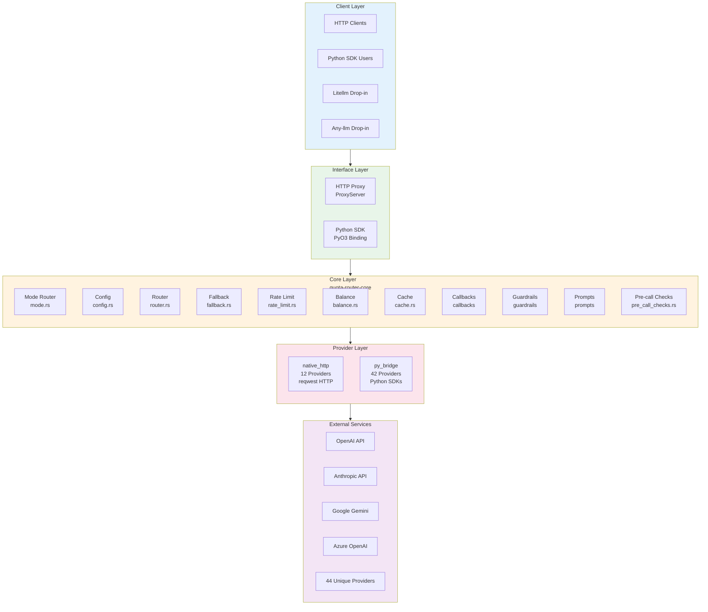

---

## 2. Crate Architecture

The project is split into two Rust crates with a clear dependency hierarchy:

```mermaid
graph LR
    subgraph PyO3["quota-router-pyo3"]
        direction TB
        L1[lib.rs<br/>Module Registration]
        L2[completion.rs<br/>Completion Functions]
        L3[router.rs<br/>Router Class]
        L4[exceptions.rs<br/>Python Exceptions]
        L5[model.rs<br/>Model Parsing]
        L6[batch.rs<br/>Batch Functions]
        L7[providers/<br/>Provider Wrappers]
        L8[types.rs<br/>Python Types]
        L9[sdk.rs<br/>SDK Utilities]
        L10[streaming.rs<br/>Streaming Support]
    end

    subgraph Core["quota-router-core"]
        direction TB
        C1[proxy.rs<br/>HTTP Proxy Server]
        C2[mode.rs<br/>Mode Router]
        C3[native_http/<br/>12 HTTP Providers]
        C4[py_bridge/<br/>42 Python Providers]
        C5[router.rs<br/>Routing Logic]
        C6[fallback.rs<br/>Fallback & Health]
        C7[config.rs<br/>Configuration]
        C8[shared_types.rs<br/>Shared Data Types]
    end

    PyO3 -->|depends on| Core

    style PyO3 fill:#e3f2fd
    style Core fill:#e8f5e9
```

### 2.1 Crate Responsibilities

| Crate | Purpose | Dependencies |
|-------|---------|--------------|
| `quota-router-core` | Core business logic, proxy server, provider implementations | tokio, reqwest, serde, pyo3 (optional) |
| `quota-router-pyo3` | Python SDK binding via PyO3 | quota-router-core, pyo3 |

### 2.2 Feature Gates

**Source:** `crates/quota-router-core/src/lib.rs` lines 18-85

27 modules are **always compiled** (no feature gate), including: admin, auth, balance, cache, callbacks, config, fallback, guardrails, health, key_rate_limiter, keys, logging, metrics, middleware, mode, pre_call_checks, pricing, prompts, providers, proxy, rate_limit, router, schema, secret_manager, storage, tracing, shared_types.

Feature-gated modules:
- `native_http` — `#[cfg(any(feature = "litellm-mode", feature = "full"))]` (line 47-48)
- `py_bridge` — `#[cfg(any(feature = "any-llm-mode", feature = "full"))]` (line 60-61)
- `python_sdk_entry` — `#[cfg(any(feature = "any-llm-mode", feature = "full"))]` (line 73-74)
- `model` + `types` — `#[cfg(any(feature = "any-llm-mode", feature = "full"))]` (lines 80-85)

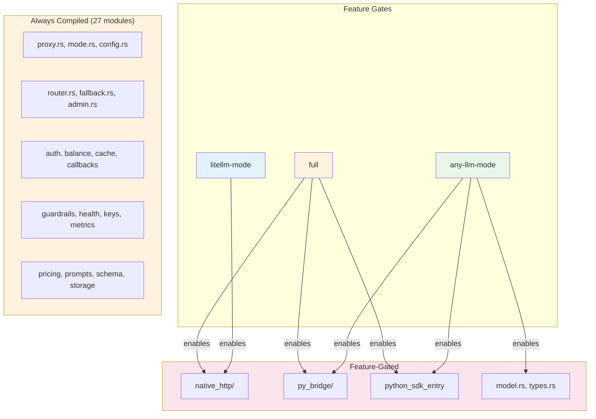

---

## 3. Dual-Mode Architecture

The mode gate controls HOW providers are called, not WHETHER an interface exists.
The HTTP proxy is always compiled. The Python SDK (`python_sdk_entry`) requires
`any-llm-mode` or `full` feature gates — in practice, `quota-router-pyo3` always
compiles with `full`, so both interfaces are available in the pip-installed package.


### 3.1 Mode Selection

| Mode | Backend | Default | Use Case |
|------|---------|---------|----------|
| `litellm` | reqwest (native HTTP) | Yes (when both compiled) | Fast, no Python dependency |
| `any-llm` | PyO3 → Python SDKs | No | Full SDK compatibility |

**Mode selection in Python SDK:**
```python
import quota_router as qr

# Default mode (litellm - reqwest)
qr.completion(model="openai/gpt-4", messages=[...])

# Explicit mode selection
qr.completion(model="openai/gpt-4", messages=[...], _mode="litellm")
qr.completion(model="openai/gpt-4", messages=[...], _mode="any-llm")
```

---

## 4. Request Flow

### 4.1 HTTP Proxy Path (litellm-mode)

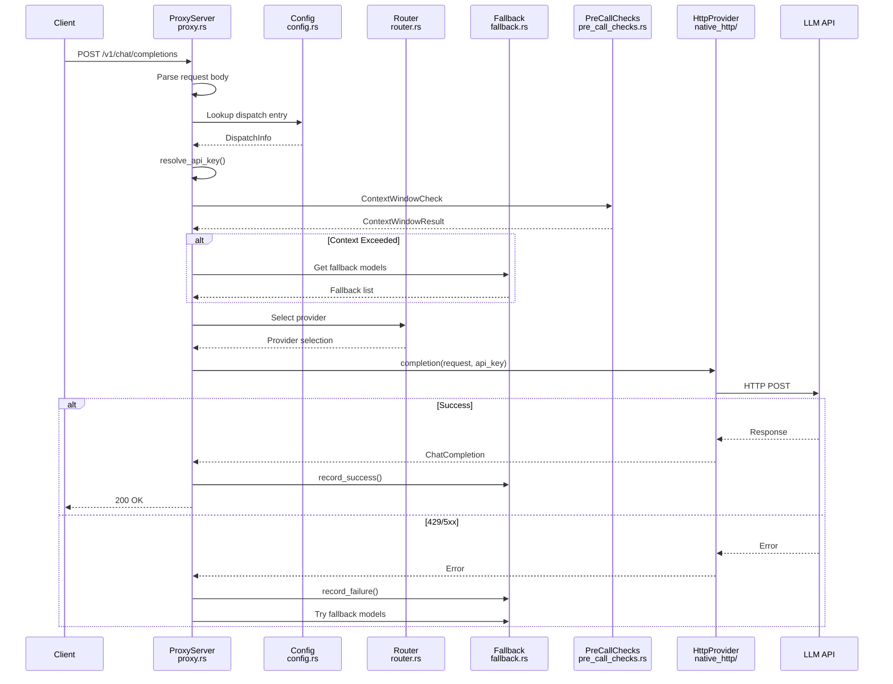

### 4.2 Python SDK Path (litellm-mode)

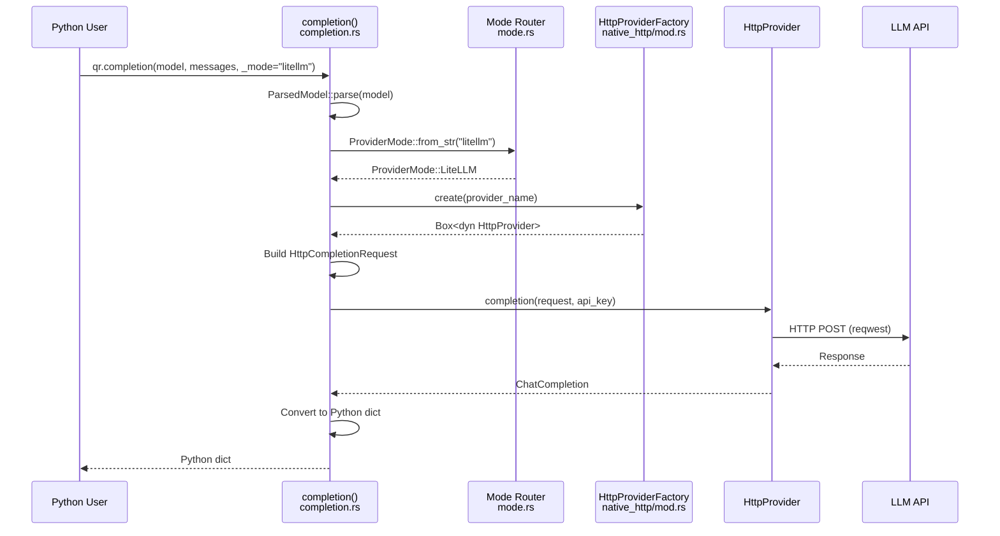

### 4.3 Python SDK Path (any-llm-mode)

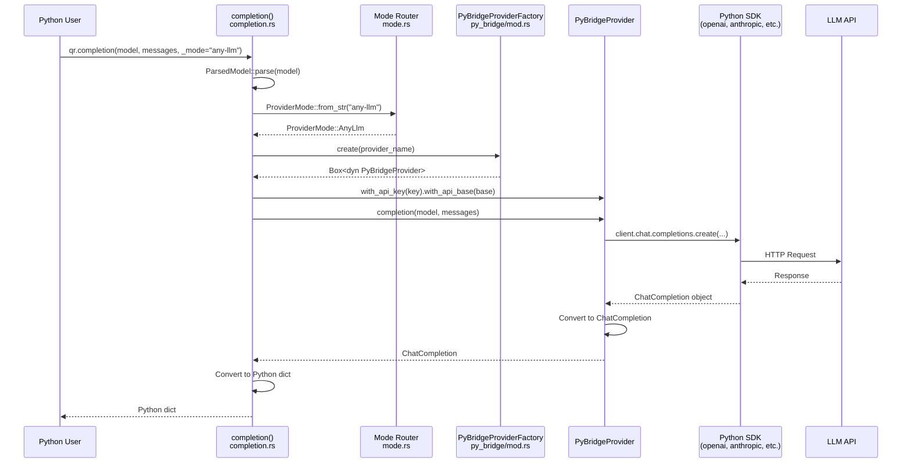

---

## 5. Provider System

### 5.1 Provider Architecture

```mermaid
graph TB
    subgraph Trait["Provider Trait Hierarchy"]
        T1["HttpProvider Trait<br/>(native_http)"]
        T2["PyBridgeProvider Trait<br/>(py_bridge)"]
    end

    subgraph NativeHTTP["native_http/ Providers<br/>(12 providers, reqwest)"]
        direction TB
        N1[openai.rs]
        N2[anthropic.rs]
        N3[mistral.rs]
        N4[groq.rs]
        N5[together.rs]
        N6[azure.rs]
        N7[databricks.rs]
        N8[perplexity.rs]
        N9[ollama.rs]
        N10[bedrock.rs]
        N11[gemini.rs]
        N12[replicate.rs]
    end

    subgraph PyBridge["py_bridge/ Providers<br/>(42 providers, Python SDKs)"]
        direction TB
        P1[openai.rs]
        P2[anthropic.rs]
        P3[mistral.rs, mistral_large.rs]
        P4[cohere.rs]
        P5[groq.rs]
        P6[gemini.rs]
        P7[bedrock.rs]
        P8[vertexai.rs]
        P9[34 more...]
    end

    subgraph Factory["Factory Pattern"]
        F1["HttpProviderFactory::create()"]
        F2["PyBridgeProviderFactory::create()"]
    end

    T1 --> NativeHTTP
    T2 --> PyBridge

    F1 --> T1
    F2 --> T2

    style Trait fill:#fff3e0
    style NativeHTTP fill:#e8f5e9
    style PyBridge fill:#e3f2fd
    style Factory fill:#fce4ec
```

### 5.2 HttpProvider Trait

**Source:** `crates/quota-router-core/src/native_http/mod.rs` lines 140-290

```rust
#[async_trait]
pub trait HttpProvider: Send + Sync {
    fn name(&self) -> &str;
    fn supported_models(&self) -> Vec<&str>;
    fn supports_model(&self, model: &str) -> bool { /* default */ }
    fn supports_streaming(&self) -> bool { false } // default

    async fn completion(
        &self,
        request: &HttpCompletionRequest,
        api_key: Option<&str>,
    ) -> Result<HttpCompletionResponse, ProviderError>;

    // Default: returns UnsupportedModel error
    async fn streaming_completion(
        &self,
        request: &HttpCompletionRequest,
        api_key: Option<&str>,
    ) -> Result<StreamingResponse, ProviderError>;

    async fn embedding(
        &self,
        request: &HttpEmbeddingRequest,
        api_key: Option<&str>,
    ) -> Result<HttpEmbeddingResponse, ProviderError>;

    // OpenAI Responses API (default: UnsupportedModel)
    async fn get_response(&self, ...) -> Result<HttpResponseObject, ProviderError>;
    async fn delete_response(&self, ...) -> Result<HttpDeletedObject, ProviderError>;
    async fn create_response(&self, ...) -> Result<HttpResponseObject, ProviderError>;

    // OpenAI Batch API (default: UnsupportedModel)
    async fn batch_create(&self, ...) -> Result<HttpBatchObject, ProviderError>;
    async fn batch_retrieve(&self, ...) -> Result<HttpBatchObject, ProviderError>;
    async fn batch_cancel(&self, ...) -> Result<HttpBatchObject, ProviderError>;
    async fn batch_list(&self, ...) -> Result<HttpBatchListResponse, ProviderError>;
    async fn batch_results(&self, ...) -> Result<HttpBatchResultsResponse, ProviderError>;

    // Model listing (default: UnsupportedModel)
    async fn list_models(&self, ...) -> Result<HttpListModelsResponse, ProviderError>;

    fn routing_weight(&self) -> u32 { 1 } // default
}
```

### 5.3 PyBridgeProvider Trait

**Source:** `crates/quota-router-core/src/py_bridge/openai.rs` lines 235-262

```rust
pub trait PyBridgeProvider: Send + Sync + 'static {
    fn name(&self) -> &str;

    fn completion(
        &self,
        model: &str,
        messages: &[crate::types::Message],
    ) -> Result<crate::types::ChatCompletion, PyBridgeError>;

    // Default: returns "Streaming not supported" error
    fn streaming_completion(
        &self,
        model: &str,
        messages: &[crate::types::Message],
    ) -> Result<tokio::sync::mpsc::Receiver<Result<PyBridgeChunk, PyBridgeError>>, PyBridgeError>;

    fn with_api_key(self: Box<Self>, key: String) -> Box<dyn PyBridgeProvider>;
    fn with_api_base(self: Box<Self>, base: String) -> Box<dyn PyBridgeProvider>;
}
```

### 5.4 Shared Request/Response Types

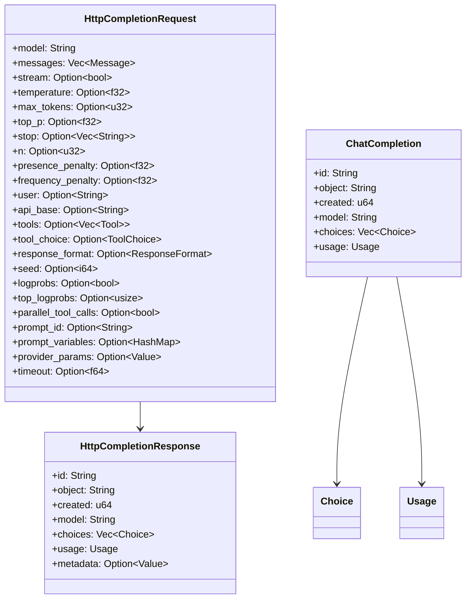

---

## 6. Module Architecture

### 6.1 Core Module Dependency Graph


### 6.2 Module Descriptions

| Module | File | Purpose |
|--------|------|---------|
| **admin** | `admin.rs` | Admin API endpoints |
| **auth** | `auth/` | Authentication (API keys, SSO, JWT) |
| **balance** | `balance.rs` | Balance tracking for OCTO-W budgets |
| **cache** | `cache.rs` | Response caching |
| **callbacks** | `callbacks/` | Event hooks for logging, metrics |
| **config** | `config.rs` | Configuration loading, dispatch map, model groups |
| **fallback** | `fallback.rs` | Fallback chains, health tracking, circuit breaking |
| **guardrails** | `guardrails/` | Content filtering, safety checks |
| **health** | `health.rs` | Health check endpoints |
| **key_rate_limiter** | `key_rate_limiter.rs` | Per-key rate limiting |
| **keys** | `keys/` | Virtual API key management |
| **logging** | `logging.rs` | Structured logging setup |
| **metrics** | `metrics.rs` | Prometheus metrics collection |
| **middleware** | `middleware.rs` | HTTP middleware (auth, logging, rate limit) |
| **mode** | `mode.rs` | Mode selection (litellm vs any-llm), default mode |
| **model** | `model.rs` | Model parsing and validation (any-llm-mode/full only) |
| **pre_call_checks** | `pre_call_checks.rs` | Context window validation, pre-flight checks |
| **pricing** | `pricing.rs` | Cost calculation, budget tracking |
| **prompts** | `prompts/` | Prompt template management |
| **providers** | `providers.rs` | Provider registry and trait definitions |
| **proxy** | `proxy.rs` | HTTP proxy server, request handling, endpoint routing |
| **py_bridge** | `py_bridge/` | 42 providers using Python SDKs |
| **python_sdk_entry** | `python_sdk_entry/` | Python SDK entry point (PyO3 module) |
| **rate_limit** | `rate_limit.rs` | Rate limiting per provider/model |
| **router** | `router.rs` | Provider routing strategies, load balancing |
| **schema** | `schema.rs` | JSON schema validation |
| **secret_manager** | `secret_manager.rs` | Secret storage and retrieval |
| **shared_types** | `shared_types.rs` | Types shared between crates (Message, Choice, Usage) |
| **storage** | `storage.rs` | Storage trait, persistence abstraction |
| **tracing** | `tracing.rs` | Distributed tracing setup |
| **types** | `types.rs` | Per-crate types (ChatCompletion, etc.) (any-llm-mode/full only) |
| **native_http** | `native_http/` | 12 providers using reqwest HTTP |

---

## 7. Data Types

### 7.1 Type Hierarchy

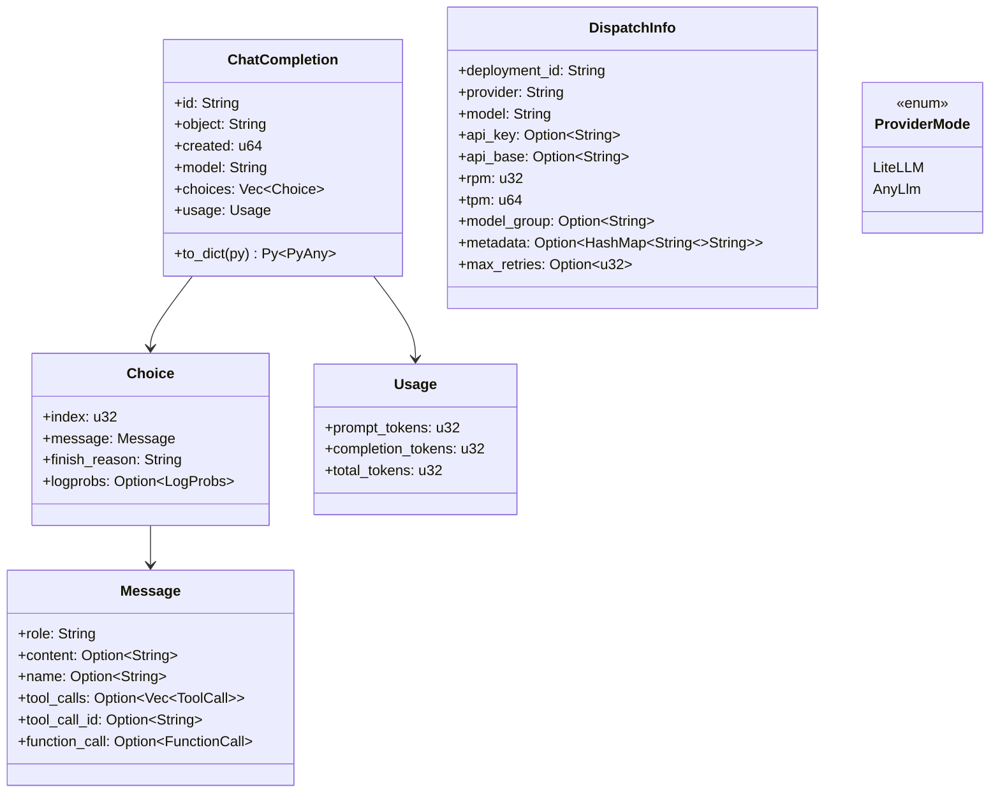

### 7.2 Shared Types vs Crate-Specific Types

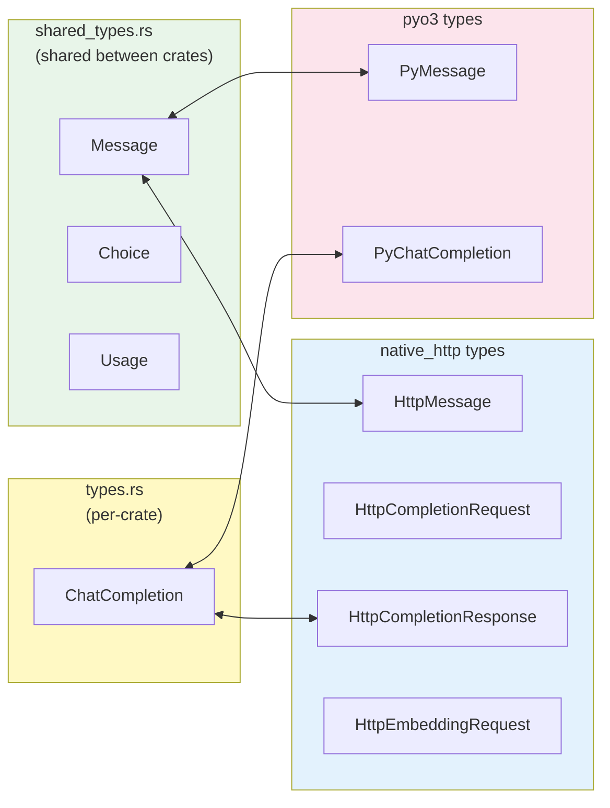

---

## 8. Error Handling

### 8.1 Error Hierarchy

```mermaid
classDiagram
    class QuotaRouterError {
        <<Python Exception>>
        +message: String
        +llm_provider: Option~String~
    }

    class AuthenticationError {
        <<401>>
    }

    class RateLimitError {
        <<429>>
        +retry_after: Option~String~
    }

    class InvalidRequestError {
        <<400>>
    }

    class ProviderError {
        <<500>>
    }

    class ModelNotFoundError {
        <<404>>
    }

    class ContextLengthExceededError {
        <<Context>>
    }

    class ContentFilterError {
        <<Safety>>
    }

    class MissingApiKeyError {
        <<Auth>>
    }

    class UnsupportedProviderError {
        <<Config>>
    }

    class UnsupportedParameterError {
        <<Config>>
    }

    class InsufficientFundsError {
        <<Budget>>
    }

    class UpstreamProviderError {
        <<502>>
    }

    class GatewayTimeoutError {
        <<504>>
    }

    class LengthFinishReasonError {
        <<Finish>>
    }

    class ContentFilterFinishReasonError {
        <<Finish>>
    }

    class BatchNotCompleteError {
        <<Batch>>
    }

    class AllModelsFailedError {
        <<Router>>
    }

    class BatchPartialFailureError {
        <<Batch>>
    }

    QuotaRouterError <|-- AuthenticationError
    QuotaRouterError <|-- RateLimitError
    QuotaRouterError <|-- InvalidRequestError
    QuotaRouterError <|-- ProviderError
    QuotaRouterError <|-- ModelNotFoundError
    QuotaRouterError <|-- ContextLengthExceededError
    QuotaRouterError <|-- ContentFilterError
    QuotaRouterError <|-- MissingApiKeyError
    QuotaRouterError <|-- UnsupportedProviderError
    QuotaRouterError <|-- UnsupportedParameterError
    QuotaRouterError <|-- InsufficientFundsError
    QuotaRouterError <|-- UpstreamProviderError
    QuotaRouterError <|-- GatewayTimeoutError
    QuotaRouterError <|-- LengthFinishReasonError
    QuotaRouterError <|-- ContentFilterFinishReasonError
    QuotaRouterError <|-- BatchNotCompleteError
    QuotaRouterError <|-- AllModelsFailedError
    QuotaRouterError <|-- BatchPartialFailureError
```

### 8.2 Error Mapping

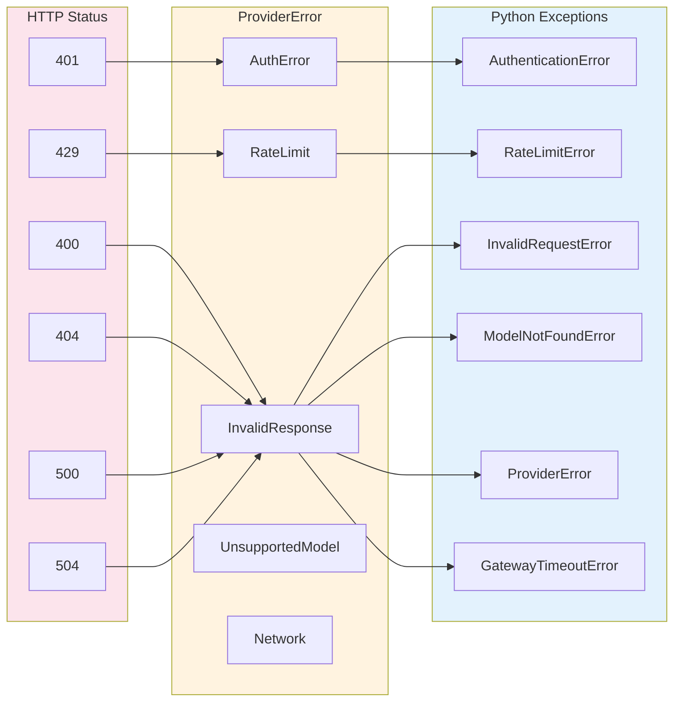

### 8.3 Dual QuotaRouterError

There are two distinct `QuotaRouterError` types in the codebase:

1. **PyO3 Python exception** (`crates/quota-router-pyo3/src/exceptions.rs`) — the hierarchy shown above, used for Python-facing errors
2. **Rust `thiserror` enum** (`crates/quota-router-core/src/keys/errors.rs`) — wraps domain-specific Rust errors (`KeyError`, `BudgetError`, `RouterError`, `RegistryError`, `StorageError`, `ProviderError`)

These are separate types with different variant sets. The PyO3 hierarchy is what Python users interact with; the `thiserror` enum is used internally by the Rust core.

### 8.4 LiteLLM-Compatible Aliases

| Quota Router Name | LiteLLM/AnyLLM Alias |
|-------------------|---------------|
| `InsufficientFundsError` | `BudgetExceededError` |
| `UpstreamProviderError` | `ServiceUnavailableError` |
| `GatewayTimeoutError` | `APIConnectionError`, `Timeout` |
| `QuotaRouterError` | `APIError`, `AnyLLMError` |
| `ModelNotFoundError` | `NotFoundError` |
| `ContextLengthExceededError` | `ContextWindowExceededError` |
| `ContentFilterError` | `ContentPolicyViolationError` |

---

## 9. Configuration

### 9.1 Configuration Hierarchy

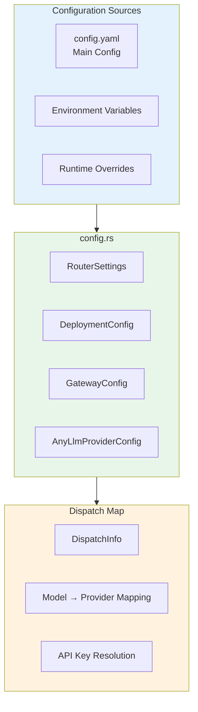

### 9.2 Dispatch Flow

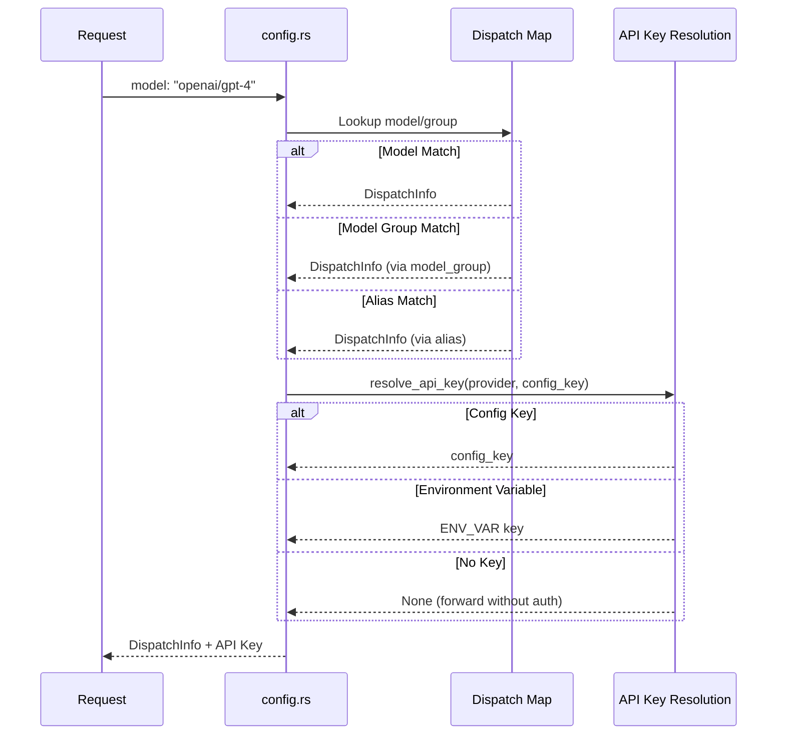

---

## 10. Deployment and Mode Selection

Three feature gates produce three build configurations. Both deployments (binary and pip) can be built with any of the three — the choice determines which interfaces and provider backends are included.

**Important:** Deployment (binary vs pip) and runtime mode (litellm vs any-llm) are
**orthogonal** to the interfaces exposed. Both deployments expose BOTH interfaces
(HTTP proxy + library/binding call). The mode gate controls the **provider integration
backend** (reqwest vs PyO3), not the available interfaces.

### 10.1 Feature Gate Matrix (verified against lib.rs)

| Feature Gate | `proxy` (HTTP) | `python_sdk_entry` (SDK) | `native_http` (reqwest) | `py_bridge` (PyO3) |
|--------------|----------------|--------------------------|-------------------------|---------------------|
| `litellm-mode` | ✅ | ❌ | ✅ | ❌ |
| `any-llm-mode` | ✅ | ✅ | ❌ | ✅ |
| `full` | ✅ | ✅ | ✅ | ✅ |

**Source:** `crates/quota-router-core/src/lib.rs` lines 32-85

- `proxy` — no feature gate, always compiled (line 37)
- `native_http` — `#[cfg(any(feature = "litellm-mode", feature = "full"))]` (line 47)
- `py_bridge` — `#[cfg(any(feature = "any-llm-mode", feature = "full"))]` (line 60)
- `python_sdk_entry` — `#[cfg(any(feature = "any-llm-mode", feature = "full"))]` (line 73)

### 10.2 Build Configurations

Each feature gate produces a distinct build with specific interfaces and providers:

```mermaid
graph TB
    subgraph Litellm["litellm-mode Build"]
        direction TB
        L1[HTTP Proxy<br/>Always Available]
        L2[native_http<br/>12 reqwest Providers]
        L3[Mode Router<br/>lite-only]
        style Litellm fill:#e8f5e9
    end

    subgraph AnyLlm["any-llm-mode Build"]
        direction TB
        A1[HTTP Proxy<br/>Always Available]
        A2[Python SDK<br/>python_sdk_entry]
        A3[py_bridge<br/>42 PyO3 Providers]
        A4[Mode Router<br/>any-only]
        style AnyLlm fill:#e3f2fd
    end

    subgraph Full["full Build"]
        direction TB
        F1[HTTP Proxy]
        F2[Python SDK]
        F3[native_http<br/>12 reqwest Providers]
        F4[py_bridge<br/>42 PyO3 Providers]
        F5[Mode Router<br/>switches at runtime]
        style Full fill:#fff3e0
    end
```

#### Build Configuration Summary

| Build | HTTP Proxy | Python SDK | reqwest Providers | PyO3 Providers | Mode Selection |
|-------|-----------|------------|-------------------|----------------|----------------|
| `litellm-mode` | ✅ | ❌ | 12 | ❌ | Fixed at compile time |
| `any-llm-mode` | ✅ | ✅ | ❌ | 42 | Fixed at compile time |
| `full` | ✅ | ✅ | 12 | 42 | **Runtime switchable** |

**Key point:** The mode gate controls which provider backend is available, not which interfaces. The `litellm-mode` build still has HTTP proxy + library interface; `any-llm-mode` build still has HTTP proxy + library interface. Only the provider backends differ (12 reqwest vs 42 PyO3).

### 10.3 Runtime Mode Selection

When compiled with `full`, the mode router selects which provider backend
is used. The mode does NOT change which interfaces are available — those
are determined at compile time by feature gates.

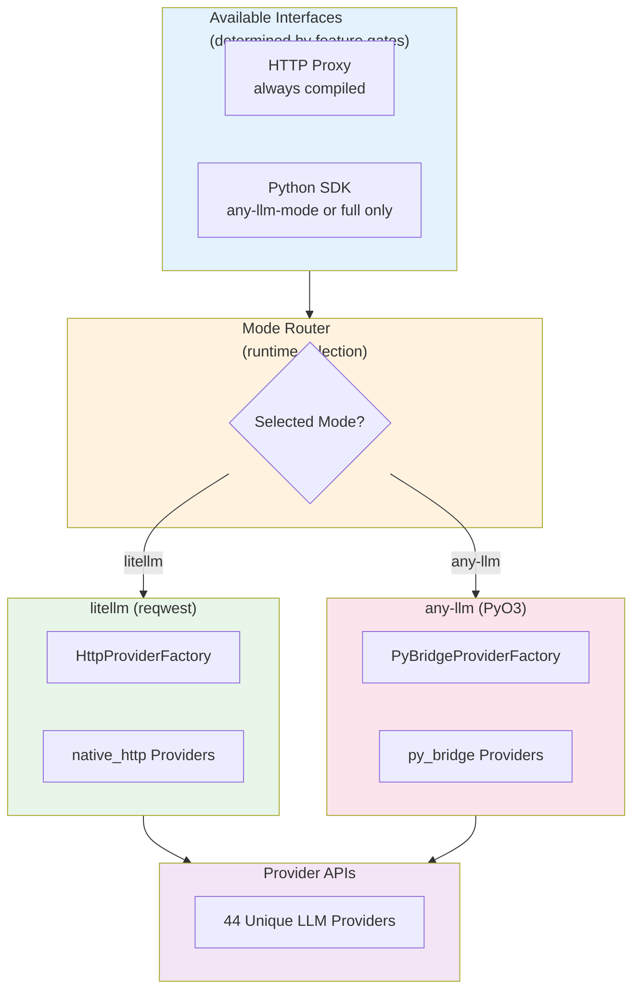

---

## 11. Test Architecture

### 11.1 Test Layers

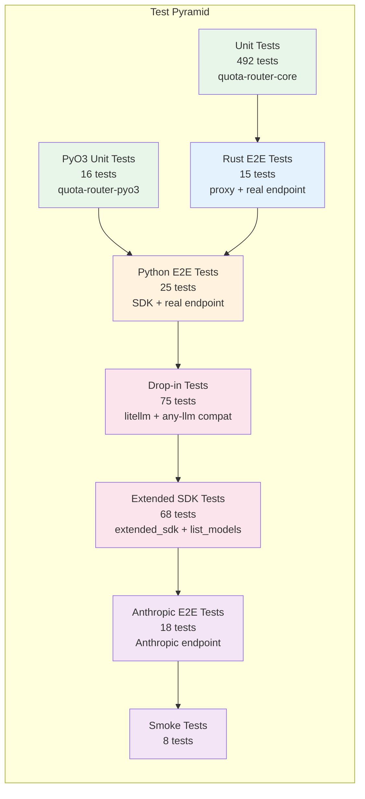

### 11.2 Test Coverage

| Test Type | Count | Coverage |
|-----------|-------|----------|
| Unit tests (core) | 492 | All modules (445 `#[test]` + 47 `#[tokio::test]`) |
| PyO3 unit tests | 16 | quota-router-pyo3 bindings |
| Rust E2E (proxy) | 15 | OpenAI endpoint via proxy |
| Python E2E (SDK) | 25 | OpenAI endpoint via SDK |
| Drop-in litellm | 35 | litellm compatibility |
| Drop-in any-llm | 40 | any-llm compatibility |
| Extended SDK | 38 | Extended SDK functions |
| List models | 30 | Model listing via SDK |
| Anthropic E2E | 18 | Anthropic endpoint (both modes) |
| Smoke tests | 8 | Basic integration checks |
| **Total** | **717** | |

### 11.3 Test Endpoints

| Endpoint | Auth | Used By |
|----------|------|---------|
| `opengateway.gitlawb.com/v1/xiaomi-mimo` | None | OpenAI e2e tests |
| `api.minimax.io/anthropic` | ANTHROPIC_AUTH_TOKEN | Anthropic e2e tests |

---

## Appendix A: Provider List

### Native HTTP Providers (litellm-mode)

| Provider | File | Streaming | Embeddings |
|----------|------|-----------|------------|
| OpenAI | `openai.rs` | Yes | Yes |
| Anthropic | `anthropic.rs` | Yes | No |
| Mistral | `mistral.rs` | Yes | Yes |
| Groq | `groq.rs` | Yes | Yes |
| Together | `together.rs` | Yes | Yes |
| Azure | `azure.rs` | Yes | Yes |
| Databricks | `databricks.rs` | Yes | Yes |
| Perplexity | `perplexity.rs` | Yes | Yes |
| Ollama | `ollama.rs` | Yes | Yes |
| Bedrock | `bedrock.rs` | Yes | No |
| Gemini | `gemini.rs` | Yes | Yes |
| Replicate | `replicate.rs` | Yes | No |

### PyBridge Providers (any-llm-mode)

42 providers total. Includes 10 of 12 native HTTP providers (excludes Databricks
and Perplexity) plus:
AI21, AI Foundry, Aleph Alpha, Cerebras, CloudflareAI, Cohere, Conjure,
DashScope, DeepInfra, DeepSeek, Fireworks, HuggingFace, Inception, Infere,
Level AI, LlamaCpp, Llamafile, LMStudio, MiniMax, Mistral Large, Moonshot,
Nebius, NVIDIA, OpenRouter, Portkey, Sagemaker, Sambanova, VertexAI, Voyage,
Watsonx, WorkersAI, XAI.

---

## Appendix B: API Surface

### Python SDK Functions

| Function | Mode | Status |
|----------|------|--------|
| `completion()` | Both | Implemented |
| `acompletion()` | Both | Implemented |
| `text_completion()` | Both | Implemented |
| `atext_completion()` | Both | Implemented |
| `embedding()` | litellm | Implemented (litellm only) |
| `aembedding()` | litellm | Implemented (litellm only) |
| `messages()` | litellm | Implemented (litellm only) |
| `amessages()` | litellm | Implemented (litellm only) |
| `responses()` | litellm | Implemented (litellm only) |
| `aresponses()` | litellm | Implemented (litellm only) |
| `batch_create()` | litellm | Implemented (litellm only) |
| `batch_retrieve()` | litellm | Implemented (litellm only) |
| `batch_cancel()` | litellm | Implemented (litellm only) |
| `batch_list()` | litellm | Implemented (litellm only) |
| `batch_results()` | litellm | Implemented (litellm only) |
| `list_models()` | litellm | Implemented (litellm only) |
| `alist_models()` | litellm | Implemented (litellm only) |
| `get_response()` | litellm | Implemented (litellm only) |
| `delete_response()` | litellm | Implemented (litellm only) |
| `abatch_create()` | litellm | Implemented (litellm only) |
| `abatch_retrieve()` | litellm | Implemented (litellm only) |
| `abatch_cancel()` | litellm | Implemented (litellm only) |
| `abatch_list()` | litellm | Implemented (litellm only) |
| `abatch_results()` | litellm | Implemented (litellm only) |
| `aget_response()` | litellm | Implemented (litellm only) |
| `adelete_response()` | litellm | Implemented (litellm only) |

### SDK Management Functions

| Function | Status |
|----------|--------|
| `set_api_key()` | Implemented |
| `get_budget_status()` | Implemented |
| `get_metrics()` | Implemented |
| `parse_model()` | Implemented |
| `parse_model_strict()` | Implemented |

### Provider Functions

| Function | Status |
|----------|--------|
| `get_supported_providers()` | Implemented |
| `is_provider_supported()` | Implemented |
| `get_provider_info()` | Implemented |

### Batch Completion Functions

| Function | Status |
|----------|--------|
| `batch_completion()` | Implemented |
| `batch_completion_models()` | Implemented |
| `batch_completion_models_all_responses()` | Implemented |

### Routing Strategies

**Source:** `crates/quota-router-core/src/router.rs` lines 10-44 (`RoutingStrategy` enum)

| Strategy | Description |
|----------|-------------|
| `simple-shuffle` | Random provider selection (default) |
| `round-robin` | Cyclic rotation across providers |
| `least-busy` | Select provider with fewest active requests |
| `latency-based` | Route to lowest-latency provider |
| `cost-based` | Route to cheapest provider per token |
| `usage-based` | Balance based on token usage distribution |
| `usage-based-v2` | Improved usage-based with smoothing |
| `weighted` | User-configured provider weights |

### Router Class

| Method | Status |
|--------|--------|
| `__init__()` / `new()` | Implemented |
| `completion()` | Implemented |
| `acompletion()` | Implemented |
| `list_models()` | Implemented |
| `get_metrics()` | Implemented |
| `get_stats()` | Implemented |
| `get_strategy()` | Implemented |
| `set_strategy()` | Implemented |
| `get_models()` | Implemented |
| `__len__()` | Implemented |
| `__repr__()` | Implemented |

---

*End of document*
