# Quota Router Architecture

> **Version:** 1.0.0
> **Date:** 2026-05-20
> **Status:** Active
> **Crates:** `quota-router-core`, `quota-router-pyo3`

## Table of Contents

1. [System Overview](#1-system-overview)
2. [Crate Architecture](#2-crate-architecture)
3. [Dual-Mode Architecture](#3-dual-mode-architecture)
4. [Request Flow](#4-request-flow)
5. [Provider System](#5-provider-system)
6. [Module Architecture](#6-module-architecture)
7. [Data Types](#7-data-types)
8. [Error Handling](#8-error-handling)
9. [Configuration](#9-configuration)
10. [Deployment Modes](#10-deployment-modes)
11. [Test Architecture](#11-test-architecture)

---

## 1. System Overview

Quota Router is a Rust-based AI API gateway that provides a unified interface for
routing requests to 40+ LLM providers. It supports two deployment modes: an HTTP
proxy (litellm-compatible) and a Python SDK (any-llm-compatible).

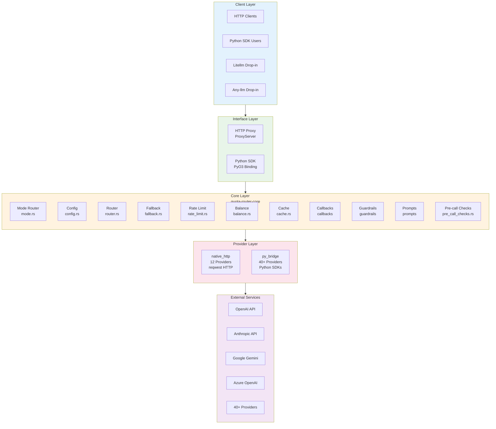
```mermaid
graph TB
    subgraph Clients["Client Layer"]
        C1[HTTP Clients]
        C2[Python SDK Users]
        C3[Litellm Drop-in]
        C4[Any-llm Drop-in]
    end

    subgraph Interfaces["Interface Layer"]
        I1[HTTP Proxy<br/>ProxyServer]
        I2[Python SDK<br/>PyO3 Binding]
    end

    subgraph Core["Core Layer<br/>quota-router-core"]
        direction TB
        M1[Mode Router<br/>mode.rs]
        M2[Config<br/>config.rs]
        M3[Router<br/>router.rs]
        M4[Fallback<br/>fallback.rs]
        M5[Rate Limit<br/>rate_limit.rs]
        M6[Balance<br/>balance.rs]
        M7[Cache<br/>cache.rs]
        M8[Callbacks<br/>callbacks]
        M9[Guardrails<br/>guardrails]
        M10[Prompts<br/>prompts]
        M11[Pre-call Checks<br/>pre_call_checks.rs]
    end

    subgraph Providers["Provider Layer"]
        direction TB
        P1[native_http<br/>12 Providers<br/>reqwest HTTP]
        P2[py_bridge<br/>40+ Providers<br/>Python SDKs]
    end

    subgraph External["External Services"]
        E1[OpenAI API]
        E2[Anthropic API]
        E3[Google Gemini]
        E4[Azure OpenAI]
        E5[40+ Providers]
    end

    Clients --> Interfaces
    Interfaces --> Core
    Core --> Providers
    Providers --> External

    style Clients fill:#e3f2fd
    style Interfaces fill:#e8f5e9
    style Core fill:#fff3e0
    style Providers fill:#fce4ec
    style External fill:#f3e5f5
```

---

## 2. Crate Architecture

The project is split into two Rust crates with a clear dependency hierarchy:


```mermaid
graph LR
    subgraph PyO3["quota-router-pyo3"]
        direction TB
        L1[lib.rs<br/>Module Registration]
        L2[completion.rs<br/>Completion Functions]
        L3[router.rs<br/>Router Class]
        L4[exceptions.rs<br/>Python Exceptions]
        L5[model.rs<br/>Model Parsing]
        L6[batch.rs<br/>Batch Functions]
        L7[providers/<br/>Provider Wrappers]
        L8[types.rs<br/>Python Types]
    end

    subgraph Core["quota-router-core"]
        direction TB
        C1[proxy.rs<br/>HTTP Proxy Server]
        C2[mode.rs<br/>Mode Router]
        C3[native_http/<br/>12 HTTP Providers]
        C4[py_bridge/<br/>40+ Python Providers]
        C5[router.rs<br/>Routing Logic]
        C6[fallback.rs<br/>Fallback & Health]
        C7[config.rs<br/>Configuration]
        C8[shared_types.rs<br/>Shared Data Types]
    end

    PyO3 -->|depends on| Core

    style PyO3 fill:#e3f2fd
    style Core fill:#e8f5e9
```

### 2.1 Crate Responsibilities

| Crate | Purpose | Dependencies |
|-------|---------|--------------|
| `quota-router-core` | Core business logic, proxy server, provider implementations | tokio, reqwest, serde, pyo3 (optional) |
| `quota-router-pyo3` | Python SDK binding via PyO3 | quota-router-core, pyo3 |

### 2.2 Feature Gates

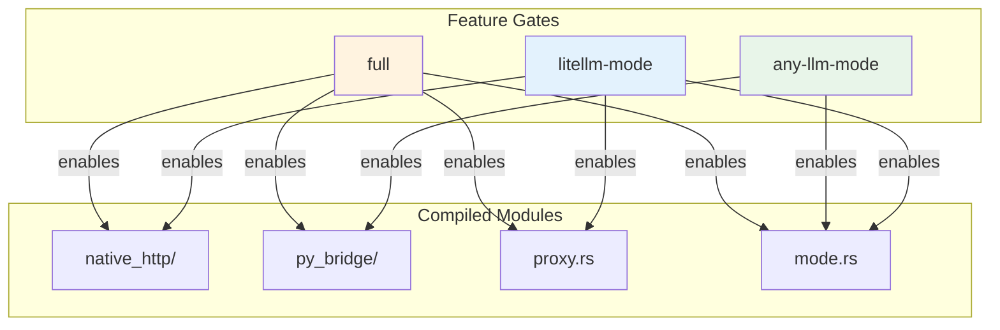
```mermaid
graph TD
    subgraph Features["Feature Gates"]
        F1["litellm-mode"]
        F2["any-llm-mode"]
        F3["full"]
    end

    subgraph Modules["Compiled Modules"]
        M1[native_http/]
        M2[py_bridge/]
        M3[proxy.rs]
        M4[mode.rs]
    end

    F1 -->|enables| M1
    F1 -->|enables| M3
    F1 -->|enables| M4

    F2 -->|enables| M2
    F2 -->|enables| M4

    F3 -->|enables| M1
    F3 -->|enables| M2
    F3 -->|enables| M3
    F3 -->|enables| M4

    style F1 fill:#e3f2fd
    style F2 fill:#e8f5e9
    style F3 fill:#fff3e0
```

---

## 3. Dual-Mode Architecture

The mode gate controls HOW providers are called, not WHETHER an interface exists.
Both HTTP proxy and Python SDK exist in ALL modes.

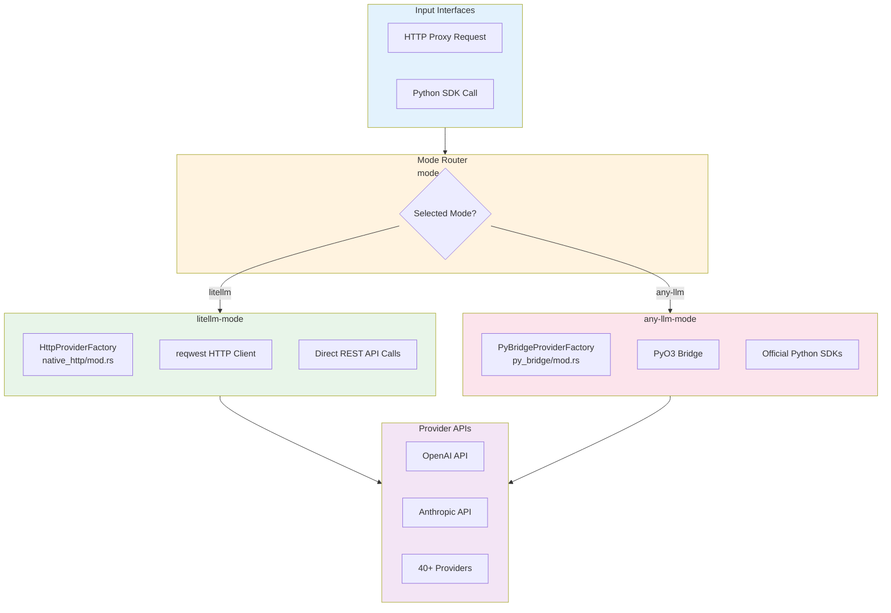
```mermaid
graph TB
    subgraph Input["Input Interfaces"]
        I1[HTTP Proxy Request]
        I2[Python SDK Call]
    end

    subgraph ModeRouter["Mode Router<br/>mode.rs"]
        MR{Selected Mode?}
    end

    subgraph LiteLLM["litellm-mode"]
        direction TB
        L1[HttpProviderFactory<br/>native_http/mod.rs]
        L2[reqwest HTTP Client]
        L3[Direct REST API Calls]
    end

    subgraph AnyLLM["any-llm-mode"]
        direction TB
        A1[PyBridgeProviderFactory<br/>py_bridge/mod.rs]
        A2[PyO3 Bridge]
        A3[Official Python SDKs]
    end

    subgraph Providers["Provider APIs"]
        P1[OpenAI API]
        P2[Anthropic API]
        P3[40+ Providers]
    end

    Input --> ModeRouter
    MR -->|"litellm"| LiteLLM
    MR -->|"any-llm"| AnyLLM
    LiteLLM --> Providers
    AnyLLM --> Providers

    style Input fill:#e3f2fd
    style ModeRouter fill:#fff3e0
    style LiteLLM fill:#e8f5e9
    style AnyLLM fill:#fce4ec
    style Providers fill:#f3e5f5
```

### 3.1 Mode Selection

| Mode | Backend | Default | Use Case |
|------|---------|---------|----------|
| `litellm` | reqwest (native HTTP) | Yes (when both compiled) | Fast, no Python dependency |
| `any-llm` | PyO3 → Python SDKs | No | Full SDK compatibility |

**Mode selection in Python SDK:**
```python
import quota_router as qr

# Default mode (litellm - reqwest)
qr.completion(model="openai/gpt-4", messages=[...])

# Explicit mode selection
qr.completion(model="openai/gpt-4", messages=[...], _mode="litellm")
qr.completion(model="openai/gpt-4", messages=[...], _mode="any-llm")
```

---

## 4. Request Flow

### 4.1 HTTP Proxy Path (litellm-mode)

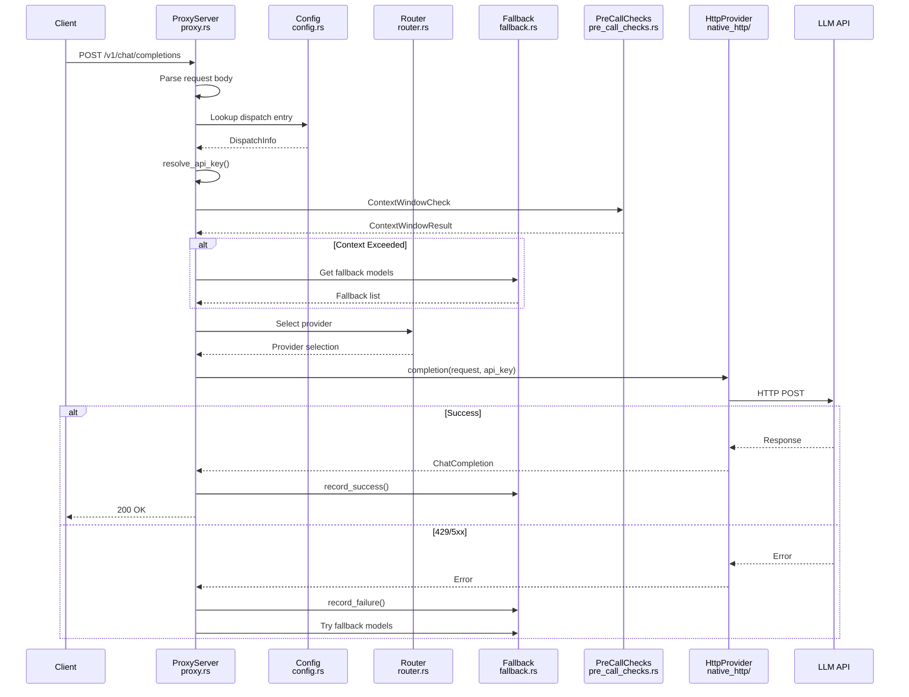
```mermaid
sequenceDiagram
    participant Client
    participant Proxy as ProxyServer<br/>proxy.rs
    participant Config as Config<br/>config.rs
    participant Router as Router<br/>router.rs
    participant Fallback as Fallback<br/>fallback.rs
    participant PreCheck as PreCallChecks<br/>pre_call_checks.rs
    participant Provider as HttpProvider<br/>native_http/
    participant API as LLM API

    Client->>Proxy: POST /v1/chat/completions
    Proxy->>Proxy: Parse request body
    Proxy->>Config: Lookup dispatch entry
    Config-->>Proxy: DispatchInfo

    Proxy->>Proxy: resolve_api_key()
    Proxy->>PreCheck: ContextWindowCheck
    PreCheck-->>Proxy: ContextWindowResult

    alt Context Exceeded
        Proxy->>Fallback: Get fallback models
        Fallback-->>Proxy: Fallback list
    end

    Proxy->>Router: Select provider
    Router-->>Proxy: Provider selection

    Proxy->>Provider: completion(request, api_key)
    Provider->>API: HTTP POST

    alt Success
        API-->>Provider: Response
        Provider-->>Proxy: ChatCompletion
        Proxy->>Fallback: record_success()
        Proxy-->>Client: 200 OK
    else 429/5xx
        API-->>Provider: Error
        Provider-->>Proxy: Error
        Proxy->>Fallback: record_failure()
        Proxy->>Fallback: Try fallback models
    end
```

### 4.2 Python SDK Path (litellm-mode)

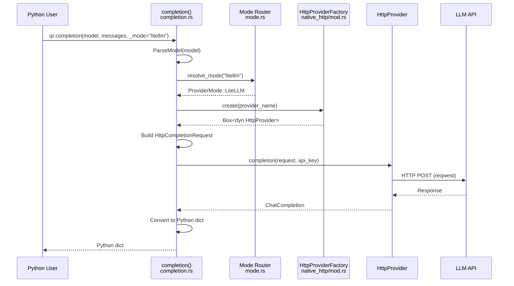
```mermaid
sequenceDiagram
    participant User as Python User
    participant SDK as completion()<br/>completion.rs
    participant Mode as Mode Router<br/>mode.rs
    participant Factory as HttpProviderFactory<br/>native_http/mod.rs
    participant Provider as HttpProvider
    participant API as LLM API

    User->>SDK: qr.completion(model, messages, _mode="litellm")
    SDK->>SDK: ParseModel(model)
    SDK->>Mode: resolve_mode("litellm")
    Mode-->>SDK: ProviderMode::LiteLLM

    SDK->>Factory: create(provider_name)
    Factory-->>SDK: Box<dyn HttpProvider>

    SDK->>SDK: Build HttpCompletionRequest
    SDK->>Provider: completion(request, api_key)
    Provider->>API: HTTP POST (reqwest)

    API-->>Provider: Response
    Provider-->>SDK: ChatCompletion
    SDK->>SDK: Convert to Python dict
    SDK-->>User: Python dict
```

### 4.3 Python SDK Path (any-llm-mode)

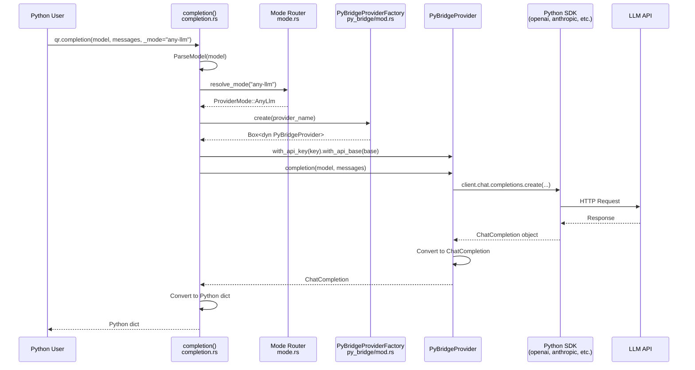
```mermaid
sequenceDiagram
    participant User as Python User
    participant SDK as completion()<br/>completion.rs
    participant Mode as Mode Router<br/>mode.rs
    participant Factory as PyBridgeProviderFactory<br/>py_bridge/mod.rs
    participant Bridge as PyBridgeProvider
    participant PySDK as Python SDK<br/>(openai, anthropic, etc.)
    participant API as LLM API

    User->>SDK: qr.completion(model, messages, _mode="any-llm")
    SDK->>SDK: ParseModel(model)
    SDK->>Mode: resolve_mode("any-llm")
    Mode-->>SDK: ProviderMode::AnyLlm

    SDK->>Factory: create(provider_name)
    Factory-->>SDK: Box<dyn PyBridgeProvider>

    SDK->>Bridge: with_api_key(key).with_api_base(base)
    SDK->>Bridge: completion(model, messages)

    Bridge->>PySDK: client.chat.completions.create(...)
    PySDK->>API: HTTP Request

    API-->>PySDK: Response
    PySDK-->>Bridge: ChatCompletion object
    Bridge->>Bridge: Convert to ChatCompletion
    Bridge-->>SDK: ChatCompletion
    SDK->>SDK: Convert to Python dict
    SDK-->>User: Python dict
```

---

## 5. Provider System

### 5.1 Provider Architecture


```mermaid
graph TB
    subgraph Trait["Provider Trait Hierarchy"]
        T1["HttpProvider Trait<br/>(native_http)"]
        T2["PyBridgeProvider Trait<br/>(py_bridge)"]
    end

    subgraph NativeHTTP["native_http/ Providers<br/>(12 providers, reqwest)"]
        direction TB
        N1[openai.rs]
        N2[anthropic.rs]
        N3[mistral.rs]
        N4[groq.rs]
        N5[together.rs]
        N6[azure.rs]
        N7[databricks.rs]
        N8[perplexity.rs]
        N9[ollama.rs]
        N10[bedrock.rs]
        N11[gemini.rs]
        N12[replicate.rs]
    end

    subgraph PyBridge["py_bridge/ Providers<br/>(40+ providers, Python SDKs)"]
        direction TB
        P1[openai.rs]
        P2[anthropic.rs]
        P3[mistral.rs]
        P4[cohere.rs]
        P5[groq.rs]
        P6[gemini.rs]
        P7[bedrock.rs]
        P8[vertexai.rs]
        P9[40+ more...]
    end

    subgraph Factory["Factory Pattern"]
        F1["HttpProviderFactory::create()"]
        F2["PyBridgeProviderFactory::create()"]
    end

    T1 --> NativeHTTP
    T2 --> PyBridge

    F1 --> T1
    F2 --> T2

    style Trait fill:#fff3e0
    style NativeHTTP fill:#e8f5e9
    style PyBridge fill:#e3f2fd
    style Factory fill:#fce4ec
```

### 5.2 HttpProvider Trait

```rust
pub trait HttpProvider: Send + Sync {
    fn name(&self) -> &str;
    fn supported_models(&self) -> Vec<String>;
    fn supports_streaming(&self) -> bool;

    async fn completion(
        &self,
        request: &HttpCompletionRequest,
        api_key: Option<&str>,
    ) -> Result<HttpCompletionResponse, ProviderError>;

    async fn streaming_completion(
        &self,
        request: &HttpCompletionRequest,
        api_key: Option<&str>,
    ) -> Result<StreamingResponse, ProviderError>;

    async fn embedding(
        &self,
        request: &HttpEmbeddingRequest,
        api_key: Option<&str>,
    ) -> Result<HttpEmbeddingResponse, ProviderError>;
}
```

### 5.3 PyBridgeProvider Trait

```rust
pub trait PyBridgeProvider: Send + Sync {
    fn name(&self) -> &str;
    fn supported_models(&self) -> Vec<String>;

    fn with_api_key(self: Box<Self>, api_key: String) -> Box<dyn PyBridgeProvider>;
    fn with_api_base(self: Box<Self>, api_base: String) -> Box<dyn PyBridgeProvider>;

    fn completion(
        &self,
        model: &str,
        messages: &[Message],
    ) -> Result<ChatCompletion, String>;

    fn embedding(
        &self,
        model: &str,
        inputs: &[String],
    ) -> Result<EmbeddingsResponse, String>;
}
```

### 5.4 Shared Request/Response Types

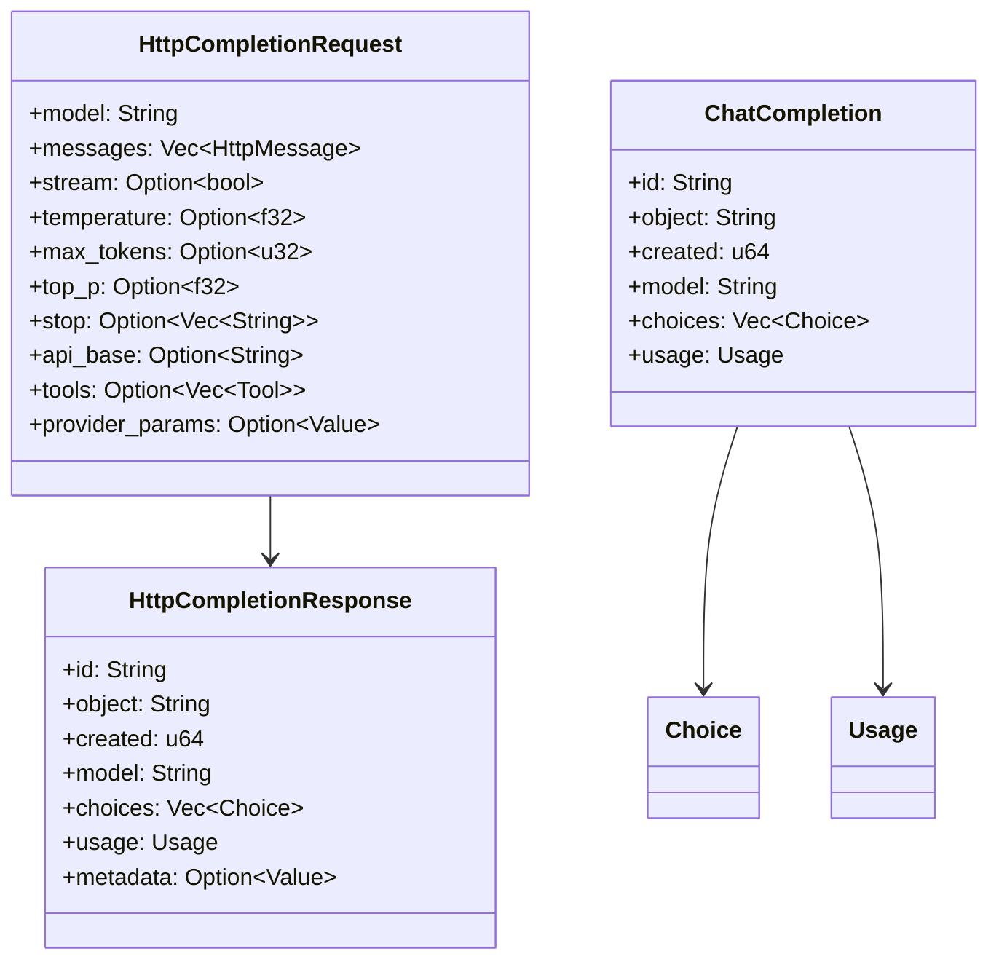
```mermaid
classDiagram
    class HttpCompletionRequest {
        +model: String
        +messages: Vec~HttpMessage~
        +stream: Option~bool~
        +temperature: Option~f32~
        +max_tokens: Option~u32~
        +top_p: Option~f32~
        +stop: Option~Vec~String~~
        +api_base: Option~String~
        +tools: Option~Vec~Tool~~
        +provider_params: Option~Value~
    }

    class HttpCompletionResponse {
        +id: String
        +object: String
        +created: u64
        +model: String
        +choices: Vec~Choice~
        +usage: Usage
        +metadata: Option~Value~
    }

    class ChatCompletion {
        +id: String
        +object: String
        +created: u64
        +model: String
        +choices: Vec~Choice~
        +usage: Usage
    }

    HttpCompletionRequest --> HttpCompletionResponse
    ChatCompletion --> Choice
    ChatCompletion --> Usage
```

---

## 6. Module Architecture

### 6.1 Core Module Dependency Graph

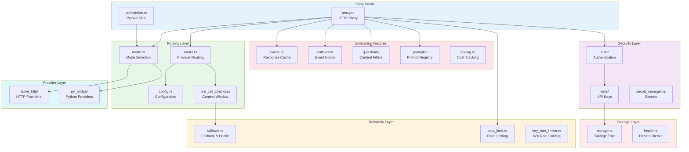
```mermaid
graph TD
    subgraph Entry["Entry Points"]
        E1[proxy.rs<br/>HTTP Proxy]
        E2[completion.rs<br/>Python SDK]
    end

    subgraph Routing["Routing Layer"]
        R1[mode.rs<br/>Mode Selection]
        R2[router.rs<br/>Provider Routing]
        R3[config.rs<br/>Configuration]
        R4[pre_call_checks.rs<br/>Context Window]
    end

    subgraph Reliability["Reliability Layer"]
        RL1[fallback.rs<br/>Fallback & Health]
        RL2[rate_limit.rs<br/>Rate Limiting]
        RL3[key_rate_limiter.rs<br/>Key Rate Limiting]
    end

    subgraph Enterprise["Enterprise Features"]
        EN1[cache.rs<br/>Response Cache]
        EN2[callbacks/<br/>Event Hooks]
        EN3[guardrails/<br/>Content Filters]
        EN4[prompts/<br/>Prompt Registry]
        EN5[pricing.rs<br/>Cost Tracking]
    end

    subgraph Security["Security Layer"]
        S1[auth/<br/>Authentication]
        S2[keys/<br/>API Keys]
        S3[secret_manager.rs<br/>Secrets]
    end

    subgraph Storage["Storage Layer"]
        ST1[storage.rs<br/>Storage Trait]
        ST2[health.rs<br/>Health Checks]
    end

    subgraph Providers["Provider Layer"]
        P1[native_http/<br/>HTTP Providers]
        P2[py_bridge/<br/>Python Providers]
    end

    E1 --> R1
    E2 --> R1
    R1 --> P1
    R1 --> P2
    E1 --> R2
    R2 --> R3
    R2 --> R4
    R4 --> RL1
    E1 --> RL2
    E1 --> EN1
    E1 --> EN2
    E1 --> EN3
    E1 --> EN4
    E1 --> S1
    S1 --> S2
    S2 --> ST1

    style Entry fill:#e3f2fd
    style Routing fill:#e8f5e9
    style Reliability fill:#fff3e0
    style Enterprise fill:#fce4ec
    style Security fill:#f3e5f5
    style Storage fill:#ffebee
    style Providers fill:#e0f7fa
```

### 6.2 Module Descriptions

| Module | File | Purpose |
|--------|------|---------|
| **proxy** | `proxy.rs` | HTTP proxy server, request handling, endpoint routing |
| **mode** | `mode.rs` | Mode selection (litellm vs any-llm), default mode |
| **config** | `config.rs` | Configuration loading, dispatch map, model groups |
| **router** | `router.rs` | Provider routing strategies, load balancing |
| **fallback** | `fallback.rs` | Fallback chains, health tracking, circuit breaking |
| **pre_call_checks** | `pre_call_checks.rs` | Context window validation, pre-flight checks |
| **rate_limit** | `rate_limit.rs` | Rate limiting per provider/model |
| **cache** | `cache.rs` | Response caching |
| **callbacks** | `callbacks/` | Event hooks for logging, metrics |
| **guardrails** | `guardrails/` | Content filtering, safety checks |
| **prompts** | `prompts/` | Prompt template management |
| **pricing** | `pricing.rs` | Cost calculation, budget tracking |
| **auth** | `auth/` | Authentication (API keys, SSO, JWT) |
| **keys** | `keys/` | Virtual API key management |
| **storage** | `storage.rs` | Storage trait, persistence abstraction |
| **native_http** | `native_http/` | 12 providers using reqwest HTTP |
| **py_bridge** | `py_bridge/` | 40+ providers using Python SDKs |

---

## 7. Data Types

### 7.1 Type Hierarchy

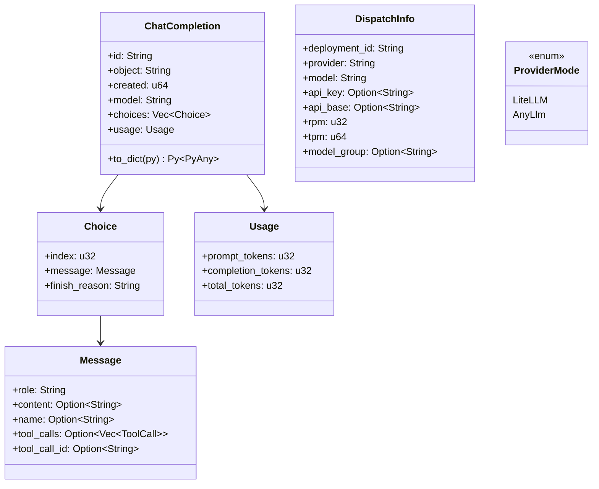
```mermaid
classDiagram
    class Message {
        +role: String
        +content: Option~String~
        +name: Option~String~
        +tool_calls: Option~Vec~ToolCall~~
        +tool_call_id: Option~String~
    }

    class Choice {
        +index: u32
        +message: Message
        +finish_reason: String
    }

    class Usage {
        +prompt_tokens: u32
        +completion_tokens: u32
        +total_tokens: u32
    }

    class ChatCompletion {
        +id: String
        +object: String
        +created: u64
        +model: String
        +choices: Vec~Choice~
        +usage: Usage
        +to_dict(py) Py~PyAny~
    }

    class DispatchInfo {
        +deployment_id: String
        +provider: String
        +model: String
        +api_key: Option~String~
        +api_base: Option~String~
        +rpm: u32
        +tpm: u64
        +model_group: Option~String~
    }

    class ProviderMode {
        <<enum>>
        LiteLLM
        AnyLlm
    }

    ChatCompletion --> Choice
    ChatCompletion --> Usage
    Choice --> Message
```

### 7.2 Shared Types vs Crate-Specific Types

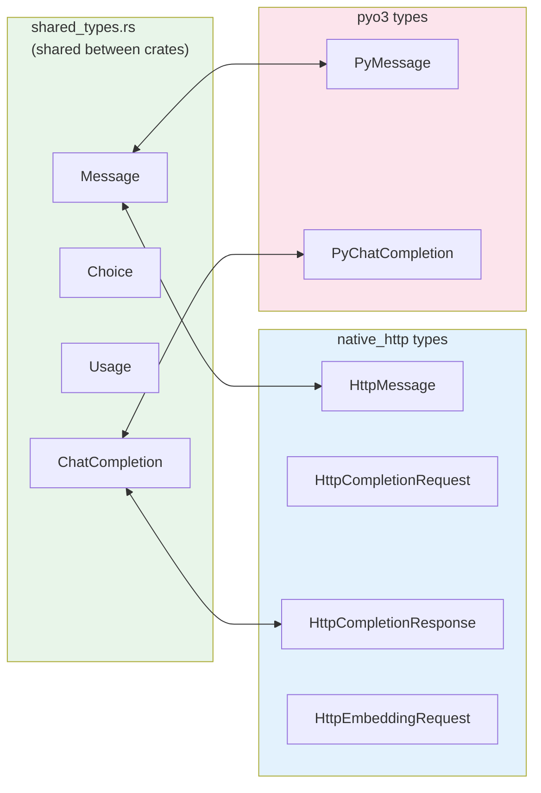
```mermaid
graph LR
    subgraph Shared["shared_types.rs<br/>(shared between crates)"]
        S1[Message]
        S2[Choice]
        S3[Usage]
        S4[ChatCompletion]
    end

    subgraph Core["native_http types"]
        C1[HttpMessage]
        C2[HttpCompletionRequest]
        C3[HttpCompletionResponse]
        C4[HttpEmbeddingRequest]
    end

    subgraph PyO3["pyo3 types"]
        P1[PyMessage]
        P2[PyChatCompletion]
    end

    S1 <--> C1
    S4 <--> C3
    S1 <--> P1
    S4 <--> P2

    style Shared fill:#e8f5e9
    style Core fill:#e3f2fd
    style PyO3 fill:#fce4ec
```

---

## 8. Error Handling

### 8.1 Error Hierarchy

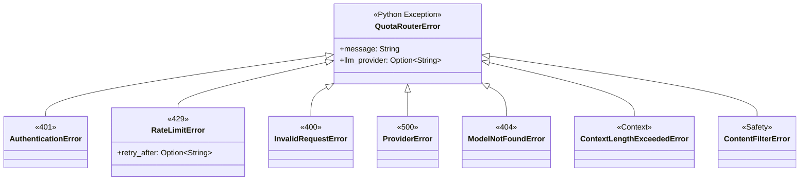
```mermaid
classDiagram
    class QuotaRouterError {
        <<Python Exception>>
        +message: String
        +llm_provider: Option~String~
    }

    class AuthenticationError {
        <<401>>
    }

    class RateLimitError {
        <<429>>
        +retry_after: Option~String~
    }

    class InvalidRequestError {
        <<400>>
    }

    class ProviderError {
        <<500>>
    }

    class ModelNotFoundError {
        <<404>>
    }

    class ContextLengthExceededError {
        <<Context>>
    }

    class ContentFilterError {
        <<Safety>>
    }

    QuotaRouterError <|-- AuthenticationError
    QuotaRouterError <|-- RateLimitError
    QuotaRouterError <|-- InvalidRequestError
    QuotaRouterError <|-- ProviderError
    QuotaRouterError <|-- ModelNotFoundError
    QuotaRouterError <|-- ContextLengthExceededError
    QuotaRouterError <|-- ContentFilterError
```

### 8.2 Error Mapping

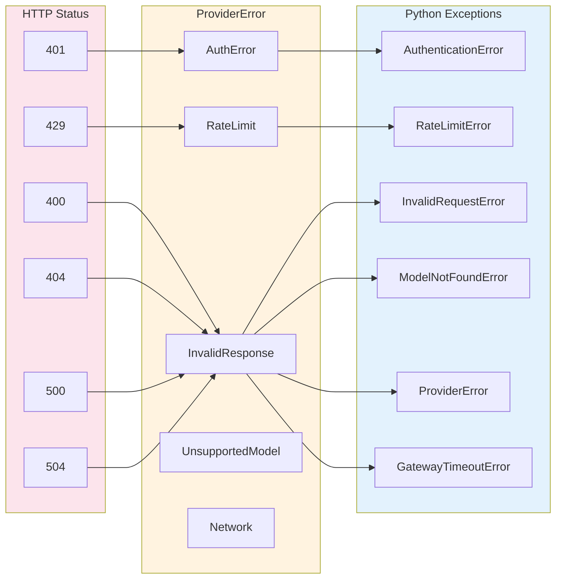
```mermaid
graph LR
    subgraph HTTP["HTTP Status"]
        H1[401]
        H2[429]
        H3[400]
        H4[404]
        H5[500]
        H6[504]
    end

    subgraph Provider["ProviderError"]
        PE1[AuthError]
        PE2[RateLimit]
        PE3[InvalidResponse]
        PE4[UnsupportedModel]
        PE5[Network]
    end

    subgraph Python["Python Exceptions"]
        PY1[AuthenticationError]
        PY2[RateLimitError]
        PY3[InvalidRequestError]
        PY4[ModelNotFoundError]
        PY5[ProviderError]
        PY6[GatewayTimeoutError]
    end

    H1 --> PE1 --> PY1
    H2 --> PE2 --> PY2
    H3 --> PE3 --> PY3
    H4 --> PE3 --> PY4
    H5 --> PE3 --> PY5
    H6 --> PE3 --> PY6

    style HTTP fill:#fce4ec
    style Provider fill:#fff3e0
    style Python fill:#e3f2fd
```

### 8.3 LiteLLM-Compatible Aliases

| Quota Router Name | LiteLLM Alias |
|-------------------|---------------|
| `InsufficientFundsError` | `BudgetExceededError` |
| `UpstreamProviderError` | `ServiceUnavailableError` |
| `GatewayTimeoutError` | `APIConnectionError`, `Timeout` |
| `QuotaRouterError` | `APIError` |
| `ModelNotFoundError` | `NotFoundError` |
| `ContextLengthExceededError` | `ContextWindowExceededError` |
| `ContentFilterError` | `ContentPolicyViolationError` |

---

## 9. Configuration

### 9.1 Configuration Hierarchy

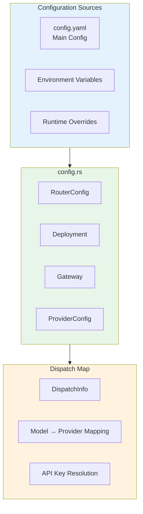
```mermaid
graph TD
    subgraph Config["Configuration Sources"]
        C1[config.yaml<br/>Main Config]
        C2[Environment Variables]
        C3[Runtime Overrides]
    end

    subgraph ConfigModule["config.rs"]
        CM1[RouterConfig]
        CM2[Deployment]
        CM3[Gateway]
        CM4[ProviderConfig]
    end

    subgraph Dispatch["Dispatch Map"]
        D1[DispatchInfo]
        D2[Model → Provider Mapping]
        D3[API Key Resolution]
    end

    Config --> ConfigModule
    ConfigModule --> Dispatch

    style Config fill:#e3f2fd
    style ConfigModule fill:#e8f5e9
    style Dispatch fill:#fff3e0
```

### 9.2 Dispatch Flow

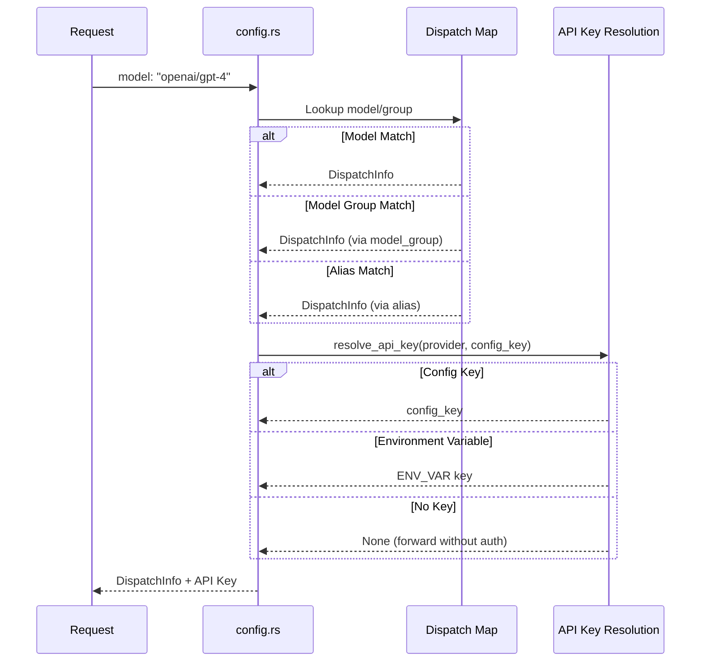
```mermaid
sequenceDiagram
    participant Request
    participant Config as config.rs
    participant Dispatch as Dispatch Map
    participant Key as API Key Resolution

    Request->>Config: model: "openai/gpt-4"
    Config->>Dispatch: Lookup model/group

    alt Model Match
        Dispatch-->>Config: DispatchInfo
    else Model Group Match
        Dispatch-->>Config: DispatchInfo (via model_group)
    else Alias Match
        Dispatch-->>Config: DispatchInfo (via alias)
    end

    Config->>Key: resolve_api_key(provider, config_key)

    alt Config Key
        Key-->>Config: config_key
    else Environment Variable
        Key-->>Config: ENV_VAR key
    else No Key
        Key-->>Config: None (forward without auth)
    end

    Config-->>Request: DispatchInfo + API Key
```

---

## 10. Deployment Modes

### 10.1 LiteLLM Mode (HTTP Proxy)

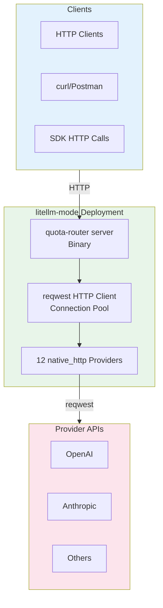
```mermaid
graph TB
    subgraph Deployment["litellm-mode Deployment"]
        direction TB
        S1[quota-router server<br/>Binary]
        S2[reqwest HTTP Client<br/>Connection Pool]
        S3[12 native_http Providers]
    end

    subgraph Clients["Clients"]
        C1[HTTP Clients]
        C2[curl/Postman]
        C3[SDK HTTP Calls]
    end

    subgraph Providers["Provider APIs"]
        P1[OpenAI]
        P2[Anthropic]
        P3[Others]
    end

    Clients -->|HTTP| S1
    S1 --> S2
    S2 --> S3
    S3 -->|reqwest| Providers

    style Deployment fill:#e8f5e9
    style Clients fill:#e3f2fd
    style Providers fill:#fce4ec
```

### 10.2 Any-LLM Mode (Python SDK)

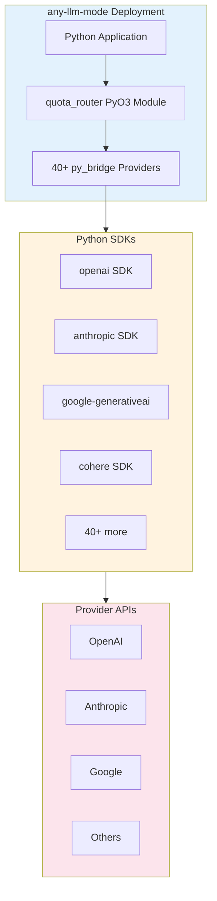
```mermaid
graph TB
    subgraph Deployment["any-llm-mode Deployment"]
        direction TB
        S1[Python Application]
        S2[quota_router PyO3 Module]
        S3[40+ py_bridge Providers]
    end

    subgraph PythonSDKs["Python SDKs"]
        PS1[openai SDK]
        PS2[anthropic SDK]
        PS3[google-generativeai]
        PS4[cohere SDK]
        PS5[40+ more]
    end

    subgraph Providers["Provider APIs"]
        P1[OpenAI]
        P2[Anthropic]
        P3[Google]
        P4[Others]
    end

    S1 --> S2
    S2 --> S3
    S3 --> PythonSDKs
    PythonSDKs --> Providers

    style Deployment fill:#e3f2fd
    style PythonSDKs fill:#fff3e0
    style Providers fill:#fce4ec
```

### 10.3 Full Mode (Both)

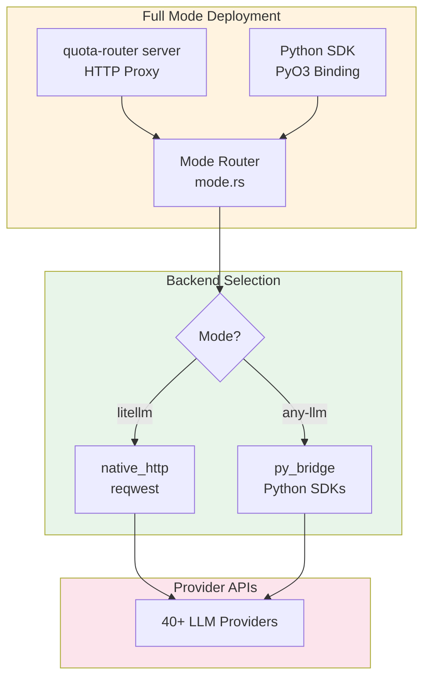
```mermaid
graph TB
    subgraph Full["Full Mode Deployment"]
        direction TB
        S1[quota-router server<br/>HTTP Proxy]
        S2[Python SDK<br/>PyO3 Binding]
        SM[Mode Router<br/>mode.rs]
    end

    subgraph Backends["Backend Selection"]
        B1{Mode?}
        B2[native_http<br/>reqwest]
        B3[py_bridge<br/>Python SDKs]
    end

    subgraph Providers["Provider APIs"]
        P1[40+ LLM Providers]
    end

    S1 --> SM
    S2 --> SM
    SM --> B1
    B1 -->|litellm| B2
    B1 -->|any-llm| B3
    B2 --> P1
    B3 --> P1

    style Full fill:#fff3e0
    style Backends fill:#e8f5e9
    style Providers fill:#fce4ec
```

---

## 11. Test Architecture

### 11.1 Test Layers

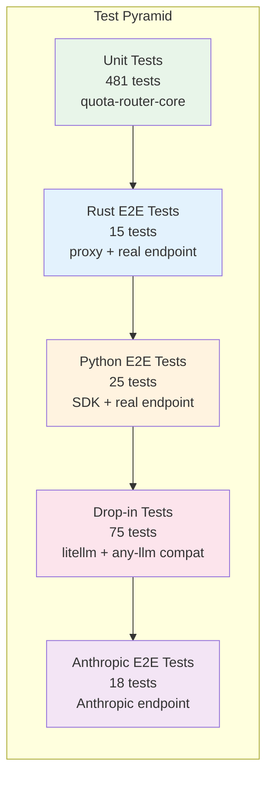
```mermaid
graph TB
    subgraph Tests["Test Pyramid"]
        direction TB
        T1["Unit Tests<br/>481 tests<br/>quota-router-core"]
        T2["Rust E2E Tests<br/>15 tests<br/>proxy + real endpoint"]
        T3["Python E2E Tests<br/>25 tests<br/>SDK + real endpoint"]
        T4["Drop-in Tests<br/>75 tests<br/>litellm + any-llm compat"]
        T5["Anthropic E2E Tests<br/>18 tests<br/>Anthropic endpoint"]
    end

    T1 --> T2
    T2 --> T3
    T3 --> T4
    T4 --> T5

    style T1 fill:#e8f5e9
    style T2 fill:#e3f2fd
    style T3 fill:#fff3e0
    style T4 fill:#fce4ec
    style T5 fill:#f3e5f5
```

### 11.2 Test Coverage

| Test Type | Count | Coverage |
|-----------|-------|----------|
| Unit tests (core) | 481 | All modules |
| Rust E2E (proxy) | 15 | OpenAI endpoint via proxy |
| Python E2E (SDK) | 25 | OpenAI endpoint via SDK |
| Drop-in litellm | 38 | litellm compatibility |
| Drop-in any-llm | 37 | any-llm compatibility |
| Anthropic E2E | 18 | Anthropic endpoint (both modes) |
| **Total** | **614** | |

### 11.3 Test Endpoints

| Endpoint | Auth | Used By |
|----------|------|---------|
| `opengateway.gitlawb.com/v1/xiaomi-mimo` | None | OpenAI e2e tests |
| `api.minimax.io/anthropic` | ANTHROPIC_AUTH_TOKEN | Anthropic e2e tests |

---

## Appendix A: Provider List

### Native HTTP Providers (litellm-mode)

| Provider | File | Streaming | Embeddings |
|----------|------|-----------|------------|
| OpenAI | `openai.rs` | Yes | Yes |
| Anthropic | `anthropic.rs` | Yes | No |
| Mistral | `mistral.rs` | Yes | Yes |
| Groq | `groq.rs` | Yes | Yes |
| Together | `together.rs` | Yes | Yes |
| Azure | `azure.rs` | Yes | Yes |
| Databricks | `databricks.rs` | Yes | Yes |
| Perplexity | `perplexity.rs` | Yes | Yes |
| Ollama | `ollama.rs` | Yes | Yes |
| Bedrock | `bedrock.rs` | Yes | No |
| Gemini | `gemini.rs` | Yes | Yes |
| Replicate | `replicate.rs` | Yes | No |

### PyBridge Providers (any-llm-mode)

40+ providers including all native HTTP providers plus:
Cohere, Fireworks, Cerebras, OpenRouter, XAI, HuggingFace, MZAI, MiniMax,
Nebius, Moonshot, Voyage, Sagemaker, Sambanova, VertexAI, Watsonx, Gateway,
Platform, Llama, LlamaCpp, Llamafile, LMStudio, Inception, VLLM, Portkey,
ZAI, DeepInfra, DashScope, DeepSeek, and more.

---

## Appendix B: API Surface

### Python SDK Functions

| Function | Mode | Status |
|----------|------|--------|
| `completion()` | Both | Implemented |
| `acompletion()` | Both | Implemented |
| `embedding()` | any-llm | NotImplementedError |
| `aembedding()` | any-llm | NotImplementedError |
| `messages()` | any-llm | NotImplementedError |
| `amessages()` | any-llm | NotImplementedError |
| `responses()` | any-llm | NotImplementedError |
| `aresponses()` | any-llm | NotImplementedError |
| `batch_create()` | any-llm | NotImplementedError |
| `list_models()` | any-llm | NotImplementedError |

### Router Class

| Method | Status |
|--------|--------|
| `completion()` | Implemented |
| `acompletion()` | Implemented |
| `list_models()` | Implemented |
| `get_metrics()` | Implemented |

---

*End of document*
