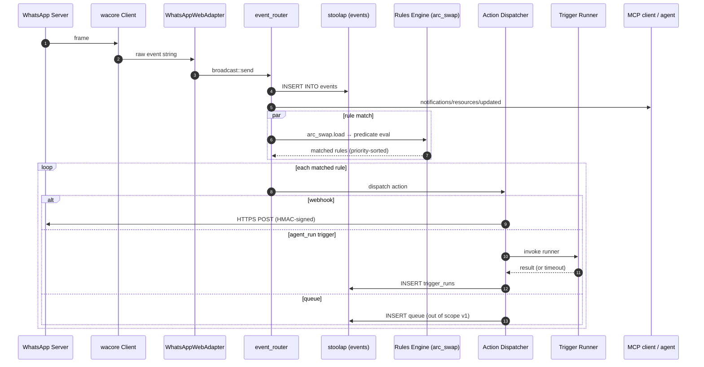
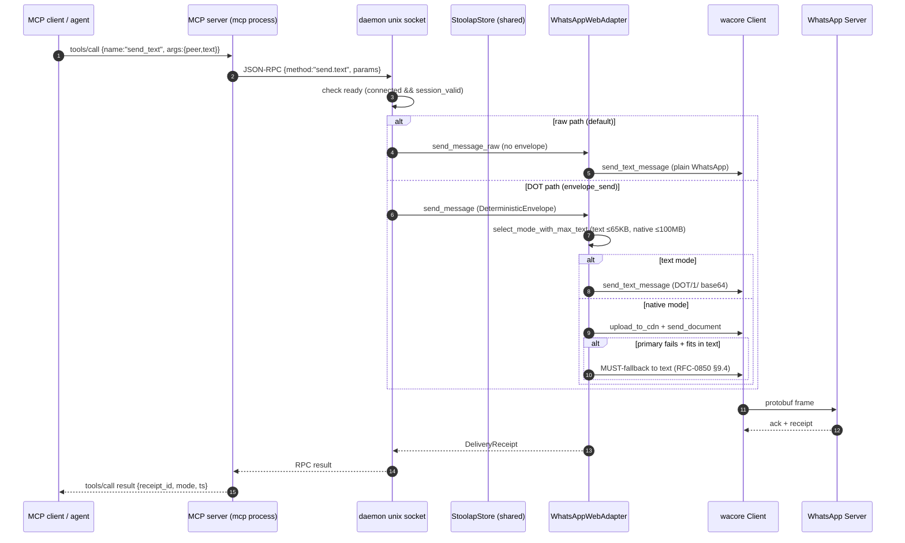
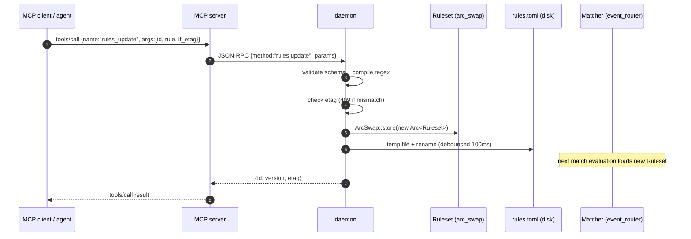

# Design: WhatsApp Runtime, CLI, and MCP Server

**Date:** 2026-07-04
**Status:** Approved (post-brainstorm)
**RFC:** RFC-0850 (Deterministic Overlay Transport)
**Crate:** `octo-whatsapp` (new), depends on `octo-adapter-whatsapp`, `octo-whatsapp-onboard-core`

## Overview

Build a single-binary runtime for the existing `octo-adapter-whatsapp` adapter that
exposes its full API surface to three consumers:

1. **Operators** via a structured CLI (`octo-whatsapp …`).
2. **AI agents** via an MCP server (`octo-whatsapp mcp`) over stdio JSON-RPC.
3. **External systems** via the daemon's unix-socket JSON-RPC or opt-in TCP.

The runtime owns the long-lived WhatsApp WebSocket and event stream; CLI and MCP
are thin clients of the daemon's IPC surface, so any consumer can stop, restart,
or migrate independently without dropping the WhatsApp session.

A **hot-replaceable rules engine** lets MCP agents create, update, enable,
disable, and delete event → action rules at runtime without daemon restart, with
audit history and etag-based optimistic concurrency.

## Goals

- **Max API coverage** — every public method on `WhatsAppWebAdapter` and its
  `CoordinatorAdmin` impl maps 1:1 to a CLI subcommand, an MCP tool, and an RPC
  method. See the subcommand tree below.
- **Raw + DOT separation** — default CLI is direct platform operations (raw);
  the DOT envelope path is explicit and gated.
- **Hot-mutable rules** — agents can reshape the event pipeline live.
- **No auto-onboard** — the daemon never pairs itself; operators always do.
- **Single shared stoolap handle** — no per-client stores, no deadlocks.
- **Resilient readiness** — `synced()` is unreliable in some runs; readiness
  is a 4-signal breakdown, not a single gate.

## Non-Goals (v1)

- Replacing the existing `octo-whatsapp-onboard` CLI — keep it; the new
  runtime delegates to it for `octo whatsapp onboard …` subcommands.
- Running an LLM inside the daemon — triggers delegate to configured runners
  (shell / HTTP / agent); the agent's model choice lives in the runner config.
- A distributed event bus between adapters — out of scope; the daemon is
  per-account.
- WASM plugin support — the runtime only ships the WhatsApp adapter; future
  adapters can use the same pattern.

## Current State (ground truth)

**`octo-adapter-whatsapp`** — Tier 3 DOT adapter (per RFC-0850 §8.1), pure-Rust
over `whatsapp-rust`. 5000+ LoC, ~30 adapter-specific methods plus the
20-method `CoordinatorAdmin` trait impl:

| Method group | Examples |
|---|---|
| Connection | `start_bot`, `run_reconnect_loop`, `connected`, `synced`, `has_valid_session`, `dropped_inbound_messages` |
| Sessions / state | `BotState`, `LoggedOutCause`, `register_group_at_runtime`, `list_all_conversations`, `list_persisted_conversations`, `persist_conversations` |
| Groups (platform) | `create_group_str`, `add_members`, `remove_members`, `promote_participants`, `demote_participants`, `set_subject`, `set_description`, `set_announce`, `set_locked`, `set_ephemeral`, `set_membership_approval`, `get_invite_link`, `get_invite_info`, `get_participating`, `group_metadata`, `leave_group` |
| Groups (admin) | `create_group`, `leave_group`, `destroy_group` (revoke + leave), `join_by_invite`, `add_member`, `remove_member`, `ban_member`, `promote_to_admin`, `demote_from_admin`, `approve_join_request`, `rename_group`, `set_group_description`, `set_locked`, `set_announce`, `set_ephemeral`, `set_require_approval`, `list_own_groups`, `get_group_metadata`, `resolve_invite`, `transfer_ownership` |
| Media | `upload_media`, `download_media`, `send_document` |
| DOT wire | `encode_envelope`, `decode_envelope`, `domain_hash`, `max_payload_bytes`, `rate_limit_per_second`, `from_config_bytes`, `subscribe_raw_events` |
| DOT trait | `send_message`, `receive_messages`, `capabilities`, `as_coordinator_admin`, `health_check`, `shutdown` |

**`StoolapStore`** — exposes `upsert_conversations`, `list_conversations`,
plus the wacore session/identity/prekey/sender-key/sync-key storage required by
`whatsapp-rust`.

**`octo-whatsapp-onboard`** — CLI with `qr-link`, `pair-link`, `whoami`,
`session list|verify|remove`. **No runtime CLI today** — once a session is
linked, nothing exposes the adapter's operation API to a shell or agent.

**Gap:** WhatsApp WebSocket must stay connected. There is no long-lived owner
that can also be addressed by an agent. The new runtime fills that gap.

## Architecture Shape

Single binary with multiple modes — mirrors `dockerd` / `gh` / `ollama`. One
systemd unit, one Docker image, one Cargo crate.

```
crates/octo-whatsapp/
├── Cargo.toml
├── src/
│   ├── lib.rs                    # re-exports + Runtime facade
│   ├── config.rs                 # WhatsAppRuntimeConfig (TOML)
│   ├── daemon.rs                 # long-lived: owns adapter + event router + rules
│   ├── events.rs                 # raw_event_t → typed InboundEvent
│   ├── ipc/
│   │   ├── mod.rs
│   │   ├── protocol.rs           # request/response types
│   │   └── server.rs             # unix-socket JSON-RPC server
│   ├── rules.rs                  # hot-mutable Ruleset (arc_swap)
│   ├── actions/
│   │   ├── mod.rs                # Action dispatcher
│   │   ├── webhook.rs
│   │   ├── mcp_notify.rs
│   │   ├── agent_run.rs          # trigger reference
│   │   └── shell.rs
│   ├── triggers.rs               # stateful trigger registry
│   ├── mcp_server.rs             # stdio JSON-RPC → daemon socket
│   ├── cli.rs                    # clap derive, all subcommands
│   └── main.rs                   # mode dispatch
└── tests/
```

### Subcommand tree (max coverage)

Legend: ✅ = already on `octo-adapter-whatsapp`; 🆕 = gap the runtime fills
(thin wrapper); 🚫 = impossible on WhatsApp.

```
octo-whatsapp
├── onboard {qr-link, pair-link, whoami, session list|verify|remove}      ✅ existing
├── daemon, mcp, status, version                                          🆕 runtime
├── reconnect, shutdown, doctor                                           🆕 ops
│
├── send                                          (high-level outbound — RAW by default)
│   ├── text      <peer> --text "…" [--reply-to ID] [--mentions JID,…]   ✅+🆕
│   ├── image     <peer> --file PATH [--caption "…"]                     🆕
│   ├── video     <peer> --file PATH [--caption "…"]                     🆕
│   ├── audio     <peer> --file PATH                                     🆕
│   ├── voice     <peer> --file PATH                                     🆕
│   ├── doc       <peer> --file PATH [--filename NAME]                   ✅ send_document
│   ├── sticker   <peer> --file PATH                                     🆕
│   ├── reaction  <peer> <msg-id> --emoji "👍"                            🆕
│   ├── poll      <peer> --question "…" --options a,b,c [--multi]        🆕
│   ├── contact   <peer> --vcard PATH                                    🆕
│   ├── location  <peer> --lat L --lon L --name "…"                      🆕
│   └── delete    <msg-id>           (delete-for-everyone)               🆕
│
├── messages
│   ├── list    [--peer JID] [--since TS] [--limit N] [--dir in|out]     🆕
│   ├── get     <msg-id>                                                 🆕
│   ├── search  <query> [--peer JID]                                     🆕
│   ├── edit    <msg-id> --new-text "…"                                  🆕
│   ├── mark-read <peer> [--up-to <id>]                                  🆕
│   └── download <token> --out PATH                                      ✅ download_media
│
├── chats
│   ├── list     [--kind dm|group]                                       ✅ list_conversations
│   ├── info     <jid>                                                   🆕
│   ├── pin|unpin <jid>                                                  🆕
│   ├── mute     <jid> [--until TS]                                      🆕
│   ├── archive  <jid>                                                   🆕
│   ├── delete   <jid>                                                   🆕
│   └── typing   <jid> --start|--stop                                    🆕
│
├── groups                       (full CoordinatorAdmin surface)
│   ├── create       --subject "…" [--members JID,JID] [--description]   ✅ create_group
│   ├── list         [--filter mine|admin|all]                           ✅ list_own_groups
│   ├── info         <jid>                                               ✅ group_metadata
│   ├── metadata     <jid>                                               ✅ get_group_metadata
│   ├── invite
│   │   ├── link    <jid> [--reset]                                      ✅ get_invite_link
│   │   ├── info    <code>                                              ✅ get_invite_info
│   │   └── resolve <code>                                              ✅ resolve_invite
│   ├── join-by-invite <code>                                            ✅ join_by_invite
│   ├── leave        <jid>                                               ✅ leave_group
│   ├── destroy      <jid>        (revoke + leave; 🚫 no true destroy)  ✅
│   ├── subject      <jid> --set "…"                                     ✅ set_subject
│   ├── description  <jid> --set "…"                                     ✅ set_description
│   ├── icon         <jid> --file PATH                                   🆕
│   ├── ephemeral    <jid> --ttl SECS|--off                             ✅ set_ephemeral
│   ├── locked       <jid> --on|--off                                    ✅ set_locked
│   ├── announce     <jid> --on|--off                                    ✅ set_announce
│   ├── approval     <jid> --on|--off                                    ✅ set_membership_approval
│   ├── members
│   │   ├── list     <jid>                                               ✅ get_participating
│   │   ├── add      <jid> --members JID,JID                             ✅ add_members
│   │   ├── remove   <jid> --members JID,JID                             ✅ remove_members
│   │   └── ban      <jid> --members JID,JID  (remove + revoke invites) ✅ ban_member
│   ├── admins
│   │   ├── list     <jid>                                               🆕
│   │   ├── promote  <jid> --members JID,JID                             ✅ promote_participants
│   │   └── demote   <jid> --members JID,JID                             ✅ demote_participants
│   ├── requests
│   │   ├── list     <jid>                                               🆕
│   │   └── approve  <jid> --members JID,JID                             ✅ approve_join_request
│   └── ownership
│       └── transfer <jid> --to JID                                      ✅ transfer_ownership
│
├── contacts
│   ├── list    [--limit N]                                              🆕
│   ├── get     <phone>                                                  🆕
│   ├── sync                                                             🆕
│   ├── block   <jid>                                                    🆕
│   └── unblock <jid>                                                    🆕
│
├── profile
│   ├── get                                                             🆕
│   ├── name      --set "…"                                              🆕
│   ├── status    --set "…" [--emoji]                                    🆕
│   └── picture   --file PATH                                            🆕
│
├── presence
│   ├── subscribe   <jid>                                                🆕
│   ├── unsubscribe <jid>                                                🆕
│   ├── send        <jid> --available|--unavailable                      🆕
│   └── list        [--online-only]                                      🆕
│
├── media
│   ├── upload      --file PATH [--kind …]                               ✅ upload_media
│   ├── download    <token> --out PATH                                   ✅ download_media
│   └── info        <token>                                              🆕
│
├── envelope                       (DOT path — explicit)
│   ├── send       <peer> --file <envelope.bin> [--mode text|native]     🆕
│   ├── send-native <peer> --file <payload.bin>                          🆕
│   ├── encode     [--file <wire.bin>]                                   🆕 encode_envelope
│   └── decode                                                           🆕 decode_envelope
│
├── capabilities                                                           🆕
│
├── domain
│   └── compute-hash <group-jid>                                          🆕 domain_hash
│
├── events
│   ├── tail   [--follow] [--since ID] [--filter jq]                      🆕
│   ├── list   [--limit N] [--since TS] [--type …]                        🆕
│   ├── show   <id>                                                       🆕
│   └── replay [--from ID] [--to ID]                                      🆕
│
├── rules                        (event → action engine, hot-mutable)
│   ├── list | show | create | update | patch | delete                   🆕
│   ├── enable | disable                                                 🆕
│   ├── test    --event JSON                                             🆕
│   ├── history <id> --limit N                                           🆕
│   └── reload                                                           🆕
│
├── triggers                     (stateful agent-target registry)
│   ├── list | show | create | update | delete                           🆕
│   ├── enable | disable | run                                           🆕
│   └── history <id> --limit N                                           🆕
│
├── session
│   ├── list | info | create | verify | remove | export                  ✅+🆕
│
├── tools                        (MCP tool enablement — runtime)
│   ├── list | enable | disable                                          🆕
│
├── config
│   └── show | validate | edit                                           🆕
│
├── logs
│   └── tail | since                                                     🆕
│
├── audit                        (audit log of all RPCs)
│   └── tail | since                                                     🆕
│
├── completion                  (clap_complete)
│   └── bash | zsh | fish | powershell | elvish                           🆕
│
├── man                          (clap_mangen)
└── --mcp-schema                  (full MCP manifest as JSON)             🆕
```

Total: ~45 top-level subcommands, ~140 leaf commands. Every leaf maps to one
RPC method and (where useful) one MCP tool.

## Daemon Lifecycle

**Process model.** Single tokio runtime, multi-task. The `daemon` subcommand
replaces CLI arg parsing with daemon-mode dispatch.

```
main → tokio runtime → spawn:
  ├─ ws_loop        (drives WhatsAppWebAdapter::run_reconnect_loop)
  ├─ control_server (accepts unix socket connections, dispatches RPCs)
  ├─ event_router   (subscribes to raw events, fans out to MCP/CLI subscribers + rules)
  ├─ rules_engine   (event → rule match → action dispatch)
  ├─ signal_handler (SIGTERM → graceful shutdown; SIGHUP → partial reload)
  └─ health_reporter (periodic self-check; updates dropped_inbound, last_event_ts)
```

**Startup sequence.**

1. Load `WhatsAppRuntimeConfig` (TOML, XDG-style).
2. Open Unix control socket at `$XDG_RUNTIME_DIR/octo-whatsapp.sock`
   (fallback `~/.local/share/octo/whatsapp/daemon.sock`), mode `0600`.
3. Construct `WhatsAppWebAdapter::new(config)`, call `start_bot()`.
4. `tokio::select!` over the six tasks above.
5. Log structured `daemon.ready` event with socket path + PID.

### Readiness — 4-signal breakdown (NOT a single `synced()` gate)

`synced()` is unreliable: `HistorySync` may be skipped, delayed, or silently
fail in some test runs. Readiness is therefore a composite signal:

| Signal | Source | Meaning | Blocks RPCs? |
|---|---|---|---|
| `connected` | `adapter.connected().notified()` | WS handshake done | yes |
| `session_valid` | `adapter.has_valid_session()` | `session.db` decrypts + creds present | yes |
| `synced` | `adapter.synced().notified()` | HistorySync from server | **no** (soft hint) |
| `ready` | `connected && session_valid` | Daemon accepts outbound RPCs | derived |

`synced()` is a soft hint that history is available — it MUST NOT block RPC
readiness. Operators who want stricter gating opt in via `--require-sync`
(default **OFF**) with `--sync-timeout 120s` after which the daemon proceeds
and logs a warning. `status.get` RPC and CLI `octo whatsapp status` return the
full breakdown: `{ connected, synced, session_valid, ready, dropped_inbound,
last_event_ts }`.

### Session-loss path (no auto-onboard)

The daemon NEVER invokes `qr-link` or `pair-link` on its own. If `start_bot()`
fails with no valid session, or the adapter transitions to
`BotState::Replaced | LoggedOut | SessionExpired`, the daemon:

1. Stays running.
2. Marks itself `SessionLost`.
3. Refuses all outbound RPCs with error code `-32001 SessionLost` and message
   `"daemon cannot pair automatically; run 'octo whatsapp onboard qr-link'
   or 'pair-link' to authenticate"`.
4. Logs the event at WARN level every minute (rate-limited).
5. Optionally invokes a configured shell command if `auto_recover.notify_cmd`
   is set — for notification only, never auto-pairing.

When the operator runs `octo whatsapp onboard qr-link` (standalone), the
onboard CLI writes the new session file then sends a `session.refresh` control
message to the daemon's unix socket. The daemon re-reads the session, calls
`start_bot()` again, transitions back to `ready`. If no daemon is running,
the next `octo whatsapp daemon` invocation picks up the new session naturally.

### Stoolap sharing rule

One `Arc<WhatsAppWebAdapter>` lives in `DaemonState`. Its `Arc<StoolapStore>`
(already `Arc<Mutex<Option<Arc<StoolapStore>>>>` in the adapter) is the ONLY
store handle in the runtime. All RPC paths go
`RPC → DaemonState → Arc<WhatsAppWebAdapter> → store`. **No RPC handler, CLI
subcommand, or MCP tool may call `StoolapStore::new()` or open a second handle
to the same file.**

Enforcement: a unit test (`tests/it_stoolap_uniqueness.rs`) greps the crate for
`StoolapStore::new(` outside the adapter's own `start_bot()`. CI fails on any
new instance.

Why: a separate per-client store handle would deadlock with the adapter's
existing handle (both writing to the same DB file). The `inspect_session_db`
binary remains a read-only offline tool and is not wired into any RPC.

## IPC Contract

Newline-delimited JSON-RPC 2.0 over the unix socket. Every request:

```json
{ "id": 42, "method": "groups.create", "params": { "subject": "ops", "members": ["5511…"] } }
```

Response:

```json
{ "id": 42, "result": { "group_jid": "120363…@g.us", "invite_url": "https://…" } }
```

or

```json
{ "id": 42, "error": { "code": -32001, "message": "SessionLost" } }
```

### RPC methods (mirrors CLI 1:1)

```
status.get, version.get
health.get, reconnect.now, shutdown

send.text, send.image, send.video, send.audio, send.voice, send.doc,
send.sticker, send.reaction, send.poll, send.contact, send.location,
send.delete

messages.list, messages.get, messages.search, messages.edit,
messages.mark_read, messages.download

chats.list, chats.info, chats.pin, chats.unpin, chats.mute, chats.archive,
chats.delete, chats.typing

groups.create, groups.list, groups.info, groups.metadata,
groups.invite.link, groups.invite.info, groups.invite.resolve,
groups.join_by_invite, groups.leave, groups.destroy,
groups.subject, groups.description, groups.icon,
groups.ephemeral, groups.locked, groups.announce, groups.approval,
groups.members.list, groups.members.add, groups.members.remove, groups.members.ban,
groups.admins.list, groups.admins.promote, groups.admins.demote,
groups.requests.list, groups.requests.approve,
groups.ownership.transfer

contacts.list, contacts.get, contacts.sync, contacts.block, contacts.unblock
profile.get, profile.name, profile.status, profile.picture
presence.subscribe, presence.unsubscribe, presence.send, presence.list
media.upload, media.download, media.info

protocol.envelope.send, protocol.envelope.send_native,
protocol.envelope.encode, protocol.envelope.decode
protocol.capabilities, protocol.domain_hash

events.tail, events.list, events.show, events.replay

rules.list, rules.get, rules.create, rules.update, rules.patch,
rules.delete, rules.enable, rules.disable,
rules.test, rules.history, rules.reload

triggers.list, triggers.get, triggers.create, triggers.update,
triggers.delete, triggers.enable, triggers.disable,
triggers.run, triggers.history

session.list, session.info, session.create, session.verify, session.remove
session.refresh          (signals the daemon to re-read session.db)

tools.list, tools.enable, tools.disable
config.show, config.validate
logs.tail, logs.since
audit.tail, audit.since
```

### Error codes

| Code | Name | When |
|---|---|---|
| -32700 | ParseError | malformed JSON |
| -32600 | InvalidRequest | missing id/method |
| -32601 | MethodNotFound | unknown verb |
| -32602 | InvalidParams | schema validation failed |
| -32603 | InternalError | unexpected panic |
| -32001 | SessionLost | `BotState::Replaced/LoggedOut/SessionExpired` |
| -32002 | NotConfigured | daemon missing required config |
| -32003 | RateLimited | global or per-peer limit hit |
| -32004 | PayloadTooLarge | exceeds adapter ceiling |
| -32005 | GroupNotAdmin | operation requires admin |
| -32010 | PeerNotAllowed | sender_allowlist blocks target |
| -32020 | RuleConflict | etag mismatch on rules.update |
| -32030 | TriggerDisabled | trigger.enabled = false |
| -32040 | UploadPathDenied | outside allowed_upload_roots |
| -32050 | Internal | uncategorized adapter error |

### Auth & access

- Socket file mode `0600`, owned by daemon UID; `SO_PEERCRED` check on every
  accept rejects foreign UIDs.
- TCP listener (opt-in via `[daemon] tcp_listen = "127.0.0.1:7777"`) requires
  `Authorization: Bearer …` with a token read from env at daemon start.
- `--allow-non-loopback-tcp` is required to bind `0.0.0.0`; a banner is logged
  on every bind.

## Event Stream, Rules Engine, Triggers

### InboundEvent (typed)

```rust
enum InboundEvent {
    Message { id, peer, sender, ts, kind, text, media_token?, reply_to?, mentions, is_group },
    Reaction { id, target_msg_id, emoji, from, peer, ts },
    GroupChange { group_jid, kind: Join|Leave|Promote|Demote|Subject|Icon|Description, actor, target, ts, after },
    Presence { jid, kind: Available|Unavailable|Typing|Recording, last_seen },
    Connection { kind: Connected|Disconnected|Replaced|LoggedOut|Synced, cause, ts },
    Receipt { msg_id, peer, kind: Read|Delivered|Played, ts },
    Call { id, peer, kind: Voice|Video, state: Offered|Accepted|Rejected|Terminated, ts },
    Story { id, peer, kind: Posted|Viewed, ts },
}
```

Every event is **persisted** to stoolap table `events` before fan-out, so
`events.list / show / replay` work and a daemon crash doesn't lose history.

### Fan-out

Three downstream sinks, all non-blocking via per-sink bounded mpsc:

1. **MCP subscribers** — for each MCP client that called `events.tail`, push
   typed JSON via the per-client write task.
2. **CLI subscribers** — same shape, used by `octo whatsapp events tail --follow`.
3. **Rules engine** — feeds `Arc<Ruleset>` for matching.

### Hot-replaceable rules (load-bearing)

Rules are **runtime state**, not config:

```rust
struct Rule {
    id: String,                  // slug, unique
    version: u64,                // monotonic per id
    enabled: bool,
    priority: i32,               // higher matches first
    match: Predicate,            // event_kind, peer_glob, sender_glob, text_regex, …
    cooldown_ms: u64,            // min time between fires
    ttl_until: Option<Ts>,      // auto-expire
    actions: Vec<Action>,        // ordered
    created_by: String,          // "operator" | "mcp:<session_id>"
    created_at: Ts, updated_at: Ts,
    etag: String,                // hash(version || match_json || actions_json)
}
```

Storage: `arc_swap::ArcSwap<Ruleset>` (lock-free reads, atomic swap on write).
Each matcher holds an `arc_swap::Guard` per evaluation → consistent snapshot,
no torn reads. Per-rule CRUD hits a `DashMap<RuleId, Arc<Rule>>` inside the
Ruleset; whole-file `rules.reload` swaps the whole `ArcSwap`. Mutations never
block the matcher hot path.

**Hot mutation safety:**

- All writes go through `DaemonState::mutate_rules(closure)` which validates
  (schema + action kind + regex compile), bumps version, persists to disk via
  temp-file + rename, and swaps atomically.
- Disk writes are debounced 100 ms (burst-safe) but flush on
  `rules.delete` / daemon shutdown.
- Concurrent edits: `update` requires the caller's `etag`; mismatch returns
  `RuleConflict` (`-32020`) with current etag + version → caller re-reads,
  retries.
- In-flight matches finish against their snapshot (Arc keeps old Ruleset alive
  briefly; GC after 5 s of no readers).
- `rules.test` evaluates against the in-memory Ruleset **without** persisting.
- An MCP agent can call `rules.create` / `rules.update` / `rules.delete` /
  `rules.enable` / `rules.disable` at any time without daemon restart.

### Triggers (stateful agent targets)

A trigger is a named, invokable definition of "run agent X with input Y":

```rust
struct Trigger {
    id: String,
    version: u64,
    enabled: bool,
    runner: RunnerSpec,          // Shell | Http | Agent
    rate_limit: Option<RateLimit>,
    timeout_ms: u64,
    retries: u32,
    last_run: Option<RunRecord>,
    history_cap: u32,
}
```

Rules dispatch to triggers via `Action::AgentRun(trigger_id)`;
`triggers.run` invokes one directly. State in stoolap `triggers` and
`trigger_runs` tables.

## MCP Server

`octo whatsapp mcp` is a thin wrapper: connects to the daemon's unix socket,
forwards `tools/list` / `tools/call` / `resources/read` to daemon-side
counterparts, returns results. Holds no WhatsApp WebSocket. Multiple MCP
clients may share one daemon.

### Features used

- **Tools** (~50): `send_text`, `send_image`, `send_reaction`, `send_poll`,
  `send_contact`, `send_location`, `mark_read`, `delete_message`, `edit_message`,
  `download_media`, `list_chats`, `get_chat_info`, `list_messages`, `search_messages`,
  `create_group`, `list_groups`, `get_group_info`, `get_group_metadata`,
  `get_invite_link`, `resolve_invite`, `join_by_invite`, `leave_group`,
  `set_subject`, `set_description`, `set_group_icon`, `set_ephemeral`,
  `set_locked`, `set_announce`, `set_require_approval`, `add_members`,
  `remove_members`, `ban_members`, `promote_admins`, `demote_admins`,
  `list_join_requests`, `approve_join_requests`, `transfer_ownership`,
  `list_contacts`, `get_contact`, `block`, `unblock`, `get_profile`,
  `set_profile_name`, `set_profile_status`, `subscribe_presence`,
  `send_presence`, `subscribe_events`, `list_rules`, `apply_rule`,
  `list_triggers`, `run_trigger`, plus the DOT trio: `envelope_send`,
  `envelope_encode`, `envelope_decode`, `capabilities`, `domain_compute`.
- **Resources** (read-only views): `whatsapp://chats/{jid}`,
  `whatsapp://groups/{jid}/members`, `whatsapp://groups/{jid}/admins`,
  `whatsapp://messages/{id}`, `whatsapp://events/{id}`,
  `whatsapp://rules/{id}`, `whatsapp://triggers/{id}`.
- **Prompts** (templated): `summarize_chat {jid}`, `draft_reply {msg_id}`,
  `triage_inbound {since}`.
- **Notifications**: `notifications/tools/list_changed` (when `tools.enable`
  toggles), `notifications/resources/updated`, `notifications/progress` for
  long ops.
- **Sampling/elicitation**: not used. The daemon never calls the agent's LLM.
- **Roots**: supported; scopes `media.upload` paths.

### Tool enablement at runtime

The daemon holds `Arc<RwLock<HashSet<ToolName>>>` of currently-enabled MCP
tools. `tools.enable` / `tools.disable` (also CLI) mutate this set; on change,
daemon emits `notifications/tools/list_changed`. Initial set from
`[mcp] enabled_tools` (default = `all-non-envelope`, i.e. all except the DOT
trio, for safety).

## CLI

`clap` derive. Single dispatch in `src/cli.rs`. Output formats:

- default: human table for tables, pretty JSON for nested, color on TTY
- `--json`: always JSON; one object per line for streams (`events.tail`,
  `rules.test`)
- `--yaml`: only for config dumps (`config show`, `rules.get`)
- `--quiet`: suppress progress, errors only
- `--socket PATH`: override daemon socket (tests, multi-instance)
- `--no-daemon`: force standalone (only meaningful for `onboard`; error
  otherwise)
- `--name NAME`: select among multiple daemons (default `default`)

Subcommand execution: `cli::run(args)` resolves each verb to one or more
daemon RPC calls via a single `RpcClient` connection. Errors from the daemon
are mapped to typed CLI errors with suggested fixes (`SessionLost` →
"run `octo whatsapp onboard qr-link`"; `PayloadTooLarge` → "switch to
`send doc` with media upload").

Discoverability:

- `octo whatsapp <subcommand> --help` (clap native)
- `octo whatsapp completion bash|zsh|fish|powershell|elvish` via
  `clap_complete`
- `octo whatsapp man` via `clap_mangen` → `target/man/`
- `octo whatsapp --mcp-schema` prints the full MCP manifest as JSON

Multi-instance: `--name NAME` gives each daemon its own socket
`$XDG_RUNTIME_DIR/octo-whatsapp-NAME.sock` and session. Useful for multi-account
WhatsApp Web sessions.

## Raw vs DOT Protocol Paths

Two distinct surfaces, made explicit:

| Use case | Want | Path |
|---|---|---|
| Operator / agent scripting WhatsApp | "send this text", "create this group", "react with 👍" | **Raw** — direct platform API, no envelope |
| DOT interop with `octo-network` | "send this DeterministicEnvelope" | **DOT** — explicit envelope-aware operations |

**Default CLI is raw.** `octo whatsapp send text alice "hello"` sends a plain
WhatsApp text message — no `DOT/1/` prefix, no base64, no envelope.

**Explicit DOT namespace:**

```
octo whatsapp envelope send         <peer> --file <envelope.bin> [--mode text|native]
octo whatsapp envelope send-native  <peer> --file <payload.bin>
octo whatsapp envelope encode       [--file <wire.bin>]             # → DOT/1/ text on stdout
octo whatsapp envelope decode                                         # ← DOT/1/ text on stdin → wire.bin
octo whatsapp capabilities                                             # CapabilityReport (RFC-0850 §8.1)
octo whatsapp domain compute-hash <group-jid>                          # BLAKE3-256("whatsapp:{jid}")
```

**Inbound** is also typed and raw by default. `events.tail/list/show/replay`
returns `InboundEvent` (Section "InboundEvent") — NOT DOT envelopes. The DOT
canonicalization path (`receive_messages` → `RawPlatformMessage`) is internal
only; explicit `octo whatsapp envelope tail-dot` exists for DOT-node
integration.

**MCP default tool set** (`all-non-envelope`) hides the DOT trio from agents
unless explicitly enabled. Prevents accidental wrapping of agent arguments
in DOT envelopes.

## Configuration

Single TOML at `$XDG_CONFIG_HOME/octo-whatsapp/config.toml`. Schema validated
at startup via `figment` + `serde`; invalid config refuses to start with the
exact field path that failed. Env-var overrides via `OCTO_WHATSAPP_*` for
secrets.

```toml
[daemon]
socket_dir = "/run/user/1000"           # default $XDG_RUNTIME_DIR
require_sync = false                   # default OFF
sync_timeout_secs = 120
reconnect_max_backoff_secs = 30

[adapter]
session_path = "~/.local/share/octo/whatsapp/default.session.db"
ws_url = null                          # production; tests override
groups = []
sender_allowlist = {}

[mcp]
enabled_tools = "all-non-envelope"     # all | all-non-envelope | [list]
expose_prompts = true
expose_resources = true
expose_completion_notifications = true

[security]
bearer_token_env = "OCTO_WHATSAPP_TOKEN"
socket_mode = "0600"
tcp_listen = null
allow_non_loopback_tcp = false
allowed_upload_roots = ["~/Pictures/whatsapp-out", "/tmp/octo-whatsapp"]
webhook_signing_secret_env = "OCTO_WHATSAPP_WEBHOOK_SECRET"

[triggers.default]
runner = "shell"                       # shell | http | agent
timeout_ms = 30_000
retries = 1
rate_limit_per_minute = 30

[rules]
storage_path = "~/.local/share/octo/whatsapp/rules.toml"
debounce_ms = 100

[actions.webhook]
default_timeout_ms = 5_000
default_tls_only = true

[logging]
level = "info"                         # also RUST_LOG
format = "json"                        # json | pretty
rotation = "daily,7"

[observability.metrics]
prometheus_listen = null

[observability.tracing]
otlp_endpoint = null
```

`SIGHUP` reloads safe-to-change sections (logging, `mcp.enabled_tools`, rules,
triggers, `security.allowed_upload_roots`). Sections requiring adapter restart
(`adapter.*`, `daemon.require_sync`) emit a warning and a
`daemon.reconfig_required` event. `daemon reconfig` RPC force-restarts the
adapter cleanly.

## Security

- **Socket**: `0600`, owner UID only (`SO_PEERCRED`).
- **TCP listener**: opt-in, requires bearer token, never `0.0.0.0` without
  `--allow-non-loopback-tcp` and banner.
- **Tokens**: read from env at daemon start, never written to disk. Optional
  `keyring` integration (env > keyring > file).
- **Trigger runner sandboxing**: shell commands run with `env_clear()`,
  explicit `env_passthrough` allowlist, **never** `sh -c "…"` — args passed
  as `argv`. Event-derived content (message text) passed via **stdin** or
  named env var (`EVENT_TEXT`), never interpolated.
- **HTTP triggers**: TLS-only, domain allowlist, optional HMAC signature
  header on outbound.
- **Media paths**: `allowed_upload_roots` enforced via `canonicalize()` +
  prefix check; rejects symlinks pointing outside. Download tokens: 128-bit
  random, 15-min TTL, single-use.
- **Rate limit**: adapter's `rate_limit_per_second()` enforced per-peer;
  daemon adds a global outbound RPC rate limit (token bucket, configurable).
- **Audit log**: every RPC recorded with `{ts, caller_uid, method,
  args_sha256, result_status, latency_ms}` into stoolap `audit_log` (capped
  at 10k rows). `audit.tail` RPC exposes it.

## Observability

- **Logs**: structured tracing; default JSON to stderr + rotating file at
  `$XDG_DATA_HOME/octo-whatsapp/logs/daemon.log`. Levels via `RUST_LOG` or
  `[logging] level`. Sensitive fields (tokens, message bodies) auto-redacted
  by a custom tracing layer.
- **Metrics** (optional Prometheus):
  - `octo_whatsapp_daemon_uptime_seconds`
  - `octo_whatsapp_bot_state{state}`
  - `octo_whatsapp_inbound_events_total{kind}`
  - `octo_whatsapp_outbound_messages_total{kind,result}`
  - `octo_whatsapp_dropped_inbound_total`
  - `octo_whatsapp_rule_fires_total{rule_id,result}`
  - `octo_whatsapp_trigger_runs_total{trigger_id,result}`
  - latency histograms per RPC method
- **Health**: `health.get` RPC; HTTP `/health` (liveness) / `/ready`
  (readiness per the 4-signal breakdown).
- **OTLP tracing**: optional `otlp_endpoint` for distributed traces.

## End-to-End Data Flow

### Inbound (WhatsApp → trigger)



### Outbound (agent tool call → WhatsApp)



### Rule hot-update (MCP tool call → atomic swap)



## Error Handling

- **Daemon invariants** (always enforced):
  - One writer per `Arc<StoolapStore>`.
  - Ruleset swap is atomic; in-flight matches finish against old snapshot.
  - Audit log captures every RPC.
- **Failure modes**:
  - **WS disconnect** → exponential backoff reconnect (`1s → 30s`); daemon
    stays `ready`; no event loss (events buffered in `broadcast::Receiver`
    with Lagged counter).
  - **Session lost** → daemon `SessionLost`, refuses outbound RPCs
    (`-32001`), operator runs `onboard qr-link` manually.
  - **Stoolap write error** → emit `tracing::error!`, mark event as
    `persist_failed=true` (rules still fire; persistence best-effort for the
    `events` table; triggers persist via dedicated path).
  - **Trigger timeout** → kill runner, record `timeout` in `trigger_runs`,
    retry per `retries` config with backoff, escalate via configured
    `actions.escalate`.
  - **Rules file corrupt on disk** → daemon keeps last good in-memory
    ruleset, logs error, emits `rules.reload_failed` event.
  - **MCP client disconnects mid-`events.tail`** → per-client write task
    cancelled, no impact on other clients.

## Testing Strategy

- **Unit**: per-module; snapshot tests for rule predicates; schema tests for
  every MCP tool (param validation against JSON Schema).
- **Integration** (`tests/it_*.rs`, hermetic):
  - `it_ipc_roundtrip.rs` — fake daemon + JSON-RPC client over abstract
    transport.
  - `it_rules_hot_swap.rs` — concurrent mutator + matcher; assert no torn
    reads.
  - `it_mcp_tool_dispatch.rs` — every tool with synthetic event, verifies
    schema + result.
  - `it_event_router_persistence.rs` — events table population, replay,
    dropped counter.
  - `it_stoolap_uniqueness.rs` — grep-based invariant check.
- **Adversarial**:
  - Rule that matches everything → backpressure test (cooldown enforced).
  - Trigger that hangs → timeout kills it.
  - Two MCP clients edit the same rule → one gets 409 with current etag.
  - Path traversal in `media.upload` → rejected.
- **Live e2e** (`live-whatsapp` feature, gated): one happy-path and one
  trigger-fires scenario; reuse existing test infra.
- **Coverage gates**: line ≥ 85%, branch ≥ 75%; mutation testing on the
  `rules` predicate evaluator only.

## Rollout

1. **Phase 1 — MVP (≈ 2 weeks)**: crate scaffold, daemon + unix socket +
   JSON-RPC + `status.get`, `send.text`, `groups.*`, `messages.list`
   (via persisted conversations), onboarding passthrough. MCP server with
   the same tools. CLI mirror.
2. **Phase 2 — Outbound matrix (≈ 2 weeks)**: full `send.*` (image / video /
   audio / voice / sticker / reaction / poll / contact / location),
   `messages.search`, `chats.*`, profile, contacts, presence.
3. **Phase 3 — Events (≈ 1 week)**: event router + typed `InboundEvent` +
   stoolap `events` table + `events.tail/list/show/replay` + MCP
   notifications.
4. **Phase 4 — Rules & triggers (≈ 2 weeks)**: rules engine with `arc_swap`
   hot-swap, full MCP `rules.*` and `triggers.*` tools, audit log.
5. **Phase 5 — Hardening (≈ 1 week)**: token auth, sandbox, audit,
   Prometheus metrics, OTLP, man pages, completions, Debian package,
   systemd unit, Docker image.

Each phase ends with: tests green, coverage gate met, `octo-whatsapp`
release tag, and an RFC / mission update referencing this design doc.

## Risks & Open Questions

- **`whatsapp-rust` upstream churn**: the adapter already has many
  version-specific comments (e.g. `R8-H1 fix`, `R9-M1 fix`); pinning the
  version and an `outbound-compat` test suite is critical.
- **Large outbound media (≤ 100 MiB Document)**: memory + disk buffering
  policy needs explicit design (write to temp, upload, `unlink`).
- **HistorySync drift**: when `synced()` is unreliable, the `events` table is
  the primary history, not WhatsApp's own. We commit to this in design but
  should document for operators.
- **Multi-account WhatsApp Web**: the runtime supports it via `--name`, but
  `whatsapp-rust` has per-account session DBs — no shared connection.
- **"Real" agent integration**: which runners (shell / HTTP / agent) are MVP?
  Recommendation: shell + HTTP in v1; `agent` runner deferred to Phase 6
  (waiting on `octo-agent` spec).
- **WhatsApp ToS**: this runtime automates a personal WhatsApp Web session.
  Operators are responsible for compliance; document clearly.