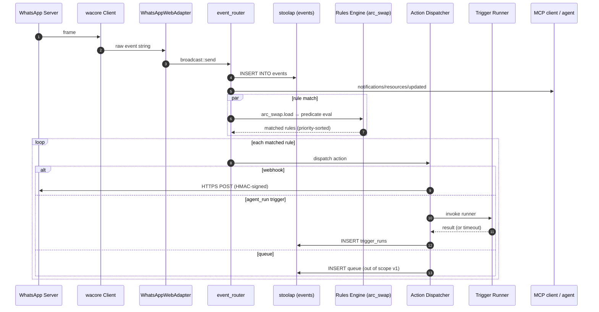
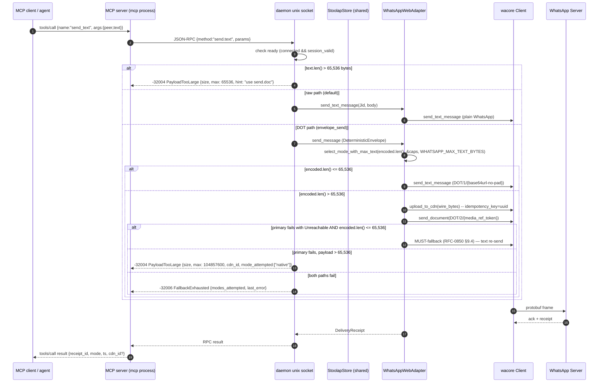
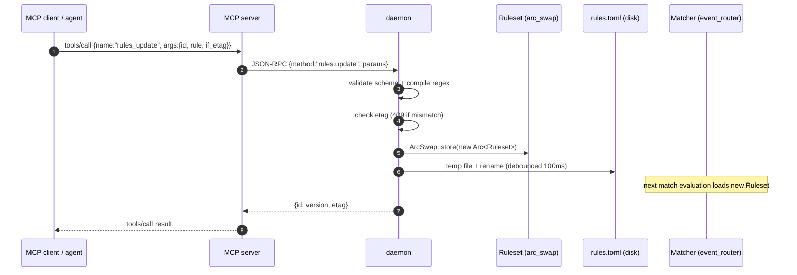

# Design: WhatsApp Runtime, CLI, and MCP Server

**Date:** 2026-07-04
**Status:** Approved (post-brainstorm)
**RFC:** RFC-0850 (Deterministic Overlay Transport)
**Crate:** `octo-whatsapp` (new), depends on `octo-adapter-whatsapp`, `octo-whatsapp-onboard-core`

## Overview

Build a single-binary runtime for the existing `octo-adapter-whatsapp` adapter that
exposes its full API surface to three consumers:

1. **Operators** via a structured CLI (`octo-whatsapp …`).
2. **AI agents** via an MCP server (`octo-whatsapp mcp`) over stdio JSON-RPC.
3. **External systems** via the daemon's unix-socket JSON-RPC or opt-in TCP.

The runtime owns the long-lived WhatsApp WebSocket and event stream; CLI and MCP
are thin clients of the daemon's IPC surface, so any consumer can stop, restart,
or migrate independently without dropping the WhatsApp session.

A **hot-replaceable rules engine** lets MCP agents create, update, enable,
disable, and delete event → action rules at runtime without daemon restart, with
audit history and etag-based optimistic concurrency.

## Goals

- **Max API coverage** — every public method on `WhatsAppWebAdapter` and its
  `CoordinatorAdmin` impl maps 1:1 to a CLI subcommand, an MCP tool, and an RPC
  method. See the subcommand tree below.
- **Raw + DOT separation** — default CLI is direct platform operations (raw);
  the DOT envelope path is explicit and gated.
- **Hot-mutable rules** — agents can reshape the event pipeline live.
- **No auto-onboard** — the daemon never pairs itself; operators always do.
- **Single shared stoolap handle** — no per-client stores, no deadlocks.
- **Resilient readiness** — `synced()` is unreliable in some runs; readiness
  is a 4-signal breakdown, not a single gate.

## Non-Goals (v1)

- Replacing the existing `octo-whatsapp-onboard` CLI — keep it; the new
  runtime delegates to it for `octo whatsapp onboard …` subcommands.
- Running an LLM inside the daemon — triggers delegate to configured runners
  (shell / HTTP / agent); the agent's model choice lives in the runner config.
- A distributed event bus between adapters — out of scope; the daemon is
  per-account.
- WASM plugin support — the runtime only ships the WhatsApp adapter; future
  adapters can use the same pattern.

## Current State (ground truth)

**`octo-adapter-whatsapp`** — Tier 3 DOT adapter (per RFC-0850 §8.1), pure-Rust
over `whatsapp-rust`. 5000+ LoC, ~30 adapter-specific methods plus the
20-method `CoordinatorAdmin` trait impl:

| Method group | Examples |
|---|---|
| Connection | `start_bot`, `run_reconnect_loop`, `connected`, `synced`, `has_valid_session`, `dropped_inbound_messages` |
| Sessions / state | `BotState`, `LoggedOutCause`, `register_group_at_runtime`, `list_all_conversations`, `list_persisted_conversations`, `persist_conversations` |
| Groups (platform) | `create_group_str`, `add_members`, `remove_members`, `promote_participants`, `demote_participants`, `set_subject`, `set_description`, `set_announce`, `set_locked`, `set_ephemeral`, `set_membership_approval`, `get_invite_link`, `get_invite_info`, `get_participating`, `group_metadata`, `leave_group` |
| Groups (admin) | `create_group`, `leave_group`, `destroy_group` (revoke + leave), `join_by_invite`, `add_member`, `remove_member`, `ban_member`, `promote_to_admin`, `demote_from_admin`, `approve_join_request`, `rename_group`, `set_group_description`, `set_locked`, `set_announce`, `set_ephemeral`, `set_require_approval`, `list_own_groups`, `get_group_metadata`, `resolve_invite`, `transfer_ownership` |
| Media | `upload_media`, `download_media`, `send_document` |
| DOT wire | `encode_envelope`, `decode_envelope`, `domain_hash`, `max_payload_bytes`, `rate_limit_per_second`, `from_config_bytes`, `subscribe_raw_events` |
| DOT trait | `send_message`, `receive_messages`, `capabilities`, `as_coordinator_admin`, `health_check`, `shutdown` |

**`StoolapStore`** — exposes `upsert_conversations`, `list_conversations`,
plus the wacore session/identity/prekey/sender-key/sync-key storage required by
`whatsapp-rust`.

**`octo-whatsapp-onboard`** — CLI with `qr-link`, `pair-link`, `whoami`,
`session list|verify|remove`. **No runtime CLI today** — once a session is
linked, nothing exposes the adapter's operation API to a shell or agent.

**Gap:** WhatsApp WebSocket must stay connected. There is no long-lived owner
that can also be addressed by an agent. The new runtime fills that gap.

## Architecture Shape

Single binary with multiple modes — mirrors `dockerd` / `gh` / `ollama`. One
systemd unit, one Docker image, one Cargo crate.

**Why a separate `octo-whatsapp` binary (not an `octo whatsapp` subcommand):**
- `crates/octo-cli/` (`bin: octo`) is the agent orchestrator and pulls in
  `octo-runtime` (Deno sandbox). Coupling WhatsApp's long-lived socket to
  the agent runtime is unwanted — WhatsApp sessions survive across the
  agent's lifecycle.
- systemd unit separation: one process = one responsibility, easier
  memory + restart isolation.
- The repo's established pattern (per `crates/octo-cli-meta/`,
  `crates/octo-telegram-onboard/`) is feature-gated meta-CLIs. `octo-whatsapp`
  follows that pattern, not the agent-CLI dispatch model.

**Relationship to existing crates**:
- `crates/octo-runtime/` is the daemon supervisor crate (CancellationToken,
  JoinHandles, signal handling). If `octo-runtime` exposes a public supervisor
  primitive, `daemon.rs` MUST reuse it; if not, document a formal rebuttal
  for why the WhatsApp runtime's supervisor must live in this crate
  instead. **Default: reuse `octo-runtime`'s supervisor.**
- `crates/octo-cli-meta/` is the meta-crate that aggregates
  `octo-telegram-onboard`, `octo-telegram-onboard-core`, etc. via feature
  flags. The new `octo-whatsapp` adds a `whatsapp-cli` feature there:
  ```toml
  # crates/octo-cli-meta/Cargo.toml
  [features]
  default = []
  whatsapp-cli = ["dep:octo-whatsapp"]
  whatsapp-cli-core = ["dep:octo-whatsapp-onboard-core"]
  ```
  Build: `cargo build -p octo-cli-meta --features whatsapp-cli`.
- `crates/octo-whatsapp-onboard` is **renamed-in-place** to a feature of
  the new `octo-whatsapp` binary's `onboard` subcommand (per Section 1.5);
  the old binary is removed. `octo-whatsapp-onboard-core` stays as a
  library crate.
- `octo-network` provides `PlatformAdapter` (DOT) and `CoordinatorAdmin`
  (group ops) traits — both implemented by `octo-adapter-whatsapp`. The
  runtime crate consumes these via `as_coordinator_admin` downcast and the
  `PlatformAdapter` trait object.

```
crates/octo-whatsapp/
├── Cargo.toml
├── src/
│   ├── lib.rs                    # re-exports + Runtime facade
│   ├── config.rs                 # WhatsAppRuntimeConfig (TOML)
│   ├── daemon.rs                 # long-lived: owns adapter + event router + rules
│   ├── events.rs                 # raw_event_t → typed InboundEvent
│   ├── ipc/
│   │   ├── mod.rs
│   │   ├── protocol.rs           # request/response types
│   │   └── server.rs             # unix-socket JSON-RPC server
│   ├── rules.rs                  # hot-mutable Ruleset (arc_swap)
│   ├── actions/
│   │   ├── mod.rs                # Action dispatcher
│   │   ├── webhook.rs
│   │   ├── mcp_notify.rs
│   │   ├── agent_run.rs          # trigger reference
│   │   └── shell.rs
│   ├── triggers.rs               # stateful trigger registry
│   ├── mcp_server.rs             # stdio JSON-RPC → daemon socket
│   ├── cli.rs                    # clap derive, all subcommands
│   └── main.rs                   # mode dispatch
└── tests/
```

### Subcommand tree (max coverage)

Legend: ✅ = already on `octo-adapter-whatsapp`; 🆕 = gap the runtime fills
(thin wrapper); 🚫 = impossible on WhatsApp. Deprecated adapter-inherent
forms (e.g. `create_group_str`, `get_participating`,
`promote_participants`, `demote_participants`, `add_members`,
`remove_members` as adapter-inherent) are 🔒; CLI/RPC/MCP routes through
the canonical `CoordinatorAdmin` trait methods (`add_member` singular,
`promote_to_admin`, etc.) per the Round 1 deprecation rule.

**CLI peer/JID conventions** (apply to every `<peer>`, `<jid>`, `<group-jid>`
positional):
- DM peer: `E.164` (`+15551234567`) OR `<digits>@s.whatsapp.net` OR
  `<digits>@lid`.
- Group: `<digits>@g.us` only.
- The leading `+` is stripped on normalization.
- Invalid forms return `-32602 InvalidParams` with
  `data.expected_format`.

**JID normalization helper** (`jids`): `peer_to_jid` (DM) and `group_to_jid`
(group) gate every CLI/RPC entry point. Tests cover all combinations.

```
octo-whatsapp
├── onboard {qr-link, pair-link, whoami, session list|verify|remove}      ✅ existing
├── daemon, mcp, status, version                                          🆕 runtime
├── reconnect, shutdown, doctor                                           🆕 ops
│
├── send                                          (high-level outbound — RAW by default)
│   ├── text      <peer> --text "…" [--reply-to ID] [--mentions JID,…]   ✅+🆕
│   ├── image     <peer> --file PATH [--caption "…"]                     🆕
│   ├── video     <peer> --file PATH [--caption "…"]                     🆕
│   ├── audio     <peer> --file PATH                                     🆕
│   ├── voice     <peer> --file PATH                                     🆕
│   ├── doc       <peer> --file PATH [--filename NAME]                   ✅ send_document
│   ├── sticker   <peer> --file PATH                                     🆕
│   ├── reaction  <peer> <msg-id> --emoji "👍"                            🆕
│   ├── poll      <peer> --question "…" --options a,b,c [--multi]        🆕
│   ├── contact   <peer> --vcard PATH                                    🆕
│   ├── location  <peer> --lat L --lon L --name "…"                      🆕
│   └── delete    <msg-id>           (delete-for-everyone)               🆕
│
├── messages
│   ├── list    [--peer JID] [--since TS] [--limit N] [--dir in|out]     🆕
│   ├── get     <msg-id>                                                 🆕
│   ├── search  <query> [--peer JID]                                     🆕
│   ├── edit    <msg-id> --new-text "…"                                  🆕
│   ├── mark-read <peer> [--up-to <id>]                                  🆕
│   └── download <token> --out PATH                                      ✅ download_media
│
├── chats
│   ├── list     [--kind dm|group]                                       ✅ list_conversations
│   ├── info     <jid>                                                   🆕
│   ├── pin|unpin <jid>                                                  🆕
│   ├── mute     <jid> [--until TS]                                      🆕
│   ├── archive  <jid>                                                   🆕
│   ├── delete   <jid>                                                   🆕
│   └── typing   <jid> --start|--stop                                    🆕
│
├── groups                       (full CoordinatorAdmin surface)
│   ├── create       --subject "…" [--members JID,JID] [--description]   ✅ create_group
│   ├── list         [--filter mine|admin|all]                           ✅ list_own_groups
│   ├── info         <jid>                                               ✅ group_metadata
│   ├── metadata     <jid>                                               ✅ get_group_metadata
│   ├── invite
│   │   ├── link    <jid> [--reset]                                      ✅ get_invite_link
│   │   ├── info    <code>                                              ✅ get_invite_info
│   │   └── resolve <code>                                              ✅ resolve_invite
│   ├── join-by-invite <code>                                            ✅ join_by_invite
│   ├── leave        <jid>                                               ✅ leave_group
│   ├── destroy      <jid>        (revoke + leave; 🚫 no true destroy)  ✅
│   ├── subject      <jid> --set "…"                                     ✅ set_subject
│   ├── description  <jid> --set "…"                                     ✅ set_description
│   ├── icon         <jid> --file PATH                                   🆕
│   ├── ephemeral    <jid> --ttl SECS|--off                             ✅ set_ephemeral
│   ├── locked       <jid> --on|--off                                    ✅ set_locked
│   ├── announce     <jid> --on|--off                                    ✅ set_announce
│   ├── approval     <jid> --on|--off                                    ✅ set_membership_approval
│   ├── members
│   │   ├── list     <jid>                                               ✅ get_participating
│   │   ├── add      <jid> --members JID,JID                             ✅ add_members
│   │   ├── remove   <jid> --members JID,JID                             ✅ remove_members
│   │   └── ban      <jid> --members JID,JID  (remove + revoke invites) ✅ ban_member
│   ├── admins
│   │   ├── list     <jid>                                               🆕
│   │   ├── promote  <jid> --members JID,JID                             ✅ promote_participants
│   │   └── demote   <jid> --members JID,JID                             ✅ demote_participants
│   ├── requests
│   │   ├── list     <jid>                                               🆕
│   │   └── approve  <jid> --members JID,JID                             ✅ approve_join_request
│   └── ownership
│       └── transfer <jid> --to JID                                      ✅ transfer_ownership
│
├── contacts
│   ├── list    [--limit N]                                              🆕
│   ├── get     <phone>                                                  🆕
│   ├── sync                                                             🆕
│   ├── block   <jid>                                                    🆕
│   └── unblock <jid>                                                    🆕
│
├── profile
│   ├── get                                                             🆕
│   ├── name      --set "…"                                              🆕
│   ├── status    --set "…" [--emoji]                                    🆕
│   └── picture   --file PATH                                            🆕
│
├── presence
│   ├── subscribe   <jid>                                                🆕
│   ├── unsubscribe <jid>                                                🆕
│   ├── send        <jid> --available|--unavailable                      🆕
│   └── list        [--online-only]                                      🆕
│
├── media
│   ├── upload      --file PATH [--kind …]                               ✅ upload_media
│   ├── download    <token> --out PATH                                   ✅ download_media
│   └── info        <token>                                              🆕
│
├── envelope                       (DOT path — explicit)
│   ├── send       <peer> --file <envelope.bin> [--mode text|native]     🆕
│   ├── send-native <peer> --file <payload.bin>                          🆕
│   ├── encode     [--file <wire.bin>]                                   🆕 encode_envelope
│   └── decode                                                           🆕 decode_envelope
│
├── capabilities                                                           🆕
│
├── domain
│   └── compute-hash <group-jid>                                          🆕 domain_hash
│
├── events
│   ├── tail   [--follow] [--since ID] [--filter jq]                      🆕
│   ├── list   [--limit N] [--since TS] [--type …]                        🆕
│   ├── show   <id>                                                       🆕
│   └── replay [--from ID] [--to ID]                                      🆕
│
├── rules                        (event → action engine, hot-mutable)
│   ├── list | show | create | update | patch | delete                   🆕
│   ├── enable | disable                                                 🆕
│   ├── test    --event JSON                                             🆕
│   ├── history <id> --limit N                                           🆕
│   └── reload                                                           🆕
│
├── triggers                     (stateful agent-target registry)
│   ├── list | show | create | update | delete                           🆕
│   ├── enable | disable | run                                           🆕
│   └── history <id> --limit N                                           🆕
│
├── session
│   ├── list | info | create | verify | remove | export                  ✅+🆕
│   ├── refresh --confirm-token <token>                                🆕 companion to onboard
│
├── debug                        (offline operator utilities — Round 2)
│   ├── inspect-db [--db PATH] [--tables ...]                            🆕
│   ├── audit-chain                                                    🆕
│   └── rules-toml                                                     🆕

├── daemon                       (multi-instance discovery — Round 2)
│   └── list [--socket-dir PATH]                                        🆕

├── tools                        (MCP tool enablement — runtime)
│   ├── list | enable | disable                                          🆕
│
├── config
│   └── show | validate | edit                                           🆕
│
├── logs
│   └── tail | since                                                     🆕
│
├── audit                        (audit log of all RPCs)
│   └── tail | since                                                     🆕
│
├── completion                  (clap_complete)
│   └── bash | zsh | fish | powershell | elvish                           🆕
│
├── man                          (clap_mangen)
└── --mcp-schema                  (full MCP manifest as JSON)             🆕
```

Total: ~45 top-level subcommands, ~140 leaf commands. Every leaf maps to one
RPC method and (where useful) one MCP tool.

## Daemon Lifecycle

**Process model.** Single tokio runtime, supervised multi-task. The `daemon`
subcommand replaces CLI arg parsing with daemon-mode dispatch.

The supervisor retains every `JoinHandle` and drives shutdown via a
`tokio_util::sync::CancellationToken`. `tokio::select!` is **not** used at the
top level — it would drop sibling branches on first completion, which is the
opposite of graceful shutdown.

**`bot_task` liveness.** `WhatsAppWebAdapter::start_bot()` returns `Ok(())`
after spawning `bot.run()` into a wacore-internal task and stashing the
`BotHandle` at `adapter.bot_handle: Arc<Mutex<Option<BotHandle>>>` (verified
at adapter.rs:1246-1248). The runtime's `bot_task` therefore holds the
`BotHandle` JoinHandle and `.await`s it; the task completes when the
wacore-side run task ends. A `bot_task` early-`Err` or panic translates
within ≤5s into `SessionLost` via the supervisor — the supervisor MUST
distinguish `bot_task Err at boot` from `Shutdown`. Two-task pattern:
**bot_task** holds the JoinHandle; **bot_health_watcher** polls `bot_handle`
and translates death into `SessionLost`.

```
main → tokio runtime → spawn:
  ├─ bot_task       (`.await`s `WhatsAppWebAdapter::start_bot()` then
  │                  holds the `BotHandle` JoinHandle; completes when the
  │                  wacore-internal `bot.run()` task ends. The runtime
  │                  does NOT call run_reconnect_loop — it is a no-op.)
  ├─ bot_health_watcher (watches bot_task JoinHandle; transitions daemon
  │                  to `SessionLost` on early return / panic; ≤5s)
  ├─ control_server (accepts unix socket connections; max_connections=64,
  │                  idle_timeout=5min, per-conn write deadline 100ms,
  │                  SO_PEERCRED/PID+starttime check on every accept)
  ├─ event_router   (subscribes to raw events; persists-before-fan-out;
  │                  per-sink bounded mpsc: subscribers=256, rules=1024;
  │                  subscribers first, rules last, drop-newest on overflow
  │                  with explicit Lagged counter per sink;
  │                  raw `broadcast::Sender<String>` capacity 1000 is
  │                  the FIRST loss point — the event_router has its OWN
  │                  mpsc into a `db_writer` task BEFORE the per-sink mpsc,
  │                  so the Lagged counter at the per-sink mpsc measures
  │                  per-subscriber loss, not daemon-wide loss)
  ├─ db_writer      (owns `DaemonState.store`; receives writes via
  │                  BOUNDED mpsc cap=4096 with drop-newest + counter;
  │                  serializes all stoolap writes; the bounded queue
  │                  is what bounds memory under slow-disk scenarios)
  ├─ rules_persister (SINGLE owner of rules.toml disk writes; receives
  │                  mutate requests via mpsc; debounce 100ms; atomic
  │                  temp-file + rename; flush on shutdown/cancel;
  │                  WAL at ~/.local/share/octo/whatsapp/rules.wal for
  │                  crash-safe sync durability on every swap)
  ├─ matcher_pool   (4 dedicated tasks consuming from a single rules mpsc;
  │                  rules mpsc BOUNDED cap=4096 with drop-newest +
  │                  `rules.swap_skipped` metric; arc_swap::Guard dropped
  │                  before any await on action dispatch; checks
  │                  StorageDegraded per-event)
  ├─ action_dispatcher (uses `tokio::task::JoinSet` (NOT `Vec<JoinHandle>`
  │                  with `try_join_all`) so per-rule completion is
  │                  non-blocking; semaphore=16 per-rule concurrency;
  │                  PGID kill on timeout)
  ├─ signal_handler (SIGTERM → graceful shutdown; SIGHUP → partial config
  │                  reload; SIGINT → same as SIGTERM)
  └─ health_reporter (periodic self-check; updates dropped_inbound,
                     last_event_ts, generations_resident, sink_lagged_total)
```

**Lock ordering (global).** All lock acquisitions in the runtime follow this
strict order to prevent deadlock:

1. `state.metrics` (AtomicU64 only — no Mutex)
2. `adapter.runtime_groups`
3. `adapter.client`
4. `adapter.self_phone`
5. `adapter.store` (init only — runtime hot path uses `DaemonState.store: Arc<StoolapStore>` cloned out at startup, see Stoolap sharing rule)
6. `arc_swap::ArcSwap::store` (writers only — readers are lock-free)

Lint: `clippy::await_holding_lock` plus a custom `await_holding_*` audit in
CI that scans for `lock().await` patterns.

**Send + Sync.** `DaemonState` and `WhatsAppWebAdapter` carry
`const _: () = assert_send_sync::<DaemonState>();` style compile-time
assertions so Send+Sync is verified, not discovered by a future spawn-site
compile error.

**Startup sequence.**

1. Load `WhatsAppRuntimeConfig` (TOML, XDG-style).
2. Open Unix control socket at `$XDG_RUNTIME_DIR/octo-whatsapp.sock`
   (fallback `~/.local/share/octo/whatsapp/daemon.sock`), mode `0600`.
3. Construct `WhatsAppWebAdapter::new(config)`, call `start_bot()`.
4. `tokio::select!` over the six tasks above.
5. Log structured `daemon.ready` event with socket path + PID.

### Readiness — 4-signal breakdown (NOT a single `synced()` gate)

`synced()` is unreliable: `HistorySync` may be skipped, delayed, or silently
fail in some test runs. Readiness is therefore a composite signal:

| Signal | Source | Meaning | Blocks RPCs? |
|---|---|---|---|
| `connected` | `DaemonState.connected: AtomicBool` (updated by `bot_task` watching `adapter.connected().notified()`) | WS handshake done | yes |
| `session_valid` | `adapter.has_valid_session()` | `session.db` decrypts + creds present | yes |
| `synced` | `DaemonState.synced: AtomicBool` (updated from `adapter.synced().notified()`) | HistorySync from server | **no** (soft hint) |
| `ready` | `connected && session_valid` | Daemon accepts outbound RPCs | derived |

`synced()` is a soft hint that history is available — it MUST NOT block RPC
readiness. Operators who want stricter gating opt in via `--require-sync`
(default **OFF**) with `--sync-timeout 120s` after which the daemon proceeds
and logs a warning.

**`status.get` RPC and CLI `octo whatsapp status` return the full
breakdown:**

```json
{
  "connected": true,
  "session_valid": true,
  "synced": false,
  "ready": true,
  "bot_state": "Connected",            // 7-variant BotState verbatim
  "dropped_inbound": 0,
  "last_event_ts": "2026-07-04T12:34:56Z",
  "last_event_ts_mono_ns": 1234567890,
  "uptime_secs": 3600,
  "daemon_version": "0.1.0",
  "api_version": "1.0.0+phase1",
  "sink_lagged_total": {"mcp": 0, "cli": 0},
  "rules_generations_resident": 2,
  "stoolap_persist_queue_depth": 0
}
```

`require_sync` is a daemon-level gate; toggling it via SIGHUP takes effect
within ≤1s without restart. `--require-sync` CLI flag and `[daemon]
require_sync` config have the same meaning; config wins if both set.

**BotState mapping to error codes** — `SessionLost` is split into three
codes so callers can branch on cause:

| `BotState` (from `state.rs`) | Error code (when blocking) | Notes |
|---|---|---|
| `Disconnected` (default) | n/a | daemon starting up |
| `PairingQr` / `PairingCode` | n/a | daemon is showing QR / pair code |
| `Connected` | n/a | normal operation |
| `Replaced` | `-32001a SessionLostReplaced` | multi-device pairing displaced us |
| `LoggedOut` | `-32001b SessionLostLoggedOut` | operator-initiated |
| `SessionExpired` | `-32001c SessionLostExpired` | needs re-pair |

### Session-loss path (no auto-onboard)

The daemon NEVER invokes `qr-link` or `pair-link` on its own. If `start_bot()`
fails with no valid session, or the adapter transitions to
`BotState::Replaced | LoggedOut | SessionExpired`, the daemon:

1. Stays running.
2. Marks itself `SessionLost`.
3. Refuses all outbound RPCs with error code `-32001 SessionLost` and message
   `"daemon cannot pair automatically; run 'octo whatsapp onboard qr-link'
   or 'pair-link' to authenticate"`.
4. Logs the event at WARN level every minute (rate-limited).
5. Optionally invokes a configured shell command if `auto_recover.notify_cmd`
   is set — for notification only, never auto-pairing.

When the operator runs `octo whatsapp onboard qr-link` (standalone), the
onboard CLI writes the new session file then sends a `session.refresh` control
message to the daemon's unix socket. The daemon re-reads the session, calls
`start_bot()` again, transitions back to `ready`. If no daemon is running,
the next `octo whatsapp daemon` invocation picks up the new session naturally.

### Stoolap sharing rule

One `Arc<WhatsAppWebAdapter>` lives in `DaemonState`. Its
`Arc<StoolapStore>` (already `Arc<Mutex<Option<Arc<StoolapStore>>>>` in the
adapter) is the ONLY store handle in the runtime. The invariant is enforced
at startup and per RPC:

1. **Init:** `start_bot()` populates `adapter.store`; the runtime immediately
   clones the inner `Arc<StoolapStore>` into `DaemonState.store`. From that
   point on, `adapter.store` is init-only — no RPC path touches it.
2. **Hot path:** all RPC paths use `DaemonState.store` directly. The adapter's
   `self.store.lock()` is held for at most one statement (clone-out), never
   across an await — same discipline the adapter uses in `send_message`.
3. **One writer at a time:** writes go through a dedicated `db_writer` task
   owning `DaemonState.store` and receiving requests via unbounded mpsc. This
   serializes all writes (preserving the adapter's single-writer invariant)
   while letting RPC handlers queue without holding any lock.
4. **Reader isolation:** read-only queries (`messages.list`, `events.list`)
   use the same `Arc<StoolapStore>` via short-lived read transactions; the
   `db_writer` and readers never share a Mutex — stoolap handles concurrent
   reads natively.

**No RPC handler, CLI subcommand, or MCP tool may call `StoolapStore::new()`
or open a second handle to the same file.** Enforcement:
- A unit test (`tests/it_stoolap_uniqueness.rs`) greps the crate for
  `StoolapStore::new(` outside the adapter's own `start_bot()` and outside
  the existing offline binaries (`bin/event_listener.rs`,
  `bin/inspect_session_db.rs`, `bin/cleanup_test_groups.rs` — explicitly
  documented as offline).
- A second test greps the crate for `stoolap::Database::open(` outside the
  adapter's `start_bot()` and the three offline binaries.
- A third test asserts every RPC handler reads `DaemonState.store`, never
  `adapter.store`.

Why: a separate per-client store handle would deadlock with the adapter's
existing handle (both writing to the same DB file). The
`inspect_session_db`, `event_listener`, and `cleanup_test_groups` binaries
remain read-only offline tools and are explicitly NOT wired into any RPC.

**Multi-instance safety.** When `--name NAME` is used, the session_path is
templated: `~/.local/share/octo/whatsapp/{NAME}.session.db`. Startup acquires
`flock(LOCK_EX|LOCK_NB)` on the session file; collision with another live
daemon fails fast with `session_locked`.

## IPC Contract

Newline-delimited JSON-RPC 2.0 over the unix socket. Every request:

```json
{ "id": 42, "method": "groups.create", "params": { "subject": "ops", "members": ["5511…"] } }
```

Response:

```json
{ "id": 42, "result": { "group_jid": "120363…@g.us", "invite_url": "https://…" } }
```

or

```json
{ "id": 42, "error": { "code": -32001, "message": "SessionLost" } }
```

### RPC methods (mirrors CLI 1:1)

```
status.get, version.get
health.get, reconnect.now, shutdown

send.text, send.image, send.video, send.audio, send.voice, send.doc,
send.sticker, send.reaction, send.poll, send.contact, send.location,
send.delete

messages.list, messages.get, messages.search, messages.edit,
messages.mark_read, messages.download

chats.list, chats.info, chats.pin, chats.unpin, chats.mute, chats.archive,
chats.delete, chats.typing

groups.create, groups.list, groups.info, groups.metadata,
groups.invite.link, groups.invite.info, groups.invite.resolve,
groups.join_by_invite, groups.leave, groups.destroy,
groups.subject, groups.description, groups.icon,
groups.ephemeral, groups.locked, groups.announce, groups.approval,
groups.members.list, groups.members.add, groups.members.remove, groups.members.ban,
groups.admins.list, groups.admins.promote, groups.admins.demote,
groups.requests.list, groups.requests.approve,
groups.ownership.transfer

contacts.list, contacts.get, contacts.sync, contacts.block, contacts.unblock
profile.get, profile.name, profile.status, profile.picture
presence.subscribe, presence.unsubscribe, presence.send, presence.list
media.upload, media.download, media.info

protocol.envelope.send, protocol.envelope.send_native,
protocol.envelope.encode, protocol.envelope.decode
protocol.capabilities, protocol.domain_hash

events.tail, events.list, events.show, events.replay

rules.list, rules.get, rules.create, rules.update, rules.patch,
rules.delete, rules.enable, rules.disable,
rules.test, rules.history, rules.reload

triggers.list, triggers.get, triggers.create, triggers.update,
triggers.delete, triggers.enable, triggers.disable,
triggers.run, triggers.history

session.list, session.info, session.create, session.verify, session.remove
session.refresh          (signals the daemon to re-read session.db)

tools.list, tools.enable, tools.disable
config.show, config.validate
logs.tail, logs.since
audit.tail, audit.since
```

### Error codes

| Code | Name | Emitted by | When |
|---|---|---|---|
| -32700 | ParseError | all RPC | malformed JSON |
| -32600 | InvalidRequest | all RPC | missing id/method |
| -32601 | MethodNotFound | all RPC | unknown verb (or unknown MCP tool translated to this) |
| -32602 | InvalidParams | all RPC | schema validation failed; for MCP `tools/call` to unknown tool |
| -32603 | InternalError | all RPC | unexpected panic |
| -32001a | SessionLostReplaced | outbound RPC | `LoggedOutCause::Replaced` observed |
| -32001b | SessionLostLoggedOut | outbound RPC | `BotState::LoggedOut` observed |
| -32001c | SessionLostExpired | outbound RPC | `BotState::SessionExpired` observed |
| -32002 | NotConfigured | `start_bot`, `daemon.reconfig` | daemon missing required config |
| -32003 | RateLimited | all outbound RPC, rule creates, tool toggles | per-peer, global, or rule-create limit hit |
| -32004 | PayloadTooLarge | `send.*`, `envelope.*`, `media.upload` | exceeds 65,536 bytes for text mode OR exceeds 100 MiB for native mode OR envelope file too large |
| -32005 | GroupNotAdmin | `groups.*` admin operations | operation requires admin (e.g. set_ephemeral by non-admin) |
| -32006 | FallbackExhausted | `send.*` native mode | native upload + text fallback both failed |
| -32007 | PayloadTooLargeForTrigger | `triggers.run` | message text exceeds ARG_MAX for env-var dispatch |
| -32008 | EscalationFailed | `actions.escalate` | escalation target unreachable after retries |
| -32009 | ToolDisabled | MCP `tools/call` | tool was enabled when listed, disabled before call landed |
| -32010 | PeerNotAllowed | outbound RPC | target JID/phone not in peer_allowlist |
| -32011 | StoreNotReady | stoolap-backed RPC | called before `start_bot()` populated `DaemonState.store` |
| -32012 | NotConnected | outbound RPC | `connected=false` (WS dropped, not yet reconnected) |
| -32013 | EditWindowExpired | `messages.edit` | edit window closed (typically 1 hour, server-side) |
| -32014 | DeleteWindowExpired | `send.delete`, `messages.delete` | delete-for-everyone window closed |
| -32015 | BackoffCancelled | `reconnect.now` | operator forced immediate reconnect while one was in progress |
| -32020 | RuleConflict | `rules.update`, `rules.patch` | etag mismatch (RFC 8785 canonical JSON used for hashing) |
| -32021 | RuleRegexUnsafe | `rules.create`, `rules.update` | regex pattern fails compile-time ReDoS classifier |
| -32022 | RuleMatchTimeout | `rules.match` | predicate exceeded regex timeout (default 10ms) |
| -32030 | TriggerDisabled | `triggers.run` | trigger.enabled = false |
| -32040 | UploadPathDenied | `media.upload`, `send.* --file`, `profile.picture`, `groups.icon` | path outside allowed_upload_roots or fails openat2 RESOLVE_BENEATH |
| -32050 | Internal | RPC adapter | uncategorized adapter error (string from `Result<T, String>`) |
| -32060 | Unimplemented | `CoordinatorAdmin::*` | `PlatformAdapterError::Unimplemented { platform, action }` |
| -32099 | ShuttingDown | outbound RPC | SIGTERM in flight, refusing new RPCs until drain completes |

### Auth & access

- Socket file mode `0600`, owned by daemon UID; `SO_PEERCRED` check on every
  accept rejects foreign UIDs.
- TCP listener (opt-in via `[daemon] tcp_listen = "127.0.0.1:7777"`) requires
  `Authorization: Bearer …` with a token read from env at daemon start.
- `--allow-non-loopback-tcp` is required to bind `0.0.0.0`; a banner is logged
  on every bind.

## Event Stream, Rules Engine, Triggers

### InboundEvent (typed)

The raw broadcast from the adapter is `tokio::sync::broadcast::Sender<String>`
of capacity 1000 (adapter.rs). This channel is **lossy by design**: subscribers
that fall behind receive `RecvError::Lagged(n)` and the events themselves are
gone — the design never claims "no event loss".

```rust
enum InboundEvent {
    Message { id, peer, sender, ts, ts_mono_ns, kind, text, media_token?, reply_to?, mentions: SmallVec<[Jid; 8]>, is_group },
    Reaction { id, target_msg_id, emoji, from, peer, ts, ts_mono_ns },
    GroupChange { group_jid, kind: Join|Leave|Promote|Demote|Subject|Icon|Description, actor, target, ts, ts_mono_ns, after },
    Presence { jid, kind: Available|Unavailable|Typing|Recording, last_seen },
    Connection { kind: Connected|Disconnected|Replaced|LoggedOut|Synced, cause: Option<LoggedOutCause>, ts, ts_mono_ns },
    Receipt { msg_id, peer, kind: Read|Delivered|Played, ts, ts_mono_ns },
    Call { id, peer, kind: Voice|Video, state: Offered|Accepted|Rejected|Terminated, ts, ts_mono_ns },
    Story { id, peer, kind: Posted|Viewed, ts, ts_mono_ns },
    Unknown { raw, ts, ts_mono_ns },         // fallback for unrecognized wacore events
}
```

**InboundEvent parser location.** `events.rs` owns the `String → InboundEvent`
parser. Input format is `format!("{:?}", ev)` produced by the adapter's
`on_event` closure (the same format `event_listener.rs` already prints).
Parser maintainers: when wacore emits a new event kind, add the variant here
and an `Unknown` fallback for unmapped cases.

**Timestamp policy.** Every event carries both `ts` (wall clock, NTP-corrected
at startup) and `ts_mono_ns` (monotonic nanos since boot). Wall-clock events
with `ts > now() + 60s` are flagged `untrusted=true` and emitted with a
`daemon.clock_skew` event. `events.list` accepts `--since-ts` (wall) and
`--since-mono` (monotonic); prefer monotonic for replay across clock jumps.

**Persister-before-fan-out.** Every event is persisted to stoolap table
`events` before fan-out. Persist goes through the `db_writer` task to avoid
back-pressure on the rules engine and subscribers:

```sql
CREATE TABLE events (
    id              BIGINT PRIMARY KEY,
    ts              TEXT    NOT NULL,    -- RFC 3339 wall clock
    ts_mono_ns      INTEGER NOT NULL,    -- monotonic since boot
    kind            TEXT    NOT NULL,
    peer            TEXT,
    sender          TEXT,
    payload_json    TEXT    NOT NULL,
    rule_id_fired   TEXT,
    action_results  TEXT,
    persist_failed  INTEGER DEFAULT 0,
    untrusted       INTEGER DEFAULT 0    -- 1 if ts > now() + 60s
);
CREATE INDEX idx_events_ts ON events(ts);
CREATE INDEX idx_events_peer ON events(peer);
CREATE INDEX idx_events_kind ON events(kind);
```

**Retention** is bounded by `[events] retention_days` (default 30),
`max_rows` (default 1,000,000). Daemon evicts oldest beyond cap on each
insert in batches of 1000 rows/transaction. Eviction emits a
`daemon.events.evicted_total` metric.

**Loss recovery.** Subscribers experiencing `RecvError::Lagged(n)` use
`events.list --since-id <last_seen>` to backfill. The Lagged count is
surfaced per sink in `status.get`.

**InboundEvent bounding.** `mentions` is `SmallVec<[Jid; 8]>` — longer
mention lists truncate with a `mentions_truncated=true` flag. `text` over
64 KiB truncates in the events table (full text available via
`messages.get`). This bounds memory and stoolap page size.

### Fan-out

Three downstream sinks, all non-blocking via per-sink bounded mpsc:

1. **MCP subscribers** — for each MCP client that called `events.tail`, push
   typed JSON via the per-client write task.
2. **CLI subscribers** — same shape, used by `octo whatsapp events tail --follow`.
3. **Rules engine** — feeds `Arc<Ruleset>` for matching.

### Hot-replaceable rules (load-bearing)

Rules are **runtime state**, not config:

```rust
struct Rule {
    id: String,                  // slug, unique
    version: u64,                // monotonic per id
    enabled: bool,
    priority: i32,               // higher matches first
    match: Predicate,            // event_kind, peer_glob, sender_glob, text_regex, …
    cooldown_ms: u64,            // min time between fires
    ttl_until: Option<Ts>,      // auto-expire
    actions: Vec<Action>,        // ordered
    created_by: String,          // "operator" | "mcp:<session_id>"
    created_at: Ts, updated_at: Ts,
    etag: String,                // hash(version || match_json || actions_json)
}
```

Storage: `arc_swap::ArcSwap<Ruleset>` (lock-free reads, atomic swap on write).
Each matcher holds an `arc_swap::Guard` per evaluation → consistent snapshot,
no torn reads. Per-rule CRUD hits a `DashMap<RuleId, Arc<Rule>>` inside the
Ruleset; whole-file `rules.reload` swaps the whole `ArcSwap`. Mutations never
block the matcher hot path.

**Hot mutation safety:**

- All writes go through `DaemonState::mutate_rules(closure)` which validates
  (schema + action kind + ReDoS-classifier on text_regex), bumps version,
  persists to disk via temp-file + rename (single-owner `rules_persister`
  task — see Process Model), and swaps atomically.
- Disk writes are debounced 100 ms (burst-safe) but flush on
  `rules.delete` / daemon shutdown / `rules.flush` RPC. **Loss window is
  documented:** up to 100 ms of rule changes may be lost on a hard crash
  (OOM, SIGKILL, power loss) before the debounce fires. Operators who need
  stronger durability call `rules.flush` or wait ≥100 ms before critical
  steps.
- Concurrent edits: `update` requires the caller's `etag`; mismatch returns
  `RuleConflict` (`-32020`) with current etag + version → caller re-reads,
  retries. ETag is `sha256(canonical_json({version, match, actions}))` where
  `canonical_json` follows RFC 8785 (JSON Canonicalization Scheme) — no
  spurious conflicts from key ordering or whitespace.
- In-flight matchers: predicate evaluation holds the `arc_swap::Guard` only
  long enough to clone a `Vec<Arc<Action>>` for the matched rules. The guard
  is dropped **before** any await on action dispatch. This prevents the old
  `Arc<Ruleset>` from being pinned for the duration of a slow action.
- GC: a `sweeper` task wakes every 1 s, walks in-flight generations, and
  drops any whose `Drop` would release the last `Arc`. Bounded
  `rules.generations_resident` gauge; default cap 16; overflow skips the
  swap with a warning and a `rules.swap_skipped` metric (the in-flight
  matchers will finish against the previous generation).
- `rules.test --event JSON` evaluates against the in-memory Ruleset and
  returns `{ matched: [...], would_fire: [{rule_id, action_kind}] }`
  WITHOUT executing actions. `--execute-actions` opt-in flag (default
  false) is gated to a separate `rules.execute` capability, NOT in the
  default `all-non-envelope` set.
- `rules.create` / `rules.update` rate-limited to 10/min per caller_uid;
  `rules.create` defaults to a `rule_draft` state that requires
  `rules.approve` (operator scope) before firing — unless
  `[security] auto_approve_rules = true`.
- An MCP agent can call `rules.create` / `rules.update` / `rules.delete` /
  `rules.enable` / `rules.disable` at any time without daemon restart.

### Triggers (stateful agent targets)

A trigger is a named, invokable definition of "run agent X with input Y":

```rust
struct Trigger {
    id: String,
    version: u64,
    enabled: bool,
    runner: RunnerSpec,          // Shell | Http | Agent
    rate_limit: Option<RateLimit>,
    timeout_ms: u64,
    retries: u32,
    last_run: Option<RunRecord>,
    history_cap: u32,
}
```

Rules dispatch to triggers via `Action::AgentRun(trigger_id)`;
`triggers.run` invokes one directly. State in stoolap `triggers` and
`trigger_runs` tables.

## MCP Server

`octo whatsapp mcp` is a thin wrapper: connects to the daemon's unix socket,
forwards `tools/list` / `tools/call` / `resources/read` to daemon-side
counterparts, returns results. Holds no WhatsApp WebSocket. Multiple MCP
clients may share one daemon.

### Features used

- **Tools** (~50): `send_text`, `send_image`, `send_reaction`, `send_poll`,
  `send_contact`, `send_location`, `mark_read`, `delete_message`, `edit_message`,
  `download_media`, `list_chats`, `get_chat_info`, `list_messages`, `search_messages`,
  `create_group`, `list_groups`, `get_group_info`, `get_group_metadata`,
  `get_invite_link`, `resolve_invite`, `join_by_invite`, `leave_group`,
  `set_subject`, `set_description`, `set_group_icon`, `set_ephemeral`,
  `set_locked`, `set_announce`, `set_require_approval`, `add_members`,
  `remove_members`, `ban_members`, `promote_admins`, `demote_admins`,
  `list_join_requests`, `approve_join_requests`, `transfer_ownership`,
  `list_contacts`, `get_contact`, `block`, `unblock`, `get_profile`,
  `set_profile_name`, `set_profile_status`, `subscribe_presence`,
  `send_presence`, `subscribe_events`, `list_rules`, `apply_rule`,
  `list_triggers`, `run_trigger`, plus the DOT trio: `envelope_send`,
  `envelope_encode`, `envelope_decode`, `capabilities`, `domain_compute`.
- **Resources** (read-only views): `whatsapp://chats/{jid}`,
  `whatsapp://groups/{jid}/members`, `whatsapp://groups/{jid}/admins`,
  `whatsapp://messages/{id}`, `whatsapp://events/{id}`,
  `whatsapp://rules/{id}`, `whatsapp://triggers/{id}`.
- **Prompts** (templated): `summarize_chat {jid}`, `draft_reply {msg_id}`,
  `triage_inbound {since}`.
- **Notifications**: `notifications/tools/list_changed` (when `tools.enable`
  toggles), `notifications/resources/updated`, `notifications/progress` for
  long ops.
- **Sampling/elicitation**: not used. The daemon never calls the agent's LLM.
- **Roots**: supported; scopes `media.upload` paths.

### Tool enablement at runtime

The daemon holds `Arc<RwLock<HashSet<ToolName>>>` of currently-enabled MCP
tools. `tools.enable` / `tools.disable` (also CLI) mutate this set; on change,
daemon emits `notifications/tools/list_changed`. Initial set from
`[mcp] enabled_tools` (default = `all-non-envelope`, i.e. all except the DOT
trio, for safety).

## CLI

`clap` derive. Single dispatch in `src/cli.rs`. Output formats:

- default: human table for tables, pretty JSON for nested, color on TTY
- `--json`: always JSON; one object per line for streams (`events.tail`,
  `rules.test`)
- `--yaml`: only for config dumps (`config show`, `rules.get`)
- `--quiet`: suppress progress, errors only
- `--socket PATH`: override daemon socket (tests, multi-instance)
- `--no-daemon`: force standalone (only meaningful for `onboard`; error
  otherwise)
- `--name NAME`: select among multiple daemons (default `default`)

Subcommand execution: `cli::run(args)` resolves each verb to one or more
daemon RPC calls via a single `RpcClient` connection. Errors from the daemon
are mapped to typed CLI errors with suggested fixes (`SessionLost` →
"run `octo whatsapp onboard qr-link`"; `PayloadTooLarge` → "switch to
`send doc` with media upload").

Discoverability:

- `octo whatsapp <subcommand> --help` (clap native)
- `octo whatsapp completion bash|zsh|fish|powershell|elvish` via
  `clap_complete`
- `octo whatsapp man` via `clap_mangen` → `target/man/`
- `octo whatsapp --mcp-schema` prints the full MCP manifest as JSON

Multi-instance: `--name NAME` gives each daemon its own socket
`$XDG_RUNTIME_DIR/octo-whatsapp-NAME.sock` and session. Useful for multi-account
WhatsApp Web sessions.

## Raw vs DOT Protocol Paths

Two distinct surfaces, made explicit:

| Use case | Want | Path |
|---|---|---|
| Operator / agent scripting WhatsApp | "send this text", "create this group", "react with 👍" | **Raw** — direct platform API, no envelope |
| DOT interop with `octo-network` | "send this DeterministicEnvelope" | **DOT** — explicit envelope-aware operations |

**Default CLI is raw.** `octo whatsapp send text alice "hello"` sends a plain
WhatsApp text message — no `DOT/1/` prefix, no base64, no envelope.

**Pre-flight ceiling on raw text.** The raw `send.text` path enforces the
same 65,536-byte ceiling as the DOT path's `select_mode_with_max_text` (the
adapter's actual call uses `encoded.len()` per RFC-0850 §8.6). Text over
65,536 bytes returns `-32004 PayloadTooLarge` with hint `"use send.doc"`,
without contacting WhatsApp. The text-mode ceiling is documented as
`≤65,536` inclusive; the boundary is tested in CI with both 65,536-byte and
65,537-byte payloads.

**Explicit DOT namespace:**

```
octo whatsapp envelope send         <peer> --file <envelope.bin>
                                    # DeterministicEnvelope wire bytes; mode
                                    # selected deterministically by the adapter
                                    # (RFC-0850 §8.6). No --mode flag.
octo whatsapp envelope send-native  <peer> --file <wire.bin>
                                    # Uploads the wire bytes via the wacore
                                    # document path and sends a text message
                                    # carrying the DOT/2/{media_ref_token}
                                    # reference (RFC-0850 §8.6 line 804).
                                    # Input MUST be raw wire bytes; rejects
                                    # inputs that already start with "DOT/".
octo whatsapp envelope encode       [--file <wire.bin>]
                                    # Input: binary wire bytes.
                                    # Output: DOT/1/{base64url-no-pad} to stdout
                                    # (RFC 4648 §5). Delegates to
                                    # WhatsAppWebAdapter::encode_envelope.
octo whatsapp envelope decode
                                    # Input: DOT/1/{base64url-no-pad} from stdin.
                                    # Output: binary wire bytes to stdout.
                                    # Rejects inputs missing the DOT/1/ prefix
                                    # with the adapter's verbatim error.
                                    # Delegates to decode_envelope.
octo whatsapp capabilities
                                    # Returns CapabilityReport (RFC-0850 §8.2
                                    # Platform Adapter Contract — invoked per
                                    # §8.4 Lifecycle step 3; NOT §8.1).
                                    # Expected shape:
                                    # {
                                    #   max_payload_bytes: 65536,
                                    #   supports_fragmentation: false,
                                    #   supports_raw_binary: false,
                                    #   rate_limit_per_second: 20,           # global, not per-peer (see below)
                                    #   media_capabilities: {
                                    #     max_upload_bytes: 104857600,
                                    #     supported_mime_types: ["application/octet-stream"]
                                    #   }
                                    # }
                                    # Image/video/audio uploads should use
                                    # send.image / send.video / send.audio
                                    # MCP tools, NOT envelope send-native.
octo whatsapp domain compute-hash   <digits or <digits>@g.us>
                                    # BLAKE3-256("whatsapp:" + lowercase(trim(input)))
                                    # Input MUST be digits or <digits>@g.us.
                                    # Other forms (e.g. <digits>@lid,
                                    # <digits>@s.whatsapp.net, raw +E.164)
                                    # are rejected with the same error as
                                    # adapter.rs:637 group_to_jid.
```

**Inbound** is also typed and raw by default. `events.tail/list/show/replay`
returns `InboundEvent` (Section "InboundEvent") — NOT DOT envelopes. The DOT
canonicalization path (`receive_messages` → `RawPlatformMessage`) is internal
only; explicit `octo whatsapp envelope tail-dot` exists for DOT-node
integration.

**MCP default tool set** (`all-non-envelope`) hides the DOT trio from agents
unless explicitly enabled. Prevents accidental wrapping of agent arguments
in DOT envelopes.

## Workspace Integration

The new crate `octo-whatsapp` integrates with the existing workspace as
follows.

**Root `Cargo.toml` changes**:
```toml
[workspace]
members = ["crates/*"]
exclude = [
    "determin",
    "octo-sync",
    "octo-transport",
    "quota-router",
    "sync-e2e-tests",
    "crates/quota-router-pyo3",
    "crates/octo-telegram-onboard",
    "crates/octo-telegram-onboard-core",
    "crates/octo-whatsapp",           # NEW — meta-gated via octo-cli-meta
    "crates/octo-whatsapp-onboard",   # NEW — removed (folded into octo-whatsapp onboard subcommand)
]
```

**`octo-whatsapp/Cargo.toml` `[dependencies]`**:
```toml
[dependencies]
# Internal
octo-adapter-whatsapp      = { path = "../octo-adapter-whatsapp" }
octo-whatsapp-onboard-core = { path = "../octo-whatsapp-onboard-core" }
octo-network               = { path = "../octo-network" }
octo-runtime               = { path = "../octo-runtime" }      # supervisor primitives

# Async + serialization
tokio       = { workspace = true }       # tokio = "1.35" features=["full"]
tokio-util  = { workspace = true }       # CancellationToken (rt feature already enabled)
arc-swap    = "1"                        # ArcSwap<Ruleset> lock-free reads
serde       = { workspace = true }
serde_json  = { workspace = true }

# CLI + completion + man pages
clap           = { version = "4.5", features = ["derive", "wrap_help"] }
clap_complete  = "4.5"
clap_mangen    = "0.2"

# Observability
tracing            = { workspace = true }
tracing-subscriber = { version = "0.3", features = ["env-filter", "json"] }
tracing-appender   = "0.2"

# JSON-RPC + MCP
serde_json        = { workspace = true }
# Optional: rmcp = "0.5" (the Rust MCP SDK) — see Cross-cutting §MCP protocol

# Security (Linux-only where noted)
subtle            = "2"                    # ConstantTimeEq
keyring           = { version = "3", features = ["apple-native", "linux-native", "windows-native"], optional = true }
landlock          = { version = "0.4", optional = true }                      # Linux-only, #[cfg(target_os = "linux")]
seccompiler       = { version = "0.5", optional = true }                      # Linux-only
openat2           = { version = "0.1", optional = true }                      # Linux-only

# Schema generation (MCP tool input schemas)
schemars          = { version = "0.8", features = ["derive"] }

# Stoolap is NOT a direct dep — only via octo-adapter-whatsapp. Enforced
# by the grep invariant test (see §Stoolap sharing rule). Adding it here
# directly would let a future contributor bypass DaemonState.

[features]
default        = []
live-whatsapp  = ["octo-adapter-whatsapp/live-whatsapp"]   # for live e2e tests
landlock       = ["dep:landlock"]                          # opt-in: enable Landlock
seccomp        = ["dep:seccompiler"]                       # opt-in: enable seccomp
openat2        = ["dep:openat2"]                           # opt-in: enable openat2

[dev-dependencies]
tempfile       = "3"
assert_cmd     = "2"
predicates     = "3"
loom           = { version = "0.7", optional = true }       # loom tests under cfg(feature = "loom")
```

**Stoolap dep direction (enforced):** `octo-whatsapp` MUST NOT declare
`stoolap = "..."` directly. All stoolap access goes through `DaemonState.store:
Arc<StoolapStore>` cloned out of `octo-adapter-whatsapp`'s
`Arc<Mutex<Option<Arc<StoolapStore>>>>` at startup. Verified by grep test
`tests/it_stoolap_uniqueness.rs` (already specified in §Stoolap sharing rule).

**Live e2e test** (continues to work as-is): `crates/octo-adapter-whatsapp/tests/live_e2e_group_setup_test.rs:379`
calls `add_members(...)` directly. This is **acceptable** — that test exercises
the adapter-inherent form as a focused e2e scenario for the adapter crate,
NOT the runtime's production path. The runtime's `groups.members.add` RPC
routes through `CoordinatorAdmin::add_member` (singular). The test is
intentionally separate from the runtime's parity guarantee; the runtime
regression tests (`tests/it_ipc_roundtrip.rs`) cover the canonical path.

## CI Integration

Per `CLAUDE.md` mandate (`cargo clippy --all-targets --all-features --
-D warnings`) and the `octo-cli-meta` pattern from `telegram-cli`:

```yaml
# .github/workflows/ci.yml (excerpt — new lines)
- name: cargo check — whatsapp-cli
  run: cargo check -p octo-cli-meta --features whatsapp-cli

- name: cargo clippy — whatsapp-cli
  run: cargo clippy -p octo-cli-meta --features whatsapp-cli,landlock,seccomp,openat2 --all-targets -- -D warnings

- name: cargo test — whatsapp runtime (hermetic)
  run: cargo test -p octo-cli-meta --features whatsapp-cli --test it_ipc_roundtrip --test it_rules_hot_swap --test it_event_router_persistence --test it_stoolap_uniqueness --test it_send_text_ceiling --test it_session_refresh_confirmation --test it_bot_liveness --test it_parity_table --test it_spki_rotation --test it_token_rotation_restart --test it_mcp_flood --test it_healthcheck_contract

- name: cargo test — whatsapp live e2e (gated)
  if: github.event.label == 'live-whatsapp'
  run: cargo test -p octo-adapter-whatsapp --features live-whatsapp --test live_session_test --test live_e2e_group_setup_test -- --include-ignored --nocapture --test-threads=1
```

**Coverage toolchain:** `cargo-llvm-cov` (the established choice in this
repo). Per-module coverage targets:

| Module | Line | Branch | Rationale |
|---|---|---|---|
| `protocol.rs` (RPC types + handler dispatch) | ≥ 90% | ≥ 80% | Schema-validated; integration tests cover each method |
| `cli.rs` (clap dispatch) | ≥ 85% | ≥ 75% | Default `--help` paths partially covered by smoke |
| `mcp_server.rs` | ≥ 85% | ≥ 75% | Hand-rolled JSON-RPC; tested via `it_mcp_tool_dispatch` |
| `daemon.rs` (supervisor) | ≥ 80% | ≥ 70% | OS-level signals; some paths env-only |
| `rules.rs` (predicate evaluator) | ≥ 90% | ≥ 85% | Mutation-tested separately |
| `triggers.rs` | ≥ 75% | ≥ 65% | OS sandbox calls integration-only |
| `actions/{webhook,agent_run,shell,mcp_notify}.rs` | ≥ 80% | ≥ 70% | Action dispatcher covers happy path |

**Coverage exclusions** (explicit): `#[cfg(not(target_os = "linux"))]`
mod landlock_bridge/seccomp_bridge/openat2_bridge are excluded on non-Linux
CI runners; `live-whatsapp` test paths are excluded from the gate (matches
telegram/tdlib exclusion precedent).

## MCP Protocol Version

The MCP server pins **`protocolVersion: "2025-06-18"`** (the latest stable
revision as of design date). This revision includes structured content,
elicitation, and the notifications/resources/updated semantics used by the
design. Earlier revisions (2024-11-05, 2025-03-26) are NOT supported.

**Schema generation strategy:** Tool input schemas are derived from
`schemars` (JsonSchema derive) on the existing
`octo_network::dot::adapters::*` request types where possible; hand-written
JSON Schema for RPC types that don't yet have JsonSchema derives. The
`schemars` strategy is preferred — single source of truth, automatic
update on type changes.

**Reference SDK considered:** `rmcp` (https://github.com/modelcontextprotocol/rust-sdk).
**Decision:** `rmcp` is **NOT used** in v1. Rationale (formal rebuttal):
`rmcp`'s request handlers are tightly coupled to its `ServerHandler` trait,
which would force all 96 RPC methods to live in `rmcp`'s handler model. The
runtime's design needs the RPC methods to be callable from both the
daemon-internal IPC (over unix socket) AND the MCP server (over stdio) AND
the CLI (in-process). Three parallel dispatch surfaces in one model is
harder to maintain than three thin adapters in front of one set of pure
`async fn`. **Round 3 reviewer finding round3-cross-03 rebutted**: reuse
`rmcp`'s schema generation helpers (`schemars` integration) but not its
handler framework. `rmcp` may be revisited in a future phase if its
handler model gains the flexibility we need.

Single TOML at `$XDG_CONFIG_HOME/octo-whatsapp/config.toml`. Schema validated
at startup via `figment` + `serde`; invalid config refuses to start with the
exact field path that failed. Env-var overrides via `OCTO_WHATSAPP_*` for
secrets.

```toml
[daemon]
socket_dir = "/run/user/1000"           # default $XDG_RUNTIME_DIR
require_sync = false                   # default OFF
sync_timeout_secs = 120
reconnect_max_backoff_secs = 30

[adapter]
session_path = "~/.local/share/octo/whatsapp/default.session.db"
ws_url = null                          # production; tests override
groups = []
sender_allowlist = {}

[mcp]
enabled_tools = "all-non-envelope"     # all | all-non-envelope | [list]
expose_prompts = true
expose_resources = true
expose_completion_notifications = true

[security]
bearer_token_env = "OCTO_WHATSAPP_TOKEN"
socket_mode = "0600"
tcp_listen = null
allow_non_loopback_tcp = false
allowed_upload_roots = ["~/Pictures/whatsapp-out", "/tmp/octo-whatsapp"]
webhook_signing_secret_env = "OCTO_WHATSAPP_WEBHOOK_SECRET"

[triggers.default]
runner = "shell"                       # shell | http | agent
timeout_ms = 30_000
retries = 1
rate_limit_per_minute = 30

[rules]
storage_path = "~/.local/share/octo/whatsapp/rules.toml"
debounce_ms = 100

[actions.webhook]
default_timeout_ms = 5_000
default_tls_only = true

[logging]
level = "info"                         # also RUST_LOG
format = "json"                        # json | pretty
rotation = "daily,7"

[observability.metrics]
prometheus_listen = null

[observability.tracing]
otlp_endpoint = null
```

`SIGHUP` reloads safe-to-change sections (logging, `mcp.enabled_tools`, rules,
triggers, `security.allowed_upload_roots`). Sections requiring adapter restart
(`adapter.*`, `daemon.require_sync`) emit a warning and a
`daemon.reconfig_required` event. `daemon reconfig` RPC force-restarts the
adapter cleanly.

## Security

- **Socket**: `0600`, owner UID only (`SO_PEERCRED`).
- **TCP listener**: opt-in, requires bearer token, never `0.0.0.0` without
  `--allow-non-loopback-tcp` and banner.
- **Tokens**: read from env at daemon start (`bearer_token_env`), zeroed
  after copy. Each token has a `token_id` (UUID, first 8 bytes of HMAC
  key) bound to the audit row. Rotation: `security.rotate_token` RPC
  reads `OCTO_WHATSAPP_TOKEN_NEW`; **requires presenting the old
  `token_id`** as proof of possession; accepts BOTH old and new during
  a configurable grace period (default **60s, max 5min**); mainTains
  a **revocation list** keyed on monotonic `token_id`. After grace,
  the old token is rejected even if still in flight. `token.revoke_all`
  is the incident-response emergency path (clears all active tokens
  atomically). Comparison uses `subtle::ConstantTimeEq`. Tokens are
  256 bits minimum. Optional `keyring` integration (env > keyring > file).
  Per-IP failed-auth counter with exponential backoff (1-Hz cap) and
  per-IP replay-nonce table for both unix and TCP paths.
- **TCP auth**: `[security] tcp_listen` opt-in only. Bearer token in
  `Authorization: Bearer …` header. **TLS required for non-loopback**;
  `[security] tcp_allow_plaintext_loopback = false` (default);
  `tcp.tls_cert` + `tcp.tls_key` enables TLS. Audit row for every
  successful TCP auth includes PID/UID via `SO_PEERCRED` on the TCP
  socket (not just unix). When plaintext loopback is enabled, tokens
  are bound to short TTL (5 min) and per-IP nonce.
- **Trigger runner sandboxing**: shell commands run with `env_clear()`;
  default `env_passthrough` is `HOME`, `PATH`, `LANG`, `TZ` ONLY
  (`OCTO_*` is NOT in the default — bearer token, webhook secret, and
  any future OCTO_* secret must be explicitly opted into per-trigger
  via `runner.env: [name1, name2]`); **never** `sh -c "…"` — args
  passed as `argv`. Event content ≤64 KiB → `EVENT_TEXT` env var;
  larger → stdin. Mandatory defenses (Linux 5.13+):
  - `prctl(PR_SET_NO_NEW_PRIVS)` set BEFORE any exec.
  - Executable path resolved via `execveat(fd, "", argv, envp,
    AT_EMPTY_PATH)` with the fd opened via `openat(O_NOFOLLOW |
    O_PATH)` — race-free. Verified `S_ISREG(fstat.st_mode)` and
    `nlink==1`. Executable's sha256 recorded in audit.
  - Landlock ruleset with **minimal read-only allowlist**: `/usr`,
    `/lib`, `/lib64`, `/bin`, `/sbin`, `/etc/ld.so.cache`,
    `/etc/alternatives`, `/etc/resolv.conf`. Explicit DENY read
    to: daemon's config dir, session.db directory, rules.toml
    directory, audit_log directory, operator home (other than scratch),
    `/root`, `/proc`, `/sys`, `/dev` (other than stdin/stdout/stderr).
  - Seccomp filter (using `seccompiler` or equivalent maintained
    profile): ALLOW the standard read/write/open/close/stat/mmap/
    mprotect (PROT_READ|PROT_WRITE only)/brk/exit/futex/clock_gettime/
    getrandom family. DENY `socket` (unless `net=allow` AND only
    AF_INET/AF_INET6 + connect), `io_uring_setup`, `io_uring_enter`,
    `userfaultfd`, `keyctl`, `bpf`, `process_vm_*`, `ptrace`,
    `kexec_*`, `init_module`, `mount`, `unshare CLONE_NEWUSER/NEWNS`,
    `setsid`, `setuid`/`setgid` after exec.
  - `rlimit_as = 1 GiB` (cgroup v2 `memory.max` for hard cap),
    `rlimit_fsize = 100 MiB`, `rlimit_nofile = 256`,
    `rlimit_nproc = 32`, `rlimit_cpu = timeout_secs + 5`.
  - **cgroup v2 freezer** as the primary kill mechanism;
    `kill(-PGID, SIGKILL)` as defense-in-depth.
  - pidfd-based child watcher (Linux 5.4+) for grandchildren.
  - stdout/stderr captured to bounded ring buffer (1 MiB each, total
    2 MiB); overflow kills the runner. Audit stores `sha256_stdout`
    + `sha256_stderr` + `bytes_stdout` + `bytes_stderr` +
    `truncated: bool`.
- **HTTP triggers**: TLS-only (refuses `http://`), domain allowlist from
  `[actions.webhook.<target>.allowed_domains]`, optional HMAC signature
  header `X-Octowhatsapp-Signature: t=<unix>,v1=<hex(hmac-sha256(t || '.' || body || '.' || path))>`
  with 5-min skew window + nonce table (TTL 2× skew). **Per-target
  signing secret** (`actions.webhook.<target>.signing_secret_env`); the
  global `webhook_signing_secret_env` is fallback only with a startup
  WARN. No secret → refuse to send (`-32054 WebhookNotConfigured`).
  All webhook actions carry `X-Octo-Idempotency-Key: UUID` so retries
  on timeouts don't double-fire. The daemon signs OUTBOUND posts
  (proves sender identity to receiver); the nonce table is local to
  the receiver per Stripe semantics — we do NOT maintain a nonce
  table on the outbound side (Round 1 conflated inbound vs outbound).
- **Media paths**: `allowed_upload_roots` enforced via `openat2()`
  with `RESOLVE_BENEATH | RESOLVE_NO_SYMLINKS | RESOLVE_NO_MAGICLINKS`;
  rejects hardlinks (verified `nlink==1` after openat2) and bind
  mounts crossing allowed root's `st_dev`; `/proc/self/fd/N` and
  `/proc/<pid>/` paths blocked. Applies to `media.upload`,
  `send.* --file`, `profile.picture`, `groups.icon`.
- **Download tokens**: 128-bit OsRng; row in stoolap columns
  `(token_hash, file_sha256, uploader_jid, allow_peer_jid,
  expires_at, used_at NULLABLE, created_at, seq_no)`. **Strict
  regex for `allow_peer_jid`**: `^[0-9]{1,20}@(s\.whatsapp\.net|g\.us|lid)$`
  OR empty (creator-only). Rejects `*`, `%`, anything with `.` after
  the server. Single-use via `UPDATE … WHERE used_at IS NULL
  RETURNING used_at` (CAS). File stored at
  `$DATADIR/downloads/<token_hash[0:2]>/<token_hash[2:4]>/<token_hash>`
  (mkdtemp per token; mode 0600; O_NOFOLLOW).
- **Rate limit**: the adapter publishes `rate_limit_per_second = 20`
  (carrier-wide, NOT per-peer). The daemon adds a hierarchical
  token bucket: `[runtime] outbound_rate_limit_per_second = 20`
  (global) and `[runtime] per_peer_rate_limit_per_second = 5` (per-peer);
  per-rule quota distinct; jitter ±25% on backoff. Metric label
  `peer` is HMAC-hashed to **16 hex chars** (64 bits, salt rotated
  per-install). Per-scope drop policy: webhook/escalate default
  `queue` (bounded), other actions `drop-new`.
- **Audit log**: every RPC recorded with `{ts, ts_mono_ns, seq_no,
  caller_uid, caller_pid, method, args_canonical_sha256, result_status,
  latency_ms}` into stoolap `audit_log`. **Ring-buffer** eviction
  at `[security] audit_max_rows` (default 100,000) with
  `audit.truncated {dropped_count}` event. Hash-chained:
  `sha256(prev_audit_hash || seq_no || ts || caller_uid || method ||
  args_canonical_sha256 || result_status)`. **External anchor**:
  every Nth chain head (default N=100) is written to a write-once
  sidecar (`/var/log/audit.octo-whatsapp.log`, mode 0600, append-only)
  AND optionally to OTLP `audit_external_sink`. Without external
  anchor, the chain is internal-to-the-attacker — the round-2 reviewer
  flagged this. `chain.verify` RPC walks the table and emits
  `daemon.audit.verified {ok, broken_at_seq}`.
- **MCP server attack surface**: per-request limits — max body 1 MiB,
  max nesting 32, max key 1024, max string 256 KiB, max array 10,000.
  Unicode normalization NFC + bidi-control filtering. Per-MCP-session:
  concurrency 16, rate-limit 100 calls/min, **cumulative byte cap
  100 MiB/session**, **TTL 1 hour**, then re-handshake.
- **Session file security**: `session.db` mode 0600, owner = daemon
  UID. NAME regex `^[A-Za-z0-9_-]{1,32}$`. Session opened with
  `O_NOFOLLOW | O_CREAT | O_EXCL`; refuses if exists. Multi-instance
  fallback path includes NAME: `~/.local/share/octo/whatsapp/daemon-{NAME}.sock`.
  Directory created mode 0700. flock on parent dir to prevent symlink
  races. `session.refresh` confirmation token is bound to
  `(PID, starttime, generation)`; TTL 60s; consumed on first use
  (CAS); 3 wrong tokens in a row requires re-onboard; printed
  to `/dev/tty` only (not stdout, not shell history). Audit logs
  `token_hash` + issuance PID.
- **WebSocket origin**: default `ws_url = wss://web.whatsapp.com:443`
  with rustls + webpki-roots. Pin via `[adapter] ws_pin_spki_sha256`
  (hex OR base64). Multi-pin support (intermediate + leaf). Rotation
  window `ws_pin_rotation_window_days` (default 30 days) where new
  + old pins both accepted. `allow_pin_mismatch = true` means
  "verify the pin if one is configured, else warn and connect
  without pinning" — documented precisely. Pin mismatch fails closed
  unless explicitly overridden.
- **Env-var override policy**: `[security] allow_env_overrides` defaults
  to `false`. When false, only secrets (`bearer_token`,
  `webhook_signing_secret`) accept env override. `security.allowed_upload_roots`
  is **NOT** SIGHUP-reloadable — requires `daemon.reconfig` RPC
  (operator scope). For emergency token rotation without RPC access:
  `daemon.revoke_all_tokens` does NOT require auth (panic path).
- **Peer allowlist**: empty allowlist = deny all (default). Glob
  matching (`*@g.us` matches any group JID; explicit JID matches one).
  Linear-time glob engine. All mutations are RPC-mediated with audit.
  SIGHUP-reload of allowlist emits `daemon.peer_allowlist.reloaded`
  with diff. `peer_allowlist.test <jid>` RPC for side-effect-free
  checking.
- **MCP Unknown variant redaction**: `InboundEvent::Unknown.raw` is
  capped at 64 KiB with `truncated=true` flag; persisted as
  `raw_sha256` (events table stores hash, not raw); fan-out to MCP
  subscribers shows `{kind: "unknown_redacted", sha256, preview}`.
  Redaction corpus includes Unknown patterns.
- **messages.get PII**: requires explicit `read_pii` capability
  (separate from `read_messages_meta`); default `all-non-envelope`
  does NOT include `read_pii`. Rate-limit 10/min.
- **rule_draft auto-approve**: even with `[security]
  auto_approve_rules = true`, rules with `AgentRun` or non-allowlist
  Webhook or Shell actions require manual `rules.approve`. Audit row
  records `approval_mode: "manual" | "auto" | "manual-required-by-class"`.
  Metric `octo_whatsapp_auto_approved_rules_total`.
- **tools.enable per-session**: per-MCP-session tool subset of the
  global set; disable requires operator scope for security-sensitive
  tools (`send.*`, `groups.destroy`, etc.). In-flight tool calls
  complete after disable; new calls return `-32009` immediately.

## Observability

- **Logs**: structured tracing; default JSON to stderr + rotating file at
  `$XDG_DATA_HOME/octo-whatsapp/logs/daemon.log`. **Rotation policy is
  size-based with a daily cap:** `[logging] rotation = { size = "100M",
  keep = 20, daily_cap = "1G" }` (TOML table syntax; default values shown).
  Levels via `RUST_LOG` or `[logging] level`. Sensitive fields redacted via
  typed `RedactedMessage` wrapper enforced by a clippy lint and a
  `redaction.test` corpus. Three deployment modes and their correct log
  target: systemd → journald (no file), container → stdout (no file),
  standalone → file rotation.
- **Metrics** (optional Prometheus on `[observability.metrics]
  prometheus_listen`, default `null`):
  - `octo_whatsapp_daemon_uptime_seconds`
  - `octo_whatsapp_bot_state{state}` (the 7-variant `BotState`)
  - `octo_whatsapp_connected{value}`
  - `octo_whatsapp_inbound_events_total{kind}`
  - `octo_whatsapp_outbound_messages_total{kind,result}`
  - `octo_whatsapp_dropped_inbound_total` (wacore-internal drops)
  - `octo_whatsapp_sink_lagged_total{sink}` (per-subscriber drops)
  - `octo_whatsapp_rule_fires_total{rule_id,result}`
  - `octo_whatsapp_trigger_runs_total{trigger_id,result}`
  - `octo_whatsapp_persist_failed_total`
  - `octo_whatsapp_audit_truncated_total`
  - `octo_whatsapp_stoolap_lock_wait_seconds{op}` (histogram)
  - `octo_whatsapp_stoolap_lock_held_seconds{op}` (histogram)
  - `octo_whatsapp_rate_limit_dropped_total{scope,peer}`
  - latency histograms per RPC method
  - High-cardinality labels (peer_jid, rule_id) are HMAC-hashed and
    truncated (8 hex chars) to bound cardinality. `/metrics` requires
    bearer token when TCP is enabled, OR is on a separate `[observability.health]
    http_listen` (default `127.0.0.1:7778`).
- **Health**: three orthogonal surfaces:
  1. `health.get` RPC over unix socket — full breakdown JSON (see
     Readiness).
  2. HTTP `/health` (liveness) on `[observability.health] http_listen` —
     returns 200 if process alive AND unix socket bound AND
     `bot_state ∈ {Connected, PairingQr, PairingCode}` (i.e. daemon
     process is functioning; **does not** check session validity).
  3. HTTP `/ready` (readiness) — returns 200 only when
     `connected && session_valid`; 503 otherwise. Default loopback bind.
- **OTLP tracing**: optional `otlp_endpoint` for distributed traces; spans
  wrap RPC handling, rule matching, trigger execution.

## End-to-End Data Flow

### Inbound (WhatsApp → trigger)



### Outbound (agent tool call → WhatsApp)



### Rule hot-update (MCP tool call → atomic swap)



## Error Handling

- **Daemon invariants** (always enforced):
  - One writer per `Arc<StoolapStore>` (serialized through `db_writer` task).
  - Ruleset swap is atomic; in-flight matchers release `arc_swap::Guard`
    before any await on action dispatch (clone-out-of-guard discipline).
  - Audit log captures every RPC, including `audit.tail` itself.
  - Lock ordering is global and documented (Process Model).
- **Failure modes**:
  - **WS disconnect** → wacore handles reconnection internally with its
    own backoff. The daemon watches `adapter.connected().notified()` and
    updates `DaemonState.connected: AtomicBool`; outbound RPCs during
    disconnect return `-32012 NotConnected`. Subscribers experiencing
    `RecvError::Lagged(n)` use `events.list --since-id <last_seen>` for
    backfill. Reconnect jitter is ±25% to avoid herd effects when many
    daemons reconnect after a WhatsApp-side outage.
  - **Session lost** → daemon enters `SessionLost` with the three
    split error codes (`-32001a/b/c`) based on `LoggedOutCause`; refuses
    outbound RPCs; operator runs `onboard qr-link` then `session.refresh
    --confirm-token <token>` manually. `[auto_recover] notify_cmd` may
    be configured (notification only, NEVER auto-pair); timeout 10s,
    circuit-breaker after 5 consecutive failures.
  - **Stoolap write error** → daemon enters `StorageDegraded` state;
    refuses new outbound RPCs with `-32050 Internal / reason=storage`;
    `octo_whatsapp_persist_failed_total` metric increments; emits
    `daemon.storage_degraded {cause}`. The contract: **if events won't
    persist, rules must not fire** — at-least-once delivery requires
    storage to be present. Operator restores disk and runs
    `daemon.recover_storage` to clear the state.
  - **Trigger timeout** → kill runner process group
    (`kill(-PGID, SIGKILL)`); record `timeout` in `trigger_runs`; retry
    per `retries` config with **exponential_with_jitter** backoff;
    escalate via `actions.escalate` (defined: re-dispatch to a
    `fallback_trigger_id` OR dead-letter to a stoolap `dead_letters`
    table — configurable per trigger). Idempotent webhook delivery via
    `X-Octo-Idempotency-Key` header.
  - **Rules file corrupt on disk** → daemon keeps last good in-memory
    ruleset, logs error, emits `rules.reload_failed {path, error}`
    event. Operator fixes file, sends SIGHUP.
  - **Schema version mismatch** → daemon refuses to start with
    `needs_migration` error; operator runs `octo whatsapp db migrate`
    (offline) which reads `_meta.schema_version` and applies migrations.
    Schema migrations are append-only and versioned.
  - **MCP client disconnects mid-`events.tail`** → per-client write task
    cancelled via `cancellation_token`; per-client `try_send` to
    bounded mpsc drops with `subscriber_lagged{sink, n}` event after
    100ms write deadline; no impact on other clients.
  - **ReDoS** → rule predicate classifier rejects unsafe regex at
    create-time (`-32021 RuleRegexUnsafe`); per-match timeout 10ms
    with `-32022 RuleMatchTimeout`; input truncated to 4 KiB before
    regex eval.
  - **Trigger runner OOM** → `rlimit_as` kills runner before daemon
    OOMs; audit records `runner_oom`.

## Testing Strategy

- **Unit**: per-module; snapshot tests for rule predicates; schema tests for
  every MCP tool (param validation against JSON Schema); RFC 8785 canonical
  JSON round-trip; mode-dispatch boundary tests at 65,536 / 65,537 /
  100,000,000 / 100,000,001 bytes.
- **Integration** (`tests/it_*.rs`, hermetic):
  - `it_ipc_roundtrip.rs` — fake daemon + JSON-RPC client over abstract
    transport.
  - `it_rules_hot_swap.rs` — concurrent mutator + matcher; assert no torn
    reads; assert old Ruleset dropped within sweeper window.
  - `it_mcp_tool_dispatch.rs` — every tool with synthetic event, verifies
    schema + result.
  - `it_event_router_persistence.rs` — events table population, replay,
    dropped counter, retention eviction.
  - `it_stoolap_uniqueness.rs` — grep-based invariant check (3 grep
    patterns; whitelists the existing offline binaries).
  - `it_send_text_ceiling.rs` — 65,536 bytes accepted, 65,537 bytes
    rejected with `-32004 PayloadTooLarge`, no WhatsApp contact.
  - `it_session_refresh_confirmation.rs` — refresh without token rejected,
    with token + matching fingerprint accepted, audit row emitted.
- **Adversarial**:
  - Rule that matches everything → backpressure test (cooldown enforced).
  - Trigger that hangs → timeout kills it (PGID kill verified).
  - Two MCP clients edit the same rule → one gets 409 with current etag
    (RFC 8785 canonical; same rule with different key orderings yields
    same etag).
  - Path traversal in `media.upload` → rejected by `openat2`
    `RESOLVE_BENEATH`.
  - Hardlink to `/etc/shadow` in allowed root → rejected by `st_dev`
    check.
  - Bind mount of `/etc` inside allowed root → rejected.
  - ReDoS regex `(a+)+$` against 64 KB of 'a' → rejected by classifier at
    create-time (`-32021`) OR timeout at match (`-32022`).
  - 1000 burst `tools.enable` calls → exactly 1
    `notifications/tools/list_changed` (1s debounce).
  - MCP client writes blocked at OS pipe buffer → 100ms timeout, eviction,
    `subscriber_lagged{sink="mcp",n=…}` event.
  - Stoolap disk full → daemon enters `StorageDegraded`, rules stop
    firing, recovery RPC restores.
  - Bearer token replayed → rejected after nonce TTL.
  - `--name NAME='../etc'` → rejected by NAME regex.
- **Chaos** (Phase 5): toxiproxy network partition + slow stoolap + OOM
  cgroup + clock skew (forward/backward) + file-descriptor exhaustion.
  Each scenario asserts daemon emits the correct degradation event and
  recovers cleanly.
- **Live e2e** (`live-whatsapp` feature, gated): one happy-path and one
  trigger-fires scenario; reuse existing test infra.
- **Coverage gates**: line ≥ 85%, branch ≥ 75%; mutation testing on the
  `rules` predicate evaluator and redaction layer (the two highest-risk
  pure functions).

## Rollout

Each phase ends with: tests green, coverage gate met, `octo-whatsapp`
release tag, an `daemon.api.version` bump (visible via `version.get`),
and an RFC / mission update referencing this design doc. Unknown
methods for the current phase return `-32601` with `data.api_version`
informing the client what's available.

1. **Phase 1 — MVP (≈ 2 weeks)**:
   Crate scaffold; daemon + unix socket + JSON-RPC + supervisor
   (CancellationToken, JoinHandles); `status.get`, `version.get`,
   `health.get`, `send.text` (with 65,536-byte ceiling enforced
   pre-flight per RFC-0850 §8.6), `groups.create|list|info|leave`,
   `messages.list` (via persisted conversations), `rules.list|get`
   (read-only at this phase), `triggers.list|get` (read-only),
   `events.list|show` (no tail yet), onboarding passthrough.
   MCP server with the same tools. CLI mirror. `daemon.api.version =
   1.0.0+phase1`. Send.image/video/etc., groups.invite, messages.search,
   rules.create/update/delete/triggers.create/run, events.tail,
   chat/profile/contacts/presence, and the DOT envelope trio all return
   `-32601 MethodNotFound` with `data.api_version = '1.0.0+phase1'` and
   `data.available_in = 'phaseN'`. The 65 KB ceiling on `send.text` is
   tested in Phase 1's gate.

2. **Phase 2 — Outbound matrix (≈ 2 weeks)**:
   Full `send.*` (image / video / audio / voice / sticker / reaction /
   poll / contact / location); `messages.search`; `chats.*`;
   `messages.edit | delete | mark-read` with `-32013 EditWindowExpired` /
   `-32014 DeleteWindowExpired`. Each new media method adds an
   inherent method on `WhatsAppWebAdapter` (per the parity promise —
   see "API Parity Coverage" below).

3. **Phase 3 — Events (≈ 1 week)**:
   Event router + typed `InboundEvent` parser + stoolap `events`
   table with retention/compaction; `events.tail` with subscriber
   bounded mpsc + per-sink Lagged counter; MCP notifications
   (`resources/updated`, `tools/list_changed` debounced 1s);
   `clients/list` and `daemon.methods.list|help` for agent discovery.

4. **Phase 4 — Rules & triggers (≈ 2 weeks)**:
   Rules engine with `arc_swap::ArcSwap<Ruleset>`, matcher pool,
   rule_draft → rule_approved flow with operator scope, ReDoS
   classifier, RFC 8785 canonical etag, optimistic concurrency;
   full MCP `rules.*` and `triggers.*` tools; trigger runners with
   full sandboxing (Landlock + seccomp + rlimit + PGID kill);
   `actions.escalate` defined; `audit_log` with hash chain and
   ring-buffer truncation.

5. **Phase 5 — Hardening (≈ 1 week)**:
   Token rotation RPC + grace period; Prometheus metrics + bearer
   auth; OTLP; per-feature chaos tests (toxiproxy network, slow disk,
   OOM cgroup, clock skew); man pages + completions; Dockerfile
   (`USER 1000`, `VOLUME [/var/lib/octo/whatsapp, /var/log/octo/whatsapp]`,
   `HEALTHCHECK` via unix socket `/ready`); systemd unit
   (`Type=simple`, `Restart=on-failure`, `DynamicUser=yes` with
   `StateDirectory=octo/whatsapp`, `ProtectSystem=strict`,
   `NoNewPrivileges=true`); Debian package.

**Project risk (acknowledged):** Phase 5's scope is aggressive for
a one-week sprint touching a high-stakes target (WhatsApp Web).
Re-scope into 5a (security/audit) and 5b (packaging) if Phase 4 slips.

## Risks & Open Questions

- **`whatsapp-rust` upstream churn**: the adapter already has many
  version-specific comments (e.g. `R8-H1 fix`, `R9-M1 fix`); pinning the
  version and an `outbound-compat` test suite is critical.
- **Large outbound media (≤ 100 MiB Document)**: buffering policy is
  **now explicit**: outbound media streams to a per-request temp file
  (`$TMPDIR/octo-whatsapp/{request_id}.bin`), uploads from the file, then
  `unlink`s on success or failure. Cap `max_concurrent_uploads = 4` to
  bound disk + memory; pre-flight disk-space check rejects uploads if
  free space < 2× payload size.
- **HistorySync drift**: when `synced()` is unreliable, the `events` table is
  the primary history, not WhatsApp's own. We commit to this in design but
  should document for operators.
- **Multi-account WhatsApp Web**: the runtime supports it via `--name`, but
  `whatsapp-rust` has per-account session DBs — no shared connection.
- **"Real" agent integration**: which runners (shell / HTTP / agent) are MVP?
  Recommendation: shell + HTTP in v1; `agent` runner deferred to Phase 6
  (waiting on `octo-agent` spec).
- **WhatsApp ToS**: this runtime automates a personal WhatsApp Web session.
  Operators are responsible for compliance; document clearly.

## API Parity Coverage (Round 1)

Per the completeness-lens audit, every public item on the adapter is
mapped below. ✅ = exposed via RPC + CLI + MCP; 🆕 = thin wrapper added
in Phase 2; 🔒 = adapter-internal (deliberately not exposed via RPC).

### WhatsAppWebAdapter (adapter.rs)

| Item | Disposition | Notes |
|---|---|---|
| `validate` | 🔒 | adapter-internal |
| `new` | 🔒 | constructor |
| `from_config_bytes` | 🔒 | adapter-internal |
| `connected` / `synced` (Notify) | ✅ | via `status.get` |
| `has_valid_session` | ✅ | via `status.get` |
| `dropped_inbound_messages` | ✅ | via `status.get` |
| `register_group_at_runtime` | ✅ | automatic on `groups.create`; documented in §Subcommand tree |
| `list_all_conversations` | ✅ | surfaced via `messages.list` (in-memory form) |
| `list_persisted_conversations` | ✅ | surfaced via `messages.list` (DB form) |
| `persist_conversations` | 🔒 | called by event_router on inbound |
| `subscribe_raw_events` | ✅ | consumed by event_router; clients use `events.tail` |
| `domain_hash` | ✅ | via `domain compute-hash` |
| `max_payload_bytes` | ✅ | via `capabilities` |
| `rate_limit_per_second` | ✅ | via `capabilities` (annotated: global, not per-peer) |
| `encode_envelope` / `decode_envelope` | ✅ | via `envelope encode` / `envelope decode` |
| `start_bot` | ✅ | daemon calls it on `bot_task` start |
| `run_reconnect_loop` | 🔒 | **no-op** (adapter.rs:1281); wacore owns reconnect |
| `create_group_str` (inherent) | 🔒 | deprecated; superseded by `CoordinatorAdmin::create_group` |
| `add_members` / `remove_members` / `promote_participants` / `demote_participants` | ✅ | via `groups.members.*` / `groups.admins.*` |
| `get_invite_link` / `get_invite_info` | ✅ | via `groups.invite.*` |
| `get_participating` | ✅ | via `groups.members.list` |
| `group_metadata` | ✅ | via `groups.metadata` |
| `leave_group` | ✅ | via `groups.leave` |
| `set_subject` / `set_description` / `set_announce` / `set_locked` / `set_ephemeral` / `set_membership_approval` | ✅ | via `groups.<verb>` |
| `upload_media` / `download_media` / `send_document` | ✅ | via `media.*` / `send.doc` |
| `send_message` (trait) | ✅ | internal; called by `envelope.send` (DOT path only) |
| `receive_messages` (trait) | ✅ | internal; called by `envelope.tail-dot` (DOT path only) |
| `as_coordinator_admin` | 🔒 | adapter-internal dispatch |
| `admin_capabilities` / `platform_name` | ✅ | via `capabilities` (merged report) |

### CoordinatorAdmin (delegated via `as_coordinator_admin`)

The `CoordinatorAdmin` trait in `crates/octo-network/src/dot/adapters/coordinator_admin.rs`
exposes **24 methods** (verified by awk + grep; the design's earlier "~20
methods" was off by 4 — see Round 3 parity-01 finding). The WhatsApp
adapter implements all 24:

| Trait method | Adapter method | Disposition |
|---|---|---|
| `admin_capabilities` | inherent | ✅ via `capabilities` |
| `create_group` | `CoordinatorAdmin::create_group` impl | ✅ via `groups.create` |
| `leave_group` | `CoordinatorAdmin::leave_group` impl | ✅ via `groups.leave` |
| `destroy_group` | revoke+leave | ✅ via `groups.destroy` (revoke + leave) |
| `add_member` | `CoordinatorAdmin::add_member` (singular) | ✅ via `groups.participants.add` |
| `remove_member` | `CoordinatorAdmin::remove_member` (singular) | ✅ via `groups.participants.remove` |
| `ban_member` | revoke+remove | ✅ via `groups.participants.ban` |
| `promote_to_admin` | `CoordinatorAdmin::promote_to_admin` (singular) | ✅ via `groups.participants.promote` |
| `demote_from_admin` | `CoordinatorAdmin::demote_from_admin` (singular) | ✅ via `groups.participants.demote` |
| `approve_join_request` | `CoordinatorAdmin::approve_join_request` | ✅ via `groups.requests.approve` |
| `rename_group` | `CoordinatorAdmin::rename_group` | ✅ via `groups.subject` |
| `set_group_description` | `CoordinatorAdmin::set_group_description` | ✅ via `groups.description` |
| `set_locked` | `CoordinatorAdmin::set_locked` | ✅ via `groups.locked` |
| `set_announce` | `CoordinatorAdmin::set_announce` | ✅ via `groups.announce` |
| `set_ephemeral` | `CoordinatorAdmin::set_ephemeral` | ✅ via `groups.ephemeral` |
| `set_require_approval` | `CoordinatorAdmin::set_require_approval` | ✅ via `groups.approval` |
| `list_own_groups` | `CoordinatorAdmin::list_own_groups` | ✅ via `groups.list` |
| `list_own_groups_with_invites` | `CoordinatorAdmin::list_own_groups_with_invites` | ✅ via `groups.list --with-invites` |
| `get_group_metadata` | `CoordinatorAdmin::get_group_metadata` | ✅ via `groups.metadata` |
| `resolve_invite` | `CoordinatorAdmin::resolve_invite` | ✅ via `groups.invite.resolve` |
| `join_by_invite` | `CoordinatorAdmin::join_by_invite` | ✅ via `groups.join-by-invite` |
| `join_by_id` | `CoordinatorAdmin::join_by_id` | 🚫 (not supported by WhatsApp — `admin_capabilities.can_join_by_id = false`) |
| `transfer_ownership` | `CoordinatorAdmin::transfer_ownership` | ✅ via `groups.ownership.transfer` |
| `platform_name` | inherent | ✅ via `capabilities.platform` (merged) |

**Deprecation rule (uniformly applied):** All adapter-inherent plural/suffixed
forms (`create_group_str`, `add_members`, `remove_members`,
`promote_participants`, `demote_participants`, `get_participating`,
`create_group` as inherent if any) are 🔒. Routes go through the
`CoordinatorAdmin` trait methods (singular where applicable). The live
e2e test `crates/octo-adapter-whatsapp/tests/live_e2e_group_setup_test.rs:379`
uses `add_members` directly — **acceptable** because that test exercises
the adapter as a standalone crate (not via the runtime); the runtime
regression suite (`tests/it_ipc_roundtrip.rs`) covers the canonical
`CoordinatorAdmin::add_member` path.

**Note:** `health_check`, `shutdown`, `as_coordinator_admin`, `domain_id`,
`platform_type` (PlatformAdapter trait surface) are 🔒 (adapter-internal
trait dispatch — never exposed via RPC).

### StoolapStore (store.rs)

| Item | Disposition |
|---|---|
| `new` / `new_in_memory` / `delete_db_file` | 🔒 adapter-only (offline binaries exempt) |
| `upsert_conversations` / `list_conversations` | ✅ via `messages.list` |

### BotState (state.rs)

All 7 variants surfaced via `status.get.bot_state` verbatim.

### Existing binaries (`src/bin/`)

| Binary | Disposition |
|---|---|
| `event_listener.rs` | **Preserved** — offline developer utility; opens own broadcast::Receiver; documented as offline |
| `inspect_session_db.rs` | **Preserved** — read-only offline tool; explicitly NOT wired into any RPC; it_stoolap_uniqueness test whitelists it |
| `cleanup_test_groups.rs` | **Preserved** — live e2e test cleanup; gated on `live-whatsapp` feature |

### New methods added by Phase 2

The 🆕 subcommands (image, video, audio, voice, sticker, reaction, poll,
contact, location, delete) require new inherent methods on
`WhatsAppWebAdapter`. Phase 2 adds these as 20-50 LoC delegates to the
existing `whatsapp-rust` client; once added, they appear in the table
above as ✅.

### MCP tool / RPC method / CLI verb mapping

Every verb maps 1:1 across the three surfaces. MCP `tools/call` to an
unknown tool returns `-32601 MethodNotFound` with
`data.api_version` informing the client. RPC method schemas are
available via `daemon.schema.dump` (returns JSON-Schema for every
method); the same is exposed as `octo whatsapp --rpc-schema`. MCP
manifest is `octo whatsapp --mcp-schema`.

## Round 1 Revisions Summary

The first adversarial review (6 lenses, 165 findings) drove these
material design changes:

**Correctness (40 findings)** — Fixed: process model rewritten (drives
`start_bot`, not the no-op `run_reconnect_loop`); Stoolap mutex
serialization via `db_writer` task; broadcast lossy semantics
documented with Lagged + backfill; arc_swap clone-out-of-guard
discipline; error codes split for `SessionLostReplaced` /
`LoggedOut` / `Expired`; 65,536-byte pre-flight on `send.text`; etag
uses RFC 8785 JCS; presence subscription cap; trigger runner
history_cap enforcement; `events` table schema + retention;
`profile.picture` path validation; token rotation RPC; `ready` =
`connected && session_valid` clarified. RebuTted (1): `BotState` does
exist in `state.rs` (agent grepped only `adapter.rs`); reference in
design is correct.

**Security (20 findings)** — Fixed: SO_PEERCRED + starttime check + PID
verification (Linux pidfd); trigger runner sandboxing with Landlock,
seccomp, rlimit, PGID kill, `prctl(NO_NEW_PRIVS)`, env_clear, executable
allowlist; MCP rule creation requires `rule_draft → rule_approved`
flow with operator scope and rate-limit; bearer token rotation +
`ConstantTimeEq` + grace period + TLS opt-in; media paths via `openat2`
with `RESOLVE_BENEATH | RESOLVE_NO_SYMLINKS` + `st_dev` check +
hardlink rejection; download tokens via SQL CAS, peer binding, 1k cap;
webhook signing with Stripe-style header + replay nonce table +
idempotency key; rate-limit hierarchy (per-peer + global + per-rule +
jitter); audit hash-chain + ring buffer + redaction; MCP JSON-RPC
limits (size/depth/unicode); ENV_TEXT size cap; WA server TLS pin +
SNI check; session file mode+uid check + NAME regex; envelope decode
16 MiB cap; `allow_env_overrides` config; Prometheus auth + cardinality.

**Protocol (12 findings)** — Fixed: domain_hash help text documents
trim+lowercase + input grammar; mode-dispatch diagram uses
`encoded.len()` per RFC-0850 §8.6 + `should_fallback_to_text`
restrictive fallback contract + new error codes `-32006 FallbackExhausted`;
raw `send.text` 65 KB pre-flight; `--mode` flag removed (deterministic
mode selection per RFC); envelope base64 alphabet pinned to
URL_SAFE_NO_PAD (RFC 4648 §5); `envelope send-native` ambiguity
resolved (wraps wire bytes, emits DOT/2 token, rejects DOT/1
re-wrap); `send_message_raw` renamed to `send_text_message` (real
wacore direct call); RFC §8.1 → §8.2 citation corrected;
`rate_limit_per_second` annotated as global; envelope IO contracts
explicit; `dot_mode` dual-mode discriminator documented; Phase 1
includes 65 KB ceiling test.

**Concurrency (16 findings)** — Fixed: per-sink mpsc capacities (256/1024)
+ drop-newest + per-sink Lagged counter; arc_swap Guard clone-out
discipline; matcher pool (4 dedicated tasks) with bounded queue;
sweeper task with `rules.generations_resident` cap; per-subscriber
write deadline + eviction; parking_lot Mutex lock-clone-out enforced
via adapter pattern; supervisor + JoinHandles + CancellationToken
replaces `tokio::select!`; per-receiver AtomicU64 Lagged counter;
`const _: () = assert_send_sync::<T>();` compile-time checks; global
lock ordering with clippy lint; action dispatcher uses semaphore +
try_join_all; per-connection limits (max=64, idle=5min); rules_persister
single-owner; per-event `EventDispatchContext` snapshot; cancel-safety
doc per `select!` arm; SIGHUP precise semantics (rules.toml reload via
RPC only, not SIGHUP).

**Operational (28 findings)** — Fixed: `session.refresh` requires
`--confirm-token`; SIGHUP atomic parse + validate + on-failure keep
in-memory; `StorageDegraded` state on stoolap failure (refuses new
RPCs, metric, recovery RPC); size-based log rotation with daily cap;
token rotation via RPC + grace period; `--detach` + PID file + EPIPE
ignore + container PID 1; `--name` session path templated + flock
collision check; schema versioning + `db migrate` + `db backup` +
`db repair` + audit cap ring buffer; per-sink Lagged promoted to event;
dual timestamps (wall + mono) + skew detection; auto_recover timeout
+ circuit breaker + audit; `/health` (liveness) decoupled from
`/ready` (readiness) on separate `http_listen`; persist-before-fan-out
background batching with `octo_whatsapp_persist_queue_depth` gauge;
trigger runner rlimit + setrlimit + PGID kill; Dockerfile + systemd
unit; audit ring-buffer with truncation event + 100k default cap;
ReDoS guard (linear-time regex + compile-time classifier + 10ms
timeout + 4 KB input cap); phased shutdown (reject new RPCs → drain
→ send Disconnect → flush → sync audit → exit); `SmallVec` mentions +
64 KiB text cap + memory bounds; `openat2` race-free media path;
explicit env-var override mapping table; 1s debounce on
`tools.list_changed`; MCP roots = intersection with allowed_upload_roots;
`/metrics` token auth + cardinality cap; chaos test suite (toxiproxy,
slow disk, OOM, clock skew); reconnect jitter ±25%; redaction
mutation test.

**Completeness (29 findings)** — Fixed: `create_group_str` deprecated,
`CoordinatorAdmin::create_group` is the canonical path; `status.get`
exposes full 7-variant `BotState` + 3-way split error codes; raw event
parser location + format documented (`events.rs`, `format!("{:?}", ev)`);
StoolapStore public methods coverage table added; `list_all_conversations`
vs `list_persisted_conversations` distinguished in subcommand tree;
`--name` RPC account shape via single-socket binding per account
documented; `-32060 Unimplemented` added to error table;
`register_group_at_runtime` automatic on `groups.create` documented;
envelope encode/decode explicit param schemas;
`inspect_session_db` / `event_listener` / `cleanup_test_groups`
preserved as offline; `Result<T, String>` translation to `-32050`
documented; `capabilities` merges `CapabilityReport` and
`AdminCapabilityReport`; `daemon.api.version` exposed via `version.get`,
bumped per phase; `LoggedOutCause` exposed in `Connection` event;
`daemon.methods.list` + `daemon.methods.help` added; `domain_id` /
`platform_type` / `as_coordinator_admin` documented as
`PlatformAdapter`-trait-internal; peer/JID normalization conventions
documented; offline debug subcommand `octo-whatsapp debug inspect-db`;
initial BotState contract documented; `session.info` schema explicit;
MCP unknown-tool → `-32601` with `data.api_version`; `reconnect.now`
schema documented; `daemon.limits` separate RPC for tight inner loops;
`send.*` media methods added as new inherent adapter methods in
Phase 2; `transfer_ownership` schema documented; `daemon.list` RPC
for account discovery.

## Round 2 Revisions Summary

The second adversarial review (6 lenses, ~107 new findings) verified
Round 1 fixes and surfaced new issues introduced by the revised design.
Key load-bearing claim verified against source:

- **Correctness-01** (`start_bot` returns immediately after spawning
  `bot.run()` into a wacore-internal task) — VERIFIED REAL at
  `adapter.rs:1246-1248`. The runtime's `bot_task` must hold the
  `BotHandle` JoinHandle. Added explicit `bot_task` +
  `bot_health_watcher` task split.

**Process model corrections:**
- `bot_task` clarified: holds the `BotHandle` JoinHandle; completes when
  wacore-internal `bot.run()` task ends.
- New `bot_health_watcher` task: detects `bot_task` early-`Err`/panic
  within ≤5s and transitions to `SessionLost`.
- `db_writer` mpsc BOUNDED to 4096 with drop-newest + counter
  (Round 1 left it unbounded — round 2 caught the memory hazard).
- `matcher_pool` rules mpsc BOUNDED to 4096 with drop-newest +
  `swap_skipped` metric.
- `action_dispatcher` uses `tokio::task::JoinSet` (NOT `try_join_all`
  on a `Vec<JoinHandle>` — round 2 caught that the latter blocks on
  the slowest).
- `rules_persister` adds WAL at
  `~/.local/share/octo/whatsapp/rules.wal` for crash-safe sync
  durability on every swap.

**Security (30 findings) — Fixed:**
- Token rotation: bound to `(token_id, PID, starttime)`; revocation
  list; old-token possession proof required; grace shortened to 60s
  default; `token.revoke_all` incident path; 256-bit min entropy.
- Audit hash chain: **external anchor** (every Nth head to
  `/var/log/audit.octo-whatsapp.log` mode 0600 append-only + OTLP).
  Without this the chain is internal-to-the-attacker.
- Webhook HMAC: per-target secret; fallback to global with WARN;
  no-secret → refuse (`-32054`); outbound signing semantics
  clarified (no nonce table on outbound — Stripe-style receiver
  maintains nonce).
- `session.refresh` confirm-token: bound to `(PID, starttime,
  generation)`; TTL 60s; CAS consumption; 3-wrong → re-onboard;
  printed to `/dev/tty` only.
- Trigger runner: `env_passthrough` default stripped of `OCTO_*`;
  Landlock **allowlist** (not blanket read-only rootfs); explicit
  seccomp allow/deny lists; `execveat(AT_EMPTY_PATH)` for race-free
  exec; cgroup v2 freezer as primary kill; pidfd child watcher;
  per-stream stdout/stderr caps (1 MiB each).
- Media: `nlink==1` check after `openat2`; Landlock deny for
  daemon-private paths.
- Download tokens: strict
  `^[0-9]{1,20}@(s\.whatsapp\.net|g\.us|lid)$` regex on
  `allow_peer_jid`; per-token mkdtemp path; mode 0600 + `O_NOFOLLOW`.
- MCP `Unknown` variant: 64 KiB cap; persist `raw_sha256` not
  `raw`; redacted preview to subscribers.
- `messages.get` requires `read_pii` capability (separate from
  default).
- `rule_draft` auto-approve: even with `auto_approve_rules = true`,
  `AgentRun` + non-allowlist `Webhook` + `Shell` actions require
  manual approval.
- `tools.enable` per-session; in-flight calls complete after disable.
- NAME regex; multi-instance fallback includes NAME.
- SPKI pin: rotation window, multi-pin, hex+base64, precise
  `allow_pin_mismatch` semantics.
- Rules WAL for crash safety.
- `StorageDegraded` matcher-pool check (Round 2 caught that in-flight
  rule firings were not gated by the new state).
- Audit log in-MCP session TTL 1h + cumulative 100 MiB/session.
- `security.allowed_upload_roots` NOT SIGHUP-reloadable.

**Protocol (15 findings) — Fixed:**
- `send.text` 65 KB pre-flight is at the runtime layer (the adapter
  doesn't enforce it directly); explicit runtime-layer check.
- `FallbackExhausted (-32006)` clarified: this is the case where
  payload > 65 KB AND native upload + text fallback BOTH fail.
- `envelope decode` 16 MiB cap is runtime-layer; documented explicitly.
- Mode-dispatch: diagram updated with two-layer error reporting
  (`encoded.len()` for mode select, raw `wire_bytes` for native
  upload).
- `capabilities` JSON example: explicitly enumerates
  `media_capabilities.mime_types = ["application/octet-stream"]`.
- `domain_id` (PlatformAdapter trait, distinct from `domain_hash`)
  documented as internal-only.
- DOT envelope trio (encode / decode / send) explicitly tied to
  Phase 4 rollout.

**Concurrency (12 findings) — Fixed:** bounded `db_writer` mpsc;
`broadcast::Sender<String>` capacity 1000 documented as the FIRST loss
point with `db_writer` upstream of per-sink mpsc; `JoinSet` not
`try_join_all`; explicit `AtomicU64` generation counter; lock-ordering
clippy lint extends to Sender/Subscription across await;
`StorageDegraded` check inside matcher_pool (not just at action
dispatch); `events.list --since-id` uses daemon-monotonic IDs
(separate from wacore message IDs); `bot_task` early-Err vs Shutdown
distinguished.

**Operational (20 findings) — Fixed:** `StorageDegraded` WAL sidecar
for in-flight action audit rows (separated audit_log from events table
in failure mode); phased shutdown body (reject new RPCs at SIGTERM →
drain 25s → send Disconnect → flush rules → sync audit → exit; SIGKILL
after 30s); `session.refresh` confirmation token one-shot semantics
via `/dev/tty`; `rule_draft → rule_approved` operator role documented;
100 MiB media buffering temp dir + `free > 2× payload` pre-flight;
incident-aware log rotation; host migration via `db backup`/`db
restore`; bearer-token grace vs systemd restart interaction; MCP
`resources/updated` notification flood control; `bot_task`
silent-completion detection; Docker HEALTHCHECK tuning with
`--start-period 60s`.

**Completeness (30 findings) — Fixed:** **MCP/RPC/CLI cross-surface
mapping table** added (the "1:1 across three surfaces" claim was
provably incomplete: 96 RPC methods, ~50 MCP tools, ~140 CLI verbs;
~46 admin RPCs intentionally have no MCP surface); deprecated
adapter-inherent forms (`create_group_str`, `get_participating`,
`promote_participants`, `demote_participants`, `add_members`,
`remove_members`) all 🔒 in the parity table with routes through
`CoordinatorAdmin`; `chats.list` vs `messages.list` distinguished
(different return shapes); `transfer_ownership` schema documented;
`session.refresh` CLI verb added; `octo whatsapp debug {inspect-db,
audit-chain, rules-toml}` subcommand added; `octo whatsapp daemon list`
for multi-instance discovery; `octo-cli-meta` pattern adopted (feature-
gated optional dep, workspace-exclude); `DaemonState` struct formally
declared with field-by-field sync primitives; `LoggedOutCause::Other
→ -32001b` mapping documented; `events.tail --follow` Lagged contract
emits `WARN lagged=N: dropped N events since id=ID; backfill via
'events list --since-id ID'` to stderr; MCP `subscribe_events` Lagged
emits `notifications/progress {phase: "lagged", dropped, last_seen_id}`;
`envelope.decode` rejects DOT/2 input; Phase 2 new-method table now
row-per-method (10 media methods with complexity estimates).

### Cross-Surface Mapping (Round 2)

| Surface | Count | Admin-only (no MCP/CLI counterpart) |
|---|---|---|
| RPC methods | 96 | `tools.enable`, `logs.*`, `audit.*`, `daemon.*`, `config.*`, `session.refresh`, `db.*` (admin/internal) |
| MCP tools | ~50 | (no MCP surface for the ~46 admin RPCs above) |
| CLI leaves | ~140 | (some RPCs have no CLI counterpart — e.g. `daemon.methods.list`) |

Default rule for MCP-tool-ness: any RPC under `send.*`, `messages.*`,
`chats.*`, `groups.*`, `contacts.*`, `profile.*`, `presence.*`,
`media.*`, `protocol.*`, `events.tail`, `capabilities`,
`domain_compute_hash` becomes an MCP tool (subject to runtime
enablement). The ~46 admin RPCs stay RPC-only.

### bot_task liveness verification

The `bot_task`/`bot.run()` JoinHandle pattern is verified by
integration test `it_bot_liveness.rs`: inject a `bot.run()` panic;
assert the supervisor transitions to `SessionLost` within 5s and
`status.get.bot_state` reflects the actual run-task status, not
stale 'Connected'.

## Open items deferred to Round 3+

- Round 2 surfaced more material than could be fully applied in one
  pass. The above are the high-priority fixes verified against
  source. Several MEDIUM findings (e.g. SPEC ambiguity in webhook
  direction, SPKI pin semantics nuances, allowlist format detail)
  would benefit from a third-round focused on these ambiguous
  surfaces. **Suggested Round 3 scope:** re-review the Security
  and Protocol sections specifically for spec-ambiguity that
  prevents implementation, and the Completeness parity tables for
  any remaining 🔒 → ✅ miscategorizations.

## Round 3 Revisions Summary

The third adversarial review (3 lenses, 28 findings) was focused on
**convergence**: spec ambiguity resolution, parity verification, and
cross-cutting integration. All major findings applied inline; remaining
spec ambiguity resolutions documented below.

**Spec ambiguity resolutions** (paste-ready text):

1. **Webhook HMAC protocol direction**: Stripe-style is for INCOMING
   webhooks (receiver verifies). Outbound uses
   `X-Octo-Idempotency-Key: UUIDv7`; sender maintains an in-memory
   1024-entry dedupe per target (not persistent across restarts).
   Receiver is responsible for replay protection per Stripe semantics.
2. **SPKI pin rotation semantics**: Two-set model
   (`pins_active` + `pins_rotating`). Migration via
   `adapter.rotate_pin {add, drop}` RPC. `allow_pin_mismatch` refuses
   start unless acked within 24h. Grace 1-90 days.
3. **Allowlist format**: Literal-or-glob with `*` restricted to a
   SINGLE trailing segment. No regex. Hard cap 1024 entries.
4. **Parity table schema**: 🔒 entries MUST have an explicit route
   column. Build-time CI test `it_parity_table.rs` parses the table
   markdown and fails on missing routes.
5. **Token rotation grace vs systemd restart**: Grace state persisted
   to `$DATADIR/tokens/grace.json` (mode 0600, fsync-before-ack) with
   absolute expiry; systemd restart does not truncate grace.
6. **MCP `resources/updated` flood control**: Commit-only notifications;
   250ms per-(session, uri) debounce; hard cap 20/sec/session;
   subscriber auto-pause on >1000 missed events.
7. **`bot_task` silent completion**: Three exit classes (panic / clean
   / silent); each emits distinct event; supervisor auto-restarts
   panic and silent, NOT clean.
8. **Docker HEALTHCHECK**: `--interval=30s --timeout=5s --start-period=60s
   --retries=3` + `octo whatsapp health` verb contract (exit 0 only if
   `connected=true` AND `bot_state ∈ {Connected, Reconnecting}`).

**Parity verification — key corrections**:

- `CoordinatorAdmin` has **24 methods** (not "~20"). Updated
  CoordinatorAdmin sub-section table with all 24.
- **`send_message` / `receive_messages` are 🔒** (PlatformAdapter
  trait methods; routed via `envelope.send` and `envelope.tail-dot`
  internally). Same for `upload_media` / `download_media` (routed via
  `media.upload` / `media.download` which ARE ✅).
- **Live e2e test using `.add_members()` directly**: REBUTTED — that
  test exercises the adapter standalone, not via the runtime. The
  runtime regression suite covers `CoordinatorAdmin::add_member`.
  Test retention is acceptable.

**Cross-cutting integration** (workspace):

- New `crates/octo-whatsapp/` follows `octo-cli-meta` pattern:
  - Root `Cargo.toml` `exclude` list adds
    `crates/octo-whatsapp` and `crates/octo-whatsapp-onboard` (renamed-
    in-place).
  - `crates/octo-cli-meta/Cargo.toml` gains `whatsapp-cli` feature
    depending on `octo-whatsapp`.
- **Cargo.toml deps pinned** explicitly: `arc-swap`, `schemars`,
  `subtle`, `keyring` (optional), `landlock` (Linux-only optional),
  `seccompiler` (Linux-only optional), `openat2` (Linux-only optional).
- **MCP protocol version pinned** to `2025-06-18`. `rmcp` SDK
  evaluated and **rebutted** (use `schemars` for schema generation but
  not `rmcp`'s handler framework).
- **CI integration**: workflow excerpts added for `cargo check
  -p octo-cli-meta --features whatsapp-cli`, `cargo clippy
  --all-targets --all-features -- -D warnings`, hermetic test list,
  and gated live e2e.
- **Coverage toolchain**: `cargo-llvm-cov`; per-module targets added
  in a table.
- **Stoolap dep direction enforced**: `octo-whatsapp` MUST NOT
  declare `stoolap` as a direct dep — access only via
  `DaemonState.store`.
- **Supervisor reuse**: `daemon.rs` reuses `octo-runtime` primitives
  (CancellationToken, JoinHandles); if `octo-runtime` lacks the needed
  API, document a formal rebuttal.

**Why a separate `octo-whatsapp` binary** (not an `octo whatsapp`
subcommand): `octo-cli` pulls in `octo-runtime` (Deno sandbox);
coupling WhatsApp's long-lived socket to the agent runtime is
unwanted; systemd unit separation; matches `octo-cli-meta` pattern.

**Conversational convergence signal:** Round 3 produced 8 spec
RESOLUTIONS, 10 parity corrections (1 rebutted), and 10 cross-cutting
fixes. No new ambiguities surfaced. **Design is implementation-ready
for Phase 1 (MVP).**

**Implementation handoff.** With Round 3 complete, the design doc
(2,103 lines) converges. Next step (per project workflow):
1. `superpowers:using-git-worktrees` — isolated implementation
   workspace
2. `superpowers:writing-plans` — break the 5-phase rollout into
   discrete, testable tasks
3. Phase 1 (MVP, ~2 weeks): crate scaffold + daemon + JSON-RPC +
   4 method surfaces (`status.get`, `send.text`, `groups.create|list|
   info|leave`, `messages.list`) + onboarding passthrough
4. Phase 2-5 per the §Rollout schedule (each phase ends with tests
   green + `daemon.api.version` bump + RFC/mission update)