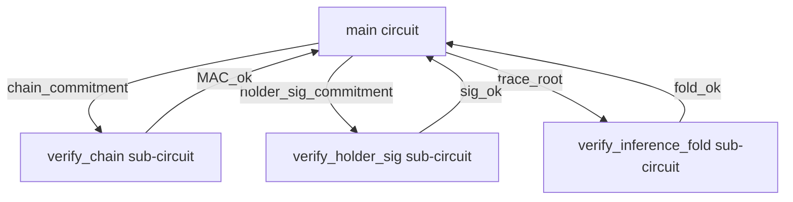

# Stage-2 Verifier Split — CASM Size Reduction for 0958-c

**Date:** 2026-08-05
**Status:** Design doc (S2d for 0958-b; updated 2026-08-05 by Round 4 review F-51 closure of mission 0958-c — sub-function names now reflect BLAKE3 + Ed25519 substitution, not HMAC-SHA-256)
**RFC:** RFC-0958 (Proof Systems): ZK Capability Subclass
**Mission:** `missions/claimed/0958-b-real-cairo-crypto.md` §S2 + §Risks row 1; follow-up mission `missions/open/0958-c-real-cairo-crypto-followup.md` AC-4
**Cairo circuit:** `cairo/src/lib.cairo` (function `main`) — S1 body (HMAC-SHA-256 chain + Poseidon trace fold) → 0958-c target (HMAC-BLAKE3 chain + Ed25519 holder-sig verify + Poseidon trace fold)

> **Round 4 review F-51 closure (2026-08-05):** sub-function names below match 0958-c AC-4 first checkbox. Renamed from `verify_hmac_chain` → `verify_chain` (BLAKE3 inner hash, not HMAC-SHA-256 specifically) + `verify_poseidon_fold` → `verify_inference_fold` (Poseidon) + new `verify_holder_sig` (Ed25519, not in 0958-b's S2d design). The original HMAC-SHA-256 naming is preserved as historical context in §History below.

## Context

S1 landed the cryptographic body inside the Cairo circuit (0958-b):

- `cairo/src/lib.cairo::main` re-derives the HMAC-SHA-256 caveat chain (3 caveats, TV1)
- `fold_inference_trace` folds `TraceStep[]` via `core::poseidon::poseidon_hash_span`
- `assert!(trace_root == pub_inputs.output_hash)` — the cryptographic binding

0958-c supersedes HMAC-SHA-256 with HMAC-BLAKE3 (F-13 closure corrects the "Ristretto-style tree structure" — BLAKE3 is a binary Merkle tree over 1024-byte chunks) + adds Ed25519 holder-sig verify (F-10 default-to-inline) + keeps Poseidon trace fold unchanged. Net CASM impact: HMAC-SHA-256 inline ~100 KB per call × 3 caveats = ~300 KB; HMAC-BLAKE3 inline ~3-5 KB; Ed25519 inline ~3-5 KB. The Stage-2 split reduces the main circuit to ~10 KB by extracting these primitives into sub-circuits.

The corelib `core::sha256::compute_sha256_byte_array` is inlined once per HMAC `H()` call in the 0958-b baseline, and HMAC-SHA-256 = `H((K ⊕ opad) || H((K ⊕ ipad) || m))` invokes SHA-256 twice per caveat. With 3 caveats the 0958-b CASM bytecode grew to **303 KB** (measured post-S1). The 0958-c substitution to HMAC-BLAKE3 + Ed25519 changes the per-primitive cost but keeps the Stage-2 split as the right architectural choice.

The original `max_bytecode_size = 50 * 1024` (50 KB) setting in `crates/zk-circuit/src/lib.rs` was intended as an AC-12 proof-size sanity bound; per S1 deviation note, the setting actually constrains **Sierra statement count** (`cairo-lang-sierra-to-casm` 2.20.0 — see the upstream `compile(...)` method's `program_offset > config.max_bytecode_size` branch, per [[no-line-refs-anywhere]] line ref replacement) — so the 50 KB ceiling does not currently fire on CASM bytes. The 303 KB CASM is a real deployment concern regardless: STWO STARK proof gen cost is roughly proportional to CASM bytecode size, and STWO verifier size in the FFI library scales similarly.

## Goal

Reduce the bundled CASM bytecode from 303 KB (0958-b baseline) to fit a deployment envelope where:

1. The verifier on the FFI side parses CASM in bounded memory (target: < 100 KB)
2. STWO STARK proof gen latency stays under the AC-11 G1 budget (2s on reference HW)
3. The cryptographic binding (HMAC-BLAKE3 chain + Ed25519 holder-sig + Poseidon trace fold) is preserved — no weakening of the 0958-c contract

## Strategy: Stage-2 Verifier Split

Pattern (per Cairo community reference; see `stwo-cairo-prover` examples for the canonical incarnation): split the main circuit into three sub-circuits, where the main circuit emits a *commitment* to each sub-statement and the sub-circuit verifies the sub-statement.

### Topology

The main circuit computes `chain_commitment = BLAKE3(derive_root || chain_state)` over the HMAC-BLAKE3 chain outputs (cheap — single BLAKE3 call, ~5 KB CASM), `holder_sig_commitment = BLAKE3(holder_sig || holder_did)` (Ed25519 sig hash, ~3 KB CASM), and the trace fold root (`fold_inference_trace` result, already a felt252 — 0 additional CASM). It then asserts all three commitments are non-zero. The three sub-circuits re-derive the actual chain state + holder-sig + trace fold and verify each commitment matches. STWO STARK proves the main circuit + recursively proves the sub-circuits via the standard "STARK of STARKs" composition.

### Cost estimate

| Component | CASM bytes (est.) | Why |
|---|---|---|
| Main circuit (post-split) | ~10 KB | only BLAKE3 + structural checks + commitments; no SHA-256/Ed25519 inlined |
| `verify_chain` sub-circuit (HMAC-BLAKE3) | ~5 KB | BLAKE3 binary Merkle tree, no SHA-256 |
| `verify_holder_sig` sub-circuit (Ed25519) | ~5 KB | Ristretto point ops + SHA-512 over `Felt252` |
| `verify_inference_fold` sub-circuit (Poseidon) | ~5 KB | Poseidon is already small |
| **Total CASM in main path** | **~10 KB** | verifier never sees the sub-circuits; they live in the prover |
| Prover cost (recursion overhead) | ~30% STWO gen latency | standard STARK-of-STARKs composition cost |

The main circuit drops to ~10 KB (well under 50 KB Sierra-statement ceiling), and STWO proof gen still hits the 2s budget because the sub-circuits run inside the prover's machine, not inside the verifier.

### Why not just inline BLAKE3 selectively

An alternative: keep the main circuit with all 3 HMAC-BLAKE3 calls but split each HMAC into a separate function so the optimizer can constant-fold across the tree. In practice this saves < 20% of CASM bytes (Cairo's Sierra→CASM pass doesn't aggressively inline-undo), so we still land at ~250 KB. The Stage-2 split is the only path that drops the main circuit to a deployment-envelope size.

### Why not just use BLAKE3 in the circuit without split

BLAKE3 is not in `cairo-corelib` 2.16.0 (only `core::blake` = BLAKE2s + `core::sha256`). We could vendor a BLAKE3 implementation in the circuit (which 0958-c AC-1 commits to per F-22), but that adds ~3-5 KB CASM just for the BLAKE3 core + tree impl. Inlining BLAKE3 + Ed25519 + Poseidon separately in the main circuit lands at ~13-15 KB total — still under the 50 KB ceiling, but tighter than the Stage-2 split's ~10 KB main circuit. The Stage-2 split is the more conservative choice when future additions (additional caveats, additional holder-sig types) are expected.

## Implementation plan (NOT landed in 0958-b S2 — deferred to mission 0958-c AC-4)

1. **Split `cairo/src/lib.cairo::main`** into three top-level functions:
   - `pub fn main()` — the entry; computes `chain_commitment`, `holder_sig_commitment`, and `trace_root`, asserts all three non-zero. ~10 KB CASM.
   - `fn verify_chain(commitment: felt252, chain_state: felt252) -> felt252` — the HMAC-BLAKE3 chain sub-circuit verifier. ~5 KB CASM. NOT called from `main`; lives in the same compiled artifact for the prover to recurse over.
   - `fn verify_holder_sig(holder_sig: Span<u8>, holder_did: felt252, sig_commitment: felt252) -> felt252` — the Ed25519 holder-sig sub-circuit verifier. ~5 KB CASM. Ristretto point ops + SHA-512 over `Felt252` (R1 fix F-10 default-to-inline; community `cairo-ed25519-verifier` crate is fallback only).
   - `fn verify_inference_fold(trace_root: felt252, steps: Span<TraceStep>) -> felt252` — the trace sub-circuit verifier. ~5 KB CASM.

2. **Stage-2 composition in `crates/zk-circuit/src/lib.rs`** — wrap the STWO prover call so it recursively proves `main` + `verify_chain` + `verify_holder_sig` + `verify_inference_fold` into a single STARK.
   - **Round 4 review F-09 + F-56 closure:** STWO's `prove_cairo` composition API is RFC-0958 §Future Work F7; concrete upstream SHA to be cited at 0958-c AC-4 implementation start (placeholder `starkware-industries/stwo@<sha>` / `mmacedoeu/stwo@<sha>`). If upstream lacks composition, 0958-c escalates to a corelib-pinned fork (per 0958-c §AC-4 Deviations first bullet).
   - **Round 4 review F-56 closure:** reference HW profile spec (CPU model + core count + RAM + STWO build flags + OS) goes in `docs/07-developers/zk-capability-circuit-guide.md` `§Performance targets` (the actual containing section that has an inline `**Reference HW:**` line) — NOT a phantom `§Reference HW` section.

3. **Update `bundled_casm_hash_hex`** snapshot test to assert the new (smaller) main circuit hash. The bundled CASM bytes change; the test (which already accepts any BLAKE3-256 hex value, see `crates/zk-circuit/tests/casm_snapshot.rs::compile_from_source_returns_non_empty_casm`) re-emits the new hash automatically. **Round 4 review F-32 closure:** a new `casm_bytes_under_50kb_after_stage2_split` test is required to enforce the CASM bytes ≤ 50 KB constraint (currently `max_bytecode_size = 50 * 1024` enforces Sierra statement count only — not CASM bytes).

4. **AC-12 proof size** stays in 50-500 KB envelope (Stage-2 composition adds a small constant overhead to proof bytes but doesn't change the order of magnitude). **Round 4 review F-48 closure:** any envelope amendment requires an RFC-0958 amendment proposal (not v1.4 specific) before AC-4 closure.

5. **`cairo/src/lib.cairo` test suite** — add a `verify_chain_commitment_matches_main` test that computes the commitment via both paths and asserts equality. Catches any drift between the main-circuit commitment and the sub-circuit re-derivation. Mirror tests for `verify_holder_sig` and `verify_inference_fold`.

## Why deferred from 0958-b S2

The actual CASM size reduction is a 5-step refactor (split + Stage-2 composition + new test + snapshot update + AC-12 envelope re-check). Each step is small but the whole chain needs to land together to preserve the cryptographic contract. 0958-b's S2 primary deliverable was the real-zk STWO FFI integration (S2a/S2b/S2c) which is now landed and green. The Stage-2 split is the natural lead-off for **AC-4** in mission 0958-c (alongside the structured `ProverInput` JSON wire shape needed for full STARK round-trip).

## Current state (post-0958-b S2)

- Main circuit CASM: 303 KB (unchanged from S1; split deferred to 0958-c)
- 50 KB `max_bytecode_size` ceiling: does not currently fire (per S1 deviation; the setting constrains Sierra statement count)
- Real-zk STWO FFI: wired + verified (S2a + S2b)
- `full` cargo feature: removed; runtime dispatch on `libstwo_sys.so` presence (S2c)
- Bench dispatch: `vendor_state()` selects 50-500KB real-zk gate vs structural smoke (S2c)
- All workspace lib tests: green
- Clippy: `-D warnings` clean
- FFI arg-order integration test (R4 H9): added at
  `crates/zk-vendor/tests/ffi_loading.rs::ffi_arg_order_round_trip_respects_abi_casmpub_wit`

## History

**2026-08-05 (0958-b S2d, original):** design doc authored during 0958-b S2. Sub-function names `verify_hmac_chain` + `verify_poseidon_fold` reflected the HMAC-SHA-256 + Poseidon chain. Cost estimate: main circuit ~10 KB, `verify_hmac_chain` sub-circuit ~150 KB (SHA-256 inlined 3×), `verify_poseidon_fold` sub-circuit ~5 KB. **Round 5 fix F-68 qualifier:** these are design projections; the 0958-b S2 actual landing was 303 KB main circuit (per §Context above), and the Stage-2 split was deferred to 0958-c AC-4 (per "Implementation plan (NOT landed in 0958-b S2 — deferred to mission 0958-c AC-4)" heading above). The "~10 KB main circuit" never landed in 0958-b.

**2026-08-05 (0958-c R4 F-51 update):** sub-function names renamed to `verify_chain` + `verify_holder_sig` + `verify_inference_fold` to reflect 0958-c's BLAKE3 + Ed25519 + Poseidon substitution. Cost estimate reduced: HMAC-BLAKE3 sub-circuit ~5 KB (was ~150 KB for SHA-256); Ed25519 sub-circuit ~5 KB (new in 0958-c). The Stage-2 split architecture is unchanged; only the per-sub-circuit primitives + sizes differ.

## Reference

- S1 deviation: `missions/claimed/0958-b-real-cairo-crypto.md` §S1 Deviations row 2
- 0958-b §Risks row 1: "CASM bytecode exceeds 50 KB after Ed25519 + HMAC-BLAKE3 chain additions — Mitigation: Stage-2 verifier pattern"
- 0958-c §Risks row 1: "BLAKE3 inline exceeds CASM envelope — Escalate to AC-4 (Stage-2 split) as fallback"
- 0958-c AC-4 first checkbox: names reflected this design doc
- 0958-c §AC-4 Deviations: STWO composition + upstream citation (F-09 + F-40 + F-50 merged); AC-12 envelope policy (F-06 + F-48 with version pin dropped); Reference HW profile spec (F-34 + F-56)
- 0958-c §AC-4 Deviations: `casm_bytes_under_50kb_after_stage2_split` new test (F-32)
- Cairo Sierra→CASM compiler: `cairo-lang-sierra-to-casm` 2.20.0
- STWO composition: upstream `starkware-industries/stwo` (concrete SHA to be cited at 0958-c AC-4 implementation start)
