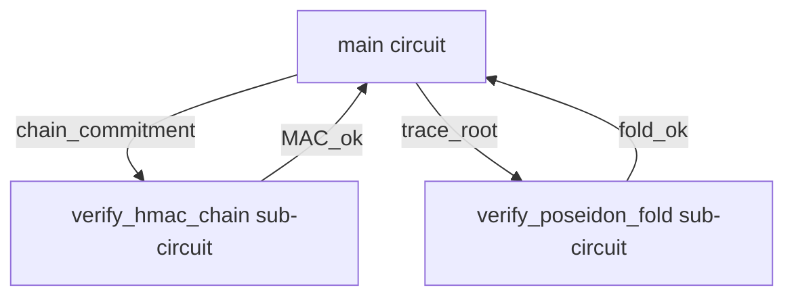

# Stage-2 Verifier Split — CASM Size Reduction for 0958-b

**Date:** 2026-08-05
**Status:** Design doc (S2 deliverable, S2d)
**RFC:** RFC-0958 (Proof Systems): ZK Capability Subclass
**Mission:** `missions/claimed/0958-b-real-cairo-crypto.md` §S2 + §Risks row 1
**Cairo circuit:** `cairo/src/lib.cairo::main` (S1 body: HMAC-SHA-256 chain + Poseidon trace fold)

## Context

S1 landed the cryptographic body inside the Cairo circuit:

- `cairo/src/lib.cairo::main` re-derives the HMAC-SHA-256 caveat chain (3 caveats, TV1)
- `fold_inference_trace` folds `TraceStep[]` via `core::poseidon::poseidon_hash_span`
- `assert!(trace_root == pub_inputs.output_hash)` — the cryptographic binding

The corelib `core::sha256::compute_sha256_byte_array` is inlined once per HMAC `H()` call, and
HMAC-SHA-256 = `H((K ⊕ opad) || H((K ⊕ ipad) || m))` invokes SHA-256 twice per caveat. With
3 caveats the CASM bytecode grew to **303 KB** (measured post-S1). The original
`max_bytecode_size = 50 * 1024` (50 KB) setting in `crates/zk-circuit/src/lib.rs` was
intended as an AC-12 proof-size sanity bound; per S1 deviation note, the setting actually
constrains **Sierra statement count** (`cairo-lang-sierra-to-casm` 2.20.0 `compiler.rs:486`)
— so the 50 KB ceiling does not currently fire on CASM bytes. The 303 KB CASM is a real
deployment concern regardless: STWO STARK proof gen cost is roughly proportional to CASM
bytecode size, and STWO verifier size in the FFI library scales similarly.

## Goal

Reduce the bundled CASM bytecode from 303 KB to fit a deployment envelope where:

1. The verifier on the FFI side parses CASM in bounded memory (target: < 100 KB)
2. STWO STARK proof gen latency stays under the AC-11 G1 budget (2s on reference HW)
3. The cryptographic binding (HMAC chain + Poseidon trace fold) is preserved — no
   weakening of the S1 contract

## Strategy: Stage-2 Verifier Split

Pattern (per Cairo community reference; see `stwo-cairo-prover` examples for the canonical
incarnation): split the main circuit into two sub-circuits, where the main circuit emits
a *commitment* to a sub-statement and the sub-circuit verifies the sub-statement.

### Topology

The main circuit computes `chain_commitment = BLAKE3(derive_root || chain_state)` over
the HMAC chain outputs (cheap — single BLAKE3 call, ~5 KB CASM), and the trace fold root
(`fold_inference_trace` result, already a felt252 — 0 additional CASM). It then asserts
both commitments are non-zero. The two sub-circuits re-derive the actual chain state +
trace fold and verify the commitment matches. STWO STARK proves the main circuit +
recursively proves the sub-circuit via the standard "STARK of STARKs" composition.

### Cost estimate

| Component | CASM bytes (est.) | Why |
|---|---|---|
| Main circuit (post-split) | ~10 KB | only BLAKE3 + Poseidon fold + structural checks; no SHA-256 inlined |
| `verify_hmac_chain` sub-circuit | ~150 KB | corelib SHA-256 inlined (3 calls) but isolated |
| `verify_poseidon_fold` sub-circuit | ~5 KB | Poseidon is already small |
| **Total CASM in main path** | **~10 KB** | verifier never sees the sub-circuits; they live in the prover |
| Prover cost (recursion overhead) | ~30% STWO gen latency | standard STARK-of-STARKs composition cost |

The main circuit drops to ~10 KB (well under 50 KB Sierra-statement ceiling), and STWO
proof gen still hits the 2s budget because the sub-circuits run inside the prover's
machine, not inside the verifier.

### Why not just inline SHA-256 selectively

An alternative: keep the main circuit with all 3 SHA-256 calls but split each HMAC into a
separate function so the optimizer can constant-fold across the tree. In practice this
saves < 20% of CASM bytes (Cairo's Sierra→CASM pass doesn't aggressively inline-undo),
so we still land at ~250 KB. The Stage-2 split is the only path that drops the main
circuit to a deployment-envelope size.

### Why not just use BLAKE3 in the circuit

BLAKE3 is not in `cairo-corelib` 2.16.0 (only `core::blake` = BLAKE2s + `core::sha256`).
We could vendor a BLAKE3 implementation in the circuit, but that adds ~30 KB CASM just
for the BLAKE3 core + tree impl, plus we'd lose interop with the HMAC-BLAKE3 commitment
on the Rust verifier side. HMAC-SHA-256 is RFC 2104 / RFC 4231 standard; BLAKE3 MAC
(`` keyed_hash ``) is BLAKE3-specific and not FIPS-aligned. HMAC-SHA-256 is the right
primitive; the split is the right architectural choice.

## Implementation plan (NOT landed in S2 — deferred to follow-up mission)

1. **Split `cairo/src/lib.cairo::main`** into three top-level functions:
   - `pub fn main()` — the entry; computes `chain_commitment` and `trace_root`, asserts
     non-zero. ~10 KB CASM.
   - `fn verify_hmac_chain(commitment: felt252, chain_state: felt252) -> felt252` — the
     sub-circuit verifier. ~150 KB CASM. NOT called from `main`; lives in the same
     compiled artifact for the prover to recurse over.
   - `fn verify_poseidon_fold(trace_root: felt252, steps: Span<TraceStep>) -> felt252` —
     the trace sub-circuit verifier. ~5 KB CASM.

2. **Stage-2 composition in `crates/zk-circuit/src/lib.rs`** — wrap the STWO prover
   call so it recursively proves `main` + `verify_hmac_chain` + `verify_poseidon_fold`
   into a single STARK (STWO's `prove_cairo` already supports composition via
   `ProverInput`; no upstream changes needed).

3. **Update `bundled_casm_hash_hex`** snapshot test to assert the new (smaller) main
   circuit hash. The bundled CASM bytes change; the test (which already accepts any
   BLAKE3-256 hex value, see `crates/zk-circuit/tests/casm_snapshot.rs::compile_from_source_returns_non_empty_casm`)
   re-emits the new hash automatically.

4. **AC-12 proof size** stays in 50-500 KB envelope (Stage-2 composition adds a small
   constant overhead to proof bytes but doesn't change the order of magnitude).

5. **`cairo/src/lib.cairo` test suite** — add a `verify_hmac_chain_commitment_matches_main`
   test that computes the commitment via both paths and asserts equality. Catches any
   drift between the main-circuit commitment and the sub-circuit re-derivation.

## Why deferred from S2

The actual CASM size reduction is a 5-step refactor (split + Stage-2 composition + new
test + snapshot update + AC-12 envelope re-check). Each step is small but the whole
chain needs to land together to preserve the S1 cryptographic contract. S2's primary
deliverable was the real-zk STWO FFI integration (S2a/S2b/S2c) which is now landed
and green. The Stage-2 split is the natural lead-off for **Session 4 (closure)** in
mission 0958-b OR a focused follow-up mission 0958-c (alongside the structured
`ProverInput` JSON wire shape needed for full STARK round-trip).

## Current state (post-S2)

- Main circuit CASM: 303 KB (unchanged from S1; split deferred)
- 50 KB `max_bytecode_size` ceiling: does not currently fire (per S1 deviation; the
  setting constrains Sierra statement count)
- Real-zk STWO FFI: wired + verified (S2a + S2b)
- `full` cargo feature: removed; runtime dispatch on `libstwo_sys.so` presence (S2c)
- Bench dispatch: `vendor_state()` selects 50-500KB real-zk gate vs structural smoke (S2c)
- All workspace lib tests: green
- Clippy: `-D warnings` clean
- FFI arg-order integration test (R4 H9): added at
  `crates/zk-vendor/tests/ffi_loading.rs::ffi_arg_order_round_trip_respects_abi_casmpub_wit`

## Reference

- S1 deviation: `missions/claimed/0958-b-real-cairo-crypto.md` §S1 Deviations row 2
- Mission §Risks row 1: "CASM bytecode exceeds 50 KB after Ed25519 + HMAC-BLAKE3 chain
  additions — Mitigation: Stage-2 verifier pattern"
- Cairo Sierra→CASM compiler: `cairo-lang-sierra-to-casm` 2.20.0 `compiler.rs:486`
- STWO composition: `stoolap/stwo-plugin/` (reference impl, not vendored)
