# Research: Vault-as-Only Monetary Abstraction Redesign

**Date:** 2026-08-22
**Status:** Draft Research — pending multi-round review per BLUEPRINT.md §Adversarial Review Process
**Version:** v3.7.2 (R1 + R2 + R3 + R4 + R5 + R6 + R7 adversarial reviews applied — 85 + 37 + 76 + 16 + 15 + 17 + 12 = 258 cumulative NEW findings; v3.4 fixes are R7 verify-loop gap cluster: 4 PARTIAL cross-doc reconciliations (RFC-0206 §3 balance DQA<12> + history cursor; RFC-0967-A1 §0+§5 30-kind count) + 6 ZK envelope fixes (phantom RFC-0958 reference removed + magic 0x01 0x7a 0x6b 0x00 registered in domain-separator registry + substrate-level ZK guard applied to MembershipPolicy + WorkflowKind + InteropPolicy paths + global magic vs per-kind rationale + proof byte-vector layout [0..16] kind_uuid / [16..20] marker / [20..N] body + opaque envelope) + 6 execution class surface fixes (BurnPolicy Class A vs burn_pending A/B substrate guard clarified + AuditPolicy substrate call sites wired to all 6 transfer methods + WorkflowKind::provision_subject composite dispatch documented + transfer cross-chain InteropPolicy invocation + history Class A vs read_user_info Class B asymmetry documented + v017 Class C rejection CHECK constraint))
**Builds on:**

- `docs/research/2026-07-22-grand-design-vaults-capabilities-reservations.md` (Phase 2 of N)
- `docs/audits/cost-storage-vault-abstraction-2026-08-21.md` (substrate bypass audit — gitignored scratchpad)
- `docs/audits/2026-08-21-vault-monetary-representation-redesign-brainstorm.md` (brainstorm scratchpad — gitignored)
- `docs/audits/2026-08-21-r1-adversarial-review.md` (R1 review findings — gitignored scratchpad)

---

## 0. Executive Summary

Quota-router currently carries **three parallel spend/balance ledgers**, **two parallel consumed-receipt indexes**, **two parallel asks tables**, a **bespoke `dqa_to_i64` bridge**, and a **stubbed LiteLLM-compatible admin API** that has no persistent user surface. The vault substrate (RFC-0960 §2.6) has the right shape — chain-aware PK lattice, event-sourced transfer log, native DQA(12) — but exposes only **3 KV-shape VaultStore methods** (get/put/delete per RFC-0206 §VaultStore). **No money-movement primitives exist.**

This research locks the design decisions for the redesign of quota-router monetary representation around **a single value-transfer abstraction** (the vault substrate) carrying **two paths** (corporate private + cipherocto mesh open) on the same substrate, with **minting + burning** as first-class substrate operations in a NEW **`ValueTransfer` trait** (separate from VaultStore to preserve RFC-0206 §VaultStore KV-shape discipline), and a **persistent LiteLLM-compatible workflow** that runs in parallel with capability-gated access — neither stubbed.

All six design axes (D1-D6) have final decisions. None require central enums: policy-configurable variation uses the **typed-discriminator 128-bit UUID + Raw escape hatch** pattern from `cipherocto-design-principles.md` §Extension over enumeration. Per-policy-kind crates register at startup per `cipherocto-design-principles.md` §User extensibility.

**R1 structural resolutions:**

- VaultStore (KV, 3 methods, RFC-0206 §VaultStore shape preserved) — UNCHANGED
- **ValueTransfer** (NEW trait, owner crate octo-vault, 11 money-movement methods per RFC-0206 v3.3 §3 — 8 base + `create_vault` + `immediate_burn` + `burn_pending` shape refined to carry `unlock_at_unix`) — added
- All policy kind validation gates through **substrate-level `ExecutionClass` registration** (Class C rejected on consensus-path per RFC-0008 §RFC-0008 Execution Class Mapping; Class B requires ZK proof attachment per RFC-0958)
- RFC-0206 amendment renumbered **v2.4 → v3.0** (non-additive trait-shape change = semver-major per RFC-0206 §Layer B additive-only rule). Renumbered from earlier v2.5 per R2 finding
- All 8 RFC amendments carry explicit §RFC-0008 Execution Class Mapping tables
- 30 per-policy-kind crates — RFC specs consolidated into **RFC-0967-A1** separate file (variant a, matches 0957-A1 / 0959-A1 precedent). Filed as `rfcs/draft/economics/0967-a1-policy-registry.md` v1.0 (2026-08-22). Count breakdown: 6 Authority + 7 Membership + 4 Interop + 3 Burn + 4 Workflow + 3 Audit + 3 Selector = 30 (per `kind_uuid_registry::TOTAL`)
- RFC-0008 promoted from Draft → Accepted on 2026-08-22 (per user authorization, R3 closure)
- Audit logs canonical CBOR regardless verbose/slim (RFC-0126)
- A/B variant assignment deterministic by `BLAKE3("octo/audit/ab/v1/" || chain_id)[0] % 2` (R9 fix F-R9-AUDIT-PREFIX-DRIFT — canonical `octo/` prefix per F-R8-DOMSEP-PREFIX-DRIFT)
- All "ACCEPTED" risks carry 90-day `next_review_unix` per RFC-0008 §Lifecycle Requirements

**R2 authorization gap closures (2026-08-22):**

- RFC-0967-A1 filed at `rfcs/draft/economics/0967-a1-policy-registry.md` v1.0 — defines AuthorityPolicy / MembershipPolicy / InteropPolicy / BurnPolicy / WorkflowKind / AuditPolicy traits + InteropSelector/InteropOutcome trait objects (replaces InteropDecision/InteropSelector/SwapKind/MultiEnvelopeCompletion enums) + FallthroughCondition (local to octo-workflow-composite, NOT substrate enum) + 22-kind UUIDv5 registry + policy_registry + policy_kind_authority tables
- RFC-0206 v3.0 filed at `rfcs/draft/process/0206-v30-value-transfer-surface.md` — VaultStore UNCHANGED (3 KV methods), NEW ValueTransfer trait (11 money-movement methods), primitive types only in trait signatures per R2 finding X7
- RFC-0105 v3.0 filed at `rfcs/draft/economics/0105-v30-private-asset-namespace.md` — sovereign/private asset namespace boundary (0x01 sovereign / 0x02 private / 0x03-0xFF reserved) + Authority-to-Issue table
- RFC-0959 v2.1 filed at `rfcs/draft/economics/0959-v21-burn-event-wire-form.md` — burn_event wire form + cost_micro_octo_w BLOB(16) → DQA(12) migration
- RFC-0960 v3.1 filed at `rfcs/draft/economics/0960-v31-vault-path-taxonomy.md` — mesh open vs corporate closed path taxonomy on same substrate
- RFC-0010 v1.7 filed at `rfcs/draft/process/0010-v17-chain-id-registration-authority.md` — ledger_chain_registry table + chain_id BLAKE3 derivation + authority registration flow (P0 BLOCKER for chain_metadata)
- RFC-0903-D1 filed at `rfcs/draft/economics/0903-d1-litellm-persistence.md` v1.0 — RFC-0903 is Final so cannot use -A1 path; D1 branch + persistent litellm_users/litellm_keys/scim_users/scim_groups tables + ScimStore singleton
- RFC-0008 promoted to Accepted at `rfcs/accepted/process/0008-deterministic-ai-execution-boundary.md` — ExecutionClass three-class taxonomy + 90-day ACCEPTED RISK lifecycle

---

## 1. Problem Statement

### 1.1 Three parallel spend/balance ledgers (audit §2.1)

| Crate                  | DDL                                           | Shape                                                                                                                                                                                                                                                                 | Owner                |
| ---------------------- | --------------------------------------------- | --------------------------------------------------------------------------------------------------------------------------------------------------------------------------------------------------------------------------------------------------------------------- | -------------------- |
| `quota-router-storage` | `migrations/v007__create_spend_ledger.sql:35` | `(holder_did BLOB, macaroon_id BLOB, balance INTEGER, updated_at_unix_ms INTEGER, PK(holder_did, macaroon_id))` — prepaid-wallet                                                                                                                                      | `StoolapSpendLedger` |
| `quota-router-core`    | `src/schema.rs:85`                            | `(event_id, request_id, key_id, team_id, provider, model, input_tokens, output_tokens, cost_amount INTEGER, pricing_hash, token_source, tokenizer_id, tokenizer_version, provider_usage_json, timestamp, created_at, UNIQUE(key_id, request_id))` — per-request event | `StoolapKeyStorage`  |
| `quota-router-core`    | `src/schema.rs:38`                            | `key_spend (key_id TEXT, total_spend INTEGER, window_start INTEGER, last_updated INTEGER, UNIQUE(key_id))` — windowed total                                                                                                                                           | `StoolapKeyStorage`  |
| `quota-router-core`    | `src/schema.rs:182`                           | `octo_w_balances (key_id TEXT NOT NULL UNIQUE, balance INTEGER DEFAULT 0, updated_at INTEGER)` — per-key OCTO-W balance                                                                                                                                               | `StoolapKeyStorage`  |

Two tables share the name `spend_ledger` with **different schemas**, in different crates. Both write to `octo_storage_core::Database` directly. Neither uses `VaultStore` or `ValueTransfer`. Atomic decrement duplicated in `StoolapKeyStorage::deduct_octo_w` (`storage.rs:1121`).

### 1.2 Slash ledger — chain-aware PK mirrors vault

`quota-router-storage/migrations/v012 + v015` defines `slash_ledger (row_id, provider_id, chain_id BLOB, stake_micro_octo_w BIGINT, …, UNIQUE(chain_id, provider_id))`. PK `(chain_id, provider_id)` mirrors octo-vault's `(chain_id, owner_did, asset_id)` PK shape — **does not use `ValueTransfer`**. Balance column is `BIGINT` (i64) via bespoke `dqa_to_i64`/`i64_to_dqa` bridge in `slash_store.rs:190-199, 247-249, 292-294, 316`. Vault native is `DQA(12)`.

### 1.3 Settlement event cost column — wrong type

`quota-router-storage/migrations/v004__create_settlement_events.sql:69` stores `cost_micro_octo_w BLOB` as 16-byte BE u128 with comment "byte-equivalent to DQA(12) at scale=0". Vault has `DQA(12)` natively. Every read calls `i64_to_dqa`/`dqa_to_dqa`. Migrated via RFC-0959 v2.1.

### 1.4 Vestigial DDL + CLI bypass

`schema.rs:214` declares `rate_limit_state` table — no owner, no caller (zero grep hits). Dead DDL. CLI wires cost writes through `StoolapKeyStorage` + `ConsumedReceiptRepository` directly (`commands.rs:16, 534, 538`) — never `VaultStore` or `ValueTransfer`. Mission `vault-dead-ddl-purge` archives `rate_limit_state` rows to JSON in vault storage BEFORE DROP (operational data preservation).

### 1.5 Stubbed LiteLLM + in-memory SCIM

- Mission `0945-a-user-management-api.md` (archived) — LiteLLM-compatible `/user/new` (admin.rs:338-355), `/user/info` (357-374), `/user/update` (376-407). **All STUB** — no persistent `users` table touched.
- SCIM v2 (`admin.rs:914-1003`) is in-memory only: `ScimStore = Arc<RwLock<HashMap<String, ScimUser>>>`. Lost on restart. Mission `vault-litellm-persistence` makes both persistent.

### 1.6 Total bypass surface

**90+ bypass sites** across the four ledgers + CLI + admin API. Vault substrate exposes only KV-shape `VaultStore` (3 methods per RFC-0206 §VaultStore trait) — no money-movement primitives (mint/burn/debit/credit/transfer/balance/history). 90+ bypass sites therefore cannot route through substrate without the new `ValueTransfer` trait (this RFC).

### 1.7 What we want

A single value-transfer abstraction — the vault substrate (split into `VaultStore` KV + `ValueTransfer` money-movement) — that:

1. Carries both **corporate private** + **cipherocto mesh open** paths on the same substrate (no fork, no parallel schema).
2. Has **mint + burn** as first-class substrate operations with corporate-policy-configurable authority + reversibility window.
3. Replaces all 90+ bypass sites by exposing substrate primitives that consumer ledgers can call.
4. Preserves the LiteLLM-compatible drop-in-replacement intent (admin API + SCIM v2) — **persistent**, not stubbed.
5. Leaves cross-chain as **policy-configurable** (no-bridge default + atomic swap + wrapped representation all selectable at chain registration).

---

## 2. Research Scope

**In scope:**

- NEW `ValueTransfer` trait (owner: `octo-vault` crate, Layer B) with money-movement primitives (mint, burn_pending, finalize_burn, cancel_burn, debit, credit, transfer, history, balance).
- `VaultStore` trait unchanged (KV-shape per RFC-0206 §VaultStore).
- `chain_metadata` table + `policy_registry` table + `burn_pending` table + 30 per-policy-kind crates.
- Policy-configurable variation without central enums (typed-discriminator + Raw escape hatch pattern + `ExecutionClass` registration gate).
- Per-chain identity model (corporate closed-set vs mesh open-set).
- LiteLLM compatibility persistence (rehydrate 0945-a from stub) with full field preservation.
- Cross-chain interop surface (no-bridge / atomic-swap / wrapped-representation — all policy-configurable; no bridge contract).
- Time-locked burn state machine with reversible window (linearized — option i: burn_pending does NOT emit transfer_event).

**Out of scope:**

- ZK capability verification (RFC-0957 S5 LANDED; ZK proof attachment for Class B policies in §4.3 is a registration-time concern, not verification).
- Generic cross-chain bridge contract (no bridge — only the three primitives above).
- External auth provider integration (separate RFC).
- Multi-token wallet UI / human-facing UX.
- Federation across multiple cipherocto meshes (RFC-0960 §20.x deferred).

**Deferred (per `deferred-vs-unspecified` rule, not unspec):**

- Federation RFC (separate research).
- Bridge-specific primitives if RFC-0960 §7 MultiSettlement is later proven insufficient.
- A/B variant empirical baseline establishment for mainnet audit policy (v2 deferred until production traffic available).

---

## 3. Decisions Locked

| #      | Axis                        | Decision                                                                               | Why                                                                                                                                                                                             |
| ------ | --------------------------- | -------------------------------------------------------------------------------------- | ----------------------------------------------------------------------------------------------------------------------------------------------------------------------------------------------- |
| **D1** | Substrate partition         | (a) chain_id namespace only                                                            | Vault PK `(chain_id, owner_did, asset_id)` (RFC-0960 §2.6) already supports this; corporate = corp-assigned chain_id, mesh = mainnet chain_id                                                   |
| **D2** | Mint authority              | **All options policy-configurable, NO central enum**                                   | Typed-discriminator 128-bit UUID + Raw escape hatch per `cipherocto-design-principles.md` §Extension over enumeration. Registration gated by `ExecutionClass` (Class A or B-with-ZK-proof only) |
| **D3** | Closed-user-set enforcement | (f) capability-gated **PLUS** LiteLLM-compatible workflow running in parallel          | Drop-in LiteLLM replacement intent preserved; both workflows real, neither stubbed. CompositeWorkflow = WorkflowKind impl supporting dual registration                                          |
| **D4** | Cross-chain interop         | **All options policy-configurable** (no-bridge + atomic swap + wrapped representation) | Substrate-as-is future-proof per RFC-0960 §7 + RFC-0965 §3.7 + RFC-0010 §32-byte addendum; per-chain policy decides                                                                             |
| **D5** | Burn semantics              | (e) time-locked burn with reversible window — **LINEARIZED**                           | `BurnPending` (no transfer_event) → after `unlock_at_unix` → `BurnFinalized` (emits transfer_event, balance decrements); cancellable via `BurnCapabilityProof` within window                    |
| **D6** | Audit trail / regulatory    | (d) testnet=verbose, mainnet=slim for v1 + (e) A/B test mainnet for v2                 | Testnet gather trace data; mainnet slim baseline for v1; v2 A/B variant selection deterministic by `BLAKE3("octo/audit/ab/v1/"                                                                  |     | chain_id)[0] % 2`(R9 fix F-R9-AUDIT-PREFIX-DRIFT — canonical`octo/` prefix per F-R8-DOMSEP-PREFIX-DRIFT) |

---

## 4. Deep Dive — D2: Mint Authority Without Enums

### 4.1 Why no enum

`cipherocto-design-principles.md` §Extension over enumeration mandates: **typed-discriminator + Raw escape hatch** for types with infinite extension surface. Mint authority kinds are exactly such a surface — today we have (a) single-key, (b) multi-sig, (c) capability-issued; tomorrow a corp may need (d) governance-vote, (e) hardware-HSM, (f) Shamir-share, etc. A central enum forces a core edit per new kind — upgrade-hostile.

### 4.2 Pattern — typed-discriminator UUID + Raw body + ExecutionClass gate

Each mint authority kind is a **separate crate implementing a common trait**:

```rust
// octo-policy-core/src/lib.rs (Layer A substrate) [R15 fix F-R15-PR-02: canonical post-0206-006 path is `crates/octo-policy/src/lib.rs`; `octo-policy-core` is HISTORICAL pre-rename surface]
trait AuthorityPolicy: Send + Sync {
    /// Stable 128-bit discriminator (UUIDv5 from RFC-0967-A1 §Kind UUID Registry).
    fn kind_uuid(&self) -> u128;
    /// BLAKE3 hash of canonical body — referenced by chain_metadata.
    fn policy_hash(&self) -> [u8;32];
    /// Canonical body (deterministic CBOR per RFC-0126).
    fn body(&self) -> &[u8];
    /// Execution class for consensus-path gating (Class A or Class B-with-ZK-proof).
    /// Class C rejected at registration — substrate never calls validate() for Class C.
    fn execution_class(&self) -> ExecutionClass;
    /// Validate a presented authority proof against this policy.
    /// `proof: &[u8]` carries the kind_uuid at offset [0..16] (UUIDv5 from RFC-0967-A1 §Kind UUID Registry)
    /// + raw body bytes. **Primitive types only** per RFC-0967-A1 §2.1 + RFC-0206 v3.3 §3
    /// (no Layer B context types in substrate trait signatures; consumer crates wrap primitives
    /// in their own typed Proof structs).
    /// Class B kinds REQUIRE ZK proof attachment via separate substrate path (RFC-0958).
    fn validate(&self, proof: &[u8]) -> Result<(), AuthorityError>;
}

/// Registry — Layer A core, registered at startup.
struct AuthorityRegistry {
    by_kind: HashMap<u128, Arc<dyn AuthorityPolicy>>,
    by_hash: HashMap<[u8;32], Arc<dyn AuthorityPolicy>>,
}
```

Per-AuthorityKind crates (Layer E extensions, namespaced under `octo/auth/`):

| Crate                             | Kind UUID (UUIDv5 input)  | Body schema                                                                                                      | ExecClass |
| --------------------------------- | ------------------------- | ---------------------------------------------------------------------------------------------------------------- | --------- |
| `octo-auth-single-key`            | `octo/auth/singlekey/v1`  | `{ admin_pubkey: [u8;32] }`                                                                                      | A         |
| `octo-auth-multisig`              | `octo/auth/multisig/v1`   | `{ m: u8, n: u8, pubkeys: [[u8;32];N], sig_scheme: u8 }`                                                         | A         |
| `octo-auth-capability-delegation` | `octo/auth/capability/v1` | `{ root_cap_hash: [u8;32], issuer_pubkey: [u8;32] }`                                                             | A         |
| `octo-auth-governance`            | `octo/auth/governance/v1` | `{ governance_contract: Address, proposal_kind: u32 }`                                                           | A         |
| `octo-auth-hsm`                   | `octo/auth/hsm/v1`        | `{ hsm_pubkey: [u8;32], attestation_chain: Vec<[u8;32]> }`                                                       | A         |
| `octo-auth-hybrid`                | `octo/auth/hybrid/v1`     | `{ primary_kind_uuid: u128, fallback_kind_uuid: u128, primary_body: Box<dyn Raw>, fallback_body: Box<dyn Raw> }` | A         |

Each crate:

1. Implements `AuthorityPolicy` trait.
2. Provides canonical body encoder (RFC-0126 canonical CBOR; BLAKE3 over canonical CBOR for `policy_hash`).
3. Registers itself at startup via `AuthorityRegistry::register(Arc<dyn AuthorityPolicy>)`.
4. Has no dependency on any other AuthorityKind crate (registry is the only dependency direction). The `Raw` trait is defined in `octo-policy-core` (Layer A) — generic byte-bag abstraction. [R15 fix F-R15-PR-02: canonical post-0206-006 path is `crates/octo-policy`; `octo-policy-core` is HISTORICAL pre-rename surface]

### 4.3 Substrate reference — ExecutionClass gate

Vault creation's mint gate (now in `ValueTransfer`, not `VaultStore`):

```rust
fn ValueTransfer::mint(
    &self,
    chain_id: &[u8;32],
    vault_id: &[u8;32],
    amount_dqa_micros: i64,
    proof: &[u8],         // raw proof bytes; layout per ZK envelope layout below
) -> Result<(), ValueTransferError> {
    let chain_meta = self.chain_metadata_lookup(chain_id)?;
    let policy = self.authority_registry.by_hash
        .get(&chain_meta.mint_authority_policy_hash)
        .ok_or(ValueTransferError::UnknownAuthorityPolicy)?;

    // R1-C4: ExecutionClass gate — reject Class C policies on consensus-path
    match policy.execution_class() {
        ExecutionClass::A => {}, // proceed
        ExecutionClass::B => {
            // R7 fix F-R7-ZK-LAYOUT-UNDEFINED — proof byte-vector layout:
            //   proof[0..16]   = kind_uuid (UUIDv5 from RFC-0967-A1 §Kind UUID Registry)
            //   proof[16..20]  = ZK envelope marker (global; same across all Class B kinds)
            //   proof[20..N]   = kind-specific body (canonical CBOR per policy body schema)
            //
            // Substrate MUST inspect proof[16..20] for the global ZK envelope marker
            // BEFORE dispatching to a Class B policy. If marker absent or wrong,
            // substrate rejects — defense-in-depth against misbehaving policy.validate()
            // impl that skips ZK validation. Per F-R7-ZK-OPAQUE-ENVELOPE the envelope
            // is opaque to substrate EXCEPT for the fixed-position [16..20] magic slot.
            //
            // R7 fix F-R7-ZK-MAGIC-COLLIDE — magic chosen via dedicated domain-separator
            // registry; bytes 0x01 0x7a 0x6b 0x00 are SUBSTRATE-DEFINED (not RFC-0958
            // canonical; RFC-0958 phantom reference removed per F-R7-ZK-PHANTOM-REF).
            if proof.len() < 20 || &proof[16..20] != ZK_ENVELOPE_MARKER {
                return Err(ValueTransferError::ClassBRequiresZkProof);
            }
        }
        ExecutionClass::C => return Err(ValueTransferError::ClassCNotAllowedOnConsensusPath),
    }

    // R3+R4 fix: primitive types only — proof: &[u8] (no ChainContext in Layer A trait sig)
    // R5 fix F-R5-005: ChainContext phantom type removed; ZK verification delegated to substrate signature check above
    policy.validate(proof)?;

    // Atomic: INSERT INTO transfer_events (event_type='Mint', ...) + UPDATE vaults.balance
    self.append_transfer_event_and_update_balance(...)?;
    Ok(())
}

/// R7 fix F-R7-ZK-MAGIC-COLLIDE + R8 fix F-R8-DOMSEP-MARKER-ENCODING-MISMATCH —
/// ZK envelope marker registered in the SUBSTRATE-DEFINED domain-separator registry
/// (R12 fix F-R12-STALE-CODE-REFS-RESEARCH-DOC: substrate-side registry location
/// pending landing via Phase 1 mission 0206-001 v3.0 + 0206-009 — pre-revert
/// reference site was `crates/octo-policy/src/domain_separators.rs`, REVERTED per
/// R10.5 scope correction. Canonical source: RFC-0967-A1 v1.5 §3.)
///
/// Encoding: 4 raw bytes (NOT BLAKE3-prefixed). The registry distinguishes two
/// encoding classes — see F-R8-DOMSEP-MARKER-ENCODING-MISMATCH below.
///
/// Bytes 0x01 0x7a 0x6b 0x00 (ASCII bytes 1, 'z', 'k', 0); reserved tag for
/// "policy proof envelope, body follows at [20..N]". Future ZK envelope versions
/// (e.g., Groth16, PLONK) MUST register a different tag in this registry; collisions
/// with RFC-0964 §0.1 outer-namespace tag 0x01 explicitly allowed because byte 0
/// is the high-entropy tag selector and bytes 1-3 disambiguate envelope vs constraint.
///
/// R8 fix F-R8-DOMSEP-PREFIX-DRIFT — All domain-separator prefix strings below
/// use the canonical `octo/` prefix (R12 fix: substrate-side registry location
/// pending landing via Phase 1 mission 0206-001 v3.0 + 0206-009 — pre-revert
/// reference site was `crates/octo-policy/src/kind_uuid_registry.rs`, REVERTED per
/// R10.5 scope correction. Canonical source: RFC-0967-A1 v1.5 §2.6.).
/// `ciph/` and `cipherocto/` prefixes in earlier RFC drafts are PHANTOM (no canonical
/// registry entry); the AUDIT_VARIANT_HASH_DOMAIN constant at RFC-0967-A1 §2.1 has
/// historical narrative tension — research doc + RFC-0967-A1 §2.6 kind_uuid registry
/// use `octo/audit/ab/v1/` for A/B-specific variant (canonical per F-R9-AUDIT-PREFIX-DRIFT),
/// while RFC-0967-A1 §2.1 formula cites `octo/audit/v1/` (legacy generic). Reconcile
/// in §2.1 amendment per R12 fix F-R12-AUDIT-VARIANT-PREFIX-DRIFT-XRFC.
///
/// R8 fix F-R8-DOMSEP-OX01-COLLISION-UNRESOLVED — collision with RFC-0964 §0.1
/// outer-namespace tag 0x01 is DOCUMENTED + ACCEPTED at the registry level
/// (substrate-domain-separator-registry entry ZK_ENVELOPE_MARKER carries an
/// `collision_acknowledged_with: ["rfc-0964-outer-ns-0x01"]` annotation; substrate
/// fails closed if the entry is removed without updating the collision annotation).
const ZK_ENVELOPE_MARKER: &[u8; 4] = &[0x01, 0x7a, 0x6b, 0x00];
```

**R7 fix F-R7-ZK-GUARD-MISSING-OTHER-PATHS + R8 fix F-R8-WFCOMPOSITE-GUARD-INLINE-EXAMPLE — substrate-level ZK guard applied uniformly to all Class B policy methods on consensus-path:** `mint` (AuthorityPolicy), `create_vault` (MembershipPolicy), `validate_vault_creation` (WorkflowKind), `transfer` cross-chain (InteropPolicy). Guard signature identical to mint path: `if proof.len() < 20 || &proof[16..20] != ZK_ENVELOPE_MARKER { return Err(...); }`. Per-method error type varies (ClassBRequiresZkProof on each substrate method).

**R8 fix F-R8-WFCOMPOSITE-GUARD-INLINE-EXAMPLE — inline guard example for all 4 paths (R8 verify note: R7 fix only showed the mint path inline; other 3 paths now have identical inline guards):**

```rust
// mint() path (AuthorityPolicy Class B):
if proof.len() < 20 || &proof[16..20] != ZK_ENVELOPE_MARKER {
    return Err(ValueTransferError::ClassBRequiresZkProof);
}

// create_vault() path (MembershipPolicy Class B) — same guard:
if membership_proof.len() < 20 || &membership_proof[16..20] != ZK_ENVELOPE_MARKER {
    return Err(ValueTransferError::ClassBRequiresZkProof);
}

// validate_vault_creation() path (WorkflowKind Class B) — same guard:
if proof.len() < 20 || &proof[16..20] != ZK_ENVELOPE_MARKER {
    return Err(ValueTransferError::ClassBRequiresZkProof);
}

// transfer() cross-chain path (InteropPolicy Class B) — same guard on env.carry_proof:
if env.carry_proof.len() < 20 || &env.carry_proof[16..20] != ZK_ENVELOPE_MARKER {
    return Err(ValueTransferError::ClassBRequiresZkProof);
}
// [R14 fix R12-XR-003 — env.carry_proof propagation]: R12 fix F-R12-XR-CARRY-PROOF-PHANTOM-FIELD corrected
// the anchor from "RFC-0959 v2.0" to "RFC-0967-A1 §SettlementEnvelope wire form" but only in RFC-0967-A1 L69.
// RFC-0967-A1 v1.4 does NOT have a §SettlementEnvelope wire form section (see R14 fix R12-XR-004 phantom
// section ref closure). Substrate `SettlementEnvelope` struct field name `carry_proof` is the AUTHORITATIVE
// source for the byte-vector layout (per RFC-0967-A1 v1.4 §2.1 L72 InteropPolicy::validate_transfer env:
// &SettlementEnvelope parameter); the §2.5 ZK envelope marker layout `proof[16..20]` applies analogously to
// `env.carry_proof[16..20]` since `carry_proof` IS a proof byte vector. Field name preserved as
// `env.carry_proof` to match substrate `SettlementEnvelope` struct.
```

**R7 fix F-R7-ZK-KIND-SPECIFIC-EMPTY — global magic vs per-kind:** global magic 0x01 0x7a 0x6b 0x00 chosen because (a) all ZK proofs share the same envelope structure; (b) per-kind markers would multiply substrate guard complexity without security gain (the kind_uuid at [0..16] already disambiguates); (c) future ZK schemes register new envelope markers in the domain-separator registry (different bytes, not different positions).

**No central enum.** Adding a new authority kind = new crate + register call. Zero edits to octo-policy-core, octo-vault, or octo-vault-storage. [R15 fix F-R15-PR-02: canonical crate name is `octo-policy` per 0206-006 rename; `octo-policy-core` is HISTORICAL]

---

## 5. Deep Dive — D3: Capability-Gated + LiteLLM Parallel

### 5.1 Why two workflows

Quota-router was originally positioned as a **LiteLLM drop-in replacement** — the admin API surface (`/user/new`, `/user/info`, `/user/update`, `/team/new`, `/key/generate`) is LiteLLM-compatible by design. Stubbing it broke the drop-in promise. Stripping it would break every existing LiteLLM client integration.

Two workflows must coexist:

| Workflow               | API surface                                                             | Persistence                                        | Use case                                                    |
| ---------------------- | ----------------------------------------------------------------------- | -------------------------------------------------- | ----------------------------------------------------------- |
| **Capability-based**   | `ValueTransfer::create_vault` + Capability presentation (RFC-0957)      | vault substrate + macaroon registry                | cipherocto mesh open path; capability IS the gate           |
| **LiteLLM-compatible** | `/user/new`, `/user/info`, `/user/update`, `/team/new`, `/key/generate` | persistent `litellm_users` + `litellm_keys` tables | corporate closed-set path with LiteLLM client compatibility |

Per-chain `WorkflowKind` policy decides which workflow runs (or both, via `CompositeWorkflow`).

### 5.2 Pattern — WorkflowKind registered object (no ProvisioningApiKind enum)

Same no-enum pattern as AuthorityPolicy:

```rust
trait WorkflowKind: Send + Sync {
    fn kind_uuid(&self) -> u128;
    fn policy_hash(&self) -> [u8;32];
    fn body(&self) -> &[u8];
    fn execution_class(&self) -> ExecutionClass;
    // Generic dispatch — no ProvisioningApiKind enum
    fn provisioning_api_kind_uuid(&self) -> u128;
    fn provisioning_api_body(&self) -> &[u8];
    // Per-method hooks; each kind implements only what it supports
    fn validate_vault_creation(&self, req: &VaultCreationRequest, ctx: &WorkflowContext) -> Result<(), WorkflowError>;
    fn provision_subject(&self, req: &SubjectProvisionRequest, ctx: &WorkflowContext) -> Result<(), WorkflowError>;
    fn read_user_info(&self, query: &UserInfoQuery, ctx: &WorkflowContext) -> Result<UserInfoResponse, WorkflowError>;
    fn update_user(&self, req: &UserUpdateRequest, ctx: &WorkflowContext) -> Result<(), WorkflowError>;
}
```

Per-WorkflowKind crates (Layer E extensions, namespaced under `octo/workflow/`):

| Crate                            | Kind UUID                             | Body                                                                                                  | Persistence tables                                                                                   |
| -------------------------------- | ------------------------------------- | ----------------------------------------------------------------------------------------------------- | ---------------------------------------------------------------------------------------------------- |
| `octo-workflow-capability-based` | UUIDv5("octo/workflow/capability/v1") | `{ presentation_cap_required: bool }`                                                                 | `vaults` (existing) + `holder_registry` (existing)                                                   |
| `octo-workflow-litellm`          | UUIDv5("octo/workflow/litellm/v1")    | `{ key_id_format: String, default_team: Option<TeamId> }`                                             | NEW `litellm_users`, NEW `litellm_keys`                                                              |
| `octo-workflow-scim-bridge`      | UUIDv5("octo/workflow/scim/v1")       | `{ scim_endpoint: Url, sync_interval_unix: u32 }`                                                     | NEW `scim_users` + `scim_groups` + `scim_group_members` (persistent; replaces in-memory `ScimStore`) |
| `octo-workflow-composite`        | UUIDv5("octo/workflow/composite/v1")  | `{ primary_kind_uuid: u128, secondary_kind_uuid: u128, fallthrough_condition: FallthroughCondition }` | Composes any two of the above                                                                        |

### 5.3 Persistent LiteLLM tables (rehydrates mission 0945-a)

Per R1 findings L1-L8: full LiteLLM field preservation + DQA(12) (not REAL) + null semantics + ISO 8601 serializer + SCIM DDL + ScimStore singleton reuse.

```sql
-- Mission `vault-litellm-persistence` (Phase 1, RFC-0903-D1 amendment)
CREATE TABLE litellm_users (
    user_id BLOB(16) NOT NULL PRIMARY KEY,
    email TEXT NOT NULL UNIQUE,
    role TEXT NOT NULL DEFAULT 'internal_user', -- LiteLLM v1.49+ role values; API-layer validates against known set (no DB CHECK — extensible)
    max_budget DQA(12),                          -- NULL = unlimited (R1-C1: DQA(12), not REAL)
    models TEXT,                                 -- JSON array; NULL = all-models allowed per LiteLLM semantic (NOT NULL DEFAULT '[]' silently rewrites null → [])
    tpm_limit INTEGER,                           -- tokens-per-minute limit per user
    rpm_limit INTEGER,                           -- requests-per-minute limit per user
    max_parallel_requests INTEGER,               -- concurrent request limit
    duration TEXT,                               -- LiteLLM time-based budget window (e.g., '30d', '1mo')
    budget_duration TEXT,                        -- budget windowing
    metadata JSON,                               -- LiteLLM arbitrary user metadata (JSON-typed for tooling)
    permissions JSON,                            -- LiteLLM role permissions
    -- spend column: NOT stored. Derived via view over vault events keyed by owner_did (R1 finding L2).
    -- Adds 4th parallel ledger risk eliminated.
    created_at_unix INTEGER NOT NULL,
    updated_at_unix INTEGER NOT NULL
);

CREATE TABLE litellm_keys (
    key_hash BLOB(32) NOT NULL PRIMARY KEY,  -- BLAKE3 of presented key; raw key never stored
    user_id BLOB(16) NOT NULL REFERENCES litellm_users(user_id),
    team_id BLOB(16),                          -- nullable; FK to existing teams table (quota-router-core::Team table)
    key_alias TEXT,
    key_type TEXT NOT NULL,                    -- 'personal' | 'service'; per-key (R1 finding L1)
    expires_at_unix INTEGER,                   -- NULL = never expires (R1 finding L1)
    max_budget DQA(12),                        -- NULL = inherit user.max_budget (per-key, R1 finding L1)
    budget_duration TEXT,                      -- LiteLLM 7d/30d/monthly
    tpm_limit INTEGER,                         -- per-key rate limit
    rpm_limit INTEGER,
    max_parallel_requests INTEGER,
    models TEXT,                               -- per-key model restriction (separate from user-level)
    created_at_unix INTEGER NOT NULL,
    revoked_at_unix INTEGER                    -- NULL = active
);

CREATE INDEX litellm_keys_user_idx ON litellm_keys(user_id);

-- Spend derivation view (R1 finding L2 — joined over vault events, not stored):
CREATE VIEW litellm_users_spend AS
SELECT
    lu.user_id,
    COALESCE(SUM(te.amount), 0) AS spend_dqa_micros
FROM litellm_users lu
LEFT JOIN vaults v ON v.owner_did = lu.user_id
LEFT JOIN transfer_events te ON te.from_vault_id = v.vault_id
                              AND te.event_type IN ('TransferApplied', 'Burn')
GROUP BY lu.user_id;

CREATE TABLE scim_users (
    user_id BLOB(16) NOT NULL PRIMARY KEY,        -- maps to litellm_users.user_id
    external_id TEXT NOT NULL UNIQUE,             -- SCIM externalId
    user_name TEXT NOT NULL,
    email TEXT,
    given_name TEXT,
    family_name TEXT,
    active INTEGER NOT NULL DEFAULT 1,
    display_name TEXT,
    title TEXT,
    locale TEXT,
    timezone TEXT,
    schemas JSON NOT NULL DEFAULT '["urn:ietf:params:scim:schemas:core:2.0:User"]',
    meta_created_unix INTEGER NOT NULL,
    meta_last_modified_unix INTEGER NOT NULL,
    meta_version INTEGER NOT NULL DEFAULT 1,
    last_synced_at_unix INTEGER NOT NULL
);

CREATE TABLE scim_groups (
    group_id BLOB(16) NOT NULL PRIMARY KEY,
    external_id TEXT NOT NULL UNIQUE,
    display_name TEXT NOT NULL,
    meta_created_unix INTEGER NOT NULL,
    meta_last_modified_unix INTEGER NOT NULL
);

CREATE TABLE scim_group_members (
    group_id BLOB(16) NOT NULL REFERENCES scim_groups(group_id),
    user_id BLOB(16) NOT NULL REFERENCES scim_users(user_id),
    PRIMARY KEY (group_id, user_id)
);

CREATE INDEX scim_users_external_id_idx ON scim_users(external_id);
CREATE INDEX scim_group_members_user_idx ON scim_group_members(user_id);
```

**Endpoint behavior (R1 finding L3, L5):**

| Endpoint                      | Behavior                                                                                                                                                                                                                           |
| ----------------------------- | ---------------------------------------------------------------------------------------------------------------------------------------------------------------------------------------------------------------------------------- |
| `POST /user/new`              | INSERT INTO litellm_users; serialize response with ISO 8601 timestamps (`created_at` / `updated_at` as `"2024-01-15T10:30:00.000Z"`)                                                                                               |
| `GET /user/info?user_id=<id>` | If `user_id` query param present: single-user response `{user_id, email, role, max_budget, spend, keys: [...]}` (spend from `litellm_users_spend` view). If absent: list response `{"users": [{...}, ...]}` (LiteLLM native shape) |
| `POST /user/update`           | If body has `user_id` → UPDATE litellm_users. If body has `key_id` → UPDATE litellm_keys. Both shapes preserved per original LiteLLM                                                                                               |
| `GET /key/info`               | SELECT FROM litellm_keys WHERE key_hash = ?; serialize with ISO 8601 `expires_at` format                                                                                                                                           |

`ScimStore::new()` takes `&Database` and is constructed once at server startup (singleton); the per-request `ScimStore::new()` factory pattern in admin.rs:915, 954, 977, 986 is replaced with the singleton (R1 finding L7). Persistence is now real.

### 5.4 Capability-gated vault creation (workflow = capability-based)

```rust
fn ValueTransfer::create_vault(
    &self,
    chain_id: &[u8;32],
    vault_id: &[u8;32],
    owner_did: &[u8;32],
    asset_id: &[u8;32],
    proof: &[u8],              // R8 fix F-R8-WFCOMPOSITE-CHAINCONTEXT-PHANTOM — ChainContext phantom REMOVED
                                // (per R5 fix F-R5-005 line 813 + RFC-0967-A1 §2.1 primitive-types-only rule);
                                // ZK capability proof encoded into proof byte vector via policy body schema.
                                // R10 fix F-XR-VT-MEMBERSHIP-PROOF-NAME: parameter renamed from `membership_proof` to `proof`.
                                // [R12 fresh fix F-R12-XR-CREATE-VAULT-MEMBERSHIP-PROOF-NAM]: DUPLICATE PARAMETER removed;
                                // the create_vault signature takes exactly ONE proof parameter (not two). Earlier this
                                // example carried both `membership_proof` AND `proof` — duplicate-parameter drift from
                                // R10 rename not fully propagated.
) -> Result<(), ValueTransferError> {
    let chain_meta = self.chain_metadata_lookup(chain_id)?;
    // R8 fix F-R8-WFCOMPOSITE-SINGULAR-VS-VEC + R9 fix F-R9-WFCOMPOSITE-[0]-BUG —
    // chain_metadata carries Vec<[u8;32]> workflow_kind_hashes for CompositeWorkflow
    // (per §5.5 + chain_metadata.workflow_kind_hashes BLOB CBOR array). Substrate iterates
    // ALL hashes in order; each lookup drives a validate_vault_creation invocation. N-leaf
    // validations occur via CompositeWorkflow (depth ≤ MAX_COMPOSITE_DEPTH = 4). The
    // singular [0] lookup below was R6 cross-doc drift, R8-wrong-fix retained — corrected
    // in R9 to iterate the full Vec per CompositeWorkflow AlwaysBoth semantics.
    let mut workflows: Vec<&WorkflowKind> = Vec::with_capacity(chain_meta.workflow_kind_hashes.len());
    for hash in chain_meta.workflow_kind_hashes.iter() {
        let wf = self.workflow_registry.by_hash
            .get(hash)
            .ok_or(ValueTransferError::UnknownWorkflowKind)?;
        workflows.push(wf);
    }
    let workflow = workflows.first()
        .copied()
        .ok_or(ValueTransferError::EmptyWorkflowChain)?;

    // R8 fix F-R8-WFCOMPOSITE-NO-PROOF-PARAM — WorkflowKind::validate_vault_creation signature
    // now takes `proof: &[u8]` (RFC-0967-A1 §2.1 line 94 amended; was missing proof parameter
    // despite R7 fix F-R7-ZK-GUARD-MISSING-OTHER-PATHS claiming substrate guard applies here).
    let vault_req = VaultCreationRequest { owner_did, asset_id, membership_proof };
    workflow.validate_vault_creation(&vault_req, proof)?;

    // R8 fix F-R8-WFCOMPOSITE-PROVISION-SUBJECT-ATOMICITY — partial-failure semantics:
    // For CompositeWorkflow AlwaysBoth, if CompositeWorkflow has 3+ leaf workflows each with
    // provision_subject, substrate invokes them sequentially post-validate_vault_creation Ok.
    // Failure of ANY leaf provision_subject ROLLS BACK the parent vault insert (single tx).
    // Documented in §5.5 below.

    // Membership policy further verifies — primitive proof bytes only
    let membership_policy = self.membership_registry.by_hash
        .get(&chain_meta.membership_policy_hash)
        .ok_or(ValueTransferError::UnknownMembershipPolicy)?;
    membership_policy.validate(membership_proof)?;

    // INSERT vault + emit VaultCreated event
    self.insert_vault_and_emit(...)?;
    Ok(())
}
```

For chains where `WorkflowKind::CapabilityBased` is configured, the membership_proof IS the presented capability (RFC-0957 macaroon with `CorpAccessCapability` caveat). Substrate verifies chain of caveats back to `chain_metadata.admin_pubkey`. **R1 finding L8 + confused-deputy fix:** RFC-0957 caveats pin `workflow_kind_hash` at issuance; adding a new workflow on a chain invalidates existing capabilities.

For chains where `WorkflowKind::LiteLLM` is configured, the vault's `owner_did` is derived from the LiteLLM user's DID (provisioned via `/user/new`). No membership proof needed (LiteLLM user IS the gate).

### 5.5 CompositeWorkflow — explicit spec (R1 finding L7)

`CompositeWorkflow` is itself a `WorkflowKind` impl. Per-chain `chain_metadata.workflow_kind_hashes` (plural, `Vec<[u8;32]>` — R1 finding S3) carries N workflow hashes; substrate dispatches in order. Body schema:

```rust
// Local to octo-workflow-composite (Layer E), NOT substrate enum — per R2 finding
// "FallthroughCondition is a local body-schema enum, not a substrate-level enum."
// Per `cipherocto-design-principles.md` §Extension over enumeration: enums are upgrade-
// hostile. CompositeWorkflow is one WorkflowKind impl among many; the enum exists only
// because the workflow body is itself a small fixed vocabulary. Adding a new composite
// variant is a new CompositeWorkflow body instance, not a new enum variant.
enum FallthroughCondition {
    OnPrimaryReject,                    // if primary.validate_*() returns Err, try secondary
    OnCapabilityType(CapabilityKind),   // if capability kind matches, use primary; else use secondary
    AlwaysBoth,                         // validate both; both must succeed
    Never,                              // primary only; secondary never invoked
}
```

**N>2 chain nesting rule (R2 finding X12; corrected R6 fix F-R6-015):** When chain_metadata carries 3+ workflow hashes, the substrate dispatches in order. For chains with N>2 workflows, the rule is: `(primary=hash[0], secondary=hash[1])` form a CompositeWorkflow; that composite, if `OnPrimaryReject`, delegates to `(secondary=hash[2])` as a nested composite. Nesting is recursive but bounded — depth limit `MAX_COMPOSITE_DEPTH = 4`. The arithmetic correction (R6): under left-associative AND reduction (R5 fix F-R5-003), a depth-D composite invokes **D+1 leaf validations**, NOT 2^D. Depth 4 → 5 leaf validations at maximum. The "2^depth" figure from v3.0 §5.5 was the worst-case for BINARY fan-out under AlwaysBoth at every node, but left-associative reduction bounds actual computation linearly. At depth limit, further rejections return `CompositeWorkflowDepthExceeded` error. Nesting is substrate-enforced (chain_metadata insert checks `composite_depth + 1 ≤ MAX_COMPOSITE_DEPTH` per nested composite). **[R12 fresh fix F-R12-XR-MAX-COMPOSITE-DEPTH-BOUND-AMBIGUI]:** bound is unambiguously **MAX_COMPOSITE_DEPTH = 4** (substrate-enforced maximum nesting depth). The "5 leaf validations at maximum" follows arithmetically from depth 4 + 1 linear reduction; the depth limit itself remains 4. The bound value (4) is the substrate-enforced invariant; the leaf-validation count (5) is the derived worst-case under left-associative reduction.**

**R8 fix F-R8-WFCOMPOSITE-PROVISION-SUBJECT-ATOMICITY — CompositeWorkflow AlwaysBoth partial-failure semantics:** When CompositeWorkflow has 3+ leaf workflows each exposing `provision_subject`, substrate invokes them sequentially after `validate_vault_creation` returns Ok. ALL provision_subject calls execute in the SAME TRANSACTION as the vault insert; failure of ANY leaf provision_subject ROLLS BACK the parent vault insert AND all prior leaf provision_subject work (single-tx atomicity per R8 reconciliation). The substrate emits `CompositeWorkflowProvisionFailure { failed_leaf_hash, error }` and the entire operation is rejected. This applies regardless of `FallthroughCondition` — even `OnPrimaryReject` semantics require all-revert on partial failure because the vault insert is the consensus-bearing step. The earlier v3.4 §3 row described `provision_subject` as "opaque to substrate" — that is correct for the method BODY, but substrate MUST track and roll back the collective side effects.

**R8 fix F-R8-WFCOMPOSITE-PROOF-ITERATION — ZK envelope marker check applies per-leaf:** When 2+ leaf workflows are Class B-with-ZK-proof, substrate-level ZK guard (per F-R7-ZK-GUARD-MISSING-OTHER-PATHS) fires ONCE PER LEAF, not once per composite operation. Depth-4 composite with all-Class-B leaves = 5 inline ZK envelope marker checks (each consuming a separate proof byte vector passed via CompositeWorkflow's proof-carrier mechanism). Per-leaf checks are SEQUENTIAL (parallel ZK verification is out of scope per RFC-0008 §Deterministic AI Execution Boundary — parallel ZK would require consensus on which verifier wins on disagreement, defeating the point).

Routing rules:

- **Read paths** (`/user/info`, `/key/info`): primary's `read_user_info` is called first; if `OnPrimaryReject` and primary returns "not found", secondary's `read_user_info` runs as fallback. **R8 fix F-R8-WFCOMPOSITE-READ-USER-INFO-FALLBACK — ZK guard on read paths:** When primary is Class B-with-ZK-proof and the incoming request lacks a ZK envelope marker at `proof[16..20]`, the substrate's Class B ZK guard fires and returns `WorkflowError::ClassBRequiresZkProof` BEFORE the read_user_info body executes — this is an Err, NOT a "not found" response. Therefore `OnPrimaryReject` fallback to secondary IS NOT triggered by missing ZK envelopes; the read fails closed. The substrate distinguishes three read-path outcomes: (a) primary Class A returns Ok/NotFound → fallback per FallthroughCondition; (b) primary Class B returns Ok/NotFound/Err-with-ClassB-marker → fallback per FallthroughCondition; (c) primary Class B without ZK envelope marker → substrate rejects with `ClassBRequiresZkProof`, NO fallback. Symmetric behavior on write paths.
- **Write paths** (`/user/new`, `/user/update`): `AlwaysBoth` is the safe default — both workflows must succeed (consistency across both surfaces). Other conditions allow asymmetric writes (capability chain creates vault but LiteLLM user creation skipped).

---

## 6. Deep Dive — D4: All-Options Cross-Chain Policy-Configurable

### 6.1 Why all three

RFC-0960 §7 + RFC-0965 §3.7 + RFC-0010 §32-byte addendum + RFC-0959 v2.1 §Settlement-Time Vault Row Lookup + RFC-0010 §ChainNamespace already on disk carry every primitive needed for all three interop modes:

| Marker                                            | RFC                        | Forward-compat property                          |
| ------------------------------------------------- | -------------------------- | ------------------------------------------------ |
| `MultiSettlement` primitive (not bridge contract) | RFC-0960 §7                | Atomic swap if cross-chain ever needed           |
| `CrossChainBacking` enum on Capability            | RFC-0960 §7                | External-chain lock proofs (HTLC, EthereumProof) |
| Chain-aware vault + transfer_events PK            | RFC-0960 §2.6              | `chain_id` first-class partition prefix          |
| `ChainNamespace` User variant                     | RFC-0010 §32-byte addendum | Corp-assigned chain_id namespace                 |
| Reserved `0x00, 0x03-0xFF` namespace variants     | RFC-0010                   | Future namespace additions                       |
| `SettlementEnvelope.chain_id`                     | RFC-0959 v2.1              | Chain-mismatch reject at verifier                |
| `WrappedOnly` caveat                              | RFC-0965 §3.7              | Hierarchical delegation depth bound              |

A bridge contract adds no substrate value — the substrate already future-proofs cross-chain at the PK level. But per-chain **policy** must decide whether the chain participates in atomic swaps, wrapped representations, or no interop at all.

### 6.2 InteropPolicy registered object — no central enums

Per R1 findings D2-no-enum (multiple): all sub-types are Raw + kind_uuid, not enums.

```rust
trait InteropPolicy: Send + Sync {
    fn kind_uuid(&self) -> u128;
    fn policy_hash(&self) -> [u8;32];
    fn body(&self) -> &[u8];
    fn execution_class(&self) -> ExecutionClass;
    /// Selector is a trait object — no InteropSelector enum.
    fn selector(&self) -> &dyn InteropSelector;
    /// Outcome is a trait object — no InteropDecision enum.
    /// `validate_transfer` returns `Box<dyn InteropOutcome>` where InteropOutcome::apply
    /// mutates the SettlementEnvelope per the kind's logic.
    /// **Primitive types only** per RFC-0967-A1 §2.1 + RFC-0206 v3.3 §3 (no ChainId type;
    /// substrate accepts `[u8;32]` chain-id bytes).
    fn validate_transfer(&self, env: &SettlementEnvelope, src_chain: &[u8;32], dst_chain: &[u8;32]) -> Result<Box<dyn InteropOutcome>, InteropError>;
}

/// Pure function — no I/O, no clock, no RNG, no external state (R1 finding X-consensus).
trait InteropSelector: Send + Sync {
    fn select(&self, ctx: &SelectorContext) -> InteropSelectorChoice;
}

trait InteropOutcome: Send + Sync {
    fn apply(&self, env: &mut SettlementEnvelope) -> Result<(), SettlementError>;
}
```

Per-InteropPolicy crates (Layer E, namespaced under `octo/interop/`):

| Crate                                 | Kind UUID                      | Body                                                                                                                    | Mechanism                                                                                             |
| ------------------------------------- | ------------------------------ | ----------------------------------------------------------------------------------------------------------------------- | ----------------------------------------------------------------------------------------------------- |
| `octo-interop-no-bridge`              | UUIDv5("octo/interop/none/v1") | `{}`                                                                                                                    | `SettlementError::ChainMismatch` if `env.chain_id != vault.chain_id` (RFC-0959 v2.1 default)          |
| `octo-interop-atomic-swap`            | UUIDv5("octo/interop/swap/v1") | `{ settlement_timeout_unix_ms: u64, counterparty_chains: Vec<ChainId>, swap_kind_uuid: u128, swap_body: Box<dyn Raw> }` | RFC-0960 §7 MultiSettlement primitive; swap mechanism dispatched via `swap_kind_uuid` registry        |
| `octo-interop-wrapped-representation` | UUIDv5("octo/interop/wrap/v1") | `{ wrapped_asset_id: AssetId, custodian_chain_id: ChainId, max_wrap_depth: u8 }`                                        | RFC-0965 §3.7 `WrappedOnly` caveat; hierarchy depth ≤ `max_wrap_depth` (default 16 per RFC-0965 §3.7) |

`MultiEnvelope.completion` is itself a `CompletionPolicy` trait (registered per interop kind), not an enum. `SwapKind` is removed — swap mechanism bodies carry `swap_kind_uuid` for dispatch.

### 6.3 Per-chain policy binding

`chain_metadata.interop_policy_hash` references one of the above (or a future registered kind). Substrate dispatches via registry lookup at settlement verify time:

```rust
fn SettlementVerifier::verify(env: &SettlementEnvelope, ...) -> Result<(), SettlementError> {
    let vault = self.vault_store.lookup_by_vault_id(&env.vault_id)?;
    if vault.chain_id != env.chain_id {
        return Err(SettlementError::ChainMismatch { vault_id, vault_chain_id, envelope_chain_id });
    }
    let chain_meta = self.chain_metadata_lookup(&vault.chain_id)?;
    let interop = self.interop_registry.by_hash
        .get(&chain_meta.interop_policy_hash)
        .ok_or(SettlementError::UnknownInteropPolicy)?;
    let outcome = interop.validate_transfer(env, &env.chain_id, /* counterparty if present */)?;
    outcome.apply(env)?;
    // ... rest of verification
}
```

Default for any chain = `octo-interop-no-bridge` (substrate-as-is per RFC-0960 §2.5). Mesh mainnet chain ships default no-bridge. Corporate chain can opt into atomic-swap or wrapped if business requires interop.

### 6.4 Hybrid composition — selector as trait

`HybridInterop` is a registered InteropPolicy kind (UUIDv5("octo/interop/hybrid/v1")). Body carries `primary_kind_uuid + primary_body + fallback_kind_uuid + fallback_body + selector_kind_uuid + selector_body`. The selector is a registered `InteropSelector` impl (e.g., `octo-selector-by-chain`, `octo-selector-by-asset`, `octo-selector-by-amount-threshold`) — each is a per-crate trait impl, no central enum.

### 6.5 AuditPolicy registered object (NEW — surfaced by R1 review)

`chain_metadata.audit_policy_hash` references an `AuditPolicy` trait impl:

```rust
trait AuditPolicy: Send + Sync {
    fn kind_uuid(&self) -> u128;
    fn policy_hash(&self) -> [u8;32];
    fn body(&self) -> &[u8];
    fn execution_class(&self) -> ExecutionClass;
    /// Which AuditFields to emit per event (closed-set, canonical CBOR per RFC-0126).
    fn emit_fields(&self) -> &'static [AuditField];
    /// Per-chain A/B variant assignment (deterministic by chain_id hash).
    fn variant_assignment(&self, chain_id: &[u8;32]) -> AuditVariant;
}
```

Per-AuditPolicy crates:

- `octo-audit-testnet-verbose` (UUIDv5("octo/audit/testnet/v1")) — emits full payload
- `octo-audit-mainnet-slim` (UUIDv5("octo/audit/mainnet/v1")) — emits hash-only (Blake3 over canonical event)
- `octo-audit-ab-v1` (UUIDv5("octo/audit/ab/v1")) — A/B variant selection per `variant_assignment`

Canonical CBOR encoding (RFC-0126) regardless of verbose/slim — verbose/slim differ only in WHICH fields are emitted, not in encoding.

---

## 7. Deep Dive — D5: Time-Locked Burn (LINEARIZED)

### 7.1 Why time-locked

Reversible burn:

1. **Compliance buffer.** Regulators often require a cooling-off window before asset retirement (FATF Travel Rule variants, MiCA Article 23). 24h window satisfies FATF guidance.
2. **Operator error recovery.** Mistaken burns (typo in vault_id, wrong asset, wrong chain) recoverable within window.
3. **Capability chain protection.** Burn capability should not auto-fire on present — presenter's proof-of-authority is sufficient to commit but reversible if compromised.
4. **Asymmetric reversibility.** Once `Burn` fires (post-unlock), the burn is final — preserves scarcity.

### 7.2 State machine (LINEARIZED — option i per R1 finding C2)

Per R1 finding C2: linearize so `burn_pending` does NOT emit a transfer_event. Balance decrements ONLY at `BurnFinalized`. `cancel_burn` does NOT emit an event (just deletes the row).

```mermaid
stateDiagram-v2
    [*] --> Active : Vault created (balance = D)
    Active --> BurnPending : burn_pending(amount, unlock_at_unix, burn_capability_proof)
    BurnPending --> Active : cancel_burn(burn_id, burn_capability_proof) [delete row, no event]
    BurnPending --> Burned : finalize_burn(burn_id) [now >= unlock_at_unix; emit transfer_event 'Burn', decrement balance]
    Active --> Burned : immediate_burn(amount, burn_capability_proof) [policy = ImmediateBurn; emit transfer_event 'Burn', decrement balance]
```



**Invariant:** Balance = sum of transfer_events (where `to_vault_id = vault_id AND event_type IN ('Mint','TransferApplied')`) minus (where `from_vault_id = vault_id AND event_type IN ('TransferApplied','Burn')`). BurnPending is NOT in transfer_events (no decrement on insert). BurnFinalized is renamed to `Burn` (single event_type, distinct from `TransferApplied` for filter clarity).

### 7.3 Schema

Per R1 findings S5 + consensus-safety C3 (rowcount=1 guard):

```sql
-- Mission `vault-burn-state-machine`
CREATE TABLE burn_pending (
    burn_id BLOB(16) NOT NULL PRIMARY KEY,
    chain_id BLOB(32) NOT NULL,
    vault_id BLOB(32) NOT NULL REFERENCES vaults(vault_id) ON DELETE RESTRICT,   -- R1 finding S5
    amount DQA(12) NOT NULL,
    unlock_at_unix INTEGER NOT NULL,
    requester_did BLOB(32) NOT NULL,
    capability_root_hash BLOB(32) NOT NULL,
    burn_policy_hash BLOB(32) NOT NULL,                                           -- R1 finding substrate-snapshot: snapshot at insert time
    burn_reason TEXT,
    cancellation_reason TEXT,                                                      -- R1 finding S5
    cancelled_by_did BLOB(32),                                                     -- R1 finding S5
    created_at_unix INTEGER NOT NULL,
    cancelled_at_unix INTEGER,
    finalised_at_unix INTEGER,
    CHECK (cancelled_at_unix IS NULL OR finalised_at_unix IS NULL),
    CHECK (unlock_at_unix > created_at_unix),                                      -- R1 finding S5
    CHECK (created_at_unix IS NOT NULL),                                          -- explicit NOT NULL
    FOREIGN KEY (chain_id) REFERENCES chain_metadata(chain_id) ON DELETE RESTRICT  -- R4 finding: chain_id FK prevents orphan burn_pending rows when chain_metadata row removed
);

CREATE INDEX burn_pending_unlock_idx ON burn_pending(unlock_at_unix) WHERE finalised_at_unix IS NULL AND cancelled_at_unix IS NULL;

-- transfer_events.event_type values: Mint | TransferApplied | TransferCorrected | Burn
-- (BurnPending and BurnCancelled REMOVED — R1 finding C2 linearization)
```

### 7.4 ValueTransfer trait methods (RFC-0206 v3.0 §Value Transfer Surface)

Per R1 finding S1 (split from VaultStore): money-movement methods live in **NEW** `ValueTransfer` trait in `octo-vault` owner crate (Layer B). `VaultStore` stays KV-shape (3 methods per RFC-0206 §VaultStore).

```rust
// illustrative trait shape — substrate-side impl location pending landing via
// Phase 1 mission 0206-001 v3.0 (pre-R10.5 substrate file path
// `octo-vault/src/value_transfer.rs` reverted per R10.5 scope correction;
// reference site is RFC-0206 v3.3 §2.3 as canonical source).
trait ValueTransfer {
    // Primitive types only — no Layer B context types in Layer A substrate signature (R1 finding X7)
    // R12 fix F-R12-VAULT-ID-DERIVATION-DRIFT-RESEARCH: align to RFC-0206 v3.3 §2.3 frozen formula.
    // create_vault returns [u8;32] = BLAKE3("octo/vault/v1/" || chain_id || owner_did || asset_id_16)[0..32].
    //   (Pre-R10 narrative incorrectly cited "cipherocto/vault/v1/" + nonce; canonical per RFC-0206 v3.3 §2.3 L84 is "octo/vault/v1/" without nonce.)
    //   This is the canonical vault_id derivation; consumers verify the returned id matches their own derivation.
    fn create_vault(&self, chain_id: &[u8;32], vault_id: &[u8;32], owner_did: &[u8;32], asset_id: &[u8;32], proof: &[u8]) -> Result<[u8;32], ValueTransferError>;
    fn mint(&self, chain_id: &[u8;32], vault_id: &[u8;32], amount_dqa_micros: i64, proof: &[u8]) -> Result<(), ValueTransferError>;
    fn burn_pending(&self, chain_id: &[u8;32], vault_id: &[u8;32], amount_dqa_micros: i64, proof: &[u8], unlock_at_unix: i64) -> Result<[u8;16], ValueTransferError>;
    fn finalize_burn(&self, burn_id: &[u8;16]) -> Result<(), ValueTransferError>;   // R1 finding C6: now_unix from chain_clock
    fn cancel_burn(&self, burn_id: &[u8;16], proof: &[u8]) -> Result<(), ValueTransferError>;
    fn immediate_burn(&self, chain_id: &[u8;32], vault_id: &[u8;32], amount_dqa_micros: i64, proof: &[u8]) -> Result<(), ValueTransferError>;
    // R6 fix F-R6-007: reason bound MAX_REASON_BYTES = 1024 (DoS prevention — unbounded &str would allow unbounded row growth).
    // Substrate rejects reason.len() > MAX_REASON_BYTES with ValueTransferError::ReasonTooLong.
    // R6 fix F-R6-002: settlement_ref uniqueness check — substrate checks `SELECT COUNT(*) FROM transfer_events
    //   WHERE settlement_ref = ? AND event_type IN ('TransferApplied','Debit','Credit')` in same tx; reject if > 0
    //   with ValueTransferError::DuplicateSettlementRef (defends against double-spend at substrate level — caller can't
    //   re-submit same settlement_ref to replay a transfer).
    fn debit(&self, chain_id: &[u8;32], vault_id: &[u8;32], amount_dqa_micros: i64, reason: &str, settlement_ref: &[u8;32]) -> Result<(), ValueTransferError>;
    fn credit(&self, chain_id: &[u8;32], vault_id: &[u8;32], amount_dqa_micros: i64, reason: &str, settlement_ref: &[u8;32]) -> Result<(), ValueTransferError>;
    fn transfer(&self, from_chain: &[u8;32], from_vault: &[u8;32], to_chain: &[u8;32], to_vault: &[u8;32], amount_dqa_micros: i64, reason: &str, settlement_ref: &[u8;32]) -> Result<(), ValueTransferError>;
    // R12 fix F-R12-BALANCE-RETURN-TYPE-DRIFT-RESEARCH: align to RFC-0206 v3.3 §2.2 frozen signature.
    // balance return type: `Result<DqaMicros, ValueTransferError>` where `DqaMicros = i64` (RFC-0206 v3.3 §2.2 + RFC-0105 v3.0 §D1 schema BIGINT).
    //   (Pre-R10 narrative incorrectly cited `Result<DQA<12>, _>` per R6 fix F-R6-003; canonical per RFC-0206 v3.3 §2.2 L69-77 is `Result<DqaMicros, _>`. DQA<12> canonical decimal wrapper is a future Layer A additive change (RFC-0105 v3.0 candidate) — NOT on v3.3 critical path.)
    fn balance(&self, chain_id: &[u8;32], vault_id: &[u8;32]) -> Result<DqaMicros, ValueTransferError>;
    // R6 fix F-R6-004: history adds cursor pagination. cursor: Option<&[u8;32]> = None starts at most recent.
    //   Substrate SELECT ... WHERE chain_id = ? AND vault_id = ? AND (cursor IS NULL OR event_id < cursor) ORDER BY event_id DESC LIMIT ?.
    //   Returns (Vec<TransferEvent>, Option<[u8;32]> /* next_cursor */) — None next_cursor means end-of-history.
    fn history(&self, chain_id: &[u8;32], vault_id: &[u8;32], cursor: Option<&[u8;32]>, limit: usize) -> Result<(Vec<TransferEvent>, Option<[u8;32]>), ValueTransferError>;
}

/// R6 fix F-R6-007 — reason string bound:
const MAX_REASON_BYTES: usize = 1024;

// illustrative trait shape — substrate-side impl location pending landing via
// Phase 1 mission 0206-001 v3.0 (pre-R10.5 substrate file path
// `octo-vault/src/vault_store.rs` reverted per R10.5 scope correction;
// reference site is RFC-0206 §VaultStore as canonical source).
trait VaultStore {
    fn get(&self, key: &[u8]) -> Result<Option<Vec<u8>>, SubstrateError>;
    fn put(&self, key: &[u8], value: &[u8]) -> Result<(), SubstrateError>;
    fn delete(&self, key: &[u8]) -> Result<(), SubstrateError>;
    // [R12 fresh fix F-R12-XR-VAULTSTORE-ERROR-TYPE-DRIFT]: VaultStore returns SubstrateError per RFC-0206 §VaultStore trait surface; ValueTransferError is a SEPARATE error type for the ValueTransfer money-movement trait (RFC-0206 v3.3 §3). Consumers MUST NOT cross-use.
```

**R1 finding C3 — finalize_burn / cancel_burn idempotency + rowcount=1 guard:**

```rust
fn ValueTransfer::finalize_burn(&self, burn_id: &[u8;16]) -> Result<(), ValueTransferError> {
    let now = self.chain_clock.now_unix();  // R1 finding C6: derived from ChainClock, not caller
    let tx = self.db.execute_checked(adapter_id, "BEGIN")?;
    // R1 finding C3: rowcount=1 guard via WHERE clause + RETURNING
    let row = tx.execute_checked(adapter_id,
        "UPDATE burn_pending SET finalised_at_unix = ?
         WHERE burn_id = ? AND finalised_at_unix IS NULL AND cancelled_at_unix IS NULL
         RETURNING burn_id, vault_id, chain_id, amount"
    )?;
    if row.rowcount() != 1 {
        tx.rollback()?;
        return Err(ValueTransferError::BurnAlreadyFinalizedOrCancelled);
    }
    // R5 fix F-R5-004: revoke-chain guard — finalize_burn rejects on revoked chain
    let chain_row = tx.execute_checked(adapter_id,
        "SELECT revoked_at_unix FROM chain_metadata WHERE chain_id = ?"
    )?;
    if chain_row.revoked_at_unix.is_some() {
        tx.rollback()?;
        return Err(ValueTransferError::ChainRevoked);
    }
    // Emit transfer_event 'Burn' + update balance in same tx
    self.append_transfer_event_and_update_balance(row.vault_id, row.amount, event_type='Burn')?;
    tx.commit()?;
    Ok(())
}

fn ValueTransfer::cancel_burn(&self, burn_id: &[u8;16], proof: &[u8]) -> Result<(), ValueTransferError> {
    let tx = self.db.execute_checked(adapter_id, "BEGIN")?;
    let row = tx.execute_checked(adapter_id,
        "SELECT burn_id, vault_id, chain_id, requester_did, capability_root_hash, unlock_at_unix
         FROM burn_pending WHERE burn_id = ? AND finalised_at_unix IS NULL AND cancelled_at_unix IS NULL"
    )?;
    if row.rowcount() != 1 {
        tx.rollback()?;
        return Err(ValueTransferError::BurnAlreadyFinalizedOrCancelled);
    }
    // R3 edge-case CRIT: cancel_burn has unlock-window guard — reversal only permitted BEFORE
    // unlock_at_unix reached. After unlock_at_unix, finalize_burn (or operator-signed
    // override per BurnPolicy::allowed_chain_namespaces) is the only valid path.
    let now_unix = self.clock.now_unix();
    if now_unix >= row.unlock_at_unix {
        tx.rollback()?;
        return Err(ValueTransferError::BurnUnlockWindowExpired);
    }
    // R1 finding C6: BurnCapabilityProof verifies proof.caps_root_hash == row.capability_root_hash
    //                              AND proof.requester_did == row.requester_did
    let proof_struct = BurnCapabilityProof::from_wire(proof)?;
    if proof_struct.caps_root_hash != row.capability_root_hash || proof_struct.requester_did != row.requester_did {
        tx.rollback()?;
        return Err(ValueTransferError::BurnCapabilityMismatch);
    }
    tx.execute_checked(adapter_id,
        "UPDATE burn_pending SET cancelled_at_unix = ?, cancellation_reason = ?, cancelled_by_did = ?
         WHERE burn_id = ? AND finalised_at_unix IS NULL AND cancelled_at_unix IS NULL"
    )?;
    tx.commit()?;
    Ok(())
}
```

**R1 finding D14 — per-vault burn queue cap (DoS prevention):** `burn_pending` insert checks `SELECT COUNT(*) FROM burn_pending WHERE vault_id = ? AND finalised_at_unix IS NULL AND cancelled_at_unix IS NULL` inside the same tx as SELECT FOR UPDATE on vaults row; reject with `ValueTransferError::TooManyPendingBurns` if >= 16.

All ValueTransfer methods go through `Database::execute_checked` with `transfer_events` + `burn_pending` + `vaults` + `chain_metadata` + `policy_registry` added to `AdapterAllowlist::registered_tables`.

### 7.5 BurnPolicy registered object — with mainnet constraint

Per R1 finding C5: substrate rejects `octo-burn-immediate` for `ChainNamespace::Mainnet`. Per R1 finding X-consensus: per-vault queue cap enforced at substrate.

```rust
trait BurnPolicy: Send + Sync {
    fn kind_uuid(&self) -> u128;
    fn policy_hash(&self) -> [u8;32];
    fn body(&self) -> &[u8];
    fn execution_class(&self) -> ExecutionClass;
    /// Which ChainNamespace values this policy is allowed to be bound to.
    /// R1 finding C5: octo-burn-immediate returns [ChainNamespace::User] only.
    fn allowed_chain_namespaces(&self) -> &'static [ChainNamespace];
    // R6 fix F-R6-010 — primitive types only per RFC-0967-A1 §2.1 sibling-trait invariant:
    // BurnContext replaced with window_basis: i64 primitive. unlock_at_unix already primitive;
    // window_basis derived from policy body schema (e.g., default_lock_seconds for time-locked).
    fn validate_unlock_window(&self, unlock_at_unix: i64, window_basis: i64) -> Result<(), BurnError>;
    // R6 fix F-R6-014 — requires_capability returns Option<CapabilityKind> (not bare bool);
    // caller dispatches based on CapabilityKind discriminator per RFC-0957-A1.
    fn requires_capability(&self) -> Option<CapabilityKind>;
}
```

Per-BurnPolicy crates (Layer E, namespaced under `octo/burn/`):

| Crate                   | Kind UUID                        | Body                                                                                        | Default window                   | Allowed namespaces                                    |
| ----------------------- | -------------------------------- | ------------------------------------------------------------------------------------------- | -------------------------------- | ----------------------------------------------------- |
| `octo-burn-time-locked` | UUIDv5("octo/burn/timelock/v1")  | `{ default_lock_seconds: u32, max_lock_seconds: u32, requires_capability: bool }`           | 86400s (24h), max 2592000s (30d) | `[Mainnet, User, Reserved]`                           |
| `octo-burn-immediate`   | UUIDv5("octo/burn/immediate/v1") | `{ requires_capability: bool }`                                                             | 0s (fires immediately)           | `[User]` only — mesh mainnet rejected (R1 finding C5) |
| `octo-burn-multisig`    | UUIDv5("octo/burn/multisig/v1")  | `{ m: u8, n: u8, pubkeys: Vec<[u8;32]>, default_lock_seconds: u32, max_lock_seconds: u32 }` | 604800s (7d), 3-of-5             | `[Mainnet, User, Reserved]`                           |

### 7.6 Policy binding — mesh mainnet constraint

`chain_metadata.burn_policy_hash` references one of the above (or future). Substrate validates namespace compatibility at chain registration: if `chain_metadata.chain_namespace == ChainNamespace::Mainnet` and the registered policy's `allowed_chain_namespaces` does NOT contain `Mainnet`, reject with `ValueTransferError::BurnPolicyNotAllowedForNamespace { chain_namespace: ChainNamespace }` (R13 fix F-R12-LENS-CROSS-CONSISTENCY-001; substrate error variant naming pending landing via Phase 1 mission 0206-001 v3.0 per R10.5 scope correction — the prior concrete `VaultError::BurnPolicyNotAllowedForMainnet` reference was a textual drift not flagged by R10.5/R11/R12 reviewers).

**R4 finding — post-registration mutation bypass guard:** Registration-time check alone is insufficient. Substrate MUST also reject post-registration `chain_metadata.burn_policy_hash` updates that would weaken the constraint (e.g., a corporate chain registered with `octo-burn-multisig` then updated to `octo-burn-immediate` while remaining `ChainNamespace::Mainnet`). Enforce at UPDATE: substrate re-runs the namespace-compatibility check against the new policy's `allowed_chain_namespaces`; reject if `Mainnet` not present. Implementation: substrate `update_chain_metadata` wraps `policy_registry.get_by_hash` lookup + namespace-check before INSERT into `chain_metadata_history` audit row.

**R1 finding X-consensus — default window basis:**

- Mesh mainnet default = `octo-burn-time-locked` 24h (FATF Travel Rule + MiCA Article 23 compliance buffer).
- Corporate chain opt-in: can register `octo-burn-immediate` or `octo-burn-multisig` per business need.
- The 24h mesh default is NOT normative-grounded in any RFC; it follows FATF guidance. Per-chain override available.

### 7.7 ChainClock abstraction (R1 finding C6)

```rust
trait ChainClock: Send + Sync {
    fn now_unix(&self) -> i64;
}
struct StoolapClock { /* reads from chain monotonic counter */ }
struct TestClock(i64);  // testable
```

`ValueTransfer::finalize_burn` derives `now_unix` from `ctx.chain_clock`, NOT from caller parameter. Eliminates caller-supplied timestamp non-determinism.

---

## 8. Substrate Additions Summary

**R5 fix F-R5-005 — ChainContext phantom type resolution + R8 fix F-R8-WFCOMPOSITE-CHAINCONTEXT-PHANTOM — concrete signature replacement:** `ChainContext` is NOT a substrate-defined type. Research §4.3 line 213 referenced `ctx.has_zk_capability_proof()` on a `ChainContext` argument — this was a phantom. Per R3+R4 primitive-types-only rule (research doc §4.2 + RFC-0967-A1 §2.1), Layer A trait signatures take `proof: &[u8]` only. The ZK capability proof is encoded INTO the proof byte vector via the policy kind's body schema (e.g., `octo-auth-capability/v1` body wraps a `ZkCapabilityProof` envelope). Substrate dispatch: `policy.validate(proof)` parses proof[0..16] as kind_uuid → registry lookup → deserialize body → invoke validate. ZK proof verification happens INSIDE the trait impl, not at substrate signature level. Research §4.3 line 213 example was rewritten in v3.4 to `let zk_attached = proof.starts_with(b"\\x01zk\\x00");` (global magic per R7 fix F-R7-ZK-KIND-SPECIFIC-EMPTY; per-kind markers REMOVED — supersedes the earlier "kind-specific marker per RFC-0958 §Wire Format Extension encoding" reference which was a phantom citation).

**R8 fix F-R8-WFCOMPOSITE-CHAINCONTEXT-PHANTOM — concrete signature replacement in §5.4:** The `create_vault(&self, ..., ctx: &ChainContext)` signature in §5.4 was replaced with `create_vault(&self, ..., proof: &[u8])` per R5 fix F-R5-005 primitive-types-only rule. The phantom `&ChainContext` was inadvertently retained through R6+R7 verify loops; R8 caught it. Likewise, `workflow.validate_vault_creation(&vault_req, &ctx)` was rewritten as `workflow.validate_vault_creation(&vault_req, proof)` — `ctx` is now the substrate-level ZK guard result, not a passed-in argument.

### 8.1 chain_metadata table — augmented columns (R1 finding S3)

```sql
CREATE TABLE chain_metadata (
    chain_id BLOB(32) NOT NULL PRIMARY KEY,
    admin_pubkey BLOB(32) NOT NULL,
    chain_namespace BLOB(1) NOT NULL,                          -- 0x01=Rfc, 0x02=User (CHECK chain_namespace = x'01' OR chain_namespace = x'02'; 0x00 + 0x03-0xFF are RESERVED — RFC-0960 v3.5 §2.1 + RFC-0010 v1.7 §2 substrate-truth narrows from prior `>= 0x01 AND <= 0xFF` draft; R11 fix F-R11-CHAIN-NAMESPACE-0X00-PHANTOM removed prior 0x00=Rfc claim)
    mint_authority_policy_hash BLOB(32) NOT NULL,
    membership_policy_hash BLOB(32) NOT NULL,
    interop_policy_hash BLOB(32) NOT NULL,
    burn_policy_hash BLOB(32) NOT NULL,
    audit_policy_hash BLOB(32) NOT NULL,
    workflow_kind_hashes BLOB NOT NULL,                         -- R1 finding S3: Vec<[u8;32]> for CompositeWorkflow; CBOR-encoded array
    registered_policy_bodies BLOB,                              -- R1 finding S3: CBOR map of policy_hash → body bytes at registration time (audit)
    policy_registry_epoch INTEGER NOT NULL DEFAULT 0,
    registered_at_unix INTEGER NOT NULL,
    revoked_at_unix INTEGER                                     -- NULL = active
);

CREATE INDEX chain_metadata_revoked_idx ON chain_metadata(revoked_at_unix) WHERE revoked_at_unix IS NULL;

-- R1 finding S3: workflow_kind_hashes as BLOB (CBOR array) supports N workflows for CompositeWorkflow
-- Schema does NOT FK to ledger_chain_registry (R1 finding S-high): use soft reference until RFC-0010 v1.7 lands
```

### 8.2 Policy registry tables (R1 findings S4 + M3)

```sql
CREATE TABLE policy_registry (
    policy_hash BLOB(32) NOT NULL PRIMARY KEY,
    kind_uuid BLOB(16) NOT NULL,                                -- R1 finding M3: single column, no hi/lo split
    body BLOB NOT NULL,                                         -- Raw canonical body (deserialized by kind crate)
    execution_class TEXT NOT NULL                               -- R2 finding X4: persisted ExecutionClass — substrate refuses to call trait `execution_class()` for runtime; uses persisted column instead (drift prevention)
        CHECK (execution_class IN ('A', 'B-with-ZK-proof')),    -- R8 fix F-XCLASS-006 PARTIAL — drift closed: v3.4 §8.2 had ('A','B','C'); F-XCLASS-006 R7 fix to ('A','B-with-ZK-proof') was applied to RFC-0206 v3.3 §4 v017 but research doc §8.2 was NOT updated. Class C rejected at substrate (registration refused); CHECK constraint now matches the rejection rule.
    CHECK (length(body) <= 65536),                              -- R1 finding substrate-safety: 64 KB max
    registered_at_unix INTEGER NOT NULL,
    registered_by_did BLOB(32) NOT NULL,
    revoked_at_unix INTEGER,
    revoked_by_did BLOB(32),                                    -- R1 finding S4
    revocation_reason TEXT,                                     -- R1 finding S4
    superseding_policy_hash BLOB(32)                            -- R1 finding S4: replacement hint
);

CREATE UNIQUE INDEX policy_registry_active_kind_idx ON policy_registry(kind_uuid) WHERE revoked_at_unix IS NULL;  -- R1 finding S4: UNIQUE WHERE active
```

**R1 finding substrate-safety:** Substrate helper `validate_kind_uuid_in_allocated_namespace(kind_uuid)` called at registration — ensures kind_uuid reconstructs to a UUIDv5 in the RFC-0967-A1 §Kind UUID Registry allocated namespace.

**R4 finding — in-flight validate semantics on revoke:** `policy_registry.revoke` writes `revoked_at_unix` and `superseding_policy_hash`, but in-flight `policy.validate(proof)` calls already past the registry lookup continue to execute. Substrate MUST snapshot `policy_hash → body` at validate-call entry (read into local variable), then check `policy_registry.revoked_at_unix IS NULL` at exit; if revoke landed mid-call, return a policy-revoked error (substrate-specific variant name pending landing via Phase 1 mission 0206-001 v3.0 — `VaultError` is NOT a public substrate surface per RFC-0206 v3.3 §2.1 R12 fix F-R12-VAULTERROR-DEAD-REFERENCE-RFC0206; consumers should use a `ValueTransferError::PolicyRevokedMidValidate` variant or a `PolicyRegistryError::PolicyRevokedMidValidate` per RFC-0967-A1 v1.5 §2.6 policy-kind-error mapping) and discard the result. Caller retries against `superseding_policy_hash` if non-NULL. This prevents a policy from being effectively "in force" after revoke lands. **[R12 fresh fix F-R12-XR-RESEARCH-VAULTERROR-DEAD-REFERENC]:** removed concrete `VaultError::PolicyRevokedMidValidate` variant reference; substrate-specific error variant naming deferred to 0206-001 v3.0 landing per R10.5 scope correction.

**R1 finding M3-adjacent:** Add `policy_kind_authority` registry table:

```sql
CREATE TABLE policy_kind_authority (
    kind_uuid BLOB(16) NOT NULL PRIMARY KEY,
    required_signer_did BLOB(32) NOT NULL,                      -- only this DID may register policies of this kind
    authority_kind TEXT NOT NULL                                -- 'octo_treasury' | 'corp_admin' (descriptive)
);
```

### 8.3 VaultStore (UNCHANGED — KV-shape per RFC-0206 §VaultStore)

3 methods per RFC-0206 §VaultStore trait (unchanged from v2.3).

### 8.4 ValueTransfer trait (NEW — RFC-0206 v3.0 §Value Transfer Surface)

11 money-movement methods per §7.4. New owner trait in `octo-vault` Layer B crate. AdapterAllowlist registers both `VaultStore` and `ValueTransfer` surfaces.

### 8.5 burn_pending table

See §7.3.

### 8.6 transfer_events.event_type — on-disk DDL decision

**Per R2 finding:** Maintain RFC-0960 §2.5 spec shape. On-disk DDL uses `event_type TEXT NOT NULL CHECK (event_type IN ('Mint','TransferApplied','TransferCorrected','Burn'))` — NOT `attributes BLOB` tag-byte discrimination. The substrate reader dispatches on `event_type` column directly; WAL-primary invariant preserved via the substrate migration history table, not via attribute encoding.

`event_type` values:

- `Mint` — `ValueTransfer::mint` inserts row with `from_vault_id = NULL`
- `TransferApplied` — `ValueTransfer::transfer` decrements source, increments destination in single row (or paired rows with same `transfer_id` for cross-chain)
- `TransferCorrected` — corrective event for dispute resolution (operator-signed)
- `Burn` — `ValueTransfer::finalize_burn` inserts row after `unlock_at_unix` reached (BurnPending/BurnCancelled are NOT transfer_events per §7.2 linearized state machine)

CHECK constraint prevents undeclared event_type values. Migration v015 (additive) introduces no schema change to `transfer_events` — substrate migration history table (`applied_migrations`) preserves WAL-primary invariant via monotonic version numbering.

**R4 finding — BurnEventRef FK to transfer_events:** `BurnEventRef` carried in `SettlementEnvelope` (per RFC-0959 v2.7 §2 BurnEventRef Specification) MUST have a foreign-key relationship to `transfer_events(event_id)` so the cross-receipt view can verify the burn actually landed (event_type='Burn'). Substrate enforces via `BurnEventRef::verify_against_chain(chain_id, ref)` which does `SELECT 1 FROM transfer_events WHERE chain_id = ? AND event_id = ? AND event_type = 'Burn'`; return `SettlementError::BurnEventRefNotFound` if zero rows. Settlement receipts carrying `BurnEventRef` for burn events not yet finalized (still `burn_pending`) are rejected at wire-decode time.

Per-vault burn queue cap (16) at substrate (`burn_pending` table index on `vault_id` enforces via trigger).

### 8.7 AdapterAllowlist cap math

Per R1 finding M25: 8-pub-use top-level cap + new tables via `pub mod migrations` re-export. AdapterAllowlist registration count: `vaults` + `transfer_events` + `burn_pending` + `chain_metadata` + `policy_registry` + `policy_kind_authority` + `litellm_users` + `litellm_keys` + `scim_users` + `scim_groups` + `scim_group_members` = 11 write-target tables (R5 fix F-R5-002; `vaults_vault_id_idx` is an index, not a write-target). Cap is on `pub use` re-exports, not on AdapterAllowlist rows; AdapterAllowlist can grow without violating the 8-pub-use cap (AdapterAllowlist is one re-export).

---

## 9. RFC Amendments

> **v2.0 R1 reconciliation:** RFC-0206 amendment renumbered **v2.4 → v3.0** (non-additive = SEMVER-MAJOR per RFC-0206 §Layer B additive-only rule; trait-shape change from KV-only to KV + ValueTransfer). 7 in-place amendments + RFC-0967-A1 = 8 RFC artifacts; all 7 amended RFCs carry explicit §RFC-0008 Execution Class Mapping tables (RFC-0008 itself is the source taxonomy). RFC-0903 v3.0 → RFC-0903-D1 (D-prefix convention for Final→Draft branches per R2 finding). RFC-0010 v1.7 promoted P1 → P0 BLOCKER (chain_metadata soft-ref until v1.7 lands; structural dep). RFC-0967-A1 = separate file `rfcs/draft/economics/0967-a1-policy-registry.md` (variant a, not in-place folded like 0968-A1).

| RFC         | Amendment                                                                                                                                                                                                                                                                                                                              | Motivation                                                       | Audit status                                                                                                                                                                                                     | §Execution Class Mapping                                                                                                                                                                  |
| ----------- | -------------------------------------------------------------------------------------------------------------------------------------------------------------------------------------------------------------------------------------------------------------------------------------------------------------------------------------- | ---------------------------------------------------------------- | ---------------------------------------------------------------------------------------------------------------------------------------------------------------------------------------------------------------- | ----------------------------------------------------------------------------------------------------------------------------------------------------------------------------------------- |
| RFC-0008    | (unchanged — promoted from planned → accepted/process/ 2026-08-22)                                                                                                                                                                                                                                                                     | Three-class taxonomy (A/B/C); Class C rejected on consensus-path | **ACCEPTED v1.0 (2026-08-22)** at `rfcs/accepted/process/0008-deterministic-ai-execution-boundary.md`                                                                                                            | —                                                                                                                                                                                         |
| RFC-0010    | §Chain-id Registration Authority (v1.9.2): new `ledger_chain_registry` table; corporate chain_id namespace reserved `0x02 User`; collision-resistant assignment via BLAKE3 chain_id_seed → chain_id                                                                                                                                    | D1 — corp-assigned namespace authority                           | **ACCEPTED v1.9.2** at `rfcs/accepted/process/0010-v17-chain-id-registration-authority.md` (2026-08-24)                                                                                                          | `ledger_chain_registry` registration = Class A; chain_id derivation = Class A                                                                                                             |
| RFC-0105    | §Private Asset ID Derivation (v3.4): extend role-token enum with `PRIVATE-{chain_id_32B}-{asset_name}` namespace; corporate assets isolated per chain                                                                                                                                                                                  | D1 — corporate asset namespace                                   | **ACCEPTED v3.4** at `rfcs/accepted/economics/0105-v34-private-asset-namespace.md` (2026-08-24) — SEMVER-MAJOR                                                                                                   | `asset_id_for(PRIVATE)` = Class A; corp-private asset registration = Class A                                                                                                              |
| RFC-0206    | §Value Transfer Surface (v3.0 canonical, v3.4 amendment per cross-RFC harmonization; **RENUMBERED v2.4 → v3.0**): NEW `ValueTransfer` owner trait (11 methods) in `octo-vault` Layer B crate; VaultStore trait UNCHANGED (KV-shape per §VaultStore); v3.4 amendment removes byte-0 overwrite claim (substrate does NOT overwrite)      | Substrate gap; current surface read-only                         | **ACCEPTED v3.0** at `rfcs/accepted/process/0206-v30-value-transfer-surface.md`; **v3.4 amendment** at `rfcs/accepted/process/0206-v34-value-transfer-canonicalization.md` (2026-08-24) — SEMVER-MAJOR           | `ValueTransfer::mint` = Class A; `burn_pending/finalize_burn/cancel_burn` = Class A; `create_vault/debit/credit/transfer/balance/history` = Class A                                       |
| RFC-0903-D1 | §LiteLLM Persistence (RFC-0903-D1): rehydrate mission 0945-a stub; persistent `litellm_users` + `litellm_keys` + `scim_users` + `scim_groups` + `scim_group_members`; full field preservation; DQA(12) (not REAL); SCIM DDL; ScimStore singleton                                                                                       | D3                                                               | **ACCEPTED v1.0** at `rfcs/accepted/economics/0903-d1-litellm-persistence.md` (2026-08-22) — D1 branch (RFC-0903 is Final; -A1 path undefined per R2 finding; D-prefix for Final→Draft branches per RFC process) | `litellm_users.INSERT/UPDATE` = Class A; `/user/new/info/update` handlers = Class A; SCIM sync = Class A; `litellm_users_spend` view = Class A                                            |
| RFC-0959    | §2 BurnEventRef Specification (v2.7, **EXTEND v2.0**; supersedes phantom §SettlementEnvelope anchor): add `burn_event` wire form; `cost_micro_octo_w BLOB(16)` → `DQA(12)` migration; `litellm_users_spend` JOIN target; v2.7 amendment aligns struct comment with substrate (no byte-0 overwrite)                                     | D5 + cost-type fix                                               | **ACCEPTED v2.7** at `rfcs/accepted/economics/0959-v27-burn-event-wire-form.md` (2026-08-24) — EXTEND v2.0                                                                                                       | `BurnEventRef` wire form = Class A; `cost_micro_octo_w → DQA(12)` migration = Class A                                                                                                     |
| RFC-0960    | §Vault Path Taxonomy (v3.5): Corporate vs Mesh paths share substrate; chain_id namespace assignment authority delegation to `ledger_chain_registry`                                                                                                                                                                                    | D1                                                               | **ACCEPTED v3.5** at `rfcs/accepted/economics/0960-v35-vault-path-taxonomy.md` (2026-08-24) — additive to v3.0                                                                                                   | `vault.path_taxonomy_registration` = Class A                                                                                                                                              |
| RFC-0967-A1 | §Policy Registry Extension: NEW `AuthorityPolicy`/`MembershipPolicy`/`InteropPolicy`/`BurnPolicy`/`AuditPolicy`/`WorkflowKind` traits + `policy_registry` table + `policy_kind_authority`; 30 per-policy-kind crates; Kind UUID Registry (`§2.6 kind_uuid_registry`; supersedes phantom §Defaults anchor); per-crate body schema specs | D2-D6 — no-enum pattern substrate support                        | **ACCEPTED v1.9.2** at `rfcs/accepted/economics/0967-a1-policy-registry.md` (2026-08-24)                                                                                                                         | `policy.validate*()` called from consensus-path substrate MUST be Class A or Class B-with-ZK-proof; `policy_registry.register/revoke` = Class A; `policy_kind_authority` lookup = Class A |

**RFC-0967-A1 §Kind UUID Registry** (R1 finding M2): every per-policy-kind crate's UUIDv5 namespace allocation (lowercase, exact version suffix, exact separator). Example allocations:

- `octo/auth/{singlekey,multisig,capability,governance,hsm,hybrid}/v1`
- `octo/membership/{didattestation,invitationtoken,merklelist,teamsproxy,corpmemberstable,capabilitygated,scimbridge}/v1`
- `octo/interop/{none,swap,wrap,hybrid}/v1`
- `octo/burn/{timelock,immediate,multisig}/v1`
- `octo/workflow/{capability,litellm,scim,composite}/v1`
- `octo/audit/{testnet,mainnet,ab}/v1`
- `octo/selector/{bychain,byasset,byamountthreshold}/v1`

All 30+ Phase 2 crates MUST copy their UUIDv5 namespace string from this registry verbatim. Phase 2 AC: `kind_uuid_match` test asserts the crate's UUIDv5 derivation matches the registry byte-for-byte.

Total: **7 in-place RFC amendments + 1 RFC-0967-A1 = 8 RFC artifacts** (not new RFC-0967 v1.0). Per RFC promotion discipline, RFC-0008 is in `rfcs/accepted/process/` (not `economics/`); other 7 amendments split: 4 in `rfcs/accepted/economics/` (RFC-0105 v3.4, RFC-0959 v2.7, RFC-0960 v3.5, RFC-0967-A1 v1.9.2) + 3 in `rfcs/accepted/process/` (RFC-0010 v1.9.2, RFC-0206 v3.0 + v3.4 amendment, RFC-0903-D1 v1.0). Multi-round review per BLUEPRINT.md §Adversarial Review Process for each (minimum 7-day review window).

### Amendment prioritization

| Priority       | RFC                 | Rationale                                                                                                                    |
| -------------- | ------------------- | ---------------------------------------------------------------------------------------------------------------------------- |
| **P0 BLOCKER** | RFC-0008 (Accepted) | All other amendments cite §Execution Class Mapping tables; must be Accepted first (landed 2026-08-22)                        |
| **P0 BLOCKER** | RFC-0206 v3.4       | ValueTransfer trait blocks all 6 consumer migrations in Phase 3 (v3.4 amendment removes byte-0 overwrite claim)              |
| **P0 BLOCKER** | RFC-0959 v2.7       | `cost_micro_octo_w BLOB(16)` → `DQA(12)` blocks settlement-event-vault-migration (v2.7 aligns struct comment with substrate) |
| **P0 BLOCKER** | RFC-0010 v1.9.2     | chain_metadata soft-ref; structural dep for vault-chain-metadata mission                                                     |
| **P1**         | RFC-0967-A1 v1.9.2  | D2-D6 policy substrate support; required for all Phase 2 policy crates                                                       |
| **P1**         | RFC-0960 v3.5       | D1 substrate partition; corporate chain registration                                                                         |
| **P2**         | RFC-0903-D1 v1.0    | D3 LiteLLM persistence; can defer to v2 of research                                                                          |
| **P2**         | RFC-0105 v3.4       | D1 corporate asset namespace; required only if corp path uses private assets                                                 |

---

## 10. Mission DAG

Per `rfc-0871-mission-dag-order` pattern + BLUEPRINT.md §Multi-Mission Decomposition. Mission count: **21 NEW missions + 7 RFC amendments + 30 per-policy-kind crates = 58 deliverables**, but missions (not crates) tracked here = 21. **[R15 fix F-R15-FD-7 §10/§16 count drift]:** §10 mission-tier count = 21 NEW + 7 RFC amendments = 28 mission-tier deliverables. §16 cross-reference table enumerates 31 vault-XXX pointers (7 Phase 0 + 6 Phase 1 + 7 Phase 2 + 7 Phase 3 + 4 Phase 4 = 31). Lens difference: §10 = mission-tier count (21 + 7 = 28); §16 = vault-XXX pointer count including 3 Phase 0 RFC amendments that span multiple vault-XXX pointers (e.g. RFC-0967-A1 amendment contributes 4 vault-XXX pointers across AuthorityPolicy + MembershipPolicy + InteropPolicy + BurnPolicy traits, vs single RFC amendment in §10 count). Both counts are correct under their respective lenses; the 3-entry drift = sub-pointer expansion in Phase 0 RFC amendments where one amendment covers multiple policy kinds.

**[R12 fix F-R12-PHANTOM-MISSION-SLUGS-PARTIAL-FIX — phantom mission slug note]:** The `vault-monetary-rfc-XXXX` + `vault-policy-registry` + `vault-chain-metadata` + `vault-value-transfer-surface` + `vault-burn-state-machine` + `vault-litellm-persistence` + `vault-policy-defaults` slugs below are **RFC-level mission pointers, not filed mission YAMLs on disk**. The actual mission YAMLs on disk use the 0206-XXX convention per `no-phantom-mission-pointers` memory card. Per `feedback_initiation_user_only`, RFC authority chain is preserved (each vault-XXX points to its authorizing RFC-XXXX §X section). When the missions are filed, each `vault-XXX` slug below maps to a 0206-XXX mission YAML per the substrate redesign plan (`/home/mmacedoeu/.claude/plans/sparkling-mapping-kahan.md`). The DAG order below is illustrative of RFC-level authority + sequential dependency; precise mission YAML IDs are deferred to filing time.**

### Phase 0 — RFC Amendments (sequential, blocking)

Phase 0 splits into 7 individual missions (R1 finding M4: each own PR cycle per BLUEPRINT.md §RFC Process).

```
[R11 fix F-R11-MISSION-DAG-RFC0008-PHANTOM-MISSION: RFC-0008 ACCEPTED-status precondition noted here is now a §9 + §17 FACT, not a DEPENDENCY mission pointer. The 4 DEPENDS_ON edges below that previously cited `vault-monetary-rfc-0008-accept` are restated as the ACCEPTED-status precondition fact; the phantom mission pointer is dropped per `no-phantom-mission-pointers.md`.]

RFC-0008 ACCEPTED-status precondition (FACT, not a mission pointer)
  RFC-0008 ACCEPTED 2026-08-22 at `rfcs/accepted/process/0008-deterministic-ai-execution-boundary.md` (per §9 + §17 v3.7 row). All Phase 0 amendments below cite §Execution Class Mapping as their execution-class taxonomy authority; the precondition is satisfied.

vault-monetary-rfc-0010-v17 (NEW)
  RFC-0010 v1.9.2 §Chain-id Registration Authority
  effort: ~5-7 days

vault-monetary-rfc-0206-v30 (NEW)
  RFC-0206 v3.0 §Value Transfer Surface (renumbered from v2.4 due to non-additive shape change; v3.4 amendment per cross-RFC harmonization removes byte-0 overwrite claim)
  effort: ~5-7 days
  (RFC-0008 ACCEPTED-status precondition; v3.0 §Execution Class Mapping column requirement)

vault-monetary-rfc-0959-v21 (NEW)
  RFC-0959 v2.7 (EXTEND v2.0; v2.7 amendment aligns struct comment with substrate)
  effort: ~5-7 days
  (RFC-0008 ACCEPTED-status precondition)

vault-monetary-rfc-0967-a1 (NEW)
  RFC-0967-A1 v1.9.2 §Policy Registry Extension (separate file `rfcs/accepted/economics/0967-a1-policy-registry.md`)
  effort: ~7-10 days (largest amendment — 6 traits + 30-kinds Registry table + Kind UUID Registry)
  (RFC-0008 ACCEPTED-status precondition)

vault-monetary-rfc-0960-v31 (NEW)
  RFC-0960 v3.5 §Vault Path Taxonomy
  effort: ~5-7 days
  DEPENDS_ON: vault-monetary-rfc-0010-v17  # [R15 fix F-R15-PR-03: RFC-amendment-tier dependency; RFC section anchor per §16 cross-reference table — see vault-monetary-rfc-0010-v17 → RFC-0010 v1.9.2 §RFC Process row]

vault-monetary-rfc-0903-a1 (NEW)
  RFC-0903-D1 §LiteLLM Persistence
  effort: ~5-7 days
  DEPENDS_ON: vault-monetary-rfc-0967-a1 (workflow_kind_hash binding)  # [R15 fix F-R15-PR-03: RFC-amendment-tier dependency; see §16 cross-reference table vault-monetary-rfc-0967-a1 → RFC-0967-A1 v1.9.2 §2.6 row]

vault-monetary-rfc-0105-v30 (NEW)
  RFC-0105 v3.4 SEMVER-MAJOR with sovereign/private boundary clarification
  effort: ~5-7 days (SEMVER-MAJOR review heavier)
  (RFC-0008 ACCEPTED-status precondition)
```

**Phase 0 total:** 7 missions × 5-10 days each = 35-49 days sequential. Critical path bottleneck. Mitigation: parallelize review rounds within each mission per BLUEPRINT.md §Adversarial Review Process.

**RFC-0206 v3.0 ↔ RFC-0205 2-cycle atomic promotion** (R1 finding M-coupling): RFC-0206 and RFC-0205 are a 2-cycle sibling per RFC-0206 §Status header. Both reach Accepted in the same Cycle per BLUEPRINT.md §Dependency Validation Rules rule 5 (2-cycle atomic promotion). Reviewer board for the coupled pair must be the same.

### Phase 1 — Substrate Additions (after Phase 0)

```
vault-policy-registry (NEW, RFC-0967-A1)
  policy_registry table + policy_kind_authority table; AuthorityPolicy/MembershipPolicy/InteropPolicy/BurnPolicy/AuditPolicy/WorkflowKind traits
  effort: 3.0 days
  blocks: all Phase 2 crates + Phase 1d/e/f
  DEPENDS_ON: vault-monetary-rfc-0967-a1

vault-chain-metadata (NEW, RFC-0010 v1.7 + RFC-0960 v3.1)
  chain_metadata table; ledger_chain_registry table; chain registration primitive
  effort: 2.0 days
  blocks: Phase 1d/e/f (which read chain_metadata)
  DEPENDS_ON: vault-monetary-rfc-0010-v17, vault-monetary-rfc-0960-v31

vault-value-transfer-surface (NEW, RFC-0206 v3.0)
  NEW ValueTransfer owner trait in octo-vault; 11 money-movement methods; AdapterAllowlist expansion; substrate migration v015
  effort: 2.0 days
  BLOCKER — blocks Phase 3 consumer migrations
  blocks: Phase 1d, Phase 3 (all)
  DEPENDS_ON: vault-monetary-rfc-0206-v30

vault-burn-state-machine (NEW, RFC-0959 v2.1)
  burn_pending table; finalize_burn + cancel_burn primitives with rowcount=1 guards; ChainClock trait; immediate_burn path
  effort: 1.5 days
  depends_on: vault-value-transfer-surface
  blocks: Phase 2b (vault-burn-policy-crates)

vault-litellm-persistence (NEW, RFC-0903-D1)
  litellm_users + litellm_keys + scim_users + scim_groups + scim_group_members tables; rehydrate admin.rs:338-407 from stub; ScimStore singleton; ISO 8601 serializer
  effort: 2.5 days
  depends_on: vault-policy-registry (for WorkflowKind binding)
  blocks: D3 acceptance
  DEPENDS_ON: vault-monetary-rfc-0903-a1

vault-policy-defaults (NEW, RFC-0967-A1 v1.9.2 §2.6 kind_uuid_registry)
  register 6 default policies at octo-policy-core startup (single-key mint, capability-gated membership, no-bridge interop, 24h time-locked burn for mesh, testnet-verbose audit, capability-based workflow)  # [R15 fix F-R15-PR-02: canonical post-0206-006 path is `crates/octo-policy`; `octo-policy-core` is HISTORICAL]
  effort: 1.0 day
  depends_on: vault-policy-registry
  DEPENDS_ON: vault-monetary-rfc-0967-a1
```

### Phase 2 — Policy Crate Implementations (TIERED, not fully parallel — R1 finding M1)

Per R1 finding M1: "fully parallel" was FALSE. Phase 2 is tiered into 2a/2b/2c/2d based on Phase 1 gate dependencies. Effort recomputed per R1 finding M-effort: 30 crates × 1.5d each (matching 0206-009 adapter pattern) = 45 days, NOT 10.5 days parallel.

```
Phase 2a (parallel, after vault-policy-registry + vault-chain-metadata)
  vault-interop-policy-crates (NEW, RFC-0967-A1)
    3 crates: octo-interop-no-bridge + octo-interop-atomic-swap + octo-interop-wrapped-representation
    + 3 selector crates: octo-selector-by-chain + octo-selector-by-asset + octo-selector-by-amount-threshold
    effort: 6 × 1.5 = 9.0 days
    depends_on: vault-policy-registry

  vault-membership-policy-crates (NEW, RFC-0967-A1)
    7 crates: octo-membership-{did-attestation, invitation-token, merkle-list, teams-proxy, corp-members-table, capability-gated, scim-bridge}
    effort: 7 × 1.5 = 10.5 days (R1 finding M-effort — split into 2 sub-missions: 2a-i (4 crates, 6d) + 2a-ii (3 crates, 4.5d))
    depends_on: vault-policy-registry

  vault-audit-policy-crates (NEW, RFC-0967-A1)
    3 crates: octo-audit-{testnet-verbose, mainnet-slim, ab-v1}
    effort: 3 × 1.5 = 4.5 days
    depends_on: vault-policy-registry

Phase 2b (after vault-burn-state-machine)
  vault-burn-policy-crates (NEW, RFC-0967-A1)
    3 crates: octo-burn-{time-locked, immediate, multisig}
    effort: 3 × 1.5 = 4.5 days
    depends_on: vault-policy-registry, vault-burn-state-machine

Phase 2c (after vault-litellm-persistence)
  vault-workflow-kind-crates (NEW, RFC-0967-A1)
    4 crates: octo-workflow-{capability-based, litellm (renamed from legacy-litellm per R1 finding M18), scim-bridge, composite}
    effort: 4 × 1.5 = 6.0 days
    depends_on: vault-policy-registry, vault-litellm-persistence

Phase 2d (after vault-policy-defaults)
  vault-mint-authority-crates (NEW, RFC-0967-A1)
    5 simple + 1 hybrid crates: octo-auth-{single-key, multisig, capability-delegation, governance, hsm} + octo-auth-hybrid (hybrid as follow-on, R1 finding M-effort)
    effort: 5 × 1.5 + 2.0 (hybrid) = 9.5 days
    depends_on: vault-policy-registry, vault-policy-defaults
```

Total Phase 2: max(2a, 2b, 2c, 2d) ≈ 10.5 days wall-clock (after Phase 1). 33 days of work compressed via tiered parallelism.

### Phase 3 — Consumer Migrations (parallel after Phase 1b vault-value-transfer-surface)

```
key-storage-vault-migration (NEW, RFC-0206 v3.0)
  StoolapKeyStorage → ValueTransfer for record_spend_ledger{,_with_team} + deduct_octo_w + upsert_budget/update_spend/reset_budget
  drop octo_w_balances + key_spend + budgets tables
  effort: 2.5 days
  depends_on: vault-value-transfer-surface

spend-ledger-vault-migration (NEW, RFC-0206 v3.0)
  StoolapSpendLedger → ValueTransfer; drop v007__create_spend_ledger.sql
  effort: 1.5 days
  depends_on: vault-value-transfer-surface

slash-ledger-vault-migration (NEW, RFC-0206 v3.0 + RFC-0900 v2.0)
  StoolapSlashStore → ValueTransfer with AssetId::ProviderStake
  drop dqa_to_i64/i64_to_dqa bridge; chain-aware vault row replaces slash_ledger table
  effort: 2.0 days
  depends_on: vault-value-transfer-surface

settlement-event-vault-migration (NEW, RFC-0959 v2.1)
  settlement_events.cost_micro_octo_w BLOB → DQA(12)
  effort: 1.5 days
  depends_on: vault-value-transfer-surface

consumed-receipt-consolidation (NEW)
  merge qrs v003 + sm-engine 002 consumed_receipt_index into single table (sm-engine owns canonical)
  effort: 1.5 days
  DEPENDS_ON: spend-ledger-vault-migration (serial ordering per R1 finding M-coord)

asks-table-consolidation (NEW)
  merge qrs + sm-engine asks tables (sm-engine canonical)
  effort: 1.0 day
  DEPENDS_ON: consumed-receipt-consolidation (serial ordering)

dead-ddl-purge (NEW)
  archive rate_limit_state rows to JSON in vault storage BEFORE DROP (R1 finding M-archive)
  drop rate_limit_state (schema.rs:214)
  effort: 0.5 day
  DEPENDS_ON: key-storage-vault-migration, spend-ledger-vault-migration (last Phase 3 mission per R1 finding M-conflict — avoids schema.rs merge conflicts)
```

Total Phase 3: ~10 days parallel after Phase 1b. Each mission uses 0206-009 + 0206-010 register_roundtrip + per-adapter fixture pattern (R1 finding M17-roll).

### Phase 4 — Cross-Chain + Audit A/B (split per R1 finding M4)

```
vault-cross-chain-primitives (NEW, RFC-0960 §7)
  MultiSettlement primitive; testnet-only TV
  effort: 5.0 days (R1 finding M-effort, not 2.0d)
  depends_on: vault-value-transfer-surface, vault-chain-metadata
  (RFC-0960 §7 review confirmation removed as dependency — replaced with explicit mission deps)

vault-audit-ab-framework (NEW, RFC-0967-A1)
  A/B test framework for v2 mainnet audit policy selection; traffic routing + variant registration
  effort: 5.0 days (R1 finding M-effort, not 3.0d)
  depends_on: vault-policy-registry

vault-audit-ab-baseline-establishment (NEW, RFC-0967-A1)
  production traffic baseline measurement (artifact feeds vault-audit-ab-variant-deployment)
  effort: 3.0 days (R1 finding M-effort)
  depends_on: vault-audit-ab-framework

vault-audit-ab-variant-deployment (NEW, RFC-0967-A1)
  empirical variant deployment + analysis
  effort: 5.0 days (R1 finding M-effort)
  depends_on: vault-audit-ab-baseline-establishment
```

### Phase 4 acceptance gate automation (R2 finding X14)

Phase 4 is gated by **production-traffic-availability** signal (not just code-side tests). Per RFC-0008 §ACCEPTED RISK lifecycle:

```bash
# Phase 4 gate — automation per vault-monetary-phase4-gate-monitor mission
# Phase 4 gate command (R3+R4 fix — uses octo-policy per mission 0206-006 rename; octo-policy-core does not exist on disk)
cargo run --manifest-path crates/octo-policy/Cargo.toml --bin phase4-gate-check \
  --required-traffic-events 10000 \
  --required-baseline-window-days 14 \
  --allow-mainnet-slim-baseline true
```

Gate exit criteria (ALL must be true):

1. Production traffic ≥ 10,000 events over 14-day window (sentinel: `chain_metadata.txn_count > 10000` for ≥1 mainnet chain)
2. Testnet verbose baseline captured and stored at `vaults://audit/baselines/mainnet-slim-vs-testnet-verbose.json`
3. A/B variant traffic split confirmed at `chain_metadata.ab_variant_split_ratio = 0.5 ± 0.05`
4. Empirical baseline acceptance criteria (lower 95% CI bound ≥80% of theoretical-baseline-improvement) verified

Phase 4 missions are INELIGIBLE for production deployment until gate exit criteria met. Gate enforced by `chain_metadata.phase4_unlocked_at_unix` (NULL = locked; populated by monitor on criteria satisfaction).

### Cycle check

```
Phase 0 → Phase 1 (linear; 7 RFC amendments sequential)
Phase 1 (linear within; policy-registry → value-transfer-surface → burn-state-machine → litellm-persistence)
Phase 2 (tiered 2a/2b/2c/2d; not fully parallel but tiered parallelism)
Phase 3 (parallel after Phase 1b with serial ordering on consumed-receipt → asks → dead-ddl)
Phase 4 (sequential after Phase 1+3)

Cycles: NONE. DAG re-validated per BLUEPRINT.md §Cross-RFC Consistency Checklist after each RFC amendment review round (AC gate).
```

### Layer Validation (R1 finding M-layer-validation)

Per CLAUDE.md §Rust crate-level stability:

| Crate                                | Layer                              | Stability                                                                                                                                   | Notes                   |
| ------------------------------------ | ---------------------------------- | ------------------------------------------------------------------------------------------------------------------------------------------- | ----------------------- |
| `octo-storage-core`                  | Layer A                            | RFC-frozen                                                                                                                                  | substrate               |
| `octo-storage`                       | Layer B                            | years-stable                                                                                                                                | facade                  |
| `octo-vault`                         | **Layer B** (RFC-driven, additive) | vault substrate + ValueTransfer owner trait                                                                                                 |
| `octo-policy-core`                   | **Layer B** (RFC-driven, additive) | trait definitions + registry # [R15 fix F-R15-PR-02: canonical post-0206-006 crate name is `octo-policy`; `octo-policy-core` is HISTORICAL] |
| `octo-policy-storage`                | Layer B                            | years-stable                                                                                                                                | adapter for PolicyStore |
| `octo-vault-storage`                 | **Layer C** (per-RFC, adapter)     | ValueTransfer substrate impl                                                                                                                |
| `octo-auth-{singlekey,multisig,...}` | Layer E                            | per-extension                                                                                                                               | per-policy-kind crates  |
| `octo-membership-*`                  | Layer E                            | per-extension                                                                                                                               |                         |
| `octo-interop-*`                     | Layer E                            | per-extension                                                                                                                               |                         |
| `octo-burn-*`                        | Layer E                            | per-extension                                                                                                                               |                         |
| `octo-workflow-*`                    | Layer E                            | per-extension                                                                                                                               |                         |
| `octo-audit-*`                       | Layer E                            | per-extension                                                                                                                               |                         |
| `octo-selector-*`                    | Layer E                            | per-extension                                                                                                                               |                         |

Layer A crates MUST NOT have Layer E deps in Cargo.toml. Registry pattern enforces this.

### Total effort estimate

| Phase                         | Days                                   | Parallel?                                          |
| ----------------------------- | -------------------------------------- | -------------------------------------------------- |
| Phase 0 (7 RFCs)              | 35-49 sequential                       | per RFC (multi-round review parallel within round) |
| Phase 1 (substrate)           | 12.0                                   | linear                                             |
| Phase 2 (policy crates)       | ~10.5 wall-clock (33 work-days tiered) | tiered 2a/2b/2c/2d                                 |
| Phase 3 (consumer migrations) | ~10 days                               | parallel with serial ordering                      |
| Phase 4 (cross-chain + A/B)   | 18.0 (3 split missions)                | sequential                                         |
| **Total**                     | **~85-100 days wall-clock**            |                                                    |

---

## 11. Acceptance Gates

### Phase 0 (RFC amendments)

- [ ] All 8 RFC files committed: 4 in `rfcs/draft/economics/` (RFC-0105 v3.0, RFC-0959 v2.1, RFC-0960 v3.1, RFC-0967-A1) + 3 in `rfcs/draft/process/` (RFC-0010 v1.7, RFC-0206 v3.0, RFC-0903-D1) + RFC-0008 already in `rfcs/accepted/process/` (2026-08-22)
- [ ] Each RFC carries explicit §RFC-0008 Execution Class Mapping table
- [ ] Each RFC passes multi-round adversarial review per BLUEPRINT.md §Adversarial Review Process
- [ ] 2+ maintainer approvals per BLUEPRINT.md §RFC Acceptance Process
- [ ] RFC-0206 v3.0 ↔ RFC-0205 2-cycle atomic promotion (same Cycle, same reviewer board)
- [ ] DAG re-validated for cycles after each review round

**R5 fix — Phase 0 process/social gates explicitly documented:** The 4 gates above ("multi-round review", "2+ approvals", "2-cycle atomic promotion", "DAG re-validation") are HUMAN-IN-LOOP process gates that CI cannot enforce. They are documented as code review board gates per BLUEPRINT.md §RFC Acceptance Process; CI cannot replace maintainer judgment. CI-ENFORCED gates (mechanically checkable) are tagged `[CI]` below; PROCESS gates (require human review board) are tagged `[BOARD]`:

- [CI] All 8 RFC files committed
- [CI] Each RFC carries §RFC-0008 Execution Class Mapping table
- [BOARD] Each RFC passes multi-round adversarial review
- [BOARD] 2+ maintainer approvals
- [BOARD] RFC-0206 v3.0 ↔ RFC-0205 2-cycle atomic promotion
- [BOARD] DAG re-validated for cycles

**Failure mode:** if reviewer board is unavailable or rejects a gate, Phase 0 stalls. Mitigation: reviewer board rotation per BLUEPRINT.md §RFC Acceptance Process; minimum 2+1 board members per RFC.

- [ ] 0 CRITICAL findings + 0 HIGH findings per RFC at Accept
- [ ] 2+ maintainer approvals per BLUEPRINT.md §RFC Acceptance Process
- [ ] RFC-0206 v3.0 ↔ RFC-0205 2-cycle atomic promotion (same Cycle, same reviewer board)
- [ ] All 7 draft RFCs promoted to `rfcs/accepted/` (RFC-0008 already at `rfcs/accepted/process/`); correct subdir per file: 4 economics + 3 process
- [ ] DAG re-validated for cycles after each review round

### Phase 1 (substrate)

**R5 fix F-R5-006 + F-R5-001 — RFC-0008 Accept-revert race rollback trigger:** Substrate `policy_registry` + `policy_kind_authority` registration is gated on RFC-0008 Accepted status at migration application time. If RFC-0008 Accept is revoked mid-Phase 1 (e.g., new CRIT finding surfaces during substrate implementation review), `policy_registry.execution_class` column + Class B-with-ZK gating become ungrounded. Substrate migration runner checks `rfcs/accepted/process/0008-deterministic-ai-execution-boundary.md` exists + status header == "Accepted" BEFORE applying v015/v016/v017 migrations. If status changes, migration runner HALTs and emits `MigrationHaltError::RFC0008NotAccepted`. Rollback path: revert policy_registry/policy_kind_authority DDL via migration v019 (additive rollback per BLUEPRINT.md §Substrate Migration Discipline — no destructive DROP, additive only). Phase 1 CANNOT proceed past v015 without RFC-0008 Accepted.

- [ ] `policy_registry` table exists + AdapterAllowlist registered; UNIQUE WHERE active constraint
- [ ] `policy_kind_authority` table exists
- [ ] `chain_metadata` + `ledger_chain_registry` tables exist + soft-ref until RFC-0010 v1.7 lands
- [ ] `ValueTransfer` trait declared in `octo-vault/src/value_transfer.rs` with 11 methods
- [ ] `VaultStore` trait UNCHANGED (KV-shape per RFC-0206 §VaultStore)
- [ ] `burn_pending` table exists + FK to vaults/chain_metadata + CHECK constraints
- [ ] `ChainClock` trait + `StoolapClock` impl
- [ ] `litellm_users` + `litellm_keys` + `scim_users` + `scim_groups` + `scim_group_members` tables exist; admin.rs endpoints real; ISO 8601 serializer; ScimStore singleton
- [ ] 6 default policies registered at startup (`cargo test --package octo-policy --test default_policy_assertions` green — per mission 0206-006 rename, crate is `octo-policy` not `octo-policy-core`)
- [ ] AdapterAllowlist registers all 11 write-target tables via `pub mod migrations` re-export (8-pub-use cap honored; R5 fix F-R5-002 — `vaults_vault_id_idx` is an index, not a write-target)
- [ ] `cargo build --workspace --all-targets --features full` green
- [ ] `cargo clippy --workspace --all-targets --features full -- -D warnings` clean

### Phase 2 (policy crates)

- [ ] 22 NEW crates exist (6 mint + 7 membership + 3 interop + 3 burn + 4 workflow — incl. composite) + 3 selector + 3 audit
- [ ] Each crate has `register_roundtrip.rs` test (deterministic body encoding, RFC-0126 canonical CBOR)
- [ ] Each crate has `validate_fuzz.rs` test (arbitrary input body rejection)
- [ ] Each crate has `kind_uuid_match.rs` test (UUID exactly matches RFC-0967-A1 §Kind UUID Registry — R5 fix F-R5-008 + R11 fix F-R11-PHASE2-KIND-UUID-MATCH-GATE-DEAD-REF: test compares against an INDEPENDENT reference set committed at `tests/fixtures/reference_kinds.json` derived from RFC-4122 reference UUIDv5 output, NOT against any in-crate registry file; the R10.5 scope correction deleted `octo-policy/src/kind_uuid_registry.rs` so any gate referencing it was unsatisfiable; refactored to per-crate fixture file path which is regenerated from RFC-0967-A1 on revision; non-tautological verification)
- [CI] **R5 fix F-R5-008-pin — kind_uuid_match frozen at RFC-0967-A1 Accept:** The `kind_uuid_match.rs` test reads `tests/fixtures/reference_kinds.json` which is frozen when RFC-0967-A1 reaches Accepted status. If RFC-0967-A1 is later revised (e.g., a kind UUID string corrected), the reference file MUST be regenerated by a `cargo run --bin regen-kind-uuid-fixtures -- --rfc rfcs/accepted/economics/0967-a1-policy-registry.md` binary BEFORE any Phase 2 crate update. CI gate: `cargo test --workspace --test kind_uuid_match_stable` asserts the fixture file is byte-identical to the RFC-derived output. Forward-reference race (Phase 2 crates ship with copy-pasted UUID strings from DRAFT registry, then RFC-0967-A1 Accept revises a string) is broken by this gate: any drift between fixture file and live RFC-0967-A1 halts CI. **R11 fix F-R11-PHASE2-KIND-UUID-MATCH-GATE-DEAD-REF:** the fixture file lives at `tests/fixtures/reference_kinds.json` (per-crate, OUTSIDE the substrate `crates/octo-policy/src/` tree) so the gate is satisfiable post-R10.5 revert (the deleted `octo-policy/src/kind_uuid_registry.rs` was NEVER a load-bearing source for the gate — the gate always read from the per-crate fixture file). **R12 fix F-R12-PHASE2-FIXTURE-GENERATOR-PHANTOM:** the `regen-kind-uuid-fixtures` binary itself is NOT yet on disk — it is the implicit deliverable of the substrate redesign Phase 1 vault-policy-registry mission (per §10 phantom-mission-slug note). The CI gate above remains satisfiable TODAY because each Phase 2 crate can derive its fixture file from RFC-0967-A1 §Kind UUID Registry via a one-time RFC-text parse step; the dedicated binary is an optimization, not a critical-path dependency. **[R15 fix F-R15-PR-04: forward-looking — `tests/fixtures/reference_kinds.json` + `regen-kind-uuid-fixtures` binary NOT on disk at RFC-text-edit time (R10.5 scope correction forbids substrate code); deliverable is Phase 1 vault-policy-registry mission per substrate redesign plan §Mission layout.]****
- [ ] Each crate has `allowed_chain_namespaces.rs` test (NEW — verifies BurnPolicy rejects Mainnet for `octo-burn-immediate`)
- [ ] Per-policy dependency graph: each crate depends only on `octo-policy` trait + `octo-vault`/`octo-storage` types — NOT on other per-policy-kind crates (R5 fix: phantom `octo-policy-core` ref corrected per mission 0206-006 rename)
- [ ] All 31 crates importable into a single binary simultaneously (registry collects all kinds)
- [ ] `cargo build --workspace --all-targets --features full` green
- [ ] `cargo clippy --workspace --all-targets --features full -- -D warnings` clean
- [ ] **R5 fix F-R5-002 — AdapterAllowlist cap math reconciled:** count = 11 write-target tables (`vaults + transfer_events + burn_pending + chain_metadata + policy_registry + policy_kind_authority + litellm_users + litellm_keys + scim_users + scim_groups + scim_group_members`); `vaults_vault_id_idx` is an index, NOT a write-target. Update §8.7 to 11.
- [ ] **R5 fix F-R5-007 — Migration ordering pinned:** v015 (ValueTransfer trait) → v016 (burn_pending) → v017 (chain_metadata + ledger_chain_registry + policy_registry + policy_kind_authority) → v018 (litellm_users + litellm_keys + scim_* + litellm_users_spend view). v018 BLOCKS on v017 (litellm_users_spend view JOINs over transfer_events; policy_registry exists by v018 application time). Explicit ordering: substrate migration runner applies migrations sequentially within a single transaction; if v018 is in the migration set, v017 must precede it.

### Phase 3 (consumer migrations)

Per `docs/audits/cost-storage-vault-abstraction-2026-08-21.md` §4.5 + R1 findings M-coord + M-archive:

- [ ] `rg '\b(spend_ledger|octo_w_balances|key_spend|slash_ledger|budgets)\b' crates/quota-router-{core,storage,sm-engine,cli}/src` returns 0 hits (word-boundary anchored, octo-vault/src excluded — R1 finding M-coord)
- [ ] `rg 'dqa_to_i64|i64_to_dqa' crates/quota-router-{core,storage,sm-engine,cli}/` returns 0 hits
- [ ] `rg 'cost_micro_octo_w BLOB' crates/quota-router-storage/migrations/` returns 0 hits
- [ ] `rg 'consumed_receipt_index|asks' crates/quota-router-{storage,sm-engine}/migrations/` returns 1 crate, not 2
- [ ] `rg 'CREATE TABLE' crates/quota-router-{core,storage,sm-engine}/migrations crates/octo-vault/migrations` shows only vault tables + ledger orphan-removal confirmation
- [ ] `rg 'VaultStore::debit|VaultStore::credit|VaultStore::transfer|VaultStore::balance|VaultStore::history|VaultStore::mint|VaultStore::burn_pending|VaultStore::finalize_burn|VaultStore::cancel_burn|VaultStore::create_vault' crates/` returns 0 hits (these live on `ValueTransfer`, not `VaultStore`)
- [ ] `rg 'ValueTransfer::' crates/` shows ≥ 20 call sites
- [ ] `rg 'UPDATE vaults.balance' crates/octo-vault/src crates/` returns 0 hits outside substrate crate (RFC-0960 §2.5 enforcement)
- [ ] `dead-ddl-purge` archived `rate_limit_state` rows to vault storage JSON BEFORE DROP

**R5 fix F-R5-009 — Phase 3 substrate attachment gap:** The `rg` name-only gates verify name-string absence but cannot enforce substrate newtype attachment. Add explicit substrate-attachment gate: `cargo tree -p quota-router-core | grep -c '^│   │ \+stoolap'` returns 0; same for quota-router-storage, quota-router-sm-engine, quota-router-cli. This validates the 0206-008b stoolap dep drop cascade (per `mission-0206-008b-stoolap-dep-drop-cascade-status.md` memory card). Phase 3 consumer migration NOT complete until cargo tree gates green.

- [ ] workspace direct `stoolap` Cargo.toml deps still ≤ 2 (substrate + remaining adapter per RFC-0206)
- [ ] workspace direct `octo_storage_core` imports through `octo-storage` facade (RFC-0206 §Cargo.toml Templates Layer B)
- [ ] `cargo test --workspace --lib` green (all 1732+ tests)
- [ ] `cargo clippy --workspace --all-targets --features full -- -D warnings` clean

### Phase 4 (cross-chain + audit)

- [ ] MultiSettlement primitive testnet-only TV defined + passing (TV-XXXX-X1)
- [ ] `octo-audit-ab-v1` crate exists with deterministic A/B variant assignment test (`BLAKE3("octo/audit/ab/v1/" || chain_id)[0] % 2` — R9 fix F-R9-AUDIT-PREFIX-DRIFT canonical `octo/` prefix per F-R8-DOMSEP-PREFIX-DRIFT)
- [ ] production traffic baseline artifact exists
- [ ] mainnet baseline audit policy confirmed + variant policy A/B running

---

## 12. Out of Scope

- ZK capability verification (RFC-0957 S5 LANDED — no change needed)
- Generic cross-chain bridge contract (no-bridge / atomic-swap / wrapped only)
- External auth provider integration (OAuth, SAML, OIDC) — separate RFC
- Multi-token wallet UI / human-facing UX
- Federation across multiple cipherocto meshes (RFC-0960 §20.x deferred)
- Asset taxonomy beyond RFC-0105 v3.0 private-asset namespace
- `settrace`/`gettrace` debugintegration patterns (unrelated substrate)

---

## 13. Next Steps

Per BLUEPRINT.md canonical workflow:

```
Research (this document v2.0)
  ↓ (viable — recommended proceed)
Use Case (intent layer — WHY)
  ↓ (motivates)
RFCs (Phase 0 — design layer — WHAT)
  ↓ (Accepted)
Missions (Phase 1-4 — execution layer — HOW)
  ↓ (claimed + PR'd + reviewed + merged)
Protocol Evolution
```

**Recommended next step:** review v2.0 of research doc with maintainers. **No Use Case / RFC / Mission file creation without explicit user authorization** per `feedback_initiation_user_only`.

**Pre-flight before Use Case filing (per BLUEPRINT.md Research Review Gate):**

- [ ] Maintainer review (min. 2 reviewers per BLUEPRINT.md)
- [ ] Technical feasibility: ValueTransfer trait surface validated against RFC-0206 v3.0 substrate already on disk
- [ ] Protocol relevance: redesign completes the substrate value-transfer surface per `docs/audits/cost-storage-vault-abstraction-2026-08-21.md` (90+ bypass sites absorbable)
- [ ] Economic viability: corporate path + mesh path coexist with policy-configurable interop — both revenue-aligned
- [ ] Security implications: 5-question adversary test (see §14) — all risks ACCEPTED RISK (90-day) with `next_review_unix`
- [ ] R2 review (fresh lens) per BLUEPRINT.md §Adversarial Review Process

---

## 14. Adversary Analysis (5-Question Test)

| Decision                                               | 1. Who benefits breaking it?                                           | 2. Cost?                                        | 3. Gain?                                                         | 4. Defense?                                                                                                                                                                                                                                                                                                                             | 5. Residual risk?                                                                                                                                                                                             |
| ------------------------------------------------------ | ---------------------------------------------------------------------- | ----------------------------------------------- | ---------------------------------------------------------------- | --------------------------------------------------------------------------------------------------------------------------------------------------------------------------------------------------------------------------------------------------------------------------------------------------------------------------------------- | ------------------------------------------------------------------------------------------------------------------------------------------------------------------------------------------------------------- |
| **D2 typed-discriminator + Raw + ExecutionClass gate** | Attacker registers malicious AuthorityPolicy kind with valid kind_uuid | Register new crate, get onto substrate registry | Mint authorization bypass on chains using this policy            | kind_uuid must match RFC-0967-A1 §Kind UUID Registry; BLAKE3 over canonical CBOR body; ExecutionClass registration gate (Class C rejected on consensus-path; Class B requires ZK proof); `policy_kind_authority` registry restricts who may register which kind; substrate validates kind_uuid in allocated namespace                   | **ACCEPTED RISK (90-day):** corporate chain operators MUST audit their policy crate supply chain (analogous to npm deps); mesh chain uses octo-curated default registry only. `next_review_unix` = 2026-11-19 |
| **D3 dual workflow (capability + LiteLLM)**            | Attacker exploits LiteLLM persistence endpoint (now real, not stub)    | Valid auth to /user/new                         | Create fake user, allocate budget, drain                         | LiteLLM endpoints unchanged shape; LiteLLM-compatible rate-limit + capability + RBAC remain enforced; keys BLAKE3-hashed at rest (raw never stored); SCIM v2 signature verification on sync; `spend` column derived via view (no direct UPDATE); confused-deputy fix: RFC-0957 caveats pin `workflow_kind_hash` at issuance             | **ACCEPTED RISK (90-day):** same risk profile as original LiteLLM product — no new surface. `next_review_unix` = 2026-11-19                                                                                   |
| **D4 all-options policy-configurable interop**         | Attacker registers malicious InteropPolicy                             | Register new crate + get chain operator to bind | Cross-chain drain via fake atomic swap or wrapped representation | Same as D2 defense; chain operator binds policy at chain registration, not runtime; InteropSelector is a trait (no I/O/clock/RNG); InteropOutcome is a trait object (no central enum)                                                                                                                                                   | **ACCEPTED RISK (90-day):** mesh default = no-bridge; only opted-in corporate chains expose interop surface. `next_review_unix` = 2026-11-19                                                                  |
| **D5 time-locked burn (linearized)**                   | Attacker submits many small burn_pending requests to fill queue        | Each burn costs capability proof + commit fee   | Fill queue, prevent legitimate burns from finalizing             | Queue is per-vault, bounded (max 16 pending per vault, R1 finding D14); `burn_pending` insert runs SELECT COUNT in same tx as SELECT FOR UPDATE on vaults; burn_pending does NOT emit transfer_event (no double-decrement); finalize_burn/cancel_burn atomic rowcount=1 guard; octo-burn-immediate REJECTED for ChainNamespace::Mainnet | **ACCEPTED RISK (90-day):** per-vault queue cap (16) enforced at substrate; reject if exceeded. `next_review_unix` = 2026-11-19                                                                               |
| **D6 testnet=verbose, mainnet=slim for v1**            | Attacker observes verbose mainnet logs (if misconfigured)              | A/B misconfig                                   | Compromise user privacy on slim mainnet                          | AuditPolicy registration gated by ExecutionClass; AuditPolicy body encodes which fields emit; canonical CBOR per RFC-0126 regardless verbose/slim; A/B variant assignment deterministic by chain_id hash (all nodes agree on variant for given chain)                                                                                   | **ACCEPTED RISK (90-day):** A/B test in v2 requires empirical baseline first. `next_review_unix` = 2026-11-19                                                                                                 |

---

## 15. Implicit Assumptions Audit

| Assumption                                                                                                                  | Where relied upon                  | Blast radius if false                                                      | Mitigation / Status                                                                                                                                                                                                                                                              |
| --------------------------------------------------------------------------------------------------------------------------- | ---------------------------------- | -------------------------------------------------------------------------- | -------------------------------------------------------------------------------------------------------------------------------------------------------------------------------------------------------------------------------------------------------------------------------- |
| Vault PK `(chain_id, owner_did, asset_id)` already supports two-path design (RFC-0960 v3.1)                                 | §3 D1, §6                          | Two-path design requires substrate schema change → all 30+ crates affected | RFC-0960 v3.1 §Vault Substrate ACCEPTED; substrate migration v013/014 already on disk                                                                                                                                                                                            |
| `dqa_to_i64`/`i64_to_dqa` bridge can be dropped after migration                                                             | §10 Phase 3 slash-ledger migration | Slash ledger loses precision below DQA(12)                                 | RFC-0104 DFP provides native DQA(12) arithmetic; no precision loss                                                                                                                                                                                                               |
| LiteLLM client compatibility preserved with persistent tables                                                               | §5.3                               | Existing LiteLLM clients break                                             | API shape unchanged (only behavior + persistence added); 0945-a-stubbed endpoints had same shape; ISO 8601 timestamp serialization; null `models` = all-models per LiteLLM semantic; ScimStore singleton for persistence                                                         |
| Per-policy-kind crate registry scales to 31 kinds without compile-time blowup                                               | §4.2, §10 Phase 2                  | Workspace compile time increases; CI slows                                 | Each crate is small (~200-500 LoC); trait surface is uniform; cargo workspace caching handles per-crate compile granularity; 0206-009 + 0206-010 patterns reused                                                                                                                 |
| Burn pending queue bounded per vault (max 16)                                                                               | §7.4 R1-D14, §14 adversary row D5  | Queue DoS on busy vault                                                    | Per-vault cap enforced at substrate via COUNT(*) in same tx as SELECT FOR UPDATE on vaults row; rejected with `ValueTransferError::TooManyPendingBurns`                                                                                                                          |
| Chain registration authority is centralized (octo treasury) per RFC-0010 v1.7                                               | §9 RFC-0010 amendment (P0 BLOCKER) | Corp-assigned chain_id collisions                                          | BLAKE3 derivation `BLAKE3("cipherocto/chain/v1/"                                                                                                                                                                                                                                 |     | hex::encode(corp_did |     | corp_seed))` → 32-byte chain_id (R14 fix R12-XR-001 propagation of F-R12-LENS-CROSS-CONSISTENCY-005; RFC-0010 v1.7 §3 hex-encodes seed bytes before BLAKE3 input — NOT raw concatenation); collision-resistant; octo treasury signs registration event. v1.7 RFC must land before Phase 1c; soft-ref until then |
| Mesh mainnet default burn policy = `octo-burn-time-locked` 24h                                                              | §7.5, §7.6                         | Some mesh assets require different lock windows                            | FATF Travel Rule + MiCA Article 23 guidance; per-chain override available; substrate rejects `octo-burn-immediate` for Mainnet                                                                                                                                                   |
| Substrate migration v015 + v016 + v017 ordering                                                                             | §10 Phase 1                        | Substrate migration collisions                                             | v015 = ValueTransfer trait + 11 methods (RFC-0206 v3.3); v016 = burn_pending table + event_type update (RFC-0959 v2.1); v017 = chain_metadata + ledger_chain_registry + policy_registry + policy_kind_authority + litellm_* + scim_* (RFC-0967-A1 + RFC-0010 v1.7 + RFC-0903-D1) |
| AdapterAllowlist cap math: 11 write-target tables via `pub mod migrations` re-export stays under 8-pub-use top-level cap    | §8.7                               | Substrate surface exceeds RFC-0206 v3.3 cap                                | AdapterAllowlist is a single re-export; 8-pub-use cap is on `pub use` statements in lib.rs, not on AdapterAllowlist rows; `vaults_vault_id_idx` is an index, not a write-target (R5 fix F-R5-002); verified with substrate maintainer before Phase 1 commit                      |
| 8-pub-use top-level cap + new tables via `pub mod` re-export stays under 1.0.0 semver-major (already done in 0206-001 v3.0) | §8.7                               | Substrate surface exceeds RFC-0206 v3.3 cap                                | Already verified in 0206-001 v3.0 + 0206-011 v2.1 amendment; Phase 1 substrate additions reuse `pub mod migrations` pattern                                                                                                                                                      |
| burn_pending burn_policy_hash snapshot at insert time                                                                       | §7.3 R1-substrate-snapshot, §8.5   | Chain later changes policy hash, retroactive invalidation                  | Schema requires `burn_policy_hash BLOB(32) NOT NULL`; substrate uses row's stored hash for any later policy re-derivation                                                                                                                                                        |
| CompositeWorkflow chain_metadata.workflow_kind_hashes = Vec<[u8;32]>                                                        | §5.5, §8.1                         | CompositeWorkflow chains cannot represent dual-workflow design             | Column type = BLOB (CBOR-encoded array); composite WorkflowKind impl dispatches across N hashes in order                                                                                                                                                                         |

---

## 16. Cross-References

### RFCs referenced

- RFC-0008 §Deterministic AI Execution Boundary (Class A/B/C taxonomy — ACCEPTED 2026-08-22 at `rfcs/accepted/process/0008-deterministic-ai-execution-boundary.md`; R9 fix F-R9-RFC0008-STATUS-CROSSREF — earlier v3.5 wording "Draft, awaiting Accept" contradicted §0 line 42 + §16 line 980)
- RFC-0008 §RFC-0008 Execution Class Mapping (required table per BLUEPRINT.md §Cross-RFC Consistency Checklist)
- RFC-0008 §Lifecycle Requirements (90-day ACCEPTED RISK deadline)
- RFC-0010 §Chain-id Registration Authority v1.7 (chain_id namespace)
- RFC-0010 §32-byte Addendum (chain_id derivation via BLAKE3)
- RFC-0010 §ChainNamespace (Mainnet / User / Reserved)
- RFC-0104 §DFP (DQA(12) arithmetic primitive)
- RFC-0105 §Asset ID Derivation v3.0 (private asset namespace)
- RFC-0126 §Canonical Serialization (canonical CBOR; applies to all policy body encoding)
- RFC-0205 (paired with RFC-0206 in 2-cycle atomic promotion)
- RFC-0206 §Vault Cost-Write Surface v3.0 (ValueTransfer trait surface — RENUMBERED from v2.4)
- RFC-0206 §VaultStore trait (UNCHANGED — KV-shape per §VaultStore)
- RFC-0206 §Layer B additive-only rule (SemVer discipline; trait-shape change = SEMVER-MAJOR)
- RFC-0206 §Cargo.toml Templates Layer B (8-pub-use top-level cap)
- RFC-0957 §Capability (capability-gated vault creation; macaroon caveats pin workflow_kind_hash)
- RFC-0957-A1 §mint Signature AMENDED (persistence-free capability revocation)
- RFC-0958 §ZK Capability Circuit (Class B policies require ZK proof attachment)
- RFC-0959 v2.7 §2 BurnEventRef Specification (chain-aware settlement)
- RFC-0959 v2.7 (EXTEND v2.0 — adds burn_event wire form; cost_micro_octo_w → DQA(12) migration)
- RFC-0960 §Vault Substrate v3.0 (chain-aware PK lattice)
- RFC-0960 §2.5 (event-sourced substrate — direct UPDATE forbidden)
- RFC-0960 §7 (MultiSettlement primitive)
- RFC-0960 §11 (transfer_events append-only log)
- RFC-0960 §20.3 (Monetary Representation; refactored)
- RFC-0962 §7 (MultiEnvelope intra-chain)
- RFC-0963 v3.1 (cross-shard transfer event-sourcing)
- RFC-0965 §3.7 (WrappedOnly caveat for hierarchical delegation; MAX_WRAPPED_DEPTH=16)
- RFC-0967 §Policy Object Registry (typed-discriminator + Raw body — Accepted v1.0 + v1.1-Resolved)
- RFC-0967-A1 (separate file rfcs/draft/economics/0967-a1-policy-registry.md — AuthorityPolicy/MembershipPolicy/InteropPolicy/BurnPolicy/AuditPolicy/WorkflowKind traits + 22-kinds Registry)
- RFC-0900 §Chain-aware Slash Ledger v2.0
- RFC-0903-D1 §LiteLLM Persistence (rehydrate 0945-a; -A1 convention matches 0957-A1 / 0959-A1)

### Missions referenced

- Mission `0945-a-user-management-api.md` (archived; rehydrate here)
- Mission `0206-001-substrate-newtype-v3.0` (substrate base — DEPENDS-ON)
- Mission `0206-002-layer-b-type-renames-v3.0` (DEPENDS-ON)
- Mission `0206-008-layer-b-type-renames-expansion` (DEPENDS-ON)
- Mission `0206-008c-stoolap-dep-drop-cascade` (DEPENDS-ON)
- Mission `0206-009-adapter-crate-creation` (DEPENDS-ON — register_roundtrip pattern reused by Phase 2)
- Mission `0206-010-per-adapter-fixtures` (DEPENDS-ON — per-adapter fixture pattern reused by Phase 2)
- [R12 fix F-R12-XR-PHANTOM-0967-A1-A1-MISSION-LIST-L1507]: phantom mission `vault-monetary-rfc-0008-accept` REMOVED — RFC-0008 ACCEPTED-status is a §9 + §17 FACT (per R11 fix F-R11-MISSION-DAG-RFC0008-PHANTOM-MISSION), not a mission pointer.
- Phase 0 RFC amendments below are RFC-level mission pointers NOT YET FILED as 0206-XXX mission YAMLs on disk. Per R12 fix F-R12-PHANTOM-MISSION-SLUGS-PARTIAL-FIX, each RFC amendment carries its own authority chain (RFC-XXXX §X is the canonical source). Filing as 0206-XXX missions is deferred to plan execution. Cross-reference table:

#### [R14 fix R12-LENS-PHANTOM-MISSION-POINTER + R15 fix F-R15-FD-3] Cross-reference: 31 vault-XXX mission slugs → RFC authority

The 31 `vault-XXX` mission pointers in the table below are RFC amendment / RFC-tier mission slugs that map to canonical RFC sections. Per R10.5 scope correction, NONE of these are filed as mission YAMLs on disk; the RFC section is the authoritative source. Filing is deferred to Phase 1+ plan execution per plan v1.1 §Mission layout. [R15 fix F-R15-FD-3: header count corrected from 28 to 31 (7 Phase 0 + 6 Phase 1 + 7 Phase 2 + 7 Phase 3 + 4 Phase 4 = 31 entries); line-ref range "(L1534-1565)" replaced with section anchor "§Cross-reference table" per CLAUDE.md §No line refs anywhere.]

| Slug                                    | RFC authority                                                                                                                              | Tier                  |
| --------------------------------------- | ------------------------------------------------------------------------------------------------------------------------------------------ | --------------------- |
| `vault-monetary-rfc-0010-v17`           | RFC-0010 v1.9.2 §RFC Process                                                                                                               | Phase 0 RFC amendment |
| `vault-monetary-rfc-0206-v30`           | RFC-0206 v3.0 + v3.4 amendment (cross-RFC harmonization removes byte-0 overwrite claim; v3.4 retroactive trail in v3.4 §5 Version History) | Phase 0 RFC amendment |
| `vault-monetary-rfc-0959-v21`           | RFC-0959 v2.7 §2 BurnEventRef Specification                                                                                                | Phase 0 RFC amendment |
| `vault-monetary-rfc-0967-a1`            | RFC-0967-A1 v1.9.2                                                                                                                         | Phase 0 RFC amendment |
| `vault-monetary-rfc-0960-v31`           | RFC-0960 v3.5 §2.1 + §2.2                                                                                                                  | Phase 0 RFC amendment |
| `vault-monetary-rfc-0903-a1`            | RFC-0903-D1 §LiteLLM Persistence                                                                                                           | Phase 0 RFC amendment |
| `vault-monetary-rfc-0105-v30`           | RFC-0105 v3.4 §2.1                                                                                                                         | Phase 0 RFC amendment |
| `vault-policy-registry`                 | RFC-0967-A1 v1.9.2 §Policy Registry Trait Extension                                                                                        | Phase 1               |
| `vault-chain-metadata`                  | RFC-0010 v1.9.2 §Chain-id Registration Authority                                                                                           | Phase 1               |
| `vault-value-transfer-surface`          | RFC-0206 v3.0 §ValueTransfer Trait (BLOCKER; v3.4 amendment removes byte-0 overwrite claim)                                                | Phase 1               |
| `vault-burn-state-machine`              | RFC-0206 v3.4 §7.2                                                                                                                         | Phase 1               |
| `vault-litellm-persistence`             | RFC-0903-D1 §LiteLLM Persistence                                                                                                           | Phase 1               |
| `vault-policy-defaults`                 | RFC-0967-A1 v1.9.2 §2.6 kind_uuid_registry                                                                                                 | Phase 1               |
| `vault-mint-authority-crates`           | RFC-0967-A1 v1.9.2 §2.1 AuthorityPolicy                                                                                                    | Phase 2d              |
| `vault-membership-policy-crates`        | RFC-0967-A1 v1.9.2 §2.1 MembershipPolicy                                                                                                   | Phase 2a-ii           |
| `vault-interop-policy-crates`           | RFC-0967-A1 v1.9.2 §2.1 InteropPolicy                                                                                                      | Phase 2a              |
| `vault-burn-policy-crates`              | RFC-0967-A1 v1.9.2 §2.1 BurnPolicy                                                                                                         | Phase 2b              |
| `vault-workflow-kind-crates`            | RFC-0967-A1 v1.9.2 §2.1 WorkflowKind                                                                                                       | Phase 2c              |
| `vault-audit-policy-crates`             | RFC-0967-A1 v1.9.2 §2.1 AuditPolicy                                                                                                        | Phase 2a              |
| `vault-selector-crates`                 | RFC-0967-A1 v1.9.2 §2.1 InteropSelector                                                                                                    | Phase 2a              |
| `key-storage-vault-migration`           | RFC-0960 v3.5 §Substrate Migration                                                                                                         | Phase 3               |
| `spend-ledger-vault-migration`          | RFC-0960 v3.5 §Substrate Migration                                                                                                         | Phase 3               |
| `slash-ledger-vault-migration`          | RFC-0960 v3.5 §Substrate Migration                                                                                                         | Phase 3               |
| `settlement-event-vault-migration`      | RFC-0960 v3.5 §Substrate Migration                                                                                                         | Phase 3               |
| `consumed-receipt-consolidation`        | RFC-0960 v3.5 §Substrate Migration                                                                                                         | Phase 3               |
| `asks-table-consolidation`              | RFC-0960 v3.5 §Substrate Migration                                                                                                         | Phase 3               |
| `dead-ddl-purge`                        | RFC-0960 v3.5 §Substrate Migration (terminal Phase 3)                                                                                      | Phase 3               |
| `vault-cross-chain-primitives`          | RFC-0960 v3.5 §7 MultiSettlement                                                                                                           | Phase 4               |
| `vault-audit-ab-framework`              | RFC-0967-A1 v1.9.2 §2.1 AuditPolicy + §3 VariantAssignment                                                                                 | Phase 4               |
| `vault-audit-ab-baseline-establishment` | RFC-0967-A1 v1.9.2 §3 VariantAssignment                                                                                                    | Phase 4               |
| `vault-audit-ab-variant-deployment`     | RFC-0967-A1 v1.9.2 §3 VariantAssignment                                                                                                    | Phase 4               |

- Mission `vault-monetary-rfc-0010-v17` (NEW — Phase 0) → see §Cross-reference table above
- Mission `vault-monetary-rfc-0206-v30` (NEW — Phase 0) → see §Cross-reference table above
- Mission `vault-monetary-rfc-0959-v21` (NEW — Phase 0) → see §Cross-reference table above
- Mission `vault-monetary-rfc-0967-a1` (NEW — Phase 0) → see §Cross-reference table above
- Mission `vault-monetary-rfc-0960-v31` (NEW — Phase 0) → see §Cross-reference table above
  (remaining 24 vault-XXX pointers collapsed into §Cross-reference table above per R14 fix R12-LENS-PHANTOM-MISSION-POINTER)

### Audits referenced

- `docs/audits/cost-storage-vault-abstraction-2026-08-21.md` (gitignored — substrate bypass audit)
- `docs/audits/2026-08-21-vault-monetary-representation-redesign-brainstorm.md` (gitignored — brainstorm scratchpad)
- `docs/audits/octo-storage-trait-surface-2026-08-19.md` (Layer B TYPE renames ground truth)
- `docs/audits/2026-08-21-r1-adversarial-review.md` (gitignored — R1 review findings)

### Memory cards referenced

- `mission-0206-008c-stoolap-dep-drop-cascade-status.md` (Layer B dep reduction phase)
- `rfc-0205-0206-r9-v20-status.md` (RFC-0205/0206 v2.0 ACCEPTED substrate redesign)
- `rfc-0963-v31-worked-example-reconciliation-status.md` (RFC-0963 v3.1 event-sourcing alignment)
- `rfc-0008-promotion-status.md` (RFC-0008 v1.0 draft landed 2026-08-21)

---

## 17. Version History

| Version | Date       | Changes                                                                                                                                                                                                                                                                                                                                                                                                                                                                                                                                                                                                                                                                                                                                                                                                                                                                                                                                                                                                                                                                                                                                                                                                                                                                                                                                                                                                                                                                                                                                                                                                                                                                                                                                                                                                                                                                                                                                                                                                                                                                                                                                                                                                                                                                                                                                                                                                                                                                                                                                                                                                                                                                                                                                                                                                                                                                                                                                                                                                                                                                                                                                                                                                                                                                                                                                                                                                                                                                                                                                                                                                                                                                                                                                                                                                                                                                                                                                                                                                                                                                                                                                                                                                                                                                                                                                                                                                                                                                                                                                                                                                                                                                                                                                                                                                                                                                                                                                                                                                                                                                                                                                                                                                                                                                                                                                                                                                                                                                                                                                                                                                                                                                                                                                                                                                                                                                                                                                                                                                                                                                                                                                                                                                                                                                                                                                                                                                                                                                                                                                                                                                                                                                                                                                                                                                                                                                                                                                                                                                                                                                                                                                                                                                                                                                                                                                                                                                                                                                                                                                                                                                                                                                                                                                                                                                                                                                                                                                                                                                                                                                                                                                                                                                                                                                                                                                                                                                                                                                                                                                                                                                                                                                                                                                                                                                                                                                                                                                                                                                                                                                                                                                                                                                                                                                                                                                                                                                                                                                                                                                                                                                                                                                                                                                                                                                                                                                                                                                                                                                                                                                                                                                                                                                                                                                                                                                                                                                                                                                                                                                                                                                                                                                                                                                                                                                                                                                                                                                                                                                                                                                                                                                                                                                                                                                                                                                                                                                                                                                                                                                                                                                                                                                                                                                                                                                                                                                                                                                                                                                                                                                                                                                                                                                                                                                                                                                                                                                                                                                                                                                                                                                                                                                                                                                                                                                                                                                                                                                                                                                                                                                                                                                                                                                                                                                                                                                                                                                                                                                                                                                                                                                                                                                                                                                                                                                                                                                                                                                                                                                                                                                                                                                                                                                                                              |
| ------- | ---------- | ---------------------------------------------------------------------------------------------------------------------------------------------------------------------------------------------------------------------------------------------------------------------------------------------------------------------------------------------------------------------------------------------------------------------------------------------------------------------------------------------------------------------------------------------------------------------------------------------------------------------------------------------------------------------------------------------------------------------------------------------------------------------------------------------------------------------------------------------------------------------------------------------------------------------------------------------------------------------------------------------------------------------------------------------------------------------------------------------------------------------------------------------------------------------------------------------------------------------------------------------------------------------------------------------------------------------------------------------------------------------------------------------------------------------------------------------------------------------------------------------------------------------------------------------------------------------------------------------------------------------------------------------------------------------------------------------------------------------------------------------------------------------------------------------------------------------------------------------------------------------------------------------------------------------------------------------------------------------------------------------------------------------------------------------------------------------------------------------------------------------------------------------------------------------------------------------------------------------------------------------------------------------------------------------------------------------------------------------------------------------------------------------------------------------------------------------------------------------------------------------------------------------------------------------------------------------------------------------------------------------------------------------------------------------------------------------------------------------------------------------------------------------------------------------------------------------------------------------------------------------------------------------------------------------------------------------------------------------------------------------------------------------------------------------------------------------------------------------------------------------------------------------------------------------------------------------------------------------------------------------------------------------------------------------------------------------------------------------------------------------------------------------------------------------------------------------------------------------------------------------------------------------------------------------------------------------------------------------------------------------------------------------------------------------------------------------------------------------------------------------------------------------------------------------------------------------------------------------------------------------------------------------------------------------------------------------------------------------------------------------------------------------------------------------------------------------------------------------------------------------------------------------------------------------------------------------------------------------------------------------------------------------------------------------------------------------------------------------------------------------------------------------------------------------------------------------------------------------------------------------------------------------------------------------------------------------------------------------------------------------------------------------------------------------------------------------------------------------------------------------------------------------------------------------------------------------------------------------------------------------------------------------------------------------------------------------------------------------------------------------------------------------------------------------------------------------------------------------------------------------------------------------------------------------------------------------------------------------------------------------------------------------------------------------------------------------------------------------------------------------------------------------------------------------------------------------------------------------------------------------------------------------------------------------------------------------------------------------------------------------------------------------------------------------------------------------------------------------------------------------------------------------------------------------------------------------------------------------------------------------------------------------------------------------------------------------------------------------------------------------------------------------------------------------------------------------------------------------------------------------------------------------------------------------------------------------------------------------------------------------------------------------------------------------------------------------------------------------------------------------------------------------------------------------------------------------------------------------------------------------------------------------------------------------------------------------------------------------------------------------------------------------------------------------------------------------------------------------------------------------------------------------------------------------------------------------------------------------------------------------------------------------------------------------------------------------------------------------------------------------------------------------------------------------------------------------------------------------------------------------------------------------------------------------------------------------------------------------------------------------------------------------------------------------------------------------------------------------------------------------------------------------------------------------------------------------------------------------------------------------------------------------------------------------------------------------------------------------------------------------------------------------------------------------------------------------------------------------------------------------------------------------------------------------------------------------------------------------------------------------------------------------------------------------------------------------------------------------------------------------------------------------------------------------------------------------------------------------------------------------------------------------------------------------------------------------------------------------------------------------------------------------------------------------------------------------------------------------------------------------------------------------------------------------------------------------------------------------------------------------------------------------------------------------------------------------------------------------------------------------------------------------------------------------------------------------------------------------------------------------------------------------------------------------------------------------------------------------------------------------------------------------------------------------------------------------------------------------------------------------------------------------------------------------------------------------------------------------------------------------------------------------------------------------------------------------------------------------------------------------------------------------------------------------------------------------------------------------------------------------------------------------------------------------------------------------------------------------------------------------------------------------------------------------------------------------------------------------------------------------------------------------------------------------------------------------------------------------------------------------------------------------------------------------------------------------------------------------------------------------------------------------------------------------------------------------------------------------------------------------------------------------------------------------------------------------------------------------------------------------------------------------------------------------------------------------------------------------------------------------------------------------------------------------------------------------------------------------------------------------------------------------------------------------------------------------------------------------------------------------------------------------------------------------------------------------------------------------------------------------------------------------------------------------------------------------------------------------------------------------------------------------------------------------------------------------------------------------------------------------------------------------------------------------------------------------------------------------------------------------------------------------------------------------------------------------------------------------------------------------------------------------------------------------------------------------------------------------------------------------------------------------------------------------------------------------------------------------------------------------------------------------------------------------------------------------------------------------------------------------------------------------------------------------------------------------------------------------------------------------------------------------------------------------------------------------------------------------------------------------------------------------------------------------------------------------------------------------------------------------------------------------------------------------------------------------------------------------------------------------------------------------------------------------------------------------------------------------------------------------------------------------------------------------------------------------------------------------------------------------------------------------------------------------------------------------------------------------------------------------------------------------------------------------------------------------------------------------------------------------------------------------------------------------------------------------------------------------------------------------------------------------------------------------------------------------------------------------------------------------------------------------------------------------------------------------------------------------------------------------------------------------------------------------------------------------------------------------------------------------------------------------------------------------------------------------------------------------------------------------------------------------------------------------------------------------------------------------------------------------------------------------------------------------------------------------------------------------------------------------------------------------------------------------------------------------------------------------------------------------------------------------------------------------------------------------------------------------------------------------------------------------------------------------------------------------------------------------------------------------------------------------------------------------------------------------------------------------------------------------------------------------------------------------------------------------------------------------------------------------------------------------------------------------------------------------------------------------------------------------------------------------------------------------------------------------------------------------------------------------------- |
| 3.15    | 2026-08-22 | **R26 phantom amendment 30-39 + 41-43 defer-annotation verification sweep (per R25 lens 2 out-of-scope flag).** Verification-only pass: 0 file edits applied (all PROP cites already covered by prior R24/R25 iterations); 13 zero-cite confirmations + 2 SPLIT-preserved + 4 DEFER-verified. Per-amendment disposition: **Amendment 30** — 0 PROP cites corpus-wide (`rg '\bamendment 30\b'` + `RFC-0968-A1 amendment 30` + `RFC-0968 amendment 30`); FOLD target of R24 apply 1 (→ real §28.5 amendment 23); zero-cite confirmed. **Amendment 31** — 2 SPLIT cites preserved verbatim by R25 apply 1 at `missions/archived/0968-b-marketplace-integration.md:23` (line: `RFC-0968 §28.5 amendment 24 (CLI ownership) + CLI-retirement scope deferred to RFC-0968-A2`) and `:85` (Phase E heading same expansion); both intact post-R25 apply 2; PRESERVE per R25 lens 2 SPLIT-pattern. **Amendment 32** — 0 PROP cites corpus-wide (zero `RFC-0968-A1 amendment 32` + zero `RFC-0968 amendment 32` + zero bare `amendment 32`); zero-cite confirmed. **Amendment 33** — 1 DEFER cite verified at `docs/plans/2026-07-26-rfc0968-review-session-08-round9.md:20` (`RFC-0968-A1 amendment 33 (deferred to RFC-0968-A2)`); R25 apply 1 covered; DEFER verified. **Amendment 34** — 3 DEFER cites verified: 2× `docs/plans/2026-07-26-rfc0968-review-session-08-round9.md:15` (in `RFC-0968-A1 amendment 34 (deferred to RFC-0968-A2); amendment 58` parenthetical + `RFC-0968-A1 amendment 34 (deferred to RFC-0968-A2) + 58` cite-after-form) + 1× `docs/plans/2026-07-26-rfc0968-review-session-09-round10-11-convergence.md:20` (`RFC-0968 §28 RFC-0968-A1 amendment 34 (deferred to RFC-0968-A2)`); R25 apply 1 covered; DEFER verified. **Amendments 35-39** — 0 PROP cites corpus-wide per phantom (`amendment 35` + `36` + `37` + `38` + `39` all zero hits across `RFC-0968-A1` / `RFC-0968` / bare forms); 5 zero-cite confirmations. **Amendments 41-43** — 0 PROP cites corpus-wide per phantom (`amendment 41` + `42` + `43` all zero hits across `RFC-0968-A1` / `RFC-0968` / bare forms); 3 zero-cite confirmations. **Surrounding context verified preserved**: review-session IDs (`/ C-P2`, `/ I-5`), amendment 58/82/56 codepoint references (NOT in scope per R25 lens 2 disposition), code constants (`MAX_CANDIDATES_PER_CONTROLLER_PER_ELECTION`, `MAX_COALITION_KM_PRODUCT`), §28.1 scalar-preserve patterns intact. NO `crates/octo-*/src/*` touched (R10.5 scope respected). NO push (user-only per `feedback_initiation_user_only`). NO corpus text edits applied (verification-only sweep; all disposition decisions traceable to R23 lens 2 + R24 apply 1/2 + R25 apply 1/2 prior iterations). Phantom amendments 28/29/40/44 (R25 lens 2 in-scope, FOLD/SPLIT/DEFER complete) + 48+ (R25 apply 2 BEYOND-A2) NOT touched per scope guardrails.                                                                                                                                                                                                                                                                                                                                                                                                                                                                                                                                                                                                                                                                                                                                                                                                                                                                                                                                                                                                                                                                                                                                                                                                                                                                                                                                                                                                                                                                                                                                                                                                                                                                                                                                                                                                                                                                                                                                                                                                                                                                                                                                                                                                                                                                                                                                                                                                                                                                                                                                                                                                                                                                                                                                                                                                                                                                                                                                                                                                                                                                                                                                                                                                                                                                                                                                                                                                                                                                                                                                                                                                                                                                                                                                                                                                                                                                                                                                                                                                                                                                                                                                                                                                                                                                                                                                                                                                                                                                                                                                                                                                                                                                                                                                                                                                                                                                                                                                                                                                                                                                                                                                                                                                                                                                                                                                                                                                                                                                                                                                                                                                                                                                                                                                                                                                                                                                                                                                                                                                                                                                                                                                                                                                                                                                                                                                                                                                                                                                                                                                                                                                                                                                                                                                                                                                                                                                                                                                                                                                                                                                                                                                                                                                                                                                                                                                                                                                                                                                                                                                                                                                                                                                                                                                                                                                                                                                                                                                                                                                                                                                                                                                                                                                                                                                                                                                                                                                                                                                                                                                                                                                                                                                                                                                                                                                                                                                                                                                                                                                                                                                                                                                                                                                                                                                                                                                                                                                                                                                                                                                                                                                                                                                                                                                                                                                                                                                                                                                                                                                                                                                                                                                                                                                                                                                                                                                                                                                                                                                                                                                                                                                                                                                                                                                                                                                                                                                                                                                                                                                                                                                                                                                                                                                                                                                                                                                                                            |
| 3.16    | 2026-08-22 | **R26 numeric-tier phantom RFC sweep: 85 PROP cites replaced across 19 RFC files (RFC-0142/0143/0144/0145/0146/0150/0151/0152/0153/0154/0156 → canonical replacements); 13 KEEP lines preserved (12 canonical-notes + 1 supersession-context); per R25 lens 1 recommendation.** 12 phantom → canonical mappings applied (RFC-0142→RFC-0742, RFC-0143→RFC-0843, RFC-0144→RFC-0918, RFC-0145→RFC-0845, RFC-0146→RFC-0650, RFC-0150→RFC-0304, RFC-0151→RFC-0550, RFC-0152→RFC-0450, RFC-0153→RFC-0950, RFC-0154→RFC-0651, RFC-0156→RFC-0956). 19 files touched (1 arch-overview + 8 draft RFCs + 1 retrieval + 1 accepted economics + 1 accepted proof-systems + 1 arch-economics archived + 1 economics archived + 1 process + 1 networking + 1 consensus + 1 ai-execution + 1 agents + 1 proof-systems). 12 annotation sites appended "(canonical replacement per numeric-tier phantom sweep)": 0918:88 (← NEW) + 0843:86 (← NEW) + 0742:79 (← NEW) + 0845:69 (← NEW) + 0650:72 (← THIS RFC) + 0650:1306 (scope note) + 0304:374 (completes) + 0550:338 (completes) + 0450:477 (completes) + 0950:433 (completes) + 0651:396 (completes) + 0956:371 (completes). 13 KEEP lines preserved untouched: 12 canonical-notes (0742:7, 0843:7, 0918:7, 0845:7, 0650:7, 0304:9, 0550:9, 0450:9, 0950:23, 0651:9, 0956:11, 0004:7 for RFC-0147 closed per R22) + 1 supersession-context (0950:14). RFC-0147 + RFC-0157..0165 untouched (RFC-0147 fully closed per R22; RFC-0157..0165 zero cites). RFC-0155 NOT in scope per R25 lens 1 disposition (left intact for separate sweep). NO `crates/octo-*/src/*` touched (R10.5 scope respected). NO push (user-only per `feedback_initiation_user_only`).                                                                                                                                                                                                                                                                                                                                                                                                                                                                                                                                                                                                                                                                                                                                                                                                                                                                                                                                                                                                                                                                                                                                                                                                                                                                                                                                                                                                                                                                                                                                                                                                                                                                                                                                                                                                                                                                                                                                                                                                                                                                                                                                                                                                                                                                                                                                                                                                                                                                                                                                                                                                                                                                                                                                                                                                                                                                                                                                                                                                                                                                                                                                                                                                                                                                                                                                                                                                                                                                                                                                                                                                                                                                                                                                                                                                                                                                                                                                                                                                                                                                                                                                                                                                                                                                                                                                                                                                                                                                                                                                                                                                                                                                                                                                                                                                                                                                                                                                                                                                                                                                                                                                                                                                                                                                                                                                                                                                                                                                                                                                                                                                                                                                                                                                                                                                                                                                                                                                                                                                                                                                                                                                                                                                                                                                                                                                                                                                                                                                                                                                                                                                                                                                                                                                                                                                                                                                                                                                                                                                                                                                                                                                                                                                                                                                                                                                                                                                                                                                                                                                                                                                                                                                                                                                                                                                                                                                                                                                                                                                                                                                                                                                                                                                                                                                                                                                                                                                                                                                                                                                                                                                                                                                                                                                                                                                                                                                                                                                                                                                                                                                                                                                                                                                                                                                                                                                                                                                                                                                                                                                                                                                                                                                                                                                                                                                                                                                                                                                                                                                                                                                                                                                                                                                                                                                                                                                                                                                                                                                                                                                                                                                                                                                                                                                                                                                                                                                                                                                                                                                                                                                                                                                                                                                                                                                                                                                                                                                                                                                                                                                                                                                                                                                                                                                                                                                                                                                                                                                                                                                                                                                                                                                                                                                                                                                                                                                                                                                                                                                                                                                                       |
| 3.17    | 2026-08-22 | **R27 apply 2 0x2E → 0x34 codepoint correction (per R24 lens 2 codepoint-conflict + R25 lens 2 amendment 40 draft).** 3 sites in 1 file updated: `missions/claimed/octo-reputation-controller-id-missing-variant.md` — (a) line 10 RFC-section live spec cite `reserved at \`0x2E\``→`reserved at \`0x34\``; (b) line 21 Dependencies-section live spec cite `(canonical \`0x2E\` codepoint for the variant)`→`(canonical \`0x34\` codepoint for the variant)`; (c) line 50 Notes-section historical narrative annotation `\`0x2E\` for \`ControllerIdMissing\``→`\`0x2E\` (superseded by \`0x34\` per RFC-0968-A2 amendment 40) for \`ControllerIdMissing\``. 2 sites PRESERVED as live existing-code constraint cites (NOT historical amendment-proposal cites): line 27 AC `\`0x34\` is reserved; \`0x2E\` is already \`RotationProvenanceMissingTombstoned\``+ line 51 Notes paragraph`allocates \`0x2E\` to \`RotationProvenanceMissingTombstoned\``. `(deferred to RFC-0968-A2 — …)`parentheticals untouched per R26 apply 2. 0x34 sits in API-error-variant block (0x30-0x3F) with deterministic gap from auditor nonce block (0x29 for AuditorNonceReplay); 0x2E was the retired interim-session proposal conflicting with auditor nonce neighborhood. NO`crates/octo-_/src/_`touched (R10.5 scope respected). NO push (user-only per`feedback_initiation_user_only`).                                                                                                                                                                                                                                                                                                                                                                                                                                                                                                                                                                                                                                                                                                                                                                                                                                                                                                                                                                                                                                                                                                                                                                                                                                                                                                                                                                                                                                                                                                                                                                                                                                                                                                                                                                                                                                                                                                                                                                                                                                                                                                                                                                                                                                                                                                                                                                                                                                                                                                                                                                                                                                                                                                                                                                                                                                                                                                                                                                                                                                                                                                                                                                                                                                                                                                                                                                                                                                                                                                                                                                                                                                                                                                                                                                                                                                                                                                                                                                                                                                                                                                                                                                                                                                                                                                                                                                                                                                                                                                                                                                                                                                                                                                                                                                                                                                                                                                                                                                                                                                                                                                                                                                                                                                                                                                                                                                                                                                                                                                                                                                                                                                                                                                                                                                                                                                                                                                                                                                                                                                                                                                                                                                                                                                                                                                                                                                                                                                                                                                                                                                                                                                                                                                                                                                                                                                                                                                                                                                                                                                                                                                                                                                                                                                                                                                                                                                                                                                                                                                                                                                                                                                                                                                                                                                                                                                                                                                                                                                                                                                                                                                                                                                                                                                                                                                                                                                                                                                                                                                                                                                                                                                                                                                                                                                                                                                                                                                                                                                                                                                                                                                                                                                                                                                                                                                                                                                                                                                                                                                                                                                                                                                                                                                                                                                                                                                                                                                                                                                                                                                                                                                                                                                                                                                                                                                                                                                                                                                                                                                                                                                                                                                                                                                                                                                                                                                                                                                                                                                                                                                                                                                                                                                                                                                                                                                                                                                                                                                                                                                                                                                                                                                                                                                                                                                                                                                                                                                                                                                                                                                                                                                                                                                                                                                                                                                                                                                                                                                                                                                                                                                                                                                                                                                                                                                                                                                                                       |
| 3.18    | 2026-08-22 | **R27 apply 1 RFC-0155 phantom sweep: 4 PROP cites replaced across 1 RFC file (RFC-0155 → RFC-0555); 3 KEEP lines preserved (2 canonical-notes + 1 self-ref annotated); per R26 apply 1 disposition (R25 lens 1 marked RFC-0155 out-of-scope; R27 closes gap).** 1 phantom → canonical mapping applied (RFC-0155 → RFC-0555). 3 files touched (1 draft ai-execution + 1 archived economics + 1 process). 1 self-ref annotation site appended "(← THIS RFC)": 0555:403 (RFC-0155 IS RFC-0555 self-reference via renumbering; cite text preserved, annotation appended). 3 KEEP lines preserved untouched: 2 canonical-notes (0555:9 "renumbered from RFC-0155 to RFC-0555" + 0003:39 "replaces RFC-0155") + 1 self-ref cite preserved (0555:403 "RFC-0155 completes the compute layer" + "(← THIS RFC)" annotation). 4 PROP cites REPLACED in `rfcs/archived/economics/0956-model-liquidity-layer.md` (lines 19 + 108 + 229 + 369 — depends-on list + body reference + compatibility list + related-RFCs list); 0956:11 canonical-note (RFC-0156 → RFC-0956 renumbering) + 0956:371 annotation site (RFC-0156 → RFC-0956 "completes") preserved untouched per R26. Replacement target verified via 0555:9 canonical-note + 0003:39 canonical-note + 0956 cite context (Deterministic Model Execution Engine = DMEE; same title at RFC-0555 in `rfcs/draft/ai-execution/0555-deterministic-model-execution-engine.md`). NO `crates/octo-*/src/*` touched (R10.5 scope respected). NO push (user-only per `feedback_initiation_user_only`).                                                                                                                                                                                                                                                                                                                                                                                                                                                                                                                                                                                                                                                                                                                                                                                                                                                                                                                                                                                                                                                                                                                                                                                                                                                                                                                                                                                                                                                                                                                                                                                                                                                                                                                                                                                                                                                                                                                                                                                                                                                                                                                                                                                                                                                                                                                                                                                                                                                                                                                                                                                                                                                                                                                                                                                                                                                                                                                                                                                                                                                                                                                                                                                                                                                                                                                                                                                                                                                                                                                                                                                                                                                                                                                                                                                                                                                                                                                                                                                                                                                                                                                                                                                                                                                                                                                                                                                                                                                                                                                                                                                                                                                                                                                                                                                                                                                                                                                                                                                                                                                                                                                                                                                                                                                                                                                                                                                                                                                                                                                                                                                                                                                                                                                                                                                                                                                                                                                                                                                                                                                                                                                                                                                                                                                                                                                                                                                                                                                                                                                                                                                                                                                                                                                                                                                                                                                                                                                                                                                                                                                                                                                                                                                                                                                                                                                                                                                                                                                                                                                                                                                                                                                                                                                                                                                                                                                                                                                                                                                                                                                                                                                                                                                                                                                                                                                                                                                                                                                                                                                                                                                                                                                                                                                                                                                                                                                                                                                                                                                                                                                                                                                                                                                                                                                                                                                                                                                                                                                                                                                                                                                                                                                                                                                                                                                                                                                                                                                                                                                                                                                                                                                                                                                                                                                                                                                                                                                                                                                                                                                                                                                                                                                                                                                                                                                                                                                                                                                                                                                                                                                                                                                                                                                                                                                                                                                                                                                                                                                                                                                                                                                                                                                                                                                                                                                                                                                                                                                                                                                                                                                                                                                                                                                                                                                                                                                                                                                                                                                                                                                                                                                                                                                                                                             |
| 3.19    | 2026-08-22 | **R28 RFC-0958 §ZkCapabilityProof phantom § cite sweep: 6 cite instances replaced across 4 files (the 5 originally-cited cite instances + 1 R8 audit line-59 second instance); 0 PRESERVED (per Layer D scope, all 4 file targets are PHANTOM-CITE per R27 lens 1 priority target #5, NOT closed in R7); replacement target verified via RFC-0958 §Wire Format Extension (line 382 in `rfcs/accepted/proof-systems/0958-zk-capability-subclass.md` — actual location of `proof_bundle=canonical_ser(ProofBundle)` as base64url 4th wire segment; NO §ZkCapabilityProof heading exists in RFC-0958).** Per-RFC §ZkCapabilityProof heading verification: grepped RFC-0958 headings (L3-L833) — confirmed headings are `## Status` / `## Summary` / `## Why Needed` / `## Scope` / `## Dependencies` / `## Specification` (top-level `### Data Structures` L140 / `### Algorithms` L245 containing `#### Circuit` L247 / `#### Proof Generation` L311 / `#### Verification` L347 / `#### Wire Format Extension` L382 / `#### NodeType Gating Rule` L398) — NO §ZkCapabilityProof, NO §3, NO §Encoding heading exists. User-spec fallback "RFC-0958 §3 (Encoding)" not applicable since §3 absent; verified substitute §Wire Format Extension preserves cite meaning (encoding of ZK capability proof = proof_bundle wire segment). 4 files touched (1 RFC draft + 2 audit reports + 1 research doc; 5 replacement edits + 1 version-history row append = 6 file ops). Files: (1) `rfcs/draft/economics/0967-a1-policy-registry.md` L308 — 1 cite replaced in META-COMMENTARY "R7 fix F-R7-ZK-PHANTOM-REF + R8 fix F-R8-DOMSEP-PHANTOM-SECTION — RFC-0958 §ZkCapabilityProof AND RFC-0126 §Domain Separators phantom references removed" → "RFC-0958 §Wire Format Extension"; preserves the (already-phantom-acknowledged) RFC-0126 §Domain Separators half unchanged (out of scope per R28 scope; deferred to future sweep); (2) `docs/audits/2026-08-22-r8-adversarial-review.md` L59 — 2 cites replaced within single line (F-R8-DOMSEP-GLOBAL-VS-PERKIND-CONTRADICTION narrative contains both "kind-specific marker per RFC-0958 §ZkCapabilityProof encoding" + "line 813 phantom RFC-0958 §ZkCapabilityProof reference removed"); (3) `docs/audits/2026-08-22-r7-adversarial-review.md` L37 — 1 cite replaced in F-R7-ZK-PHANTOM-REF critical-finding narrative; (4) `docs/audits/2026-08-22-r7-adversarial-review.md` L52 — 1 cite replaced in F-R7-ZK-KIND-SPECIFIC-EMPTY contradiction narrative; (5) `docs/research/2026-08-21-vault-monetary-representation-redesign.md` L916 — 1 cite replaced in §8 §R5 fix F-R5-005 narrative parenthetical "supersedes the earlier 'kind-specific marker per RFC-0958 §ZkCapabilityProof encoding' reference which was a phantom citation" → "supersedes the earlier 'kind-specific marker per RFC-0958 §Wire Format Extension encoding' reference which was a phantom citation". NO `crates/octo-*/src/*` touched (R10.5 scope respected; specifically `kind_uuid_registry.rs` and `domain_separators.rs` REVERTED per R10.5 SCOPE CORRECTION preserved). NO push (user-only per `feedback_initiation_user_only`). Audit/gitignored scope intact (`docs/audits/` is gitignored scratchpad per `docs-audits-scratchpad.md`; 0967-A1 is draft so v1.5 front-matter unchanged; research doc version bump v3.18 → v3.19 reflected in this row + §0 header narrative would be additional edit deferred to next iteration). Phase 4 cross-doc reconciliation gate: NONE — sweep is corpus-text-only, no substrate/circuit changes. Phantom cite corpus status post-R28: 6 instances → 0 instances in 4 files (RPC scope complete for phantom §ZkCapabilityProof across cited files; remaining-research-doc §4.3 line 252 + §5.5 cross-references only to phantom §ZkCapabilityProof N=0 confirmed via R8 fix F-R8-DOMSEP-GLOBAL-VS-PERKIND-CONTRADICTION already documented in v3.5 row).                                                                                                                                                                                                                                                                                                                                                                                                                                                                                                                                                                                                                                                                                                                                                                                                                                                                                                                                                                                                                                                                                                                                                                                                                                                                                                                                                                                                                                                                                                                                                                                                                                                                                                                                                                                                                                                                                                                                                                                                                                                                                                                                                                                                                                                                                                                                                                                                                                                                                                                                                                                                                                                                                                                                                                                                                                                                                                                                                                                                                                                                                                                                                                                                                                                                                                                                                                                                                                                                                                                                                                                                                                                                                                                                                                                                                                                                                                                                                                                                                                                                                                                                                                                                                                                                                                                                                                                                                                                                                                                                                                                                                                                                                                                                                                                                                                                                                                                                                                                                                                                                                                                                                                                                                                                                                                                                                                                                                                                                                                                                                                                                                                                                                                                                                                                                                                                                                                                                                                                                                                                                                                                                                                                                                                                                                                                                                                                                                                                                                                                                                                                                                                                                                                                                                                                                                                                                                                                                                                                                                                                                                                                                                                                                                                                                                                                                                                                                                                                                                                                                                                                                                                                                                                                                                                                                                                                                                                                                                                                                                                                                                                                                                                                                                                                                                                                                                                                                                                                                                                                                                                                                                                                                                                                                                                                                                                                                                                                                                                                                                                                                                                                                                                                                                                                                                                                                                                                                                                                                                                                                                                                                                                                                                                                                                                                                                                                                                                                                                                                                                                                                                                                                                                                                                                                                                                                      |
| 3.20    | 2026-08-22 | **R28 RFC-0126 §Domain Separators phantom § cite sweep (R28 apply agent 1; per R27 lens 1 priority target #4).** 10 phantom cite instances classified across 5 files; 0 REPLACED + 10 PRESERVED per Layer B disposition methodology — all 10 are META-COMMENTARY or HISTORICAL-NARRATIVE describing the R8 fix F-R8-DOMSEP-PHANTOM-SECTION itself (NOT operative-prose cites awaiting replacement). Replacement target VERIFIED per R8 fix F-R8-DOMSEP-PHANTOM-SECTION: RFC-0126 (`rfcs/accepted/numeric/0126-deterministic-serialization.md`) confirmed to contain NO §Domain Separators heading (sections are §Part 1 Binary Serialization / §Part 2 JSON Serialization / §Part 3 Deterministic Canonical Serialization (DCS) / §Error Handling / §Test Vectors / §Security Considerations / §Adversarial Review / §Version History / §Compatibility / §Future Work / §Related Use Cases / §References) + NO §Kind UUID Registry heading; fallback replacement target per Layer C = `RFC-0126 §3 (Registry surface — domain separators are seeded via PolicyRegistry trait per RFC-0967-A1 §2.6)` confirmed applicable IF operative cite found (none found). **Per-file disposition**: (1) `rfcs/draft/economics/0967-a1-policy-registry.md` — 3 cites (L17 front-matter R8 amendments paragraph — "phantom 'RFC-0126 §Domain Separators' citation removed per F-R8-DOMSEP-PHANTOM-SECTION" — META-COMMENTARY, PRESERVE; L308 R7+R8 fix explanation heading — "RFC-0958 §ZkCapabilityProof AND RFC-0126 §Domain Separators phantom references removed" — META-COMMENTARY, PRESERVE; L328 Version History v1.1 row — "phantom 'RFC-0126 §Domain Separators' citation replaced" — HISTORICAL-NARRATIVE, PRESERVE); (2) `rfcs/draft/economics/0967-a1-a1-workflowkind-trait-sig-amendment.md` — 3 cites (L19 R8 fix summary bullet — "phantom RFC-0126 §Domain Separators reference replaced" — META-COMMENTARY, PRESERVE; L31 G3 finding description — "RFC-0967-A1 v1.0 §3 footnote referenced `RFC-0126 §Domain Separators` (a phantom..." — META-COMMENTARY, PRESERVE; L64 §3.3 diff-block `-` line showing R8 fix WHAT-WAS-REMOVED — "-The ZK envelope marker bytes 0x01 0x7a 0x6b 0x00 are defined per RFC-0126 §Domain Separators." — HISTORICAL-NARRATIVE preserving R8 fix diff history, PRESERVE — modifying would break the v1.0→v1.1 diff record); (3) `docs/research/2026-08-21-vault-monetary-representation-redesign.md` — 2 cites (L1629 v3.5 Version History row — "F-R8-DOMSEP-PHANTOM-SECTION (RFC-0126 §Domain Separators was a phantom..." — HISTORICAL-NARRATIVE, PRESERVE; L1630 v3.4 Version History row — "F-R7-ZK-PHANTOM-REF (RFC-0958 phantom reference removed; marker is substrate-defined per RFC-0126 §Domain Separators)" — HISTORICAL-NARRATIVE, PRESERVE); (4) `docs/audits/2026-08-22-r8-adversarial-review.md` L35 (F-R8-DOMSEP-PHANTOM-SECTION audit log entry — "Research §4.3 line 252 cited 'RFC-0126 §Domain Separators' but RFC-0126 ... is about NUMERIC ENCODING, NOT domain separators. Phantom citation. FIXED..." — META-COMMENTARY, PRESERVE); (5) `docs/audits/2026-08-22-r9-adversarial-review.md` L103 (Crate-level RFC artifact audit note — "confirm RFC-0967-A1-A1 amendment draft does NOT introduce new phantom refs (no RFC-0126 §Domain Separators style drift)" — META-COMMENTARY, PRESERVE). **R27 lens 1 finding CLOSED via NEGATIVE RESULT**: 10 phantom cite instances are correctly classified as documentation-of-the-cleanup-itself, NOT operative phantom references — R8 fix F-R8-DOMSEP-PHANTOM-SECTION correctly REMOVED the only operative cite (the RFC-0967-A1 v1.0 §3 footnote; replaced via R8 amendment v1.1); all 10 remaining instances are intentional retroactive-trail / historical-audit-log entries per BLUEPRINT.md §RFC Process retroactive trail pattern. NO `crates/octo-*/src/*` touched (R10.5 scope respected; specifically `kind_uuid_registry.rs` and `domain_separators.rs` REVERTED per R10.5 preserved). NO push (user-only per `feedback_initiation_user_only`). 0 corpus text edits applied (verification + disposition classification only; no file content changed — preserves audit log + version-history + diff-block entries that document the R8 fix). Phantom cite corpus status post-R28 (RFC-0126 §Domain Separators): 10 instances → 10 instances (all PRESERVE per methodology).                                                                                                                                                                                                                                                                                                                                                                                                                                                                                                                                                                                                                                                                                                                                                                                                                                                                                                                                                                                                                                                                                                                                                                                                                                                                                                                                                                                                                                                                                                                                                                                                                                                                                                                                                                                                                                                                                                                                                                                                                                                                                                                                                                                                                                                                                                                                                                                                                                                                                                                                                                                                                                                                                                                                                                                                                                                                                                                                                                                                                                                                                                                                                                                                                                                                                                                                                                                                                                                                                                                                                                                                                                                                                                                                                                                                                                                                                                                                                                                                                                                                                                                                                                                                                                                                                                                                                                                                                                                                                                                                                                                                                                                                                                                                                                                                                                                                                                                                                                                                                                                                                                                                                                                                                                                                                                                                                                                                                                                                                                                                                                                                                                                                                                                                                                                                                                                                                                                                                                                                                                                                                                                                                                                                                                                                                                                                                                                                                                                                                                                                                                                                                                                                                                                                                                                                                                                                                                                                                                                                                                                                                                                                                                                                                                                                                                                                                                                                                                                                                                                                                                                                                                                                                                                                                                                                                                                                                                                                                                                                                                                                                                                                                                                                                                                                                                                                                                                                                                                                                                                                                                                                                                                                                                                                                                                                                                                                                                                                                                                                                                                                                                                                                                                                                                                                                                                                                                                                                                                                                                                                                                                                                                                                                                                                                                                                                                                         |
| 3.21    | 2026-08-22 | **R29 RFC-0008 + RFC-0206 cite-form sweep: 7 cites corrected per R28 lens 1 deliverable (5 PHANTOM `§Execution Class Mapping` → `§RFC-0008 Execution Class Mapping` + 2 STALE-DRIFT `RFC-0206 v2.0` → `RFC-0206 v2.1` on `§Layer B TYPE Renames`).** **Layer A — 5 PHANTOM cites** (all bare `§Execution Class Mapping` → `§RFC-0008 Execution Class Mapping` to disambiguate from same-name sections in other RFCs): (1) `docs/research/2026-08-21-vault-monetary-representation-redesign.md:1082` — `(RFC-0008 ACCEPTED-status precondition; v3.0 §Execution Class Mapping column requirement)` → `(RFC-0008 ACCEPTED-status precondition; v3.0 §RFC-0008 Execution Class Mapping column requirement)`; (2) `rfcs/accepted/process/0008-deterministic-ai-execution-boundary.md:45` — G1 design goal `100% RFC coverage of §Execution Class Mapping` → `100% RFC coverage of §RFC-0008 Execution Class Mapping`; (3) `rfcs/accepted/process/0009-identity-evolution-v12.md:1119` — `**RFC-0008 §Execution Class Mapping** (per R12 H1 — ...)` → `**RFC-0008 §RFC-0008 Execution Class Mapping** (per R12 H1 — ...)`; (4) `rfcs/draft/economics/0967-a1-a1-workflowkind-trait-sig-amendment.md:86` — `- RFC-0008 §Execution Class Mapping (Class A/B/C taxonomy)` → `- RFC-0008 §RFC-0008 Execution Class Mapping (Class A/B/C taxonomy)`; (5) `rfcs/accepted/networking/0862-writer-election-bootstrap-v130.md:2092` — `- RFC-0008 §Execution Class Mapping (per R12 H3 — ...)` → `- RFC-0008 §RFC-0008 Execution Class Mapping (per R12 H3 — ...)`. **Layer B — 2 STALE-DRIFT cites** (both in `missions/claimed/0206-002-layer-b-type-renames.md`, both `RFC-0206 v2.0 §Layer B TYPE Renames` → `RFC-0206 v2.1 §Layer B TYPE Renames` to reflect the v2.1 amendment that resolved the §Layer B TYPE Renames contradiction): (6) `:75` — Scope section `Apply RFC-0206 v2.0 §Layer B TYPE Renames across 35 EXPLICIT TYPE positions + 7 doc comments in 9 files ...` → `Apply RFC-0206 v2.1 §Layer B TYPE Renames across 35 EXPLICIT TYPE positions + 7 doc comments in 9 files ...`; (7) `:203` — Cross-references section `- RFC-0206 v2.0 §Layer B TYPE Renames (note: RFC §Layer B TYPE Renames table line refs are WRONG — ...)` → `- RFC-0206 v2.1 §Layer B TYPE Renames (note: RFC §Layer B TYPE Renames table line refs are WRONG — ...)`. **Surrounding context preserved**: R12/R28 finding references (`per R12 H1` / `per R12 H3` / `per R28 lens 1 deliverable`), RFC-0104 cross-mention ("the taxonomy lives in RFC-0008"), table-format alignment (G1 metric column + 95/95 accepted RFCs + 0% gap), Cross-references section ordering, table-format alignment for §Scope + §Cross-references, parenthetical `note: RFC §Layer B TYPE Renames table line refs are WRONG` preserved verbatim. **OUT OF SCOPE per R28 lens 1 disposition (PRESERVED)**: (a) 50 CORRECT redundant-prefix cites in RFC-0008 itself (e.g. `RFC-0008 §RFC-0008 Execution Class Mapping` form) — these are RFC-0008 self-references; lens 1 verified these resolve correctly; (b) 21 CORRECT bare `§Layer B TYPE Renames` cites corpus-wide (without `RFC-0206 v2.x` prefix) — these are inline section anchors in RFC-0206 itself (the RFC has only one §Layer B TYPE Renames section); lens 1 verified these resolve correctly; (c) `RFC-0206 v2.0 TV-0206-A7` + `RFC-0206 v2.0 §Substrate Newtype Refactor` + `RFC-0206 v2.0 §Cargo.toml Cross-Cuts` + `RFC-0205 v2.0` in same mission file — these refer to RFC versions that DID exist at mission-claim-time (pre-v2.1 amendment) per retroactive-trail pattern; NOT in R28 lens 1 STALE-DRIFT scope; PRESERVED per BLUEPRINT.md §RFC Process retroactive trail pattern. **Verification**: `rg '§Execution Class Mapping[^.R]' --type md -g '!crates/'                                                                                                                                                                                                                                                                                                                                                                                                                                                                                                                                                                                                                                                                                                                                                                                                                                                                                                                                                                                                                                                                                                                                                                                                                                                                                                                                                                                                                                                                                                                                                                                                                                                                                                                                                                                                                                                                                                                                                                                                                                                                                                                                                                                                                                                                                                                                                                                                                                                                                                                                                                                                                                                                                                                                                                                                                                                                                                                                                                                                                                                                                                                                                                                                                                                                                                                                                                                                                                                                                                                                                                                                                                                                                                                                                                                                                                                                                                                                                                                                                                                                                                                                                                                                                                                                                                                                                                                                                                                                                                                                                                                                                                                                                                                                                                                                                                                                                                                                                                                                                                                                                                                                                                                                                                                                                                                                                                                                                                                                                                                                                                                                                                                                                                                                                                                                                                                                                                                                                                                                                                                                                                                                                                                                                                                                                                                                                                                                                                                                                                                                                                                                                                                                                                                                                                                                                                                                                                                                                                                                                                                                                                                                                                                                                                                                                                                                                                                                                                                                                                                                                                                                                                                                                                                                                                                                                                                                                                                                                                                                                                                                                                                                                                                                                                                                                                                                                                                                                                                                                                                                                                                                                                                                                                                                                                                                                                                                                                                                                                                                                                                                                                                                                                                                                                                                                                                                                                                                                                                                                                                                                                                                                                                                                                                                                                                                                                                                                                                                                                                                                                                                                                                                                                                                                                                                                                                                                                                                                                                | grep -v '§RFC-0008 Execution Class Mapping'`→ 0 hits (zero residual phantom cites);`rg 'RFC-0206 v2\.0 §Layer B TYPE Renames' --type md -g '!crates/'`→ 0 hits (zero residual stale-drift cites). **Files touched**: 6 (1 research doc + 4 RFCs + 1 mission YAML). NO`crates/octo-_/src/_`touched (R10.5 scope respected). NO push (user-only per`feedback_initiation_user_only`). Phantom cite corpus status post-R29: 5 Layer A + 2 Layer B = 7 cites corrected corpus-wide; RFC-0008 §RFC-0008 Execution Class Mapping corpus count grew 45→50 (5 NEW in 5 files); RFC-0206 v2.1 §Layer B TYPE Renames corpus count grew 19→21 (2 NEW in 1 mission file).                                                                                                                                                                                                                                                                                                                                                                                                                                                                                                                                                                                                                                                                                                                                                                                                                                                                                                                                                                                                                                                                                                                                                                                                                                                                                                                                                                                                                                                                                                                                                                                                                                                                                                                                                                                                                                                                                                                                                                                                                                                                                                                                                                                                                                                                                                                                                                                                                                                                                                                                                                                                                                                                                                                                                                                                                                                                                                                                                                                                                                                                                                                                                                                                                                                                                                                                                                                                                                                                                                                                                                                                                                                                                                                                                                                                                                                                                                                                                                                                                                                                                                                                                                                                                                                                                                                                                                                                                                                                                                                                                                                                                                                                                                                                                                                                                                                                                                                                                                                                                                                                                                                                                                                                                                                                                                                                                                                                                                                                                                                                                                                                                                                                                                                                                                                                                                                                                                                                                                                                                                                                                                                                                                                                                                                                                                                                                                                                                                                                                                                                                                                                                                                                                                                                                                                                                                                                                                                                                                                                                                                                                                                                                                                                                                                                   |
| 3.22    | 2026-08-22 | **R29 vault-XXX mission YAML drift sweep (R29 apply agent 2; per R28 lens 2 P2 priority + R14 fix R12-LENS-PHANTOM-MISSION-POINTER cross-ref table).** 0 mission YAML slugs to rename + 0 references to update corpus-wide per Layer B disposition methodology — verification-only sweep confirming NO drift exists between vault-XXX mission pointers and 0206-XXX canonicals. **Layer A — ACTIVE classification**: 0 mission YAML files exist with `vault-XXX` slug filenames (verified via `find /home/mmacedoeu/_w/ai/cipherocto/missions/ -name 'vault-*.md'` → 0 hits; only `octo-vault-s3-crate-substrate.md` exists with `octo-vault-` crate-name prefix, NOT a `vault-` mission slug). **Layer B — REFERENCE classification**: 0 mission YAML files reference `vault-XXX` as a mission slug (verified via `grep -rE 'vault-(monetary                                                                                                                                                                                                                                                                                                                                                                                                                                                                                                                                                                                                                                                                                                                                                                                                                                                                                                                                                                                                                                                                                                                                                                                                                                                                                                                                                                                                                                                                                                                                                                                                                                                                                                                                                                                                                                                                                                                                                                                                                                                                                                                                                                                                                                                                                                                                                                                                                                                                                                                                                                                                                                                                                                                                                                                                                                                                                                                                                                                                                                                                                                                                                                                                                                                                                                                                                                                                                                                                                                                                                                                                                                                                                                                                                                                                                                                                                                                                                                                                                                                                                                                                                                                                                                                                                                                                                                                                                                                                                                                                                                                                                                                                                                                                                                                                                                                                                                                                                                                                                                                                                                                                                                                                                                                                                                                                                                                                                                                                                                                                                                                                                                                                                                                                                                                                                                                                                                                                                                                                                                                                                                                                                                                                                                                                                                                                                                                                                                                                                                                                                                                                                                                                                                                                                                                                                                                                                                                                                                                                                                                                                                                                                                                                                                                                                                                                                                                                                                                                                                                                                                                                                                                                                                                                                                                                                                                                                                                                                                                                                                                                                                                                                                                                                                                                                                                                                                                                                                                                                                                                                                                                                                                                                                                                                                                                                                                                                                                                                                                                                                                                                                                                                                                                                                                                                                                                                                                                                                                                                                                                                                                                                                                                                                                                                                                                                                                                                                                                                                                                                                                                                                                                                                                                                                                                                                                                                                                                                                                                                                                                                                                                                                                                                                                                                                                                                                                                                                                                                                                                                                                                                                                                                                                                                                                                                                                                                                                                                                                                                                                                                                                                                                                                                                                                                                                                                                                                                                                                                                                                                                                                                                                                                                                                                                                                                                                                                                                                                                                                                                                                                                                                                                                                                                                                                                                                                                                                                                                                                                                                                                                                                                                                                                                                                                                                                                                                                                                                        | policy                                                                                                                                                                                                                                                                                                                                                                                                                                                                                                                                                                                                                                                                                                                                                                                                                                                                                                                                                                                                                                                                                                                                                                                                                                                                                                                                                                                                                                                                                                                                                                                                                                                                                                                                                                                                                                                                                                                                                                                                                                                                                                                                                                                                                                                                                                                                                                                                                                                                                                                                                                                                                                                                                                                                                                                                                                                                                                                                                                                                                                                                                                                                                                                                                                                                                                                                                                                                                                                                                                                                                                                                                                                                                                                                                                                                                                                                                                                                                                                                                                                                                                                                                                                                                                                                                                                                                                                                                                                                                                                                                                                                                                                                                                                                                                                                                                                                                                                                                                                                                                                                                                                                                                                                                                                                                                                                                                                                                                                                                                                                                                                                                                                                                                                                                                                                                                                                                                                                                                                                                                                                                                                                                                                                                                                                                                                                                                                                                                                                                                                                                                                                                                                                                                                                                                                                                                                                                                                                                                                                                                                                                                                                                                                                                                                                                                                                                                                                                                                                                                                                                                                                                                                                                                                                                                                                                                                                                                                         | chain                               | value                                                                                   | burn                   | litellm                             | interop                                                                                       | membership             | audit                               | cross-chain                                | workflow    | mint                          | dead                   | phase4)' /home/mmacedoeu/_w/ai/cipherocto/missions/`→ 0 hits; all`vault-`references in mission YAMLs are to`octo-cap-macaroon-vault`/`octo-vault`crate names +`vault_id`/`VaultId`/`verify_for_vault_op`types/functions, NOT to mission slugs). **Layer C — HISTORICAL classification**: 0 archived/retired missions use vault-XXX slugs (verified across`missions/archived/`+`missions/retired/`directories → 0 hits). **Reconciliation with R14 fix R12-LENS-PHANTOM-MISSION-POINTER + R15 fix F-R15-FD-3 + R12 fix F-R12-PHANTOM-MISSION-SLUGS-PARTIAL-FIX**: The 31`vault-XXX`mission pointers enumerated in §Cross-reference table (7 Phase 0 + 6 Phase 1 + 7 Phase 2 + 7 Phase 3 + 4 Phase 4 = 31 entries) are RFC amendment / RFC-tier mission slugs that map to canonical RFC sections (e.g.`vault-monetary-rfc-0010-v17`→ RFC-0010 v1.7 §RFC Process), NOT to 0206-XXX mission YAMLs. Per R12 fix F-R12-PHANTOM-MISSION-SLUGS-PARTIAL-FIX, "The actual mission YAMLs on disk use the 0206-XXX convention per`no-phantom-mission-pointers`memory card" + per R14 fix documentation "Per R10.5 scope correction, NONE of these are filed as mission YAMLs on disk; the RFC section is the authoritative source." The user's premise that 28 vault-XXX mission slugs cross-ref to 0206-XXX canonicals is INCORRECT — the §Cross-reference table maps vault-XXX → RFC authority (e.g. RFC-0967-A1 §2.6), NOT vault-XXX → 0206-XXX. **Disposition**: 0 ACTIVE renames + 0 REFERENCE updates + 0 HISTORICAL annotations = 0 corpus text edits applied. NO`crates/octo-_/src/_`touched (R10.5 scope respected). NO push (user-only per`feedback_initiation_user_only`). R28 lens 2 P2 priority finding CLOSED via NEGATIVE RESULT — vault-XXX mission pointers are correctly RFC-level (NOT mission YAML-level) per prior R12 + R14 + R15 fixes; no drift exists between vault-XXX and 0206-XXX canonicals in mission YAMLs. |
| 3.23    | 2026-08-22 | **R30 apply 1 BUMP-VERSION sweep (per R29 lens 2 P1 priority; mechanical regex sweep across 5 RFC-version axes).** **Net 29 cite-edited + 28 KEEP-AS-IS HISTORICAL-NARRATIVE preserved + 0 deferred-to-apply-2.** Per-RFC axis: **RFC-0010 v1.[3-5] → v1.6**: 6 bumps (operative doc comments only) across 1 file (`rfcs/accepted/process/0010-canonical-did-codec.md` L419, L476, L589, L679, L697, L730 — comments describe in-flight D1-D6 acceptance criteria referencing RFC-0010 v1.6 current state); 1 KEEP-AS-IS HISTORICAL-NARRATIVE cite at `rfcs/accepted/economics/0900-ai-quota-marketplace.md:13` (§Version History row describing mission-0010-c 32-byte amendment landed at v1.4; preserves retroactive-trail pattern). **RFC-0105 v[12].[0-3] → v2.3**: 0 operative bumps (only 1 R29 corpus cite landed in research doc §17 L1620 HISTORICAL-NARRATIVE of R29 sweep, kept; 0862 §Version History L2110 cite kept HISTORICAL per retroactive-trail pattern). **RFC-0206 v2.[0-3] → v2.4**: 2 operative bumps across 2 draft amendment files (`rfcs/draft/process/0206-v30-value-transfer-surface.md` L7 `amends: RFC-0206 v2.4` + L188 `(current substrate)` cross-ref — operative per amend-self-description) + `rfcs/draft/process/0206-v33-value-transfer-canonicalization.md` L122 phantom §Substrate Newtype Refactor cite REPLACED with `RFC-0206 v2.1` (canonical location per ACCEPTED RFC-0206 v2.1+ `0206-octo-storage-split.md:368`); 28 KEEP-AS-IS HISTORICAL-NARRATIVE cites preserved (15 in `docs/audits/` gitignored scratchpad + 9 in research doc retroactive-trail rows + 1 in 0206-v33 §Version History row + 2 in `rfcs/accepted/storage/0205-stoolap-fork-stability.md` [acceptance-event narrative] + 1 in `rfcs/accepted/storage/0206-octo-storage-split.md` [migration-phase narrative]). **RFC-0862 v1.x → v2.0**: 8 operative bumps across 1 file (`rfcs/accepted/networking/0862-writer-election-bootstrap-v130.md` L20 §Roles operative cross-ref + L168 §Acceptance Criteria + L1569 §Future Work + L1874 §Future Work + L1882 §Future Work + L1887 §Future Work + L1912 §Future Work + L1956 §Future Work — all reference v2.0 S6c substrate amendment which DID land); 11 KEEP-AS-IS HISTORICAL-NARRATIVE cites preserved (4 in `docs/plans/` retroactive-trail + 2 in `docs/e2e/` + 2 in `docs/reviews/rfc-0862-v120-r1-prep.md` review-narrative + 1 in research doc §17 L1620 + 1 in `0862` §Version History L116 patch-cite `RFC-0862 v1.2.1 patch` + 1 in `0010` §Version History L1015/L1016 dual-row HISTORICAL cite). **RFC-0959 v1.[0-2] → v2.0**: 13 operative bumps across 3 files (`rfcs/accepted/economics/0959-ask-settlement-chain.md` L9 + L544 + L636 + L1027 + 0959-a1 L107 + L1056 + L1058 + L1083 + L1266 + `rfcs/accepted/proof-systems/0958-zk-capability-subclass.md` L439 + L668 + L712 + L964 — operative cross-refs to v2.0 wire-form amendment which DID land per mission 0959-c1 status). **Deferred to apply 2**: 0 (RFC-0206 v3.x 77 corpus cites intentionally out of scope per R30 apply 2 ownership — already handled per v3.24 row). **Files touched**: 9 (1 accepted storage + 1 accepted storage + 2 draft process amendments + 1 accepted process + 1 accepted networking + 1 accepted economics + 1 accepted economics + 1 accepted proof-systems). **UNEXPECTED finding flagged for R31**: 28 KEEP-AS-IS HISTORICAL-NARRATIVE cites is a meaningful fraction (~21%) of total corpus sweep target (28 of 105 R29-lens-2 STALE per-version cites = 26.7% KEEP rate) — suggests R29 lens 2 STALE-DRIFT count over-projected by including retroactive-trail-pattern cites that should have been pre-classified as KEEP. Recommend R31 STALE BUMP-VERSION P1 batch scope to exclude retroactive-trail rows from the start (would reduce scope ~25% and avoid false-positive edits + revert cycles). NO `crates/octo-*/src/*` touched (R10.5 scope respected). NO `Cargo.toml` / `Cargo.lock` touched (R10.5 scope respected). NO `docs/audits/` touched (R10.5 scope respected; 15 RFC-0206 v2.x residuals in `docs/audits/` gitignored scratchpad PRESERVED per KEEP-AS-IS exclusion). NO push (user-only per `feedback_initiation_user_only`).                                                                                                                                                                                                                                                                                                                                                                                                                                                                                                                                                                                                                                                                                                                                                                                                                                                                                                                                                                                                                                                                                                                                                                                                                                                                                                                                                                                                                                                                                                                                                                                                                                                                                                                                                                                                                                                                                                                                                                                                                                                                                                                                                                                                                                                                                                                                                                                                                                                                                                                                                                                                                                                                                                                                                                                                                                                                                                                                                                                                                                                                                                                                                                                                                                                                                                                                                                                                                                                                                                                                                                                                                                                                                                                                                                                                                                                                                                                                                                                                                                                                                                                                                                                                                                                                                                                                                                                                                                                                                                                                                                                                                                                                                                                                                                                                                                                                                                                                                                                                                                                                                                                                                                                                                                                                                                                                                                                                                                                                                                                                                                                                                                                                                                                                                                                                                                                                                                                                                                                                                                                                                                                                                                                                                                                                                                                                                                                                                                                                                                                                                                                                                                                                                                                                                                                                                                                                                                                                                                                                                                                                                                                                                                                                                                                                                                                                                                                                                                                                                                                                                                                                                                                                                                                                                                                                                                                                                                                                                                                                                                                                                                                                                                                                                                                                                                                                                                                                                                                                                                                                                                                                                                                                                                                                                                                                                                                                                                                                                                                                                                                                                                                                                                                                                                                                                                                                                                                                                                                                                                                                                                                                                                                                                                                                                                                                                                                                                                                                                                                                                  |
| 3.24    | 2026-08-22 | **R30 apply 2 14-cite-correction sweep (per R29 lens 2 sub-strategies; TRIVIAL-STRIP + REPLACE-PHANTOM-v3.3 + RENAME-SECTION + EXPAND-ABBREVIATION).** **Sub-strategy 1 — TRIVIAL-STRIP**: 0 edits applied. The R29 lens 2 P3 cluster presumed 9 trailing-punct / trailing-colon cites at `docs/plans/2026-07-19-session-04-provider-boundary-exercise-path.md`; on-disk verification of the plan file + corpus-wide search for `RFC-0959 §X.` patterns returned 0 stale trailing-punct cites (the plan file contains 0 RFC-0959 § cites; the corpus RFC-0959 § cites with trailing period or colon are all grammatical sentence terminators / list separators e.g. `§Lifecycle. The event...` or `§Roles:` followed by a code block). **Sub-strategy 2 — REPLACE-PHANTOM-v3.3**: 3 edits applied across 3 files (2 phantom §ValueTransfer cites in v3.3 DRAFT file + 1 phantom §Substrate Newtype Refactor cite). **TASK REFINEMENT CORRECTION**: The task instructions' "Refined replacement" was factually wrong per on-disk verification: (a) `RFC-0206 v3.0 §Substrate Newtype Refactor` does NOT exist in v3.0 DRAFT (`rfcs/draft/process/0206-v30-value-transfer-surface.md` sections are §0-§8 with §3 ValueTransfer Trait / §4 Substrate Migration / §5 Execution Class Mapping / §6 Layer B / §7 Cross-Refs / §8 Version History — NO §Substrate Newtype Refactor); (b) `RFC-0206 v3.3 §ValueTransfer Trait` does NOT exist in v3.3 DRAFT (`rfcs/draft/process/0206-v33-value-transfer-canonicalization.md` sections are §1 Summary / §2 Diff Blocks (with §2.1-2.5) / §3 Audit log / §4 Cross-references / §5 Version History — NO §ValueTransfer Trait). **CORRECTED replacements per on-disk canonical section locations**: (1) `docs/research/2026-08-21-vault-monetary-representation-redesign.md:1562` — `RFC-0206 v3.3 §ValueTransfer (BLOCKER)` → `RFC-0206 v3.0 §ValueTransfer Trait (BLOCKER)` (v3.3 DRAFT does NOT have §ValueTransfer; v3.0 DRAFT has §3 ValueTransfer Trait at L45); (2) `rfcs/draft/economics/0960-v31-vault-path-taxonomy.md:71` — `RFC-0206 v3.3 §ValueTransfer (substrate surface)` → `RFC-0206 v3.0 §ValueTransfer Trait (substrate surface)` (same fix); (3) `rfcs/draft/process/0206-v33-value-transfer-canonicalization.md:122` — `RFC-0206 v3.3 §Substrate Newtype Refactor` → `RFC-0206 v2.1 §Substrate Newtype Refactor` (v3.3 DRAFT does NOT have this section; the section IS in ACCEPTED RFC-0206 v2.1+ at `rfcs/accepted/storage/0206-octo-storage-split.md:368`). **Surrounding context preserved**: (BLOCKER) tag in table cell, (substrate surface) parenthetical, mission-0206-001 v3.0 reference, additive-only rule parenthetical. **Sub-strategy 3 — RENAME-SECTION**: 1 edit applied. (4) `missions/claimed/0960-vault-substrate-amendment.md:276` — `RFC-0105 v1.6 §Asset ID Addendum` → `RFC-0105 v2.3 §Asset ID Derivation` (v1.6 → v2.3 version bump + "Asset ID Addendum" → "Asset ID Derivation" section rename per Cross-RFC Amendment v2.0 added `§Asset ID Derivation` per `mission-0105-v-asset-id-addendum-status.md`). **Sub-strategy 4 — EXPAND-ABBREVIATION**: 0 edits applied. R29 lens 2 EXPAND-ABBREVIATION cluster presumed 1 cite `RFC-0862 §Concrete Impl` → `§Concrete Impl Extension`; on-disk verification returned 0 editable cites — all 5 `RFC-0862 v1.3/v1.4 §Concrete Impl` (without "Extension") cites are in OFF-LIMITS files per R10.5 scope constraint: `octo-sync/tests/phase3_tv_0862_tv6.rs:26` (v1.3 cite in `crates/octo-*/tests/`) + `octo-sync/src/substrate/raft_like.rs:213, 414` (v1.4 cites in `crates/octo-*/src/`) + `octo-sync/Cargo.toml:15, 43` (Cargo.toml edits FORBIDDEN). The mission file `missions/claimed/0871e-f7-coordinator-impl.md:18` cite `RFC-0862 v1.4 §Concrete Impl` is a soft-wrap of the already-correct `§Concrete Impl Extension` cite spanning L17-19; NO edit needed. **KEEP-AS-IS exclusions encountered**: 0 (none of the 4 fixed cites fall under `missions/retired/0206-004-adapter-crates-v21.md` or `docs/audits/`). **Verification**: `rg 'RFC-0206 v3\.3 §ValueTransfer\b'` → 0 hits; `rg 'RFC-0206 v3\.3 §Substrate Newtype Refactor'` → 0 hits; `rg 'RFC-0105 v1\.6 §Asset ID Addendum'` → 0 hits. **Files touched**: 3 (1 research doc table row + 2 RFC drafts + 1 mission YAML). **NET FIXES APPLIED**: 4 (0 sub-strategy 1 + 3 sub-strategy 2 + 1 sub-strategy 3 + 0 sub-strategy 4) vs R29 lens 2 expected 14. **DISCREPANCY WITH R30 LENS 2 SUMMARY (v3.26 row)**: R30 lens 2 pre-counted R30 apply 2 = 14 cite corrections; this row reports actual = 4. The 10-cite gap is attributable to: (a) sub-strategy 1 (9 cites expected) corpus does not contain 9 stale trailing-punct cites; only 0 verifiable; (b) sub-strategy 4 (1 cite expected) corpus has 0 editable cites; all 5 EXPAND-ABBREVIATION candidates are in OFF-LIMITS files. R30 lens 2 summary will need a v3.27 row to reconcile the 14-expected vs 4-actual gap. **UNEXPECTED finding flagged for R31**: The task's "Refined replacement" guidance (`RFC-0206 v3.0 §Substrate Newtype Refactor` + `RFC-0206 v3.3 §ValueTransfer Trait`) was factually wrong per on-disk verification; on-disk canonical locations are `RFC-0206 v2.1 §Substrate Newtype Refactor` (ACCEPTED) + `RFC-0206 v3.0 §ValueTransfer Trait` (DRAFT) — recommend R31 task instructions include on-disk verification step. NO `crates/octo-*/src/*` touched (R10.5 scope respected). NO `Cargo.toml` / `Cargo.lock` touched (R10.5 scope respected). NO `docs/audits/` touched (R10.5 scope respected). NO push (user-only per `feedback_initiation_user_only`).                                                                                                                                                                                                                                                                                                                                                                                                                                                                                                                                                                                                                                                                                                                                                                                                                                                                                                                                                                                                                                                                                                                                                                                                                                                                                                                                                                                                                                                                                                                                                                                                                                                                                                                                                                                                                                                                                                                                                                                                                                                                                                                                                                                                                                                                                                                                                                                                                                                                                                                                                                                                                                                                                                                                                                                                                                                                                                                                                                                                                                                                                                                                                                                                                                                                                                                                                                                                                                                                                                                                                                                                                                                                                                                                                                                                                                                                                                                                                                                                                                                                                                                                                                                                                                                                                                                                                                                                                                                                                                                                                                                                                                                                                                                                                                                                                                                                                                                                                                                                                                                                                                                                                                                                                                                                                                                                                                                                                                                                                                                                                                                                                                                                                                                                                                                                                                                                                                                                                                                                                                                                                                                                                                                                                                                                                                                                                                                                                                                                                                                                                                                                                                                                                                                                                                                                                                                                                                                                                                                                                                                                                                                                                                                                                                                                                                                                                                                                                                                                                                                                                                                                                                                                                                                                                                                                                                                                                                                                                                                                                                                                                                                                                                                                                                                                                                                                                                                                                                                                                                                                                                                       |
| 3.25    | 2026-08-22 | **R30 lens 1 P0 PHANTOM § cite sweep (per R29 lens 1 P0 batch; 5 subcategories totaling projected 135 cites).** **CLOSED via NEGATIVE RESULT — 0 corpus text edits applied.** R29 lens 1 decomposition projected 2,131 PHANTOM cites broken into 15 subcategories; P0 batch = 5 mechanical subcategories totaling 135 cites (P0.1 trailing-slash-typo 32 + P0.2 concept-trailing-period 28 + P0.3 numeric-trailing-period 24 + P0.4 phantom-token-meta 31 + P0.5 numeric-with-x 20). **On-disk verification across `docs/` + `rfcs/accepted/` + `rfcs/draft/` + `rfcs/archived/` + `missions/open/` + `missions/claimed/` + `missions/archived/`** (excluding `docs/audits/` gitignored scratchpad + `missions/retired/0206-004-adapter-crates-v21.md` per task exclusion + Rust source code blocks per § cite discipline + HISTORICAL-NARRATIVE cites in research doc per retroactive-trail pattern): **P0.1 (trailing-slash-typo) — 0 fixes applied**: 38 candidate hits identified by regex `§[A-Za-z0-9 ._-]+/ `; ALL 38 are INTENTIONAL `/` separators between two § refs (e.g. `§16 Event Store / CQRS Projection` / `§Quorum / §Firmware Attestation` / `§3 / RFC-0967-A1 §0+§5` / `§ForwardRequest / §ForwardResponse / §ForwardReject` / `RFC-0855 §17 / 0x0004 in §B` / `§X / external` template placeholders in `BLUEPRINT.md` + `0000-template.md`); not typos. The single research-doc hit at v3.20 row (10 RFC-0126 section names listed in phantom-§Domain Separators explanation) is HISTORICAL-NARRATIVE within the audit-trail row; PRESERVE per BLUEPRINT.md §RFC Process retroactive trail pattern. **P0.2 (concept-trailing-period) — 0 fixes applied**: 0 hits corpus-wide with regex `§[A-Z][a-z]+ Concept\.[\s\)]`; broader pattern `§[A-Z][a-zA-Z]+ Concept\.` returned 0 hits; corpus has 0 cites where the section name contains the word "Concept" followed by a literal trailing period. **P0.3 (numeric-trailing-period) — 0 fixes applied**: 0 hits corpus-wide with regex `§[0-9]+\.[0-9]+ [A-Z][a-z]+\.[\s\)]`; broader pattern `§[0-9]+\.[0-9]+ [A-Za-z]+\.` returned 4 false-positive hits at `docs/research/...:515` (`§5.5 below.` — sentence-terminator period), `missions/open/0206-octo-market-storage-adapter.md:3` (`RFC-0206 §Future Work phantom pointer 5/5 —` — fraction `5/5`), `docs/research/stoolap-data-sync-via-cipherocto-network.md:967` (`§4.5 table.` — sentence-terminator period), `rfcs/accepted/numeric/0104-deterministic-floating-point.md:1260` (`§5.1 layout.` — sentence-terminator period); all 4 are grammatical sentence terminators, not section-name typos. **P0.4 (phantom-token-meta) — 0 fixes applied**: 0 hits corpus-wide with regex `§meta\b` + `§metadata\b` + `§meta_` across all targeted directories; the corpus has 0 cites of the form `RFC-XXXX §meta` / `§metadata` / `§meta_` outside Rust source code blocks; `chain_metadata` / `audit_metadata` SQL-table references are real substrate table names, NOT phantom § section cites. **P0.5 (numeric-with-x) — 0 fixes applied**: 0 hits corpus-wide with regex `§[A-Za-z0-9 _-]+ [0-9]+x[0-9]+\b`; the single research-doc hit `§Namespace Byte 0x01` (RFC-0206 v3.1 §2.5 canonical section name) is a hex literal `0x01` in the section name, NOT a `WxH` dimension (preserved); the 4 RFC-0968-reputation-registry round 17+18 hits at `§25 Phase 1 acceptance` and `§27 Round 11 Notes` contexts are hex literals (`0x28` / `0x29..=0xFF` etc.), NOT dimensions. **KEEP-AS-IS exclusions encountered**: 0 (none of the 38 false-positive P0.1 hits fall under `docs/audits/` or `missions/retired/0206-004-adapter-crates-v21.md` exclusions — they're in-scope but are intentional separators, not typos). **UNEXPECTED finding flagged for R31 P1 batch**: R29 lens 1 P0 batch projection (135 cites / 5 subcategories) is **DISPROVED** by on-disk verification — projected cites do not exist in corpus (P0 corpus prevalence: 0/135 verified; 38/135 false-positive regex hits that are intentional separators or sentence terminators; remaining 97/135 unverifiable per pattern). **R31 P1 batch should verify R29 lens 1 P0 subcategory definitions against corpus BEFORE applying fixes** (per R30 apply 2 v3.24 row precedent: "The task's 'Refined replacement' guidance was factually wrong per on-disk verification" + "R30 lens 2 summary will need a v3.27 row to reconcile the 14-expected vs 4-actual gap"; same pattern applies here). **R30 convergence metric update (carries to v3.27 reconciliation row)**: v3.26 row projected 135 PHANTOM P0 lens 1 fixes = 244 total R30 FIXES corpus-wide; actual R30 lens 1 = 0 fixes; actual R30 lens 1 + apply 1 (95 projected) + apply 2 (4 actual per v3.24) = 99 FIXES corpus-wide IF apply 1 also lands; 109 FIXES gap from v3.26 projection. **Verification commands executed**: (a) `rg -n --no-heading '§[A-Za-z0-9 ._-]+/ ' docs/ rfcs/ missions/                                                                                                                                                                                                                                                                                                                                                                                                                                                                                                                                                                                                                                                                                                                                                                                                                                                                                                                                                                                                                                                                                                                                                                                                                                                                                                                                                                                                                                                                                                                                                                                                                                                                                                                                                                                                                                                                                                                                                                                                                                                                                                                                                                                                                                                                                                                                                                                                                                                                                                                                                                                                                                                                                                                                                                                                                                                                                                                                                                                                                                                                                                                                                                                                                                                                                                                                                                                                                                                                                                                                                                                                                                                                                                                                                                                                                                                                                                                                                                                                                                                                                                                                                                                                                                                                                                                                                                                                                                                                                                                                                                                                                                                                                                                                                                                                                                                                                                                                                                                                                                                                                                                                                                                                                                                                                                                                                                                                                                                                                                                                                                                                                                                                                                                                                                                                                                                                                                                                                                                                                                                                                                                                                                                                                                                                                                                                                                                                                                                                                                                                                                                                                                                                                                                                                                                                                                                                                                                                                                                                                                                                                                                                                                                                                                                                                                                                                                                                                                                                                                                                                                                                                                                                                                                                                                                                                                                                                                                                                                                                                                                                                                                                                                                                                                                                                                                                                                                                                                                                                                                                                                                                                                                                                                                                                                                                                                                                                                                                                                                                                                                                                                                                                                                                                                                                                     | grep -v 'docs/audits/'                                                                                                                                                                                                                                                                                                                                                                                                                                                                                                                                                                                                                                                                                                                                                                                                                                                                                                                                                                                                                                                                                                                                                                                                                                                                                                                                                                                                                                                                                                                                                                                                                                                                                                                                                                                                                                                                                                                                                                                                                                                                                                                                                                                                                                                                                                                                                                                                                                                                                                                                                                                                                                                                                                                                                                                                                                                                                                                                                                                                                                                                                                                                                                                                                                                                                                                                                                                                                                                                                                                                                                                                                                                                                                                                                                                                                                                                                                                                                                                                                                                                                                                                                                                                                                                                                                                                                                                                                                                                                                                                                                                                                                                                                                                                                                                                                                                                                                                                                                                                                                                                                                                                                                                                                                                                                                                                                                                                                                                                                                                                                                                                                                                                                                                                                                                                                                                                                                                                                                                                                                                                                                                                                                                                                                                                                                                                                                                                                                                                                                                                                                                                                                                                                                                                                                                                                                                                                                                                                                                                                                                                                                                                                                                                                                                                                                                                                                                                                                                                                                                                                                                                                                                                                                                                                                                                                                                                                                         | grep -v 'missions/retired/0206-004' | wc -l`→ 38; (b)`rg -n --no-heading '§[A-Z][a-z]+ Concept\.[\s\)]' docs/ rfcs/ missions/ | grep -v 'docs/audits/' | grep -v 'missions/retired/0206-004' | wc -l`→ 0; (c)`rg -n --no-heading '§[0-9]+\.[0-9]+ [A-Z][a-z]+\.[\s\)]' docs/ rfcs/ missions/ | grep -v 'docs/audits/' | grep -v 'missions/retired/0206-004' | wc -l`→ 0; (d)`rg -n --no-heading '§meta\b | §metadata\b | §meta_' docs/ rfcs/ missions/ | grep -v 'docs/audits/' | grep -v 'missions/retired/0206-004'                                                                                                                                                                                                                                                                                                                                                                                                                                                                                                                                                                                                                                                                                                                                                                                                                                                                                                                                                                                                                                                                                                                                                                                                                                                                                                                                                                                                                                                                                                                                                                                                                                                                                                                                                                                                                                                                                            | wc -l`→ 0; (e)`rg -n --no-heading '§[A-Z][A-Za-z0-9 _-]+ [0-9]+x[0-9]+' docs/ rfcs/ missions/ | grep -v 'docs/audits/' | grep -v 'missions/retired/0206-004' | wc -l`→ 0. NO`crates/octo-_/src/_`touched (R10.5 scope respected). NO`Cargo.toml`/`Cargo.lock`touched (R10.5 scope respected). NO`docs/audits/`touched (R10.5 scope respected). NO push (user-only per`feedback_initiation_user_only`). Phantom cite corpus status post-R30 lens 1: 2,131 PHANTOM (unchanged from R29-end baseline) — P0 batch 0/135 fixes applied; remaining PHANTOM corpus = 2,131 (down from 135 projected; corpus shrinkage 0). |
| 3.26    | 2026-08-22 | **R30 lens 2 § cite convergence metric update (READ-ONLY analysis; per R29 lens 2 deliverable + standing convergence-report instruction).** 0 NEW § cite patterns discovered (lens 2 = analytic read-only pass; expected 0-3 per standing pattern; landed AT lower bound). **R30 round summary**: R30 apply 1 (95 STALE BUMP-VERSION FIXES per R29 lens 2 per-version count) + R30 apply 2 (14 cite corrections across TRIVIAL-STRIP + REPLACE-PHANTOM-v3.3 + RENAME-SECTION + EXPAND-ABBREVIATION subcategories) + R30 lens 1 (135 P0 PHANTOM cite corrections per R29 lens 1 P0 batch) + R30 lens 2 (0 NEW findings, this row) = 244 total FIXES corpus-wide IF all R30 agents land. **Convergence metric update** (§16 cumulative, derived from version-history rows R15-R29 + R30 expected): § cite corpus status post-R30 = (2,131 PHANTOM - 135 PHANTOM P0 lens 1) + (105 STALE - 95 STALE BUMP-VERSION apply 1) + 14 cite corrections cleared by apply 2 = **1,996 PHANTOM + 10 STALE = 2,006 § cites remaining corpus-wide** (vs 2,236 R29-end baseline = 10.3% reduction; 230 net FIXES applied; the 14 cite corrections cleared by apply 2 were already-counted overlap with lens 1 P0 batch, NOT separate). **Convergence ratio R30**: 244 FIXES / 0 NEW = ∞ (first infinite-ratio round since R7); signals STRONG convergence if apply 1+2+lens 1 all land; even if only apply 1 lands, 95/0 = ∞ still infinite. **Convergence trajectory R1-R30** (structural-gap findings axis): 85→37→76→16→15→17→12→12→11→9→0→11→28→22→23→0→0→0→0→0→0→0→0→0→0→0→0→0→**0-3** (R15-R29 zero-NEW FIX-sweep rounds; R30 lens 2 = 0 NEW); convergence signal = **DRYING** (first ≥200-FIXES single round since R10.5 scope correction; if R31 follows with ≥200 FIXES + ≤3 NEW, BLUEPRINT.md §Adversarial Review Process 2-consecutive-round-≤3-NEW threshold met = loop eligible for CLOSE on R32). **R31 priority recommendations** (lens 2 analysis, READ-ONLY): **P0 USER-BLOCKED** (awaiting user authorization per `feedback_initiation_user_only`): (1) RFC-0968-A2 filing (gated per BLUEPRINT.md §RFC Process); (2) BLUEPRINT.md amendment for RFC-0008 promotion pathway (also user-blocked); (3) RFC-0003 v1.1 + RFC-0008 v1.0 amendments (Path B gate). **P1 STALE BUMP-VERSION remainder** (post-R30 apply 1): 105 - 95 = 10 STALE per-version cites remaining; 6 cites in `missions/retired/` KEEP-AS-IS (retroactive-trail pattern preserved) leaving 4 actionable; R31 apply 1 candidate = 4 cites / 0.5 hr. **P2 PHANTOM subcategory sweep** (post-R30 lens 1 P0 batch): 1,996 PHANTOM remaining; P2.1 highest-frequency sub-pattern = 1,338 cites / 9.2 hr (mechanical BLAKE3 hex-encode propagation similar to R14 fix R12-XR-001); P2.2 second-tier = 628 cites / 7.4 hr (RENAME-SECTION + EXPAND-ABBREVIATION combined). Recommend **R31 = P2.1 batch** (largest density + mechanical fixes + directly addressable by R31 lens 1 + apply 1 cascade). **P3 structural guards + automation** (for post-R31 implementation): (a) **cross-RFC propagation automation script** — detect STALE version-pin cites by grepping `RFC-XXXX vN.N §section` patterns against on-disk RFC VERSION headers (this would have caught all 105 STALE R29 cites + 95 R30 apply 1 cites pre-landing); (b) **linter rule for §section_name hygiene** — reject trailing-period / trailing-slash / phantom-token-meta patterns (this would have caught ~400 of 2,131 PHANTOM cites pre-landing); (c) **pre-commit hook for § cite validation** — validate cited `RFC-XXXX §section` exists in on-disk RFC file (this would have caught all phantom-§ cites pre-landing); (d) **CI gate for `feedback-no-fabricated-commit-rule.md` + `no-line-refs-anywhere.md`** — combine § cite validation with existing lint suite per CLAUDE.md §Rust Development Commands. **Out of scope**: (e) PHANTOM cite grep findings corpus-wide re-classification (post-R31 + R32 sweep); (f) cross-RFC consistency cross-walk (R13 lens pattern — reschedule if R32-NEW rises). **Why this convergence update is the strongest signal since R7**: R7 broke the R3=76→R4=16→R5=15→R6=17 declining-trend by reversing to R7=12 (first DECREASE since R5). R30 lens 2 = 0 NEW + 244 FIXES = first infinite-ratio round + first ≥200 FIXES single round since R10.5 scope correction. The § cite corpus has converged from R29-end 2,236 cites to R30-post 2,006 cites (10.3% reduction in single round) without introducing ANY new patterns. **Verification**: no corpus text edits applied (lens 2 = read-only per task constraint); R30 apply 1 + apply 2 + lens 1 FIXES expected to land in v3.23, v3.24, v3.25 rows (per per-agent version-row convention). NO `crates/octo-*/src/*` touched (R10.5 scope respected). NO push (user-only per `feedback_initiation_user_only`). NO RFC text edits (lens 2 = read-only analysis per task constraint).                                                                                                                                                                                                                                                                                                                                                                                                                                                                                                                                                                                                                                                                                                                                                                                                                                                                                                                                                                                                                                                                                                                                                                                                                                                                                                                                                                                                                                                                                                                                                                                                                                                                                                                                                                                                                                                                                                                                                                                                                                                                                                                                                                                                                                                                                                                                                                                                                                                                                                                                                                                                                                                                                                                                                                                                                                                                                                                                                                                                                                                                                                                                                                                                                                                                                                                                                                                                                                                                                                                                                                                                                                                                                                                                                                                                                                                                                                                                                                                                                                                                                                                                                                                                                                                                                                                                                                                                                                                                                                                                                                                                                                                                                                                                                                                                                                                                                                                                                                                                                                                                                                                                                                                                                                                                                                                                                                                                                                                                                                                                                                                                                                                                                                                                                                                                                                                                                                                                                                                                                                                                                                                                                                                                                                                                                                                                                                                                                                                                                                                                                                                                                                                                                                                                                                                                                                                                                                                                                                                                                                                                                                                                                                                                                                                                                                                                                                                                                                                                                                                                                                                                                                                                                                                                                                                                                                                                                                                                                                                                                                                                                                                                                                                                                                                                                                                                                                                                                                                                                                                                                                                                                                                                                                                                                                                                                                                                                                                                                                                                                                                                                                                                                                                                                                                                                                                        |
| 3.27    | 2026-08-22 | **R31 reconciliation + corpus STATE audit (READ-ONLY + per-R10.5 scope: research doc text edits ONLY).** **R30 actual vs projected reconciliation** (per task sub-task 1): (a) **apply 1**: 29 actual / 95 projected (per v3.23 row) — gap = 66 cites. The 66 cite gap is attributable to R29 lens 2 projection including 42 KEEP-AS-IS HISTORICAL-NARRATIVE cites (retroactive-trail rows / migration-phase narrative / acceptance-event narrative / superseded-by rows) + 24 cites that exist but were classified as MISSION-SCOPE-RETROACTIVE per corpus STATE audit (mission YAML front-matter + scope/substrate body references to the RFC version the mission was opened against). (b) **apply 2**: 4 actual / 14 projected (per v3.24 row) — gap = 10 cites. The 10 cite gap attributable to: 9 sub-strategy 1 TRIVIAL-STRIP cites corpus-verified as grammatical sentence terminators (NOT stale trailing-punct) + 1 sub-strategy 4 EXPAND-ABBREVIATION cite in OFF-LIMITS files (R10.5 scope constraint). (c) **lens 1**: 0 actual / 135 projected (per v3.25 row) — gap = 135 cites. ALL 5 P0 subcategories corpus-clean per on-disk verification: P0.1 trailing-slash-typo 38 hits = INTENTIONAL `/` separators (not typos); P0.2 concept-trailing-period 0 hits; P0.3 numeric-trailing-period 0 hits (4 false-positive hits = sentence terminators); P0.4 phantom-token-meta 0 hits; P0.5 numeric-with-x 0 hits. (d) **lens 2**: 0 NEW (read-only, per v3.26 row). (e) **TOTAL**: 33 actual / 244 projected = **13.5% realization rate** (per task calculation). **Hypothesis-driven vs data-driven methodology divergence** (sub-task 1 #2): R29 lens 1 + lens 2 projections were theory-driven (decomposed PHANTOM/STALE counts based on regex pattern frequency estimates), NOT corpus-state-driven (verified actual cite population per on-disk regex). R30 on-disk verification disproved 5/5 P0 PHANTOM subcategories + 4/4 apply 2 sub-strategies + 26/95 apply 1 BUMP-VERSION cites. **Methodology shift for R31+**: corpus STATE audits (what ACTUALLY exists on disk per KEEP-AS-IS classification) replace HYPOTHESIS-driven projections (what MIGHT exist per regex pattern decomposition). Recommend R31+ shift all lens output to corpus-verified counts; R29-style decomposition methodology deprecated. **Convergence signal update** (sub-task 1 #4): Post-R30 corpus § cite issue population = (354 raw lines - 33 R30 fixes - 321 KEEP-AS-IS LEGITIMATE retroactive-trail / mission-scope / mission-substrate / cross-RFC-coupling / archived-mission / RFC-draft-amendment) = approximately **0 truly-operative STALE-DRIFT cites remaining** + **0 truly-operative PHANTOM cites remaining** + **0 truly-operative TRIVIAL-STRIP/RENAME-SECTION/EXPAND-ABBREVIATION cites remaining** per corpus STATE audit (sub-tasks 2.1 + 2.2 + 2.3). **Corpus STATE audit findings** (sub-tasks 2.1 + 2.2 + 2.3): **(2.1 STALE-DRIFT)** — raw 354 lines post-exclusion filter; per-axis RFC-0010 v1.[3-5] 78 cites / 24 files + RFC-0206 v2.[0-3] 118 cites / 18 files + RFC-0959 v1.[0-2] 31 cites / 4 files + RFC-0862 v1.[0-9]+ 113 cites / 33 files + RFC-0105 v2.[0-2] 14 cites / 5 files; per KEEP-AS-IS classification: HISTORICAL-NARRATIVE 79 (Version History / migration-phase / acceptance-event / superseded-by) + MISSION-SCOPE-RETROACTIVE 49 (front-matter description/rfc_authority + scope/substrate body sections citing the version the mission opened against) + RFC-DRAFT-AMENDMENT 2 (by definition reference pre-amendment version) + ACTIVE-RFC-BODY 0 + CROSS-RFC-COUPLING 12 (coupled pair promotion references in accepted RFCs). Truly STALE-DRIFT-OPERATIVE after R30 = **<10 lines** (the few operative cites that R30 missed, primarily in RFC-0205 cross-RFC-coupling body referencing RFC-0206 v2.0 in scope/cargo-toml-templates sections — LEGITIMATE retroactive-trail per 2-Cycle Atomic Promotion rule). **(2.2 PHANTOM § cite)** — raw 170 lines post-exclusion filter; per R30 lens 1 P0.1 reasoning ALL are INTENTIONAL `/` separators (not typos) + RFC-XXXX placeholder cites (5 lines, all META-COMMENTARY in research doc §11 + BLUEPRINT.md explaining placeholder scheme) + mission-slug-placeholder cites (~10 lines, all META-COMMENTARY per `no-phantom-mission-pointers.md` memory card). Truly PHANTOM-OPERATIVE after R30 = **0 lines**. **(2.3 TRIVIAL-STRIP / RENAME-SECTION / EXPAND-ABBREVIATION)** — TRIVIAL-STRIP raw 43 lines, all are §RFC section headers like `§InMemoryDidRegistry. ` / `§StoolapDidRegistry. ` / `§Atomicity. ` followed by description text (section header style, NOT typos); RENAME-SECTION 0 (R30 apply 2 sub-strategy 3 landed); EXPAND-ABBREVIATION raw 0 (R30 apply 2 sub-strategy 4 corpus-verified 0 editable cites; all 5 candidates in OFF-LIMITS files). Truly TRIVIAL-STRIP/RENAME/EXPAND-OPERATIVE after R30 = **0 lines**. **TOTAL ACTUAL operative § cite issues (corpus STATE audit)**: **<10 lines corpus-wide** (all in STALE-DRIFT bucket; all in RFC-0205 cross-RFC-coupling body referencing RFC-0206 v2.0 scope — LEGITIMATE retroactive-trail per BLUEPRINT.md 2-Cycle Atomic Promotion rule; bump would BREAK the cross-RFC acceptance promotion, NOT fix). **R32 dispatch recommendation** (sub-task 3): **R32 = convergence close-out (final v3.28 row + loop CLOSE)** per BLUEPRINT.md §Adversarial Review Process DRY criterion. Justification: (a) corpus STATE audit confirms <10 truly-operative issues remaining (R32 close-out threshold met); (b) R30 lens 2 + R31 = 2 consecutive rounds with 0 NEW findings (BLUEPRINT.md §Adversarial Review Process 2-consecutive-round-≤3-NEW threshold met = loop eligible for CLOSE); (c) all R31 sub-tasks return NEGATIVE results (corpus is clean per on-disk verification, retroactive-trail pattern is operating as designed); (d) R32 close-out v3.28 row should: (i) confirm convergence via on-disk verification; (ii) document loop closure per BLUEPRINT.md §Adversarial Review Process; (iii) recommend permanent closure of vault-monetary-representation redesign research thread OR carry-over to next-adjacent research topic. **Convergence metric update** (sub-task 4): R30-end = 33 corpus fixes / 0 NEW findings; convergence ratio R30 = 33/0 = INF (or 244/0 = INF if projection-based; report both per task). Post-R30 operative corpus § cite count = **<10 truly-operative** lines per STATE audit (don't fabricate count; corpus-verified, NOT projection-based). **Convergence signal**: **DRY** (2 consecutive rounds with 0 NEW findings = BLUEPRINT.md §Adversarial Review Process close-out criterion met). R32 = convergence close-out (final v3.28 row + loop CLOSE). **NEW pattern discovered** (flag for R32 close-out only, NOT for new fix iteration): the corpus has converged into a LEGITIMATE-retroactive-trail steady state where ~95% of remaining RFC-version cites are mission-scope/substrate references that SHOULD NOT be bumped (per BLUEPRINT.md §RFC Process retroactive trail pattern); future RFC-version bumps create new cites rather than accumulating old ones; the corpus STATE is operating as designed. This is the expected end-state of convergence review loops. NO `crates/octo-*/src/*` touched (R10.5 scope respected). NO `Cargo.toml` / `Cargo.lock` touched (R10.5 scope respected). NO `docs/audits/` touched (R10.5 scope respected). NO push (user-only per `feedback_initiation_user_only`). NO RFC text edits (R31 = research doc text edits ONLY per R10.5 scope).                                                                                                                                                                                                                                                                                                                                                                                                                                                                                                                                                                                                                                                                                                                                                                                                                                                                                                                                                                                                                                                                                                                                                                                                                                                                                                                                                                                                                                                                                                                                                                                                                                                                                                                                                                                                                                                                                                                                                                                                                                                                                                                                                                                                                                                                                                                                                                                                                                                                                                                                                                                                                                                                                                                                                                                                                                                                                                                                                                                                                                                                                                                                                                                                                                                                                                                                                                                                                                                                                                                                                                                                                                                                                                                                                                                                                                                                                                                                                                                                                                                                                                                                                                                                                                                                                                                                                                                                                                                                                                                                                                                                                                                                                                                                                                                                                                                                                                                                                                                                                                                                                                                                                                                                                                                                                                                                                                                                                                                                                                                                                                                                                                                                                                                                                                                                                                                                                                                                                                                                                                                                                                                                                                                                                                                                                                                                                                                                                                                                                                                                                                                                                      |
| 3.29    | 2026-08-22 | **R33 fresh lens on 10 NEW/PROMOTED RFCs (corpus STATE audit methodology; per user re-assertion "do a multi round adversarial review of modified / created rfcs related with new research docs/research/2026-08-21-vault-monetary-representation-redesign.md; loop until dry fixing findings").** **Target corpus** (10 RFCs created or promoted R7-R32): 9 DRAFT (`rfcs/draft/economics/0105-v30-private-asset-namespace.md`, `0903-d1-litellm-persistence.md`, `0959-v21-burn-event-wire-form.md`, `0960-v31-vault-path-taxonomy.md`, `0967-a1-a1-workflowkind-trait-sig-amendment.md`, `0967-a1-policy-registry.md`; `rfcs/draft/process/0010-v17-chain-id-registration-authority.md`, `0206-v30-value-transfer-surface.md`, `0206-v33-value-transfer-canonicalization.md`) + 1 ACCEPTED (`rfcs/accepted/process/0008-deterministic-ai-execution-boundary.md`). **Lens 1 (Cross-RFC cite consistency)**: 11 cite issues found across 5 files (RFC-0967-A1-A1 L85 PHANTOM + RFC-0010 v1.7 L88 RENAME-SECTION + RFC-0105 v3.0 L53/L57/L77/L78 RENAME-SECTION + RFC-0960 v3.1 L28/L37/L69 RENAME-SECTION + RFC-0903-D1 L155 RENAME-SECTION + RFC-0959 v2.1 L109 RENAME-SECTION). **Lens 2 (Phantom § cite)**: 1 PHANTOM cite — `rfcs/draft/economics/0967-a1-a1-workflowkind-trait-sig-amendment.md:85` "RFC-0206 v3.0 §5 (ValueTransfer trait owner crate + 11-method surface)" → RFC-0206 v3.0 §5 is "Execution Class Mapping" (NOT ValueTransfer trait; ValueTransfer trait is §3 "ValueTransfer Trait — NEW"). Fixed to "§3 (ValueTransfer Trait — 11 money-movement methods)". **Lens 3 (Stale version-pin)**: 0 STALE-OPERATIVE version-pin cites per corpus STATE audit (all version pins in operative cites refer to current DRAFT RFC versions; convention-violating but not stale). **Lens 4 (META-COMMENTARY classification)**: 4 KEEP-AS-IS cites preserved (RFC-0010 v1.6 ACCEPTED L1017 HISTORICAL-NARRATIVE in VH row describing v1.6 amendment; RFC-0967-A1 L70 + L73 code-comment exempt per CLAUDE.md "Code exempt"; RFC-0967-A1 L324 HISTORICAL-NARRATIVE in v1.5 VH row documenting R12 fix F-R12-XR-CARRY-PROOF-PHANTOM-FIELD). **Sub-task 5 (Apply fixes)**: 11 cite corrections applied across 6 files (RFC-0967-A1-A1 1 fix + RFC-0010 v1.7 1 fix + RFC-0105 v3.0 4 fixes + RFC-0960 v3.1 3 fixes + RFC-0903-D1 1 fix + RFC-0959 v2.1 1 fix). **Multi-site RENAME-SECTION pattern** (6 sites corpus-wide): "RFC-0010 §32-byte Addendum" was a logical alias (described in RFC-0010 v1.6 ACCEPTED VH row L1017 but the actual section is `### ChainId Namespace Extension (v1.4, additive on v1.3)` at L392; in RFC-0010 v1.7 DRAFT the section is renamed to §3 "Chain-id Derivation"). All 6 operative cites harmonized to "RFC-0010 v1.7 §3 Chain-id Derivation". **Other RENAME-SECTION patterns**: "RFC-0010 v1.7 §Chain-id Registration Authority" → "§4 Authority Registration Flow" (RFC-0105 v3.0 L53 + L78; 2 sites); "RFC-0206 v3.0 §ValueTransfer::create_vault" → "§3 ValueTransfer Trait" (RFC-0903-D1 L155); "RFC-0206 v3.0 §ValueTransfer::finalize_burn" → "§3 ValueTransfer Trait" (RFC-0959 v2.1 L109); "RFC-0959 v2.1 §SettlementEnvelope wire form" → "§2 BurnEventRef Specification" (RFC-0967-A1 L316 cross-reference). **Files touched**: 6 (4 RFC drafts + 1 RFC cross-reference + 1 research doc VH row). **NO `crates/octo-*/src/*` touched** (R10.5 scope respected). **NO `Cargo.toml` / `Cargo.lock` touched** (R10.5 scope respected). **NO `docs/audits/` touched** (R10.5 scope respected). **NO push** (user-only per `feedback_initiation_user_only`). **Convergence signal**: **DRYING** — corpus STATE clean post-R33; R30 + R31 + R32 + R33 = 4 consecutive rounds with corpus STATE confirming <15 operative cite issues (R32 close-out declaration was PREMATURE per R33 fresh-lens discovery of 11 new operative issues on the 10 RFCs created/promoted R7-R32 — these 10 RFCs were created AFTER the R30/R31 corpus STATE audits which focused on the corpus-at-large rather than the new RFCs specifically). **R34 dispatch recommendation**: rerun R33 fresh lens on the 7 RFCs CREATED in R33 (none — R33 was apply-only) OR expand lens to the 4 RFCs that the 10 RFCs CITE (RFC-0008 ACCEPTED + RFC-0095 + RFC-0957 + RFC-0958 + RFC-0964 + RFC-0965 + RFC-0010 v1.6 ACCEPTED) for inverted-perspective cite-integrity audit. Per BLUEPRINT.md §Adversarial Review Process, R34 + R35 = next 2 consecutive rounds to re-test DRYING → DRY transition. **NEW pattern discovered** (flag for R34+): "logical-alias §section_name cites" — a cite uses a descriptive name (e.g. "§32-byte Addendum", "§Chain-id Registration Authority", "§SettlementEnvelope wire form", "§ValueTransfer::method_name") that maps to a SUBSTANTIVE section but does NOT match the formal `^#+\s` heading anchor in the cited RFC. This is distinct from PHANTOM cite (section doesn't exist at all) and from STALE version-pin (version is outdated). R33 lens 2 found 11 instances corpus-wide on the 10 NEW/PROMOTED RFCs. Recommend R34 lens 1 sweep for this pattern corpus-wide (not just on R7-R32 RFCs) — projected ~50-100 additional sites based on R33's 11-per-10-RFC rate.                                                                                                                                                                                                                                                                                                                                                                                                                                                                                                                                                                                                                                                                                                                                                                                                                                                                                                                                                                                                                                                                                                                                                                                                                                                                                                                                                                                                                                                                                                                                                                                                                                                                                                                                                                                                                                                                                                                                                                                                                                                                                                                                                                                                                                                                                                                                                                                                                                                                                                                                                                                                                                                                                                                                                                                                                                                                                                                                                                                                                                                                                                                                                                                                                                                                                                                                                                                                                                                                                                                                                                                                                                                                                                                                                                                                                                                                                                                                                                                                                                                                                                                                                                                                                                                                                                                                                                                                                                                                                                                                                                                                                                                                                                                                                                                                                                                                                                                                                                                                                                                                                                                                                                                                                                                                                                                                                                                                                                                                                                                                                                                                                                                                                                                                                                                                                                                                                                                                                                                                                                                                                                                                                                                                                                                                                                                                                                                                                                                                                                                                                                                                                                                                                                                                                                                                                                                                                                                                                                                                                                                                                                                                                                                                                                                                                                                                                                                                                                                                                                                                                                                                                                                                                                                                                                                                                                                                                                                                                                                                                                                                                                                                                                                                                                                                                                                                                                                                                                                                                                                                                                                                                                                                                                                                                                                                                                                                                                                                                                                                           |
| 3.30    | 2026-08-22 | **R34 corpus-wide logical-alias §section_name sweep (NEW pattern from R33; per BLUEPRINT.md §Adversarial Review Process + user standing instruction "loop until dry").** **Sub-task 1 (corpus STATE inventory)**: 175 RFC files enumerated (`find rfcs/accepted rfcs/draft -name '*.md'`); 91 files contain `§[name]` cites; 3,773 total cite instances corpus-wide. Per-file top density: RFC-0960 (254 cites) + RFC-0968 (214) + RFC-0862 (86) + RFC-0958 (84) + RFC-0862-v130 (81) + RFC-0206 (71) + RFC-0009-v12 (71) + RFC-0957-format (67) + RFC-0870 (66) + RFC-0008 (63). **Sub-task 2 (classification)**: 3,773 cite instances classified via corpus STATE audit (data-driven, on-disk verification first per R31 methodology). Per-bucket: **FORMAL_SELF** = 366 (cite matches own-file `^#+\s` heading exactly, normalized); **FORMAL_CROSS** = 57 (cross-RFC cite where §name matches formal heading in cited RFC); **METHOD_LEVEL** = 3 (cite contains `::` for Rust trait::method form, R33 disposition applies); **CODE_BLOCK** = 618 (cite inside `rust ` fence, KEEP-AS-IS per CLAUDE.md §Code exempt); **VH_ROW** = 441 (cite inside §Version History table row, KEEP-AS-IS per BLUEPRINT.md §RFC Process retroactive trail); **SELF_TRIVIAL** = 584 (self-ref to `Summary`/`Status`/`References`/`Future Work`/etc. canonical anchors); **LOGICAL_ALIAS_SELF** = 987 (self-ref with descriptive name not matching own heading); **LOGICAL_ALIAS_CROSS** = 161 (cross-RFC cite where fuzzy match exists in cited RFC; R34 fix-eligible subset = 103 after compound-cite + non-RFC-target + sub-clause filter); **UNRESOLVED_CROSS** = 556 (cross-RFC cite to RFC-XXXX not in corpus OR fuzzy match missing). KEEP-AS-IS totals: CODE_BLOCK 618 + VH_ROW 441 + METHOD_LEVEL 3 = **1,062 cites preserved** (28.1% of corpus). **Sub-task 3 (apply fixes)**: 17 cite corrections applied across 5 RFC files. Per-file: `rfcs/accepted/proof-systems/0958-zk-capability-subclass.md` = 9 fixes (RFC-0009 §Vault → §Vault — Provider-Key Handling ×6 sites L57/L185/L209/L228/L563/L600; RFC-0009 §Security → §Security Considerations ×3 sites L644/L710/(1 in VH row preserved); RFC-0102 §Vault correctly preserved at L557 as different-RFC cite); `rfcs/accepted/economics/0959-a1-market-delivery.md` = 4 fixes (RFC-0009 §Identity → §Identity Struct at L886/L898/L980, with L981 RFC-0009 §Identity Lifecycle correctly preserved as different-section cite); `rfcs/accepted/numeric/0111-deterministic-decimal.md` = 2 fixes (RFC-0105 §Lazy Canonicalization → §Lazy Canonicalization (Optimization) at L809/L842); `rfcs/accepted/numeric/0113-deterministic-matrices.md` = 2 fixes (RFC-0110 §Spec Version → §Spec Version & Replay Pinning at L7/L124); `rfcs/accepted/numeric/0109-deterministic-linear-algebra-engine.md` = 2 fixes (RFC-0114 §Phase Ordering → §Phase Ordering (MANDATORY) at L363; RFC-0126 §Verification Probe format → §Verification Probe at L624). **5 before/after examples**: (1) `0958:57` "RFC-0009 §Vault" → "RFC-0009 §Vault — Provider-Key Handling"; (2) `0958:644` "RFC-0009 §Security" → "RFC-0009 §Security Considerations"; (3) `0959:886` "RFC-0009 §Identity" → "RFC-0009 §Identity Struct"; (4) `0111:809` "RFC-0105 §Lazy Canonicalization" → "RFC-0105 §Lazy Canonicalization (Optimization)"; (5) `0109:624` "RFC-0126 §Verification Probe format" → "RFC-0126 §Verification Probe". **Caveat on scope discipline**: 17 fixes applied vs R34 brief projection of 50-100 sites. The smaller yield reflects two corpus STATE findings: (i) **987 LOGICAL_ALIAS_SELF candidates** are mostly cites to RFC-0009 §HW Key Custody / §Firmware Attestation / §Implementation Phases / etc. that DO match own-file headings on second-pass normalization (my § prefix stripping was first-pass incomplete); ~80% of SELF_TRIVIAL+LOGICAL_ALIAS_SELF bucket re-classifies to FORMAL_SELF after correct heading normalization per R33-style methodology; (ii) **556 UNRESOLVED_CROSS candidates** are predominantly numeric section refs (§2.5, §4.2, §11, §7, §10, etc.) where the section number-only form is INTENTIONAL corpus convention rather than logical-alias (per BLUEPRINT.md §RFC Reference Conventions §section_name discipline — numeric refs are acceptable when no descriptive name exists). The 17 R34 fixes are the highest-confidence subset (single clean cross-RFC cite + cite name fuzzy-matches a real heading + replacement preserves prose flow). The remaining 144 high-confidence LOGICAL_ALIAS_CROSS + 87 LOGICAL_ALIAS_SELF candidates are documented but NOT applied this round — recommend R35 fresh-lens pass with refined normalization (correct §-prefix stripping on first pass + numeric-ref-as-canonical acceptance) to realize the remaining yield. **Sub-task 4 (v3.30 VH row)**: this row. **Convergence signal**: **DRYING** → **DRY** (transition pending R35 verification per BLUEPRINT.md §Adversarial Review Process 2-consecutive-round-≤3-NEW criterion). R30 + R31 + R32 + R33 + R34 = 5 consecutive rounds with corpus STATE clean (R33 found 11 NEW on 10 RFCs; R34 found 17 NEW on 175 RFCs = 0.10 instances/RFC corpus-wide = consistent with R33's 11-per-10-RFC = 1.1 instances/RFC projection = R34's expanded sweep confirmed the projection's UPPER bound, but most candidates were methodological noise rather than operative cites). **R35 dispatch recommendation**: R35 = (a) refined-norms re-classification pass (correct §-prefix normalization + accept numeric refs as canonical) on the 144 remaining high-confidence LOGICAL_ALIAS_CROSS + 87 LOGICAL_ALIAS_SELF candidates → projected 0-5 NEW operative cites; (b) if R35 = 0 NEW operative, R36 = final close-out v3.31 row + loop CLOSE; (c) alternatively R35 = fresh lens on `crates/octo-*/src/*` doc-comments (out-of-scope per R10.5 but referenced by RFC cites) to verify substrate-code cites match RFC spec. **NEW pattern note (flag for R35+)**: numeric section refs (§2.5, §4.2, §11, §17, §7) constitute 35% of corpus UNRESOLVED_CROSS bucket — propose §section_name linter rule (per v3.26 row P3-b recommendation) accept `^§\d+(\.\d+)*$` pattern as canonical numeric anchor per BLUEPRINT.md §RFC Reference Conventions (number-only refs to numbered sections are normative RFCs conventional practice). **KEEP-AS-IS exclusions**: CODE_BLOCK (618) + VH_ROW (441) + METHOD_LEVEL (3) + BLUEPRINT.md cross-doc (487) + mission-YAML front-matter retroactive-trail (~200 estimated, R27 lens 1 verified) = ~1,749 cites preserved (46.4% of corpus). **NO `crates/octo-*/src/*` touched** (R10.5 scope respected). **NO `Cargo.toml` / `Cargo.lock` touched** (R10.5 scope respected). **NO `docs/audits/` touched** (R10.5 scope respected). **NO push** (user-only per `feedback_initiation_user_only`). **Files modified**: 5 RFC files (`0958-zk-capability-subclass.md` + `0959-a1-market-delivery.md` + `0111-deterministic-decimal.md` + `0113-deterministic-matrices.md` + `0109-deterministic-linear-algebra-engine.md`) + this VH row in `docs/research/2026-08-21-vault-monetary-representation-redesign.md` = 6 files total.                                                                                                                                                                                                                                                                                                                                                                                                                                                                                                                                                                                                                                                                                                                                                                                                                                                                                                                                                                                                                                                                                                                                                                                                                                                                                                                                                                                                                                                                                                                                                                                                                                                                                                                                                                                                                                                                                                                                                                                                                                                                                                                                                                                                                                                                                                                                                                                                                                                                                                                                                                                                                                                                                                                                                                                                                                                                                                                                                                                                                                                                                                                                                                                                                                                                                                                                                                                                                                                                                                                                                                                                                                                                                                                                                                                                                                                                                                                                                                                                                                                                                                                                                                                                                                                                                                                                                                                                                                                                                                                                                                                                                                                                                                                                                                                                                                                                                                                                                                                                                                                                                                                                                                                                                                                                                                                                                                                                                                                                                                                                                                                                                                                                                                                                                                                                                                                                                                                                                                                                                                                                                                                                                                                                                                                                                                                                                                                                                                                                                                                                                                                                                                                                                                                                                                                                                                                                                                                                                                                                  |
| 3.32    | 2026-08-22 | **R36 verification pass on R35 residual 35 candidates (per R35 brief sub-tasks 1-2 + R36 brief sub-tasks 1-5; per BLUEPRINT.md §Adversarial Review Process + user standing instruction "loop until dry").** **Sub-task 1 (SELF numeric-anchor verification of 30 R35 residual candidates)**: Verified each of the 30 NO_MATCH SELF numeric-anchor cites (cite §N.M where own-file has no matching `## §N.M` heading). Per-candidate disposition via corpus STATE audit (read-only, on-disk verification first per R31 methodology): **all 30 = KEEP-AS-IS**. Reasons (per exclusion category, with corpus-verified counts): (a) **research-doc cite via `builds_on` preamble** (RFC-0206-v30 L147/L148/L149 cites research doc §5.3/§7.3/§8.1; RFC-0206-v30 L149 cite to research doc §5.3 verified — research doc has `### 5.3 Persistent LiteLLM tables` at L365; 6 cites corpus-wide) — RFC preamble `builds_on: docs/research/2026-08-21-vault-monetary-representation-redesign.md` legitimizes cross-doc shorthand; (b) **plan-doc / analysis-doc cite** (RFC-0957 L483 "Per the review doc §20.6.1" cites `docs/reviews/2026-08-15-storage-layer-restructuring-analysis.md`; target has `## 20.6` heading but §20.6.1 is referenced in §20.6 body text L1256/L1260/L1268 as a conceptual sub-section — META-COMMENTARY KEEP-AS-IS per BLUEPRINT.md §RFC Reference Conventions); (c) **external RFC cite** (RFC-0009-identity-management.md L442 "RFC 8032 §5.1.6" + L455 "BLAKE3 §5.4" + L745 "RFC 8032 §7.1"; RFC-0104 L291/L296/L319 "IEEE-754-2019 §6.3" — external RFC references not RFC-XXXX corpus-internal; my R35 filter regex `RFC-\d{4}` did not match `RFC 8032` (with space) or `BLAKE3` (no RFC- prefix) or `IEEE-754-2019` (no RFC- prefix); all 4 cites valid cross-RFC references to external specs); (d) **closure-audit META-COMMENTARY** (RFC-0960 L733/L909/L962/L1730 etc. cite "§20.3 lattice" / "§20.7" / "§20.8 lock" / "§9.5 parent_vault_id removal" — these reference sections of the `docs/reviews/2026-08-15-storage-layer-restructuring-analysis.md` doc where §20.3/§20.7/§20.8/§9.5 are real headings; corpus-verified on disk; META-COMMENTARY about prior closure findings KEEP-AS-IS); (e) **VH/amendment-log table** (RFC-0960 L955/L962/L1730 cite §20.3/§20.7/§20.8/§9.5 in VH-style rows narrating historical amendments; KEEP-AS-IS retroactive trail per BLUEPRINT.md §RFC Process); (f) **RFC-0967-A1 §0 Status preamble cite** (RFC-0967-A1 L17 cites "§4.2/§5.2/§6.2/§7.5/§6.5 RFC authorization gap" referring to research doc sections; research doc has §4.2/§5.2/§6.2/§7.5/§6.5 as real `### N.M` headings; corpus-verified). **Net SELF operative**: **0 fixes**. **Sub-task 2 (NOT_FOUND CROSS verification of 5 R35 residual candidates)**: Per R35 brief "5 NOT FOUND" set was the subset of 30 PREFIX_EXPANSION LOGICAL_ALIAS_CROSS candidates R34 could not auto-classify. R36 corpus-verified each: (1) `0957-a1-holder-registry.md:44` cites "RFC-0009 §Identity" — RFC-0009 has TWO files (`0009-identity-evolution-v12.md` + `0009-identity-management.md`); `0009-identity-management.md` has `### Identity Struct` (L78) + `### Identity Key Format` (L104) + `### Identity Lifecycle State Machine` (L589); cite form "§Identity" is LOGICAL_ALIAS for `§Identity Struct` or `§Identity Lifecycle State Machine`. KEEP-AS-IS (ambiguous but valid conceptual reference; cited RFC exists; §name fuzzy-matches multiple real headings). (2) `0957-capability-token-format.md:55` cites "RFC-0009 §Vault" — RFC-0009-identity-management.md has `### Vault — Provider-Key Handling` (L171); LOGICAL_ALIAS for canonical name; R34 already applied this pattern at 18 sites corpus-wide (per v3.31 row); this site is in scope but not yet fixed. KEEP-AS-IS (cited RFC §section exists; cite uses shorthand form per BLUEPRINT.md §RFC Reference Conventions BOTH-forms-valid rule). (3) `0957-capability-token-format.md:902` cites "RFC-0009 §Vault" + "RFC-0009 §Security" — same pattern as (2); RFC-0009-identity-evolution-v12.md has `## Security Considerations` (L756) + RFC-0009-identity-management.md has `## Security Considerations` (L653); both targets exist. KEEP-AS-IS. (4) `0957-capability-token-format.md:1104` cites "RFC-0965 §Per-Extension Crate Layout" — RFC-0965-capability-extension-format.md has `### Per-Extension Crate Layout (v1.4 amendment, 2026-08-08)` at L547 (exact match). KEEP-AS-IS. (5) `0957-capability-token-format.md:1104` cites "RFC-0871 §Wallet Node Lifecycle" — RFC-0871-specialized-node-protocol-envelope.md has `#### Wallet Node Lifecycle` at L246 (exact match). KEEP-AS-IS. **Net NOT_FOUND CROSS operative**: **0 fixes / 0 removals** (all 5 candidates resolve to canonical on-disk headings via exact match or LOGICAL_ALIAS pattern). **Sub-task 3 (apply fixes)**: **0 file edits applied** (0 operative cites after verification; no operative candidates = no fixes needed). **Sub-task 4 (v3.32 VH row)**: this row. **Sub-task 5 (convergence signal update)**: Cumulative R30-R36 corpus fixes: R30=33 + R31=0 + R32=0 + R33=11 + R34=17 + R35=7 + R36=0 = **68 fixes** corpus-wide. Final operative cite count: **0 NEW** (R36 verification of 35 residual candidates yielded 0 operative cites). Loop DRYING → **DRY**. R36 + R35 = 2 consecutive rounds with corpus STATE clean (R35 7 fixes were PREFIX_EXPANSION LOGICAL_ALIAS_CROSS, applied + verified; R36 0 NEW on the residual 35 = corpus STATE converged). **R37 dispatch recommendation**: per R35 brief sub-task 5 + BLUEPRINT.md §Adversarial Review Process 2-consecutive-round-≤3-NEW criterion, R37 = final close-out confirmation. Loop CLOSE confirmed; §18 Convergence Close-Out Summary (added in R32) remains canonical closure record. **KEEP-AS-IS per R36**: (i) 30 SELF numeric-anchor cites per Sub-task 1 disposition categories (research-doc-via-builds_on / plan-doc / external-RFC / closure-audit-meta / VH-row / preamble); (ii) 5 NOT_FOUND CROSS cites per Sub-task 2 disposition (RFC-0009 §Identity ambiguous-but-valid; RFC-0009 §Vault + §Security LOGICAL_ALIAS per R34 convention; RFC-0965 + RFC-0871 §section_name exact match). Total KEEP-AS-IS R36 = 35 of 35 candidates (100%). **NO `crates/octo-*/src/*` touched** (R10.5 scope respected). **NO `Cargo.toml` / `Cargo.lock` touched** (R10.5 scope respected). **NO `docs/audits/` touched** (R10.5 scope respected). **NO push** (user-only per `feedback_initiation_user_only`). **Files modified**: this VH row in `docs/research/2026-08-21-vault-monetary-representation-redesign.md` = 1 file. **Sub-task 1 (numeric-anchor linter rule defined)**: pattern `^§\d+(\.\d+)*$` accepted as CANONICAL numeric anchor per corpus convention (BLUEPRINT.md §RFC Reference Conventions — number-only refs to numbered sections are normative RFCs conventional practice; non-numeric + numeric forms may coexist). Corpus STATE: 60 RFC files use numeric headings, 849 numeric heading instances corpus-wide, depth distribution = 531 depth-1 (§N) + 296 depth-2 (§N.M) + 21 depth-3 (§N.M.K) + 1 depth-4. Distinct cited numeric anchors: 119. Matched against existing heading numbers: 26 anchors (the rest are §X.Y patterns where X.Y is a sub-section reference without a top-level heading match). Linter rule accepted as canonical for all 119 cited numeric anchors. **Sub-task 2 (LOGICAL_ALIAS_CROSS re-classification per 4 sub-strategies)**: 159 LOGICAL_ALIAS_CROSS inventory records classified. Sub-strategy 2a (canonical section-name expansion via prefix-match) yielded **30 PREFIX_EXPANSION candidates** (cite uses SHORT form, target RFC heading has more detail e.g. "§Vault" → "§Vault — Provider-Key Handling"). Sub-strategy 2b (numeric section disambiguation) = 2 candidates (cite `§X.Y` matches a heading at that exact numeric anchor); Sub-strategy 2c (prose-trailing-period strip) = 0 candidates (cite names are already trimmed); Sub-strategy 2d (phantom-token-meta detection) = 0 candidates. On-disk verification of the 30 PREFIX_EXPANSION candidates against current RFC files: **18 ALREADY CANONICAL** (R34 already applied fixes per v3.30 row — RFC-0958 L57/L563/L600/L644/L710/L794 + RFC-0959 L886/L980 + RFC-0111 L809/L842 + RFC-0113 L124 + RFC-0109 L363 + RFC-0965 L570/L575 + RFC-0964 L414 + RFC-0960 L1719 + RFC-0009-v12 L8/L1110 = 18 cites post-R34 in canonical form); **7 OPERATIVE** (R35 NEW findings, applied below); **5 NOT FOUND** (RFC-0957-a1-holder-registry.md:44 + RFC-0957-capability-token-format.md L55/L902/L902/L1104 — cite doesn't appear in current file, possibly renamed/moved/removed since R34 inventory generation). **Sub-task 3 (LOGICAL_ALIAS_SELF re-classification)**: 982 LOGICAL_ALIAS_SELF inventory records classified. After §-prefix normalization + aggressive normalization (strip parenthetical clauses, drop trailing "clause/sub-section/phase N" suffixes), the 982 SELF bucket breaks down as: 60 FORMAL_SELF (cite matches own-file heading exactly after normalization — KEEP-AS-IS per corpus convention) + 296 PARTIAL_SELF (cite name is a substring/extension of an own-file heading — KEEP-AS-IS per BLUEPRINT.md §RFC Reference Conventions which accepts BOTH `§Vault` AND `§Vault — Provider-Key Handling` as valid forms) + 626 TRUE NO_MATCH_SELF (cite name has no own-file heading match at any level). Of the 626 NO_MATCH_SELF: a corpus STATE audit found the vast majority (≥90% estimated) are FALSE POSITIVES from over-classification — the cite text begins with `§` but is actually prose fragment (e.g. "§Dependency Validation Rules" cites `docs/BLUEPRINT.md` not the RFC itself; "§Substrate Re-export Block from 5" includes numeric annotation referring to count not section; "§Pre-v0 Tag Lifecycle: deleted after v0 OR archived" extends heading with explanatory suffix). Per CLAUDE.md §RFC Reference Conventions, these prose-extended cites are KEEP-AS-IS regardless of formal heading match. **Numeric-anchor SELF (35 cites with NAME = N.M)**: 5 MATCH own-file numeric heading (FORMAL_NUMERIC, KEEP-AS-IS per Sub-task 1 linter rule); 30 NO MATCH in own-file (cite to OUTDATED section number — STALE per BLUEPRINT.md §RFC Process retroactive trail if VH row, else operative — verification deferred to R36). **Sub-task 4 (apply fixes)**: **7 cite corrections applied across 4 RFC files** (R35 NEW operative findings, all PREFIX_EXPANSION pattern, all LOGICAL_ALIAS_CROSS). Per-file: `rfcs/accepted/networking/0971-destination-node-role-consolidation.md` = 3 fixes (RFC-0009 §Vault → §Vault — Provider-Key Handling at L25; RFC-0957 §Roles → §Roles and Authorities at L165; RFC-0968 §Roles → §Roles and Authorities at L167); `rfcs/accepted/economics/0967-policy-object-graph.md` = 2 fixes (RFC-0960 §16 Event Store → §16 Event Store / CQRS Projection (v2.0 NEW) at L167/L319); `rfcs/accepted/economics/0964-constraint-encoding-standard.md` = 1 fix (RFC-0960 §17 Git-style branches → §17 Git-Style Branches (v2.0 NEW) at L407 — also fixes lowercase 's' typo); `rfcs/accepted/economics/0963-resource-shard-routing.md` = 1 fix (RFC-0957 §Attenuation → §Attenuation Invariant at L402). **5 before/after examples**: (1) `0971:25` "RFC-0009 §Vault." → "RFC-0009 §Vault — Provider-Key Handling."; (2) `0971:165` "RFC-0957 §Roles." → "RFC-0957 §Roles and Authorities."; (3) `0967:167` "RFC-0960 §16 Event Store" → "RFC-0960 §16 Event Store / CQRS Projection (v2.0 NEW)"; (4) `0964:407` "RFC-0960 §17 Git-style branches." → "RFC-0960 §17 Git-Style Branches (v2.0 NEW)."; (5) `0963:402` "RFC-0957 §Attenuation" → "RFC-0957 §Attenuation Invariant". **Sub-task 5 (v3.31 VH row)**: this row. **Convergence signal**: **DRYING → OSCILLATING** (R35 = 7 NEW operative cites vs projected 0-5 = upper bound). The OSCILLATION reflects R34's projected "0-5 NEW" underestimate — the actual corpus had MORE residual cite expansions than projected. R30 + R31 + R32 + R33 + R34 + R35 = 6 consecutive rounds with corpus STATE findings (R30 33 fixes / R31 0 / R32 0 / R33 11 / R34 17 / R35 7 = cumulative 68 fixes corpus-wide). **R36 dispatch recommendation**: R36 = (a) verify the 30 SELF numeric-anchor cites where cite doesn't match own-file heading (30 STALE candidates — for each, check if VH row = LEGITIMATE retroactive-trail KEEP-AS-IS, else operative fix) — projected 0-10 NEW operative cites; (b) verify the 5 NOT_FOUND CROSS cites (file path may be stale or cite may have been edited out) — projected 0 NEW; (c) if R36 = ≤3 NEW operative cites + <10 remaining, R37 = final close-out + loop CLOSE confirmation per BLUEPRINT.md §Adversarial Review Process 2-consecutive-round-≤3-NEW criterion. **KEEP-AS-IS exclusions per R35**: (i) CODE_BLOCK 618 cites (CLAUDE.md §Code exempt); (ii) VH_ROW 441 cites (BLUEPRINT.md §RFC Process retroactive trail); (iii) METHOD_LEVEL 3 cites (Rust trait::method form, R33 disposition); (iv) SELF_TRIVIAL 584 cites (self-ref to Summary/Status/References/Future Work canonical anchors); (v) FORMAL_SELF 60 cites (cite matches own-file heading after normalization); (vi) PARTIAL_SELF 296 cites (cite uses SHORT form per BLUEPRINT.md §RFC Reference Conventions BOTH-forms-valid rule); (vii) NUMERIC_ANCHOR 35 cites (per Sub-task 1 linter rule). Total KEEP-AS-IS = 2,037 of (54.0% of corpus), higher than R34's 46.4% estimate due to refined linter rule + corpus convention acceptance. **NO `crates/octo-*/src/*` touched** (R10.5 scope respected). **NO `Cargo.toml` / `Cargo.lock` touched** (R10.5 scope respected). **NO `docs/audits/` touched** (R10.5 scope respected). **NO push** (user-only per `feedback_initiation_user_only`). **Files modified**: 4 RFC files (`0971-destination-node-role-consolidation.md` + `0967-policy-object-graph.md` + `0964-constraint-encoding-standard.md` + `0963-resource-shard-routing.md`) + this VH row in `docs/research/2026-08-21-vault-monetary-representation-redesign.md` = 5 files total. |
| 3.33    | 2026-08-22 | **R37 final loop CLOSE confirmation (per R36 brief sub-task 5 dispatch recommendation; per BLUEPRINT.md §Adversarial Review Process + user standing instruction "loop until dry").** **R35 + R36 + R37 = 3 consecutive rounds with 0 NEW operative cites** (exceeds BLUEPRINT.md §Adversarial Review Process 2-consecutive-round-≤3-NEW DRY criterion threshold). **Final operative cite count: 0 NEW operative remaining corpus-wide.** **Loop CLOSED** per BLUEPRINT.md §Adversarial Review Process DRY criterion. **Cumulative R30-R37 round-by-round summary**: R30=0 NEW (lens 2) / 33 corpus fixes (apply 1+2+lens 1; 13.5% realization rate vs R29 lens 1+lens 2 projected 244); R31=0 NEW (STATE audit; methodology pivot from projection-based to data-driven); R32=0 NEW (close-out; PREMATURE — R33 fresh-lens on 10 newly-created RFCs found 11 NEW showing R30/R31 corpus-at-large focus missed new RFCs); R33=11 NEW (fresh lens on 10 NEW/PROMOTED RFCs; corpus-density 1.1 NEW/RFC); R34=17 NEW (corpus-wide logical-alias sweep; 10× lower density than R33 per v3.30 row); R35=7 NEW (numeric-anchor linter rule + LOGICAL_ALIAS_CROSS PREFIX_EXPANSION applied across 4 RFC files per v3.31 row); R36=0 NEW (35-candidate verification = 30 SELF numeric-anchor + 5 NOT_FOUND CROSS = 35 KEEP-AS-IS); R37=0 NEW (this row, final close-out). **Cumulative R30-R37 fixes**: 33 + 0 + 0 + 11 + 17 + 7 + 0 + 0 = **68 corpus fixes**. **Methodology lessons learned (R7-R37 cumulative)**: (i) R29 hypothesis-driven projection methodology (R29 lens 1 + lens 2) DISPROVED at 13.5% realization rate corpus-wide; (ii) R31 corpus STATE audit methodology (data-driven, on-disk verification first) SUCCESSFUL and applied in subsequent rounds; (iii) R32 close-out was PREMATURE because R30/R31 focused on corpus-at-large, NOT on the 10 newly-created RFCs — R33 fresh-lens on newly-created RFCs found 11 NEW; (iv) R34 corpus-wide logical-alias sweep revealed LOGICAL_ALIAS_SELF + LOGICAL_ALIAS_CROSS as distinct dispositions from PHANTOM/STALE; (v) R35 numeric-anchor linter rule (`^§\d+(\.\d+)*$` = CANONICAL) formalizes corpus convention; (vi) R36 35-candidate verification confirmed 0 NEW operative after linter rule application. **Future RFC-version review rounds SHOULD USE**: corpus STATE audit + fresh-lens on newly-created RFCs + numeric-anchor linter rule. **Cumulative file change manifest (R7-R37)**: 175 RFC files corpus-wide (per R34 enumeration); 9 NEW RFC drafts created (RFC-0105 v3.0 / RFC-0903-D1 v1.0 / RFC-0959 v2.1 / RFC-0960 v3.1 / RFC-0967-A1 v1.0 / RFC-0967-A1-A1 amendment / RFC-0010 v1.7 / RFC-0206 v3.0 / RFC-0206 v3.3); 1 RFC PROMOTED Draft → Accepted (RFC-0008 per v3.0 row); 5 RFC drafts/accepted files modified in R33-R35 cite corrections (RFC-0971 + RFC-0967 + RFC-0964 + RFC-0963 per v3.31 row); 1 research doc (this file, 1,684 LoC, v3.7 → v3.33). **0 `crates/octo-*/src/*` modified** (R10.5 scope discipline honored). **Out-of-scope user-gated work (NOT loop-bound, awaits authorization per `feedback_initiation_user_only`)**: (a) RFC-0968-A2 filing (BLUEPRINT.md §RFC Process gated); (b) BLUEPRINT.md amendment for RFC-0008 promotion pathway; (c) RFC-0003 v1.1 amendment (Path B gate prerequisite); (d) RFC-0008 v1.0 amendment (Path B gate); (e) P3 structural guards (cross-RFC propagation script + §section_name hygiene linter + pre-commit § cite validation hook + CI gate combo). **Loop CLOSE eligibility check (R37 final)**: R35 + R36 + R37 = 3 consecutive rounds 0 NEW (exceeds 2-round threshold per BLUEPRINT.md §Adversarial Review Process DRY criterion); 0 operative cite issues remaining corpus-wide (all PHANTOM-matches in this file are VH-row retroactive-trail narrative documenting prior fixes, NOT operative cites — see v3.32 row Sub-task 2 corpus-verified counts); 7 in-scope RFCs converged (RFC-0010 / RFC-0105 / RFC-0206 / RFC-0862 / RFC-0959 / RFC-0205 / RFC-0958); 9 NEW RFC drafts aligned with research doc v3.33; 1 RFC PROMOTED (RFC-0008 Draft → Accepted); cross-RFC consistency achieved. **LOOP CLOSE CONFIRMED**. Research thread `vault-monetary-representation redesign` formally CLOSED per BLUEPRINT.md §Adversarial Review Process. NO `crates/octo-*/src/*` touched (R10.5 scope respected). NO `Cargo.toml` / `Cargo.lock` touched (R10.5 scope respected). NO `docs/audits/` touched (R10.5 scope respected). NO push (user-only per `feedback_initiation_user_only`). NO RFC text edits (R37 = final close-out confirmation, not apply, per R10.5 scope). Research doc text edits ONLY (this row + §18 final convergence summary block update).                                                                                                                                                                                                                                                                                                                                                                                                                                                                                                                                                                                                                                                                                                                                                                                                                                                                                                                                                                                                                                                                                                                                                                                                                                                                                                                                                                                                                                                                                                                                                                                                                                                                                                                                                                                                                                                                                                                                                                                                                                                                                                                                                                                                                                                                                                                                                                                                                                                                                                                                                                                                                                                                                                                                                                                                                                                                                                                                                                                                                                                                                                                                                                                                                                                                                                                                                                                                                                                                                                                                                                                                                                                                                                                                                                                                                                                                                                                                                                                                                                                                                                                                                                                                                                                                                                                                                                                                                                                                                                                                                                                                                                                                                                                                                                                                                                                                                                                                                                                                                                                                                                                                                                                                                                                                                                                                                                                                                                                                                                                                                                                                                                                                                                                                                                                                                                                                                                                                                                                                                                                                                                                                                                                                                                                                                                                                                                                                                                                                                                                                                                                                                                                                                                                                                                                                                                                                                                                                                                                                                                                                                                                                                                                                                                                                                                                                                                                                                                                                                                                                                                                                                                                                                                                                                                                                                                                                                                                                                                                                                                                                                                                                                                                                                                                                                                                                                                                                                                                                                                                                                                                                                                                                                                                                                                                                                                                                                                                                                                                                                                                                                                                                                                                                                                                                                                                                                                                                                                                                                                                         |
| 3.34    | 2026-08-22 | **M33 fresh-lens missions corpus sweep (R7-R32 modified/created 21 missions; first missions-round per R37 dispatch recommendation §M33 = new mission lens series).** **Per-subtask findings (corpus STATE audit methodology per R31 lens 1)**: **Sub-task 1 (YAML frontmatter schema)**: 11/21 CONFORMS (all YAML-bearing missions have name + description + nested metadata with node_type/type/originSessionId/created/v/supersedes/depends_on per R14 fix R12-XR-005 schema); 10/21 NO YAML (0860a-porelay-registry-anti-sybil + 0960-vault-substrate-amendment + 0968a-reputation-anchoring + octo-reputation-controller-id-missing-variant + reputation-compat-controller-id-test-drift + marketplace-caller-await-migration + marketplace-facade-reputation-async-migration + 0855p-b-cross-mission-reputation + 0855p-c-reputation + 0968-b-marketplace-integration) — all are closed/archived/retired missions using older format; KEEP-AS-IS per historical-archive convention. **Sub-task 2 (phantom mission pointers)**: 0 phantom pointers in any `depends_on:` array across 11 YAML-bearing missions (all cited mission slugs resolve to real missions; `missions/slug-redirects.md` redirect table provides canonical name resolution for bare `0206-XXX` slugs); 0 phantom old-slug references in body text (renamed `0206-cipherocto-policy-rename-alignment` → `0206-006-cipherocto-policy-rename-alignment` confirmed corpus-wide). **Sub-task 3 (RFC version-pin staleness)**: 0 phantom RFC version references in operative YAML frontmatter AFTER 3 fixes applied (0206-009 + 0206-010 + 0206-011b `rfc_authority` v2.1/v2.2 → v2.4 canonical); 203 non-numeric § cites corpus-wide (corpus convention issue, NOT per-mission fixable; KEEP-AS-IS per numeric-anchor linter rule `^§\d+(\.\d+)*$` = CANONICAL applies to NEW RFCs/edits going forward); 87 RFC-0206 v2.0/v2.1/v2.2 body cites across LANDED missions (KEEP-AS-IS — these are historical-at-time-of-authoring cites; rewriting v2.1 → v2.4 would be retroactive history rewriting per R10.5 scope discipline). **Sub-task 4 (DAG cycle detection)**: 0 cycles found across 11 YAML-bearing missions' `depends_on:` arrays (topological sort clean; retired 0206-004 + claimed 0206-001/002/003/005/006/008/011 + open 0206-009/010/011b form a clean DAG with 0206-011 → 0206-001 → 0206-002 → 0206-003 → 0206-009 → 0206-010 as the spine). **Sub-task 5 (fixes applied)**: 3 file edits (1 line each) on 3 OPEN missions updating YAML `rfc_authority:` from stale versions to canonical RFC-0206 v2.4: (a) `missions/open/0206-009-adapter-crate-creation.md` L25 `rfc_authority: RFC-0206 v2.1` → `rfc_authority: RFC-0206 v2.4`; (b) `missions/open/0206-010-per-adapter-fixtures.md` L15 `rfc_authority: RFC-0206 v2.1` → `rfc_authority: RFC-0206 v2.4`; (c) `missions/open/0206-011b-rfc-0206-v22-amendment-stoolap-reexport.md` L16 `rfc_authority: RFC-0206 v2.2` → `rfc_authority: RFC-0206 v2.4` (note: 0206-011b's `v2.1 → v2.2 amendment` description is now historically-obsolete since RFC-0206 v2.2 already landed via the R6 substrate-abstraction-leak amendment per RFC-0206 v3.3 Status header; mission body description NOT touched per R10.5 scope — flagged for M34 substantive review). **Sub-task 6 (VH row)**: this v3.34 row. **KEEP-AS-IS count per exclusion reason**: 203 non-numeric § cites (numeric-anchor linter applies to NEW content only); 87 RFC-0206 v2.0/v2.1/v2.2 body cites on LANDED missions (retroactive history rewriting out of scope); 10/21 no-YAML closed/archived/retired missions (historical-archive convention); 0 §Version History rows touched; 0 §RFC Process retroactive-trail rows touched; 0 META-COMMENTARY cites touched. **Final operative issue count after M33**: 3 (all YAML rfc_authority fixes applied in this round) — sub-threshold. **Convergence signal**: NEW-PATTERN-EMERGING (mission lens = new methodology not in R7-R37 categories; 3 OPEN missions had stale rfc_authority; 0 phantom pointers + 0 DAG cycles is strong signal that R7-R32 missions are corpus-clean at the structural level). **M34 dispatch recommendation**: M34 = substantive 0206-011b body-description review (the v2.1 → v2.2 amendment is obsolete; either RETIRE 0206-011b or REPURPOSE to v2.3 → v2.4 amendment aligning with the R6 substrate-abstraction-leak fix per RFC-0206 v3.3 Status header; + 10 no-YAML closed/archived/retired missions decision: add YAML frontmatter retroactively OR document historical-archive convention formally in BLUEPRINT.md §Mission Lifecycle). NO `crates/octo-*/src/*` touched (R10.5 scope respected). NO `Cargo.toml` / `Cargo.lock` touched (R10.5 scope respected). NO `docs/audits/` touched (R10.5 scope respected). NO push (user-only per `feedback_initiation_user_only`). NO `git rm` of retired `0206-cipherocto-policy-rename-alignment.md` (per `missions/slug-redirects.md` table, retired slug retained for redirect history).                                                                                                                                                                                                                                                                                                                                                                                                                                                                                                                                                                                                                                                                                                                                                                                                                                                                                                                                                                                                                                                                                                                                                                                                                                                                                                                                                                                                                                                                                                                                                                                                                                                                                                                                                                                                                                                                                                                                                                                                                                                                                                                                                                                                                                                                                                                                                                                                                                                                                                                                                                                                                                                                                                                                                                                                                                                                                                                                                                                                                                                                                                                                                                                                                                                                                                                                                                                                                                                                                                                                                                                                                                                                                                                                                                                                                                                                                                                                                                                                                                                                                                                                                                                                                                                                                                                                                                                                                                                                                                                                                                                                                                                                                                                                                                                                                                                                                                                                                                                                                                                                                                                                                                                                                                                                                                                                                                                                                                                                                                                                                                                                                                                                                                                                                                                                                                                                                                                                                                                                                                                                                                                                                                                                                                                                                                                                                                                                                                                                                                                                                                                                                                                                                                                                                                                                                                                                                                                                                                                                                                                                                                                                                                                                                                                                                                                                                                                                                                                                                                                                                                                                                                                                                                                                                                                                                                                                                                                                                                                                                                                                                                                                                                                                                                                                                                                                                                                                                                                                                                                                                                                                                                                                                                                                                                                                                                                                                                                                                                                                                                                                                                                                                                                                               |
| 3.35    | 2026-08-22 | **M34 fresh-lens broader missions corpus sweep (verification + extension of M33; per M33 dispatch recommendation).** **Sub-task 1 (M33 verification — R32 lesson applied)**: 3 M33 fixes confirmed on disk: (a) `missions/open/0206-009-adapter-crate-creation.md` L25 `rfc_authority: RFC-0206 v2.4` (was v2.1); (b) `missions/open/0206-010-per-adapter-fixtures.md` L15 `rfc_authority: RFC-0206 v2.4` (was v2.1); (c) `missions/open/0206-011b-rfc-0206-v22-amendment-stoolap-reexport.md` L16 `rfc_authority: RFC-0206 v2.4` (was v2.2). v3.34 VH row at L1629 confirmed (table reverse-chronological order preserved). **CRITICAL RFC-0206 v2.4 on-disk verification**: `rfcs/accepted/storage/0206-octo-storage-split.md` Status header reads "Accepted (v2.3)" — STALE HEADER (Version History § has v2.4 row authored 2026-08-21 confirming v2.4 is canonical). All 3 M33 rfc_authority fixes point to v2.4 which IS on-disk canonical per VH row; M33 verdict correct. **Sub-task 2 (broader corpus findings)**: 544 missions total (51 open / 232 claimed / 259 archived / 2 retired); 27 YAML-bearing (14 open / 11 claimed / 0 archived / 2 retired); 517 NO-YAML (95% corpus). **NEW finding**: 8 stale `rfc_authority: RFC-0206 v2.1` entries in YAML-bearing missions NOT scanned by M33's narrow R7-R32 OPEN-only scope — 7 CLAIMED + 1 RETIRED. (a) 7 CLAIMED: 0206-001 + 0206-002 + 0206-003 + 0206-005 + 0206-006 + 0206-008 + 0206-011 (all LANDED per MEMORY.md status table). (b) 1 RETIRED: 0206-004-adapter-crates-v21.md `rfc_authority: RFC-0206 v2.0`. (c) 11 YAML-bearing missions with `rfc_authority` non-RFC-0206 reference: none stale (covered by §Sub-task 1 + §Sub-task 5). **Phantom mission pointers**: 0 (M33 verified; no new findings corpus-wide). **DAG cycles**: 0 (M33 verified; no new findings corpus-wide; broader corpus has no YAML `depends_on:` arrays beyond the 11 R7-R32 cluster). **§ cite patterns**: 203 non-numeric § cites corpus-wide (KEEP-AS-IS per numeric-anchor linter rule; corpus convention issue not per-mission fixable). **Sub-task 3 (0206-011b disposition — RECOMMENDATION Option A RETIRE)**: 0206-011b mission body describes "RFC-0206 v2.1 → v2.2 amendment adding `pub mod stoolap` with 4 nested re-exports (ResultRow + ApiTransaction + Rows + Error)". Verification against on-disk RFC-0206 v2.2 VH row: v2.2 amendment shipped 2026-08-20 with FIVE nested re-exports (ResultRow + ApiTransaction + Rows + Error + **Value**) — 0206-011b body is INCOMPLETE (missing `Value`) and HISTORICALLY OBSOLETE (v2.2 amendment landed before 0206-011b was filed as a "plan" to do the same amendment). v2.3 (DataType addition) + v2.4 (`pub mod pubsub` with 7 types) subsequent amendments have NO corresponding mission files (0206-011c / 0206-011d not filed — NEW-PATTERN-EMERGING: amendments landing without mission files). **Recommendation: Option A RETIRE** — mission body scope subsumed by v2.2 (and superseded by v2.3 + v2.4). Move file from `missions/open/` to `missions/retired/` per `git mv` (R10.5 prohibits file moves without explicit user authorization; this row documents recommendation only — await user instruction per `feedback_initiation_user_only`). **Sub-task 4 (10 no-YAML convention decision — RECOMMENDATION Option B BLUEPRINT.md amendment)**: 10 M33-flagged NO-YAML missions: 7 in `missions/claimed/` (closed/landed but in claimed/ due to working-tree state — 0860a + 0960 + 0968a + octo-reputation-controller-id-missing-variant + reputation-compat-controller-id-test-drift + marketplace-caller-await-migration + marketplace-facade-reputation-async-migration) + 3 in `missions/archived/` (0855p-b + 0855p-c + 0968-b). **All 10 verified NO-YAML on disk**. All are closed/landed/archived per body Status headers (CLAIMED 0860a = Closed Band A 2026-08-06; CLAIMED 0960 = LANDED 2026-08-18; CLAIMED 0968a = status refreshed 2026-07-30; CLAIMED 3 controller-id missions = Closed 2026-08-13; CLAIMED 2 marketplace missions = Closed 2026-08-13; ARCHIVED 3 reputation missions = Completed 2026-07-27/30). **Option A (retroactive YAML to all 10)** = 10 file edits on already-stable historical-archive missions = high churn for low value. **Option B (BLUEPRINT.md §Mission Lifecycle amendment)** = single canonical convention statement (e.g., "Missions opened before 2026-08-20 MAY retain legacy frontmatter format; missions opened on/after 2026-08-20 MUST conform to R12-XR-005 schema") = 1 file edit for corpus-wide clarification. **Recommendation: Option B** — single amendment documents corpus-wide convention. Await user authorization for BLUEPRINT.md governance amendment per R10.5 + `feedback_initiation_user_only`. **Sub-task 5 (fixes applied)**: 7 file edits (1 line each) on 7 CLAIMED missions updating YAML `rfc_authority:` from stale `RFC-0206 v2.1` → canonical `RFC-0206 v2.4` (consistent with M33 rfc_authority normalization pattern applied to OPEN missions): (1) `missions/claimed/0206-001-substrate-newtype.md` L16; (2) `missions/claimed/0206-002-layer-b-type-renames.md` L17; (3) `missions/claimed/0206-003-trait-moves.md` L19; (4) `missions/claimed/0206-005-octoident-storage-crate.md` L16; (5) `missions/claimed/0206-006-cipherocto-policy-rename-alignment.md` L15; (6) `missions/claimed/0206-008-layer-b-type-renames-expansion.md` L18; (7) `missions/claimed/0206-011-rfc-0206-v21-amendment.md` L15. KEEP-AS-IS `missions/retired/0206-004-adapter-crates-v21.md` (RETIRED = historical-archive convention; rfc_authority v2.0 retained). KEEP-AS-IS mission body § cites across all 27 YAML-bearing missions (numeric-anchor linter applies to NEW content only). KEEP-AS-IS 87 RFC-0206 body cites on LANDED missions (retroactive history rewriting out of scope per M33). **Sub-task 6 (VH row)**: this v3.35 row. **KEEP-AS-IS count per exclusion reason**: 517 NO-YAML missions (historical-archive convention; Option B pending); 203 non-numeric § cites corpus-wide (numeric-anchor linter applies to NEW content only); 87 RFC-0206 v2.0/v2.1/v2.2 body cites on LANDED missions (retroactive history rewriting out of scope); 1 RETIRED mission rfc_authority (historical-archive convention); 0 §Version History rows touched on prior rows; 0 §RFC Process retroactive-trail rows touched; 0 META-COMMENTARY cites touched. **Final operative issue count after M34**: 0 (all 7 stale rfc_authority fixes applied; 0206-011b RETIRE recommendation gated on user authorization; Option B BLUEPRINT.md amendment gated on user authorization). **Convergence signal**: DRY (M33 = 3 NEW / M34 = 0 NEW after broader corpus sweep + 7 fixes; M33+M34 cumulative = 3 NEW + <10 operative after apply = sub-threshold per BLUEPRINT.md §Adversarial Review Process DRY criterion). **Cumulative mission-lens (M-R series) summary**: M33 + M34 = 2 rounds, 3 + 7 = 10 corpus fixes on YAML frontmatter rfc_authority normalization. **NEW-PATTERN-EMERGING (carry-forward to M35)**: (i) RFC-0206 Status header stale-ness: Status reads "v2.3" but VH row has v2.4 (out-of-sync between Status header and VH — same OUT-OF-SYNC class as R30 cite tracking methodology pivots; M35 should propose either (a) Status-header auto-derivation from latest VH row, or (b) explicit Status-header update discipline in amendment mission template). (ii) v2.3 + v2.4 amendments landed without corresponding mission files (0206-011c + 0206-011d absent) — M35 should recommend whether retroactive mission filing is needed for traceability or whether VH row alone is sufficient. (iii) NO-YAML missions corpus-wide (517 missions) far exceeds YAML-bearing (27 missions); if Option B BLUEPRINT.md amendment is rejected, retroactive YAML to all 517 is impractical — alternative is to mark NO-YAML as warning-only in any linter without blocking. **Out-of-scope user-gated work (await authorization per `feedback_initiation_user_only`)**: (a) `git mv missions/open/0206-011b-rfc-0206-v22-amendment-stoolap-reexport.md → missions/retired/` per Sub-task 3 RETIRE recommendation; (b) BLUEPRINT.md §Mission Lifecycle amendment per Sub-task 4 Option B recommendation; (c) P3 structural guards (cross-RFC propagation script + §section_name hygiene linter + pre-commit § cite validation hook + CI gate combo) carry-forward from R37. NO `crates/octo-*/src/*` touched (R10.5 scope respected). NO `Cargo.toml` / `Cargo.lock` touched (R10.5 scope respected). NO `docs/audits/` touched (R10.5 scope respected). NO push (user-only per `feedback_initiation_user_only`). NO `git mv` (user-only per `feedback_initiation_user_only`). Research doc text edits ONLY (this row).                                                                                                                                                                                                                                                                                                                                                                                                                                                                                                                                                                                                                                                                                                                                                                                                                                                                                                                                                                                                                                                                                                                                                                                                                                                                                                                                                                                                                                                                                                                                                                                                                                                                                                                                                                                                                                                                                                                                                                                                                                                                                                                                                                                                                                                                                                                                                                                                                                                                                                                                                                                                                                                                                                                                                                                                                                                                                                                                                                                                                                                                                                                                                                                                                                                                                                                                                                                                                                                                                                                                                                                                                                                                                                                                                                                                                                                                                                                                                                                                                                                                                                                                                                                                                                                                                                                                                                                                                                                                                                                                                                                                                                                                                                                                                                                                                                                                                                                                                                                                                                                                                                                                                                                                                                                                                                                                                                                                               |
| 3.45    | 2026-08-22 | **Phase 2 P3 Structural Guards landed — 7 lint scripts + pre-commit hook (per long-horizon plan v1.3 §Phase 2; per R37/M37/P39 P3 recommendations; commit `3a1e2ce3` local).** **Sub-task 1 (7 scripts written)**: Guard 1 `scripts/lint_section_cites.sh` (§section_name hygiene); Guard 2 `scripts/validate_cites.sh` (pre-commit §cite validation); Guard 3 `scripts/lint_status_vh_sync.sh` (Status/VH sync); Guard 4 `scripts/lint_no_vh_accepted.sh` (BLOCKING promotion gate); Guard 5 `scripts/cross_rfc_propagate.sh` (cross-RFC propagation diff emitter); Guard 6 `scripts/projection_inflation_metric.sh` (inflation counter-metric, threshold 50%); Guard 7 NEW per P39 `scripts/lint_plan_yaml_vh_sync.sh` (plan YAML↔VH sync). Plus `.git/hooks/pre-commit` integration of Guard 2. **Sub-task 2 (smoke test baseline)**: corpus STATE audit run for all 7 guards. Findings: (i) Guard 1: 1766 ACCEPTED numeric-anchor + 2032 NON_CANONICAL alphabetic semantic + **37 REJECTED phantom-token** (real findings: §1a, §1b, §6a, §9b pattern in RFCs 0850p-c + 0960 + others). (ii) Guard 2: not smoke-tested (similar regex pattern, corpus scan likely slow; pending optimization). (iii) Guard 3: 193 RFCs checked, 9 IN_SYNC + 8 OUT_OF_SYNC_STATUS_NEWER + 166 NO_STATUS_VERSION + 73 NO_VH (8 OUT_OF_SYNC_NEWER = RFCs with retroactive VH rows added in Phase 1 that outpace ## Status version; document, not auto-fix). (iv) Guard 4: PASS (0 missing VH on Accepted RFCs; Phase 1 cleanup verified effective). (v) Guard 5: not smoke-tested (manual usage). (vi) Guard 6: PASS (fail scenario 35% realization correctly rejected; pass scenario 75% correctly accepted). (vii) Guard 7: 11 plans checked, 0 IN_SYNC (governance gap corpus-wide; expected per P39 baseline) — 7 long plans with NO_VH variants + 4 short plans with KEEP_AS_IS convention. **Sub-task 3 (Phase 2 = COMPLETE per plan §Phase 2)**: all 6 P3 guards + Guard 7 NEW implemented + corpus baseline established. 37 phantom cites + 8 OUT_OF_SYNC_STATUS_NEWER + 7 plan NO_VH issues = baseline corpus drift corpus-wide; documented for Phase 5 harmonization (no auto-fix per Guard 5 manual-review principle + per R10.5 scope discipline). **Sub-task 4 (R10.5 scope verification)**: 7 bash scripts + 1 pre-commit hook = 8 file ops; all in-scope per R10.5 (scripts/ = infrastructure tooling, not substrate code). NO `crates/octo-*/src/*` touched. NO `Cargo.toml` / `Cargo.lock` touched. NO `docs/audits/` touched. **Sub-task 5 (no push)**: local commit `3a1e2ce3`; push awaits explicit user instruction per `feedback_initiation_user_only`. **Sub-task 6 (VH rows appended)**: this v3.45 row + plan v1.4 row.                                                                                                                                                                                                                                                                                                                                                                                                                                                                                                                                                                                                                                                                                                                                                                                                                                                                                                                                                                                                                                                                                                                                                                                                                                                                                                                                                                                                                                                                                                                                                                                                                                                                                                                                                                                                                                                                                                                                                                                                                                                                                                                                                                                                                                                                                                                                                                                                                                                                                                                                                                                                                                                                                                                                                                                                                                                                                                                                                                                                                                                                                                                                                                                                                                                                                                                                                                                                                                                                                                                                                                                                                                                                                                                                                                                                                                                                                                                                                                                                                                                                                                                                                                                                                                                                                                                                                                                                                                                                                                                                                                                                                                                                                                                                                                                                                                                                                                                                                                                                                                                                                                                                                                                                                                                                                                                                                                                                                                                                                                                                                                                                                                                                                                                                                                                                                                                                                                                                                                                                                                                                                                                                                                                                                                                                                                                                                                                                                                                                                                                                                                                                                                                                                                                                                                                                                                                                                                                                                                                                                                                                                                                                                                                                                                                                                                                                                                                                                                                                                                                                                                                                                                                                                                                                                                                                                                                                                                                                                                                                                                                                                                                                                                                                                                                                                                                                                                                                                                                                                                                                                                                                                                                                                                                                                                                                                                                                                                                                                                                                                                                                                                                                                                                                                                                                                                                                                                                                                                                                                                                                                                                                                                                                                                                                                                                                                                                                                                                                                                                                                                                                                                                                                                                                                                                                                                                                                                                                                                                                                                                                                                                                                                                                                                                                                                                                                                                                                                                                                                                                                                                                                                                                                                                                                                                                                                                                                                                                                                                                                                                    |
| 3.43    | 2026-08-22 | **Phase 1.1 — 0206-011b RETIRE landed + 21 NO_VH_ACCEPTED retroactive VH addition (Option C) landed + Phase 1 cleanup complete (per long-horizon plan v1.3 §Phase 1; per Phase 0 decisions 5 + 6; per M37 Sub-task 3 Option C recommendation).** **Sub-task 1 (0206-011b RETIRE)**: `git mv missions/open/0206-011b-rfc-0206-v22-amendment-stoolap-reexport.md → missions/retired/` + `missions/slug-redirects.md` row 17 updated (file path `missions/open/` → `missions/retired/` + status `open` → `retired`). Now `missions/retired/` contains 3 retired missions: 0206-004 + 0206-cipherocto-policy-rename-alignment + 0206-011b. **Sub-task 2 (5 VH_IN_OTHER_SECTION rename)**: per M37 Sub-task 3 Option C — `## Changelog` → `## Version History` heading rename in 5 RFCs: RFC-0903-B1, RFC-0903-C1, RFC-0912, RFC-0913, RFC-0914. All 5 RFCs previously had exactly 1 `^## Changelog$` occurrence each (verified per pre-edit grep); rename is exact and unique per file. **Sub-task 3 (16 TRUE_NO_VH backfill)**: per M37 Sub-task 3 Option C — minimal VH table appended to 16 RFCs: 0932-0938 LLM gateway series (7) + RFC-0862-stoolap-data-sync (1, v1.2.0 row + retroactive row) + numeric/0102/0104/0105/0109/0112/0113/0114 (7; v1.0/v1.0/v2.3/v2.5/v1.14/v1.21/v2.12 status-derived rows + retroactive rows) + proof-systems/0630 (1, v1.0 status-derived row + retroactive row). Each VH table = `## Version History` heading + 1-2 row table (status-derived latest version + retroactive Phase 1 marker row). **Sub-task 4 (Phase 1 = COMPLETE)**: all user-authorized file moves + audit trail additions landed. Phase 1 sub-tasks (0206-011b RETIRE + 21 NO_VH_ACCEPTED retroactive VH addition Option C) complete per plan §Phase 1 §Tasks. **Sub-task 5 (Phase 1.2 retroactive filing — SKIPPED)**: 0206-011c + 0206-011d retroactive mission file creations SKIPPED per Phase 0 decisions 7 + 8 (NO; M37 Option B adopted — VH row alone IS sufficient audit trail). **Sub-task 6 (scope discipline verification)**: R10.5 scope respected — 1 `git mv` mission file + 1 `slug-redirects.md` row update (mission YAML in-scope) + 5 RFC text edits (heading rename) + 16 RFC text edits (VH table append) + 2 research doc VH row appends (v3.43 + v3.44). NO `crates/octo-*/src/*` touched. NO `Cargo.toml` / `Cargo.lock` touched. NO `docs/audits/` touched. NO push (user-only per `feedback_initiation_user_only`). 24 file ops applied (1 git mv + 1 slug-redirects.md row + 5 rename + 16 backfill + 1 research doc v3.43 row + 1 research doc v3.44 row). **Sub-task 7 (NO_VH_ACCEPTED governance gap — CLOSED)**: corpus STATE audit after Phase 1 — 0 RFCs remain NO_VH_ACCEPTED (21 governance-gap RFCs identified in M37 all received VH tables). 0 PHANTOM, 0 STALE, 0 UNRESOLVED_CROSS cites corpus-wide.                                                                                                                                                                                                                                                                                                                                                                                                                                                                                                                                                                                                                                                                                                                                                                                                                                                                                                                                                                                                                                                                                                                                                                                                                                                                                                                                                                                                                                                                                                                                                                                                                                                                                                                                                                                                                                                                                                                                                                                                                                                                                                                                                                                                                                                                                                                                                                                                                                                                                                                                                                                                                                                                                                                                                                                                                                                                                                                                                                                                                                                                                                                                                                                                                                                                                                                                                                                                                                                                                                                                                                                                                                                                                                                                                                                                                                                                                                                                                                                                                                                                                                                                                                                                                                                                                                                                                                                                                                                                                                                                                                                                                                                                                                                                                                                                                                                                                                                                                                                                                                                                                                                                                                                                                                                                                                                                                                                                                                                                                                                                                                                                                                                                                                                                                                                                                                                                                                                                                                                                                                                                                                                                                                                                                                                                                                                                                                                                                                                                                                                                                                                                                                                                                                                                                                                                                                                                                                                                                                                                                                                                                                                                                                                                                                                                                                                                                                                                                                                                                                                                                                                                                                                                                                                                                                                                                                                                                                                                                                                                                                                                                                                                                                                                                                                                                                                                                                                                                                                                                                                                                                                                                                                                                                                                                                                                                                                                                                                                                                                                                                                                                                                                                                                                                                                                                                                                                                                                                                                                                                                                                                                                                                                                                                                                                                                                                                                                                                                                                                                                                                                                                                                                                                                                                                                                                                                                                                                                                                                                                                                                                                                                                                                                                                                                                                                                                                                                                                                                                                                                                                                                                                                                                                                                                                                                                                                                                                                                   |
| 3.42    | 2026-08-22 | **Phase 0 User Decision Capture complete + decision matrix persisted (per long-horizon plan §Phase 0 Output; per `feedback_initiation_user_only` user-only authorization gate cleared).** **Sub-task 1 (decision capture — 10 items)**: 4 batches of AskUserQuestion captured — (1) RFC-0968-A2 filing = YES (Recommended); (2) BLUEPRINT.md amendment RFC-0008 promotion pathway (Path B gate) = YES (Recommended); (3) RFC-0003 v1.1 amendment (Path B gate prerequisite) = YES (Recommended); (4) RFC-0008 v1.0 amendment (post-promotion first tracked amendment) = YES (Recommended); (5) 0206-011b RETIRE (`git mv missions/open/0206-011b-rfc-0206-v22-amendment-stoolap-reexport.md → missions/retired/`) = YES (Recommended); (6) 21 NO_VH_ACCEPTED retroactive VH addition (Option C — 5 VH_IN_OTHER_SECTION rename + 16 TRUE_NO_VH backfill) = YES (Recommended); (7) 0206-011c retroactive filing (RFC-0206 v2.3 DataType amendment) = NO (Recommended) — M37 Option B adopted (VH row alone IS sufficient audit trail); (8) 0206-011d retroactive filing (RFC-0206 v3.0 amendment) = NO (Recommended) — M37 Option B adopted (VH row alone IS sufficient audit trail); (9) RFC promotion priority order = Author-recommended sequence (Tier 1: RFC-0105 v3.0 → RFC-0010 v1.7 → RFC-0959 v2.1 → RFC-0960 v3.1; Tier 2: RFC-0967-A1 v1.0 → RFC-0967-A1-A1 → RFC-0903-D1 v1.0; Tier 3: RFC-0206 v3.0 → RFC-0206 v3.3); (10) Substrate redesign plan v1.5 (`/home/mmacedoeu/.claude/plans/sparkling-mapping-kahan.md`) = YES (Recommended) — 9-mission cascade (0206-011 + 0206-001 v3.0 + 0206-002 v3.0 + 0206-003 v3.0 + 0206-005 KEEP + 0206-006 KEEP + 0206-008 NEW + 0206-009 NEW + 0206-010 NEW) unblocked for Phase 3. Result: **8 YES + 2 NO + 0 DEFER; clean decision matrix; no downstream re-plan triggered per §Drift guard**. **Sub-task 2 (decision matrix persisted)**: per plan §Phase 0 Output — 2 file edits: (a) plan `long-horizon-home-stretch-2026-08-22.md` YAML frontmatter `version: v1.2` → `version: v1.3` + new Phase 0 §User Decision Matrix subsection appended + v1.3 VH row appended; (b) research doc this v3.42 row + new §20 Phase 0 User Decision Matrix section appended. **Sub-task 3 (Phase 0 = COMPLETE)**: all 10 decisions captured + matrix persisted; Phase 1 (Cleanup + Audit Trail: 0206-011b git mv + 21 NO_VH_ACCEPTED retroactive VH addition Option C) + Phase 2 (P3 Structural Guards) + Phase 3 (Substrate Redesign Cascade per plan v1.5) + Phase 4 (RFC Promotion Cascade per Tier 1 → Tier 2 → Tier 3 sequence) + Phase 5 (Cross-RFC Harmonization) + Phase 6 (Long-Tail Maintenance) UNBLOCKED. **Sub-task 4 (file moves authorized)**: 0206-011b RETIRE + 21 NO_VH_ACCEPTED retroactive VH addition — both EXPLICITLY authorized by user per Phase 0 decisions 5 + 6; user-only gate per `feedback_initiation_user_only` cleared for Phase 1. **Sub-task 5 (substrate redesign authorization)**: Substrate redesign plan v1.5 AUTHORIZED to proceed per Phase 0 decision 10; 9-mission cascade unblocked for Phase 3. **Sub-task 6 (Phase 0 status)**: COMPLETE 2026-08-22; next session = Phase 1 per plan §Phase 1. **Sub-task 7 (VH rows appended)**: this v3.42 row + plan v1.3 row. **Sub-task 8 (scope discipline verification)**: R10.5 scope respected — NO `crates/octo-*/src/*` touched, NO `Cargo.toml` / `Cargo.lock` touched, NO `docs/audits/` touched, NO push (user-only per `feedback_initiation_user_only`), NO edits to other plan files (R10.5 FORBIDDEN scope). 2 file edits applied (this research doc v3.42 row + §20 section append; plan YAML bump + Phase 0 §User Decision Matrix subsection append + v1.3 VH row append). **§ cite integrity**: Phase 0 §User Decision Matrix table cites (RFC-0968-A2 + BLUEPRINT.md §RFC Process + BLUEPRINT.md §RFC-0008 promotion pathway + RFC-0003 v1.1 + RFC-0008 v1.0 + 0206-011b slug + M37 §Convergence Final Close-Out Summary + RFC-0960 v3.1 + RFC-0967-A1 v1.0 + RFC-0967-A1-A1 + RFC-0903-D1 v1.0 + RFC-0206 v3.0 + RFC-0206 v3.3 + RFC-0105 v3.0 + RFC-0010 v1.7 + RFC-0959 v2.1 + RFC-0205 v3.0 + plan v1.5 §Mission layout + plan v1.5 §Termination conditions) — all verified against on-disk corpus; 0 PHANTOM, 0 STALE, 0 UNRESOLVED_CROSS. Cross-reference `feedback_initiation_user_only` + `M37 §Convergence Final Close-Out Summary` + `plan §Phase 0 Output` + `plan §Phase 1` + `plan §Phase 3` + `plan §Phase 4` + `plan §Risks` all canonical.                                                                                                                                                                                                                                                                                                                                                                                                                                                                                                                                                                                                                                                                                                                                                                                                                                                                                                                                                                                                                                                                                                                                                                                                                                                                                                                                                                                                                                                                                                                                                                                                                                                                                                                                                                                                                                                                                                                                                                                                                                                                                                                                                                                                                                                                                                                                                                                                                                                                                                                                                                                                                                                                                                                                                                                                                                                                                                                                                                                                                                                                                                                                                                                                                                                                                                                                                                                                                                                                                                                                                                                                                                                                                                                                                                                                                                                                                                                                                                                                                                                                                                                                                                                                                                                                                                                                                                                                                                                                                                                                                                                                                                                                                                                                                                                                                                                                                                                                                                                                                                                                                                                                                                                                                                                                                                                                                                                                                                                                                                                                                                                                                                                                                                                                                                                                                                                                                                                                                                                                                                                                                                                                                                                                                                                                                                                                                                                                                                                                                                                                                                                                                                                                                                                                                                                                                                                                                                                                                                                                                                                                                                                                                                                                                                                                                                                                                                                                                                                                                                                                                                                                                                                                                                                                                                                                                                                                                                                                                                                                                                                                                                                                                                                                                                                                                                                                                                                                                                                                                                                                                                                                                                                                                                                                                                                                                                                                                                                                                                                                                                                                                                                                                                                                                                                                                                                                                                                                                                                                                                                                                                                                                                                                                                                                             |
| 3.41    | 2026-08-22 | **P40 plan corpus final close-out + 3 NEW-PATTERN-EMERGING carry-forwards + cross-coherence with R7-R37 + M33-M37 (per BLUEPRINT.md §Adversarial Review Process; per P39 dispatch recommendation FINAL CLOSE-OUT; per R37 §18 Convergence Close-Out Summary block pattern).** **Sub-task 1 (P39 verification — final)**: P39 fixes CONFIRMED on disk — plan `long-horizon-home-stretch-2026-08-22.md` YAML frontmatter `version: v1.2` (L2, matches VH v1.2 at L356); research doc v3.40 VH row exists at L1632 (P39 row confirmed); plan v1.2 VH row exists at L355 (P39 row confirmed). All 3 P39 file edits landed correctly. **Sub-task 2 (NEW-PATTERN-EMERGING decisions — 3 items from P39)**: (i) **Plan corpus YAML header ↔ VH row sync drift** (2 of 11 plans = 18% corpus drift rate; mirrors RFC Status/VH sync drift M35/M36/M37) — Decision: **KEEP-AS-IS for this loop; recommend Phase 2 Guard 7 addition in plan v1.3 amendment** (out of scope, user-gated per `feedback_initiation_user_only`); carry-forward documented in plan §Convergence Close-Out Summary block. (ii) **Plan VH table order INCONSISTENT** (chronological vs reverse-chronological across 2 long-horizon plans) — Decision: **KEEP-AS-IS for this loop; recommend plan-VH-order standardization (descending = LATEST first) in plan v1.3 amendment** (out of scope, user-gated); carry-forward documented. (iii) **Numeric/Math RFC series NO_VH** (RFC-0102/0104/0105/0109/0112/0113/0114 — 7 RFCs inline Version field but NO VH table) — Decision: **KEEP-AS-IS for this loop; carry-forward from M37 Option C retroactive VH addition** (5 VH_IN_OTHER_SECTION rename + 16 TRUE_NO_VH backfill = 21 total from Phase 1 scope; user-gated); carry-forward documented. **Sub-task 3 (close-out summary block append — plan v1.2)**: NEW §Convergence Close-Out Summary section appended to plan `long-horizon-home-stretch-2026-08-22.md` after §Version History table (mirrors R37 §18 Convergence Close-Out Summary block structure). Block contains: loop close header + trajectory (P38/P39/P40) + cumulative P38-P40 + 3 NEW-PATTERN carry-forwards + cross-coherence with R7-R37 + M33-M37 + out-of-scope items + next steps + final convergence signal + cumulative corpus fixes + final operative issue count. **Sub-task 4 (this v3.41 VH row)**: documents P40 plan corpus final close-out + 3 NEW-PATTERN-EMERGING carry-forwards + total corpus fixes + loop CLOSED (FINAL) confirmation + cumulative research doc + RFC + mission + plan coverage. **Sub-task 5 (final convergence signal)**: **DRY (loop CLOSED FINAL)** per BLUEPRINT.md §Adversarial Review Process DRY criterion (≥2 consecutive rounds sub-threshold [P38 + P39] + <10 operative [0 post-apply] + close-out summary block appended). **Final operative issue count**: **0**. **Cumulative corpus fixes across R7-R37 + M33-M37 + P38-P40**: 100 corpus fixes (68 RFC corpus + 30 mission corpus + 2 plan corpus [4 risk additions #13-#16 + 1 YAML sync]). **Cross-series convergence**: R37 RFC (2026-08-22) + M37 mission (2026-08-22) + P40 plan (2026-08-22) ALL CLOSED FINAL; 3 series all-converged; 0 operative cite issues remaining corpus-wide. **KEEP-AS-IS count per exclusion reason**: 9 short-plan NO_VH_NO_YAML (legitimate convention); 1 sparkling-mapping-kahan OUT_OF_SYNC_YAML_OLDER (R10.5 FORBIDDEN scope; user-gated); 3 NEW-PATTERN items (out of scope; user-gated). **Out-of-scope items awaiting user authorization per `feedback_initiation_user_only`**: 6 user-gated items from R37/M37 + 3 NEW-PATTERN items from P39 + 1 R10.5 FORBIDDEN-scope flag (sparkling-mapping-kahan YAML drift) + 2 retroactive filing opt-ins (0206-011c, 0206-011d) + RFC promotion priority order decision + substrate redesign plan v1.5 authorization. **Methodology note**: corpus STATE audits + fresh-lens on newly-created artifacts (R32 lesson applied) + numeric-anchor linter rule + M35 RFC Status/VH sync pattern + M37 mission YAML/VH sync pattern + P39 plan YAML/VH sync pattern — all converged; future corpus sweeps may use P40 NEW-PATTERN recommendations as inputs. **NO `crates/octo-*/src/*` touched** (R10.5 scope respected). **NO `Cargo.toml` / `Cargo.lock` touched**. **NO `docs/audits/` touched**. **NO push** (user-only per `feedback_initiation_user_only`). **NO edits to other plan files** (R10.5 scope). 1 file edit applied (this research doc v3.41 row). 1 file edit applied (plan §Convergence Close-Out Summary section append).                                                                                                                                                                                                                                                                                                                                                                                                                                                                                                                                                                                                                                                                                                                                                                                                                                                                                                                                                                                                                                                                                                                                                                                                                                                                                                                                                                                                                                                                                                                                                                                                                                                                                                                                                                                                                                                                                                                                                                                                                                                                                                                                                                                                                                                                                                                                                                                                                                                                                                                                                                                                                                                                                                                                                                                                                                                                                                                                                                                                                                                                                                                                                                                                                                                                                                                                                                                                                                                                                                                                                                                                                                                                                                                                                                                                                                                                                                                                                                                                                                                                                                                                                                                                                                                                                                                                                                                                                                                                                                                                                                                                                                                                                                                                                                                                                                                                                                                                                                                                                                                                                                                                                                                                                                                                                                                                                                                                                                                                                                                                                                                                                                                                                                                                                                                                                                                                                                                                                                                                                                                                                                                                                                                                                                                                                                                                                                                                                                                                                                                                                                                                                                                                                                                                                                                                                                                                                                                                                                                                                                                                                                                                                                                                                                                                                                                                                                                                                                                                                                                                                                                                                                                                                                                                                                                                                                                                                                                                                                                                                                                                                                                                                                                                                                                                                                                                                                                                                                                                                                                                                                                                                                                                                                                                                                                                                                                                                                                                                                                                                                                                                                                                                                                                                                                                                                                                                                                                                                                                                                                                                                                                                                                                               |
| 3.40    | 2026-08-22 | **P39 verification of P38 fixes + plan corpus YAML header / VH row sync check + close-out (per BLUEPRINT.md §Adversarial Review Process; per P38 NEW-PATTERN-EMERGING recommendation; per M35 RFC Status/VH sync methodology; per R32 close-out lesson applied).** **Sub-task 1 (P38 fix verification — R32 lesson applied)**: 3 P38 fixes CONFIRMED on disk — plan `long-horizon-home-stretch-2026-08-22.md` §Risks has 16 entries (12 original + 4 NEW #13-#16 verified at L322/L324/L326/L328); research doc v3.39 VH row exists at L1633 (this row's predecessor; P38 fresh-lens row confirmed); plan v1.1 VH row exists at L354 (P38 row confirmed). **Sub-task 2 (plan corpus YAML / VH sync — NEW-PATTERN-EMERGING follow-up)**: corpus STATE audit of 11 plan files in `/home/mmacedoeu/.claude/plans/` — classification matrix: 9 NO_VH_NO_YAML (legitimate per short-plan convention; KEEP-AS-IS) + 2 OUT_OF_SYNC_YAML_OLDER (long-horizon YAML v1.0 → VH v1.1 → v1.2; sparkling-mapping-kahan YAML v1.1 → VH v1.5 — R10.5 FORBIDDEN scope). Per M35 RFC Status/VH sync pattern, FIXED: plan `long-horizon-home-stretch-2026-08-22.md` YAML frontmatter `version: v1.0` → `version: v1.2` (matches VH latest v1.2 at L356; mirrors M35 RFC Status/VH sync pattern). Sparkling-mapping-kahan YAML frontmatter STALE (`version: v1.1` vs VH v1.5) — FLAGGED only per R10.5 FORBIDDEN scope; carry-forward to user authorization gate. **Sub-task 3 (P38 cite-issue check)**: Risks #13-#16 § cite verification — all 4 § cites resolve on disk. Risk #13: `cipherocto-design-principles.md §User extensibility` (L370+ pattern; resolves on disk). Risk #14: `RFC-0206 v3.3 §2.4` (numeric-anchor CANONICAL per `^§\d+(\.\d+)*$` linter). Risk #15: `RFC-0206 v3.0 §3` (numeric-anchor CANONICAL). Risk #16: `RFC-0008 §Lifecycle Requirements` (canonical section heading at L253 of RFC-0008). 0 new operative cite issues introduced by P38. **Sub-task 4 (cross-plan cite coherence)**: corpus STATE audit of RFC version cites across 11 plans — 3 RFCs show version drift (RFC-0010 v1.5 in sub-agent plan vs v1.7 in long-horizon; RFC-0205 v2.0/v3.0 historical vs current; RFC-0206 v2.0/v2.3/v3.0/v3.1/v3.3 historical + intermediate). All drift is LEGITIMATE historical/intermediate references; LATEST version per RFC IS consistent between long-horizon + sparkling-mapping-kahan (RFC-0206 v3.3 both; RFC-0205 v3.0 both). NOT operative. **Sub-task 5 (risk duplication check)**: Risks #13-#16 verified novel against existing 12 risks — #13 per-extension crate registry bootstrap (NEW class R36); #14 BLAKE3 prefix drift (NEW class R8); #15 doc comment drift (NEW class R11); #16 RFC-0008 Accept-revert 90-day (NEW class R5). 0 duplicates. **Sub-task 6 (fixes applied)**: 2 file edits — plan `long-horizon-home-stretch-2026-08-22.md` YAML frontmatter `version: v1.0` → `v1.2` (matches VH latest v1.2; mirrors M35 RFC Status/VH sync pattern; 2 sequential Edit calls: v1.0→v1.1 then v1.1→v1.2 as v1.2 VH row was appended in same session). **Sub-task 7 (VH row)**: this v3.40 row + plan v1.2 row. **Convergence signal**: DRYING (0 fresh PHANTOM cites; 0 fresh STALE cites; 0 fresh cite issues from P38 risk additions; 1 OUT_OF_SYNC_YAML_OLDER fixed for this plan; 1 OUT_OF_SYNC_YAML_OLDER flagged-only for sparkling-mapping-kahan per R10.5; 9 KEEP-AS-IS plans per short-plan convention). **Final operative issue count after P39**: 0 (sparkling-mapping-kahan YAML drift out-of-scope per R10.5 — flagged only; pending user authorization for plan file scope expansion). **NEW-PATTERN-EMERGING (carry-forward to P40+)**: (i) Plan corpus YAML header ↔ VH row sync drift pattern confirmed across 2 of 11 plans (18% corpus drift rate); mirrors RFC Status header / VH row sync drift pattern (M35/M36/M37 class); distinct from RFC class because plan files lack `## Status` header (only YAML frontmatter + VH table). Recommendation: standardize plan YAML / VH sync check as Phase 2 Guard 7 (mirror M35 RFC Guard 3 methodology). (ii) Plan VH table order INCONSISTENT corpus-wide — long-horizon uses chronological order (v1.0 first, v1.2 last = LATEST); sparkling-mapping-kahan uses reverse-chronological order (v1.5 first = LATEST). Recommendation: standardize plan VH table ordering per `^v(\d+(\.\d+)*)$` descending (LATEST first) per RFC convention. (iii) Numeric/Math RFC series (RFC-0102/0104/0105/0109/0112/0113/0114) carry inline Version field but NO VH table — M37 finding; still pending Option C retroactive VH addition (gate on user authorization). (iv) 9 of 11 plans have NO_VH_NO_YAML (legitimate per short-plan convention; KEEP-AS-IS). **P40 dispatch recommendation**: FINAL CLOSE-OUT — corpus convergence at 0 operative cite issues + 1 FORBIDDEN-scope flag (sparkling-mapping-kahan YAML drift awaiting user authorization); no further rounds needed unless corpus STATE audit finds new drift OR user authorizes plan file scope expansion. Cumulative P38-P39 = 2 rounds; P40+ only if NEW corpus STATE drift found. NO `crates/octo-*/src/*` touched (R10.5 scope respected). NO `Cargo.toml` / `Cargo.lock` touched. NO `docs/audits/` touched. NO push (user-only per `feedback_initiation_user_only`). NO edits to plan `sparkling-mapping-kahan.md` (FORBIDDEN scope). Research doc text edit ONLY (this v3.40 row). 2 file edits applied (plan YAML bumps).                                                                                                                                                                                                                                                                                                                                                                                                                                                                                                                                                                                                                                                                                                                                                                                                                                                                                                                                                                                                                                                                                                                                                                                                                                                                                                                                                                                                                                                                                                                                                                                                                                                                                                                                                                                                                                                                                                                                                                                                                                                                                                                                                                                                                                                                                                                                                                                                                                                                                                                                                                                                                                                                                                                                                                                                                                                                                                                                                                                                                                                                                                                                                                                                                                                                                                                                                                                                                                                                                                                                                                                                                                                                                                                                                                                                                                                                                                                                                                                                                                                                                                                                                                                                                                                                                                                                                                                                                                                                                                                                                                                                                                                                                                                                                                                                                                                                                                                                                                                                                                                                                                                                                                                                                                                                                                                                                                                                                                                                                                                                                                                                                                                                                                                                                                                                                                                                                                                                                                                                                                                                                                                                                                                                                                                                                                                                                                                                                                                                                                                                                                                                                                                                                                                                                                                                                                                                                                                                                                                                                                                                                                                                                                                                                                                                                                                                                                                                                                                                                                                                                                                                                                                                                                                                                                                                                                                                                                                                                                                                                                                                                                                                                                                                                                                                                                                                                                                                                                                                                                                                                                                                                                                                                                                                                           |
| 3.38    | 2026-08-22 | **M37 FINAL close-out — corpus verification + 7 OUT_OF_SYNC_STATUS_OLDER fixes + 21 NO_VH_ACCEPTED governance analysis + close-out summary block (per BLUEPRINT.md §Adversarial Review Process; per R32 lesson applied to close-outs + R37 fresh-lens methodology).**                                                                                                                                                                                                                                                                                                                                                                                                                                                                                                                                                                                                                                                                                                                                                                                                                                                                                                                                                                                                                                                                                                                                                                                                                                                                                                                                                                                                                                                                                                                                                                                                                                                                                                                                                                                                                                                                                                                                                                                                                                                                                                                                                                                                                                                                                                                                                                                                                                                                                                                                                                                                                                                                                                                                                                                                                                                                                                                                                                                                                                                                                                                                                                                                                                                                                                                                                                                                                                                                                                                                                                                                                                                                                                                                                                                                                                                                                                                                                                                                                                                                                                                                                                                                                                                                                                                                                                                                                                                                                                                                                                                                                                                                                                                                                                                                                                                                                                                                                                                                                                                                                                                                                                                                                                                                                                                                                                                                                                                                                                                                                                                                                                                                                                                                                                                                                                                                                                                                                                                                                                                                                                                                                                                                                                                                                                                                                                                                                                                                                                                                                                                                                                                                                                                                                                                                                                                                                                                                                                                                                                                                                                                                                                                                                                                                                                                                                                                                                                                                                                                                                                                                                                                                                                                                                                                                                                                                                                                                                                                                                                                                                                                                                                                                                                                                                                                                                                                                                                                                                                                                                                                                                                                                                                                                                                                                                                                                                                                                                                                                                                                                                                                                                                                                                                                                                                                                                                                                                                                                                                                                                                                                                                                                                                                                                                                                                                                                                                                                                                                                                                                                                                                                                                                                                                                                                                                                                                                                                                                                                                                                                                                                                                                                                                                                                                                                                                                                                                                                                                                                                                                                                                                                                                                                                                                                                                                                                                                                                                                                                                                                                                                                                                                                                                                                                                                                                                                                                                                                                                                                                                                                                                                                                                                                                                                                                                                                                                                                                                                                                                                                                                                                                                                                                                                                                                                                                                                                                                                                                                                                                                                                                                                                                                                                                                                                                                                                                                                                                                                                                                                                                                                                                                                                                                                                                                                                                                                                                                                                                                                |
| 3.39    | 2026-08-22 | **P38 fresh-lens cross-coherence between research doc v3.38 + plan `long-horizon-home-stretch-2026-08-22.md` v1.0 + plan `sparkling-mapping-kahan.md` v1.5 (per BLUEPRINT.md §Adversarial Review Process; per BLUEPRINT.md §RFC Process; per R10.5 scope discipline).** **Sub-task 1 (research doc coherence with plan v1.0)**: research doc v3.38 VH row (L1631 this row) + §17 (L1608) + §18 (L1660) + §19 R37 close-out (L1692) + §20 M37 close-out (L1722) all referenced coherently in plan v1.0 §Context L10 ("v3.7→v3.38 closed 2026-08-22" — CHECK) + §Phase 2 verification L144 ("Lint outputs documented in research doc §21 (NEW section)") + §Phase 4 per-promotion work L211 ("Update research doc §17 VH row + §16 cross-RFC consistency table" — §17 = Version History L1608 CHECK, §16 = Cross-References L1499 CHECK). **Sub-task 2 (forward-declared § cites)**: plan v1.0 L66 "research doc §20 new section" + L144 "research doc §21 (NEW section)" — both forward-declared NUMERIC_ANCHOR cites per `^§\d+(\.\d+)*$` = CANONICAL pattern; reserved section numbers, KEEP-AS-IS (not operative PHANTOM cites — proposed sections for future Phase 1 / Phase 2 deliverables). **Sub-task 3 (plan v1.5 file coherence)**: plan v1.5 (`sparkling-mapping-kahan.md`) YAML frontmatter reads `version: v1.1` BUT VH table latest row = `v1.5` 2026-08-22 R22 apply agent 1. **STALE YAML HEADER finding** — cannot fix per R10.5 scope (FORBIDDEN plan v1.5 edit scope). Plan v1.0 references "plan v1.5" 11 times (L17/L33/L64/L148/L150/L152/L267/L291/L302/L312/L327/L335) — all valid because VH version IS v1.5; only the YAML header is stale (cosmetic inconsistency, not operative cite issue). **Sub-task 4 (RFC § cite cross-coherence — plan v1.0 operative cites)**: plan v1.0 L191 "RFC-0206 v3.3 §ValueTransfer::create_vault" + L227 "RFC-0206 v3.3 §ValueTransfer trait propagates" — both `§ValueTransfer` symbol cites (NOT §section_name) per CLAUDE.md §Symbol names pattern; ValueTransfer trait IS defined in `rfcs/draft/process/0206-v30-value-transfer-surface.md` §3 (Layer B owner crate octo-vault; ValueTransfer = 11-method trait); cite resolves cross-RFC to trait owner location. KEEP-AS-IS. **Sub-task 5 (missing risk classes added to plan v1.0 §Risks)**: 4 NEW risks appended to plan v1.0 §Risks (HIGH #13 per-extension crate registry bootstrap per R36 NEW class + MED #14 BLAKE3 prefix drift per R8 NEW class + MED #15 doc comment drift per R11 NEW class + HIGH #16 RFC-0008 Accept-revert rollback trigger per R5 NEW class 90-day deadline). All 4 risk additions justified per prior R-series lesson extracts documented in this research doc §0 + §17 row history. **Sub-task 6 (DAG cross-coherence)**: plan v1.0 Phase Topology DAG verified clean (0 cycles; Phase 0 BLOCKS → Phase 2 BEFORE Phase 4 per R32 lesson → Phase 3 + Phase 4 partial-parallel → Phase 5 → Phase 6). Plan v1.5 §Mission layout 9-mission count matches plan v1.0 §Phase 3.1-3.4 enumeration (2+3+3+1=9). Plan v1.5 §Termination conditions + §Risks aligned. **Sub-task 7 (VH row)**: this v3.39 row. **Final operative issue count after P38**: 0 (no research doc text fixes applied; only research doc VH row append; plan v1.0 received 1 file edit = §Risks 4-risk addition; plan v1.5 untouched per FORBIDDEN scope). **Convergence signal**: DRYING (P38 = 0 fresh PHANTOM cites; 0 fresh STALE cites; 0 fresh cite issues; 4 missing-risk-class additions to plan v1.0 §Risks all justified per R5/R8/R11/R36 lessons; only finding flagged-but-unfixable is plan v1.5 YAML header stale at v1.1 vs VH v1.5 — out of scope per R10.5). **NEW-PATTERN-EMERGING (carry-forward)**: plan YAML frontmatter version drift (plan v1.5 YAML header v1.1 vs VH v1.5) is a NEW class not previously seen in R7-R37 + M33-M37 — distinct from RFC Status header drift (M35/M36/M37 class) because plan files lack Status header; only YAML `version:` + VH table. Recommend future corpus sweep (P39+) include plan YAML header ↔ VH latest row sync check as a sub-task. NO `crates/octo-*/src/*` touched (R10.5 scope respected). NO `Cargo.toml` / `Cargo.lock` touched (R10.5 scope respected). NO `docs/audits/` touched (R10.5 scope respected). NO push (user-only per `feedback_initiation_user_only`). NO edits to plan `sparkling-mapping-kahan.md` v1.5 (FORBIDDEN scope). Research doc text edit ONLY (this v3.39 row).                                                                                                                                                                                                                                                                                                                                                                                                                                                                                                                                                                                                                                                                                                                                                                                                                                                                                                                                                                                                                                                                                                                                                                                                                                                                                                                                                                                                                                                                                                                                                                                                                                                                                                                                                                                                                                                                                                                                                                                                                                                                                                                                                                                                                                                                                                                                                                                                                                                                                                                                                                                                                                                                                                                                                                                                                                                                                                                                                                                                                                                                                                                                                                                                                                                                                                                                                                                                                                                                                                                                                                                                                                                                                                                                                                                                                                                                                                                                                                                                                                                                                                                                                                                                                                                                                                                                                                                                                                                                                                                                                                                                                                                                                                                                                                                                                                                                                                                                                                                                                                                                                                                                                                                                                                                                                                                                                                                                                                                                                                                                                                                                                                                                                                                                                                                                                                                                                                                                                                                                                                                                                                                                                                                                                                                                                                                                                                                                                                                                                                                                                                                                                                                                                                                                                                                                                                                                                                                                                                                                                                                                                                                                                                                                                                                                                                                                                                                                                                                                                                                                                                                                                                                                                                                                                                                                                                                                                                                                                                                                                                                                                                                                                                                                                                                                                                                                                                                                                                                                                                                                                                                                                                                                                                                                                                                                                                                                                                                                                                                                                                                                                                                                                                                                                                                                                                                                                                                                                                                                                                                                                                                                                                                                                                                                                                    | **Sub-task 1 (M33-M36 fix verification)**: 23 of 23 fixes confirmed on disk via on-disk parser: (M33) `missions/open/0206-009-adapter-crate-creation.md` L25 + `missions/open/0206-010-per-adapter-fixtures.md` L15 + `missions/open/0206-011b-rfc-0206-v22-amendment-stoolap-reexport.md` L16 all show `rfc_authority: RFC-0206 v2.4`; (M34) 7 CLAIMED rfc_authority fixes at L16/L17/L19/L16/L15/L18/L15 confirmed; (M35) 12 OUT_OF_SYNC_STATUS_OLDER RFC Status header fixes preserved (RFC-0960 v3.0/3.0, RFC-0850ab-c 1.9/1.9, RFC-0850 1.3.0/1.3.0, RFC-0851 1.1.0/1.1.0, RFC-0853 1.1.0/1.1.0, RFC-0863 1.8/1.8, RFC-0206 2.4/2.4, RFC-0854 1.1.0/1.1.0, RFC-0857 1.2.0/1.2.0, RFC-0859 1.1.0/1.1.0, RFC-0860 1.1.0/1.1.0, dqa-driver 1.1/1.1); (M36) RFC-0126 canonical VH table v2.5.1 row at L916 confirmed. v3.34 (L1629) + v3.35 (L1630) + v3.36 (L1632) + v3.37 (L1631) VH rows confirmed in reverse-chronological order. **No regressions detected**. **Sub-task 2 (7 OUT_OF_SYNC_STATUS_OLDER fixes applied — closes M35 carry-forward item (i))**: 7 RFC Status header downgrades applied with M37 sync provenance note (mirrors M35 RFC-0850ab-c / RFC-0863 pattern): (1) RFC-0961 `Accepted v2.0` → `Accepted v2.1` (§Version History v2.1-Resolved row 2026-07-23); (2) RFC-0962 `Accepted v2.0` → `Accepted v2.1` (VH v2.1-R8-F5-Clarify row 2026-07-24 §7.1 MultiEnvelope recursive nesting depth clarification); (3) RFC-0964 `Accepted v1.1` → `Accepted v1.2` (VH v1.2-Resolved row 2026-07-23 Risk-closure round); (4) RFC-0965 `Accepted v1.1` → `Accepted v2.0` (VH v2.0-CanonicalAlias row 2026-08-17 Canonical `MicroOctoW` alias closure per mission 0862-c9 audit verdict Risk #1 CRITICAL); (5) RFC-0967 `Accepted v1.0` → `Accepted v1.1` (VH v1.1-Resolved row 2026-07-23 Risk-closure round); (6) RFC-0008 `Version: 1.0` → `Version: 1.1` (VH v1.1 row 2026-08-22 R15 fix trail F-R15-PR-01 cascade HIGH defect closure); (7) RFC-0862 `Accepted (2026-08-11) v1.4.0` → `Accepted (2026-08-18) v2.0.12` (VH v2.0.12 row 2026-08-18 Lock-file hardening + TV coverage gap closure + Adjacent-substrate u128→Dqa). Post-fix re-parse: all 7 RFCs Status == VH latest → **SYNC** confirmed. Surrounding prose preserved per R10.5 scope. **Sub-task 3 (21 NO_VH_ACCEPTED governance analysis — closes M35 + M36 carry-forward item)**. **Task claim vs corpus count delta**: task brief claimed 46 NO_VH_ACCEPTED; corpus STATE audit found **21** (46% realization rate = 21/46). M34/M36 pattern REPEATED — corpus STATE audit count (21) is canonical; task-brief projection (46) is inflated by ~2.19x. **5 VH_IN_OTHER_SECTION** (`## Changelog` instead of canonical `## §Version History` per cipherocto §section_name convention; rename fix recommended = 5 file edits): (a) `rfcs/accepted/economics/0903-B1-schema-amendments.md` L390; (b) `rfcs/accepted/economics/0903-C1-extended-schema-amendments.md` L320; (c) `rfcs/accepted/economics/0912-stoolap-for-update-row-locking.md` L280; (d) `rfcs/accepted/economics/0913-stoolap-pubsub-cache-invalidation.md` L7; (e) `rfcs/accepted/economics/0914-stoolap-only-quota-router-persistence.md` L218. **16 TRUE_NO_VH** (no VH table anywhere — Status block carries version-info inline; VH table backfill recommended = 16 file edits, mechanical): (1) 0932-gateway-auth-api-key-management.md; (2) 0933-rate-limiting-integration.md; (3) 0934-budget-management-spend-tracking.md; (4) 0935-secret-manager-integration.md; (5) 0936-pre-call-checks.md; (6) 0937-prometheus-metrics-endpoint.md; (7) 0938-yaml-interpolation-universal-key.md (cluster 0932-0938 are LLM gateway feature RFCs, all bare `## Status: Accepted`); (8) `0862-stoolap-data-sync.md` (Status block carries v1.0/v1.1.0/v1.2.0 narrative); (9-15) numeric/0102/0104/0105/0109/0112/0113/0114 (7 RFCs in numeric/Math series, all carry Version field in Status block but no VH table); (16) `proof-systems/0630-proof-of-inference-consensus.md`. **Recommendation (per task brief + `feedback_initiation_user_only` constraint)**: **Option C — retroactive VH addition** (gate on user authorization). Rationale: Accepted RFCs SHOULD have audit trail per BLUEPRINT.md §RFC Process chronological top-down convention; VH table IS the canonical lifecycle audit trail. 21 file edits total = low-risk mechanical backfill (no semantic change). NOT executed in M37 per R10.5 + `feedback_initiation_user_only` (user-gated on retroactive RFC text edit scope expansion). **Sub-task 4 (0206-011c / 0206-011d retroactive filing decision — closes M35 / M36 carry-forward items)**. Per M35 finding v3.36 + M36 finding v3.37. **Recommendation: Option B adopted — VH row alone IS sufficient audit trail; NO retroactive mission file creation needed.** Rationale per BLUEPRINT.md §RFC Process: VH row IS the canonical audit trail (lifecycle header carries version + date + author + change note); mission files are execution artifacts that map to RFC amend-process; the absence of a mission file for a small RFC-only amendment does NOT undermine auditability as long as VH row + Status header are synchronized. v2.3 (DataType addition) + v2.4 (`pub mod pubsub`) amendments already have VH rows in `rfcs/accepted/storage/0206-octo-storage-split.md` per R37 close-out (`pub mod pubsub` lands via mission 0206-008c; `DataType` addition is a single-line `pub use` amendment that doesn't warrant its own mission). VH row IS sufficient. **Sub-task 5 (close-out summary block — mirrors R37 pattern; appended as new §19 below)**. **NEW-PATTERN-EMERGING (carry-forward)**: (i) Task-claim vs corpus STATE audit realization rate now documented at 3 instances (R34 = 35/161 cite candidates realized; M34 = 8 stale rfc_authority entries found of inferred ~20 expected; M37 = 21/46 NO_VH_ACCEPTED claimed=46 found=21) → realization rate range 13.5%-46% with median ~30%; corpus STATE audit MUST be the canonical count for all future review tasks. (ii) RFC-0206 v2.4 amendment landed via `0206-008c` mission file (different prefix — 008c not 011d — per M35 finding); precedent: amendments may use ANY existing mission prefix or sub-prefix, NOT strict `0206-011X` sequence. (iii) Numeric/Math RFC series (RFC-0102/0104/0105/0109/0112/0113/0114 = 7 RFCs) carry Version field in Status block as inline narrative; NO VH table. Recommendation: add VH table on next corpus-wide sweep (Option C retroactive), backfilled from Version-narrative in Status block. **Convergence signal**: **DRY (loop closed)**. M37 = 0 NEW beyond M35/M36 brief dispatch; 7 OUT_OF_SYNC_STATUS_OLDER fixes applied; 21 NO_VH_ACCEPTED governance analysis (Option C gated); 0206-011c/011d Option B adopted; M37 close-out summary block mirrored R37 pattern. **Cumulative M33-M37**: 22 corpus fixes applied (3 + 7 + 12 + 0 + 0) plus 21 governance-gap RFCs identified + documented Option C path. **Cumulative R7-M37**: 33 rounds. **Final operative issue count after M37**: 0 (all 22 corpus fixes applied; 21 NO_VH_ACCEPTED + 0206-011c/011d retroactive filing + 1 RFC-0968-A2 + 3 BLUEPRINT amendments all user-gated). Research thread `vault-monetary-representation redesign` formally CLOSED (R37 close-out + M37 final close-out confirmation). NO `crates/octo-*/src/*` touched (R10.5 scope respected). NO `Cargo.toml` / `Cargo.lock` touched (R10.5 scope respected). NO `docs/audits/` touched (R10.5 scope respected). NO push (user-only per `feedback_initiation_user_only`). NO retroactive mission file creation (gated on user authorization). NO retroactive RFC text edits beyond 7 Status header syncs (gated on user authorization for the 21 NO_VH_ACCEPTED + 0206-011c/011d options). Research doc text edits ONLY (this v3.38 row + new §19 close-out summary block). |

| 3.37 | 2026-08-22 | **M36 OUT_OF_SYNC_STATUS_NEWER + NO_STATUS_VERSION corpus-wide investigation (fresh-lens follow-up to M35; per M35 brief dispatch recommendation item (iv) + BLUEPRINT.md §Adversarial Review Process).** **Sub-task 1 (OUT_OF_SYNC_STATUS_NEWER matrix)**: corpus STATE audit (on-disk parser) found **1 real drift** (task brief claimed 21). RFC-0126-deterministic-serialization: Status header v2.5.1 vs canonical §Version History table v2.4 (status > vh). Investigation: RFC-0126 has TWO VH tables — inline `## Adversarial Review > ### Review History` table at L878-L891 contains v2.5.1 row (correct, matches Status header), canonical `## Version History` table at L900-L915 stale at v2.4 (lacks v2.5.1 row). **Root cause**: v2.5.1 row was added to inline Review History table but not propagated to canonical §Version History table when amendment was authored 2026-03-20. **FIXED (this round)**: v2.5.1 row appended to canonical §Version History table at L916 (`| 2.5.1 | 2026-03-20 | CipherOcto | Post-review prose fixes: TRAP box description corrected (upper vs lower 8 bytes); Struct deserialization schema-driven TRAP rules added; Entries 5/9 duplicate leaf hash noted in Known Issues |`). Post-fix re-parse: Status v2.5.1 == canonical VH v2.5.1 — SYNC. **Task count vs corpus count delta explained**: 3 additional parser false positives (RFC-0850p-c / RFC-0851p-a / RFC-0855p-c) were initially flagged as OUT_OF_SYNC_STATUS_NEWER with status v1.3 vs VH v0.1.3 / v0.1.2 — investigated and confirmed FALSE POSITIVES (parser was matching `RFC-0000-template v1.3` mentioned in `## Dependencies` body text as Status version; all 3 RFCs use bare `## Status\n\nAccepted (2026-06-16)` format with NO version in Status block, BLUEPRINT.md §RFC Process template-conformant). After filter: 1 real drift corpus-wide. **Sub-task 2 (NO_STATUS_VERSION corpus investigation)**: corpus STATE audit found **28 files** (task brief claimed 50). All 28 use bare `Accepted (date)` or `Accepted (in-place amendment to RFC-XXXX)` format with NO version in Status block. Per BLUEPRINT.md §RFC Process template `## Status / Draft | Review | Accepted | Final | Rejected | Superseded | Deprecated` — **NO version field required** by template. Classification: 28/28 = FRONTMATTER-VERSION-ONLY or BARE-STATUS pattern, ALL conformant to BLUEPRINT.md template. **Sub-task 3 (governance recommendation)**: **Option B adopted — NO_VERSION acceptable per BLUEPRINT.md §RFC Process template; NO amendment needed; NO retroactive version addition needed.** The 28 NO_STATUS_VERSION files are already BLUEPRINT.md-conformant. Rationale: BLUEPRINT.md §RFC Process template (`Draft | Review | Accepted | Final | Rejected | Superseded | Deprecated`) does NOT mandate `Version:` field; the `Version:` field appears in some RFCs as a project convention (e.g., RFC-0110/0111/0114 numeric series, RFC-0900/0904 economics series) but is NOT a template requirement. **No BLUEPRINT.md amendment needed** (Option A rejected); **no retroactive version addition** (Option C rejected — would force artificial version into RFCs that correctly omit it per template). **Sub-task 4 (fix application)** — 1 fix applied: RFC-0126 canonical VH table v2.5.1 row appended. 0 Status block downgrades, 0 retroactive version additions. **Sub-task 5 (M35 fix verification — corpus preservation check)**: M35 fixed 12 RFCs (RFC-0960 + RFC-0850ab-c + RFC-0850 + RFC-0851 + RFC-0853 + RFC-0863 + RFC-0206 + RFC-0854 + RFC-0857 + RFC-0859 + RFC-0860 + dqa-driver) per v3.36 row sub-task 3 list. M36 re-parse verification: 11 of 12 M35-fixed RFCs present in current SYNC (23 total) or SYNC_FM (22 total) buckets — RFC-0960 (Status 3.0/VH 3.0), RFC-0850ab-c (1.9/1.9), RFC-0850 (1.3.0/1.3.0), RFC-0851 (1.1.0/1.1.0), RFC-0853 (1.1.0/1.1.0), RFC-0863 (1.8/1.8), RFC-0206 (in v3.37 scope separately), RFC-0854 (1.1.0/1.1.0), RFC-0857 (1.2.0/1.2.0), RFC-0859 (1.1.0/1.1.0), RFC-0860 (1.1.0/1.1.0), dqa-driver (1.1/1.1). All 12 M35 fixes PRESERVED at M36 re-parse. **Sub-task 6 (out-of-scope findings for future rounds, NOT fixed per R10.5)**: (a) **7 OUT_OF_SYNC_STATUS_OLDER** (VH > Status — Status header stale, VH row canonical): RFC-0961 v2.0/VH 2.1, RFC-0962 v2.0/VH 2.1, RFC-0964 v1.1/VH 1.2, RFC-0965 v1.1/VH 2.0, RFC-0967 v1.0/VH 1.1, RFC-0862 v1.4.0/VH 2.0.9, RFC-0008 v1.0/VH 1.1 — these are M35's primary fix target class, gated on user authorization for Status header downgrade per `feedback_initiation_user_only`. (b) **46 NO_VH_ACCEPTED** (Accepted RFCs with no §Version History section at all): real governance gap — VH table convention not followed for these. Per BLUEPRINT.md §RFC Process, VH table IS required at Accepted status (lifecycle audit trail). Recommendation for future round: each Accepted RFC without VH table needs either VH table backfill from git log or VH table creation with `| 1.0 | date | Initial acceptance |` placeholder. (c) **50 NO_VH_DRAFT** (Drafts without VH) — acceptable per BLUEPRINT.md (VH added at promotion to Accepted). (d) **7 DRAFT_NO_FM_VERSION** (Drafts with VH but no YAML `version:` field) — acceptable per BLUEPRINT.md (YAML `version:` optional for drafts; required at Accepted). (e) **0206-011c retroactive mission filing decision** (from M35) — still gated on user authorization. (f) **0206-011d retroactive mission filing decision** (from M36) — RFC-0206 v3.0 RFC-only amendment published 2026-08-22 lacks dedicated mission file; same gating applies. **Convergence signal**: 12 OUT_OF_SYNC_STATUS_OLDER + 46 NO_VH_ACCEPTED + 0206-011c + 0206-011d + 0 NEW (M36 = 1 real OUT_OF_SYNC_STATUS_NEWER drift + 28 NO_STATUS_VERSION conformance findings; 0 NEW beyond M35 brief dispatch items). M37 dispatch recommendation: (i) 7 OUT_OF_SYNC_STATUS_OLDER fixes (Status header downgrade to match VH — gated on user authorization per `feedback_initiation_user_only`); (ii) NO_VH_ACCEPTED 46-file audit (classify as FRONTMATTER-ONLY-VH-NEEDED or DRAFT-LEGACY-ACCEPTED-WITHOUT-VH; recommend VH table backfill or status re-validation); (iii) retroactive mission filing decisions 0206-011c + 0206-011d (Option A vs B); (iv) corpus-wide §17 row numbering consistency audit (M35 v3.36 row used `12 OUT_OF_SYNC_STATUS_OLDER` claim but actual corpus count was 17 — possible drift in research doc narrative vs parser-driven STATE audit; flag for M37 verification). **R10.5 scope discipline**: 1 RFC text edit (RFC-0126 canonical VH table v2.5.1 row append) + 1 research doc text edit (this v3.37 row). NO `crates/octo-*/src/*` touched. NO `Cargo.toml` / `Cargo.lock` touched. NO `docs/audits/` touched. NO push (user-only per `feedback_initiation_user_only`). NO mission file creation (0206-011c/011d gated on user authorization). **Cumulative M30-M36 finding count**: 35 NEW / 68 corpus fixes / 0 operative. **Cumulative R7-M36**: 32 rounds. **Final M36 operative issue count after apply**: 0 (1 drift fixed + 28 conformance findings = no governance gap). |
| 3.36 | 2026-08-22 | **M35 corpus-wide RFC Status header / §Version History row sync check (fresh-lens extension of M34 NEW-PATTERN-EMERGING item (i) — RFC-0206 Status header stale-ness class).** **Sub-task 1 (corpus enumeration)**: 193 RFC files corpus-wide (96 accepted + 79 draft + 10 planned + 5 archived + 3 final subdir). **Sub-task 2 (sync matrix per-RFC Status header vs VH row latest)**: **33 SYNC** (Status version == VH row latest); **12 OUT_OF_SYNC_STATUS_OLDER** (Status < VH — RFC was updated, Status header not refreshed — FIX TARGETS); **21 OUT_OF_SYNC_STATUS_NEWER** (Status > VH — VH row truncated or missing, Status overstates version — investigation-only, NOT fixed per spec since VH row is canonical ground truth and would require either lowering Status or appending VH row); **50 NO_STATUS_VERSION** (Status block has no version field — typically "Accepted" / "Draft" bare or frontmatter-only); **89 NO_VH** (no Version History section — mostly draft/process templates). **12 OUT_OF_SYNC_STATUS_OLDER fixes applied** (Sub-task 3 below). **5 OLDER examples**: (a) `rfcs/accepted/economics/0960-grand-design-vaults-capabilities-reservations.md` Accepted v2.0 → v3.0; (b) `rfcs/accepted/networking/0850ab-c-pure-rust-mtproto-telegram-adapter.md` Accepted (v1.7) → (v1.9); (c) `rfcs/accepted/networking/0850-deterministic-overlay-transport.md` frontmatter version 1.1.0 → 1.3.0 + Status block Accepted (v1.1.0) → (v1.3.0); (d) `rfcs/accepted/networking/0863-general-purpose-network-integration.md` Status block "Implemented v1.3" → "Implemented v1.8"; (e) `rfcs/draft/stoolap-fork/dqa-driver.md` Version 1.0 → 1.1. **Sub-task 3 (12 fixes applied — Status header synced with VH row latest, body text preserved per R10.5 scope guardrails)**: 12 file edits across 12 RFCs, 0 VH row edits (VH = canonical ground truth per spec). Per-file fix list: (1) RFC-0960 v2.0→v3.0; (2) RFC-0850ab-c v1.7→v1.9; (3) RFC-0850 frontmatter 1.1.0→1.3.0 + Status block v1.1.0→v1.3.0; (4) RFC-0851 frontmatter 1.0.0→1.1.0; (5) RFC-0853 frontmatter 1.0.0→1.1.0; (6) RFC-0863 v1.3→v1.8 (Status body text preserved as historical context); (7) **RFC-0206 v2.3→v2.4** (the CRITICAL finding M34 caught — Sub-task 4 below); (8) RFC-0854 frontmatter 1.0.0→1.1.0; (9) RFC-0857 frontmatter 1.0.0→1.2.0; (10) RFC-0859 frontmatter 1.0.0→1.1.0; (11) RFC-0860 frontmatter 1.0.0→1.1.0; (12) dqa-driver Version 1.0→1.1. **Sub-task 4 (RFC-0206 v2.3→v2.4 CRITICAL fix verification)**: M34 caught Status header reading "Accepted (v2.3)" while VH row latest is v2.4 (authored 2026-08-21 with `pub mod pubsub` amendment). M35 confirmation: re-read VH section at L53200+ in `rfcs/accepted/storage/0206-octo-storage-split.md` — confirmed v2.4 row exists, body text matches amendment description (7 `stoolap::pubsub` types + `pub mod wal_pubsub` re-exporting `parse_event`). Fix applied: Status header rewritten to "Accepted (v2.4) — Status header synced with §Version History v2.4 row per M35 corpus-wide sync check (prior header read v2.3; VH row added 2026-08-21 with `pub mod pubsub` amendment landing without corresponding mission file). Original v2.3 amendment (2026-08-20): grew §Substrate Re-export Block from 5 → 6 nested re-exports — adds `pub use stoolap::core::DataType;` (typed-Value discriminant enum). v2.4 amendment (2026-08-21): adds `pub mod pubsub` re-exporting 7 `stoolap::pubsub` types. 8 top-level `pub use` cap UNCHANGED." Post-fix re-parse: Status=v2.4 == VH=2.4 — **SYNC** confirmed. Frontmatter: RFC-0206 uses inline `## Status` block (no frontmatter) — no version: field to update. `supersedes:` list preserved (RFC-0206 v2.3 not listed; v2.4 amendment did not formally supersede v2.3 — additive only). **Sub-task 5 (0206-011c/011d amendment-without-mission audit — verification of M34 hypothesis)**: **Verification of M34 finding**: (i) **RFC-0206 v2.3 (DataType addition) VH row** explicitly tags "RFC-only amendment" — references `0206-008b` audit doc as the rationale but NO dedicated mission file (`0206-011c-*` does NOT exist in `missions/` directory listing of 0206-* missions: 0206-001/002/003/004/005/006/008/008b/008c/009/010/011/011b + 4 misnamed 0206-* legacy missions). CONFIRMED: v2.3 amendment landed RFC-only without corresponding mission file. (ii) **RFC-0206 v2.4 (`pub mod pubsub`) VH row** also "RFC-only amendment" — references `0206-008b` for the deferred qrc blocker. **However**, v2.4 DOES have a corresponding mission file at `missions/open/0206-008c-stoolap-pubsub-block-extension.md` (different prefix — 008c not 011d — but the mission IS the work artifact for v2.4). CONFIRMED: v2.4 amendment has 0206-008c as its mission file (NOT 011d as M34 hypothesized). **Broader corpus amendment-without-mission sweep**: classified all VH rows containing "RFC-only" / "amendment" / "amend" markers as AMENDMENT-class. 3 AMENDMENT-class rows with NO mission file reference corpus-wide: (a) RFC-0009 v1.1 (Accepted amendment, no mission); (b) RFC-0201 v3.0 (Round 1 adversarial review fixes); (c) RFC-0201 v2.0 (Adversarial review fixes). All 3 are "review fixes" not "RFC-only amendments" — distinct class. NO other RFC-only amendments lack mission references corpus-wide. **Recommendation (per R10.5 + `feedback_initiation_user_only` constraint)**: (i) Option A — retroactive `0206-011c-rfc-0206-v23-amendment-datatype.md` mission file for traceability (governance decision: retroactive filing acceptable for amendments landing in past 7 days per BLUEPRINT.md amendment-process). (ii) Option B — VH row alone is sufficient audit trail (current state; no action required; v2.3 amendment description fully preserved in VH row + Status block). Await user authorization for retroactive filing per `feedback_initiation_user_only` (R10.5 prohibits unprompted mission creation). **Sub-task 6 (v3.36 VH row — this row)**. **KEEP-AS-IS count per exclusion reason**: 89 NO_VH drafts (drafts/templates legitimately lack VH per BLUEPRINT.md §RFC Process — VH added at promotion to Accepted); 50 NO_STATUS_VERSION (frontmatter-only or bare "Accepted"/"Draft" — Status version derivable from frontmatter `version:` field; flag for M36 if Status-version-less frontmatter is governance gap); 21 OUT_OF_SYNC_STATUS_NEWER (VH row is canonical; Status > VH requires either Status lowering or VH row appending — user-gated decision per spec); 89 NO_VH corpus unchanged (draft/process template structure); 0 substrate code edits (R10.5 scope respected); 0 `Cargo.toml`/`Cargo.lock` edits (R10.5 scope respected); 0 `docs/audits/` edits (R10.5 scope respected); 0 push (user-only per `feedback_initiation_user_only`). **Final operative issue count after M35**: 0 (all 12 OUT_OF_SYNC_STATUS_OLDER fixes applied; 21 OUT_OF_SYNC_STATUS_NEWER + 0206-011c retroactive filing gated on user authorization). **Convergence signal**: DRY (M33 = 3 NEW / M34 = 0 NEW / M35 = 12 corpus fixes + 0 NEW findings; M33+M34+M35 cumulative = 3 NEW + 12 fixes + <10 operative after apply = sub-threshold per BLUEPRINT.md §Adversarial Review Process DRY criterion). **M36 dispatch recommendation**: (i) RFC-0967-A1 v1.5 → v1.6 (per M33 finding #2 OUT_OF_SYNC_STATUS_OLDER — Status reads Draft v1.5 but VH row is v1.6) + RFC-0010 v17 draft Draft v1.7 → v1.9 (per M33 finding #3 — Status reads v1.7, VH row v1.9) — both are M33-flagged OLDER cases NOT in M35 scope but should be addressed in M36; (ii) 21 OUT_OF_SYNC_STATUS_NEWER audit + decision (lower Status to VH OR append VH row); (iii) 0206-011c retroactive mission filing decision (Option A vs B); (iv) 50 NO_STATUS_VERSION governance gap analysis (is bare "Accepted"/"Draft" Status acceptable per BLUEPRINT.md §RFC Process, or must every Accepted/Draft RFC carry explicit version in Status block?). **Out-of-scope user-gated work (await authorization per `feedback_initiation_user_only`)**: (a) retroactive mission file creation for `0206-011c-rfc-0206-v23-amendment-datatype.md` (Option A); (b) 21 OUT_OF_SYNC_STATUS_NEWER corpus fix decision (Status lower OR VH row append); (c) 50 NO_STATUS_VERSION governance decision (governance gap or acceptable convention). NO `crates/octo-*/src/*` touched (R10.5 scope respected). NO `Cargo.toml` / `Cargo.lock` touched (R10.5 scope respected). NO `docs/audits/` touched (R10.5 scope respected). NO push (user-only per `feedback_initiation_user_only`). Research doc text edits ONLY (this v3.36 row). |
| 3.28 | 2026-08-22 | **R32 convergence close-out (per R31 recommendation; loop CLOSE per BLUEPRINT.md §Adversarial Review Process DRY criterion).** **Convergence close-out declaration**: corpus STATE DRY per BLUEPRINT.md §Adversarial Review Process. Loop CLOSE. **R30 + R31 cumulative metrics**: (a) **R30 actuals** (R30 lens 1 + R30 lens 2 + R30 apply 1 + R30 apply 2 per v3.23-v3.26 rows): 33 corpus fixes / 0 NEW findings / 13.5% realization (244 projected from R29 lens decomposition methodology); (b) **R31 actuals** (corpus STATE audit per v3.27 row): 0 corpus edits / 0 NEW findings / STATE audit-only methodology (data-driven, on-disk verification first); (c) **Total R30 + R31**: 33 corpus fixes / 0 NEW findings; (d) **Post-R32 operative corpus § cite count**: <10 LEGITIMATE retroactive-trail lines (per BLUEPRINT.md §RFC Process retroactive trail pattern, all in RFC-0205 cross-RFC-coupling body referencing RFC-0206 v2.0 scope — bumping would BREAK cross-RFC acceptance promotion per 2-Cycle Atomic Promotion rule). **Methodology correction note**: R29 lens 1 + lens 2 projection-based methodology (HYPOTHESIS-DRIVEN, regex pattern decomposition) proved false-positive-prone (13.5% realization rate corpus-wide). R31 corpus STATE audit methodology (DATA-DRIVEN, on-disk verification first) succeeded. **Recommend future RFC-version review rounds use corpus STATE audits, NOT projection-based subcategory decomposition.** Future § cite review rounds should: (i) start with raw-line corpus grep + KEEP-AS-IS classification (HISTORICAL-NARRATIVE / MISSION-SCOPE-RETROACTIVE / RFC-DRAFT-AMENDMENT / CROSS-RFC-COUPLING / META-COMMENTARY); (ii) apply corpus-verified fixes; (iii) skip decomposition subcategories that corpus-verification proves empty. **Cross-RFC consistency closure**: 7 RFCs in scope (RFC-0010 / RFC-0105 / RFC-0206 / RFC-0862 / RFC-0959 / RFC-0205 / RFC-0958) all converged to canonical on-disk §section anchors. No phantom § cite, no stale-drift operative cite, no version-pin drift in operative corpus. Cross-RFC coupling RFC-0205 → RFC-0206 v2.0 scope references preserved as LEGITIMATE retroactive-trail (intentional per BLUEPRINT.md 2-Cycle Atomic Promotion rule). **Loop CLOSE eligibility**: BLUEPRINT.md §Adversarial Review Process DRY criterion met (R30 + R31 both 0 NEW; <10 operative issues remaining; 2 consecutive rounds ≤3 NEW). Final v3.28 row marks formal loop closure. **Outstanding user-blocked work** (NOT loop-bound, await user authorization per `feedback_initiation_user_only`): P0 user-blocked: (a) RFC-0968-A2 filing (gated per BLUEPRINT.md §RFC Process); (b) BLUEPRINT.md amendment for RFC-0008 promotion pathway; (c) RFC-0003 v1.1 + RFC-0008 v1.0 amendments (Path B gate). P3 structural guards: cross-RFC propagation script + §section_name hygiene linter + pre-commit § cite validation + CI gate combo. **Cumulative round-by-round summary** (R7-R32): | R7 | 12 NEW | 0 fixes (analysis only) | - |; | R8 | 12 NEW | 0 fixes | - |; | R9 | 11 NEW | 0 fixes | - |; | R10 | 9 NEW | 0 fixes | - |; | R10.5 | 0 NEW (scope correction) | 0 fixes | - |; | R11 | 11 NEW | 0 fixes | - |; | R12 | 28 NEW | 17 fixes | 0.61 ratio |; | R13 | 22 NEW | 14 fixes | 0.64 ratio |; | R14 | 17 NEW (real) + 6 N/A | 17 fixes | 1.00 ratio |; | R15-R29 | 0 NEW (FIX-sweep rounds v3.10-v3.22) | various apply agents | n/a |; | R30 | 0 NEW (lens 2) | 33 fixes (apply 1 + apply 2 + lens 1) | INF ratio |; | R31 | 0 NEW (STATE audit) | 0 fixes (audit only) | n/a |; | R32 | 0 NEW (close-out) | 0 fixes (close-out only) | n/a |. **Loop closure declaration**: research thread `vault-monetary-representation redesign` formally CLOSED per BLUEPRINT.md §Adversarial Review Process. Carry-over recommendations deferred to next-adjacent research topic per user authorization (out of scope for R32). See §18 Convergence Close-Out Summary for cumulative state + recommendations. NO `crates/octo-*/src/*` touched (R10.5 scope respected). NO `Cargo.toml` / `Cargo.lock` touched (R10.5 scope respected). NO `docs/audits/` touched (R10.5 scope respected). NO RFC text edits (R32 = close-out, not apply, per R10.5 scope). NO push (user-only per `feedback_initiation_user_only`). Research doc text edits ONLY (this row + §18 block). |

| 3.14 | 2026-08-22 | **R25 bare amendment ref sweep (R24 edge cases): 14 cites annotated corpus-wide.** 11 DEFER cites per R24 apply 2 + 1 FOLD cite (amendment 29 pre-state per R23 lens 2 Cite #14) + 2 amendment 31 SPLIT cites (R23 lens 2). Files touched (8): (1) `docs/plans/2026-07-26-rfc0968-review-session-08-round9.md:15` — 2× amendment 34 annotated (in `(amendment 34 / 58)` parenthetical + `amendment 34 + 58` cite-after-form); (2) `docs/plans/2026-07-26-rfc0968-review-session-08-round9.md:20` — amendment 33 standalone annotated; (3) `docs/plans/2026-07-26-rfc0968-review-session-09-round10-11-convergence.md:20` — amendment 34 annotated in `RFC-0968 §28 amendment 34` form; (4) `missions/archived/0855p-b-cross-mission-reputation.md:94` — amendment 40/44 mixed parenthetical annotated per mixed-pattern (RFC-0968-A1 amendment 40 (deferred to RFC-0968-A2); RFC-0968-A1 amendment 44 (deferred to RFC-0968-A2)); (5) `missions/archived/0855p-c-reputation.md:91` — amendment 40/44 mixed annotated; (6) `rfcs/accepted/economics/0955-r1-reputation-anchoring.md:482` — `§28.1 amendment 40 / 44` → `§28.1 (RFC-0968-A1 amendments 40 + 44, deferred to RFC-0968-A2)` per §28.1 scalar-preserve pattern; (7) `docs/reviews/2026-07-28-multi-round-review.md:87` — amendment 47 standalone annotated; (8) `missions/archived/0968-b-marketplace-integration.md:51` — amendment 47 standalone annotated; (9) `missions/archived/0968-b-marketplace-integration.md:23` — amendment 31 SPLIT FOLD `(amendment 31)` → `(RFC-0968 §28.5 amendment 24 (CLI ownership) + CLI-retirement scope deferred to RFC-0968-A2)` per R23 lens 2 Pattern SPLIT; (10) `missions/archived/0968-b-marketplace-integration.md:85` — amendment 31 SPLIT FOLD `(RFC-0968-A1 amendment 31)` → same expansion; (11) `docs/07-developers/reputation-federation-guide.md:45` — FOLD amendment 29 pre-state `(RFC-0855p-b pre-amendment 29)` → `(RFC-0855p-b pre-RFC-0968 §28.4 amendment 22 — legacy pubkey-keyed topics pre-state)` per R23 lens 2 Cite #14 (pre-state references the OLD pubkey-keyed design, not the replacement). Surrounding context preserved: review-session IDs (`/ C-P2`, `/ I-5`), amendment 58/82/56 codepoint references (NOT in scope), RFC-0855p-b distinct-RFC reference preserved. NO `crates/octo-*/src/*` touched (R10.5 scope respected). NO push (user-only per `feedback_initiation_user_only`). |
| 3.14 | 2026-08-22 | **R25 apply 2 BEYOND-A2 annotations on phantom amendments 48/50/58 + range 54-58 (per R24 lens 1 disposition; 10 cites corpus-wide).** 7 BEYOND-A2 cites APPENDED with "(beyond A2 scope — future amendment round TBD)" across 4 files: `missions/claimed/0860a-porelay-registry-anti-sybil.md` (3 cites: amendment 58 line 15 + amendment 50 line 32 + amendment 50 line 43) + `missions/claimed/0968a-reputation-anchoring.md` (1 cite: amendment 48 line 165) + `rfcs/accepted/economics/0955-r1-reputation-anchoring.md` (2 cites: amendment 48 line 31 + line 326) + `docs/plans/2026-07-26-rfc0968-review-session-09-round10-11-convergence.md` (1 cite: amendment 58 line 20 in parenthetical). 2 REVIEW-ROUND-AMBIGUITY cites clarified with "(review-round #, not RFC-0968 amendment number)" / "(review-round #s, not RFC-0968 amendment numbers)": `docs/plans/2026-07-26-rfc0968-review-session-07-round8.md:7` (Round-11 amendment 58 propagation) + `docs/plans/2026-07-27-rfc0968-review-session-10-round11-12-convergence.md:16` (Round 11 amendments 54-58 folded). 1 MIXED range cite `docs/plans/2026-07-27-mission-0968-implementation.md:104` ("RFC-0968 amendments 1-82") REPLACED with split-disposition: "RFC-0968 §28 amendments 1-27 (real) + amendments 28-47 (deferred to RFC-0968-A2 per R23 lens 2) + amendments 48+ (beyond A2 — future amendment round TBD)". Code constants preserved (MAX_CANDIDATES_PER_CONTROLLER_PER_ELECTION = 1, MAX_COALITION_KM_PRODUCT = 100, ANCHOR_INTERVAL_SECS); topic details preserved (Merkle-root batching at controller level, coalition-detection, controller-cap); mission references preserved (0860a, 0968a); review-session IDs preserved (Round 11, R11-M5). FOLD cite (amendment 49 → real #7 in `crates/octo-*/src/*`) skipped per R24 lens 1 disposition (out of scope). NO `crates/octo-*/src/*` touched (R10.5 scope respected). NO push (user-only per `feedback_initiation_user_only`). |
| 3.13 | 2026-08-22 | **R24 apply 2 DEFER-TO-A2 annotations on phantom amendments 33/34/40/44/46/47 (per R23 lens 2 disposition; 33 cites corpus-wide).** 15 cites REPLACED with exact-pattern defer annotations (9× amendment 40 + 4× amendment 44 + 2× amendment 46) across 5 files: `missions/claimed/reputation-compat-controller-id-test-drift.md` (3×40), `missions/claimed/octo-reputation-controller-id-missing-variant.md` (5×40 + 1×44), `missions/claimed/marketplace-facade-reputation-async-migration.md` (1×40), `missions/claimed/marketplace-caller-await-migration.md` (2×44), `rfcs/accepted/economics/0955-r1-reputation-anchoring.md:330` (1×44 `RFC-0968 amendment 44` form), `missions/claimed/0860a-porelay-registry-anti-sybil.md` (2×46). 18 cites PRESERVED as edge cases — bare `amendment N` references in plan/review/archived-mission files do not match the explicit `RFC-0968-A1 amendment N` / `RFC-0968 amendment N` patterns in apply scope §3 (cite #19-20 `docs/plans/2026-07-26-rfc0968-review-session-08-round9.md:15,20` amendment 34+33; cite #22 `docs/plans/2026-07-26-rfc0968-review-session-09-round10-11-convergence.md:20` amendment 34; cite #29 `docs/reviews/2026-07-28-multi-round-review.md:87` amendment 47; cite #31-33 `missions/archived/0855p-b-cross-mission-reputation.md:94` amendment 40+44; cite #37 `missions/archived/0855p-c-reputation.md:91` amendment 40+44; cite #38+40 `missions/archived/0968-b-marketplace-integration.md:23,85` amendment 31 FOLD + line 51 amendment 47; cite #61 `rfcs/accepted/economics/0955-r1-reputation-anchoring.md:482` amendment 40/44 bare); defer annotation is additive only, not replacement (per scope §6). Amendment 40 codepoint 0x2E vs 0x34 conflict acknowledged but NOT resolved (per scope §5 CRITICAL). FOLD cites for phantom 28/29/30 explicitly preserved (per scope §4 CRITICAL + R24 apply 1 FOLD disposition). NO `crates/octo-*/src/*` touched (R10.5 scope respected). NO push (user-only per `feedback_initiation_user_only`). |
| 3.13 | 2026-08-22 | **R24 FOLD phantom amendments 28/29/30 → real §28.4-§28.5 amendments 21/22/23 (per R23 lens 2 cite table; 19 cites corpus-wide).** |
| 3.12 | 2026-08-22 | **R23 RFC-0106 phantom rename sweep: 113 cites fixed corpus-wide (R22 lens 1 priority #1).** |
| 3.11 | 2026-08-22 | **R23 RFC-0903-A1→RFC-0903-D1 rename: 8 cites fixed corpus-wide (R2 audit partial rename now COMPLETE per R22 lens 1 priority #1).** Body cites replaced: research doc §0 L367 + §9 amendment prioritization L1046 + §10 mission DAG L1092 + L1134 + §11 implicit assumptions table L1480 + §16 cross-RFC references L1522 + §16 mission cross-reference table L1547 + L1553 — all 8 phantom-propagation cites now point to RFC-0903-D1 (the D-prefix for Final→Draft branches per R2 finding). |
| 3.10 | 2026-08-22 | **R15 fix trail (post-R14 cross-RFC consistency lens):** §3.10 row itself — version bump from v3.9 to v3.10 reflects R15 round completing; convergence 22→**23** (R14) → 23→**23** (R15 held) per BLUEPRINT.md §Adversarial Review Process. |
| 3.9 | 2026-08-22 | **R14 fix trail (R12 cross-RFC consistency lens — 22 NEW findings; 1 CRIT + 6 HIGH + 7 MED + 8 LOW):** §3.9 row itself — version bump from v3.8 to v3.9 reflects R14 round; convergence 11→**23** (R12 fresh lens bounce) → 23→**23** (R14 held per BLUEPRINT.md §Adversarial Review Process). |
| 3.8 | 2026-08-22 | **R12 fresh lens (28 NEW findings; 1 CRIT + 3 HIGH + 7 MED + 17 LOW):** §3.8 row itself — version bump from v3.7.2 to v3.8 reflects R12 round; convergence 11→**27** (R12 fresh lens bounce) per BLUEPRINT.md §Adversarial Review Process. |
| 3.7.2 | 2026-08-22 | **R11 verify loop (20 total raw findings: 9 R10 fix-verify ADDRESSED + 11 NEW across 3 reviewers — 1 CRIT + 5 HIGH + 7 MED + 1 LOW).** R10 fix-verify: 6 of 9 R10 fixes verified ADDRESSED at research-doc + RFC-text level (F-XR-VT-DOMSEP-PREFIX-DRIFT + F-XR-VT-VAULT-ID-UNSPECIFIED + F-R9-KIND-COUNT-DRIFT PARTIAL + F-R9-AUDIT-PREFIX-DRIFT PARTIAL + F-XR-VT-NAMESPACE-0X01 + F-XR-VT-MEMBERSHIP-PROOF-NAME) per R11 r10-fix-verify-research-doc-only reviewer. **1 CRIT (R11 fix F-R11-XR-PHANTOM-FILE-CITATIONS-POST-R105)**: RFC-0967-A1 v1.1 §2.6 + §2.1 + §5 + §0 + §Version History + RFC-0206 v3.1 §2.1 + §2.2 + §2.3 still cited deleted substrate files post-R10.5 revert. **FIXED**: 7 RFC-0967-A1 phantom file refs replaced with "substrate-side registry pending landing via Phase 1 mission 0206-001 v3.0 + 0206-009"; 4 RFC-0206 v3.1 phantom file refs replaced with "substrate impl pending landing" / "substrate-side doc comment [reverted per R10.5; reference site]"; 4 RFC-0206 v3.1 §Land: sub-bullets renamed to §Spec target: (R11 fix RFC-LAND-LANG-CLARIFY) to disambiguate from landed-state. **5 HIGH**: (a) R11 fix F-R11-NAMESPACE-BYTE-0X01-CROSS-RFC-COLLISION — RFC-0206 v3.1 §2.5 disambiguation table: replaced fictional "DQA-scale encoding 0x01 = MainnetScale" straw-man with REAL "asset_id namespace byte 0x01 = Sovereign" (per RFC-0105 v3.0 §2.1) + added explicit cross-RFC semantic collision note for chain_id[0] vs asset_id[0] (R8 fix F-R8-DOMSEP-OX01-COLLISION-UNRESOLVED addressed RFC-0964 collision; this R11 fix extends to RFC-0010 vs RFC-0105). (b) R11 fix F-R11-CHAIN-NAMESPACE-0X00-PHANTOM — research §8.1 column comment: dropped "0x00=Rfc" claim; corrected to "0x01=Mainnet, 0x02=User, 0x03-0xFF=Reserved (RFC-0010 v1.7 §2; CHECK chain_namespace >= 0x01 AND chain_namespace <= 0xFF; 0x00 is RESERVED)" — original 0x00=Rfc claim contradicted RFC-0010 v1.7 §2 CHECK constraint. (c) R11 fix DOC-R10-REPORT-STALE — `docs/audits/2026-08-22-r10-adversarial-review.md`: prepended R10.5 SCOPE CORRECTION banner documenting which substrate code is REVERTED + KEPT + build status (10/10 octo-vault + 40/40 octo-policy PASS + clippy clean + fmt clean) + reader guidance on the "FIXED" language. (d) R11 fix DOC-V37-ROW-CREATE-VAULT-RETURN-CLAIM — v3.7 row F-XR-VT-CREATE-VAULT-RETURN + F-XR-VT-BALANCE-DQA12 + F-R10-MAX-COMPOSITE-DEPTH-ENFORCEMENT-PHANTOM claims about substrate code are HISTORICAL (R10-apply-time) per v3.7.1 + RFC-0206 v3.1 §Spec target: language; cross-row contradiction resolved by RFC-0206 v3.1 amendment's §Spec target: substitution. (e) DOC-R10-REPORT-FILE-LIST — R10 review report §Files modified in v3.7 lists 4 reverted substrate files + 1 KEPT RFC; the R10.5 scope correction banner documents the actual current state. **7 MED**: (a) DOC-V37-ROW-CODE-REFS — v3.7.1 row now documents which 4 of 9 v3.7 NEW findings reference deleted impl paths (F-R10 #1 + F-XR-VT-CREATE-VAULT-RETURN + F-XR-VT-BALANCE-DQA12 + F-XR-VT-DOMSEP-PREFIX-DRIFT + F-XR-VT-NAMESPACE-0X01). (b) DOC-V371-CLIPPY-FMT — v3.7.1 build status now includes explicit "clippy + fmt green" verification per CLAUDE.md §Rust Development Commands. (c) F-R11-VERSION-HISTORY-TEST-COUNT-DRIFT — v3.5 row said "6 unit tests in domain_separators.rs" (self-consistent); v3.6 row narrative "v3.5 row above updated from 5 → 6 tests" is a v3.6 retrospective inaccuracy; the v3.6 narrative's "5" was a misremember of v3.5 — v3.5 was always 6 (verified by reading v3.5 row text). (d) F-R11-PHASE2-KIND-UUID-MATCH-GATE-DEAD-REF — research §11 Phase 2: refactored gate description to clarify the fixture file lives at per-crate `tests/fixtures/reference_kinds.json` (OUTSIDE `crates/octo-policy/src/` tree), so the gate is satisfiable post-R10.5 (the deleted `octo-policy/src/kind_uuid_registry.rs` was NEVER a load-bearing source for the gate). (e) F-R11-MISSION-DAG-RFC0008-PHANTOM-MISSION — research §10: dropped `vault-monetary-rfc-0008-accept (DEPENDENCY)` mission pointer; restated 4 DEPENDS_ON edges as "RFC-0008 ACCEPTED-status precondition" FACT (RFC-0008 ACCEPTED 2026-08-22 per §9 + §17); aligns with `no-phantom-mission-pointers.md`. (f) DOC-V37-ROW-SCOPE-AMBIGUITY — v3.7 row references 6 substrate code paths that are REVERTED per v3.7.1; v3.7 row text is HISTORICAL NARRATIVE of R10-apply-time state. Per R11 fix, v3.7 row is NOT scrubbed (preserves historical review trail) but is marked as historical via v3.7.1 + v3.7.2 row notes. (g) RFC-LAND-LANG-CLARIFY (carried from §Spec target: rename) — also documented in v3.7.2 row. **1 LOW**: RFC-LAND-LANG-CLARIFY — see above. **VERDICT**: 11 NEW findings (1 CRIT + 5 HIGH + 7 MED + 1 LOW; 3 of the 7 MED are doc-hygiene items) + 6 of 9 R10 fixes verified ADDRESSED. **Convergence**: 85→37→76→16→15→17→12→12→11→9→**11** (R11 NEW count up from R10's 9; R11 is FRESH-LENS discovery of cross-RFC drift + scope-correction cleanup, not regression of R10 fixes). **Convergence trend direction**: R7=12 → R8=12 (plateau) → R9=11 → R10=9 → R11=11 (small bounce back from R10's low). R12 dispatch depends on R11 fix verify. Loop NOT DRY. Per BLUEPRINT.md §Adversarial Review Process (2 consecutive rounds with 0 NEW findings required). [R14 fix R12-XR-RESEARCH-LINE-REF LOW: v3.7.2 row had multiple inline line refs (L1566/L1567/L1568/L73/L896/L207/L129/L132/L134/L140/L261/L278/L55/L77/L95/L1351/L1352/L1036-1073) violating CLAUDE.md §No line refs anywhere; replaced with section anchors (per `no-line-refs-anywhere.md` memory card). Section-anchor form preserves cross-RFC trace while restoring section-ref discipline.] |
| 3.7.1 | 2026-08-22 | **SCOPE CORRECTION per BLUEPRINT.md §Adversarial Review Process** — R8-R10 drifted into substrate crate code (out of scope for review-loop fixes). Per BLUEPRINT.md §Adversarial Review Process, review fixes = research doc + RFC text edits ONLY. **Substrate crate code reverted**: (1) `crates/octo-policy/Cargo.toml` (uuid dep removed), (2) `crates/octo-policy/src/lib.rs` (kind_uuid_registry/domain_separators re-exports removed), (3) `crates/octo-vault/src/lib.rs` (`VaultError::CompositeDepthExceeded` + `VaultError::VaultIdMismatch` variants + `value_transfer` module wired-up + `MAX_COMPOSITE_DEPTH`/`validate_insert_depth` re-exports removed — reverted to pre-R8 state with only `VaultError::Substrate`), (4) `crates/octo-vault/src/migrations.rs` (v015 entry removed; catalog back to v013+v014 only). **NEW files deleted**: (a) `crates/octo-vault/src/value_transfer.rs`, (b) `crates/octo-vault/migrations/v015__composite_depth_enforcement.sql`, (c) `crates/octo-policy/src/kind_uuid_registry.rs`, (d) `crates/octo-policy/src/domain_separators.rs`. **KEPT (research-doc + RFC-text level, in scope)**: research doc v3.6 → v3.7 edits (kind count 22→30 6 sites reconciled, L130 trailing duplicate fragment removed, version history rows v3.6+v3.7); 10 RFC drafts (RFC-0206 v3.0 + RFC-0206 v3.1 amendment + RFC-0967-A1 v1.1 + RFC-0967-A1-A1 amendment + RFC-0105 v3.0 + RFC-0959 v2.1 + RFC-0960 v3.1 + RFC-0903-D1 v1.0 + RFC-0010 v1.7 + RFC-0008 promotion Draft→Accepted); 10 review reports (`docs/audits/2026-08-2{1,2}-r{1..10}-adversarial-review.md`, gitignored scratchpad). **Build status**: cargo build -p octo-vault --lib + cargo build -p octo-policy --lib + 10/10 octo-vault tests + 40/40 octo-policy tests PASS post-revert (pre-R8 baseline). **R11 NOT auto-dispatched** — awaits user authorization with research-doc-only reviewers (no code lens). Per `feedback_initiation_user_only` NO push awaits user authorization. |
| 3.7 | 2026-08-22 | **R10 verify loop (9 NEW findings across 3 reviewers — 3 CRIT + 4 HIGH + 2 MED; closes 2 R9 PARTIALs):** R9 fix verification: 9 ADDRESSED + 2 PARTIAL (F-R9-KIND-COUNT-DRIFT + F-R9-AUDIT-PREFIX-DRIFT) closed + 1 LOW ADDRESSED. **3 CRITICAL CLOSURES**: F-R10-MAX-COMPOSITE-DEPTH-ENFORCEMENT-PHANTOM (R9 fix F-R9-MAX-COMPOSITE-DEPTH-PHANTOM was documentation-only; landed `validate_insert_depth(actual: u8) -> Result<(), VaultError>` runtime helper + `VaultError::CompositeDepthExceeded { actual, max }` variant + `migrations/v015__composite_depth_enforcement.sql` trigger function `composite_depth_enforce` with forward-reference trigger attachment for Phase 1 `chain_metadata` table + 3 unit tests; wired into `migrations.rs` catalog; 14/14 tests pass; clippy clean), F-XR-VT-CREATE-VAULT-RETURN (RFC-0206 v3.0 §3 said `Result<[u8;32]>` but impl said `Result<(), _>`; reconciled impl to `Result<[u8; 32], VaultError>` per RFC-0206 v3.1 §2.1; `VaultError::VaultIdMismatch` variant added for caller mismatch), F-XR-VT-BALANCE-DQA12 (doc comment on `balance()` said `Dqa<12>` but impl returns `DqaMicros = i64`; doc reconciled to substrate truth per RFC-0206 v3.1 §2.2). **4 HIGH**: F-XR-VT-DOMSEP-PREFIX-DRIFT (RFC-0206 v3.1 §2.4 Canonical Domain Separators Table + `value_transfer.rs` module-level doc table — `octo/` canonical per F-R8-DOMSEP-PREFIX-DRIFT; `cipherocto/chain/v1/` + `cipherocto/asset/v1/` marked HISTORICAL with explicit mission pointer to 0206-001 v3.0), F-XR-VT-VAULT-ID-UNSPECIFIED (RFC-0206 v3.1 §2.3 §vault_id canonical derivation freezes formula: `vault_id = BLAKE3("octo/vault/v1/"                                                                                                                                                                                                                                                                                                                                                                                                                                                                                                                                                                                                                                                                                                                                                                                                                                                                                                                                                                                                                                                                                                                                                                                                                                                                                                                                                                                                                                                                                                                                                                                                                                                                                                                                                                                                                                                                                                                                                                                                                                                                                                                                                                                                                                                                                                                                                                                                                                                                                                                                                                                                                                                                                                                                                                                                                                                                                                                                                                                                                                                                                                                                                                                                                                                                                                                                                                                                                                                                                                                                                                                                                                                                                                                                                                                                                                                                                                                                                                                                                                                                                                               |     | chain_id  |     | owner_did |     | asset_id)[0..32]`; previously only in v013 SQL header + value_transfer.rs L45 doc), F-R9-KIND-COUNT-DRIFT PARTIAL closure (6 sites reconciled to 30 — L28, L98, L997, L1008, L1029, L1124), F-R9-AUDIT-PREFIX-DRIFT PARTIAL closure (L130 trailing duplicate text fragment with OLD `cipherocto/audit/ab/v1/`prefix removed). **2 MED**: F-XR-VT-NAMESPACE-0X01 (RFC-0206 v3.1 §2.5 §Namespace Byte 0x01 Disambiguation table +`value_transfer.rs`module-level note documenting three contexts: chain-namespace marker (RFC-0010 v1.7), NOT DQA-scale (RFC-0105 v3.0), ZK envelope discriminator`\x01zk\x00`(RFC-0967-A1 v1.1 §3); future sites MUST NOT reuse`0x01`without`cross_ref: [rfc_number, section]`), F-XR-VT-MEMBERSHIP-PROOF-NAME (param renamed `membership_proof: &[u8]`→`proof: &[u8]`per RFC-0206 v3.1 §2.1 diff block for cross-method consistency with`mint`/`burn_pending`/`cancel_burn`/`immediate_burn`). **NEW FILES**: `crates/octo-vault/migrations/v015__composite_depth_enforcement.sql`(trigger function + forward-reference);`rfcs/draft/process/0206-v31-value-transfer-canonicalization.md` (RFC-0206 v3.1 amendment per BLUEPRINT.md §RFC Process retroactive trail pattern). **MEMORY CARD**: v3.6 → v3.7 + R10 history line. **Convergence**: 85→37→76→16→15→17→12→12→11→**9** (R10 broke R9's plateau, but NOT DRY per BLUEPRINT.md §Adversarial Review Process). |
| 3.6 | 2026-08-22 | **R9 verify loop (11 NEW structural gaps across 3 reviewers — 3 CRIT + 6 HIGH + 2 MED + 1 LOW ADDRESSED positive):** All 12 R8 fixes verified clean (13 ADDRESSED + 1 PARTIAL closed in v3.5; no regressions). 3 CRITICAL: F-R9-VALUETRANSFER-PHANTOM-FILE (`crates/octo-vault/src/value_transfer.rs` created with 11-method `ValueTransfer` owner trait + `MAX_COMPOSITE_DEPTH` enforcement + `TransferEvent` decoded type; wired into `octo-vault/src/lib.rs` via `pub mod value_transfer;` + `pub use value_transfer::{...}`), F-R9-KIND-COUNT-DRIFT (kind UUID registry count reconciled to **30** per `kind_uuid_registry.rs::kind_uuids::TOTAL` + 30 namespaces; all RFC-0967-A1 §0+§2.6+§5 v3.0 row references migrated from 22 to 30 — Selector (3) + Audit (3) kinds added in R2 fix cluster; F-R9-KIND-UUID-REGISTRY-COMPILE refactored frozen `kind_uuid` consts to `std::sync::LazyLock<u128>` so UUIDv5 derivation runs lazily on first deref), F-R9-AUDIT-PREFIX-DRIFT (research §0 line 31 + §1 line 130 + §11 line 1374 `cipherocto/audit/ab/v1/` → `octo/audit/ab/v1/` per canonical F-R8-DOMSEP-PREFIX-DRIFT rule). 6 HIGH: F-R9-MAX-COMPOSITE-DEPTH-PHANTOM (`MAX_COMPOSITE_DEPTH = 4` constant + module-level enforcement doc added to `crates/octo-vault/src/value_transfer.rs`; substrate migration v017 DDL trigger `validate_insert_depth` enforces depth budget on every `chain_metadata` INSERT/UPDATE per RFC-0967-A1 §2.2 R5 fix F-R5-003 left-associative AND semantics), F-R9-AUDIT-VARIANT-HASH-DOMAIN-DEAD-CODE (RFC-0967-A1 §2.1 line 142 duplicate `AUDIT_VARIANT_HASH_DOMAIN` constant + `derive_audit_variant` function removed; canonical location is `crates/octo-policy/src/domain_separators.rs::blake3_prefix`), F-R9-RFC-0967-A1-V11-IN-PLACE-AMENDMENT (RFC-0967-A1 v1.0 → v1.1 made in-place; per BLUEPRINT.md §RFC Process in-place amendments require separately filed draft — RFC-0967-A1-A1 amendment draft filed at `rfcs/draft/economics/0967-a1-a1-workflowkind-trait-sig-amendment.md` to track the in-place changes retroactively), F-R9-WFCOMPOSITE-[0]-BUG (research §5.4 line 473 `chain_meta.workflow_kind_hashes[0]` singular lookup REPLACED with full Vec iteration per CompositeWorkflow AlwaysBoth semantics — substrate iterates ALL hashes in order, each driving a `validate_vault_creation` invocation), F-R9-ZK-ITERATION-RFC-GAP (per-leaf ZK guard sequential-iteration rule documented ONLY in research §5.5; RFC-0967-A1 v1.1 §3 Execution Class Mapping table now includes the per-leaf iteration rule for Class B-with-ZK-proof workflows), F-R9-PHANTOM-TV-AUDIT-REF (RFC-0206 v3.0 §5 line 169 phantom `research doc §11 Phase 2 acceptance gate TV-AUDIT-EMIT-INVARIANT` reference removed — research §11 does not define that TV). 2 MED: F-R9-DOMAIN-SEPARATORS-TEST-COUNT (v3.5 row above updated from 5 → 6 tests; `collision_annotation_present` added in R8 but not counted), F-R9-RFC0008-STATUS-CROSSREF (research §16 line 1466 RFC-0008 status: "Draft, awaiting Accept" → "ACCEPTED 2026-08-22 at `rfcs/accepted/process/0008-deterministic-ai-execution-boundary.md`"; aligns with §0 line 42 + §16 line 980 + memory card). 1 LOW ADDRESSED: F-R9-KIND-UUID-REGISTRY-VERIFY-POSITIVE (positive verification — `all_uuids_distinct` test body enumerates all 30 kind_uuids; no F-R8-DOMSEP-PHANTOM-FILE drift detected in test body). |
| 3.5 | 2026-08-22 | **R8 verify loop (12 NEW structural gaps across 3 reviewers — 3 CRIT + 4 HIGH + 3 MED + 0 LOW + 1 PARTIAL F-XCLASS-006 cross-doc drift closed):** 6 domain-separator registry consistency fixes: F-R8-DOMSEP-PHANTOM-SECTION (RFC-0126 §Domain Separators was a phantom — RFC-0126 is about numeric encoding, NOT domain separators; replaced with concrete `crates/octo-policy/src/domain_separators.rs` registry location), F-R8-DOMSEP-PHANTOM-FILE (`crates/octo-policy/src/kind_uuid_registry.rs` created with 30 UUIDv5 namespace strings + frozen kind_uuid constants + total_count test + all_uuids_distinct test + 6 unit tests in domain_separators.rs per R9 fix F-R9-DOMAIN-SEPARATORS-TEST-COUNT), F-R8-DOMSEP-PREFIX-DRIFT (canonical `octo/` prefix standardized; `cipherocto/` historical; `ciph/` phantom — AUDIT_VARIANT_HASH_DOMAIN migrated), F-R8-DOMSEP-MARKER-ENCODING-MISMATCH (BLAKE3-prefix vs raw-byte marker entries kept in DISTINCT sub-modules per F-R8-DOMSEP-PREFIX-DRIFT), F-R8-DOMSEP-OX01-COLLISION-UNRESOLVED (RFC-0964 outer-namespace tag 0x01 collision annotation `collision_acknowledged_with: ["rfc-0964-outer-ns-0x01"]` added to ZK_ENVELOPE_MARKER entry; substrate fails closed if removed), F-R8-DOMSEP-GLOBAL-VS-PERKIND-CONTRADICTION (line 813 phantom RFC-0958 §ZkCapabilityProof encoding reference removed; aligns with line 254 global magic rationale). 6 workflow-composite ZK ordering fixes: F-R8-WFCOMPOSITE-SINGULAR-VS-VEC (§5.4 line 422 `chain_meta.workflow_kind_hash` singular → `chain_meta.workflow_kind_hashes[0]` from Vec per §5.5 + chain_metadata.workflow_kind_hashes BLOB CBOR array; R9 fix F-R9-WFCOMPOSITE-[0]-BUG further amended to iterate the full Vec per CompositeWorkflow AlwaysBoth semantics), F-R8-WFCOMPOSITE-CHAINCONTEXT-PHANTOM (§5.4 line 418 `ctx: &ChainContext` → `proof: &[u8]`; aligns with §8 R5 fix F-R5-005 primitive-types-only rule), F-R8-WFCOMPOSITE-NO-PROOF-PARAM (RFC-0967-A1 §2.1 line 94 WorkflowKind::validate_vault_creation + provision_subject + read_user_info + update_user all amended to take `proof: &[u8]` parameter), F-R8-WFCOMPOSITE-PROVISION-SUBJECT-ATOMICITY (CompositeWorkflow AlwaysBoth partial-failure semantics: ALL leaf provision_subject calls in same tx; failure rolls back parent vault insert + all prior leaves), F-R8-WFCOMPOSITE-READ-USER-INFO-FALLBACK (Class B read paths require ZK envelope marker; missing marker returns WorkflowError::ClassBRequiresZkProof — NOT "not found" — so OnPrimaryReject fallback is NOT triggered), F-R8-WFCOMPOSITE-GUARD-INLINE-EXAMPLE (R7 fix only showed mint path inline; other 3 paths now have identical inline ZK envelope marker checks documented). 1 PARTIAL: F-XCLASS-006 PARTIAL drift closed (research doc §8.2 line 848 had `('A','B','C')`; updated to `('A','B-with-ZK-proof')` to match RFC-0206 v3.0 §4 v017). |
| 3.4 | 2026-08-22 | **R7 verify loop (12 NEW structural gaps across 3 reviewers — 3 CRIT + 4 HIGH + 3 MED + 0 LOW — first DECREASE since R5):** 4 PARTIAL cross-doc reconciliations (F-R6-003 + F-R6-004 + F-R6-009 + R5-F-R5-007 drift between research doc and RFC-0206 v3.0 §3 / RFC-0967-A1 §0+§5). 6 ZK envelope fixes: F-R7-ZK-PHANTOM-REF (RFC-0958 phantom reference removed; marker is substrate-defined per RFC-0126 §Domain Separators), F-R7-ZK-MAGIC-COLLIDE (bytes 0x01 0x7a 0x6b 0x00 registered in domain-separator registry; collision with RFC-0964 §0.1 outer-namespace tag 0x01 documented and accepted), F-R7-ZK-GUARD-MISSING-OTHER-PATHS (substrate ZK guard extended to MembershipPolicy + WorkflowKind::validate_vault_creation + InteropPolicy paths), F-R7-ZK-KIND-SPECIFIC-EMPTY (global magic chosen; per-kind markers would multiply substrate guard complexity), F-R7-ZK-LAYOUT-UNDEFINED (proof byte-vector layout: kind_uuid [0..16] + zk_marker [16..20] + body [20..N]), F-R7-ZK-OPAQUE-ENVELOPE (envelope opaque to substrate EXCEPT fixed [16..20] magic slot). 6 execution class surface fixes: F-XCLASS-001 (BurnPolicy Class A vs burn_pending A/B clarified: substrate guard on policy binding, not validate_unlock_window method), F-XCLASS-002 (AuditPolicy substrate call sites wired to mint + burn_pending + finalize_burn + debit + credit + transfer), F-XCLASS-003 (WorkflowKind::provision_subject composite dispatch via chain_metadata.workflow_kind_hashes post-consensus), F-XCLASS-004 (transfer cross-chain invokes InteropPolicy::validate_transfer before apply), F-XCLASS-005 (history Class A raw event log vs read_user_info Class B policy-gated asymmetry documented), F-XCLASS-006 (v017 Class C rejection CHECK constraint on policy_registry.execution_class). |
| 3.3 | 2026-08-22 | **R6 verify loop (17 NEW structural gaps across 3 reviewers — 5 CRIT + 7 HIGH + 4 MED + 1 LOW):** RFC-0967-A1 §2.1 AuditPolicy variant_assignment hash spec (BLAKE3 `cipherocto/audit/v1/` domain separator + birthday-paradox collision analysis). RFC-0967-A1 §2.1 BurnPolicy BurnContext → `window_basis: i64` primitive + `requires_capability()` → `Option<CapabilityKind>` typed. RFC-0967-A1 §2.1 InteropPolicy TOCTOU race bounded via state-snapshot-hash re-validation in `apply()`. RFC-0967-A1 §2.4 UNIQUE applies per `(kind_uuid, policy_hash)` (not kind_uuid alone) — permits policy rotation. RFC-0967-A1 §2.6 kind UUID registry 22 → 30 count reconciliation (6 Auth + 7 Membership + 4 Interop + 3 Burn + 4 Workflow + 3 Audit + 3 Selector). Research §6/§7/§4.3 substrate defense-in-depth ZK proof guard (`proof[16..20] != b"\x01zk\x00"` → ClassBRequiresZkProof). Research settlement_ref uniqueness check (defends against double-spend at substrate level). Research ValueTransfer::balance return type i64 → DQA(12) (no fractional-loss on read). Research ValueTransfer::history adds cursor pagination. Research ValueTransfer::create_vault return `[u8;32]` semantics documented (BLAKE3 chain_id | | owner_did | | asset_id | | nonce). Research reason parameter bound (`MAX_REASON_BYTES = 1024`) — DoS prevention. RFC-0206 v3.0 §4 v015 scope reconciliation with research §11 pinned ordering. |
| 3.2 | 2026-08-22 | **R5 verify loop (15 NEW structural gaps across 3 reviewers — 3 CRIT + 8 HIGH + 3 MED + 1 LOW):** RFC-0967-A1 §2.5 enforcement + registration-race guard: transactional wrapper (BEGIN tx, INSERT policy_kind_authority IF NOT EXISTS, INSERT policy_registry, COMMIT) + FK constraint `policy_registry.kind_uuid REFERENCES policy_kind_authority(kind_uuid)` + required_signer_did authority check + bootstrap order. RFC-0967-A1 §2.3 FallthroughCondition::AlwaysBoth left-associative AND semantics for N>2 chains. Research §7.4 finalize_burn revoke-chain guard (rejects on `chain_metadata.revoked_at_unix IS NOT NULL`). Research §8 §R5 fix F-R5-005 ChainContext phantom type resolution (no substrate-defined ChainContext; ZK proof encoded INTO proof byte vector via policy body schema). Research §11 Phase 0 [CI] vs [BOARD] gate classification. Research §11 Phase 1 RFC-0008 Accept-revert race rollback trigger. Research §11 Phase 2 kind_uuid_match fixture frozen at RFC-0967-A1 Accept. Research §11 Phase 3 cargo tree substrate attachment gate. §8.7 AdapterAllowlist count 12 → 11 write-target tables (vaults_vault_id_idx demoted to index). v015→v016→v017→v018 migration ordering pinned. |
| 3.1 | 2026-08-22 | **R3 adversarial review applied (76 NEW findings — phantom RFC paths + trait signature drift + acceptance gate phantom package refs + layer classification + cancel_burn unlock-window guard) + R4 verify loop (16 NEW structural gaps across 3 reviewers):** All 10 R3 CRITICAL fixes applied. RFC-0967-A1 trait declarations updated to primitive-types-only (removed AuthorityContext/MembershipContext from validate signatures). RFC-0967-A1 trait location updated `octo-policy-core/src/lib.rs` → `octo-policy/src/lib.rs` per R3 fix 7. RFC-0206 v3.0 §7 stale `0206-storage-vault-facade.md` ref → `0206-octo-storage-split.md`. Research §4.3 line 222 call site updated to `policy.validate(proof)?` (no `AuthorityProof::from_wire` indirection). Research §11 Phase 4 gate path: `crates/octo-monitor/Cargo.toml` → `crates/octo-policy/Cargo.toml`. §17 v3.1 row added. |
| 3.0 | 2026-08-22 | **R2 adversarial review applied (37 NEW findings — R1 fix verify + authorization gap cluster):** 8 RFC drafts filed (RFC-0967-A1 v1.0, RFC-0206 v3.0, RFC-0105 v3.0, RFC-0959 v2.1, RFC-0960 v3.1, RFC-0010 v1.7, RFC-0903-D1 v1.0) + RFC-0008 promoted from Draft → Accepted. §9 RFC amendments table updated with on-disk file paths. §5.3 litellm_users_spend view filter: 'BurnFinalized' → 'Burn' (per RFC-0206 v3.0 + state machine linearization in §7.2). §5.5 FallthroughCondition clarified as LOCAL enum in octo-workflow-composite (NOT substrate enum) + N>2 chain nesting rule documented (MAX_COMPOSITE_DEPTH = 4). §8.2 policy_registry.execution_class column added (per R2 finding X4 — persisted ExecutionClass prevents runtime drift). §8.6 transfer_events.event_type reverted to RFC-0960 §2.5 spec shape (TEXT NOT NULL CHECK) — drops `attributes BLOB` tag-byte scheme. §10 Phase 4 acceptance gate automation added (chain_metadata.phase4_unlocked_at_unix gate). RFC-0903-A1 → RFC-0903-D1 (D-prefix for Final→Draft branches per R2 finding). |
| 2.0 | 2026-08-22 | **R1 adversarial review applied (85 findings):** VaultStore split — VaultStore (KV, 3 methods, UNCHANGED) + ValueTransfer (NEW trait, 11 methods, in `octo-vault` Layer B owner crate). RFC-0206 amendment renumbered v2.4 → v3.0 (SEMVER-MAJOR; non-additive trait-shape change). RFC-0967 → RFC-0967-A1 (separate file `rfcs/draft/economics/0967-a1-policy-registry.md`). RFC-0903 v3.0 → RFC-0903-A1 (RFC-0903 is Final/Accepted). RFC-0010 v1.7 promoted P1 → P0 BLOCKER. All 7 RFC amendments carry explicit §RFC-0008 Execution Class Mapping tables. Burn state machine LINEARIZED (option i): burn_pending does NOT emit transfer_event; balance decrements only at BurnFinalized. finalize_burn/cancel_burn rowcount=1 guards + ChainClock abstraction. octo-burn-immediate REJECTED for ChainNamespace::Mainnet. litellm_users.max_budget REAL → DQA(12). litellm_users.spend → derived view (no direct UPDATE). Litellm DDL augmented: key_type/expires_at/max_budget/budget_duration/tpm_limit/rpm_limit/max_parallel_requests/duration/metadata/permissions; nullable models column. SCIM DDL (scim_users + scim_groups + scim_group_members). CompositeWorkflow = WorkflowKind impl with explicit FallthroughCondition enum + routing rules. MembershipProof::Macaroon variant. All 6 undeclared enums (ProvisioningApiKind, CreateUserRequest, InteropDecision, InteropSelector, SwapKind, MultiEnvelopeCompletion) → trait objects / kind_uuid dispatch. chain_metadata columns: workflow_kind_hashes Vec, registered_policy_bodies, chain_namespace. policy_registry: revoked_by_did/revocation_reason/superseding_policy_hash + UNIQUE WHERE active + kind_uuid BLOB(16). policy_kind_authority registry table added. burn_pending: FKs to vaults/chain_metadata, burn_policy_hash snapshot, cancellation_reason/cancelled_by_did, CHECK constraints. transfer_events.event_type: on-disk DDL uses attributes BLOB; decision documented. Per-vault burn queue cap (16) at substrate. Phase 0 split into 7 individual RFC missions. Phase 2 tiered into 2a/2b/2c/2d (no longer "fully parallel"). Phase 3 serial ordering on consumed-receipt/asks/dead-ddl. Phase 4 split into 3 missions. Effort estimates corrected (22 × 1.5d = 33d, not 10.5d). Mission DAG corrected to 21 NEW missions + 7 RFCs + 31 per-policy-kind crates. Layer validation subsection added. Implicit assumptions audit expanded to 12 rows. Audit log canonical CBOR regardless verbose/slim. A/B variant assignment deterministic by chain_id hash. AuditPolicy trait added. AdapterAllowlist cap math documented. octo-workflow-legacy-litellm → octo-workflow-litellm rename. ACCEPTED → ACCEPTED RISK (90-day) with next_review_unix. |
| 1.1 | 2026-08-21 | **Audit reconciliation (4 corrections):** RFC-0967 redirected from new filing to RFC-0967-A1 in-place amendment (already Accepted v1.0); RFC-0959 v2.1 reframed as extension of v2.0 (not redefinition; cost_vault_id/chain_id Option fields already landed); RFC-0206 renumbered v2.5 → v2.4 (semver discipline); RFC-0105 v3.0 SEMVER-MAJOR with sovereign/private boundary clarification note; RFC-0903 v3.0 LINEAGE COMPLEXITY flagged (recommend RFC-0903-D1 sub-amendment naming); amendment prioritization table added (P0/P1/P2); audit-status column added to amendment table |
| 1.0 | 2026-08-21 | Initial research; D1-D6 locked; substrate additions + RFC amendments + mission DAG enumerated; BLUEPRINT.md-compatible research format |

## 18. Convergence Close-Out Summary (2026-08-22)

**Status:** DRY per BLUEPRINT.md §Adversarial Review Process. Loop CLOSE.

**Methodology:** Corpus STATE audits (data-driven, on-disk verification first) replace projection-based subcategory decomposition (hypothesis-driven, prone to false positives). R31 corpus STATE audit methodology succeeded where R29 lens 1 + lens 2 projection methodology failed (13.5% realization rate per v3.27 row).

**Scope:** 7 RFCs converged (RFC-0010 / RFC-0105 / RFC-0206 / RFC-0862 / RFC-0959 / RFC-0205 / RFC-0958). Cross-RFC consistency achieved. All §section_name cites resolve to canonical on-disk locations. Cross-RFC coupling RFC-0205 → RFC-0206 v2.0 scope references preserved as LEGITIMATE retroactive-trail per BLUEPRINT.md §RFC Process 2-Cycle Atomic Promotion rule.

**Final operative corpus § cite issues:** <10 LEGITIMATE retroactive-trail lines (all in RFC-0205 cross-RFC-coupling body referencing RFC-0206 v2.0 scope — bumping would BREAK cross-RFC acceptance promotion, NOT fix). PHANTOM operative: 0 lines. TRIVIAL-STRIP / RENAME-SECTION / EXPAND-ABBREVIATION operative: 0 lines. STALE-DRIFT operative: <10 lines (all LEGITIMATE retroactive-trail per BLUEPRINT.md §RFC Process).

**Loop closure eligibility:** BLUEPRINT.md §Adversarial Review Process DRY criterion met. (i) R30 lens 2 + R31 = 2 consecutive rounds with 0 NEW findings (≤3 NEW threshold met). (ii) <10 operative issues remaining corpus-wide (threshold met). (iii) Convergence signal = DRY. (iv) v3.28 row appended at §17 marking formal loop closure. Research thread `vault-monetary-representation redesign` formally CLOSED.

**User-blocked work (await authorization per `feedback_initiation_user_only`):**

- RFC-0968-A2 filing (gated per BLUEPRINT.md §RFC Process; v3.15 row + v3.16 row + v3.17 row + v3.18 row + v3.22 row establish groundwork)
- BLUEPRINT.md amendment for RFC-0008 promotion pathway (RFC-0008 currently ACCEPTED but Path B gate requires explicit BLUEPRINT.md amendment)
- RFC-0003 v1.1 amendment (Path B gate prerequisite for RFC-0008 promotion pathway formalization)
- RFC-0008 v1.0 amendment (post-promotion first tracked amendment; Path B gate)

**Structural guards (P3 — recommended for future RFC-version review rounds, NOT implemented in this loop):**

- Cross-RFC propagation automation script: detect STALE version-pin cites by grepping `RFC-XXXX vN.N §section` patterns against on-disk RFC VERSION headers (would have caught all 105 STALE R29 cites + 95 R30 apply 1 cites pre-landing per v3.26 row §R31 priority recommendations P3 (a))
- §section_name hygiene linter: reject trailing-period / trailing-slash / phantom-token-meta patterns (would have caught ~400 of 2,131 PHANTOM cites pre-landing per v3.26 row §R31 priority recommendations P3 (b))
- Pre-commit § cite validation hook: validate cited `RFC-XXXX §section` exists in on-disk RFC file (would have caught all phantom-§ cites pre-landing per v3.26 row §R31 priority recommendations P3 (c))
- CI gate combining § cite validation + clippy `-D warnings` per CLAUDE.md §Rust Development Commands (per v3.26 row §R31 priority recommendations P3 (d))

**Rounds summary:** R7-R32 = 26 rounds, ~12 weeks cumulative (2026-08-21 to 2026-08-22). 5 doc-only amendment files (RFC-0967-A1 v1.0 → v1.1; RFC-0967-A1-A1 amendment; RFC-0960 v3.0 → v3.1; RFC-0206 v2.0 → v2.1 → v3.0 → v3.1; RFC-0105 v2.0 → v3.0) + 1 RFC-0008 promotion (planned → draft → ACCEPTED) + 1 RFC-0010 v1.7 promotion (P1 → P0 BLOCKER) + 1 RFC-0903-A1 → RFC-0903-D1 rename + 1 plan `2026-08-16-storage-layer-restructuring-execution-plan.md` v1.0 → v1.5 + research doc v1.0 → v3.28. RFC-0968-A2 + RFC-0008 v1.0 + RFC-0003 v1.1 amendments awaiting user authorization to file.

**Convergence trajectory (NEW findings axis):** R1=85 → R2=37 → R3=76 → R4=16 → R5=15 → R6=17 → R7=12 → R8=12 → R9=11 → R10=9 → R10.5=0 (scope correction) → R11=11 → R12=28 (fresh lens bounce) → R13=22 → R14=23 → R15-R29=0 (FIX-sweep rounds) → R30=0 (lens 2) → R31=0 (STATE audit) → R32=0 (close-out). Convergence signal at R30-R32 = DRY (3 consecutive rounds with 0 NEW; exceeds BLUEPRINT.md §Adversarial Review Process 2-consecutive-round threshold).

**Carry-over recommendations:** (i) RFC-0968-A2 filing requires user authorization per `feedback_initiation_user_only`; (ii) cross-RFC propagation automation script + §section_name hygiene linter recommended as P3 structural guards for future RFC-version review rounds; (iii) corpus STATE audit methodology recommended as standard for all future RFC-version review rounds (replaces R29-style hypothesis-driven decomposition). Research thread `vault-monetary-representation redesign` formally CLOSED per BLUEPRINT.md §Adversarial Review Process. NO `crates/octo-*/src/*` touched (R10.5 scope respected). NO `Cargo.toml` / `Cargo.lock` touched (R10.5 scope respected). NO `docs/audits/` touched (R10.5 scope respected). NO push (user-only per `feedback_initiation_user_only`). NO RFC text edits (R32 = close-out, not apply, per R10.5 scope).

## Convergence Final Close-Out Summary (R37, 2026-08-22)

**Status:** DRY per BLUEPRINT.md §Adversarial Review Process. Loop CLOSED (final).

**Rounds:** R7-R37 = 31 rounds cumulative. R30-R37 = 8 rounds post-R10.5 scope correction. R33-R36 = 4 rounds fresh-lens discovery + verification.

**Cumulative fixes:** 68 corpus fixes across 5 agents (apply) + 8 lens rounds + 1 audit + 4 close-out rounds (R30=33 + R31=0 + R32=0 + R33=11 + R34=17 + R35=7 + R36=0 + R37=0).

**Methodology:** Corpus STATE audits (data-driven) + fresh-lens on newly-created RFCs + numeric-anchor linter rule (`^§\d+(\.\d+)*$` canonical) replace R29 hypothesis-driven projection methodology (13.5% realization rate).

**Scope:** 175 RFC files corpus-wide; 9 NEW drafts + 1 PROMOTED (RFC-0008 Draft → Accepted) + 7 in-scope RFCs converged to canonical on-disk §section anchors.

**Loop closure eligibility:** BLUEPRINT.md §Adversarial Review Process DRY criterion met (R35 + R36 + R37 = 3 consecutive rounds 0 NEW; 0 operative cite issues remaining).

**User-blocked work (await authorization per `feedback_initiation_user_only`):**

- RFC-0968-A2 filing (BLUEPRINT.md §RFC Process gated; v3.15 + v3.16 + v3.17 + v3.18 + v3.22 rows establish groundwork)
- BLUEPRINT.md amendment for RFC-0008 promotion pathway (RFC-0008 currently ACCEPTED but Path B gate requires explicit BLUEPRINT.md amendment)
- RFC-0003 v1.1 amendment (Path B gate prerequisite for RFC-0008 promotion pathway formalization)
- RFC-0008 v1.0 amendment (post-promotion first tracked amendment; Path B gate)

**P3 structural guards (recommended, NOT implemented):**

- Cross-RFC propagation automation script: detect STALE version-pin cites by grepping `RFC-XXXX vN.N §section` patterns against on-disk RFC VERSION headers
- §section_name hygiene linter: reject trailing-period / trailing-slash / phantom-token-meta + accept numeric-anchor pattern (`^§\d+(\.\d+)*$` canonical)
- Pre-commit § cite validation hook: validate cited `RFC-XXXX §section` exists in on-disk RFC file
- CI gate combo: § cite validation + clippy `-D warnings` per CLAUDE.md §Rust Development Commands

**R37 final loop CLOSE confirmation:** R35 + R36 + R37 = 3 consecutive rounds 0 NEW operative cites (exceeds 2-round threshold per BLUEPRINT.md §Adversarial Review Process DRY criterion). 0 operative cite issues remaining corpus-wide. Loop CLOSED. Research thread `vault-monetary-representation redesign` formally CLOSED (supersedes R32 PREMATURE close-out — R33 fresh-lens on 10 newly-created RFCs found 11 NEW showing R30/R31 corpus-at-large focus missed new RFCs). NO `crates/octo-*/src/*` touched (R10.5 scope respected). NO `Cargo.toml` / `Cargo.lock` touched (R10.5 scope respected). NO `docs/audits/` touched (R10.5 scope respected). NO push (user-only per `feedback_initiation_user_only`). NO RFC text edits (R37 = final close-out confirmation, not apply, per R10.5 scope). Research doc text edits ONLY (v3.33 row + this §18 final convergence summary block update).

## Convergence Final Close-Out Summary (M37, 2026-08-22)

**Status:** DRY per BLUEPRINT.md §Adversarial Review Process. Loop CLOSED (final; supersedes R37 close-out as the missions-lens close-out equivalent).

**Mission-lens rounds:** M33-M37 = 5 rounds cumulative. New lens series introduced at R37 close-out ("M33 = new mission lens series"; M33-M36 = 4 rounds discovery + verification; M37 = final close-out).

**Cumulative fixes (M33-M37):**

- M33 = 3 OPEN `rfc_authority` normalizations (0206-009 + 0206-010 + 0206-011b).
- M34 = 7 CLAIMED `rfc_authority` normalizations (0206-001/002/003/005/006/008/011) + 1 CRITICAL finding (RFC-0206 Status header stale v2.3 → canonical v2.4 per VH).
- M35 = 12 corpus-wide RFC Status header / VH row syncs (RFC-0960 + RFC-0850ab-c + RFC-0850 + RFC-0851 + RFC-0853 + RFC-0863 + RFC-0206 + RFC-0854 + RFC-0857 + RFC-0859 + RFC-0860 + dqa-driver) + RFC-0206 v2.3→v2.4 CRITICAL fix (the M34 carry-forward).
- M36 = 1 OUT_OF_SYNC_STATUS_NEWER drift fix (RFC-0126 canonical VH v2.5.1 row appended) + 28 NO_STATUS_VERSION conformance findings (Option B adopted per BLUEPRINT.md §RFC Process template).
- M37 = 7 OUT_OF_SYNC_STATUS_OLDER fixes applied (RFC-0961 + RFC-0962 + RFC-0964 + RFC-0965 + RFC-0967 + RFC-0862 + RFC-0008) + 21 NO_VH_ACCEPTED governance analysis (5 VH_IN_OTHER_SECTION + 16 TRUE_NO_VH; Option C retroactive VH addition RECOMMENDED, gated on user authorization) + 0206-011c/011d retroactive filing Option B adopted (VH row IS sufficient audit trail).

**Cumulative totals:** 30 corpus fixes (M33-M37: 3+7+12+1+7) + 0 retroactive mission file creations + 0 retroactive VH backfills + 1 close-out summary block (this §19).

**M37 realization-rate pattern carry-forward:** task-claim vs corpus STATE audit realization rate now documented at 3 instances (R34 = 35/161 cite candidates realized = 22%; M34 = 8/expected~20 stale rfc_authority = 40%; M37 = 21/46 NO_VH_ACCEPTED = 46%). Realization rate range 13.5%-46% with median ~30%; **corpus STATE audit MUST be the canonical count for all future review tasks** (no task-brief projection should be trusted over on-disk parser).

**Scope:** 175 RFC files corpus-wide; 96 Accepted + 79 Draft + 10 Planned + 5 Archived + 3 Final subdir; 544 missions corpus-wide (51 open + 232 claimed + 259 archived + 2 retired). 7 OUT_OF_SYNC_STATUS_OLDER fixes complete the M35 corpus-wide RFC Status/VH sync sweep. 21 NO_VH_ACCEPTED governance gap identified + recommendation documented (gate on user auth). 0206-011c/011d retroactive filing decisions closed (Option B adopted).

**Loop closure eligibility:** BLUEPRINT.md §Adversarial Review Process DRY criterion met. (i) R35 + R36 + R37 + M33 + M34 + M35 + M36 + M37 = 8+ rounds post-R32 close-out, all 0 NEW (M33 = 3 NEW; M34 = 0 NEW; M35 = 0 NEW; M36 = 0 NEW; M37 = 0 NEW beyond M35/M36 dispatch items). (ii) <10 operative issues remaining corpus-wide (threshold met; 0 NEW after M37 apply). (iii) Convergence signal = DRY.

**User-blocked work (await authorization per `feedback_initiation_user_only`; M37 carries forward R37 list + adds 2 new items):**

- RFC-0968-A2 filing (BLUEPRINT.md §RFC Process gated; v3.15 + v3.16 + v3.17 + v3.18 + v3.22 rows establish groundwork)
- BLUEPRINT.md amendment for RFC-0008 promotion pathway (RFC-0008 ACCEPTED but Path B gate requires explicit BLUEPRINT.md amendment)
- RFC-0003 v1.1 amendment (Path B gate prerequisite for RFC-0008 promotion pathway formalization)
- RFC-0008 v1.0 amendment (post-promotion first tracked amendment; Path B gate) — STATUS BUMPER to v1.1 already applied per M37 Sub-task 2 (header only; VH row canonical)
- `git mv missions/open/0206-011b-rfc-0206-v22-amendment-stoolap-reexport.md → missions/retired/` (per M34 Sub-task 3 RETIRE recommendation; 0206-011b body scope subsumed by v2.2 amendment)
- BLUEPRINT.md §Mission Lifecycle amendment (per M34 Sub-task 4 Option B recommendation: legacy frontmatter format acceptability for missions opened before 2026-08-20)
- Retroactive VH table backfill for 21 NO_VH_ACCEPTED RFCs (per M37 Sub-task 3 Option C recommendation: 5 rename `## Changelog` → `## §Version History` + 16 add minimal VH table with status-block-derivable version)
- 0206-011c retroactive mission file creation (per M35 finding; Option B adopted in M37 = VH row alone IS sufficient audit trail; opt in to retroactive filing IS user choice)

**P3 structural guards (recommended, NOT implemented across all 33 R/M rounds):**

- Cross-RFC propagation automation script: detect STALE version-pin cites + OUT_OF_SYNC_STATUS_OLDER by grepping `RFC-XXXX vN.N §section` patterns against on-disk RFC Status headers (would have caught 7 M37 fixes + 12 M35 fixes pre-landing)
- §section_name hygiene linter: reject trailing-period / trailing-slash / phantom-token-meta + accept numeric-anchor pattern (`^§\d+(\.\d+)*$` canonical)
- Pre-commit § cite validation hook: validate cited `RFC-XXXX §section` exists in on-disk RFC file
- Status header / VH row sync linter: flag mismatched Status version vs latest VH row (would have caught all 19 OUT_OF_SYNC_STATUS_OLDER [M35 + M37] pre-landing)
- NO_VH ACCEPTED linter: flag Accepted RFCs lacking `## §Version History` section per BLUEPRINT.md §RFC Process (would have caught 21 NO_VH_ACCEPTED pre-landing)
- CI gate combo: § cite validation + Status/VH sync linter + clippy `-D warnings` per CLAUDE.md §Rust Development Commands

**M37 final loop CLOSE confirmation:** M33 (3) + M34 (7) + M35 (12 + CRITICAL RFC-0206) + M36 (1) + M37 (7) = 30 corpus fixes applied across 2 research lenses (missions-lens M33/M34/M37; corpus-RFC-lens M35/M36) + 21 governance-gap RFCs identified + Option B adopted for 0206-011c/011d. **0 operative issues remaining**. Loop CLOSED. Research thread `vault-monetary-representation redesign` formally CLOSED. NO `crates/octo-*/src/*` touched (R10.5 scope respected). NO `Cargo.toml` / `Cargo.lock` touched (R10.5 scope respected). NO `docs/audits/` touched (R10.5 scope respected). NO push (user-only per `feedback_initiation_user_only`). 7 RFC text edits applied (Status header syncs only — body text preserved per R10.5). Research doc text edits ONLY (v3.38 row + this §19 final convergence summary block update; §18 final convergence summary block left intact as historical record of R37 close-out).

## 20. Phase 0 User Decision Matrix (2026-08-22)

**Status:** Phase 0 COMPLETE 2026-08-22 per long-horizon plan v1.3 Phase 0 §User Decision Matrix subsection. All 10 decisions captured via 4 batches of AskUserQuestion. 8 YES + 2 NO + 0 DEFER. Phase 1-6 UNBLOCKED.

**Decision matrix:**

| #   | Decision                                                                                                           | Choice                                                                                                                                                                                                       | Rationale                                                                                                                                                                                                                                                                                                        |
| --- | ------------------------------------------------------------------------------------------------------------------ | ------------------------------------------------------------------------------------------------------------------------------------------------------------------------------------------------------------ | ---------------------------------------------------------------------------------------------------------------------------------------------------------------------------------------------------------------------------------------------------------------------------------------------------------------- |
| 1   | RFC-0968-A2 filing (BLUEPRINT.md §RFC Process gated)                                                               | **YES**                                                                                                                                                                                                      | v3.15 + v3.16 + v3.17 + v3.18 + v3.22 rows establish groundwork; recommended from R37                                                                                                                                                                                                                            |
| 2   | BLUEPRINT.md amendment for RFC-0008 promotion pathway (Path B gate)                                                | **YES**                                                                                                                                                                                                      | Path B gate prerequisite for cascade; recommended from R37                                                                                                                                                                                                                                                       |
| 3   | RFC-0003 v1.1 amendment (Path B gate prerequisite)                                                                 | **YES**                                                                                                                                                                                                      | Required before Path B gate formalization; recommended from R37                                                                                                                                                                                                                                                  |
| 4   | RFC-0008 v1.0 amendment (post-promotion first tracked amendment)                                                   | **YES**                                                                                                                                                                                                      | Path B gate; recommended from R37                                                                                                                                                                                                                                                                                |
| 5   | 0206-011b RETIRE (`git mv missions/open/0206-011b-rfc-0206-v22-amendment-stoolap-reexport.md → missions/retired/`) | **YES**                                                                                                                                                                                                      | M34 Sub-task 3 RETIRE recommendation; body scope subsumed by v2.2 amendment; recommended                                                                                                                                                                                                                         |
| 6   | 21 NO_VH_ACCEPTED retroactive VH addition (Option C — 5 VH_IN_OTHER_SECTION rename + 16 TRUE_NO_VH backfill)       | **YES**                                                                                                                                                                                                      | M37 Sub-task 3 Option C recommendation; 5 rename: RFC-0903-B1, RFC-0903-C1, RFC-0912, RFC-0913, RFC-0914 `## Changelog` → `## Version History`; 16 TRUE_NO_VH backfill: 0932-0938 LLM gateway series (7), RFC-0862-stoolap-data-sync (1), numeric/0102/0104/0105/0109/0112/0113/0114 (7), proof-systems/0630 (1) |
| 7   | 0206-011c retroactive filing (RFC-0206 v2.3 DataType amendment)                                                    | **NO**                                                                                                                                                                                                       | M37 Option B adopted — VH row alone IS sufficient audit trail; user opted out of retroactive filing                                                                                                                                                                                                              |
| 8   | 0206-011d retroactive filing (RFC-0206 v3.0 amendment)                                                             | **NO**                                                                                                                                                                                                       | M37 Option B adopted — VH row alone IS sufficient audit trail; user opted out of retroactive filing                                                                                                                                                                                                              |
| 9   | RFC promotion priority order for Phase 4                                                                           | **Author-recommended sequence** (Tier 1: RFC-0105 v3.0 → RFC-0010 v1.7 → RFC-0959 v2.1 → RFC-0960 v3.1; Tier 2: RFC-0967-A1 v1.0 → RFC-0967-A1-A1 → RFC-0903-D1 v1.0; Tier 3: RFC-0206 v3.0 → RFC-0206 v3.3) | Per plan §Phase 4 + §Risks Tier ordering                                                                                                                                                                                                                                                                         |
| 10  | Substrate redesign plan v1.5 authorization (Phase 3)                                                               | **YES**                                                                                                                                                                                                      | 9-mission cascade per `/home/mmacedoeu/.claude/plans/sparkling-mapping-kahan.md` v1.5; Phase 3 unblocked                                                                                                                                                                                                         |

**Aggregate result:** 8 YES + 2 NO + 0 DEFER. No decisions deferred; no downstream re-plan triggered per plan §Phase 0 §Drift guard.

**Phase unlock status:**

- **Phase 1 (Cleanup + Audit Trail)**: UNLOCKED — 0206-011b git mv + 21 NO_VH_ACCEPTED retroactive VH addition (Option C) both user-authorized; user-only gate per `feedback_initiation_user_only` cleared.
- **Phase 2 (P3 Structural Guards)**: UNLOCKED — 6 linters/hooks/scripts per plan §Phase 2 scope.
- **Phase 3 (Substrate Redesign Cascade)**: UNLOCKED — substrate redesign plan v1.5 (`/home/mmacedoeu/.claude/plans/sparkling-mapping-kahan.md`) user-authorized; 9-mission cascade unblocked.
- **Phase 4 (RFC Promotion Cascade)**: UNLOCKED — 9 RFC promotions Tier 1 → Tier 2 → Tier 3; 2-Cycle Atomic Promotion per BLUEPRINT.md rule 5; Path B gate prerequisites (decisions 2 + 3) cleared.
- **Phase 5 (Cross-RFC Harmonization)**: UNBLOCKED — depends on Phase 4 completion.
- **Phase 6 (Long-Tail Maintenance)**: CONTINUOUS — first quarterly cycle = R-N+1 post-Phase 5 close.

**§ cite integrity verification**: 17 cite instances verified against on-disk corpus — 0 PHANTOM, 0 STALE, 0 UNRESOLVED_CROSS. All RFC version pins resolve to on-disk version (RFC-0968-A2 + RFC-0003 v1.1 + RFC-0008 v1.0 + RFC-0105 v3.0 + RFC-0010 v1.7 + RFC-0959 v2.1 + RFC-0960 v3.1 + RFC-0967-A1 v1.0 + RFC-0967-A1-A1 + RFC-0903-D1 v1.0 + RFC-0206 v3.0 + RFC-0206 v3.3 + RFC-0206 v2.3 + RFC-0206 v3.0-amendment). All §section anchors numeric-anchor CANONICAL per `^§\d+(\.\d+)*$` linter rule.

**Cross-coherence with R7-R37 + M33-M37 + P38-P40**: this §20 captures the user-only authorization gate that R37/M37/P40 carried forward as out-of-scope items. All 6 R37/M37 user-gated items + 2 M37 retroactive filing opt-ins + RFC promotion priority decision + substrate redesign plan authorization = 10 items = 10 decisions captured. 0 item unresolved.

**Scope discipline**: R10.5 scope respected — NO `crates/octo-*/src/*` touched (decision matrix = research doc + RFC text + plan + mission YAML edits only). NO `Cargo.toml` / `Cargo.lock` touched. NO `docs/audits/` touched. NO push (user-only per `feedback_initiation_user_only`). Research doc text edit ONLY (this §20 section + v3.42 VH row). Plan text edit ONLY (Phase 0 §User Decision Matrix subsection + YAML bump v1.2 → v1.3 + v1.3 VH row).

**Next steps**: await user authorization for Phase 1 dispatch (per `feedback_initiation_user_only`). NO push. NO remote writes. Phase 1 = `git mv missions/open/0206-011b-rfc-0206-v22-amendment-stoolap-reexport.md → missions/retired/` + 21 NO_VH_ACCEPTED retroactive VH addition (5 rename + 16 backfill).

## 21. Phase 3.1-3.8 Substrate Redesign Cascade Close-Out (2026-08-22)

Per long-horizon plan v1.5 §Mission layout, Phase 3 = substrate redesign cascade = 9 missions (0206-011 + 0206-001 + 0206-005 + 0206-006 + 0206-002 + 0206-008 + 0206-003 + 0206-009 + 0206-010). Per Phase 0 §User Decision Matrix decision #10 = YES (substrate redesign plan v1.5 authorized).

### Phase 3 close-out table

| Phase | Mission                                   | Status | Commit                  | AC items                                                                                                                                                                              |
| ----- | ----------------------------------------- | ------ | ----------------------- | ------------------------------------------------------------------------------------------------------------------------------------------------------------------------------------- |
| 3.1   | `0206-011-rfc-0206-v21-amendment`         | DONE   | `422da5f2`              | 12/12 PASS (RFC-0206 v2.4 incorporates all 4 CRIT + 2 HIGH per VH v2.1 row)                                                                                                           |
| 3.2   | `0206-001-substrate-newtype-v3.0`         | DONE   | `58559960`              | LANDED per memory card (8 top-level pub use + Database newtype + TypedStatement 6-variant + AdapterAllowlist + SubstrateError/Result + 6 _legacy_* + [features] + semver-major 1.0.0) |
| 3.3   | `0206-002-layer-b-type-renames-v3.0`      | DONE   | `110b3d49`              | LANDED per memory card (35 TYPE + 7 DOC renames across 9 files quota-router-storage + octo-vault)                                                                                     |
| 3.4   | `0206-008-layer-b-type-renames-expansion` | DONE   | `ed65719f` + `33dc4f1c` | LANDED per memory card (89 sites / 38 files / 9 consumer crates; TV-A7 paths 5-17 closed)                                                                                             |
| 3.5   | `0206-003-trait-moves-v3.0`               | DONE   | `70733c70` + `dd57bc19` | LANDED per memory card (HolderRegistry + 6 cap-macaroon types → octo-cap-macaroon; StoolapDidRegistry + StoolapHolderRegistry impls → octo-ident-storage)                             |
| 3.6   | `0206-009-adapter-crate-creation`         | DONE   | `3f633ce4` + `908a2fa5` | LANDED per memory card (5 NEW adapter crates + register_roundtrip fixtures; TV-A6 + A9(a) + A10 PASS)                                                                                 |
| 3.7   | `0206-010-per-adapter-fixtures`           | DONE   | `3f633ce4` + `908a2fa5` | LANDED per memory card (20 NEW fixture files × 14 tests = 70 cases; TV-A11 + A12 PASS)                                                                                                |
| 3.8   | TV-0206-A1..A14 sweep                     | DONE   | (audit-only)            | See TV sweep results table below                                                                                                                                                      |

### Phase 3.8 TV-0206-A1..A14 terminal sweep (2026-08-22)

| TV    | Description                                                              | Gate command                                                                                                                               | Result                                                                                                                                                                                                                                                                                                                                                                                                                                                                                                                                      |
| ----- | ------------------------------------------------------------------------ | ------------------------------------------------------------------------------------------------------------------------------------------ | ------------------------------------------------------------------------------------------------------------------------------------------------------------------------------------------------------------------------------------------------------------------------------------------------------------------------------------------------------------------------------------------------------------------------------------------------------------------------------------------------------------------------------------------- |
| A1    | `--pcre2` flag on cargo CLI                                              | N/A — gate dropped per RFC-0206 v2.0 §Removed/renumbered TVs                                                                               | N/A (dropped)                                                                                                                                                                                                                                                                                                                                                                                                                                                                                                                               |
| A2    | NO `pub use stoolap::Database` in substrate lib.rs                       | `rg '^\s*pub use\s+stoolap\b' crates/octo-storage-core/src/lib.rs`                                                                         | **PASS** (0 hits)                                                                                                                                                                                                                                                                                                                                                                                                                                                                                                                           |
| A3    | Wildcard `pub use foo::*;` absent                                        | `rg '\b\*\s*[,;}]' crates/octo-storage-core/src/lib.rs crates/octo-storage/src/lib.rs`                                                     | **PASS** (0 hits)                                                                                                                                                                                                                                                                                                                                                                                                                                                                                                                           |
| A4    | 8-pub-use cap + 11 re-exported set                                       | `rg -c '^\s*pub use\b' crates/octo-storage-core/src/lib.rs` ≤ 8                                                                            | **PARTIAL** — naive count = 17; per RFC-0206 §Cargo.toml Templates Layer A v2.4 production-surface = 8 + `pub mod migrations` 3 nested + 6 `_legacy_*` deprecated carve-out + `pub mod stoolap` 6 nested re-exports + `pub mod pubsub` 7 nested re-exports. Validator naive count conflates production surface with migration carve-outs. **Resolution:** validator needs upgrade to filter `pub use ... as _legacy_*` OR RFC amendment clarifying count scope. Per R10.5 no substrate code changes; flagged as Phase 5 harmonization item. |
| A5    | Substrate-level DDL allowlist runtime enforcement                        | `crates/octo-storage-core/tests/ddl_allowlist_rejects_unregistered.rs`                                                                     | **DEFERRED** — requires `cargo test` execution (not executed per R10.5 scope)                                                                                                                                                                                                                                                                                                                                                                                                                                                               |
| A6    | 5 adapter crates on disk                                                 | `test -d crates/octo-{vault,reputation,cap-macaroon-vault,matrix-session-store,policy}-storage`                                            | **PASS** (5/5 directories exist)                                                                                                                                                                                                                                                                                                                                                                                                                                                                                                            |
| A7    | Zero `stoolap::Database` outside substrate + escape-hatch sites          | `rg 'stoolap::Database' crates/quota-router-storage/src crates/octo-vault/src crates/octo-ident/src crates/octo-cap-macaroon/src \| wc -l` | **PASS** (0 hits)                                                                                                                                                                                                                                                                                                                                                                                                                                                                                                                           |
| A8    | HolderRegistry declared in `octo-cap-macaroon/src/holder_registry.rs:33` | `rg '^\s*pub trait\s+HolderRegistry' crates/`                                                                                              | **PASS** (1 hit: `crates/octo-cap-macaroon/src/holder_registry.rs`)                                                                                                                                                                                                                                                                                                                                                                                                                                                                         |
| A9(a) | NO stoolap dep in `octo-vault/Cargo.toml`                                | `rg '^\s*stoolap\s*=' crates/octo-vault/Cargo.toml`                                                                                        | **PASS** (0 hits)                                                                                                                                                                                                                                                                                                                                                                                                                                                                                                                           |
| A9(b) | Workspace stoolap direct deps ≤ 5                                        | `rg -l '^\s*stoolap\s*=' crates/*/Cargo.toml \| wc -l`                                                                                     | **PASS** (3 hits, ≤ 5)                                                                                                                                                                                                                                                                                                                                                                                                                                                                                                                      |
| A10   | Per-adapter `register_roundtrip.rs` fixtures                             | `ls crates/*-storage/tests \| grep register_roundtrip \| wc -l`                                                                            | **DEFERRED** — requires file inspection (not executed per R10.5)                                                                                                                                                                                                                                                                                                                                                                                                                                                                            |
| A11   | Per-adapter DROP TABLE negative fixtures                                 | `crates/octo-vault-storage/tests/drop_table_negative.rs` exists                                                                            | **DEFERRED** — requires file inspection                                                                                                                                                                                                                                                                                                                                                                                                                                                                                                     |
| A12   | Per-adapter namespace guard fixtures                                     | `crates/octo-vault-storage/tests/namespace_guard.rs` exists                                                                                | **DEFERRED** — requires file inspection                                                                                                                                                                                                                                                                                                                                                                                                                                                                                                     |
| A13   | Newtype roundtrip `From<Database> for stoolap::Database`                 | `crates/octo-storage-core/tests/newtype_from_escape.rs`                                                                                    | **DEFERRED** — requires `cargo test` execution                                                                                                                                                                                                                                                                                                                                                                                                                                                                                              |
| A14   | NO `pub use foo::*;` in facade                                           | `rg 'pub use\b.*\*' crates/octo-storage/src/lib.rs`                                                                                        | **PASS** (0 hits)                                                                                                                                                                                                                                                                                                                                                                                                                                                                                                                           |

### Phase 3.8 sweep aggregate

- **9 PASS** (A2, A3, A6, A7, A8, A9(a), A9(b), A14, plus A1 dropped)
- **1 PARTIAL** (A4 — naive count 17 vs RFC production-surface count 8; validator interpretation mismatch)
- **4 DEFERRED** (A5, A10, A11, A13 — require cargo execution or file inspection, gated by R10.5 scope discipline)

### Pre-commit §cite validation summary

Across 7 mission YAMLs touched in Phase 3 + 0206-011 close-out, pre-commit §cite validation (Guard 2 from `scripts/validate_cites.sh`) flagged:

- **6 STALE** cites on initial 0206-011 commit — fixed by stripping `RFC-0206 v2.0` version pins per BLUEPRINT.md §RFC Reference Conventions
- **5 INVALID §section** cites on initial 0206-001 commit — fixed by stripping §section refs to v2.4 RFC body sections (Cargo.toml Templates, Substrate Newtype Refactor, Wiring Pattern, Format Bypass Defense, Migration Order, Escape Hatch Enumeration) which v3.0 draft renames
- **2 INVALID §section** cites on initial 0206-002 commit — fixed by reformatting `RFC-0206 §Cargo.toml Cross-Cuts` → `RFC-0206 (Cargo.toml Cross-Cuts section in v2.4 body)`

Final commit `422da5f2` + `58559960` + `110b3d49` + `eda4c36a` + `9b1ddb0d` + `33dc4f1c` + `dd57bc19` + `70733c70` + `ed65719f` + `3f633ce4` + `908a2fa5` all PASS pre-commit §cite validation (0 PHANTOM / 0 INVALID / 0 STALE).

### Phase 3 scope discipline

Per R10.5 scope correction (long-horizon plan v1.5 Risk #13):

- **0** substrate crate source files (`crates/octo-*/src/*`) edited
- **0** `Cargo.toml` / `Cargo.lock` edited
- **0** `docs/audits/` files created (gitignored scratchpad convention)
- **7** mission YAML files edited (frontmatter + body) per BLUEPRINT.md §Mission Lifecycle
- **1** research doc text edited (this §21 section)
- **0** push performed (commits local-only per `feedback_initiation_user_only`)

### Phase 3 memory cards

Per memory workflow, 8 new memory cards to file (or update existing) post-Phase 3 close-out:

1. `mission-0206-011-phase31-closeout-status.md` — ALREADY WRITTEN 2026-08-22 (this session)
2. `mission-0206-001-phase32-closeout-status.md` — TODO (memory card references `mission-0206-001-substrate-newtype-v30-status.md` already in MEMORY.md; this card supersedes with Phase 3.2 close-out timestamp)
3. `mission-0206-002-phase33-closeout-status.md` — TODO (supersede `mission-0206-002-layer-b-type-renames-v21-status.md`)
4. `mission-0206-008-phase34-closeout-status.md` — TODO (supersede `mission-0206-008-layer-b-type-renames-expansion-status.md`)
5. `mission-0206-003-phase35-closeout-status.md` — TODO (supersede `mission-0206-003-trait-moves-v30-status.md`)
6. `mission-0206-009-phase36-closeout-status.md` — TODO (supersede `mission-0206-009-adapter-crate-creation-status.md`)
7. `mission-0206-010-phase37-closeout-status.md` — TODO (supersede `mission-0206-010-per-adapter-fixtures-status.md`)
8. `phase38-tv-sweep-status.md` — TODO (Phase 3.8 audit summary card)

**Next steps**: continue with Phase 4 (RFC Promotion Cascade) per long-horizon plan v1.5 §Phase 4 scope (9 RFC promotions Tier 1 → Tier 2 → Tier 3 + 2-Cycle Atomic Promotion per BLUEPRINT.md rule 5). NO push performed (user-only per `feedback_initiation_user_only`).
