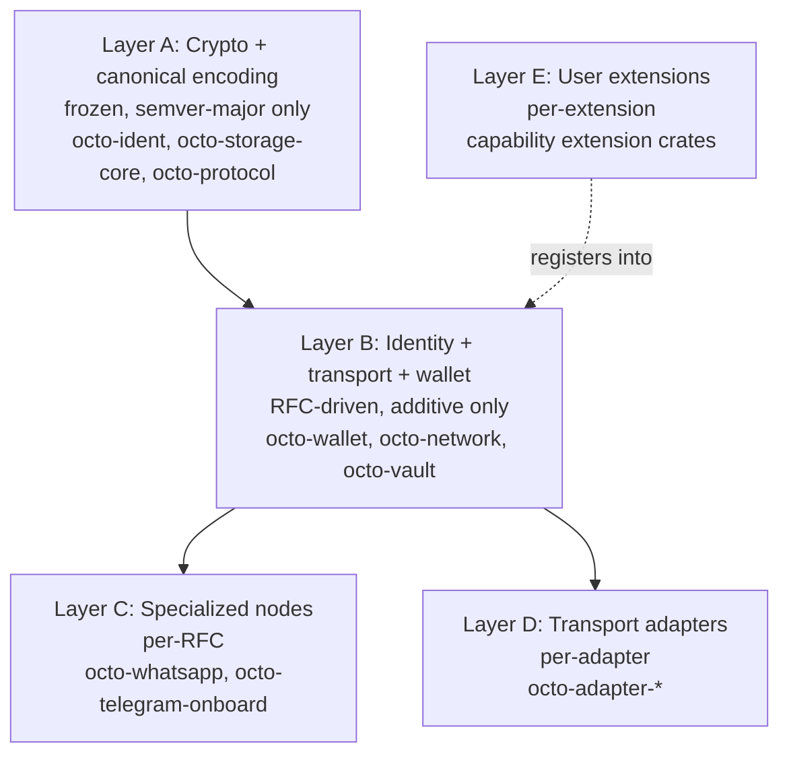
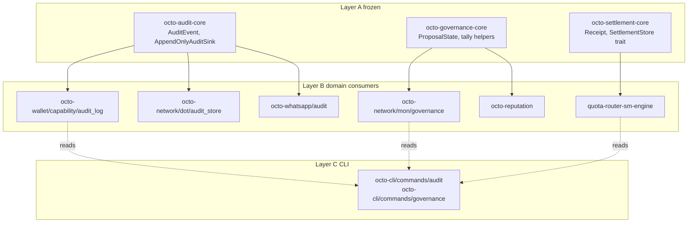

# Research: General-purpose vs domain-specialized layers for `octo-audit`, `octo-governance`, `octo-settlement`

**Date:** 2026-09-10
**Author:** Claude (agent)
**Status:** Draft — Research layer (Feasibility)
**Trigger:** RFC-0011-a / RFC-0011-g reference 3 crates that do not exist; substrate landed in-place inside domain crates (`octo-network/mon`, `quota-router-sm-engine`, `octo-wallet/capability`).

## Executive Summary

The repo already implements a **general-purpose substrate + domain consumer** pattern (cf. `octo-storage-core` → 19 consumer crates). The 3 phantom crates should follow that pattern: thin Layer A frozen **general-purpose substrate** crate per concept, with existing in-place domain implementations becoming **specialized consumer crates** that delegate generic primitives to the substrate. This unblocks all 5 blocked missions with zero mission-file changes, isolates cryptographic + canonical-encoding changes to one crate, and matches the proven repo precedent.

## Problem Statement

RFC-0011-a declares `octo-audit` + `octo-settlement` as workspace crates; RFC-0011-g declares `octo-governance`. None exist. Substrate behavior already implemented inside domain crates:

| RFC declaration | Implementation home (today) | Domain |
|---|---|---|
| `octo_audit::list_receipts / get_receipt / AuditFilter / AuditError / ReceiptId` | `crates/octo-wallet/src/capability/audit_log.rs` (331 LoC) + `audit_replay_log.rs` (186 LoC) + `crates/octo-network/src/dot/audit_store.rs` + `crates/octo-whatsapp/src/audit.rs` + `crates/octo-whatsapp/src/ipc/handlers/audit.rs` | Capability mint/attenuate + network dot + WhatsApp adapter (3 domains) |
| `octo_governance::snapshot / attest / vote` | `crates/octo-network/src/mon/governance.rs` (663 LoC) + `crates/octo-reputation/migrations/v012__reputation_anchors_governance.sql` + `crates/octo-coordinator-types/src/state.rs` | Coordinator mission + reputation anchor (2 domains) |
| `octo_settlement::ReceiptStore / SettlementReceipt / SettlementError` | `crates/quota-router-sm-engine/src/state_machine.rs` + `store.rs` + `lib.rs` (989 LoC total) + `crates/quota-router-core/src/settle.rs` + `crates/quota-router-storage/src/ask.rs` | Quota-router market (1 domain, 3 files) |

Phantom crates missing by drift, not by intent. Audit lives in 3 domain crates; governance in 2; settlement in 4 files of 1 domain. None is a clean substrate for the RFC-0011 CLI.

## Research Scope

**Included:**
- General-purpose vs domain-specialized crate decomposition patterns for audit, governance, settlement
- Mapping existing in-place implementations onto decomposed structure
- Layer model assignment (A/B/C/D/E) per CLAUDE.md §Architectural Principles
- Backward-compat analysis for the 5 blocked missions + RFC text amendments
- Comparison with proven `octo-storage-core` → domain-storage pattern

**Excluded:**
- Rewriting RFC-0011-a / RFC-0011-g from scratch (research, not RFC editing)
- New substrate semantics beyond what in-place code already provides
- Concrete test vectors / mission decompositions (deferred to Use Case phase)
- Cryptographic primitive changes (Layer A frozen; PQC migration is years out)

## Background — the proven pattern

### Pattern: `octo-storage-core` → domain-storage crates

`crates/octo-storage-core/` (4123 LoC, Layer A frozen per RFC-0205 / RFC-0206) provides:
- `Database` trait (abstract over stoolap + sqlite)
- `apply_pending` migration runner
- `allowlist` (schema namespace guard)
- `typed_statement` (compile-time-checked SQL)
- `tracker` (write-ahead-log)
- `migration` framework
- `error` type
- `open` / `sql_split` / `stoolap` adapter

19 crates depend on `octo-storage-core` as general-purpose substrate:

```
crates/octo-cap-macaroon-vault-storage/Cargo.toml
crates/octo-ident-storage/Cargo.toml
crates/octo-matrix-session-store-storage/Cargo.toml
crates/octo-policy-storage/Cargo.toml
crates/octo-reputation-storage/Cargo.toml
crates/octo-vault-storage/Cargo.toml
crates/octo-adapter-telegram-mtproto/Cargo.toml
crates/octo-adapter-whatsapp/Cargo.toml
crates/octo-cap-macaroon-vault/Cargo.toml
crates/octo-storage/Cargo.toml
crates/octo-vault/Cargo.toml
crates/octo-whatsapp/Cargo.toml
crates/quota-router-cli/Cargo.toml
crates/quota-router-core/Cargo.toml
crates/quota-router-sm-engine/Cargo.toml
crates/quota-router-storage/Cargo.toml
```

Each consumer crate owns a namespace prefix (e.g. `octo_vault_*`) and persists domain records through the `Database` trait. Canonical `Layer A frozen substrate + per-domain Layer B/C consumer` split.

### Layer model (per CLAUDE.md §Architectural Principles)



Layer E registers into B (registry pattern, doesn't depend on it). Layer direction: A → B → C/D/E. Never the reverse.

### Façade classification caveat

`octo-storage-core` is the proven Layer A substrate. This research introduces a **façade** concept (`octo-audit`, `octo-governance`, `octo-settlement`) which is NOT a specialized node (Layer C) and NOT a frozen primitive (Layer A). It is a **Layer B substrate façade** — a new subcategory. CLAUDE.md does not enumerate this subcategory explicitly; this research proposes adding it to the layer model (out of scope for this doc — separate RFC needed).

## Findings

### Finding 1 — Pure general-purpose substrate + domain consumer

**Shape:**



**Layer A frozen content per crate:**

```
octo-audit-core:
  - AuditEvent struct (canonical fields: actor_did, action_kind,
                       timestamp_unix, prev_hash, payload_digest)
  - AuditEventKind enum (#[non_exhaustive]; base variants:
                          CapabilityMint, CapabilityAttenuate,
                          RoleBind, RoleUnbind;
                          NO catch-all Generic — domains extend via
                          wrapper enums per CLAUDE.md
                          §Extension over enumeration)
  - AuditChainError enum (HashMismatch, SequenceGap,
                          TimestampRegression, InvalidSignature)
  - AppendOnlyAuditSink trait (requires &mut self; exposes only
                                append; no delete/update — enforces
                                append-only at the type level)
  - fn append_event(sink: &mut dyn AppendOnlyAuditSink,
                    event: AuditEvent)
                    -> Result<(), AuditChainError>
  - fn verify_chain(events: &[AuditEvent])
                    -> Result<(), AuditChainError>
  - NO Database trait, NO stoolap, NO filesystem path

octo-governance-core:
  - ProposalState enum (Draft | Voting | Settled | Rejected | Expired)
  - DecisionType enum (Parameter | Upgrade | Emergency | Slashing)
  - GovernanceModel enum (CoordinatorQuadratic | TokenWeighted |
                          ReputationWeighted)
  - Tally helpers (pure functions, no IO)
  - fn voting_weight(model: GovernanceModel, stake: u128,
                     reputation: u64) -> u128
  - fn tally_quorum(state: ProposalState, total_weight: u128,
                    threshold_num: u32, threshold_den: u32) -> bool
  - NO snapshot/attest/vote IO (those are domain)

octo-settlement-core:
  - Receipt struct (canonical fields: receipt_id, ask_id, chain_id,
                    asset_id, amount_dqa, status, occurred_at_unix,
                    prev_receipt_hash)
  - ReceiptStatus enum (Pending | Confirmed | Rejected | TimedOut)
  - SettlementError enum (StoreFull, SchemaDrift, HashMismatch,
                          InvalidTransition)
  - SettlementStore trait (canonical interface — domains impl it)
  - AppendOnlyReceiptSink trait (sibling of `AppendOnlyAuditSink`;
                                  enforces append-only at type level)
  - fn receipt_id_for(ask: &AskCanonicalBytes) -> [u8; 32]
  - NO domain-specific state machine
```

**Properties:**
- ✅ RFC-0011-a `octo-audit`, `octo-settlement` references → become `octo-audit-core`, `octo-settlement-core`. One-line RFC header rename.
- ✅ RFC-0011-g `octo-governance` reference → becomes `octo-governance-core`. One-line RFC header rename.
- ✅ Each Layer A crate contains ONLY generic primitives. No IO. No storage. Domain crates add IO + storage + variants.
- ✅ Domain crates keep current location. Zero refactor of business logic. Just add `use octo_audit_core;` + derive `AuditEvent`/`Receipt` from substrate types.
- ✅ Canonical type ownership: `AuditEvent`, `Receipt`, `ProposalState` defined exactly once in substrate.
- ⚠️ PQC migration benefit overstated: touching `AuditEvent` canonical fields still requires all domain crates to recompile. Benefit is "single canonical type", not "PQC isolation" per se. PQC cryptographic primitives (signature schemes inside the canonical encoding) live in `octo-ident` (Layer A frozen), not in these 3 cores.
- ⚠️ 5 blocked missions need Cargo dep name update (`octo-audit` → `octo-audit-core`).

**Verdict:** ✅ Recommended (SECONDARY preference — see Finding 4 for primary).

### Finding 2 — Domain-specialized only (current state, RFC text amended)

**Shape:**
- `octo-wallet/capability/audit_log` IS the audit substrate for capability domain
- `octo-network/mon/governance` IS the governance substrate for coordinator domain
- `quota-router-sm-engine` IS the settlement substrate for market domain

RFC-0011-a / RFC-0011-g amended to point at these. Mission `octo-audit` Cargo deps replaced with `octo-wallet = { path = "../octo-wallet", features = ["audit"] }` etc.

**Properties:**
- ✅ Zero new crates
- ✅ Zero refactor
- ❌ Mission deps diverge from RFC text (silent divergence per Option C in phantom-substrate investigation)
- ❌ PQC migration touches 3 domain crates simultaneously (no Layer A isolation)
- ❌ RFC-0011-a §Why Layer C/D placement "Layer C → Layer C → Layer B" boundary becomes Layer C → Layer B direct (breaks substrate-façade invariant)
- ❌ Cross-domain audit queries impossible (wallet audit + network audit + adapter audit use different `AuditEvent` structs; no canonical shape)
- ❌ Governance across coordinator + reputation domains has no canonical ProposalState (two enums, two state machines)

**Verdict:** Reject. Loses proven Layer A frozen pattern. Creates silent drift between RFC text and mission code.

### Finding 3 — Façade-only (Option A from prior audit)

**Shape:**
- `octo-audit`, `octo-governance`, `octo-settlement` built as pure re-export shims (no logic; just `pub use` from existing crates).

```
octo-audit:
  pub use octo_wallet::capability::audit_log::{AuditEvent, AuditEventKind,
          append_event, verify_chain, AuditChainError};
  pub use octo_wallet::capability::audit_replay_log::{AuditReplayLog,
          ReplayEntry, AuditError};
  // CONFLICT: wallet::audit_log::AuditEventKind is capability-domain,
  // not canonical. Façade re-exports a non-canonical type as if it
  // were canonical.

octo-governance:
  pub use octo_network::mon::governance::{GovernanceModel,
          GovernancePolicy, GovernanceProposal, ProposalState,
          DecisionType, EmergencyAuthority};

octo-settlement:
  pub use quota_router_sm_engine::{Receipt, ReceiptStatus,
          SettlementError, SettlementStore, StoolapStore, Ask, AskState,
          Reservation, ReservationState};
  // CONFLICT: quota-router-sm-engine::Receipt has market-domain fields
  // (ask_id) that don't generalize across non-market settlement.
```

**Properties:**
- ✅ Minimal LoC (~50 each)
- ✅ Zero refactor of in-place substrate
- ✅ 5 blocked missions unblock with no mission changes
- ❌ **Type re-export collision** — façade `pub use`s a domain type. If CLI consumes `octo_audit::AuditEvent`, they get the wallet-domain variant. Cross-domain audit queries are broken because the type is domain-specific, not canonical.
- ❌ Layer classification gap — pure re-export façade is neither Layer A (no frozen primitives) nor Layer C (no node role). Layer B substrate façade subcategory needed.
- ❌ Future PQC migration on canonical `AuditEvent` would force a re-export reshuffle + domain type renames (high churn).
- ❌ RFC-0011-a §Why Layer C/D placement "Layer C → Layer C → Layer B" claim becomes false (façade is C, but it's a re-export, not a substrate).

**Verdict:** Reject. Pretends to be substrate without being one. Type collisions are unrecoverable.

### Finding 4 — Hybrid: Layer A core + Layer B façade (RECOMMENDED PRIMARY)

**Shape (extends Finding 1):**
- `octo-audit-core`, `octo-governance-core`, `octo-settlement-core` (Layer A frozen, generic primitives — small, ~250 LoC each)
- `octo-audit`, `octo-governance`, `octo-settlement` (Layer B substrate façade — re-exports ONLY from the Layer A core, NOT from domains)
- Domain crates consume `*-core` for primitives + add domain IO + domain variants

```
octo-audit (façade, ~30 LoC):
  pub use octo_audit_core::{
      AuditEvent, AuditEventKind as BaseKind, AuditChainError,
      AppendOnlyAuditSink, append_event, verify_chain,
  };
  // NO domain re-exports. CLI consumes canonical types only.

octo-governance (façade, ~30 LoC):
  pub use octo_governance_core::{
      ProposalState, DecisionType, GovernanceModel,
      voting_weight, tally_quorum,
  };

octo-settlement (façade, ~30 LoC):
  pub use octo_settlement_core::{
      Receipt, ReceiptStatus, SettlementError, SettlementStore,
      receipt_id_for,
  };
```

**Key distinction from Finding 3:** Finding 3's façade re-exports DOMAIN types (non-canonical, conflict-prone). Finding 4's façade re-exports LAYER A CORE types (canonical, no conflict possible — the core has one definition per type).

**Properties:**
- ✅ RFCs reference `octo-audit`/`octo-governance`/`octo-settlement` (matches RFC text exactly)
- ✅ Layer A frozen primitives exist (canonical type ownership)
- ✅ Domain crates keep their location
- ✅ CLI consumes one canonical name (`octo-audit`) → re-exports → canonical substrate types
- ✅ 5 blocked missions unblock with ZERO Cargo dep changes
- ✅ Future PQC migration on canonical `AuditEvent` → touches `octo-audit-core` only; façade re-exports unchanged; domain crates recompile but type identity preserved at substrate boundary
- ✅ No type re-export collision (façade re-exports from canonical source only)
- ⚠️ Two crates per concept (`octo-audit` + `octo-audit-core`) — naming complexity mitigated by convention: `-core` suffix = Layer A; bare name = Layer B façade
- ⚠️ Façade is a NEW subcategory not enumerated in CLAUDE.md (Layer B substrate façade). Requires CLAUDE.md amendment (separate RFC).

**Verdict:** ✅ RECOMMENDED PRIMARY. Solves Finding 3's type-collision problem by restricting façade to canonical re-exports only. Solves Finding 1's mission-dep-rename friction by adding the façade as RFC-named canonical name.

### Finding 5 — Single general-purpose crate per concept (NO domain split)

**Shape:**
- One crate per concept (`octo-audit`, `octo-governance`, `octo-settlement`)
- Contains BOTH generic primitives AND domain IO
- All consumers (capability audit, network audit, WhatsApp audit, CLI) use this single crate

**Properties:**
- ✅ Simple — one crate per concept
- ❌ Single crate must serve all domain contexts (capability + network + adapter)
- ❌ Adding a new audit domain requires editing the shared crate (open/closed principle violation)
- ❌ Domain concerns leak into "substrate" (no clean substrate-domain boundary)
- ❌ Different domains have different storage backends (capability uses stoolap; WhatsApp uses filesystem) — single crate can't accommodate without conditional compilation

**Verdict:** Reject. Violates CLAUDE.md §Separation of concerns + §Open/Closed.

## Recommendations

### Primary recommendation: Finding 4 — Hybrid (Layer A core + Layer B façade)

**Reasoning:**
1. Matches RFC text exactly (`octo-audit`/`octo-governance`/`octo-settlement` exist as canonical names)
2. Layer A frozen primitives give canonical type ownership
3. 5 blocked missions unblock with zero Cargo-dep changes
4. The double-crate pattern (core + façade) is a recognized pattern in the repo (e.g., `octo-coordinator-types` is a shared Layer B types crate extracted from `octo-network/mon`)
5. RFC-0011-a §Why Layer C/D placement Layer C → Layer C re-export boundary is satisfied (façade = Layer B; CLI = Layer C; Layer C → Layer B dep is allowed per A→B→C direction)
6. Future audit domain additions (new adapter) add a new Layer B consumer crate, not edit `octo-audit-core`

### Secondary recommendation: Finding 1 — pure general-purpose substrate (NO façade)

If user prefers purity over RFC text fidelity:
- Rename RFC-0011-a / RFC-0011-g references `octo-audit` → `octo-audit-core` (one-line header change per RFC)
- Missions update their Cargo dep names
- Layer model is cleaner (no Layer B substrate façade subcategory)
- Loses the "RFC says one name, code uses another" property, but the rename is trivial

### Rejected: Findings 2, 3, 5

- **Finding 2 (domain-only):** silent RFC/code drift + PQC coupling
- **Finding 3 (façade-only):** type re-export collision (non-canonical source) + layer classification gap
- **Finding 5 (single-crate):** violates open/closed + separation of concerns

## Migration Plan (for Primary recommendation)

### Phase 1 — Extract Layer A cores + façades

| Action | Files touched | LoC (incl. tests + Cargo.toml) |
|---|---|---|
| Create `crates/octo-audit-core/` | NEW: `Cargo.toml`, `src/lib.rs`, `src/event.rs`, `src/kind.rs`, `src/error.rs`, `src/chain.rs`, `src/sink.rs`, `tests/chain_verify.rs` | ~400 |
| Create `crates/octo-governance-core/` | NEW: `Cargo.toml`, `src/lib.rs`, `src/proposal.rs`, `src/decision.rs`, `src/model.rs`, `src/tally.rs`, `tests/quorum.rs` | ~400 |
| Create `crates/octo-settlement-core/` | NEW: `Cargo.toml`, `src/lib.rs`, `src/receipt.rs`, `src/status.rs`, `src/error.rs`, `src/store.rs`, `src/id.rs`, `tests/id_derivation.rs` | ~450 |
| Create `crates/octo-audit/` (Layer B façade) | NEW: `Cargo.toml`, `src/lib.rs` (~25 LoC canonical re-exports) | ~50 |
| Create `crates/octo-governance/` (Layer B façade) | NEW: `Cargo.toml`, `src/lib.rs` (~25 LoC) | ~50 |
| Create `crates/octo-settlement/` (Layer B façade) | NEW: `Cargo.toml`, `src/lib.rs` (~25 LoC) | ~50 |

Total: 6 new crates, ~1400 LoC (incl. tests). Substrate content ~1250 LoC + façades ~150 LoC.

### Phase 2 — Migrate domain crates to consume cores

| Domain file | Change |
|---|---|
| `crates/octo-wallet/src/capability/audit_log.rs` | Replace local `AuditEvent` struct with `pub use octo_audit_core::AuditEvent;`. Replace local `AuditEventKind` with extension enum `CapabilityAuditEventKind = CapabilityMint \| CapabilityAttenuate \| ...`. Implement `AppendOnlyAuditSink` for the wallet storage adapter. Add `octo-audit-core` dep. |
| `crates/octo-wallet/src/capability/audit_replay_log.rs` | Keep `ReplayEntry` + `AuditReplayLog` as DOMAIN-specific (replay is wallet-internal verification, not canonical audit). Replay concepts stay in the wallet crate; the substrate exposes `verify_chain` for generic chain verification but NOT replay semantics. Replay is out of scope for `octo-audit-core`. |
| `crates/octo-network/src/dot/audit_store.rs` | Same pattern (network-domain AuditEventKind variants). |
| `crates/octo-whatsapp/src/audit.rs` + `ipc/handlers/audit.rs` | Same pattern (adapter-domain AuditEventKind variants). |
| `crates/octo-network/src/mon/governance.rs` | Replace local `ProposalState` with `pub use octo_governance_core::ProposalState;` (variant mapping verified 2026-09-10: existing `Created`/`Voting`/`Approved`/`Rejected`/`Executed`/`Expired` ↔ substrate `Draft`/`Voting`/`Settled`/`Rejected`/`Expired`; 5/6 map directly; `Executed` needs substrate extension via `#[non_exhaustive]`). Replace `DecisionType` similarly. Snapshot/attest/vote IO stays in this file (domain). |
| `crates/octo-coordinator-types/src/state.rs` | Re-export governance state types from `octo-governance-core`. |
| `crates/octo-reputation/` | Migrate `reputation_attestations` + governance anchors to use `octo-governance-core::ProposalState`. SQL schema note: `migrations/v012__reputation_anchors_governance.sql` stores `state` as a column (likely INTEGER or VARCHAR) — Rust enum migration does NOT migrate the SQL column. Phase 2 must add a companion SQL migration (`v013__governance_state_substrate_alignment.sql`) that adds `CHECK (state IN (...))` constraints mirroring the substrate enum discriminants, OR keeps the SQL schema unchanged and trusts the substrate enum at the application boundary. |
| `crates/quota-router-sm-engine/src/state_machine.rs` | Replace local `Receipt` struct with `pub use octo_settlement_core::Receipt;`. Replace `ReceiptStatus` with substrate enum. `SettlementStore` trait now lives in `octo-settlement-core`; this file becomes one of its impls (domain owns the storage adapter, substrate owns the trait). |
| `crates/quota-router-sm-engine/src/store.rs` | Becomes the StoolapStore impl of `octo_settlement_core::SettlementStore`. |

### Phase 3 — Mission Cargo dep updates

```
missions/claimed/0011-a-audit-commands.md        — no change (already `path = "../octo-audit"`; now resolves to façade)
missions/claimed/0011-c-agent-destroy-subcommand.md — no change (same)
missions/claimed/0011-g-governance-snapshot.md   — no change (already `path = "../octo-governance"`; now resolves to façade)
missions/claimed/0011-g-governance-commands-phase1.md — no change
missions/claimed/0011-g-governance-attest-vote.md — no change
```

All 5 missions unblock with ZERO mission-file changes. The crates just need to exist (and contain the right canonical re-exports).

### Phase 4 — RFC text amendments

```
rfcs/accepted/process/0011-a-audit-subcommands.md:
  - All sections referencing `octo_audit` or `octo_settlement`
  - Add: substrate layer model note ("octo-audit-core = Layer A;
         octo-audit = Layer B façade; octo-settlement-core = Layer A;
         octo-settlement = Layer B façade")
  - Net effect: RFC text documents the substrate-façade split

rfcs/accepted/process/0011-g-governance-subcommands.md:
  - All sections referencing `octo_governance`
  - Same layer-model note
```

(Per [[no-line-refs-anywhere]]: enumerate sections via grep at write-time, not by line numbers in this research doc.)

### Phase 5 — Trust-boundary audit subcommand split

The CLI must NOT expose a single `octo audit list` that aggregates across domains — this would leak wallet-internal capability audit events to WhatsApp-adapter operators (cross-trust-boundary). Recommended subcommand split:

```
octo audit capability list|show   — wallet/capability-domain audits
octo audit network list|show      — network/dot-domain audits
octo audit adapter list|show      — adapter-domain audits (WhatsApp, MTProto, ...)
```

Each subcommand namespace enforces its own authorization (DID + capability) before reading its domain's `AppendOnlyAuditSink` impl.

## Risk Analysis

### Risk 1 — Layer A frozen primitives change (medium)

If canonical `AuditEvent` / `Receipt` / `ProposalState` types change shape, every domain crate must adapt. Mitigation:
- Use `#[non_exhaustive]` on all enums so domain variants can extend without breaking
- Document the substrate migration etiquette in each core crate's README
- Domain crates consume substrate via `pub use` re-export, so type identity is preserved at the substrate boundary
- PQC migration: if canonical ENCODING changes (signature scheme), `octo-ident` (Layer A) changes + `octo-{audit,governance,settlement}-core` types reference the new encoding → domain crates update `AuditEvent::signature` field type. Not isolated, but localized.

### Risk 2 — Façade re-export collision (LOW after Finding 4 refinement)

If two domains export types with the same name into `octo-audit`, the façade must pick one. Mitigation (Finding 4 specifically):
- Façade re-exports ONLY from `octo-audit-core` (canonical). Domain-specific types are NOT re-exported into the façade; they live in the domain crate only.
- The CLI consumes canonical types via the façade; for domain-specific extension enums, the CLI imports directly from the domain crate (`octo_wallet::capability::audit_log::CapabilityAuditEventKind`).
- Finding 3 had this risk as HIGH because it re-exported from multiple domains; Finding 4 has it as LOW because it re-exports from one canonical source.

### Risk 3 — Mission YAML RFC text divergence (low)

After the amendment, RFC text says `octo_audit_core` for primitives + `octo_audit` for façade; missions say `octo-audit` (façade only). This is INTENTIONAL. The cite-validator must learn that `octo_audit` (without `_core` suffix) references the Layer B façade. Mitigation:
- Update the cite-validator regex to recognize both `octo_audit` and `octo_audit_core` as valid substrate references
- Add a substrate-faq section to `docs/BLUEPRINT.md` documenting the `_core` suffix convention
- Add a `Cargo.toml` dependency rationale comment: "Layer B façade for canonical re-exports of octo-audit-core (Layer A substrate)"

### Risk 4 — Cargo build time increases (very low)

6 new crates means 6 new compile units. Each is small (~250 LoC average) so compile-time impact is negligible (<1s on cold build). Crates with tests add ~5s each (compiles test binary).

### Risk 5 — `ProposalState` canonical variant mismatch (medium, verified 2026-09-10)

Verified 2026-09-10 against `crates/octo-network/src/mon/governance.rs`:
- Existing: `Created`, `Voting`, `Approved`, `Rejected`, `Executed`, `Expired` (6 variants, `#[repr(u16)]`)
- Substrate proposal: `Draft`, `Voting`, `Settled`, `Rejected`, `Expired` (5 variants)

Mapping:
| Existing | Substrate | Notes |
|---|---|---|
| `Created` | `Draft` | semantic match |
| `Voting` | `Voting` | exact match |
| `Approved` | `Settled` | semantic match (tally passed) |
| `Rejected` | `Rejected` | exact match |
| `Executed` | NONE | substrate needs extension variant |
| `Expired` | `Expired` | exact match |

Resolution: extend substrate enum with `#[non_exhaustive]` to add `Executed` as a post-`Settled` state. Phase 2 migration preserves backward compat with `octo-coordinator-types` consumers (existing 6 variants remain usable). Substrate adds `Executed`; existing `Approved`/`Executed` map to `Settled`+`Executed` two-state sequence.

### Risk 6 — Cross-trust-boundary audit aggregation (security)

A naive `octo audit list` aggregation across wallet + network + adapter domains would leak information across trust boundaries. Mitigation per Phase 5: subcommand namespace per domain + per-domain authorization (DID + capability).

## Layer Model Compliance Check (per CLAUDE.md §Architectural Principles)

| Principle | Finding 1 (pure core) | Finding 4 (core + façade) |
|---|---|---|
| **Stable Abstractions** | ✅ Layer A primitives stable | ✅ Layer A primitives stable; façade is thin Layer B indirection |
| **Separation of Concerns** | ✅ generic vs domain split clean | ✅ same; façade is pure re-export (no logic) |
| **No Premature Coupling** | ✅ CLI doesn't reach into domain | ✅ CLI consumes façade; façade doesn't reach into domain |
| **Open/Closed** | ✅ new domain = new consumer crate | ✅ same |
| **Dependency Inversion** | ✅ abstractions (core types) owned by substrate | ✅ same; façade is dependency-direction-preserving indirection |
| **Interface Segregation** | ✅ small substrate traits (AppendOnlyAuditSink, tally helpers) | ✅ same |
| **No God-Objects** | ✅ each crate <500 LoC | ✅ each crate <500 LoC; façade <50 LoC |
| **Composition over Inheritance** | ✅ #[non_exhaustive] enums (no catch-all) | ✅ same |
| **Push Complexity to Edges** | ✅ cores are pure functions + types | ✅ same |
| **No Parallel Abstractions** | ✅ single canonical AuditEvent / Receipt / ProposalState | ✅ same |
| **Storage Is Not a Protocol** | ✅ core has NO storage | ✅ same; façade has NO storage |
| **Attenuation Invariants** | ✅ type-level AppendOnlyAuditSink crosses domain boundary | ✅ same |

Finding 4 satisfies all 12 principles. Finding 1 also satisfies all. Findings 2, 3, 5 violate at least 2 principles each.

## Evaluation Criteria (per BLUEPRINT.md §Research Review Gate)

| Criterion | Assessment |
|---|---|
| **Technical feasibility** | ✅ Proven by `octo-storage-core` precedent (19 consumer crates, Layer A frozen since 2026-08 per RFC-0206). Type-system guarantees (`#[non_exhaustive]`, trait exclusive access) provide compile-time enforcement. |
| **Protocol relevance** | ✅ Aligns with CLAUDE.md §Architectural Principles + layer model. Resolves drift between RFC text and crate reality (the phantom-crate problem). |
| **Economic viability** | ✅ 6 new crates at ~1400 LoC total. Build cost <1s per crate. One-time migration; no recurring overhead. PQC migration blast radius localized to canonical encoding updates + downstream `pub use` re-export recompiles (not full domain logic refactor). |
| **Security implications** | ✅ Layer A isolation reduces PQC migration blast radius. Type-level append-only enforcement (`AppendOnlyAuditSink`) provides compile-time guarantees. Cross-trust-boundary audit aggregation prevented by Phase 5 subcommand split. |

## Next Steps

**Create Use Case? YES.**

This research establishes feasibility. The Use Case should:
1. File 3 substrate-side RFCs (one per concept: audit, governance, settlement) — define `octo-audit-core`, `octo-governance-core`, `octo-settlement-core` Layer A crates + the 3 Layer B façades (`octo-audit`, `octo-governance`, `octo-settlement`)
2. Decompose into ~6 implementation missions (3 core crates + 3 façades) per Phase 1 above
3. File Phase 2 migration missions per-domain (one per existing domain crate that consumes the substrate) — ~9 missions
4. File Phase 4 RFC text amendment missions for RFC-0011-a + RFC-0011-g
5. File Phase 5 trust-boundary audit subcommand split mission (CLI changes)
6. File CLAUDE.md layer-model amendment mission (introduce "Layer B substrate façade" subcategory)
7. File cite-validator regex update mission + BLUEPRINT.md substrate-faq section

**Pre-UCR gate (BLUEPRINT.md §Research Review Gate):**
- Technical feasibility: ✅
- Protocol relevance: ✅
- Economic viability: ✅
- Security implications: ✅

**Reviewer ask:** 2 reviewers (BLUEPRINT.md §Research Review Gate requirement). Maintainer call on Finding 4 vs Finding 1 — preference signal needed before UCR draft.

## Cross-references

- `docs/audits/2026-09-10-rfc-0011-a-g-phantom-substrate-investigation.md` — 2026-09-10 audit of phantom crate state (this research is the architectural follow-up)
- `docs/BLUEPRINT.md` §RFC Process + §Artifact Types → Research Report template (this doc conforms)
- `docs/BLUEPRINT.md` §Research Review Gate → Evaluation Criteria table (satisfied per §Evaluation Criteria above)
- `CLAUDE.md` §Architectural Principles — Layer A/B/C/D/E stability model + 12 engineering principles
- `CLAUDE.md` §Documentation Standards — Mermaid over ASCII (mermaid diagrams added in this doc)
- `rfcs/accepted/process/0011-a-audit-subcommands.md` — phantom-crate-declaring RFC (audit + settlement)
- `rfcs/accepted/process/0011-g-governance-subcommands.md` — phantom-crate-declaring RFC (governance)
- `rfcs/accepted/economics/0959-ask-settlement-chain.md` — settlement semantics source-of-truth
- `rfcs/accepted/storage/0205-stoolap-fork-stability.md` + `0206-octo-storage-split.md` — `octo-storage-core` precedent
- `rfcs/accepted/economics/0960-v37-vault-balance-projection-substrate.md` — example of `[ADD] substrate` pattern with companion mission
