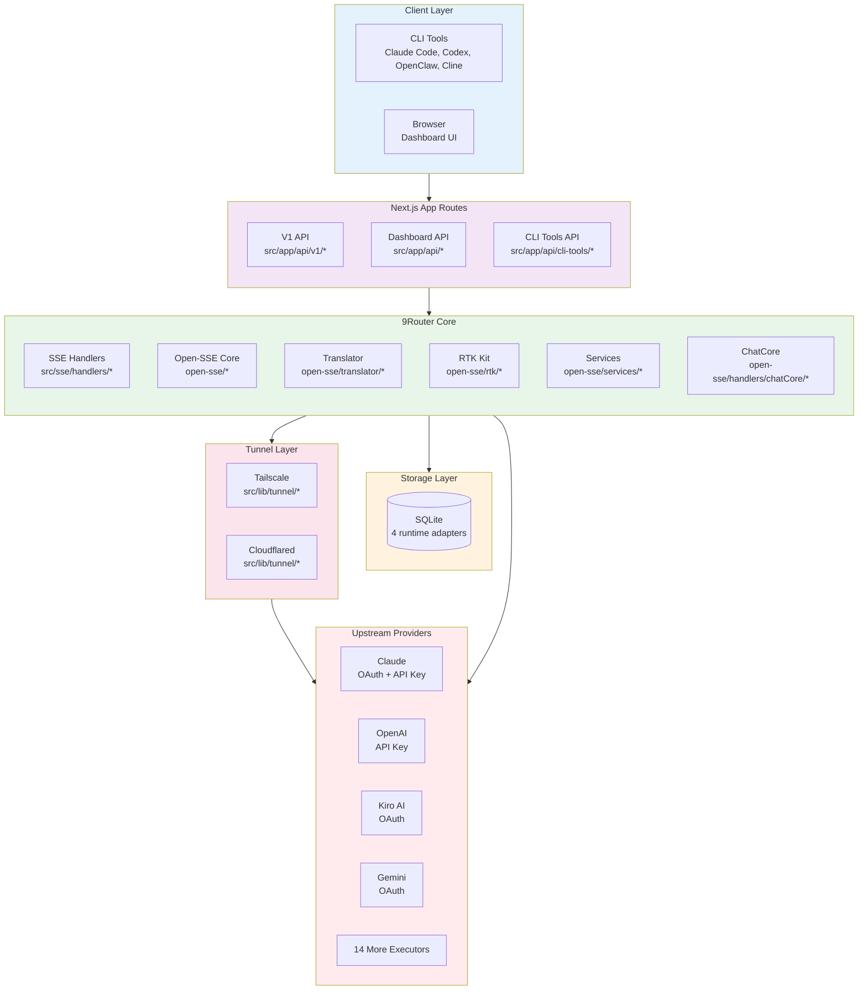
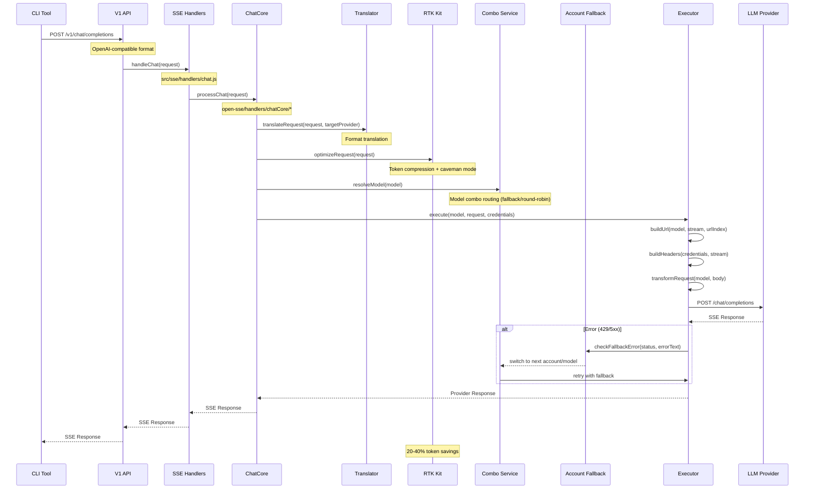
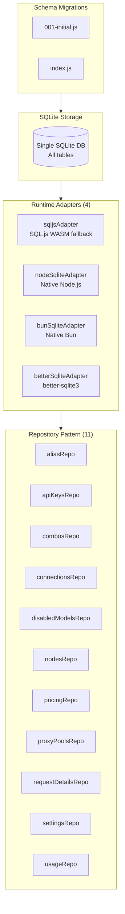
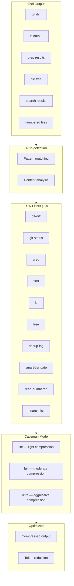
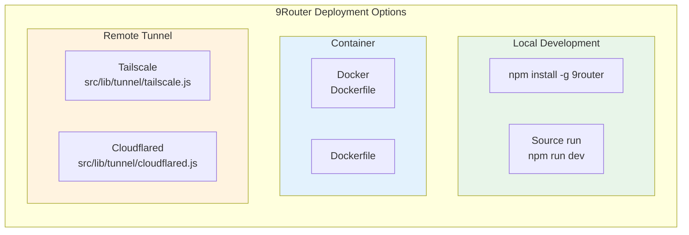
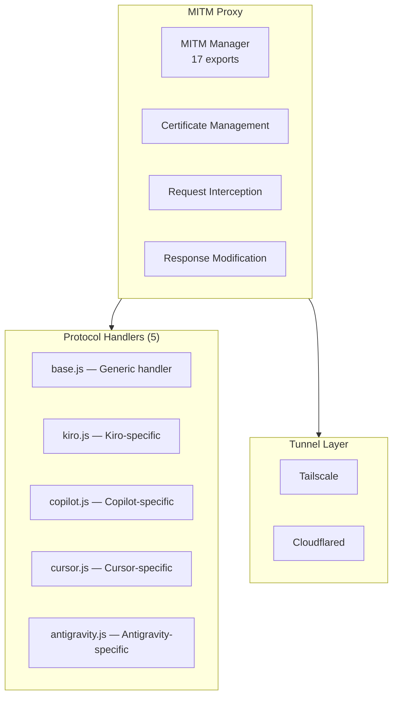

# Research: 9Router Architecture Analysis

**Date:** 2026-05-23  
**Status:** Revised (Round 7 — post adversarial review R6)  
**Source:** `/home/mmacedoeu/_w/ai/9router` (v0.4.29, 761 files)  
**Index:** 1,263 symbols, 1,657 imports, 651 files

---

## Table of Contents

1. [System Architecture](#1-system-architecture)
2. [Request Flow](#2-request-flow)
3. [Data Layer](#3-data-layer)
4. [Translator System](#4-translator-system)
5. [RTK Token Optimization](#5-rtk-token-optimization)
6. [Provider Integration](#6-provider-integration)
7. [Deployment Models](#7-deployment-models)
8. [Failure Modes](#8-failure-modes)
9. [Services Layer](#9-services-layer)
10. [Skills System](#10-skills-system)

---

## 1. System Architecture

### 1.1 High-Level Architecture



### 1.2 Directory Structure (Key Components)

```
9router/
├── src/
│   ├── app/
│   │   ├── api/
│   │   │   ├── v1/                    # OpenAI-compatible API
│   │   │   │   ├── chat/completions/  # Main routing endpoint
│   │   │   │   ├── models/            # Model listing (GET, info, [kind])
│   │   │   │   ├── embeddings/        # Embeddings endpoint
│   │   │   │   ├── responses/         # OpenAI Responses API + compact variant
│   │   │   │   ├── images/generations/ # Image generation
│   │   │   │   ├── audio/             # Speech, transcriptions, voices
│   │   │   │   ├── messages/          # Claude Messages API + count_tokens
│   │   │   │   ├── search/            # Web search endpoint
│   │   │   │   └── web/fetch/         # Web fetch proxy
│   │   │   ├── cli-tools/             # CLI tool settings APIs (14 tool configs)
│   │   │   ├── providers/            # Provider management
│   │   │   ├── oauth/                # OAuth flows
│   │   │   ├── pricing/              # Pricing management
│   │   │   ├── proxy-pools/          # Proxy pool management
│   │   │   └── locale/               # i18n locale API
│   │   └── (dashboard)/               # Dashboard UI
│   │       └── settings/
│   │           └── pricing/           # Pricing dashboard page
│   ├── sse/
│   │   └── handlers/
│   │       ├── chat.js               # Main chat handler
│   │       ├── embeddings.js         # Embeddings handler
│   │       ├── fetch.js              # Web fetch proxy handler
│   │       ├── imageGeneration.js    # Image generation handler
│   │       ├── search.js             # Web search handler
│   │       ├── stt.js                # Speech-to-text handler
│   │       └── tts.js                # Text-to-speech handler
│   ├── lib/
│   │   ├── tunnel/                   # Tunnel management
│   │   ├── oauth/                    # OAuth services
│   │   ├── db/                       # Database layer
│   │   │   ├── adapters/             # SQLite adapters (4 runtimes)
│   │   │   ├── repos/                # Repository pattern (11 repos)
│   │   │   ├── migrations/           # Versioned schema migrations
│   │   │   ├── helpers/              # DB helper utilities (jsonCol, kvStore, metaStore)
│   │   │   ├── index.js              # DB initialization and exports
│   │   │   ├── schema.js             # Schema definitions (157 lines)
│   │   │   ├── driver.js             # DB driver abstraction
│   │   │   ├── migrate.js            # Migration runner
│   │   │   ├── backup.js             # DB backup utilities
│   │   │   ├── paths.js              # DB path resolution
│   │   │   └── version.js            # Schema versioning
│   │   ├── network/                  # Network utilities
│   │   ├── usage/                    # Usage tracking
│   │   └── updater/                  # Auto-update
│   ├── mitm/
│   │   ├── manager.js                # MITM proxy manager (17 exports)
│   │   ├── server.js                 # HTTPS server
│   │   ├── config.js                 # MITM configuration
│   │   ├── dbReader.js               # DB reader for MITM
│   │   ├── logger.js                 # MITM logging
│   │   ├── paths.js                  # Certificate path resolution
│   │   ├── winElevated.js            # Windows elevation helper
│   │   ├── handlers/                 # Protocol handlers (5)
│   │   ├── cert/                     # TLS certificate management
│   │   ├── dns/                      # DNS resolution
│   │   └── dev/                      # Development helpers
│   ├── store/                        # Zustand state management (7 stores)
│   ├── i18n/                         # Internationalization
│   ├── models/                       # Data models (index.js barrel)
│   └── shared/
│       ├── components/               # Shared UI components (44 components)
│       ├── constants/                # Shared constants (11 files: providers, pricing, models, skills, etc.)
│       ├── hooks/                    # React hooks (3 hooks)
│       ├── services/                 # Shared services (3 files)
│       └── utils/                    # Shared utilities (9 files: clineAuth, cloud, machineId, etc.)
├── open-sse/
│   ├── config/                      # Configuration (12 files)
│   │   ├── appConstants.js          # App configuration + OAuth endpoints (24 symbols)
│   │   ├── providers.js             # Provider definitions (73+ providers, includes GLM, Kimi, MiniMax, BytePlus, OpenRouter)
│   │   ├── providerModels.js        # Provider model mappings
│   │   ├── errorConfig.js           # Error handling config (ERROR_TYPES, ERROR_RULES, BACKOFF_CONFIG)
│   │   ├── runtimeConfig.js         # Runtime config (RETRY_CONFIG, HTTP_STATUS)
│   │   ├── constants.js             # General constants
│   │   ├── models.js                # Model definitions
│   │   ├── ollamaModels.js          # Ollama-specific model mappings
│   │   ├── codexInstructions.js     # Codex system instructions
│   │   ├── defaultThinkingSignature.js  # Default thinking signature
│   │   ├── googleTtsLanguages.js    # Google TTS language list
│   │   └── ttsModels.js             # TTS model definitions
│   ├── executors/                   # 18 provider executors
│   │   ├── index.js                 # Executor registry
│   │   ├── base.js                  # BaseExecutor class
│   │   ├── default.js               # Default executor (OpenAI, Claude, Gemini*, GLM, Kimi, MiniMax)
│   │   ├── antigravity.js, azure.js, codex.js, commandcode.js
│   │   ├── cursor.js, gemini-cli.js, github.js, grok-web.js
│   │   ├── iflow.js, kiro.js, ollama-local.js, opencode.js
│   │   ├── opencode-go.js, perplexity-web.js, qoder.js, qwen.js
│   │   └── vertex.js
│   ├── translator/
│   │   ├── index.js                 # Translator registry
│   │   ├── formats.js               # 13 format definitions
│   │   ├── request/                 # 12 request translators
│   │   ├── response/                # 9 response translators
│   │   └── helpers/                 # Translator helpers (7 files)
│   ├── rtk/                         # Router Token Kit
│   │   ├── constants.js             # RTK constants (21+ symbols)
│   │   ├── autodetect.js            # Output type detection
│   │   ├── caveman.js               # Caveman mode injector
│   │   ├── cavemanPrompts.js        # Compression prompts (lite/full/ultra)
│   │   └── filters/                 # 10 RTK filters
│   ├── handlers/
│   │   ├── chatCore/                # Chat processing core (4 files)
│   │   └── imageProviders/          # 15 image adapters (11 standalone + 4 OpenAI-derived: openai/minimax/openrouter/recraft)
│   ├── services/                    # Core services
│   │   ├── accountFallback.js       # Account fallback with backoff
│   │   ├── combo.js                 # Model combo routing
│   │   ├── compact.js               # Compact mode
│   │   ├── model.js                 # Model resolution
│   │   ├── projectId.js             # Project ID management
│   │   ├── provider.js              # Provider resolution
│   │   ├── tokenRefresh.js          # OAuth token refresh
│   │   └── usage.js                 # Usage tracking
│   ├── transformer/                 # Response transformers
│   │   ├── streamToJsonConverter.js  # Complete-mode SSE to JSON aggregation (used by non-streaming)
│   │   └── responsesTransformer.js  # normalizeOutputFormat(): raw to OpenAI structure coercion
│   └── utils/                       # Utilities (16 files)
│       ├── proxyFetch.js            # Proxy-aware fetch
│       ├── stream.js                # Stream utilities
│       ├── streamHandler.js         # pipeWithDisconnect (used by ChatCore)
│       ├── streamHelpers.js         # parseSSELine, formatSSE (used by executors)
│       ├── error.js                 # Error utilities
│       ├── claudeCloaking.js        # Tool name obfuscation for Claude format
│       ├── claudeHeaderCache.js     # Cached Claude headers for warm starts
│       ├── cursorChecksum.js        # Cursor-specific checksum handling
│       ├── cursorProtobuf.js        # Cursor-specific protobuf handling
│       ├── reasoningContentInjector.js  # Inject thinking/reasoning content
│       ├── requestLogger.js         # Request logging
│       ├── sessionManager.js        # Session lifecycle management
│       ├── usageTracking.js         # Usage stats collection
│       ├── bypassHandler.js         # Bypass/warmup request handling
│       ├── clientDetector.js        # Client type detection
│       └── ollamaTransform.js       # Ollama response transformation
├── skills/                          # Skill definitions (8 skills)
│   ├── 9router/
│   ├── 9router-chat/
│   ├── 9router-embeddings/
│   ├── 9router-image/
│   ├── 9router-stt/
│   ├── 9router-tts/
│   ├── 9router-web-fetch/
│   └── 9router-web-search/
├── cloud/                           # Cloudflare Worker remote proxy (wrangler.toml, D1, KV)
└── tests/
```

### 1.3 Architecture Characteristics

| Characteristic | Implementation | Source |
|----------------|----------------|--------|
| **Runtime** | Next.js (App Router) + Express | `package.json` |
| **Language** | JavaScript | All source files `.js`, `.jsx` |
| **Storage** | SQLite (4 runtime adapters) | `src/lib/db/adapters/*` |
| **State Management** | Zustand 5.x | `src/store/` |
| **i18n** | Built-in internationalization | `src/i18n/` |
| **SSE Support** | Custom + Node streams | `open-sse/utils/stream.js` |
| **MITM Proxy** | Custom HTTPS interception | `src/mitm/manager.js` (17 exports) |
| **Tunneling** | Tailscale + Cloudflared | `src/lib/tunnel/*` |

---

## 2. Request Flow

### 2.1 Main Chat Request Flow



### 2.2 Code Evidence - Main Entry Point

From `src/app/api/v1/chat/completions/route.js`:
```javascript
import { callCloudWithMachineId } from "@/shared/utils/cloud.js";
import { handleChat } from "@/sse/handlers/chat.js";
import { initTranslators } from "open-sse/translator/index.js";

let initialized = false;
async function ensureInitialized() {
  if (!initialized) { await initTranslators(); initialized = true; }
}

export async function POST(request) {  
  // Fallback to local handling
  await ensureInitialized();
  return await handleChat(request);
}
```

### 2.3 Base Executor Structure

From `open-sse/executors/base.js`:
The `default.js` executor handles Claude, Gemini, GLM, Kimi, MiniMax, and standard OpenAI — there is no separate `claude.js` executor. Claude requests are routed through `default.js` via `case "claude":` in `buildUrl()` and `buildHeaders()`. Providers using `CLAUDE_API_HEADERS` (GLM, Kimi, MiniMax) are also handled by the default executor.

```javascript
export class BaseExecutor {
  constructor(provider, config) {
    this.provider = provider;
    this.config = config;
    this.noAuth = config?.noAuth || false;
  }

  buildUrl(model, stream, urlIndex = 0, credentials = null) { ... }
  buildHeaders(credentials, stream = true) { ... }
  transformRequest(model, body, stream, credentials) { ... }
  shouldRetry(status, urlIndex) { ... }
  
  async execute({ model, body, stream, credentials, signal, log, proxyOptions = null }) {
    // Fallback loop over multiple URLs
    for (let urlIndex = 0; urlIndex < fallbackCount; urlIndex++) {
      const url = this.buildUrl(model, stream, urlIndex, credentials);
      const transformedBody = this.transformRequest(model, body, stream, credentials);
      const headers = this.buildHeaders(credentials, stream);
      // ... fetch and retry logic
    }
  }
}
```

### 2.4 ChatCore Processing

The `open-sse/handlers/chatCore/` subsystem handles the actual chat processing:

| File | Purpose |
|------|---------|
| `streamingHandler.js` | SSE streaming response pipeline — format detection, transform streams, usage tracking |
| `nonStreamingHandler.js` | Non-streaming response handling — format translation, usage stats |
| `sseToJsonHandler.js` | SSE-to-JSON conversion for non-streaming passthrough |
| `requestDetail.js` | Request detail extraction, usage stats building, request logging |

### 2.5 Request Flow Summary

| Step | Component | File | Description |
|------|-----------|------|-------------|
| 1 | Entry | `route.js` | POST /v1/chat/completions |
| 2 | Routing | `chat.js` | handleChat() |
| 3 | Processing | `chatCore/*` | Streaming/non-streaming dispatch |
| 4 | Translation | `translator/*` | Format conversion |
| 5 | Optimization | `rtk/*` | Token compression + caveman mode |
| 6 | Combo Resolution | `services/combo.js` | Model combo routing |
| 7 | Execution | `executors/*` | Provider API calls |
| 8 | Fallback | `services/accountFallback.js` | Error-based account switching |
| 9 | Response | `translator/*` | Format back-conversion |

---

## 3. Data Layer

### 3.1 Storage Architecture



### 3.2 Database Adapters

| Adapter | Runtime | Package |
|---------|---------|---------|
| `sqljsAdapter.js` | WASM fallback | `sql.js ^1.14.1` |
| `nodeSqliteAdapter.js` | Node.js native | Built-in |
| `bunSqliteAdapter.js` | Bun native | Built-in |
| `betterSqliteAdapter.js` | better-sqlite3 | `better-sqlite3 ^12.6.2` (optional) |

### 3.3 Repository Pattern

| Repository | Purpose |
|------------|---------|
| `aliasRepo` | Model alias mappings |
| `apiKeysRepo` | API key storage |
| `combosRepo` | Model combo definitions |
| `connectionsRepo` | Provider connections |
| `disabledModelsRepo` | Disabled model tracking |
| `nodesRepo` | Node management |
| `pricingRepo` | Pricing data |
| `proxyPoolsRepo` | Proxy pool configuration |
| `requestDetailsRepo` | Request detail logging |
| `settingsRepo` | App settings |
| `usageRepo` | Usage tracking |

### 3.4 Schema Migrations

`src/lib/db/migrations/` contains versioned schema migrations:
- `001-initial.js` — Initial schema
- `index.js` — Migration runner

### 3.5 Storage Layer Summary

| Aspect | Implementation | Location |
|--------|---------------|----------|
| **Engine** | SQLite | `src/lib/db/` |
| **Adapters** | 4 runtime adapters | `src/lib/db/adapters/*` |
| **Repositories** | 11 repos (repository pattern) | `src/lib/db/repos/*` |
| **Migrations** | Versioned schema | `src/lib/db/migrations/` |

---

## 4. Translator System

### 4.1 Supported Formats

From `open-sse/translator/formats.js` — 13 format identifiers:

| Format | Identifier | Description |
|--------|-----------|-------------|
| OpenAI | `openai` | Standard chat completions |
| OpenAI Responses | `openai-responses` | OpenAI Responses API (newer) |
| OpenAI Response | `openai-response` | Single response format |
| Claude | `claude` | Anthropic Messages API |
| Gemini | `gemini` | Google Gemini |
| Gemini CLI | `gemini-cli` | Gemini CLI format |
| Vertex | `vertex` | Google Vertex AI |
| Codex | `codex` | OpenAI Codex |
| Antigravity | `antigravity` | Antigravity (Gemini-shaped) |
| Kiro | `kiro` | Kiro AI |
| Cursor | `cursor` | Cursor IDE |
| Ollama | `ollama` | Ollama local |
| CommandCode | `commandcode` | CommandCode |

### 4.2 Translator Architecture

```mermaid
graph TB
    subgraph Registry["Translator Registry"]
        R1[requestRegistry<br/>Map<from:to, fn>]
        R2[responseRegistry<br/>Map<from:to, fn>]
    end
    
    subgraph RequestTrans["Request Translators (12)"]
        RT1[antigravity-to-openai]
        RT2[claude-to-openai]
        RT3[gemini-to-openai]
        RT4[openai-responses]
        RT5[openai-to-claude]
        RT6[openai-to-commandcode]
        RT7[openai-to-cursor]
        RT8[openai-to-gemini]
        RT9[openai-to-kiro]
        RT10[openai-to-ollama]
        RT11[openai-to-vertex]
        RT12[openai-to-kiro.old]  <!-- stale/dead code -->
    end
    
    subgraph ResponseTrans["Response Translators (9)"]
        RS1[claude-to-openai]
        RS2[commandcode-to-openai]
        RS3[cursor-to-openai]
        RS4[gemini-to-openai]
        RS5[kiro-to-openai]
        RS6[ollama-to-openai]
        RS7[openai-responses]
        RS8[openai-to-antigravity]
        RS9[openai-to-claude]
    end
    
    Registry --> RequestTrans
    Registry --> ResponseTrans
```

### 4.3 Translator Registration

From `open-sse/translator/index.js`:
```javascript
const requestRegistry = new Map();
const responseRegistry = new Map();

// Register translator
export function register(from, to, requestFn, responseFn) {
  const key = `${from}:${to}`;
  if (requestFn) {
    requestRegistry.set(key, requestFn);
  }
  if (responseFn) {
    responseRegistry.set(key, responseFn);
  }
}

// Lazy load translators
function ensureInitialized() {
  require("./request/antigravity-to-openai.js");
  require("./request/claude-to-openai.js");
  require("./request/gemini-to-openai.js");
  require("./request/openai-responses.js");
  require("./request/openai-to-claude.js");
  require("./request/openai-to-commandcode.js");
  require("./request/openai-to-cursor.js");
  require("./request/openai-to-gemini.js");
  require("./request/openai-to-kiro.js");
  require("./request/openai-to-ollama.js");
  require("./request/openai-to-vertex.js");
}
```

### 4.3.1 Translator Helpers

`open-sse/translator/helpers/` contains **7 shared translator utilities**:

| Helper | Purpose |
|--------|---------|
| `claudeHelper.js` | Claude-specific request preparation (system message handling, cache control, tool ordering) |
| `openaiHelper.js` | OpenAI format filtering and normalization (valid content types, message filtering) |
| `toolCallHelper.js` | Tool call ID generation, enforcement, missing tool response fixes |
| `geminiHelper.js` | Gemini-specific request/response transformations |
| `imageHelper.js` | Image content handling across formats |
| `maxTokensHelper.js` | Max tokens adjustment per provider |
| `responsesApiHelper.js` | OpenAI Responses API specific helpers |

These are imported by the translator index and used during format conversion.

### 4.4 Supported Translation Pairs

| From/To | Claude | OpenAI | Gemini | Vertex | Kiro | Cursor | Ollama | CommandCode | Antigravity |
|----------|--------|--------|--------|--------|------|--------|--------|-------------|-------------|
| **Claude** | - | ✅ | — | — | — | — | — | — | — |
| **OpenAI** | ✅ | - | ✅ | ✅ | ✅ | ✅ | ✅ | ✅ | ✅ |
| **Gemini** | — | ✅ | - | — | — | — | — | — | — |
| **Antigravity** | — | ✅ | — | — | — | — | — | — | - |
| **Codex** | — | ✅ | — | — | — | — | — | — | — |
| **Kiro** | — | ✅ | — | — | — | — | — | — | — |
| **Cursor** | — | ✅ | — | — | — | — | — | — | — |
| **Ollama** | — | ✅ | — | — | — | — | — | — | — |
| **CommandCode** | — | ✅ | — | — | — | — | — | — | — |

### 4.5 Translator Summary

| Aspect | Implementation |
|--------|---------------|
| **Registry** | Map-based key-value store |
| **Lazy Loading** | Require on first use |
| **Formats** | 13 format identifiers |
| **Request Translators** | 12 files (11 active, 1 stale) |
| **Response Translators** | 9 files |
| **Request Transform** | Message format, tool format conversion |
| **Response Transform** | Response format normalization |

---

## 5. RTK Token Optimization

### 5.1 RTK Architecture



### 5.2 RTK Constants (from code)

From `open-sse/rtk/constants.js`:
```javascript
// Size limits
export const RAW_CAP = 10 * 1024 * 1024;      // 10 MiB
export const MIN_COMPRESS_SIZE = 500;          // bytes
export const DETECT_WINDOW = 1024;             // autodetect chars

// Git diff caps
export const GIT_DIFF_HUNK_MAX_LINES = 100;
export const GIT_DIFF_CONTEXT_KEEP = 3;

// Dedup log cap
export const DEDUP_LINE_MAX = 2000;

// Grep/find caps (Rust parity)
export const GREP_PER_FILE_MAX = 10;
export const FIND_PER_DIR_MAX = 10;
export const FIND_TOTAL_DIR_MAX = 20;

// Git status caps
export const STATUS_MAX_FILES = 10;
export const STATUS_MAX_UNTRACKED = 10;

// LS caps
export const LS_EXT_SUMMARY_TOP = 5;
export const LS_NOISE_DIRS = [
  "node_modules", ".git", "target", "__pycache__",
  ".next", "dist", "build", ".venv", "venv",
  ".cache", ".idea", ".vscode", ".DS_Store"
];

// Tree cap
export const TREE_MAX_LINES = 200;

// Search list caps
export const SEARCH_LIST_PER_DIR_MAX = 10;
export const SEARCH_LIST_TOTAL_DIR_MAX = 20;

// Smart truncate
export const SMART_TRUNCATE_HEAD = 120;
export const SMART_TRUNCATE_TAIL = 60;
export const SMART_TRUNCATE_MIN_LINES = 250;

// Read numbered
export const READ_NUMBERED_MIN_HIT_RATIO = 0.7;

// Filter names
export const FILTERS = {
  GIT_DIFF: "git-diff",
  GIT_STATUS: "git-status",
  GIT_LOG: "git-log",
  GREP: "grep",
  FIND: "find",
  LS: "ls",
  TREE: "tree",
  DEDUP_LOG: "dedup-log",
  SMART_TRUNCATE: "smart-truncate",
  READ_NUMBERED: "read-numbered",
  SEARCH_LIST: "search-list"
};
```

### 5.3 RTK Filter Types

| Filter | Purpose | Key Constants | Status |
|--------|---------|---------------|--------|
| `git-diff` | Compress diff hunks | `GIT_DIFF_HUNK_MAX_LINES`, `GIT_DIFF_CONTEXT_KEEP` | Active |
| `git-status` | Limit file list | `STATUS_MAX_FILES`, `STATUS_MAX_UNTRACKED` | Active |
| `ls` | Summarize directory | `LS_EXT_SUMMARY_TOP`, `LS_NOISE_DIRS` | Active |
| `grep` | Limit matches | `GREP_PER_FILE_MAX` | Active |
| `find` | Limit find results | `FIND_PER_DIR_MAX`, `FIND_TOTAL_DIR_MAX` | Active |
| `tree` | Truncate tree | `TREE_MAX_LINES` | Active |
| `dedup-log` | Remove duplicate lines | `DEDUP_LINE_MAX` | Active |
| `smart-truncate` | Head/tail truncation | `SMART_TRUNCATE_HEAD`, `SMART_TRUNCATE_TAIL`, `SMART_TRUNCATE_MIN_LINES` | Active |
| `read-numbered` | Compress numbered file reads | `READ_NUMBERED_MIN_HIT_RATIO` | Active |
| `search-list` | Limit search result lists | `SEARCH_LIST_PER_DIR_MAX`, `SEARCH_LIST_TOTAL_DIR_MAX` | Active |
| `git-log` | *(declared in constants)* | — | **Dead constant** (no implementation file) |

> **Note:** `GIT_LOG: "git-log"` is declared in `FILTERS` but has no corresponding `gitLog.js` in `filters/`. There are 10 filter implementation files and 11 filter name constants.

### 5.4 Caveman Mode

`open-sse/rtk/caveman.js` + `cavemanPrompts.js` implement 3 compression levels that inject system prompts to reduce output tokens:

| Level | Description | Mechanism |
|-------|-------------|-----------|
| `lite` | Light compression | Minimal instruction injection |
| `full` | Moderate compression | Detailed output reduction prompts |
| `ultra` | Aggressive compression | Maximum token reduction |

The caveman injector dispatches by format (Claude, Gemini, OpenAI-shaped) to inject prompts into the correct location (system message, instructions field, etc.).

### 5.5 RTK Optimization Targets

| Output Type | Expected Savings | Mechanism |
|-------------|-----------------|-----------|
| `git diff` | 20-40% | Hunk compression, context reduction |
| `ls` output | 30-50% | Extension summarization, noise filtering |
| `grep` results | 15-30% | Match limit, file limit |
| File trees | 40-60% | Depth truncation, dir limits |
| Numbered files | 10-20% | Hit ratio filtering |
| Search lists | 20-40% | Per-dir and total limits |

---

## 6. Provider Integration

### 6.1 Provider Executor Architecture

```mermaid
graph TB
    subgraph Base["Base Executor"]
        BE[BaseExecutor<br/>buildUrl, buildHeaders,<br/>transformRequest, execute]
    end
    
    subgraph Executors["Provider Executors (18)"]
        EX1[default — OpenAI/Claude/Gemini*]
        EX2[kiro]
        EX3[gemini-cli]
        EX4[cursor]
        EX5[antigravity]
        EX6[azure]
        EX7[codex]
        EX8[commandcode]
        EX9[github]
        EX10[grok-web]
        EX11[iflow]
        EX12[ollama-local]
        EX13[opencode]
        EX14[opencode-go]
        EX15[perplexity-web]
        EX16[qoder]
        EX17[qwen]
        EX18[vertex]
        Note EX1[*default handles Claude via case "claude":<br/>No separate claude.js executor exists]
    end
    
    subgraph Credentials["Credential Management"]
        C1[OAuth Flow]
        C2[API Key]
        C3[Token Refresh<br/>tokenRefresh.js]
    end
    
    Base --> Executors
    C1 --> Executors
    C2 --> Executors
    C3 --> Executors
```

### 6.2 Provider Authentication Types

| Provider Type | Authentication | Token Refresh | OAuth Service | Source |
|---------------|----------------|---------------|---------------|--------|
| OAuth Providers | OAuth 2.0 | ✅ | 13 files (11 provider-specific) | `src/lib/oauth/services/*` |
| API Key Providers | Direct key | N/A | N/A | `src/app/api/providers/*` |
| No-Auth Providers | None | N/A | N/A | Config `noAuth: true` |

`src/lib/oauth/services/` contains **13 files** (11 provider-specific OAuth implementations + registry + shared utilities):

```
antigravity.js, claude.js, codex.js, cursor.js, gemini.js, github.js,
iflow.js, kiro.js, openai.js, qoder.js, qwen.js
index.js (registry), oauth.js (shared OAuth utilities)
```

Several providers (GLM, Kimi, MiniMax) use Claude-compatible API headers (`CLAUDE_API_HEADERS`) and share Claude's OAuth flow. Token refresh is handled by `open-sse/services/tokenRefresh.js` with in-flight dedup to prevent race conditions.

### 6.3 Image Generation Providers

`open-sse/handlers/imageProviders/` contains **15 registered adapters** (11 standalone files + 4 OpenAI-derived from `openai.js`):

| Provider | File | Notes |
|----------|------|-------|
| Base class | `_base.js` | |
| OpenAI | `openai.js` | Factory: `createOpenAIAdapter()` |
| MiniMax | (from `openai.js`) | `createOpenAIAdapter("minimax")` |
| OpenRouter | (from `openai.js`) | `createOpenAIAdapter("openrouter")` |
| Recraft | (from `openai.js`) | `createOpenAIAdapter("recraft")` |
| Gemini | `gemini.js` | |
| Codex | `codex.js` | |
| SD WebUI | `sdwebui.js` | |
| ComfyUI | `comfyui.js` | |
| HuggingFace | `huggingface.js` | |
| Nanobanana | `nanobanana.js` | |
| fal.ai | `falAi.js` | |
| Stability AI | `stabilityAi.js` | |
| Black Forest Labs | `blackForestLabs.js` | |
| RunwayML | `runwayml.js` | |
| Cloudflare AI | `cloudflareAi.js` | |

### 6.4 Top Files by Symbol Count

| Rank | File | Symbols | Category |
|------|------|---------|----------|
| 1 | `open-sse/config/appConstants.js` | 24 | Config |
| 2 | `open-sse/rtk/constants.js` | 21 | RTK |
| 3 | `src/lib/oauth/constants/oauth.js` | 18 | OAuth |
| 4 | `open-sse/executors/perplexity-web.js` | 18 | Executor |
| 5 | `src/mitm/manager.js` | 17 | MITM |
| 6 | `src/shared/constants/providers.js` | 16 | Providers |
| 7 | `src/lib/tunnel/tailscale.js` | 13 | Tunnel |
| 8 | `src/lib/tunnel/cloudflared.js` | 7 | Tunnel |

### 6.5 Provider Executor Pattern

```javascript
// From open-sse/executors/base.js
export class BaseExecutor {
  async execute({ model, body, stream, credentials, signal, log, proxyOptions = null }) {
    const fallbackCount = this.getFallbackCount();
    
    for (let urlIndex = 0; urlIndex < fallbackCount; urlIndex++) {
      const url = this.buildUrl(model, stream, urlIndex, credentials);
      const transformedBody = this.transformRequest(model, body, stream, credentials);
      const headers = this.buildHeaders(credentials, stream);
      
      // Try with retry logic
      const response = await proxyAwareFetch(url, {
        method: "POST",
        headers,
        body: JSON.stringify(transformedBody),
        signal
      }, proxyOptions);
      
      if (this.shouldRetry(response.status, urlIndex)) {
        continue; // Try next URL
      }
      return { response, url, headers, transformedBody };
    }
  }
}
```

### 6.6 Provider Integration Summary

| Aspect | Implementation |
|--------|---------------|
| **Base Class** | `BaseExecutor` in `open-sse/executors/base.js` |
| **Executors** | 18 provider executors (`default.js` handles OpenAI, Claude, Gemini, GLM, Kimi, MiniMax) |
| **URL Building** | Per-provider URL construction |
| **Header Building** | Auth header injection |
| **Request Transform** | Format-specific transformations |
| **Retry Logic** | Configurable per status code |
| **Fallback** | Multiple URLs per provider |
| **Image Providers** | 15 image adapters (11 standalone + 4 OpenAI-derived: openai/minimax/openrouter/recraft) |

---

## 7. Deployment Models

### 7.1 Deployment Options



### 7.2 Tunnel System

| Tunnel Type | Implementation | Key File |
|-------------|-----------------|---------|
| **Tailscale** | Funnel + SOCKS5 | `src/lib/tunnel/tailscale.js` (13 exports) |
| **Cloudflared** | Argo Tunnel | `src/lib/tunnel/cloudflared.js` (7 exports) |

From `src/lib/tunnel/tunnelManager.js`:
- Manages tunnel lifecycle
- Handles connection state
- Updates dashboard with tunnel status

### 7.3 MITM Proxy System



### 7.4 Deployment Summary

| Aspect | Implementation |
|--------|---------------|
| **Global Install** | `npm install -g 9router` |
| **Source Dev** | `npm run dev` |
| **Docker** | Dockerfile (no docker-compose.yml) |
| **MITM** | Custom HTTPS interception (5 handlers) |
| **Tunnels** | Tailscale + Cloudflared |

---

## 8. Failure Modes

### 8.1 Error Configuration

From `open-sse/config/errorConfig.js`:
```javascript
// OpenAI-compatible error types mapping (client-facing)
export const ERROR_TYPES = {
  400: { type: "invalid_request_error", code: "bad_request" },
  401: { type: "authentication_error", code: "invalid_api_key" },
  402: { type: "billing_error", code: "payment_required" },
  403: { type: "permission_error", code: "insufficient_quota" },
  404: { type: "invalid_request_error", code: "model_not_found" },
  406: { type: "invalid_request_error", code: "model_not_supported" },
  429: { type: "rate_limit_error", code: "rate_limit_exceeded" },
  500: { type: "server_error", code: "internal_server_error" },
  502: { type: "server_error", code: "bad_gateway" },
  503: { type: "server_error", code: "service_unavailable" },
  504: { type: "server_error", code: "gateway_timeout" }
};

// Default error messages per status code (client-facing)
export const DEFAULT_ERROR_MESSAGES = {
  400: "Bad request",
  401: "Invalid API key provided",
  402: "Payment required",
  403: "You exceeded your current quota",
  404: "Model not found",
  406: "Model not supported",
  429: "Rate limit exceeded",
  500: "Internal server error",
  502: "Bad gateway - upstream provider error",
  503: "Service temporarily unavailable",
  504: "Gateway timeout"
};

// Exponential backoff config for rate limits
export const BACKOFF_CONFIG = {
  base: 2000,          // 2s base
  max: 5 * 60 * 1000,  // 5 min max
  maxLevel: 15
};

export const TRANSIENT_COOLDOWN_MS = 30 * 1000;       // 30s
export const MAX_RATE_LIMIT_COOLDOWN_MS = 30 * 60 * 1000;  // 30 min

// Cooldown durations
const COOLDOWN = {
  long: 2 * 60 * 1000,   // 2 min
  short: 5 * 1000,       // 5s
};

// Backward compat: COOLDOWN_MS named object (used by index.js re-export)
export const COOLDOWN_MS = {
  unauthorized: COOLDOWN.long,
  paymentRequired: COOLDOWN.long,
  notFound: COOLDOWN.long,
  transient: TRANSIENT_COOLDOWN_MS,
  requestNotAllowed: COOLDOWN.short,
};

// Unified error classification rules (checked top-to-bottom)
// Text rules first (by order), then status rules
export const ERROR_RULES = [
  // Text-based rules (checked first, order = priority)
  { text: "no credentials",           cooldownMs: COOLDOWN.long },
  { text: "request not allowed",      cooldownMs: COOLDOWN.short },
  { text: "improperly formed request", cooldownMs: COOLDOWN.long },
  { text: "rate limit",               backoff: true },
  { text: "too many requests",        backoff: true },
  { text: "quota exceeded",           backoff: true },
  { text: "capacity",                 backoff: true },
  { text: "overloaded",               backoff: true },
  // Status-based rules (fallback when text doesn't match)
  { status: 401, cooldownMs: COOLDOWN.long },
  { status: 402, cooldownMs: COOLDOWN.long },
  { status: 403, cooldownMs: COOLDOWN.long },
  { status: 404, cooldownMs: COOLDOWN.long },
  { status: 429, backoff: true },
];
```

> **Note:** 502/503/504 do **not** have dedicated ERROR_RULES entries. They are handled by the executor-level `shouldRetry()` URL fallback loop, not the account fallback system. Transient 429 errors use exponential backoff; other status codes use fixed cooldowns.

### 8.2 Retry Flow

```mermaid
state-v2
    [*] --> Active
    Active --> Retry: Retriable Error
    Active --> Cooldown: Rate Limited
    Active --> Failed: Non-Retriable
    
    Retry --> Active: Success
    Retry --> Retry: Retriable Again
    Retry --> Cooldown: Rate Limit Hit
    Retry --> Failed: Max Retries
    
    Cooldown --> Active: TTL Expires
    Cooldown --> Failed: Max Cooldown
    
    note right of Retry
        HTTP 502, 503, 504
        Network timeout
    end
    
    note right of Cooldown
        HTTP 429
        Provider rate limit
        30s - 30min cooldown
    end
```

### 8.3 Failure Mode Matrix

| Failure | Detection | Response | Source |
|---------|-----------|----------|--------|
| **Network Error** | Fetch exception | Retry with backoff | `base.js` try/catch |
| **HTTP 502/503/504** | Status code | Retry next URL | `shouldRetry()` |
| **HTTP 429** | Status code | Exponential backoff + fallback | `accountFallback.js` |
| **Timeout** | AbortError | Retry if attempts left | `signal` parameter |
| **Auth Expired** | 401 response | Token refresh | `tokenRefresh.js` |
| **No Credentials** | Error text | Long cooldown (2 min) | `ERROR_RULES` |

### 8.4 Token Refresh

From `open-sse/services/tokenRefresh.js`:
```javascript
export const TOKEN_EXPIRY_BUFFER_MS = 5 * 60 * 1000;

// In-flight refresh dedup: prevents race condition
const refreshPromiseCache = new Map();

export function isUnrecoverableRefreshError(result) {
  return (
    result &&
    typeof result === "object" &&
    (result.error === "unrecoverable_refresh_error" ||
      result.error === "refresh_token_reused" ||
      result.error === "invalid_request" ||
      result.error === "invalid_grant")
  );
}

export function getRefreshLeadMs(provider) {
  return REFRESH_LEAD_MS[provider] || TOKEN_EXPIRY_BUFFER_MS;
}
```

### 8.5 Failure Handling Summary

| Aspect | Implementation |
|--------|---------------|
| **Retry Config** | Per-status retry policies |
| **Backoff** | Exponential (2s base, 5 min max, 15 levels) |
| **Cooldown** | Provider-specific + text-based rules |
| **Fallback** | Multiple URLs per executor + account fallback |
| **Auth Refresh** | Dedicated `tokenRefresh.js` with dedup |

---

## 9. Services Layer

### 9.1 OpenSE Services

`open-sse/services/` provides core routing and account management:

| Service | File | Purpose |
|---------|------|---------|
| Account Fallback | `accountFallback.js` | Error-based account switching with exponential backoff |
| Combo | `combo.js` | Model combo routing (fallback + round-robin strategies) |
| Compact | `compact.js` | Compact mode handling |
| Model | `model.js` | Model resolution and lookup |
| Project ID | `projectId.js` | Project ID management |
| Provider | `provider.js` | Provider resolution |
| Token Refresh | `tokenRefresh.js` | OAuth token refresh with dedup |
| Usage | `usage.js` | Usage tracking |

### 9.2 Account Fallback System

From `open-sse/services/accountFallback.js`:
```javascript
// Exponential backoff cooldown for rate limits (429)
// Level 1: 2s, Level 2: 4s, Level 3: 8s... → max 5 min
export function getQuotaCooldown(backoffLevel = 0) {
  const level = Math.max(0, backoffLevel - 1);
  const cooldown = BACKOFF_CONFIG.base * Math.pow(2, level);
  return Math.min(cooldown, BACKOFF_CONFIG.max);
}

// Config-driven error rule matching
export function checkFallbackError(status, errorText, backoffLevel = 0) {
  // Matches ERROR_RULES top-to-bottom (text rules first, then status)
  // Returns { shouldFallback, cooldownMs, newBackoffLevel? }
}

// Account unavailability tracking
export function isAccountUnavailable(unavailableUntil) {
  if (!unavailableUntil) return false;
  return new Date(unavailableUntil).getTime() > Date.now();
}

// Calculate cooldown timestamp
export function getUnavailableUntil(cooldownMs) { ... }

// Find earliest recovery time across multiple accounts
export function getEarliestRateLimitedUntil(accounts) { ... }

// Human-readable "reset after Xm Ys" formatter
export function formatRetryAfter(rateLimitedUntil) { ... }
```

#### Model Lock System

`accountFallback.js` also implements a **model lock** mechanism — when a model hits an error on a connection, the connection is locked to prevent retries during cooldown:

```javascript
export const MODEL_LOCK_PREFIX = "modelLock_";
export const MODEL_LOCK_ALL = `${MODEL_LOCK_PREFIX}__all`;

// Build the flat field key for a model lock
export function getModelLockKey(model) {
  return model ? `${MODEL_LOCK_PREFIX}${model}` : MODEL_LOCK_ALL;
}

// Check if a model lock on a connection is still active
// Reads flat field modelLock_${model} (or modelLock___all when model=null)
export function isModelLockActive(connection, model) { ... }
```

Locks are stored as flat fields on the connection record (`modelLock_<model>` or `modelLock___all`), enabling per-model or all-model locking during error recovery.

### 9.3 Combo Routing System

From `open-sse/services/combo.js`:
```javascript
// Track rotation state per combo (for round-robin strategy)
const comboRotationState = new Map();

// Two strategies: "fallback" (try in order) and "round-robin" (rotate)
export function getRotatedModels(models, comboName, strategy, stickyLimit = 1) {
  if (!models || models.length <= 1 || strategy !== "round-robin") {
    return models;
  }
  // Rotates models based on sticky limit (requests per model before switching)
}
```

---

## 10. Skills System

### 10.1 Available Skills

`skills/` contains 8 skill definitions:

| Skill | Purpose |
|-------|---------|
| `9router` | Core 9router skill |
| `9router-chat` | Chat completions |
| `9router-embeddings` | Embeddings API |
| `9router-image` | Image generation |
| `9router-stt` | Speech-to-text |
| `9router-tts` | Text-to-speech |
| `9router-web-fetch` | Web fetch proxy |
| `9router-web-search` | Web search |

---

## 11. Key Feature Matrix

| Feature | Implementation | Location |
|---------|---------------|----------|
| **OpenAI-compatible API** | Next.js App Routes | `src/app/api/v1/*` |
| **OpenAI Responses API** | Dedicated format + endpoint | `translator/formats.js`, `/v1/responses` |
| **Format Translation** | 13 formats, 12 request + 9 response translators | `open-sse/translator/*` |
| **Token Optimization** | 10 RTK filters + caveman mode (3 levels) | `open-sse/rtk/*` |
| **Provider Abstraction** | BaseExecutor, 18 executors (default handles Claude/Gemini/GLM/Kimi/MiniMax) | `open-sse/executors/*` |
| **Image Generation** | 15 image adapters (11 standalone + 4 OpenAI-derived) | `open-sse/handlers/imageProviders/*` |
| **Combo Routing** | Fallback + round-robin strategies | `open-sse/services/combo.js` |
| **Account Fallback** | Exponential backoff, config-driven rules | `open-sse/services/accountFallback.js` |
| **OAuth Integration** | Provider services + token refresh | `src/lib/oauth/*`, `open-sse/services/tokenRefresh.js` |
| **MITM Proxy** | Custom HTTPS (5 handlers) | `src/mitm/*` |
| **Tunnel Support** | Tailscale + Cloudflared | `src/lib/tunnel/*` |
| **SSE Streaming** | 7 handlers + 17 v1 API routes (chat, models, embeddings, responses, images, audio, messages, search, web/fetch) | `src/sse/handlers/*`, `src/app/api/v1/*` |
| **State Management** | Zustand 5.x | `src/store/` |
| **i18n** | Internationalization | `src/i18n/` |
| **Skills** | 8 skill definitions | `skills/` |

---

## 12. Comparison with Bifrost/LiteLLM

| Aspect | 9Router | Bifrost | LiteLLM |
|--------|---------|---------|---------|
| **Language** | JavaScript | Go | Python |
| **Framework** | Next.js + Express | Custom binary | FastAPI |
| **Storage** | SQLite (4 adapters) | PostgreSQL | PostgreSQL |
| **Translator** | 13 formats, 21 translators | N/A | N/A |
| **RTK** | 10 filters + caveman mode | N/A | N/A |
| **Executors** | 18 providers (default handles Claude/Gemini/GLM/Kimi/MiniMax) | Multiple | 100+ |
| **Image Gen** | 15 adapters | N/A | Limited |
| **MITM** | ✅ Custom (5 handlers) | ❌ | ❌ |
| **Tunnels** | ✅ Tailscale/Cloudflare | ❌ | ❌ |
| **OAuth** | ✅ Native + token refresh | Limited | Limited |
| **Combo Routing** | ✅ Fallback + round-robin | ❌ | ✅ |
| **Skills** | ✅ 8 built-in | ❌ | ❌ |

---

## 13. Findings Summary

### 13.1 Architecture Strengths

1. **Comprehensive Translation** — 13 formats, 21 translators (Claude ↔ OpenAI ↔ Gemini ↔ Vertex ↔ Kiro ↔ Cursor ↔ Ollama ↔ CommandCode ↔ Antigravity)
2. **RTK Integration** — 10 built-in token optimization filters + caveman mode (3 compression levels)
3. **Combo Routing** — Model combo with fallback and round-robin strategies, sticky limit support
4. **Account Fallback** — Config-driven error rules, exponential backoff, account unavailability tracking
5. **Flexible Auth** — OAuth + API key + token refresh with dedup
6. **Image Generation** — 15 image adapters (11 standalone + 4 OpenAI-derived: openai/minimax/openrouter/recraft)
7. **MITM Capability** — Custom HTTPS interception for 5 protocol handlers
8. **Tunnel Options** — Multiple tunnel backends (Tailscale, Cloudflared)
9. **Multi-runtime SQLite** — 4 adapters (SQL.js WASM, Node.js, Bun, better-sqlite3)
10. **Skills System** — 8 built-in skill definitions

### 13.2 Architecture Constraints

1. **JavaScript Runtime** — Single-threaded limitations (mitigated by Bun support)
2. **SQLite Storage** — Single-file DB, limited horizontal scalability
3. **No Redis** — No real-time state synchronization (in-memory combo state)
4. **Stale Code** — `openai-to-kiro.old.js` dead translator file

### 13.3 Areas Requiring Research

1. **Multi-account routing algorithms** — Round-robin vs weighted distribution
2. **Provider health scoring** — Automatic provider selection based on performance
3. **Cost estimation accuracy** — Real-time pricing calculations
4. **RTK compression ratios** — Actual token savings measurements
5. **Fallback chain optimization** — Provider priority strategies

---

## 14. Next Steps

- [ ] Research multi-account round-robin algorithms
- [ ] Analyze provider health scoring approaches
- [ ] Study cost estimation accuracy
- [ ] Benchmark RTK compression effectiveness
- [ ] Benchmark caveman mode compression levels

---

**Research completed using CocoIndex pipeline analysis.**  
**All findings are grounded in actual source code.**  
**Revised post adversarial review Round 7 (2026-05-24).**
