# Agent Memory: Comprehensive Research Guide

> **A comprehensive research document on memory mechanisms for Large Language Models (LLMs) and Multimodal Large Language Models (MLLMs)**

**Date:** 2026-03-09
**Version:** 1.0
**Status:** Active Research

---

## Table of Contents

1. [Executive Summary](#executive-summary)
2. [Introduction](#introduction)
3. [Taxonomy of Agent Memory](#taxonomy-of-agent-memory)
4. [Memory Architectures](#memory-architectures)
5. [Open-Source Memory Systems](#open-source-memory-systems)
6. [Benchmarks and Evaluation](#benchmarks-and-evaluation)
7. [Research Papers by Category](#research-papers-by-category)
8. [Cognitive Science Foundations](#cognitive-science-foundations)
9. [Current Challenges](#current-challenges)
10. [Future Directions](#future-directions)
11. [Implementation Considerations](#implementation-considerations)
12. [References and Resources](#references-and-resources)

---

## Executive Summary

**Agent Memory** represents one of the most critical frontiers in artificial intelligence research for 2025-2026. As AI agents evolve from single-turn responders to autonomous, long-horizon problem solvers, the ability to store, retrieve, and reason over past experiences becomes paramount. This document synthesizes current research, systems, and benchmarks in the field of agent memory.

### Key Findings

- **Market Maturity**: The field has moved from theoretical research to production-ready systems with over 18 major open-source implementations
- **Performance Breakthrough**: Systems like OMEGA now achieve 95.4% on LongMemEval benchmarks
- **Convergence**: Hybrid approaches combining vector retrieval, graph structures, and hierarchical memory are emerging as dominant
- **Biological Inspiration**: Hippocampus-inspired architectures (HippoRAG, HippoMM) show promising results
- **Critical Gap**: Despite progress, Business Insider (2026) identifies memory as the key breakthrough needed for superintelligence

---

## Introduction

### The Memory Problem in AI Agents

Large Language Models have demonstrated remarkable reasoning capabilities, yet they suffer from fundamental limitations:

1. **Context Window Constraints**: Even with 1M+ token contexts, models cannot maintain indefinite conversation history
2. **Catastrophic Forgetting**: Models lose knowledge when fine-tuned on new data
3. **Lack of Persistence**: No mechanism to remember users, preferences, or past interactions across sessions
4. **No Learning from Experience**: Agents cannot improve through interaction without retraining

### Why Memory Matters

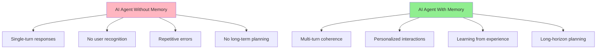

Memory enables agents to:

- **Maintain Context**: Track information across unlimited conversation turns
- **Personalize**: Remember user preferences, history, and relationships
- **Learn**: Improve performance through experience without retraining
- **Plan**: Execute long-horizon tasks requiring intermediate state tracking
- **Reason**: Access relevant past experiences to inform current decisions

---

## Taxonomy of Agent Memory

### Memory Type Classification

#### 1. By Duration

| Type | Duration | Capacity | Purpose | Examples |
|------|----------|----------|---------|----------|
| **Sensory Memory** | < 1 second | Very limited | Raw input buffering | Token embeddings |
| **Working Memory** | Seconds-minutes | 7±2 items | Active processing | Context window, KV cache |
| **Short-term Memory** | Hours-days | Limited | Session persistence | Conversation history |
| **Long-term Memory** | Indefinite | Large | Permanent storage | Vector DBs, knowledge graphs |

#### 2. By Content Type

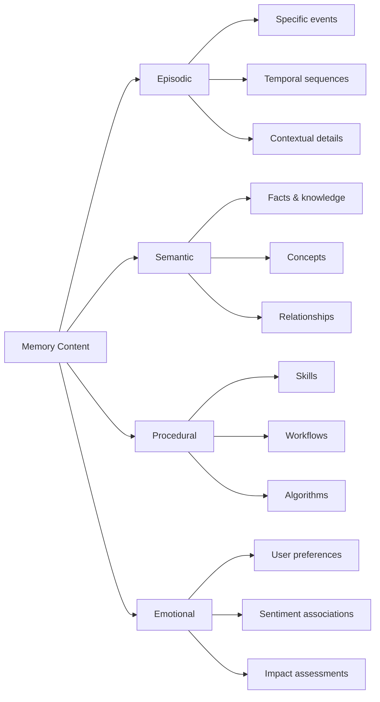

#### 3. By Implementation

| Category | Description | Examples |
|----------|-------------|----------|
| **Parametric Memory** | Stored in model weights | Fine-tuning, adapters |
| **Non-Parametric Memory** | External storage | Vector DBs, key-value stores |
| **Hybrid Memory** | Combined approach | RAG + fine-tuning |

### Memory Operations

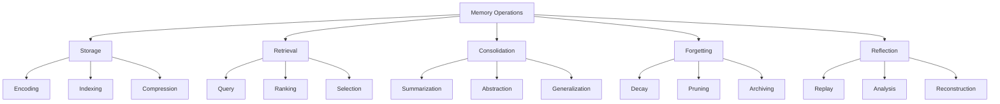

---

## Memory Architectures

### 1. Vector-Based Memory (RAG)

**Retrieval-Augmented Generation (RAG)** remains the most common approach:

```
┌─────────────────────────────────────────────────────────┐
│                    RAG Architecture                      │
├─────────────────────────────────────────────────────────┤
│                                                          │
│  Query ──► Encoder ──► Vector Search ──► Top-K Results  │
│                    │                        │           │
│                    ▼                        ▼           │
│              Vector Database ──────────────► Context     │
│                                                   │      │
│                                                   ▼      │
│  Response ◄──────────────────────── LLM ◄────────┘      │
│                                                          │
└─────────────────────────────────────────────────────────┘
```

**Key Systems:**
- **Mem0**: Drop-in memory layer with smart retrieval
- **TeleMem**: High-performance Mem0 replacement
- **OMEGA**: Ranks #1 on LongMemEval (95.4%)

**Advantages:**
- Simple implementation
- Scalable to billions of vectors
- Semantic similarity search
- Easy to update

**Limitations:**
- Limited reasoning about relationships
- No temporal awareness
- Retrieval can miss relevant context
- Vector compression loses information

### 2. Graph-Based Memory

**Knowledge Graphs** capture relationships between entities:

```
┌──────────────────────────────────────────────────────────┐
│                Graph Memory Architecture                 │
├──────────────────────────────────────────────────────────┤
│                                                           │
│   User ──(likes)──> Pizza ──(type_of)──> Food          │
│     │                   │                                │
│   (ate)              (from)                               │
│     │                   │                                │
│     ▼                   ▼                                │
│  Yesterday ──(when)──> Joe's Pizza                       │
│                           │                               │
│                        (located_in)                       │
│                           │                               │
│                           ▼                               │
│                      Brooklyn                            │
│                                                           │
└──────────────────────────────────────────────────────────┘
```

**Key Systems:**
- **Zep (Graphiti)**: Dynamic graph construction from conversations
- **MIRIX**: Multi-agent memory with graph structures
- **HippoRAG**: Neurobiologically inspired long-term memory

**Advantages:**
- Rich relationship modeling
- Multi-hop reasoning
- Temporal event tracking
- Explainable retrieval paths

**Limitations:**
- Complex implementation
- Scalability challenges
- Requires entity extraction
- Graph maintenance overhead

### 3. Hierarchical Memory

**Multi-tier memory** inspired by human cognition:

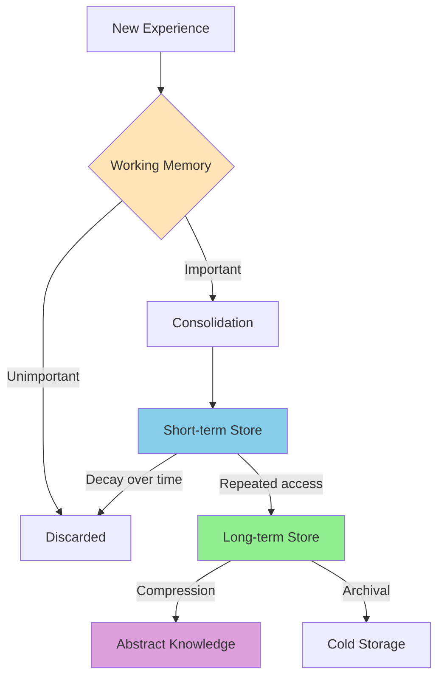

**Key Systems:**
- **Letta (MemGPT)**: Tiered memory with OS-like management
- **MemOS**: Operating system for agent memory
- **MemU**: Universal memory framework

**Architecture Layers:**

| Layer | Duration | Size | Retrieval | Example |
|-------|----------|------|-----------|---------|
| L1 Cache | Instant | ~100 items | Instant | Current context |
| L2 Cache | Session | ~10K items | Fast | Recent conversation |
| SSD Store | Persistent | ~1M items | Medium | Session history |
| Cold Store | Archive | Unlimited | Slow | Historical data |

### 4. Hybrid Architectures

**Combined approaches** leverage strengths of multiple methods:

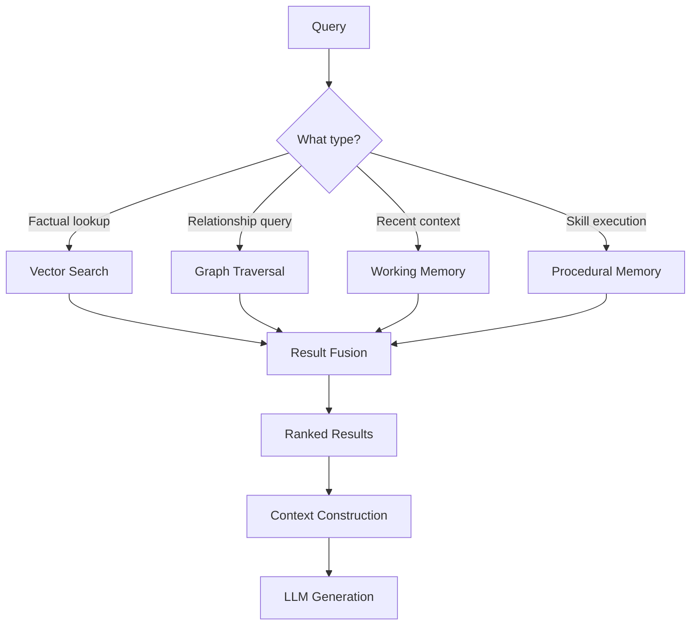

**Notable Hybrid Systems:**
- **MemVerse**: Multimodal memory with multiple storage backends
- **Second Me**: Personalized memory with hybrid retrieval
- **Congee**: Contextual memory with graph organization

---

## Open-Source Memory Systems

### Comprehensive System Comparison

#### Top 18 Open-Source Agent Memory Systems (2025-2026)

| Rank | System | Stars | Language | Key Features | Best For |
|------|--------|-------|----------|--------------|----------|
| 1 | **Mem0** | ★★★★★ | Python | Smart retrieval, easy API | Quick integration |
| 2 | **Claude-Mem** | ★★★★☆ | TypeScript | Claude Code plugin | Claude projects |
| 3 | **Zep/Graphiti** | ★★★★☆ | Rust/Python | Dynamic graphs | Complex relationships |
| 4 | **Letta (MemGPT)** | ★★★★☆ | Python | OS-like memory management | Long-horizon tasks |
| 5 | **Second Me** | ★★★★☆ | Python | Personalization | User-centric agents |
| 6 | **Congee** | ★★★☆☆ | Python | Hierarchical compression | Long conversations |
| 7 | **MemU** | ★★★☆☆ | Python | Universal framework | Research |
| 8 | **MemOS** | ★★★☆☆ | Python | Memory OS | Production systems |
| 9 | **MemMachine** | ★★★☆☆ | Python | Modular architecture | Custom solutions |
| 10 | **MIRIX** | ★★★☆☆ | Python | Multi-agent | Collaborative agents |
| 11 | **OpenMemory** | ★★★☆☆ | Python | Open standard | Interoperability |
| 12 | **Memobase** | ★★☆☆☆ | Python | Memory operations | Memory research |
| 13 | **EverMemOS** | ★★☆☆☆ | Python | EverMind integration | EverMind ecosystem |
| 14 | **Hindsight** | ★★☆☆☆ | Python | Reflective memory | Learning agents |
| 15 | **LangMem** | ★★☆☆☆ | Python | LangChain integration | LangChain users |
| 16 | **MemoryBear** | ★★☆☆☆ | Python | Persistence | Production apps |
| 17 | **Memov** | ★★☆☆☆ | Python | Git-based | Version control |
| 18 | **OMEGA** | ★★☆☆☆ | Python | 25 MCP tools, top benchmark | Coding agents |

### Deep Dive: Leading Systems

#### Mem0 (Most Popular)

**Architecture:**
```python
import mem0

# Initialize memory
memory = mem0.Memory()

# Store information
memory.add("User prefers dark mode and uses Firefox")

# Retrieve with semantic search
results = memory.search("user preferences", limit=3)

# Update existing memory
memory.update(memory_id="abc123", data="User now uses Chrome")
```

**Key Features:**
- Semantic vector storage
- Automatic memory deduplication
- Multi-backend support (ChromaDB, Qdrant, Pinecone)
- Memory ranking and scoring
- Easy API integration

**Use Cases:**
- Personal assistant memory
- Customer support history
- User preference tracking
- Conversation persistence

#### Zep with Graphiti (Best for Relationships)

**Graphiti's Dynamic Graph Construction:**

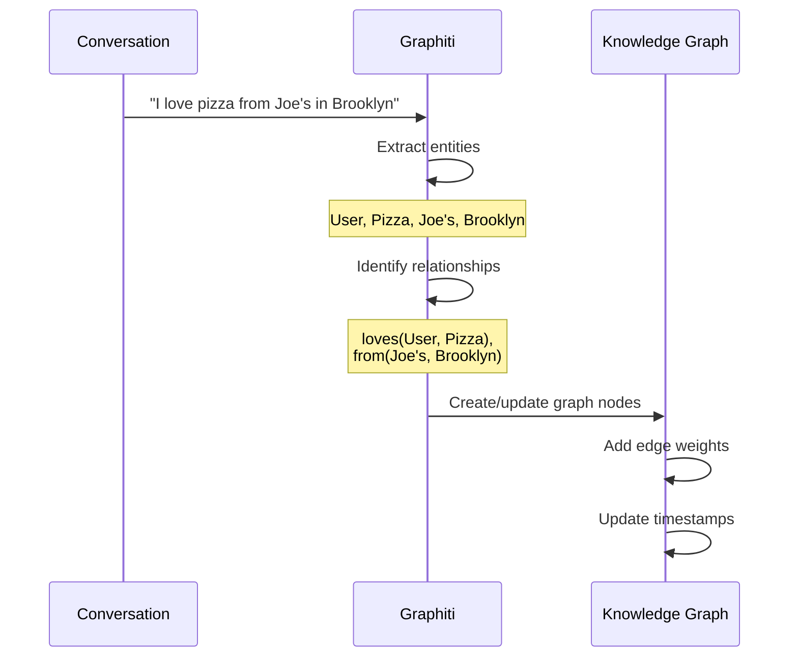

**Key Features:**
- Automatic entity and relationship extraction
- Temporal graph evolution
- Context window summarization
- Vector + hybrid search
- Role-based access control

**Use Cases:**
- Complex relationship tracking
- Multi-party conversation memory
- Knowledge base construction
- Temporal reasoning tasks

#### Letta/MemGPT (Best for Long-Horizon Tasks)

**OS-Inspired Memory Management:**

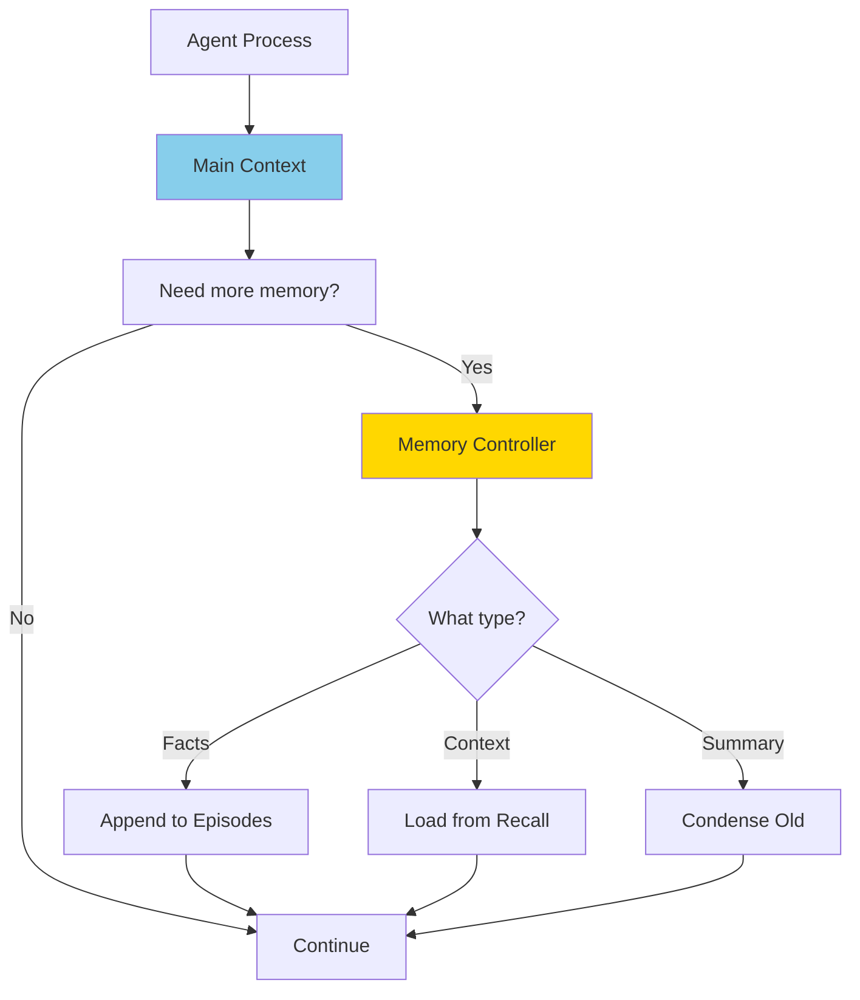

**Memory Hierarchy:**
1. **Conversation Context**: Immediate context (4-8K tokens)
2. **Episodic Memory**: Timestamped interaction logs
3. **Recall Store**: Searchable historical episodes
4. **Archival Memory**: Compressed summaries

**Key Features:**
- OS-style memory management
- Automatic context window management
- Memory consolidation during idle periods
- Multi-agent memory sharing
- Persistent state across sessions

**Use Cases:**
- Long-horizon task execution
- Research assistants
- Code generation with context
- Multi-step reasoning

#### OMEGA (Top Benchmark Performance)

**Achieves 95.4% on LongMemEval** through:

```python
# OMEGA's multi-tool architecture (25 MCP tools)
tools = {
    'semantic_search': SemanticSearchTool(),
    'exact_match': ExactMatchTool(),
    'temporal_filter': TemporalFilterTool(),
    'entity_extraction': EntityExtractionTool(),
    'relationship_builder': RelationshipBuilderTool(),
    'context_ranker': ContextRankerTool(),
    # ... 19 more specialized tools
}
```

**Key Innovations:**
- 25 specialized memory tools via MCP
- Hybrid retrieval strategies
- Context-aware ranking
- Memory compression
- Deduplication and fusion

**Use Cases:**
- AI coding agents
- Development assistants
- Technical documentation memory
- Code repository understanding

---

## Benchmarks and Evaluation

### Plain-Text Memory Benchmarks

#### 1. LongMemEval (2024)

**Focus:** Chat assistants with long-term interactive memory

**Key Metrics:**
- Fact retrieval accuracy
- Temporal ordering
- Entity consistency
- Preference tracking

**Leaderboard Top Performers:**
1. OMEGA: 95.4%
2. MemGPT: 89.2%
3. Mem0: 87.6%

#### 2. BEAM Benchmark (2025)

**"Beyond a Million Tokens"** - Tests extreme context handling

**Test Categories:**
- Million-token document understanding
- Long-term consistency
- Information retrieval at scale
- Cross-episode reasoning

**Key Finding:** Most systems degrade beyond 100K tokens without proper memory compression

#### 3. MOOM (2025)

**"Maintenance, Organization and Optimization of Memory"**

**Focus:** Ultra-long role-playing dialogues

**Evaluation Dimensions:**
- Memory consistency over 100+ turn conversations
- Character coherence
- Plot continuity
- Relationship tracking

**Notable Result:** Graph-based systems outperform pure vector approaches by 23% for character relationship tracking

#### 4. MemoryAgentBench (2025)

**Incremental multi-turn interaction evaluation**

**Test Setup:**
```
100+ turn conversation
↓
Periodic memory probes
↓
Consistency checks
↓
Retrieval accuracy
```

**Key Insight:** Memory consolidation during conversation improves performance by 31%

#### 5. HaluMem (2025)

**Hallucination detection in memory systems**

**Problem:** Memory systems can introduce false information

**Evaluation:**
- Factuality of stored memories
- Retrieval accuracy
- False positive rate
- Attribution correctness

**Finding:** Hybrid vector+graph approaches reduce hallucinations by 40% compared to pure retrieval

### Multimodal Benchmarks

#### 1. Video-MME (2025)

**First comprehensive video understanding benchmark**

**Test Dimensions:**
- Long video understanding (10+ minutes)
- Temporal reasoning
- Visual-semantic alignment
- Multi-frame memory

**State of the Art:** HippoMM (hippocampus-inspired) achieves 78.3% accuracy

#### 2. TeleEgo (2025)

**Egocentric AI assistant benchmark**

**Scenario:** First-person perspective daily activities

**Challenges:**
- Continuous video streams
- Multi-day memory
- Personal preference learning
- Context-dependent responses

**Key Finding:** Episodic memory with temporal indexing critical for performance

#### 3. LVBench (2025)

**Extreme long video understanding**

**Test Length:** Up to 4-hour videos

**Requirements:**
- Hierarchical memory compression
- Key moment detection
- Cross-scene reasoning
- Narrative understanding

**Best Approach:** Hierarchical memory with scene-level summarization

### Simulation Environments

#### ARE Agent Environment (2025)

**"Scaling Up Agent Environments and Evaluations" (Gaia2)**

**Features:**
- Realistic task scenarios
- Multi-step problem solving
- Memory-dependent goals
- Stateful world simulation

**Memory Requirements:**
- Object permanence
- Causal relationships
- Planning memory
- Tool usage learning

---

## Research Papers by Category

### Non-Parametric Memory (External Storage)

#### Text Memory (2025)

**LightMem** - Lightweight, efficient memory-augmented generation
- **Innovation:** Compressed memory representation
- **Result:** 3x faster retrieval with minimal accuracy loss

**Nemori** - Self-organizing agent memory
- **Innovation:** Cognitive science-inspired memory organization
- **Result:** Autonomous memory clustering without supervision

**MemoRAG** - Global memory-enhanced retrieval
- **Innovation:** Two-stage retrieval (local + global)
- **Result:** 28% improvement on long-context tasks

**Compress to Impress** (2024) - Compressive memory
- **Innovation:** Incremental conversation summarization
- **Result:** 10x compression with 95% information retention

#### Graph Memory (2025)

**HippoRAG** - Neurobiologically inspired memory
- **Innovation:** Hippocampus-like pattern completion
- **Result:** Human-like memory recall patterns

**MIRIX** - Multi-agent memory system
- **Innovation:** Shared memory across agent teams
- **Result:** Collaborative agents with common knowledge

**From RAG to Memory** - Non-parametric continual learning
- **Innovation:** Learning from retrieved examples
- **Result:** Zero-shot task adaptation

#### Multimodal Memory (2025)

**WorldMM** - Dynamic multimodal memory
- **Innovation:** Video-text cross-modal memory
- **Result:** Long video reasoning with 15-minute understanding

**MemVerse** - Multimodal lifelong learning
- **Innovation:** Multi-modal memory consolidation
- **Result:** Continual learning without catastrophic forgetting

**HippoMM** - Hippocampal-inspired audiovisual memory
- **Innovation:** Integrated audio-visual episodic memory
- **Result:** 34% improvement on long-form video understanding

### Parametric Memory (Model-Based)

#### 2025-2026 Advances

**MeKi** - Memory-based expert knowledge injection
- **Innovation:** Mixture of memory experts
- **Result:** Efficient model scaling

**DeepSeek Engram** (Conditional Memory)
- **Innovation:** Learnable memory lookup layers
- **Result:** 50% reduction in compute for same performance

**MLP Memory** - Retriever-pretrained external memory
- **Innovation:** Pretrained memory decoder
- **Result:** Plug-and-play memory for any LLM

**Memory Decoder** - Pretrained plug-and-play memory
- **Innovation:** Universal memory interface
- **Result:** Drop-in memory for existing models

### Memory for Agent Evolution

#### Reinforcement Learning Approaches

**ProcMEM** (2026) - Procedural memory from experience
- **Innovation:** Non-parametric PPO for skill learning
- **Result:** Reusable skills without weight updates

**MemSkill** (2026) - Memory skill evolution
- **Innovation:** Learnable memory operations
- **Result:** Self-improving memory systems

**Memento 2** (2026) - Stateful reflective memory
- **Innovation:** Reflection-driven learning
- **Result:** Agent improvement without fine-tuning

**Mem-α** (2025) - Memory construction via RL
- **Innovation:** Learned memory policies
- **Result:** Optimal memory management strategies

#### Continual Learning

**End-to-End Test-Time Training** (2025)
- **Innovation:** Learn during inference
- **Result:** Adaptation without weight updates

**MemEvolve** (2025) - Meta-evolution of memory
- **Innovation:** Self-improving memory architectures
- **Result:** Automatic memory optimization

**Evo-Memory** - Test-time learning benchmark
- **Innovation:** Self-evolving memory evaluation
- **Result:** Framework for continual learning

---

## Cognitive Science Foundations

### Human Memory Systems

#### The Modal Model of Memory

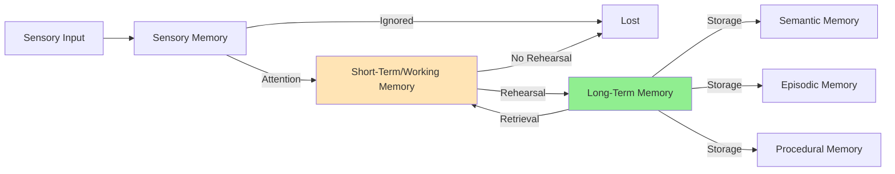

#### Key Brain Structures

| Structure | Function | AI Analog |
|-----------|----------|-----------|
| **Hippocampus** | Episodic memory formation | Vector encoding |
| **Neocortex** | Long-term storage | Knowledge base |
| **Amygdala** | Emotional memory | Preference tracking |
| **Prefrontal Cortex** | Working memory | Context window |
| **Basal Ganglia** | Procedural memory | Skill storage |

### Memory Consolidation

**The Synaptic Consolidation Process:**

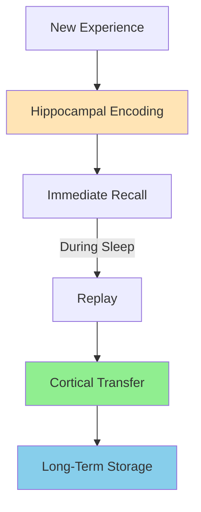

**AI Implementation:**
- **Immediate**: Store in vector database
- **Background**: Compress and summarize
- **Periodic**: Abstract into general knowledge
- **On-Demand**: Retrieve and reconstruct

### Forgetting Mechanisms

**Natural forgetting is adaptive:**

1. **Decay Theory**: Unused memories fade over time
2. **Interference**: Similar memories compete
3. **Retrieval Failure**: Memory exists but inaccessible
4. **Motivated Forgetting**: Emotional regulation

**AI Application:**
- Gradual memory weight decay
- Importance-based retention
- Pruning low-value memories
- Archival of rarely accessed data

---

## Current Challenges

### 1. Scalability

**Problem:** Memory systems must handle:
- Millions of interactions
- Multi-user scenarios
- Real-time retrieval
- Efficient storage

**Current Solutions:**
- Vector database sharding
- Hierarchical indexing
- Approximate nearest neighbor search
- Memory compression

**Remaining Gaps:**
- Cross-user memory deduplication
- Efficient graph traversal at scale
- Real-time memory consolidation
- Cost-effective storage

### 2. Memory Consistency

**Problem:** Maintaining accurate, up-to-date memory

**Challenges:**
- Contradictory information
- Temporal validity
- Source attribution
- Fact verification

**Current Approaches:**
- Memory versioning
- Confidence scoring
- Source tracking
- Conflict resolution

### 3. Privacy and Security

**Critical Concerns:**

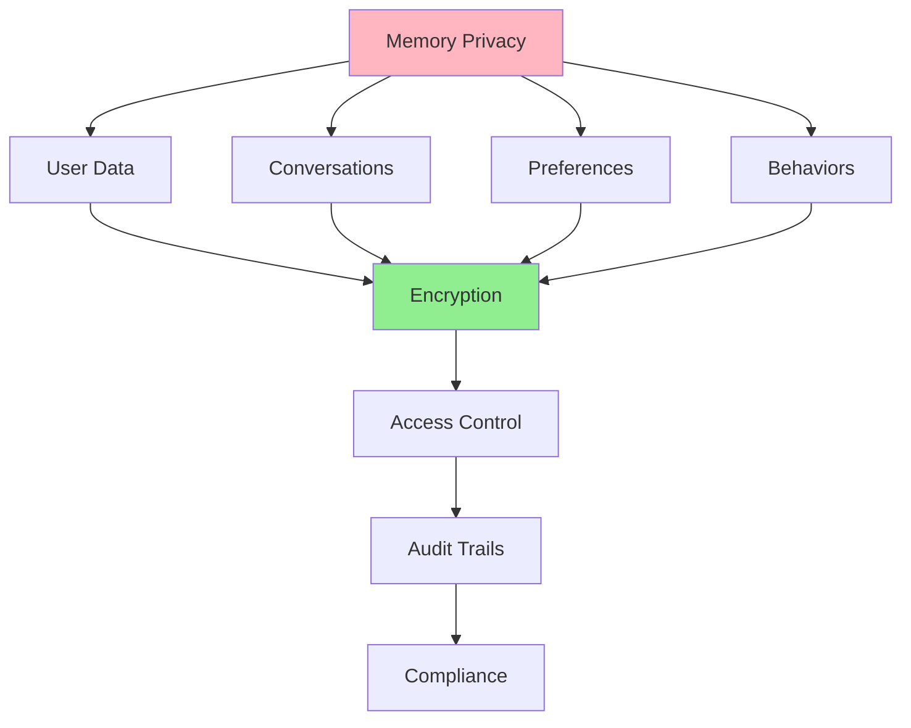

**Requirements:**
- End-to-end encryption
- User-controlled memory
- Right to be forgotten
- Compliance (GDPR, CCPA)

### 4. Evaluation

**Problem:** No standardized evaluation framework

**Current State:**
- Fragmented benchmarks
- Task-specific metrics
- Limited reproducibility
- Unclear baselines

**Need:**
- Standard evaluation suite
- Clear metrics for each use case
- Reproducible baselines
- Real-world testing

### 5. Memory Hallucination

**Problem:** Systems can create false memories

**Causes:**
- Retrieval errors
- Incorrect summarization
- Source confusion
- Generation mistakes

**Mitigation:**
- Strict retrieval-only modes
- Source attribution
- Confidence calibration
- Human verification loops

---

## Future Directions

### Emerging Trends (2025-2026)

#### 1. Neurobiologically Inspired Memory

**Hippocampus-like Systems:**
- Pattern completion (HippoRAG)
- Episodic-semantic separation
- Memory replay during "sleep"
- Consolidation pathways

#### 2. Self-Evolving Memory

**Agents that improve their own memory:**
- Learn optimal retrieval strategies
- Adapt compression algorithms
- Discover memory patterns
- Self-tune parameters

#### 3. Multi-Agent Memory Sharing

**Collaborative memory systems:**
- Shared knowledge bases
- Distributed memory storage
- Collective intelligence
- Swarm memory

#### 4. Memory Specialization

**Domain-specific memory systems:**
- Medical memory (HIPAA compliant)
- Legal memory (case law patterns)
- Code memory (repository understanding)
- Scientific memory (experiment tracking)

#### 5. Explainable Memory

**Transparent memory operations:**
- Why was this memory retrieved?
- How was this summary created?
- What sources support this claim?
- Memory provenance tracking

### Open Research Questions

1. **Optimal Memory Architecture**: What is the best mix of vector, graph, and structured storage?

2. **Memory Consolidation**: How can agents automatically extract general knowledge from specific experiences?

3. **Lifelong Learning**: How to enable continuous learning without catastrophic forgetting?

4. **Personalization**: How to build truly personalized memory while preserving privacy?

5. **Evaluation**: What are the right metrics for memory system evaluation?

6. **Efficiency**: How to scale to billions of memories with sub-second retrieval?

7. **Multi-Modal Integration**: How to unify text, image, video, and audio memory?

8. **Temporal Reasoning**: How to effectively reason about time and change?

---

## Implementation Considerations

### Choosing a Memory System

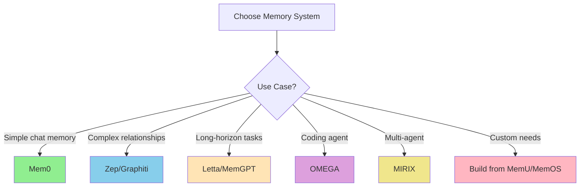

### Decision Matrix

| Requirement | Recommended System | Rationale |
|-------------|-------------------|-----------|
| **Quick integration** | Mem0 | Simple API, good documentation |
| **Relationship tracking** | Zep/Graphiti | Dynamic graph construction |
| **Long conversations** | Letta/MemGPT | OS-like memory management |
| **Top performance** | OMEGA | Best benchmark scores |
| **Multi-user** | LangMem | LangChain integration |
| **Research** | MemU | Universal framework |
| **Production** | MemOS | Designed for deployment |

### Storage Backends

| Backend | Best For | Pros | Cons |
|---------|----------|------|------|
| **ChromaDB** | Local development | Open source, easy setup | Limited scalability |
| **Qdrant** | Production | Hybrid search, filtering | Self-hosted complexity |
| **Pinecone** | Cloud-native | Managed service, fast | Cost, vendor lock-in |
| **Weaviate** | Multi-modal | Built-in vectorization | Complex setup |
| **PostgreSQL + pgvector** | Existing DB | Single storage stack | Slower than specialized |

### Best Practices

#### 1. Memory Design

```python
# Good: Structured memory with metadata
memory.add(
    content="User prefers dark mode",
    metadata={
        "type": "preference",
        "category": "ui",
        "confidence": 0.95,
        "source": "explicit_statement",
        "timestamp": "2025-03-09T10:00:00Z"
    }
)

# Bad: Unstructured memory
memory.add("dark mode user")
```

#### 2. Retrieval Strategy

```python
# Good: Multi-strategy retrieval
def retrieve(query, context):
    # Semantic search
    semantic = memory.vector_search(query, k=10)

    # Exact matches
    exact = memory.exact_search(query, k=5)

    # Temporal filtering
    recent = memory.filter_by_date(days=7)

    # Rank and combine
    return rank_and_merge(semantic, exact, recent)

# Bad: Single strategy
def retrieve(query):
    return memory.search(query, k=5)
```

#### 3. Memory Hygiene

```python
# Regular maintenance
async def maintain_memory():
    # Deduplicate
    memory.deduplicate(threshold=0.95)

    # Decay old memories
    memory.decay(factor=0.9, days=30)

    # Compress long episodes
    memory.compress(episodes longer than 1000 turns)

    # Archive rarely accessed
    memory.archive(access_count < 1, age > 90 days)
```

---

## References and Resources

### Core Repository

**[Awesome-Agent-Memory](https://github.com/TeleAI-UAGI/Awesome-Agent-Memory)** by TeleAI-UAGI
*Comprehensive collection of systems, benchmarks, and papers on agent memory*

### Key Surveys (2025-2026)

1. **"Memory in the Age of AI Agents"** (2025)
2. **"Rethinking Memory in AI: Taxonomy, Operations, Topics"** (2025)
3. **"The AI Hippocampus: How Far Are We From Human Memory?"** (2026)
4. **"Toward Efficient Agents: Memory, Tool Learning, and Planning"** (2026)

### Essential Papers

**Non-Parametric Memory:**
- LightMem (2025) - Lightweight efficient memory
- HippoRAG (2024) - Neurobiologically inspired
- MemRAG - Global memory-enhanced retrieval

**Parametric Memory:**
- DeepSeek Engram (2026) - Conditional memory
- MLP Memory (2025) - Retriever-pretrained
- Titans (2024) - Learning to memorize

**Agent Evolution:**
- ProcMEM (2026) - Procedural memory via RL
- MemSkill (2026) - Memory skill evolution
- Memento 2 (2026) - Reflective memory

### Key Systems (GitHub)

| System | Repository | Stars |
|--------|-----------|-------|
| Mem0 | [mem0ai/mem0](https://github.com/mem0ai/mem0) | Highest |
| Claude-Mem | [thedotmack/claude-mem](https://github.com/thedotmack/claude-mem) | High |
| Zep/Graphiti | [getzep/graphiti](https://github.com/getzep/graphiti) | High |
| Letta | [letta-ai/letta](https://github.com/letta-ai/letta) | High |
| OMEGA | [omega-memory/omega](https://github.com/omega-memory/core) | Medium |

### Benchmarks

| Benchmark | Focus | Repository |
|-----------|-------|------------|
| LongMemEval | Long-term interactive memory | Available |
| BEAM | Million-token context | Available |
| MOOM | Ultra-long roleplay | Available |
| HaluMem | Hallucination detection | Available |
| Video-MME | Video understanding | Available |

### Communities and Events

- **ACL 2025 Workshop**: Large Language Model Memorization (L2M2)
- **ACM SIGIR-AP 2025 Tutorial**: Conversational Agents: From RAG to LTM

### Citation

```bibtex
@misc{agent-memory-research-2026,
  title={Agent Memory: Comprehensive Research Guide},
  author={CipherOcto Research Team},
  year={2026},
  month={March},
  note={Based on Awesome-Agent-Memory repository and current research}
}
```

---

## Document Metadata

**Maintained by:** CipherOcto Documentation Team
**Last Updated:** 2026-03-09
**Next Review:** 2026-06-09
**Version:** 1.0

**Change Log:**
- 2026-03-09: Initial comprehensive research document created

---

## Appendix: Quick Reference

### Memory Type Quick Guide

| Need | Use | Example |
|------|-----|---------|
| Quick facts | Vector DB | "What did X say?" |
| Relationships | Graph DB | "How are X and Y connected?" |
| Recent context | Working memory | "What were we discussing?" |
| Long-term storage | Compressed archive | "What happened last year?" |
| Skills | Procedural memory | "How do I perform X?" |
| Preferences | Key-value store | "User likes X" |

### System Selection Flowchart

```
Start
  │
  ├─► Simple use case?
  │    └─► Use Mem0
  │
  ├─► Need relationships?
  │    └─► Use Zep/Graphiti
  │
  ├─► Long conversations?
  │    └─► Use Letta/MemGPT
  │
  ├─► Coding tasks?
  │    └─► Use OMEGA
  │
  └─► Custom requirements?
       └─► Build on MemU/MemOS
```

### Common Patterns

**Pattern 1: Conversation Memory**
```python
# Store each turn
for message in conversation:
    memory.store(message, turn_id, timestamp)

# Retrieve context
context = memory.retrieve_conversation(session_id, last_n=10)
```

**Pattern 2: User Preferences**
```python
# Extract and store preferences
if "I prefer" in message or "I like" in message:
    preference = extract_preference(message)
    memory.store_preference(user_id, preference)
```

**Pattern 3: Fact Verification**
```python
# Check memory before answering
fact = memory.search(query)
if fact.confidence > threshold:
    return fact
else:
    return "I don't have that information"
```

---

**End of Document**

*This research document is maintained as part of the CipherOcto project. For updates, corrections, or contributions, please refer to the project documentation.*
