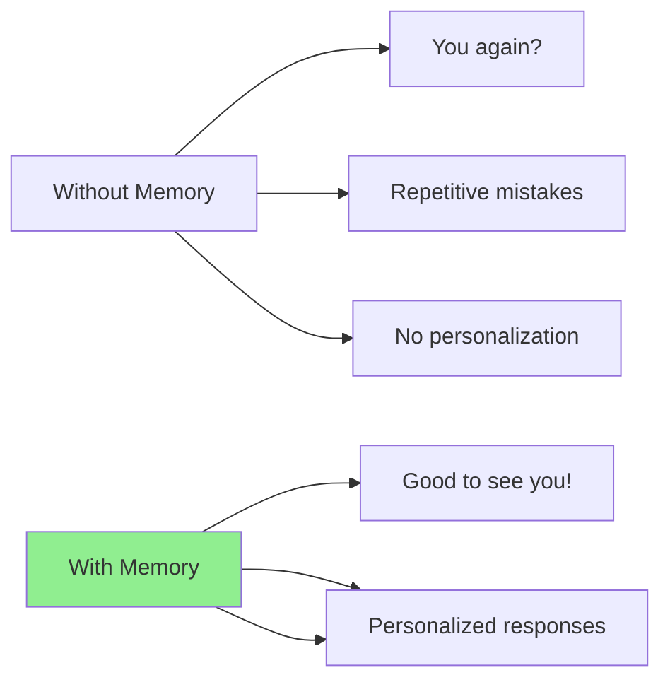
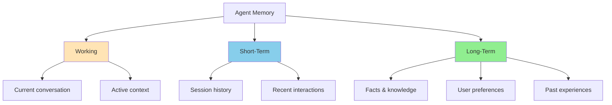

# Agent Memory: Quick Reference Guide

> **A practical guide to implementing memory in AI agents**

---

## What is Agent Memory?

Agent memory enables AI systems to:

- **Remember** past conversations and experiences
- **Learn** user preferences and patterns
- **Maintain context** across unlimited interactions
- **Improve** over time without retraining

## Why It Matters



---

## Quick Start: Choosing a System

| Use Case              | Recommended System | Complexity      |
| --------------------- | ------------------ | --------------- |
| Simple chat memory    | **Mem0**           | ⭐ Easy         |
| Complex relationships | **Zep/Graphiti**   | ⭐⭐ Medium     |
| Long conversations    | **Letta/MemGPT**   | ⭐⭐ Medium     |
| Coding assistant      | **OMEGA**          | ⭐⭐⭐ Advanced |
| Multi-agent teams     | **MIRIX**          | ⭐⭐⭐ Advanced |

---

## Three Types of Memory



### 1. Working Memory (Now)

- **Duration**: Seconds to minutes
- **Purpose**: Active processing
- **Implementation**: Context window

### 2. Short-Term Memory (Session)

- **Duration**: Hours to days
- **Purpose**: Conversation continuity
- **Implementation**: Vector database

### 3. Long-Term Memory (Forever)

- **Duration**: Indefinite
- **Purpose**: Persistent knowledge
- **Implementation**: Compressed storage + retrieval

---

## Implementation Patterns

### Pattern 1: Simple Conversation Memory

```python
import mem0

# Initialize
memory = mem0.Memory()

# Store what user said
memory.add("User prefers dark mode and uses Firefox")

# Retrieve later
results = memory.search("user preferences", limit=3)
# Returns: "User prefers dark mode and uses Firefox"
```

### Pattern 2: User Preference Tracking

```python
# Detect preferences
if "I prefer" in message or "I like" in message:
    preference = extract_preference(message)
    memory.store(
        content=preference,
        metadata={"type": "preference", "user": user_id}
    )

# Use preferences
if "coffee" in query:
    prefs = memory.search(f"preferences {user_id}", filter={"type": "preference"})
    if "likes lattes" in prefs:
        response = "Would you like your usual latte?"
```

### Pattern 3: Long-Horizon Task Memory

```python
# Letta/MemGPT style
agent = MemGPTAgent(
    working_memory_size=4000,  # tokens
    episodic_memory=vector_store,
    archival_memory=compressed_store
)

# Agent automatically manages memory across long tasks
result = agent.run(task="Research and summarize latest AI papers")
# Stores intermediate results, learns from search patterns
```

---

## Memory Operations


| Operation       | What It Does               | Example                |
| --------------- | -------------------------- | ---------------------- |
| **Encode**      | Convert to storable format | Text → Vector          |
| **Store**       | Save to memory             | Add to database        |
| **Retrieve**    | Find relevant memories     | Semantic search        |
| **Consolidate** | Summarize/compress         | 100 turns → summary    |
| **Archive**     | Move to cold storage       | Rarely used data       |
| **Forget**      | Remove outdated data       | Delete old preferences |

---

## Key Design Decisions

### Decision 1: Storage Backend

| Option                | Best For       | Cost             |
| --------------------- | -------------- | ---------------- |
| ChromaDB              | Development    | Free             |
| Qdrant                | Production     | $$ (self-hosted) |
| Pinecone              | Cloud-native   | $$$ (managed)    |
| PostgreSQL + pgvector | Existing stack | $ (add-on)       |

### Decision 2: Retrieval Strategy

```python
# Hybrid approach (recommended)
def retrieve(query, context):
    results = []

    # 1. Semantic search (find similar)
    results.extend(memory.vector_search(query, k=5))

    # 2. Exact match (find precise)
    results.extend(memory.exact_search(query, k=3))

    # 3. Recent context (find new)
    results.extend(memory.recent(hours=24, k=5))

    # 4. Rank by relevance + recency
    return rank(results)
```

### Decision 3: Memory Retention

```python
# Don't keep everything!
async def cleanup_memory():
    # Remove low-value
    memory.delete(confidence < 0.5, age_days=30)

    # Compress repetitive
    memory.compress(similar_items > 5)

    # Archive old
    memory.archive(age_days=90, access_count < 2)
```

---

## Common Pitfalls

### ❌ Don't: Store Everything

```python
# Bad: Storing every message
for msg in messages:
    memory.add(msg)  # Memory bloat!
```

### ✅ Do: Filter and Summarize

```python
# Good: Store what matters
if is_important(msg):
    memory.add(summarize(msg), metadata={"importance": "high"})
```

### ❌ Don't: Trust Memory Blindly

```python
# Bad: Memory might be wrong
fact = memory.search(query)[0]
return fact  # Could be hallucinated!
```

### ✅ Do: Verify and Attribute

```python
# Good: Check and cite
fact = memory.search(query, k=3)
if fact.confidence > 0.9:
    return fact.content, source=fact.source
else:
    return "I'm not sure about that"
```

### ❌ Don't: Ignore Privacy

```python
# Bad: No privacy controls
memory.add(user_data)  # Anyone can access!
```

### ✅ Do: Implement Access Control

```python
# Good: User-scoped memory
memory.add(user_data, user_id=user.id, encrypted=True)
```

---

## Evaluation: How to Know It Works

### Metrics to Track

| Metric                 | How to Measure               | Target  |
| ---------------------- | ---------------------------- | ------- |
| **Retrieval Accuracy** | % of relevant memories found | > 85%   |
| **Response Quality**   | User satisfaction ratings    | > 4/5   |
| **Memory Consistency** | No contradictions over time  | 100%    |
| **Retrieval Speed**    | Time to fetch memories       | < 100ms |
| **Storage Efficiency** | Compression ratio            | > 10x   |

### Benchmarks

| Benchmark   | What It Tests         | Top Performer   |
| ----------- | --------------------- | --------------- |
| LongMemEval | Conversational memory | OMEGA: 95.4%    |
| BEAM        | Million-token context | MemGPT variants |
| HaluMem     | Hallucination rate    | Hybrid systems  |
| MOOM        | Long conversations    | Graph-based     |

---

## Next Steps

### For Quick Start

1. Install Mem0: `pip install mem0`
2. Initialize: `memory = mem0.Memory()`
3. Store: `memory.add("important fact")`
4. Retrieve: `memory.search("relevant query")`

### For Production

1. Choose production backend (Qdrant/Pinecone)
2. Implement access controls
3. Add monitoring and logging
4. Set up memory cleanup jobs
5. Test with your specific use case

### For Advanced Use

1. Implement hierarchical memory (Letta/MemGPT)
2. Add graph relationships (Zep/Graphiti)
3. Enable multi-agent sharing (MIRIX)
4. Build custom memory operations (MemU)

---

## Resources

### Learn More

- [Full Research Document](./agent-memory-comprehensive-research.md) - Deep dive into all topics
- [Awesome-Agent-Memory](https://github.com/TeleAI-UAGI/Awesome-Agent-Memory) - Curated papers and systems
- [Mem0 Documentation](https://docs.mem0.ai) - Getting started guide
- [Letta/MemGPT Paper](https://arxiv.org/abs/2403.05916) - OS-inspired memory

### Key Systems

- **Mem0**: [github.com/mem0ai/mem0](https://github.com/mem0ai/mem0)
- **Zep/Graphiti**: [github.com/getzep/graphiti](https://github.com/getzep/graphiti)
- **Letta**: [github.com/letta-ai/letta](https://github.com/letta-ai/letta)
- **OMEGA**: [github.com/omega-memory/core](https://github.com/omega-memory/core)

### Communities

- TeleAI Research: [github.com/TeleAI-UAGI](https://github.com/TeleAI-UAGI)
- Agent Memory Discord: (link TBD)
- ACL 2025 L2M2 Workshop: (link TBD)

---

## Quick Reference: Memory Architecture Decision Tree

```
Need to remember things?
│
├─► Just conversation history?
│   └─► Use Mem0 (simple, effective)
│
├─► Relationships between entities?
│   └─► Use Zep/Graphiti (dynamic graphs)
│
├─► Very long conversations (>100 turns)?
│   └─► Use Letta/MemGPT (OS-like management)
│
├─► Code/technical tasks?
│   └─► Use OMEGA (specialized for coding)
│
├─► Multiple agents working together?
│   └─► Use MIRIX (shared memory)
│
└─► Something custom?
    └─► Build on MemU/MemOS (framework)
```

---

**Version:** 1.0
**Last Updated:** 2026-03-09
**Maintained by:** CipherOcto Documentation Team

For the comprehensive research document, see: [agent-memory-comprehensive-research.md](./agent-memory-comprehensive-research.md)
