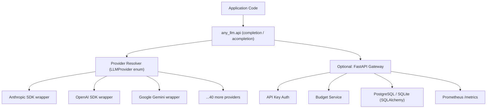
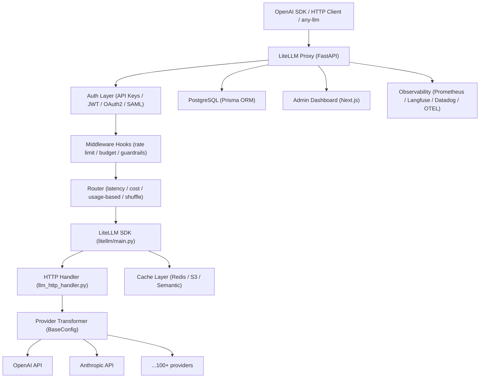
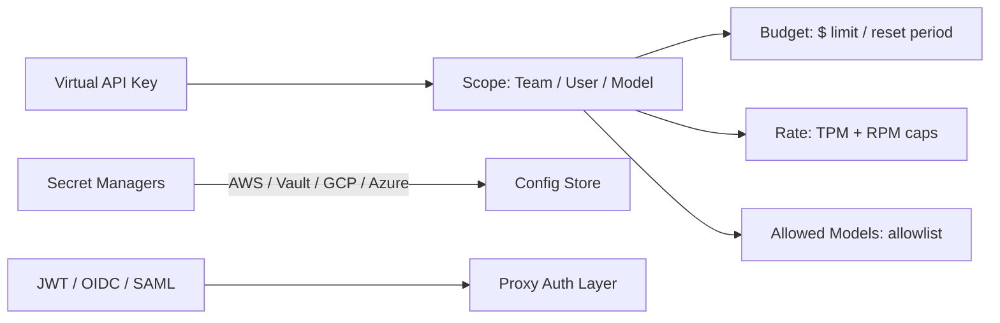
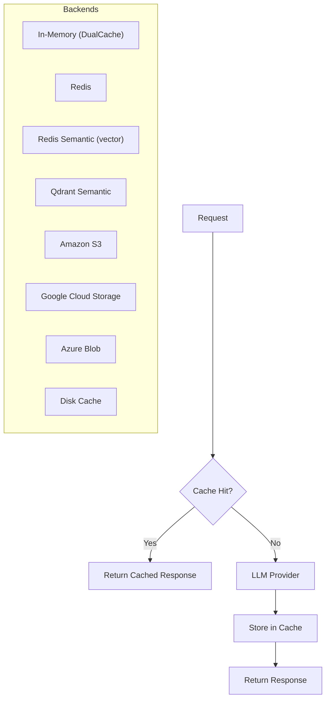
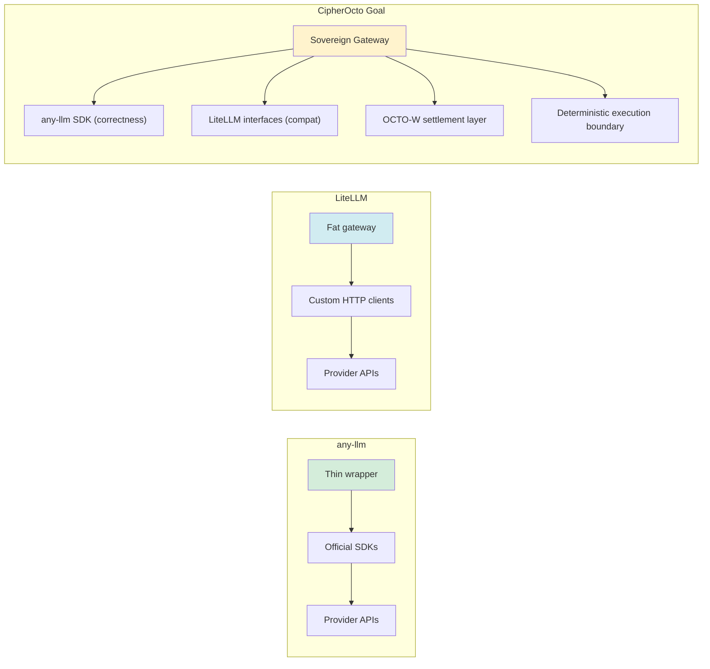
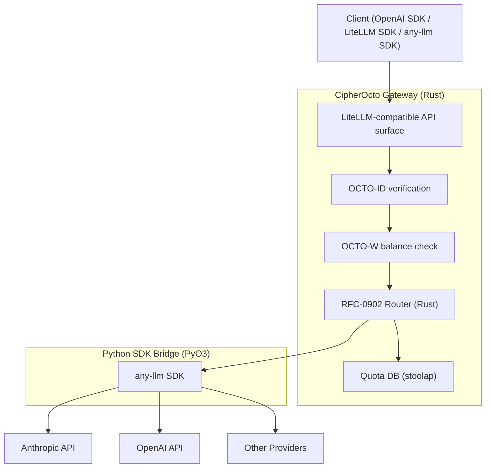

# Research: any-llm vs LiteLLM — Unified LLM Gateway Comparison

## Executive Summary

This research compares two open-source unified LLM interface projects: **any-llm** (Mozilla AI) and
**LiteLLM** (BerriAI). Both aim to provide a single API surface over multiple LLM providers, but
differ fundamentally in philosophy, implementation strategy, scope, and production-readiness. The
research evaluates both libraries as potential building blocks or reference implementations for
CipherOcto's AI quota marketplace and gateway components (RFC-0900–RFC-0910 series).

Key finding: **LiteLLM is a mature, production-grade AI gateway** used by Stripe, Google, and
Netflix. **any-llm is a lean, correctness-first SDK** powered by official provider SDKs. CipherOcto
should adopt LiteLLM's interface contracts and routing semantics while differentiating with sovereign
identity, OCTO-W settlement, and deterministic execution boundaries.

---

## Problem Statement

CipherOcto needs a gateway layer that:

1. Routes AI inference requests to multiple providers with cost awareness
2. Enforces quota boundaries tied to OCTO-W token balances (RFC-0900)
3. Issues and manages virtual API keys per agent identity (RFC-0903)
4. Tracks real-time cost attribution across agents (RFC-0904)
5. Provides drop-in compatibility for existing tooling that targets LiteLLM or OpenAI interfaces
6. Operates within the determinism boundary (Class A/B/C) defined in RFC-0008

Existing open-source solutions address subsets of these requirements. This research assesses whether
either project can serve as a foundation, reference, or compatibility target for CipherOcto's
gateway.

---

## Research Scope

**Included:**

- Provider coverage and integration approach
- Routing, load balancing, and fallback logic
- API key management and authentication model
- Configuration management
- Caching architecture
- Observability and cost tracking
- Deployment model (SDK vs proxy vs gateway)
- Interface compatibility (OpenAI format, CLI, Python SDK)
- Licensing and governance
- CipherOcto integration suitability

**Excluded:**

- Fine-tuning workflows (out of CipherOcto MVP scope)
- Image/audio generation endpoints (deferred)
- UI dashboard implementation details
- Vendor-specific enterprise features not relevant to protocol design

---

## Findings

### Technology A: any-llm (Mozilla AI)

**Repository:** https://github.com/mozilla-ai/any-llm  
**Version:** Pre-1.0 (active development)  
**License:** Apache 2.0  
**Language:** Python 3.11+  
**Maintainer:** Mozilla AI

#### Overview

any-llm is a lightweight Python SDK that provides a unified `completion()` interface over 43 LLM
providers. Its defining characteristic is **delegation to official provider SDKs** rather than
reimplementing provider HTTP clients.

```python
from any_llm import completion

response = completion(
    model="claude-opus-4-5-20251001",
    provider="anthropic",
    messages=[{"role": "user", "content": "Hello!"}]
)
```

#### Architecture



**Core SDK structure:**

```
src/any_llm/
├── api.py               # completion(), acompletion(), embedding(), responses()
├── any_llm.py           # AnyLLM base class (stateful, connection pooling)
├── providers/           # 43 provider wrappers (delegate to official SDKs)
├── types/               # Pydantic models (completion, messages, batch, responses)
├── gateway/             # Optional FastAPI gateway (budget, keys, DB)
└── exceptions.py        # Unified exception hierarchy (15 types)
```

#### Provider Integration Strategy

| Approach | any-llm | Consequence |
| --- | --- | --- |
| Integration method | Wraps **official provider SDKs** | Max compatibility, always up-to-date |
| Request transformation | Delegated to SDK | No custom HTTP; SDK handles auth, retries |
| Response transformation | Delegated to SDK | Native response types, then normalized |
| Provider addition cost | Add one wrapper file | Low maintenance |
| SDK dependency | Hard dependency per provider | Larger install footprint |

**Detailed call chain (Anthropic):**

```
AnyLLM.acompletion()
  → AnthropicProvider._acompletion()
    → SDK: AsyncAnthropic.messages.create()
      → SDK: httpx sends HTTP request
      ← SDK: SSE stream via messages.stream() context manager
    → _convert_completion_response()   # any-llm normalization layer
```

**HTTP transport in any-llm:** `httpx` is included as a direct dependency but used only for batch file I/O (`BytesIO`, `Path(...).read_bytes()`). **No httpx is used for any LLM API calls.** All HTTP goes through the official SDKs.

**Supported providers (43):** OpenAI, Anthropic, Mistral, Gemini, Vertex AI, Azure OpenAI, Azure
Anthropic, Bedrock, SageMaker, Cohere, HuggingFace, Groq, Ollama, LM Studio, llama.cpp, llamafile,
Together AI, Fireworks AI, DeepSeek, Cerebras, Watsonx, Voyage AI, Perplexity, Moonshot, xAI,
Nebius, DashScope, Inception, SambaNova, MiniMax, vLLM, Databricks, OpenRouter, Portkey, and others.

#### Routing Capabilities

any-llm has **no built-in router**. Provider selection is explicit at call time:

```python
# Explicit provider selection — no automatic fallback
completion(model="gpt-4o", provider="openai", messages=[...])
completion(model="openai:gpt-4o", messages=[...])  # Embedded format
```

No support for:

- Load balancing across deployments of the same model
- Latency-based or cost-based routing
- Automatic fallback on provider failure
- RPM/TPM quota-aware routing

#### Gateway Features (Optional Module)

The optional `any_llm.gateway` module provides a thin FastAPI wrapper:

| Feature | Status |
| --- | --- |
| Virtual API key issuance | Yes (hashed, stored in DB) |
| Budget enforcement | Yes (per-key spending limits, auto-reset) |
| Multi-tenant user management | Yes (basic) |
| Rate limiting | Yes (RPM per user, configurable) |
| Usage analytics | Yes (token counts, cost per request) |
| Response caching | No |
| Semantic caching | No |
| Fallback routing | No |
| Load balancing | No |
| Prometheus metrics | Yes (`/metrics` endpoint) |
| Admin dashboard | No |
| Secret manager integration | No |
| SSO / JWT / OAuth2 | No |

**Database:** SQLAlchemy + Alembic migrations (PostgreSQL recommended, SQLite for dev).

#### API Compatibility

any-llm exposes its own API surface — not a drop-in OpenAI proxy. The gateway serves:

- `POST /v1/chat/completions` — Chat completions (OpenAI format)
- `POST /v1/messages` — Anthropic Messages API
- `POST /v1/embeddings` — Embeddings
- `GET /v1/models` — Model listing
- `POST /v1/keys` — Key management
- `GET /health` — Health check

**Authentication:** `X-AnyLLM-Key` header (primary), with fallback to `Authorization: Bearer`
(for OpenAI client compatibility) and `x-api-key` (for Anthropic client compatibility). All three
are checked; `X-AnyLLM-Key` takes priority if present.

#### Configuration

```yaml
database_url: ${DATABASE_URL}
master_key: ${MASTER_KEY}
rate_limit_rpm: 60
providers:
  openai:
    api_key: ${OPENAI_API_KEY}
  anthropic:
    api_key: ${ANTHROPIC_API_KEY}
pricing:
  gpt-4o: 0.005  # per 1K tokens
```

Configuration loaded from YAML with environment variable interpolation. Minimal — no hot-reload, no
database-driven model config.

#### Exception Model

Comprehensive 15-type exception hierarchy:

```
AnyLLMError
├── RateLimitError
├── AuthenticationError
├── InvalidRequestError
├── ProviderError
├── ContentFilterError
├── ModelNotFoundError
├── ContextLengthExceededError
├── MissingApiKeyError
├── UnsupportedProviderError
├── UnsupportedParameterError
├── InsufficientFundsError  (HTTP 402) ← relevant to CipherOcto quota
├── UpstreamProviderError   (HTTP 502)
├── GatewayTimeoutError     (HTTP 504)
├── LengthFinishReasonError
└── ContentFilterFinishReasonError
```

The `InsufficientFundsError` (HTTP 402) maps directly to CipherOcto's OCTO-W balance exhaustion
semantic.

#### Strengths

- **Correctness:** Official SDKs guarantee HTTP transport correctness; no custom HTTP code for LLM calls
- **Simplicity:** ~15,000 lines of core SDK; easy to audit and fork
- **Type safety:** Strict mypy + Pydantic v2 throughout
- **Async-first:** Full `asyncio` support (`acompletion`, `aembedding`, etc.)
- **Tool calling:** Automatic conversion of Python callables to OpenAI tool format
- **Batch API:** First-class batch completion support
- **Responses API:** OpenAI Responses API support (newer than Chat Completions)
- **Apache 2.0:** Patent-friendly license

#### Weaknesses

- **No router/load balancer:** No multi-deployment routing, no fallback
- **No caching:** No response caching of any kind
- **No SSO/JWT:** Basic API key auth only in gateway
- **No secret managers:** Manual environment variable management
- **No semantic caching:** No vector-similarity-based cache deduplication
- **No hot-reload:** Config changes require restart
- **Pre-1.0:** API may change; not yet considered production-stable by maintainers
- **No Guardrails:** No pre/post-call safety hooks
- **No MCP support:** No Model Context Protocol gateway

#### Deep-Dive: What "Correctness-First" Actually Means

The research report claims any-llm is "correctness-first" due to official SDK delegation. The source code
confirms this for the **HTTP transport layer**, but reveals nuance in the **normalization layer**.

**What any-llm truly delegates to official SDKs:**

| Layer | any-llm | LiteLLM |
|---|---|---|
| HTTP transport | ✅ Official SDK (`AsyncAnthropic`, `AsyncOpenAI`, `genai.Client`) | ❌ Custom `httpx.AsyncHTTPHandler` |
| TCP connection pooling | ✅ SDK manages | ✅ `AsyncHTTPHandler` manages centrally |
| SSE stream parsing | ✅ SDK `stream()` context manager | ❌ Manual `aiter_lines()` + `ModelResponseIterator` state machine |
| Auth header construction | ✅ SDK handles | ❌ Manual header building |
| Retry/backoff logic | ✅ SDK built-in | ❌ Custom in `AsyncHTTPHandler` |
| Timeout enforcement | ✅ SDK handles | ✅ Custom in `AsyncHTTPHandler` |

**What any-llm still owns (drift risk zones):**

1. **Message format conversion** (`anthropic/utils.py:_convert_messages_for_anthropic()`): Translates
   OpenAI message schema to Anthropic's `content.blocks` format. Errors here cause semantically wrong
   prompts, not protocol errors.

2. **Streaming chunk normalization** (`anthropic/utils.py:_create_openai_chunk_from_anthropic_chunk()`):
   Translates SDK event types (`ContentBlockStartEvent`, `ContentBlockDeltaEvent`) to OpenAI streaming
   chunk format. If Anthropic changes event type names or ordering, this breaks.

3. **Finish reason mapping** (`anthropic/utils.py:_convert_response()`): Maps Anthropic `stop_reason` to
   OpenAI `finish_reason` via a static dict. New Anthropic reason values require any-llm updates.

4. **Reasoning effort mapping** (`anthropic/utils.py`): Hardcoded `REASONING_EFFORT_TO_ANTHROPIC_EFFORT`
   map (`"xhigh": "max"`). If Anthropic adds new effort levels, any-llm must update.

**LiteLLM's drift exposure is broader but different in nature:**

- SSE fragmentation bugs: LiteLLM's `ModelResponseIterator` implements a state machine handling TCP
  segment boundaries that split JSON chunks across packets. This complexity doesn't exist in SDK-delegated
  code.
- Beta header maintenance: LiteLLM manually constructs `anthropic-beta` version strings like
  `"computer-use-2025-01-24"` in `common_utils.py`. These must be kept in sync with Anthropic API
  versions.
- Structured output interception: LiteLLM intercepts tool calls named `RESPONSE_FORMAT_TOOL_NAME` and
  converts them to messages — SDK-delegated code doesn't need this hack.

**The trade-off:**

```
any-llm correctness:  Transport ✅  |  Normalization ⚠️  (low, but exists)
LiteLLM correctness:   Transport ⚠️  |  Normalization ✅  (controlled, but must track changes)
```

For CipherOcto's purposes: **if the gateway normalizes to OpenAI format internally, any-llm's HTTP
correctness matters more than its normalization correctness** — because CipherOcto's router and quota
tracking operate on the normalized layer, not the wire protocol. The normalization code must still be
correct, but it runs in-process and is auditable. Protocol drift at the HTTP layer (wrong auth headers,
malformed JSON, incorrect SSE parsing) is the harder class of bug to diagnose in production.

---

### Technology B: LiteLLM (BerriAI)

**Repository:** https://github.com/BerriAI/litellm  
**Version:** 1.83.10  
**License:** MIT  
**Language:** Python 3.10–3.13  
**Maintainer:** BerriAI (YC W23)

#### Overview

LiteLLM is a full-featured AI gateway: both a Python SDK for direct use and a proxy server for
centralized team/enterprise deployment. It reimplements provider HTTP clients internally — not
delegating to official SDKs — in exchange for maximum control over the request pipeline.

```python
import litellm

response = litellm.completion(
    model="openai/gpt-4o",  # provider/model format
    messages=[{"role": "user", "content": "Hello!"}]
)
```

#### Architecture



**Source structure:**

```
litellm/
├── main.py                    # SDK: completion(), acompletion(), embedding()
├── router.py                  # Multi-deployment load balancer (7 routing approaches)
├── caching/                   # Cache backends (Local, Redis, S3, GCS, Qdrant)
├── llms/                      # 100+ provider HTTP client implementations
│   ├── base_llm/              # BaseConfig transformation interface
│   ├── custom_httpx/          # Central HTTP orchestrator (434KB)
│   └── {provider}/chat/transformation.py  # Per-provider request/response mapping
├── proxy/                     # FastAPI proxy server
│   ├── proxy_server.py        # Main app (548KB)
│   ├── auth/                  # API key / JWT / OAuth2 / SAML
│   ├── hooks/                 # Rate limit, budget, guardrail middleware
│   ├── management_endpoints/  # Admin APIs (teams, keys, models, budgets)
│   ├── pass_through_endpoints/# Direct provider passthrough
│   └── schema.prisma          # PostgreSQL schema (Prisma)
├── integrations/              # 20+ observability backends
└── router_strategy/           # Routing algorithm implementations
```

#### Provider Integration Strategy

| Approach | LiteLLM | Consequence |
| --- | --- | --- |
| Integration method | Custom HTTP clients per provider | Full pipeline control |
| Request transformation | `BaseConfig.transform_request()` | Uniform abstraction |
| Response transformation | `BaseConfig.transform_response()` | Normalized to OpenAI format |
| Provider addition cost | Implement full `BaseConfig` subclass | Higher per-provider effort |
| SDK dependency | No official SDK dependencies (hybrid: OpenAI uses SDK; Anthropic does not) | Smaller install; possible drift |

**Note on hybrid approach:** LiteLLM's OpenAI handler (`litellm/llms/openai/openai.py`) uses the official
`AsyncOpenAI` client directly. However, the Anthropic handler (`litellm/llms/anthropic/chat/handler.py`)
uses a raw `AsyncHTTPHandler.post()` — it does **not** use `AsyncAnthropic`. This creates an inconsistency
where Anthropic is more exposed to protocol drift than OpenAI, despite both being first-tier providers.

**Supported providers (100+):** All of any-llm's 43, plus many more including all Azure variants,
all Bedrock models, Replicate, Hugging Face Inference, Cerebras, Watsonx, NLP Cloud, Aleph Alpha,
Palm/Gemini all variants, AI21, Baseten, Petals, and every OpenAI-compatible server (vLLM, Ollama,
LM Studio, etc.).

#### Routing Capabilities

LiteLLM has a purpose-built **Router** (`litellm/router.py`) with six routing strategies (plus `simple-shuffle` as the default):

| Strategy | Algorithm | Best For |
| --- | --- | --- |
| `latency-based-routing` | Exponential moving average of response time | Latency-sensitive agents |
| `usage-based-routing-v2` | Track TPM/RPM; route to least loaded | Budget-constrained workloads |
| `usage-based-routing` | Track TPM/RPM (v1) | Budget-constrained workloads |
| `cost-based-routing` | Price-per-token comparison | Cost optimization |
| `least-busy` | Concurrent requests count | Throughput optimization |
| `provider-budget-routing` | Per-provider budget enforcement | Provider spend limits |
| `simple-shuffle` (default) | Random weighted distribution | Even distribution |

**Fallback logic:**

```python
router = Router(model_list=[...], fallbacks=[
    {"gpt-4o": ["claude-opus-4-5", "gemini-pro"]},  # model-level fallback
])
```

Supports:
- **Model-level fallbacks** — if `gpt-4o` fails, try `claude`
- **Context window fallbacks** — if context length exceeded, try larger model
- **Content filter fallbacks** — reroute if safety filter fires
- **Cooldown periods** — temporarily demote failing deployments

#### Gateway Features

| Feature | LiteLLM | any-llm |
| --- | --- | --- |
| Virtual API keys | Yes (team-scoped, per-model, budget-limited) | Yes (basic) |
| Budget enforcement | Yes (per-key, per-team, per-user, global) | Yes (per-key) |
| Multi-tenant org/team | Yes (organizations → teams → keys) | Basic |
| Rate limiting | Yes (TPM + RPM per key/team/user) | Yes (RPM only) |
| Load balancing | Yes (6 strategies + simple-shuffle default) | No |
| Fallback routing | Yes (model + context + content) | No |
| Response caching | Yes (Local, Redis, S3, GCS, Qdrant, Azure Blob) | No |
| Semantic caching | Yes (Redis + Qdrant vector similarity) | No |
| Guardrails | Yes (pre-call + post-call hooks, Presidio, Llama Guard) | No |
| Secret manager | Yes (AWS, HashiCorp, GCP, Azure, CyberArk) | No |
| SSO / JWT / OAuth2 | Yes (SAML, OIDC, Azure AD, Google) | No |
| Admin dashboard | Yes (Next.js, self-hosted) | No |
| Prometheus metrics | Yes | Yes |
| 20+ observability | Yes (Langfuse, Datadog, LangSmith, OTEL, etc.) | No |
| MCP gateway | Yes (connect MCP servers to any LLM) | No |
| A2A agent protocol | Yes (LangGraph, Vertex Agent Engine) | No |
| Hot-reload config | Yes (DB-stored model config) | No |

#### Authentication Model



Key management endpoints:

- `POST /key/generate` — Create virtual key
- `POST /key/update` — Modify limits
- `DELETE /key/delete` — Revoke key
- `GET /key/info` — Query metadata
- `POST /team/new` — Create team

#### Caching Architecture



**Semantic caching** uses embedding similarity to return cached responses for semantically equivalent
queries — a significant cost reduction for repetitive agent workloads.

#### Observability Stack

LiteLLM integrates with 20+ observability backends via a callback system:

| Backend | Capability |
| --- | --- |
| Prometheus | Metrics endpoint (`/metrics`) |
| Langfuse | LLM observability, traces, evals |
| Datadog APM | APM traces, custom metrics |
| LangSmith | Agent tracing |
| OpenTelemetry | Distributed tracing |
| Arize Phoenix | ML monitoring |
| Braintrust | Evals and logging |
| CloudZero | Cloud cost attribution |
| Slack | Alerting |
| S3 / GCS | Log export |

Cost calculation (`litellm/cost_calculator.py`) computes per-request USD cost from token counts and
model pricing, stored per key/team in PostgreSQL.

#### API Surface

LiteLLM Proxy is a **drop-in OpenAI replacement**. All standard OpenAI endpoint paths work:

| Endpoint | Description |
| --- | --- |
| `POST /chat/completions` | Chat completions |
| `POST /v1/messages` | Anthropic Messages API |
| `POST /v1/responses` | OpenAI Responses API |
| `POST /v1/embeddings` | Embeddings |
| `POST /v1/images/generations` | Image generation |
| `POST /v1/audio/transcriptions` | Speech to text |
| `POST /v1/audio/speech` | Text to speech |
| `POST /v1/batches` | Batch processing |
| `POST /v1/rerank` | Reranking |
| `POST /v1/fine_tuning` | Fine-tuning jobs |
| `GET /v1/models` | Model listing |
| `GET /health` | Health check |

**Authentication:** Standard `Authorization: Bearer <key>` header.

#### Configuration

YAML config with database-backed hot-reload:

```yaml
model_list:
  - model_name: gpt-4o
    litellm_params:
      model: openai/gpt-4o
      api_key: os.environ/OPENAI_API_KEY
      rpm: 500
      tpm: 100000
  - model_name: gpt-4o   # second deployment for load balancing
    litellm_params:
      model: openai/gpt-4o
      api_key: os.environ/OPENAI_API_KEY_2

router_settings:
  routing_strategy: latency-based-routing
  num_retries: 3
  timeout: 30

litellm_settings:
  success_callback: ["langfuse", "prometheus"]
  cache: true
  cache_params:
    type: redis
    host: localhost

general_settings:
  master_key: sk-1234
  database_url: postgresql://...
  store_model_in_db: true  # hot-reload from DB
```

#### Strengths

- **Production-proven:** Used by Stripe, Google, Netflix, OpenAI at scale
- **Full router:** 7 routing approaches (6 strategies + simple-shuffle default), fallback, cooldown, retries
- **Complete auth:** JWT, OAuth2, SAML, SSO, secret managers
- **Rich caching:** 8 backends including semantic cache
- **20+ observability backends:** Direct integrations with all major platforms
- **Drop-in OpenAI proxy:** Any existing OpenAI client works unchanged
- **Hot-reload:** DB-backed model config without restarts
- **Guardrails:** Pre/post-call safety hooks (Presidio, Llama Guard)
- **MCP gateway:** First-class Model Context Protocol support
- **Multi-tenancy:** Organizations → Teams → Keys → Budgets hierarchy
- **MIT license:** Commercial-friendly

#### Weaknesses

- **Complexity:** `proxy_server.py` is 548KB; `llm_http_handler.py` is 434KB — hard to audit
- **Python-only:** No Rust, no cross-language library; performance ceiling
- **No protocol determinism:** No execution class system (Class A/B/C)
- **No decentralized identity:** No OCTO-ID, no sovereign key management
- **No blockchain settlement:** No OCTO-W payment rails
- **Provider drift risk:** Custom HTTP clients for Anthropic and most non-OpenAI providers may lag official SDKs; LiteLLM uses official SDK for OpenAI but custom HTTP for Anthropic (hybrid inconsistency)
- **Prisma ORM:** Complex migration setup; heavier than SQLAlchemy
- **No agent marketplace:** No mission/quota bidding
- **Centralized governance:** No on-chain RFC or protocol evolution
- **No CipherOcto integration:** Not designed for sovereign multi-agent consensus

---

## Comparative Analysis

### Feature Matrix

| Dimension | any-llm | LiteLLM | CipherOcto Need |
| --- | --- | --- | --- |
| Provider count | 43 | 100+ | 10+ initially |
| Official SDK delegation | Yes (all providers) | Partial (OpenAI only; Anthropic uses custom HTTP) | Preferred (correctness) |
| Router / load balancer | No | Yes (5 strategies) | Required (RFC-0902) |
| Fallback routing | No | Yes | Required (RFC-0902) |
| Virtual API keys | Basic | Advanced | Required (RFC-0903) |
| Budget enforcement | Per-key | Per-key/team/user | Required (RFC-0903/0904) |
| Response caching | No | Yes (8 backends) | Required (RFC-0906) |
| Semantic caching | No | Yes | Nice-to-have |
| Real-time cost tracking | Basic | Advanced | Required (RFC-0904) |
| Observability integrations | Prometheus only | 20+ backends | Prometheus + OTEL |
| JWT / SSO / OAuth2 | No | Yes | Required for enterprise |
| Secret manager | No | Yes | Required for enterprise |
| OpenAI drop-in proxy | No | Yes | Required for compatibility |
| Hot-reload config | No | Yes | Desirable |
| Guardrails | No | Yes | Nice-to-have |
| MCP gateway | No | Yes | Future |
| Admin dashboard | No | Yes | Nice-to-have |
| OCTO-ID integration | No | No | CipherOcto-specific |
| OCTO-W settlement | No | No | CipherOcto-specific |
| Determinism boundary | No | No | CipherOcto-specific (RFC-0008) |
| Decentralized governance | No | No | CipherOcto-specific |
| Rust implementation | No | No | CipherOcto-specific |
| License | Apache 2.0 | MIT | Both acceptable |

### Architectural Philosophy Comparison



### Routing Strategy Comparison

| Scenario | any-llm | LiteLLM |
| --- | --- | --- |
| Single provider call | Yes | Yes |
| Multi-deployment load balance | No | Yes |
| Cost-optimized routing | No | Yes |
| Latency-optimized routing | No | Yes |
| Automatic failover | No | Yes |
| OCTO-W balance-aware routing | No | No |
| Quota-marketplace bidding | No | No |

### Cost Tracking Depth

| Scope | any-llm | LiteLLM |
| --- | --- | --- |
| Per-request token count | Yes | Yes |
| Per-request USD cost | Basic | Yes |
| Per-key aggregated spend | Yes | Yes |
| Per-team aggregated spend | No | Yes |
| Per-user aggregated spend | No | Yes |
| Budget alerts | No | Yes |
| Budget auto-reset periods | Yes | Yes |
| OCTO-W denomination | No | No |

### Deployment Complexity

| Factor | any-llm | LiteLLM |
| --- | --- | --- |
| Python dependency count (core) | 7 direct | 12 direct |
| Python dependency count (proxy) | ~15 | ~60+ (including Prisma, Redis, auth libs) |
| Database required | Optional (SQLite OK) | Required (PostgreSQL recommended) |
| Redis required | No | Recommended |
| Migration tooling | Alembic | Prisma |
| Codebase size (core SDK) | ~15,000 lines | ~36,000 lines |
| Docker images available | Yes | Yes |
| Kubernetes ready | Basic | Yes (Helm charts) |

---

## Recommendations

### Primary Recommendation: LiteLLM as Interface Contract Target

CipherOcto's gateway should **implement LiteLLM's external interface contracts** while building
sovereign infrastructure beneath them. Rationale:

1. **Ecosystem lock-in prevention:** Existing tooling (agents, CI, dashboards) already targets
   LiteLLM's API. Compatibility means zero switching cost for adopters.
2. **Battle-tested semantics:** LiteLLM's routing strategies, budget model, and key management
   semantics are proven at scale — CipherOcto should not redesign these from scratch.
3. **any-llm inside:** Use any-llm's SDK approach (official SDKs) for actual provider calls behind
   the gateway, inheriting protocol correctness without the maintenance burden of LiteLLM's custom
   HTTP clients.

### Layered Architecture Proposal



### Specific Recommendations by RFC

| RFC | Recommendation |
| --- | --- |
| RFC-0902 | Adopt LiteLLM's 7 routing approaches as reference spec; add OCTO-W balance strategy |
| RFC-0903 | Adopt LiteLLM's key scoping model (org → team → key → model allowlist) |
| RFC-0904 | Adopt LiteLLM's cost attribution hierarchy; extend with OCTO-W denomination |
| RFC-0905 | Target Prometheus + OpenTelemetry as primary; LiteLLM callback pattern as template |
| RFC-0906 | Implement Redis + semantic cache; use LiteLLM's DualCache pattern |
| RFC-0907 | Support LiteLLM's YAML config format for drop-in compatibility |

### Risks

| Risk | Likelihood | Mitigation |
| --- | --- | --- |
| LiteLLM API surface drift (MIT, may change) | Medium | Pin interface version; own the contract |
| any-llm pre-1.0 instability | High | Fork at a stable commit; maintain internal fork |
| Provider SDK version conflicts (any-llm approach) | Low | Managed via `uv` lockfile per provider |
| LiteLLM codebase complexity makes copying hard | High | Extract contracts only; do not copy implementation |
| Custom HTTP client drift (LiteLLM approach) | Medium | Avoid; use any-llm's SDK delegation instead |

---

## Next Steps

- [x] Research feasibility — **this document**
- [ ] **Create Use Case:** "LiteLLM-Compatible Sovereign Gateway" — define the intent layer artifact
  in `docs/use-cases/`
- [ ] **Update RFC-0902:** Add OCTO-W balance-aware routing strategy to Multi-Provider Routing RFC
- [ ] **Update RFC-0903:** Align virtual key schema with LiteLLM's org → team → key → budget model
- [ ] **Update RFC-0907:** Specify LiteLLM YAML config compatibility as a formal requirement
- [ ] **Draft RFC-0908:** Define any-llm SDK bridge via PyO3 for provider calls
- [ ] **Evaluate:** Feasibility of wrapping `any-llm` as the provider call layer behind CipherOcto's
  Rust gateway

---

## References

| Resource | Location |
| --- | --- |
| any-llm repository | `/home/mmacedoeu/_w/ai/any-llm` |
| LiteLLM repository | `/home/mmacedoeu/_w/ai/litellm` |
| Prior LiteLLM vs quota-router research | `docs/research/litellm-analysis-and-quota-router-comparison.md` |
| CipherOcto gateway use case | `docs/use-cases/enhanced-quota-router-gateway.md` |
| RFC-0900: AI Quota Marketplace | `rfcs/0900-ai-quota-marketplace.md` |
| RFC-0902: Multi-Provider Routing | `rfcs/draft/economics/0902-multi-provider-routing.md` |
| RFC-0903: Virtual API Key System | `rfcs/accepted/economics/` |
| RFC-0008: Deterministic AI Execution Boundary | `rfcs/planned/0008-deterministic-ai-execution-boundary.md` |

---

_Research conducted: 2026-04-20_  
_Status: Viable → Recommend proceeding to Use Case_
