# Research: Architecture Deep Comparison - Bifrost vs LiteLLM

**Date:** 2026-05-11  
**Status:** Companion Research  
**Parent:** [Bifrost vs LiteLLM Comparison](./bifrost-litellm-comparison.md)

---

## Table of Contents

1. [System Architecture](#1-system-architecture)
2. [Request Flow](#2-request-flow)
3. [Data Layer](#3-data-layer)
4. [Plugin Architecture](#4-plugin-architecture)
5. [Deployment Models](#5-deployment-models)
6. [Scalability](#6-scalability)
7. [Failure Modes](#7-failure-modes)

---

## 1. System Architecture

### 1.1 Bifrost System Architecture

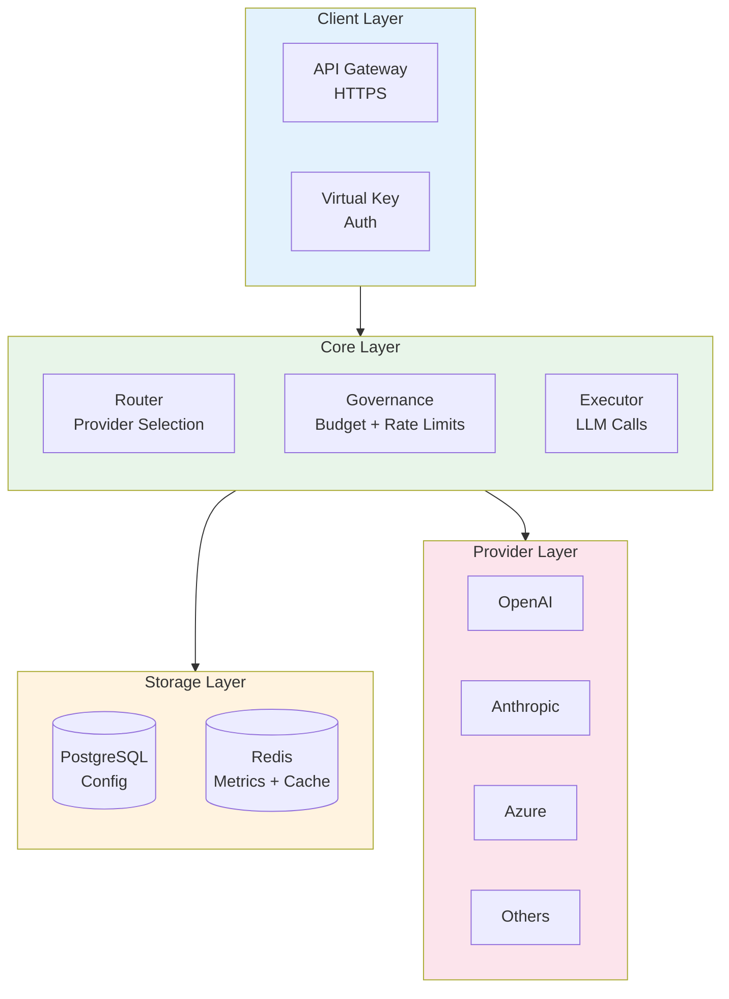

### 1.2 LiteLLM System Architecture

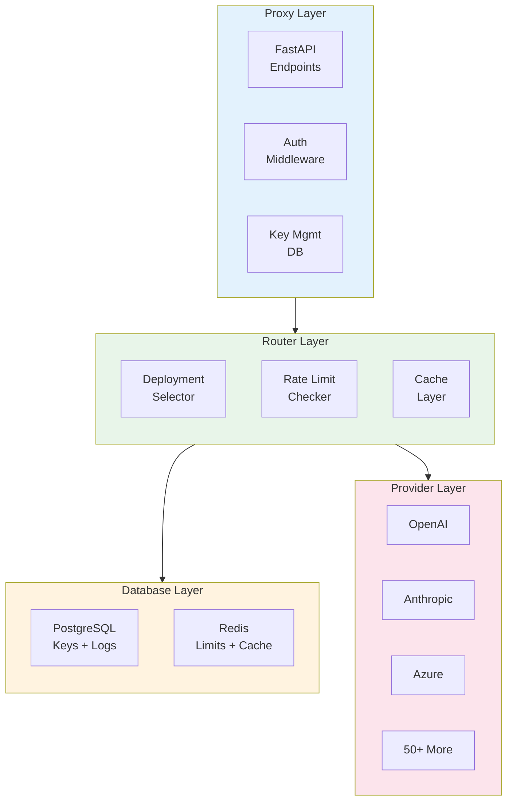

### 1.3 Architecture Comparison

| Layer | Bifrost | LiteLLM |
|-------|---------|---------|
| **Client Interface** | HTTP API | FastAPI proxy |
| **Authentication** | Virtual Key | API Key |
| **Routing** | Governance-aware | Strategy-based |
| **Storage** | PostgreSQL + Redis | PostgreSQL + Redis |
| **Provider Abstraction** | Unified interface | Unified interface |
| **Extensibility** | Plugin system | Hooks + callbacks |

---

## 2. Request Flow

### 2.1 Bifrost Request Flow

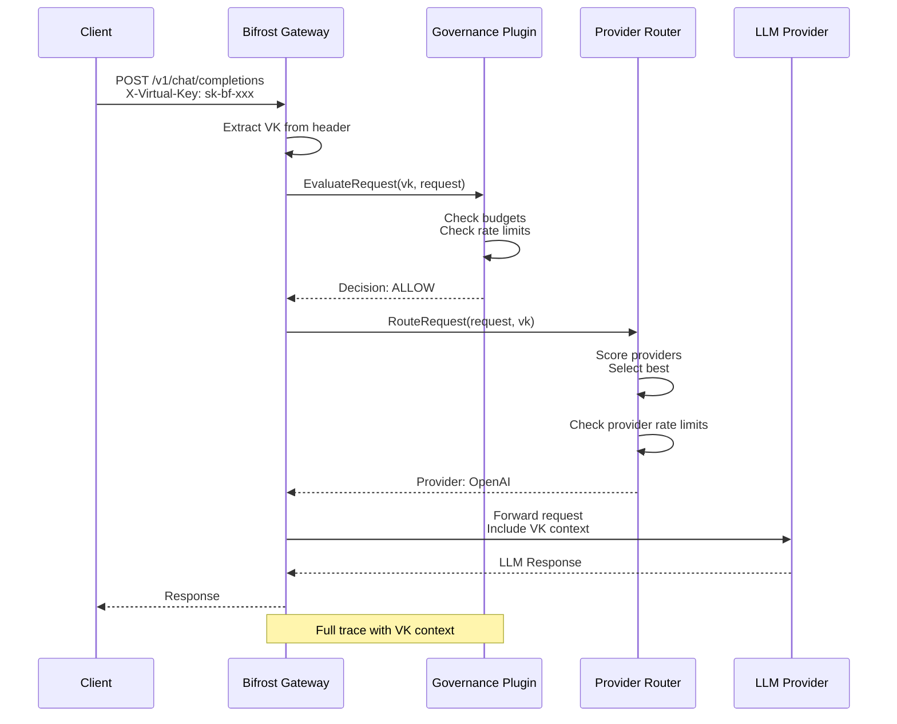

### 2.2 LiteLLM Request Flow

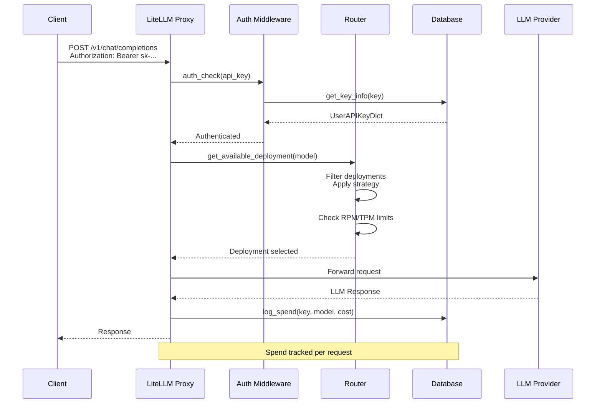

### 2.3 Request Flow Comparison

| Step | Bifrost | LiteLLM |
|------|---------|---------|
| **Auth Extraction** | VK from header | Bearer token |
| **Auth Validation** | Governance check | DB lookup |
| **Budget Check** | Pre-routing | Post-auth |
| **Rate Limit Check** | Per-provider | Per-deployment |
| **Provider Selection** | Score-based | Strategy-based |
| **Request Forward** | Native | HTTP proxy |
| **Spend Tracking** | Via budget | Via DB + Redis |

---

## 3. Data Layer

### 3.1 Bifrost Data Model

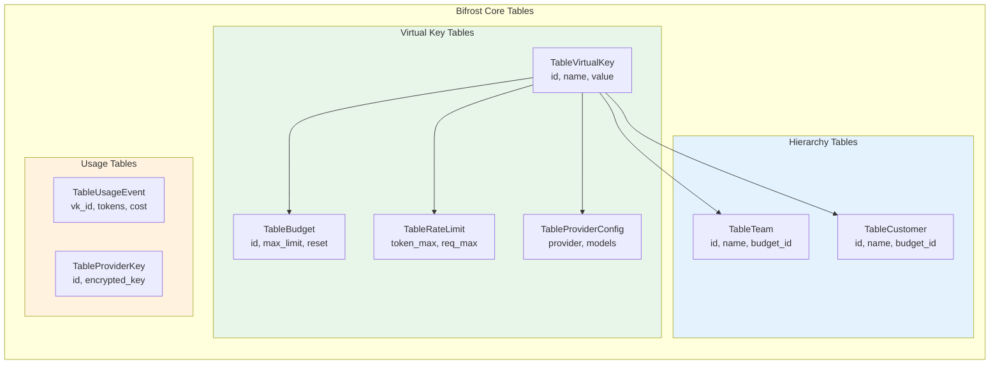

### 3.2 LiteLLM Data Model

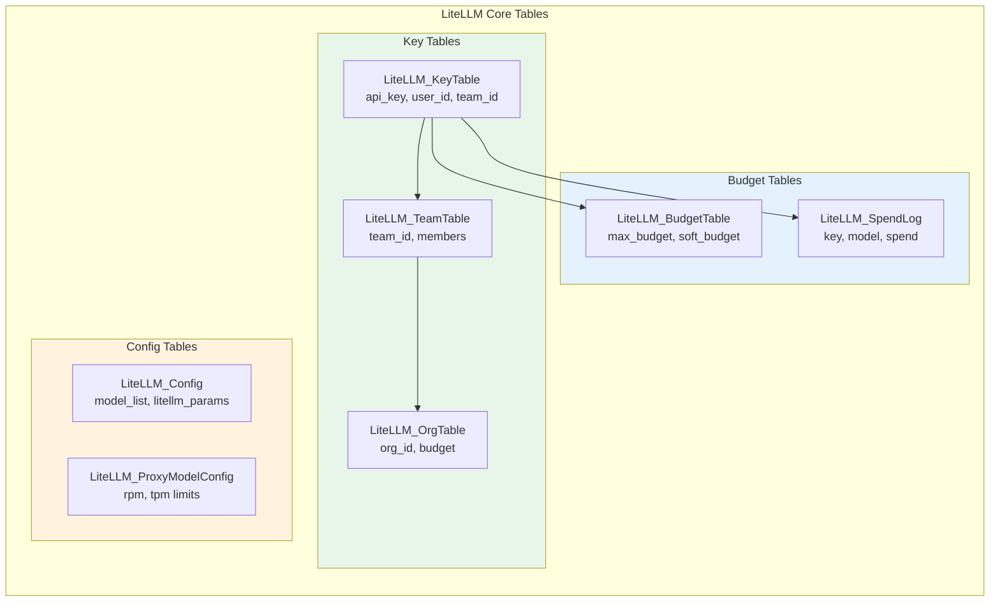

### 3.3 Data Model Comparison

| Entity | Bifrost | LiteLLM |
|--------|---------|---------|
| **Virtual Key** | `TableVirtualKey` | `LiteLLM_KeyTable` |
| **Budget** | `TableBudget` | `LiteLLM_BudgetTable` |
| **Rate Limit** | `TableRateLimit` | Derived from RPM/TPM |
| **Team** | `TableTeam` | `LiteLLM_TeamTable` |
| **Organization** | `TableCustomer` | `LiteLLM_OrgTable` |
| **Provider Config** | `TableProviderConfig` | `LiteLLM_Config` |
| **Usage Log** | `TableUsageEvent` | `LiteLLM_SpendLog` |

---

## 4. Plugin Architecture

### 4.1 Bifrost Plugin Architecture

```mermaid
graph TB
    subgraph Plugin["Bifrost Plugin System"]
        direction TB
        
        subgraph Core["Core Plugins"]
            CP1[Governance Plugin<br/>Budget + Rate Limits]
            CP2[Router Plugin<br/>Provider Selection]
            CP3[Auth Plugin<br/>VK Validation]
        end
        
        subgraph Extension["Extension Points"]
            EP1[Pre-request hooks]
            EP2[Post-request hooks]
            EP3[Provider middleware]
            EP4[Custom providers]
        end
        
        subgraph Register["Plugin Registration"]
            R1[RegisterPlugin(name, plugin)]
            R2[Plugin lifecycle]
            R3[Dependency injection]
        end
        
        Core --> Extension
        Extension --> Register
    end
    
    style Core fill:#e8f5e9
    style Extension fill:#e3f2fd
    style Register fill:#fff3e0
```

```go
// Bifrost plugin interface
type Plugin interface {
    Name() string
    Initialize(config interface{}) error
    Process(ctx context.Context, request *LLMRequest) (*Response, error)
}

// Governance plugin registration
func (b *Bifrost) RegisterPlugin(plugin Plugin) {
    b.plugins[plugin.Name()] = plugin
}

// Custom provider via plugin
type CustomProviderPlugin struct {
    BaseProvider
}

func (p *CustomProviderPlugin) Call(ctx context.Context, req *Request) (*Response, error) {
    // Custom implementation
    return p.BaseProvider.Call(ctx, req)
}
```

### 4.2 LiteLLM Hook Architecture

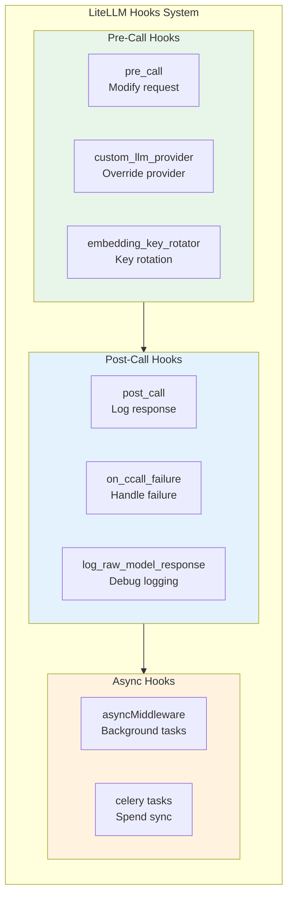

```python
# LiteLLM hooks
@hooks.register_hook
class MyCustomHook:
    name = "my_custom_hook"
    
    async def pre_call(self, kwargs):
        # Modify request before call
        kwargs["messages"].append({"role": "system", "content": "Custom"})
        return kwargs
    
    async def post_call(self, kwargs, response):
        # Log or modify response
        print(f"Response: {response}")
        return response
    
    async def on_failure(self, kwargs, exception):
        # Handle failure
        send_alert(exception)

# Register hook
litellm.common_utils.hooks = [MyCustomHook()]

# Custom LLM provider
@register_model()
class MyCustomProvider:
    def __init__(self):
        self.api_base = "https://custom.endpoint.com"
        self.api_key = os.getenv("CUSTOM_API_KEY")
    
    async def chat_completion(self, model, messages, **kwargs):
        # Custom implementation
        return await self._call(model, messages)
```

### 4.3 Plugin Architecture Comparison

| Aspect | Bifrost | LiteLLM |
|--------|---------|---------|
| **Plugin Type** | Core plugins | Hooks + callbacks |
| **Registration** | `RegisterPlugin()` | Decorators |
| **Pre-processing** | Via plugin | `@pre_call` |
| **Post-processing** | Via plugin | `@post_call` |
| **Failure handling** | Via plugin | `@on_failure` |
| **Custom providers** | Plugin interface | `@register_model` |
| **Dependency injection** | Yes | Limited |

---

## 5. Deployment Models

### 5.1 Bifrost Deployment Models

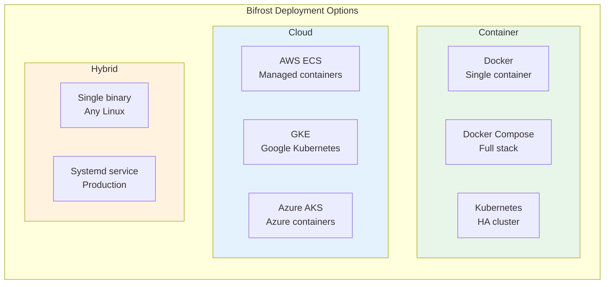

### 5.2 LiteLLM Deployment Models

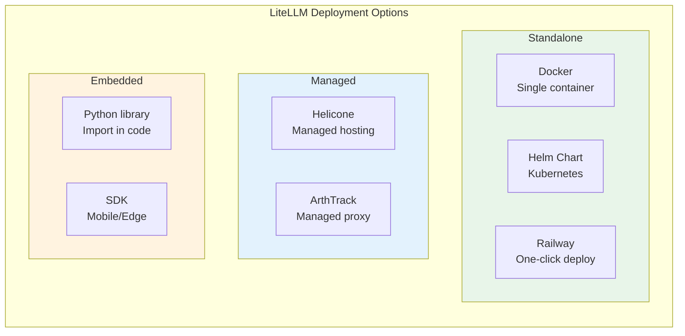

### 5.3 Deployment Comparison

| Aspect | Bifrost | LiteLLM |
|--------|---------|---------|
| **Docker** | ✅ Official image | ✅ Official image |
| **Kubernetes** | ✅ Helm chart | ✅ Helm chart |
| **Single binary** | ✅ | ❌ (Python) |
| **Embedded SDK** | ❌ | ✅ |
| **Managed hosting** | ❌ | ✅ |
| **Edge deployment** | ❌ | ✅ Ollama |

---

## 6. Scalability

### 6.1 Bifrost Scalability

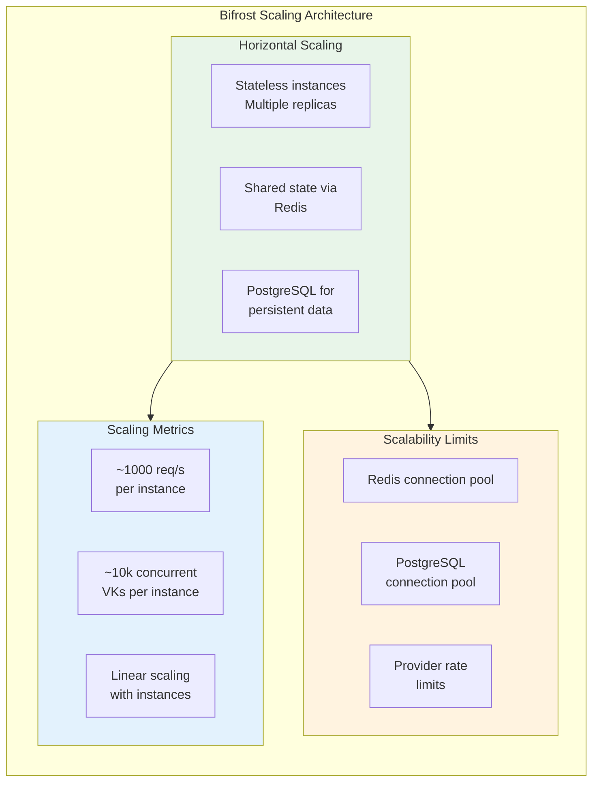

### 6.2 LiteLLM Scalability

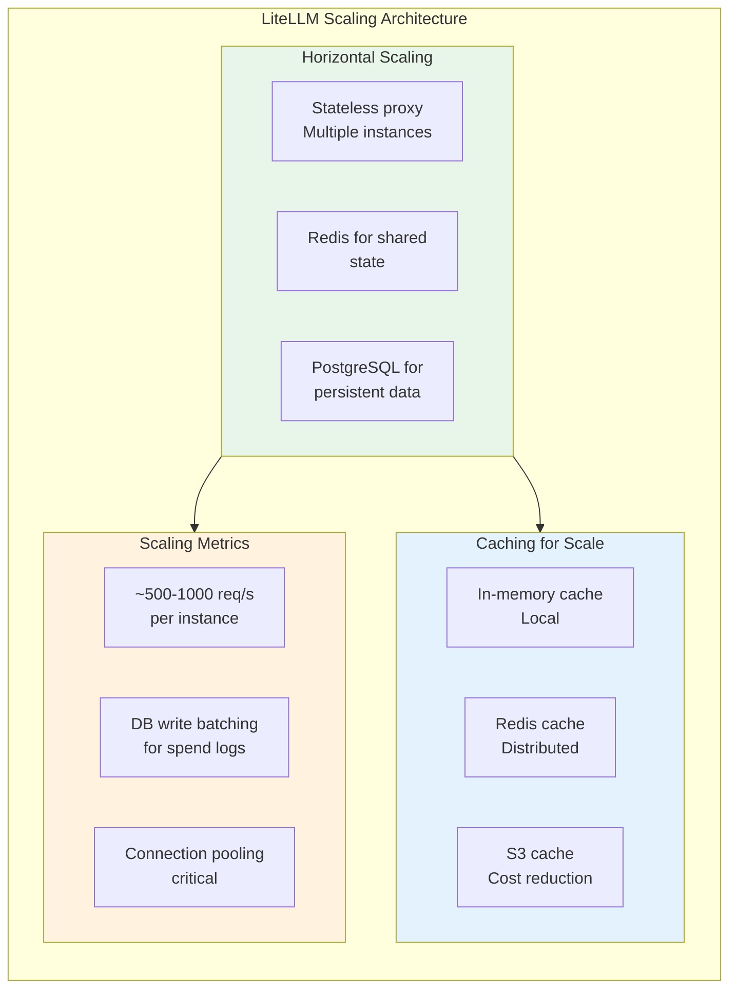

### 6.3 Scalability Comparison

| Aspect | Bifrost | LiteLLM |
|--------|---------|---------|
| **Stateless** | ✅ | ✅ |
| **Redis sync** | ✅ | ✅ |
| **Horizontal scaling** | ✅ | ✅ |
| **Connection pooling** | ✅ | ✅ |
| **DB write batching** | Via events | Via hooks |
| **Max concurrent VKs** | ~10k/instance | ~5k/instance |
| **Max requests/s** | ~1000/instance | ~500-1000/instance |

---

## 7. Failure Modes

### 7.1 Bifrost Failure Modes

```mermaid
state-v2
    [*] --> Healthy
    Healthy --> Degraded: Provider down
    Healthy --> Degraded: Redis disconnected
    Degraded --> Healthy: Provider recovers
    Degraded --> Degraded: Multiple providers down
    Degraded --> Partial: Budget exhausted
    
    Partial --> Healthy: Budget refilled
    Partial --> [*]: Critical failure
    
    note right of Healthy
        All systems operational
        Providers available
        Budgets OK
    end
    
    note right of Degraded
        Some providers unavailable
        Fallback routing active
        Latency increased
    end
    
    note right of Partial
        Only fallback providers
        Budgets approaching limits
        Rate limits enforced
    end
```

### 7.2 LiteLLM Failure Modes

```mermaid
state-v2
    [*] --> Active
    Active --> Cooldown: Rate limit hit
    Active --> Retry: Retriable error
    Active --> Degraded: Provider down
    
    Cooldown --> Active: TTL expires
    Retry --> Active: Success
    Retry --> Cooldown: Rate limit
    Retry --> Degraded: Max retries
    
    Degraded --> Active: Recovery
    Degraded --> Failed: All deployments down
    
    Failed --> Active: Manual reset
    
    note right of Cooldown
        Deployment marked
        Try next deployment
        30s default TTL
    end
    
    note right of Degraded
        Model unavailable
        Use fallbacks
        Log errors
    end
```

### 7.3 Failure Mode Comparison

| Failure | Bifrost Response | LiteLLM Response |
|---------|-------------------|------------------|
| **Provider down** | Score penalty + fallback | Cooldown + retry |
| **Rate limit hit** | Honor + wait | Cooldown + next deployment |
| **Budget exhausted** | DENY request | DENY request |
| **Redis down** | In-memory fallback | In-memory + retry |
| **PostgreSQL down** | Cached reads only | Cached reads only |
| **Timeout** | Always retry | Retry if retriable |
| **Auth failure** | DENY | DENY |

---

## 8. Key Feature Matrix

| Feature | Bifrost | LiteLLM |
|---------|---------|---------|
| **Architecture** | Monolithic core | Proxy-based |
| **Request flow** | Governance-first | Auth-first |
| **Data model** | Hierarchical | Flat with joins |
| **Plugin system** | Full plugin | Hooks + callbacks |
| **Deployment** | Binary + containers | Containers + embedded |
| **Scalability** | Horizontal | Horizontal |
| **Failure recovery** | Self-healing | TTL-based |
| **State management** | Redis + PostgreSQL | Redis + PostgreSQL |

---

## 9. Summary

### Bifrost Architecture Strengths
- **Single binary**: Simple deployment
- **Plugin system**: Full extensibility
- **Self-healing**: Momentum-based recovery
- **Governance-first**: Budget enforced before routing
- **Clean separation**: Core + plugins

### LiteLLM Architecture Strengths
- **Python-based**: Easy to extend
- **Hooks system**: Flexible customization
- **Embedded SDK**: Mobile/edge support
- **Large ecosystem**: Many integrations
- **Community**: Active contributions

### Architecture Trade-offs

| Aspect | Bifrost | LiteLLM |
|--------|---------|---------|
| **Performance** | ✅ Faster (Go) | ⚠️ Slower (Python) |
| **Flexibility** | ⚠️ More opinionated | ✅ More flexible |
| **Learning curve** | ⚠️ Steeper | ✅ Gentler |
| **Customization** | ✅ Plugin system | ✅ Hooks system |
| **Debugging** | ⚠️ More complex | ✅ Easier |
| **Production ready** | ✅ | ✅ |

---

**Final Note on Integration**

Both systems offer robust architectures suitable for CipherOcto's integration requirements. The choice depends on:
- **Performance priority**: Bifrost (Go) > LiteLLM (Python)
- **Customization priority**: Both offer good options
- **Ecosystem priority**: LiteLLM > Bifrost
- **Simplicity priority**: LiteLLM > Bifrost

**Recommended Next Steps:**
- [ ] Create decision matrix for CipherOcto integration
- [ ] Prototype integration with preferred system
- [ ] Benchmark performance characteristics
- [ ] Evaluate operational complexity