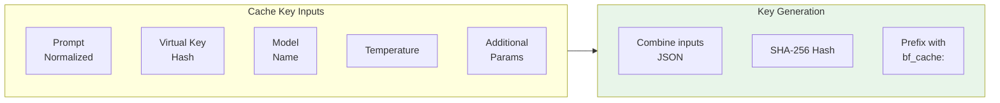
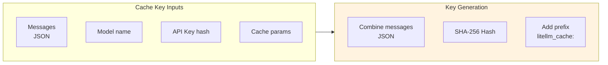
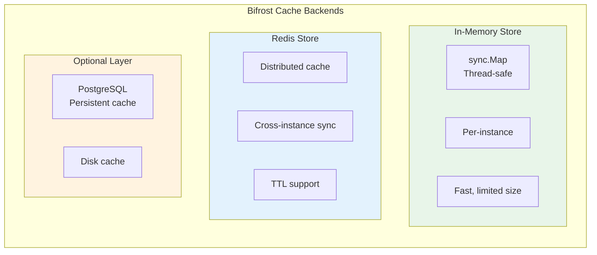
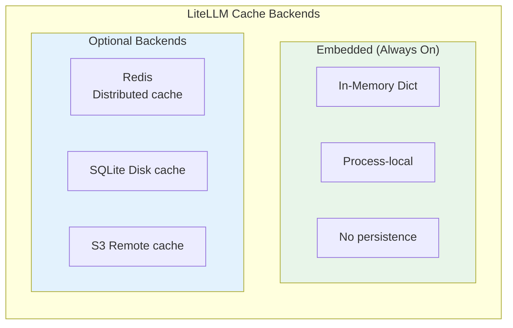
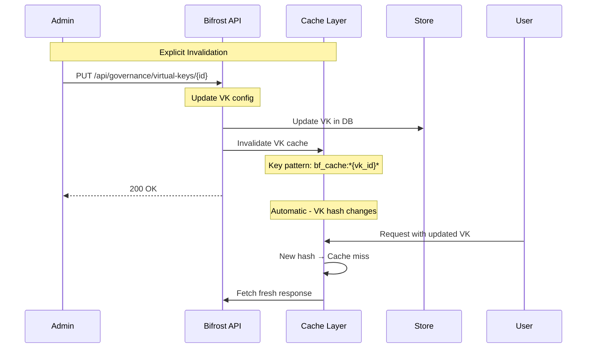
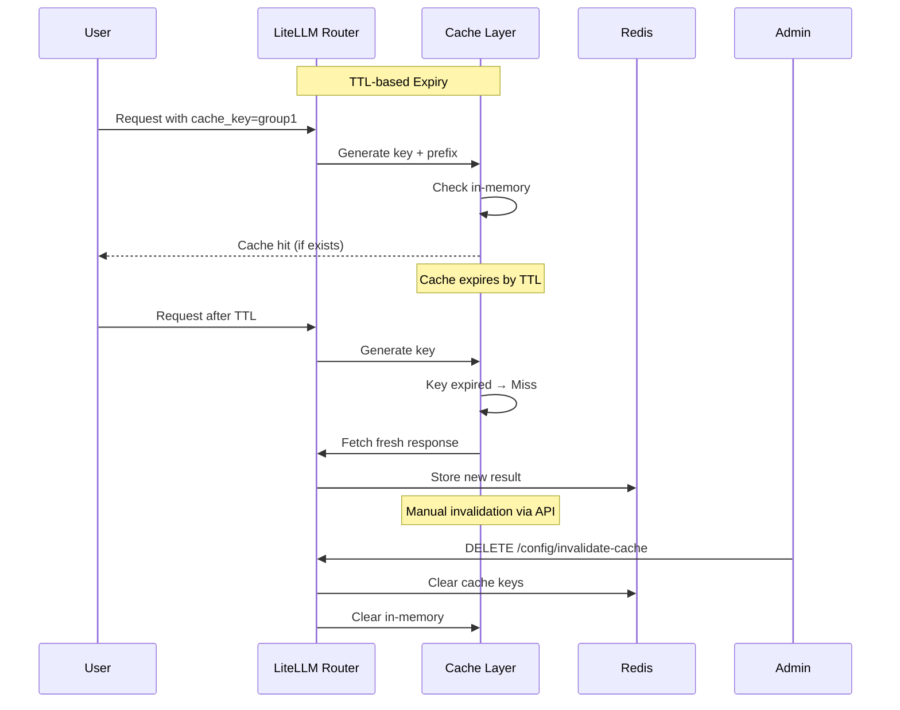
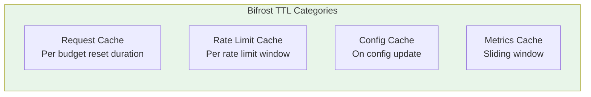
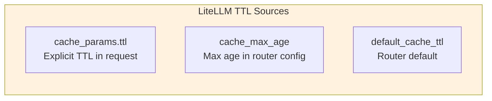
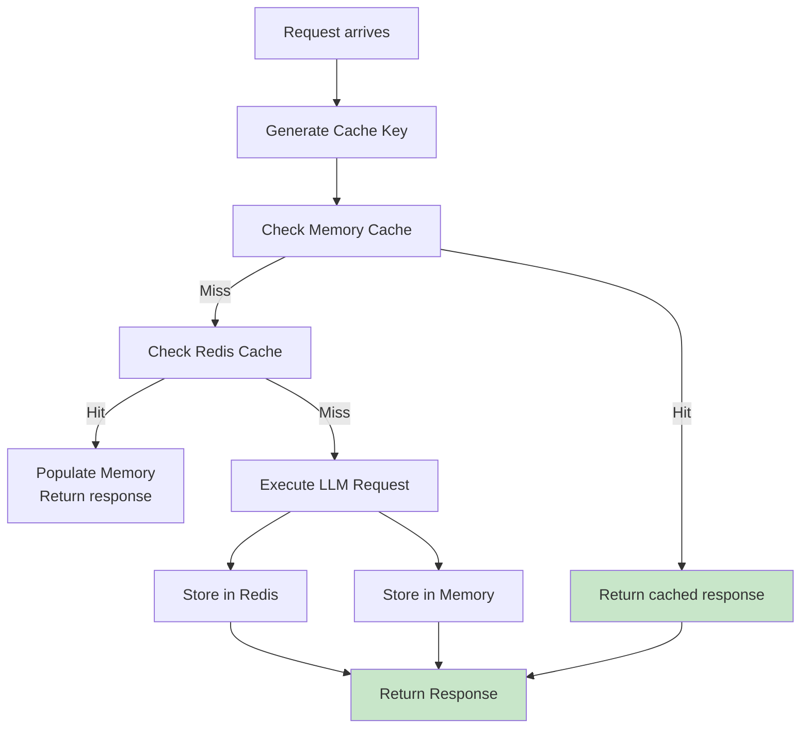
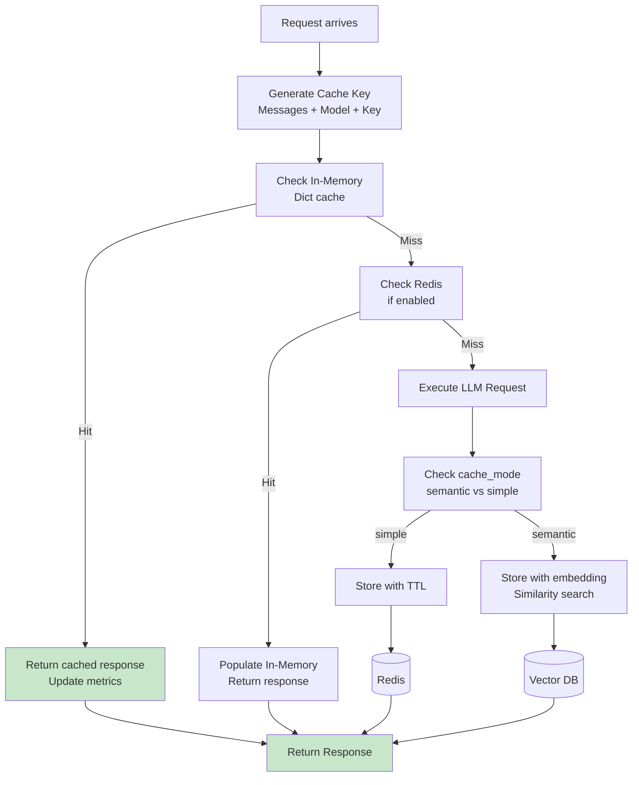

# Research: Caching Deep Comparison - Bifrost vs LiteLLM

**Date:** 2026-05-11  
**Status:** Companion Research  
**Parent:** [Bifrost vs LiteLLM Comparison](./bifrost-litellm-comparison.md)

---

## Table of Contents

1. [Caching Architecture](#1-caching-architecture)
2. [Cache Key Strategy](#2-cache-key-strategy)
3. [Cache Backend](#3-cache-backend)
4. [Cache Invalidation](#4-cache-invalidation)
5. [TTL Management](#5-ttl-management)
6. [Response Caching](#6-response-caching)
7. [Distributed Caching](#7-distributed-caching)
8. [Configuration](#8-configuration)

---

## 1. Caching Architecture

### 1.1 Bifrost Caching Architecture

```mermaid
graph TB
    subgraph Request["Incoming Request"]
        Prompt[Prompt + Params]
        VK[Virtual Key]
    end
    
    subgraph CacheLayer["Bifrost Cache Layer"]
        direction TB
        L1[Generate Cache Key<br/>Prompt Hash + VK + Params]
        L2[Check Memory Cache<br/>sync.Map]
        L3[Check Redis Cache<br/>Distributed]
        L4[Cache Hit?<br/>Return Cached Response]
    end
    
    subgraph Storage["Storage"]
        MEM[(&)sync.Map<br/>In-Memory]
        RED[(Redis<br/>Distributed)]
        DB[(PostgreSQL<br/>Persist)]
    end
    
    Request --> CacheLayer
    CacheLayer --> Storage
    
    L2 -.-> MEM
    L3 -.-> RED
    
    style CacheLayer fill:#e3f2fd
```

### 1.2 LiteLLM Caching Architecture

```mermaid
graph TB
    subgraph Request["Incoming Request"]
        Messages[Messages + Model]
        Key[API Key]
    end
    
    subgraph CacheLayer["LiteLLM Cache Layer"]
        direction TB
        C1[Generate Cache Key<br/>Hash messages + model]
        C2[Check In-Memory<br/>Dict cache]
        C3[Check Redis<br/>Optional]
        C4[Check Disk<br/>Optional (LiteLLM Proxy)]
    end
    
    subgraph Storage["Storage Options"]
        RAM[(In-Memory<br/>Process Dict)]
        RED[(Redis)]
        DISK[(Disk Cache<br/>SQLite)]
    end
    
    Request --> CacheLayer
    CacheLayer --> Storage
    
    style CacheLayer fill:#fff3e0
```

---

## 2. Cache Key Strategy

### 2.1 Bifrost Cache Key Generation



```go
// Bifrost cache key generation
func GenerateCacheKey(request *LLMRequest, vk *TableVirtualKey) string {
    // 1. Normalize prompt
    normalizedPrompt := normalizePrompt(request.Prompt)
    
    // 2. Build key components
    components := map[string]interface{}{
        "prompt":   normalizedPrompt,
        "model":    request.Model,
        "vk_id":    vk.ID,
        "temperature": request.Temperature,
        // Include other deterministic params
        "max_tokens": request.MaxTokens,
    }
    
    // 3. Serialize and hash
    jsonBytes, _ := json.Marshal(components)
    hash := sha256.Sum256(jsonBytes)
    
    return fmt.Sprintf("bf_cache:%x", hash)
}
```

### 2.2 LiteLLM Cache Key Generation



```python
# LiteLLM cache key generation
def generate_cache_key(
    messages: List[Dict],
    model: str,
    api_key: str,
    caching_params: Dict
) -> str:
    # 1. Serialize messages deterministically
    message_str = json.dumps(messages, sort_keys=True)
    
    # 2. Combine with model and key
    key_parts = [
        message_str,
        model,
        hash_api_key(api_key),  # Don't include raw key
        str(caching_params)  # cache_key, cache_group etc.
    ]
    
    # 3. Hash and prefix
    combined = "|".join(key_parts)
    hash_digest = hashlib.sha256(combined.encode()).hexdigest()
    
    return f"litellm_cache:{hash_digest}"
```

### 2.3 Cache Key Comparison

| Aspect | Bifrost | LiteLLM |
|--------|---------|---------|
| **Key Format** | `bf_cache:{hash}` | `litellm_cache:{hash}` |
| **Hash Input** | Prompt + VK + Model + Params | Messages + Model + Key |
| **VK Included** | Yes - per-customer isolation | No - only model/params |
| **Normalization** | Yes - prompt normalization | Optional |
| **Caching Groups** | Via VK provider config | Via `caching_params` |

---

## 3. Cache Backend

### 3.1 Bifrost Cache Backends



### 3.2 LiteLLM Cache Backends



### 3.3 Backend Comparison

| Backend | Bifrost | LiteLLM |
|---------|---------|---------|
| **In-Memory** | sync.Map (always) | Dict (always) |
| **Redis** | Optional | Optional |
| **SQLite** | No | Yes (disk cache) |
| **S3** | No | Yes |
| **PostgreSQL** | Config store | Logs + caching |
| **Distributed** | Redis | Redis + S3 |

---

## 4. Cache Invalidation

### 4.1 Bifrost Cache Invalidation



### 4.2 LiteLLM Cache Invalidation



### 4.3 Invalidation Comparison

| Trigger | Bifrost | LiteLLM |
|---------|---------|---------|
| **TTL Expiry** | Configured per budget | `cache_params.ttl` |
| **Manual Invalidate** | Yes | Yes |
| **VK Update** | Automatic (hash change) | Via explicit invalidate |
| **Budget Exhaustion** | Not applicable | Clears key cache |
| **Provider Change** | Via config update | Via explicit invalidate |

---

## 5. TTL Management

### 5.1 Bifrost TTL Strategy



```go
// Bifrost TTL determination
func getCacheTTL(budget *TableBudget) time.Duration {
    switch budget.ResetDuration {
    case "30s":
        return 30 * time.Second
    case "5m":
        return 5 * time.Minute
    case "1h":
        return 1 * time.Hour
    case "1d":
        return 24 * time.Hour
    case "1w":
        return 7 * 24 * time.Hour
    case "1M":
        return 30 * 24 * time.Hour
    default:
        return 1 * time.Hour // Default
    }
}
```

### 5.2 LiteLLM TTL Strategy



```python
# LiteLLM TTL determination (simplified)
def get_cache_ttl(
    cache_params: Optional[Dict],
    router_config: RouterConfig,
    request_params: Dict
) -> int:
    # 1. Check explicit TTL in request
    if cache_params and cache_params.get("ttl"):
        return cache_params["ttl"]
    
    # 2. Check cache_max_age in params
    if request_params.get("cache_max_age"):
        return request_params["cache_max_age"]
    
    # 3. Check router default
    if router_config.default_cache_ttl:
        return router_config.default_cache_ttl
    
    # 4. Default TTL
    return 3600  # 1 hour default
```

### 5.3 TTL Comparison

| Aspect | Bifrost | LiteLLM |
|--------|---------|---------|
| **Default TTL** | Per budget duration | 3600s (1hr) |
| **Request Override** | Via budget config | Via `cache_params.ttl` |
| **Max Age** | Configured per VK | Via `cache_max_age` |
| **TTL Granularity** | Fixed to budget | Per-request |
| **Sliding Window** | Yes | No (fixed TTL) |

---

## 6. Response Caching

### 6.1 Bifrost Response Caching Flow



```go
// Bifrost response cache logic
func (c *CacheLayer) GetOrExecute(
    ctx context.Context,
    request *LLMRequest,
    vk *TableVirtualKey,
    executor func() (*schemas.LLMResponse, error),
) (*schemas.LLMResponse, error) {
    
    // 1. Generate cache key
    cacheKey := c.generateCacheKey(request, vk)
    
    // 2. Check in-memory cache
    if cached, ok := c.memory.Load(cacheKey); ok {
        return cached.(*schemas.LLMResponse), nil
    }
    
    // 3. Check Redis cache
    if c.redis != nil {
        if cached := c.redis.Get(ctx, cacheKey); cached != nil {
            resp := deserializeResponse(cached)
            c.memory.Store(cacheKey, resp) // Populate memory
            return resp, nil
        }
    }
    
    // 4. Execute request
    response, err := executor()
    if err != nil {
        return nil, err
    }
    
    // 5. Store in caches
    c.memory.Store(cacheKey, response)
    if c.redis != nil {
        c.redis.Set(ctx, cacheKey, serializeResponse(response), getTTL(vk))
    }
    
    return response, nil
}
```

### 6.2 LiteLLM Response Caching Flow



```python
# LiteLLM response cache logic (simplified)
async def get_cache_or_execute(
    messages: List[Dict],
    model: str,
    cache_mode: str = "simple",
    executor: callable
):
    # 1. Generate cache key
    cache_key = generate_cache_key(messages, model, api_key, cache_params)
    
    # 2. Check in-memory cache
    if cache_key in in_memory_cache:
        return in_memory_cache[cache_key]
    
    # 3. Check Redis (if configured)
    if redis_client:
        cached = await redis_client.get(cache_key)
        if cached:
            response = deserialize(cached)
            in_memory_cache[cache_key] = response  # Populate memory
            return response
    
    # 4. Execute request
    response = await executor()
    
    # 5. Store based on cache_mode
    if cache_mode == "semantic":
        # Store with embedding for similarity search
        embedding = get_embedding(messages)
        vector_store.add(cache_key, embedding, response)
    else:
        # Simple key-value cache
        in_memory_cache[cache_key] = response
        if redis_client:
            await redis_client.set(cache_key, serialize(response), ttl=ttl)
    
    return response
```

### 6.3 Response Caching Comparison

| Aspect | Bifrost | LiteLLM |
|--------|---------|---------|
| **Key Generation** | Prompt + VK + Params | Messages + Model |
| **In-Memory** | sync.Map | Dict |
| **Distributed** | Redis | Redis (optional) |
| **Semantic Cache** | No | Yes (vector) |
| **TTL** | Budget duration | Request TTL |
| **Serializer** | JSON | JSON + embeddings |

---

## 7. Distributed Caching

### 7.1 Bifrost Distributed Cache

```mermaid
graph TB
    subgraph Instances["Bifrost Instances"]
        B1[Instance 1]
        B2[Instance 2]
    end
    
    subgraph Cache["Distributed Cache"]
        R1[(Redis<br/>Primary)]
        R2[(Redis<br/>Replica)]
    end
    
    B1 --> R1
    B2 --> R1
    B1 --> R2
    B2 --> R2
    
    B1 -.->|Local| M1[(Memory)]
    B2 -.->|Local| M2[(Memory)]
    
    note right of B1
        Check Memory → Redis → Miss → Execute
    end
    
    note right of Cache
        Write-through to Redis
        Cross-instance hit
    end
```

### 7.2 LiteLLM Distributed Cache

```mermaid
graph TB
    subgraph Instances["LiteLLM Proxy"]
        L1[Proxy Instance 1]
        L2[Proxy Instance 2]
    end
    
    subgraph CacheLayer["Cache Layer"]
        direction TB
        
        subgraph Local["Local Caches"]
            LM1[(Memory 1)]
            LM2[(Memory 2)]
        end
        
        subgraph Shared["Shared Cache"]
            Redis[(Redis<br/>Optional)]
            S3[(S3<br/>Optional)]
        end
    end
    
    L1 --> LM1
    L2 --> LM2
    
    L1 -.->|If enabled| Redis
    L2 -.->|If enabled| Redis
    
    L1 -.->|Optional| S3
    L2 -.->|Optional| S3
    
    note right of L1
        Memory → Redis → S3 → Miss → Execute
    end
```

### 7.3 Distributed Comparison

| Aspect | Bifrost | LiteLLM |
|--------|---------|---------|
| **Local Cache** | sync.Map | Dict |
| **Distributed Cache** | Redis (required) | Redis (optional) |
| **Remote Cache** | PostgreSQL | S3 (optional) |
| **Write Pattern** | Write-through | Write-through |
| **Read Pattern** | Memory → Redis | Memory → Redis → S3 |
| **Consistency** | Eventual | Eventual |

---

## 8. Configuration

### 8.1 Bifrost Cache Configuration

```yaml
# Virtual Key with cache settings
virtual_key:
  name: "production-vk"
  
  # Budget defines cache TTL
  budgets:
    - id: "budget-1"
      max_limit: 100.00
      reset_duration: "1h"  # Cache TTL = 1 hour
      
  rate_limit:
    token_max_limit: 100000
    token_reset_duration: "1h"  # Cache TTL = 1 hour

# Network config for cache behavior
network_config:
  cache_enabled: true
  cache_ttl_override: "30m"  # Override budget TTL if needed
  
# Redis config for distributed caching
redis:
  host: "localhost"
  port: 6379
  db: 0
  password: ""
  pool_size: 10
```

### 8.2 LiteLLM Cache Configuration

```yaml
# Router with cache config
router:
  model_list:
    - model_name: "gpt-4"
      litellm_params:
        model: "openai/gpt-4"
  
  # Cache settings
  cache: true  # Enable caching
  cache_params:
    ttl: 3600  # 1 hour default TTL
    cache_key: "user-id-123"  # Optional cache key prefix
  
  # Disk cache (SQLite)
  cache_kwargs:
    type: "disk"
    path: "./cache.db"
    size_limit: 1000000000  # 1GB
  
  # Redis cache (optional)
  redis_host: "localhost"
  redis_port: 6379
  redis_password: ""
  
  # S3 cache (optional)
  s3_cache_config:
    bucket_name: "litellm-cache"
    region_name: "us-east-1"
  
  # Semantic caching (optional)
  semcache:
    enabled: true
    embedding_model: "text-embedding-ada-002"
    threshold: 0.95
```

### 8.3 Configuration Comparison

| Config | Bifrost | LiteLLM |
|--------|---------|---------|
| **Enable/Disable** | `cache_enabled` | `cache: true/false` |
| **TTL** | Via budget duration | `cache_params.ttl` |
| **Redis** | `redis.*` | `redis_host/port` |
| **Disk Cache** | No | `cache_kwargs.type=disk` |
| **S3 Cache** | No | `s3_cache_config` |
| **Semantic Cache** | No | `semcache` |
| **Cache Key Prefix** | Via VK | `cache_key` param |

---

## 9. Key Feature Matrix

| Feature | Bifrost | LiteLLM |
|---------|---------|---------|
| In-memory cache | ✅ sync.Map | ✅ Dict |
| Redis cache | ✅ Required | ✅ Optional |
| Disk cache | ❌ | ✅ SQLite |
| S3 cache | ❌ | ✅ Optional |
| Semantic cache | ❌ | ✅ Vector-based |
| TTL management | Via budget | Per-request |
| Cache key prefix | Via VK | `cache_key` param |
| Distributed sync | ✅ Redis | ✅ Redis |
| Write-through | ✅ | ✅ |
| Cache invalidation | Manual | Manual + TTL |

---

## 10. Summary

### Bifrost Advantages
- **Budget-integrated TTL**: Cache automatically tied to budget duration
- **Required Redis**: Consistent distributed behavior
- **Simpler model**: No optional backends to manage
- **Per-VK caching**: Via provider configs

### LiteLLM Advantages
- **Multiple backends**: Memory, Redis, Disk, S3
- **Semantic caching**: Vector-based similarity search
- **Per-request TTL**: More flexible
- **Larger ecosystem**: More cache integrations
- **Cost savings**: Significant with good cache hit rate

---

**Next Steps:**
- [ ] Research: Retry & Fallback Deep Comparison
- [ ] Research: Observability Deep Comparison
- [ ] Research: Provider Support Deep Comparison
- [ ] Research: Architecture Deep Comparison