# Research: Load Balancing Deep Comparison - Bifrost vs LiteLLM

**Date:** 2026-05-11  
**Status:** Companion Research  
**Parent:** [Bifrost vs LiteLLM Comparison](./bifrost-litellm-comparison.md)

---

## Table of Contents

1. [Architecture Overview](#1-architecture-overview)
2. [Routing Strategies](#2-routing-strategies)
3. [Scoring Algorithms](#3-scoring-algorithms)
4. [Cooldown Management](#4-cooldown-management)
5. [Deployment Selection Flow](#5-deployment-selection-flow)
6. [Failure Handling](#6-failure-handling)
7. [Distributed Consistency](#7-distributed-consistency)
8. [Configuration](#8-configuration)

---

## 1. Architecture Overview

### 1.1 Bifrost Load Balancing Architecture

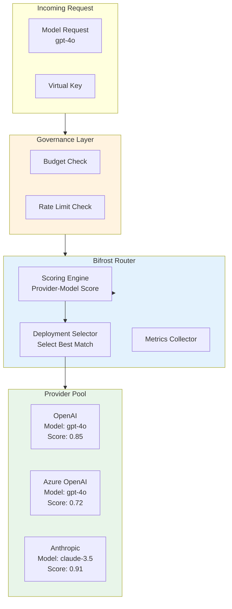

### 1.2 LiteLLM Load Balancing Architecture

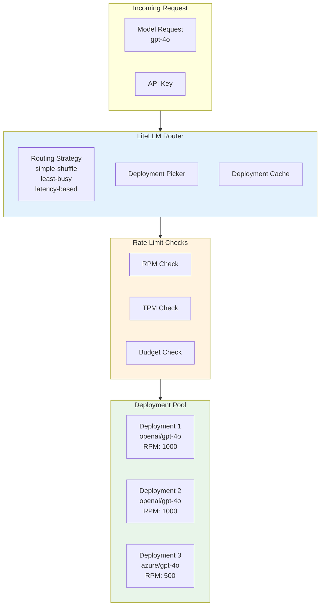

---

## 2. Routing Strategies

### 2.1 Bifrost Routing Strategies

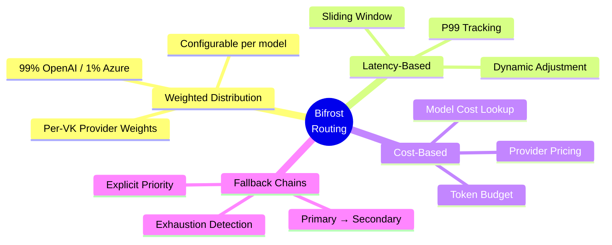

### 2.2 LiteLLM Routing Strategies

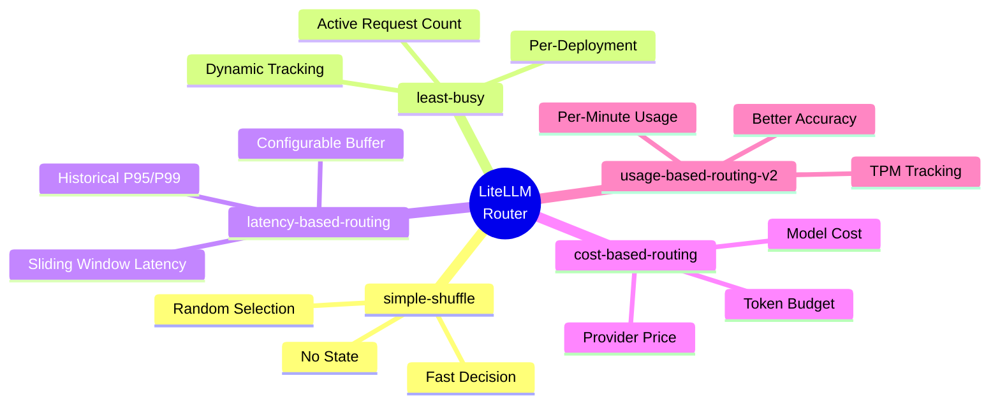

### 2.3 Strategy Comparison

| Strategy | Bifrost | LiteLLM |
|----------|---------|---------|
| Random (shuffle) | Implicit (lowest score) | `simple-shuffle` |
| Least Busy | Via capacity scoring | `least-busy` |
| Latency Based | Native scoring | `latency-based-routing` |
| Cost Based | Via cost lookup | `cost-based-routing` |
| Usage Based | Via capacity tracking | `usage-based-routing-v2` |
| Weighted | Per-VK provider config | Via RPM weights |
| Fallback Chain | Native priority | Via `fallbacks` param |
| Custom | Plugin extensibility | Limited |

---

## 3. Scoring Algorithms

### 3.1 Bifrost Scoring Algorithm

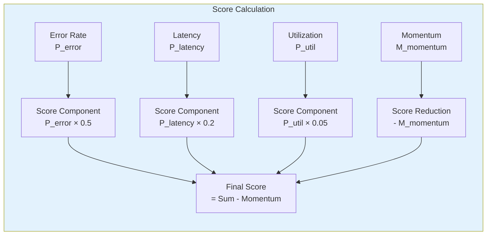

**Formula:**
```
Score = (P_error × 0.5) + (P_latency × 0.2) + (P_util × 0.05) - M_momentum
```

```go
// Bifrost Scoring (simplified from docs/providers/provider-routing.mdx)
type ProviderScore struct {
    ErrorRate      float64 // Penalty from error rate (0-1)
    LatencyPenalty float64 // Penalty from latency (0-1)
    UtilizationPenalty float64 // Penalty from utilization (0-1)
    Momentum       float64 // Recovery bonus (positive = lower score)
}

func (ps *ProviderScore) Calculate() float64 {
    return (ps.ErrorRate * 0.5) + 
           (ps.LatencyPenalty * 0.2) + 
           (ps.UtilizationPenalty * 0.05) - 
           ps.Momentum
}
```

### 3.2 LiteLLM Scoring Approach

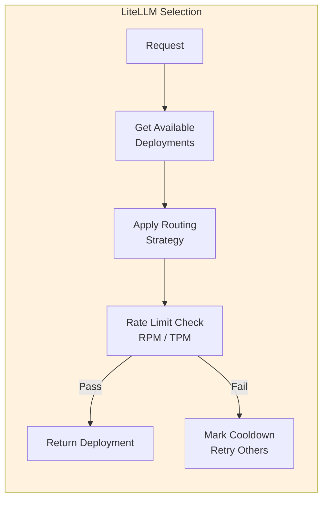

```python
# LiteLLM Selection Logic (simplified)
def get_available_deployment(model: str, router: Router):
    # 1. Get all healthy deployments for model
    deployments = router.get_deployments_for_model(model)
    
    # 2. Filter out cooldown deployments
    available = [d for d in deployments if not d.in_cooldown()]
    
    # 3. Apply routing strategy
    if router.routing_strategy == "simple-shuffle":
        selected = random.choice(available)
    elif router.routing_strategy == "least-busy":
        selected = min(available, key=lambda d: d.active_requests)
    elif router.routing_strategy == "latency-based-routing":
        selected = min(available, key=lambda d: d.avg_latency)
    
    # 4. Check rate limits
    if not check_rate_limit(selected):
        mark_cooldown(selected)
        return get_available_deployment(model, router)  # Recurse
    
    return selected
```

### 3.3 Scoring Comparison

| Aspect | Bifrost | LiteLLM |
|--------|---------|---------|
| **Score Range** | 0-1 (lower = better) | Implicit (best fit) |
| **Error Weight** | 0.5 (50%) | Via cooldown |
| **Latency Weight** | 0.2 (20%) | Via latency-based |
| **Utilization Weight** | 0.05 (5%) | Via least-busy |
| **Momentum** | Yes - self-healing | No |
| **Recovery Speed** | Fast when fixed | Cooldown expiry |

---

## 4. Cooldown Management

### 4.1 Bifrost Cooldown Mechanism

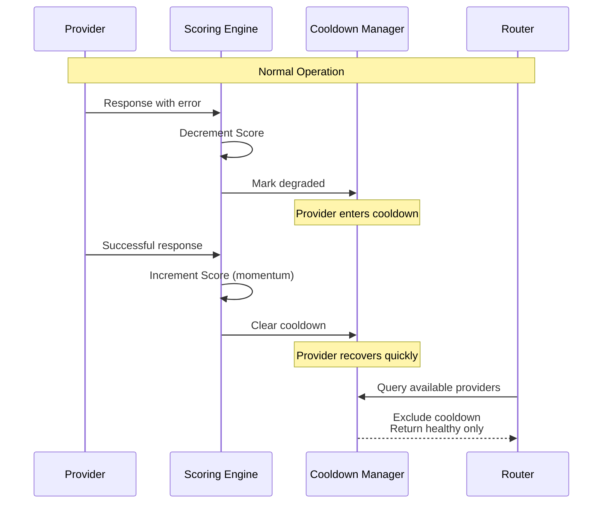

### 4.2 LiteLLM Cooldown Mechanism

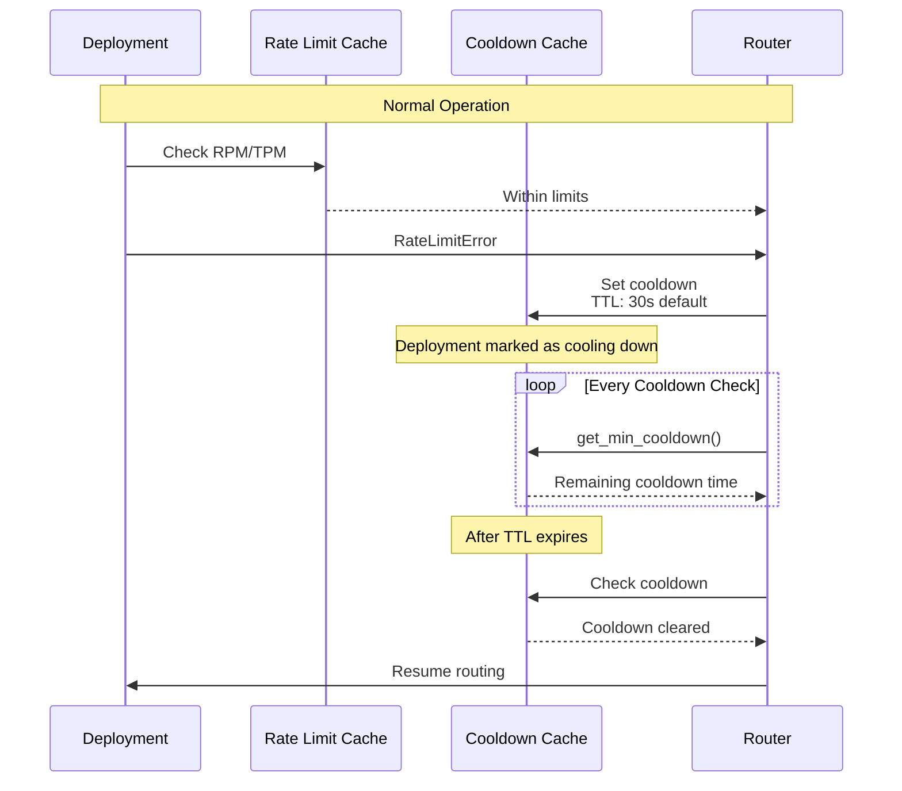

### 4.3 Cooldown Configuration

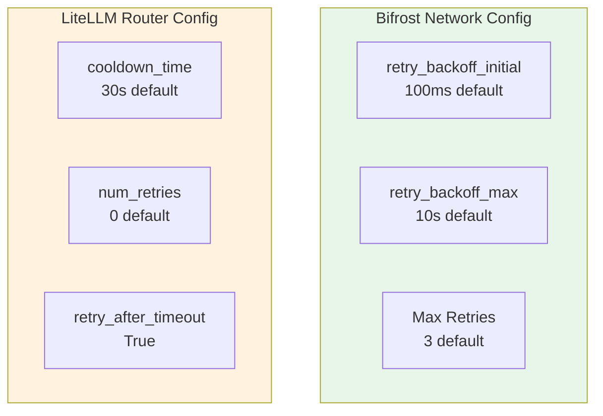

| Config | Bifrost | LiteLLM |
|--------|---------|---------|
| **Cooldown Time** | Via retry backoff | `cooldown_time` |
| **Initial Backoff** | `retry_backoff_initial` | N/A (uses TTL) |
| **Max Backoff** | `retry_backoff_max` | N/A |
| **Max Retries** | `max_retries` | `num_retries` |
| **Timeout Handling** | Immediate retry | Cooldown + retry |

---

## 5. Deployment Selection Flow

### 5.1 Bifrost Deployment Selection

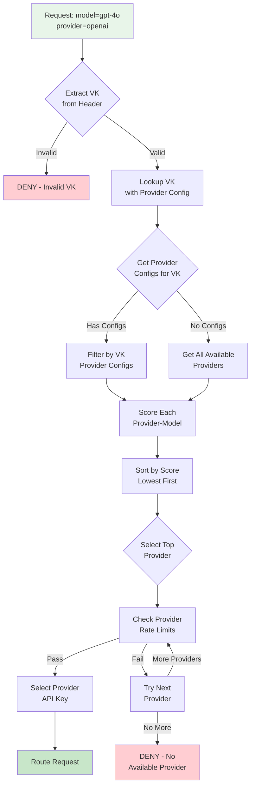

### 5.2 LiteLLM Deployment Selection

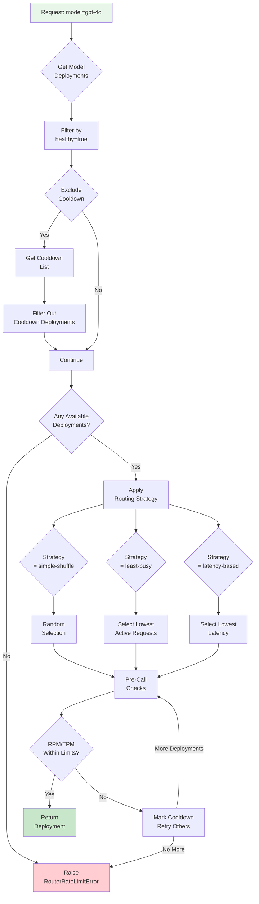

### 5.3 Selection Flow Comparison

| Step | Bifrost | LiteLLM |
|------|---------|---------|
| **VK Extraction** | From header, validate | From API key |
| **Provider Filter** | Via VK provider configs | Via model deployments |
| **Scoring** | Composite score (0-1) | Strategy-based |
| **Rate Limit Check** | Per-provider + sliding window | Per-deployment RPM/TPM |
| **Fallback** | Score-sorted list | Cooldown retry |
| **Failure** | Score penalty | Cooldown marking |

---

## 6. Failure Handling

### 6.1 Bifrost Failure Handling

```mermaid
stateDiagram-v2
    [*] --> Healthy
    Healthy --> Degraded: Error detected
    Degraded --> Degraded: Additional errors
    Degraded --> Healthy: Successful response
    Healthy --> [*]: Shutdown
    
    Degraded --> Cooldown: Score drops below threshold
    Cooldown --> Degraded: Cooldown expires<br/>Score improves
    
    note right of Degraded
        Score decrements with each error
        Score increments with each success
        Self-healing via momentum
    end
```

### 6.2 LiteLLM Failure Handling

```mermaid
stateDiagram-v2
    [*] --> Active
    Active --> Cooldown: RateLimitError
    Active --> Retry: Retriable Error
    Active --> Failed: Max Retries Exceeded
    
    Cooldown --> Active: Cooldown TTL expires
    Retry --> Active: Success
    Retry --> Cooldown: RateLimitError
    Retry --> Failed: Max Retries
    
    Failed --> Active: Manual Reset
    
    note right of Cooldown
        Default 30s TTL
        Can be extended on
        repeated failures
    end
```

### 6.3 Failure Handling Comparison

| Aspect | Bifrost | LiteLLM |
|--------|---------|---------|
| **Error Detection** | Score decrement | Exception catch |
| **Recovery** | Automatic (momentum) | TTL expiry |
| **Retry Logic** | Jittered backoff | Cooldown + recurse |
| **Max Attempts** | Configurable | `num_retries` |
| **Rate Limit** | Sliding window | Fixed cooldown |
| **Self-Healing** | Yes - momentum | No - explicit |

---

## 7. Distributed Consistency

### 7.1 Bifrost Distributed Architecture

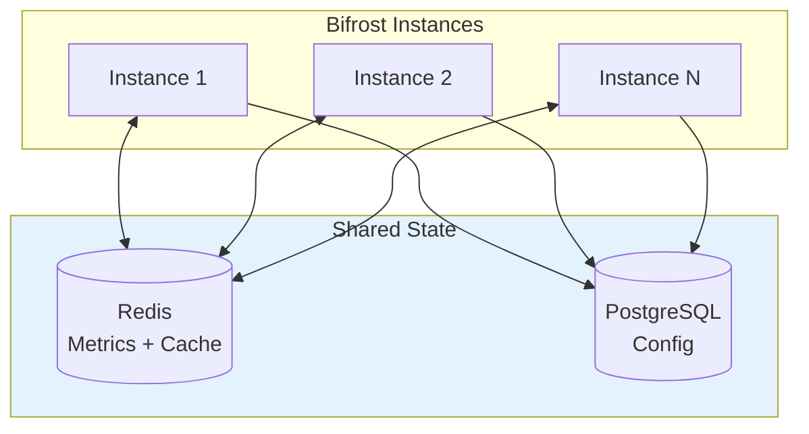

### 7.2 LiteLLM Distributed Architecture

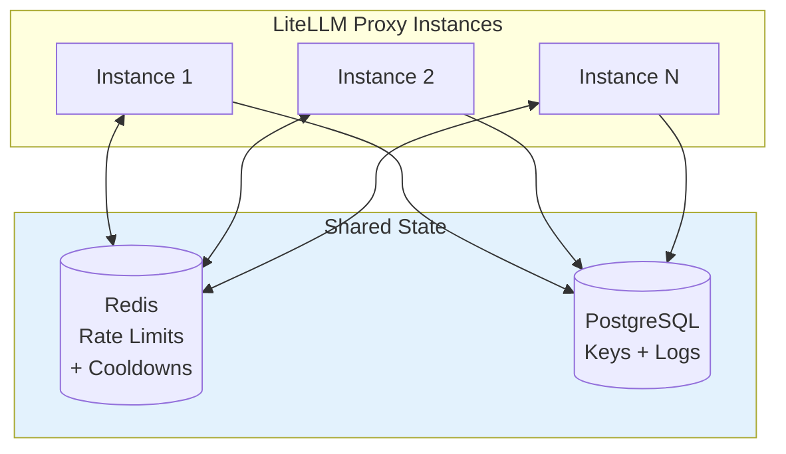

### 7.3 Distributed Consistency Table

| Aspect | Bifrost | LiteLLM |
|--------|---------|---------|
| **Metrics Sync** | Redis | Redis |
| **Config Store** | PostgreSQL | PostgreSQL |
| **Rate Limit Sync** | Redis | Redis dual-cache |
| **Score/State Sync** | Redis | Per-instance |
| **Consistency** | Eventual | Eventual |

---

## 8. Configuration

### 8.1 Bifrost Provider Configuration

```yaml
# Virtual Key with weighted provider distribution
virtual_key:
  name: "production-vk"
  provider_configs:
    - provider: "openai"
      allowed_models: ["gpt-4o", "gpt-3.5-turbo"]
      weight: 99.0
      rate_limit:
        token_max_limit: 100000
        token_reset_duration: "1h"
        request_max_limit: 1000
        request_reset_duration: "1h"
    
    - provider: "azure"
      allowed_models: ["gpt-4o"]
      weight: 1.0

network_config:
  retry_backoff_initial: 100
  retry_backoff_max: 10000
  max_retries: 3
  default_request_timeout_in_seconds: 60
  max_conns_per_host: 100
```

### 8.2 LiteLLM Router Configuration

```yaml
router:
  model_list:
    - model_name: "gpt-4o"
      litellm_params:
        model: "openai/gpt-4o"
        rpm: 1000  # Rate limit for this deployment
      
    - model_name: "gpt-4o"
      litellm_params:
        model: "azure/gpt-4o"
        api_base: "https://example.openai.azure.com"
        rpm: 500
  
  routing_strategy: "simple-shuffle"  # or: least-busy, latency-based-routing, cost-based-routing
  routing_strategy_args:
    latency_threshold: 100  # for latency-based-routing
  
  num_retries: 3
  timeout: 60
  cooldown_time: 30  # seconds
  allowed_fails: 5  # consecutive failures before cooldown
```

### 8.3 Configuration Comparison

| Config | Bifrost | LiteLLM |
|--------|---------|---------|
| **Weighted Routing** | Per-VK provider configs | Via RPM/TPM weights |
| **Rate Limits** | Sliding window | RPM/TPM |
| **Timeout** | `default_request_timeout_in_seconds` | `timeout` |
| **Retries** | `max_retries` | `num_retries` |
| **Cooldown** | Via retry backoff | `cooldown_time` |
| **Strategy** | Composite scoring | Named strategies |

---

## 9. Key Feature Matrix

| Feature | Bifrost | LiteLLM |
|---------|---------|---------|
| Weighted routing | ✅ Per-provider config | ✅ Via RPM weights |
| Latency-based | ✅ Composite score | ✅ Named strategy |
| Least-busy | ✅ Via capacity scoring | ✅ Named strategy |
| Cost-based | ✅ Via cost lookup | ✅ Named strategy |
| Fallback chains | ✅ Provider priority | ✅ `fallbacks` param |
| Per-VK routing | ✅ Full config | ❌ Global only |
| Distributed sync | ✅ Redis | ✅ Redis |
| Cooldown management | ✅ Self-healing | ✅ TTL-based |
| Custom strategies | ✅ Plugin extensibility | ❌ Limited |

---

## 10. Summary

### Bifrost Advantages
- **Unified scoring**: Single algorithm handles all factors
- **Self-healing**: Momentum-based recovery is faster
- **Per-VK routing**: Different routing per customer
- **Per-provider budgets**: Fine-grained cost control
- **Plugin extensibility**: Custom strategies via plugins

### LiteLLM Advantages
- **Simpler model**: Named strategies are easier to understand
- **Deployment abstraction**: Multiple deployments per model
- **Larger ecosystem**: More provider integrations
- **Community support**: More documentation and examples
- **Flexibility**: Easy to add custom routing logic

---

**Next Steps:**
- [ ] Research: Caching Deep Comparison
- [ ] Research: Retry & Fallback Deep Comparison
- [ ] Research: Observability Deep Comparison
- [ ] Research: Provider Support Deep Comparison