# Research: Observability Deep Comparison - Bifrost vs LiteLLM

**Date:** 2026-05-11  
**Status:** Companion Research  
**Parent:** [Bifrost vs LiteLLM Comparison](./bifrost-litellm-comparison.md)

---

## Table of Contents

1. [Observability Stack](#1-observability-stack)
2. [Metrics](#2-metrics)
3. [Tracing](#3-tracing)
4. [Logging](#4-logging)
5. [Alerting](#5-alerting)
6. [Dashboard & UI](#6-dashboard--ui)
7. [Cost Attribution](#7-cost-attribution)
8. [Export & Integration](#8-export--integration)

---

## 1. Observability Stack

### 1.1 Bifrost Observability Stack

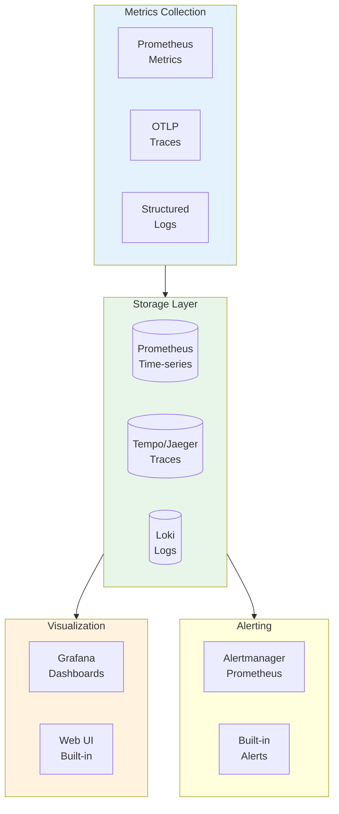

### 1.2 LiteLLM Observability Stack

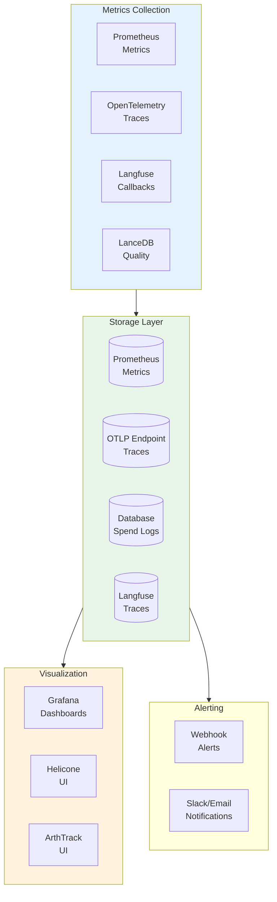

---

## 2. Metrics

### 2.1 Bifrost Metrics

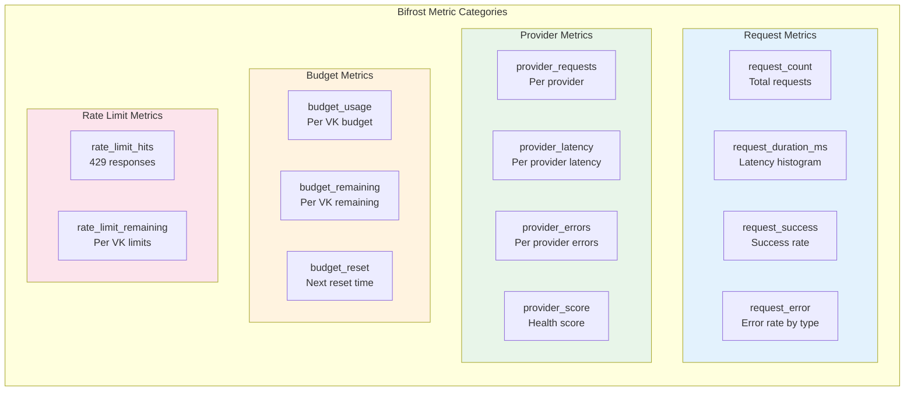

```go
// Bifrost metrics definitions
var (
    // Request metrics
    RequestTotal = prometheus.NewCounterVec(
        prometheus.CounterOpts{
            Name: "bifrost_requests_total",
            Help: "Total number of requests",
        },
        []string{"model", "provider", "virtual_key_id"},
    )
    
    RequestDuration = prometheus.NewHistogramVec(
        prometheus.HistogramOpts{
            Name:    "bifrost_request_duration_ms",
            Help:    "Request duration in milliseconds",
            Buckets: []float64{100, 500, 1000, 2000, 5000, 10000},
        },
        []string{"model", "provider"},
    )
    
    // Provider metrics
    ProviderScore = prometheus.NewGaugeVec(
        prometheus.GaugeOpts{
            Name: "bifrost_provider_score",
            Help: "Provider health score (0-1)",
        },
        []string{"provider", "model"},
    )
    
    // Budget metrics
    BudgetUsage = prometheus.NewGaugeVec(
        prometheus.GaugeOpts{
            Name: "bifrost_budget_usage",
            Help: "Current budget usage in USD",
        },
        []string{"virtual_key_id", "budget_id"},
    )
)
```

### 2.2 LiteLLM Metrics

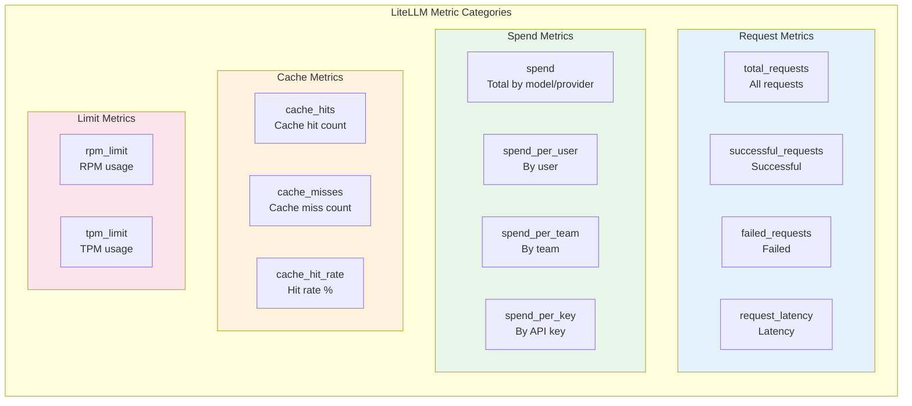

```python
# LiteLLM metrics (Prometheus)
LITELLM_METRICS = {
    "total_requests": Counter(
        "litellm_total_requests",
        "Total number of requests",
        ["model", "user", "team"]
    ),
    
    "total_spend": Counter(
        "litellm_total_spend",
        "Total spend in USD",
        ["model", "provider", "user"]
    ),
    
    "request_latency": Histogram(
        "litellm_request_latency",
        "Request latency in seconds",
        ["model", "provider"],
        buckets=[0.1, 0.5, 1, 2, 5, 10]
    ),
    
    "cache_hit_total": Counter(
        "litellm_cache_hit_total",
        "Total cache hits"
    ),
    
    "rpm_limit": Gauge(
        "litellm_rpm_limit",
        "RPM limit usage",
        ["api_key"]
    ),
}
```

### 2.3 Metrics Comparison

| Category | Bifrost | LiteLLM |
|----------|---------|---------|
| **Request Count** | ✅ `request_total` | ✅ `total_requests` |
| **Latency** | ✅ Histogram | ✅ Histogram |
| **Success Rate** | ✅ `request_success` | ✅ `successful_requests` |
| **Error Rate** | ✅ `request_error` | ✅ `failed_requests` |
| **Provider Score** | ✅ `provider_score` | ❌ |
| **Budget Usage** | ✅ `budget_usage` | ✅ `spend` |
| **Cache Hits** | ❌ | ✅ `cache_hit_total` |
| **Rate Limits** | ✅ `rate_limit_hits` | ✅ `rpm_limit` |

---

## 3. Tracing

### 3.1 Bifrost Tracing

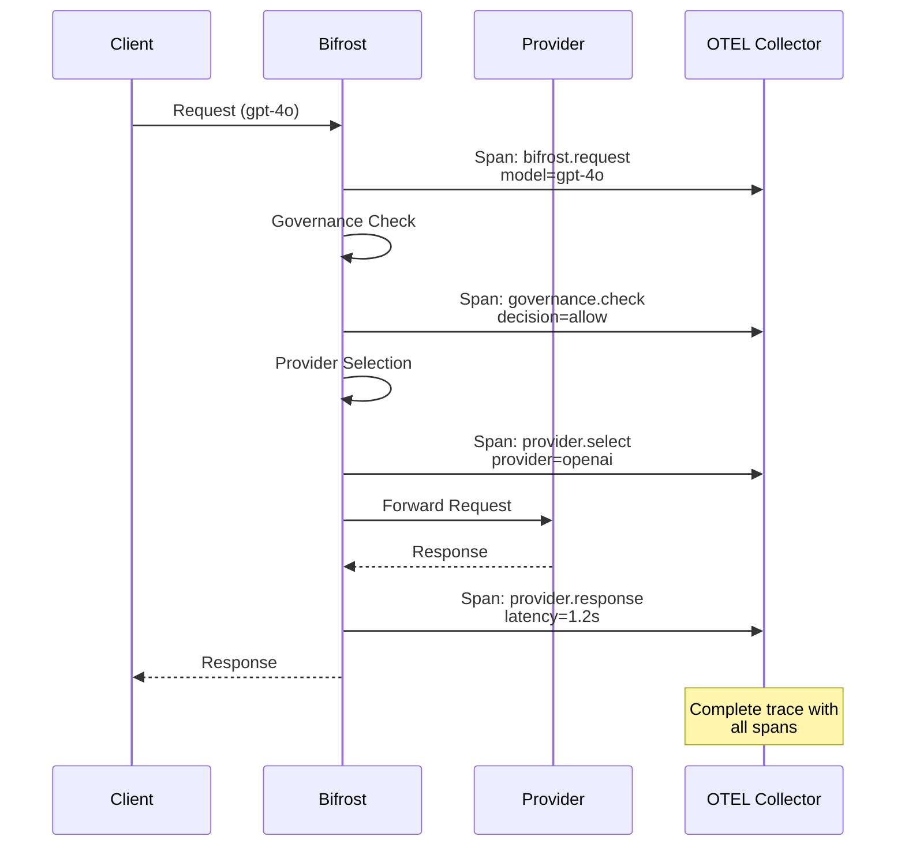

```go
// Bifrost tracing spans
func (b *Bifrost) handleRequest(ctx context.Context, req *LLMRequest) (*Response, error) {
    // Start root span
    ctx, span := otel.Tracer("bifrost").Start(ctx, "bifrost.request")
    defer span.End()
    
    span.SetAttributes(
        attribute.String("model", req.Model),
        attribute.String("virtual_key_id", req.VKID),
    )
    
    // Governance check span
    ctx, govSpan := otel.Tracer("bifrost").Start(ctx, "governance.check")
    govResult, err := b.governance.Check(ctx, req)
    govSpan.SetAttributes(
        attribute.String("decision", string(govResult.Decision)),
    )
    govSpan.End()
    
    // Provider selection span
    ctx, provSpan := otel.Tracer("bifrost").Start(ctx, "provider.select")
    provider, err := b.router.Select(ctx, req)
    provSpan.SetAttributes(
        attribute.String("provider", provider.Name),
    )
    provSpan.End()
    
    // Execute request with provider span
    resp, err := b.executeWithTracing(ctx, provider, req)
    
    return resp, err
}
```

### 3.2 LiteLLM Tracing

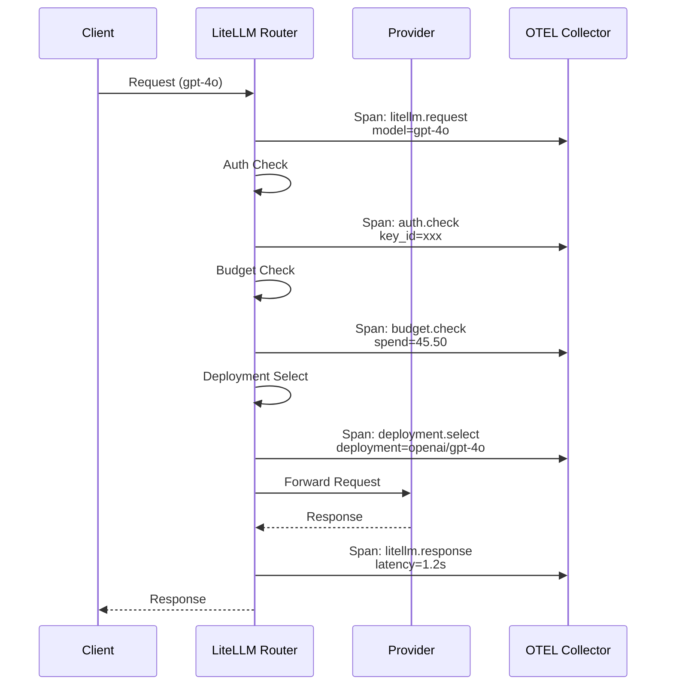

```python
# LiteLLM tracing with OpenTelemetry
from opentelemetry import trace

tracer = trace.get_tracer("litellm")

@asynccontextmanager
async def traced_completion(model: str, messages: List[Dict]):
    with tracer.start_as_current_span("litellm.request") as span:
        span.set_attribute("model", model)
        
        # Auth check
        with tracer.start_as_current_span("auth.check"):
            await auth_check()
        
        # Budget check
        with tracer.start_as_current_span("budget.check"):
            await budget_check()
        
        # Deployment selection
        with tracer.start_as_current_span("deployment.select"):
            deployment = await select_deployment()
            span.set_attribute("deployment", deployment.id)
        
        # Execute
        with tracer.start_as_current_span("llm.call"):
            response = await call_provider(deployment)
        
        return response
```

### 3.3 Tracing Comparison

| Aspect | Bifrost | LiteLLM |
|--------|---------|---------|
| **Format** | OTLP | OTLP |
| **Spans** | Governance, Select, Execute | Auth, Budget, Deploy, Call |
| **Attributes** | VK ID, Provider, Model | Key ID, Team, Model |
| **Parent Span** | Request-level | Request-level |
| **Error Recording** | ✅ | ✅ |
| **Custom Spans** | ✅ | ✅ |

---

## 4. Logging

### 4.1 Bifrost Logging

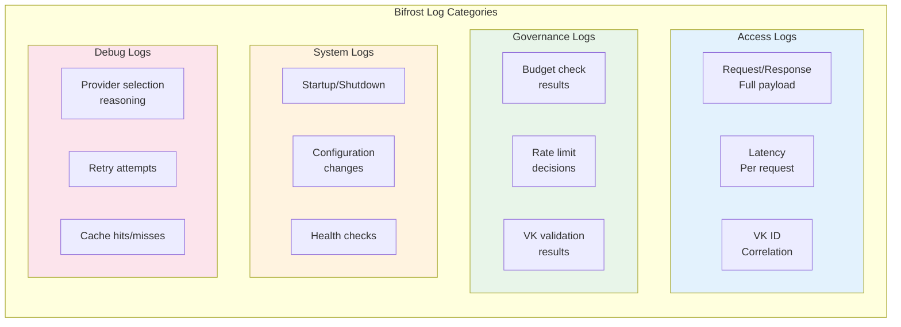

```go
// Bifrost structured logging
type LogEntry struct {
    Timestamp   time.Time `json:"timestamp"`
    Level       string    `json:"level"`
    Message     string    `json:"message"`
    VirtualKey  string    `json:"virtual_key_id,omitempty"`
    RequestID   string    `json:"request_id"`
    Model       string    `json:"model,omitempty"`
    Provider    string    `json:"provider,omitempty"`
    LatencyMs   int64     `json:"latency_ms,omitempty"`
    Error       string    `json:"error,omitempty"`
    Metadata    map[string]interface{} `json:"metadata,omitempty"`
}

// Example log entries
logger.Info("Request completed",
    "virtual_key_id", vk.ID,
    "request_id", requestID,
    "model", "gpt-4o",
    "provider", "openai",
    "latency_ms", 1200,
    "status", "success",
)

logger.Info("Governance check",
    "virtual_key_id", vk.ID,
    "decision", "allow",
    "budget_remaining", 54.50,
    "rate_limit_remaining", 75000,
)
```

### 4.2 LiteLLM Logging

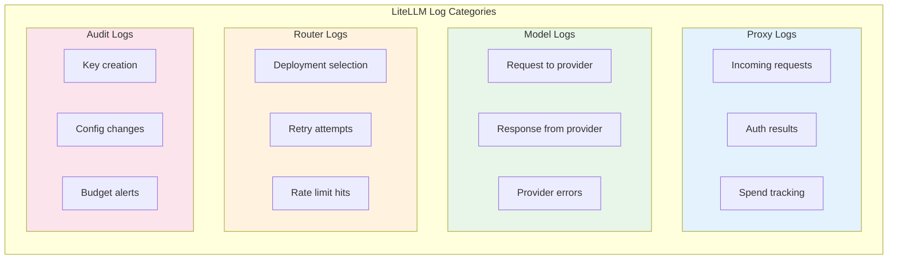

```python
# LiteLLM structured logging
import logging
from litellm.proxy.utils import LogHandler

# Configure logging
logging.basicConfig(
    format='%(asctime)s - %(name)s - %(levelname)s - %(message)s'
)

# Request logging
logger.info(
    f"Request completed:",
    extra={
        "model": "gpt-4",
        "user": user_id,
        "team": team_id,
        "spend": 0.05,
        "latency": 1.2,
        "status": "success"
    }
)

# Spend tracking log
logger.info(
    f"Spend logged:",
    extra={
        "api_key": api_key[:8] + "...",
        "model": "gpt-4",
        "spend": 0.05,
        "total_spend": 45.50,
        "budget_remaining": 54.50
    }
)
```

### 4.3 Logging Comparison

| Aspect | Bifrost | LiteLLM |
|--------|---------|---------|
| **Format** | Structured JSON | Structured JSON |
| **Request Logging** | ✅ Full payload | ✅ Lite |
| **Governance Logs** | ✅ | Via callbacks |
| **Spend Logs** | ✅ | ✅ |
| **Audit Logs** | ✅ | ✅ |
| **Debug Logs** | ✅ | Via verbose |
| **Log Levels** | DEBUG, INFO, WARN, ERROR | DEBUG, INFO, WARNING, ERROR |

---

## 5. Alerting

### 5.1 Bifrost Alerting

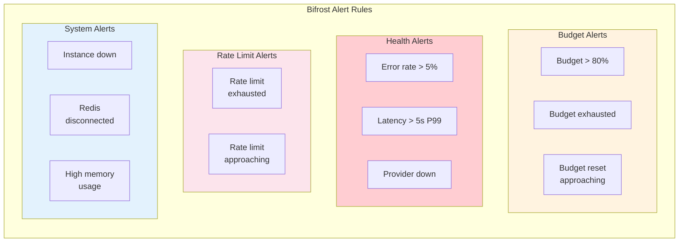

```yaml
# Bifrost alert rules (Prometheus/Alertmanager)
groups:
  - name: bifrost.budget
    rules:
      - alert: BudgetExhausted
        expr: bifrost_budget_usage / bifrost_budget_limit >= 1.0
        for: 1m
        labels:
          severity: critical
        annotations:
          summary: "Budget exhausted for VK {{ $labels.virtual_key_id }}"
          description: "Budget usage at {{ $value | humanizePercentage }}"
      
      - alert: BudgetWarning
        expr: bifrost_budget_usage / bifrost_budget_limit >= 0.8
        for: 5m
        labels:
          severity: warning
        annotations:
          summary: "Budget warning for VK {{ $labels.virtual_key_id }}"
  
  - name: bifrost.health
    rules:
      - alert: HighErrorRate
        expr: rate(bifrost_request_error_total[5m]) / rate(bifrost_requests_total[5m]) > 0.05
        for: 2m
        labels:
          severity: critical
```

### 5.2 LiteLLM Alerting

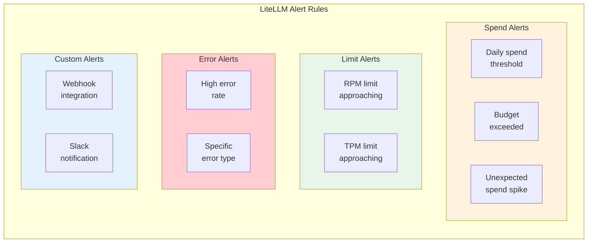

```yaml
# LiteLLM alerting configuration
litellm_settings:
  # Slack alerting
  alert_types:
    - "spending_limit_exceeded"
    - "budget_exceeded"
    - "llm_api_error"
  
  alerting webhook:
    url: "https://hooks.slack.com/..."
    level: "all"  # or "error" only
    
  # Alerting thresholds
  max_budget_alert:
    enabled: true
    threshold: 0.8  # Alert at 80% of budget
  
  daily_spend_alert:
    enabled: true
    threshold: 100.00  # Alert if daily spend exceeds $100
```

### 5.3 Alerting Comparison

| Alert Type | Bifrost | LiteLLM |
|------------|---------|---------|
| **Budget Exhausted** | ✅ Prometheus | ✅ Webhook |
| **Budget Warning** | ✅ 80% threshold | ✅ Configurable |
| **High Error Rate** | ✅ Prometheus | ✅ Via callbacks |
| **High Latency** | ✅ P99 threshold | ❌ Built-in |
| **Rate Limit** | ✅ Prometheus | ❌ Built-in |
| **Slack Alert** | Via Alertmanager | ✅ Native |
| **Webhook** | Via Alertmanager | ✅ Native |
| **Custom Rules** | ✅ Prometheus | ❌ Limited |

---

## 6. Dashboard & UI

### 6.1 Bifrost Dashboard

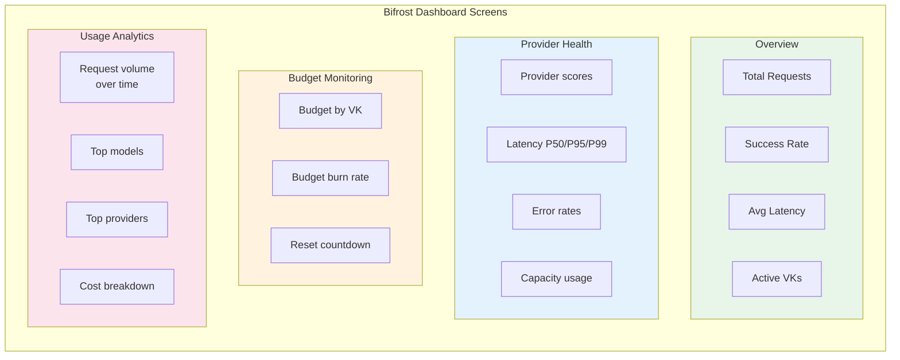

### 6.2 LiteLLM Dashboard

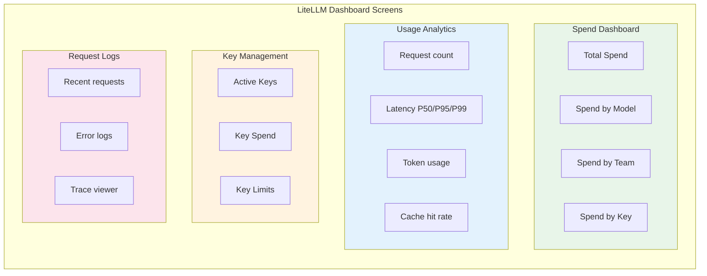

### 6.3 Dashboard Comparison

| Screen | Bifrost | LiteLLM |
|--------|---------|---------|
| **Overview** | ✅ | ✅ |
| **Request Volume** | ✅ | ✅ |
| **Latency** | ✅ P50/P95/P99 | ✅ P50/P95/P99 |
| **Error Rate** | ✅ | ✅ |
| **Budget/Spend** | ✅ | ✅ |
| **Provider Health** | ✅ | ❌ |
| **Provider Scores** | ✅ | ❌ |
| **Key Management** | ✅ | ✅ |
| **Request Logs** | ✅ | ✅ |
| **Trace Viewer** | Via OTEL | Via Langfuse |

---

## 7. Cost Attribution

### 7.1 Bifrost Cost Attribution

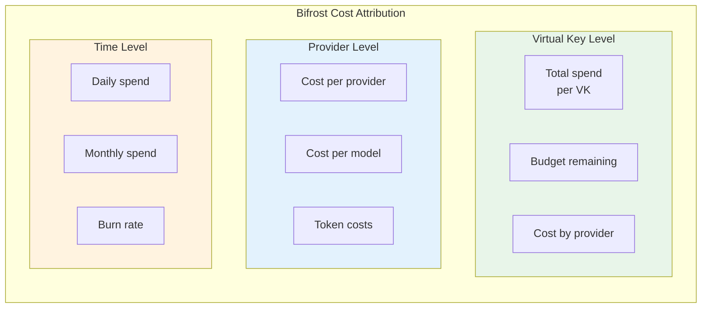

```go
// Bifrost cost calculation
type CostBreakdown struct {
    VirtualKeyID string
    TotalUSD     float64
    
    ByProvider map[string]float64
    ByModel    map[string]float64
    ByDay      map[string]float64
    
    TokensUsed    int64
    AvgCostPerToken float64
}

// Calculate cost per VK
func (c *CostTracker) GetCostBreakdown(vkID string) (*CostBreakdown, error) {
    breakdown := &CostBreakdown{
        VirtualKeyID: vkID,
        ByProvider:   make(map[string]float64),
        ByModel:      make(map[string]float64),
        ByDay:        make(map[string]float64),
    }
    
    // Query all requests for VK
    requests, err := c.store.GetRequestsForVK(vkID)
    for _, req := range requests {
        cost := calculateCost(req.Model, req.TokensUsed)
        breakdown.TotalUSD += cost
        breakdown.ByProvider[req.Provider] += cost
        breakdown.ByModel[req.Model] += cost
        breakdown.ByDay[req.Timestamp.Format("2006-01-02")] += cost
        breakdown.TokensUsed += req.TokensUsed
    }
    
    return breakdown, nil
}
```

### 7.2 LiteLLM Cost Attribution

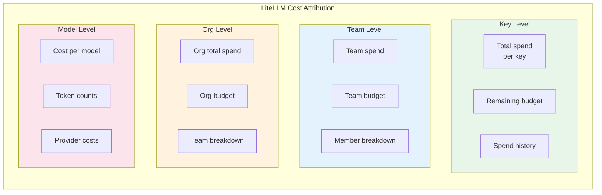

```python
# LiteLLM cost tracking
async def log_spend(
    api_key: str,
    model: str,
    provider: str,
    tokens_used: int,
    cost: float,
    user_id: Optional[str] = None,
    team_id: Optional[str] = None,
):
    # Log to database
    await db.litellm_spend_logs.insert(
        api_key=api_key,
        model=model,
        provider=provider,
        total_tokens=tokens_used,
        spend=cost,
        user_id=user_id,
        team_id=team_id,
        timestamp=datetime.utcnow(),
    )
    
    # Update Redis counters
    await redis.incr(f"spend:key:{api_key}", cost)
    await redis.incr(f"spend:team:{team_id}", cost)
    await redis.incr(f"spend:model:{model}", cost)

# Get spend by key
async def get_key_spend(api_key: str) -> float:
    return await redis.get(f"spend:key:{api_key}")

# Get spend by team
async def get_team_spend(team_id: str) -> float:
    return await redis.get(f"spend:team:{team_id}")
```

### 7.3 Cost Attribution Comparison

| Attribution | Bifrost | LiteLLM |
|-------------|---------|---------|
| **Per VK/Key** | ✅ | ✅ |
| **Per Team** | ✅ | ✅ |
| **Per Org** | ❌ (Customer) | ✅ |
| **Per Provider** | ✅ | ✅ |
| **Per Model** | ✅ | ✅ |
| **Per Day** | ✅ | ✅ |
| **Token Count** | ✅ | ✅ |
| **Real-time** | ✅ Redis | ✅ Redis |

---

## 8. Export & Integration

### 8.1 Bifrost Export

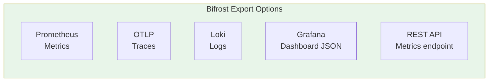

### 8.2 LiteLLM Export

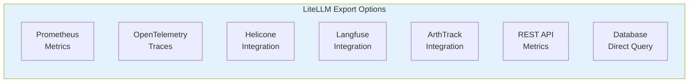

### 8.3 Export Comparison

| Export | Bifrost | LiteLLM |
|--------|---------|---------|
| **Prometheus** | ✅ `/metrics` | ✅ `/metrics` |
| **OTLP Traces** | ✅ | ✅ |
| **Loki Logs** | ✅ | Via callbacks |
| **Grafana** | ✅ JSON | ✅ |
| **Helicone** | ❌ | ✅ |
| **Langfuse** | ❌ | ✅ |
| **ArthTrack** | ❌ | ✅ |
| **REST API** | ✅ | ✅ |
| **DB Direct** | ❌ | ✅ |

---

## 9. Key Feature Matrix

| Feature | Bifrost | LiteLLM |
|---------|---------|---------|
| Prometheus metrics | ✅ | ✅ |
| OTLP tracing | ✅ | ✅ |
| Structured logging | ✅ | ✅ |
| Budget alerts | ✅ | ✅ |
| Spend tracking | ✅ | ✅ |
| Provider scores | ✅ | ❌ |
| Latency P50/P95/P99 | ✅ | ✅ |
| Cache metrics | ❌ | ✅ |
| Grafana dashboards | ✅ | ✅ |
| Slack alerting | Via Alertmanager | ✅ Native |
| Webhook alerts | Via Alertmanager | ✅ Native |
| Third-party integrations | Limited | Langfuse, Helicone |

---

## 10. Summary

### Bifrost Advantages
- **Provider scoring**: Health scores enable proactive alerting
- **Provider-level metrics**: Granular provider monitoring
- **Built-in Grafana**: Complete observability stack
- **Governance logging**: Full audit trail
- **Prometheus-native**: Standard metrics format

### LiteLLM Advantages
- **Third-party integrations**: Helicone, Langfuse, ArthTrack
- **Cache metrics**: Built-in cache hit rate
- **Team/Org hierarchy**: Multi-level spend attribution
- **Slack alerts**: Native integration
- **Larger ecosystem**: More export options

---

**Next Steps:**
- [ ] Research: Provider Support Deep Comparison
- [ ] Research: Architecture Deep Comparison
- [ ] Create decision matrix for CipherOcto integration
- [ ] Update main comparison document with links